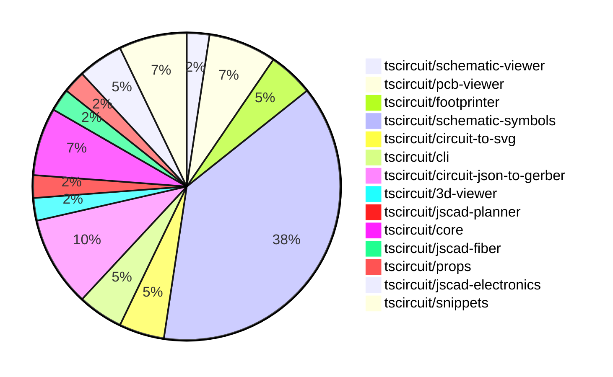

# contribution-tracker

Generates weekly contribution overviews for tscircuit contributors. Check out all
the [contribution overviews here](./contribution-overviews/)

* All PRs in the tscircuit org are scanned/summarized via Claude Haiku
* Claude classifies each Diff/PR as a Major, Minor or Tiny contribution
* All the PRs, summaries, and classifications are organized into charts and tables

The current week is shown below. There are 3 major sections:

* [Contributor Overview](#contributor-overview)
* [PRs by Repository](#prs-by-repository)
* [PRs by Contributor](#changes-by-contributor)

## Current Week

<!-- START_CURRENT_WEEK -->

# Contribution Overview 2024-09-28

## PRs by Repository

## Contributor Overview

| Contributor | 🐳 Major | 🐙 Minor | 🐌 Tiny |
|-------------|-------|-------|-------|
| DhairyaMajmudar | 1 | 0 | 0 |
| anas-sarkez | 6 | 4 | 0 |
| ShiboSoftwareDev | 4 | 2 | 0 |
| seveibar | 7 | 3 | 0 |
| imrishabh18 | 2 | 3 | 0 |
| abhijitxy | 0 | 1 | 0 |
| Timer00 | 3 | 1 | 0 |
| Abse2001 | 1 | 1 | 0 |
| Complexlity | 1 | 1 | 1 |

## Changes by Repository

### [tscircuit/schematic-viewer](https://github.com/tscircuit/schematic-viewer)

| PR # | Impact | Contributor | Description |
|------|--------|-------------|-------------|
| [#64](https://github.com/tscircuit/schematic-viewer/pull/64) | 🐳 Major | DhairyaMajmudar | Replaced the types in core.ts files with those exported from the `circuit-json` package. |

### [tscircuit/pcb-viewer](https://github.com/tscircuit/pcb-viewer)

| PR # | Impact | Contributor | Description |
|------|--------|-------------|-------------|
| [#61](https://github.com/tscircuit/pcb-viewer/pull/61) | 🐳 Major | anas-sarkez | Added hotkeys for all layers |
| [#67](https://github.com/tscircuit/pcb-viewer/pull/67) | 🐙 Minor | anas-sarkez | The change ensures that the `useHotKey` hook only triggers when the window is active and the user is interacting with the container. |
| [#65](https://github.com/tscircuit/pcb-viewer/pull/65) | 🐙 Minor | anas-sarkez | Replace the deprecated `AnySoupElement` type with the new `AnyCircuitElement` type in various parts of the codebase. |

### [tscircuit/footprinter](https://github.com/tscircuit/footprinter)

| PR # | Impact | Contributor | Description |
|------|--------|-------------|-------------|
| [#49](https://github.com/tscircuit/footprinter/pull/49) | 🐳 Major | anas-sarkez | Implement _silkscreenpins for dip components |
| [#47](https://github.com/tscircuit/footprinter/pull/47) | 🐳 Major | seveibar | Create an axial footprint and add circuitJson |

### [tscircuit/schematic-symbols](https://github.com/tscircuit/schematic-symbols)

| PR # | Impact | Contributor | Description |
|------|--------|-------------|-------------|
| [#85](https://github.com/tscircuit/schematic-symbols/pull/85) | 🐳 Major | anas-sarkez | Added a new tunnel diode component with paths and text elements. |
| [#82](https://github.com/tscircuit/schematic-symbols/pull/82) | 🐳 Major | anas-sarkez | Added an avalanche diode symbol to the project. |
| [#81](https://github.com/tscircuit/schematic-symbols/pull/81) | 🐳 Major | anas-sarkez | Added a new zener diode symbol. |
| [#75](https://github.com/tscircuit/schematic-symbols/pull/75) | 🐳 Major | anas-sarkez | Added Schottky diode symbol |
| [#72](https://github.com/tscircuit/schematic-symbols/pull/72) | 🐳 Major | seveibar | The pull request introduces a new photodiode symbol, makes the `bun run generate` command interactive, and fixes issue #61. |
| [#94](https://github.com/tscircuit/schematic-symbols/pull/94) | 🐳 Major | Timer00 | Introduce a new AC voltmeter symbol |
| [#89](https://github.com/tscircuit/schematic-symbols/pull/89) | 🐳 Major | Timer00 | This pull request introduces type guards for various drawing types, allowing for better type checking and validation when working with symbols and their primitives. |
| [#74](https://github.com/tscircuit/schematic-symbols/pull/74) | 🐳 Major | Timer00 | Introduce a new DC voltmeter symbol |
| [#21](https://github.com/tscircuit/schematic-symbols/pull/21) | 🐳 Major | Abse2001 | Added new symbols for push button normally open momentary in horizontal and vertical orientations. |
| [#80](https://github.com/tscircuit/schematic-symbols/pull/80) | 🐙 Minor | anas-sarkez | Added a new varactor diode symbol. |
| [#98](https://github.com/tscircuit/schematic-symbols/pull/98) | 🐙 Minor | seveibar | Update the "vercel-build" script to run both the "build" and the "./scripts/build.ts" scripts. |
| [#86](https://github.com/tscircuit/schematic-symbols/pull/86) | 🐙 Minor | imrishabh18 | Fix a reference point added for port |
| [#73](https://github.com/tscircuit/schematic-symbols/pull/73) | 🐙 Minor | imrishabh18 | Fixes an issue with the lockfile being frozen. |
| [#22](https://github.com/tscircuit/schematic-symbols/pull/22) | 🐙 Minor | imrishabh18 | Added port reference for trace fix in core |
| [#76](https://github.com/tscircuit/schematic-symbols/pull/76) | 🐙 Minor | Timer00 | Add a formatting step to the symbol adding instructions |
| [#23](https://github.com/tscircuit/schematic-symbols/pull/23) | 🐙 Minor | Abse2001 | Fixed the position of the ref and val text blocks so they will always grow away from the symbols. |

### [tscircuit/circuit-to-svg](https://github.com/tscircuit/circuit-to-svg)

| PR # | Impact | Contributor | Description |
|------|--------|-------------|-------------|
| [#81](https://github.com/tscircuit/circuit-to-svg/pull/81) | 🐳 Major | imrishabh18 | Introduces a new feature to convert circuit JSON to schematic SVG with KiCAD-style styling. |
| [#80](https://github.com/tscircuit/circuit-to-svg/pull/80) | 🐙 Minor | anas-sarkez | Removed the cleaning of text by removing regular expressions |

### [tscircuit/cli](https://github.com/tscircuit/cli)

| PR # | Impact | Contributor | Description |
|------|--------|-------------|-------------|
| [#212](https://github.com/tscircuit/cli/pull/212) | 🐳 Major | ShiboSoftwareDev | Fixed a filepath bug in the codebase. |
| [#213](https://github.com/tscircuit/cli/pull/213) | 🐙 Minor | ShiboSoftwareDev | Fixes an issue with the `popoverContent` index in the `select-example-search` component. |

### [tscircuit/circuit-json-to-gerber](https://github.com/tscircuit/circuit-json-to-gerber)

| PR # | Impact | Contributor | Description |
|------|--------|-------------|-------------|
| [#14](https://github.com/tscircuit/circuit-json-to-gerber/pull/14) | 🐳 Major | ShiboSoftwareDev | Adds the handling of PCB vias in the Gerber file generation. |
| [#11](https://github.com/tscircuit/circuit-json-to-gerber/pull/11) | 🐳 Major | ShiboSoftwareDev | Implemented support for PCB holes in Excellon drill and soldermask, and updated the repository to use circuit-json instead of tscircuit-soup. |
| [#9](https://github.com/tscircuit/circuit-json-to-gerber/pull/9) | 🐳 Major | ShiboSoftwareDev | Fixed the gerber units to work with JLCPCB and PCBWay |
| [#13](https://github.com/tscircuit/circuit-json-to-gerber/pull/13) | 🐙 Minor | ShiboSoftwareDev | The pull request changes the rendering of `pcb_plated_hole` elements from an outline to a copper/soldermask fill. |

### [tscircuit/3d-viewer](https://github.com/tscircuit/3d-viewer)

| PR # | Impact | Contributor | Description |
|------|--------|-------------|-------------|
| [#23](https://github.com/tscircuit/3d-viewer/pull/23) | 🐳 Major | seveibar | Improve README, add support for 3D components generated by footprint |

### [tscircuit/jscad-planner](https://github.com/tscircuit/jscad-planner)

| PR # | Impact | Contributor | Description |
|------|--------|-------------|-------------|
| [#3](https://github.com/tscircuit/jscad-planner/pull/3) | 🐳 Major | seveibar | Implement cuboid and polygon primitives in the JSCAD library. |

### [tscircuit/core](https://github.com/tscircuit/core)

| PR # | Impact | Contributor | Description |
|------|--------|-------------|-------------|
| [#132](https://github.com/tscircuit/core/pull/132) | 🐳 Major | seveibar | Create a `cad_component` for any component with a footprint |
| [#130](https://github.com/tscircuit/core/pull/130) | 🐳 Major | seveibar | Add errors when there's a missing footprint for a port. |
| [#133](https://github.com/tscircuit/core/pull/133) | 🐳 Major | imrishabh18 | Fix the design of the `Chip` component, including changes to imports and methods. |

### [tscircuit/jscad-fiber](https://github.com/tscircuit/jscad-fiber)

| PR # | Impact | Contributor | Description |
|------|--------|-------------|-------------|
| [#78](https://github.com/tscircuit/jscad-fiber/pull/78) | 🐳 Major | seveibar | Convert the project from npm to bun and fix the grid orientation with the z-axis up. |

### [tscircuit/props](https://github.com/tscircuit/props)

| PR # | Impact | Contributor | Description |
|------|--------|-------------|-------------|
| [#55](https://github.com/tscircuit/props/pull/55) | 🐙 Minor | seveibar | Update the `schematicPinDefinitions.ts` file to improve the `SchematicPortArrangement` type definition. |

### [tscircuit/jscad-electronics](https://github.com/tscircuit/jscad-electronics)

| PR # | Impact | Contributor | Description |
|------|--------|-------------|-------------|
| [#46](https://github.com/tscircuit/jscad-electronics/pull/46) | 🐙 Minor | seveibar | Add build system, checkpoint axis flipping |
| [#45](https://github.com/tscircuit/jscad-electronics/pull/45) | 🐙 Minor | abhijitxy | Fix the positioning of the BGA component on the side |

### [tscircuit/snippets](https://github.com/tscircuit/snippets)

| PR # | Impact | Contributor | Description |
|------|--------|-------------|-------------|
| [#9](https://github.com/tscircuit/snippets/pull/9) | 🐳 Major | Complexlity | Add a new dropdown component to the header |
| [#6](https://github.com/tscircuit/snippets/pull/6) | 🐙 Minor | Complexlity | Remove the package-lock.json file, leaving only the bun.lockb file. |
| [#4](https://github.com/tscircuit/snippets/pull/4) | 🐌 Tiny | Complexlity | Update the favicon to match the one used on the tscircuits website. |

## Changes by Contributor

### [DhairyaMajmudar](https://github.com/DhairyaMajmudar)

| PR # | Impact | Description |
|------|--------|-------------|
| [#64](https://github.com/tscircuit/schematic-viewer/pull/64) | 🐳 Major | Replaced the types in core.ts files with those exported from the `circuit-json` package. |

### [anas-sarkez](https://github.com/anas-sarkez)

| PR # | Impact | Description |
|------|--------|-------------|
| [#61](https://github.com/tscircuit/pcb-viewer/pull/61) | 🐳 Major | Added hotkeys for all layers |
| [#49](https://github.com/tscircuit/footprinter/pull/49) | 🐳 Major | Implement _silkscreenpins for dip components |
| [#85](https://github.com/tscircuit/schematic-symbols/pull/85) | 🐳 Major | Added a new tunnel diode component with paths and text elements. |
| [#82](https://github.com/tscircuit/schematic-symbols/pull/82) | 🐳 Major | Added an avalanche diode symbol to the project. |
| [#81](https://github.com/tscircuit/schematic-symbols/pull/81) | 🐳 Major | Added a new zener diode symbol. |
| [#75](https://github.com/tscircuit/schematic-symbols/pull/75) | 🐳 Major | Added Schottky diode symbol |
| [#67](https://github.com/tscircuit/pcb-viewer/pull/67) | 🐙 Minor | The change ensures that the `useHotKey` hook only triggers when the window is active and the user is interacting with the container. |
| [#65](https://github.com/tscircuit/pcb-viewer/pull/65) | 🐙 Minor | Replace the deprecated `AnySoupElement` type with the new `AnyCircuitElement` type in various parts of the codebase. |
| [#80](https://github.com/tscircuit/circuit-to-svg/pull/80) | 🐙 Minor | Removed the cleaning of text by removing regular expressions |
| [#80](https://github.com/tscircuit/schematic-symbols/pull/80) | 🐙 Minor | Added a new varactor diode symbol. |

### [ShiboSoftwareDev](https://github.com/ShiboSoftwareDev)

| PR # | Impact | Description |
|------|--------|-------------|
| [#212](https://github.com/tscircuit/cli/pull/212) | 🐳 Major | Fixed a filepath bug in the codebase. |
| [#14](https://github.com/tscircuit/circuit-json-to-gerber/pull/14) | 🐳 Major | Adds the handling of PCB vias in the Gerber file generation. |
| [#11](https://github.com/tscircuit/circuit-json-to-gerber/pull/11) | 🐳 Major | Implemented support for PCB holes in Excellon drill and soldermask, and updated the repository to use circuit-json instead of tscircuit-soup. |
| [#9](https://github.com/tscircuit/circuit-json-to-gerber/pull/9) | 🐳 Major | Fixed the gerber units to work with JLCPCB and PCBWay |
| [#213](https://github.com/tscircuit/cli/pull/213) | 🐙 Minor | Fixes an issue with the `popoverContent` index in the `select-example-search` component. |
| [#13](https://github.com/tscircuit/circuit-json-to-gerber/pull/13) | 🐙 Minor | The pull request changes the rendering of `pcb_plated_hole` elements from an outline to a copper/soldermask fill. |

### [seveibar](https://github.com/seveibar)

| PR # | Impact | Description |
|------|--------|-------------|
| [#47](https://github.com/tscircuit/footprinter/pull/47) | 🐳 Major | Create an axial footprint and add circuitJson |
| [#23](https://github.com/tscircuit/3d-viewer/pull/23) | 🐳 Major | Improve README, add support for 3D components generated by footprint |
| [#3](https://github.com/tscircuit/jscad-planner/pull/3) | 🐳 Major | Implement cuboid and polygon primitives in the JSCAD library. |
| [#132](https://github.com/tscircuit/core/pull/132) | 🐳 Major | Create a `cad_component` for any component with a footprint |
| [#130](https://github.com/tscircuit/core/pull/130) | 🐳 Major | Add errors when there's a missing footprint for a port. |
| [#78](https://github.com/tscircuit/jscad-fiber/pull/78) | 🐳 Major | Convert the project from npm to bun and fix the grid orientation with the z-axis up. |
| [#72](https://github.com/tscircuit/schematic-symbols/pull/72) | 🐳 Major | The pull request introduces a new photodiode symbol, makes the `bun run generate` command interactive, and fixes issue #61. |
| [#55](https://github.com/tscircuit/props/pull/55) | 🐙 Minor | Update the `schematicPinDefinitions.ts` file to improve the `SchematicPortArrangement` type definition. |
| [#46](https://github.com/tscircuit/jscad-electronics/pull/46) | 🐙 Minor | Add build system, checkpoint axis flipping |
| [#98](https://github.com/tscircuit/schematic-symbols/pull/98) | 🐙 Minor | Update the "vercel-build" script to run both the "build" and the "./scripts/build.ts" scripts. |

### [imrishabh18](https://github.com/imrishabh18)

| PR # | Impact | Description |
|------|--------|-------------|
| [#133](https://github.com/tscircuit/core/pull/133) | 🐳 Major | Fix the design of the `Chip` component, including changes to imports and methods. |
| [#81](https://github.com/tscircuit/circuit-to-svg/pull/81) | 🐳 Major | Introduces a new feature to convert circuit JSON to schematic SVG with KiCAD-style styling. |
| [#86](https://github.com/tscircuit/schematic-symbols/pull/86) | 🐙 Minor | Fix a reference point added for port |
| [#73](https://github.com/tscircuit/schematic-symbols/pull/73) | 🐙 Minor | Fixes an issue with the lockfile being frozen. |
| [#22](https://github.com/tscircuit/schematic-symbols/pull/22) | 🐙 Minor | Added port reference for trace fix in core |

### [abhijitxy](https://github.com/abhijitxy)

| PR # | Impact | Description |
|------|--------|-------------|
| [#45](https://github.com/tscircuit/jscad-electronics/pull/45) | 🐙 Minor | Fix the positioning of the BGA component on the side |

### [Timer00](https://github.com/Timer00)

| PR # | Impact | Description |
|------|--------|-------------|
| [#94](https://github.com/tscircuit/schematic-symbols/pull/94) | 🐳 Major | Introduce a new AC voltmeter symbol |
| [#89](https://github.com/tscircuit/schematic-symbols/pull/89) | 🐳 Major | This pull request introduces type guards for various drawing types, allowing for better type checking and validation when working with symbols and their primitives. |
| [#74](https://github.com/tscircuit/schematic-symbols/pull/74) | 🐳 Major | Introduce a new DC voltmeter symbol |
| [#76](https://github.com/tscircuit/schematic-symbols/pull/76) | 🐙 Minor | Add a formatting step to the symbol adding instructions |

### [Abse2001](https://github.com/Abse2001)

| PR # | Impact | Description |
|------|--------|-------------|
| [#21](https://github.com/tscircuit/schematic-symbols/pull/21) | 🐳 Major | Added new symbols for push button normally open momentary in horizontal and vertical orientations. |
| [#23](https://github.com/tscircuit/schematic-symbols/pull/23) | 🐙 Minor | Fixed the position of the ref and val text blocks so they will always grow away from the symbols. |

### [Complexlity](https://github.com/Complexlity)

| PR # | Impact | Description |
|------|--------|-------------|
| [#9](https://github.com/tscircuit/snippets/pull/9) | 🐳 Major | Add a new dropdown component to the header |
| [#6](https://github.com/tscircuit/snippets/pull/6) | 🐙 Minor | Remove the package-lock.json file, leaving only the bun.lockb file. |
| [#4](https://github.com/tscircuit/snippets/pull/4) | 🐌 Tiny | Update the favicon to match the one used on the tscircuits website. |

<!-- END_CURRENT_WEEK -->
