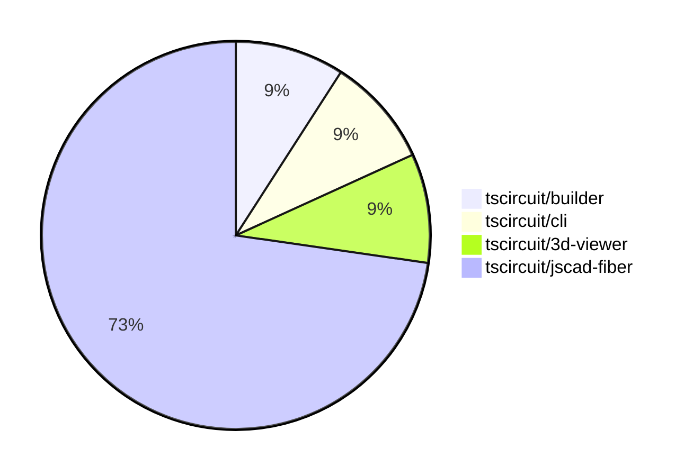

# contribution-tracker

Generates weekly contribution overviews for tscircuit contributors. Check out all
the [contribution overviews here](./contribution-overviews/)

* All PRs in the tscircuit org are scanned/summarized via Claude Haiku
* Claude classifies each Diff/PR as a Major, Minor or Tiny contribution
* All the PRs, summaries, and classifications are organized into charts and tables

The current week is shown below. There are 3 major sections:

* [Contributor Overview](#contributor-overview)
* [PRs by Repository](#prs-by-repository)
* [PRs by Contributor](#changes-by-contributor)

## Current Week

<!-- START_CURRENT_WEEK -->

# Contribution Overview 2024-08-03

## PRs by Repository

## Contributor Overview

| Contributor | 🐳 Major | 🐙 Minor | 🐌 Tiny |
|-------------|-------|-------|-------|
| imrishabh18 | 3 | 0 | 0 |
| Slaviiiii | 1 | 7 | 0 |

## Changes by Repository

### [tscircuit/builder](https://github.com/tscircuit/builder)

| PR # | Impact | Contributor | Description |
|------|--------|-------------|-------------|
| [#95](https://github.com/tscircuit/builder/pull/95) | 🐳 Major | imrishabh18 | Fix the issue of not centering the component when only one prop (e.g., `center.x`) is provided. |

### [tscircuit/cli](https://github.com/tscircuit/cli)

| PR # | Impact | Contributor | Description |
|------|--------|-------------|-------------|
| [#117](https://github.com/tscircuit/cli/pull/117) | 🐳 Major | imrishabh18 | Introduce a debug button in the menu |

### [tscircuit/3d-viewer](https://github.com/tscircuit/3d-viewer)

| PR # | Impact | Contributor | Description |
|------|--------|-------------|-------------|
| [#11](https://github.com/tscircuit/3d-viewer/pull/11) | 🐳 Major | imrishabh18 | Adds better error handling for bad URLs in the `useGlobalObjLoader` hook and displays a fallback box when the URL is invalid. |

### [tscircuit/jscad-fiber](https://github.com/tscircuit/jscad-fiber)

| PR # | Impact | Contributor | Description |
|------|--------|-------------|-------------|
| [#57](https://github.com/tscircuit/jscad-fiber/pull/57) | 🐳 Major | Slaviiiii | Wrap ExtrudeLinear component with color and offset props |
| [#63](https://github.com/tscircuit/jscad-fiber/pull/63) | 🐙 Minor | Slaviiiii | Add color and center properties to the RoundedCylinder component |
| [#62](https://github.com/tscircuit/jscad-fiber/pull/62) | 🐙 Minor | Slaviiiii | Add color and center position properties to the Cylinder component. |
| [#61](https://github.com/tscircuit/jscad-fiber/pull/61) | 🐙 Minor | Slaviiiii | Wrap the `RoundedCuboid` component with a color wrapper to allow setting the color of the cuboid. |
| [#60](https://github.com/tscircuit/jscad-fiber/pull/60) | 🐙 Minor | Slaviiiii | Adds color and center properties to the Cube component and updates the cube.fixture.tsx file accordingly. |
| [#59](https://github.com/tscircuit/jscad-fiber/pull/59) | 🐙 Minor | Slaviiiii | Wrapped the `ExtrudeRotate` component with `withColorProp` and `withOffsetProp` higher-order components to add color and offset properties. |
| [#58](https://github.com/tscircuit/jscad-fiber/pull/58) | 🐙 Minor | Slaviiiii | Wrap the ExtrudeRectangular component with withColorProp and withOffsetProp higher-order components to add color and offset props. |
| [#56](https://github.com/tscircuit/jscad-fiber/pull/56) | 🐙 Minor | Slaviiiii | Wrap ExtrudeHelical component with `withColorProp` and `withOffsetProp` higher-order components. |

## Changes by Contributor

### [imrishabh18](https://github.com/imrishabh18)

| PR # | Impact | Description |
|------|--------|-------------|
| [#95](https://github.com/tscircuit/builder/pull/95) | 🐳 Major | Fix the issue of not centering the component when only one prop (e.g., `center.x`) is provided. |
| [#117](https://github.com/tscircuit/cli/pull/117) | 🐳 Major | Introduce a debug button in the menu |
| [#11](https://github.com/tscircuit/3d-viewer/pull/11) | 🐳 Major | Adds better error handling for bad URLs in the `useGlobalObjLoader` hook and displays a fallback box when the URL is invalid. |

### [Slaviiiii](https://github.com/Slaviiiii)

| PR # | Impact | Description |
|------|--------|-------------|
| [#57](https://github.com/tscircuit/jscad-fiber/pull/57) | 🐳 Major | Wrap ExtrudeLinear component with color and offset props |
| [#63](https://github.com/tscircuit/jscad-fiber/pull/63) | 🐙 Minor | Add color and center properties to the RoundedCylinder component |
| [#62](https://github.com/tscircuit/jscad-fiber/pull/62) | 🐙 Minor | Add color and center position properties to the Cylinder component. |
| [#61](https://github.com/tscircuit/jscad-fiber/pull/61) | 🐙 Minor | Wrap the `RoundedCuboid` component with a color wrapper to allow setting the color of the cuboid. |
| [#60](https://github.com/tscircuit/jscad-fiber/pull/60) | 🐙 Minor | Adds color and center properties to the Cube component and updates the cube.fixture.tsx file accordingly. |
| [#59](https://github.com/tscircuit/jscad-fiber/pull/59) | 🐙 Minor | Wrapped the `ExtrudeRotate` component with `withColorProp` and `withOffsetProp` higher-order components to add color and offset properties. |
| [#58](https://github.com/tscircuit/jscad-fiber/pull/58) | 🐙 Minor | Wrap the ExtrudeRectangular component with withColorProp and withOffsetProp higher-order components to add color and offset props. |
| [#56](https://github.com/tscircuit/jscad-fiber/pull/56) | 🐙 Minor | Wrap ExtrudeHelical component with `withColorProp` and `withOffsetProp` higher-order components. |

<!-- END_CURRENT_WEEK -->
