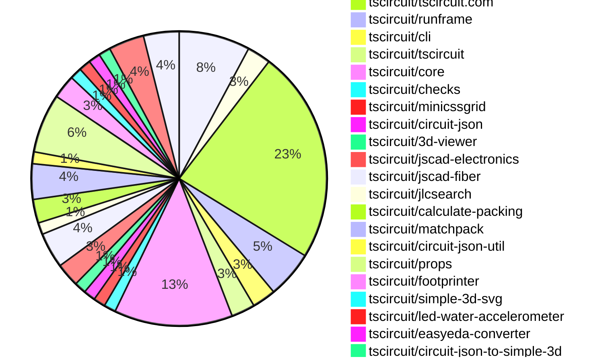
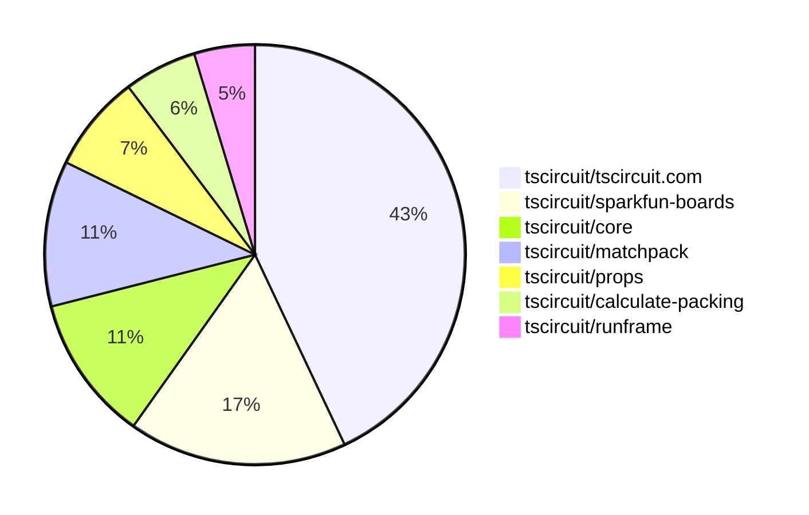

# contribution-tracker

[contributions.tscircuit.com](https://contributions.tscircuit.com) ・ [tscircuit.com](https://tscircuit.com) ・ [Contribution Overviews](./contribution-overviews/) ・ [Changelogs](./changelogs/)

Generates weekly contribution overviews for tscircuit contributors. Check out all
the [contribution overviews here](./contribution-overviews/)
You can find AI-generated monthly changelogs in the [changelogs directory](./changelogs/).

- All PRs in the tscircuit org are scanned/summarized via an LLM
- The LLM classifies each Diff/PR as into a set of attributes for scoring
- All the PRs, summaries, and classifications are organized into charts and tables for [the website](https://contributions.tscircuit.com)

> Want to run locally? See the [Development Section](#development)

The current week is shown below. There are 3 major sections:

- [Contributor Overview](#contributor-overview)
- [PRs by Repository](#prs-by-repository)
- [PRs by Contributor](#changes-by-contributor)

## Current Week

<!-- START_CURRENT_WEEK -->

# Contribution Overview 2025-08-13

## PRs by Repository



## Contributor Overview

| Contributor | 🐳 Major | 🐙 Minor | 🐌 Tiny | ⭐ | Score | Discussion Contributions |
|-------------|---------|---------|---------|-----|----------------|--------------------------|
| [seveibar](#seveibar) | 6 | 2 | 8 | 👑 | 51 | 0🔹 0🔶 0💎 |
| [ArnavK-09](#ArnavK-09) | 4 | 3 | 8 | ⭐⭐⭐ | 33 | 0🔹 0🔶 0💎 |
| [imrishabh18](#imrishabh18) | 1 | 2 | 13 | ⭐⭐ | 23 | 0🔹 0🔶 0💎 |
| [ShiboSoftwareDev](#ShiboSoftwareDev) | 3 | 0 | 4 | ⭐⭐ | 20 | 0🔹 0🔶 0💎 |
| [abimaelmartell](#abimaelmartell) | 2 | 3 | 2 | ⭐⭐ | 16 | 0🔹 0🔶 0💎 |
| [MustafaMulla29](#MustafaMulla29) | 2 | 1 | 2 | ⭐⭐ | 12 | 0🔹 0🔶 0💎 |
| [techmannih](#techmannih) | 0 | 2 | 1 | ⭐ | 10 | 0🔹 0🔶 0💎 |
| [pxlpal](#pxlpal) | 0 | 1 | 3 | ⭐ | 5 | 0🔹 0🔶 0💎 |
| [Abse2001](#Abse2001) | 1 | 0 | 0 | ⭐ | 4 | 0🔹 0🔶 0💎 |
| [tscircuitbot](#tscircuitbot) | 0 | 0 | 3 |  | 3 | 0🔹 0🔶 0💎 |

### Discussion Contribution Legend

- 🔹 Normal Comments: Basic participation with minimal effort
- 🔶 Great Informative Comments: Thoughtful participation that adds value
- 💎 Incredible Comments: Exceptional participation with high-quality content

## Review Table

[reviews-received-hover]: ## "Number of reviews received for PRs for this contributor"
[approvals-received-hover]: ## "Number of approvals received for PRs this contributor authored"
[rejections-received-hover]: ## "Number of rejections received for PRs this contributor authored"
[prs-opened-hover]: ## "Number of PRs opened by this contributor"
[issues-created-hover]: ## "Number of issues created by this contributor"
[bountied-issues-hover]: ## "Number of issues this contributor created with a bounty"
[bountied-issue-$-hover]: ## "Total bounty amount placed on issues authored by this contributor"

| Contributor | Reviews Received | Approvals Received | Rejections Received | Approvals | Rejections | PRs Opened | PRs Merged | Score | Issues Created | Bountied Issues | Bountied Issue $ |
|---|---|---|---|---|---|---|---|---|---|---|---|
| [MustafaMulla29](#MustafaMulla29) | 12 | 5 | 5 | 0 | 0 | 6 | 5 | 12 | 0 | 0 | 0 |
| [seveibar](#seveibar) | 4 | 1 | 0 | 43 | 5 | 22 | 16 | 51 | 0 | 0 | 0 |
| [imrishabh18](#imrishabh18) | 15 | 8 | 1 | 3 | 3 | 17 | 16 | 23 | 0 | 0 | 0 |
| [ShiboSoftwareDev](#ShiboSoftwareDev) | 12 | 6 | 0 | 3 | 0 | 9 | 7 | 20 | 0 | 0 | 0 |
| [graphite-app[bot]](#graphite-app[bot]) | 0 | 0 | 0 | 0 | 0 | 0 | 0 | 0 | 0 | 0 | 0 |
| [abimaelmartell](#abimaelmartell) | 9 | 8 | 1 | 0 | 0 | 11 | 7 | 16 | 0 | 0 | 0 |
| [ArnavK-09](#ArnavK-09) | 24 | 16 | 0 | 3 | 0 | 17 | 16 | 33 | 0 | 0 | 0 |
| [pxlpal](#pxlpal) | 8 | 5 | 1 | 0 | 0 | 6 | 4 | 5 | 0 | 0 | 0 |
| [techmannih](#techmannih) | 10 | 2 | 2 | 1 | 2 | 5 | 3 | 10 | 0 | 0 | 0 |
| [Abse2001](#Abse2001) | 4 | 2 | 0 | 0 | 0 | 3 | 1 | 4 | 0 | 0 | 0 |
| [tscircuitbot](#tscircuitbot) | 0 | 0 | 0 | 0 | 0 | 19 | 3 | 3 | 0 | 0 | 0 |

## Top 7 Repositories by Contribution Points



## Changes by Repository

### [tscircuit/sparkfun-boards](https://github.com/tscircuit/sparkfun-boards)

| PR # | Impact | Rating | Contributor | Description |
|------|--------|--------|-------------|-------------|
| [#118](https://github.com/tscircuit/sparkfun-boards/pull/118) | 🐳 Major | ⭐⭐⭐ | MustafaMulla29 | Introduces the SparkFun RedBot Sensor - Line Follower circuit board with associated schematic and footprint definitions. |
| [#117](https://github.com/tscircuit/sparkfun-boards/pull/117) | 🐳 Major | ⭐⭐⭐ | MustafaMulla29 | Introduces a new circuit board for the SparkFun RFID Reader Breakout, including its schematic and footprint. |
| [#125](https://github.com/tscircuit/sparkfun-boards/pull/125) | 🐳 Major | ⭐⭐⭐ | ShiboSoftwareDev | Adds a new SparkFun SSOP to DIP adapter circuit board with associated schematic and documentation. |
| [#122](https://github.com/tscircuit/sparkfun-boards/pull/122) | 🐳 Major | ⭐⭐⭐ | ShiboSoftwareDev | Adds a new SparkFun SOIC to DIP Adapter 8 Pin circuit board with associated schematic and documentation. |

<details>
<summary>🐌 Tiny Contributions (2)</summary>

| PR # | Impact | Contributor | Description |
|------|--------|-------------|-------------|
| [#124](https://github.com/tscircuit/sparkfun-boards/pull/124) | 🐌 Tiny | MustafaMulla29 | Reorganizes the CODEOWNERS file to group paths by the owners name for better clarity and management. |
| [#123](https://github.com/tscircuit/sparkfun-boards/pull/123) | 🐌 Tiny | ShiboSoftwareDev | This pull request adds missing codeowners for several SparkFun boards, ensuring that the appropriate contributors are recognized for their work on these projects. It also includes some file renaming and deletion related to the SparkFun Humidity and Temperature Sensor Breakout. |

</details>

### [tscircuit/schematic-viewer](https://github.com/tscircuit/schematic-viewer)

| PR # | Impact | Rating | Contributor | Description |
|------|--------|--------|-------------|-------------|
| [#105](https://github.com/tscircuit/schematic-viewer/pull/105) | 🐙 Minor | ⭐⭐ | MustafaMulla29 | Add a view menu to toggle the visibility of schematic groups in the Schematic Viewer, enhancing user interaction with grouped components. |

<details>
<summary>🐌 Tiny Contributions (1)</summary>

| PR # | Impact | Contributor | Description |
|------|--------|-------------|-------------|
| [#106](https://github.com/tscircuit/schematic-viewer/pull/106) | 🐌 Tiny | MustafaMulla29 | Refactors the useSchematicGroupsOverlay hook to accept an options object for better parameter management and readability. |

</details>

### [tscircuit/tscircuit.com](https://github.com/tscircuit/tscircuit.com)

| PR # | Impact | Rating | Contributor | Description |
|------|--------|--------|-------------|-------------|
| [#1580](https://github.com/tscircuit/tscircuit.com/pull/1580) | 🐳 Major | ⭐⭐⭐ | imrishabh18 | Defaults the build preview to the existing index file if present, falling back to the first file to ensure the preview loads automatically. |
| [#1578](https://github.com/tscircuit/tscircuit.com/pull/1578) | 🐳 Major | ⭐⭐⭐ | ArnavK-09 | Adds a new option to download circuit designs as 3D PNG images, enhancing the download functionality for users. |
| [#1562](https://github.com/tscircuit/tscircuit.com/pull/1562) | 🐳 Major | ⭐⭐⭐ | ArnavK-09 | Adds a function to download GLTF models from Circuit JSON and updates the DownloadButtonAndMenu component to support GLB and GLTF formats. |
| [#1574](https://github.com/tscircuit/tscircuit.com/pull/1574) | 🐳 Major | ⭐⭐⭐ | ArnavK-09 | Optimizes file content fetching in the ImportantFilesView component to prevent multiple requests and reduce latency during loading. |
| [#1572](https://github.com/tscircuit/tscircuit.com/pull/1572) | 🐳 Major | ⭐⭐⭐ | ArnavK-09 | Adds loading and error states for the package build preview, improving user feedback during image loading. |
| [#1569](https://github.com/tscircuit/tscircuit.com/pull/1569) | 🐳 Major | ⭐⭐⭐ | seveibar | Show package page content while package files load and only display skeletons in file sections if files are loading, renaming loading flag to arePackageFilesLoading. |
| [#1581](https://github.com/tscircuit/tscircuit.com/pull/1581) | 🐳 Major | ⭐⭐⭐ | abimaelmartell | Fixes race condition in file editor that caused random file selection when files took time to load, and filters out dist files to avoid downloading large files. |
| [#1584](https://github.com/tscircuit/tscircuit.com/pull/1584) | 🐳 Major | ⭐⭐⭐ | abimaelmartell | Prevents duplicated packagesget requests by fetching circuit.json only when clicking download buttons, improving reliability and simplifying state management. |
| [#1576](https://github.com/tscircuit/tscircuit.com/pull/1576) | 🐙 Minor | ⭐⭐ | ArnavK-09 | Removes unused card components and updates styling for better layout and user experience on the Quickstart page. |
| [#1575](https://github.com/tscircuit/tscircuit.com/pull/1575) | 🐙 Minor | ⭐⭐ | ArnavK-09 | Adjusts the position of the dropdown menu in the HeaderLogin component for better mobile usability. |
| [#1573](https://github.com/tscircuit/tscircuit.com/pull/1573) | 🐙 Minor | ⭐⭐ | ArnavK-09 | Only show AI description tab when hasAiContent is true and AI review tab when hasAiReview is true or user is owner. This prevents showing empty or irrelevant tabs to users. |
| [#1582](https://github.com/tscircuit/tscircuit.com/pull/1582) | 🐙 Minor | ⭐⭐ | abimaelmartell | Fixes the display of file dates in the file list to show the correct date instead of an incorrect or future date. |

<details>
<summary>🐌 Tiny Contributions (6)</summary>

| PR # | Impact | Contributor | Description |
|------|--------|-------------|-------------|
| [#1586](https://github.com/tscircuit/tscircuit.com/pull/1586) | 🐌 Tiny | imrishabh18 | Updates the version of the tscircuitrunframe dependency in package.json from 0.0.781 to 0.0.815 |
| [#1585](https://github.com/tscircuit/tscircuit.com/pull/1585) | 🐌 Tiny | imrishabh18 | Removes the undefined text that appears next to the Download button in the EditorNav component, improving the user interface by eliminating unnecessary text. |
| [#1570](https://github.com/tscircuit/tscircuit.com/pull/1570) | 🐌 Tiny | imrishabh18 | Hides the GitHub repository button and View Source option when a package does not have a linked repository, ensuring that these options are only available when a repository is connected. |
| [#1571](https://github.com/tscircuit/tscircuit.com/pull/1571) | 🐌 Tiny | ArnavK-09 | Adds a description warning and minor styling adjustments to the CmdKMenu component. |
| [#1579](https://github.com/tscircuit/tscircuit.com/pull/1579) | 🐌 Tiny | ArnavK-09 | Refactors the ShikiCodeViewer component to improve file loading handling and updates related components to use a fetched state instead of loading state. |
| [#1577](https://github.com/tscircuit/tscircuit.com/pull/1577) | 🐌 Tiny | ArnavK-09 | Removes unused components, pages, and dependencies, and cleans up the codebase by eliminating commented code and unused imports. |

</details>

### [tscircuit/runframe](https://github.com/tscircuit/runframe)

| PR # | Impact | Rating | Contributor | Description |
|------|--------|--------|-------------|-------------|
| [#999](https://github.com/tscircuit/runframe/pull/999) | 🐙 Minor | ⭐⭐ | imrishabh18 | Fixes the process reference error in the browser console by ensuring the tscircuit code works without needing to define window.process in the HTML. |

<details>
<summary>🐌 Tiny Contributions (3)</summary>

| PR # | Impact | Contributor | Description |
|------|--------|-------------|-------------|
| [#996](https://github.com/tscircuit/runframe/pull/996) | 🐌 Tiny | imrishabh18 | Renames the RunFrameCliLeftHeader component to FileMenuLeftHeader and adds support for the isWebEmbedded prop, modifying the components behavior based on its value. |
| [#994](https://github.com/tscircuit/runframe/pull/994) | 🐌 Tiny | seveibar | Updates the schematic-symbols dependency to version 0.0.185 in package.json |
| [#1006](https://github.com/tscircuit/runframe/pull/1006) | 🐌 Tiny | ShiboSoftwareDev | Fixes stack overflow error during the build process by increasing the memory limit for Node.js. |

</details>

### [tscircuit/cli](https://github.com/tscircuit/cli)

| PR # | Impact | Rating | Contributor | Description |
|------|--------|--------|-------------|-------------|
| [#312](https://github.com/tscircuit/cli/pull/312) | 🐙 Minor | ⭐⭐ | imrishabh18 | Fixes a warning message that appears on every command execution in the CLI tool. |

<details>
<summary>🐌 Tiny Contributions (1)</summary>

| PR # | Impact | Contributor | Description |
|------|--------|-------------|-------------|
| [#313](https://github.com/tscircuit/cli/pull/313) | 🐌 Tiny | imrishabh18 | Handles cancellation of interactive sessions gracefully by catching TypeErrors and exiting with a specific code. |

</details>

### [tscircuit/tscircuit](https://github.com/tscircuit/tscircuit)


<details>
<summary>🐌 Tiny Contributions (2)</summary>

| PR # | Impact | Contributor | Description |
|------|--------|-------------|-------------|
| [#739](https://github.com/tscircuit/tscircuit/pull/739) | 🐌 Tiny | imrishabh18 | Updates the tscircuitrunframe dependency to version 0.0.808, ensuring compatibility without the use of process. |
| [#738](https://github.com/tscircuit/tscircuit/pull/738) | 🐌 Tiny | imrishabh18 | Updates the version of the tscircuitrunframe dependency in package.json from 0.0.788 to 0.0.806 |

</details>

### [tscircuit/core](https://github.com/tscircuit/core)

| PR # | Impact | Rating | Contributor | Description |
|------|--------|--------|-------------|-------------|
| [#1153](https://github.com/tscircuit/core/pull/1153) | 🐙 Minor | ⭐⭐ | seveibar | Fixes the issue where the match pack layout fails to work correctly when groups overlap in the schematic layout. |
| [#1160](https://github.com/tscircuit/core/pull/1160) | 🐙 Minor | ⭐⭐ | abimaelmartell | Fixes the pcbPack tilting issue by correcting the rotation calculations in the layout packing process. |

<details>
<summary>🐌 Tiny Contributions (8)</summary>

| PR # | Impact | Contributor | Description |
|------|--------|-------------|-------------|
| [#1164](https://github.com/tscircuit/core/pull/1164) | 🐌 Tiny | imrishabh18 | Refactors the PCB layout grid implementation to utilize the minicssgrid library for improved grid layout management. |
| [#1157](https://github.com/tscircuit/core/pull/1157) | 🐌 Tiny | imrishabh18 | Adds a check to ensure each PCB port is connected to PCB traces, enhancing design rule checks for circuit boards. |
| [#1158](https://github.com/tscircuit/core/pull/1158) | 🐌 Tiny | imrishabh18 | Adds support for a new schematic layout mode called flex, allowing for more flexible arrangement of schematic components. |
| [#1148](https://github.com/tscircuit/core/pull/1148) | 🐌 Tiny | imrishabh18 | Changes the error type from source_trace_not_connected to source_trace_not_connected_error in error handling and related tests. |
| [#1154](https://github.com/tscircuit/core/pull/1154) | 🐌 Tiny | seveibar | Adds support for positive and negative pin aliases for capacitors defined with footprinter, aligning with IPC standards. |
| [#1163](https://github.com/tscircuit/core/pull/1163) | 🐌 Tiny | ShiboSoftwareDev | Adds support for multiple silkscreen text layers in the SilkscreenText component, allowing for more flexible layer management in PCB designs. |
| [#1161](https://github.com/tscircuit/core/pull/1161) | 🐌 Tiny | pxlpal | Allows the use of numeric values in internallyConnectedPins, converting them to pin names for better integration with circuit components. |
| [#1159](https://github.com/tscircuit/core/pull/1159) | 🐌 Tiny | abimaelmartell | Updates the calculate-elbow dependency from version 0.0.5 to 0.0.9 in package.json |

</details>

### [tscircuit/checks](https://github.com/tscircuit/checks)


<details>
<summary>🐌 Tiny Contributions (1)</summary>

| PR # | Impact | Contributor | Description |
|------|--------|-------------|-------------|
| [#70](https://github.com/tscircuit/checks/pull/70) | 🐌 Tiny | imrishabh18 | Adds functionality to check if PCB ports are connected to PCB traces using a connectivity map, improving error detection for unconnected ports. |

</details>

### [tscircuit/minicssgrid](https://github.com/tscircuit/minicssgrid)


<details>
<summary>🐌 Tiny Contributions (1)</summary>

| PR # | Impact | Contributor | Description |
|------|--------|-------------|-------------|
| [#10](https://github.com/tscircuit/minicssgrid/pull/10) | 🐌 Tiny | imrishabh18 | Fixes the preview failure during Vercel deployment by updating dependencies and adding a Vercel configuration file. |

</details>

### [tscircuit/circuit-json](https://github.com/tscircuit/circuit-json)


<details>
<summary>🐌 Tiny Contributions (1)</summary>

| PR # | Impact | Contributor | Description |
|------|--------|-------------|-------------|
| [#253](https://github.com/tscircuit/circuit-json/pull/253) | 🐌 Tiny | ArnavK-09 | Replaces the nanoid dependency with a custom randomId function for generating random string IDs in the circuit element key generation process. |

</details>

### [tscircuit/3d-viewer](https://github.com/tscircuit/3d-viewer)


<details>
<summary>🐌 Tiny Contributions (1)</summary>

| PR # | Impact | Contributor | Description |
|------|--------|-------------|-------------|
| [#410](https://github.com/tscircuit/3d-viewer/pull/410) | 🐌 Tiny | ArnavK-09 | Update biome.json configuration and schema version, fix type annotations for React refs, update package.json dependencies to newer versions, and add path resolution alias in storybook config. |

</details>

### [tscircuit/jscad-electronics](https://github.com/tscircuit/jscad-electronics)

| PR # | Impact | Rating | Contributor | Description |
|------|--------|--------|-------------|-------------|
| [#106](https://github.com/tscircuit/jscad-electronics/pull/106) | 🐳 Major | ⭐⭐⭐ | Abse2001 | Adds a React-free JSX runtime and renderer that preserves color metadata for geometries in the JSCAD modeling library. |

<details>
<summary>🐌 Tiny Contributions (1)</summary>

| PR # | Impact | Contributor | Description |
|------|--------|-------------|-------------|
| [#105](https://github.com/tscircuit/jscad-electronics/pull/105) | 🐌 Tiny | ArnavK-09 | Update React and related types to version 19, remove unused jscad-fiber and react-dom from devDependencies, add sourcemap generation to build script, bump tscircuitfootprinter and vite versions |

</details>

### [tscircuit/jscad-fiber](https://github.com/tscircuit/jscad-fiber)

| PR # | Impact | Rating | Contributor | Description |
|------|--------|--------|-------------|-------------|
| [#115](https://github.com/tscircuit/jscad-fiber/pull/115) | 🐙 Minor | ⭐⭐ | abimaelmartell | Skip null children and tolerate function components that return null, ensuring that a component returning null doesnt throw and replacing unsafe any casts with typed React node handling. |

<details>
<summary>🐌 Tiny Contributions (2)</summary>

| PR # | Impact | Contributor | Description |
|------|--------|-------------|-------------|
| [#114](https://github.com/tscircuit/jscad-fiber/pull/114) | 🐌 Tiny | ArnavK-09 | Updates GitHub Actions workflows by upgrading actionscheckout and setup-bun to the latest versions, and adds a new build-check workflow with Node.js 20 and a frozen lockfile. |
| [#113](https://github.com/tscircuit/jscad-fiber/pull/113) | 🐌 Tiny | ArnavK-09 | Removes react, react-dom, and react-reconciler as they are no longer needed, and updates react-threedrei and react-threefiber to specific versions for better compatibility. |

</details>

### [tscircuit/jlcsearch](https://github.com/tscircuit/jlcsearch)

| PR # | Impact | Rating | Contributor | Description |
|------|--------|--------|-------------|-------------|
| [#78](https://github.com/tscircuit/jlcsearch/pull/78) | 🐳 Major | ⭐⭐⭐ | seveibar | Add RISC-V processor search route, documentation, and link from component overview. |

### [tscircuit/calculate-packing](https://github.com/tscircuit/calculate-packing)

| PR # | Impact | Rating | Contributor | Description |
|------|--------|--------|-------------|-------------|
| [#18](https://github.com/tscircuit/calculate-packing/pull/18) | 🐳 Major | ⭐⭐⭐ | seveibar | Simplifies outlines by merging adjacent collinear segments into a single segment, improving outline representation. |
| [#17](https://github.com/tscircuit/calculate-packing/pull/17) | 🐙 Minor | ⭐⭐ | seveibar | Adds ccwRotationDegrees to the packed component output to preserve rotation information during packing. |

### [tscircuit/matchpack](https://github.com/tscircuit/matchpack)

| PR # | Impact | Rating | Contributor | Description |
|------|--------|--------|-------------|-------------|
| [#8](https://github.com/tscircuit/matchpack/pull/8) | 🐳 Major | ⭐⭐⭐ | seveibar | Fixes packing issues with inner partitions across multiple sides to prevent weak connections from interfering with strong connections during the packing process. |
| [#7](https://github.com/tscircuit/matchpack/pull/7) | 🐳 Major | ⭐⭐⭐ | seveibar | remove pin range match and layout update readme to reflect simplified stages allow going to next iteration in visualization add pack inner partition solver prevent re-keying debugger wip proper bounds for partitions add support for going to previous iteration minor patches update packing for simplified outline support add rotation offsets |
| [#6](https://github.com/tscircuit/matchpack/pull/6) | 🐳 Major | ⭐⭐⭐ | seveibar | Adds an example circuit for the RP2040, including a new page and components for visualizing the layout pipeline and circuit status. |

### [tscircuit/circuit-json-util](https://github.com/tscircuit/circuit-json-util)


<details>
<summary>🐌 Tiny Contributions (1)</summary>

| PR # | Impact | Contributor | Description |
|------|--------|-------------|-------------|
| [#60](https://github.com/tscircuit/circuit-json-util/pull/60) | 🐌 Tiny | seveibar | Add repositionSchematicComponentTo and repositionSchematicGroupTo functions for moving schematic components and groups, including bounds calculation and typecheck fixes during transformations. |

</details>

### [tscircuit/props](https://github.com/tscircuit/props)

| PR # | Impact | Rating | Contributor | Description |
|------|--------|--------|-------------|-------------|
| [#360](https://github.com/tscircuit/props/pull/360) | 🐳 Major | ⭐⭐⭐ | ShiboSoftwareDev | Adds a new VoltageSource component with properties for voltage, frequency, peak-to-peak voltage, wave shape, and phase. |

<details>
<summary>🐌 Tiny Contributions (4)</summary>

| PR # | Impact | Contributor | Description |
|------|--------|-------------|-------------|
| [#358](https://github.com/tscircuit/props/pull/358) | 🐌 Tiny | seveibar | Allows setting schStroke on trace components to control schematic stroke color and accepts any string value, with tests added for schStroke. |
| [#356](https://github.com/tscircuit/props/pull/356) | 🐌 Tiny | seveibar | Adds manufacturerPartNumber and mpn properties to the crystal component, along with documentation and tests for these new props. |
| [#359](https://github.com/tscircuit/props/pull/359) | 🐌 Tiny | ShiboSoftwareDev | Adds a layers property to the silkscreen text component, allowing for the specification of multiple layers in the design. |
| [#357](https://github.com/tscircuit/props/pull/357) | 🐌 Tiny | pxlpal | Allows internallyConnectedPins to include numbers in jumper, connector, and chip props, documents number support in README and generated docs, and adds a test for numeric internally connected pins. |

</details>

### [tscircuit/footprinter](https://github.com/tscircuit/footprinter)


<details>
<summary>🐌 Tiny Contributions (2)</summary>

| PR # | Impact | Contributor | Description |
|------|--------|-------------|-------------|
| [#361](https://github.com/tscircuit/footprinter/pull/361) | 🐌 Tiny | seveibar | Add silkscreen label margin option to control spacing between pads and silkscreen labels, and skip pin-1 triangle marker when silkscreen labels are enabled. |
| [#362](https://github.com/tscircuit/footprinter/pull/362) | 🐌 Tiny | abimaelmartell | Adds the m2host footprint to the Footprinter type definition in the footprinter.ts file |

</details>

### [tscircuit/simple-3d-svg](https://github.com/tscircuit/simple-3d-svg)


<details>
<summary>🐌 Tiny Contributions (1)</summary>

| PR # | Impact | Contributor | Description |
|------|--------|-------------|-------------|
| [#55](https://github.com/tscircuit/simple-3d-svg/pull/55) | 🐌 Tiny | seveibar | Parse 3MF basematerial colors and assign them to mesh triangles, render 3MF meshes with their triangle colors, and test 3MF color handling and update snapshot. |

</details>

### [tscircuit/led-water-accelerometer](https://github.com/tscircuit/led-water-accelerometer)


<details>
<summary>🐌 Tiny Contributions (1)</summary>

| PR # | Impact | Contributor | Description |
|------|--------|-------------|-------------|
| [#8](https://github.com/tscircuit/led-water-accelerometer/pull/8) | 🐌 Tiny | seveibar | Adds an image to the README.md file for better visual representation of the LED matrix project. |

</details>

### [tscircuit/easyeda-converter](https://github.com/tscircuit/easyeda-converter)

| PR # | Impact | Rating | Contributor | Description |
|------|--------|--------|-------------|-------------|
| [#309](https://github.com/tscircuit/easyeda-converter/pull/309) | 🐙 Minor | ⭐⭐ | pxlpal | Fixes CAD component recentering and model seating logic to ensure proper positioning and rotation of components on the PCB. |

### [tscircuit/circuit-json-to-simple-3d](https://github.com/tscircuit/circuit-json-to-simple-3d)


<details>
<summary>🐌 Tiny Contributions (1)</summary>

| PR # | Impact | Contributor | Description |
|------|--------|-------------|-------------|
| [#10](https://github.com/tscircuit/circuit-json-to-simple-3d/pull/10) | 🐌 Tiny | pxlpal | Closes https:github.comtscircuitcircuit-json-to-simple-3dissues9 |

</details>

### [tscircuit/schematic-symbols](https://github.com/tscircuit/schematic-symbols)

| PR # | Impact | Rating | Contributor | Description |
|------|--------|--------|-------------|-------------|
| [#346](https://github.com/tscircuit/schematic-symbols/pull/346) | 🐙 Minor | ⭐⭐ | techmannih | Fixes pin numbering for Darlington pair transistors to follow a counter-clockwise convention, correcting the labels for right1 and right2 ports in multiple orientations. |
| [#342](https://github.com/tscircuit/schematic-symbols/pull/342) | 🐙 Minor | ⭐⭐ | techmannih | Fixes pin numbering for crystal symbols to follow the counter-clockwise convention, correcting the labels for pins 2 and 4. |

<details>
<summary>🐌 Tiny Contributions (1)</summary>

| PR # | Impact | Contributor | Description |
|------|--------|-------------|-------------|
| [#343](https://github.com/tscircuit/schematic-symbols/pull/343) | 🐌 Tiny | techmannih | Updates the bun-match-svg dependency to version 0.0.12 in the package.json file. |

</details>

### [tscircuit/eval](https://github.com/tscircuit/eval)


<details>
<summary>🐌 Tiny Contributions (3)</summary>

| PR # | Impact | Contributor | Description |
|------|--------|-------------|-------------|
| [#840](https://github.com/tscircuit/eval/pull/840) | 🐌 Tiny | tscircuitbot | Updates the tscircuitcore dependency from version 0.0.630 to 0.0.631 and updates tscircuitprops from version 0.0.281 to 0.0.286 in package.json. |
| [#838](https://github.com/tscircuit/eval/pull/838) | 🐌 Tiny | tscircuitbot | Automated update of tscircuitcore to v0.0.630. |
| [#828](https://github.com/tscircuit/eval/pull/828) | 🐌 Tiny | tscircuitbot | Updates the tscircuitcore dependency to version 0.0.625 in the package.json file. |

</details>

## Changes by Contributor

### [MustafaMulla29](https://github.com/MustafaMulla29)

| PRs # | Impact | Rating | Description |
|------|--------|--------|-------------|
| [#118](https://github.com/tscircuit/sparkfun-boards/pull/118) | 🐳 Major | ⭐⭐⭐ | Introduces the SparkFun RedBot Sensor - Line Follower circuit board with associated schematic and footprint definitions. |
| [#117](https://github.com/tscircuit/sparkfun-boards/pull/117) | 🐳 Major | ⭐⭐⭐ | Introduces a new circuit board for the SparkFun RFID Reader Breakout, including its schematic and footprint. |
| [#105](https://github.com/tscircuit/schematic-viewer/pull/105) | 🐙 Minor | ⭐⭐ | Add a view menu to toggle the visibility of schematic groups in the Schematic Viewer, enhancing user interaction with grouped components. |

<details>
<summary>🐌 Tiny Contributions (2)</summary>

| PR # | Impact | Description |
|------|--------|-------------|
| [#106](https://github.com/tscircuit/schematic-viewer/pull/106) | 🐌 Tiny | Refactors the useSchematicGroupsOverlay hook to accept an options object for better parameter management and readability. |
| [#124](https://github.com/tscircuit/sparkfun-boards/pull/124) | 🐌 Tiny | Reorganizes the CODEOWNERS file to group paths by the owners name for better clarity and management. |

</details>

### [imrishabh18](https://github.com/imrishabh18)

| PRs # | Impact | Rating | Description |
|------|--------|--------|-------------|
| [#1580](https://github.com/tscircuit/tscircuit.com/pull/1580) | 🐳 Major | ⭐⭐⭐ | Defaults the build preview to the existing index file if present, falling back to the first file to ensure the preview loads automatically. |
| [#999](https://github.com/tscircuit/runframe/pull/999) | 🐙 Minor | ⭐⭐ | Fixes the process reference error in the browser console by ensuring the tscircuit code works without needing to define window.process in the HTML. |
| [#312](https://github.com/tscircuit/cli/pull/312) | 🐙 Minor | ⭐⭐ | Fixes a warning message that appears on every command execution in the CLI tool. |

<details>
<summary>🐌 Tiny Contributions (13)</summary>

| PR # | Impact | Description |
|------|--------|-------------|
| [#739](https://github.com/tscircuit/tscircuit/pull/739) | 🐌 Tiny | Updates the tscircuitrunframe dependency to version 0.0.808, ensuring compatibility without the use of process. |
| [#738](https://github.com/tscircuit/tscircuit/pull/738) | 🐌 Tiny | Updates the version of the tscircuitrunframe dependency in package.json from 0.0.788 to 0.0.806 |
| [#1164](https://github.com/tscircuit/core/pull/1164) | 🐌 Tiny | Refactors the PCB layout grid implementation to utilize the minicssgrid library for improved grid layout management. |
| [#1157](https://github.com/tscircuit/core/pull/1157) | 🐌 Tiny | Adds a check to ensure each PCB port is connected to PCB traces, enhancing design rule checks for circuit boards. |
| [#1158](https://github.com/tscircuit/core/pull/1158) | 🐌 Tiny | Adds support for a new schematic layout mode called flex, allowing for more flexible arrangement of schematic components. |
| [#1148](https://github.com/tscircuit/core/pull/1148) | 🐌 Tiny | Changes the error type from source_trace_not_connected to source_trace_not_connected_error in error handling and related tests. |
| [#70](https://github.com/tscircuit/checks/pull/70) | 🐌 Tiny | Adds functionality to check if PCB ports are connected to PCB traces using a connectivity map, improving error detection for unconnected ports. |
| [#1586](https://github.com/tscircuit/tscircuit.com/pull/1586) | 🐌 Tiny | Updates the version of the tscircuitrunframe dependency in package.json from 0.0.781 to 0.0.815 |
| [#1585](https://github.com/tscircuit/tscircuit.com/pull/1585) | 🐌 Tiny | Removes the undefined text that appears next to the Download button in the EditorNav component, improving the user interface by eliminating unnecessary text. |
| [#1570](https://github.com/tscircuit/tscircuit.com/pull/1570) | 🐌 Tiny | Hides the GitHub repository button and View Source option when a package does not have a linked repository, ensuring that these options are only available when a repository is connected. |
| [#996](https://github.com/tscircuit/runframe/pull/996) | 🐌 Tiny | Renames the RunFrameCliLeftHeader component to FileMenuLeftHeader and adds support for the isWebEmbedded prop, modifying the components behavior based on its value. |
| [#313](https://github.com/tscircuit/cli/pull/313) | 🐌 Tiny | Handles cancellation of interactive sessions gracefully by catching TypeErrors and exiting with a specific code. |
| [#10](https://github.com/tscircuit/minicssgrid/pull/10) | 🐌 Tiny | Fixes the preview failure during Vercel deployment by updating dependencies and adding a Vercel configuration file. |

</details>

### [ArnavK-09](https://github.com/ArnavK-09)

| PRs # | Impact | Rating | Description |
|------|--------|--------|-------------|
| [#1578](https://github.com/tscircuit/tscircuit.com/pull/1578) | 🐳 Major | ⭐⭐⭐ | Adds a new option to download circuit designs as 3D PNG images, enhancing the download functionality for users. |
| [#1562](https://github.com/tscircuit/tscircuit.com/pull/1562) | 🐳 Major | ⭐⭐⭐ | Adds a function to download GLTF models from Circuit JSON and updates the DownloadButtonAndMenu component to support GLB and GLTF formats. |
| [#1574](https://github.com/tscircuit/tscircuit.com/pull/1574) | 🐳 Major | ⭐⭐⭐ | Optimizes file content fetching in the ImportantFilesView component to prevent multiple requests and reduce latency during loading. |
| [#1572](https://github.com/tscircuit/tscircuit.com/pull/1572) | 🐳 Major | ⭐⭐⭐ | Adds loading and error states for the package build preview, improving user feedback during image loading. |
| [#1576](https://github.com/tscircuit/tscircuit.com/pull/1576) | 🐙 Minor | ⭐⭐ | Removes unused card components and updates styling for better layout and user experience on the Quickstart page. |
| [#1575](https://github.com/tscircuit/tscircuit.com/pull/1575) | 🐙 Minor | ⭐⭐ | Adjusts the position of the dropdown menu in the HeaderLogin component for better mobile usability. |
| [#1573](https://github.com/tscircuit/tscircuit.com/pull/1573) | 🐙 Minor | ⭐⭐ | Only show AI description tab when hasAiContent is true and AI review tab when hasAiReview is true or user is owner. This prevents showing empty or irrelevant tabs to users. |

<details>
<summary>🐌 Tiny Contributions (8)</summary>

| PR # | Impact | Description |
|------|--------|-------------|
| [#253](https://github.com/tscircuit/circuit-json/pull/253) | 🐌 Tiny | Replaces the nanoid dependency with a custom randomId function for generating random string IDs in the circuit element key generation process. |
| [#410](https://github.com/tscircuit/3d-viewer/pull/410) | 🐌 Tiny | Update biome.json configuration and schema version, fix type annotations for React refs, update package.json dependencies to newer versions, and add path resolution alias in storybook config. |
| [#105](https://github.com/tscircuit/jscad-electronics/pull/105) | 🐌 Tiny | Update React and related types to version 19, remove unused jscad-fiber and react-dom from devDependencies, add sourcemap generation to build script, bump tscircuitfootprinter and vite versions |
| [#114](https://github.com/tscircuit/jscad-fiber/pull/114) | 🐌 Tiny | Updates GitHub Actions workflows by upgrading actionscheckout and setup-bun to the latest versions, and adds a new build-check workflow with Node.js 20 and a frozen lockfile. |
| [#113](https://github.com/tscircuit/jscad-fiber/pull/113) | 🐌 Tiny | Removes react, react-dom, and react-reconciler as they are no longer needed, and updates react-threedrei and react-threefiber to specific versions for better compatibility. |
| [#1571](https://github.com/tscircuit/tscircuit.com/pull/1571) | 🐌 Tiny | Adds a description warning and minor styling adjustments to the CmdKMenu component. |
| [#1579](https://github.com/tscircuit/tscircuit.com/pull/1579) | 🐌 Tiny | Refactors the ShikiCodeViewer component to improve file loading handling and updates related components to use a fetched state instead of loading state. |
| [#1577](https://github.com/tscircuit/tscircuit.com/pull/1577) | 🐌 Tiny | Removes unused components, pages, and dependencies, and cleans up the codebase by eliminating commented code and unused imports. |

</details>

### [seveibar](https://github.com/seveibar)

| PRs # | Impact | Rating | Description |
|------|--------|--------|-------------|
| [#1569](https://github.com/tscircuit/tscircuit.com/pull/1569) | 🐳 Major | ⭐⭐⭐ | Show package page content while package files load and only display skeletons in file sections if files are loading, renaming loading flag to arePackageFilesLoading. |
| [#78](https://github.com/tscircuit/jlcsearch/pull/78) | 🐳 Major | ⭐⭐⭐ | Add RISC-V processor search route, documentation, and link from component overview. |
| [#18](https://github.com/tscircuit/calculate-packing/pull/18) | 🐳 Major | ⭐⭐⭐ | Simplifies outlines by merging adjacent collinear segments into a single segment, improving outline representation. |
| [#8](https://github.com/tscircuit/matchpack/pull/8) | 🐳 Major | ⭐⭐⭐ | Fixes packing issues with inner partitions across multiple sides to prevent weak connections from interfering with strong connections during the packing process. |
| [#7](https://github.com/tscircuit/matchpack/pull/7) | 🐳 Major | ⭐⭐⭐ | remove pin range match and layout update readme to reflect simplified stages allow going to next iteration in visualization add pack inner partition solver prevent re-keying debugger wip proper bounds for partitions add support for going to previous iteration minor patches update packing for simplified outline support add rotation offsets |
| [#6](https://github.com/tscircuit/matchpack/pull/6) | 🐳 Major | ⭐⭐⭐ | Adds an example circuit for the RP2040, including a new page and components for visualizing the layout pipeline and circuit status. |
| [#1153](https://github.com/tscircuit/core/pull/1153) | 🐙 Minor | ⭐⭐ | Fixes the issue where the match pack layout fails to work correctly when groups overlap in the schematic layout. |
| [#17](https://github.com/tscircuit/calculate-packing/pull/17) | 🐙 Minor | ⭐⭐ | Adds ccwRotationDegrees to the packed component output to preserve rotation information during packing. |

<details>
<summary>🐌 Tiny Contributions (8)</summary>

| PR # | Impact | Description |
|------|--------|-------------|
| [#60](https://github.com/tscircuit/circuit-json-util/pull/60) | 🐌 Tiny | Add repositionSchematicComponentTo and repositionSchematicGroupTo functions for moving schematic components and groups, including bounds calculation and typecheck fixes during transformations. |
| [#358](https://github.com/tscircuit/props/pull/358) | 🐌 Tiny | Allows setting schStroke on trace components to control schematic stroke color and accepts any string value, with tests added for schStroke. |
| [#356](https://github.com/tscircuit/props/pull/356) | 🐌 Tiny | Adds manufacturerPartNumber and mpn properties to the crystal component, along with documentation and tests for these new props. |
| [#361](https://github.com/tscircuit/footprinter/pull/361) | 🐌 Tiny | Add silkscreen label margin option to control spacing between pads and silkscreen labels, and skip pin-1 triangle marker when silkscreen labels are enabled. |
| [#1154](https://github.com/tscircuit/core/pull/1154) | 🐌 Tiny | Adds support for positive and negative pin aliases for capacitors defined with footprinter, aligning with IPC standards. |
| [#994](https://github.com/tscircuit/runframe/pull/994) | 🐌 Tiny | Updates the schematic-symbols dependency to version 0.0.185 in package.json |
| [#55](https://github.com/tscircuit/simple-3d-svg/pull/55) | 🐌 Tiny | Parse 3MF basematerial colors and assign them to mesh triangles, render 3MF meshes with their triangle colors, and test 3MF color handling and update snapshot. |
| [#8](https://github.com/tscircuit/led-water-accelerometer/pull/8) | 🐌 Tiny | Adds an image to the README.md file for better visual representation of the LED matrix project. |

</details>

### [ShiboSoftwareDev](https://github.com/ShiboSoftwareDev)

| PRs # | Impact | Rating | Description |
|------|--------|--------|-------------|
| [#360](https://github.com/tscircuit/props/pull/360) | 🐳 Major | ⭐⭐⭐ | Adds a new VoltageSource component with properties for voltage, frequency, peak-to-peak voltage, wave shape, and phase. |
| [#125](https://github.com/tscircuit/sparkfun-boards/pull/125) | 🐳 Major | ⭐⭐⭐ | Adds a new SparkFun SSOP to DIP adapter circuit board with associated schematic and documentation. |
| [#122](https://github.com/tscircuit/sparkfun-boards/pull/122) | 🐳 Major | ⭐⭐⭐ | Adds a new SparkFun SOIC to DIP Adapter 8 Pin circuit board with associated schematic and documentation. |

<details>
<summary>🐌 Tiny Contributions (4)</summary>

| PR # | Impact | Description |
|------|--------|-------------|
| [#359](https://github.com/tscircuit/props/pull/359) | 🐌 Tiny | Adds a layers property to the silkscreen text component, allowing for the specification of multiple layers in the design. |
| [#1163](https://github.com/tscircuit/core/pull/1163) | 🐌 Tiny | Adds support for multiple silkscreen text layers in the SilkscreenText component, allowing for more flexible layer management in PCB designs. |
| [#1006](https://github.com/tscircuit/runframe/pull/1006) | 🐌 Tiny | Fixes stack overflow error during the build process by increasing the memory limit for Node.js. |
| [#123](https://github.com/tscircuit/sparkfun-boards/pull/123) | 🐌 Tiny | This pull request adds missing codeowners for several SparkFun boards, ensuring that the appropriate contributors are recognized for their work on these projects. It also includes some file renaming and deletion related to the SparkFun Humidity and Temperature Sensor Breakout. |

</details>

### [pxlpal](https://github.com/pxlpal)

| PRs # | Impact | Rating | Description |
|------|--------|--------|-------------|
| [#309](https://github.com/tscircuit/easyeda-converter/pull/309) | 🐙 Minor | ⭐⭐ | Fixes CAD component recentering and model seating logic to ensure proper positioning and rotation of components on the PCB. |

<details>
<summary>🐌 Tiny Contributions (3)</summary>

| PR # | Impact | Description |
|------|--------|-------------|
| [#357](https://github.com/tscircuit/props/pull/357) | 🐌 Tiny | Allows internallyConnectedPins to include numbers in jumper, connector, and chip props, documents number support in README and generated docs, and adds a test for numeric internally connected pins. |
| [#1161](https://github.com/tscircuit/core/pull/1161) | 🐌 Tiny | Allows the use of numeric values in internallyConnectedPins, converting them to pin names for better integration with circuit components. |
| [#10](https://github.com/tscircuit/circuit-json-to-simple-3d/pull/10) | 🐌 Tiny | Closes https:github.comtscircuitcircuit-json-to-simple-3dissues9 |

</details>

### [abimaelmartell](https://github.com/abimaelmartell)

| PRs # | Impact | Rating | Description |
|------|--------|--------|-------------|
| [#1581](https://github.com/tscircuit/tscircuit.com/pull/1581) | 🐳 Major | ⭐⭐⭐ | Fixes race condition in file editor that caused random file selection when files took time to load, and filters out dist files to avoid downloading large files. |
| [#1584](https://github.com/tscircuit/tscircuit.com/pull/1584) | 🐳 Major | ⭐⭐⭐ | Prevents duplicated packagesget requests by fetching circuit.json only when clicking download buttons, improving reliability and simplifying state management. |
| [#1160](https://github.com/tscircuit/core/pull/1160) | 🐙 Minor | ⭐⭐ | Fixes the pcbPack tilting issue by correcting the rotation calculations in the layout packing process. |
| [#115](https://github.com/tscircuit/jscad-fiber/pull/115) | 🐙 Minor | ⭐⭐ | Skip null children and tolerate function components that return null, ensuring that a component returning null doesnt throw and replacing unsafe any casts with typed React node handling. |
| [#1582](https://github.com/tscircuit/tscircuit.com/pull/1582) | 🐙 Minor | ⭐⭐ | Fixes the display of file dates in the file list to show the correct date instead of an incorrect or future date. |

<details>
<summary>🐌 Tiny Contributions (2)</summary>

| PR # | Impact | Description |
|------|--------|-------------|
| [#362](https://github.com/tscircuit/footprinter/pull/362) | 🐌 Tiny | Adds the m2host footprint to the Footprinter type definition in the footprinter.ts file |
| [#1159](https://github.com/tscircuit/core/pull/1159) | 🐌 Tiny | Updates the calculate-elbow dependency from version 0.0.5 to 0.0.9 in package.json |

</details>

### [Abse2001](https://github.com/Abse2001)

| PRs # | Impact | Rating | Description |
|------|--------|--------|-------------|
| [#106](https://github.com/tscircuit/jscad-electronics/pull/106) | 🐳 Major | ⭐⭐⭐ | Adds a React-free JSX runtime and renderer that preserves color metadata for geometries in the JSCAD modeling library. |

### [techmannih](https://github.com/techmannih)

| PRs # | Impact | Rating | Description |
|------|--------|--------|-------------|
| [#346](https://github.com/tscircuit/schematic-symbols/pull/346) | 🐙 Minor | ⭐⭐ | Fixes pin numbering for Darlington pair transistors to follow a counter-clockwise convention, correcting the labels for right1 and right2 ports in multiple orientations. |
| [#342](https://github.com/tscircuit/schematic-symbols/pull/342) | 🐙 Minor | ⭐⭐ | Fixes pin numbering for crystal symbols to follow the counter-clockwise convention, correcting the labels for pins 2 and 4. |

<details>
<summary>🐌 Tiny Contributions (1)</summary>

| PR # | Impact | Description |
|------|--------|-------------|
| [#343](https://github.com/tscircuit/schematic-symbols/pull/343) | 🐌 Tiny | Updates the bun-match-svg dependency to version 0.0.12 in the package.json file. |

</details>

### [tscircuitbot](https://github.com/tscircuitbot)


<details>
<summary>🐌 Tiny Contributions (3)</summary>

| PR # | Impact | Description |
|------|--------|-------------|
| [#840](https://github.com/tscircuit/eval/pull/840) | 🐌 Tiny | Updates the tscircuitcore dependency from version 0.0.630 to 0.0.631 and updates tscircuitprops from version 0.0.281 to 0.0.286 in package.json. |
| [#838](https://github.com/tscircuit/eval/pull/838) | 🐌 Tiny | Automated update of tscircuitcore to v0.0.630. |
| [#828](https://github.com/tscircuit/eval/pull/828) | 🐌 Tiny | Updates the tscircuitcore dependency to version 0.0.625 in the package.json file. |

</details>

## Repository Owners

| Repository | Codeowners |
|------------|------------|
| [builder](https://github.com/tscircuit/builder/blob/main/.github/CODEOWNERS) | [seveibar](https://github.com/seveibar)
| [pcb-viewer](https://github.com/tscircuit/pcb-viewer/blob/main/.github/CODEOWNERS) | [seveibar](https://github.com/seveibar), [ShiboSoftwareDev](https://github.com/ShiboSoftwareDev)
| [footprints-old](https://github.com/tscircuit/footprints-old/blob/main/.github/CODEOWNERS) | [seveibar](https://github.com/seveibar)
| [footprinter](https://github.com/tscircuit/footprinter/blob/main/.github/CODEOWNERS) | [seveibar](https://github.com/seveibar), [techmannih](https://github.com/techmannih)
| [3d-viewer](https://github.com/tscircuit/3d-viewer/blob/main/.github/CODEOWNERS) | [ShiboSoftwareDev](https://github.com/ShiboSoftwareDev)
| [winterspec](https://github.com/tscircuit/winterspec/blob/main/.github/CODEOWNERS) | [seveibar](https://github.com/seveibar), [ShiboSoftwareDev](https://github.com/ShiboSoftwareDev)
| [jscad-electronics](https://github.com/tscircuit/jscad-electronics/blob/main/.github/CODEOWNERS) | [seveibar](https://github.com/seveibar), [abhijitxy](https://github.com/abhijitxy), [anas-sarkez](https://github.com/anas-sarkez)
| [circuit-to-svg](https://github.com/tscircuit/circuit-to-svg/blob/main/.github/CODEOWNERS) | [imrishabh18](https://github.com/imrishabh18)
| [schematic-symbols](https://github.com/tscircuit/schematic-symbols/blob/main/.github/CODEOWNERS) | [seveibar](https://github.com/seveibar), [imrishabh18](https://github.com/imrishabh18), [techmannih](https://github.com/techmannih)
| [circuit-json-to-gerber](https://github.com/tscircuit/circuit-json-to-gerber/blob/main/.github/CODEOWNERS) | [seveibar](https://github.com/seveibar), [ShiboSoftwareDev](https://github.com/ShiboSoftwareDev)
| [tscircuit.com](https://github.com/tscircuit/tscircuit.com/blob/main/.github/CODEOWNERS) | [seveibar](https://github.com/seveibar), [imrishabh18](https://github.com/imrishabh18)
| [cli](https://github.com/tscircuit/cli/blob/main/.github/CODEOWNERS) | [seveibar](https://github.com/seveibar), [imrishabh18](https://github.com/imrishabh18), [ArnavK-09](https://github.com/ArnavK-09)
| [issue-roulette](https://github.com/tscircuit/issue-roulette/blob/main/.github/CODEOWNERS) | [Anshgrover23](https://github.com/Anshgrover23)
| [sparkfun-boards](https://github.com/tscircuit/sparkfun-boards/blob/main/.github/CODEOWNERS) | [ShiboSoftwareDev](https://github.com/ShiboSoftwareDev), [Abse2001](https://github.com/Abse2001), [MustafaMulla29](https://github.com/MustafaMulla29), [Anshgrover23](https://github.com/Anshgrover23), [techmannih](https://github.com/techmannih)
| [schematic-corpus](https://github.com/tscircuit/schematic-corpus/blob/main/.github/CODEOWNERS) | [Abse2001](https://github.com/Abse2001)

## Repositories by Owner

| User | Repo |
|------|------|
| [seveibar](https://github.com/seveibar) | [builder](https://github.com/tscircuit/builder/blob/main/.github/CODEOWNERS) |
|  | [pcb-viewer](https://github.com/tscircuit/pcb-viewer/blob/main/.github/CODEOWNERS) |
|  | [footprints-old](https://github.com/tscircuit/footprints-old/blob/main/.github/CODEOWNERS) |
|  | [footprinter](https://github.com/tscircuit/footprinter/blob/main/.github/CODEOWNERS) |
|  | [winterspec](https://github.com/tscircuit/winterspec/blob/main/.github/CODEOWNERS) |
|  | [jscad-electronics](https://github.com/tscircuit/jscad-electronics/blob/main/.github/CODEOWNERS) |
|  | [schematic-symbols](https://github.com/tscircuit/schematic-symbols/blob/main/.github/CODEOWNERS) |
|  | [circuit-json-to-gerber](https://github.com/tscircuit/circuit-json-to-gerber/blob/main/.github/CODEOWNERS) |
|  | [tscircuit.com](https://github.com/tscircuit/tscircuit.com/blob/main/.github/CODEOWNERS) |
|  | [cli](https://github.com/tscircuit/cli/blob/main/.github/CODEOWNERS) |
| [ShiboSoftwareDev](https://github.com/ShiboSoftwareDev) | [pcb-viewer](https://github.com/tscircuit/pcb-viewer/blob/main/.github/CODEOWNERS) |
|  | [3d-viewer](https://github.com/tscircuit/3d-viewer/blob/main/.github/CODEOWNERS) |
|  | [winterspec](https://github.com/tscircuit/winterspec/blob/main/.github/CODEOWNERS) |
|  | [circuit-json-to-gerber](https://github.com/tscircuit/circuit-json-to-gerber/blob/main/.github/CODEOWNERS) |
|  | [sparkfun-boards](https://github.com/tscircuit/sparkfun-boards/blob/main/.github/CODEOWNERS) |
| [techmannih](https://github.com/techmannih) | [footprinter](https://github.com/tscircuit/footprinter/blob/main/.github/CODEOWNERS) |
|  | [schematic-symbols](https://github.com/tscircuit/schematic-symbols/blob/main/.github/CODEOWNERS) |
|  | [sparkfun-boards](https://github.com/tscircuit/sparkfun-boards/blob/main/.github/CODEOWNERS) |
| [abhijitxy](https://github.com/abhijitxy) | [jscad-electronics](https://github.com/tscircuit/jscad-electronics/blob/main/.github/CODEOWNERS) |
| [anas-sarkez](https://github.com/anas-sarkez) | [jscad-electronics](https://github.com/tscircuit/jscad-electronics/blob/main/.github/CODEOWNERS) |
| [imrishabh18](https://github.com/imrishabh18) | [circuit-to-svg](https://github.com/tscircuit/circuit-to-svg/blob/main/.github/CODEOWNERS) |
|  | [schematic-symbols](https://github.com/tscircuit/schematic-symbols/blob/main/.github/CODEOWNERS) |
|  | [tscircuit.com](https://github.com/tscircuit/tscircuit.com/blob/main/.github/CODEOWNERS) |
|  | [cli](https://github.com/tscircuit/cli/blob/main/.github/CODEOWNERS) |
| [ArnavK-09](https://github.com/ArnavK-09) | [cli](https://github.com/tscircuit/cli/blob/main/.github/CODEOWNERS) |
| [Anshgrover23](https://github.com/Anshgrover23) | [issue-roulette](https://github.com/tscircuit/issue-roulette/blob/main/.github/CODEOWNERS) |
|  | [sparkfun-boards](https://github.com/tscircuit/sparkfun-boards/blob/main/.github/CODEOWNERS) |
| [Abse2001](https://github.com/Abse2001) | [sparkfun-boards](https://github.com/tscircuit/sparkfun-boards/blob/main/.github/CODEOWNERS) |
|  | [schematic-corpus](https://github.com/tscircuit/schematic-corpus/blob/main/.github/CODEOWNERS) |
| [MustafaMulla29](https://github.com/MustafaMulla29) | [sparkfun-boards](https://github.com/tscircuit/sparkfun-boards/blob/main/.github/CODEOWNERS) |


<!-- END_CURRENT_WEEK -->


## Development

### Prerequisites

- [Bun](https://bun.sh/) runtime
- `.env` file with required API keys:
  ```
  GITHUB_TOKEN=your_github_token
  OPENAI_API_KEY=your_openai_api_key
  DISCORD_TOKEN=your_discord_token (optional, for Discord integration)
  SLACK_BOT_TOKEN=your_slack_token (optional, for Slack integration)
  ```

### Available Scripts

#### Core Generation Scripts

- `bun run generate:weekly` - Generate current week's contribution overview
- `bun run generate:monthly` - Generate current month's contribution overview
- `bun run generate:changelog` - Generate monthly changelog from PRs

#### Analysis & Testing

- `bun run analyze-pr` - Analyze a single PR (interactive prompt)
- `bun run test:github` - Test GitHub API integration

#### Notifications & Sync

- `bun run notifications:issues` - Send notifications for new issues
- `bun run notifications:pr` - Send notifications for new PRs
- `bun run sync:discord` - Sync contributor roles with Discord

#### Data Export

- `bun run export:sponsorship` - Generate sponsorship data CSV

#### Development

- `bun run dev` - Start development server for web UI
- `bun run build` - Build for production
- `bun run format` - Format code with Biome

### Usage Examples

```bash
# Generate this week's contribution overview
bun run generate:weekly

# Generate current month's overview
bun run generate:monthly

# Analyze a specific PR
bun run analyze-pr

# Test your GitHub token setup
bun run test:github
```
