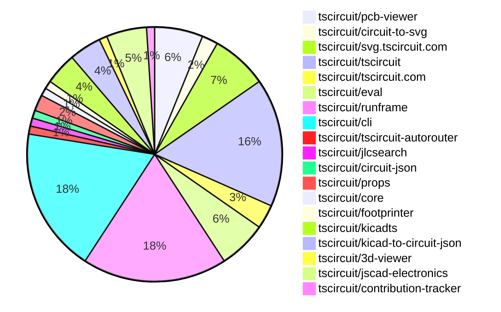
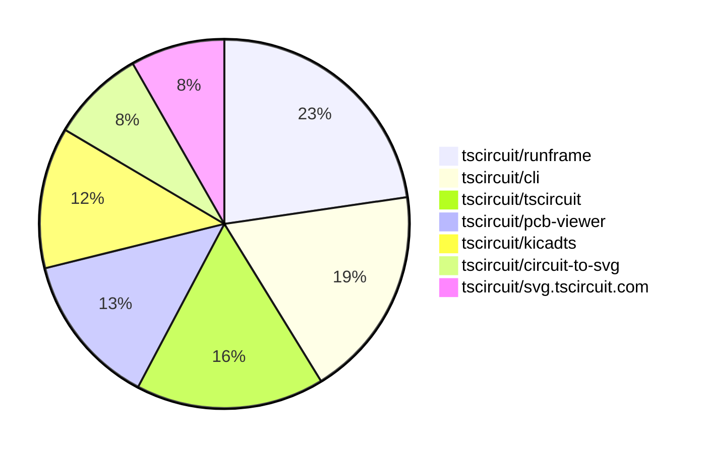

# contribution-tracker

[contributions.tscircuit.com](https://contributions.tscircuit.com) ・ [tscircuit.com](https://tscircuit.com) ・ [Contribution Overviews](./contribution-overviews/) ・ [Changelogs](./changelogs/)

Generates weekly contribution overviews for tscircuit contributors. Check out all
the [contribution overviews here](./contribution-overviews/)
You can find AI-generated monthly changelogs in the [changelogs directory](./changelogs/).

- All PRs in the tscircuit org are scanned/summarized via an LLM
- The LLM classifies each Diff/PR as into a set of attributes for scoring
- All the PRs, summaries, and classifications are organized into charts and tables for [the website](https://contributions.tscircuit.com)

> Want to run locally? See the [Development Section](#development)

The current week is shown below. There are 4 major sections:

- [Contributor Overview](#contributor-overview)
- [PRs by Repository](#prs-by-repository)
- [PRs by Contributor](#changes-by-contributor)
- [Scoring & Sponsorship System](#scoring--sponsorship-system)

## Current Week

<!-- START_CURRENT_WEEK -->

# Contribution Overview 2025-10-29

The current week is shown below. There are 4 major sections:

- [Contributor Overview](#contributor-overview)
- [PRs by Repository](#prs-by-repository)
- [PRs by Contributor](#changes-by-contributor)
- [Scoring & Sponsorship System](#scoring--sponsorship-system)

## PRs by Repository



## Contributor Overview

| Contributor | 🐳 Major | 🐙 Minor | 🐌 Tiny | ⭐ | Score | Discussion Contributions |
|-------------|---------|---------|---------|-----|----------------|--------------------------|
| [imrishabh18](#imrishabh18) | 3 | 5 | 3 | ⭐⭐ | 25 | 0🔹 0🔶 0💎 |
| [seveibar](#seveibar) | 2 | 1 | 1 | ⭐⭐ | 21 | 0🔹 0🔶 0💎 |
| [ShiboSoftwareDev](#ShiboSoftwareDev) | 2 | 2 | 0 | ⭐⭐ | 19 | 0🔹 0🔶 0💎 |
| [tscircuitbot](#tscircuitbot) | 0 | 0 | 66 | ⭐⭐ | 12.5 | 0🔹 0🔶 0💎 |
| [baeoc](#baeoc) | 1 | 3 | 1 | ⭐⭐ | 11 | 0🔹 0🔶 0💎 |
| [rushabhcodes](#rushabhcodes) | 0 | 1 | 3 | ⭐ | 7 | 0🔹 0🔶 0💎 |
| [techmannih](#techmannih) | 0 | 0 | 1 |  | 3 | 0🔹 0🔶 0💎 |
| [RaghavArora14](#RaghavArora14) | 0 | 0 | 2 |  | 2 | 0🔹 0🔶 0💎 |
| [Ayushjhawar8](#Ayushjhawar8) | 0 | 0 | 1 |  | 1 | 0🔹 0🔶 0💎 |

> Note: AI evaluates PRs and assigns 1-3 star ratings automatically. 4 and 5 star ratings require manual staff review.

### Discussion Contribution Legend

- 🔹 Normal Comments: Basic participation with minimal effort
- 🔶 Great Informative Comments: Thoughtful participation that adds value
- 💎 Incredible Comments: Exceptional participation with high-quality content

## Review Table

[reviews-received-hover]: ## "Number of reviews received for PRs for this contributor"
[approvals-received-hover]: ## "Number of approvals received for PRs this contributor authored"
[rejections-received-hover]: ## "Number of rejections received for PRs this contributor authored"
[prs-opened-hover]: ## "Number of PRs opened by this contributor"
[issues-created-hover]: ## "Number of issues created by this contributor"
[bountied-issues-hover]: ## "Number of issues this contributor created with a bounty"
[bountied-issue-$-hover]: ## "Total bounty amount placed on issues authored by this contributor"

| Contributor | Reviews Received | Approvals Received | Rejections Received | Approvals | Rejections | PRs Opened | PRs Merged | Score | Issues Created | Bountied Issues | Bountied Issue $ |
|---|---|---|---|---|---|---|---|---|---|---|---|
| [RaghavArora14](#RaghavArora14) | 7 | 3 | 0 | 0 | 0 | 5 | 2 | 2 | 0 | 0 | 0 |
| [ShiboSoftwareDev](#ShiboSoftwareDev) | 4 | 4 | 0 | 6 | 0 | 5 | 4 | 19 | 0 | 0 | 0 |
| [seveibar](#seveibar) | 2 | 0 | 0 | 15 | 0 | 7 | 4 | 21 | 0 | 0 | 0 |
| [tscircuitbot](#tscircuitbot) | 0 | 0 | 0 | 0 | 0 | 71 | 66 | 12.5 | 0 | 0 | 0 |
| [brymut](#brymut) | 2 | 0 | 0 | 0 | 0 | 3 | 0 | 0 | 0 | 0 | 0 |
| [baeoc](#baeoc) | 5 | 4 | 0 | 0 | 0 | 5 | 5 | 11 | 0 | 0 | 0 |
| [techmannih](#techmannih) | 4 | 1 | 0 | 1 | 0 | 3 | 1 | 3 | 0 | 0 | 0 |
| [imrishabh18](#imrishabh18) | 6 | 3 | 0 | 0 | 0 | 11 | 11 | 25 | 0 | 0 | 0 |
| [rushabhcodes](#rushabhcodes) | 23 | 6 | 0 | 0 | 0 | 7 | 4 | 7 | 0 | 0 | 0 |
| [MustafaMulla29](#MustafaMulla29) | 0 | 0 | 0 | 0 | 0 | 0 | 0 | 0 | 0 | 0 | 0 |
| [Ayushjhawar8](#Ayushjhawar8) | 2 | 1 | 0 | 0 | 0 | 2 | 1 | 1 | 0 | 0 | 0 |
| [0hmX](#0hmX) | 0 | 0 | 0 | 0 | 0 | 1 | 0 | 0 | 0 | 0 | 0 |

## Top 7 Repositories by Contribution Points



## Scoring & Sponsorship System

### Overview

PRs are analyzed by AI and assigned a **star rating (1-3 stars)**. 4 and 5 star ratings can only be manually assigned by staff. Weekly scores use `2^(starRating - 1)` per PR (capped at 12 PRs per rating), plus review/discussion points.

### Weekly Score → Star String

| Score Range | Star String | Count Value |
|------------|-------------|-------------|
| 0-3 | (empty) | 0 stars |
| 4-10 | ⭐ | 1 star |
| 11-30 | ⭐⭐ | 2 stars |
| 31-50 | ⭐⭐⭐ | 3 stars |
| 51-75 | 👑 | 1 crown |
| 76-100 | 👑👑 | 2 crowns |
| 101+ | 👑👑👑 | 3 crowns |

> Crowns count as 3 stars for sponsorship.

### Monthly Sponsorship Calculation

The sponsorship system calculates monthly payments based on your **weekly star counts** over the complete weeks in that month (typically 4-5 weeks, Wednesday-Tuesday format).

**Step 1: Collect Weekly Stars**
- All complete weeks in the month are analyzed
- Each week's star string is converted to a numeric count (1 ⭐ = 1 star, 👑 = 3 stars)
- Example: `[2, 2, 2, 1, 0]` means 2 stars in week 1, 2 stars in week 2, etc.

**Step 2: Calculate Metrics**
- **Median stars**: The median value of all weekly star counts
- **Min stars**: The minimum weekly star count
- **Max stars**: The maximum weekly star count
- **High score**: The maximum raw weekly score (0-100+ range from the scoring table) from any week in the month

**Step 3: Determine Base Amount**
The sponsorship amount is calculated based on these metrics (checked in order):

| Condition | Base Amount |
|-----------|-------------|
| `minStarCount >= 3` | **$500** |
| `medianStars >= 3` | **$450** |
| `medianStars >= 2.5` | **$300** |
| `medianStars >= 2` | **$200** |
| `medianStars >= 1.5` | **$100** |
| `medianStars >= 1` | **$75** |
| `maxStarCount >= 2` | **$25** |
| `maxStarCount >= 1` | **$15** |
| `highScore >= 3` (and all stars = 0) | **$5** |

| Maintainer Level | Monthly Bonus |
|------------------|---------------|
| Level 1 | **$200** |
| Level 2 | **$350** |
| Level 3 | **$500** |

**Final Amount** = Base Amount + Maintainer Bonus

## Changes by Repository

### [tscircuit/pcb-viewer](https://github.com/tscircuit/pcb-viewer)

| PR # | Impact | Rating | Contributor | Description |
|------|--------|--------|-------------|-------------|
| [#438](https://github.com/tscircuit/pcb-viewer/pull/438) | 🐳 Major | ⭐⭐⭐ | ShiboSoftwareDev | Adds an option in the View dropdown menu to show or hide copper pours, with the visibility state persisted in local storage for user preference across sessions. |
| [#435](https://github.com/tscircuit/pcb-viewer/pull/435) | 🐳 Major | ⭐⭐⭐ | seveibar | Add a global view setting for copper pours, exposing a Show Copper Pours toggle in the View menu and filtering copper pour primitives when the toggle is disabled. |
| [#434](https://github.com/tscircuit/pcb-viewer/pull/434) | 🐙 Minor | ⭐⭐ | ShiboSoftwareDev | Makes copper pours slightly transparent to distinguish them from other copper elements. |

<details>
<summary>🐌 Tiny Contributions (3)</summary>

| PR # | Impact | Contributor | Description |
|------|--------|-------------|-------------|
| [#439](https://github.com/tscircuit/pcb-viewer/pull/439) | 🐌 Tiny | tscircuitbot | Automated package update |
| [#437](https://github.com/tscircuit/pcb-viewer/pull/437) | 🐌 Tiny | tscircuitbot | Automated package update |
| [#436](https://github.com/tscircuit/pcb-viewer/pull/436) | 🐌 Tiny | tscircuitbot | Automated package update |

</details>

### [tscircuit/circuit-to-svg](https://github.com/tscircuit/circuit-to-svg)

| PR # | Impact | Rating | Contributor | Description |
|------|--------|--------|-------------|-------------|
| [#409](https://github.com/tscircuit/circuit-to-svg/pull/409) | 🐳 Major | ⭐⭐⭐ | ShiboSoftwareDev | Adds support for rendering multi-board panels, refactors numeric parsing to use distance.parse, and fixes a bug in bounds calculation for polygon pads. |
| [#410](https://github.com/tscircuit/circuit-to-svg/pull/410) | 🐳 Major | ⭐⭐⭐ | baeoc | Adds support for corner radius in rectangle components for PCB fabrication notes, silkscreen, and note rectangles. |

### [tscircuit/svg.tscircuit.com](https://github.com/tscircuit/svg.tscircuit.com)

| PR # | Impact | Rating | Contributor | Description |
|------|--------|--------|-------------|-------------|
| [#514](https://github.com/tscircuit/svg.tscircuit.com/pull/514) | 🐙 Minor | ⭐⭐ | ShiboSoftwareDev | Makes the simulation_experiment_id parameter optional for the schematic simulation SVG handler, automatically determining it from the circuit JSON if not provided. |

<details>
<summary>🐌 Tiny Contributions (6)</summary>

| PR # | Impact | Contributor | Description |
|------|--------|-------------|-------------|
| [#513](https://github.com/tscircuit/svg.tscircuit.com/pull/513) | 🐌 Tiny | tscircuitbot | Updates the tscircuit package version from 0.0.831 to 0.0.832 in package.json |
| [#512](https://github.com/tscircuit/svg.tscircuit.com/pull/512) | 🐌 Tiny | tscircuitbot | Updates the tscircuit package version from 0.0.830 to 0.0.831 in package.json |
| [#511](https://github.com/tscircuit/svg.tscircuit.com/pull/511) | 🐌 Tiny | tscircuitbot | Updates the tscircuit package version from 0.0.829 to 0.0.830 in package.json |
| [#510](https://github.com/tscircuit/svg.tscircuit.com/pull/510) | 🐌 Tiny | tscircuitbot | Updates the tscircuit package version from 0.0.828 to 0.0.829 in package.json |
| [#509](https://github.com/tscircuit/svg.tscircuit.com/pull/509) | 🐌 Tiny | tscircuitbot | Updates the tscircuit package version from 0.0.827 to 0.0.828 in package.json |
| [#508](https://github.com/tscircuit/svg.tscircuit.com/pull/508) | 🐌 Tiny | tscircuitbot | Updates the tscircuit package version from 0.0.826 to 0.0.827 in package.json |

</details>

### [tscircuit/tscircuit](https://github.com/tscircuit/tscircuit)


<details>
<summary>🐌 Tiny Contributions (16)</summary>

| PR # | Impact | Contributor | Description |
|------|--------|-------------|-------------|
| [#1207](https://github.com/tscircuit/tscircuit/pull/1207) | 🐌 Tiny | tscircuitbot | Updates the tscircuitcli package from version 0.1.417 to 0.1.418 and the tscircuitrunframe package from version 0.0.1181 to 0.0.1182 in package.json |
| [#1206](https://github.com/tscircuit/tscircuit/pull/1206) | 🐌 Tiny | tscircuitbot | Updates the package version from 0.0.832 to 0.0.834 in package.json |
| [#1205](https://github.com/tscircuit/tscircuit/pull/1205) | 🐌 Tiny | tscircuitbot | Updates the tscircuitcli package from version 0.1.416 to 0.1.417 and the tscircuitrunframe package from version 0.0.1180 to 0.0.1181. |
| [#1203](https://github.com/tscircuit/tscircuit/pull/1203) | 🐌 Tiny | tscircuitbot | Automated package update |
| [#1202](https://github.com/tscircuit/tscircuit/pull/1202) | 🐌 Tiny | tscircuitbot | Automated package update |
| [#1201](https://github.com/tscircuit/tscircuit/pull/1201) | 🐌 Tiny | tscircuitbot | Updates the tscircuitcli package from version 0.1.414 to 0.1.415 and the tscircuitrunframe package from version 0.0.1178 to 0.0.1179 in package.json |
| [#1200](https://github.com/tscircuit/tscircuit/pull/1200) | 🐌 Tiny | tscircuitbot | Automated package update |
| [#1199](https://github.com/tscircuit/tscircuit/pull/1199) | 🐌 Tiny | tscircuitbot | Updates the tscircuitcli package from version 0.1.413 to 0.1.414 and the tscircuitrunframe package from version 0.0.1177 to 0.0.1178 in package.json |
| [#1198](https://github.com/tscircuit/tscircuit/pull/1198) | 🐌 Tiny | tscircuitbot | Automated package update |
| [#1197](https://github.com/tscircuit/tscircuit/pull/1197) | 🐌 Tiny | tscircuitbot | Automated package update |
| [#1196](https://github.com/tscircuit/tscircuit/pull/1196) | 🐌 Tiny | tscircuitbot | Automated package update |
| [#1195](https://github.com/tscircuit/tscircuit/pull/1195) | 🐌 Tiny | tscircuitbot | Updates the tscircuitcli package to version 0.1.412 in the package.json file |
| [#1194](https://github.com/tscircuit/tscircuit/pull/1194) | 🐌 Tiny | tscircuitbot | Automated package update |
| [#1193](https://github.com/tscircuit/tscircuit/pull/1193) | 🐌 Tiny | tscircuitbot | Updates the tscircuitcli package from version 0.1.410 to 0.1.411 and the tscircuitrunframe package from version 0.0.1174 to 0.0.1176 in package.json |
| [#1192](https://github.com/tscircuit/tscircuit/pull/1192) | 🐌 Tiny | tscircuitbot | Automated package update |
| [#1191](https://github.com/tscircuit/tscircuit/pull/1191) | 🐌 Tiny | tscircuitbot | Automated package update |

</details>

### [tscircuit/tscircuit.com](https://github.com/tscircuit/tscircuit.com)


<details>
<summary>🐌 Tiny Contributions (3)</summary>

| PR # | Impact | Contributor | Description |
|------|--------|-------------|-------------|
| [#1917](https://github.com/tscircuit/tscircuit.com/pull/1917) | 🐌 Tiny | tscircuitbot | Updates the tscircuiteval package from version 0.0.443 to 0.0.444 |
| [#1916](https://github.com/tscircuit/tscircuit.com/pull/1916) | 🐌 Tiny | tscircuitbot | Automated package update |
| [#1915](https://github.com/tscircuit/tscircuit.com/pull/1915) | 🐌 Tiny | tscircuitbot | Automated package update |

</details>

### [tscircuit/eval](https://github.com/tscircuit/eval)

| PR # | Impact | Rating | Contributor | Description |
|------|--------|--------|-------------|-------------|
| [#1435](https://github.com/tscircuit/eval/pull/1435) | 🐙 Minor | ⭐⭐ | seveibar | Changes the maximum import depth from 5 to 30 and throws an error when the maximum depth is reached instead of logging a message. |

<details>
<summary>🐌 Tiny Contributions (5)</summary>

| PR # | Impact | Contributor | Description |
|------|--------|-------------|-------------|
| [#1440](https://github.com/tscircuit/eval/pull/1440) | 🐌 Tiny | tscircuitbot | Automated package update |
| [#1439](https://github.com/tscircuit/eval/pull/1439) | 🐌 Tiny | tscircuitbot | Automated package update |
| [#1437](https://github.com/tscircuit/eval/pull/1437) | 🐌 Tiny | tscircuitbot | Automated package update |
| [#1434](https://github.com/tscircuit/eval/pull/1434) | 🐌 Tiny | tscircuitbot | Automated package update |
| [#1436](https://github.com/tscircuit/eval/pull/1436) | 🐌 Tiny | tscircuitbot | Automated package update |

</details>

### [tscircuit/runframe](https://github.com/tscircuit/runframe)

| PR # | Impact | Rating | Contributor | Description |
|------|--------|--------|-------------|-------------|
| [#1615](https://github.com/tscircuit/runframe/pull/1615) | 🐳 Major | ⭐⭐⭐ | imrishabh18 | Add support for uploading GLB and other binary files, enabling users to integrate 3D models into their projects. |
| [#1622](https://github.com/tscircuit/runframe/pull/1622) | 🐙 Minor | ⭐⭐ | imrishabh18 | Fixes the bug where typing in the bug report textarea causes the entire FileMenuLeftHeader to re-render on every keystroke by switching to uncontrolled input. |

<details>
<summary>🐌 Tiny Contributions (16)</summary>

| PR # | Impact | Contributor | Description |
|------|--------|-------------|-------------|
| [#1626](https://github.com/tscircuit/runframe/pull/1626) | 🐌 Tiny | tscircuitbot | Automated package update |
| [#1625](https://github.com/tscircuit/runframe/pull/1625) | 🐌 Tiny | tscircuitbot | Updates the tscircuit3d-viewer package to version 0.0.422 |
| [#1623](https://github.com/tscircuit/runframe/pull/1623) | 🐌 Tiny | tscircuitbot | Automated package update |
| [#1620](https://github.com/tscircuit/runframe/pull/1620) | 🐌 Tiny | tscircuitbot | Updates the package version from 0.0.1179 to 0.0.1180 in package.json |
| [#1619](https://github.com/tscircuit/runframe/pull/1619) | 🐌 Tiny | tscircuitbot | Updates the tscircuiteval package from version 0.0.443 to 0.0.444 |
| [#1618](https://github.com/tscircuit/runframe/pull/1618) | 🐌 Tiny | tscircuitbot | Automated package update |
| [#1617](https://github.com/tscircuit/runframe/pull/1617) | 🐌 Tiny | tscircuitbot | Updates the tscircuitpcb-viewer package from version 1.11.243 to 1.11.244 |
| [#1616](https://github.com/tscircuit/runframe/pull/1616) | 🐌 Tiny | tscircuitbot | Automated package update |
| [#1614](https://github.com/tscircuit/runframe/pull/1614) | 🐌 Tiny | tscircuitbot | Automated package update |
| [#1613](https://github.com/tscircuit/runframe/pull/1613) | 🐌 Tiny | tscircuitbot | Updates the tscircuiteval package to version 0.0.443 |
| [#1611](https://github.com/tscircuit/runframe/pull/1611) | 🐌 Tiny | tscircuitbot | Automated package update to version 0.0.1175 |
| [#1610](https://github.com/tscircuit/runframe/pull/1610) | 🐌 Tiny | tscircuitbot | Updates the tscircuitpcb-viewer package from version 1.11.242 to 1.11.243 |
| [#1609](https://github.com/tscircuit/runframe/pull/1609) | 🐌 Tiny | tscircuitbot | Updates the tscircuitpcb-viewer package from version 1.11.241 to 1.11.242 |
| [#1608](https://github.com/tscircuit/runframe/pull/1608) | 🐌 Tiny | tscircuitbot | Automated package update |
| [#1607](https://github.com/tscircuit/runframe/pull/1607) | 🐌 Tiny | tscircuitbot | Updates the tscircuiteval package to version 0.0.442 |
| [#1621](https://github.com/tscircuit/runframe/pull/1621) | 🐌 Tiny | Ayushjhawar8 | This pull request introduces a new section for recently viewed files in the file selector component, allows users to remove favorites directly from the favorites section, and adds keyboard shortcuts for improved navigation. The changes enhance user experience by making file management more efficient and accessible. |

</details>

### [tscircuit/cli](https://github.com/tscircuit/cli)


<details>
<summary>🐌 Tiny Contributions (18)</summary>

| PR # | Impact | Contributor | Description |
|------|--------|-------------|-------------|
| [#782](https://github.com/tscircuit/cli/pull/782) | 🐌 Tiny | tscircuitbot | Automated package update |
| [#781](https://github.com/tscircuit/cli/pull/781) | 🐌 Tiny | tscircuitbot | Updates the tscircuitrunframe package from version 0.0.1181 to 0.0.1182 |
| [#780](https://github.com/tscircuit/cli/pull/780) | 🐌 Tiny | tscircuitbot | Automated package update |
| [#779](https://github.com/tscircuit/cli/pull/779) | 🐌 Tiny | tscircuitbot | Automated package update |
| [#778](https://github.com/tscircuit/cli/pull/778) | 🐌 Tiny | tscircuitbot | Automated package update |
| [#777](https://github.com/tscircuit/cli/pull/777) | 🐌 Tiny | tscircuitbot | Automated package update |
| [#776](https://github.com/tscircuit/cli/pull/776) | 🐌 Tiny | tscircuitbot | Automated package update |
| [#775](https://github.com/tscircuit/cli/pull/775) | 🐌 Tiny | tscircuitbot | Updates the tscircuitrunframe package from version 0.0.1178 to 0.0.1179 |
| [#774](https://github.com/tscircuit/cli/pull/774) | 🐌 Tiny | tscircuitbot | Automated package update |
| [#773](https://github.com/tscircuit/cli/pull/773) | 🐌 Tiny | tscircuitbot | Automated package update |
| [#772](https://github.com/tscircuit/cli/pull/772) | 🐌 Tiny | tscircuitbot | Automated package update |
| [#771](https://github.com/tscircuit/cli/pull/771) | 🐌 Tiny | tscircuitbot | Updates the tscircuitrunframe package to version 0.0.1177 in the package.json file. |
| [#770](https://github.com/tscircuit/cli/pull/770) | 🐌 Tiny | tscircuitbot | Automated package update |
| [#768](https://github.com/tscircuit/cli/pull/768) | 🐌 Tiny | tscircuitbot | Updates the tscircuitrunframe package from version 0.0.1175 to 0.0.1176 |
| [#769](https://github.com/tscircuit/cli/pull/769) | 🐌 Tiny | tscircuitbot | Automated package update |
| [#767](https://github.com/tscircuit/cli/pull/767) | 🐌 Tiny | tscircuitbot | Updates the tscircuitrunframe package from version 0.0.1174 to 0.0.1175 |
| [#766](https://github.com/tscircuit/cli/pull/766) | 🐌 Tiny | tscircuitbot | Automated package update to version 0.1.410 |
| [#765](https://github.com/tscircuit/cli/pull/765) | 🐌 Tiny | tscircuitbot | Automated package update |

</details>

### [tscircuit/tscircuit-autorouter](https://github.com/tscircuit/tscircuit-autorouter)

| PR # | Impact | Rating | Contributor | Description |
|------|--------|--------|-------------|-------------|
| [#292](https://github.com/tscircuit/tscircuit-autorouter/pull/292) | 🐳 Major | ⭐⭐⭐ | seveibar | img width2062 height1784 altimage srchttps:github.comuser-attachmentsassets21498e6a-6537-4337-98db-0cef210de75a |

### [tscircuit/jlcsearch](https://github.com/tscircuit/jlcsearch)


<details>
<summary>🐌 Tiny Contributions (1)</summary>

| PR # | Impact | Contributor | Description |
|------|--------|-------------|-------------|
| [#105](https://github.com/tscircuit/jlcsearch/pull/105) | 🐌 Tiny | seveibar | Update the OpenAPI link to point to the raw GitHub URL and rename the OpenAPI spec title to JLCSearch JLCPCB In-Stock Parts Engine API. |

</details>

### [tscircuit/circuit-json](https://github.com/tscircuit/circuit-json)

| PR # | Impact | Rating | Contributor | Description |
|------|--------|--------|-------------|-------------|
| [#334](https://github.com/tscircuit/circuit-json/pull/334) | 🐙 Minor | ⭐⭐ | baeoc | Adds corner_radius support to rectangle components in PCB fabrication notes, notes, and silkscreen definitions. |

### [tscircuit/props](https://github.com/tscircuit/props)

| PR # | Impact | Rating | Contributor | Description |
|------|--------|--------|-------------|-------------|
| [#479](https://github.com/tscircuit/props/pull/479) | 🐙 Minor | ⭐⭐ | baeoc | Adds cornerRadius support to rect components, allowing for rounded corners in fabrication notes, PCB notes, and schematic rectangles. |

<details>
<summary>🐌 Tiny Contributions (1)</summary>

| PR # | Impact | Contributor | Description |
|------|--------|-------------|-------------|
| [#480](https://github.com/tscircuit/props/pull/480) | 🐌 Tiny | baeoc | Adds an optional cornerRadius property to the silkscreen rectangle component for enhanced styling flexibility. |

</details>

### [tscircuit/core](https://github.com/tscircuit/core)

| PR # | Impact | Rating | Contributor | Description |
|------|--------|--------|-------------|-------------|
| [#1607](https://github.com/tscircuit/core/pull/1607) | 🐙 Minor | ⭐⭐ | baeoc | Adds support for corner radius in rectangle components, allowing for rounded corners in PCB design. |

### [tscircuit/footprinter](https://github.com/tscircuit/footprinter)


<details>
<summary>🐌 Tiny Contributions (1)</summary>

| PR # | Impact | Contributor | Description |
|------|--------|-------------|-------------|
| [#394](https://github.com/tscircuit/footprinter/pull/394) | 🐌 Tiny | techmannih | Fixes the pitch dimensions for the SOD923 footprint in the footprint library. |

</details>

### [tscircuit/kicadts](https://github.com/tscircuit/kicadts)

| PR # | Impact | Rating | Contributor | Description |
|------|--------|--------|-------------|-------------|
| [#15](https://github.com/tscircuit/kicadts/pull/15) | 🐳 Major | ⭐⭐⭐ | imrishabh18 | Adds support for NoConnect tokens as child elements under the KicadSch class, allowing for better representation of schematic components. |
| [#16](https://github.com/tscircuit/kicadts/pull/16) | 🐳 Major | ⭐⭐⭐ | imrishabh18 | Adds a new Polyline class and extends it for use as SymbolPolyline, enabling support for polylines in schematic and symbol contexts. |
| [#17](https://github.com/tscircuit/kicadts/pull/17) | 🐙 Minor | ⭐⭐ | imrishabh18 | Adds support for a mirror property in schematic symbols, allowing for mirroring along the x or y axis. |
| [#14](https://github.com/tscircuit/kicadts/pull/14) | 🐙 Minor | ⭐⭐ | imrishabh18 | Adds support for bold and italic text effects in the TextEffectsFont class. |

### [tscircuit/kicad-to-circuit-json](https://github.com/tscircuit/kicad-to-circuit-json)

| PR # | Impact | Rating | Contributor | Description |
|------|--------|--------|-------------|-------------|
| [#7](https://github.com/tscircuit/kicad-to-circuit-json/pull/7) | 🐙 Minor | ⭐⭐ | imrishabh18 | Adds an initial schematic parity test for the pic_programmer by making fixes in kicadts for the kicad_sch file to ensure it is parseable. |
| [#5](https://github.com/tscircuit/kicad-to-circuit-json/pull/5) | 🐙 Minor | ⭐⭐ | imrishabh18 | This pull request addresses an issue where the reference text in the KiCad PCB was being skipped when converting to the circuit JSON format. The change ensures that the reference is included in the output, which is crucial for accurate representation of the PCB design. |

<details>
<summary>🐌 Tiny Contributions (2)</summary>

| PR # | Impact | Contributor | Description |
|------|--------|-------------|-------------|
| [#6](https://github.com/tscircuit/kicad-to-circuit-json/pull/6) | 🐌 Tiny | imrishabh18 | This pull request reformats the entire codebase to ensure consistent styling and adherence to coding standards. It includes changes to various files, primarily focusing on code formatting, such as spacing, line breaks, and consistent use of quotes. Additionally, it introduces a new GitHub Actions workflow for format checking on pushes and pull requests to the main branch. |
| [#4](https://github.com/tscircuit/kicad-to-circuit-json/pull/4) | 🐌 Tiny | imrishabh18 | This pull request introduces support for KiCad PCB files that utilize UUIDs under the tstamp field. The changes ensure that the converter can correctly process footprints that may not have a UUID but do have a timestamp, thereby improving compatibility with various KiCad files. |

</details>

### [tscircuit/3d-viewer](https://github.com/tscircuit/3d-viewer)


<details>
<summary>🐌 Tiny Contributions (1)</summary>

| PR # | Impact | Contributor | Description |
|------|--------|-------------|-------------|
| [#544](https://github.com/tscircuit/3d-viewer/pull/544) | 🐌 Tiny | imrishabh18 | Stores the auto-rotate preference in localStorage, allowing users to retain their settings across sessions. |

</details>

### [tscircuit/jscad-electronics](https://github.com/tscircuit/jscad-electronics)

| PR # | Impact | Rating | Contributor | Description |
|------|--------|--------|-------------|-------------|
| [#167](https://github.com/tscircuit/jscad-electronics/pull/167) | 🐙 Minor | ⭐⭐ | rushabhcodes | Fixes rendering crashes caused by nonstandard shape strings and diameter property names in the FootprintPlatedHole component. |

<details>
<summary>🐌 Tiny Contributions (4)</summary>

| PR # | Impact | Contributor | Description |
|------|--------|-------------|-------------|
| [#172](https://github.com/tscircuit/jscad-electronics/pull/172) | 🐌 Tiny | rushabhcodes | Adds support for the SOD123FL electronic component model along with corresponding tests for rendering its footprint. |
| [#162](https://github.com/tscircuit/jscad-electronics/pull/162) | 🐌 Tiny | rushabhcodes | Refactors the SOD523 component by inlining the JSX directly into the return statement, removing the module-level Body constant. |
| [#176](https://github.com/tscircuit/jscad-electronics/pull/176) | 🐌 Tiny | rushabhcodes | Adds support for the SOD923 component along with an example and a snapshot test. |
| [#175](https://github.com/tscircuit/jscad-electronics/pull/175) | 🐌 Tiny | RaghavArora14 | Fixes the issue where pad tops are not aligned at z0 by placing copper just below the board. |

</details>

### [tscircuit/contribution-tracker](https://github.com/tscircuit/contribution-tracker)


<details>
<summary>🐌 Tiny Contributions (1)</summary>

| PR # | Impact | Contributor | Description |
|------|--------|-------------|-------------|
| [#251](https://github.com/tscircuit/contribution-tracker/pull/251) | 🐌 Tiny | RaghavArora14 | Condenses the Scoring  Sponsorship section in the README and adds a maintainer bonus table for clarity. |

</details>

## Changes by Contributor

### [ShiboSoftwareDev](https://github.com/ShiboSoftwareDev)

| PRs # | Impact | Rating | Description |
|------|--------|--------|-------------|
| [#438](https://github.com/tscircuit/pcb-viewer/pull/438) | 🐳 Major | ⭐⭐⭐ | Adds an option in the View dropdown menu to show or hide copper pours, with the visibility state persisted in local storage for user preference across sessions. |
| [#409](https://github.com/tscircuit/circuit-to-svg/pull/409) | 🐳 Major | ⭐⭐⭐ | Adds support for rendering multi-board panels, refactors numeric parsing to use distance.parse, and fixes a bug in bounds calculation for polygon pads. |
| [#434](https://github.com/tscircuit/pcb-viewer/pull/434) | 🐙 Minor | ⭐⭐ | Makes copper pours slightly transparent to distinguish them from other copper elements. |
| [#514](https://github.com/tscircuit/svg.tscircuit.com/pull/514) | 🐙 Minor | ⭐⭐ | Makes the simulation_experiment_id parameter optional for the schematic simulation SVG handler, automatically determining it from the circuit JSON if not provided. |

### [tscircuitbot](https://github.com/tscircuitbot)


<details>
<summary>🐌 Tiny Contributions (66)</summary>

| PR # | Impact | Description |
|------|--------|-------------|
| [#439](https://github.com/tscircuit/pcb-viewer/pull/439) | 🐌 Tiny | Automated package update |
| [#437](https://github.com/tscircuit/pcb-viewer/pull/437) | 🐌 Tiny | Automated package update |
| [#436](https://github.com/tscircuit/pcb-viewer/pull/436) | 🐌 Tiny | Automated package update |
| [#1207](https://github.com/tscircuit/tscircuit/pull/1207) | 🐌 Tiny | Updates the tscircuitcli package from version 0.1.417 to 0.1.418 and the tscircuitrunframe package from version 0.0.1181 to 0.0.1182 in package.json |
| [#1206](https://github.com/tscircuit/tscircuit/pull/1206) | 🐌 Tiny | Updates the package version from 0.0.832 to 0.0.834 in package.json |
| [#1205](https://github.com/tscircuit/tscircuit/pull/1205) | 🐌 Tiny | Updates the tscircuitcli package from version 0.1.416 to 0.1.417 and the tscircuitrunframe package from version 0.0.1180 to 0.0.1181. |
| [#1203](https://github.com/tscircuit/tscircuit/pull/1203) | 🐌 Tiny | Automated package update |
| [#1202](https://github.com/tscircuit/tscircuit/pull/1202) | 🐌 Tiny | Automated package update |
| [#1201](https://github.com/tscircuit/tscircuit/pull/1201) | 🐌 Tiny | Updates the tscircuitcli package from version 0.1.414 to 0.1.415 and the tscircuitrunframe package from version 0.0.1178 to 0.0.1179 in package.json |
| [#1200](https://github.com/tscircuit/tscircuit/pull/1200) | 🐌 Tiny | Automated package update |
| [#1199](https://github.com/tscircuit/tscircuit/pull/1199) | 🐌 Tiny | Updates the tscircuitcli package from version 0.1.413 to 0.1.414 and the tscircuitrunframe package from version 0.0.1177 to 0.0.1178 in package.json |
| [#1198](https://github.com/tscircuit/tscircuit/pull/1198) | 🐌 Tiny | Automated package update |
| [#1197](https://github.com/tscircuit/tscircuit/pull/1197) | 🐌 Tiny | Automated package update |
| [#1196](https://github.com/tscircuit/tscircuit/pull/1196) | 🐌 Tiny | Automated package update |
| [#1195](https://github.com/tscircuit/tscircuit/pull/1195) | 🐌 Tiny | Updates the tscircuitcli package to version 0.1.412 in the package.json file |
| [#1194](https://github.com/tscircuit/tscircuit/pull/1194) | 🐌 Tiny | Automated package update |
| [#1193](https://github.com/tscircuit/tscircuit/pull/1193) | 🐌 Tiny | Updates the tscircuitcli package from version 0.1.410 to 0.1.411 and the tscircuitrunframe package from version 0.0.1174 to 0.0.1176 in package.json |
| [#1192](https://github.com/tscircuit/tscircuit/pull/1192) | 🐌 Tiny | Automated package update |
| [#1191](https://github.com/tscircuit/tscircuit/pull/1191) | 🐌 Tiny | Automated package update |
| [#1917](https://github.com/tscircuit/tscircuit.com/pull/1917) | 🐌 Tiny | Updates the tscircuiteval package from version 0.0.443 to 0.0.444 |
| [#1916](https://github.com/tscircuit/tscircuit.com/pull/1916) | 🐌 Tiny | Automated package update |
| [#1915](https://github.com/tscircuit/tscircuit.com/pull/1915) | 🐌 Tiny | Automated package update |
| [#1440](https://github.com/tscircuit/eval/pull/1440) | 🐌 Tiny | Automated package update |
| [#1439](https://github.com/tscircuit/eval/pull/1439) | 🐌 Tiny | Automated package update |
| [#1437](https://github.com/tscircuit/eval/pull/1437) | 🐌 Tiny | Automated package update |
| [#1434](https://github.com/tscircuit/eval/pull/1434) | 🐌 Tiny | Automated package update |
| [#1436](https://github.com/tscircuit/eval/pull/1436) | 🐌 Tiny | Automated package update |
| [#1626](https://github.com/tscircuit/runframe/pull/1626) | 🐌 Tiny | Automated package update |
| [#1625](https://github.com/tscircuit/runframe/pull/1625) | 🐌 Tiny | Updates the tscircuit3d-viewer package to version 0.0.422 |
| [#1623](https://github.com/tscircuit/runframe/pull/1623) | 🐌 Tiny | Automated package update |
| [#1620](https://github.com/tscircuit/runframe/pull/1620) | 🐌 Tiny | Updates the package version from 0.0.1179 to 0.0.1180 in package.json |
| [#1619](https://github.com/tscircuit/runframe/pull/1619) | 🐌 Tiny | Updates the tscircuiteval package from version 0.0.443 to 0.0.444 |
| [#1618](https://github.com/tscircuit/runframe/pull/1618) | 🐌 Tiny | Automated package update |
| [#1617](https://github.com/tscircuit/runframe/pull/1617) | 🐌 Tiny | Updates the tscircuitpcb-viewer package from version 1.11.243 to 1.11.244 |
| [#1616](https://github.com/tscircuit/runframe/pull/1616) | 🐌 Tiny | Automated package update |
| [#1614](https://github.com/tscircuit/runframe/pull/1614) | 🐌 Tiny | Automated package update |
| [#1613](https://github.com/tscircuit/runframe/pull/1613) | 🐌 Tiny | Updates the tscircuiteval package to version 0.0.443 |
| [#1611](https://github.com/tscircuit/runframe/pull/1611) | 🐌 Tiny | Automated package update to version 0.0.1175 |
| [#1610](https://github.com/tscircuit/runframe/pull/1610) | 🐌 Tiny | Updates the tscircuitpcb-viewer package from version 1.11.242 to 1.11.243 |
| [#1609](https://github.com/tscircuit/runframe/pull/1609) | 🐌 Tiny | Updates the tscircuitpcb-viewer package from version 1.11.241 to 1.11.242 |
| [#1608](https://github.com/tscircuit/runframe/pull/1608) | 🐌 Tiny | Automated package update |
| [#1607](https://github.com/tscircuit/runframe/pull/1607) | 🐌 Tiny | Updates the tscircuiteval package to version 0.0.442 |
| [#782](https://github.com/tscircuit/cli/pull/782) | 🐌 Tiny | Automated package update |
| [#781](https://github.com/tscircuit/cli/pull/781) | 🐌 Tiny | Updates the tscircuitrunframe package from version 0.0.1181 to 0.0.1182 |
| [#780](https://github.com/tscircuit/cli/pull/780) | 🐌 Tiny | Automated package update |
| [#779](https://github.com/tscircuit/cli/pull/779) | 🐌 Tiny | Automated package update |
| [#778](https://github.com/tscircuit/cli/pull/778) | 🐌 Tiny | Automated package update |
| [#777](https://github.com/tscircuit/cli/pull/777) | 🐌 Tiny | Automated package update |
| [#776](https://github.com/tscircuit/cli/pull/776) | 🐌 Tiny | Automated package update |
| [#775](https://github.com/tscircuit/cli/pull/775) | 🐌 Tiny | Updates the tscircuitrunframe package from version 0.0.1178 to 0.0.1179 |
| [#774](https://github.com/tscircuit/cli/pull/774) | 🐌 Tiny | Automated package update |
| [#773](https://github.com/tscircuit/cli/pull/773) | 🐌 Tiny | Automated package update |
| [#772](https://github.com/tscircuit/cli/pull/772) | 🐌 Tiny | Automated package update |
| [#771](https://github.com/tscircuit/cli/pull/771) | 🐌 Tiny | Updates the tscircuitrunframe package to version 0.0.1177 in the package.json file. |
| [#770](https://github.com/tscircuit/cli/pull/770) | 🐌 Tiny | Automated package update |
| [#768](https://github.com/tscircuit/cli/pull/768) | 🐌 Tiny | Updates the tscircuitrunframe package from version 0.0.1175 to 0.0.1176 |
| [#769](https://github.com/tscircuit/cli/pull/769) | 🐌 Tiny | Automated package update |
| [#767](https://github.com/tscircuit/cli/pull/767) | 🐌 Tiny | Updates the tscircuitrunframe package from version 0.0.1174 to 0.0.1175 |
| [#766](https://github.com/tscircuit/cli/pull/766) | 🐌 Tiny | Automated package update to version 0.1.410 |
| [#765](https://github.com/tscircuit/cli/pull/765) | 🐌 Tiny | Automated package update |
| [#513](https://github.com/tscircuit/svg.tscircuit.com/pull/513) | 🐌 Tiny | Updates the tscircuit package version from 0.0.831 to 0.0.832 in package.json |
| [#512](https://github.com/tscircuit/svg.tscircuit.com/pull/512) | 🐌 Tiny | Updates the tscircuit package version from 0.0.830 to 0.0.831 in package.json |
| [#511](https://github.com/tscircuit/svg.tscircuit.com/pull/511) | 🐌 Tiny | Updates the tscircuit package version from 0.0.829 to 0.0.830 in package.json |
| [#510](https://github.com/tscircuit/svg.tscircuit.com/pull/510) | 🐌 Tiny | Updates the tscircuit package version from 0.0.828 to 0.0.829 in package.json |
| [#509](https://github.com/tscircuit/svg.tscircuit.com/pull/509) | 🐌 Tiny | Updates the tscircuit package version from 0.0.827 to 0.0.828 in package.json |
| [#508](https://github.com/tscircuit/svg.tscircuit.com/pull/508) | 🐌 Tiny | Updates the tscircuit package version from 0.0.826 to 0.0.827 in package.json |

</details>

### [seveibar](https://github.com/seveibar)

| PRs # | Impact | Rating | Description |
|------|--------|--------|-------------|
| [#435](https://github.com/tscircuit/pcb-viewer/pull/435) | 🐳 Major | ⭐⭐⭐ | Add a global view setting for copper pours, exposing a Show Copper Pours toggle in the View menu and filtering copper pour primitives when the toggle is disabled. |
| [#292](https://github.com/tscircuit/tscircuit-autorouter/pull/292) | 🐳 Major | ⭐⭐⭐ | img width2062 height1784 altimage srchttps:github.comuser-attachmentsassets21498e6a-6537-4337-98db-0cef210de75a |
| [#1435](https://github.com/tscircuit/eval/pull/1435) | 🐙 Minor | ⭐⭐ | Changes the maximum import depth from 5 to 30 and throws an error when the maximum depth is reached instead of logging a message. |

<details>
<summary>🐌 Tiny Contributions (1)</summary>

| PR # | Impact | Description |
|------|--------|-------------|
| [#105](https://github.com/tscircuit/jlcsearch/pull/105) | 🐌 Tiny | Update the OpenAPI link to point to the raw GitHub URL and rename the OpenAPI spec title to JLCSearch JLCPCB In-Stock Parts Engine API. |

</details>

### [baeoc](https://github.com/baeoc)

| PRs # | Impact | Rating | Description |
|------|--------|--------|-------------|
| [#410](https://github.com/tscircuit/circuit-to-svg/pull/410) | 🐳 Major | ⭐⭐⭐ | Adds support for corner radius in rectangle components for PCB fabrication notes, silkscreen, and note rectangles. |
| [#334](https://github.com/tscircuit/circuit-json/pull/334) | 🐙 Minor | ⭐⭐ | Adds corner_radius support to rectangle components in PCB fabrication notes, notes, and silkscreen definitions. |
| [#479](https://github.com/tscircuit/props/pull/479) | 🐙 Minor | ⭐⭐ | Adds cornerRadius support to rect components, allowing for rounded corners in fabrication notes, PCB notes, and schematic rectangles. |
| [#1607](https://github.com/tscircuit/core/pull/1607) | 🐙 Minor | ⭐⭐ | Adds support for corner radius in rectangle components, allowing for rounded corners in PCB design. |

<details>
<summary>🐌 Tiny Contributions (1)</summary>

| PR # | Impact | Description |
|------|--------|-------------|
| [#480](https://github.com/tscircuit/props/pull/480) | 🐌 Tiny | Adds an optional cornerRadius property to the silkscreen rectangle component for enhanced styling flexibility. |

</details>

### [techmannih](https://github.com/techmannih)


<details>
<summary>🐌 Tiny Contributions (1)</summary>

| PR # | Impact | Description |
|------|--------|-------------|
| [#394](https://github.com/tscircuit/footprinter/pull/394) | 🐌 Tiny | Fixes the pitch dimensions for the SOD923 footprint in the footprint library. |

</details>

### [imrishabh18](https://github.com/imrishabh18)

| PRs # | Impact | Rating | Description |
|------|--------|--------|-------------|
| [#1615](https://github.com/tscircuit/runframe/pull/1615) | 🐳 Major | ⭐⭐⭐ | Add support for uploading GLB and other binary files, enabling users to integrate 3D models into their projects. |
| [#15](https://github.com/tscircuit/kicadts/pull/15) | 🐳 Major | ⭐⭐⭐ | Adds support for NoConnect tokens as child elements under the KicadSch class, allowing for better representation of schematic components. |
| [#16](https://github.com/tscircuit/kicadts/pull/16) | 🐳 Major | ⭐⭐⭐ | Adds a new Polyline class and extends it for use as SymbolPolyline, enabling support for polylines in schematic and symbol contexts. |
| [#1622](https://github.com/tscircuit/runframe/pull/1622) | 🐙 Minor | ⭐⭐ | Fixes the bug where typing in the bug report textarea causes the entire FileMenuLeftHeader to re-render on every keystroke by switching to uncontrolled input. |
| [#17](https://github.com/tscircuit/kicadts/pull/17) | 🐙 Minor | ⭐⭐ | Adds support for a mirror property in schematic symbols, allowing for mirroring along the x or y axis. |
| [#14](https://github.com/tscircuit/kicadts/pull/14) | 🐙 Minor | ⭐⭐ | Adds support for bold and italic text effects in the TextEffectsFont class. |
| [#7](https://github.com/tscircuit/kicad-to-circuit-json/pull/7) | 🐙 Minor | ⭐⭐ | Adds an initial schematic parity test for the pic_programmer by making fixes in kicadts for the kicad_sch file to ensure it is parseable. |
| [#5](https://github.com/tscircuit/kicad-to-circuit-json/pull/5) | 🐙 Minor | ⭐⭐ | This pull request addresses an issue where the reference text in the KiCad PCB was being skipped when converting to the circuit JSON format. The change ensures that the reference is included in the output, which is crucial for accurate representation of the PCB design. |

<details>
<summary>🐌 Tiny Contributions (3)</summary>

| PR # | Impact | Description |
|------|--------|-------------|
| [#544](https://github.com/tscircuit/3d-viewer/pull/544) | 🐌 Tiny | Stores the auto-rotate preference in localStorage, allowing users to retain their settings across sessions. |
| [#6](https://github.com/tscircuit/kicad-to-circuit-json/pull/6) | 🐌 Tiny | This pull request reformats the entire codebase to ensure consistent styling and adherence to coding standards. It includes changes to various files, primarily focusing on code formatting, such as spacing, line breaks, and consistent use of quotes. Additionally, it introduces a new GitHub Actions workflow for format checking on pushes and pull requests to the main branch. |
| [#4](https://github.com/tscircuit/kicad-to-circuit-json/pull/4) | 🐌 Tiny | This pull request introduces support for KiCad PCB files that utilize UUIDs under the tstamp field. The changes ensure that the converter can correctly process footprints that may not have a UUID but do have a timestamp, thereby improving compatibility with various KiCad files. |

</details>

### [rushabhcodes](https://github.com/rushabhcodes)

| PRs # | Impact | Rating | Description |
|------|--------|--------|-------------|
| [#167](https://github.com/tscircuit/jscad-electronics/pull/167) | 🐙 Minor | ⭐⭐ | Fixes rendering crashes caused by nonstandard shape strings and diameter property names in the FootprintPlatedHole component. |

<details>
<summary>🐌 Tiny Contributions (3)</summary>

| PR # | Impact | Description |
|------|--------|-------------|
| [#172](https://github.com/tscircuit/jscad-electronics/pull/172) | 🐌 Tiny | Adds support for the SOD123FL electronic component model along with corresponding tests for rendering its footprint. |
| [#162](https://github.com/tscircuit/jscad-electronics/pull/162) | 🐌 Tiny | Refactors the SOD523 component by inlining the JSX directly into the return statement, removing the module-level Body constant. |
| [#176](https://github.com/tscircuit/jscad-electronics/pull/176) | 🐌 Tiny | Adds support for the SOD923 component along with an example and a snapshot test. |

</details>

### [RaghavArora14](https://github.com/RaghavArora14)


<details>
<summary>🐌 Tiny Contributions (2)</summary>

| PR # | Impact | Description |
|------|--------|-------------|
| [#175](https://github.com/tscircuit/jscad-electronics/pull/175) | 🐌 Tiny | Fixes the issue where pad tops are not aligned at z0 by placing copper just below the board. |
| [#251](https://github.com/tscircuit/contribution-tracker/pull/251) | 🐌 Tiny | Condenses the Scoring  Sponsorship section in the README and adds a maintainer bonus table for clarity. |

</details>

### [Ayushjhawar8](https://github.com/Ayushjhawar8)


<details>
<summary>🐌 Tiny Contributions (1)</summary>

| PR # | Impact | Description |
|------|--------|-------------|
| [#1621](https://github.com/tscircuit/runframe/pull/1621) | 🐌 Tiny | This pull request introduces a new section for recently viewed files in the file selector component, allows users to remove favorites directly from the favorites section, and adds keyboard shortcuts for improved navigation. The changes enhance user experience by making file management more efficient and accessible. |

</details>

## Repository Owners

| Repository | Codeowners |
|------------|------------|
| [builder](https://github.com/tscircuit/builder/blob/main/.github/CODEOWNERS) | [seveibar](https://github.com/seveibar)
| [pcb-viewer](https://github.com/tscircuit/pcb-viewer/blob/main/.github/CODEOWNERS) | [seveibar](https://github.com/seveibar), [ShiboSoftwareDev](https://github.com/ShiboSoftwareDev)
| [footprints-old](https://github.com/tscircuit/footprints-old/blob/main/.github/CODEOWNERS) | [seveibar](https://github.com/seveibar)
| [footprinter](https://github.com/tscircuit/footprinter/blob/main/.github/CODEOWNERS) | [seveibar](https://github.com/seveibar), [techmannih](https://github.com/techmannih)
| [3d-viewer](https://github.com/tscircuit/3d-viewer/blob/main/.github/CODEOWNERS) | [ShiboSoftwareDev](https://github.com/ShiboSoftwareDev)
| [winterspec](https://github.com/tscircuit/winterspec/blob/main/.github/CODEOWNERS) | [seveibar](https://github.com/seveibar), [ShiboSoftwareDev](https://github.com/ShiboSoftwareDev)
| [jscad-electronics](https://github.com/tscircuit/jscad-electronics/blob/main/.github/CODEOWNERS) | [seveibar](https://github.com/seveibar), [techmannih](https://github.com/techmannih), [abhijitxy](https://github.com/abhijitxy), [anas-sarkez](https://github.com/anas-sarkez)
| [circuit-to-svg](https://github.com/tscircuit/circuit-to-svg/blob/main/.github/CODEOWNERS) | [imrishabh18](https://github.com/imrishabh18)
| [schematic-symbols](https://github.com/tscircuit/schematic-symbols/blob/main/.github/CODEOWNERS) | [seveibar](https://github.com/seveibar), [imrishabh18](https://github.com/imrishabh18), [techmannih](https://github.com/techmannih)
| [circuit-json-to-gerber](https://github.com/tscircuit/circuit-json-to-gerber/blob/main/.github/CODEOWNERS) | [seveibar](https://github.com/seveibar), [ShiboSoftwareDev](https://github.com/ShiboSoftwareDev)
| [tscircuit.com](https://github.com/tscircuit/tscircuit.com/blob/main/.github/CODEOWNERS) | [seveibar](https://github.com/seveibar), [imrishabh18](https://github.com/imrishabh18)
| [issue-roulette](https://github.com/tscircuit/issue-roulette/blob/main/.github/CODEOWNERS) | [Anshgrover23](https://github.com/Anshgrover23)
| [sparkfun-boards](https://github.com/tscircuit/sparkfun-boards/blob/main/.github/CODEOWNERS) | [ShiboSoftwareDev](https://github.com/ShiboSoftwareDev), [Abse2001](https://github.com/Abse2001), [MustafaMulla29](https://github.com/MustafaMulla29), [Anshgrover23](https://github.com/Anshgrover23), [techmannih](https://github.com/techmannih)
| [schematic-corpus](https://github.com/tscircuit/schematic-corpus/blob/main/.github/CODEOWNERS) | [Abse2001](https://github.com/Abse2001)
| [common](https://github.com/tscircuit/common/blob/main/.github/CODEOWNERS) | [seveibar](https://github.com/seveibar), [Abse2001](https://github.com/Abse2001)

## Repositories by Owner

| User | Repo |
|------|------|
| [seveibar](https://github.com/seveibar) | [builder](https://github.com/tscircuit/builder/blob/main/.github/CODEOWNERS) |
|  | [pcb-viewer](https://github.com/tscircuit/pcb-viewer/blob/main/.github/CODEOWNERS) |
|  | [footprints-old](https://github.com/tscircuit/footprints-old/blob/main/.github/CODEOWNERS) |
|  | [footprinter](https://github.com/tscircuit/footprinter/blob/main/.github/CODEOWNERS) |
|  | [winterspec](https://github.com/tscircuit/winterspec/blob/main/.github/CODEOWNERS) |
|  | [jscad-electronics](https://github.com/tscircuit/jscad-electronics/blob/main/.github/CODEOWNERS) |
|  | [schematic-symbols](https://github.com/tscircuit/schematic-symbols/blob/main/.github/CODEOWNERS) |
|  | [circuit-json-to-gerber](https://github.com/tscircuit/circuit-json-to-gerber/blob/main/.github/CODEOWNERS) |
|  | [tscircuit.com](https://github.com/tscircuit/tscircuit.com/blob/main/.github/CODEOWNERS) |
|  | [common](https://github.com/tscircuit/common/blob/main/.github/CODEOWNERS) |
| [ShiboSoftwareDev](https://github.com/ShiboSoftwareDev) | [pcb-viewer](https://github.com/tscircuit/pcb-viewer/blob/main/.github/CODEOWNERS) |
|  | [3d-viewer](https://github.com/tscircuit/3d-viewer/blob/main/.github/CODEOWNERS) |
|  | [winterspec](https://github.com/tscircuit/winterspec/blob/main/.github/CODEOWNERS) |
|  | [circuit-json-to-gerber](https://github.com/tscircuit/circuit-json-to-gerber/blob/main/.github/CODEOWNERS) |
|  | [sparkfun-boards](https://github.com/tscircuit/sparkfun-boards/blob/main/.github/CODEOWNERS) |
| [techmannih](https://github.com/techmannih) | [footprinter](https://github.com/tscircuit/footprinter/blob/main/.github/CODEOWNERS) |
|  | [jscad-electronics](https://github.com/tscircuit/jscad-electronics/blob/main/.github/CODEOWNERS) |
|  | [schematic-symbols](https://github.com/tscircuit/schematic-symbols/blob/main/.github/CODEOWNERS) |
|  | [sparkfun-boards](https://github.com/tscircuit/sparkfun-boards/blob/main/.github/CODEOWNERS) |
| [abhijitxy](https://github.com/abhijitxy) | [jscad-electronics](https://github.com/tscircuit/jscad-electronics/blob/main/.github/CODEOWNERS) |
| [anas-sarkez](https://github.com/anas-sarkez) | [jscad-electronics](https://github.com/tscircuit/jscad-electronics/blob/main/.github/CODEOWNERS) |
| [imrishabh18](https://github.com/imrishabh18) | [circuit-to-svg](https://github.com/tscircuit/circuit-to-svg/blob/main/.github/CODEOWNERS) |
|  | [schematic-symbols](https://github.com/tscircuit/schematic-symbols/blob/main/.github/CODEOWNERS) |
|  | [tscircuit.com](https://github.com/tscircuit/tscircuit.com/blob/main/.github/CODEOWNERS) |
| [Anshgrover23](https://github.com/Anshgrover23) | [issue-roulette](https://github.com/tscircuit/issue-roulette/blob/main/.github/CODEOWNERS) |
|  | [sparkfun-boards](https://github.com/tscircuit/sparkfun-boards/blob/main/.github/CODEOWNERS) |
| [Abse2001](https://github.com/Abse2001) | [sparkfun-boards](https://github.com/tscircuit/sparkfun-boards/blob/main/.github/CODEOWNERS) |
|  | [schematic-corpus](https://github.com/tscircuit/schematic-corpus/blob/main/.github/CODEOWNERS) |
|  | [common](https://github.com/tscircuit/common/blob/main/.github/CODEOWNERS) |
| [MustafaMulla29](https://github.com/MustafaMulla29) | [sparkfun-boards](https://github.com/tscircuit/sparkfun-boards/blob/main/.github/CODEOWNERS) |


<!-- END_CURRENT_WEEK -->


## Development

### Prerequisites

- [Bun](https://bun.sh/) runtime
- `.env` file with required API keys:
  ```
  GITHUB_TOKEN=your_github_token
  OPENAI_API_KEY=your_openai_api_key
  DISCORD_TOKEN=your_discord_token (optional, for Discord integration)
  SLACK_BOT_TOKEN=your_slack_token (optional, for Slack integration)
  ```

### Available Scripts

#### Core Generation Scripts

- `bun run generate:weekly` - Generate current week's contribution overview
- `bun run generate:monthly` - Generate current month's contribution overview
- `bun run generate:changelog` - Generate monthly changelog from PRs

#### Analysis & Testing

- `bun run analyze-pr` - Analyze a single PR (interactive prompt)
- `bun run test:github` - Test GitHub API integration

#### Notifications & Sync

- `bun run notifications:issues` - Send notifications for new issues
- `bun run notifications:pr` - Send notifications for new PRs
- `bun run sync:discord` - Sync contributor roles with Discord

#### Data Export

- `bun run export:sponsorship` - Generate sponsorship data CSV

#### Development

- `bun run dev` - Start development server for web UI
- `bun run build` - Build for production
- `bun run format` - Format code with Biome

### Usage Examples

```bash
# Generate this week's contribution overview
bun run generate:weekly

# Generate current month's overview
bun run generate:monthly

# Analyze a specific PR
bun run analyze-pr

# Test your GitHub token setup
bun run test:github
```
