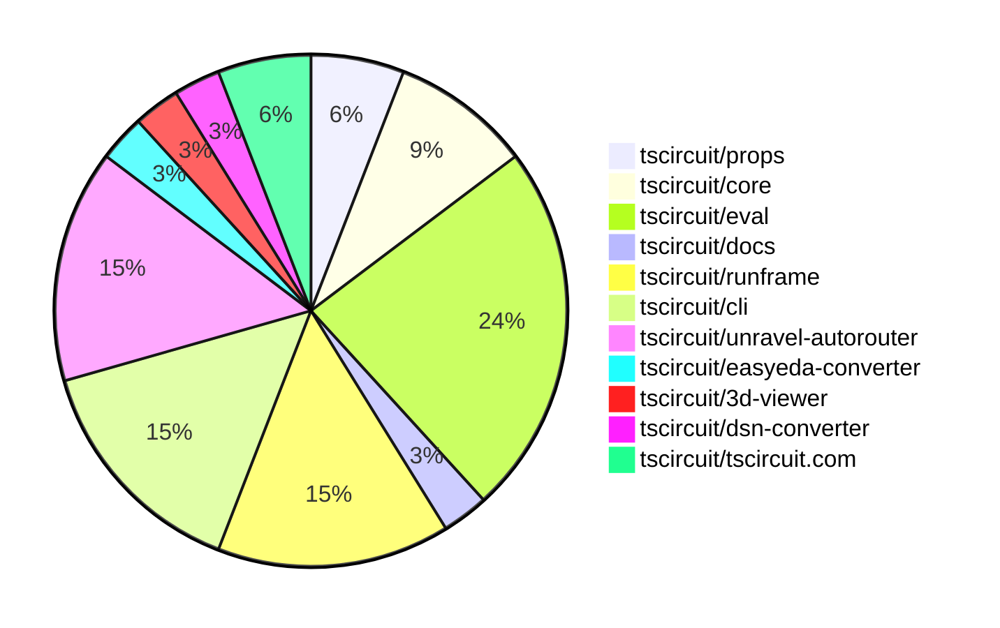

# contribution-tracker

Generates weekly contribution overviews for tscircuit contributors. Check out all
the [contribution overviews here](./contribution-overviews/)

* All PRs in the tscircuit org are scanned/summarized via Claude Haiku
* Claude classifies each Diff/PR as a Major, Minor or Tiny contribution
* All the PRs, summaries, and classifications are organized into charts and tables

The current week is shown below. There are 3 major sections:

* [Contributor Overview](#contributor-overview)
* [PRs by Repository](#prs-by-repository)
* [PRs by Contributor](#changes-by-contributor)

## Current Week

<!-- START_CURRENT_WEEK -->

# Contribution Overview 2025-03-19

## PRs by Repository

## Contributor Overview

| Contributor | 🐳 Major | 🐙 Minor | 🐌 Tiny | ⭐ | Issues Created |
|-------------|---------|---------|---------|-----|----------------|
| [seveibar](#seveibar) | 3 | 14 | 2 | ⭐⭐⭐ | 32 |
| [imrishabh18](#imrishabh18) | 0 | 3 | 2 | ⭐ | 6 |
| [Anshgrover23](#Anshgrover23) | 0 | 1 | 0 |  | 2 |
| [MustafaMulla29](#MustafaMulla29) | 0 | 1 | 0 |  | 0 |
| [kom-senapati](#kom-senapati) | 0 | 1 | 0 |  | 0 |
| [tscircuitbot](#tscircuitbot) | 0 | 0 | 2 |  | 0 |
| [krushnarout](#krushnarout) | 0 | 1 | 0 |  | 0 |
| [ArnavK-09](#ArnavK-09) | 0 | 1 | 0 |  | 1 |
| [ricohageman](#ricohageman) | 0 | 1 | 0 |  | 0 |

## Review Table

[reviews-received-hover]: ## "Number of reviews received for PRs for this contributor"
[approvals-received-hover]: ## "Number of approvals received for PRs this contributor authored"
[rejections-received-hover]: ## "Number of rejections received for PRs this contributor authored"
[prs-opened-hover]: ## "Number of PRs opened by this contributor"
[issues-created-hover]: ## "Number of issues created by this contributor"
[bountied-issues-hover]: ## "Number of issues this contributor created with a bounty"
[bountied-issue-$-hover]: ## "Total bounty amount placed on issues authored by this contributor"

| Contributor | Reviews Received | Approvals Received | Rejections Received | Approvals | Rejections | PRs Opened | PRs Merged | Issues Created | Bountied Issues | Bountied Issue $ |
|---|---|---|---|---|---|---|---|---|---|---|
| [dhvll](#dhvll) | 1 | 1 | 0 | 0 | 0 | 1 | 0 | 0 | 0 | 0 |
| [imrishabh18](#imrishabh18) | 3 | 3 | 0 | 4 | 1 | 6 | 5 | 6 | 3 | 14 |
| [seveibar](#seveibar) | 1 | 1 | 0 | 8 | 2 | 21 | 21 | 32 | 19 | 589 |
| [Anshgrover23](#Anshgrover23) | 1 | 1 | 0 | 0 | 0 | 1 | 1 | 2 | 1 | 10 |
| [onyedikachi-david](#onyedikachi-david) | 1 | 0 | 0 | 0 | 0 | 2 | 0 | 0 | 0 | 0 |
| [MustafaMulla29](#MustafaMulla29) | 3 | 1 | 0 | 0 | 0 | 2 | 1 | 0 | 0 | 0 |
| [siva222003](#siva222003) | 2 | 1 | 0 | 0 | 0 | 2 | 0 | 0 | 0 | 0 |
| [kom-senapati](#kom-senapati) | 3 | 2 | 0 | 0 | 0 | 1 | 1 | 0 | 0 | 0 |
| [tscircuitbot](#tscircuitbot) | 0 | 0 | 0 | 0 | 0 | 6 | 2 | 0 | 0 | 0 |
| [krushnarout](#krushnarout) | 3 | 1 | 2 | 0 | 0 | 4 | 1 | 0 | 0 | 0 |
| [ArnavK-09](#ArnavK-09) | 6 | 1 | 1 | 1 | 0 | 4 | 1 | 1 | 0 | 0 |
| [ricohageman](#ricohageman) | 2 | 1 | 0 | 0 | 0 | 1 | 1 | 0 | 0 | 0 |

## Changes by Repository

### [tscircuit/props](https://github.com/tscircuit/props)

| PR # | Impact | Contributor | Description |
|------|--------|-------------|-------------|
| [#197](https://github.com/tscircuit/props/pull/197) | 🐳 Major | seveibar | Enhances the `ChipProps` type with more advanced features, including support for more complex pin label definitions and better type safety for the `connections` property. |
| [#198](https://github.com/tscircuit/props/pull/198) | 🐙 Minor | seveibar | Adds `ChipConnections` and `ChipPinLabels` utility types to the library. |

### [tscircuit/core](https://github.com/tscircuit/core)

| PR # | Impact | Contributor | Description |
|------|--------|-------------|-------------|
| [#711](https://github.com/tscircuit/core/pull/711) | 🐳 Major | seveibar | Add support for new chip selection syntax: `sel.U1(MyChip)` and `sel.U1<"custompin1" | "custompin2">()` |
| [#710](https://github.com/tscircuit/core/pull/710) | 🐙 Minor | seveibar | Replace "visualize" with "preview" to speed up autorouter previews |
| [#705](https://github.com/tscircuit/core/pull/705) | 🐙 Minor | seveibar | Update the capacity autorouter to version 0.0.34 |

### [tscircuit/eval](https://github.com/tscircuit/eval)

| PR # | Impact | Contributor | Description |
|------|--------|-------------|-------------|
| [#154](https://github.com/tscircuit/eval/pull/154) | 🐙 Minor | seveibar | Add support for subdirectory relative imports and absolute project directory imports |
| [#151](https://github.com/tscircuit/eval/pull/151) | 🐙 Minor | seveibar | Add support for ".ts" file extension loading in eval |
| [#150](https://github.com/tscircuit/eval/pull/150) | 🟣 | seveibar | Adds better file system normalization support, including the ability to import files without file extensions, introduces a new `runTscircuitCode` function, refactors import keys for clarity, and adds default entrypoint configuration. |
| [#146](https://github.com/tscircuit/eval/pull/146) | 🟣 | seveibar | Add an auto-merge workflow for pull requests updating the `@tscircuit/core` package. |
| [#161](https://github.com/tscircuit/eval/pull/161) | 🐙 Minor | imrishabh18 | Fix for a bug that caused an error when importing a `manual-edits.json` file. |
| [#148](https://github.com/tscircuit/eval/pull/148) | 🐌 Tiny | imrishabh18 | Update config to not generate lockfile |
| [#159](https://github.com/tscircuit/eval/pull/159) | 🐌 Tiny | tscircuitbot | Update @tscircuit/core to v0.0.355 |
| [#144](https://github.com/tscircuit/eval/pull/144) | 🐌 Tiny | tscircuitbot | Update @tscircuit/core to v0.0.353 |

### [tscircuit/docs](https://github.com/tscircuit/docs)

| PR # | Impact | Contributor | Description |
|------|--------|-------------|-------------|
| [#22](https://github.com/tscircuit/docs/pull/22) | 🐳 Major | seveibar | The pull request documents the new "selector" pattern for defining chips with type-safe chip properties and pin references. |

### [tscircuit/runframe](https://github.com/tscircuit/runframe)

| PR # | Impact | Contributor | Description |
|------|--------|-------------|-------------|
| [#347](https://github.com/tscircuit/runframe/pull/347) | 🐙 Minor | seveibar | Add a "CLI Admin Panel" option in the advanced menu to help debug CLI events/files. |
| [#339](https://github.com/tscircuit/runframe/pull/339) | 🐙 Minor | seveibar | The pull request adds a new feature that allows the user to force the latest @tscircuit/eval version to be used in the CLI by default. |
| [#359](https://github.com/tscircuit/runframe/pull/359) | 🐙 Minor | imrishabh18 | The pull request updates the `@tscircuit/eval` version from `0.0.131` to `0.0.135` and adds a new test to verify that the `manualEdits` functionality works as expected. |
| [#341](https://github.com/tscircuit/runframe/pull/341) | 🐙 Minor | krushnarout | The pull request changes the default behavior of the CircuitJsonPreview component to open in full screen mode. |
| [#348](https://github.com/tscircuit/runframe/pull/348) | 🐌 Tiny | seveibar | Use a simpler expression to simplify error text and avoid cutting off important text. |

### [tscircuit/cli](https://github.com/tscircuit/cli)

| PR # | Impact | Contributor | Description |
|------|--------|-------------|-------------|
| [#113](https://github.com/tscircuit/cli/pull/113) | 🐙 Minor | seveibar | Adds a GitHub Actions workflow to check for non-dev dependencies in the project and prevent them from being added. |
| [#112](https://github.com/tscircuit/cli/pull/112) | 🐙 Minor | seveibar | Stylize the tsci dev command |
| [#110](https://github.com/tscircuit/cli/pull/110) | 🐙 Minor | seveibar | Update the `@tscircuit/runframe` dependency to version `0.0.254` to get the "force latest eval" feature. |
| [#108](https://github.com/tscircuit/cli/pull/108) | 🐙 Minor | seveibar | Update tscircuit/core and tscircuit/eval dependencies to latest versions |
| [#111](https://github.com/tscircuit/cli/pull/111) | 🐙 Minor | ArnavK-09 | Add tests for the `clone` command functionality in the CLI |

### [tscircuit/unravel-autorouter](https://github.com/tscircuit/unravel-autorouter)

| PR # | Impact | Contributor | Description |
|------|--------|-------------|-------------|
| [#67](https://github.com/tscircuit/unravel-autorouter/pull/67) | 🐙 Minor | seveibar | Adds a lightweight preview visualization to the AutoroutingPipelineSolver to speed up the previews of the autorouter. |
| [#60](https://github.com/tscircuit/unravel-autorouter/pull/60) | 🐙 Minor | seveibar | The pull request allows connecting connections with no hd routes due to adjacent nodes. |
| [#59](https://github.com/tscircuit/unravel-autorouter/pull/59) | 🐙 Minor | seveibar | Adds a new JSON file with data for a capacityMeshNode and a nodeWithPortPoints. |
| [#57](https://github.com/tscircuit/unravel-autorouter/pull/57) | 🐙 Minor | ricohageman | Reduces the time spent sorting candidates by keeping them sorted inside a priority queue, yielding a 17% speedup on the ledmatrix3 benchmark. |
| [#70](https://github.com/tscircuit/unravel-autorouter/pull/70) | 🐌 Tiny | seveibar | Add a new Keyboard4 example file to the project. |

### [tscircuit/easyeda-converter](https://github.com/tscircuit/easyeda-converter)

| PR # | Impact | Contributor | Description |
|------|--------|-------------|-------------|
| [#176](https://github.com/tscircuit/easyeda-converter/pull/176) | 🐙 Minor | Anshgrover23 | Refactors the component definition to use ChipProps for type-safe component definition. |

### [tscircuit/3d-viewer](https://github.com/tscircuit/3d-viewer)

| PR # | Impact | Contributor | Description |
|------|--------|-------------|-------------|
| [#221](https://github.com/tscircuit/3d-viewer/pull/221) | 🐙 Minor | MustafaMulla29 | Fixed a bug where the 3D viewer would be blank when the board's dimensions are 0. |

### [tscircuit/dsn-converter](https://github.com/tscircuit/dsn-converter)

| PR # | Impact | Contributor | Description |
|------|--------|-------------|-------------|
| [#105](https://github.com/tscircuit/dsn-converter/pull/105) | 🐙 Minor | imrishabh18 | The change matches the number of `pcb_via` with the `route_type` via of `pcb_trace` to fix a mismatch between the two. |

### [tscircuit/tscircuit.com](https://github.com/tscircuit/tscircuit.com)

| PR # | Impact | Contributor | Description |
|------|--------|-------------|-------------|
| [#716](https://github.com/tscircuit/tscircuit.com/pull/716) | 🐙 Minor | kom-senapati | Add a new "Starred Snippets" tab to the user profile page. |
| [#735](https://github.com/tscircuit/tscircuit.com/pull/735) | 🐌 Tiny | imrishabh18 | Update lockfile to ensure dependencies are up-to-date. |

## Changes by Contributor

### [seveibar](https://github.com/seveibar)

| PR # | Impact | Description |
|------|--------|-------------|
| [#197](https://github.com/tscircuit/props/pull/197) | 🐳 Major | Enhances the `ChipProps` type with more advanced features, including support for more complex pin label definitions and better type safety for the `connections` property. |
| [#711](https://github.com/tscircuit/core/pull/711) | 🐳 Major | Add support for new chip selection syntax: `sel.U1(MyChip)` and `sel.U1<"custompin1" | "custompin2">()` |
| [#198](https://github.com/tscircuit/props/pull/198) | 🐙 Minor | Adds `ChipConnections` and `ChipPinLabels` utility types to the library. |
| [#710](https://github.com/tscircuit/core/pull/710) | 🐙 Minor | Replace "visualize" with "preview" to speed up autorouter previews |
| [#705](https://github.com/tscircuit/core/pull/705) | 🐙 Minor | Update the capacity autorouter to version 0.0.34 |
| [#154](https://github.com/tscircuit/eval/pull/154) | 🐙 Minor | Add support for subdirectory relative imports and absolute project directory imports |
| [#151](https://github.com/tscircuit/eval/pull/151) | 🐙 Minor | Add support for ".ts" file extension loading in eval |
| [#150](https://github.com/tscircuit/eval/pull/150) | 🟣 | Adds better file system normalization support, including the ability to import files without file extensions, introduces a new `runTscircuitCode` function, refactors import keys for clarity, and adds default entrypoint configuration. |
| [#146](https://github.com/tscircuit/eval/pull/146) | 🟣 | Add an auto-merge workflow for pull requests updating the `@tscircuit/core` package. |
| [#22](https://github.com/tscircuit/docs/pull/22) | 🐳 Major | The pull request documents the new "selector" pattern for defining chips with type-safe chip properties and pin references. |
| [#347](https://github.com/tscircuit/runframe/pull/347) | 🐙 Minor | Add a "CLI Admin Panel" option in the advanced menu to help debug CLI events/files. |
| [#339](https://github.com/tscircuit/runframe/pull/339) | 🐙 Minor | The pull request adds a new feature that allows the user to force the latest @tscircuit/eval version to be used in the CLI by default. |
| [#113](https://github.com/tscircuit/cli/pull/113) | 🐙 Minor | Adds a GitHub Actions workflow to check for non-dev dependencies in the project and prevent them from being added. |
| [#112](https://github.com/tscircuit/cli/pull/112) | 🐙 Minor | Stylize the tsci dev command |
| [#110](https://github.com/tscircuit/cli/pull/110) | 🐙 Minor | Update the `@tscircuit/runframe` dependency to version `0.0.254` to get the "force latest eval" feature. |
| [#108](https://github.com/tscircuit/cli/pull/108) | 🐙 Minor | Update tscircuit/core and tscircuit/eval dependencies to latest versions |
| [#67](https://github.com/tscircuit/unravel-autorouter/pull/67) | 🐙 Minor | Adds a lightweight preview visualization to the AutoroutingPipelineSolver to speed up the previews of the autorouter. |
| [#60](https://github.com/tscircuit/unravel-autorouter/pull/60) | 🐙 Minor | The pull request allows connecting connections with no hd routes due to adjacent nodes. |
| [#59](https://github.com/tscircuit/unravel-autorouter/pull/59) | 🐙 Minor | Adds a new JSON file with data for a capacityMeshNode and a nodeWithPortPoints. |
| [#348](https://github.com/tscircuit/runframe/pull/348) | 🐌 Tiny | Use a simpler expression to simplify error text and avoid cutting off important text. |
| [#70](https://github.com/tscircuit/unravel-autorouter/pull/70) | 🐌 Tiny | Add a new Keyboard4 example file to the project. |

### [Anshgrover23](https://github.com/Anshgrover23)

| PR # | Impact | Description |
|------|--------|-------------|
| [#176](https://github.com/tscircuit/easyeda-converter/pull/176) | 🐙 Minor | Refactors the component definition to use ChipProps for type-safe component definition. |

### [MustafaMulla29](https://github.com/MustafaMulla29)

| PR # | Impact | Description |
|------|--------|-------------|
| [#221](https://github.com/tscircuit/3d-viewer/pull/221) | 🐙 Minor | Fixed a bug where the 3D viewer would be blank when the board's dimensions are 0. |

### [imrishabh18](https://github.com/imrishabh18)

| PR # | Impact | Description |
|------|--------|-------------|
| [#105](https://github.com/tscircuit/dsn-converter/pull/105) | 🐙 Minor | The change matches the number of `pcb_via` with the `route_type` via of `pcb_trace` to fix a mismatch between the two. |
| [#161](https://github.com/tscircuit/eval/pull/161) | 🐙 Minor | Fix for a bug that caused an error when importing a `manual-edits.json` file. |
| [#359](https://github.com/tscircuit/runframe/pull/359) | 🐙 Minor | The pull request updates the `@tscircuit/eval` version from `0.0.131` to `0.0.135` and adds a new test to verify that the `manualEdits` functionality works as expected. |
| [#735](https://github.com/tscircuit/tscircuit.com/pull/735) | 🐌 Tiny | Update lockfile to ensure dependencies are up-to-date. |
| [#148](https://github.com/tscircuit/eval/pull/148) | 🐌 Tiny | Update config to not generate lockfile |

### [kom-senapati](https://github.com/kom-senapati)

| PR # | Impact | Description |
|------|--------|-------------|
| [#716](https://github.com/tscircuit/tscircuit.com/pull/716) | 🐙 Minor | Add a new "Starred Snippets" tab to the user profile page. |

### [tscircuitbot](https://github.com/tscircuitbot)

| PR # | Impact | Description |
|------|--------|-------------|
| [#159](https://github.com/tscircuit/eval/pull/159) | 🐌 Tiny | Update @tscircuit/core to v0.0.355 |
| [#144](https://github.com/tscircuit/eval/pull/144) | 🐌 Tiny | Update @tscircuit/core to v0.0.353 |

### [krushnarout](https://github.com/krushnarout)

| PR # | Impact | Description |
|------|--------|-------------|
| [#341](https://github.com/tscircuit/runframe/pull/341) | 🐙 Minor | The pull request changes the default behavior of the CircuitJsonPreview component to open in full screen mode. |

### [ArnavK-09](https://github.com/ArnavK-09)

| PR # | Impact | Description |
|------|--------|-------------|
| [#111](https://github.com/tscircuit/cli/pull/111) | 🐙 Minor | Add tests for the `clone` command functionality in the CLI |

### [ricohageman](https://github.com/ricohageman)

| PR # | Impact | Description |
|------|--------|-------------|
| [#57](https://github.com/tscircuit/unravel-autorouter/pull/57) | 🐙 Minor | Reduces the time spent sorting candidates by keeping them sorted inside a priority queue, yielding a 17% speedup on the ledmatrix3 benchmark. |

<!-- END_CURRENT_WEEK -->
