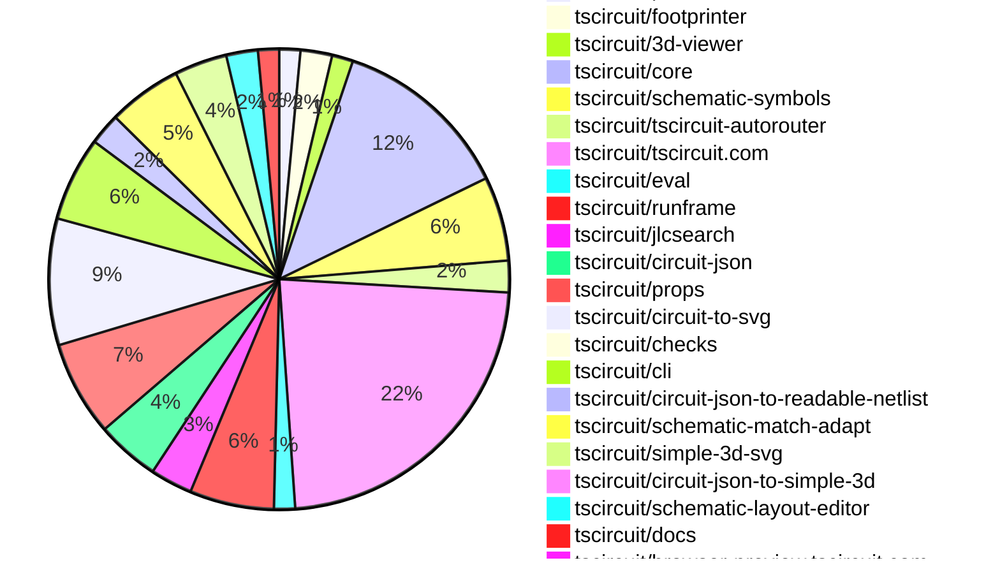

# contribution-tracker

Generates weekly contribution overviews for tscircuit contributors. Check out all
the [contribution overviews here](./contribution-overviews/)

* All PRs in the tscircuit org are scanned/summarized via Claude Haiku
* Claude classifies each Diff/PR as a Major, Minor or Tiny contribution
* All the PRs, summaries, and classifications are organized into charts and tables

The current week is shown below. There are 3 major sections:

* [Contributor Overview](#contributor-overview)
* [PRs by Repository](#prs-by-repository)
* [PRs by Contributor](#changes-by-contributor)

## Current Week

<!-- START_CURRENT_WEEK -->

# Contribution Overview 2025-06-04

## PRs by Repository

## Contributor Overview

| Contributor | 🐳 Major | 🐙 Minor | 🐌 Tiny | ⭐ | Issues Created | Discussion Contributions |
|-------------|---------|---------|---------|-----|----------------|--------------------------|
| [seveibar](#seveibar) | 1 | 77 | 3 | 👑👑👑 | 5 | 0🔹 0🔶 0💎 |
| [techmannih](#techmannih) | 0 | 14 | 3 | ⭐⭐⭐ | 2 | 0🔹 0🔶 0💎 |
| [imrishabh18](#imrishabh18) | 0 | 10 | 1 | ⭐⭐ | 5 | 0🔹 0🔶 0💎 |
| [ShiboSoftwareDev](#ShiboSoftwareDev) | 0 | 8 | 5 | ⭐⭐ | 10 | 0🔹 0🔶 0💎 |
| [ArnavK-09](#ArnavK-09) | 0 | 7 | 2 | ⭐⭐ | 4 | 0🔹 0🔶 0💎 |
| [Abse2001](#Abse2001) | 0 | 2 | 2 | ⭐ | 3 | 0🔹 0🔶 0💎 |
| [andrii-balitskyi](#andrii-balitskyi) | 1 | 1 | 0 | ⭐ | 0 | 0🔹 0🔶 0💎 |
| [tscircuitbot](#tscircuitbot) | 0 | 0 | 1 |  | 0 | 0🔹 0🔶 0💎 |

### Discussion Contribution Legend

- 🔹 Normal Comments: Basic participation with minimal effort
- 🔶 Great Informative Comments: Thoughtful participation that adds value
- 💎 Incredible Comments: Exceptional participation with high-quality content

## Review Table

[reviews-received-hover]: ## "Number of reviews received for PRs for this contributor"
[approvals-received-hover]: ## "Number of approvals received for PRs this contributor authored"
[rejections-received-hover]: ## "Number of rejections received for PRs this contributor authored"
[prs-opened-hover]: ## "Number of PRs opened by this contributor"
[issues-created-hover]: ## "Number of issues created by this contributor"
[bountied-issues-hover]: ## "Number of issues this contributor created with a bounty"
[bountied-issue-$-hover]: ## "Total bounty amount placed on issues authored by this contributor"

| Contributor | Reviews Received | Approvals Received | Rejections Received | Approvals | Rejections | PRs Opened | PRs Merged | Issues Created | Bountied Issues | Bountied Issue $ |
|---|---|---|---|---|---|---|---|---|---|---|
| [ArnavK-09](#ArnavK-09) | 13 | 9 | 0 | 0 | 0 | 14 | 9 | 4 | 0 | 0 |
| [seveibar](#seveibar) | 20 | 0 | 0 | 48 | 10 | 110 | 82 | 5 | 2 | 10 |
| [ShiboSoftwareDev](#ShiboSoftwareDev) | 26 | 14 | 1 | 2 | 0 | 18 | 14 | 10 | 1 | 18 |
| [graphite-app[bot]](#graphite-app[bot]) | 0 | 0 | 0 | 0 | 0 | 0 | 0 | 0 | 0 | 0 |
| [techmannih](#techmannih) | 40 | 20 | 6 | 0 | 0 | 28 | 17 | 2 | 0 | 0 |
| [imrishabh18](#imrishabh18) | 11 | 5 | 1 | 6 | 1 | 14 | 11 | 5 | 0 | 0 |
| [Abse2001](#Abse2001) | 14 | 5 | 1 | 0 | 0 | 6 | 4 | 3 | 0 | 0 |
| [andrii-balitskyi](#andrii-balitskyi) | 2 | 2 | 0 | 0 | 0 | 2 | 2 | 0 | 0 | 0 |
| [Anshgrover23](#Anshgrover23) | 4 | 1 | 2 | 0 | 0 | 1 | 0 | 0 | 0 | 0 |
| [tscircuitbot](#tscircuitbot) | 0 | 0 | 0 | 0 | 0 | 34 | 1 | 0 | 0 | 0 |

## Changes by Repository

### [tscircuit/pcb-viewer](https://github.com/tscircuit/pcb-viewer)

| PR # | Impact | Contributor | Description | Milestone Aligned |
|------|--------|-------------|-------------|-------------------|
| [#322](https://github.com/tscircuit/pcb-viewer/pull/322) | 🐙 Minor | ShiboSoftwareDev | The implementation of horizontal inversion for silkscreen text on the bottom layer enhances the visual accuracy of PCB designs. | ❌ |
| [#317](https://github.com/tscircuit/pcb-viewer/pull/317) | 🐌 Tiny | ArnavK-09 | Removing unnecessary dependencies streamlines the project and reduces potential maintenance overhead. | ❌ |

### [tscircuit/footprinter](https://github.com/tscircuit/footprinter)

| PR # | Impact | Contributor | Description | Milestone Aligned |
|------|--------|-------------|-------------|-------------------|
| [#286](https://github.com/tscircuit/footprinter/pull/286) | 🐙 Minor | ShiboSoftwareDev | Enhancement of pinrow functionality to support double-sided pin labels, improving design flexibility. | ❌ |
| [#287](https://github.com/tscircuit/footprinter/pull/287) | 🐙 Minor | techmannih | Enhancement of the SON footprint functionality by adding support for a 6-pin variant. | ❌ |
| [#285](https://github.com/tscircuit/footprinter/pull/285) | 🐌 Tiny | techmannih | Establishes ownership for repository files, enhancing accountability and collaboration. | ❌ |

### [tscircuit/3d-viewer](https://github.com/tscircuit/3d-viewer)

| PR # | Impact | Contributor | Description | Milestone Aligned |
|------|--------|-------------|-------------|-------------------|
| [#326](https://github.com/tscircuit/3d-viewer/pull/326) | 🐙 Minor | ShiboSoftwareDev | Integrates Bun for building and loading WebAssembly modules, enhancing the project's build process and performance. | ❌ |
| [#328](https://github.com/tscircuit/3d-viewer/pull/328) | 🐌 Tiny | ShiboSoftwareDev | The change involves updating the lockfile, which is essential for maintaining package integrity and ensuring consistent installations across environments. | ❌ |

### [tscircuit/core](https://github.com/tscircuit/core)

| PR # | Impact | Contributor | Description | Milestone Aligned |
|------|--------|-------------|-------------|-------------------|
| [#897](https://github.com/tscircuit/core/pull/897) | 🐳 Major | andrii-balitskyi | Enhancement of schematic orientation functionality for PinHeader components, improving usability in circuit design. | ✅ |
| [#888](https://github.com/tscircuit/core/pull/888) | 🐙 Minor | ShiboSoftwareDev | Enhancements to jumper pin handling improve circuit integrity and functionality. | ❌ |
| [#883](https://github.com/tscircuit/core/pull/883) | 🐙 Minor | ShiboSoftwareDev | Enhancements to the pinrow component for better label handling and rendering. | ❌ |
| [#893](https://github.com/tscircuit/core/pull/893) | 🐙 Minor | seveibar | Enhances the RootCircuit class by adding a project URL feature, improving metadata handling for circuit JSON outputs. | ❌ |
| [#874](https://github.com/tscircuit/core/pull/874) | 🐙 Minor | seveibar | Enhancements to user control over schematic layouts significantly improve usability and flexibility in circuit design. | ❌ |
| [#889](https://github.com/tscircuit/core/pull/889) | 🐙 Minor | seveibar | Enhancements to breakout components and routing support significantly improve the functionality of the circuit design framework. | ❌ |
| [#879](https://github.com/tscircuit/core/pull/879) | 🐙 Minor | seveibar | Enhancements to net label handling improve schematic clarity and usability. | ❌ |
| [#876](https://github.com/tscircuit/core/pull/876) | 🐙 Minor | seveibar | Elimination of unused logic enhances code clarity and maintainability. | ❌ |
| [#868](https://github.com/tscircuit/core/pull/868) | 🐙 Minor | seveibar | Enhancing input validation for net selector names improves code robustness and prevents potential errors in circuit definitions. | ❌ |
| [#866](https://github.com/tscircuit/core/pull/866) | 🐙 Minor | seveibar | Enhancements to net selector validation improve error handling and input integrity. | ❌ |
| [#867](https://github.com/tscircuit/core/pull/867) | 🐙 Minor | seveibar | Enhancing selector functionality with shorthand support adds significant usability improvements for users. | ❌ |
| [#886](https://github.com/tscircuit/core/pull/886) | 🐙 Minor | techmannih | Enhancement of the potentiometer component by improving the display of resistance units, which adds clarity and usability. | ❌ |
| [#885](https://github.com/tscircuit/core/pull/885) | 🐙 Minor | techmannih | Enhancement of the Inductor component's display functionality by correctly formatting the inductance unit. | ❌ |
| [#870](https://github.com/tscircuit/core/pull/870) | 🐙 Minor | techmannih | Enhancement of the LED component by adding a method to retrieve schematic display values, improving usability in circuit design. | ❌ |
| [#878](https://github.com/tscircuit/core/pull/878) | 🐌 Tiny | ShiboSoftwareDev | Updating the dependency version for checks enhances the reliability of the codebase without introducing breaking changes. | ❌ |
| [#887](https://github.com/tscircuit/core/pull/887) | 🐌 Tiny | techmannih | Updating the dependency version in package.json reflects a commitment to maintaining up-to-date libraries, which can enhance stability and performance. | ❌ |
| [#881](https://github.com/tscircuit/core/pull/881) | 🐌 Tiny | Abse2001 | The update of a dependency and the corresponding test fixes enhance the reliability of the codebase without introducing breaking changes. | ❌ |

### [tscircuit/schematic-symbols](https://github.com/tscircuit/schematic-symbols)

| PR # | Impact | Contributor | Description | Milestone Aligned |
|------|--------|-------------|-------------|-------------------|
| [#298](https://github.com/tscircuit/schematic-symbols/pull/298) | 🐙 Minor | ShiboSoftwareDev | Introduces new horizontal and vertical ground symbols to the schematic symbols library. | ❌ |
| [#292](https://github.com/tscircuit/schematic-symbols/pull/292) | 🐙 Minor | ShiboSoftwareDev | Enhancements to the ground symbol provide new orientations, improving usability in schematic designs. | ❌ |
| [#294](https://github.com/tscircuit/schematic-symbols/pull/294) | 🐙 Minor | seveibar | Enhancement of the schematic symbols library by introducing a new testpoint symbol with improved design. | ❌ |
| [#300](https://github.com/tscircuit/schematic-symbols/pull/300) | 🐙 Minor | techmannih | Enhancements to potentiometer2 symbols improve usability and flexibility in schematic designs. | ❌ |
| [#299](https://github.com/tscircuit/schematic-symbols/pull/299) | 🐙 Minor | techmannih | Enhancements to the symbol's text positioning improve usability and clarity in schematic designs. | ❌ |
| [#297](https://github.com/tscircuit/schematic-symbols/pull/297) | 🐙 Minor | techmannih | Adjusts the text positioning for reference and value labels in the polarized capacitor left symbol, enhancing clarity and usability. | ❌ |
| [#296](https://github.com/tscircuit/schematic-symbols/pull/296) | 🐙 Minor | techmannih | Enhancements to the workflow for publishing to npm, improving automation and token management. | ❌ |
| [#295](https://github.com/tscircuit/schematic-symbols/pull/295) | 🐙 Minor | techmannih | Enhancement of the testpoint up symbol by correcting the reference text positioning. | ❌ |

### [tscircuit/tscircuit-autorouter](https://github.com/tscircuit/tscircuit-autorouter)

| PR # | Impact | Contributor | Description | Milestone Aligned |
|------|--------|-------------|-------------|-------------------|
| [#137](https://github.com/tscircuit/tscircuit-autorouter/pull/137) | 🐙 Minor | ShiboSoftwareDev | Introduces new JSON data and a fixture for high-density node routing, enhancing testing capabilities. | ❌ |
| [#138](https://github.com/tscircuit/tscircuit-autorouter/pull/138) | 🐙 Minor | seveibar | Introduces a new example for the MultiHeadPolyLineIntraNodeSolver, enhancing the testing framework for high-density routing. | ❌ |
| [#136](https://github.com/tscircuit/tscircuit-autorouter/pull/136) | 🐙 Minor | seveibar | Dynamic loading of bug report data enhances the debugging process by allowing real-time data fetching based on URL parameters. | ❌ |

### [tscircuit/tscircuit.com](https://github.com/tscircuit/tscircuit.com)

| PR # | Impact | Contributor | Description | Milestone Aligned |
|------|--------|-------------|-------------|-------------------|
| [#1231](https://github.com/tscircuit/tscircuit.com/pull/1231) | 🐙 Minor | ArnavK-09 | Enhances the robustness of the code by ensuring a fallback mechanism for invalid hash inputs. | ❌ |
| [#1220](https://github.com/tscircuit/tscircuit.com/pull/1220) | 🐙 Minor | ArnavK-09 | Enhancements to package name editing and validation improve user experience and functionality. | ❌ |
| [#1214](https://github.com/tscircuit/tscircuit.com/pull/1214) | 🐙 Minor | ArnavK-09 | The addition of a new API endpoint for JLCPCB package generation significantly enhances the functionality of the application, allowing for better integration with external components. | ❌ |
| [#1215](https://github.com/tscircuit/tscircuit.com/pull/1215) | 🐙 Minor | ArnavK-09 | Enhancing keyboard user experience by enabling Enter key submissions across multiple dialog components significantly improves usability. | ❌ |
| [#1217](https://github.com/tscircuit/tscircuit.com/pull/1217) | 🐙 Minor | ArnavK-09 | Refactoring the latest page to enhance consistency with other pages by streamlining component usage and improving code organization. | ❌ |
| [#1199](https://github.com/tscircuit/tscircuit.com/pull/1199) | 🐙 Minor | ArnavK-09 | Enhancements to the code editor's usability during save operations and a more structured package creation process improve overall user experience and code maintainability. | ❌ |
| [#1241](https://github.com/tscircuit/tscircuit.com/pull/1241) | 🐙 Minor | seveibar | Enhancement of user experience by preventing unintended newline insertion in the CodeEditor. | ❌ |
| [#1238](https://github.com/tscircuit/tscircuit.com/pull/1238) | 🐙 Minor | seveibar | Enhances the package release process by integrating AI review capabilities, improving user interaction and feedback. | ❌ |
| [#1237](https://github.com/tscircuit/tscircuit.com/pull/1237) | 🐙 Minor | seveibar | Enhancements to the CodeAndPreview component for better project URL handling. | ❌ |
| [#1224](https://github.com/tscircuit/tscircuit.com/pull/1224) | 🐙 Minor | seveibar | Enhances package release functionality by allowing the use of package names in addition to package IDs. | ❌ |
| [#1222](https://github.com/tscircuit/tscircuit.com/pull/1222) | 🐙 Minor | seveibar | Enhancements to the circuit module template improve its usability and integration with existing components. | ❌ |
| [#1218](https://github.com/tscircuit/tscircuit.com/pull/1218) | 🐙 Minor | seveibar | Enhances user experience by suppressing TypeScript linting errors during file downloads, preventing disruption in the editor. | ❌ |
| [#1213](https://github.com/tscircuit/tscircuit.com/pull/1213) | 🐙 Minor | seveibar | Improves user experience by preventing loss of text selection during file downloads in the CodeEditor. | ❌ |
| [#1211](https://github.com/tscircuit/tscircuit.com/pull/1211) | 🐙 Minor | seveibar | Prevents unwanted newlines in the code editor when executing Cmd+Enter, enhancing user experience. | ❌ |
| [#1207](https://github.com/tscircuit/tscircuit.com/pull/1207) | 🐙 Minor | seveibar | Enhances user experience by providing customizable options for downloading PCB SVG files. | ❌ |
| [#1206](https://github.com/tscircuit/tscircuit.com/pull/1206) | 🐙 Minor | seveibar | Enhances the download functionality by allowing users to download PCB views as SVG files, improving usability for circuit design. | ❌ |
| [#1202](https://github.com/tscircuit/tscircuit.com/pull/1202) | 🐙 Minor | seveibar | Enhancements to the frontend bindings and package release schema improve user experience and functionality. | ❌ |
| [#1200](https://github.com/tscircuit/tscircuit.com/pull/1200) | 🐙 Minor | seveibar | Enhancements to the package release schema and the introduction of a rebuild API endpoint significantly improve the package management capabilities. | ❌ |
| [#1194](https://github.com/tscircuit/tscircuit.com/pull/1194) | 🐙 Minor | seveibar | Enhancements to package image hashing and the introduction of a new builds page significantly improve the functionality and user experience of the application. | ❌ |
| [#1229](https://github.com/tscircuit/tscircuit.com/pull/1229) | 🐙 Minor | imrishabh18 | Enhances the package builds page by adding a rebuild functionality, improving user experience and operational efficiency. | ❌ |
| [#1226](https://github.com/tscircuit/tscircuit.com/pull/1226) | 🐙 Minor | imrishabh18 | Enhances code editing capabilities by introducing line and block comment functionality. | ❌ |
| [#1219](https://github.com/tscircuit/tscircuit.com/pull/1219) | 🐙 Minor | imrishabh18 | Enhancing user experience by normalizing username lookups to be case insensitive, thus improving accessibility and functionality. | ❌ |
| [#1212](https://github.com/tscircuit/tscircuit.com/pull/1212) | 🐙 Minor | imrishabh18 | The pull request enhances the application by removing an unused beta page and improving the structure of fallback messages, contributing to cleaner code and better user experience. | ❌ |
| [#1210](https://github.com/tscircuit/tscircuit.com/pull/1210) | 🐙 Minor | imrishabh18 | Enhancements to log display improve user experience by providing clearer build status information. | ❌ |
| [#1209](https://github.com/tscircuit/tscircuit.com/pull/1209) | 🐙 Minor | imrishabh18 | The changes enhance the consistency between the frontend and backend by aligning enum values for build statuses. | ❌ |
| [#1208](https://github.com/tscircuit/tscircuit.com/pull/1208) | 🐙 Minor | imrishabh18 | Enhancements to the API endpoint improve functionality by allowing optional logging and removing unnecessary dependencies. | ❌ |
| [#1205](https://github.com/tscircuit/tscircuit.com/pull/1205) | 🐙 Minor | imrishabh18 | Addresses a critical authentication issue that enhances user experience when reporting bugs. | ❌ |
| [#1235](https://github.com/tscircuit/tscircuit.com/pull/1235) | 🐌 Tiny | ShiboSoftwareDev | Updating dependencies enhances the project's stability and security by ensuring the latest versions are used. | ❌ |
| [#1216](https://github.com/tscircuit/tscircuit.com/pull/1216) | 🐌 Tiny | ArnavK-09 | Commenting out unused imports helps maintain clean code and prevents potential errors during development. | ❌ |
| [#1236](https://github.com/tscircuit/tscircuit.com/pull/1236) | 🐌 Tiny | techmannih | Updating the dependency version enhances the stability and performance of the project by incorporating the latest improvements and fixes. | ❌ |
| [#1240](https://github.com/tscircuit/tscircuit.com/pull/1240) | 🐌 Tiny | imrishabh18 | Removing the formatbot workflow streamlines the CI process but may impact code formatting consistency. | ❌ |

### [tscircuit/eval](https://github.com/tscircuit/eval)

| PR # | Impact | Contributor | Description | Milestone Aligned |
|------|--------|-------------|-------------|-------------------|
| [#448](https://github.com/tscircuit/eval/pull/448) | 🐌 Tiny | ShiboSoftwareDev | Increased timeout for a test to ensure proper evaluation and auto-update of core functionality. | ❌ |
| [#428](https://github.com/tscircuit/eval/pull/428) | 🐌 Tiny | tscircuitbot | Updating the core library version enhances compatibility and may include important bug fixes or improvements. | ❌ |

### [tscircuit/runframe](https://github.com/tscircuit/runframe)

| PR # | Impact | Contributor | Description | Milestone Aligned |
|------|--------|-------------|-------------|-------------------|
| [#720](https://github.com/tscircuit/runframe/pull/720) | 🐙 Minor | ArnavK-09 | Enhancements to error handling in the ErrorTabContent component streamline user experience by consolidating error messages and improving navigation. | ❌ |
| [#732](https://github.com/tscircuit/runframe/pull/732) | 🐙 Minor | seveibar | Enhancement of bug reporting functionality by allowing the use of a project URL for autorouting bug reports. | ❌ |
| [#731](https://github.com/tscircuit/runframe/pull/731) | 🐙 Minor | seveibar | Enhancements to the UI for better visibility of active asynchronous effects improve user experience and debugging capabilities. | ❌ |
| [#729](https://github.com/tscircuit/runframe/pull/729) | 🐙 Minor | seveibar | Enhancing user experience by preventing the Run button from being active until necessary dependencies are fully loaded. | ❌ |
| [#728](https://github.com/tscircuit/runframe/pull/728) | 🐙 Minor | seveibar | Enhancing the clarity of bug reports by including the current URL path improves debugging and user support. | ❌ |
| [#712](https://github.com/tscircuit/runframe/pull/712) | 🐙 Minor | seveibar | Enhances error handling by improving the UI for execution errors and including stack traces for better debugging. | ❌ |
| [#708](https://github.com/tscircuit/runframe/pull/708) | 🐙 Minor | andrii-balitskyi | Enhancing error handling by clearing render logs and progress bar improves user experience during execution failures. | ❌ |
| [#727](https://github.com/tscircuit/runframe/pull/727) | 🐌 Tiny | ShiboSoftwareDev | Updating the pcb-viewer dependency enhances the project's capabilities with the latest features and fixes. | ❌ |

### [tscircuit/jlcsearch](https://github.com/tscircuit/jlcsearch)

| PR # | Impact | Contributor | Description | Milestone Aligned |
|------|--------|-------------|-------------|-------------------|
| [#59](https://github.com/tscircuit/jlcsearch/pull/59) | 🐳 Major | seveibar | The addition of an accelerometer table and associated routes enhances the functionality of the application by allowing users to access and filter accelerometer data effectively. | ❌ |
| [#58](https://github.com/tscircuit/jlcsearch/pull/58) | 🐙 Minor | seveibar | The addition of a gyroscope listing page enhances the functionality of the application by allowing users to browse and filter gyroscope components effectively. | ❌ |
| [#56](https://github.com/tscircuit/jlcsearch/pull/56) | 🐙 Minor | seveibar | Enhancements to filtering functionality for switches improve user experience and data retrieval. | ❌ |
| [#55](https://github.com/tscircuit/jlcsearch/pull/55) | 🐙 Minor | seveibar | The addition of a derived table for switches and associated routes enhances the database structure and API functionality, providing better access to switch data. | ❌ |

### [tscircuit/circuit-json](https://github.com/tscircuit/circuit-json)

| PR # | Impact | Contributor | Description | Milestone Aligned |
|------|--------|-------------|-------------|-------------------|
| [#211](https://github.com/tscircuit/circuit-json/pull/211) | 🐙 Minor | seveibar | Enhancing error handling by allowing omission of error_type with default values improves code usability and consistency. | ❌ |
| [#217](https://github.com/tscircuit/circuit-json/pull/217) | 🐙 Minor | seveibar | Enhancing project metadata with an optional URL improves the usability and accessibility of project information. | ❌ |
| [#216](https://github.com/tscircuit/circuit-json/pull/216) | 🐙 Minor | seveibar | Enhancement of the PcbBreakoutPoint schema by adding an optional source_port_id property, improving the flexibility of PCB design. | ❌ |
| [#215](https://github.com/tscircuit/circuit-json/pull/215) | 🐙 Minor | seveibar | Introducing a new routing target element enhances the PCB design capabilities. | ❌ |
| [#213](https://github.com/tscircuit/circuit-json/pull/213) | 🐙 Minor | techmannih | Removing the source LED component streamlines the codebase by eliminating unused elements, enhancing maintainability. | ❌ |
| [#214](https://github.com/tscircuit/circuit-json/pull/214) | 🐙 Minor | techmannih | The addition of a new source component enhances the library's capability to define simple test points, which is valuable for circuit design. | ❌ |

### [tscircuit/props](https://github.com/tscircuit/props)

| PR # | Impact | Contributor | Description | Milestone Aligned |
|------|--------|-------------|-------------|-------------------|
| [#271](https://github.com/tscircuit/props/pull/271) | 🐙 Minor | seveibar | Enhancing the PinHeader component with a new connections property significantly improves its functionality and flexibility. | ❌ |
| [#270](https://github.com/tscircuit/props/pull/270) | 🐙 Minor | seveibar | The addition of the solderjumper component enhances the library by providing a new functionality for bridging pins with solder, which is valuable for circuit design. | ❌ |
| [#265](https://github.com/tscircuit/props/pull/265) | 🐙 Minor | seveibar | The addition of breakout and breakoutpoint components enhances the library's functionality, allowing for more complex circuit designs. | ❌ |
| [#263](https://github.com/tscircuit/props/pull/263) | 🐙 Minor | seveibar | Enhancement of layout configuration by introducing an optional property for template adaptation. | ❌ |
| [#262](https://github.com/tscircuit/props/pull/262) | 🐙 Minor | seveibar | The addition of the testpoint component enhances the library's functionality by providing a new component type with specific properties for electronic design. | ❌ |
| [#266](https://github.com/tscircuit/props/pull/266) | 🐙 Minor | Abse2001 | Refines the title anchor position for improved layout consistency. | ❌ |
| [#264](https://github.com/tscircuit/props/pull/264) | 🐙 Minor | Abse2001 | Enhancements to the schematic box properties improve flexibility in positioning and alignment of titles. | ❌ |
| [#268](https://github.com/tscircuit/props/pull/268) | 🐌 Tiny | seveibar | Renaming a property for clarity and consistency in the codebase. | ❌ |
| [#267](https://github.com/tscircuit/props/pull/267) | 🐌 Tiny | seveibar | Removing the unused `titleAnchorPosition` prop streamlines the component's API and enhances maintainability. | ❌ |

### [tscircuit/circuit-to-svg](https://github.com/tscircuit/circuit-to-svg)

| PR # | Impact | Contributor | Description | Milestone Aligned |
|------|--------|-------------|-------------|-------------------|
| [#254](https://github.com/tscircuit/circuit-to-svg/pull/254) | 🐙 Minor | seveibar | Enhancements to net label symbol rendering improve accuracy and visual representation in schematics. | ❌ |
| [#246](https://github.com/tscircuit/circuit-to-svg/pull/246) | 🐙 Minor | seveibar | Enhancement of PCB trace rendering by allowing soldermask colors to override default trace colors, improving visual accuracy in designs. | ❌ |
| [#247](https://github.com/tscircuit/circuit-to-svg/pull/247) | 🐙 Minor | seveibar | Enhancements to the README API section improve clarity and add a new assembly function, enriching user documentation. | ❌ |
| [#245](https://github.com/tscircuit/circuit-to-svg/pull/245) | 🐙 Minor | seveibar | Refining SVG bounds enhances the accuracy of PCB visualizations, ensuring they align with board dimensions. | ❌ |
| [#244](https://github.com/tscircuit/circuit-to-svg/pull/244) | 🐙 Minor | seveibar | The removal of the black background addresses rendering issues in 3D viewers, enhancing visual clarity and usability. | ❌ |
| [#241](https://github.com/tscircuit/circuit-to-svg/pull/241) | 🐙 Minor | seveibar | Enhancements to PCB SVG generation through customizable color mappings improve flexibility and user experience. | ❌ |
| [#238](https://github.com/tscircuit/circuit-to-svg/pull/238) | 🐙 Minor | seveibar | Enhances PCB SVG conversion by introducing an option to control padding around the board, improving flexibility in rendering. | ❌ |
| [#237](https://github.com/tscircuit/circuit-to-svg/pull/237) | 🐙 Minor | seveibar | Enhancing the SVG generation functionality by allowing customization of the background color adds significant value for users needing specific visual outputs. | ❌ |
| [#248](https://github.com/tscircuit/circuit-to-svg/pull/248) | 🐙 Minor | techmannih | Enhancement of the SMT pad functionality by adding support for circular shapes. | ❌ |
| [#242](https://github.com/tscircuit/circuit-to-svg/pull/242) | 🐙 Minor | techmannih | Enhancement of SMT pad support by adding polygon shape rendering capabilities. | ❌ |
| [#255](https://github.com/tscircuit/circuit-to-svg/pull/255) | 🐙 Minor | imrishabh18 | Enhances user interface by improving visual feedback on trace hover through color inversion of junction circles. | ❌ |
| [#236](https://github.com/tscircuit/circuit-to-svg/pull/236) | 🐌 Tiny | Abse2001 | The pull request updates a dependency in the project, which is a routine maintenance task that can help ensure compatibility and stability. | ❌ |

### [tscircuit/checks](https://github.com/tscircuit/checks)

| PR # | Impact | Contributor | Description | Milestone Aligned |
|------|--------|-------------|-------------|-------------------|
| [#50](https://github.com/tscircuit/checks/pull/50) | 🐙 Minor | seveibar | Enhancing the library with a new check for minimum spacing between vias on the same net adds significant value to design integrity. | ❌ |

### [tscircuit/cli](https://github.com/tscircuit/cli)

| PR # | Impact | Contributor | Description | Milestone Aligned |
|------|--------|-------------|-------------|-------------------|
| [#218](https://github.com/tscircuit/cli/pull/218) | 🐙 Minor | seveibar | Introducing a new command to streamline GitHub Actions setup enhances the CLI's usability and automation capabilities. | ❌ |
| [#217](https://github.com/tscircuit/cli/pull/217) | 🐙 Minor | seveibar | Enhancements to error logging and test reliability significantly improve user experience and code quality. | ❌ |
| [#212](https://github.com/tscircuit/cli/pull/212) | 🐙 Minor | seveibar | Enhancing the push command to include a flag that indicates the readiness of package releases for building adds significant value to the release process. | ❌ |
| [#216](https://github.com/tscircuit/cli/pull/216) | 🐙 Minor | seveibar | Enhancements to the CLI initialization process improve user experience by prompting for package names and managing session data. | ❌ |
| [#215](https://github.com/tscircuit/cli/pull/215) | 🐙 Minor | seveibar | Enhancements to error handling and diagnostics for circuit JSON generation improve build reliability and user feedback. | ❌ |
| [#214](https://github.com/tscircuit/cli/pull/214) | 🐙 Minor | seveibar | The addition of a build command enhances the CLI functionality by allowing users to generate circuit JSON from their code. | ❌ |
| [#213](https://github.com/tscircuit/cli/pull/213) | 🐙 Minor | seveibar | Introducing a new command for generating schematic and PCB snapshots enhances the CLI's functionality for users. | ❌ |
| [#211](https://github.com/tscircuit/cli/pull/211) | 🐙 Minor | seveibar | Enhancements to file watching in the development server improve efficiency by ignoring unnecessary .git files. | ❌ |

### [tscircuit/circuit-json-to-readable-netlist](https://github.com/tscircuit/circuit-json-to-readable-netlist)

| PR # | Impact | Contributor | Description | Milestone Aligned |
|------|--------|-------------|-------------|-------------------|
| [#13](https://github.com/tscircuit/circuit-json-to-readable-netlist/pull/13) | 🐙 Minor | seveibar | Disabling routing in tests enhances the reliability of test outcomes by eliminating routing-related variables. | ❌ |
| [#12](https://github.com/tscircuit/circuit-json-to-readable-netlist/pull/12) | 🐙 Minor | seveibar | Enhancing the readable netlist output by adding a COMPONENT_PINS section improves the clarity and usability of circuit documentation. | ❌ |
| [#11](https://github.com/tscircuit/circuit-json-to-readable-netlist/pull/11) | 🐙 Minor | seveibar | Enhances the netlist generation by preventing undefined values from appearing in component descriptions, thus improving output clarity. | ❌ |

### [tscircuit/schematic-match-adapt](https://github.com/tscircuit/schematic-match-adapt)

| PR # | Impact | Contributor | Description | Milestone Aligned |
|------|--------|-------------|-------------|-------------------|
| [#34](https://github.com/tscircuit/schematic-match-adapt/pull/34) | 🐙 Minor | seveibar | Enhances the layout solver by introducing a new stage for rewriting chip IDs, improving template matching accuracy. | ❌ |
| [#32](https://github.com/tscircuit/schematic-match-adapt/pull/32) | 🐙 Minor | seveibar | Enhancements to passive component orientation handling improve circuit layout accuracy. | ❌ |
| [#27](https://github.com/tscircuit/schematic-match-adapt/pull/27) | 🐙 Minor | seveibar | Enhancements to testing and visualization capabilities for circuit matching and adaptation. | ❌ |
| [#26](https://github.com/tscircuit/schematic-match-adapt/pull/26) | 🐙 Minor | seveibar | Addresses a critical bug by preventing the creation of connections for ports lacking connectivity mapping, thereby enhancing the reliability of the circuit conversion process. | ❌ |
| [#25](https://github.com/tscircuit/schematic-match-adapt/pull/25) | 🐙 Minor | seveibar | The addition of corpus template support enhances the library's functionality by allowing for structured circuit layouts, improving usability and flexibility for users. | ❌ |
| [#24](https://github.com/tscircuit/schematic-match-adapt/pull/24) | 🐙 Minor | seveibar | Adjusts chip width settings to enhance compatibility with existing circuit designs, improving usability and consistency. | ❌ |
| [#23](https://github.com/tscircuit/schematic-match-adapt/pull/23) | 🐙 Minor | seveibar | Enhancements to net properties improve circuit representation and functionality. | ❌ |

### [tscircuit/simple-3d-svg](https://github.com/tscircuit/simple-3d-svg)

| PR # | Impact | Contributor | Description | Milestone Aligned |
|------|--------|-------------|-------------|-------------------|
| [#16](https://github.com/tscircuit/simple-3d-svg/pull/16) | 🐙 Minor | seveibar | Enhances the testing framework by introducing an animation feature for validating 3D transformations, improving visual feedback during testing. | ❌ |
| [#15](https://github.com/tscircuit/simple-3d-svg/pull/15) | 🐙 Minor | seveibar | Enhancements to texture interpolation improve visual fidelity in 3D rendering. | ❌ |
| [#13](https://github.com/tscircuit/simple-3d-svg/pull/13) | 🐙 Minor | seveibar | Enhancements to rendering logic improve visual fidelity by ensuring all sides of 3D objects are displayed correctly. | ❌ |
| [#11](https://github.com/tscircuit/simple-3d-svg/pull/11) | 🐙 Minor | seveibar | Enhancing the projection subdivision feature allows for more precise rendering of face images, improving visual fidelity in 3D representations. | ❌ |
| [#10](https://github.com/tscircuit/simple-3d-svg/pull/10) | 🐙 Minor | seveibar | Enhancements to image rendering order improve visual output and fix existing bugs. | ❌ |

### [tscircuit/circuit-json-to-simple-3d](https://github.com/tscircuit/circuit-json-to-simple-3d)

| PR # | Impact | Contributor | Description | Milestone Aligned |
|------|--------|-------------|-------------|-------------------|
| [#3](https://github.com/tscircuit/circuit-json-to-simple-3d/pull/3) | 🐙 Minor | seveibar | Enhancements to camera positioning and rendering options for PCB boards significantly improve the visualization capabilities of the library. | ❌ |

### [tscircuit/schematic-layout-editor](https://github.com/tscircuit/schematic-layout-editor)

| PR # | Impact | Contributor | Description | Milestone Aligned |
|------|--------|-------------|-------------|-------------------|
| [#7](https://github.com/tscircuit/schematic-layout-editor/pull/7) | 🐙 Minor | seveibar | Enhancing the export functionality by ensuring net label orientations are correctly applied based on their rotation improves the overall accuracy of schematic exports. | ❌ |
| [#6](https://github.com/tscircuit/schematic-layout-editor/pull/6) | 🐙 Minor | seveibar | Enhancements to chip width calculation improve layout accuracy based on pin configuration. | ❌ |
| [#5](https://github.com/tscircuit/schematic-layout-editor/pull/5) | 🐙 Minor | seveibar | Enhances file naming for downloaded JSON files by incorporating a unique hash and timestamp. | ❌ |

### [tscircuit/docs](https://github.com/tscircuit/docs)

| PR # | Impact | Contributor | Description | Milestone Aligned |
|------|--------|-------------|-------------|-------------------|
| [#69](https://github.com/tscircuit/docs/pull/69) | 🐙 Minor | techmannih | Enhancements to image responsiveness on mobile devices improve user experience and accessibility. | ❌ |
| [#67](https://github.com/tscircuit/docs/pull/67) | 🐌 Tiny | seveibar | Enhancements in documentation clarity and accuracy through typo corrections and standardization. | ❌ |

### [tscircuit/browser-preview.tscircuit.com](https://github.com/tscircuit/browser-preview.tscircuit.com)

| PR # | Impact | Contributor | Description | Milestone Aligned |
|------|--------|-------------|-------------|-------------------|
| [#171](https://github.com/tscircuit/browser-preview.tscircuit.com/pull/171) | 🐙 Minor | imrishabh18 | Enhances the CI workflow by adding a testing mechanism and a missing dependency, improving reliability and maintainability. | ❌ |

## Changes by Contributor

### [ShiboSoftwareDev](https://github.com/ShiboSoftwareDev)

| PR # | Impact | Description | Milestone Aligned |
|------|--------|-------------|-------------------|
| [#322](https://github.com/tscircuit/pcb-viewer/pull/322) | 🐙 Minor | The implementation of horizontal inversion for silkscreen text on the bottom layer enhances the visual accuracy of PCB designs. | ❌ |
| [#286](https://github.com/tscircuit/footprinter/pull/286) | 🐙 Minor | Enhancement of pinrow functionality to support double-sided pin labels, improving design flexibility. | ❌ |
| [#326](https://github.com/tscircuit/3d-viewer/pull/326) | 🐙 Minor | Integrates Bun for building and loading WebAssembly modules, enhancing the project's build process and performance. | ❌ |
| [#888](https://github.com/tscircuit/core/pull/888) | 🐙 Minor | Enhancements to jumper pin handling improve circuit integrity and functionality. | ❌ |
| [#883](https://github.com/tscircuit/core/pull/883) | 🐙 Minor | Enhancements to the pinrow component for better label handling and rendering. | ❌ |
| [#298](https://github.com/tscircuit/schematic-symbols/pull/298) | 🐙 Minor | Introduces new horizontal and vertical ground symbols to the schematic symbols library. | ❌ |
| [#292](https://github.com/tscircuit/schematic-symbols/pull/292) | 🐙 Minor | Enhancements to the ground symbol provide new orientations, improving usability in schematic designs. | ❌ |
| [#137](https://github.com/tscircuit/tscircuit-autorouter/pull/137) | 🐙 Minor | Introduces new JSON data and a fixture for high-density node routing, enhancing testing capabilities. | ❌ |
| [#328](https://github.com/tscircuit/3d-viewer/pull/328) | 🐌 Tiny | The change involves updating the lockfile, which is essential for maintaining package integrity and ensuring consistent installations across environments. | ❌ |
| [#878](https://github.com/tscircuit/core/pull/878) | 🐌 Tiny | Updating the dependency version for checks enhances the reliability of the codebase without introducing breaking changes. | ❌ |
| [#1235](https://github.com/tscircuit/tscircuit.com/pull/1235) | 🐌 Tiny | Updating dependencies enhances the project's stability and security by ensuring the latest versions are used. | ❌ |
| [#448](https://github.com/tscircuit/eval/pull/448) | 🐌 Tiny | Increased timeout for a test to ensure proper evaluation and auto-update of core functionality. | ❌ |
| [#727](https://github.com/tscircuit/runframe/pull/727) | 🐌 Tiny | Updating the pcb-viewer dependency enhances the project's capabilities with the latest features and fixes. | ❌ |

### [ArnavK-09](https://github.com/ArnavK-09)

| PR # | Impact | Description | Milestone Aligned |
|------|--------|-------------|-------------------|
| [#1231](https://github.com/tscircuit/tscircuit.com/pull/1231) | 🐙 Minor | Enhances the robustness of the code by ensuring a fallback mechanism for invalid hash inputs. | ❌ |
| [#1220](https://github.com/tscircuit/tscircuit.com/pull/1220) | 🐙 Minor | Enhancements to package name editing and validation improve user experience and functionality. | ❌ |
| [#1214](https://github.com/tscircuit/tscircuit.com/pull/1214) | 🐙 Minor | The addition of a new API endpoint for JLCPCB package generation significantly enhances the functionality of the application, allowing for better integration with external components. | ❌ |
| [#1215](https://github.com/tscircuit/tscircuit.com/pull/1215) | 🐙 Minor | Enhancing keyboard user experience by enabling Enter key submissions across multiple dialog components significantly improves usability. | ❌ |
| [#1217](https://github.com/tscircuit/tscircuit.com/pull/1217) | 🐙 Minor | Refactoring the latest page to enhance consistency with other pages by streamlining component usage and improving code organization. | ❌ |
| [#1199](https://github.com/tscircuit/tscircuit.com/pull/1199) | 🐙 Minor | Enhancements to the code editor's usability during save operations and a more structured package creation process improve overall user experience and code maintainability. | ❌ |
| [#720](https://github.com/tscircuit/runframe/pull/720) | 🐙 Minor | Enhancements to error handling in the ErrorTabContent component streamline user experience by consolidating error messages and improving navigation. | ❌ |
| [#317](https://github.com/tscircuit/pcb-viewer/pull/317) | 🐌 Tiny | Removing unnecessary dependencies streamlines the project and reduces potential maintenance overhead. | ❌ |
| [#1216](https://github.com/tscircuit/tscircuit.com/pull/1216) | 🐌 Tiny | Commenting out unused imports helps maintain clean code and prevents potential errors during development. | ❌ |

### [seveibar](https://github.com/seveibar)

| PR # | Impact | Description | Milestone Aligned |
|------|--------|-------------|-------------------|
| [#59](https://github.com/tscircuit/jlcsearch/pull/59) | 🐳 Major | The addition of an accelerometer table and associated routes enhances the functionality of the application by allowing users to access and filter accelerometer data effectively. | ❌ |
| [#211](https://github.com/tscircuit/circuit-json/pull/211) | 🐙 Minor | Enhancing error handling by allowing omission of error_type with default values improves code usability and consistency. | ❌ |
| [#217](https://github.com/tscircuit/circuit-json/pull/217) | 🐙 Minor | Enhancing project metadata with an optional URL improves the usability and accessibility of project information. | ❌ |
| [#216](https://github.com/tscircuit/circuit-json/pull/216) | 🐙 Minor | Enhancement of the PcbBreakoutPoint schema by adding an optional source_port_id property, improving the flexibility of PCB design. | ❌ |
| [#215](https://github.com/tscircuit/circuit-json/pull/215) | 🐙 Minor | Introducing a new routing target element enhances the PCB design capabilities. | ❌ |
| [#271](https://github.com/tscircuit/props/pull/271) | 🐙 Minor | Enhancing the PinHeader component with a new connections property significantly improves its functionality and flexibility. | ❌ |
| [#270](https://github.com/tscircuit/props/pull/270) | 🐙 Minor | The addition of the solderjumper component enhances the library by providing a new functionality for bridging pins with solder, which is valuable for circuit design. | ❌ |
| [#265](https://github.com/tscircuit/props/pull/265) | 🐙 Minor | The addition of breakout and breakoutpoint components enhances the library's functionality, allowing for more complex circuit designs. | ❌ |
| [#263](https://github.com/tscircuit/props/pull/263) | 🐙 Minor | Enhancement of layout configuration by introducing an optional property for template adaptation. | ❌ |
| [#262](https://github.com/tscircuit/props/pull/262) | 🐙 Minor | The addition of the testpoint component enhances the library's functionality by providing a new component type with specific properties for electronic design. | ❌ |
| [#893](https://github.com/tscircuit/core/pull/893) | 🐙 Minor | Enhances the RootCircuit class by adding a project URL feature, improving metadata handling for circuit JSON outputs. | ❌ |
| [#874](https://github.com/tscircuit/core/pull/874) | 🐙 Minor | Enhancements to user control over schematic layouts significantly improve usability and flexibility in circuit design. | ❌ |
| [#889](https://github.com/tscircuit/core/pull/889) | 🐙 Minor | Enhancements to breakout components and routing support significantly improve the functionality of the circuit design framework. | ❌ |
| [#879](https://github.com/tscircuit/core/pull/879) | 🐙 Minor | Enhancements to net label handling improve schematic clarity and usability. | ❌ |
| [#876](https://github.com/tscircuit/core/pull/876) | 🐙 Minor | Elimination of unused logic enhances code clarity and maintainability. | ❌ |
| [#868](https://github.com/tscircuit/core/pull/868) | 🐙 Minor | Enhancing input validation for net selector names improves code robustness and prevents potential errors in circuit definitions. | ❌ |
| [#866](https://github.com/tscircuit/core/pull/866) | 🐙 Minor | Enhancements to net selector validation improve error handling and input integrity. | ❌ |
| [#867](https://github.com/tscircuit/core/pull/867) | 🐙 Minor | Enhancing selector functionality with shorthand support adds significant usability improvements for users. | ❌ |
| [#254](https://github.com/tscircuit/circuit-to-svg/pull/254) | 🐙 Minor | Enhancements to net label symbol rendering improve accuracy and visual representation in schematics. | ❌ |
| [#246](https://github.com/tscircuit/circuit-to-svg/pull/246) | 🐙 Minor | Enhancement of PCB trace rendering by allowing soldermask colors to override default trace colors, improving visual accuracy in designs. | ❌ |
| [#247](https://github.com/tscircuit/circuit-to-svg/pull/247) | 🐙 Minor | Enhancements to the README API section improve clarity and add a new assembly function, enriching user documentation. | ❌ |
| [#245](https://github.com/tscircuit/circuit-to-svg/pull/245) | 🐙 Minor | Refining SVG bounds enhances the accuracy of PCB visualizations, ensuring they align with board dimensions. | ❌ |
| [#244](https://github.com/tscircuit/circuit-to-svg/pull/244) | 🐙 Minor | The removal of the black background addresses rendering issues in 3D viewers, enhancing visual clarity and usability. | ❌ |
| [#241](https://github.com/tscircuit/circuit-to-svg/pull/241) | 🐙 Minor | Enhancements to PCB SVG generation through customizable color mappings improve flexibility and user experience. | ❌ |
| [#238](https://github.com/tscircuit/circuit-to-svg/pull/238) | 🐙 Minor | Enhances PCB SVG conversion by introducing an option to control padding around the board, improving flexibility in rendering. | ❌ |
| [#237](https://github.com/tscircuit/circuit-to-svg/pull/237) | 🐙 Minor | Enhancing the SVG generation functionality by allowing customization of the background color adds significant value for users needing specific visual outputs. | ❌ |
| [#50](https://github.com/tscircuit/checks/pull/50) | 🐙 Minor | Enhancing the library with a new check for minimum spacing between vias on the same net adds significant value to design integrity. | ❌ |
| [#294](https://github.com/tscircuit/schematic-symbols/pull/294) | 🐙 Minor | Enhancement of the schematic symbols library by introducing a new testpoint symbol with improved design. | ❌ |
| [#1241](https://github.com/tscircuit/tscircuit.com/pull/1241) | 🐙 Minor | Enhancement of user experience by preventing unintended newline insertion in the CodeEditor. | ❌ |
| [#1238](https://github.com/tscircuit/tscircuit.com/pull/1238) | 🐙 Minor | Enhances the package release process by integrating AI review capabilities, improving user interaction and feedback. | ❌ |
| [#1237](https://github.com/tscircuit/tscircuit.com/pull/1237) | 🐙 Minor | Enhancements to the CodeAndPreview component for better project URL handling. | ❌ |
| [#1224](https://github.com/tscircuit/tscircuit.com/pull/1224) | 🐙 Minor | Enhances package release functionality by allowing the use of package names in addition to package IDs. | ❌ |
| [#1222](https://github.com/tscircuit/tscircuit.com/pull/1222) | 🐙 Minor | Enhancements to the circuit module template improve its usability and integration with existing components. | ❌ |
| [#1218](https://github.com/tscircuit/tscircuit.com/pull/1218) | 🐙 Minor | Enhances user experience by suppressing TypeScript linting errors during file downloads, preventing disruption in the editor. | ❌ |
| [#1213](https://github.com/tscircuit/tscircuit.com/pull/1213) | 🐙 Minor | Improves user experience by preventing loss of text selection during file downloads in the CodeEditor. | ❌ |
| [#1211](https://github.com/tscircuit/tscircuit.com/pull/1211) | 🐙 Minor | Prevents unwanted newlines in the code editor when executing Cmd+Enter, enhancing user experience. | ❌ |
| [#1207](https://github.com/tscircuit/tscircuit.com/pull/1207) | 🐙 Minor | Enhances user experience by providing customizable options for downloading PCB SVG files. | ❌ |
| [#1206](https://github.com/tscircuit/tscircuit.com/pull/1206) | 🐙 Minor | Enhances the download functionality by allowing users to download PCB views as SVG files, improving usability for circuit design. | ❌ |
| [#1202](https://github.com/tscircuit/tscircuit.com/pull/1202) | 🐙 Minor | Enhancements to the frontend bindings and package release schema improve user experience and functionality. | ❌ |
| [#1200](https://github.com/tscircuit/tscircuit.com/pull/1200) | 🐙 Minor | Enhancements to the package release schema and the introduction of a rebuild API endpoint significantly improve the package management capabilities. | ❌ |
| [#1194](https://github.com/tscircuit/tscircuit.com/pull/1194) | 🐙 Minor | Enhancements to package image hashing and the introduction of a new builds page significantly improve the functionality and user experience of the application. | ❌ |
| [#58](https://github.com/tscircuit/jlcsearch/pull/58) | 🐙 Minor | The addition of a gyroscope listing page enhances the functionality of the application by allowing users to browse and filter gyroscope components effectively. | ❌ |
| [#56](https://github.com/tscircuit/jlcsearch/pull/56) | 🐙 Minor | Enhancements to filtering functionality for switches improve user experience and data retrieval. | ❌ |
| [#55](https://github.com/tscircuit/jlcsearch/pull/55) | 🐙 Minor | The addition of a derived table for switches and associated routes enhances the database structure and API functionality, providing better access to switch data. | ❌ |
| [#732](https://github.com/tscircuit/runframe/pull/732) | 🐙 Minor | Enhancement of bug reporting functionality by allowing the use of a project URL for autorouting bug reports. | ❌ |
| [#731](https://github.com/tscircuit/runframe/pull/731) | 🐙 Minor | Enhancements to the UI for better visibility of active asynchronous effects improve user experience and debugging capabilities. | ❌ |
| [#729](https://github.com/tscircuit/runframe/pull/729) | 🐙 Minor | Enhancing user experience by preventing the Run button from being active until necessary dependencies are fully loaded. | ❌ |
| [#728](https://github.com/tscircuit/runframe/pull/728) | 🐙 Minor | Enhancing the clarity of bug reports by including the current URL path improves debugging and user support. | ❌ |
| [#712](https://github.com/tscircuit/runframe/pull/712) | 🐙 Minor | Enhances error handling by improving the UI for execution errors and including stack traces for better debugging. | ❌ |
| [#218](https://github.com/tscircuit/cli/pull/218) | 🐙 Minor | Introducing a new command to streamline GitHub Actions setup enhances the CLI's usability and automation capabilities. | ❌ |
| [#217](https://github.com/tscircuit/cli/pull/217) | 🐙 Minor | Enhancements to error logging and test reliability significantly improve user experience and code quality. | ❌ |
| [#212](https://github.com/tscircuit/cli/pull/212) | 🐙 Minor | Enhancing the push command to include a flag that indicates the readiness of package releases for building adds significant value to the release process. | ❌ |
| [#216](https://github.com/tscircuit/cli/pull/216) | 🐙 Minor | Enhancements to the CLI initialization process improve user experience by prompting for package names and managing session data. | ❌ |
| [#215](https://github.com/tscircuit/cli/pull/215) | 🐙 Minor | Enhancements to error handling and diagnostics for circuit JSON generation improve build reliability and user feedback. | ❌ |
| [#214](https://github.com/tscircuit/cli/pull/214) | 🐙 Minor | The addition of a build command enhances the CLI functionality by allowing users to generate circuit JSON from their code. | ❌ |
| [#213](https://github.com/tscircuit/cli/pull/213) | 🐙 Minor | Introducing a new command for generating schematic and PCB snapshots enhances the CLI's functionality for users. | ❌ |
| [#211](https://github.com/tscircuit/cli/pull/211) | 🐙 Minor | Enhancements to file watching in the development server improve efficiency by ignoring unnecessary .git files. | ❌ |
| [#13](https://github.com/tscircuit/circuit-json-to-readable-netlist/pull/13) | 🐙 Minor | Disabling routing in tests enhances the reliability of test outcomes by eliminating routing-related variables. | ❌ |
| [#12](https://github.com/tscircuit/circuit-json-to-readable-netlist/pull/12) | 🐙 Minor | Enhancing the readable netlist output by adding a COMPONENT_PINS section improves the clarity and usability of circuit documentation. | ❌ |
| [#11](https://github.com/tscircuit/circuit-json-to-readable-netlist/pull/11) | 🐙 Minor | Enhances the netlist generation by preventing undefined values from appearing in component descriptions, thus improving output clarity. | ❌ |
| [#138](https://github.com/tscircuit/tscircuit-autorouter/pull/138) | 🐙 Minor | Introduces a new example for the MultiHeadPolyLineIntraNodeSolver, enhancing the testing framework for high-density routing. | ❌ |
| [#136](https://github.com/tscircuit/tscircuit-autorouter/pull/136) | 🐙 Minor | Dynamic loading of bug report data enhances the debugging process by allowing real-time data fetching based on URL parameters. | ❌ |
| [#34](https://github.com/tscircuit/schematic-match-adapt/pull/34) | 🐙 Minor | Enhances the layout solver by introducing a new stage for rewriting chip IDs, improving template matching accuracy. | ❌ |
| [#32](https://github.com/tscircuit/schematic-match-adapt/pull/32) | 🐙 Minor | Enhancements to passive component orientation handling improve circuit layout accuracy. | ❌ |
| [#27](https://github.com/tscircuit/schematic-match-adapt/pull/27) | 🐙 Minor | Enhancements to testing and visualization capabilities for circuit matching and adaptation. | ❌ |
| [#26](https://github.com/tscircuit/schematic-match-adapt/pull/26) | 🐙 Minor | Addresses a critical bug by preventing the creation of connections for ports lacking connectivity mapping, thereby enhancing the reliability of the circuit conversion process. | ❌ |
| [#25](https://github.com/tscircuit/schematic-match-adapt/pull/25) | 🐙 Minor | The addition of corpus template support enhances the library's functionality by allowing for structured circuit layouts, improving usability and flexibility for users. | ❌ |
| [#24](https://github.com/tscircuit/schematic-match-adapt/pull/24) | 🐙 Minor | Adjusts chip width settings to enhance compatibility with existing circuit designs, improving usability and consistency. | ❌ |
| [#23](https://github.com/tscircuit/schematic-match-adapt/pull/23) | 🐙 Minor | Enhancements to net properties improve circuit representation and functionality. | ❌ |
| [#16](https://github.com/tscircuit/simple-3d-svg/pull/16) | 🐙 Minor | Enhances the testing framework by introducing an animation feature for validating 3D transformations, improving visual feedback during testing. | ❌ |
| [#15](https://github.com/tscircuit/simple-3d-svg/pull/15) | 🐙 Minor | Enhancements to texture interpolation improve visual fidelity in 3D rendering. | ❌ |
| [#13](https://github.com/tscircuit/simple-3d-svg/pull/13) | 🐙 Minor | Enhancements to rendering logic improve visual fidelity by ensuring all sides of 3D objects are displayed correctly. | ❌ |
| [#11](https://github.com/tscircuit/simple-3d-svg/pull/11) | 🐙 Minor | Enhancing the projection subdivision feature allows for more precise rendering of face images, improving visual fidelity in 3D representations. | ❌ |
| [#10](https://github.com/tscircuit/simple-3d-svg/pull/10) | 🐙 Minor | Enhancements to image rendering order improve visual output and fix existing bugs. | ❌ |
| [#3](https://github.com/tscircuit/circuit-json-to-simple-3d/pull/3) | 🐙 Minor | Enhancements to camera positioning and rendering options for PCB boards significantly improve the visualization capabilities of the library. | ❌ |
| [#7](https://github.com/tscircuit/schematic-layout-editor/pull/7) | 🐙 Minor | Enhancing the export functionality by ensuring net label orientations are correctly applied based on their rotation improves the overall accuracy of schematic exports. | ❌ |
| [#6](https://github.com/tscircuit/schematic-layout-editor/pull/6) | 🐙 Minor | Enhancements to chip width calculation improve layout accuracy based on pin configuration. | ❌ |
| [#5](https://github.com/tscircuit/schematic-layout-editor/pull/5) | 🐙 Minor | Enhances file naming for downloaded JSON files by incorporating a unique hash and timestamp. | ❌ |
| [#268](https://github.com/tscircuit/props/pull/268) | 🐌 Tiny | Renaming a property for clarity and consistency in the codebase. | ❌ |
| [#267](https://github.com/tscircuit/props/pull/267) | 🐌 Tiny | Removing the unused `titleAnchorPosition` prop streamlines the component's API and enhances maintainability. | ❌ |
| [#67](https://github.com/tscircuit/docs/pull/67) | 🐌 Tiny | Enhancements in documentation clarity and accuracy through typo corrections and standardization. | ❌ |

### [techmannih](https://github.com/techmannih)

| PR # | Impact | Description | Milestone Aligned |
|------|--------|-------------|-------------------|
| [#213](https://github.com/tscircuit/circuit-json/pull/213) | 🐙 Minor | Removing the source LED component streamlines the codebase by eliminating unused elements, enhancing maintainability. | ❌ |
| [#214](https://github.com/tscircuit/circuit-json/pull/214) | 🐙 Minor | The addition of a new source component enhances the library's capability to define simple test points, which is valuable for circuit design. | ❌ |
| [#287](https://github.com/tscircuit/footprinter/pull/287) | 🐙 Minor | Enhancement of the SON footprint functionality by adding support for a 6-pin variant. | ❌ |
| [#886](https://github.com/tscircuit/core/pull/886) | 🐙 Minor | Enhancement of the potentiometer component by improving the display of resistance units, which adds clarity and usability. | ❌ |
| [#885](https://github.com/tscircuit/core/pull/885) | 🐙 Minor | Enhancement of the Inductor component's display functionality by correctly formatting the inductance unit. | ❌ |
| [#870](https://github.com/tscircuit/core/pull/870) | 🐙 Minor | Enhancement of the LED component by adding a method to retrieve schematic display values, improving usability in circuit design. | ❌ |
| [#248](https://github.com/tscircuit/circuit-to-svg/pull/248) | 🐙 Minor | Enhancement of the SMT pad functionality by adding support for circular shapes. | ❌ |
| [#242](https://github.com/tscircuit/circuit-to-svg/pull/242) | 🐙 Minor | Enhancement of SMT pad support by adding polygon shape rendering capabilities. | ❌ |
| [#300](https://github.com/tscircuit/schematic-symbols/pull/300) | 🐙 Minor | Enhancements to potentiometer2 symbols improve usability and flexibility in schematic designs. | ❌ |
| [#299](https://github.com/tscircuit/schematic-symbols/pull/299) | 🐙 Minor | Enhancements to the symbol's text positioning improve usability and clarity in schematic designs. | ❌ |
| [#297](https://github.com/tscircuit/schematic-symbols/pull/297) | 🐙 Minor | Adjusts the text positioning for reference and value labels in the polarized capacitor left symbol, enhancing clarity and usability. | ❌ |
| [#296](https://github.com/tscircuit/schematic-symbols/pull/296) | 🐙 Minor | Enhancements to the workflow for publishing to npm, improving automation and token management. | ❌ |
| [#295](https://github.com/tscircuit/schematic-symbols/pull/295) | 🐙 Minor | Enhancement of the testpoint up symbol by correcting the reference text positioning. | ❌ |
| [#69](https://github.com/tscircuit/docs/pull/69) | 🐙 Minor | Enhancements to image responsiveness on mobile devices improve user experience and accessibility. | ❌ |
| [#285](https://github.com/tscircuit/footprinter/pull/285) | 🐌 Tiny | Establishes ownership for repository files, enhancing accountability and collaboration. | ❌ |
| [#887](https://github.com/tscircuit/core/pull/887) | 🐌 Tiny | Updating the dependency version in package.json reflects a commitment to maintaining up-to-date libraries, which can enhance stability and performance. | ❌ |
| [#1236](https://github.com/tscircuit/tscircuit.com/pull/1236) | 🐌 Tiny | Updating the dependency version enhances the stability and performance of the project by incorporating the latest improvements and fixes. | ❌ |

### [Abse2001](https://github.com/Abse2001)

| PR # | Impact | Description | Milestone Aligned |
|------|--------|-------------|-------------------|
| [#266](https://github.com/tscircuit/props/pull/266) | 🐙 Minor | Refines the title anchor position for improved layout consistency. | ❌ |
| [#264](https://github.com/tscircuit/props/pull/264) | 🐙 Minor | Enhancements to the schematic box properties improve flexibility in positioning and alignment of titles. | ❌ |
| [#881](https://github.com/tscircuit/core/pull/881) | 🐌 Tiny | The update of a dependency and the corresponding test fixes enhance the reliability of the codebase without introducing breaking changes. | ❌ |
| [#236](https://github.com/tscircuit/circuit-to-svg/pull/236) | 🐌 Tiny | The pull request updates a dependency in the project, which is a routine maintenance task that can help ensure compatibility and stability. | ❌ |

### [andrii-balitskyi](https://github.com/andrii-balitskyi)

| PR # | Impact | Description | Milestone Aligned |
|------|--------|-------------|-------------------|
| [#897](https://github.com/tscircuit/core/pull/897) | 🐳 Major | Enhancement of schematic orientation functionality for PinHeader components, improving usability in circuit design. | ✅ |
| [#708](https://github.com/tscircuit/runframe/pull/708) | 🐙 Minor | Enhancing error handling by clearing render logs and progress bar improves user experience during execution failures. | ❌ |

### [imrishabh18](https://github.com/imrishabh18)

| PR # | Impact | Description | Milestone Aligned |
|------|--------|-------------|-------------------|
| [#255](https://github.com/tscircuit/circuit-to-svg/pull/255) | 🐙 Minor | Enhances user interface by improving visual feedback on trace hover through color inversion of junction circles. | ❌ |
| [#1229](https://github.com/tscircuit/tscircuit.com/pull/1229) | 🐙 Minor | Enhances the package builds page by adding a rebuild functionality, improving user experience and operational efficiency. | ❌ |
| [#1226](https://github.com/tscircuit/tscircuit.com/pull/1226) | 🐙 Minor | Enhances code editing capabilities by introducing line and block comment functionality. | ❌ |
| [#1219](https://github.com/tscircuit/tscircuit.com/pull/1219) | 🐙 Minor | Enhancing user experience by normalizing username lookups to be case insensitive, thus improving accessibility and functionality. | ❌ |
| [#1212](https://github.com/tscircuit/tscircuit.com/pull/1212) | 🐙 Minor | The pull request enhances the application by removing an unused beta page and improving the structure of fallback messages, contributing to cleaner code and better user experience. | ❌ |
| [#1210](https://github.com/tscircuit/tscircuit.com/pull/1210) | 🐙 Minor | Enhancements to log display improve user experience by providing clearer build status information. | ❌ |
| [#1209](https://github.com/tscircuit/tscircuit.com/pull/1209) | 🐙 Minor | The changes enhance the consistency between the frontend and backend by aligning enum values for build statuses. | ❌ |
| [#1208](https://github.com/tscircuit/tscircuit.com/pull/1208) | 🐙 Minor | Enhancements to the API endpoint improve functionality by allowing optional logging and removing unnecessary dependencies. | ❌ |
| [#1205](https://github.com/tscircuit/tscircuit.com/pull/1205) | 🐙 Minor | Addresses a critical authentication issue that enhances user experience when reporting bugs. | ❌ |
| [#171](https://github.com/tscircuit/browser-preview.tscircuit.com/pull/171) | 🐙 Minor | Enhances the CI workflow by adding a testing mechanism and a missing dependency, improving reliability and maintainability. | ❌ |
| [#1240](https://github.com/tscircuit/tscircuit.com/pull/1240) | 🐌 Tiny | Removing the formatbot workflow streamlines the CI process but may impact code formatting consistency. | ❌ |

### [tscircuitbot](https://github.com/tscircuitbot)

| PR # | Impact | Description | Milestone Aligned |
|------|--------|-------------|-------------------|
| [#428](https://github.com/tscircuit/eval/pull/428) | 🐌 Tiny | Updating the core library version enhances compatibility and may include important bug fixes or improvements. | ❌ |

## Repository Owners

| Repository | Codeowners |
|------------|------------|
| [jscad-electronics](https://github.com/tscircuit/jscad-electronics/blob/main/.github/CODEOWNERS) | [seveibar](https://github.com/seveibar) |
| [schematic-symbols](https://github.com/tscircuit/schematic-symbols/blob/main/.github/CODEOWNERS) | [seveibar](https://github.com/seveibar) |
| [tscircuit.com](https://github.com/tscircuit/tscircuit.com/blob/main/.github/CODEOWNERS) | [seveibar](https://github.com/seveibar), [imrishabh18](https://github.com/imrishabh18) |
| [cli](https://github.com/tscircuit/cli/blob/main/.github/CODEOWNERS) | [seveibar](https://github.com/seveibar), [imrishabh18](https://github.com/imrishabh18) |
| [pcb-viewer](https://github.com/tscircuit/pcb-viewer/blob/main/.github/CODEOWNERS) | [ShiboSoftwareDev](https://github.com/ShiboSoftwareDev) |
| [footprinter](https://github.com/tscircuit/footprinter/blob/main/.github/CODEOWNERS) | [techmannih](https://github.com/techmannih) |
| [circuit-to-svg](https://github.com/tscircuit/circuit-to-svg/blob/main/.github/CODEOWNERS) | [imrishabh18](https://github.com/imrishabh18) |

## Repos by Owner

| User | Repo |
|------|------|
| [seveibar](https://github.com/seveibar) | [jscad-electronics](https://github.com/tscircuit/jscad-electronics/blob/main/.github/CODEOWNERS) |
|  | [schematic-symbols](https://github.com/tscircuit/schematic-symbols/blob/main/.github/CODEOWNERS) |
|  | [tscircuit.com](https://github.com/tscircuit/tscircuit.com/blob/main/.github/CODEOWNERS) |
|  | [cli](https://github.com/tscircuit/cli/blob/main/.github/CODEOWNERS) |
| [ShiboSoftwareDev](https://github.com/ShiboSoftwareDev) | [pcb-viewer](https://github.com/tscircuit/pcb-viewer/blob/main/.github/CODEOWNERS) |
| [techmannih](https://github.com/techmannih) | [footprinter](https://github.com/tscircuit/footprinter/blob/main/.github/CODEOWNERS) |
| [imrishabh18](https://github.com/imrishabh18) | [circuit-to-svg](https://github.com/tscircuit/circuit-to-svg/blob/main/.github/CODEOWNERS) |
|  | [tscircuit.com](https://github.com/tscircuit/tscircuit.com/blob/main/.github/CODEOWNERS) |
|  | [cli](https://github.com/tscircuit/cli/blob/main/.github/CODEOWNERS) |

<!-- END_CURRENT_WEEK -->
