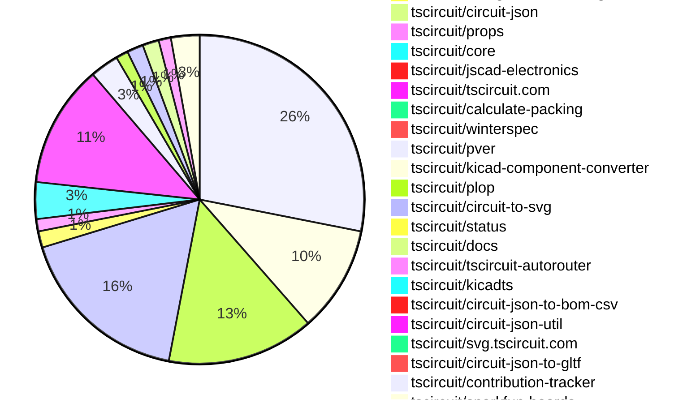
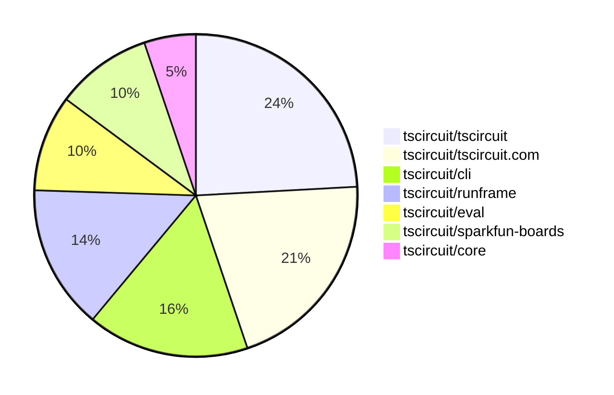

# contribution-tracker

[contributions.tscircuit.com](https://contributions.tscircuit.com) ・ [tscircuit.com](https://tscircuit.com) ・ [Contribution Overviews](./contribution-overviews/) ・ [Changelogs](./changelogs/)

Generates weekly contribution overviews for tscircuit contributors. Check out all
the [contribution overviews here](./contribution-overviews/)
You can find AI-generated monthly changelogs in the [changelogs directory](./changelogs/).

- All PRs in the tscircuit org are scanned/summarized via an LLM
- The LLM classifies each Diff/PR as into a set of attributes for scoring
- All the PRs, summaries, and classifications are organized into charts and tables for [the website](https://contributions.tscircuit.com)

> Want to run locally? See the [Development Section](#development)

The current week is shown below. There are 3 major sections:

- [Contributor Overview](#contributor-overview)
- [PRs by Repository](#prs-by-repository)
- [PRs by Contributor](#changes-by-contributor)

## Current Week

<!-- START_CURRENT_WEEK -->

# Contribution Overview 2025-09-24

## PRs by Repository



## Contributor Overview

| Contributor | 🐳 Major | 🐙 Minor | 🐌 Tiny | ⭐ | Score | Discussion Contributions |
|-------------|---------|---------|---------|-----|----------------|--------------------------|
| [seveibar](#seveibar) | 7 | 6 | 14 | 👑 | 67 | 0🔹 0🔶 0💎 |
| [ArnavK-09](#ArnavK-09) | 5 | 6 | 11 | ⭐⭐⭐ | 46 | 0🔹 0🔶 0💎 |
| [imrishabh18](#imrishabh18) | 3 | 4 | 34 | ⭐⭐⭐ | 43 | 0🔹 0🔶 0💎 |
| [Abse2001](#Abse2001) | 7 | 1 | 2 | ⭐⭐⭐ | 34 | 0🔹 0🔶 0💎 |
| [tscircuitbot](#tscircuitbot) | 0 | 0 | 140 | ⭐⭐ | 16 | 0🔹 0🔶 0💎 |
| [MustafaMulla29](#MustafaMulla29) | 1 | 3 | 6 | ⭐⭐ | 16 | 0🔹 0🔶 0💎 |
| [pxlpal](#pxlpal) | 3 | 0 | 1 | ⭐⭐ | 13 | 0🔹 0🔶 0💎 |
| [baeoc](#baeoc) | 0 | 3 | 0 | ⭐⭐ | 11 | 0🔹 0🔶 0💎 |
| [nailoo](#nailoo) | 1 | 0 | 0 | ⭐ | 9 | 0🔹 0🔶 0💎 |
| [0hmX](#0hmX) | 0 | 2 | 1 | ⭐ | 5 | 0🔹 0🔶 0💎 |
| [devroy10](#devroy10) | 1 | 0 | 1 | ⭐ | 5 | 0🔹 0🔶 0💎 |
| [Asymtode712](#Asymtode712) | 0 | 1 | 3 | ⭐ | 4.5 | 0🔹 0🔶 0💎 |
| [Sahelisaha04](#Sahelisaha04) | 1 | 0 | 0 | ⭐ | 4 | 0🔹 0🔶 0💎 |
| [Newspicel](#Newspicel) | 0 | 0 | 2 |  | 2 | 0🔹 0🔶 0💎 |

### Discussion Contribution Legend

- 🔹 Normal Comments: Basic participation with minimal effort
- 🔶 Great Informative Comments: Thoughtful participation that adds value
- 💎 Incredible Comments: Exceptional participation with high-quality content

## Review Table

[reviews-received-hover]: ## "Number of reviews received for PRs for this contributor"
[approvals-received-hover]: ## "Number of approvals received for PRs this contributor authored"
[rejections-received-hover]: ## "Number of rejections received for PRs this contributor authored"
[prs-opened-hover]: ## "Number of PRs opened by this contributor"
[issues-created-hover]: ## "Number of issues created by this contributor"
[bountied-issues-hover]: ## "Number of issues this contributor created with a bounty"
[bountied-issue-$-hover]: ## "Total bounty amount placed on issues authored by this contributor"

| Contributor | Reviews Received | Approvals Received | Rejections Received | Approvals | Rejections | PRs Opened | PRs Merged | Score | Issues Created | Bountied Issues | Bountied Issue $ |
|---|---|---|---|---|---|---|---|---|---|---|---|
| [tscircuitbot](#tscircuitbot) | 1 | 0 | 0 | 0 | 0 | 221 | 140 | 16 | 0 | 0 | 0 |
| [gratedayne](#gratedayne) | 0 | 0 | 0 | 0 | 0 | 1 | 0 | 0 | 0 | 0 | 0 |
| [seveibar](#seveibar) | 14 | 2 | 0 | 51 | 12 | 45 | 30 | 67 | 0 | 0 | 0 |
| [imrishabh18](#imrishabh18) | 3 | 2 | 0 | 8 | 1 | 42 | 41 | 43 | 0 | 0 | 0 |
| [naaa760](#naaa760) | 0 | 0 | 0 | 0 | 0 | 3 | 0 | 0 | 0 | 0 | 0 |
| [MustafaMulla29](#MustafaMulla29) | 22 | 15 | 3 | 0 | 0 | 19 | 11 | 16 | 0 | 0 | 0 |
| [h30s](#h30s) | 8 | 0 | 0 | 0 | 0 | 4 | 0 | 0 | 0 | 0 | 0 |
| [Abse2001](#Abse2001) | 22 | 10 | 0 | 2 | 0 | 12 | 10 | 34 | 0 | 0 | 0 |
| [ArnavK-09](#ArnavK-09) | 32 | 22 | 1 | 3 | 0 | 27 | 22 | 46 | 0 | 0 | 0 |
| [Asymtode712](#Asymtode712) | 5 | 5 | 0 | 0 | 0 | 5 | 4 | 4.5 | 0 | 0 | 0 |
| [Omar8345](#Omar8345) | 0 | 0 | 0 | 0 | 0 | 2 | 0 | 0 | 0 | 0 | 0 |
| [AYadav06](#AYadav06) | 0 | 0 | 0 | 0 | 0 | 1 | 0 | 0 | 0 | 0 | 0 |
| [Harsh9485](#Harsh9485) | 2 | 0 | 1 | 0 | 0 | 2 | 0 | 0 | 0 | 0 | 0 |
| [0hmX](#0hmX) | 3 | 3 | 0 | 0 | 0 | 4 | 3 | 5 | 0 | 0 | 0 |
| [ShiboSoftwareDev](#ShiboSoftwareDev) | 2 | 0 | 0 | 8 | 0 | 3 | 0 | 0 | 0 | 0 | 0 |
| [dhvll](#dhvll) | 1 | 0 | 0 | 0 | 0 | 1 | 0 | 0 | 0 | 0 | 0 |
| [nailoo](#nailoo) | 6 | 1 | 2 | 0 | 0 | 4 | 1 | 9 | 0 | 0 | 0 |
| [pxlpal](#pxlpal) | 6 | 3 | 0 | 0 | 0 | 5 | 4 | 13 | 0 | 0 | 0 |
| [Sahelisaha04](#Sahelisaha04) | 5 | 2 | 0 | 0 | 0 | 1 | 1 | 4 | 0 | 0 | 0 |
| [baeoc](#baeoc) | 4 | 3 | 0 | 0 | 1 | 4 | 3 | 11 | 0 | 0 | 0 |
| [bitsbyritik](#bitsbyritik) | 1 | 0 | 0 | 0 | 0 | 1 | 0 | 0 | 0 | 0 | 0 |
| [saish9901](#saish9901) | 9 | 0 | 3 | 0 | 0 | 2 | 0 | 0 | 0 | 0 | 0 |
| [Newspicel](#Newspicel) | 2 | 2 | 0 | 0 | 0 | 2 | 2 | 2 | 0 | 0 | 0 |
| [jayantpranjal0](#jayantpranjal0) | 0 | 0 | 0 | 0 | 0 | 1 | 0 | 0 | 0 | 0 | 0 |
| [zhyd1997](#zhyd1997) | 4 | 0 | 2 | 0 | 0 | 5 | 0 | 0 | 0 | 0 | 0 |
| [1914Jegx](#1914Jegx) | 6 | 0 | 0 | 0 | 0 | 4 | 0 | 0 | 0 | 0 | 0 |
| [aybanda](#aybanda) | 4 | 0 | 1 | 0 | 0 | 1 | 0 | 0 | 0 | 0 | 0 |
| [HarshitPal25](#HarshitPal25) | 3 | 0 | 0 | 0 | 0 | 5 | 0 | 0 | 0 | 0 | 0 |
| [melmathari](#melmathari) | 1 | 0 | 1 | 0 | 0 | 2 | 0 | 0 | 0 | 0 | 0 |
| [mobley-trent](#mobley-trent) | 0 | 0 | 0 | 0 | 0 | 1 | 0 | 0 | 0 | 0 | 0 |
| [devroy10](#devroy10) | 2 | 2 | 0 | 0 | 0 | 2 | 2 | 5 | 0 | 0 | 0 |

## Top 7 Repositories by Contribution Points



## Changes by Repository

### [tscircuit/tscircuit](https://github.com/tscircuit/tscircuit)


<details>
<summary>🐌 Tiny Contributions (70)</summary>

| PR # | Impact | Contributor | Description |
|------|--------|-------------|-------------|
| [#885](https://github.com/tscircuit/tscircuit/pull/885) | 🐌 Tiny | tscircuitbot | Updates the package version from 0.0.700 to 0.0.701 in package.json |
| [#883](https://github.com/tscircuit/tscircuit/pull/883) | 🐌 Tiny | tscircuitbot | Updates the tscircuitcli package from version 0.1.252 to 0.1.253 and the tscircuitrunframe package from version 0.0.1030 to 0.0.1031 in package.json |
| [#884](https://github.com/tscircuit/tscircuit/pull/884) | 🐌 Tiny | tscircuitbot | Automated package update |
| [#882](https://github.com/tscircuit/tscircuit/pull/882) | 🐌 Tiny | tscircuitbot | Updates the tscircuitcli package from version 0.1.252 to 0.1.253 and the tscircuitrunframe package from version 0.0.1030 to 0.0.1031 in package.json |
| [#880](https://github.com/tscircuit/tscircuit/pull/880) | 🐌 Tiny | tscircuitbot | Automated package update |
| [#879](https://github.com/tscircuit/tscircuit/pull/879) | 🐌 Tiny | tscircuitbot | Updates the tscircuitcli package to version 0.1.252 in package.json |
| [#878](https://github.com/tscircuit/tscircuit/pull/878) | 🐌 Tiny | tscircuitbot | Updates the tscircuitcli package to version 0.1.252 |
| [#877](https://github.com/tscircuit/tscircuit/pull/877) | 🐌 Tiny | tscircuitbot | Automated package update |
| [#876](https://github.com/tscircuit/tscircuit/pull/876) | 🐌 Tiny | tscircuitbot | Updates the tscircuitcli package to version 0.1.251 in package.json |
| [#875](https://github.com/tscircuit/tscircuit/pull/875) | 🐌 Tiny | tscircuitbot | Updates the tscircuitcli package to version 0.1.251 in package.json |
| [#874](https://github.com/tscircuit/tscircuit/pull/874) | 🐌 Tiny | tscircuitbot | Updates the package version from 0.0.696 to 0.0.697 in package.json |
| [#872](https://github.com/tscircuit/tscircuit/pull/872) | 🐌 Tiny | tscircuitbot | Automated package update |
| [#873](https://github.com/tscircuit/tscircuit/pull/873) | 🐌 Tiny | tscircuitbot | Automated package update |
| [#871](https://github.com/tscircuit/tscircuit/pull/871) | 🐌 Tiny | tscircuitbot | Updates the version of tscircuitcli, tscircuitcore, and tscircuiteval packages in package.json |
| [#870](https://github.com/tscircuit/tscircuit/pull/870) | 🐌 Tiny | tscircuitbot | Automated package update |
| [#869](https://github.com/tscircuit/tscircuit/pull/869) | 🐌 Tiny | tscircuitbot | Updates the tscircuitcli package to version 0.1.249 in package.json |
| [#868](https://github.com/tscircuit/tscircuit/pull/868) | 🐌 Tiny | tscircuitbot | Updates the tscircuitcli package to version 0.1.249 in package.json |
| [#867](https://github.com/tscircuit/tscircuit/pull/867) | 🐌 Tiny | tscircuitbot | Automated package update |
| [#866](https://github.com/tscircuit/tscircuit/pull/866) | 🐌 Tiny | tscircuitbot | Automated package update |
| [#865](https://github.com/tscircuit/tscircuit/pull/865) | 🐌 Tiny | tscircuitbot | Automated package update |
| [#863](https://github.com/tscircuit/tscircuit/pull/863) | 🐌 Tiny | tscircuitbot | Automated package update |
| [#861](https://github.com/tscircuit/tscircuit/pull/861) | 🐌 Tiny | tscircuitbot | Updates the tscircuitcli package from version 0.1.246 to 0.1.247 and the tscircuitrunframe package from version 0.0.1023 to 0.0.1024. |
| [#862](https://github.com/tscircuit/tscircuit/pull/862) | 🐌 Tiny | tscircuitbot | Automated package update |
| [#860](https://github.com/tscircuit/tscircuit/pull/860) | 🐌 Tiny | tscircuitbot | Updates the tscircuitcli package from version 0.1.246 to 0.1.247 and the tscircuitrunframe package from version 0.0.1023 to 0.0.1024 in package.json |
| [#859](https://github.com/tscircuit/tscircuit/pull/859) | 🐌 Tiny | tscircuitbot | Automated package update to version 0.0.691 |
| [#857](https://github.com/tscircuit/tscircuit/pull/857) | 🐌 Tiny | tscircuitbot | Updates the tscircuitcli package from version 0.1.245 to 0.1.246 and the tscircuitrunframe package from version 0.0.1022 to 0.0.1023. |
| [#858](https://github.com/tscircuit/tscircuit/pull/858) | 🐌 Tiny | tscircuitbot | Automated package update |
| [#856](https://github.com/tscircuit/tscircuit/pull/856) | 🐌 Tiny | tscircuitbot | Automated package update |
| [#855](https://github.com/tscircuit/tscircuit/pull/855) | 🐌 Tiny | tscircuitbot | Automated package update |
| [#853](https://github.com/tscircuit/tscircuit/pull/853) | 🐌 Tiny | tscircuitbot | Automated package update |
| [#852](https://github.com/tscircuit/tscircuit/pull/852) | 🐌 Tiny | tscircuitbot | Updates the package version from 0.0.687 to 0.0.688 in package.json |
| [#850](https://github.com/tscircuit/tscircuit/pull/850) | 🐌 Tiny | tscircuitbot | Updates the tscircuitcli package from version 0.1.243 to 0.1.244 and the tscircuitrunframe package from version 0.0.1018 to 0.0.1019 in package.json |
| [#851](https://github.com/tscircuit/tscircuit/pull/851) | 🐌 Tiny | tscircuitbot | Automated package update |
| [#849](https://github.com/tscircuit/tscircuit/pull/849) | 🐌 Tiny | tscircuitbot | Automated package update |
| [#848](https://github.com/tscircuit/tscircuit/pull/848) | 🐌 Tiny | tscircuitbot | Automated package update |
| [#847](https://github.com/tscircuit/tscircuit/pull/847) | 🐌 Tiny | tscircuitbot | Updates the tscircuitcli package to version 0.1.243 in the package.json file |
| [#846](https://github.com/tscircuit/tscircuit/pull/846) | 🐌 Tiny | tscircuitbot | Automated package update |
| [#845](https://github.com/tscircuit/tscircuit/pull/845) | 🐌 Tiny | tscircuitbot | Automated package update |
| [#844](https://github.com/tscircuit/tscircuit/pull/844) | 🐌 Tiny | tscircuitbot | Automated package update |
| [#843](https://github.com/tscircuit/tscircuit/pull/843) | 🐌 Tiny | tscircuitbot | Automated package update |
| [#841](https://github.com/tscircuit/tscircuit/pull/841) | 🐌 Tiny | tscircuitbot | Automated package update |
| [#839](https://github.com/tscircuit/tscircuit/pull/839) | 🐌 Tiny | tscircuitbot | Updates the tscircuitcli package from version 0.1.240 to 0.1.241 and the tscircuitrunframe package from version 0.0.1015 to 0.0.1016. |
| [#840](https://github.com/tscircuit/tscircuit/pull/840) | 🐌 Tiny | tscircuitbot | Automated package update |
| [#838](https://github.com/tscircuit/tscircuit/pull/838) | 🐌 Tiny | tscircuitbot | Automated package update |
| [#837](https://github.com/tscircuit/tscircuit/pull/837) | 🐌 Tiny | tscircuitbot | Automated package update |
| [#836](https://github.com/tscircuit/tscircuit/pull/836) | 🐌 Tiny | tscircuitbot | Updates the tscircuitcli package from version 0.1.239 to 0.1.240 and the tscircuitrunframe package from version 0.0.1013 to 0.0.1015 in package.json |
| [#835](https://github.com/tscircuit/tscircuit/pull/835) | 🐌 Tiny | tscircuitbot | Updates the tscircuitcli package from version 0.1.239 to 0.1.240 and the tscircuitrunframe package from version 0.0.1013 to 0.0.1015. |
| [#834](https://github.com/tscircuit/tscircuit/pull/834) | 🐌 Tiny | tscircuitbot | Automated package update |
| [#833](https://github.com/tscircuit/tscircuit/pull/833) | 🐌 Tiny | tscircuitbot | Automated package update |
| [#832](https://github.com/tscircuit/tscircuit/pull/832) | 🐌 Tiny | tscircuitbot | Updates the tscircuitcli package from version 0.1.238 to 0.1.239 and the tscircuitrunframe package from version 0.0.1012 to 0.0.1013 in package.json |
| [#831](https://github.com/tscircuit/tscircuit/pull/831) | 🐌 Tiny | tscircuitbot | Automated package update |
| [#830](https://github.com/tscircuit/tscircuit/pull/830) | 🐌 Tiny | tscircuitbot | Automated package update |
| [#829](https://github.com/tscircuit/tscircuit/pull/829) | 🐌 Tiny | tscircuitbot | Updates the version of the tscircuitcli, tscircuitcore, tscircuiteval, and tscircuitrunframe packages in package.json |
| [#828](https://github.com/tscircuit/tscircuit/pull/828) | 🐌 Tiny | tscircuitbot | Automated package update |
| [#826](https://github.com/tscircuit/tscircuit/pull/826) | 🐌 Tiny | tscircuitbot | Automated package update |
| [#827](https://github.com/tscircuit/tscircuit/pull/827) | 🐌 Tiny | tscircuitbot | Updates the package version from 0.0.676 to 0.0.677 in package.json |
| [#825](https://github.com/tscircuit/tscircuit/pull/825) | 🐌 Tiny | tscircuitbot | Automated package update |
| [#824](https://github.com/tscircuit/tscircuit/pull/824) | 🐌 Tiny | tscircuitbot | Automated package update |
| [#823](https://github.com/tscircuit/tscircuit/pull/823) | 🐌 Tiny | tscircuitbot | Updates the version of several packages in the project, including tscircuitcli, tscircuitcore, and tscircuiteval. |
| [#822](https://github.com/tscircuit/tscircuit/pull/822) | 🐌 Tiny | tscircuitbot | Automated package update |
| [#821](https://github.com/tscircuit/tscircuit/pull/821) | 🐌 Tiny | tscircuitbot | Updates the package version from 0.0.673 to 0.0.675 in package.json |
| [#813](https://github.com/tscircuit/tscircuit/pull/813) | 🐌 Tiny | tscircuitbot | Automated package update |
| [#842](https://github.com/tscircuit/tscircuit/pull/842) | 🐌 Tiny | seveibar | Updates the CLI installation command in the README and adds a link to a Getting Started video for contributors. |
| [#809](https://github.com/tscircuit/tscircuit/pull/809) | 🐌 Tiny | seveibar | Run copy-core-versions script after updating core dependencies to ensure synchronization of core versions across the project. |
| [#820](https://github.com/tscircuit/tscircuit/pull/820) | 🐌 Tiny | imrishabh18 | Skip the tests workflow when the pull request title indicates a version bump. |
| [#818](https://github.com/tscircuit/tscircuit/pull/818) | 🐌 Tiny | imrishabh18 | Updates the GitHub Actions workflow to include a pull request creation step and enable auto-merge after version bumping. |
| [#817](https://github.com/tscircuit/tscircuit/pull/817) | 🐌 Tiny | imrishabh18 | Passes the TSCIRCUIT_BOT_GITHUB_TOKEN to the bun-pver-release workflow to enable automatic version updates during releases. |
| [#816](https://github.com/tscircuit/tscircuit/pull/816) | 🐌 Tiny | imrishabh18 | Adds a GitHub workflow to update packages in upstream repositories and updates package versions in package.json |
| [#806](https://github.com/tscircuit/tscircuit/pull/806) | 🐌 Tiny | imrishabh18 | Adds a GitHub workflow to automate the update of tscircuit packages to their latest versions when triggered. |
| [#808](https://github.com/tscircuit/tscircuit/pull/808) | 🐌 Tiny | MustafaMulla29 | Updates dependencies to their latest versions to ensure fixed offsets are applied correctly in the project. |

</details>

### [tscircuit/eval](https://github.com/tscircuit/eval)

| PR # | Impact | Rating | Contributor | Description |
|------|--------|--------|-------------|-------------|
| [#1146](https://github.com/tscircuit/eval/pull/1146) | 🐙 Minor | ⭐⭐ | ArnavK-09 | Fixes parsing for normal URLs and supports remote footprints instead of assuming a base64 data URI in loadFromUrl. |
| [#1119](https://github.com/tscircuit/eval/pull/1119) | 🐙 Minor | ⭐⭐ | ArnavK-09 | Adds a parser for KiCad footprint files to convert them into circuit JSON format for use in the platform configuration. |

<details>
<summary>🐌 Tiny Contributions (24)</summary>

| PR # | Impact | Contributor | Description |
|------|--------|-------------|-------------|
| [#1151](https://github.com/tscircuit/eval/pull/1151) | 🐌 Tiny | tscircuitbot | Automated package update |
| [#1145](https://github.com/tscircuit/eval/pull/1145) | 🐌 Tiny | tscircuitbot | Automated package update |
| [#1142](https://github.com/tscircuit/eval/pull/1142) | 🐌 Tiny | tscircuitbot | Automated package update |
| [#1144](https://github.com/tscircuit/eval/pull/1144) | 🐌 Tiny | tscircuitbot | Automated package update |
| [#1143](https://github.com/tscircuit/eval/pull/1143) | 🐌 Tiny | tscircuitbot | Automated package update |
| [#1141](https://github.com/tscircuit/eval/pull/1141) | 🐌 Tiny | tscircuitbot | Automated package update |
| [#1140](https://github.com/tscircuit/eval/pull/1140) | 🐌 Tiny | tscircuitbot | Automated package update |
| [#1138](https://github.com/tscircuit/eval/pull/1138) | 🐌 Tiny | tscircuitbot | Automated package update |
| [#1135](https://github.com/tscircuit/eval/pull/1135) | 🐌 Tiny | tscircuitbot | Automated package update |
| [#1133](https://github.com/tscircuit/eval/pull/1133) | 🐌 Tiny | tscircuitbot | Automated package update |
| [#1131](https://github.com/tscircuit/eval/pull/1131) | 🐌 Tiny | tscircuitbot | Automated package update |
| [#1129](https://github.com/tscircuit/eval/pull/1129) | 🐌 Tiny | tscircuitbot | Automated package update |
| [#1127](https://github.com/tscircuit/eval/pull/1127) | 🐌 Tiny | tscircuitbot | Automated package update |
| [#1123](https://github.com/tscircuit/eval/pull/1123) | 🐌 Tiny | tscircuitbot | Automated update of tscircuitcore to v0.0.748. |
| [#1117](https://github.com/tscircuit/eval/pull/1117) | 🐌 Tiny | tscircuitbot | Automated update of tscircuitcore to v0.0.747. |
| [#1113](https://github.com/tscircuit/eval/pull/1113) | 🐌 Tiny | tscircuitbot | Updates the tscircuitcore dependency from version 0.0.741 to 0.0.745 and updates related dependencies in package.json. |
| [#1134](https://github.com/tscircuit/eval/pull/1134) | 🐌 Tiny | seveibar | Removes the legacy auto-merge workflow as the built-in automerge is now being used. |
| [#1132](https://github.com/tscircuit/eval/pull/1132) | 🐌 Tiny | imrishabh18 | Skip the test workflows for pull requests that only bump the version number, preventing unnecessary test runs for version bump changes. |
| [#1130](https://github.com/tscircuit/eval/pull/1130) | 🐌 Tiny | imrishabh18 | Prevents individual matrix jobs from executing when a pull request is made to bump the version, optimizing CI workflow. |
| [#1128](https://github.com/tscircuit/eval/pull/1128) | 🐌 Tiny | imrishabh18 | Modifies GitHub Actions workflows to skip Playwright tests when the pull request title is chore: bump version. |
| [#1126](https://github.com/tscircuit/eval/pull/1126) | 🐌 Tiny | imrishabh18 | Removes the log-soup package from the project dependencies in package.json |
| [#1125](https://github.com/tscircuit/eval/pull/1125) | 🐌 Tiny | imrishabh18 | Updates the package version to 0.0.343 and specifies the installation of pver version 0.0.41 in the GitHub workflow. |
| [#1124](https://github.com/tscircuit/eval/pull/1124) | 🐌 Tiny | imrishabh18 | Updates the GitHub workflow to create a pull request automatically when a version bump occurs, including enhancements for upstream repository updates and auto-merging. |
| [#1120](https://github.com/tscircuit/eval/pull/1120) | 🐌 Tiny | imrishabh18 | Adds a GitHub token secret for the release workflow in the bun-pver-release.yml file |

</details>

### [tscircuit/runframe](https://github.com/tscircuit/runframe)

| PR # | Impact | Rating | Contributor | Description |
|------|--------|--------|-------------|-------------|
| [#1219](https://github.com/tscircuit/runframe/pull/1219) | 🐳 Major | ⭐⭐⭐ | pxlpal | Adds stock number information to the JLCPCB search results displayed in the import dialog, enhancing user visibility of component availability. |
| [#1171](https://github.com/tscircuit/runframe/pull/1171) | 🐳 Major | ⭐⭐⭐ | pxlpal | Add ImportComponentDialog2 and ImportComponentDialogForCli components for importing electronic components from various sources including tscircuit.com, JLCPCB, and KiCad. |

<details>
<summary>🐌 Tiny Contributions (34)</summary>

| PR # | Impact | Contributor | Description |
|------|--------|-------------|-------------|
| [#1291](https://github.com/tscircuit/runframe/pull/1291) | 🐌 Tiny | tscircuitbot | Automated package update |
| [#1288](https://github.com/tscircuit/runframe/pull/1288) | 🐌 Tiny | tscircuitbot | Automated package update |
| [#1287](https://github.com/tscircuit/runframe/pull/1287) | 🐌 Tiny | tscircuitbot | Updates the tscircuiteval package from version 0.0.353 to 0.0.354 |
| [#1286](https://github.com/tscircuit/runframe/pull/1286) | 🐌 Tiny | tscircuitbot | Updates the tscircuiteval package to version 0.0.354 in the package.json file. |
| [#1285](https://github.com/tscircuit/runframe/pull/1285) | 🐌 Tiny | tscircuitbot | Automated package version bump from 0.0.1025 to 0.0.1028 |
| [#1282](https://github.com/tscircuit/runframe/pull/1282) | 🐌 Tiny | tscircuitbot | Updates the tscircuiteval package to version 0.0.353 in package.json |
| [#1281](https://github.com/tscircuit/runframe/pull/1281) | 🐌 Tiny | tscircuitbot | Automated package update |
| [#1280](https://github.com/tscircuit/runframe/pull/1280) | 🐌 Tiny | tscircuitbot | Updates the tscircuiteval package to version 0.0.353 in the package.json file |
| [#1279](https://github.com/tscircuit/runframe/pull/1279) | 🐌 Tiny | tscircuitbot | Updates the tscircuiteval package from version 0.0.351 to 0.0.352 |
| [#1278](https://github.com/tscircuit/runframe/pull/1278) | 🐌 Tiny | tscircuitbot | Updates the tscircuiteval package to version 0.0.352 in the package.json file. |
| [#1277](https://github.com/tscircuit/runframe/pull/1277) | 🐌 Tiny | tscircuitbot | Automated package update to version 0.0.1024 |
| [#1272](https://github.com/tscircuit/runframe/pull/1272) | 🐌 Tiny | tscircuitbot | Updates the package version from 0.0.1019 to 0.0.1020 in package.json |
| [#1271](https://github.com/tscircuit/runframe/pull/1271) | 🐌 Tiny | tscircuitbot | Updates the tscircuiteval package to version 0.0.351 |
| [#1268](https://github.com/tscircuit/runframe/pull/1268) | 🐌 Tiny | tscircuitbot | Updates the tscircuiteval package to version 0.0.351 |
| [#1267](https://github.com/tscircuit/runframe/pull/1267) | 🐌 Tiny | tscircuitbot | Automated package update |
| [#1265](https://github.com/tscircuit/runframe/pull/1265) | 🐌 Tiny | tscircuitbot | Updates the tscircuit3d-viewer package to version 0.0.404 in package.json |
| [#1263](https://github.com/tscircuit/runframe/pull/1263) | 🐌 Tiny | tscircuitbot | Automated package update |
| [#1258](https://github.com/tscircuit/runframe/pull/1258) | 🐌 Tiny | tscircuitbot | Updates the package version from 0.0.1013 to 0.0.1014 in package.json |
| [#1255](https://github.com/tscircuit/runframe/pull/1255) | 🐌 Tiny | tscircuitbot | Automated package update |
| [#1254](https://github.com/tscircuit/runframe/pull/1254) | 🐌 Tiny | tscircuitbot | Automated package update |
| [#1249](https://github.com/tscircuit/runframe/pull/1249) | 🐌 Tiny | tscircuitbot | Updates the package version from 0.0.1010 to 0.0.1011 in package.json |
| [#1245](https://github.com/tscircuit/runframe/pull/1245) | 🐌 Tiny | tscircuitbot | Automated package update |
| [#1212](https://github.com/tscircuit/runframe/pull/1212) | 🐌 Tiny | tscircuitbot | Updates the tscircuit3d-viewer package to version 0.0.402 |
| [#1244](https://github.com/tscircuit/runframe/pull/1244) | 🐌 Tiny | imrishabh18 | Updates the eval package version and modifies the GitHub workflow to close existing PRs with chore titles before creating a new update PR. |
| [#1233](https://github.com/tscircuit/runframe/pull/1233) | 🐌 Tiny | imrishabh18 | This pull request adds the updated styles generated during the build process, ensuring that the latest styles are applied consistently across the application. |
| [#1232](https://github.com/tscircuit/runframe/pull/1232) | 🐌 Tiny | imrishabh18 | Changes the GitHub Actions workflow to use the --auto flag instead of --rebase for merging pull requests, allowing for automatic merging with squashing. |
| [#1230](https://github.com/tscircuit/runframe/pull/1230) | 🐌 Tiny | imrishabh18 | Updates the package version from 0.0.993 to 0.0.1004 in package.json |
| [#1229](https://github.com/tscircuit/runframe/pull/1229) | 🐌 Tiny | imrishabh18 | Automates version bumping and pull request creation in the GitHub workflow. |
| [#1215](https://github.com/tscircuit/runframe/pull/1215) | 🐌 Tiny | imrishabh18 | Updates the version of the circuit-json-to-bom-csv dependency from 0.0.7 to 0.0.8 in package.json |
| [#1214](https://github.com/tscircuit/runframe/pull/1214) | 🐌 Tiny | imrishabh18 | Adds a GitHub workflow to update the CLI with the latest version of RunFrame upon pushing to the main branch. |
| [#1226](https://github.com/tscircuit/runframe/pull/1226) | 🐌 Tiny | MustafaMulla29 | Updates the version of the schematic-symbols dependency from 0.0.201 to 0.0.202 in package.json |
| [#1217](https://github.com/tscircuit/runframe/pull/1217) | 🐌 Tiny | ArnavK-09 | Adjusts the z-index of the DropdownMenuContent in the FileMenuLeftHeader component to ensure proper layering in the UI. |
| [#1248](https://github.com/tscircuit/runframe/pull/1248) | 🐌 Tiny | Newspicel | Updates the easyeda dependency from version 0.0.217 to 0.0.228 in package.json |
| [#1290](https://github.com/tscircuit/runframe/pull/1290) | 🐌 Tiny | pxlpal | Loads shared styles into the ImportComponentDialog2 component by importing and invoking the useStyles hook. |

</details>

### [tscircuit/cli](https://github.com/tscircuit/cli)

| PR # | Impact | Rating | Contributor | Description |
|------|--------|--------|-------------|-------------|
| [#372](https://github.com/tscircuit/cli/pull/372) | 🐳 Major | ⭐⭐⭐ | seveibar | Add a --preview-images flag to tsci build that selects a built entrypoint and emits PCB, schematic, and 3D previews, reusing the generated circuit JSON to render preview assets into the dist directory and adding a CLI regression test covering the new preview image workflow. |
| [#371](https://github.com/tscircuit/cli/pull/371) | 🐙 Minor | ⭐⭐ | seveibar | Adds a fallback in the build process to detect and build the main entrypoint when no circuit or board files exist, ensuring that index.tsx is built when it is the only entrypoint. |

<details>
<summary>🐌 Tiny Contributions (41)</summary>

| PR # | Impact | Contributor | Description |
|------|--------|-------------|-------------|
| [#422](https://github.com/tscircuit/cli/pull/422) | 🐌 Tiny | tscircuitbot | Automated package update |
| [#421](https://github.com/tscircuit/cli/pull/421) | 🐌 Tiny | tscircuitbot | Updates the tscircuitrunframe package to version 0.0.1031 in the package.json file |
| [#420](https://github.com/tscircuit/cli/pull/420) | 🐌 Tiny | tscircuitbot | Automated package update to version 0.1.252 |
| [#418](https://github.com/tscircuit/cli/pull/418) | 🐌 Tiny | tscircuitbot | Automated package update to version 0.1.251 |
| [#417](https://github.com/tscircuit/cli/pull/417) | 🐌 Tiny | tscircuitbot | Updates the tscircuitrunframe package version from 0.0.1028 to 0.0.1030 in package.json |
| [#416](https://github.com/tscircuit/cli/pull/416) | 🐌 Tiny | tscircuitbot | Automated package update |
| [#414](https://github.com/tscircuit/cli/pull/414) | 🐌 Tiny | tscircuitbot | Updates the tscircuitrunframe package from version 0.0.1024 to 0.0.1028 |
| [#413](https://github.com/tscircuit/cli/pull/413) | 🐌 Tiny | tscircuitbot | Automated package update |
| [#411](https://github.com/tscircuit/cli/pull/411) | 🐌 Tiny | tscircuitbot | Automated package update |
| [#403](https://github.com/tscircuit/cli/pull/403) | 🐌 Tiny | tscircuitbot | Automated package update |
| [#402](https://github.com/tscircuit/cli/pull/402) | 🐌 Tiny | tscircuitbot | Updates the tscircuitrunframe package to version 0.0.1024 in the package.json file |
| [#401](https://github.com/tscircuit/cli/pull/401) | 🐌 Tiny | tscircuitbot | Automated package update |
| [#400](https://github.com/tscircuit/cli/pull/400) | 🐌 Tiny | tscircuitbot | Updates the tscircuitrunframe package from version 0.0.1020 to 0.0.1023 in the package.json file. |
| [#399](https://github.com/tscircuit/cli/pull/399) | 🐌 Tiny | tscircuitbot | Automated package update |
| [#396](https://github.com/tscircuit/cli/pull/396) | 🐌 Tiny | tscircuitbot | Updates the tscircuitrunframe package to version 0.0.1020 in the package.json file. |
| [#395](https://github.com/tscircuit/cli/pull/395) | 🐌 Tiny | tscircuitbot | Automated package update |
| [#394](https://github.com/tscircuit/cli/pull/394) | 🐌 Tiny | tscircuitbot | Updates the tscircuitrunframe package to version 0.0.1019 in the package.json file. |
| [#393](https://github.com/tscircuit/cli/pull/393) | 🐌 Tiny | tscircuitbot | Automated package update |
| [#392](https://github.com/tscircuit/cli/pull/392) | 🐌 Tiny | tscircuitbot | Updates the tscircuitrunframe package from version 0.0.1017 to 0.0.1018 |
| [#391](https://github.com/tscircuit/cli/pull/391) | 🐌 Tiny | tscircuitbot | Automated package update |
| [#389](https://github.com/tscircuit/cli/pull/389) | 🐌 Tiny | tscircuitbot | Updates the tscircuitrunframe package from version 0.0.1015 to 0.0.1017 in the package.json file. |
| [#388](https://github.com/tscircuit/cli/pull/388) | 🐌 Tiny | tscircuitbot | Automated package update |
| [#386](https://github.com/tscircuit/cli/pull/386) | 🐌 Tiny | tscircuitbot | Updates the tscircuitrunframe package from version 0.0.1014 to 0.0.1015 |
| [#385](https://github.com/tscircuit/cli/pull/385) | 🐌 Tiny | tscircuitbot | Automated package update |
| [#383](https://github.com/tscircuit/cli/pull/383) | 🐌 Tiny | tscircuitbot | Updates the tscircuitrunframe package from version 0.0.1013 to 0.0.1014 |
| [#382](https://github.com/tscircuit/cli/pull/382) | 🐌 Tiny | tscircuitbot | Automated package update |
| [#381](https://github.com/tscircuit/cli/pull/381) | 🐌 Tiny | tscircuitbot | Updates the tscircuitrunframe package from version 0.0.1012 to 0.0.1013 |
| [#380](https://github.com/tscircuit/cli/pull/380) | 🐌 Tiny | tscircuitbot | Automated package update |
| [#379](https://github.com/tscircuit/cli/pull/379) | 🐌 Tiny | tscircuitbot | Automated package update |
| [#378](https://github.com/tscircuit/cli/pull/378) | 🐌 Tiny | tscircuitbot | Automated package update to version 0.1.237 |
| [#377](https://github.com/tscircuit/cli/pull/377) | 🐌 Tiny | tscircuitbot | Updates the tscircuitrunframe package from version 0.0.1010 to 0.0.1011 |
| [#376](https://github.com/tscircuit/cli/pull/376) | 🐌 Tiny | tscircuitbot | Automated package update to version 0.1.236 |
| [#375](https://github.com/tscircuit/cli/pull/375) | 🐌 Tiny | tscircuitbot | Updates the tscircuitrunframe package to version 0.0.1010 in package.json |
| [#370](https://github.com/tscircuit/cli/pull/370) | 🐌 Tiny | tscircuitbot | Automated package update |
| [#369](https://github.com/tscircuit/cli/pull/369) | 🐌 Tiny | tscircuitbot | Updates the tscircuitrunframe package to version 0.0.992 in the package.json file |
| [#419](https://github.com/tscircuit/cli/pull/419) | 🐌 Tiny | imrishabh18 | Removes the CODEOWNERS file from the repository, which designates specific users as code owners for certain parts of the codebase. |
| [#412](https://github.com/tscircuit/cli/pull/412) | 🐌 Tiny | imrishabh18 | Adds a workflow step to close existing PRs with titles starting with chore: and updates package versions for tscircuitprops and tscircuit. |
| [#410](https://github.com/tscircuit/cli/pull/410) | 🐌 Tiny | imrishabh18 | Adds deferred cleanup functions to manage test resource cleanup after each test execution. |
| [#374](https://github.com/tscircuit/cli/pull/374) | 🐌 Tiny | imrishabh18 | Updates GitHub Actions workflow to support multiple upstream repositories and modifies the release command to prevent pushing to the main branch. |
| [#373](https://github.com/tscircuit/cli/pull/373) | 🐌 Tiny | imrishabh18 | Updates GitHub workflows to automate version bumping and pull request creation. |
| [#368](https://github.com/tscircuit/cli/pull/368) | 🐌 Tiny | imrishabh18 | Adds a GitHub workflow to automate the update of tscircuit packages and trigger updates in the upstream repository. |

</details>

### [tscircuit/test-github-automerge](https://github.com/tscircuit/test-github-automerge)


<details>
<summary>🐌 Tiny Contributions (4)</summary>

| PR # | Impact | Contributor | Description |
|------|--------|-------------|-------------|
| [#5](https://github.com/tscircuit/test-github-automerge/pull/5) | 🐌 Tiny | tscircuitbot | Updates the tscircuitcircuit-json-util package from version 0.0.68 to 0.0.72 in the package.json file. |
| [#4](https://github.com/tscircuit/test-github-automerge/pull/4) | 🐌 Tiny | tscircuitbot | Updates the tscircuitcircuit-json-util package from version 0.0.68 to 0.0.72 in the package.json file. |
| [#3](https://github.com/tscircuit/test-github-automerge/pull/3) | 🐌 Tiny | tscircuitbot | Updates the tscircuitcircuit-json-util package from version 0.0.68 to 0.0.72 in the package.json file. |
| [#2](https://github.com/tscircuit/test-github-automerge/pull/2) | 🐌 Tiny | tscircuitbot | Updates the tscircuitcircuit-json-util package from version 0.0.71 to 0.0.72 in the package.json file. |

</details>

### [tscircuit/circuit-json](https://github.com/tscircuit/circuit-json)

| PR # | Impact | Rating | Contributor | Description |
|------|--------|--------|-------------|-------------|
| [#299](https://github.com/tscircuit/circuit-json/pull/299) | 🐳 Major | ⭐⭐⭐ | seveibar | Add schemas for simulation experiments and transient voltage graphs, including support for SPICE experiment types and exporting new simulation elements with tests. |

<details>
<summary>🐌 Tiny Contributions (1)</summary>

| PR # | Impact | Contributor | Description |
|------|--------|-------------|-------------|
| [#298](https://github.com/tscircuit/circuit-json/pull/298) | 🐌 Tiny | seveibar | Add an obstructs_within_bounds flag with a default of true to pcb_component, documenting the new field in the PCB component overview and README snippets. |

</details>

### [tscircuit/props](https://github.com/tscircuit/props)

| PR # | Impact | Rating | Contributor | Description |
|------|--------|--------|-------------|-------------|
| [#424](https://github.com/tscircuit/props/pull/424) | 🐳 Major | ⭐⭐⭐ | seveibar | Adds the obstructsWithinBounds flag to common component props with documentation and exposes the property through the shared Zod schema for runtime validation. |
| [#425](https://github.com/tscircuit/props/pull/425) | 🐙 Minor | ⭐⭐ | seveibar | Extends the platform config types and schema to include a spice simulation engine, documents the new spiceEngine option in the autogenerated README docs, and adds a regression test covering spiceEngine parsing and execution. |
| [#423](https://github.com/tscircuit/props/pull/423) | 🐙 Minor | ⭐⭐ | Abse2001 | Adds a new optional property connectsTo to the port properties, allowing for a string or an array of strings to define connections. |

### [tscircuit/core](https://github.com/tscircuit/core)

| PR # | Impact | Rating | Contributor | Description |
|------|--------|--------|-------------|-------------|
| [#1416](https://github.com/tscircuit/core/pull/1416) | 🐳 Major | ⭐⭐⭐ | seveibar | Adds the obstructsWithinBounds flag to PCB component creation for normal components and vias, ensuring proper handling of component placement within bounds. |
| [#1420](https://github.com/tscircuit/core/pull/1420) | 🐙 Minor | ⭐⭐ | seveibar | Avoids creating solder paste records for SMT pads covered with solder mask and skips updates for non-existent paste entries, ensuring accurate solder paste generation. |
| [#1421](https://github.com/tscircuit/core/pull/1421) | 🐙 Minor | ⭐⭐ | ArnavK-09 | Adds functionality to recognize relative URLs starting with  in the isFootprintUrl utility function. |
| [#1408](https://github.com/tscircuit/core/pull/1408) | 🐙 Minor | ⭐⭐ | ArnavK-09 | Adds support for loading KiCad footprints from a specified URL, enhancing the component rendering process. |

<details>
<summary>🐌 Tiny Contributions (5)</summary>

| PR # | Impact | Contributor | Description |
|------|--------|-------------|-------------|
| [#1405](https://github.com/tscircuit/core/pull/1405) | 🐌 Tiny | MustafaMulla29 | Fixes offset issues in SVG rendering by updating the circuit-to-svg dependency version from 0.0.200 to 0.0.202 |
| [#1403](https://github.com/tscircuit/core/pull/1403) | 🐌 Tiny | MustafaMulla29 | Updates the schematic-symbols dependency to version 0.0.202 to resolve an offset issue in symbol rendering. |
| [#1415](https://github.com/tscircuit/core/pull/1415) | 🐌 Tiny | Abse2001 | Adds a test to verify the behavior of PCB autolayout components when they overlap, ensuring proper rendering and error handling. |
| [#1414](https://github.com/tscircuit/core/pull/1414) | 🐌 Tiny | Abse2001 | Adds a test case for verifying PCB autolayout functionality when components are placed outside board boundaries. |
| [#1413](https://github.com/tscircuit/core/pull/1413) | 🐌 Tiny | 0hmX | Updates the schematic-trace-solver dependency to version 0.0.40, incorporating new features and fixes from the latest release. |

</details>

### [tscircuit/jscad-electronics](https://github.com/tscircuit/jscad-electronics)

| PR # | Impact | Rating | Contributor | Description |
|------|--------|--------|-------------|-------------|
| [#120](https://github.com/tscircuit/jscad-electronics/pull/120) | 🐳 Major | ⭐⭐⭐ | seveibar | Allows the injection of jscad-planner into the rendering process for footprints, enabling enhanced geometry handling. |

### [tscircuit/tscircuit.com](https://github.com/tscircuit/tscircuit.com)

| PR # | Impact | Rating | Contributor | Description |
|------|--------|--------|-------------|-------------|
| [#1713](https://github.com/tscircuit/tscircuit.com/pull/1713) | 🐳 Major | ⭐⭐⭐ | seveibar | Adds Helmet metadata management to the organization settings page and sets the document title to reflect the current organization when viewing settings. |
| [#1709](https://github.com/tscircuit/tscircuit.com/pull/1709) | 🐳 Major | ⭐⭐⭐ | imrishabh18 | Fetches the number of packages and members for organizations in the application, enhancing the OrganizationHeader component with real-time data. |
| [#1739](https://github.com/tscircuit/tscircuit.com/pull/1739) | 🐳 Major | ⭐⭐⭐ | ArnavK-09 | Adds a new dialog component for saving packages, allowing users to specify package name, visibility (publicprivate), and organization. |
| [#1731](https://github.com/tscircuit/tscircuit.com/pull/1731) | 🐳 Major | ⭐⭐⭐ | ArnavK-09 | Adds functionality to create packages under a specified organization, including organization validation and selection in the UI. |
| [#1725](https://github.com/tscircuit/tscircuit.com/pull/1725) | 🐳 Major | ⭐⭐⭐ | ArnavK-09 | Adds functionality to download a ZIP file of package files from the Package Releases Dashboard. |
| [#1721](https://github.com/tscircuit/tscircuit.com/pull/1721) | 🐳 Major | ⭐⭐⭐ | ArnavK-09 | Refactors image loading for packages by consolidating queries and correcting skeleton loading states. |
| [#1715](https://github.com/tscircuit/tscircuit.com/pull/1715) | 🐳 Major | ⭐⭐⭐ | ArnavK-09 | Removes HTML response for package not found and throws an error instead. Updates organization filtering logic in the database client. |
| [#1703](https://github.com/tscircuit/tscircuit.com/pull/1703) | 🐳 Major | ⭐⭐⭐ | Sahelisaha04 | Fixes TypeScript dependency caching to improve performance and reliability in package fetching. |
| [#1730](https://github.com/tscircuit/tscircuit.com/pull/1730) | 🐙 Minor | ⭐⭐ | seveibar | Capture PostHog events for failures in api.tscircuit.com requests by instrumenting React Querys query and mutation caches, and removing the previous fetch wrapper. |
| [#1723](https://github.com/tscircuit/tscircuit.com/pull/1723) | 🐙 Minor | ⭐⭐ | ArnavK-09 | Fixes the positioning of action buttons for folders in the editor sidebar, ensuring they are displayed correctly when interacting with folder items. |
| [#1720](https://github.com/tscircuit/tscircuit.com/pull/1720) | 🐙 Minor | ⭐⭐ | ArnavK-09 | Updated the layout of the Header component to improve responsiveness by removing unnecessary list items and adjusting button visibility based on screen size. |
| [#1733](https://github.com/tscircuit/tscircuit.com/pull/1733) | 🐙 Minor | ⭐⭐ | baeoc | Scopes the user packages cache key per user and removes the legacy cache entry, ensuring that users only see their own packages. |
| [#1732](https://github.com/tscircuit/tscircuit.com/pull/1732) | 🐙 Minor | ⭐⭐ | baeoc | Fixes server-side rendering crash by ensuring window assignments are only made when window is defined |
| [#1726](https://github.com/tscircuit/tscircuit.com/pull/1726) | 🐙 Minor | ⭐⭐ | baeoc | Prevents server-side rendering (SSR) crashes by ensuring PostHog initialization only occurs in a browser environment. |

<details>
<summary>🐌 Tiny Contributions (16)</summary>

| PR # | Impact | Contributor | Description |
|------|--------|-------------|-------------|
| [#1714](https://github.com/tscircuit/tscircuit.com/pull/1714) | 🐌 Tiny | seveibar | Updates the landing page header logo to match the blue pill style used elsewhere and removes the unused CircuitBoard icon import from the header. |
| [#1698](https://github.com/tscircuit/tscircuit.com/pull/1698) | 🐌 Tiny | imrishabh18 | Removes the old build page and associated unused components from the codebase, streamlining the application and eliminating unnecessary files. |
| [#1711](https://github.com/tscircuit/tscircuit.com/pull/1711) | 🐌 Tiny | MustafaMulla29 | Updates the version of dependencies to fix offset issues in the application. |
| [#1738](https://github.com/tscircuit/tscircuit.com/pull/1738) | 🐌 Tiny | ArnavK-09 | Removes a console log statement from the deferred cleanup function in the test server setup. |
| [#1737](https://github.com/tscircuit/tscircuit.com/pull/1737) | 🐌 Tiny | ArnavK-09 | Updates GitHub Actions workflows to support bun version 1.2.23 and bumps the versions of various actions used in the workflows. |
| [#1735](https://github.com/tscircuit/tscircuit.com/pull/1735) | 🐌 Tiny | ArnavK-09 | Prevents the confirmation dialog from appearing when saving a new package if there are no unsaved changes. |
| [#1736](https://github.com/tscircuit/tscircuit.com/pull/1736) | 🐌 Tiny | ArnavK-09 | Prevents the dropdown menu from remaining open when navigating to a new link within the HeaderDropdown component. |
| [#1724](https://github.com/tscircuit/tscircuit.com/pull/1724) | 🐌 Tiny | ArnavK-09 | Refactors the code to replace anchor tags with Link components for improved routing in the application. |
| [#1708](https://github.com/tscircuit/tscircuit.com/pull/1708) | 🐌 Tiny | ArnavK-09 | Replaces PrefetchPageLink components with Link components from the Wouter library across various components in the application. |
| [#1704](https://github.com/tscircuit/tscircuit.com/pull/1704) | 🐌 Tiny | ArnavK-09 | Adjusts padding in the sidebar button to enhance layout consistency. |
| [#1705](https://github.com/tscircuit/tscircuit.com/pull/1705) | 🐌 Tiny | ArnavK-09 | Disables the display of the account balance in the user interface, removing the related component from the HeaderLogin. |
| [#1707](https://github.com/tscircuit/tscircuit.com/pull/1707) | 🐌 Tiny | ArnavK-09 | Hides the review button in the Package Releases Dashboard if the latest build status is error. |
| [#1741](https://github.com/tscircuit/tscircuit.com/pull/1741) | 🐌 Tiny | Asymtode712 | Hides the fork button for users who are not logged in, ensuring that only logged-in users can see and use the fork functionality. |
| [#1706](https://github.com/tscircuit/tscircuit.com/pull/1706) | 🐌 Tiny | Asymtode712 | Updates the tscircuitrunframe dependency to version 0.0.993 in package.json |
| [#1702](https://github.com/tscircuit/tscircuit.com/pull/1702) | 🐌 Tiny | Asymtode712 | Updates the 3D viewer dependency to version 0.0.402 in package.json |
| [#1727](https://github.com/tscircuit/tscircuit.com/pull/1727) | 🐌 Tiny | Newspicel | Bump Easyeda Version to add POLYGON pad support, to fix Bug with JLCPCB Part C2934569. |

</details>

### [tscircuit/calculate-packing](https://github.com/tscircuit/calculate-packing)

| PR # | Impact | Rating | Contributor | Description |
|------|--------|--------|-------------|-------------|
| [#51](https://github.com/tscircuit/calculate-packing/pull/51) | 🐳 Major | ⭐⭐⭐ | seveibar | Adds handling for the obstructs_within_bounds property in PCB components to control the addition of inner obstacles during packing. |

### [tscircuit/winterspec](https://github.com/tscircuit/winterspec)

| PR # | Impact | Rating | Contributor | Description |
|------|--------|--------|-------------|-------------|
| [#42](https://github.com/tscircuit/winterspec/pull/42) | 🐙 Minor | ⭐⭐ | seveibar | Fixes a deadlock issue in the development server build process by serializing rebuilds with a mutex and mapping the winterspec package name to local sources for type-checking without publishing artifacts. |

<details>
<summary>🐌 Tiny Contributions (1)</summary>

| PR # | Impact | Contributor | Description |
|------|--------|-------------|-------------|
| [#43](https://github.com/tscircuit/winterspec/pull/43) | 🐌 Tiny | seveibar | Replaces persistent esbuild build context in startDevServer2 with one-off builds and a queued rebuild loop, ensuring esbuild service stops when the dev server shuts down and manifest regeneration is scheduled safely. |

</details>

### [tscircuit/pver](https://github.com/tscircuit/pver)

| PR # | Impact | Rating | Contributor | Description |
|------|--------|--------|-------------|-------------|
| [#4](https://github.com/tscircuit/pver/pull/4) | 🐙 Minor | ⭐⭐ | seveibar | Add support for --readme and --package-json options to increment version in README and package.json without publishing to npm |
| [#8](https://github.com/tscircuit/pver/pull/8) | 🐙 Minor | ⭐⭐ | imrishabh18 | Fixes the condition for the --no-push-main flag to work correctly in the application context. |
| [#5](https://github.com/tscircuit/pver/pull/5) | 🐙 Minor | ⭐⭐ | imrishabh18 | Adds a new command line option to disable pushing to the main branch, overriding the existing push option. |

<details>
<summary>🐌 Tiny Contributions (4)</summary>

| PR # | Impact | Contributor | Description |
|------|--------|-------------|-------------|
| [#10](https://github.com/tscircuit/pver/pull/10) | 🐌 Tiny | imrishabh18 | Always syncs with remote main before pushing changes, ensuring the local branch is up-to-date with the remote branch. |
| [#9](https://github.com/tscircuit/pver/pull/9) | 🐌 Tiny | imrishabh18 | Prevents committing changes when the --no-push-main flag is used, ensuring that changes are only committed when pushing to the main branch. |
| [#7](https://github.com/tscircuit/pver/pull/7) | 🐌 Tiny | imrishabh18 | Adds a new release method type no-push-main to the ReleaseMethod type definition in the app context. |
| [#6](https://github.com/tscircuit/pver/pull/6) | 🐌 Tiny | imrishabh18 | Restores the package-lock.json file to ensure consistent installations with npm ci. |

</details>

### [tscircuit/kicad-component-converter](https://github.com/tscircuit/kicad-component-converter)


<details>
<summary>🐌 Tiny Contributions (2)</summary>

| PR # | Impact | Contributor | Description |
|------|--------|-------------|-------------|
| [#141](https://github.com/tscircuit/kicad-component-converter/pull/141) | 🐌 Tiny | seveibar | Disables library bundling in the build process and updates the build scripts accordingly. |
| [#140](https://github.com/tscircuit/kicad-component-converter/pull/140) | 🐌 Tiny | ArnavK-09 | Fixes a typo in the import statement for the parseKicadModToCircuitJson function in the README file. |

</details>

### [tscircuit/plop](https://github.com/tscircuit/plop)


<details>
<summary>🐌 Tiny Contributions (3)</summary>

| PR # | Impact | Contributor | Description |
|------|--------|-------------|-------------|
| [#19](https://github.com/tscircuit/plop/pull/19) | 🐌 Tiny | seveibar | Renames the PACKAGE_NAMES environment variable to UPSTREAM_PACKAGES_TO_UPDATE in the bun-pver-release workflow template and defaults optional upstream environment variables to empty strings for workflow validity. |
| [#18](https://github.com/tscircuit/plop/pull/18) | 🐌 Tiny | imrishabh18 | Adds a conditional to skip CI tests for pull requests that are solely for version bumping. |
| [#17](https://github.com/tscircuit/plop/pull/17) | 🐌 Tiny | imrishabh18 | Adds a step to close existing pull requests authored by the bot if they start with chore: and introduces a list of upstream repositories for updates. |

</details>

### [tscircuit/circuit-to-svg](https://github.com/tscircuit/circuit-to-svg)

| PR # | Impact | Rating | Contributor | Description |
|------|--------|--------|-------------|-------------|
| [#315](https://github.com/tscircuit/circuit-to-svg/pull/315) | 🐳 Major | ⭐⭐⭐ | nailoo | Adds support for rendering the soldermask layer in SVG output when the renderSolderMask option is enabled. |
| [#329](https://github.com/tscircuit/circuit-to-svg/pull/329) | 🐙 Minor | ⭐⭐ | MustafaMulla29 | Fixes the calculation of line endpoints for unconnected pins in the schematic rendering, ensuring accurate visual representation in the SVG output. |

<details>
<summary>🐌 Tiny Contributions (2)</summary>

| PR # | Impact | Contributor | Description |
|------|--------|-------------|-------------|
| [#334](https://github.com/tscircuit/circuit-to-svg/pull/334) | 🐌 Tiny | seveibar | Updates the circuit-json dependency version from 0.0.261 to 0.0.267 and adds obstructs_within_bounds property to multiple PCB components in fixture files. |
| [#331](https://github.com/tscircuit/circuit-to-svg/pull/331) | 🐌 Tiny | MustafaMulla29 | Updates the tscircuit dependency to version 0.0.671 to fix offset issues in circuit rendering. |

</details>

### [tscircuit/status](https://github.com/tscircuit/status)


<details>
<summary>🐌 Tiny Contributions (1)</summary>

| PR # | Impact | Contributor | Description |
|------|--------|-------------|-------------|
| [#48](https://github.com/tscircuit/status/pull/48) | 🐌 Tiny | seveibar | Retries each health check once before reporting an error and logs retries and successes after multiple attempts for better visibility. |

</details>

### [tscircuit/docs](https://github.com/tscircuit/docs)

| PR # | Impact | Rating | Contributor | Description |
|------|--------|--------|-------------|-------------|
| [#162](https://github.com/tscircuit/docs/pull/162) | 🐳 Major | ⭐⭐⭐ | imrishabh18 | Adds support for mermaid diagrams in documentation and introduces a new guide on the auto-updating package workflow in the tscircuit ecosystem. |
| [#163](https://github.com/tscircuit/docs/pull/163) | 🐙 Minor | ⭐⭐ | MustafaMulla29 | Adds descriptions to the built-in component cards for board, chip, hole, footprint, and resonator elements in the documentation. |

<details>
<summary>🐌 Tiny Contributions (2)</summary>

| PR # | Impact | Contributor | Description |
|------|--------|-------------|-------------|
| [#160](https://github.com/tscircuit/docs/pull/160) | 🐌 Tiny | seveibar | Adds a stalebot GitHub Actions workflow to automatically mark and close inactive issues and pull requests. |
| [#159](https://github.com/tscircuit/docs/pull/159) | 🐌 Tiny | seveibar | Adds circuit-json and props repositories to the project overview table with descriptions of their roles. |

</details>

### [tscircuit/tscircuit-autorouter](https://github.com/tscircuit/tscircuit-autorouter)

| PR # | Impact | Rating | Contributor | Description |
|------|--------|--------|-------------|-------------|
| [#251](https://github.com/tscircuit/tscircuit-autorouter/pull/251) | 🐳 Major | ⭐⭐⭐ | imrishabh18 | This pull request addresses an issue where the autorouting feature fails for the Ergodox keyboard layout. It introduces a new fixture for testing the autorouting functionality with a specific bug report, allowing developers to reproduce and diagnose the issue more effectively. |
| [#252](https://github.com/tscircuit/tscircuit-autorouter/pull/252) | 🐙 Minor | ⭐⭐ | imrishabh18 | Fixes potential runtime error by ensuring candidates length is safely accessed, defaulting to 0 if undefined |

<details>
<summary>🐌 Tiny Contributions (1)</summary>

| PR # | Impact | Contributor | Description |
|------|--------|-------------|-------------|
| [#238](https://github.com/tscircuit/tscircuit-autorouter/pull/238) | 🐌 Tiny | seveibar | Adds a detailed blog post explaining the stages of the tscircuit autorouter, aimed at improving understanding and contributions to the project. |

</details>

### [tscircuit/kicadts](https://github.com/tscircuit/kicadts)


<details>
<summary>🐌 Tiny Contributions (1)</summary>

| PR # | Impact | Contributor | Description |
|------|--------|-------------|-------------|
| [#4](https://github.com/tscircuit/kicadts/pull/4) | 🐌 Tiny | seveibar | add checklist for doing refactor for ergonomic constructors ergonomic class constructors update class constructor for ergonomics more ergonomics for xy positions |

</details>

### [tscircuit/circuit-json-to-bom-csv](https://github.com/tscircuit/circuit-json-to-bom-csv)

| PR # | Impact | Rating | Contributor | Description |
|------|--------|--------|-------------|-------------|
| [#7](https://github.com/tscircuit/circuit-json-to-bom-csv/pull/7) | 🐙 Minor | ⭐⭐ | imrishabh18 | Sets the comment and value columns to DNP when the do_not_place flag is true, and clears the supplier part number columns accordingly. |

### [tscircuit/circuit-json-util](https://github.com/tscircuit/circuit-json-util)


<details>
<summary>🐌 Tiny Contributions (1)</summary>

| PR # | Impact | Contributor | Description |
|------|--------|-------------|-------------|
| [#69](https://github.com/tscircuit/circuit-json-util/pull/69) | 🐌 Tiny | imrishabh18 | Changes the upstream repository name in the GitHub Actions workflow configuration from pcb-viewer to test-github-automerge. |

</details>

### [tscircuit/svg.tscircuit.com](https://github.com/tscircuit/svg.tscircuit.com)

| PR # | Impact | Rating | Contributor | Description |
|------|--------|--------|-------------|-------------|
| [#310](https://github.com/tscircuit/svg.tscircuit.com/pull/310) | 🐳 Major | ⭐⭐⭐ | pxlpal | Adds support for generating PNG assets from TSCircuit code or circuit JSON in addition to existing SVG functionality. |

<details>
<summary>🐌 Tiny Contributions (1)</summary>

| PR # | Impact | Contributor | Description |
|------|--------|-------------|-------------|
| [#318](https://github.com/tscircuit/svg.tscircuit.com/pull/318) | 🐌 Tiny | imrishabh18 | Adds a GitHub workflow to automate the update of tscircuit packages when triggered by another workflow. |

</details>

### [tscircuit/circuit-json-to-gltf](https://github.com/tscircuit/circuit-json-to-gltf)

| PR # | Impact | Rating | Contributor | Description |
|------|--------|--------|-------------|-------------|
| [#18](https://github.com/tscircuit/circuit-json-to-gltf/pull/18) | 🐳 Major | ⭐⭐⭐ | MustafaMulla29 | Add functionality to render circuit snapshots using poppygl, including new tests and camera positioning logic. |

### [tscircuit/contribution-tracker](https://github.com/tscircuit/contribution-tracker)

| PR # | Impact | Rating | Contributor | Description |
|------|--------|--------|-------------|-------------|
| [#225](https://github.com/tscircuit/contribution-tracker/pull/225) | 🐙 Minor | ⭐⭐ | MustafaMulla29 | Adds a list of users ineligible for sponsorship along with a function to check their eligibility, impacting sponsorship calculations and reporting. |

### [tscircuit/sparkfun-boards](https://github.com/tscircuit/sparkfun-boards)

| PR # | Impact | Rating | Contributor | Description |
|------|--------|--------|-------------|-------------|
| [#158](https://github.com/tscircuit/sparkfun-boards/pull/158) | 🐳 Major | ⭐⭐⭐ | Abse2001 | Introduces a new SparkFun-Qwiic-dToF-Imager-TMF8820 circuit board with complete schematic and footprint. |
| [#159](https://github.com/tscircuit/sparkfun-boards/pull/159) | 🐳 Major | ⭐⭐⭐ | Abse2001 | Adds a new SparkFun-Qwiic-dToF-Imager-TMF8821 board with complete schematic and footprint definitions. |
| [#156](https://github.com/tscircuit/sparkfun-boards/pull/156) | 🐳 Major | ⭐⭐⭐ | Abse2001 | Adds a new SparkFun Qwiic Mini dToF Imager TMF8821 board with complete schematic and footprint. |
| [#157](https://github.com/tscircuit/sparkfun-boards/pull/157) | 🐳 Major | ⭐⭐⭐ | Abse2001 | Adds a new SparkFun Qwiic Mini dToF Imager TMF8820 board with complete schematic and footprint. |
| [#154](https://github.com/tscircuit/sparkfun-boards/pull/154) | 🐳 Major | ⭐⭐⭐ | Abse2001 | Adds a new circuit board design for the SparkFun CO2 Humidity and Temperature Sensor - SCD40, including schematic and footprint definitions. |
| [#155](https://github.com/tscircuit/sparkfun-boards/pull/155) | 🐳 Major | ⭐⭐⭐ | Abse2001 | Adds a new SparkFun CO2, humidity, and temperature sensor board with complete schematic and footprint definitions. |
| [#153](https://github.com/tscircuit/sparkfun-boards/pull/153) | 🐳 Major | ⭐⭐⭐ | Abse2001 | Adds a new SparkFun Solder-able Breadboard Mini with its schematic and PCB design. |

### [tscircuit/3d-viewer](https://github.com/tscircuit/3d-viewer)

| PR # | Impact | Rating | Contributor | Description |
|------|--------|--------|-------------|-------------|
| [#503](https://github.com/tscircuit/3d-viewer/pull/503) | 🐙 Minor | ⭐⭐ | Asymtode712 | Fixes loading state issue for the Manifold module by implementing a global cache to store the initialized module, preventing unnecessary reinitialization on subsequent renders. |

### [tscircuit/schematic-trace-solver](https://github.com/tscircuit/schematic-trace-solver)

| PR # | Impact | Rating | Contributor | Description |
|------|--------|--------|-------------|-------------|
| [#67](https://github.com/tscircuit/schematic-trace-solver/pull/67) | 🐙 Minor | ⭐⭐ | 0hmX | Returns the original NetLabel if NetLabelPlacementSolver fails inside TraceLabelOverlapAvoidanceSolver |
| [#65](https://github.com/tscircuit/schematic-trace-solver/pull/65) | 🐙 Minor | ⭐⭐ | 0hmX | Refactors the TraceLabelOverlapAvoidanceSolverInput by organizing functions into their own files and changing data structures from Map to Record for better performance and readability. |

### [tscircuit/poppygl](https://github.com/tscircuit/poppygl)

| PR # | Impact | Rating | Contributor | Description |
|------|--------|--------|-------------|-------------|
| [#1](https://github.com/tscircuit/poppygl/pull/1) | 🐳 Major | ⭐⭐⭐ | devroy10 | Summary This PR fixes an issue where models exported with vertex colors (via jscad-to-gltf) rendered without colors in poppygl. By adding COLOR_0 vertex color support to poppygl renderer. Verified that jscad-to-gltf exports valid GLBGLTF files with COLOR_0 attributes. Inspected the rendering path in poppygl and found that COLOR_0 was ignored, causing all meshes to render white. Added support for reading COLOR_0 in createSceneFromGLTF and passing it through the DrawCall. Updated SoftwareRenderer to interpolate per-vertex colors and apply them during shading. Added an integration test: renders a triangle with red, green, and blue vertex colors, confirms that the output framebuffer is not grayscale.  Changes libgltfcreateSceneFromGLTF.ts: read COLOR_0 attribute and attach to DrawCall. libgltftypes.ts: extended DrawCall to include optional colors. librenderSoftwareRenderer.ts: interpolate vertex colors, multiply with material baseColorFactor.  Result Models from jscad-to-gltf now display with correct bodypin colors in poppygl. Black chip body  silver pins render as expected, matching GLTF viewer output.  Note Updates to jscad-to-gltf are required to update the snapshot tests, after updating this library closes https:github.comtscircuitjscad-to-gltfissues1 |

### [tscircuit/jscad-to-gltf](https://github.com/tscircuit/jscad-to-gltf)


<details>
<summary>🐌 Tiny Contributions (1)</summary>

| PR # | Impact | Contributor | Description |
|------|--------|-------------|-------------|
| [#3](https://github.com/tscircuit/jscad-to-gltf/pull/3) | 🐌 Tiny | devroy10 | Updates the poppygl dependency version from 0.0.5 to 0.0.7 in package.json |

</details>

## Changes by Contributor

### [tscircuitbot](https://github.com/tscircuitbot)


<details>
<summary>🐌 Tiny Contributions (140)</summary>

| PR # | Impact | Description |
|------|--------|-------------|
| [#885](https://github.com/tscircuit/tscircuit/pull/885) | 🐌 Tiny | Updates the package version from 0.0.700 to 0.0.701 in package.json |
| [#883](https://github.com/tscircuit/tscircuit/pull/883) | 🐌 Tiny | Updates the tscircuitcli package from version 0.1.252 to 0.1.253 and the tscircuitrunframe package from version 0.0.1030 to 0.0.1031 in package.json |
| [#884](https://github.com/tscircuit/tscircuit/pull/884) | 🐌 Tiny | Automated package update |
| [#882](https://github.com/tscircuit/tscircuit/pull/882) | 🐌 Tiny | Updates the tscircuitcli package from version 0.1.252 to 0.1.253 and the tscircuitrunframe package from version 0.0.1030 to 0.0.1031 in package.json |
| [#880](https://github.com/tscircuit/tscircuit/pull/880) | 🐌 Tiny | Automated package update |
| [#879](https://github.com/tscircuit/tscircuit/pull/879) | 🐌 Tiny | Updates the tscircuitcli package to version 0.1.252 in package.json |
| [#878](https://github.com/tscircuit/tscircuit/pull/878) | 🐌 Tiny | Updates the tscircuitcli package to version 0.1.252 |
| [#877](https://github.com/tscircuit/tscircuit/pull/877) | 🐌 Tiny | Automated package update |
| [#876](https://github.com/tscircuit/tscircuit/pull/876) | 🐌 Tiny | Updates the tscircuitcli package to version 0.1.251 in package.json |
| [#875](https://github.com/tscircuit/tscircuit/pull/875) | 🐌 Tiny | Updates the tscircuitcli package to version 0.1.251 in package.json |
| [#874](https://github.com/tscircuit/tscircuit/pull/874) | 🐌 Tiny | Updates the package version from 0.0.696 to 0.0.697 in package.json |
| [#872](https://github.com/tscircuit/tscircuit/pull/872) | 🐌 Tiny | Automated package update |
| [#873](https://github.com/tscircuit/tscircuit/pull/873) | 🐌 Tiny | Automated package update |
| [#871](https://github.com/tscircuit/tscircuit/pull/871) | 🐌 Tiny | Updates the version of tscircuitcli, tscircuitcore, and tscircuiteval packages in package.json |
| [#870](https://github.com/tscircuit/tscircuit/pull/870) | 🐌 Tiny | Automated package update |
| [#869](https://github.com/tscircuit/tscircuit/pull/869) | 🐌 Tiny | Updates the tscircuitcli package to version 0.1.249 in package.json |
| [#868](https://github.com/tscircuit/tscircuit/pull/868) | 🐌 Tiny | Updates the tscircuitcli package to version 0.1.249 in package.json |
| [#867](https://github.com/tscircuit/tscircuit/pull/867) | 🐌 Tiny | Automated package update |
| [#866](https://github.com/tscircuit/tscircuit/pull/866) | 🐌 Tiny | Automated package update |
| [#865](https://github.com/tscircuit/tscircuit/pull/865) | 🐌 Tiny | Automated package update |
| [#863](https://github.com/tscircuit/tscircuit/pull/863) | 🐌 Tiny | Automated package update |
| [#861](https://github.com/tscircuit/tscircuit/pull/861) | 🐌 Tiny | Updates the tscircuitcli package from version 0.1.246 to 0.1.247 and the tscircuitrunframe package from version 0.0.1023 to 0.0.1024. |
| [#862](https://github.com/tscircuit/tscircuit/pull/862) | 🐌 Tiny | Automated package update |
| [#860](https://github.com/tscircuit/tscircuit/pull/860) | 🐌 Tiny | Updates the tscircuitcli package from version 0.1.246 to 0.1.247 and the tscircuitrunframe package from version 0.0.1023 to 0.0.1024 in package.json |
| [#859](https://github.com/tscircuit/tscircuit/pull/859) | 🐌 Tiny | Automated package update to version 0.0.691 |
| [#857](https://github.com/tscircuit/tscircuit/pull/857) | 🐌 Tiny | Updates the tscircuitcli package from version 0.1.245 to 0.1.246 and the tscircuitrunframe package from version 0.0.1022 to 0.0.1023. |
| [#858](https://github.com/tscircuit/tscircuit/pull/858) | 🐌 Tiny | Automated package update |
| [#856](https://github.com/tscircuit/tscircuit/pull/856) | 🐌 Tiny | Automated package update |
| [#855](https://github.com/tscircuit/tscircuit/pull/855) | 🐌 Tiny | Automated package update |
| [#853](https://github.com/tscircuit/tscircuit/pull/853) | 🐌 Tiny | Automated package update |
| [#852](https://github.com/tscircuit/tscircuit/pull/852) | 🐌 Tiny | Updates the package version from 0.0.687 to 0.0.688 in package.json |
| [#850](https://github.com/tscircuit/tscircuit/pull/850) | 🐌 Tiny | Updates the tscircuitcli package from version 0.1.243 to 0.1.244 and the tscircuitrunframe package from version 0.0.1018 to 0.0.1019 in package.json |
| [#851](https://github.com/tscircuit/tscircuit/pull/851) | 🐌 Tiny | Automated package update |
| [#849](https://github.com/tscircuit/tscircuit/pull/849) | 🐌 Tiny | Automated package update |
| [#848](https://github.com/tscircuit/tscircuit/pull/848) | 🐌 Tiny | Automated package update |
| [#847](https://github.com/tscircuit/tscircuit/pull/847) | 🐌 Tiny | Updates the tscircuitcli package to version 0.1.243 in the package.json file |
| [#846](https://github.com/tscircuit/tscircuit/pull/846) | 🐌 Tiny | Automated package update |
| [#845](https://github.com/tscircuit/tscircuit/pull/845) | 🐌 Tiny | Automated package update |
| [#844](https://github.com/tscircuit/tscircuit/pull/844) | 🐌 Tiny | Automated package update |
| [#843](https://github.com/tscircuit/tscircuit/pull/843) | 🐌 Tiny | Automated package update |
| [#841](https://github.com/tscircuit/tscircuit/pull/841) | 🐌 Tiny | Automated package update |
| [#839](https://github.com/tscircuit/tscircuit/pull/839) | 🐌 Tiny | Updates the tscircuitcli package from version 0.1.240 to 0.1.241 and the tscircuitrunframe package from version 0.0.1015 to 0.0.1016. |
| [#840](https://github.com/tscircuit/tscircuit/pull/840) | 🐌 Tiny | Automated package update |
| [#838](https://github.com/tscircuit/tscircuit/pull/838) | 🐌 Tiny | Automated package update |
| [#837](https://github.com/tscircuit/tscircuit/pull/837) | 🐌 Tiny | Automated package update |
| [#836](https://github.com/tscircuit/tscircuit/pull/836) | 🐌 Tiny | Updates the tscircuitcli package from version 0.1.239 to 0.1.240 and the tscircuitrunframe package from version 0.0.1013 to 0.0.1015 in package.json |
| [#835](https://github.com/tscircuit/tscircuit/pull/835) | 🐌 Tiny | Updates the tscircuitcli package from version 0.1.239 to 0.1.240 and the tscircuitrunframe package from version 0.0.1013 to 0.0.1015. |
| [#834](https://github.com/tscircuit/tscircuit/pull/834) | 🐌 Tiny | Automated package update |
| [#833](https://github.com/tscircuit/tscircuit/pull/833) | 🐌 Tiny | Automated package update |
| [#832](https://github.com/tscircuit/tscircuit/pull/832) | 🐌 Tiny | Updates the tscircuitcli package from version 0.1.238 to 0.1.239 and the tscircuitrunframe package from version 0.0.1012 to 0.0.1013 in package.json |
| [#831](https://github.com/tscircuit/tscircuit/pull/831) | 🐌 Tiny | Automated package update |
| [#830](https://github.com/tscircuit/tscircuit/pull/830) | 🐌 Tiny | Automated package update |
| [#829](https://github.com/tscircuit/tscircuit/pull/829) | 🐌 Tiny | Updates the version of the tscircuitcli, tscircuitcore, tscircuiteval, and tscircuitrunframe packages in package.json |
| [#828](https://github.com/tscircuit/tscircuit/pull/828) | 🐌 Tiny | Automated package update |
| [#826](https://github.com/tscircuit/tscircuit/pull/826) | 🐌 Tiny | Automated package update |
| [#827](https://github.com/tscircuit/tscircuit/pull/827) | 🐌 Tiny | Updates the package version from 0.0.676 to 0.0.677 in package.json |
| [#825](https://github.com/tscircuit/tscircuit/pull/825) | 🐌 Tiny | Automated package update |
| [#824](https://github.com/tscircuit/tscircuit/pull/824) | 🐌 Tiny | Automated package update |
| [#823](https://github.com/tscircuit/tscircuit/pull/823) | 🐌 Tiny | Updates the version of several packages in the project, including tscircuitcli, tscircuitcore, and tscircuiteval. |
| [#822](https://github.com/tscircuit/tscircuit/pull/822) | 🐌 Tiny | Automated package update |
| [#821](https://github.com/tscircuit/tscircuit/pull/821) | 🐌 Tiny | Updates the package version from 0.0.673 to 0.0.675 in package.json |
| [#813](https://github.com/tscircuit/tscircuit/pull/813) | 🐌 Tiny | Automated package update |
| [#1151](https://github.com/tscircuit/eval/pull/1151) | 🐌 Tiny | Automated package update |
| [#1145](https://github.com/tscircuit/eval/pull/1145) | 🐌 Tiny | Automated package update |
| [#1142](https://github.com/tscircuit/eval/pull/1142) | 🐌 Tiny | Automated package update |
| [#1144](https://github.com/tscircuit/eval/pull/1144) | 🐌 Tiny | Automated package update |
| [#1143](https://github.com/tscircuit/eval/pull/1143) | 🐌 Tiny | Automated package update |
| [#1141](https://github.com/tscircuit/eval/pull/1141) | 🐌 Tiny | Automated package update |
| [#1140](https://github.com/tscircuit/eval/pull/1140) | 🐌 Tiny | Automated package update |
| [#1138](https://github.com/tscircuit/eval/pull/1138) | 🐌 Tiny | Automated package update |
| [#1135](https://github.com/tscircuit/eval/pull/1135) | 🐌 Tiny | Automated package update |
| [#1133](https://github.com/tscircuit/eval/pull/1133) | 🐌 Tiny | Automated package update |
| [#1131](https://github.com/tscircuit/eval/pull/1131) | 🐌 Tiny | Automated package update |
| [#1129](https://github.com/tscircuit/eval/pull/1129) | 🐌 Tiny | Automated package update |
| [#1127](https://github.com/tscircuit/eval/pull/1127) | 🐌 Tiny | Automated package update |
| [#1123](https://github.com/tscircuit/eval/pull/1123) | 🐌 Tiny | Automated update of tscircuitcore to v0.0.748. |
| [#1117](https://github.com/tscircuit/eval/pull/1117) | 🐌 Tiny | Automated update of tscircuitcore to v0.0.747. |
| [#1113](https://github.com/tscircuit/eval/pull/1113) | 🐌 Tiny | Updates the tscircuitcore dependency from version 0.0.741 to 0.0.745 and updates related dependencies in package.json. |
| [#1291](https://github.com/tscircuit/runframe/pull/1291) | 🐌 Tiny | Automated package update |
| [#1288](https://github.com/tscircuit/runframe/pull/1288) | 🐌 Tiny | Automated package update |
| [#1287](https://github.com/tscircuit/runframe/pull/1287) | 🐌 Tiny | Updates the tscircuiteval package from version 0.0.353 to 0.0.354 |
| [#1286](https://github.com/tscircuit/runframe/pull/1286) | 🐌 Tiny | Updates the tscircuiteval package to version 0.0.354 in the package.json file. |
| [#1285](https://github.com/tscircuit/runframe/pull/1285) | 🐌 Tiny | Automated package version bump from 0.0.1025 to 0.0.1028 |
| [#1282](https://github.com/tscircuit/runframe/pull/1282) | 🐌 Tiny | Updates the tscircuiteval package to version 0.0.353 in package.json |
| [#1281](https://github.com/tscircuit/runframe/pull/1281) | 🐌 Tiny | Automated package update |
| [#1280](https://github.com/tscircuit/runframe/pull/1280) | 🐌 Tiny | Updates the tscircuiteval package to version 0.0.353 in the package.json file |
| [#1279](https://github.com/tscircuit/runframe/pull/1279) | 🐌 Tiny | Updates the tscircuiteval package from version 0.0.351 to 0.0.352 |
| [#1278](https://github.com/tscircuit/runframe/pull/1278) | 🐌 Tiny | Updates the tscircuiteval package to version 0.0.352 in the package.json file. |
| [#1277](https://github.com/tscircuit/runframe/pull/1277) | 🐌 Tiny | Automated package update to version 0.0.1024 |
| [#1272](https://github.com/tscircuit/runframe/pull/1272) | 🐌 Tiny | Updates the package version from 0.0.1019 to 0.0.1020 in package.json |
| [#1271](https://github.com/tscircuit/runframe/pull/1271) | 🐌 Tiny | Updates the tscircuiteval package to version 0.0.351 |
| [#1268](https://github.com/tscircuit/runframe/pull/1268) | 🐌 Tiny | Updates the tscircuiteval package to version 0.0.351 |
| [#1267](https://github.com/tscircuit/runframe/pull/1267) | 🐌 Tiny | Automated package update |
| [#1265](https://github.com/tscircuit/runframe/pull/1265) | 🐌 Tiny | Updates the tscircuit3d-viewer package to version 0.0.404 in package.json |
| [#1263](https://github.com/tscircuit/runframe/pull/1263) | 🐌 Tiny | Automated package update |
| [#1258](https://github.com/tscircuit/runframe/pull/1258) | 🐌 Tiny | Updates the package version from 0.0.1013 to 0.0.1014 in package.json |
| [#1255](https://github.com/tscircuit/runframe/pull/1255) | 🐌 Tiny | Automated package update |
| [#1254](https://github.com/tscircuit/runframe/pull/1254) | 🐌 Tiny | Automated package update |
| [#1249](https://github.com/tscircuit/runframe/pull/1249) | 🐌 Tiny | Updates the package version from 0.0.1010 to 0.0.1011 in package.json |
| [#1245](https://github.com/tscircuit/runframe/pull/1245) | 🐌 Tiny | Automated package update |
| [#1212](https://github.com/tscircuit/runframe/pull/1212) | 🐌 Tiny | Updates the tscircuit3d-viewer package to version 0.0.402 |
| [#422](https://github.com/tscircuit/cli/pull/422) | 🐌 Tiny | Automated package update |
| [#421](https://github.com/tscircuit/cli/pull/421) | 🐌 Tiny | Updates the tscircuitrunframe package to version 0.0.1031 in the package.json file |
| [#420](https://github.com/tscircuit/cli/pull/420) | 🐌 Tiny | Automated package update to version 0.1.252 |
| [#418](https://github.com/tscircuit/cli/pull/418) | 🐌 Tiny | Automated package update to version 0.1.251 |
| [#417](https://github.com/tscircuit/cli/pull/417) | 🐌 Tiny | Updates the tscircuitrunframe package version from 0.0.1028 to 0.0.1030 in package.json |
| [#416](https://github.com/tscircuit/cli/pull/416) | 🐌 Tiny | Automated package update |
| [#414](https://github.com/tscircuit/cli/pull/414) | 🐌 Tiny | Updates the tscircuitrunframe package from version 0.0.1024 to 0.0.1028 |
| [#413](https://github.com/tscircuit/cli/pull/413) | 🐌 Tiny | Automated package update |
| [#411](https://github.com/tscircuit/cli/pull/411) | 🐌 Tiny | Automated package update |
| [#403](https://github.com/tscircuit/cli/pull/403) | 🐌 Tiny | Automated package update |
| [#402](https://github.com/tscircuit/cli/pull/402) | 🐌 Tiny | Updates the tscircuitrunframe package to version 0.0.1024 in the package.json file |
| [#401](https://github.com/tscircuit/cli/pull/401) | 🐌 Tiny | Automated package update |
| [#400](https://github.com/tscircuit/cli/pull/400) | 🐌 Tiny | Updates the tscircuitrunframe package from version 0.0.1020 to 0.0.1023 in the package.json file. |
| [#399](https://github.com/tscircuit/cli/pull/399) | 🐌 Tiny | Automated package update |
| [#396](https://github.com/tscircuit/cli/pull/396) | 🐌 Tiny | Updates the tscircuitrunframe package to version 0.0.1020 in the package.json file. |
| [#395](https://github.com/tscircuit/cli/pull/395) | 🐌 Tiny | Automated package update |
| [#394](https://github.com/tscircuit/cli/pull/394) | 🐌 Tiny | Updates the tscircuitrunframe package to version 0.0.1019 in the package.json file. |
| [#393](https://github.com/tscircuit/cli/pull/393) | 🐌 Tiny | Automated package update |
| [#392](https://github.com/tscircuit/cli/pull/392) | 🐌 Tiny | Updates the tscircuitrunframe package from version 0.0.1017 to 0.0.1018 |
| [#391](https://github.com/tscircuit/cli/pull/391) | 🐌 Tiny | Automated package update |
| [#389](https://github.com/tscircuit/cli/pull/389) | 🐌 Tiny | Updates the tscircuitrunframe package from version 0.0.1015 to 0.0.1017 in the package.json file. |
| [#388](https://github.com/tscircuit/cli/pull/388) | 🐌 Tiny | Automated package update |
| [#386](https://github.com/tscircuit/cli/pull/386) | 🐌 Tiny | Updates the tscircuitrunframe package from version 0.0.1014 to 0.0.1015 |
| [#385](https://github.com/tscircuit/cli/pull/385) | 🐌 Tiny | Automated package update |
| [#383](https://github.com/tscircuit/cli/pull/383) | 🐌 Tiny | Updates the tscircuitrunframe package from version 0.0.1013 to 0.0.1014 |
| [#382](https://github.com/tscircuit/cli/pull/382) | 🐌 Tiny | Automated package update |
| [#381](https://github.com/tscircuit/cli/pull/381) | 🐌 Tiny | Updates the tscircuitrunframe package from version 0.0.1012 to 0.0.1013 |
| [#380](https://github.com/tscircuit/cli/pull/380) | 🐌 Tiny | Automated package update |
| [#379](https://github.com/tscircuit/cli/pull/379) | 🐌 Tiny | Automated package update |
| [#378](https://github.com/tscircuit/cli/pull/378) | 🐌 Tiny | Automated package update to version 0.1.237 |
| [#377](https://github.com/tscircuit/cli/pull/377) | 🐌 Tiny | Updates the tscircuitrunframe package from version 0.0.1010 to 0.0.1011 |
| [#376](https://github.com/tscircuit/cli/pull/376) | 🐌 Tiny | Automated package update to version 0.1.236 |
| [#375](https://github.com/tscircuit/cli/pull/375) | 🐌 Tiny | Updates the tscircuitrunframe package to version 0.0.1010 in package.json |
| [#370](https://github.com/tscircuit/cli/pull/370) | 🐌 Tiny | Automated package update |
| [#369](https://github.com/tscircuit/cli/pull/369) | 🐌 Tiny | Updates the tscircuitrunframe package to version 0.0.992 in the package.json file |
| [#5](https://github.com/tscircuit/test-github-automerge/pull/5) | 🐌 Tiny | Updates the tscircuitcircuit-json-util package from version 0.0.68 to 0.0.72 in the package.json file. |
| [#4](https://github.com/tscircuit/test-github-automerge/pull/4) | 🐌 Tiny | Updates the tscircuitcircuit-json-util package from version 0.0.68 to 0.0.72 in the package.json file. |
| [#3](https://github.com/tscircuit/test-github-automerge/pull/3) | 🐌 Tiny | Updates the tscircuitcircuit-json-util package from version 0.0.68 to 0.0.72 in the package.json file. |
| [#2](https://github.com/tscircuit/test-github-automerge/pull/2) | 🐌 Tiny | Updates the tscircuitcircuit-json-util package from version 0.0.71 to 0.0.72 in the package.json file. |

</details>

### [seveibar](https://github.com/seveibar)

| PRs # | Impact | Rating | Description |
|------|--------|--------|-------------|
| [#299](https://github.com/tscircuit/circuit-json/pull/299) | 🐳 Major | ⭐⭐⭐ | Add schemas for simulation experiments and transient voltage graphs, including support for SPICE experiment types and exporting new simulation elements with tests. |
| [#424](https://github.com/tscircuit/props/pull/424) | 🐳 Major | ⭐⭐⭐ | Adds the obstructsWithinBounds flag to common component props with documentation and exposes the property through the shared Zod schema for runtime validation. |
| [#1416](https://github.com/tscircuit/core/pull/1416) | 🐳 Major | ⭐⭐⭐ | Adds the obstructsWithinBounds flag to PCB component creation for normal components and vias, ensuring proper handling of component placement within bounds. |
| [#120](https://github.com/tscircuit/jscad-electronics/pull/120) | 🐳 Major | ⭐⭐⭐ | Allows the injection of jscad-planner into the rendering process for footprints, enabling enhanced geometry handling. |
| [#1713](https://github.com/tscircuit/tscircuit.com/pull/1713) | 🐳 Major | ⭐⭐⭐ | Adds Helmet metadata management to the organization settings page and sets the document title to reflect the current organization when viewing settings. |
| [#372](https://github.com/tscircuit/cli/pull/372) | 🐳 Major | ⭐⭐⭐ | Add a --preview-images flag to tsci build that selects a built entrypoint and emits PCB, schematic, and 3D previews, reusing the generated circuit JSON to render preview assets into the dist directory and adding a CLI regression test covering the new preview image workflow. |
| [#51](https://github.com/tscircuit/calculate-packing/pull/51) | 🐳 Major | ⭐⭐⭐ | Adds handling for the obstructs_within_bounds property in PCB components to control the addition of inner obstacles during packing. |
| [#425](https://github.com/tscircuit/props/pull/425) | 🐙 Minor | ⭐⭐ | Extends the platform config types and schema to include a spice simulation engine, documents the new spiceEngine option in the autogenerated README docs, and adds a regression test covering spiceEngine parsing and execution. |
| [#42](https://github.com/tscircuit/winterspec/pull/42) | 🐙 Minor | ⭐⭐ | Fixes a deadlock issue in the development server build process by serializing rebuilds with a mutex and mapping the winterspec package name to local sources for type-checking without publishing artifacts. |
| [#1420](https://github.com/tscircuit/core/pull/1420) | 🐙 Minor | ⭐⭐ | Avoids creating solder paste records for SMT pads covered with solder mask and skips updates for non-existent paste entries, ensuring accurate solder paste generation. |
| [#1730](https://github.com/tscircuit/tscircuit.com/pull/1730) | 🐙 Minor | ⭐⭐ | Capture PostHog events for failures in api.tscircuit.com requests by instrumenting React Querys query and mutation caches, and removing the previous fetch wrapper. |
| [#371](https://github.com/tscircuit/cli/pull/371) | 🐙 Minor | ⭐⭐ | Adds a fallback in the build process to detect and build the main entrypoint when no circuit or board files exist, ensuring that index.tsx is built when it is the only entrypoint. |
| [#4](https://github.com/tscircuit/pver/pull/4) | 🐙 Minor | ⭐⭐ | Add support for --readme and --package-json options to increment version in README and package.json without publishing to npm |

<details>
<summary>🐌 Tiny Contributions (14)</summary>

| PR # | Impact | Description |
|------|--------|-------------|
| [#842](https://github.com/tscircuit/tscircuit/pull/842) | 🐌 Tiny | Updates the CLI installation command in the README and adds a link to a Getting Started video for contributors. |
| [#809](https://github.com/tscircuit/tscircuit/pull/809) | 🐌 Tiny | Run copy-core-versions script after updating core dependencies to ensure synchronization of core versions across the project. |
| [#298](https://github.com/tscircuit/circuit-json/pull/298) | 🐌 Tiny | Add an obstructs_within_bounds flag with a default of true to pcb_component, documenting the new field in the PCB component overview and README snippets. |
| [#141](https://github.com/tscircuit/kicad-component-converter/pull/141) | 🐌 Tiny | Disables library bundling in the build process and updates the build scripts accordingly. |
| [#43](https://github.com/tscircuit/winterspec/pull/43) | 🐌 Tiny | Replaces persistent esbuild build context in startDevServer2 with one-off builds and a queued rebuild loop, ensuring esbuild service stops when the dev server shuts down and manifest regeneration is scheduled safely. |
| [#19](https://github.com/tscircuit/plop/pull/19) | 🐌 Tiny | Renames the PACKAGE_NAMES environment variable to UPSTREAM_PACKAGES_TO_UPDATE in the bun-pver-release workflow template and defaults optional upstream environment variables to empty strings for workflow validity. |
| [#334](https://github.com/tscircuit/circuit-to-svg/pull/334) | 🐌 Tiny | Updates the circuit-json dependency version from 0.0.261 to 0.0.267 and adds obstructs_within_bounds property to multiple PCB components in fixture files. |
| [#1714](https://github.com/tscircuit/tscircuit.com/pull/1714) | 🐌 Tiny | Updates the landing page header logo to match the blue pill style used elsewhere and removes the unused CircuitBoard icon import from the header. |
| [#48](https://github.com/tscircuit/status/pull/48) | 🐌 Tiny | Retries each health check once before reporting an error and logs retries and successes after multiple attempts for better visibility. |
| [#1134](https://github.com/tscircuit/eval/pull/1134) | 🐌 Tiny | Removes the legacy auto-merge workflow as the built-in automerge is now being used. |
| [#160](https://github.com/tscircuit/docs/pull/160) | 🐌 Tiny | Adds a stalebot GitHub Actions workflow to automatically mark and close inactive issues and pull requests. |
| [#159](https://github.com/tscircuit/docs/pull/159) | 🐌 Tiny | Adds circuit-json and props repositories to the project overview table with descriptions of their roles. |
| [#238](https://github.com/tscircuit/tscircuit-autorouter/pull/238) | 🐌 Tiny | Adds a detailed blog post explaining the stages of the tscircuit autorouter, aimed at improving understanding and contributions to the project. |
| [#4](https://github.com/tscircuit/kicadts/pull/4) | 🐌 Tiny | add checklist for doing refactor for ergonomic constructors ergonomic class constructors update class constructor for ergonomics more ergonomics for xy positions |

</details>

### [imrishabh18](https://github.com/imrishabh18)

| PRs # | Impact | Rating | Description |
|------|--------|--------|-------------|
| [#1709](https://github.com/tscircuit/tscircuit.com/pull/1709) | 🐳 Major | ⭐⭐⭐ | Fetches the number of packages and members for organizations in the application, enhancing the OrganizationHeader component with real-time data. |
| [#162](https://github.com/tscircuit/docs/pull/162) | 🐳 Major | ⭐⭐⭐ | Adds support for mermaid diagrams in documentation and introduces a new guide on the auto-updating package workflow in the tscircuit ecosystem. |
| [#251](https://github.com/tscircuit/tscircuit-autorouter/pull/251) | 🐳 Major | ⭐⭐⭐ | This pull request addresses an issue where the autorouting feature fails for the Ergodox keyboard layout. It introduces a new fixture for testing the autorouting functionality with a specific bug report, allowing developers to reproduce and diagnose the issue more effectively. |
| [#7](https://github.com/tscircuit/circuit-json-to-bom-csv/pull/7) | 🐙 Minor | ⭐⭐ | Sets the comment and value columns to DNP when the do_not_place flag is true, and clears the supplier part number columns accordingly. |
| [#8](https://github.com/tscircuit/pver/pull/8) | 🐙 Minor | ⭐⭐ | Fixes the condition for the --no-push-main flag to work correctly in the application context. |
| [#5](https://github.com/tscircuit/pver/pull/5) | 🐙 Minor | ⭐⭐ | Adds a new command line option to disable pushing to the main branch, overriding the existing push option. |
| [#252](https://github.com/tscircuit/tscircuit-autorouter/pull/252) | 🐙 Minor | ⭐⭐ | Fixes potential runtime error by ensuring candidates length is safely accessed, defaulting to 0 if undefined |

<details>
<summary>🐌 Tiny Contributions (34)</summary>

| PR # | Impact | Description |
|------|--------|-------------|
| [#820](https://github.com/tscircuit/tscircuit/pull/820) | 🐌 Tiny | Skip the tests workflow when the pull request title indicates a version bump. |
| [#818](https://github.com/tscircuit/tscircuit/pull/818) | 🐌 Tiny | Updates the GitHub Actions workflow to include a pull request creation step and enable auto-merge after version bumping. |
| [#817](https://github.com/tscircuit/tscircuit/pull/817) | 🐌 Tiny | Passes the TSCIRCUIT_BOT_GITHUB_TOKEN to the bun-pver-release workflow to enable automatic version updates during releases. |
| [#816](https://github.com/tscircuit/tscircuit/pull/816) | 🐌 Tiny | Adds a GitHub workflow to update packages in upstream repositories and updates package versions in package.json |
| [#806](https://github.com/tscircuit/tscircuit/pull/806) | 🐌 Tiny | Adds a GitHub workflow to automate the update of tscircuit packages to their latest versions when triggered. |
| [#69](https://github.com/tscircuit/circuit-json-util/pull/69) | 🐌 Tiny | Changes the upstream repository name in the GitHub Actions workflow configuration from pcb-viewer to test-github-automerge. |
| [#18](https://github.com/tscircuit/plop/pull/18) | 🐌 Tiny | Adds a conditional to skip CI tests for pull requests that are solely for version bumping. |
| [#17](https://github.com/tscircuit/plop/pull/17) | 🐌 Tiny | Adds a step to close existing pull requests authored by the bot if they start with chore: and introduces a list of upstream repositories for updates. |
| [#1698](https://github.com/tscircuit/tscircuit.com/pull/1698) | 🐌 Tiny | Removes the old build page and associated unused components from the codebase, streamlining the application and eliminating unnecessary files. |
| [#1132](https://github.com/tscircuit/eval/pull/1132) | 🐌 Tiny | Skip the test workflows for pull requests that only bump the version number, preventing unnecessary test runs for version bump changes. |
| [#1130](https://github.com/tscircuit/eval/pull/1130) | 🐌 Tiny | Prevents individual matrix jobs from executing when a pull request is made to bump the version, optimizing CI workflow. |
| [#1128](https://github.com/tscircuit/eval/pull/1128) | 🐌 Tiny | Modifies GitHub Actions workflows to skip Playwright tests when the pull request title is chore: bump version. |
| [#1126](https://github.com/tscircuit/eval/pull/1126) | 🐌 Tiny | Removes the log-soup package from the project dependencies in package.json |
| [#1125](https://github.com/tscircuit/eval/pull/1125) | 🐌 Tiny | Updates the package version to 0.0.343 and specifies the installation of pver version 0.0.41 in the GitHub workflow. |
| [#1124](https://github.com/tscircuit/eval/pull/1124) | 🐌 Tiny | Updates the GitHub workflow to create a pull request automatically when a version bump occurs, including enhancements for upstream repository updates and auto-merging. |
| [#1120](https://github.com/tscircuit/eval/pull/1120) | 🐌 Tiny | Adds a GitHub token secret for the release workflow in the bun-pver-release.yml file |
| [#1244](https://github.com/tscircuit/runframe/pull/1244) | 🐌 Tiny | Updates the eval package version and modifies the GitHub workflow to close existing PRs with chore titles before creating a new update PR. |
| [#1233](https://github.com/tscircuit/runframe/pull/1233) | 🐌 Tiny | This pull request adds the updated styles generated during the build process, ensuring that the latest styles are applied consistently across the application. |
| [#1232](https://github.com/tscircuit/runframe/pull/1232) | 🐌 Tiny | Changes the GitHub Actions workflow to use the --auto flag instead of --rebase for merging pull requests, allowing for automatic merging with squashing. |
| [#1230](https://github.com/tscircuit/runframe/pull/1230) | 🐌 Tiny | Updates the package version from 0.0.993 to 0.0.1004 in package.json |
| [#1229](https://github.com/tscircuit/runframe/pull/1229) | 🐌 Tiny | Automates version bumping and pull request creation in the GitHub workflow. |
| [#1215](https://github.com/tscircuit/runframe/pull/1215) | 🐌 Tiny | Updates the version of the circuit-json-to-bom-csv dependency from 0.0.7 to 0.0.8 in package.json |
| [#1214](https://github.com/tscircuit/runframe/pull/1214) | 🐌 Tiny | Adds a GitHub workflow to update the CLI with the latest version of RunFrame upon pushing to the main branch. |
| [#419](https://github.com/tscircuit/cli/pull/419) | 🐌 Tiny | Removes the CODEOWNERS file from the repository, which designates specific users as code owners for certain parts of the codebase. |
| [#412](https://github.com/tscircuit/cli/pull/412) | 🐌 Tiny | Adds a workflow step to close existing PRs with titles starting with chore: and updates package versions for tscircuitprops and tscircuit. |
| [#410](https://github.com/tscircuit/cli/pull/410) | 🐌 Tiny | Adds deferred cleanup functions to manage test resource cleanup after each test execution. |
| [#374](https://github.com/tscircuit/cli/pull/374) | 🐌 Tiny | Updates GitHub Actions workflow to support multiple upstream repositories and modifies the release command to prevent pushing to the main branch. |
| [#373](https://github.com/tscircuit/cli/pull/373) | 🐌 Tiny | Updates GitHub workflows to automate version bumping and pull request creation. |
| [#368](https://github.com/tscircuit/cli/pull/368) | 🐌 Tiny | Adds a GitHub workflow to automate the update of tscircuit packages and trigger updates in the upstream repository. |
| [#10](https://github.com/tscircuit/pver/pull/10) | 🐌 Tiny | Always syncs with remote main before pushing changes, ensuring the local branch is up-to-date with the remote branch. |
| [#9](https://github.com/tscircuit/pver/pull/9) | 🐌 Tiny | Prevents committing changes when the --no-push-main flag is used, ensuring that changes are only committed when pushing to the main branch. |
| [#7](https://github.com/tscircuit/pver/pull/7) | 🐌 Tiny | Adds a new release method type no-push-main to the ReleaseMethod type definition in the app context. |
| [#6](https://github.com/tscircuit/pver/pull/6) | 🐌 Tiny | Restores the package-lock.json file to ensure consistent installations with npm ci. |
| [#318](https://github.com/tscircuit/svg.tscircuit.com/pull/318) | 🐌 Tiny | Adds a GitHub workflow to automate the update of tscircuit packages when triggered by another workflow. |

</details>

### [MustafaMulla29](https://github.com/MustafaMulla29)

| PRs # | Impact | Rating | Description |
|------|--------|--------|-------------|
| [#18](https://github.com/tscircuit/circuit-json-to-gltf/pull/18) | 🐳 Major | ⭐⭐⭐ | Add functionality to render circuit snapshots using poppygl, including new tests and camera positioning logic. |
| [#225](https://github.com/tscircuit/contribution-tracker/pull/225) | 🐙 Minor | ⭐⭐ | Adds a list of users ineligible for sponsorship along with a function to check their eligibility, impacting sponsorship calculations and reporting. |
| [#329](https://github.com/tscircuit/circuit-to-svg/pull/329) | 🐙 Minor | ⭐⭐ | Fixes the calculation of line endpoints for unconnected pins in the schematic rendering, ensuring accurate visual representation in the SVG output. |
| [#163](https://github.com/tscircuit/docs/pull/163) | 🐙 Minor | ⭐⭐ | Adds descriptions to the built-in component cards for board, chip, hole, footprint, and resonator elements in the documentation. |

<details>
<summary>🐌 Tiny Contributions (6)</summary>

| PR # | Impact | Description |
|------|--------|-------------|
| [#808](https://github.com/tscircuit/tscircuit/pull/808) | 🐌 Tiny | Updates dependencies to their latest versions to ensure fixed offsets are applied correctly in the project. |
| [#1405](https://github.com/tscircuit/core/pull/1405) | 🐌 Tiny | Fixes offset issues in SVG rendering by updating the circuit-to-svg dependency version from 0.0.200 to 0.0.202 |
| [#1403](https://github.com/tscircuit/core/pull/1403) | 🐌 Tiny | Updates the schematic-symbols dependency to version 0.0.202 to resolve an offset issue in symbol rendering. |
| [#331](https://github.com/tscircuit/circuit-to-svg/pull/331) | 🐌 Tiny | Updates the tscircuit dependency to version 0.0.671 to fix offset issues in circuit rendering. |
| [#1711](https://github.com/tscircuit/tscircuit.com/pull/1711) | 🐌 Tiny | Updates the version of dependencies to fix offset issues in the application. |
| [#1226](https://github.com/tscircuit/runframe/pull/1226) | 🐌 Tiny | Updates the version of the schematic-symbols dependency from 0.0.201 to 0.0.202 in package.json |

</details>

### [Abse2001](https://github.com/Abse2001)

| PRs # | Impact | Rating | Description |
|------|--------|--------|-------------|
| [#158](https://github.com/tscircuit/sparkfun-boards/pull/158) | 🐳 Major | ⭐⭐⭐ | Introduces a new SparkFun-Qwiic-dToF-Imager-TMF8820 circuit board with complete schematic and footprint. |
| [#159](https://github.com/tscircuit/sparkfun-boards/pull/159) | 🐳 Major | ⭐⭐⭐ | Adds a new SparkFun-Qwiic-dToF-Imager-TMF8821 board with complete schematic and footprint definitions. |
| [#156](https://github.com/tscircuit/sparkfun-boards/pull/156) | 🐳 Major | ⭐⭐⭐ | Adds a new SparkFun Qwiic Mini dToF Imager TMF8821 board with complete schematic and footprint. |
| [#157](https://github.com/tscircuit/sparkfun-boards/pull/157) | 🐳 Major | ⭐⭐⭐ | Adds a new SparkFun Qwiic Mini dToF Imager TMF8820 board with complete schematic and footprint. |
| [#154](https://github.com/tscircuit/sparkfun-boards/pull/154) | 🐳 Major | ⭐⭐⭐ | Adds a new circuit board design for the SparkFun CO2 Humidity and Temperature Sensor - SCD40, including schematic and footprint definitions. |
| [#155](https://github.com/tscircuit/sparkfun-boards/pull/155) | 🐳 Major | ⭐⭐⭐ | Adds a new SparkFun CO2, humidity, and temperature sensor board with complete schematic and footprint definitions. |
| [#153](https://github.com/tscircuit/sparkfun-boards/pull/153) | 🐳 Major | ⭐⭐⭐ | Adds a new SparkFun Solder-able Breadboard Mini with its schematic and PCB design. |
| [#423](https://github.com/tscircuit/props/pull/423) | 🐙 Minor | ⭐⭐ | Adds a new optional property connectsTo to the port properties, allowing for a string or an array of strings to define connections. |

<details>
<summary>🐌 Tiny Contributions (2)</summary>

| PR # | Impact | Description |
|------|--------|-------------|
| [#1415](https://github.com/tscircuit/core/pull/1415) | 🐌 Tiny | Adds a test to verify the behavior of PCB autolayout components when they overlap, ensuring proper rendering and error handling. |
| [#1414](https://github.com/tscircuit/core/pull/1414) | 🐌 Tiny | Adds a test case for verifying PCB autolayout functionality when components are placed outside board boundaries. |

</details>

### [ArnavK-09](https://github.com/ArnavK-09)

| PRs # | Impact | Rating | Description |
|------|--------|--------|-------------|
| [#1739](https://github.com/tscircuit/tscircuit.com/pull/1739) | 🐳 Major | ⭐⭐⭐ | Adds a new dialog component for saving packages, allowing users to specify package name, visibility (publicprivate), and organization. |
| [#1731](https://github.com/tscircuit/tscircuit.com/pull/1731) | 🐳 Major | ⭐⭐⭐ | Adds functionality to create packages under a specified organization, including organization validation and selection in the UI. |
| [#1725](https://github.com/tscircuit/tscircuit.com/pull/1725) | 🐳 Major | ⭐⭐⭐ | Adds functionality to download a ZIP file of package files from the Package Releases Dashboard. |
| [#1721](https://github.com/tscircuit/tscircuit.com/pull/1721) | 🐳 Major | ⭐⭐⭐ | Refactors image loading for packages by consolidating queries and correcting skeleton loading states. |
| [#1715](https://github.com/tscircuit/tscircuit.com/pull/1715) | 🐳 Major | ⭐⭐⭐ | Removes HTML response for package not found and throws an error instead. Updates organization filtering logic in the database client. |
| [#1421](https://github.com/tscircuit/core/pull/1421) | 🐙 Minor | ⭐⭐ | Adds functionality to recognize relative URLs starting with  in the isFootprintUrl utility function. |
| [#1408](https://github.com/tscircuit/core/pull/1408) | 🐙 Minor | ⭐⭐ | Adds support for loading KiCad footprints from a specified URL, enhancing the component rendering process. |
| [#1723](https://github.com/tscircuit/tscircuit.com/pull/1723) | 🐙 Minor | ⭐⭐ | Fixes the positioning of action buttons for folders in the editor sidebar, ensuring they are displayed correctly when interacting with folder items. |
| [#1720](https://github.com/tscircuit/tscircuit.com/pull/1720) | 🐙 Minor | ⭐⭐ | Updated the layout of the Header component to improve responsiveness by removing unnecessary list items and adjusting button visibility based on screen size. |
| [#1146](https://github.com/tscircuit/eval/pull/1146) | 🐙 Minor | ⭐⭐ | Fixes parsing for normal URLs and supports remote footprints instead of assuming a base64 data URI in loadFromUrl. |
| [#1119](https://github.com/tscircuit/eval/pull/1119) | 🐙 Minor | ⭐⭐ | Adds a parser for KiCad footprint files to convert them into circuit JSON format for use in the platform configuration. |

<details>
<summary>🐌 Tiny Contributions (11)</summary>

| PR # | Impact | Description |
|------|--------|-------------|
| [#140](https://github.com/tscircuit/kicad-component-converter/pull/140) | 🐌 Tiny | Fixes a typo in the import statement for the parseKicadModToCircuitJson function in the README file. |
| [#1738](https://github.com/tscircuit/tscircuit.com/pull/1738) | 🐌 Tiny | Removes a console log statement from the deferred cleanup function in the test server setup. |
| [#1737](https://github.com/tscircuit/tscircuit.com/pull/1737) | 🐌 Tiny | Updates GitHub Actions workflows to support bun version 1.2.23 and bumps the versions of various actions used in the workflows. |
| [#1735](https://github.com/tscircuit/tscircuit.com/pull/1735) | 🐌 Tiny | Prevents the confirmation dialog from appearing when saving a new package if there are no unsaved changes. |
| [#1736](https://github.com/tscircuit/tscircuit.com/pull/1736) | 🐌 Tiny | Prevents the dropdown menu from remaining open when navigating to a new link within the HeaderDropdown component. |
| [#1724](https://github.com/tscircuit/tscircuit.com/pull/1724) | 🐌 Tiny | Refactors the code to replace anchor tags with Link components for improved routing in the application. |
| [#1708](https://github.com/tscircuit/tscircuit.com/pull/1708) | 🐌 Tiny | Replaces PrefetchPageLink components with Link components from the Wouter library across various components in the application. |
| [#1704](https://github.com/tscircuit/tscircuit.com/pull/1704) | 🐌 Tiny | Adjusts padding in the sidebar button to enhance layout consistency. |
| [#1705](https://github.com/tscircuit/tscircuit.com/pull/1705) | 🐌 Tiny | Disables the display of the account balance in the user interface, removing the related component from the HeaderLogin. |
| [#1707](https://github.com/tscircuit/tscircuit.com/pull/1707) | 🐌 Tiny | Hides the review button in the Package Releases Dashboard if the latest build status is error. |
| [#1217](https://github.com/tscircuit/runframe/pull/1217) | 🐌 Tiny | Adjusts the z-index of the DropdownMenuContent in the FileMenuLeftHeader component to ensure proper layering in the UI. |

</details>

### [Asymtode712](https://github.com/Asymtode712)

| PRs # | Impact | Rating | Description |
|------|--------|--------|-------------|
| [#503](https://github.com/tscircuit/3d-viewer/pull/503) | 🐙 Minor | ⭐⭐ | Fixes loading state issue for the Manifold module by implementing a global cache to store the initialized module, preventing unnecessary reinitialization on subsequent renders. |

<details>
<summary>🐌 Tiny Contributions (3)</summary>

| PR # | Impact | Description |
|------|--------|-------------|
| [#1741](https://github.com/tscircuit/tscircuit.com/pull/1741) | 🐌 Tiny | Hides the fork button for users who are not logged in, ensuring that only logged-in users can see and use the fork functionality. |
| [#1706](https://github.com/tscircuit/tscircuit.com/pull/1706) | 🐌 Tiny | Updates the tscircuitrunframe dependency to version 0.0.993 in package.json |
| [#1702](https://github.com/tscircuit/tscircuit.com/pull/1702) | 🐌 Tiny | Updates the 3D viewer dependency to version 0.0.402 in package.json |

</details>

### [0hmX](https://github.com/0hmX)

| PRs # | Impact | Rating | Description |
|------|--------|--------|-------------|
| [#67](https://github.com/tscircuit/schematic-trace-solver/pull/67) | 🐙 Minor | ⭐⭐ | Returns the original NetLabel if NetLabelPlacementSolver fails inside TraceLabelOverlapAvoidanceSolver |
| [#65](https://github.com/tscircuit/schematic-trace-solver/pull/65) | 🐙 Minor | ⭐⭐ | Refactors the TraceLabelOverlapAvoidanceSolverInput by organizing functions into their own files and changing data structures from Map to Record for better performance and readability. |

<details>
<summary>🐌 Tiny Contributions (1)</summary>

| PR # | Impact | Description |
|------|--------|-------------|
| [#1413](https://github.com/tscircuit/core/pull/1413) | 🐌 Tiny | Updates the schematic-trace-solver dependency to version 0.0.40, incorporating new features and fixes from the latest release. |

</details>

### [nailoo](https://github.com/nailoo)

| PRs # | Impact | Rating | Description |
|------|--------|--------|-------------|
| [#315](https://github.com/tscircuit/circuit-to-svg/pull/315) | 🐳 Major | ⭐⭐⭐ | Adds support for rendering the soldermask layer in SVG output when the renderSolderMask option is enabled. |

### [Sahelisaha04](https://github.com/Sahelisaha04)

| PRs # | Impact | Rating | Description |
|------|--------|--------|-------------|
| [#1703](https://github.com/tscircuit/tscircuit.com/pull/1703) | 🐳 Major | ⭐⭐⭐ | Fixes TypeScript dependency caching to improve performance and reliability in package fetching. |

### [baeoc](https://github.com/baeoc)

| PRs # | Impact | Rating | Description |
|------|--------|--------|-------------|
| [#1733](https://github.com/tscircuit/tscircuit.com/pull/1733) | 🐙 Minor | ⭐⭐ | Scopes the user packages cache key per user and removes the legacy cache entry, ensuring that users only see their own packages. |
| [#1732](https://github.com/tscircuit/tscircuit.com/pull/1732) | 🐙 Minor | ⭐⭐ | Fixes server-side rendering crash by ensuring window assignments are only made when window is defined |
| [#1726](https://github.com/tscircuit/tscircuit.com/pull/1726) | 🐙 Minor | ⭐⭐ | Prevents server-side rendering (SSR) crashes by ensuring PostHog initialization only occurs in a browser environment. |

### [Newspicel](https://github.com/Newspicel)


<details>
<summary>🐌 Tiny Contributions (2)</summary>

| PR # | Impact | Description |
|------|--------|-------------|
| [#1727](https://github.com/tscircuit/tscircuit.com/pull/1727) | 🐌 Tiny | Bump Easyeda Version to add POLYGON pad support, to fix Bug with JLCPCB Part C2934569. |
| [#1248](https://github.com/tscircuit/runframe/pull/1248) | 🐌 Tiny | Updates the easyeda dependency from version 0.0.217 to 0.0.228 in package.json |

</details>

### [pxlpal](https://github.com/pxlpal)

| PRs # | Impact | Rating | Description |
|------|--------|--------|-------------|
| [#1219](https://github.com/tscircuit/runframe/pull/1219) | 🐳 Major | ⭐⭐⭐ | Adds stock number information to the JLCPCB search results displayed in the import dialog, enhancing user visibility of component availability. |
| [#1171](https://github.com/tscircuit/runframe/pull/1171) | 🐳 Major | ⭐⭐⭐ | Add ImportComponentDialog2 and ImportComponentDialogForCli components for importing electronic components from various sources including tscircuit.com, JLCPCB, and KiCad. |
| [#310](https://github.com/tscircuit/svg.tscircuit.com/pull/310) | 🐳 Major | ⭐⭐⭐ | Adds support for generating PNG assets from TSCircuit code or circuit JSON in addition to existing SVG functionality. |

<details>
<summary>🐌 Tiny Contributions (1)</summary>

| PR # | Impact | Description |
|------|--------|-------------|
| [#1290](https://github.com/tscircuit/runframe/pull/1290) | 🐌 Tiny | Loads shared styles into the ImportComponentDialog2 component by importing and invoking the useStyles hook. |

</details>

### [devroy10](https://github.com/devroy10)

| PRs # | Impact | Rating | Description |
|------|--------|--------|-------------|
| [#1](https://github.com/tscircuit/poppygl/pull/1) | 🐳 Major | ⭐⭐⭐ | Summary This PR fixes an issue where models exported with vertex colors (via jscad-to-gltf) rendered without colors in poppygl. By adding COLOR_0 vertex color support to poppygl renderer. Verified that jscad-to-gltf exports valid GLBGLTF files with COLOR_0 attributes. Inspected the rendering path in poppygl and found that COLOR_0 was ignored, causing all meshes to render white. Added support for reading COLOR_0 in createSceneFromGLTF and passing it through the DrawCall. Updated SoftwareRenderer to interpolate per-vertex colors and apply them during shading. Added an integration test: renders a triangle with red, green, and blue vertex colors, confirms that the output framebuffer is not grayscale.  Changes libgltfcreateSceneFromGLTF.ts: read COLOR_0 attribute and attach to DrawCall. libgltftypes.ts: extended DrawCall to include optional colors. librenderSoftwareRenderer.ts: interpolate vertex colors, multiply with material baseColorFactor.  Result Models from jscad-to-gltf now display with correct bodypin colors in poppygl. Black chip body  silver pins render as expected, matching GLTF viewer output.  Note Updates to jscad-to-gltf are required to update the snapshot tests, after updating this library closes https:github.comtscircuitjscad-to-gltfissues1 |

<details>
<summary>🐌 Tiny Contributions (1)</summary>

| PR # | Impact | Description |
|------|--------|-------------|
| [#3](https://github.com/tscircuit/jscad-to-gltf/pull/3) | 🐌 Tiny | Updates the poppygl dependency version from 0.0.5 to 0.0.7 in package.json |

</details>

## Repository Owners

| Repository | Codeowners |
|------------|------------|
| [builder](https://github.com/tscircuit/builder/blob/main/.github/CODEOWNERS) | [seveibar](https://github.com/seveibar)
| [pcb-viewer](https://github.com/tscircuit/pcb-viewer/blob/main/.github/CODEOWNERS) | [seveibar](https://github.com/seveibar), [ShiboSoftwareDev](https://github.com/ShiboSoftwareDev)
| [footprints-old](https://github.com/tscircuit/footprints-old/blob/main/.github/CODEOWNERS) | [seveibar](https://github.com/seveibar)
| [footprinter](https://github.com/tscircuit/footprinter/blob/main/.github/CODEOWNERS) | [seveibar](https://github.com/seveibar), [techmannih](https://github.com/techmannih)
| [3d-viewer](https://github.com/tscircuit/3d-viewer/blob/main/.github/CODEOWNERS) | [ShiboSoftwareDev](https://github.com/ShiboSoftwareDev)
| [winterspec](https://github.com/tscircuit/winterspec/blob/main/.github/CODEOWNERS) | [seveibar](https://github.com/seveibar), [ShiboSoftwareDev](https://github.com/ShiboSoftwareDev)
| [jscad-electronics](https://github.com/tscircuit/jscad-electronics/blob/main/.github/CODEOWNERS) | [seveibar](https://github.com/seveibar), [abhijitxy](https://github.com/abhijitxy), [anas-sarkez](https://github.com/anas-sarkez)
| [circuit-to-svg](https://github.com/tscircuit/circuit-to-svg/blob/main/.github/CODEOWNERS) | [imrishabh18](https://github.com/imrishabh18)
| [schematic-symbols](https://github.com/tscircuit/schematic-symbols/blob/main/.github/CODEOWNERS) | [seveibar](https://github.com/seveibar), [imrishabh18](https://github.com/imrishabh18), [techmannih](https://github.com/techmannih)
| [circuit-json-to-gerber](https://github.com/tscircuit/circuit-json-to-gerber/blob/main/.github/CODEOWNERS) | [seveibar](https://github.com/seveibar), [ShiboSoftwareDev](https://github.com/ShiboSoftwareDev)
| [tscircuit.com](https://github.com/tscircuit/tscircuit.com/blob/main/.github/CODEOWNERS) | [seveibar](https://github.com/seveibar), [imrishabh18](https://github.com/imrishabh18)
| [issue-roulette](https://github.com/tscircuit/issue-roulette/blob/main/.github/CODEOWNERS) | [Anshgrover23](https://github.com/Anshgrover23)
| [sparkfun-boards](https://github.com/tscircuit/sparkfun-boards/blob/main/.github/CODEOWNERS) | [ShiboSoftwareDev](https://github.com/ShiboSoftwareDev), [Abse2001](https://github.com/Abse2001), [MustafaMulla29](https://github.com/MustafaMulla29), [Anshgrover23](https://github.com/Anshgrover23), [techmannih](https://github.com/techmannih)
| [schematic-corpus](https://github.com/tscircuit/schematic-corpus/blob/main/.github/CODEOWNERS) | [Abse2001](https://github.com/Abse2001)

## Repositories by Owner

| User | Repo |
|------|------|
| [seveibar](https://github.com/seveibar) | [builder](https://github.com/tscircuit/builder/blob/main/.github/CODEOWNERS) |
|  | [pcb-viewer](https://github.com/tscircuit/pcb-viewer/blob/main/.github/CODEOWNERS) |
|  | [footprints-old](https://github.com/tscircuit/footprints-old/blob/main/.github/CODEOWNERS) |
|  | [footprinter](https://github.com/tscircuit/footprinter/blob/main/.github/CODEOWNERS) |
|  | [winterspec](https://github.com/tscircuit/winterspec/blob/main/.github/CODEOWNERS) |
|  | [jscad-electronics](https://github.com/tscircuit/jscad-electronics/blob/main/.github/CODEOWNERS) |
|  | [schematic-symbols](https://github.com/tscircuit/schematic-symbols/blob/main/.github/CODEOWNERS) |
|  | [circuit-json-to-gerber](https://github.com/tscircuit/circuit-json-to-gerber/blob/main/.github/CODEOWNERS) |
|  | [tscircuit.com](https://github.com/tscircuit/tscircuit.com/blob/main/.github/CODEOWNERS) |
| [ShiboSoftwareDev](https://github.com/ShiboSoftwareDev) | [pcb-viewer](https://github.com/tscircuit/pcb-viewer/blob/main/.github/CODEOWNERS) |
|  | [3d-viewer](https://github.com/tscircuit/3d-viewer/blob/main/.github/CODEOWNERS) |
|  | [winterspec](https://github.com/tscircuit/winterspec/blob/main/.github/CODEOWNERS) |
|  | [circuit-json-to-gerber](https://github.com/tscircuit/circuit-json-to-gerber/blob/main/.github/CODEOWNERS) |
|  | [sparkfun-boards](https://github.com/tscircuit/sparkfun-boards/blob/main/.github/CODEOWNERS) |
| [techmannih](https://github.com/techmannih) | [footprinter](https://github.com/tscircuit/footprinter/blob/main/.github/CODEOWNERS) |
|  | [schematic-symbols](https://github.com/tscircuit/schematic-symbols/blob/main/.github/CODEOWNERS) |
|  | [sparkfun-boards](https://github.com/tscircuit/sparkfun-boards/blob/main/.github/CODEOWNERS) |
| [abhijitxy](https://github.com/abhijitxy) | [jscad-electronics](https://github.com/tscircuit/jscad-electronics/blob/main/.github/CODEOWNERS) |
| [anas-sarkez](https://github.com/anas-sarkez) | [jscad-electronics](https://github.com/tscircuit/jscad-electronics/blob/main/.github/CODEOWNERS) |
| [imrishabh18](https://github.com/imrishabh18) | [circuit-to-svg](https://github.com/tscircuit/circuit-to-svg/blob/main/.github/CODEOWNERS) |
|  | [schematic-symbols](https://github.com/tscircuit/schematic-symbols/blob/main/.github/CODEOWNERS) |
|  | [tscircuit.com](https://github.com/tscircuit/tscircuit.com/blob/main/.github/CODEOWNERS) |
| [Anshgrover23](https://github.com/Anshgrover23) | [issue-roulette](https://github.com/tscircuit/issue-roulette/blob/main/.github/CODEOWNERS) |
|  | [sparkfun-boards](https://github.com/tscircuit/sparkfun-boards/blob/main/.github/CODEOWNERS) |
| [Abse2001](https://github.com/Abse2001) | [sparkfun-boards](https://github.com/tscircuit/sparkfun-boards/blob/main/.github/CODEOWNERS) |
|  | [schematic-corpus](https://github.com/tscircuit/schematic-corpus/blob/main/.github/CODEOWNERS) |
| [MustafaMulla29](https://github.com/MustafaMulla29) | [sparkfun-boards](https://github.com/tscircuit/sparkfun-boards/blob/main/.github/CODEOWNERS) |


<!-- END_CURRENT_WEEK -->


## Development

### Prerequisites

- [Bun](https://bun.sh/) runtime
- `.env` file with required API keys:
  ```
  GITHUB_TOKEN=your_github_token
  OPENAI_API_KEY=your_openai_api_key
  DISCORD_TOKEN=your_discord_token (optional, for Discord integration)
  SLACK_BOT_TOKEN=your_slack_token (optional, for Slack integration)
  ```

### Available Scripts

#### Core Generation Scripts

- `bun run generate:weekly` - Generate current week's contribution overview
- `bun run generate:monthly` - Generate current month's contribution overview
- `bun run generate:changelog` - Generate monthly changelog from PRs

#### Analysis & Testing

- `bun run analyze-pr` - Analyze a single PR (interactive prompt)
- `bun run test:github` - Test GitHub API integration

#### Notifications & Sync

- `bun run notifications:issues` - Send notifications for new issues
- `bun run notifications:pr` - Send notifications for new PRs
- `bun run sync:discord` - Sync contributor roles with Discord

#### Data Export

- `bun run export:sponsorship` - Generate sponsorship data CSV

#### Development

- `bun run dev` - Start development server for web UI
- `bun run build` - Build for production
- `bun run format` - Format code with Biome

### Usage Examples

```bash
# Generate this week's contribution overview
bun run generate:weekly

# Generate current month's overview
bun run generate:monthly

# Analyze a specific PR
bun run analyze-pr

# Test your GitHub token setup
bun run test:github
```
