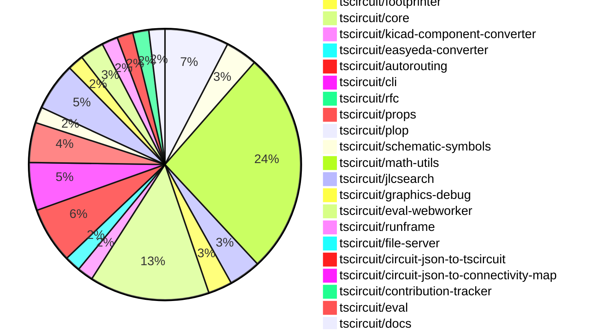

# contribution-tracker

Generates weekly contribution overviews for tscircuit contributors. Check out all
the [contribution overviews here](./contribution-overviews/)

* All PRs in the tscircuit org are scanned/summarized via Claude Haiku
* Claude classifies each Diff/PR as a Major, Minor or Tiny contribution
* All the PRs, summaries, and classifications are organized into charts and tables

The current week is shown below. There are 3 major sections:

* [Contributor Overview](#contributor-overview)
* [PRs by Repository](#prs-by-repository)
* [PRs by Contributor](#changes-by-contributor)

## Current Week

<!-- START_CURRENT_WEEK -->

# Contribution Overview 2025-01-01

## PRs by Repository

## Contributor Overview

| Contributor | 🐳 Major | 🐙 Minor | 🐌 Tiny | ⭐ | Issues Created |
|-------------|---------|---------|---------|-----|----------------|
| [seveibar](#seveibar) | 12 | 46 | 2 | 👑👑👑 | 85 |
| [Anshgrover23](#Anshgrover23) | 6 | 20 | 2 | 👑👑 | 13 |
| [ShiboSoftwareDev](#ShiboSoftwareDev) | 2 | 4 | 0 | ⭐⭐⭐ | 18 |
| [Abse2001](#Abse2001) | 4 | 5 | 0 | ⭐⭐⭐ | 5 |
| [techmannih](#techmannih) | 0 | 7 | 1 | ⭐⭐ | 4 |
| [DrSensor](#DrSensor) | 1 | 0 | 0 | ⭐ | 0 |
| [devin-ai-integration[bot]](#devin-ai-integration[bot]) | 0 | 1 | 0 |  | 0 |
| [oldbear26](#oldbear26) | 0 | 1 | 0 |  | 0 |
| [krushnarout](#krushnarout) | 0 | 1 | 0 |  | 0 |

## Review Table

[reviews-received-hover]: ## "Number of reviews received for PRs for this contributor"
[approvals-received-hover]: ## "Number of approvals received for PRs this contributor authored"
[rejections-received-hover]: ## "Number of rejections received for PRs this contributor authored"
[prs-opened-hover]: ## "Number of PRs opened by this contributor"
[issues-created-hover]: ## "Number of issues created by this contributor"
[bountied-issues-hover]: ## "Number of issues this contributor created with a bounty"
[bountied-issue-$-hover]: ## "Total bounty amount placed on issues authored by this contributor"

| Contributor | Reviews Received | Approvals Received | Rejections Received | Approvals | Rejections | PRs Opened | PRs Merged | Issues Created | Bountied Issues | Bountied Issue $ |
|---|---|---|---|---|---|---|---|---|---|---|
| [Abse2001](#Abse2001) | 44 | 9 | 0 | 5 | 5 | 12 | 9 | 5 | 0 | 0 |
| [seveibar](#seveibar) | 1 | 0 | 0 | 54 | 18 | 65 | 60 | 85 | 51 | 695 |
| [DrSensor](#DrSensor) | 1 | 1 | 0 | 0 | 0 | 1 | 1 | 0 | 0 | 0 |
| [Anshgrover23](#Anshgrover23) | 73 | 27 | 17 | 0 | 10 | 33 | 28 | 13 | 1 | 4 |
| [techmannih](#techmannih) | 32 | 13 | 10 | 0 | 0 | 16 | 8 | 4 | 0 | 0 |
| [ShiboSoftwareDev](#ShiboSoftwareDev) | 10 | 7 | 1 | 1 | 2 | 11 | 6 | 18 | 9 | 122 |
| [devin-ai-integration[bot]](#devin-ai-integration[bot]) | 3 | 1 | 2 | 0 | 0 | 4 | 1 | 0 | 0 | 0 |
| [chaadiic](#chaadiic) | 1 | 0 | 1 | 0 | 0 | 1 | 0 | 0 | 0 | 0 |
| [bhuvan-crypto](#bhuvan-crypto) | 2 | 0 | 2 | 0 | 0 | 1 | 0 | 0 | 0 | 0 |
| [oldbear26](#oldbear26) | 4 | 1 | 1 | 0 | 0 | 2 | 1 | 0 | 0 | 0 |
| [krushnarout](#krushnarout) | 2 | 1 | 1 | 0 | 0 | 2 | 1 | 0 | 0 | 0 |

## Changes by Repository

### [tscircuit/pcb-viewer](https://github.com/tscircuit/pcb-viewer)

| PR # | Impact | Contributor | Description |
|------|--------|-------------|-------------|
| [#114](https://github.com/tscircuit/pcb-viewer/pull/114) | 🐳 Major | Abse2001 | Adds a performance test for the contribution board feature. |
| [#110](https://github.com/tscircuit/pcb-viewer/pull/110) | 🐳 Major | Abse2001 | Introduced a View dropdown to improve trace visibility control and enhanced algorithms to filter and display only traces with max_length by default. |
| [#115](https://github.com/tscircuit/pcb-viewer/pull/115) | 🐳 Major | seveibar | Adds a new circuit JSON file for a large LED matrix and fixes an issue with memoization. |
| [#101](https://github.com/tscircuit/pcb-viewer/pull/101) | 🐙 Minor | Abse2001 | Added a tooltip to display the trace length when hovering over multiple traces, and handled the case where the trace length exceeds the maximum length. |
| [#122](https://github.com/tscircuit/pcb-viewer/pull/122) | 🐙 Minor | seveibar | Update the `use-mouse-matrix-transform` dependency to version 1.3.0 to improve ESM compatibility. |
| [#121](https://github.com/tscircuit/pcb-viewer/pull/121) | 🐙 Minor | seveibar | Change the build script to use `--platform browser` to build for the browser, avoiding the need to import `webcrypto`. |
| [#105](https://github.com/tscircuit/pcb-viewer/pull/105) | 🐙 Minor | seveibar | Add Renovate for automatic dependency updates, and update the `circuit-json-to-connectivity-map` dependency to version `0.0.18`. |
| [#107](https://github.com/tscircuit/pcb-viewer/pull/107) | 🐙 Minor | seveibar | Switches the module type from CommonJS to ESM (ECMAScript Modules) and updates the build configuration accordingly. |

### [tscircuit/autorouting.com](https://github.com/tscircuit/autorouting.com)

| PR # | Impact | Contributor | Description |
|------|--------|-------------|-------------|
| [#21](https://github.com/tscircuit/autorouting.com/pull/21) | 🐳 Major | Abse2001 | Adds a new CLI command to download a dataset from a remote server to the local filesystem. |
| [#14](https://github.com/tscircuit/autorouting.com/pull/14) | 🐙 Minor | seveibar | Revert the addition of the main logo animation |
| [#16](https://github.com/tscircuit/autorouting.com/pull/16) | 🐙 Minor | Anshgrover23 | Adds an autorouting animation on the main page of the application. |
| [#13](https://github.com/tscircuit/autorouting.com/pull/13) | 🐙 Minor | Anshgrover23 | Adds a main logo animation to the homepage |

### [tscircuit/snippets](https://github.com/tscircuit/snippets)

| PR # | Impact | Contributor | Description |
|------|--------|-------------|-------------|
| [#484](https://github.com/tscircuit/snippets/pull/484) | 🐳 Major | Abse2001 | Adds AI-driven auto-completion functionality to the CodeEditor component using the @valtown/codemirror-codeium package. |
| [#498](https://github.com/tscircuit/snippets/pull/498) | 🐳 Major | ShiboSoftwareDev | Enhances the footprint dialog with various improvements, including hiding passive components, enabling mobile scrolling, handling read-only parameters, and improving overall functionality. |
| [#515](https://github.com/tscircuit/snippets/pull/515) | 🐙 Minor | seveibar | Add `@tscircuit/math-utils` as a pre-supplied import in the `use-run-tsx` hook. |
| [#512](https://github.com/tscircuit/snippets/pull/512) | 🐙 Minor | seveibar | Fixes the order of the `AUTOLOAD_SNIPPETS` environment variable in the `dev` script in the `package.json` file. |
| [#506](https://github.com/tscircuit/snippets/pull/506) | 🐙 Minor | seveibar | Update the PCB viewer and fix alternate registry handling with special CORS handling. |
| [#505](https://github.com/tscircuit/snippets/pull/505) | 🐙 Minor | seveibar | Adds retry logic to use an alternate registry server when the primary server returns a 413 (Request Entity Too Large) error. |
| [#503](https://github.com/tscircuit/snippets/pull/503) | 🐙 Minor | seveibar | Adds a fallback method to update a code snippet when the payload is too large for the primary URL. |
| [#502](https://github.com/tscircuit/snippets/pull/502) | 🐙 Minor | seveibar | Adds support for downloading the circuit 3D model in GLTF format. |
| [#493](https://github.com/tscircuit/snippets/pull/493) | 🐙 Minor | seveibar | Improve the search component by adding a new link component that handles opening links in a new tab, sorting the search results by updated date, and displaying a PCB preview image for each search result. |
| [#487](https://github.com/tscircuit/snippets/pull/487) | 🐙 Minor | seveibar | Reverts the previous fix for card misalignment. |
| [#488](https://github.com/tscircuit/snippets/pull/488) | 🐙 Minor | seveibar | Fix for the `snippetType` property to handle cases where `templateFromUrl` is null. |
| [#468](https://github.com/tscircuit/snippets/pull/468) | 🐙 Minor | seveibar | Improves the layout of the landing page's bullet points on mobile devices. |
| [#463](https://github.com/tscircuit/snippets/pull/463) | 🐙 Minor | seveibar | Adds analytics tracking and cookie consent functionality. |
| [#528](https://github.com/tscircuit/snippets/pull/528) | 🐙 Minor | Anshgrover23 | The pull request fixes a bug where a user's changes are discarded when they fork a snippet. |
| [#514](https://github.com/tscircuit/snippets/pull/514) | 🐙 Minor | Anshgrover23 | Upgrades the `kicad-converter` dependency to version 0.0.16 and adds the ability to generate a `.kicad_pro` file in addition to the `.kicad_pcb` file. |
| [#492](https://github.com/tscircuit/snippets/pull/492) | 🐙 Minor | Anshgrover23 | Fixes the selector used to click the "Ellipsis Vertical" button in the update-description.spec.ts file. |
| [#490](https://github.com/tscircuit/snippets/pull/490) | 🐙 Minor | Anshgrover23 | Disable the `waitForLoadState("networkidle")` check and increase the timeout for various tests. |
| [#482](https://github.com/tscircuit/snippets/pull/482) | 🐙 Minor | Anshgrover23 | Adds a new feature to download KiCad PCB files from the circuit JSON. |
| [#460](https://github.com/tscircuit/snippets/pull/460) | 🐙 Minor | Anshgrover23 | Fixes the search component by adding a `max-h-screen` and `overflow-y-auto` to the search results container. |
| [#458](https://github.com/tscircuit/snippets/pull/458) | 🐙 Minor | Anshgrover23 | Fixes playwright tests by removing unnecessary code and updating selectors. |
| [#518](https://github.com/tscircuit/snippets/pull/518) | 🐙 Minor | techmannih | Fixes the star button functionality for a code snippet. |
| [#489](https://github.com/tscircuit/snippets/pull/489) | 🐙 Minor | techmannih | Fix the alignment of the landing page cards. |
| [#478](https://github.com/tscircuit/snippets/pull/478) | 🐙 Minor | techmannih | Fixes a card misalignment issue by adding a `hover:shadow-lg transition-shadow duration-200 h-full` class to the card component. |
| [#475](https://github.com/tscircuit/snippets/pull/475) | 🐙 Minor | techmannih | Adds a new button to download the circuit assembly as an SVG file. |
| [#500](https://github.com/tscircuit/snippets/pull/500) | 🐙 Minor | oldbear26 | Add type declaration for manual-edits.json in ATA |
| [#465](https://github.com/tscircuit/snippets/pull/465) | 🐙 Minor | krushnarout | Adds a new button on the landing page to show a dropdown menu when the user is logged in. |
| [#483](https://github.com/tscircuit/snippets/pull/483) | 🐌 Tiny | seveibar | Update the Discord link in the Header2 component. |
| [#472](https://github.com/tscircuit/snippets/pull/472) | 🐌 Tiny | Anshgrover23 | Adds Algora bounty badges to the README.md file. |

### [tscircuit/circuit-json](https://github.com/tscircuit/circuit-json)

| PR # | Impact | Contributor | Description |
|------|--------|-------------|-------------|
| [#115](https://github.com/tscircuit/circuit-json/pull/115) | 🐙 Minor | Abse2001 | Added a new optional field `display_name` to the `SourceTrace` interface. |
| [#119](https://github.com/tscircuit/circuit-json/pull/119) | 🐙 Minor | Anshgrover23 | Ensures accurate rounding for capacitance values to 12 significant digits. |
| [#120](https://github.com/tscircuit/circuit-json/pull/120) | 🐙 Minor | techmannih | Adds a new "pill" shape for SMT pads on the PCB. |
| [#116](https://github.com/tscircuit/circuit-json/pull/116) | 🐙 Minor | ShiboSoftwareDev | Added a new `source_simple_mosfet` component to the circuit element and source component types. |

### [tscircuit/footprinter](https://github.com/tscircuit/footprinter)

| PR # | Impact | Contributor | Description |
|------|--------|-------------|-------------|
| [#108](https://github.com/tscircuit/footprinter/pull/108) | 🐙 Minor | Abse2001 | Fixes the default value of `legsoutside` parameter in the `quad` function and adds a comment about the need to handle footprint variants. |
| [#105](https://github.com/tscircuit/footprinter/pull/105) | 🐙 Minor | ShiboSoftwareDev | Change the parameter types of `pushbutton` from `number` to `length`. |
| [#104](https://github.com/tscircuit/footprinter/pull/104) | 🐙 Minor | ShiboSoftwareDev | Removed literal types and replaced them with more generic types |

### [tscircuit/core](https://github.com/tscircuit/core)

| PR # | Impact | Contributor | Description |
|------|--------|-------------|-------------|
| [#499](https://github.com/tscircuit/core/pull/499) | 🐳 Major | seveibar | Introduce schematic trace shortcuts and optimize margins |
| [#481](https://github.com/tscircuit/core/pull/481) | 🐳 Major | ShiboSoftwareDev | Adds a new MOSFET component to the circuit library. |
| [#487](https://github.com/tscircuit/core/pull/487) | 🐙 Minor | Abse2001 | Implemented `<board />` `outlineOffsetX` and `outlineOffsetY` properties to allow offsetting the board outline. |
| [#479](https://github.com/tscircuit/core/pull/479) | 🐙 Minor | Abse2001 | Adds a function to generate a display name for a trace based on its connected ports and nets. |
| [#506](https://github.com/tscircuit/core/pull/506) | 🐙 Minor | seveibar | Fix and repro for NaN in schematic trace, minor refactor |
| [#503](https://github.com/tscircuit/core/pull/503) | 🐙 Minor | seveibar | Allows adding multiple netlabels on the same pin by appending the new netlabel to the existing one. |
| [#501](https://github.com/tscircuit/core/pull/501) | 🐙 Minor | seveibar | Attempts to catch an infinite loop case that is crashing some circuits. |
| [#492](https://github.com/tscircuit/core/pull/492) | 🐙 Minor | seveibar | Refactors the code that gets schematic obstacles for a trace, moving it to a separate function and adding more types of obstacles. |
| [#489](https://github.com/tscircuit/core/pull/489) | 🐙 Minor | seveibar | Optimize performance by skipping PcbRouteNetIslands when routing is disabled, and export types from Renderable |
| [#488](https://github.com/tscircuit/core/pull/488) | 🐙 Minor | seveibar | Renames `asyncEffectComplete` to `asyncEffect:end`, adds `asyncEffect:start`, and refactors the emit function to avoid ambiguity. |
| [#480](https://github.com/tscircuit/core/pull/480) | 🐙 Minor | seveibar | Allows duplicate port hints for overlapping PCB primitive elements, which fixes some KiCAD conversion issues. |
| [#475](https://github.com/tscircuit/core/pull/475) | 🐙 Minor | seveibar | Adds support for non-numeric pin labels in the schPinStyle property and a new function to convert pin styles with labels to a format using only numeric pin numbers. |
| [#511](https://github.com/tscircuit/core/pull/511) | 🐙 Minor | Anshgrover23 | Adds the ability to use `React.createElement` without explicitly importing it. |
| [#478](https://github.com/tscircuit/core/pull/478) | 🐙 Minor | Anshgrover23 | Added a new feature to skip the schematic rendering of the Chip component if the `noSchematicRepresentation` prop is set to `true`. |
| [#509](https://github.com/tscircuit/core/pull/509) | 🐙 Minor | techmannih | The pull request fixes a bug related to the "junction point" feature. |

### [tscircuit/kicad-component-converter](https://github.com/tscircuit/kicad-component-converter)

| PR # | Impact | Contributor | Description |
|------|--------|-------------|-------------|
| [#110](https://github.com/tscircuit/kicad-component-converter/pull/110) | 🐳 Major | seveibar | Convert Kicad Mod into Circuit Json on website |
| [#112](https://github.com/tscircuit/kicad-component-converter/pull/112) | 🐙 Minor | seveibar | Adds a feature to open tscircuit snippet and download circuit JSON file. |

### [tscircuit/easyeda-converter](https://github.com/tscircuit/easyeda-converter)

| PR # | Impact | Contributor | Description |
|------|--------|-------------|-------------|
| [#146](https://github.com/tscircuit/easyeda-converter/pull/146) | 🐳 Major | seveibar | Add support for parsing silkscreen text in the EasyEDA to TSCircuit Soup JSON converter. |
| [#141](https://github.com/tscircuit/easyeda-converter/pull/141) | 🐙 Minor | seveibar | Adds instructions to the README for adding a new part test |

### [tscircuit/autorouting](https://github.com/tscircuit/autorouting)

| PR # | Impact | Contributor | Description |
|------|--------|-------------|-------------|
| [#108](https://github.com/tscircuit/autorouting/pull/108) | 🐳 Major | seveibar | Rewrites the `shortenPathWithShortcuts` function for clarity and fixes edge cases where the wrong shortcut was selected. |
| [#107](https://github.com/tscircuit/autorouting/pull/107) | 🐳 Major | seveibar | Improve debugging of paths and fix issue with shortcuts not working |
| [#103](https://github.com/tscircuit/autorouting/pull/103) | 🐳 Major | seveibar | Add support for Shorten Path with Shortcuts |
| [#109](https://github.com/tscircuit/autorouting/pull/109) | 🐙 Minor | seveibar | Adds handling for the `MAX_ITERATIONS` option, which may not always be provided in the input. |
| [#106](https://github.com/tscircuit/autorouting/pull/106) | 🐙 Minor | seveibar | Adds several SVG rectangle elements to the image, likely for visualization purposes. |
| [#105](https://github.com/tscircuit/autorouting/pull/105) | 🐙 Minor | seveibar | Fix a bug in the multilayer autorouter that caused it to not handle collisions properly when shortening paths. |
| [#104](https://github.com/tscircuit/autorouting/pull/104) | 🐙 Minor | seveibar | Fixes a bug with path collisions for simplifying paths. |

### [tscircuit/cli](https://github.com/tscircuit/cli)

| PR # | Impact | Contributor | Description |
|------|--------|-------------|-------------|
| [#16](https://github.com/tscircuit/cli/pull/16) | 🐳 Major | seveibar | Adds support for exporting circuit designs to various formats, including JSON, SVG, and more. |
| [#15](https://github.com/tscircuit/cli/pull/15) | 🐳 Major | seveibar | Refactor for DevServer class state management, add basic test for DevServer initialization, and introduce File Server API Types. |
| [#13](https://github.com/tscircuit/cli/pull/13) | 🐳 Major | seveibar | This pull request adds a `clone` command to the `tscircuit` command line interface (CLI) to quickly download snippets from the registry. |
| [#12](https://github.com/tscircuit/cli/pull/12) | 🐳 Major | seveibar | Establish CLI patterns, implement authentication to prepare for snippets sync |
| [#10](https://github.com/tscircuit/cli/pull/10) | 🐳 Major | seveibar | Introduces drag and drop support for schematics, along with dynamic loading of the Runframe library and an event watcher on the CLI. |
| [#11](https://github.com/tscircuit/cli/pull/11) | 🐙 Minor | seveibar | Fix Module Import issue in cli build |

### [tscircuit/rfc](https://github.com/tscircuit/rfc)

| PR # | Impact | Contributor | Description |
|------|--------|-------------|-------------|
| [#3](https://github.com/tscircuit/rfc/pull/3) | 🐙 Minor | seveibar | Adds a .gitignore file for the assets/2025-01-10-registry-bundling-and-transpilation directory and an example CJS transpile file. |

### [tscircuit/props](https://github.com/tscircuit/props)

| PR # | Impact | Contributor | Description |
|------|--------|-------------|-------------|
| [#145](https://github.com/tscircuit/props/pull/145) | 🐙 Minor | seveibar | Add a new configuration option `subcircuit.schTraceAutoLabelEnabled` to enable automatic labeling of complex traces. |
| [#144](https://github.com/tscircuit/props/pull/144) | 🐙 Minor | seveibar | Rename `pcbOffsetX` and `pcbOffsetY` properties to `outlineOffsetX` and `outlineOffsetY`, respectively, in the `Board` component. |
| [#141](https://github.com/tscircuit/props/pull/141) | 🐙 Minor | Anshgrover23 | Add a new property `noSchematicRepresentation` to the `chipProps` type, which allows disabling the schematic representation of a chip. |
| [#138](https://github.com/tscircuit/props/pull/138) | 🐙 Minor | ShiboSoftwareDev | Changes the `channelType` property in `MosfetProps` from `"nmos" | "pmos"` to `"n" | "p"`, and adds a new `mosfetMode` property with options `"enhancement" | "depletion"`. |
| [#143](https://github.com/tscircuit/props/pull/143) | 🐙 Minor | devin-ai-integration[bot] | Add `pcbOffsetX` and `pcbOffsetY` properties to the board component to allow offsetting the PCB position. |

### [tscircuit/plop](https://github.com/tscircuit/plop)

| PR # | Impact | Contributor | Description |
|------|--------|-------------|-------------|
| [#7](https://github.com/tscircuit/plop/pull/7) | 🐙 Minor | seveibar | Allow bot token for bypassing branch protection on version commit |

### [tscircuit/schematic-symbols](https://github.com/tscircuit/schematic-symbols)

| PR # | Impact | Contributor | Description |
|------|--------|-------------|-------------|
| [#232](https://github.com/tscircuit/schematic-symbols/pull/232) | 🐙 Minor | seveibar | Automatically computes the size of the resistor and capacitor symbols based on the bounds of their primitives. |
| [#231](https://github.com/tscircuit/schematic-symbols/pull/231) | 🐙 Minor | techmannih | Add an op-amp symbol to the project. |

### [tscircuit/math-utils](https://github.com/tscircuit/math-utils)

| PR # | Impact | Contributor | Description |
|------|--------|-------------|-------------|
| [#4](https://github.com/tscircuit/math-utils/pull/4) | 🐙 Minor | seveibar | Add row and column properties to the GridCellPositions type |

### [tscircuit/jlcsearch](https://github.com/tscircuit/jlcsearch)

| PR # | Impact | Contributor | Description |
|------|--------|-------------|-------------|
| [#25](https://github.com/tscircuit/jlcsearch/pull/25) | 🐳 Major | Anshgrover23 |  |
| [#22](https://github.com/tscircuit/jlcsearch/pull/22) | 🐳 Major | Anshgrover23 | Introduces OLED Display modules and related functionality to the application. |
| [#24](https://github.com/tscircuit/jlcsearch/pull/24) | 🐳 Major | Anshgrover23 | Adds a new derived table `led_segment_display` to the database schema, which includes various attributes related to LED segment displays. |
| [#14](https://github.com/tscircuit/jlcsearch/pull/14) | 🐳 Major | Anshgrover23 |  |
| [#16](https://github.com/tscircuit/jlcsearch/pull/16) | 🐙 Minor | seveibar | Adds the Posthog analytics script to the application. |
| [#23](https://github.com/tscircuit/jlcsearch/pull/23) | 🐙 Minor | Anshgrover23 | Adds a new page for LED Dot Matrix Display Modules. |

### [tscircuit/graphics-debug](https://github.com/tscircuit/graphics-debug)

| PR # | Impact | Contributor | Description |
|------|--------|-------------|-------------|
| [#12](https://github.com/tscircuit/graphics-debug/pull/12) | 🐙 Minor | seveibar | Fix the Cartesian coordinate system in the SVG rendering |
| [#14](https://github.com/tscircuit/graphics-debug/pull/14) | 🐙 Minor | Anshgrover23 | Adds support for customizing the stroke color and width of lines in the SVG graphics object. |

### [tscircuit/eval-webworker](https://github.com/tscircuit/eval-webworker)

| PR # | Impact | Contributor | Description |
|------|--------|-------------|-------------|
| [#72](https://github.com/tscircuit/eval-webworker/pull/72) | 🐙 Minor | seveibar | Update the @tscircuit/core dependency from version 0.0.259 to 0.0.261. |
| [#62](https://github.com/tscircuit/eval-webworker/pull/62) | 🐙 Minor | seveibar | Fix Event Listening via Rebinding |
| [#71](https://github.com/tscircuit/eval-webworker/pull/71) | 🐙 Minor | Anshgrover23 | Adds a `clearEventListeners()` function to the `CircuitWebWorker` interface and its implementation in the `webworker/index.ts` file. |

### [tscircuit/runframe](https://github.com/tscircuit/runframe)

| PR # | Impact | Contributor | Description |
|------|--------|-------------|-------------|
| [#111](https://github.com/tscircuit/runframe/pull/111) | 🐙 Minor | seveibar |  |
| [#108](https://github.com/tscircuit/runframe/pull/108) | 🐙 Minor | seveibar | Adds a new Render Log tab to the CircuitJsonPreview component. |

### [tscircuit/file-server](https://github.com/tscircuit/file-server)

| PR # | Impact | Contributor | Description |
|------|--------|-------------|-------------|
| [#4](https://github.com/tscircuit/file-server/pull/4) | 🐙 Minor | seveibar | Refactor Event name, start lib exports, add initiator support |

### [tscircuit/circuit-json-to-tscircuit](https://github.com/tscircuit/circuit-json-to-tscircuit)

| PR # | Impact | Contributor | Description |
|------|--------|-------------|-------------|
| [#3](https://github.com/tscircuit/circuit-json-to-tscircuit/pull/3) | 🐙 Minor | seveibar | The pull request adds more information to the README, and removes empty lines from the output. |
| [#2](https://github.com/tscircuit/circuit-json-to-tscircuit/pull/2) | 🐙 Minor | seveibar | Add initial GitHub Actions workflows for formatting checks, type checks, and publishing to npm. |

### [tscircuit/circuit-json-to-connectivity-map](https://github.com/tscircuit/circuit-json-to-connectivity-map)

| PR # | Impact | Contributor | Description |
|------|--------|-------------|-------------|
| [#7](https://github.com/tscircuit/circuit-json-to-connectivity-map/pull/7) | 🐌 Tiny | seveibar | Update the version of the `@tscircuit/math-utils` dependency in the `package.json` file from `^0.0.4` to `^0.0.9`. |

### [tscircuit/contribution-tracker](https://github.com/tscircuit/contribution-tracker)

| PR # | Impact | Contributor | Description |
|------|--------|-------------|-------------|
| [#28](https://github.com/tscircuit/contribution-tracker/pull/28) | 🐳 Major | Anshgrover23 | Implement caching for GitHub API calls to improve performance. |
| [#30](https://github.com/tscircuit/contribution-tracker/pull/30) | 🐙 Minor | Anshgrover23 | Adds a cache to the Anthropic SDK usage in the `analyzePRWithClaude` function, and introduces a new `CachedAnthropic` class to handle the caching logic. |

### [tscircuit/eval](https://github.com/tscircuit/eval)

| PR # | Impact | Contributor | Description |
|------|--------|-------------|-------------|
| [#3](https://github.com/tscircuit/eval/pull/3) | 🐳 Major | Anshgrover23 | Introduces a new `CircuitEvaluator` class and updates the tests to use its new implementation. |

### [tscircuit/docs](https://github.com/tscircuit/docs)

| PR # | Impact | Contributor | Description |
|------|--------|-------------|-------------|
| [#53](https://github.com/tscircuit/docs/pull/53) | 🐙 Minor | Anshgrover23 | Add documentation for new components: transistor, inductor, LED, and power source, and modify the trace documentation. |
| [#46](https://github.com/tscircuit/docs/pull/46) | 🐌 Tiny | techmannih | Fixed typo and clarified terminology in the description of the `<trace />` component. |

### [tscircuit/kicad-converter](https://github.com/tscircuit/kicad-converter)

| PR # | Impact | Contributor | Description |
|------|--------|-------------|-------------|
| [#12](https://github.com/tscircuit/kicad-converter/pull/12) | 🐙 Minor | Anshgrover23 | Add `kicad-pro` module to the project's index |

### [tscircuit/maintenance-tracker](https://github.com/tscircuit/maintenance-tracker)

| PR # | Impact | Contributor | Description |
|------|--------|-------------|-------------|
| [#4](https://github.com/tscircuit/maintenance-tracker/pull/4) | 🐙 Minor | Anshgrover23 | Treat skipped checks as success checks in the pull request status checks. |

### [tscircuit/tscircuit](https://github.com/tscircuit/tscircuit)

| PR # | Impact | Contributor | Description |
|------|--------|-------------|-------------|
| [#493](https://github.com/tscircuit/tscircuit/pull/493) | 🐌 Tiny | Anshgrover23 | Added Algora badges to the README.md file. |

### [tscircuit/3d-viewer](https://github.com/tscircuit/3d-viewer)

| PR # | Impact | Contributor | Description |
|------|--------|-------------|-------------|
| [#96](https://github.com/tscircuit/3d-viewer/pull/96) | 🐳 Major | DrSensor | Add hooks for exporting to gltf |

## Changes by Contributor

### [Abse2001](https://github.com/Abse2001)

| PR # | Impact | Description |
|------|--------|-------------|
| [#114](https://github.com/tscircuit/pcb-viewer/pull/114) | 🐳 Major | Adds a performance test for the contribution board feature. |
| [#110](https://github.com/tscircuit/pcb-viewer/pull/110) | 🐳 Major | Introduced a View dropdown to improve trace visibility control and enhanced algorithms to filter and display only traces with max_length by default. |
| [#21](https://github.com/tscircuit/autorouting.com/pull/21) | 🐳 Major | Adds a new CLI command to download a dataset from a remote server to the local filesystem. |
| [#484](https://github.com/tscircuit/snippets/pull/484) | 🐳 Major | Adds AI-driven auto-completion functionality to the CodeEditor component using the @valtown/codemirror-codeium package. |
| [#101](https://github.com/tscircuit/pcb-viewer/pull/101) | 🐙 Minor | Added a tooltip to display the trace length when hovering over multiple traces, and handled the case where the trace length exceeds the maximum length. |
| [#115](https://github.com/tscircuit/circuit-json/pull/115) | 🐙 Minor | Added a new optional field `display_name` to the `SourceTrace` interface. |
| [#108](https://github.com/tscircuit/footprinter/pull/108) | 🐙 Minor | Fixes the default value of `legsoutside` parameter in the `quad` function and adds a comment about the need to handle footprint variants. |
| [#487](https://github.com/tscircuit/core/pull/487) | 🐙 Minor | Implemented `<board />` `outlineOffsetX` and `outlineOffsetY` properties to allow offsetting the board outline. |
| [#479](https://github.com/tscircuit/core/pull/479) | 🐙 Minor | Adds a function to generate a display name for a trace based on its connected ports and nets. |

### [seveibar](https://github.com/seveibar)

| PR # | Impact | Description |
|------|--------|-------------|
| [#115](https://github.com/tscircuit/pcb-viewer/pull/115) | 🐳 Major | Adds a new circuit JSON file for a large LED matrix and fixes an issue with memoization. |
| [#110](https://github.com/tscircuit/kicad-component-converter/pull/110) | 🐳 Major | Convert Kicad Mod into Circuit Json on website |
| [#146](https://github.com/tscircuit/easyeda-converter/pull/146) | 🐳 Major | Add support for parsing silkscreen text in the EasyEDA to TSCircuit Soup JSON converter. |
| [#499](https://github.com/tscircuit/core/pull/499) | 🐳 Major | Introduce schematic trace shortcuts and optimize margins |
| [#108](https://github.com/tscircuit/autorouting/pull/108) | 🐳 Major | Rewrites the `shortenPathWithShortcuts` function for clarity and fixes edge cases where the wrong shortcut was selected. |
| [#107](https://github.com/tscircuit/autorouting/pull/107) | 🐳 Major | Improve debugging of paths and fix issue with shortcuts not working |
| [#103](https://github.com/tscircuit/autorouting/pull/103) | 🐳 Major | Add support for Shorten Path with Shortcuts |
| [#16](https://github.com/tscircuit/cli/pull/16) | 🐳 Major | Adds support for exporting circuit designs to various formats, including JSON, SVG, and more. |
| [#15](https://github.com/tscircuit/cli/pull/15) | 🐳 Major | Refactor for DevServer class state management, add basic test for DevServer initialization, and introduce File Server API Types. |
| [#13](https://github.com/tscircuit/cli/pull/13) | 🐳 Major | This pull request adds a `clone` command to the `tscircuit` command line interface (CLI) to quickly download snippets from the registry. |
| [#12](https://github.com/tscircuit/cli/pull/12) | 🐳 Major | Establish CLI patterns, implement authentication to prepare for snippets sync |
| [#10](https://github.com/tscircuit/cli/pull/10) | 🐳 Major | Introduces drag and drop support for schematics, along with dynamic loading of the Runframe library and an event watcher on the CLI. |
| [#122](https://github.com/tscircuit/pcb-viewer/pull/122) | 🐙 Minor | Update the `use-mouse-matrix-transform` dependency to version 1.3.0 to improve ESM compatibility. |
| [#121](https://github.com/tscircuit/pcb-viewer/pull/121) | 🐙 Minor | Change the build script to use `--platform browser` to build for the browser, avoiding the need to import `webcrypto`. |
| [#105](https://github.com/tscircuit/pcb-viewer/pull/105) | 🐙 Minor | Add Renovate for automatic dependency updates, and update the `circuit-json-to-connectivity-map` dependency to version `0.0.18`. |
| [#107](https://github.com/tscircuit/pcb-viewer/pull/107) | 🐙 Minor | Switches the module type from CommonJS to ESM (ECMAScript Modules) and updates the build configuration accordingly. |
| [#3](https://github.com/tscircuit/rfc/pull/3) | 🐙 Minor | Adds a .gitignore file for the assets/2025-01-10-registry-bundling-and-transpilation directory and an example CJS transpile file. |
| [#145](https://github.com/tscircuit/props/pull/145) | 🐙 Minor | Add a new configuration option `subcircuit.schTraceAutoLabelEnabled` to enable automatic labeling of complex traces. |
| [#144](https://github.com/tscircuit/props/pull/144) | 🐙 Minor | Rename `pcbOffsetX` and `pcbOffsetY` properties to `outlineOffsetX` and `outlineOffsetY`, respectively, in the `Board` component. |
| [#112](https://github.com/tscircuit/kicad-component-converter/pull/112) | 🐙 Minor | Adds a feature to open tscircuit snippet and download circuit JSON file. |
| [#141](https://github.com/tscircuit/easyeda-converter/pull/141) | 🐙 Minor | Adds instructions to the README for adding a new part test |
| [#506](https://github.com/tscircuit/core/pull/506) | 🐙 Minor | Fix and repro for NaN in schematic trace, minor refactor |
| [#503](https://github.com/tscircuit/core/pull/503) | 🐙 Minor | Allows adding multiple netlabels on the same pin by appending the new netlabel to the existing one. |
| [#501](https://github.com/tscircuit/core/pull/501) | 🐙 Minor | Attempts to catch an infinite loop case that is crashing some circuits. |
| [#492](https://github.com/tscircuit/core/pull/492) | 🐙 Minor | Refactors the code that gets schematic obstacles for a trace, moving it to a separate function and adding more types of obstacles. |
| [#489](https://github.com/tscircuit/core/pull/489) | 🐙 Minor | Optimize performance by skipping PcbRouteNetIslands when routing is disabled, and export types from Renderable |
| [#488](https://github.com/tscircuit/core/pull/488) | 🐙 Minor | Renames `asyncEffectComplete` to `asyncEffect:end`, adds `asyncEffect:start`, and refactors the emit function to avoid ambiguity. |
| [#480](https://github.com/tscircuit/core/pull/480) | 🐙 Minor | Allows duplicate port hints for overlapping PCB primitive elements, which fixes some KiCAD conversion issues. |
| [#475](https://github.com/tscircuit/core/pull/475) | 🐙 Minor | Adds support for non-numeric pin labels in the schPinStyle property and a new function to convert pin styles with labels to a format using only numeric pin numbers. |
| [#7](https://github.com/tscircuit/plop/pull/7) | 🐙 Minor | Allow bot token for bypassing branch protection on version commit |
| [#109](https://github.com/tscircuit/autorouting/pull/109) | 🐙 Minor | Adds handling for the `MAX_ITERATIONS` option, which may not always be provided in the input. |
| [#106](https://github.com/tscircuit/autorouting/pull/106) | 🐙 Minor | Adds several SVG rectangle elements to the image, likely for visualization purposes. |
| [#105](https://github.com/tscircuit/autorouting/pull/105) | 🐙 Minor | Fix a bug in the multilayer autorouter that caused it to not handle collisions properly when shortening paths. |
| [#104](https://github.com/tscircuit/autorouting/pull/104) | 🐙 Minor | Fixes a bug with path collisions for simplifying paths. |
| [#14](https://github.com/tscircuit/autorouting.com/pull/14) | 🐙 Minor | Revert the addition of the main logo animation |
| [#232](https://github.com/tscircuit/schematic-symbols/pull/232) | 🐙 Minor | Automatically computes the size of the resistor and capacitor symbols based on the bounds of their primitives. |
| [#4](https://github.com/tscircuit/math-utils/pull/4) | 🐙 Minor | Add row and column properties to the GridCellPositions type |
| [#515](https://github.com/tscircuit/snippets/pull/515) | 🐙 Minor | Add `@tscircuit/math-utils` as a pre-supplied import in the `use-run-tsx` hook. |
| [#512](https://github.com/tscircuit/snippets/pull/512) | 🐙 Minor | Fixes the order of the `AUTOLOAD_SNIPPETS` environment variable in the `dev` script in the `package.json` file. |
| [#506](https://github.com/tscircuit/snippets/pull/506) | 🐙 Minor | Update the PCB viewer and fix alternate registry handling with special CORS handling. |
| [#505](https://github.com/tscircuit/snippets/pull/505) | 🐙 Minor | Adds retry logic to use an alternate registry server when the primary server returns a 413 (Request Entity Too Large) error. |
| [#503](https://github.com/tscircuit/snippets/pull/503) | 🐙 Minor | Adds a fallback method to update a code snippet when the payload is too large for the primary URL. |
| [#502](https://github.com/tscircuit/snippets/pull/502) | 🐙 Minor | Adds support for downloading the circuit 3D model in GLTF format. |
| [#493](https://github.com/tscircuit/snippets/pull/493) | 🐙 Minor | Improve the search component by adding a new link component that handles opening links in a new tab, sorting the search results by updated date, and displaying a PCB preview image for each search result. |
| [#487](https://github.com/tscircuit/snippets/pull/487) | 🐙 Minor | Reverts the previous fix for card misalignment. |
| [#488](https://github.com/tscircuit/snippets/pull/488) | 🐙 Minor | Fix for the `snippetType` property to handle cases where `templateFromUrl` is null. |
| [#468](https://github.com/tscircuit/snippets/pull/468) | 🐙 Minor | Improves the layout of the landing page's bullet points on mobile devices. |
| [#463](https://github.com/tscircuit/snippets/pull/463) | 🐙 Minor | Adds analytics tracking and cookie consent functionality. |
| [#16](https://github.com/tscircuit/jlcsearch/pull/16) | 🐙 Minor | Adds the Posthog analytics script to the application. |
| [#12](https://github.com/tscircuit/graphics-debug/pull/12) | 🐙 Minor | Fix the Cartesian coordinate system in the SVG rendering |
| [#72](https://github.com/tscircuit/eval-webworker/pull/72) | 🐙 Minor | Update the @tscircuit/core dependency from version 0.0.259 to 0.0.261. |
| [#62](https://github.com/tscircuit/eval-webworker/pull/62) | 🐙 Minor | Fix Event Listening via Rebinding |
| [#111](https://github.com/tscircuit/runframe/pull/111) | 🐙 Minor |  |
| [#108](https://github.com/tscircuit/runframe/pull/108) | 🐙 Minor | Adds a new Render Log tab to the CircuitJsonPreview component. |
| [#11](https://github.com/tscircuit/cli/pull/11) | 🐙 Minor | Fix Module Import issue in cli build |
| [#4](https://github.com/tscircuit/file-server/pull/4) | 🐙 Minor | Refactor Event name, start lib exports, add initiator support |
| [#3](https://github.com/tscircuit/circuit-json-to-tscircuit/pull/3) | 🐙 Minor | The pull request adds more information to the README, and removes empty lines from the output. |
| [#2](https://github.com/tscircuit/circuit-json-to-tscircuit/pull/2) | 🐙 Minor | Add initial GitHub Actions workflows for formatting checks, type checks, and publishing to npm. |
| [#7](https://github.com/tscircuit/circuit-json-to-connectivity-map/pull/7) | 🐌 Tiny | Update the version of the `@tscircuit/math-utils` dependency in the `package.json` file from `^0.0.4` to `^0.0.9`. |
| [#483](https://github.com/tscircuit/snippets/pull/483) | 🐌 Tiny | Update the Discord link in the Header2 component. |

### [Anshgrover23](https://github.com/Anshgrover23)

| PR # | Impact | Description |
|------|--------|-------------|
| [#28](https://github.com/tscircuit/contribution-tracker/pull/28) | 🐳 Major | Implement caching for GitHub API calls to improve performance. |
| [#25](https://github.com/tscircuit/jlcsearch/pull/25) | 🐳 Major |  |
| [#22](https://github.com/tscircuit/jlcsearch/pull/22) | 🐳 Major | Introduces OLED Display modules and related functionality to the application. |
| [#24](https://github.com/tscircuit/jlcsearch/pull/24) | 🐳 Major | Adds a new derived table `led_segment_display` to the database schema, which includes various attributes related to LED segment displays. |
| [#14](https://github.com/tscircuit/jlcsearch/pull/14) | 🐳 Major |  |
| [#3](https://github.com/tscircuit/eval/pull/3) | 🐳 Major | Introduces a new `CircuitEvaluator` class and updates the tests to use its new implementation. |
| [#119](https://github.com/tscircuit/circuit-json/pull/119) | 🐙 Minor | Ensures accurate rounding for capacitance values to 12 significant digits. |
| [#53](https://github.com/tscircuit/docs/pull/53) | 🐙 Minor | Add documentation for new components: transistor, inductor, LED, and power source, and modify the trace documentation. |
| [#141](https://github.com/tscircuit/props/pull/141) | 🐙 Minor | Add a new property `noSchematicRepresentation` to the `chipProps` type, which allows disabling the schematic representation of a chip. |
| [#511](https://github.com/tscircuit/core/pull/511) | 🐙 Minor | Adds the ability to use `React.createElement` without explicitly importing it. |
| [#478](https://github.com/tscircuit/core/pull/478) | 🐙 Minor | Added a new feature to skip the schematic rendering of the Chip component if the `noSchematicRepresentation` prop is set to `true`. |
| [#30](https://github.com/tscircuit/contribution-tracker/pull/30) | 🐙 Minor | Adds a cache to the Anthropic SDK usage in the `analyzePRWithClaude` function, and introduces a new `CachedAnthropic` class to handle the caching logic. |
| [#16](https://github.com/tscircuit/autorouting.com/pull/16) | 🐙 Minor | Adds an autorouting animation on the main page of the application. |
| [#13](https://github.com/tscircuit/autorouting.com/pull/13) | 🐙 Minor | Adds a main logo animation to the homepage |
| [#12](https://github.com/tscircuit/kicad-converter/pull/12) | 🐙 Minor | Add `kicad-pro` module to the project's index |
| [#528](https://github.com/tscircuit/snippets/pull/528) | 🐙 Minor | The pull request fixes a bug where a user's changes are discarded when they fork a snippet. |
| [#514](https://github.com/tscircuit/snippets/pull/514) | 🐙 Minor | Upgrades the `kicad-converter` dependency to version 0.0.16 and adds the ability to generate a `.kicad_pro` file in addition to the `.kicad_pcb` file. |
| [#492](https://github.com/tscircuit/snippets/pull/492) | 🐙 Minor | Fixes the selector used to click the "Ellipsis Vertical" button in the update-description.spec.ts file. |
| [#490](https://github.com/tscircuit/snippets/pull/490) | 🐙 Minor | Disable the `waitForLoadState("networkidle")` check and increase the timeout for various tests. |
| [#482](https://github.com/tscircuit/snippets/pull/482) | 🐙 Minor | Adds a new feature to download KiCad PCB files from the circuit JSON. |
| [#460](https://github.com/tscircuit/snippets/pull/460) | 🐙 Minor | Fixes the search component by adding a `max-h-screen` and `overflow-y-auto` to the search results container. |
| [#458](https://github.com/tscircuit/snippets/pull/458) | 🐙 Minor | Fixes playwright tests by removing unnecessary code and updating selectors. |
| [#23](https://github.com/tscircuit/jlcsearch/pull/23) | 🐙 Minor | Adds a new page for LED Dot Matrix Display Modules. |
| [#14](https://github.com/tscircuit/graphics-debug/pull/14) | 🐙 Minor | Adds support for customizing the stroke color and width of lines in the SVG graphics object. |
| [#71](https://github.com/tscircuit/eval-webworker/pull/71) | 🐙 Minor | Adds a `clearEventListeners()` function to the `CircuitWebWorker` interface and its implementation in the `webworker/index.ts` file. |
| [#4](https://github.com/tscircuit/maintenance-tracker/pull/4) | 🐙 Minor | Treat skipped checks as success checks in the pull request status checks. |
| [#493](https://github.com/tscircuit/tscircuit/pull/493) | 🐌 Tiny | Added Algora badges to the README.md file. |
| [#472](https://github.com/tscircuit/snippets/pull/472) | 🐌 Tiny | Adds Algora bounty badges to the README.md file. |

### [techmannih](https://github.com/techmannih)

| PR # | Impact | Description |
|------|--------|-------------|
| [#120](https://github.com/tscircuit/circuit-json/pull/120) | 🐙 Minor | Adds a new "pill" shape for SMT pads on the PCB. |
| [#509](https://github.com/tscircuit/core/pull/509) | 🐙 Minor | The pull request fixes a bug related to the "junction point" feature. |
| [#231](https://github.com/tscircuit/schematic-symbols/pull/231) | 🐙 Minor | Add an op-amp symbol to the project. |
| [#518](https://github.com/tscircuit/snippets/pull/518) | 🐙 Minor | Fixes the star button functionality for a code snippet. |
| [#489](https://github.com/tscircuit/snippets/pull/489) | 🐙 Minor | Fix the alignment of the landing page cards. |
| [#478](https://github.com/tscircuit/snippets/pull/478) | 🐙 Minor | Fixes a card misalignment issue by adding a `hover:shadow-lg transition-shadow duration-200 h-full` class to the card component. |
| [#475](https://github.com/tscircuit/snippets/pull/475) | 🐙 Minor | Adds a new button to download the circuit assembly as an SVG file. |
| [#46](https://github.com/tscircuit/docs/pull/46) | 🐌 Tiny | Fixed typo and clarified terminology in the description of the `<trace />` component. |

### [ShiboSoftwareDev](https://github.com/ShiboSoftwareDev)

| PR # | Impact | Description |
|------|--------|-------------|
| [#481](https://github.com/tscircuit/core/pull/481) | 🐳 Major | Adds a new MOSFET component to the circuit library. |
| [#498](https://github.com/tscircuit/snippets/pull/498) | 🐳 Major | Enhances the footprint dialog with various improvements, including hiding passive components, enabling mobile scrolling, handling read-only parameters, and improving overall functionality. |
| [#116](https://github.com/tscircuit/circuit-json/pull/116) | 🐙 Minor | Added a new `source_simple_mosfet` component to the circuit element and source component types. |
| [#138](https://github.com/tscircuit/props/pull/138) | 🐙 Minor | Changes the `channelType` property in `MosfetProps` from `"nmos" | "pmos"` to `"n" | "p"`, and adds a new `mosfetMode` property with options `"enhancement" | "depletion"`. |
| [#105](https://github.com/tscircuit/footprinter/pull/105) | 🐙 Minor | Change the parameter types of `pushbutton` from `number` to `length`. |
| [#104](https://github.com/tscircuit/footprinter/pull/104) | 🐙 Minor | Removed literal types and replaced them with more generic types |

### [devin-ai-integration[bot]](https://github.com/devin-ai-integration[bot])

| PR # | Impact | Description |
|------|--------|-------------|
| [#143](https://github.com/tscircuit/props/pull/143) | 🐙 Minor | Add `pcbOffsetX` and `pcbOffsetY` properties to the board component to allow offsetting the PCB position. |

### [DrSensor](https://github.com/DrSensor)

| PR # | Impact | Description |
|------|--------|-------------|
| [#96](https://github.com/tscircuit/3d-viewer/pull/96) | 🐳 Major | Add hooks for exporting to gltf |

### [oldbear26](https://github.com/oldbear26)

| PR # | Impact | Description |
|------|--------|-------------|
| [#500](https://github.com/tscircuit/snippets/pull/500) | 🐙 Minor | Add type declaration for manual-edits.json in ATA |

### [krushnarout](https://github.com/krushnarout)

| PR # | Impact | Description |
|------|--------|-------------|
| [#465](https://github.com/tscircuit/snippets/pull/465) | 🐙 Minor | Adds a new button on the landing page to show a dropdown menu when the user is logged in. |

<!-- END_CURRENT_WEEK -->
