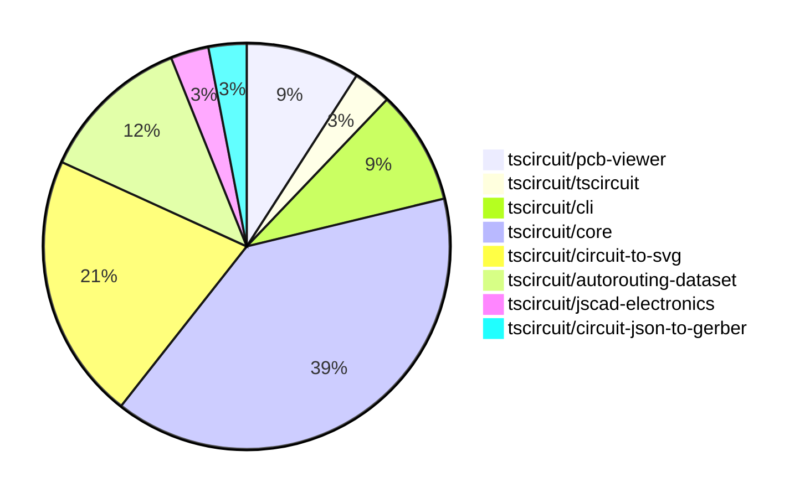

# contribution-tracker

Generates weekly contribution overviews for tscircuit contributors. Check out all
the [contribution overviews here](./contribution-overviews/)

* All PRs in the tscircuit org are scanned/summarized via Claude Haiku
* Claude classifies each Diff/PR as a Major, Minor or Tiny contribution
* All the PRs, summaries, and classifications are organized into charts and tables

The current week is shown below. There are 3 major sections:

* [Contributor Overview](#contributor-overview)
* [PRs by Repository](#prs-by-repository)
* [PRs by Contributor](#changes-by-contributor)

## Current Week

<!-- START_CURRENT_WEEK -->

# Contribution Overview 2024-09-07

## PRs by Repository

## Contributor Overview

| Contributor | 🐳 Major | 🐙 Minor | 🐌 Tiny |
|-------------|-------|-------|-------|
| seveibar | 18 | 7 | 0 |
| imrishabh18 | 3 | 0 | 0 |
| abhijitxy | 1 | 2 | 0 |
| tscircuitbot | 0 | 0 | 1 |
| ShiboSoftwareDev | 1 | 0 | 0 |

## Changes by Repository

### [tscircuit/pcb-viewer](https://github.com/tscircuit/pcb-viewer)

| PR # | Impact | Contributor | Description |
|------|--------|-------------|-------------|
| [#51](https://github.com/tscircuit/pcb-viewer/pull/51) | 🐳 Major | seveibar | Introduce the ability to highlight elements on hover by adding an `is_mouse_over` property to primitives and handling the hover logic in the `CanvasElementsRenderer` component. |
| [#50](https://github.com/tscircuit/pcb-viewer/pull/50) | 🐳 Major | seveibar | Introduces a new pattern for creating error messages using the `useToast` hook and the `react-toastify` library. |
| [#48](https://github.com/tscircuit/pcb-viewer/pull/48) | 🐳 Major | imrishabh18 | Add a new keepout example to the Storybook stories |

### [tscircuit/tscircuit](https://github.com/tscircuit/tscircuit)

| PR # | Impact | Contributor | Description |
|------|--------|-------------|-------------|
| [#389](https://github.com/tscircuit/tscircuit/pull/389) | 🐳 Major | seveibar | Add a smoke test to ensure the `tscircuit` package works before publishing. |

### [tscircuit/cli](https://github.com/tscircuit/cli)

| PR # | Impact | Contributor | Description |
|------|--------|-------------|-------------|
| [#163](https://github.com/tscircuit/cli/pull/163) | 🐳 Major | seveibar | Update the documentation for the Edit Event Pipeline, and add manual edits that don't crash the browser. |
| [#170](https://github.com/tscircuit/cli/pull/170) | 🐙 Minor | seveibar | Minor fix to pcb viewer updating causing full content flash |
| [#161](https://github.com/tscircuit/cli/pull/161) | 🐙 Minor | abhijitxy | Fix the dropdown menu to appear above the circuit component. |

### [tscircuit/core](https://github.com/tscircuit/core)

| PR # | Impact | Contributor | Description |
|------|--------|-------------|-------------|
| [#79](https://github.com/tscircuit/core/pull/79) | 🐳 Major | seveibar | Implement routingDisabled feature for subcircuits to prevent creation of PCB traces. |
| [#78](https://github.com/tscircuit/core/pull/78) | 🐳 Major | seveibar | Add support for fabrication note text and fabrication note path |
| [#76](https://github.com/tscircuit/core/pull/76) | 🐳 Major | seveibar | Add connectivity map for better obstacle exclusion |
| [#75](https://github.com/tscircuit/core/pull/75) | 🐳 Major | seveibar | The changes in this pull request fix issues with obstacle errors and get fixes for PCB via routing. |
| [#74](https://github.com/tscircuit/core/pull/74) | 🐳 Major | seveibar | Fix to handle errors in rendering without blocking the render process. |
| [#73](https://github.com/tscircuit/core/pull/73) | 🐳 Major | seveibar | Fix multilayer routing for traces with trace hints |
| [#71](https://github.com/tscircuit/core/pull/71) | 🐳 Major | seveibar | Adds support for multilayer traces and vias, and fixes a bug where traces routed inside `Trace.ts` are always routed on the top layer. |
| [#67](https://github.com/tscircuit/core/pull/67) | 🐳 Major | seveibar | Add support for creating TraceHint components from manual trace hints and inserting the hints into the database. |
| [#60](https://github.com/tscircuit/core/pull/60) | 🐳 Major | seveibar | Fix manual trace hints and add a test for them. |
| [#59](https://github.com/tscircuit/core/pull/59) | 🐳 Major | seveibar | Fix missing port IDs on SMT pads and plated holes |
| [#48](https://github.com/tscircuit/core/pull/48) | 🐳 Major | imrishabh18 | Add a new `Keepout` component to the PCB viewer |
| [#63](https://github.com/tscircuit/core/pull/63) | 🐙 Minor | abhijitxy | Fix unsupported silkscreenpath feature |
| [#69](https://github.com/tscircuit/core/pull/69) | 🐌 Tiny | tscircuitbot | Remove console.log from silkscreenpath.test.tsx |

### [tscircuit/circuit-to-svg](https://github.com/tscircuit/circuit-to-svg)

| PR # | Impact | Contributor | Description |
|------|--------|-------------|-------------|
| [#63](https://github.com/tscircuit/circuit-to-svg/pull/63) | 🐳 Major | seveibar | Introduce fabrication note path and text implementation |
| [#57](https://github.com/tscircuit/circuit-to-svg/pull/57) | 🐳 Major | seveibar | Add support for multi-layer PCB traces and refactor the code for rendering PCB traces |
| [#55](https://github.com/tscircuit/circuit-to-svg/pull/55) | 🐳 Major | seveibar | Introduces snapshot tests for the PCB rendering functionality |
| [#62](https://github.com/tscircuit/circuit-to-svg/pull/62) | 🐳 Major | imrishabh18 | Add support for rendering PCB silkscreen text |
| [#65](https://github.com/tscircuit/circuit-to-svg/pull/65) | 🐙 Minor | seveibar | Fix the closing of the SVG path for the PCB fabrication note |
| [#64](https://github.com/tscircuit/circuit-to-svg/pull/64) | 🐙 Minor | seveibar | Order the PCB fabrication notes to be displayed on top of other elements. |
| [#58](https://github.com/tscircuit/circuit-to-svg/pull/58) | 🐙 Minor | seveibar | The pull request changes the rendering of SMT pads on the bottom layer to be in blue color. |

### [tscircuit/autorouting-dataset](https://github.com/tscircuit/autorouting-dataset)

| PR # | Impact | Contributor | Description |
|------|--------|-------------|-------------|
| [#47](https://github.com/tscircuit/autorouting-dataset/pull/47) | 🐳 Major | seveibar | Add support for `pcb_via` becoming an obstacle, improve error message and fix for handling diagonal traces. |
| [#51](https://github.com/tscircuit/autorouting-dataset/pull/51) | 🐙 Minor | seveibar | Add some default `connectedTo` IDs for obstacles in the `getObstaclesFromCircuitJson` function. |
| [#44](https://github.com/tscircuit/autorouting-dataset/pull/44) | 🐙 Minor | seveibar | Add layers to obstacles in the circuit trace |
| [#42](https://github.com/tscircuit/autorouting-dataset/pull/42) | 🐙 Minor | seveibar | Added a format check action to the GitHub workflow. |

### [tscircuit/jscad-electronics](https://github.com/tscircuit/jscad-electronics)

| PR # | Impact | Contributor | Description |
|------|--------|-------------|-------------|
| [#24](https://github.com/tscircuit/jscad-electronics/pull/24) | 🐳 Major | abhijitxy | Implemented a QFN (Quad Flat No Lead) component in the project. |

### [tscircuit/circuit-json-to-gerber](https://github.com/tscircuit/circuit-json-to-gerber)

| PR # | Impact | Contributor | Description |
|------|--------|-------------|-------------|
| [#6](https://github.com/tscircuit/circuit-json-to-gerber/pull/6) | 🐳 Major | ShiboSoftwareDev | Add support for outputting a drill file in the gerber command |

## Changes by Contributor

### [seveibar](https://github.com/seveibar)

| PR # | Impact | Description |
|------|--------|-------------|
| [#51](https://github.com/tscircuit/pcb-viewer/pull/51) | 🐳 Major | Introduce the ability to highlight elements on hover by adding an `is_mouse_over` property to primitives and handling the hover logic in the `CanvasElementsRenderer` component. |
| [#50](https://github.com/tscircuit/pcb-viewer/pull/50) | 🐳 Major | Introduces a new pattern for creating error messages using the `useToast` hook and the `react-toastify` library. |
| [#389](https://github.com/tscircuit/tscircuit/pull/389) | 🐳 Major | Add a smoke test to ensure the `tscircuit` package works before publishing. |
| [#163](https://github.com/tscircuit/cli/pull/163) | 🐳 Major | Update the documentation for the Edit Event Pipeline, and add manual edits that don't crash the browser. |
| [#79](https://github.com/tscircuit/core/pull/79) | 🐳 Major | Implement routingDisabled feature for subcircuits to prevent creation of PCB traces. |
| [#78](https://github.com/tscircuit/core/pull/78) | 🐳 Major | Add support for fabrication note text and fabrication note path |
| [#76](https://github.com/tscircuit/core/pull/76) | 🐳 Major | Add connectivity map for better obstacle exclusion |
| [#75](https://github.com/tscircuit/core/pull/75) | 🐳 Major | The changes in this pull request fix issues with obstacle errors and get fixes for PCB via routing. |
| [#74](https://github.com/tscircuit/core/pull/74) | 🐳 Major | Fix to handle errors in rendering without blocking the render process. |
| [#73](https://github.com/tscircuit/core/pull/73) | 🐳 Major | Fix multilayer routing for traces with trace hints |
| [#71](https://github.com/tscircuit/core/pull/71) | 🐳 Major | Adds support for multilayer traces and vias, and fixes a bug where traces routed inside `Trace.ts` are always routed on the top layer. |
| [#67](https://github.com/tscircuit/core/pull/67) | 🐳 Major | Add support for creating TraceHint components from manual trace hints and inserting the hints into the database. |
| [#60](https://github.com/tscircuit/core/pull/60) | 🐳 Major | Fix manual trace hints and add a test for them. |
| [#59](https://github.com/tscircuit/core/pull/59) | 🐳 Major | Fix missing port IDs on SMT pads and plated holes |
| [#63](https://github.com/tscircuit/circuit-to-svg/pull/63) | 🐳 Major | Introduce fabrication note path and text implementation |
| [#57](https://github.com/tscircuit/circuit-to-svg/pull/57) | 🐳 Major | Add support for multi-layer PCB traces and refactor the code for rendering PCB traces |
| [#55](https://github.com/tscircuit/circuit-to-svg/pull/55) | 🐳 Major | Introduces snapshot tests for the PCB rendering functionality |
| [#47](https://github.com/tscircuit/autorouting-dataset/pull/47) | 🐳 Major | Add support for `pcb_via` becoming an obstacle, improve error message and fix for handling diagonal traces. |
| [#170](https://github.com/tscircuit/cli/pull/170) | 🐙 Minor | Minor fix to pcb viewer updating causing full content flash |
| [#65](https://github.com/tscircuit/circuit-to-svg/pull/65) | 🐙 Minor | Fix the closing of the SVG path for the PCB fabrication note |
| [#64](https://github.com/tscircuit/circuit-to-svg/pull/64) | 🐙 Minor | Order the PCB fabrication notes to be displayed on top of other elements. |
| [#58](https://github.com/tscircuit/circuit-to-svg/pull/58) | 🐙 Minor | The pull request changes the rendering of SMT pads on the bottom layer to be in blue color. |
| [#51](https://github.com/tscircuit/autorouting-dataset/pull/51) | 🐙 Minor | Add some default `connectedTo` IDs for obstacles in the `getObstaclesFromCircuitJson` function. |
| [#44](https://github.com/tscircuit/autorouting-dataset/pull/44) | 🐙 Minor | Add layers to obstacles in the circuit trace |
| [#42](https://github.com/tscircuit/autorouting-dataset/pull/42) | 🐙 Minor | Added a format check action to the GitHub workflow. |

### [imrishabh18](https://github.com/imrishabh18)

| PR # | Impact | Description |
|------|--------|-------------|
| [#48](https://github.com/tscircuit/pcb-viewer/pull/48) | 🐳 Major | Add a new keepout example to the Storybook stories |
| [#48](https://github.com/tscircuit/core/pull/48) | 🐳 Major | Add a new `Keepout` component to the PCB viewer |
| [#62](https://github.com/tscircuit/circuit-to-svg/pull/62) | 🐳 Major | Add support for rendering PCB silkscreen text |

### [abhijitxy](https://github.com/abhijitxy)

| PR # | Impact | Description |
|------|--------|-------------|
| [#24](https://github.com/tscircuit/jscad-electronics/pull/24) | 🐳 Major | Implemented a QFN (Quad Flat No Lead) component in the project. |
| [#161](https://github.com/tscircuit/cli/pull/161) | 🐙 Minor | Fix the dropdown menu to appear above the circuit component. |
| [#63](https://github.com/tscircuit/core/pull/63) | 🐙 Minor | Fix unsupported silkscreenpath feature |

### [tscircuitbot](https://github.com/tscircuitbot)

| PR # | Impact | Description |
|------|--------|-------------|
| [#69](https://github.com/tscircuit/core/pull/69) | 🐌 Tiny | Remove console.log from silkscreenpath.test.tsx |

### [ShiboSoftwareDev](https://github.com/ShiboSoftwareDev)

| PR # | Impact | Description |
|------|--------|-------------|
| [#6](https://github.com/tscircuit/circuit-json-to-gerber/pull/6) | 🐳 Major | Add support for outputting a drill file in the gerber command |

<!-- END_CURRENT_WEEK -->
