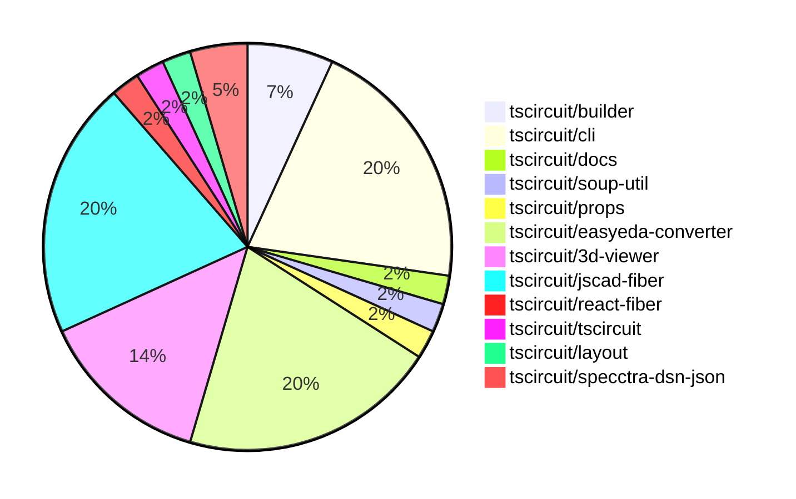

# contribution-tracker

Generates weekly contribution overviews for tscircuit contributors. Check out all
the [contribution overviews here](./contribution-overviews/)

* All PRs in the tscircuit org are scanned/summarized via Claude Haiku
* Claude classifies each Diff/PR as a Major, Minor or Tiny contribution
* All the PRs, summaries, and classifications are organized into charts and tables

The current week is shown below. There are 3 major sections:

* [Contributor Overview](#contributor-overview)
* [PRs by Repository](#prs-by-repository)
* [PRs by Contributor](#changes-by-contributor)

## Current Week

<!-- START_CURRENT_WEEK -->

# Contribution Overview 2024-07-06

## PRs by Repository

## Contributor Overview

| Contributor | 🐳 Major | 🐙 Minor | 🐌 Tiny |
|-------------|-------|-------|-------|
| seveibar | 19 | 10 | 1 |
| imrishabh18 | 1 | 0 | 1 |
| DamilolaAlao | 2 | 0 | 0 |
| andrii-balitskyi | 3 | 2 | 0 |
| Slaviiiii | 3 | 0 | 0 |

## Changes by Repository

### [tscircuit/builder](https://github.com/tscircuit/builder)

| PR # | Impact | Contributor | Description |
|------|--------|-------------|-------------|
| [#69](https://github.com/tscircuit/builder/pull/69) | 🐳 Major | seveibar | Upgrade the `@tscircuit/soup-util` package version, remove duplicated code, and fix issues where the `@tscircuit/layout` package was depending on old builder versions. |
| [#68](https://github.com/tscircuit/builder/pull/68) | 🐳 Major | seveibar | Adds support for rotation offset for CAD components |
| [#66](https://github.com/tscircuit/builder/pull/66) | 🐙 Minor | seveibar | Handle undefined board thickness when calculating the z-coordinate of the CAD component. |

### [tscircuit/cli](https://github.com/tscircuit/cli)

| PR # | Impact | Contributor | Description |
|------|--------|-------------|-------------|
| [#71](https://github.com/tscircuit/cli/pull/71) | 🐳 Major | seveibar | Hoist the example-project to the root directory |
| [#69](https://github.com/tscircuit/cli/pull/69) | 🐳 Major | seveibar | Remove sqlite, refactor to use level |
| [#68](https://github.com/tscircuit/cli/pull/68) | 🐳 Major | seveibar | Introduce a new level-based database schema and handler to migrate off SQLite. |
| [#67](https://github.com/tscircuit/cli/pull/67) | 🐳 Major | seveibar | Add test setup for dev-server-api |
| [#79](https://github.com/tscircuit/cli/pull/79) | 🐳 Major | imrishabh18 | Add a new `lint` command to the CLI tool to lint all TypeScript files in the project |
| [#86](https://github.com/tscircuit/cli/pull/86) | 🐳 Major | DamilolaAlao | Adds a function to find an available port on the system. |
| [#70](https://github.com/tscircuit/cli/pull/70) | 🐳 Major | DamilolaAlao | Adding telemetry to the dev command using Posthog |
| [#76](https://github.com/tscircuit/cli/pull/76) | 🐙 Minor | seveibar | Change the database backend from `level` to `memory-level` for Stackblitz compatibility. |
| [#89](https://github.com/tscircuit/cli/pull/89) | 🐌 Tiny | imrishabh18 | Add 'node_modules' to .gitignore |

### [tscircuit/docs](https://github.com/tscircuit/docs)

| PR # | Impact | Contributor | Description |
|------|--------|-------------|-------------|
| [#8](https://github.com/tscircuit/docs/pull/8) | 🐳 Major | seveibar | This pull request adds a new tutorial for copying a reference circuit into tscircuit. |

### [tscircuit/soup-util](https://github.com/tscircuit/soup-util)

| PR # | Impact | Contributor | Description |
|------|--------|-------------|-------------|
| [#4](https://github.com/tscircuit/soup-util/pull/4) | 🐳 Major | seveibar | Add Transforms |

### [tscircuit/props](https://github.com/tscircuit/props)

| PR # | Impact | Contributor | Description |
|------|--------|-------------|-------------|
| [#5](https://github.com/tscircuit/props/pull/5) | 🐳 Major | seveibar | Add support for `biome`, extend `cadModel` with `positionOffset` and `rotationOffset` |

### [tscircuit/easyeda-converter](https://github.com/tscircuit/easyeda-converter)

| PR # | Impact | Contributor | Description |
|------|--------|-------------|-------------|
| [#11](https://github.com/tscircuit/easyeda-converter/pull/11) | 🐳 Major | seveibar | Add support for loading CAD model rotation |
| [#8](https://github.com/tscircuit/easyeda-converter/pull/8) | 🐳 Major | seveibar | Fixes the release script, introduces formatting scripts, and adds biome support. |
| [#7](https://github.com/tscircuit/easyeda-converter/pull/7) | 🐳 Major | seveibar | The pull request introduces a new test case showing broken pad positioning. |
| [#15](https://github.com/tscircuit/easyeda-converter/pull/15) | 🐳 Major | andrii-balitskyi | Adds support for parsing polyline (PL) and polygon (PG) single letter shape schemas. |
| [#19](https://github.com/tscircuit/easyeda-converter/pull/19) | 🐙 Minor | seveibar | Run build before release |
| [#10](https://github.com/tscircuit/easyeda-converter/pull/10) | 🐙 Minor | seveibar | Improve automatic output filenames by using the base name of the input file instead of appending the input file name directly. |
| [#17](https://github.com/tscircuit/easyeda-converter/pull/17) | 🐙 Minor | andrii-balitskyi | Export `convertRawEasyEdaToTs` function |
| [#13](https://github.com/tscircuit/easyeda-converter/pull/13) | 🐙 Minor | andrii-balitskyi | Fix mm conversion in `generateFootprintTsx` function |
| [#20](https://github.com/tscircuit/easyeda-converter/pull/20) | 🐌 Tiny | seveibar | Update the README.md file to change the library name from "easyeda-converter" to "easyeda". |

### [tscircuit/3d-viewer](https://github.com/tscircuit/3d-viewer)

| PR # | Impact | Contributor | Description |
|------|--------|-------------|-------------|
| [#9](https://github.com/tscircuit/3d-viewer/pull/9) | 🐳 Major | seveibar | Improve the lifecycle management of the object loading process in the `use-global-obj-loader` hook. |
| [#6](https://github.com/tscircuit/3d-viewer/pull/6) | 🐳 Major | seveibar | This pull request introduces a global cache for models loaded using the OBJLoader, preventing repeated loading and parsing of the same models. |
| [#5](https://github.com/tscircuit/3d-viewer/pull/5) | 🐳 Major | seveibar | Switch the rotation unit from radians to degrees for the CAD components in the CadViewer component. |
| [#3](https://github.com/tscircuit/3d-viewer/pull/3) | 🐳 Major | seveibar | Removes old app files and supports not having a PCB board. |
| [#8](https://github.com/tscircuit/3d-viewer/pull/8) | 🐙 Minor | seveibar | Adds small red loading boxes to indicate when models are still loading. |
| [#7](https://github.com/tscircuit/3d-viewer/pull/7) | 🐙 Minor | seveibar | Add version number to the 3D viewer |

### [tscircuit/jscad-fiber](https://github.com/tscircuit/jscad-fiber)

| PR # | Impact | Contributor | Description |
|------|--------|-------------|-------------|
| [#16](https://github.com/tscircuit/jscad-fiber/pull/16) | 🐳 Major | seveibar | The pull request introduces test and release workflows, fixes exports, and adds a build system. |
| [#10](https://github.com/tscircuit/jscad-fiber/pull/10) | 🐳 Major | seveibar | Introduce an `ExtrudeLinear` component that allows extruding a 2D polygon into a 3D shape. |
| [#9](https://github.com/tscircuit/jscad-fiber/pull/9) | 🐳 Major | seveibar | Fix rendering for polygons by handling both 2D and 3D shapes correctly. |
| [#8](https://github.com/tscircuit/jscad-fiber/pull/8) | 🐙 Minor | seveibar | The pull request formats all the code in the repository, including the `biome.json` configuration file, and the `examples` directory. |
| [#6](https://github.com/tscircuit/jscad-fiber/pull/6) | 🟣 | seveibar | Add support for Polygon primitive, add TypeScript type checks, and add code formatting checks using GitHub workflows. |
| [#12](https://github.com/tscircuit/jscad-fiber/pull/12) | 🟣 | Slaviiiii | Introduce support for extrusion-based shapes, including helical, rectangular, and rotational extrusions. |
| [#15](https://github.com/tscircuit/jscad-fiber/pull/15) | 🐳 Major | Slaviiiii | Adds support for colorization of geometries in the JSCAD component. |
| [#14](https://github.com/tscircuit/jscad-fiber/pull/14) | 🐳 Major | Slaviiiii | Adds a `Colorize` component and corresponding functionality to the JSCAD library. |
| [#3](https://github.com/tscircuit/jscad-fiber/pull/3) | 🐳 Major | Slaviiiii | Add missing 3D shapes to the project, including Cuboid, RoundedCuboid, GeodesicSphere, Ellipsoid, Cylinder, and RoundedCylinder. |

### [tscircuit/react-fiber](https://github.com/tscircuit/react-fiber)

| PR # | Impact | Contributor | Description |
|------|--------|-------------|-------------|
| [#12](https://github.com/tscircuit/react-fiber/pull/12) | 🐙 Minor | seveibar | Upgrades dependencies, adds a new dependency for logging, and updates tests to use the new logging utility. |

### [tscircuit/tscircuit](https://github.com/tscircuit/tscircuit)

| PR # | Impact | Contributor | Description |
|------|--------|-------------|-------------|
| [#247](https://github.com/tscircuit/tscircuit/pull/247) | 🐙 Minor | seveibar | Add `@tscircuit/props` dependency and upgrade to the latest version |

### [tscircuit/layout](https://github.com/tscircuit/layout)

| PR # | Impact | Contributor | Description |
|------|--------|-------------|-------------|
| [#2](https://github.com/tscircuit/layout/pull/2) | 🐙 Minor | seveibar | Replace the use of `@tscircuit/builder` utility functions with `@tscircuit/soup-util` in the project. |

### [tscircuit/specctra-dsn-json](https://github.com/tscircuit/specctra-dsn-json)

| PR # | Impact | Contributor | Description |
|------|--------|-------------|-------------|
| [#10](https://github.com/tscircuit/specctra-dsn-json/pull/10) | 🐳 Major | andrii-balitskyi | Introduce support for parsing the `wiring` DSN element |
| [#9](https://github.com/tscircuit/specctra-dsn-json/pull/9) | 🐳 Major | andrii-balitskyi | Implement parsing of the `network` DSN element, including support for `net`, `via`, `via_rule`, and `class` elements. |

## Changes by Contributor

### [seveibar](https://github.com/seveibar)

| PR # | Impact | Description |
|------|--------|-------------|
| [#69](https://github.com/tscircuit/builder/pull/69) | 🐳 Major | Upgrade the `@tscircuit/soup-util` package version, remove duplicated code, and fix issues where the `@tscircuit/layout` package was depending on old builder versions. |
| [#68](https://github.com/tscircuit/builder/pull/68) | 🐳 Major | Adds support for rotation offset for CAD components |
| [#71](https://github.com/tscircuit/cli/pull/71) | 🐳 Major | Hoist the example-project to the root directory |
| [#69](https://github.com/tscircuit/cli/pull/69) | 🐳 Major | Remove sqlite, refactor to use level |
| [#68](https://github.com/tscircuit/cli/pull/68) | 🐳 Major | Introduce a new level-based database schema and handler to migrate off SQLite. |
| [#67](https://github.com/tscircuit/cli/pull/67) | 🐳 Major | Add test setup for dev-server-api |
| [#8](https://github.com/tscircuit/docs/pull/8) | 🐳 Major | This pull request adds a new tutorial for copying a reference circuit into tscircuit. |
| [#4](https://github.com/tscircuit/soup-util/pull/4) | 🐳 Major | Add Transforms |
| [#5](https://github.com/tscircuit/props/pull/5) | 🐳 Major | Add support for `biome`, extend `cadModel` with `positionOffset` and `rotationOffset` |
| [#11](https://github.com/tscircuit/easyeda-converter/pull/11) | 🐳 Major | Add support for loading CAD model rotation |
| [#8](https://github.com/tscircuit/easyeda-converter/pull/8) | 🐳 Major | Fixes the release script, introduces formatting scripts, and adds biome support. |
| [#7](https://github.com/tscircuit/easyeda-converter/pull/7) | 🐳 Major | The pull request introduces a new test case showing broken pad positioning. |
| [#9](https://github.com/tscircuit/3d-viewer/pull/9) | 🐳 Major | Improve the lifecycle management of the object loading process in the `use-global-obj-loader` hook. |
| [#6](https://github.com/tscircuit/3d-viewer/pull/6) | 🐳 Major | This pull request introduces a global cache for models loaded using the OBJLoader, preventing repeated loading and parsing of the same models. |
| [#5](https://github.com/tscircuit/3d-viewer/pull/5) | 🐳 Major | Switch the rotation unit from radians to degrees for the CAD components in the CadViewer component. |
| [#3](https://github.com/tscircuit/3d-viewer/pull/3) | 🐳 Major | Removes old app files and supports not having a PCB board. |
| [#16](https://github.com/tscircuit/jscad-fiber/pull/16) | 🐳 Major | The pull request introduces test and release workflows, fixes exports, and adds a build system. |
| [#10](https://github.com/tscircuit/jscad-fiber/pull/10) | 🐳 Major | Introduce an `ExtrudeLinear` component that allows extruding a 2D polygon into a 3D shape. |
| [#9](https://github.com/tscircuit/jscad-fiber/pull/9) | 🐳 Major | Fix rendering for polygons by handling both 2D and 3D shapes correctly. |
| [#66](https://github.com/tscircuit/builder/pull/66) | 🐙 Minor | Handle undefined board thickness when calculating the z-coordinate of the CAD component. |
| [#12](https://github.com/tscircuit/react-fiber/pull/12) | 🐙 Minor | Upgrades dependencies, adds a new dependency for logging, and updates tests to use the new logging utility. |
| [#247](https://github.com/tscircuit/tscircuit/pull/247) | 🐙 Minor | Add `@tscircuit/props` dependency and upgrade to the latest version |
| [#76](https://github.com/tscircuit/cli/pull/76) | 🐙 Minor | Change the database backend from `level` to `memory-level` for Stackblitz compatibility. |
| [#2](https://github.com/tscircuit/layout/pull/2) | 🐙 Minor | Replace the use of `@tscircuit/builder` utility functions with `@tscircuit/soup-util` in the project. |
| [#19](https://github.com/tscircuit/easyeda-converter/pull/19) | 🐙 Minor | Run build before release |
| [#10](https://github.com/tscircuit/easyeda-converter/pull/10) | 🐙 Minor | Improve automatic output filenames by using the base name of the input file instead of appending the input file name directly. |
| [#8](https://github.com/tscircuit/3d-viewer/pull/8) | 🐙 Minor | Adds small red loading boxes to indicate when models are still loading. |
| [#7](https://github.com/tscircuit/3d-viewer/pull/7) | 🐙 Minor | Add version number to the 3D viewer |
| [#8](https://github.com/tscircuit/jscad-fiber/pull/8) | 🐙 Minor | The pull request formats all the code in the repository, including the `biome.json` configuration file, and the `examples` directory. |
| [#20](https://github.com/tscircuit/easyeda-converter/pull/20) | 🐌 Tiny | Update the README.md file to change the library name from "easyeda-converter" to "easyeda". |
| [#6](https://github.com/tscircuit/jscad-fiber/pull/6) | 🟣 | Add support for Polygon primitive, add TypeScript type checks, and add code formatting checks using GitHub workflows. |

### [imrishabh18](https://github.com/imrishabh18)

| PR # | Impact | Description |
|------|--------|-------------|
| [#79](https://github.com/tscircuit/cli/pull/79) | 🐳 Major | Add a new `lint` command to the CLI tool to lint all TypeScript files in the project |
| [#89](https://github.com/tscircuit/cli/pull/89) | 🐌 Tiny | Add 'node_modules' to .gitignore |

### [DamilolaAlao](https://github.com/DamilolaAlao)

| PR # | Impact | Description |
|------|--------|-------------|
| [#86](https://github.com/tscircuit/cli/pull/86) | 🐳 Major | Adds a function to find an available port on the system. |
| [#70](https://github.com/tscircuit/cli/pull/70) | 🐳 Major | Adding telemetry to the dev command using Posthog |

### [andrii-balitskyi](https://github.com/andrii-balitskyi)

| PR # | Impact | Description |
|------|--------|-------------|
| [#15](https://github.com/tscircuit/easyeda-converter/pull/15) | 🐳 Major | Adds support for parsing polyline (PL) and polygon (PG) single letter shape schemas. |
| [#10](https://github.com/tscircuit/specctra-dsn-json/pull/10) | 🐳 Major | Introduce support for parsing the `wiring` DSN element |
| [#9](https://github.com/tscircuit/specctra-dsn-json/pull/9) | 🐳 Major | Implement parsing of the `network` DSN element, including support for `net`, `via`, `via_rule`, and `class` elements. |
| [#17](https://github.com/tscircuit/easyeda-converter/pull/17) | 🐙 Minor | Export `convertRawEasyEdaToTs` function |
| [#13](https://github.com/tscircuit/easyeda-converter/pull/13) | 🐙 Minor | Fix mm conversion in `generateFootprintTsx` function |

### [Slaviiiii](https://github.com/Slaviiiii)

| PR # | Impact | Description |
|------|--------|-------------|
| [#12](https://github.com/tscircuit/jscad-fiber/pull/12) | 🟣 | Introduce support for extrusion-based shapes, including helical, rectangular, and rotational extrusions. |
| [#15](https://github.com/tscircuit/jscad-fiber/pull/15) | 🐳 Major | Adds support for colorization of geometries in the JSCAD component. |
| [#14](https://github.com/tscircuit/jscad-fiber/pull/14) | 🐳 Major | Adds a `Colorize` component and corresponding functionality to the JSCAD library. |
| [#3](https://github.com/tscircuit/jscad-fiber/pull/3) | 🐳 Major | Add missing 3D shapes to the project, including Cuboid, RoundedCuboid, GeodesicSphere, Ellipsoid, Cylinder, and RoundedCylinder. |

<!-- END_CURRENT_WEEK -->
