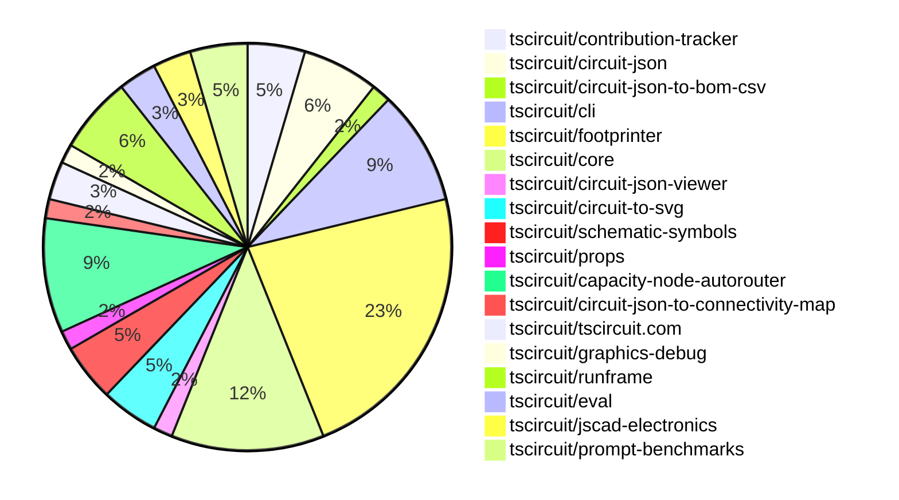

# contribution-tracker

Generates weekly contribution overviews for tscircuit contributors. Check out all
the [contribution overviews here](./contribution-overviews/)

* All PRs in the tscircuit org are scanned/summarized via Claude Haiku
* Claude classifies each Diff/PR as a Major, Minor or Tiny contribution
* All the PRs, summaries, and classifications are organized into charts and tables

The current week is shown below. There are 3 major sections:

* [Contributor Overview](#contributor-overview)
* [PRs by Repository](#prs-by-repository)
* [PRs by Contributor](#changes-by-contributor)

## Current Week

<!-- START_CURRENT_WEEK -->

# Contribution Overview 2025-02-19

## PRs by Repository

## Contributor Overview

| Contributor | 🐳 Major | 🐙 Minor | 🐌 Tiny | ⭐ | Issues Created |
|-------------|---------|---------|---------|-----|----------------|
| [seveibar](#seveibar) | 7 | 9 | 0 | 👑 | 42 |
| [techmannih](#techmannih) | 1 | 9 | 1 | ⭐⭐ | 6 |
| [ShiboSoftwareDev](#ShiboSoftwareDev) | 1 | 2 | 0 | ⭐⭐ | 9 |
| [imrishabh18](#imrishabh18) | 0 | 6 | 3 | ⭐⭐ | 12 |
| [Abse2001](#Abse2001) | 0 | 6 | 0 | ⭐⭐ | 2 |
| [kom-senapati](#kom-senapati) | 1 | 3 | 0 | ⭐ | 5 |
| [AnasSarkiz](#AnasSarkiz) | 2 | 1 | 0 | ⭐ | 1 |
| [Ayushjhawar8](#Ayushjhawar8) | 1 | 2 | 0 | ⭐ | 1 |
| [ArnavK-09](#ArnavK-09) | 0 | 3 | 1 | ⭐ | 1 |
| [MustafaMulla29](#MustafaMulla29) | 1 | 1 | 0 | ⭐ | 1 |
| [Anshgrover23](#Anshgrover23) | 0 | 2 | 1 | ⭐ | 3 |
| [siva222003](#siva222003) | 0 | 1 | 0 |  | 1 |

## Review Table

[reviews-received-hover]: ## "Number of reviews received for PRs for this contributor"
[approvals-received-hover]: ## "Number of approvals received for PRs this contributor authored"
[rejections-received-hover]: ## "Number of rejections received for PRs this contributor authored"
[prs-opened-hover]: ## "Number of PRs opened by this contributor"
[issues-created-hover]: ## "Number of issues created by this contributor"
[bountied-issues-hover]: ## "Number of issues this contributor created with a bounty"
[bountied-issue-$-hover]: ## "Total bounty amount placed on issues authored by this contributor"

| Contributor | Reviews Received | Approvals Received | Rejections Received | Approvals | Rejections | PRs Opened | PRs Merged | Issues Created | Bountied Issues | Bountied Issue $ |
|---|---|---|---|---|---|---|---|---|---|---|
| [rohitbhure65](#rohitbhure65) | 2 | 0 | 1 | 0 | 0 | 7 | 0 | 0 | 0 | 0 |
| [imrishabh18](#imrishabh18) | 4 | 4 | 0 | 9 | 3 | 10 | 9 | 12 | 5 | 59 |
| [kom-senapati](#kom-senapati) | 32 | 17 | 5 | 0 | 0 | 10 | 4 | 5 | 0 | 0 |
| [seveibar](#seveibar) | 1 | 1 | 0 | 37 | 6 | 18 | 16 | 42 | 28 | 431 |
| [Abse2001](#Abse2001) | 11 | 6 | 2 | 0 | 0 | 7 | 6 | 2 | 1 | 10 |
| [techmannih](#techmannih) | 29 | 13 | 5 | 3 | 2 | 16 | 11 | 6 | 4 | 32 |
| [Anshgrover23](#Anshgrover23) | 5 | 3 | 2 | 8 | 10 | 4 | 3 | 3 | 0 | 0 |
| [deekshatomer](#deekshatomer) | 2 | 0 | 2 | 0 | 0 | 2 | 0 | 0 | 0 | 0 |
| [MustafaMulla29](#MustafaMulla29) | 8 | 6 | 1 | 0 | 0 | 4 | 2 | 1 | 0 | 0 |
| [AnasSarkiz](#AnasSarkiz) | 4 | 3 | 0 | 0 | 1 | 3 | 3 | 1 | 1 | 5 |
| [ShiboSoftwareDev](#ShiboSoftwareDev) | 2 | 1 | 1 | 2 | 0 | 5 | 3 | 9 | 5 | 120 |
| [ArnavK-09](#ArnavK-09) | 6 | 6 | 0 | 7 | 4 | 6 | 5 | 1 | 0 | 0 |
| [Ayushjhawar8](#Ayushjhawar8) | 9 | 3 | 3 | 0 | 0 | 3 | 3 | 1 | 0 | 0 |
| [siva222003](#siva222003) | 2 | 1 | 0 | 0 | 0 | 2 | 1 | 1 | 0 | 0 |
| [AayushSaini101](#AayushSaini101) | 19 | 2 | 4 | 0 | 0 | 1 | 0 | 0 | 0 | 0 |

## Changes by Repository

### [tscircuit/contribution-tracker](https://github.com/tscircuit/contribution-tracker)

| PR # | Impact | Contributor | Description |
|------|--------|-------------|-------------|
| [#72](https://github.com/tscircuit/contribution-tracker/pull/72) | 🐳 Major | kom-senapati | Introduce workflows to automate format checking, testing, and type checking on push and pull request events. |
| [#76](https://github.com/tscircuit/contribution-tracker/pull/76) | 🟣 | ArnavK-09 | The change requires approval for points in the `getAllPRs.ts` file. |
| [#58](https://github.com/tscircuit/contribution-tracker/pull/58) | 🐙 Minor | Ayushjhawar8 | Fixes a bug to give special honor to full-time contributors by separating them from other contributors and displaying them in a dedicated section. |

### [tscircuit/circuit-json](https://github.com/tscircuit/circuit-json)

| PR # | Impact | Contributor | Description |
|------|--------|-------------|-------------|
| [#140](https://github.com/tscircuit/circuit-json/pull/140) | 🐙 Minor | kom-senapati | Removes the `rotation` field from the `SchematicComponent` interface and its corresponding schema. |
| [#138](https://github.com/tscircuit/circuit-json/pull/138) | 🐙 Minor | Abse2001 | Adding the `pcb_autorouting_error` type to `any_circuit_element`. |
| [#137](https://github.com/tscircuit/circuit-json/pull/137) | 🐙 Minor | Abse2001 | Adds a new autorouting error object to the PCB module. |
| [#135](https://github.com/tscircuit/circuit-json/pull/135) | 🐙 Minor | techmannih | Adds stroke width for silkscreen circle and silkscreen rectangle |

### [tscircuit/circuit-json-to-bom-csv](https://github.com/tscircuit/circuit-json-to-bom-csv)

| PR # | Impact | Contributor | Description |
|------|--------|-------------|-------------|
| [#6](https://github.com/tscircuit/circuit-json-to-bom-csv/pull/6) | 🐙 Minor | kom-senapati | Add support for LCSC part numbers in the JLCPCB Part # column |

### [tscircuit/cli](https://github.com/tscircuit/cli)

| PR # | Impact | Contributor | Description |
|------|--------|-------------|-------------|
| [#88](https://github.com/tscircuit/cli/pull/88) | 🐳 Major | seveibar | Massive reduction in install size (from ~500MB to ~25MB) by bundling using `bun build` instead of `tsup-node` |
| [#87](https://github.com/tscircuit/cli/pull/87) | 🐙 Minor | kom-senapati | Add a GitHub Actions workflow to automatically update the README with the CLI usage documentation. |
| [#89](https://github.com/tscircuit/cli/pull/89) | 🐙 Minor | seveibar | Removes all the "import @tscircuit/core" statements throughout the codebase. |
| [#96](https://github.com/tscircuit/cli/pull/96) | 🐙 Minor | imrishabh18 | Update the core dependency to version 0.0.323 |
| [#95](https://github.com/tscircuit/cli/pull/95) | 🐙 Minor | ArnavK-09 | Add support for detecting the new "bun.lock" file to find the package manager. |
| [#92](https://github.com/tscircuit/cli/pull/92) | 🐙 Minor | ArnavK-09 | The change adds the ability to send an error message to the `runframe` when saving a snippet fails. |

### [tscircuit/footprinter](https://github.com/tscircuit/footprinter)

| PR # | Impact | Contributor | Description |
|------|--------|-------------|-------------|
| [#215](https://github.com/tscircuit/footprinter/pull/215) | 🐳 Major | techmannih | Adds support for the SOT223 footprint |
| [#184](https://github.com/tscircuit/footprinter/pull/184) | 🐳 Major | MustafaMulla29 | Implemented VSSOP-8-0.65mm package footprint |
| [#208](https://github.com/tscircuit/footprinter/pull/208) | 🐙 Minor | Abse2001 | Fixed NaN in sot23 silkscreen |
| [#161](https://github.com/tscircuit/footprinter/pull/161) | 🐙 Minor | techmannih | Add the sot89_3 footprint. |
| [#135](https://github.com/tscircuit/footprinter/pull/135) | 🐙 Minor | techmannih | Add sod323 footprint |
| [#216](https://github.com/tscircuit/footprinter/pull/216) | 🐙 Minor | techmannih | Adds a "rows" parameter to the `pinrow` footprint function, allowing the creation of multi-row pin headers. |
| [#218](https://github.com/tscircuit/footprinter/pull/218) | 🐙 Minor | techmannih | Update snapshot due to bound issue |
| [#148](https://github.com/tscircuit/footprinter/pull/148) | 🐙 Minor | techmannih | Adds a new footprint for the SOD123W package. |
| [#206](https://github.com/tscircuit/footprinter/pull/206) | 🐙 Minor | MustafaMulla29 | Fixed the incorrect marking of stampreceiver pins. |
| [#212](https://github.com/tscircuit/footprinter/pull/212) | 🐙 Minor | imrishabh18 | Fix the number format for the `sot23_N` footprint, where N is 3, 5, 6, etc. |
| [#210](https://github.com/tscircuit/footprinter/pull/210) | 🐙 Minor | imrishabh18 | Fixes the parsing of the TO220 footprint by removing the unnecessary validation and transformations. |
| [#214](https://github.com/tscircuit/footprinter/pull/214) | 🐙 Minor | Anshgrover23 | Fix the incorrect pad spacing for the TO220 component |
| [#204](https://github.com/tscircuit/footprinter/pull/204) | 🐙 Minor | AnasSarkiz | Added support for male and female flags in the pinrow footprint definition. |
| [#207](https://github.com/tscircuit/footprinter/pull/207) | 🐌 Tiny | imrishabh18 | Add a GitHub Actions workflow to build the project using Bun. |
| [#209](https://github.com/tscircuit/footprinter/pull/209) | 🐌 Tiny | Anshgrover23 | Add a test for the `dip_0.1in` component. |

### [tscircuit/core](https://github.com/tscircuit/core)

| PR # | Impact | Contributor | Description |
|------|--------|-------------|-------------|
| [#645](https://github.com/tscircuit/core/pull/645) | 🐳 Major | seveibar | Fixes the connections implementation to automatically create nets and be accepted across NormalComponents. |
| [#644](https://github.com/tscircuit/core/pull/644) | 🐙 Minor | Abse2001 |  |
| [#639](https://github.com/tscircuit/core/pull/639) | 🐙 Minor | Abse2001 | Adds silkscreen text for component names in the PCB layout. |
| [#646](https://github.com/tscircuit/core/pull/646) | 🐙 Minor | techmannih | Update the footprinter dependency and update the jumper test with rows |
| [#638](https://github.com/tscircuit/core/pull/638) | 🐙 Minor | seveibar | Add more common pin names to the `sel-utility-types` module. |
| [#643](https://github.com/tscircuit/core/pull/643) | 🐙 Minor | imrishabh18 | Adds the `@tscircuit/footprinter` package as a peer dependency. |
| [#640](https://github.com/tscircuit/core/pull/640) | 🐙 Minor | imrishabh18 | Add `subcircuit_id` to output traces. |
| [#641](https://github.com/tscircuit/core/pull/641) | 🐌 Tiny | imrishabh18 | Updates the version of the "@tscircuit/footprinter" dependency in the package.json file. |

### [tscircuit/circuit-json-viewer](https://github.com/tscircuit/circuit-json-viewer)

| PR # | Impact | Contributor | Description |
|------|--------|-------------|-------------|
| [#3](https://github.com/tscircuit/circuit-json-viewer/pull/3) | 🐙 Minor | Abse2001 | Updated the version of the `@tscircuit/runframe` dependency from `0.0.12` to `0.0.189`. |

### [tscircuit/circuit-to-svg](https://github.com/tscircuit/circuit-to-svg)

| PR # | Impact | Contributor | Description |
|------|--------|-------------|-------------|
| [#170](https://github.com/tscircuit/circuit-to-svg/pull/170) | 🐙 Minor | techmannih | Add support for silkscreen line, circle, and rectangle in the PCB SVG conversion |
| [#172](https://github.com/tscircuit/circuit-to-svg/pull/172) | 🐙 Minor | Anshgrover23 | Fixes the incorrect bounds calculation in the circuit-to-SVG conversion process. |
| [#176](https://github.com/tscircuit/circuit-to-svg/pull/176) | 🐌 Tiny | imrishabh18 | Deletes the `testing.tsx` file. |

### [tscircuit/schematic-symbols](https://github.com/tscircuit/schematic-symbols)

| PR # | Impact | Contributor | Description |
|------|--------|-------------|-------------|
| [#257](https://github.com/tscircuit/schematic-symbols/pull/257) | 🐙 Minor | techmannih | Replaced the emitter and collector pins for the npn_bipolar_transistor symbol. |
| [#256](https://github.com/tscircuit/schematic-symbols/pull/256) | 🐙 Minor | seveibar | Remove unused directories from the package output |
| [#258](https://github.com/tscircuit/schematic-symbols/pull/258) | 🐌 Tiny | techmannih | Removes unnecessary model files |

### [tscircuit/props](https://github.com/tscircuit/props)

| PR # | Impact | Contributor | Description |
|------|--------|-------------|-------------|
| [#186](https://github.com/tscircuit/props/pull/186) | 🐳 Major | seveibar | Introduce `layoutMode`, `pcbLayout` and `schLayout` properties to the `<group />` component, allowing for more flexible layout options. |

### [tscircuit/capacity-node-autorouter](https://github.com/tscircuit/capacity-node-autorouter)

| PR # | Impact | Contributor | Description |
|------|--------|-------------|-------------|
| [#12](https://github.com/tscircuit/capacity-node-autorouter/pull/12) | 🐳 Major | seveibar | High Density Improvements, Segment Optimizer Fixes, LED Matrix 2 now routing completely, Segment Optimizer doesn't place vias in low capacity nodes |
| [#5](https://github.com/tscircuit/capacity-node-autorouter/pull/5) | 🐳 Major | seveibar | Improve Difficult very dense edge cases, add higher difficulty cases, support for connection map for deliberate shorting, add second keyboard test |
| [#3](https://github.com/tscircuit/capacity-node-autorouter/pull/3) | 🐳 Major | seveibar | Introduces many improvements to animation and fixes for the hyper-parameter solver. |
| [#2](https://github.com/tscircuit/capacity-node-autorouter/pull/2) | 🐳 Major | seveibar | Improve the high density autorouter by adding support for failed solvers and combining visualizations. |
| [#11](https://github.com/tscircuit/capacity-node-autorouter/pull/11) | 🐙 Minor | seveibar | Optimizes the rendering of segment points by modifying the Layer change logic. |
| [#8](https://github.com/tscircuit/capacity-node-autorouter/pull/8) | 🐙 Minor | seveibar | Updates various dependencies, including @babel/core, @babel/generator, @babel/helpers, @babel/parser, @babel/template, @babel/traverse, and @babel/types. |

### [tscircuit/circuit-json-to-connectivity-map](https://github.com/tscircuit/circuit-json-to-connectivity-map)

| PR # | Impact | Contributor | Description |
|------|--------|-------------|-------------|
| [#8](https://github.com/tscircuit/circuit-json-to-connectivity-map/pull/8) | 🐙 Minor | seveibar | Handle the case where an ID is not connected to any net. |

### [tscircuit/tscircuit.com](https://github.com/tscircuit/tscircuit.com)

| PR # | Impact | Contributor | Description |
|------|--------|-------------|-------------|
| [#688](https://github.com/tscircuit/tscircuit.com/pull/688) | 🐙 Minor | seveibar | Changes all AI links to redirect to chat.tscircuit.com |
| [#685](https://github.com/tscircuit/tscircuit.com/pull/685) | 🐙 Minor | siva222003 | Adjusted the layout of UI cards and badge on the /quickstart page for improved responsiveness on small screens. |

### [tscircuit/graphics-debug](https://github.com/tscircuit/graphics-debug)

| PR # | Impact | Contributor | Description |
|------|--------|-------------|-------------|
| [#24](https://github.com/tscircuit/graphics-debug/pull/24) | 🐙 Minor | seveibar | Add support for dash array and line cap to the `Line` component. |

### [tscircuit/runframe](https://github.com/tscircuit/runframe)

| PR # | Impact | Contributor | Description |
|------|--------|-------------|-------------|
| [#270](https://github.com/tscircuit/runframe/pull/270) | 🐙 Minor | seveibar | Allow standalone bundle to display CLI version of RunFrame |
| [#273](https://github.com/tscircuit/runframe/pull/273) | 🐙 Minor | ArnavK-09 | Tweaks to the RunframeForCli including changes to the alert dialog, notification for export processing, text size updates, export name changes, and addition of a clickable NotSync badge. |
| [#250](https://github.com/tscircuit/runframe/pull/250) | 🐙 Minor | Ayushjhawar8 | Fixes the error handling and improves the error messages for the RunFrame component. |
| [#274](https://github.com/tscircuit/runframe/pull/274) | 🐌 Tiny | ArnavK-09 | Bump the versions of the GitHub Actions used in the project's CI workflows. |

### [tscircuit/eval](https://github.com/tscircuit/eval)

| PR # | Impact | Contributor | Description |
|------|--------|-------------|-------------|
| [#118](https://github.com/tscircuit/eval/pull/118) | 🐳 Major | Ayushjhawar8 | The pull request adds support for default import with namespace import syntax. |
| [#124](https://github.com/tscircuit/eval/pull/124) | 🐙 Minor | imrishabh18 | Update the core version of the project and add a new test case. |

### [tscircuit/jscad-electronics](https://github.com/tscircuit/jscad-electronics)

| PR # | Impact | Contributor | Description |
|------|--------|-------------|-------------|
| [#91](https://github.com/tscircuit/jscad-electronics/pull/91) | 🐳 Major | AnasSarkiz | Introduce a new `pushButton` 3D component with various features and customization options. |
| [#89](https://github.com/tscircuit/jscad-electronics/pull/89) | 🐳 Major | AnasSarkiz | Introduces a new 3D model for female headers and adds an example for its usage. |

### [tscircuit/prompt-benchmarks](https://github.com/tscircuit/prompt-benchmarks)

| PR # | Impact | Contributor | Description |
|------|--------|-------------|-------------|
| [#42](https://github.com/tscircuit/prompt-benchmarks/pull/42) | 🐳 Major | ShiboSoftwareDev | Renaming and refactoring the project structure, including changes to the AiCoder interface and its usage. |
| [#44](https://github.com/tscircuit/prompt-benchmarks/pull/44) | 🐙 Minor | ShiboSoftwareDev | Added more tests for utility functions |
| [#43](https://github.com/tscircuit/prompt-benchmarks/pull/43) | 🐙 Minor | ShiboSoftwareDev | Added more tests for utility functions |

## Changes by Contributor

### [kom-senapati](https://github.com/kom-senapati)

| PR # | Impact | Description |
|------|--------|-------------|
| [#72](https://github.com/tscircuit/contribution-tracker/pull/72) | 🐳 Major | Introduce workflows to automate format checking, testing, and type checking on push and pull request events. |
| [#140](https://github.com/tscircuit/circuit-json/pull/140) | 🐙 Minor | Removes the `rotation` field from the `SchematicComponent` interface and its corresponding schema. |
| [#6](https://github.com/tscircuit/circuit-json-to-bom-csv/pull/6) | 🐙 Minor | Add support for LCSC part numbers in the JLCPCB Part # column |
| [#87](https://github.com/tscircuit/cli/pull/87) | 🐙 Minor | Add a GitHub Actions workflow to automatically update the README with the CLI usage documentation. |

### [Abse2001](https://github.com/Abse2001)

| PR # | Impact | Description |
|------|--------|-------------|
| [#138](https://github.com/tscircuit/circuit-json/pull/138) | 🐙 Minor | Adding the `pcb_autorouting_error` type to `any_circuit_element`. |
| [#137](https://github.com/tscircuit/circuit-json/pull/137) | 🐙 Minor | Adds a new autorouting error object to the PCB module. |
| [#208](https://github.com/tscircuit/footprinter/pull/208) | 🐙 Minor | Fixed NaN in sot23 silkscreen |
| [#644](https://github.com/tscircuit/core/pull/644) | 🐙 Minor |  |
| [#639](https://github.com/tscircuit/core/pull/639) | 🐙 Minor | Adds silkscreen text for component names in the PCB layout. |
| [#3](https://github.com/tscircuit/circuit-json-viewer/pull/3) | 🐙 Minor | Updated the version of the `@tscircuit/runframe` dependency from `0.0.12` to `0.0.189`. |

### [techmannih](https://github.com/techmannih)

| PR # | Impact | Description |
|------|--------|-------------|
| [#215](https://github.com/tscircuit/footprinter/pull/215) | 🐳 Major | Adds support for the SOT223 footprint |
| [#135](https://github.com/tscircuit/circuit-json/pull/135) | 🐙 Minor | Adds stroke width for silkscreen circle and silkscreen rectangle |
| [#161](https://github.com/tscircuit/footprinter/pull/161) | 🐙 Minor | Add the sot89_3 footprint. |
| [#135](https://github.com/tscircuit/footprinter/pull/135) | 🐙 Minor | Add sod323 footprint |
| [#216](https://github.com/tscircuit/footprinter/pull/216) | 🐙 Minor | Adds a "rows" parameter to the `pinrow` footprint function, allowing the creation of multi-row pin headers. |
| [#218](https://github.com/tscircuit/footprinter/pull/218) | 🐙 Minor | Update snapshot due to bound issue |
| [#148](https://github.com/tscircuit/footprinter/pull/148) | 🐙 Minor | Adds a new footprint for the SOD123W package. |
| [#646](https://github.com/tscircuit/core/pull/646) | 🐙 Minor | Update the footprinter dependency and update the jumper test with rows |
| [#170](https://github.com/tscircuit/circuit-to-svg/pull/170) | 🐙 Minor | Add support for silkscreen line, circle, and rectangle in the PCB SVG conversion |
| [#257](https://github.com/tscircuit/schematic-symbols/pull/257) | 🐙 Minor | Replaced the emitter and collector pins for the npn_bipolar_transistor symbol. |
| [#258](https://github.com/tscircuit/schematic-symbols/pull/258) | 🐌 Tiny | Removes unnecessary model files |

### [seveibar](https://github.com/seveibar)

| PR # | Impact | Description |
|------|--------|-------------|
| [#186](https://github.com/tscircuit/props/pull/186) | 🐳 Major | Introduce `layoutMode`, `pcbLayout` and `schLayout` properties to the `<group />` component, allowing for more flexible layout options. |
| [#645](https://github.com/tscircuit/core/pull/645) | 🐳 Major | Fixes the connections implementation to automatically create nets and be accepted across NormalComponents. |
| [#88](https://github.com/tscircuit/cli/pull/88) | 🐳 Major | Massive reduction in install size (from ~500MB to ~25MB) by bundling using `bun build` instead of `tsup-node` |
| [#12](https://github.com/tscircuit/capacity-node-autorouter/pull/12) | 🐳 Major | High Density Improvements, Segment Optimizer Fixes, LED Matrix 2 now routing completely, Segment Optimizer doesn't place vias in low capacity nodes |
| [#5](https://github.com/tscircuit/capacity-node-autorouter/pull/5) | 🐳 Major | Improve Difficult very dense edge cases, add higher difficulty cases, support for connection map for deliberate shorting, add second keyboard test |
| [#3](https://github.com/tscircuit/capacity-node-autorouter/pull/3) | 🐳 Major | Introduces many improvements to animation and fixes for the hyper-parameter solver. |
| [#2](https://github.com/tscircuit/capacity-node-autorouter/pull/2) | 🐳 Major | Improve the high density autorouter by adding support for failed solvers and combining visualizations. |
| [#638](https://github.com/tscircuit/core/pull/638) | 🐙 Minor | Add more common pin names to the `sel-utility-types` module. |
| [#256](https://github.com/tscircuit/schematic-symbols/pull/256) | 🐙 Minor | Remove unused directories from the package output |
| [#8](https://github.com/tscircuit/circuit-json-to-connectivity-map/pull/8) | 🐙 Minor | Handle the case where an ID is not connected to any net. |
| [#688](https://github.com/tscircuit/tscircuit.com/pull/688) | 🐙 Minor | Changes all AI links to redirect to chat.tscircuit.com |
| [#24](https://github.com/tscircuit/graphics-debug/pull/24) | 🐙 Minor | Add support for dash array and line cap to the `Line` component. |
| [#270](https://github.com/tscircuit/runframe/pull/270) | 🐙 Minor | Allow standalone bundle to display CLI version of RunFrame |
| [#89](https://github.com/tscircuit/cli/pull/89) | 🐙 Minor | Removes all the "import @tscircuit/core" statements throughout the codebase. |
| [#11](https://github.com/tscircuit/capacity-node-autorouter/pull/11) | 🐙 Minor | Optimizes the rendering of segment points by modifying the Layer change logic. |
| [#8](https://github.com/tscircuit/capacity-node-autorouter/pull/8) | 🐙 Minor | Updates various dependencies, including @babel/core, @babel/generator, @babel/helpers, @babel/parser, @babel/template, @babel/traverse, and @babel/types. |

### [MustafaMulla29](https://github.com/MustafaMulla29)

| PR # | Impact | Description |
|------|--------|-------------|
| [#184](https://github.com/tscircuit/footprinter/pull/184) | 🐳 Major | Implemented VSSOP-8-0.65mm package footprint |
| [#206](https://github.com/tscircuit/footprinter/pull/206) | 🐙 Minor | Fixed the incorrect marking of stampreceiver pins. |

### [imrishabh18](https://github.com/imrishabh18)

| PR # | Impact | Description |
|------|--------|-------------|
| [#212](https://github.com/tscircuit/footprinter/pull/212) | 🐙 Minor | Fix the number format for the `sot23_N` footprint, where N is 3, 5, 6, etc. |
| [#210](https://github.com/tscircuit/footprinter/pull/210) | 🐙 Minor | Fixes the parsing of the TO220 footprint by removing the unnecessary validation and transformations. |
| [#643](https://github.com/tscircuit/core/pull/643) | 🐙 Minor | Adds the `@tscircuit/footprinter` package as a peer dependency. |
| [#640](https://github.com/tscircuit/core/pull/640) | 🐙 Minor | Add `subcircuit_id` to output traces. |
| [#124](https://github.com/tscircuit/eval/pull/124) | 🐙 Minor | Update the core version of the project and add a new test case. |
| [#96](https://github.com/tscircuit/cli/pull/96) | 🐙 Minor | Update the core dependency to version 0.0.323 |
| [#207](https://github.com/tscircuit/footprinter/pull/207) | 🐌 Tiny | Add a GitHub Actions workflow to build the project using Bun. |
| [#641](https://github.com/tscircuit/core/pull/641) | 🐌 Tiny | Updates the version of the "@tscircuit/footprinter" dependency in the package.json file. |
| [#176](https://github.com/tscircuit/circuit-to-svg/pull/176) | 🐌 Tiny | Deletes the `testing.tsx` file. |

### [Anshgrover23](https://github.com/Anshgrover23)

| PR # | Impact | Description |
|------|--------|-------------|
| [#214](https://github.com/tscircuit/footprinter/pull/214) | 🐙 Minor | Fix the incorrect pad spacing for the TO220 component |
| [#172](https://github.com/tscircuit/circuit-to-svg/pull/172) | 🐙 Minor | Fixes the incorrect bounds calculation in the circuit-to-SVG conversion process. |
| [#209](https://github.com/tscircuit/footprinter/pull/209) | 🐌 Tiny | Add a test for the `dip_0.1in` component. |

### [AnasSarkiz](https://github.com/AnasSarkiz)

| PR # | Impact | Description |
|------|--------|-------------|
| [#91](https://github.com/tscircuit/jscad-electronics/pull/91) | 🐳 Major | Introduce a new `pushButton` 3D component with various features and customization options. |
| [#89](https://github.com/tscircuit/jscad-electronics/pull/89) | 🐳 Major | Introduces a new 3D model for female headers and adds an example for its usage. |
| [#204](https://github.com/tscircuit/footprinter/pull/204) | 🐙 Minor | Added support for male and female flags in the pinrow footprint definition. |

### [ArnavK-09](https://github.com/ArnavK-09)

| PR # | Impact | Description |
|------|--------|-------------|
| [#76](https://github.com/tscircuit/contribution-tracker/pull/76) | 🟣 | The change requires approval for points in the `getAllPRs.ts` file. |
| [#273](https://github.com/tscircuit/runframe/pull/273) | 🐙 Minor | Tweaks to the RunframeForCli including changes to the alert dialog, notification for export processing, text size updates, export name changes, and addition of a clickable NotSync badge. |
| [#95](https://github.com/tscircuit/cli/pull/95) | 🐙 Minor | Add support for detecting the new "bun.lock" file to find the package manager. |
| [#92](https://github.com/tscircuit/cli/pull/92) | 🐙 Minor | The change adds the ability to send an error message to the `runframe` when saving a snippet fails. |
| [#274](https://github.com/tscircuit/runframe/pull/274) | 🐌 Tiny | Bump the versions of the GitHub Actions used in the project's CI workflows. |

### [Ayushjhawar8](https://github.com/Ayushjhawar8)

| PR # | Impact | Description |
|------|--------|-------------|
| [#118](https://github.com/tscircuit/eval/pull/118) | 🐳 Major | The pull request adds support for default import with namespace import syntax. |
| [#58](https://github.com/tscircuit/contribution-tracker/pull/58) | 🐙 Minor | Fixes a bug to give special honor to full-time contributors by separating them from other contributors and displaying them in a dedicated section. |
| [#250](https://github.com/tscircuit/runframe/pull/250) | 🐙 Minor | Fixes the error handling and improves the error messages for the RunFrame component. |

### [siva222003](https://github.com/siva222003)

| PR # | Impact | Description |
|------|--------|-------------|
| [#685](https://github.com/tscircuit/tscircuit.com/pull/685) | 🐙 Minor | Adjusted the layout of UI cards and badge on the /quickstart page for improved responsiveness on small screens. |

### [ShiboSoftwareDev](https://github.com/ShiboSoftwareDev)

| PR # | Impact | Description |
|------|--------|-------------|
| [#42](https://github.com/tscircuit/prompt-benchmarks/pull/42) | 🐳 Major | Renaming and refactoring the project structure, including changes to the AiCoder interface and its usage. |
| [#44](https://github.com/tscircuit/prompt-benchmarks/pull/44) | 🐙 Minor | Added more tests for utility functions |
| [#43](https://github.com/tscircuit/prompt-benchmarks/pull/43) | 🐙 Minor | Added more tests for utility functions |

<!-- END_CURRENT_WEEK -->
