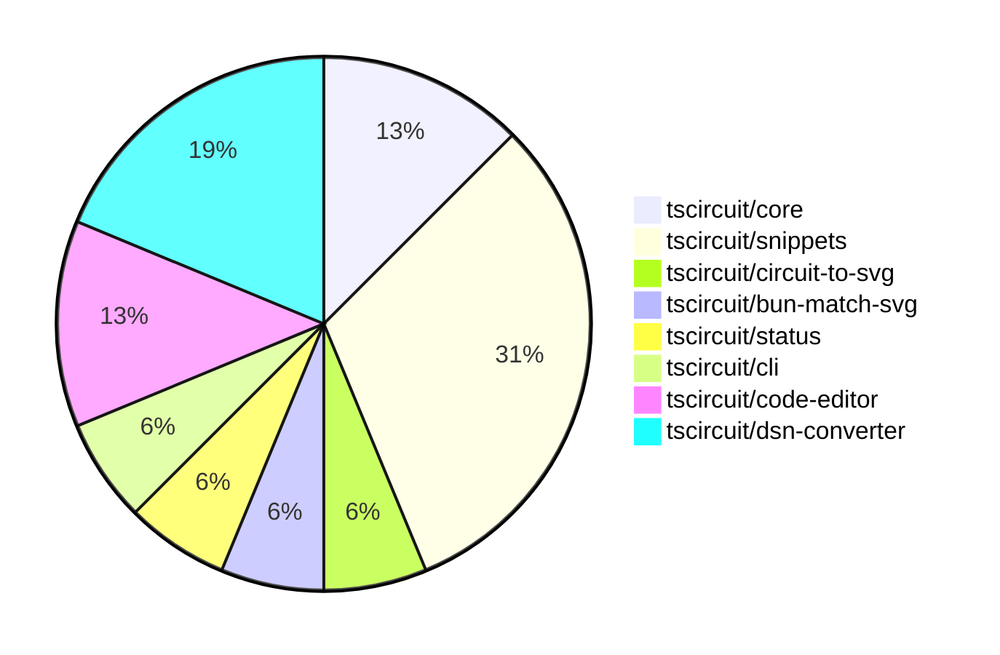

# contribution-tracker

Generates weekly contribution overviews for tscircuit contributors. Check out all
the [contribution overviews here](./contribution-overviews/)

* All PRs in the tscircuit org are scanned/summarized via Claude Haiku
* Claude classifies each Diff/PR as a Major, Minor or Tiny contribution
* All the PRs, summaries, and classifications are organized into charts and tables

The current week is shown below. There are 3 major sections:

* [Contributor Overview](#contributor-overview)
* [PRs by Repository](#prs-by-repository)
* [PRs by Contributor](#changes-by-contributor)

## Current Week

<!-- START_CURRENT_WEEK -->

# Contribution Overview 2025-01-15

## PRs by Repository

## Contributor Overview

| Contributor | 🐳 Major | 🐙 Minor | 🐌 Tiny | ⭐ | Issues Created |
|-------------|---------|---------|---------|-----|----------------|
| [seveibar](#seveibar) | 1 | 1 | 0 | ⭐⭐⭐ | 24 |
| [imrishabh18](#imrishabh18) | 2 | 4 | 0 | ⭐⭐ | 0 |
| [techmannih](#techmannih) | 0 | 4 | 0 | ⭐ | 0 |
| [kom-senapati](#kom-senapati) | 0 | 3 | 0 | ⭐ | 1 |
| [Anshgrover23](#Anshgrover23) | 0 | 1 | 0 | ⭐ | 0 |

## Review Table

[reviews-received-hover]: ## "Number of reviews received for PRs for this contributor"
[approvals-received-hover]: ## "Number of approvals received for PRs this contributor authored"
[rejections-received-hover]: ## "Number of rejections received for PRs this contributor authored"
[prs-opened-hover]: ## "Number of PRs opened by this contributor"
[issues-created-hover]: ## "Number of issues created by this contributor"
[bountied-issues-hover]: ## "Number of issues this contributor created with a bounty"
[bountied-issue-$-hover]: ## "Total bounty amount placed on issues authored by this contributor"

| Contributor | Reviews Received | Approvals Received | Rejections Received | Approvals | Rejections | PRs Opened | PRs Merged | Issues Created | Bountied Issues | Bountied Issue $ |
|---|---|---|---|---|---|---|---|---|---|---|
| [ShiboSoftwareDev](#ShiboSoftwareDev) | 4 | 0 | 0 | 1 | 1 | 1 | 0 | 2 | 2 | 20 |
| [seveibar](#seveibar) | 0 | 0 | 0 | 9 | 6 | 4 | 2 | 24 | 17 | 268 |
| [techmannih](#techmannih) | 20 | 6 | 8 | 0 | 0 | 5 | 4 | 0 | 0 | 0 |
| [Ayushjhawar8](#Ayushjhawar8) | 3 | 0 | 2 | 0 | 0 | 1 | 0 | 0 | 0 | 0 |
| [imrishabh18](#imrishabh18) | 0 | 0 | 0 | 1 | 5 | 6 | 6 | 0 | 0 | 0 |
| [Anshgrover23](#Anshgrover23) | 2 | 1 | 0 | 0 | 3 | 3 | 1 | 0 | 0 | 0 |
| [kom-senapati](#kom-senapati) | 5 | 3 | 1 | 0 | 0 | 3 | 3 | 1 | 0 | 0 |
| [Saurabhsing21](#Saurabhsing21) | 6 | 1 | 3 | 0 | 0 | 1 | 0 | 0 | 0 | 0 |
| [Abse2001](#Abse2001) | 0 | 0 | 0 | 0 | 1 | 0 | 0 | 2 | 2 | 10 |
| [yashksaini-coder](#yashksaini-coder) | 8 | 0 | 2 | 0 | 0 | 1 | 0 | 0 | 0 | 0 |

## Changes by Repository

### [tscircuit/core](https://github.com/tscircuit/core)

| PR # | Impact | Contributor | Description |
|------|--------|-------------|-------------|
| [#523](https://github.com/tscircuit/core/pull/523) | 🐳 Major | seveibar | Fixes an issue with the `createSchematicTraceCrossingSegments` function to handle non-orthogonal edges and prevent an infinite loop. |
| [#527](https://github.com/tscircuit/core/pull/527) | 🐙 Minor | techmannih | Automatically add net labels when a chip-to-chip trace is detected |

### [tscircuit/snippets](https://github.com/tscircuit/snippets)

| PR # | Impact | Contributor | Description |
|------|--------|-------------|-------------|
| [#578](https://github.com/tscircuit/snippets/pull/578) | 🐙 Minor | seveibar | Set up a GitHub Actions workflow to publish a fake snippets API to npm. |
| [#552](https://github.com/tscircuit/snippets/pull/552) | 🐙 Minor | techmannih | Adds a check to ensure that a user cannot fork a snippet that they have already forked, and provides a better error message in that case. |
| [#574](https://github.com/tscircuit/snippets/pull/574) | 🐙 Minor | techmannih | Improve the error message displayed when trying to download a 3D model without the 3D viewer being open. |
| [#571](https://github.com/tscircuit/snippets/pull/571) | 🐙 Minor | imrishabh18 | Reverts the update to the `@tscircuit/3d-viewer` dependency to the previous version `0.0.94`. |
| [#575](https://github.com/tscircuit/snippets/pull/575) | 🐙 Minor | Anshgrover23 | Fix the gltf downloader to support both .gltf and .glb file extensions. |

### [tscircuit/circuit-to-svg](https://github.com/tscircuit/circuit-to-svg)

| PR # | Impact | Contributor | Description |
|------|--------|-------------|-------------|
| [#161](https://github.com/tscircuit/circuit-to-svg/pull/161) | 🐙 Minor | techmannih | Fixes the issue of making the label points transparent in the schematic. |

### [tscircuit/bun-match-svg](https://github.com/tscircuit/bun-match-svg)

| PR # | Impact | Contributor | Description |
|------|--------|-------------|-------------|
| [#7](https://github.com/tscircuit/bun-match-svg/pull/7) | 🐙 Minor | kom-senapati | Fix an issue in the `init` command by removing unnecessary imports and arguments. |

### [tscircuit/status](https://github.com/tscircuit/status)

| PR # | Impact | Contributor | Description |
|------|--------|-------------|-------------|
| [#10](https://github.com/tscircuit/status/pull/10) | 🐙 Minor | kom-senapati | Adds a status check for the "registry and bundling" endpoints, ensuring the health of the `esm.tscircuit.com`, `cjs.tscircuit.com`, and `npm.tscircuit.com` services. |

### [tscircuit/cli](https://github.com/tscircuit/cli)

| PR # | Impact | Contributor | Description |
|------|--------|-------------|-------------|
| [#22](https://github.com/tscircuit/cli/pull/22) | 🐙 Minor | kom-senapati | Adds a simple test fixture for CLI and TSCI init test |

### [tscircuit/code-editor](https://github.com/tscircuit/code-editor)

| PR # | Impact | Contributor | Description |
|------|--------|-------------|-------------|
| [#6](https://github.com/tscircuit/code-editor/pull/6) | 🐳 Major | imrishabh18 | Introduces a basic code editor with Cosmos and Vite integration, and adds Twind (Tailwind CSS-in-JS) for styling. |
| [#4](https://github.com/tscircuit/code-editor/pull/4) | 🐳 Major | imrishabh18 | Adds basic setup for the project, including GitHub workflow files, a Biome configuration, and a Vite-based project structure. |

### [tscircuit/dsn-converter](https://github.com/tscircuit/dsn-converter)

| PR # | Impact | Contributor | Description |
|------|--------|-------------|-------------|
| [#80](https://github.com/tscircuit/dsn-converter/pull/80) | 🐙 Minor | imrishabh18 | Fixes the naming of plated holes by including the source component ID in the refdes. |
| [#79](https://github.com/tscircuit/dsn-converter/pull/79) | 🐙 Minor | imrishabh18 | Fix trace linkage issue in the DSN-PCB conversion process. |
| [#78](https://github.com/tscircuit/dsn-converter/pull/78) | 🐙 Minor | imrishabh18 | Fixes an issue where subcircuits with the same component name (e.g., R1, C1) were not properly handled, leading to incorrect net connections. |

## Changes by Contributor

### [seveibar](https://github.com/seveibar)

| PR # | Impact | Description |
|------|--------|-------------|
| [#523](https://github.com/tscircuit/core/pull/523) | 🐳 Major | Fixes an issue with the `createSchematicTraceCrossingSegments` function to handle non-orthogonal edges and prevent an infinite loop. |
| [#578](https://github.com/tscircuit/snippets/pull/578) | 🐙 Minor | Set up a GitHub Actions workflow to publish a fake snippets API to npm. |

### [techmannih](https://github.com/techmannih)

| PR # | Impact | Description |
|------|--------|-------------|
| [#527](https://github.com/tscircuit/core/pull/527) | 🐙 Minor | Automatically add net labels when a chip-to-chip trace is detected |
| [#161](https://github.com/tscircuit/circuit-to-svg/pull/161) | 🐙 Minor | Fixes the issue of making the label points transparent in the schematic. |
| [#552](https://github.com/tscircuit/snippets/pull/552) | 🐙 Minor | Adds a check to ensure that a user cannot fork a snippet that they have already forked, and provides a better error message in that case. |
| [#574](https://github.com/tscircuit/snippets/pull/574) | 🐙 Minor | Improve the error message displayed when trying to download a 3D model without the 3D viewer being open. |

### [kom-senapati](https://github.com/kom-senapati)

| PR # | Impact | Description |
|------|--------|-------------|
| [#7](https://github.com/tscircuit/bun-match-svg/pull/7) | 🐙 Minor | Fix an issue in the `init` command by removing unnecessary imports and arguments. |
| [#10](https://github.com/tscircuit/status/pull/10) | 🐙 Minor | Adds a status check for the "registry and bundling" endpoints, ensuring the health of the `esm.tscircuit.com`, `cjs.tscircuit.com`, and `npm.tscircuit.com` services. |
| [#22](https://github.com/tscircuit/cli/pull/22) | 🐙 Minor | Adds a simple test fixture for CLI and TSCI init test |

### [imrishabh18](https://github.com/imrishabh18)

| PR # | Impact | Description |
|------|--------|-------------|
| [#6](https://github.com/tscircuit/code-editor/pull/6) | 🐳 Major | Introduces a basic code editor with Cosmos and Vite integration, and adds Twind (Tailwind CSS-in-JS) for styling. |
| [#4](https://github.com/tscircuit/code-editor/pull/4) | 🐳 Major | Adds basic setup for the project, including GitHub workflow files, a Biome configuration, and a Vite-based project structure. |
| [#80](https://github.com/tscircuit/dsn-converter/pull/80) | 🐙 Minor | Fixes the naming of plated holes by including the source component ID in the refdes. |
| [#79](https://github.com/tscircuit/dsn-converter/pull/79) | 🐙 Minor | Fix trace linkage issue in the DSN-PCB conversion process. |
| [#78](https://github.com/tscircuit/dsn-converter/pull/78) | 🐙 Minor | Fixes an issue where subcircuits with the same component name (e.g., R1, C1) were not properly handled, leading to incorrect net connections. |
| [#571](https://github.com/tscircuit/snippets/pull/571) | 🐙 Minor | Reverts the update to the `@tscircuit/3d-viewer` dependency to the previous version `0.0.94`. |

### [Anshgrover23](https://github.com/Anshgrover23)

| PR # | Impact | Description |
|------|--------|-------------|
| [#575](https://github.com/tscircuit/snippets/pull/575) | 🐙 Minor | Fix the gltf downloader to support both .gltf and .glb file extensions. |

<!-- END_CURRENT_WEEK -->
