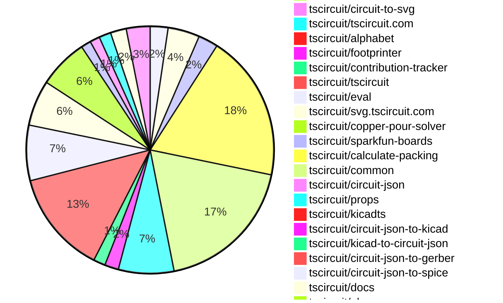
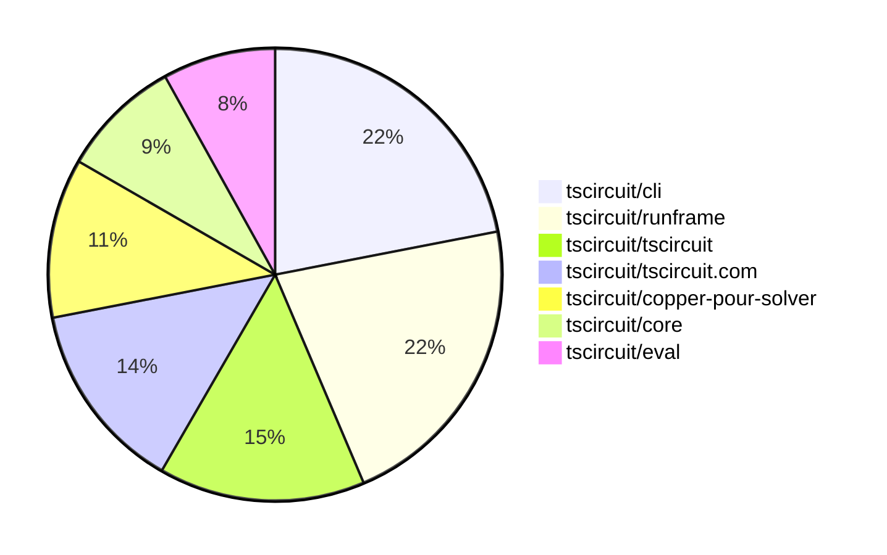

# contribution-tracker

[contributions.tscircuit.com](https://contributions.tscircuit.com) ・ [tscircuit.com](https://tscircuit.com) ・ [Contribution Overviews](./contribution-overviews/) ・ [Changelogs](./changelogs/)

Generates weekly contribution overviews for tscircuit contributors. Check out all
the [contribution overviews here](./contribution-overviews/)
You can find AI-generated monthly changelogs in the [changelogs directory](./changelogs/).

- All PRs in the tscircuit org are scanned/summarized via an LLM
- The LLM classifies each Diff/PR as into a set of attributes for scoring
- All the PRs, summaries, and classifications are organized into charts and tables for [the website](https://contributions.tscircuit.com)

> Want to run locally? See the [Development Section](#development)

The current week is shown below. There are 4 major sections:

- [Contributor Overview](#contributor-overview)
- [PRs by Repository](#prs-by-repository)
- [PRs by Contributor](#changes-by-contributor)
- [Scoring & Sponsorship System](#scoring--sponsorship-system)

## Current Week

<!-- START_CURRENT_WEEK -->

# Contribution Overview 2025-11-05

The current week is shown below. There are 4 major sections:

- [Contributor Overview](#contributor-overview)
- [PRs by Repository](#prs-by-repository)
- [PRs by Contributor](#changes-by-contributor)
- [Scoring & Sponsorship System](#scoring--sponsorship-system)

## PRs by Repository



## Contributor Overview

| Contributor | 🐳 Major | 🐙 Minor | 🐌 Tiny | ⭐ | Score | Discussion Contributions |
|-------------|---------|---------|---------|-----|----------------|--------------------------|
| [ShiboSoftwareDev](#ShiboSoftwareDev) | 5 | 10 | 16 | 👑 | 72 | 0🔹 0🔶 0💎 |
| [imrishabh18](#imrishabh18) | 6 | 13 | 6 | 👑 | 60 | 0🔹 0🔶 0💎 |
| [seveibar](#seveibar) | 3 | 8 | 14 | 👑 | 55 | 0🔹 0🔶 0💎 |
| [techmannih](#techmannih) | 3 | 4 | 3 | ⭐⭐⭐ | 39 | 0🔹 0🔶 0💎 |
| [Abse2001](#Abse2001) | 8 | 1 | 2 | ⭐⭐⭐ | 35.5 | 0🔹 0🔶 0💎 |
| [ArnavK-09](#ArnavK-09) | 5 | 3 | 6 | ⭐⭐⭐ | 34 | 0🔹 0🔶 0💎 |
| [rushabhcodes](#rushabhcodes) | 1 | 6 | 8 | ⭐⭐ | 26 | 0🔹 0🔶 0💎 |
| [RaghavArora14](#RaghavArora14) | 2 | 2 | 3 | ⭐⭐ | 16 | 0🔹 0🔶 0💎 |
| [tscircuitbot](#tscircuitbot) | 0 | 0 | 244 | ⭐⭐ | 15 | 0🔹 0🔶 0💎 |
| [Ayushjhawar8](#Ayushjhawar8) | 1 | 3 | 5 | ⭐⭐ | 15 | 0🔹 0🔶 0💎 |
| [Asymtode712](#Asymtode712) | 1 | 2 | 5 | ⭐⭐ | 13 | 0🔹 0🔶 0💎 |
| [nailoo](#nailoo) | 0 | 1 | 6 | ⭐⭐ | 13 | 0🔹 0🔶 0💎 |
| [0hmX](#0hmX) | 1 | 0 | 1 | ⭐ | 6 | 0🔹 0🔶 0💎 |
| [Enity300](#Enity300) | 0 | 1 | 2 | ⭐ | 4 | 0🔹 0🔶 0💎 |
| [pxlpal](#pxlpal) | 0 | 1 | 2 | ⭐ | 4 | 0🔹 0🔶 0💎 |
| [anshubatra2563-ux](#anshubatra2563-ux) | 0 | 0 | 1 |  | 1 | 0🔹 0🔶 0💎 |

> Note: AI evaluates PRs and assigns 1-3 star ratings automatically. 4 and 5 star ratings require manual staff review.

### Discussion Contribution Legend

- 🔹 Normal Comments: Basic participation with minimal effort
- 🔶 Great Informative Comments: Thoughtful participation that adds value
- 💎 Incredible Comments: Exceptional participation with high-quality content

## Review Table

[reviews-received-hover]: ## "Number of reviews received for PRs for this contributor"
[approvals-received-hover]: ## "Number of approvals received for PRs this contributor authored"
[rejections-received-hover]: ## "Number of rejections received for PRs this contributor authored"
[prs-opened-hover]: ## "Number of PRs opened by this contributor"
[issues-created-hover]: ## "Number of issues created by this contributor"
[bountied-issues-hover]: ## "Number of issues this contributor created with a bounty"
[bountied-issue-$-hover]: ## "Total bounty amount placed on issues authored by this contributor"

| Contributor | Reviews Received | Approvals Received | Rejections Received | Approvals | Rejections | PRs Opened | PRs Merged | Score | Issues Created | Bountied Issues | Bountied Issue $ |
|---|---|---|---|---|---|---|---|---|---|---|---|
| [Asymtode712](#Asymtode712) | 13 | 8 | 0 | 0 | 0 | 8 | 8 | 13 | 0 | 0 | 0 |
| [seveibar](#seveibar) | 11 | 0 | 0 | 79 | 2 | 40 | 25 | 55 | 0 | 0 | 0 |
| [RaghavArora14](#RaghavArora14) | 33 | 16 | 4 | 0 | 0 | 13 | 7 | 16 | 0 | 0 | 0 |
| [tscircuitbot](#tscircuitbot) | 3 | 0 | 0 | 0 | 0 | 274 | 244 | 15 | 0 | 0 | 0 |
| [Abse2001](#Abse2001) | 12 | 9 | 0 | 0 | 0 | 12 | 11 | 35.5 | 0 | 0 | 0 |
| [techmannih](#techmannih) | 14 | 10 | 0 | 11 | 2 | 11 | 10 | 39 | 0 | 0 | 0 |
| [Quanta-Naut](#Quanta-Naut) | 2 | 0 | 1 | 0 | 0 | 1 | 0 | 0 | 0 | 0 | 0 |
| [imrishabh18](#imrishabh18) | 17 | 4 | 0 | 5 | 3 | 34 | 26 | 60 | 0 | 0 | 0 |
| [ShiboSoftwareDev](#ShiboSoftwareDev) | 28 | 22 | 0 | 17 | 0 | 35 | 31 | 72 | 0 | 0 | 0 |
| [Enity300](#Enity300) | 6 | 4 | 0 | 0 | 0 | 3 | 3 | 4 | 0 | 0 | 0 |
| [rushabhcodes](#rushabhcodes) | 40 | 20 | 2 | 2 | 2 | 25 | 15 | 26 | 0 | 0 | 0 |
| [nailoo](#nailoo) | 15 | 9 | 0 | 2 | 0 | 10 | 7 | 13 | 0 | 0 | 0 |
| [Ayushjhawar8](#Ayushjhawar8) | 11 | 6 | 0 | 0 | 0 | 10 | 9 | 15 | 0 | 0 | 0 |
| [ArnavK-09](#ArnavK-09) | 13 | 5 | 1 | 2 | 0 | 16 | 14 | 34 | 0 | 0 | 0 |
| [nishantkluhera](#nishantkluhera) | 14 | 0 | 0 | 0 | 0 | 1 | 0 | 0 | 0 | 0 | 0 |
| [Exceluyi](#Exceluyi) | 7 | 0 | 2 | 0 | 0 | 2 | 0 | 0 | 0 | 0 | 0 |
| [0hmX](#0hmX) | 2 | 2 | 0 | 0 | 1 | 3 | 2 | 6 | 0 | 0 | 0 |
| [anshubatra2563-ux](#anshubatra2563-ux) | 2 | 2 | 0 | 0 | 0 | 1 | 1 | 1 | 0 | 0 | 0 |
| [pxlpal](#pxlpal) | 1 | 1 | 0 | 0 | 0 | 4 | 3 | 4 | 0 | 0 | 0 |

## Top 7 Repositories by Contribution Points



## Scoring & Sponsorship System

### Overview

PRs are analyzed by AI and assigned a **star rating (1-3 stars)**. 4 and 5 star ratings can only be manually assigned by staff. Weekly scores use `2^(starRating - 1)` per PR (capped at 12 PRs per rating), plus review/discussion points.

### Weekly Score → Star String

| Score Range | Star String | Count Value |
|------------|-------------|-------------|
| 0-3 | (empty) | 0 stars |
| 4-10 | ⭐ | 1 star |
| 11-30 | ⭐⭐ | 2 stars |
| 31-50 | ⭐⭐⭐ | 3 stars |
| 51-75 | 👑 | 1 crown |
| 76-100 | 👑👑 | 2 crowns |
| 101+ | 👑👑👑 | 3 crowns |

> Crowns count as 3 stars for sponsorship.

### Monthly Sponsorship Calculation

The sponsorship system calculates monthly payments based on your **weekly star counts** over the complete weeks in that month (typically 4-5 weeks, Wednesday-Tuesday format).

**Step 1: Collect Weekly Stars**
- All complete weeks in the month are analyzed
- Each week's star string is converted to a numeric count (⭐ = 1 star, ⭐⭐⭐ = 3 stars)
- Example: `[2, 2, 2, 1, 0]` means 2 stars in week 1, 2 stars in week 2, etc.

**Step 2: Calculate Metrics**
- **Median stars**: The median value of all weekly star counts
- **Min stars**: The minimum weekly star count
- **Max stars**: The maximum weekly star count
- **High score**: The maximum raw weekly score (0-100+ range from the scoring table) from any week in the month

**Step 3: Determine Base Amount**
The sponsorship amount is calculated based on these metrics (checked in order):

| Condition | Base Amount |
|-----------|-------------|
| `minStarCount >= 3` | **$500** |
| `medianStars >= 3` | **$450** |
| `medianStars >= 2.5` | **$300** |
| `medianStars >= 2` | **$200** |
| `medianStars >= 1.5` | **$100** |
| `medianStars >= 1` | **$75** |
| `maxStarCount >= 2` | **$25** |
| `maxStarCount >= 1` | **$15** |
| `highScore >= 3` (and all stars = 0) | **$5** |

| Maintainer Level | Monthly Bonus |
|------------------|---------------|
| Level 1 | **$200** |
| Level 2 | **$350** |
| Level 3 | **$500** |

**Final Amount** = Base Amount + Maintainer Bonus

## Changes by Repository

### [tscircuit/3d-viewer](https://github.com/tscircuit/3d-viewer)

| PR # | Impact | Rating | Contributor | Description |
|------|--------|--------|-------------|-------------|
| [#562](https://github.com/tscircuit/3d-viewer/pull/562) | 🐳 Major | ⭐⭐⭐ | Asymtode712 | Adds touch screen support in the context menu for better usability on touch devices by implementing onTouchStart handlers and updating click-away detection for Radix UI Portal elements. |
| [#557](https://github.com/tscircuit/3d-viewer/pull/557) | 🐳 Major | ⭐⭐⭐ | Abse2001 | Adds session-based camera saving and restoring to the CadViewer, storing camera state in sessionStorage to prevent default-camera flash on refresh. |
| [#552](https://github.com/tscircuit/3d-viewer/pull/552) | 🐳 Major | ⭐⭐⭐ | Abse2001 | Fixes the issue where selecting a camera preset always switched the camera to Custom and improves the default camera positioning in JSCAD and Manifold viewers by adding animation and cooldown logic to prevent user interactions from overriding presets. |
| [#555](https://github.com/tscircuit/3d-viewer/pull/555) | 🐳 Major | ⭐⭐⭐ | techmannih | Adds support for rendering silkscreen circles on PCBs, allowing for more detailed and customizable designs. |
| [#564](https://github.com/tscircuit/3d-viewer/pull/564) | 🐳 Major | ⭐⭐⭐ | rushabhcodes | Adds support for synthetic PCB boards in the CAD viewer, ensuring consistent visualization for circuits with PCB elements but no explicit board. |
| [#551](https://github.com/tscircuit/3d-viewer/pull/551) | 🐙 Minor | ⭐⭐ | Ayushjhawar8 | Fixes the default camera angle when loading boards in the viewer, correcting the initial camera position from 5, 5, 5 to 5, -5, 5. |

<details>
<summary>🐌 Tiny Contributions (3)</summary>

| PR # | Impact | Contributor | Description |
|------|--------|-------------|-------------|
| [#553](https://github.com/tscircuit/3d-viewer/pull/553) | 🐌 Tiny | Asymtode712 | Integrates release-tracker into 3d-viewer workflows to send notifications on feature merges and version updates. |
| [#554](https://github.com/tscircuit/3d-viewer/pull/554) | 🐌 Tiny | techmannih | Fixes rendering issues by ensuring non-null width and height values are used in PCB board rendering calculations. |
| [#559](https://github.com/tscircuit/3d-viewer/pull/559) | 🐌 Tiny | nailoo | Updates the jscad-electronics dependency to version 0.0.88 in package.json |

</details>

### [tscircuit/core](https://github.com/tscircuit/core)

| PR # | Impact | Rating | Contributor | Description |
|------|--------|--------|-------------|-------------|
| [#1620](https://github.com/tscircuit/core/pull/1620) | 🐙 Minor | ⭐⭐ | Asymtode712 | Adds visual verification for the pcbStyle.silkscreenFontSize override by including a silkscreen text element and dimension annotation to ensure correct font size rendering in tests. |
| [#1617](https://github.com/tscircuit/core/pull/1617) | 🐙 Minor | ⭐⭐ | Asymtode712 | Implements pcbStyle inheritance for kicad: footprints by passing the resolved pcbStyle to footprintLibraryMap functions, enabling override of silkscreen font size and other style properties. |
| [#1635](https://github.com/tscircuit/core/pull/1635) | 🐙 Minor | ⭐⭐ | techmannih | Adds support for rectangular PCB holes in the circuit design, allowing for more versatile hole shapes in PCB layouts. |
| [#1622](https://github.com/tscircuit/core/pull/1622) | 🐙 Minor | ⭐⭐ | techmannih | Fixes rendering issues in PCB board by ensuring non-null width and height values are asserted before calculations. |
| [#1643](https://github.com/tscircuit/core/pull/1643) | 🐙 Minor | ⭐⭐ | imrishabh18 | Adds an optional check for the global object to prevent errors when accessing debug graphics, improving log rendering in RunFrame. |
| [#1642](https://github.com/tscircuit/core/pull/1642) | 🐙 Minor | ⭐⭐ | imrishabh18 | Fixes broken rendering logs in RunFrame by adding a check before accessing global debug graphics. |
| [#1636](https://github.com/tscircuit/core/pull/1636) | 🐙 Minor | ⭐⭐ | ShiboSoftwareDev | Fixes copper pour rendering issues for polygon boards by updating the copper pour solver and adding tests for polygon board scenarios. |
| [#1632](https://github.com/tscircuit/core/pull/1632) | 🐙 Minor | ⭐⭐ | ShiboSoftwareDev | Adds a new error element, simulation_unknown_experiment_error, to report failures in SPICE simulations, enhancing error handling in circuit JSON. |
| [#1630](https://github.com/tscircuit/core/pull/1630) | 🐙 Minor | ⭐⭐ | ShiboSoftwareDev | Adds support for cutout margins in copper pours and includes a test to verify functionality. |
| [#1625](https://github.com/tscircuit/core/pull/1625) | 🐙 Minor | ⭐⭐ | ShiboSoftwareDev | Adds boardEdgeMargin and clearance properties to the CopperPour component for improved spacing control. |
| [#1621](https://github.com/tscircuit/core/pull/1621) | 🐙 Minor | ⭐⭐ | ShiboSoftwareDev | Replaces internal copper pour generation logic with the tscircuitcopper-pour-solver package, delegating complex geometry calculations to a dedicated package. |
| [#1640](https://github.com/tscircuit/core/pull/1640) | 🐙 Minor | ⭐⭐ | seveibar | Computes the root schematicDisabled flag from the main board props when no manual override is set and removes the board component logic that mutates the root schematicDisabled value each render. |
| [#1637](https://github.com/tscircuit/core/pull/1637) | 🐙 Minor | ⭐⭐ | seveibar | Add a PCB snapshot test that renders a ground copper pour around a centered via and fixes the via connectTo issue. |
| [#1634](https://github.com/tscircuit/core/pull/1634) | 🐙 Minor | ⭐⭐ | seveibar | Ensures copper pours propagate the coveredWithSolderMask flag into circuit JSON output and adds a regression test for this functionality. |
| [#1627](https://github.com/tscircuit/core/pull/1627) | 🐙 Minor | ⭐⭐ | seveibar | Ensures CopperPour creates missing nets from its connectsTo property during the CreateNetsFromProps phase |

<details>
<summary>🐌 Tiny Contributions (1)</summary>

| PR # | Impact | Contributor | Description |
|------|--------|-------------|-------------|
| [#1623](https://github.com/tscircuit/core/pull/1623) | 🐌 Tiny | 0hmX | Updates the schematic-trace-solver dependency to version 0.0.45, addressing issue 87. |

</details>

### [tscircuit/schematic-viewer](https://github.com/tscircuit/schematic-viewer)


<details>
<summary>🐌 Tiny Contributions (1)</summary>

| PR # | Impact | Contributor | Description |
|------|--------|-------------|-------------|
| [#145](https://github.com/tscircuit/schematic-viewer/pull/145) | 🐌 Tiny | Asymtode712 | Integrates release-tracker into schematic-viewer workflows by adding workflows to notify on feature merges and version updates. |

</details>

### [tscircuit/pcb-viewer](https://github.com/tscircuit/pcb-viewer)

| PR # | Impact | Rating | Contributor | Description |
|------|--------|--------|-------------|-------------|
| [#470](https://github.com/tscircuit/pcb-viewer/pull/470) | 🐙 Minor | ⭐⭐ | RaghavArora14 | Fixes overlapping dimension text by calculating a perpendicular offset for dimension text, ensuring it appears correctly abovebelow or leftright of dimension lines. |
| [#468](https://github.com/tscircuit/pcb-viewer/pull/468) | 🐙 Minor | ⭐⭐ | Abse2001 | Adds a matching rectangular primitive on the bottom copper layer for all plated hole rectangular pad types while preserving the top-layer pad logic. |
| [#460](https://github.com/tscircuit/pcb-viewer/pull/460) | 🐙 Minor | ⭐⭐ | techmannih | Adds support for corner radius in rectangle components, allowing for rounded corners in PCB designs. |

<details>
<summary>🐌 Tiny Contributions (7)</summary>

| PR # | Impact | Contributor | Description |
|------|--------|-------------|-------------|
| [#465](https://github.com/tscircuit/pcb-viewer/pull/465) | 🐌 Tiny | Asymtode712 | Integrates release-tracker into pcb-viewer workflows by adding notifications for feature merges and version updates. |
| [#471](https://github.com/tscircuit/pcb-viewer/pull/471) | 🐌 Tiny | tscircuitbot | Automated package update |
| [#469](https://github.com/tscircuit/pcb-viewer/pull/469) | 🐌 Tiny | tscircuitbot | Automated package update |
| [#466](https://github.com/tscircuit/pcb-viewer/pull/466) | 🐌 Tiny | tscircuitbot | Automated package update |
| [#464](https://github.com/tscircuit/pcb-viewer/pull/464) | 🐌 Tiny | tscircuitbot | Automated package update |
| [#463](https://github.com/tscircuit/pcb-viewer/pull/463) | 🐌 Tiny | tscircuitbot | Automated package update |
| [#461](https://github.com/tscircuit/pcb-viewer/pull/461) | 🐌 Tiny | techmannih | Fixes handling of optional width and height properties for the pcb_board element in the rendering process. |

</details>

### [tscircuit/runframe](https://github.com/tscircuit/runframe)

| PR # | Impact | Rating | Contributor | Description |
|------|--------|--------|-------------|-------------|
| [#1673](https://github.com/tscircuit/runframe/pull/1673) | 🐳 Major | ⭐⭐⭐ | Ayushjhawar8 | Fixes the natural sorting of filenames in the file selector component to ensure correct order based on numeric values. |
| [#1712](https://github.com/tscircuit/runframe/pull/1712) | 🐙 Minor | ⭐⭐ | ArnavK-09 | Fixes the package URL generation in the error reporting functionality to ensure it correctly calls the packageUrl function instead of referencing it directly. |

<details>
<summary>🐌 Tiny Contributions (72)</summary>

| PR # | Impact | Contributor | Description |
|------|--------|-------------|-------------|
| [#1700](https://github.com/tscircuit/runframe/pull/1700) | 🐌 Tiny | Asymtode712 | Integrates release-tracker into runframe workflows by adding notifications for feature merges and version updates. |
| [#1752](https://github.com/tscircuit/runframe/pull/1752) | 🐌 Tiny | tscircuitbot | Automated package update |
| [#1751](https://github.com/tscircuit/runframe/pull/1751) | 🐌 Tiny | tscircuitbot | Updates the tscircuit3d-viewer package to version 0.0.434 in package.json |
| [#1750](https://github.com/tscircuit/runframe/pull/1750) | 🐌 Tiny | tscircuitbot | Automated package update to version 0.0.1241 |
| [#1749](https://github.com/tscircuit/runframe/pull/1749) | 🐌 Tiny | tscircuitbot | Updates the tscircuiteval package to version 0.0.465 in the package.json file. |
| [#1748](https://github.com/tscircuit/runframe/pull/1748) | 🐌 Tiny | tscircuitbot | Automated package update to version 0.0.1240 |
| [#1747](https://github.com/tscircuit/runframe/pull/1747) | 🐌 Tiny | tscircuitbot | Updates the tscircuiteval package to version 0.0.464 in the package.json file. |
| [#1746](https://github.com/tscircuit/runframe/pull/1746) | 🐌 Tiny | tscircuitbot | Automated package update |
| [#1745](https://github.com/tscircuit/runframe/pull/1745) | 🐌 Tiny | tscircuitbot | Updates the tscircuiteval package to version 0.0.463 |
| [#1744](https://github.com/tscircuit/runframe/pull/1744) | 🐌 Tiny | tscircuitbot | Automated package update to version 0.0.1238 |
| [#1743](https://github.com/tscircuit/runframe/pull/1743) | 🐌 Tiny | tscircuitbot | Updates the tscircuit3d-viewer package to version 0.0.433 in the package.json file. |
| [#1742](https://github.com/tscircuit/runframe/pull/1742) | 🐌 Tiny | tscircuitbot | Automated package update to version 0.0.1237 |
| [#1741](https://github.com/tscircuit/runframe/pull/1741) | 🐌 Tiny | tscircuitbot | Updates the tscircuitpcb-viewer package from version 1.11.255 to 1.11.256 |
| [#1740](https://github.com/tscircuit/runframe/pull/1740) | 🐌 Tiny | tscircuitbot | Automated package update |
| [#1739](https://github.com/tscircuit/runframe/pull/1739) | 🐌 Tiny | tscircuitbot | Updates the tscircuit3d-viewer package to version 0.0.432 in package.json |
| [#1738](https://github.com/tscircuit/runframe/pull/1738) | 🐌 Tiny | tscircuitbot | Automated package update |
| [#1737](https://github.com/tscircuit/runframe/pull/1737) | 🐌 Tiny | tscircuitbot | Automated package update |
| [#1736](https://github.com/tscircuit/runframe/pull/1736) | 🐌 Tiny | tscircuitbot | Updates the tscircuitpcb-viewer package from version 1.11.254 to 1.11.255 |
| [#1735](https://github.com/tscircuit/runframe/pull/1735) | 🐌 Tiny | tscircuitbot | Automated package update |
| [#1734](https://github.com/tscircuit/runframe/pull/1734) | 🐌 Tiny | tscircuitbot | Updates the tscircuiteval package to version 0.0.462 in the package.json file. |
| [#1733](https://github.com/tscircuit/runframe/pull/1733) | 🐌 Tiny | tscircuitbot | Automated package update |
| [#1732](https://github.com/tscircuit/runframe/pull/1732) | 🐌 Tiny | tscircuitbot | Updates the tscircuiteval package to version 0.0.461 |
| [#1731](https://github.com/tscircuit/runframe/pull/1731) | 🐌 Tiny | tscircuitbot | Automated package update to version 0.0.1231 |
| [#1730](https://github.com/tscircuit/runframe/pull/1730) | 🐌 Tiny | tscircuitbot | Updates the tscircuit3d-viewer package to version 0.0.431 in package.json |
| [#1729](https://github.com/tscircuit/runframe/pull/1729) | 🐌 Tiny | tscircuitbot | Automated package update |
| [#1728](https://github.com/tscircuit/runframe/pull/1728) | 🐌 Tiny | tscircuitbot | Automated package update |
| [#1726](https://github.com/tscircuit/runframe/pull/1726) | 🐌 Tiny | tscircuitbot | Automated package update |
| [#1724](https://github.com/tscircuit/runframe/pull/1724) | 🐌 Tiny | tscircuitbot | Automated package update |
| [#1723](https://github.com/tscircuit/runframe/pull/1723) | 🐌 Tiny | tscircuitbot | Updates the tscircuiteval package to version 0.0.458 in the package.json file. |
| [#1722](https://github.com/tscircuit/runframe/pull/1722) | 🐌 Tiny | tscircuitbot | Updates the package version from 0.0.1226 to 0.0.1227 in package.json |
| [#1720](https://github.com/tscircuit/runframe/pull/1720) | 🐌 Tiny | tscircuitbot | Automated package update to version 0.0.1226 |
| [#1718](https://github.com/tscircuit/runframe/pull/1718) | 🐌 Tiny | tscircuitbot | Automated package update |
| [#1717](https://github.com/tscircuit/runframe/pull/1717) | 🐌 Tiny | tscircuitbot | Updates the package version from 0.0.1223 to 0.0.1224 in package.json |
| [#1716](https://github.com/tscircuit/runframe/pull/1716) | 🐌 Tiny | tscircuitbot | Updates the tscircuit3d-viewer package to version 0.0.430 |
| [#1715](https://github.com/tscircuit/runframe/pull/1715) | 🐌 Tiny | tscircuitbot | Automated package update |
| [#1713](https://github.com/tscircuit/runframe/pull/1713) | 🐌 Tiny | tscircuitbot | Updates the package version from 0.0.1221 to 0.0.1222 in package.json |
| [#1711](https://github.com/tscircuit/runframe/pull/1711) | 🐌 Tiny | tscircuitbot | Updates the package version from 0.0.1220 to 0.0.1221 in package.json |
| [#1710](https://github.com/tscircuit/runframe/pull/1710) | 🐌 Tiny | tscircuitbot | Updates the tscircuiteval package from version 0.0.456 to 0.0.457 |
| [#1708](https://github.com/tscircuit/runframe/pull/1708) | 🐌 Tiny | tscircuitbot | Automated package update |
| [#1707](https://github.com/tscircuit/runframe/pull/1707) | 🐌 Tiny | tscircuitbot | Updates the tscircuiteval package to version 0.0.456 in the package.json file. |
| [#1706](https://github.com/tscircuit/runframe/pull/1706) | 🐌 Tiny | tscircuitbot | Updates the tscircuiteval package to version 0.0.455 in the package.json file. |
| [#1705](https://github.com/tscircuit/runframe/pull/1705) | 🐌 Tiny | tscircuitbot | Automated package update |
| [#1703](https://github.com/tscircuit/runframe/pull/1703) | 🐌 Tiny | tscircuitbot | Automated package update |
| [#1702](https://github.com/tscircuit/runframe/pull/1702) | 🐌 Tiny | tscircuitbot | Updates the tscircuitschematic-viewer package from version 2.0.47 to 2.0.48 |
| [#1699](https://github.com/tscircuit/runframe/pull/1699) | 🐌 Tiny | tscircuitbot | Updates the package version from 0.0.1216 to 0.0.1217 in package.json |
| [#1698](https://github.com/tscircuit/runframe/pull/1698) | 🐌 Tiny | tscircuitbot | Updates the tscircuitpcb-viewer package from version 1.11.253 to 1.11.254 |
| [#1697](https://github.com/tscircuit/runframe/pull/1697) | 🐌 Tiny | tscircuitbot | Automated package update |
| [#1696](https://github.com/tscircuit/runframe/pull/1696) | 🐌 Tiny | tscircuitbot | Updates the tscircuit3d-viewer package from version 0.0.428 to 0.0.429 |
| [#1695](https://github.com/tscircuit/runframe/pull/1695) | 🐌 Tiny | tscircuitbot | Updates the package version from 0.0.1214 to 0.0.1215 in package.json |
| [#1694](https://github.com/tscircuit/runframe/pull/1694) | 🐌 Tiny | tscircuitbot | Updates the tscircuiteval package to version 0.0.454 in package.json |
| [#1693](https://github.com/tscircuit/runframe/pull/1693) | 🐌 Tiny | tscircuitbot | Automated package update |
| [#1692](https://github.com/tscircuit/runframe/pull/1692) | 🐌 Tiny | tscircuitbot | Updates the tscircuit3d-viewer package to version 0.0.428 in package.json |
| [#1691](https://github.com/tscircuit/runframe/pull/1691) | 🐌 Tiny | tscircuitbot | Automated package update |
| [#1690](https://github.com/tscircuit/runframe/pull/1690) | 🐌 Tiny | tscircuitbot | Updates the tscircuitpcb-viewer package from version 1.11.252 to 1.11.253 |
| [#1689](https://github.com/tscircuit/runframe/pull/1689) | 🐌 Tiny | tscircuitbot | Automated package update |
| [#1688](https://github.com/tscircuit/runframe/pull/1688) | 🐌 Tiny | tscircuitbot | Updates the tscircuitpcb-viewer package to version 1.11.252 |
| [#1687](https://github.com/tscircuit/runframe/pull/1687) | 🐌 Tiny | tscircuitbot | Automated package update |
| [#1686](https://github.com/tscircuit/runframe/pull/1686) | 🐌 Tiny | tscircuitbot | Updates the tscircuit3d-viewer package to version 0.0.427 in package.json |
| [#1685](https://github.com/tscircuit/runframe/pull/1685) | 🐌 Tiny | tscircuitbot | Updates the package version from 0.0.1209 to 0.0.1210 in package.json |
| [#1684](https://github.com/tscircuit/runframe/pull/1684) | 🐌 Tiny | tscircuitbot | Updates the tscircuiteval package from version 0.0.452 to 0.0.453 |
| [#1683](https://github.com/tscircuit/runframe/pull/1683) | 🐌 Tiny | tscircuitbot | Updates the package version from 0.0.1208 to 0.0.1209 in package.json |
| [#1682](https://github.com/tscircuit/runframe/pull/1682) | 🐌 Tiny | tscircuitbot | Updates the tscircuiteval package to version 0.0.452 in the package.json file. |
| [#1681](https://github.com/tscircuit/runframe/pull/1681) | 🐌 Tiny | tscircuitbot | Automated package update |
| [#1680](https://github.com/tscircuit/runframe/pull/1680) | 🐌 Tiny | tscircuitbot | Automated package update |
| [#1725](https://github.com/tscircuit/runframe/pull/1725) | 🐌 Tiny | seveibar | Adds a prefabricated board example that reproduces a broken solder mask export issue from fabrication files. |
| [#1721](https://github.com/tscircuit/runframe/pull/1721) | 🐌 Tiny | seveibar | Updates the versions of the circuit-json and props dependencies in the package.json file. |
| [#1714](https://github.com/tscircuit/runframe/pull/1714) | 🐌 Tiny | seveibar | Updates the version of the circuit-json-to-gerber dependency in package.json from 0.0.35 to 0.0.37 |
| [#1704](https://github.com/tscircuit/runframe/pull/1704) | 🐌 Tiny | seveibar | Updates the circuit-json-to-gerber dependency to version 0.0.35 to include the copper pour soldermask feature. |
| [#1727](https://github.com/tscircuit/runframe/pull/1727) | 🐌 Tiny | Ayushjhawar8 | https:github.comuser-attachmentsassetse7662441-afd6-45c6-a67e-b6814ceb3907 |
| [#1709](https://github.com/tscircuit/runframe/pull/1709) | 🐌 Tiny | Ayushjhawar8 | Adds top spacing to error messages for improved visual styling in the ErrorTabContent component. |
| [#1672](https://github.com/tscircuit/runframe/pull/1672) | 🐌 Tiny | Ayushjhawar8 | img width1021 height277 altimage srchttps:github.comuser-attachmentsassets4430e588-fc3e-4519-be92-f22a44b67fa2 |
| [#1719](https://github.com/tscircuit/runframe/pull/1719) | 🐌 Tiny | ArnavK-09 | before img width525 height828 altimage srchttps:github.comuser-attachmentsassets8b5ad571-da64-4fd1-8135-80415f3d570f   after img width519 height838 altimage srchttps:github.comuser-attachmentsassetscd547222-ac2e-4812-825d-fa984675759a |

</details>

### [tscircuit/cli](https://github.com/tscircuit/cli)

| PR # | Impact | Rating | Contributor | Description |
|------|--------|--------|-------------|-------------|
| [#841](https://github.com/tscircuit/cli/pull/841) | 🐳 Major | ⭐⭐⭐ | imrishabh18 | Adds support for transpiling TypeScript to ESM, CommonJS, and generating type declarations via the tsci build --transpile command. |
| [#897](https://github.com/tscircuit/cli/pull/897) | 🐙 Minor | ⭐⭐ | imrishabh18 | Adds support for JSON imports in both ESM and CJS formats during the transpilation process. |
| [#894](https://github.com/tscircuit/cli/pull/894) | 🐙 Minor | ⭐⭐ | imrishabh18 | Adds support for transpiling TypeScript files to JavaScript using the tsci build --transpile command, generating ESM, CommonJS, and type declaration files. |
| [#844](https://github.com/tscircuit/cli/pull/844) | 🐙 Minor | ⭐⭐ | imrishabh18 | Allows users to specify file paths using glob patterns when generating schematic and PCB snapshots. |
| [#877](https://github.com/tscircuit/cli/pull/877) | 🐙 Minor | ⭐⭐ | ArnavK-09 | Fixes path handling in the build process to ensure correct resolution of file paths regardless of their format. |

<details>
<summary>🐌 Tiny Contributions (67)</summary>

| PR # | Impact | Contributor | Description |
|------|--------|-------------|-------------|
| [#883](https://github.com/tscircuit/cli/pull/883) | 🐌 Tiny | Asymtode712 | Adds integration with release-tracker to notify version updates and feature merges via GitHub workflows. |
| [#916](https://github.com/tscircuit/cli/pull/916) | 🐌 Tiny | tscircuitbot | Automated package update to version 0.1.479 |
| [#915](https://github.com/tscircuit/cli/pull/915) | 🐌 Tiny | tscircuitbot | Automated package update |
| [#914](https://github.com/tscircuit/cli/pull/914) | 🐌 Tiny | tscircuitbot | Automated package update |
| [#913](https://github.com/tscircuit/cli/pull/913) | 🐌 Tiny | tscircuitbot | Automated package update |
| [#912](https://github.com/tscircuit/cli/pull/912) | 🐌 Tiny | tscircuitbot | Automated package update |
| [#911](https://github.com/tscircuit/cli/pull/911) | 🐌 Tiny | tscircuitbot | Updates the tscircuitrunframe package to version 0.0.1240 in package.json |
| [#908](https://github.com/tscircuit/cli/pull/908) | 🐌 Tiny | tscircuitbot | Automated package update |
| [#907](https://github.com/tscircuit/cli/pull/907) | 🐌 Tiny | tscircuitbot | Automated package update |
| [#906](https://github.com/tscircuit/cli/pull/906) | 🐌 Tiny | tscircuitbot | Automated package update |
| [#905](https://github.com/tscircuit/cli/pull/905) | 🐌 Tiny | tscircuitbot | Updates the tscircuitrunframe package from version 0.0.1236 to 0.0.1237 |
| [#904](https://github.com/tscircuit/cli/pull/904) | 🐌 Tiny | tscircuitbot | Automated package update |
| [#903](https://github.com/tscircuit/cli/pull/903) | 🐌 Tiny | tscircuitbot | Updates the tscircuitrunframe package from version 0.0.1235 to 0.0.1236 |
| [#902](https://github.com/tscircuit/cli/pull/902) | 🐌 Tiny | tscircuitbot | Automated package update |
| [#901](https://github.com/tscircuit/cli/pull/901) | 🐌 Tiny | tscircuitbot | Automated package update |
| [#900](https://github.com/tscircuit/cli/pull/900) | 🐌 Tiny | tscircuitbot | Automated package update |
| [#899](https://github.com/tscircuit/cli/pull/899) | 🐌 Tiny | tscircuitbot | Updates the tscircuitrunframe package from version 0.0.1233 to 0.0.1234 |
| [#898](https://github.com/tscircuit/cli/pull/898) | 🐌 Tiny | tscircuitbot | Automated package update |
| [#896](https://github.com/tscircuit/cli/pull/896) | 🐌 Tiny | tscircuitbot | Automated package update to version 0.1.470 |
| [#893](https://github.com/tscircuit/cli/pull/893) | 🐌 Tiny | tscircuitbot | Automated package update |
| [#892](https://github.com/tscircuit/cli/pull/892) | 🐌 Tiny | tscircuitbot | Updates the tscircuitrunframe package from version 0.0.1232 to 0.0.1233 |
| [#891](https://github.com/tscircuit/cli/pull/891) | 🐌 Tiny | tscircuitbot | Automated package update |
| [#890](https://github.com/tscircuit/cli/pull/890) | 🐌 Tiny | tscircuitbot | Automated package update |
| [#889](https://github.com/tscircuit/cli/pull/889) | 🐌 Tiny | tscircuitbot | Updates the tscircuitrunframe package from version 0.0.1231 to 0.0.1232 |
| [#888](https://github.com/tscircuit/cli/pull/888) | 🐌 Tiny | tscircuitbot | Automated package update to version 0.1.466 |
| [#886](https://github.com/tscircuit/cli/pull/886) | 🐌 Tiny | tscircuitbot | Updates the tscircuitrunframe package from version 0.0.1230 to 0.0.1231 |
| [#887](https://github.com/tscircuit/cli/pull/887) | 🐌 Tiny | tscircuitbot | Automated package update |
| [#885](https://github.com/tscircuit/cli/pull/885) | 🐌 Tiny | tscircuitbot | Automated package update |
| [#884](https://github.com/tscircuit/cli/pull/884) | 🐌 Tiny | tscircuitbot | Updates the tscircuitrunframe package to version 0.0.1230 in package.json |
| [#882](https://github.com/tscircuit/cli/pull/882) | 🐌 Tiny | tscircuitbot | Automated package update |
| [#881](https://github.com/tscircuit/cli/pull/881) | 🐌 Tiny | tscircuitbot | Updates the tscircuitrunframe package from version 0.0.1225 to 0.0.1228 and sets bun version to 1.3.1 in the CI workflow. |
| [#876](https://github.com/tscircuit/cli/pull/876) | 🐌 Tiny | tscircuitbot | Automated package update |
| [#875](https://github.com/tscircuit/cli/pull/875) | 🐌 Tiny | tscircuitbot | Updates the tscircuitrunframe package from version 0.0.1224 to 0.0.1225 |
| [#874](https://github.com/tscircuit/cli/pull/874) | 🐌 Tiny | tscircuitbot | Automated package update |
| [#873](https://github.com/tscircuit/cli/pull/873) | 🐌 Tiny | tscircuitbot | Updates the tscircuitrunframe package from version 0.0.1223 to 0.0.1224 |
| [#871](https://github.com/tscircuit/cli/pull/871) | 🐌 Tiny | tscircuitbot | Updates the tscircuitrunframe package from version 0.0.1222 to 0.0.1223 |
| [#872](https://github.com/tscircuit/cli/pull/872) | 🐌 Tiny | tscircuitbot | Automated package update |
| [#870](https://github.com/tscircuit/cli/pull/870) | 🐌 Tiny | tscircuitbot | Automated package update |
| [#869](https://github.com/tscircuit/cli/pull/869) | 🐌 Tiny | tscircuitbot | Updates the tscircuitrunframe package to version 0.0.1222 in package.json |
| [#866](https://github.com/tscircuit/cli/pull/866) | 🐌 Tiny | tscircuitbot | Automated package update |
| [#863](https://github.com/tscircuit/cli/pull/863) | 🐌 Tiny | tscircuitbot | Automated package update |
| [#862](https://github.com/tscircuit/cli/pull/862) | 🐌 Tiny | tscircuitbot | Updates the tscircuitrunframe package from version 0.0.1218 to 0.0.1219 |
| [#861](https://github.com/tscircuit/cli/pull/861) | 🐌 Tiny | tscircuitbot | Automated package update |
| [#860](https://github.com/tscircuit/cli/pull/860) | 🐌 Tiny | tscircuitbot | Updates the tscircuitrunframe package from version 0.0.1216 to 0.0.1218 |
| [#858](https://github.com/tscircuit/cli/pull/858) | 🐌 Tiny | tscircuitbot | Automated package update |
| [#857](https://github.com/tscircuit/cli/pull/857) | 🐌 Tiny | tscircuitbot | Updates the tscircuitrunframe package to version 0.0.1216 |
| [#856](https://github.com/tscircuit/cli/pull/856) | 🐌 Tiny | tscircuitbot | Automated package update |
| [#855](https://github.com/tscircuit/cli/pull/855) | 🐌 Tiny | tscircuitbot | Updates the tscircuitrunframe package from version 0.0.1214 to 0.0.1215 |
| [#854](https://github.com/tscircuit/cli/pull/854) | 🐌 Tiny | tscircuitbot | Updates the package version from 0.1.452 to 0.1.453 in package.json |
| [#853](https://github.com/tscircuit/cli/pull/853) | 🐌 Tiny | tscircuitbot | Updates the tscircuitrunframe package from version 0.0.1213 to 0.0.1214 |
| [#852](https://github.com/tscircuit/cli/pull/852) | 🐌 Tiny | tscircuitbot | Automated package update |
| [#851](https://github.com/tscircuit/cli/pull/851) | 🐌 Tiny | tscircuitbot | Updates the tscircuitrunframe package from version 0.0.1212 to 0.0.1213 |
| [#850](https://github.com/tscircuit/cli/pull/850) | 🐌 Tiny | tscircuitbot | Automated package update |
| [#849](https://github.com/tscircuit/cli/pull/849) | 🐌 Tiny | tscircuitbot | Updates the tscircuitrunframe package to version 0.0.1212 |
| [#848](https://github.com/tscircuit/cli/pull/848) | 🐌 Tiny | tscircuitbot | Automated package update |
| [#847](https://github.com/tscircuit/cli/pull/847) | 🐌 Tiny | tscircuitbot | Automated package update |
| [#846](https://github.com/tscircuit/cli/pull/846) | 🐌 Tiny | tscircuitbot | Updates the tscircuitrunframe package from version 0.0.1210 to 0.0.1211 |
| [#845](https://github.com/tscircuit/cli/pull/845) | 🐌 Tiny | tscircuitbot | Automated package update |
| [#843](https://github.com/tscircuit/cli/pull/843) | 🐌 Tiny | tscircuitbot | Automated package update |
| [#842](https://github.com/tscircuit/cli/pull/842) | 🐌 Tiny | tscircuitbot | Updates the tscircuitrunframe package from version 0.0.1209 to 0.0.1210 |
| [#840](https://github.com/tscircuit/cli/pull/840) | 🐌 Tiny | tscircuitbot | Automated package update |
| [#839](https://github.com/tscircuit/cli/pull/839) | 🐌 Tiny | tscircuitbot | Updates the tscircuitrunframe package from version 0.0.1208 to 0.0.1209 |
| [#838](https://github.com/tscircuit/cli/pull/838) | 🐌 Tiny | tscircuitbot | Automated package update |
| [#837](https://github.com/tscircuit/cli/pull/837) | 🐌 Tiny | tscircuitbot | Updates the tscircuitrunframe package from version 0.0.1207 to 0.0.1208 |
| [#836](https://github.com/tscircuit/cli/pull/836) | 🐌 Tiny | tscircuitbot | Automated package update |
| [#835](https://github.com/tscircuit/cli/pull/835) | 🐌 Tiny | tscircuitbot | Automated package update for tscircuitrunframe from version 0.0.1206 to 0.0.1207 |
| [#895](https://github.com/tscircuit/cli/pull/895) | 🐌 Tiny | imrishabh18 | Fixes the lock file to ensure proper dependencies are published with npm. |

</details>

### [tscircuit/circuit-to-svg](https://github.com/tscircuit/circuit-to-svg)

| PR # | Impact | Rating | Contributor | Description |
|------|--------|--------|-------------|-------------|
| [#416](https://github.com/tscircuit/circuit-to-svg/pull/416) | 🐳 Major | ⭐⭐⭐ | RaghavArora14 | Adds a debug feature to visualize anchor position offsets for PCB components positioned relative to groups, including dimension lines and markers for clarity. |
| [#419](https://github.com/tscircuit/circuit-to-svg/pull/419) | 🐳 Major | ⭐⭐⭐ | techmannih | Adds support for rectangular and circular PCB holes in SVG generation for circuit boards. |

<details>
<summary>🐌 Tiny Contributions (1)</summary>

| PR # | Impact | Contributor | Description |
|------|--------|-------------|-------------|
| [#418](https://github.com/tscircuit/circuit-to-svg/pull/418) | 🐌 Tiny | RaghavArora14 | Changes the bun version from latest to 1.3.1 to resolve CI test errors related to bun. |

</details>

### [tscircuit/tscircuit.com](https://github.com/tscircuit/tscircuit.com)

| PR # | Impact | Rating | Contributor | Description |
|------|--------|--------|-------------|-------------|
| [#1955](https://github.com/tscircuit/tscircuit.com/pull/1955) | 🐳 Major | ⭐⭐⭐ | RaghavArora14 | Fixes session handling by clearing expired sessions and preventing duplicate unauthorized notifications when a 401 error occurs. |
| [#1970](https://github.com/tscircuit/tscircuit.com/pull/1970) | 🐳 Major | ⭐⭐⭐ | ArnavK-09 | Adds filtering and search functionality for user profile organizations based on various attributes such as name, display name, GitHub handle, and TSCircuit handle. |
| [#1968](https://github.com/tscircuit/tscircuit.com/pull/1968) | 🐳 Major | ⭐⭐⭐ | ArnavK-09 | Adds support for tscircuit_handle in organization creation and update endpoints while removing client-side modification of github_handle. |
| [#1961](https://github.com/tscircuit/tscircuit.com/pull/1961) | 🐳 Major | ⭐⭐⭐ | ArnavK-09 | Adds meta tags for SEO optimization in release-related pages and improves error handling for package routes. |
| [#1964](https://github.com/tscircuit/tscircuit.com/pull/1964) | 🐳 Major | ⭐⭐⭐ | ArnavK-09 | Adds a session check in the import component to ensure users are signed in before importing components, displaying an error message if not signed in. |
| [#1962](https://github.com/tscircuit/tscircuit.com/pull/1962) | 🐳 Major | ⭐⭐⭐ | ArnavK-09 | Adds debug information for user account details in the user settings page, including GitHub username, email, account ID, and created date. |
| [#1980](https://github.com/tscircuit/tscircuit.com/pull/1980) | 🐙 Minor | ⭐⭐ | imrishabh18 | Updates the logic to locate circuit.json in a new folder structure, checking both the new and old locations for the file. |
| [#1969](https://github.com/tscircuit/tscircuit.com/pull/1969) | 🐙 Minor | ⭐⭐ | ArnavK-09 | Only displays the email address of an account when the request is made by an authenticated user, ensuring that unauthenticated users do not have access to sensitive information. |
| [#1977](https://github.com/tscircuit/tscircuit.com/pull/1977) | 🐙 Minor | ⭐⭐ | pxlpal | Sets the default value of github_username to tscircuit_handle when it is undefined due to organization login with Google. |

<details>
<summary>🐌 Tiny Contributions (19)</summary>

| PR # | Impact | Contributor | Description |
|------|--------|-------------|-------------|
| [#1985](https://github.com/tscircuit/tscircuit.com/pull/1985) | 🐌 Tiny | tscircuitbot | Updates the tscircuiteval package from version 0.0.463 to 0.0.465 |
| [#1983](https://github.com/tscircuit/tscircuit.com/pull/1983) | 🐌 Tiny | tscircuitbot | Updates the tscircuiteval package from version 0.0.462 to 0.0.463 |
| [#1976](https://github.com/tscircuit/tscircuit.com/pull/1976) | 🐌 Tiny | tscircuitbot | Automated package update |
| [#1975](https://github.com/tscircuit/tscircuit.com/pull/1975) | 🐌 Tiny | tscircuitbot | Updates the tscircuiteval package from version 0.0.460 to 0.0.461 |
| [#1972](https://github.com/tscircuit/tscircuit.com/pull/1972) | 🐌 Tiny | tscircuitbot | Automated package update to version 0.0.138 |
| [#1971](https://github.com/tscircuit/tscircuit.com/pull/1971) | 🐌 Tiny | tscircuitbot | Updates the tscircuiteval package from version 0.0.458 to 0.0.460 |
| [#1966](https://github.com/tscircuit/tscircuit.com/pull/1966) | 🐌 Tiny | tscircuitbot | Automated package update |
| [#1960](https://github.com/tscircuit/tscircuit.com/pull/1960) | 🐌 Tiny | tscircuitbot | Updates the tscircuiteval package from version 0.0.456 to 0.0.457 |
| [#1959](https://github.com/tscircuit/tscircuit.com/pull/1959) | 🐌 Tiny | tscircuitbot | Updates the tscircuiteval package from version 0.0.454 to 0.0.456 |
| [#1957](https://github.com/tscircuit/tscircuit.com/pull/1957) | 🐌 Tiny | tscircuitbot | Automated package update |
| [#1954](https://github.com/tscircuit/tscircuit.com/pull/1954) | 🐌 Tiny | tscircuitbot | Updates the tscircuiteval package from version 0.0.452 to 0.0.453 in the package.json file. |
| [#1951](https://github.com/tscircuit/tscircuit.com/pull/1951) | 🐌 Tiny | tscircuitbot | Automated package update |
| [#1953](https://github.com/tscircuit/tscircuit.com/pull/1953) | 🐌 Tiny | imrishabh18 | Updates the tscircuitrunframe dependency from version 0.0.1198 to 0.0.1209 in package.json |
| [#1974](https://github.com/tscircuit/tscircuit.com/pull/1974) | 🐌 Tiny | ArnavK-09 | Fixes the rendering of the PCB preview image in the TrendingPackagesCarousel component by ensuring the correct fallback image is displayed when the PCB preview is unavailable. |
| [#1965](https://github.com/tscircuit/tscircuit.com/pull/1965) | 🐌 Tiny | ArnavK-09 | Changes the default view for package display from pcb to 3d in the package information handling. |
| [#1956](https://github.com/tscircuit/tscircuit.com/pull/1956) | 🐌 Tiny | ArnavK-09 | Refactors the CodeEditor component to avoid refetching typings when the font size changes, improving performance and user experience. |
| [#1952](https://github.com/tscircuit/tscircuit.com/pull/1952) | 🐌 Tiny | ArnavK-09 | Fixes the proxy URL used in the import dialog to ensure correct API calls are made. |
| [#1978](https://github.com/tscircuit/tscircuit.com/pull/1978) | 🐌 Tiny | pxlpal | Adds tscircuit_handle to the payload of accountsget requests to include user-specific data in the response. |
| [#1967](https://github.com/tscircuit/tscircuit.com/pull/1967) | 🐌 Tiny | pxlpal | Adds a new organization login page that allows users to sign in using Google or GitHub accounts. |

</details>

### [tscircuit/alphabet](https://github.com/tscircuit/alphabet)

| PR # | Impact | Rating | Contributor | Description |
|------|--------|--------|-------------|-------------|
| [#26](https://github.com/tscircuit/alphabet/pull/26) | 🐙 Minor | ⭐⭐ | RaghavArora14 | Fixes vertical alignment issues where numbers and letters were positioned at different baselines, causing inconsistent text rendering. |

### [tscircuit/footprinter](https://github.com/tscircuit/footprinter)

| PR # | Impact | Rating | Contributor | Description |
|------|--------|--------|-------------|-------------|
| [#415](https://github.com/tscircuit/footprinter/pull/415) | 🐙 Minor | ⭐⭐ | nailoo | Fixes the QFN pad width calculation by setting default values for pad length and width if they are not provided. |

<details>
<summary>🐌 Tiny Contributions (6)</summary>

| PR # | Impact | Contributor | Description |
|------|--------|-------------|-------------|
| [#411](https://github.com/tscircuit/footprinter/pull/411) | 🐌 Tiny | RaghavArora14 | Add intelligent defaults for TQFP footprints, allowing users to specify TQFP components with common pin counts without needing to manually input all parameters. |
| [#407](https://github.com/tscircuit/footprinter/pull/407) | 🐌 Tiny | techmannih | Adds a test for the sod123 footprint to ensure parity with KiCads representation. |
| [#409](https://github.com/tscircuit/footprinter/pull/409) | 🐌 Tiny | rushabhcodes | Pins the bun version to 1.3.1 in the CI workflow to resolve test errors caused by using the latest version. |
| [#406](https://github.com/tscircuit/footprinter/pull/406) | 🐌 Tiny | rushabhcodes | Adds new parity snapshot tests for MELF diode footprints, ensuring that the generated SVGs from the Footprinter tool match those from KiCad for several MELF package variants. |
| [#417](https://github.com/tscircuit/footprinter/pull/417) | 🐌 Tiny | nailoo | Updates the circuit-json dependency from version 0.0.301 to 0.0.306 in package.json |
| [#414](https://github.com/tscircuit/footprinter/pull/414) | 🐌 Tiny | nailoo | Corrects pad dimensions for all footprints to align with the Quaq definition, ensuring accurate component placement. |

</details>

### [tscircuit/contribution-tracker](https://github.com/tscircuit/contribution-tracker)

| PR # | Impact | Rating | Contributor | Description |
|------|--------|--------|-------------|-------------|
| [#255](https://github.com/tscircuit/contribution-tracker/pull/255) | 🐙 Minor | ⭐⭐ | seveibar | Increases the base sponsorship amounts based on median and maximum star counts in the getSponsorshipAmount function. |

<details>
<summary>🐌 Tiny Contributions (5)</summary>

| PR # | Impact | Contributor | Description |
|------|--------|-------------|-------------|
| [#259](https://github.com/tscircuit/contribution-tracker/pull/259) | 🐌 Tiny | RaghavArora14 | Adds GitHub username and Discord ID for user RaghavArora14 in users.json |
| [#260](https://github.com/tscircuit/contribution-tracker/pull/260) | 🐌 Tiny | Enity300 | Adds a new user Enity300 to the users.json file. |
| [#258](https://github.com/tscircuit/contribution-tracker/pull/258) | 🐌 Tiny | rushabhcodes | Adds the Discord ID and GitHub username of the user rushabhcodes to the users.json file |
| [#262](https://github.com/tscircuit/contribution-tracker/pull/262) | 🐌 Tiny | ArnavK-09 | Updates the bun version in the GitHub Actions workflow to 1.3.1 |
| [#261](https://github.com/tscircuit/contribution-tracker/pull/261) | 🐌 Tiny | anshubatra2563-ux | Removes console logs from the PrAttributeBadges component and updates key generation for mobile card and table rows in PrsTable component to include repository name for better uniqueness. |

</details>

### [tscircuit/tscircuit](https://github.com/tscircuit/tscircuit)

| PR # | Impact | Rating | Contributor | Description |
|------|--------|--------|-------------|-------------|
| [#1294](https://github.com/tscircuit/tscircuit/pull/1294) | 🐙 Minor | ⭐⭐ | imrishabh18 | Adds Rollup native binaries to the tscircuit installation process, enhancing the build system. |

<details>
<summary>🐌 Tiny Contributions (51)</summary>

| PR # | Impact | Contributor | Description |
|------|--------|-------------|-------------|
| [#1317](https://github.com/tscircuit/tscircuit/pull/1317) | 🐌 Tiny | tscircuitbot | Automated package update |
| [#1316](https://github.com/tscircuit/tscircuit/pull/1316) | 🐌 Tiny | tscircuitbot | Automated package update |
| [#1315](https://github.com/tscircuit/tscircuit/pull/1315) | 🐌 Tiny | tscircuitbot | Automated package update |
| [#1314](https://github.com/tscircuit/tscircuit/pull/1314) | 🐌 Tiny | tscircuitbot | Automated package update |
| [#1313](https://github.com/tscircuit/tscircuit/pull/1313) | 🐌 Tiny | tscircuitbot | Automated package update |
| [#1312](https://github.com/tscircuit/tscircuit/pull/1312) | 🐌 Tiny | tscircuitbot | Automated package update |
| [#1311](https://github.com/tscircuit/tscircuit/pull/1311) | 🐌 Tiny | tscircuitbot | Automated package update |
| [#1309](https://github.com/tscircuit/tscircuit/pull/1309) | 🐌 Tiny | tscircuitbot | Automated package update |
| [#1308](https://github.com/tscircuit/tscircuit/pull/1308) | 🐌 Tiny | tscircuitbot | Updates the version of several dependencies in package.json, including tscircuitcli, tscircuitcore, tscircuiteval, tscircuitprops, and tscircuitrunframe. |
| [#1307](https://github.com/tscircuit/tscircuit/pull/1307) | 🐌 Tiny | tscircuitbot | Automated package update |
| [#1306](https://github.com/tscircuit/tscircuit/pull/1306) | 🐌 Tiny | tscircuitbot | Automated package update |
| [#1305](https://github.com/tscircuit/tscircuit/pull/1305) | 🐌 Tiny | tscircuitbot | Automated package update |
| [#1304](https://github.com/tscircuit/tscircuit/pull/1304) | 🐌 Tiny | tscircuitbot | Updates the tscircuitcli package from version 0.1.472 to 0.1.473 and the tscircuitrunframe package from version 0.0.1234 to 0.0.1235 in package.json |
| [#1303](https://github.com/tscircuit/tscircuit/pull/1303) | 🐌 Tiny | tscircuitbot | Automated package update |
| [#1302](https://github.com/tscircuit/tscircuit/pull/1302) | 🐌 Tiny | tscircuitbot | Automated package update |
| [#1301](https://github.com/tscircuit/tscircuit/pull/1301) | 🐌 Tiny | tscircuitbot | Automated package update |
| [#1300](https://github.com/tscircuit/tscircuit/pull/1300) | 🐌 Tiny | tscircuitbot | Updates the tscircuitcli package to version 0.1.471 in package.json |
| [#1299](https://github.com/tscircuit/tscircuit/pull/1299) | 🐌 Tiny | tscircuitbot | Automated package update |
| [#1297](https://github.com/tscircuit/tscircuit/pull/1297) | 🐌 Tiny | tscircuitbot | Automated package update |
| [#1296](https://github.com/tscircuit/tscircuit/pull/1296) | 🐌 Tiny | tscircuitbot | Automated package update |
| [#1295](https://github.com/tscircuit/tscircuit/pull/1295) | 🐌 Tiny | tscircuitbot | Automated package update |
| [#1293](https://github.com/tscircuit/tscircuit/pull/1293) | 🐌 Tiny | tscircuitbot | Automated package update |
| [#1292](https://github.com/tscircuit/tscircuit/pull/1292) | 🐌 Tiny | tscircuitbot | Automated package update |
| [#1291](https://github.com/tscircuit/tscircuit/pull/1291) | 🐌 Tiny | tscircuitbot | Automated package update |
| [#1290](https://github.com/tscircuit/tscircuit/pull/1290) | 🐌 Tiny | tscircuitbot | Updates the tscircuitcli package to version 0.1.468 in the package.json file. |
| [#1289](https://github.com/tscircuit/tscircuit/pull/1289) | 🐌 Tiny | tscircuitbot | Automated package update |
| [#1288](https://github.com/tscircuit/tscircuit/pull/1288) | 🐌 Tiny | tscircuitbot | Automated package update |
| [#1287](https://github.com/tscircuit/tscircuit/pull/1287) | 🐌 Tiny | tscircuitbot | Automated package update |
| [#1286](https://github.com/tscircuit/tscircuit/pull/1286) | 🐌 Tiny | tscircuitbot | Updates the tscircuitcli package from version 0.1.464 to 0.1.466 |
| [#1285](https://github.com/tscircuit/tscircuit/pull/1285) | 🐌 Tiny | tscircuitbot | Automated package update |
| [#1284](https://github.com/tscircuit/tscircuit/pull/1284) | 🐌 Tiny | tscircuitbot | Updates the version of the tscircuitrunframe package from 0.0.1230 to 0.0.1231 in package.json |
| [#1283](https://github.com/tscircuit/tscircuit/pull/1283) | 🐌 Tiny | tscircuitbot | Automated package update |
| [#1282](https://github.com/tscircuit/tscircuit/pull/1282) | 🐌 Tiny | tscircuitbot | Updates the versions of several dependencies in the package.json file, including tscircuitcli, tscircuitcore, and tscircuiteval. |
| [#1281](https://github.com/tscircuit/tscircuit/pull/1281) | 🐌 Tiny | tscircuitbot | Automated package update |
| [#1280](https://github.com/tscircuit/tscircuit/pull/1280) | 🐌 Tiny | tscircuitbot | Updates various package dependencies in the project to their latest versions. |
| [#1279](https://github.com/tscircuit/tscircuit/pull/1279) | 🐌 Tiny | tscircuitbot | Automated package update |
| [#1276](https://github.com/tscircuit/tscircuit/pull/1276) | 🐌 Tiny | tscircuitbot | Automated package update |
| [#1274](https://github.com/tscircuit/tscircuit/pull/1274) | 🐌 Tiny | tscircuitbot | Automated package update |
| [#1272](https://github.com/tscircuit/tscircuit/pull/1272) | 🐌 Tiny | tscircuitbot | Automated package update |
| [#1269](https://github.com/tscircuit/tscircuit/pull/1269) | 🐌 Tiny | tscircuitbot | Automated package update |
| [#1268](https://github.com/tscircuit/tscircuit/pull/1268) | 🐌 Tiny | tscircuitbot | Automated package update |
| [#1267](https://github.com/tscircuit/tscircuit/pull/1267) | 🐌 Tiny | tscircuitbot | Automated package update |
| [#1266](https://github.com/tscircuit/tscircuit/pull/1266) | 🐌 Tiny | tscircuitbot | Updates the tscircuitcli package from version 0.1.444 to 0.1.445 and the tscircuitrunframe package from version 0.0.1207 to 0.0.1208. |
| [#1265](https://github.com/tscircuit/tscircuit/pull/1265) | 🐌 Tiny | tscircuitbot | Automated package update |
| [#1264](https://github.com/tscircuit/tscircuit/pull/1264) | 🐌 Tiny | tscircuitbot | Automated package update |
| [#1310](https://github.com/tscircuit/tscircuit/pull/1310) | 🐌 Tiny | imrishabh18 | Updates the version of the circuit-json-to-spice dependency from 0.0.16 to 0.0.19 in package.json |
| [#1298](https://github.com/tscircuit/tscircuit/pull/1298) | 🐌 Tiny | imrishabh18 | Adds the rollupplugin-json dependency to enable JSON file imports in Rollup builds. |
| [#1278](https://github.com/tscircuit/tscircuit/pull/1278) | 🐌 Tiny | ShiboSoftwareDev | Updates the versions of the tscircuitcore and tscircuiteval dependencies in package.json |
| [#1275](https://github.com/tscircuit/tscircuit/pull/1275) | 🐌 Tiny | ShiboSoftwareDev | Adds new dependencies to the project to resolve package update issues that were preventing tscircuit from updating packages for 2 days. |
| [#1273](https://github.com/tscircuit/tscircuit/pull/1273) | 🐌 Tiny | seveibar | Updates the CLI and RunFrame dependencies to their latest versions in package.json |
| [#1271](https://github.com/tscircuit/tscircuit/pull/1271) | 🐌 Tiny | seveibar | Updates the version of the tscircuitrunframe dependency in package.json from 0.0.1209 to 0.0.1222 |

</details>

### [tscircuit/eval](https://github.com/tscircuit/eval)

| PR # | Impact | Rating | Contributor | Description |
|------|--------|--------|-------------|-------------|
| [#1483](https://github.com/tscircuit/eval/pull/1483) | 🐙 Minor | ⭐⭐ | ShiboSoftwareDev | Enables the partsEngineDisabled property to disable the parts engine when set to true in the configuration, ensuring that the parts engine is undefined and adding tests to verify this functionality. |

<details>
<summary>🐌 Tiny Contributions (27)</summary>

| PR # | Impact | Contributor | Description |
|------|--------|-------------|-------------|
| [#1499](https://github.com/tscircuit/eval/pull/1499) | 🐌 Tiny | tscircuitbot | Automated package update to version 0.0.465 |
| [#1498](https://github.com/tscircuit/eval/pull/1498) | 🐌 Tiny | tscircuitbot | Updates the version of the tscircuitcore package from 0.0.858 to 0.0.859 in package.json |
| [#1496](https://github.com/tscircuit/eval/pull/1496) | 🐌 Tiny | tscircuitbot | Updates the version of the tscircuitcore package from 0.0.857 to 0.0.858 in package.json |
| [#1497](https://github.com/tscircuit/eval/pull/1497) | 🐌 Tiny | tscircuitbot | Automated package update |
| [#1494](https://github.com/tscircuit/eval/pull/1494) | 🐌 Tiny | tscircuitbot | Automated package update |
| [#1493](https://github.com/tscircuit/eval/pull/1493) | 🐌 Tiny | tscircuitbot | Updates package dependencies to their latest versions as part of routine maintenance. |
| [#1491](https://github.com/tscircuit/eval/pull/1491) | 🐌 Tiny | tscircuitbot | Automated package update |
| [#1490](https://github.com/tscircuit/eval/pull/1490) | 🐌 Tiny | tscircuitbot | Automated package update |
| [#1489](https://github.com/tscircuit/eval/pull/1489) | 🐌 Tiny | tscircuitbot | Automated package update |
| [#1488](https://github.com/tscircuit/eval/pull/1488) | 🐌 Tiny | tscircuitbot | Automated package update |
| [#1484](https://github.com/tscircuit/eval/pull/1484) | 🐌 Tiny | tscircuitbot | Automated package update |
| [#1482](https://github.com/tscircuit/eval/pull/1482) | 🐌 Tiny | tscircuitbot | Automated package update |
| [#1481](https://github.com/tscircuit/eval/pull/1481) | 🐌 Tiny | tscircuitbot | Automated package update |
| [#1479](https://github.com/tscircuit/eval/pull/1479) | 🐌 Tiny | tscircuitbot | Automated package update |
| [#1474](https://github.com/tscircuit/eval/pull/1474) | 🐌 Tiny | tscircuitbot | Automated package update |
| [#1473](https://github.com/tscircuit/eval/pull/1473) | 🐌 Tiny | tscircuitbot | Updates the version of the tscircuitcore package from 0.0.849 to 0.0.850 in package.json |
| [#1471](https://github.com/tscircuit/eval/pull/1471) | 🐌 Tiny | tscircuitbot | Automated package update to version 0.0.456 |
| [#1470](https://github.com/tscircuit/eval/pull/1470) | 🐌 Tiny | tscircuitbot | Automated package update |
| [#1468](https://github.com/tscircuit/eval/pull/1468) | 🐌 Tiny | tscircuitbot | Automated package update |
| [#1467](https://github.com/tscircuit/eval/pull/1467) | 🐌 Tiny | tscircuitbot | Automated package update |
| [#1466](https://github.com/tscircuit/eval/pull/1466) | 🐌 Tiny | tscircuitbot | Automated package update |
| [#1465](https://github.com/tscircuit/eval/pull/1465) | 🐌 Tiny | tscircuitbot | Automated package update |
| [#1463](https://github.com/tscircuit/eval/pull/1463) | 🐌 Tiny | tscircuitbot | Automated package update |
| [#1462](https://github.com/tscircuit/eval/pull/1462) | 🐌 Tiny | tscircuitbot | Automated package update |
| [#1460](https://github.com/tscircuit/eval/pull/1460) | 🐌 Tiny | tscircuitbot | Automated package update |
| [#1459](https://github.com/tscircuit/eval/pull/1459) | 🐌 Tiny | tscircuitbot | Automated package update |
| [#1478](https://github.com/tscircuit/eval/pull/1478) | 🐌 Tiny | seveibar | Updates the versions of the tscircuitprops and circuit-json dependencies in package.json and modifies the bun-test workflow to use bun version 1.3.1 instead of the latest version. |

</details>

### [tscircuit/svg.tscircuit.com](https://github.com/tscircuit/svg.tscircuit.com)

| PR # | Impact | Rating | Contributor | Description |
|------|--------|--------|-------------|-------------|
| [#572](https://github.com/tscircuit/svg.tscircuit.com/pull/572) | 🐙 Minor | ⭐⭐ | Ayushjhawar8 | Add showInfiniteGrid prop to enable infinite grid display in 3D views. |

<details>
<summary>🐌 Tiny Contributions (22)</summary>

| PR # | Impact | Contributor | Description |
|------|--------|-------------|-------------|
| [#577](https://github.com/tscircuit/svg.tscircuit.com/pull/577) | 🐌 Tiny | tscircuitbot | Automated package update |
| [#576](https://github.com/tscircuit/svg.tscircuit.com/pull/576) | 🐌 Tiny | tscircuitbot | Updates the tscircuit package version from 0.0.886 to 0.0.888 in package.json |
| [#574](https://github.com/tscircuit/svg.tscircuit.com/pull/574) | 🐌 Tiny | tscircuitbot | Updates the tscircuit package version from 0.0.885 to 0.0.886 in package.json |
| [#571](https://github.com/tscircuit/svg.tscircuit.com/pull/571) | 🐌 Tiny | tscircuitbot | Updates the tscircuit package version from 0.0.884 to 0.0.885 in package.json |
| [#570](https://github.com/tscircuit/svg.tscircuit.com/pull/570) | 🐌 Tiny | tscircuitbot | Updates the tscircuit package version from 0.0.883 to 0.0.884 in package.json |
| [#569](https://github.com/tscircuit/svg.tscircuit.com/pull/569) | 🐌 Tiny | tscircuitbot | Updates the tscircuit package version from 0.0.882 to 0.0.883 in package.json |
| [#568](https://github.com/tscircuit/svg.tscircuit.com/pull/568) | 🐌 Tiny | tscircuitbot | Updates the tscircuit package version from 0.0.881 to 0.0.882 in package.json |
| [#567](https://github.com/tscircuit/svg.tscircuit.com/pull/567) | 🐌 Tiny | tscircuitbot | Updates the tscircuit package version from 0.0.880 to 0.0.881 in package.json |
| [#566](https://github.com/tscircuit/svg.tscircuit.com/pull/566) | 🐌 Tiny | tscircuitbot | Updates the tscircuit package version from 0.0.879 to 0.0.880 in package.json |
| [#563](https://github.com/tscircuit/svg.tscircuit.com/pull/563) | 🐌 Tiny | tscircuitbot | Updates the tscircuit package version from 0.0.878 to 0.0.879 in package.json |
| [#562](https://github.com/tscircuit/svg.tscircuit.com/pull/562) | 🐌 Tiny | tscircuitbot | Updates the tscircuit package version from 0.0.877 to 0.0.878 in package.json |
| [#561](https://github.com/tscircuit/svg.tscircuit.com/pull/561) | 🐌 Tiny | tscircuitbot | Updates the tscircuit package version from 0.0.876 to 0.0.877 in package.json |
| [#558](https://github.com/tscircuit/svg.tscircuit.com/pull/558) | 🐌 Tiny | tscircuitbot | Updates the tscircuit package version from 0.0.875 to 0.0.876 in package.json |
| [#557](https://github.com/tscircuit/svg.tscircuit.com/pull/557) | 🐌 Tiny | tscircuitbot | Automated package update |
| [#555](https://github.com/tscircuit/svg.tscircuit.com/pull/555) | 🐌 Tiny | tscircuitbot | Updates the tscircuit package version from 0.0.873 to 0.0.874 in package.json |
| [#554](https://github.com/tscircuit/svg.tscircuit.com/pull/554) | 🐌 Tiny | tscircuitbot | Updates the tscircuit package version from 0.0.872 to 0.0.873 in package.json |
| [#553](https://github.com/tscircuit/svg.tscircuit.com/pull/553) | 🐌 Tiny | tscircuitbot | Automated package update |
| [#552](https://github.com/tscircuit/svg.tscircuit.com/pull/552) | 🐌 Tiny | tscircuitbot | Automated package update |
| [#565](https://github.com/tscircuit/svg.tscircuit.com/pull/565) | 🐌 Tiny | ShiboSoftwareDev | Adds a direct, side-effect-only import of tscircuitngspice-spice-engine to ensure it is included in the Vercel serverless function bundle, resolving a runtime dynamic import error. |
| [#556](https://github.com/tscircuit/svg.tscircuit.com/pull/556) | 🐌 Tiny | ShiboSoftwareDev | Disables the parts engine by updating the platform configuration retrieval method in the getCircuitJson function. |
| [#550](https://github.com/tscircuit/svg.tscircuit.com/pull/550) | 🐌 Tiny | ShiboSoftwareDev | Updates the bun version to 1.3.1 and the tscircuit dependency to version 0.0.870 to ensure proper functionality of the copper pour in documentation. |
| [#573](https://github.com/tscircuit/svg.tscircuit.com/pull/573) | 🐌 Tiny | Ayushjhawar8 | Removes a section from the README that describes 3D visualization with an infinite grid. |

</details>

### [tscircuit/copper-pour-solver](https://github.com/tscircuit/copper-pour-solver)

| PR # | Impact | Rating | Contributor | Description |
|------|--------|--------|-------------|-------------|
| [#20](https://github.com/tscircuit/copper-pour-solver/pull/20) | 🐳 Major | ⭐⭐⭐ | ShiboSoftwareDev | Adds support for pcb_cutout elements to the copper pour solver, allowing for proper clearance around board cutouts. |
| [#18](https://github.com/tscircuit/copper-pour-solver/pull/18) | 🐳 Major | ⭐⭐⭐ | ShiboSoftwareDev | Add support for generating copper pour cutouts around vias and their connected traces, processing pcb_via elements as circular obstacles and updating pcb_trace parsing logic for multi-layer traces. |
| [#6](https://github.com/tscircuit/copper-pour-solver/pull/6) | 🐳 Major | ⭐⭐⭐ | ShiboSoftwareDev | Add support for a clearance margin between copper pours and board edges, enhancing the handling of custom polygon outlines and improving boolean subtraction logic. |
| [#2](https://github.com/tscircuit/copper-pour-solver/pull/2) | 🐳 Major | ⭐⭐⭐ | ShiboSoftwareDev | This pull request implements the core logic for the copper pour solver. It introduces a complete pipeline that takes a circuit-json input and generates B-Rep shapes for the copper pour regions. Key changes include: Copper Pour Solver Implementation: The CopperPourPipelineSolver is built out to process obstacles, perform boolean geometry operations using flatten-js, and generate final B-Rep shapes. Circuit JSON Conversion: A new function convertCircuitJsonToInputProblem is added to translate standard circuit-json elements (pads, traces, holes) into the solvers internal InputProblem format. Comprehensive Testing: A suite of snapshot tests has been added, rendering the output of the solver to SVG for multiple circuit configurations to visually validate the results. Type Definitions: Updated libtypes.ts to support various pad shapes (rect, circle, trace) and define the solvers input and output structures. Dependency Updates: Added flatten-jscore for geometric calculations and circuit-to-svg for test rendering. |
| [#26](https://github.com/tscircuit/copper-pour-solver/pull/26) | 🐳 Major | ⭐⭐⭐ | seveibar | add repro01 business card repro wip add subcircuit connectivity map keys to vias update circuit json and fix via handling |
| [#24](https://github.com/tscircuit/copper-pour-solver/pull/24) | 🐙 Minor | ⭐⭐ | ShiboSoftwareDev | Fixes incorrect copper pour geometry caused by inconsistent polygon orientation in custom board outlines. |

<details>
<summary>🐌 Tiny Contributions (19)</summary>

| PR # | Impact | Contributor | Description |
|------|--------|-------------|-------------|
| [#27](https://github.com/tscircuit/copper-pour-solver/pull/27) | 🐌 Tiny | tscircuitbot | Automated package update |
| [#25](https://github.com/tscircuit/copper-pour-solver/pull/25) | 🐌 Tiny | tscircuitbot | Automated package update |
| [#23](https://github.com/tscircuit/copper-pour-solver/pull/23) | 🐌 Tiny | tscircuitbot | Automated package update |
| [#21](https://github.com/tscircuit/copper-pour-solver/pull/21) | 🐌 Tiny | tscircuitbot | Automated package update |
| [#19](https://github.com/tscircuit/copper-pour-solver/pull/19) | 🐌 Tiny | tscircuitbot | Automated package update |
| [#17](https://github.com/tscircuit/copper-pour-solver/pull/17) | 🐌 Tiny | tscircuitbot | Automated package update |
| [#14](https://github.com/tscircuit/copper-pour-solver/pull/14) | 🐌 Tiny | tscircuitbot | Automated package update |
| [#12](https://github.com/tscircuit/copper-pour-solver/pull/12) | 🐌 Tiny | tscircuitbot | Automated package update |
| [#10](https://github.com/tscircuit/copper-pour-solver/pull/10) | 🐌 Tiny | tscircuitbot | Automated package update |
| [#8](https://github.com/tscircuit/copper-pour-solver/pull/8) | 🐌 Tiny | tscircuitbot | Automated package update |
| [#22](https://github.com/tscircuit/copper-pour-solver/pull/22) | 🐌 Tiny | ShiboSoftwareDev | Removes console log statements from the circuit JSON conversion and copper pour processing functions to clean up the codebase. |
| [#9](https://github.com/tscircuit/copper-pour-solver/pull/9) | 🐌 Tiny | ShiboSoftwareDev | This change renames several test files and their corresponding assets to have more descriptive names that reflect their purpose, improving the maintainability and clarity of the test suite. |
| [#11](https://github.com/tscircuit/copper-pour-solver/pull/11) | 🐌 Tiny | ShiboSoftwareDev | Renames boardEdgeMargin to board_edge_margin for consistency with the snake_case naming convention used for other properties in the project. |
| [#13](https://github.com/tscircuit/copper-pour-solver/pull/13) | 🐌 Tiny | ShiboSoftwareDev | Fixes the workflow to only commit pver release updates and disables auto-merge of upstream changes. |
| [#16](https://github.com/tscircuit/copper-pour-solver/pull/16) | 🐌 Tiny | ShiboSoftwareDev | Enables auto-merging of pull requests in the GitHub workflow for pver. |
| [#7](https://github.com/tscircuit/copper-pour-solver/pull/7) | 🐌 Tiny | ShiboSoftwareDev | Auto updates the package version in the GitHub workflow for releases. |
| [#4](https://github.com/tscircuit/copper-pour-solver/pull/4) | 🐌 Tiny | ShiboSoftwareDev | Adds a script to check the formatting of the codebase using biome. |
| [#5](https://github.com/tscircuit/copper-pour-solver/pull/5) | 🐌 Tiny | ShiboSoftwareDev | Removes the lockfile as it is deemed unnecessary for the project. |
| [#3](https://github.com/tscircuit/copper-pour-solver/pull/3) | 🐌 Tiny | ShiboSoftwareDev | Adds a CODEOWNERS file to define code ownership for the repository |

</details>

### [tscircuit/sparkfun-boards](https://github.com/tscircuit/sparkfun-boards)

| PR # | Impact | Rating | Contributor | Description |
|------|--------|--------|-------------|-------------|
| [#202](https://github.com/tscircuit/sparkfun-boards/pull/202) | 🐳 Major | ⭐⭐⭐ | Abse2001 | Adds a new circuit board design for the SparkFun USB-C Breakout in a horizontal layout with headers, including schematic and footprint definitions. |
| [#203](https://github.com/tscircuit/sparkfun-boards/pull/203) | 🐳 Major | ⭐⭐⭐ | Abse2001 | Adds a new SparkFun-Qwiic-MultiPort circuit board with associated components and schematic. |
| [#201](https://github.com/tscircuit/sparkfun-boards/pull/201) | 🐳 Major | ⭐⭐⭐ | Abse2001 | Adds a new SparkFun USB-C Breakout board with a complete schematic and PCB design. |
| [#200](https://github.com/tscircuit/sparkfun-boards/pull/200) | 🐳 Major | ⭐⭐⭐ | Abse2001 | Adds a new SparkFun Cryptographic Co-Processor Breakout board with ATECC508A chip, including its schematic and footprint. |
| [#199](https://github.com/tscircuit/sparkfun-boards/pull/199) | 🐳 Major | ⭐⭐⭐ | Abse2001 | Adds a new SparkFun IR Array Breakout board with a 55-degree field of view using the MLX90640 sensor, including its schematic and footprint. |

### [tscircuit/calculate-packing](https://github.com/tscircuit/calculate-packing)

| PR # | Impact | Rating | Contributor | Description |
|------|--------|--------|-------------|-------------|
| [#67](https://github.com/tscircuit/calculate-packing/pull/67) | 🐳 Major | ⭐⭐⭐ | Abse2001 | Normalizes polygon pads into rectangular bounding boxes, allowing pack solvers and geometry utilities to treat polygon and rectangular pads uniformly, fixing rotation and placement issues. |

### [tscircuit/common](https://github.com/tscircuit/common)


<details>
<summary>🐌 Tiny Contributions (2)</summary>

| PR # | Impact | Contributor | Description |
|------|--------|-------------|-------------|
| [#49](https://github.com/tscircuit/common/pull/49) | 🐌 Tiny | Abse2001 | Updates the tscircuit dependency version from 0.0.879 to 0.0.888 in package.json |
| [#48](https://github.com/tscircuit/common/pull/48) | 🐌 Tiny | Abse2001 | Updates the bun version to 1.3.1 and the tscircuit dependency to version 0.0.879 in the project configuration files. |

</details>

### [tscircuit/circuit-json](https://github.com/tscircuit/circuit-json)

| PR # | Impact | Rating | Contributor | Description |
|------|--------|--------|-------------|-------------|
| [#341](https://github.com/tscircuit/circuit-json/pull/341) | 🐳 Major | ⭐⭐⭐ | techmannih | Adds support for circular and rectangular holes in PCB design, allowing for more versatile hole shapes in circuit layouts. |
| [#342](https://github.com/tscircuit/circuit-json/pull/342) | 🐙 Minor | ⭐⭐ | seveibar | Add an optional subcircuit_connectivity_key field to the pcb_via schema and type, document the new property in the README and PCB component overview, and cover the change with tests ensuring pcb_via and any_circuit_element accept the field. |
| [#339](https://github.com/tscircuit/circuit-json/pull/339) | 🐙 Minor | ⭐⭐ | Enity300 | This PR makes the width and height properties optional on the PCBBoard interface to support boards with custom outlines. |

<details>
<summary>🐌 Tiny Contributions (2)</summary>

| PR # | Impact | Contributor | Description |
|------|--------|-------------|-------------|
| [#343](https://github.com/tscircuit/circuit-json/pull/343) | 🐌 Tiny | seveibar | Renames the pcb_via subcircuit connectivity property to subcircuit_connectivity_map_key and updates documentation and tests accordingly. |
| [#340](https://github.com/tscircuit/circuit-json/pull/340) | 🐌 Tiny | Enity300 | Adds an optional shape property to the PCBBoard interface, allowing specification of board shape as either rectangular or polygonal, while maintaining backward compatibility. |

</details>

### [tscircuit/props](https://github.com/tscircuit/props)

| PR # | Impact | Rating | Contributor | Description |
|------|--------|--------|-------------|-------------|
| [#491](https://github.com/tscircuit/props/pull/491) | 🐙 Minor | ⭐⭐ | techmannih | Adds RectHoleProps interface for rectangular hole support in PCB layout, expanding the HoleProps type to include rectangular holes. |
| [#490](https://github.com/tscircuit/props/pull/490) | 🐙 Minor | ⭐⭐ | ShiboSoftwareDev | Adds the cutoutMargin property to copper pours, allowing for a clearance to be set between the pour and board cutouts. |
| [#488](https://github.com/tscircuit/props/pull/488) | 🐙 Minor | ⭐⭐ | ShiboSoftwareDev | Adds the boardEdgeMargin property to the copper-pour component, allowing specification of a margin between a copper pour and the board edge. |
| [#492](https://github.com/tscircuit/props/pull/492) | 🐙 Minor | ⭐⭐ | seveibar | Adds the schematicDisabled flag to the board  props interface and schema, regenerates documentation to surface the new board property, and extends the board unit tests to cover the new prop. |
| [#489](https://github.com/tscircuit/props/pull/489) | 🐙 Minor | ⭐⭐ | rushabhcodes | Adds an optional property, minTraceWidth, to the BaseGroupProps TypeScript interface and updates schema validation for group components. |

<details>
<summary>🐌 Tiny Contributions (1)</summary>

| PR # | Impact | Contributor | Description |
|------|--------|-------------|-------------|
| [#493](https://github.com/tscircuit/props/pull/493) | 🐌 Tiny | seveibar | Adds an optional children property to the footprint component props interface and schema, and regenerates documentation to reflect this new property. |

</details>

### [tscircuit/kicadts](https://github.com/tscircuit/kicadts)

| PR # | Impact | Rating | Contributor | Description |
|------|--------|--------|-------------|-------------|
| [#18](https://github.com/tscircuit/kicadts/pull/18) | 🐳 Major | ⭐⭐⭐ | imrishabh18 | Adds new classes for graphical elements including GrCircle, GrRect, and Group, enhancing the librarys capabilities for handling geometric shapes and their properties. |
| [#19](https://github.com/tscircuit/kicadts/pull/19) | 🐳 Major | ⭐⭐⭐ | imrishabh18 | Adds GrPoly class for polygon representation and enhances GrText class with render_cache functionality for improved text rendering. |
| [#20](https://github.com/tscircuit/kicadts/pull/20) | 🐙 Minor | ⭐⭐ | imrishabh18 | Adds support for the fill token in PadPrimitiveGrPoly, allowing it to accept a string value for fill properties. |
| [#21](https://github.com/tscircuit/kicadts/pull/21) | 🐙 Minor | ⭐⭐ | imrishabh18 | Adds graphic polygon and rectangle support to the KicadPcb type in the KiCad TypeScript library. |

### [tscircuit/circuit-json-to-kicad](https://github.com/tscircuit/circuit-json-to-kicad)

| PR # | Impact | Rating | Contributor | Description |
|------|--------|--------|-------------|-------------|
| [#29](https://github.com/tscircuit/circuit-json-to-kicad/pull/29) | 🐳 Major | ⭐⭐⭐ | imrishabh18 | The ViaGridBoard in the common module should be supported for export |

### [tscircuit/kicad-to-circuit-json](https://github.com/tscircuit/kicad-to-circuit-json)

| PR # | Impact | Rating | Contributor | Description |
|------|--------|--------|-------------|-------------|
| [#20](https://github.com/tscircuit/kicad-to-circuit-json/pull/20) | 🐳 Major | ⭐⭐⭐ | imrishabh18 | This pull request introduces the ViaGridBoard feature, which processes filled rectangles on copper layers and creates corresponding SMT pads in the PCB design. It enhances the PCB graphics processing capabilities by adding support for gr_rect elements, ensuring that filled rectangles are correctly interpreted and represented in the output JSON format. Additionally, it updates the kicadts dependency to a newer version and includes new test snapshots and assets for the ViaGridBoard functionality. |
| [#21](https://github.com/tscircuit/kicad-to-circuit-json/pull/21) | 🐳 Major | ⭐⭐⭐ | imrishabh18 | Adds support for parsing filled polygons from KiCad and converting them into pcb_smtpad shapes in the Circuit JSON format. |
| [#23](https://github.com/tscircuit/kicad-to-circuit-json/pull/23) | 🐙 Minor | ⭐⭐ | imrishabh18 | Adds support for gr_poly shapes in pcb_smtpad, allowing for polygon-shaped SMT pads in PCB designs. |
| [#22](https://github.com/tscircuit/kicad-to-circuit-json/pull/22) | 🐙 Minor | ⭐⭐ | imrishabh18 | This pull request adds the missing shape for the smtpad shaped rect in the PCB design process. It ensures that the correct shape is assigned to the smtpad based on the specified parameters, improving the accuracy of the PCB representation in the circuit JSON output. |

### [tscircuit/circuit-json-to-gerber](https://github.com/tscircuit/circuit-json-to-gerber)

| PR # | Impact | Rating | Contributor | Description |
|------|--------|--------|-------------|-------------|
| [#63](https://github.com/tscircuit/circuit-json-to-gerber/pull/63) | 🐙 Minor | ⭐⭐ | imrishabh18 | Adds support for polygon-shaped SMT pads in Gerber command generation, allowing for accurate representation of complex pad shapes in PCB designs. |
| [#64](https://github.com/tscircuit/circuit-json-to-gerber/pull/64) | 🐙 Minor | ⭐⭐ | imrishabh18 | Adds tests to generate Excellon drill commands for both plated and unplated holes in the viagrid board, ensuring proper representation under the copper pour. |
| [#62](https://github.com/tscircuit/circuit-json-to-gerber/pull/62) | 🐙 Minor | ⭐⭐ | ShiboSoftwareDev | Adds a boolean property, covered_with_solder_mask, to copper pour elements, allowing for solder mask-free regions when set to false. |

### [tscircuit/circuit-json-to-spice](https://github.com/tscircuit/circuit-json-to-spice)


<details>
<summary>🐌 Tiny Contributions (2)</summary>

| PR # | Impact | Contributor | Description |
|------|--------|-------------|-------------|
| [#19](https://github.com/tscircuit/circuit-json-to-spice/pull/19) | 🐌 Tiny | imrishabh18 | Updates the circuit-json and tscircuit packages to their latest versions in package.json |
| [#20](https://github.com/tscircuit/circuit-json-to-spice/pull/20) | 🐌 Tiny | imrishabh18 | Updates the bun version in the GitHub workflow configuration to 1.3.1 from the latest version. |

</details>

### [tscircuit/docs](https://github.com/tscircuit/docs)

| PR # | Impact | Rating | Contributor | Description |
|------|--------|--------|-------------|-------------|
| [#317](https://github.com/tscircuit/docs/pull/317) | 🐳 Major | ⭐⭐⭐ | ShiboSoftwareDev | Add documentation for SPICE simulation capabilities and improve CircuitPreview component to display simulation results. |
| [#321](https://github.com/tscircuit/docs/pull/321) | 🐙 Minor | ⭐⭐ | Ayushjhawar8 | Enables an infinite 3D grid for rendering 3D documentation images in the CircuitPreview component. |

<details>
<summary>🐌 Tiny Contributions (6)</summary>

| PR # | Impact | Contributor | Description |
|------|--------|-------------|-------------|
| [#316](https://github.com/tscircuit/docs/pull/316) | 🐌 Tiny | ShiboSoftwareDev | Updates the documentation for the copperpour  element by adding new margin-related properties and clarifying the function of the clearance property. |
| [#320](https://github.com/tscircuit/docs/pull/320) | 🐌 Tiny | seveibar | Updates the hole element documentation to use pcbX and pcbY properties instead of x and y for specifying hole coordinates on the PCB. |
| [#318](https://github.com/tscircuit/docs/pull/318) | 🐌 Tiny | seveibar | Disables the browser-driven 3D rendering in CircuitPreview by default to prevent unnecessary interactive previews. |
| [#314](https://github.com/tscircuit/docs/pull/314) | 🐌 Tiny | seveibar | Rewrite the measuring circuit size guide to focus on board template selection and remove Adom-specific wording, document JSON metadata imports and add a metadata-driven carrier example, embed a CircuitPreview that loads metadata via fsMap to demonstrate template selection. |
| [#308](https://github.com/tscircuit/docs/pull/308) | 🐌 Tiny | rushabhcodes | Wraps CircuitPreview components in board tags to ensure proper rendering in PCB view, which adds a border but is deemed acceptable. |
| [#315](https://github.com/tscircuit/docs/pull/315) | 🐌 Tiny | Ayushjhawar8 | Adjusts the indentation of nested documentation groups in the sidebar for better visual hierarchy and usability. |

</details>

### [tscircuit/plop](https://github.com/tscircuit/plop)


<details>
<summary>🐌 Tiny Contributions (2)</summary>

| PR # | Impact | Contributor | Description |
|------|--------|-------------|-------------|
| [#25](https://github.com/tscircuit/plop/pull/25) | 🐌 Tiny | ShiboSoftwareDev | Enables committing and auto-merging pver updates in the CI workflow. |
| [#24](https://github.com/tscircuit/plop/pull/24) | 🐌 Tiny | seveibar | Add a GitHub workflow that triggers on merged pull requests to notify the release tracker service about merged features. |

</details>

### [tscircuit/jlcsearch](https://github.com/tscircuit/jlcsearch)

| PR # | Impact | Rating | Contributor | Description |
|------|--------|--------|-------------|-------------|
| [#108](https://github.com/tscircuit/jlcsearch/pull/108) | 🐳 Major | ⭐⭐⭐ | seveibar | Add a resistor_array derived table that extracts topology, temperature coefficient, and other helpful fields, expose a resistor arrays list page and JSON endpoint with filtering for package, topology, and value, register the new table in the setup script and regenerate Kysely types so the table is available in the database client. |
| [#107](https://github.com/tscircuit/jlcsearch/pull/107) | 🐙 Minor | ⭐⭐ | seveibar | Strips leading C from part-number queries and filters by the numeric LCSC code in the search endpoint. |

### [tscircuit/tscircuit-autorouter](https://github.com/tscircuit/tscircuit-autorouter)

| PR # | Impact | Rating | Contributor | Description |
|------|--------|--------|-------------|-------------|
| [#302](https://github.com/tscircuit/tscircuit-autorouter/pull/302) | 🐳 Major | ⭐⭐⭐ | seveibar | Adds an optional offBoardConnectsTo array to SRJ obstacles to describe off-board connectivity and merges off-board connections into the connectivity map, allowing assignable obstacles to share nets. |

### [tscircuit/kicad-viewer](https://github.com/tscircuit/kicad-viewer)


<details>
<summary>🐌 Tiny Contributions (1)</summary>

| PR # | Impact | Contributor | Description |
|------|--------|-------------|-------------|
| [#11](https://github.com/tscircuit/kicad-viewer/pull/11) | 🐌 Tiny | seveibar | Removes the prebuild step from the build process and updates several dependencies in the project. |

</details>

### [tscircuit/jscad-electronics](https://github.com/tscircuit/jscad-electronics)

| PR # | Impact | Rating | Contributor | Description |
|------|--------|--------|-------------|-------------|
| [#211](https://github.com/tscircuit/jscad-electronics/pull/211) | 🐙 Minor | ⭐⭐ | rushabhcodes | Adds support for rendering TO220 footprints in the 3D viewer, including the implementation of the TO220 component, integration into footprint rendering logic, and a snapshot test for TO220. |
| [#208](https://github.com/tscircuit/jscad-electronics/pull/208) | 🐙 Minor | ⭐⭐ | rushabhcodes | Fixes inaccuracies in the rendering of QFP, LQFP, and TQFP chip components by adjusting lead placements, body rendering, and physical parameters for better alignment with real-world specifications. |
| [#201](https://github.com/tscircuit/jscad-electronics/pull/201) | 🐙 Minor | ⭐⭐ | rushabhcodes | Adds notchRadius property to QFP, LQFP, and TQFP components for accurate notch rendering and updates snapshot tests that were previously skipped due to minimal differences. |
| [#198](https://github.com/tscircuit/jscad-electronics/pull/198) | 🐙 Minor | ⭐⭐ | rushabhcodes | Adds support for the MSOP chip package to the 3D footprint rendering library, including a new MSOP component, integration into the renderer, and test coverage. |
| [#199](https://github.com/tscircuit/jscad-electronics/pull/199) | 🐙 Minor | ⭐⭐ | rushabhcodes | Adds support for the MS-012 chip package to the 3D footprint rendering system, including a new component, integration into the renderer, and a test for rendering correctness. |

<details>
<summary>🐌 Tiny Contributions (7)</summary>

| PR # | Impact | Contributor | Description |
|------|--------|-------------|-------------|
| [#206](https://github.com/tscircuit/jscad-electronics/pull/206) | 🐌 Tiny | rushabhcodes | Pins the bun version to 1.3.1 in the CI workflow to resolve test errors caused by using the latest version. |
| [#202](https://github.com/tscircuit/jscad-electronics/pull/202) | 🐌 Tiny | rushabhcodes | Adds support for the SOD882 diode package to the 3D footprint rendering library, including implementation, integration, example usage, and snapshot testing. |
| [#197](https://github.com/tscircuit/jscad-electronics/pull/197) | 🐌 Tiny | rushabhcodes | Adds support for rendering the MicroMELF package in the 3D footprint visualizer, including a new component and tests. |
| [#195](https://github.com/tscircuit/jscad-electronics/pull/195) | 🐌 Tiny | rushabhcodes | Adds support for the MELF (Metal Electrode Leadless Face) package by introducing a new MELF component for rendering, integrating it into the main rendering logic, and providing an example and test. |
| [#209](https://github.com/tscircuit/jscad-electronics/pull/209) | 🐌 Tiny | nailoo | Corrects body and pad colors, updates CAD dimensions, adds a snapshot test for the SOT723 footprint, and updates the footprinter dependency version. |
| [#204](https://github.com/tscircuit/jscad-electronics/pull/204) | 🐌 Tiny | nailoo | Adds the SOT723 footprint to the Footprinter3D component for rendering in 3D views. |
| [#196](https://github.com/tscircuit/jscad-electronics/pull/196) | 🐌 Tiny | nailoo | Add a new MINIMELF component and its corresponding 3D model to the library, along with an example usage. |

</details>

### [tscircuit/schematic-trace-solver](https://github.com/tscircuit/schematic-trace-solver)

| PR # | Impact | Rating | Contributor | Description |
|------|--------|--------|-------------|-------------|
| [#94](https://github.com/tscircuit/schematic-trace-solver/pull/94) | 🐳 Major | ⭐⭐⭐ | 0hmX | Refactors the LabelMergingSolver to filter labels based on their proximity to trace edges, improving the merging algorithm for schematic labels. |

## Changes by Contributor

### [Asymtode712](https://github.com/Asymtode712)

| PRs # | Impact | Rating | Description |
|------|--------|--------|-------------|
| [#562](https://github.com/tscircuit/3d-viewer/pull/562) | 🐳 Major | ⭐⭐⭐ | Adds touch screen support in the context menu for better usability on touch devices by implementing onTouchStart handlers and updating click-away detection for Radix UI Portal elements. |
| [#1620](https://github.com/tscircuit/core/pull/1620) | 🐙 Minor | ⭐⭐ | Adds visual verification for the pcbStyle.silkscreenFontSize override by including a silkscreen text element and dimension annotation to ensure correct font size rendering in tests. |
| [#1617](https://github.com/tscircuit/core/pull/1617) | 🐙 Minor | ⭐⭐ | Implements pcbStyle inheritance for kicad: footprints by passing the resolved pcbStyle to footprintLibraryMap functions, enabling override of silkscreen font size and other style properties. |

<details>
<summary>🐌 Tiny Contributions (5)</summary>

| PR # | Impact | Description |
|------|--------|-------------|
| [#145](https://github.com/tscircuit/schematic-viewer/pull/145) | 🐌 Tiny | Integrates release-tracker into schematic-viewer workflows by adding workflows to notify on feature merges and version updates. |
| [#465](https://github.com/tscircuit/pcb-viewer/pull/465) | 🐌 Tiny | Integrates release-tracker into pcb-viewer workflows by adding notifications for feature merges and version updates. |
| [#553](https://github.com/tscircuit/3d-viewer/pull/553) | 🐌 Tiny | Integrates release-tracker into 3d-viewer workflows to send notifications on feature merges and version updates. |
| [#1700](https://github.com/tscircuit/runframe/pull/1700) | 🐌 Tiny | Integrates release-tracker into runframe workflows by adding notifications for feature merges and version updates. |
| [#883](https://github.com/tscircuit/cli/pull/883) | 🐌 Tiny | Adds integration with release-tracker to notify version updates and feature merges via GitHub workflows. |

</details>

### [RaghavArora14](https://github.com/RaghavArora14)

| PRs # | Impact | Rating | Description |
|------|--------|--------|-------------|
| [#416](https://github.com/tscircuit/circuit-to-svg/pull/416) | 🐳 Major | ⭐⭐⭐ | Adds a debug feature to visualize anchor position offsets for PCB components positioned relative to groups, including dimension lines and markers for clarity. |
| [#1955](https://github.com/tscircuit/tscircuit.com/pull/1955) | 🐳 Major | ⭐⭐⭐ | Fixes session handling by clearing expired sessions and preventing duplicate unauthorized notifications when a 401 error occurs. |
| [#470](https://github.com/tscircuit/pcb-viewer/pull/470) | 🐙 Minor | ⭐⭐ | Fixes overlapping dimension text by calculating a perpendicular offset for dimension text, ensuring it appears correctly abovebelow or leftright of dimension lines. |
| [#26](https://github.com/tscircuit/alphabet/pull/26) | 🐙 Minor | ⭐⭐ | Fixes vertical alignment issues where numbers and letters were positioned at different baselines, causing inconsistent text rendering. |

<details>
<summary>🐌 Tiny Contributions (3)</summary>

| PR # | Impact | Description |
|------|--------|-------------|
| [#411](https://github.com/tscircuit/footprinter/pull/411) | 🐌 Tiny | Add intelligent defaults for TQFP footprints, allowing users to specify TQFP components with common pin counts without needing to manually input all parameters. |
| [#259](https://github.com/tscircuit/contribution-tracker/pull/259) | 🐌 Tiny | Adds GitHub username and Discord ID for user RaghavArora14 in users.json |
| [#418](https://github.com/tscircuit/circuit-to-svg/pull/418) | 🐌 Tiny | Changes the bun version from latest to 1.3.1 to resolve CI test errors related to bun. |

</details>

### [tscircuitbot](https://github.com/tscircuitbot)


<details>
<summary>🐌 Tiny Contributions (244)</summary>

| PR # | Impact | Description |
|------|--------|-------------|
| [#471](https://github.com/tscircuit/pcb-viewer/pull/471) | 🐌 Tiny | Automated package update |
| [#469](https://github.com/tscircuit/pcb-viewer/pull/469) | 🐌 Tiny | Automated package update |
| [#466](https://github.com/tscircuit/pcb-viewer/pull/466) | 🐌 Tiny | Automated package update |
| [#464](https://github.com/tscircuit/pcb-viewer/pull/464) | 🐌 Tiny | Automated package update |
| [#463](https://github.com/tscircuit/pcb-viewer/pull/463) | 🐌 Tiny | Automated package update |
| [#1317](https://github.com/tscircuit/tscircuit/pull/1317) | 🐌 Tiny | Automated package update |
| [#1316](https://github.com/tscircuit/tscircuit/pull/1316) | 🐌 Tiny | Automated package update |
| [#1315](https://github.com/tscircuit/tscircuit/pull/1315) | 🐌 Tiny | Automated package update |
| [#1314](https://github.com/tscircuit/tscircuit/pull/1314) | 🐌 Tiny | Automated package update |
| [#1313](https://github.com/tscircuit/tscircuit/pull/1313) | 🐌 Tiny | Automated package update |
| [#1312](https://github.com/tscircuit/tscircuit/pull/1312) | 🐌 Tiny | Automated package update |
| [#1311](https://github.com/tscircuit/tscircuit/pull/1311) | 🐌 Tiny | Automated package update |
| [#1309](https://github.com/tscircuit/tscircuit/pull/1309) | 🐌 Tiny | Automated package update |
| [#1308](https://github.com/tscircuit/tscircuit/pull/1308) | 🐌 Tiny | Updates the version of several dependencies in package.json, including tscircuitcli, tscircuitcore, tscircuiteval, tscircuitprops, and tscircuitrunframe. |
| [#1307](https://github.com/tscircuit/tscircuit/pull/1307) | 🐌 Tiny | Automated package update |
| [#1306](https://github.com/tscircuit/tscircuit/pull/1306) | 🐌 Tiny | Automated package update |
| [#1305](https://github.com/tscircuit/tscircuit/pull/1305) | 🐌 Tiny | Automated package update |
| [#1304](https://github.com/tscircuit/tscircuit/pull/1304) | 🐌 Tiny | Updates the tscircuitcli package from version 0.1.472 to 0.1.473 and the tscircuitrunframe package from version 0.0.1234 to 0.0.1235 in package.json |
| [#1303](https://github.com/tscircuit/tscircuit/pull/1303) | 🐌 Tiny | Automated package update |
| [#1302](https://github.com/tscircuit/tscircuit/pull/1302) | 🐌 Tiny | Automated package update |
| [#1301](https://github.com/tscircuit/tscircuit/pull/1301) | 🐌 Tiny | Automated package update |
| [#1300](https://github.com/tscircuit/tscircuit/pull/1300) | 🐌 Tiny | Updates the tscircuitcli package to version 0.1.471 in package.json |
| [#1299](https://github.com/tscircuit/tscircuit/pull/1299) | 🐌 Tiny | Automated package update |
| [#1297](https://github.com/tscircuit/tscircuit/pull/1297) | 🐌 Tiny | Automated package update |
| [#1296](https://github.com/tscircuit/tscircuit/pull/1296) | 🐌 Tiny | Automated package update |
| [#1295](https://github.com/tscircuit/tscircuit/pull/1295) | 🐌 Tiny | Automated package update |
| [#1293](https://github.com/tscircuit/tscircuit/pull/1293) | 🐌 Tiny | Automated package update |
| [#1292](https://github.com/tscircuit/tscircuit/pull/1292) | 🐌 Tiny | Automated package update |
| [#1291](https://github.com/tscircuit/tscircuit/pull/1291) | 🐌 Tiny | Automated package update |
| [#1290](https://github.com/tscircuit/tscircuit/pull/1290) | 🐌 Tiny | Updates the tscircuitcli package to version 0.1.468 in the package.json file. |
| [#1289](https://github.com/tscircuit/tscircuit/pull/1289) | 🐌 Tiny | Automated package update |
| [#1288](https://github.com/tscircuit/tscircuit/pull/1288) | 🐌 Tiny | Automated package update |
| [#1287](https://github.com/tscircuit/tscircuit/pull/1287) | 🐌 Tiny | Automated package update |
| [#1286](https://github.com/tscircuit/tscircuit/pull/1286) | 🐌 Tiny | Updates the tscircuitcli package from version 0.1.464 to 0.1.466 |
| [#1285](https://github.com/tscircuit/tscircuit/pull/1285) | 🐌 Tiny | Automated package update |
| [#1284](https://github.com/tscircuit/tscircuit/pull/1284) | 🐌 Tiny | Updates the version of the tscircuitrunframe package from 0.0.1230 to 0.0.1231 in package.json |
| [#1283](https://github.com/tscircuit/tscircuit/pull/1283) | 🐌 Tiny | Automated package update |
| [#1282](https://github.com/tscircuit/tscircuit/pull/1282) | 🐌 Tiny | Updates the versions of several dependencies in the package.json file, including tscircuitcli, tscircuitcore, and tscircuiteval. |
| [#1281](https://github.com/tscircuit/tscircuit/pull/1281) | 🐌 Tiny | Automated package update |
| [#1280](https://github.com/tscircuit/tscircuit/pull/1280) | 🐌 Tiny | Updates various package dependencies in the project to their latest versions. |
| [#1279](https://github.com/tscircuit/tscircuit/pull/1279) | 🐌 Tiny | Automated package update |
| [#1276](https://github.com/tscircuit/tscircuit/pull/1276) | 🐌 Tiny | Automated package update |
| [#1274](https://github.com/tscircuit/tscircuit/pull/1274) | 🐌 Tiny | Automated package update |
| [#1272](https://github.com/tscircuit/tscircuit/pull/1272) | 🐌 Tiny | Automated package update |
| [#1269](https://github.com/tscircuit/tscircuit/pull/1269) | 🐌 Tiny | Automated package update |
| [#1268](https://github.com/tscircuit/tscircuit/pull/1268) | 🐌 Tiny | Automated package update |
| [#1267](https://github.com/tscircuit/tscircuit/pull/1267) | 🐌 Tiny | Automated package update |
| [#1266](https://github.com/tscircuit/tscircuit/pull/1266) | 🐌 Tiny | Updates the tscircuitcli package from version 0.1.444 to 0.1.445 and the tscircuitrunframe package from version 0.0.1207 to 0.0.1208. |
| [#1265](https://github.com/tscircuit/tscircuit/pull/1265) | 🐌 Tiny | Automated package update |
| [#1264](https://github.com/tscircuit/tscircuit/pull/1264) | 🐌 Tiny | Automated package update |
| [#1985](https://github.com/tscircuit/tscircuit.com/pull/1985) | 🐌 Tiny | Updates the tscircuiteval package from version 0.0.463 to 0.0.465 |
| [#1983](https://github.com/tscircuit/tscircuit.com/pull/1983) | 🐌 Tiny | Updates the tscircuiteval package from version 0.0.462 to 0.0.463 |
| [#1976](https://github.com/tscircuit/tscircuit.com/pull/1976) | 🐌 Tiny | Automated package update |
| [#1975](https://github.com/tscircuit/tscircuit.com/pull/1975) | 🐌 Tiny | Updates the tscircuiteval package from version 0.0.460 to 0.0.461 |
| [#1972](https://github.com/tscircuit/tscircuit.com/pull/1972) | 🐌 Tiny | Automated package update to version 0.0.138 |
| [#1971](https://github.com/tscircuit/tscircuit.com/pull/1971) | 🐌 Tiny | Updates the tscircuiteval package from version 0.0.458 to 0.0.460 |
| [#1966](https://github.com/tscircuit/tscircuit.com/pull/1966) | 🐌 Tiny | Automated package update |
| [#1960](https://github.com/tscircuit/tscircuit.com/pull/1960) | 🐌 Tiny | Updates the tscircuiteval package from version 0.0.456 to 0.0.457 |
| [#1959](https://github.com/tscircuit/tscircuit.com/pull/1959) | 🐌 Tiny | Updates the tscircuiteval package from version 0.0.454 to 0.0.456 |
| [#1957](https://github.com/tscircuit/tscircuit.com/pull/1957) | 🐌 Tiny | Automated package update |
| [#1954](https://github.com/tscircuit/tscircuit.com/pull/1954) | 🐌 Tiny | Updates the tscircuiteval package from version 0.0.452 to 0.0.453 in the package.json file. |
| [#1951](https://github.com/tscircuit/tscircuit.com/pull/1951) | 🐌 Tiny | Automated package update |
| [#1499](https://github.com/tscircuit/eval/pull/1499) | 🐌 Tiny | Automated package update to version 0.0.465 |
| [#1498](https://github.com/tscircuit/eval/pull/1498) | 🐌 Tiny | Updates the version of the tscircuitcore package from 0.0.858 to 0.0.859 in package.json |
| [#1496](https://github.com/tscircuit/eval/pull/1496) | 🐌 Tiny | Updates the version of the tscircuitcore package from 0.0.857 to 0.0.858 in package.json |
| [#1497](https://github.com/tscircuit/eval/pull/1497) | 🐌 Tiny | Automated package update |
| [#1494](https://github.com/tscircuit/eval/pull/1494) | 🐌 Tiny | Automated package update |
| [#1493](https://github.com/tscircuit/eval/pull/1493) | 🐌 Tiny | Updates package dependencies to their latest versions as part of routine maintenance. |
| [#1491](https://github.com/tscircuit/eval/pull/1491) | 🐌 Tiny | Automated package update |
| [#1490](https://github.com/tscircuit/eval/pull/1490) | 🐌 Tiny | Automated package update |
| [#1489](https://github.com/tscircuit/eval/pull/1489) | 🐌 Tiny | Automated package update |
| [#1488](https://github.com/tscircuit/eval/pull/1488) | 🐌 Tiny | Automated package update |
| [#1484](https://github.com/tscircuit/eval/pull/1484) | 🐌 Tiny | Automated package update |
| [#1482](https://github.com/tscircuit/eval/pull/1482) | 🐌 Tiny | Automated package update |
| [#1481](https://github.com/tscircuit/eval/pull/1481) | 🐌 Tiny | Automated package update |
| [#1479](https://github.com/tscircuit/eval/pull/1479) | 🐌 Tiny | Automated package update |
| [#1474](https://github.com/tscircuit/eval/pull/1474) | 🐌 Tiny | Automated package update |
| [#1473](https://github.com/tscircuit/eval/pull/1473) | 🐌 Tiny | Updates the version of the tscircuitcore package from 0.0.849 to 0.0.850 in package.json |
| [#1471](https://github.com/tscircuit/eval/pull/1471) | 🐌 Tiny | Automated package update to version 0.0.456 |
| [#1470](https://github.com/tscircuit/eval/pull/1470) | 🐌 Tiny | Automated package update |
| [#1468](https://github.com/tscircuit/eval/pull/1468) | 🐌 Tiny | Automated package update |
| [#1467](https://github.com/tscircuit/eval/pull/1467) | 🐌 Tiny | Automated package update |
| [#1466](https://github.com/tscircuit/eval/pull/1466) | 🐌 Tiny | Automated package update |
| [#1465](https://github.com/tscircuit/eval/pull/1465) | 🐌 Tiny | Automated package update |
| [#1463](https://github.com/tscircuit/eval/pull/1463) | 🐌 Tiny | Automated package update |
| [#1462](https://github.com/tscircuit/eval/pull/1462) | 🐌 Tiny | Automated package update |
| [#1460](https://github.com/tscircuit/eval/pull/1460) | 🐌 Tiny | Automated package update |
| [#1459](https://github.com/tscircuit/eval/pull/1459) | 🐌 Tiny | Automated package update |
| [#1752](https://github.com/tscircuit/runframe/pull/1752) | 🐌 Tiny | Automated package update |
| [#1751](https://github.com/tscircuit/runframe/pull/1751) | 🐌 Tiny | Updates the tscircuit3d-viewer package to version 0.0.434 in package.json |
| [#1750](https://github.com/tscircuit/runframe/pull/1750) | 🐌 Tiny | Automated package update to version 0.0.1241 |
| [#1749](https://github.com/tscircuit/runframe/pull/1749) | 🐌 Tiny | Updates the tscircuiteval package to version 0.0.465 in the package.json file. |
| [#1748](https://github.com/tscircuit/runframe/pull/1748) | 🐌 Tiny | Automated package update to version 0.0.1240 |
| [#1747](https://github.com/tscircuit/runframe/pull/1747) | 🐌 Tiny | Updates the tscircuiteval package to version 0.0.464 in the package.json file. |
| [#1746](https://github.com/tscircuit/runframe/pull/1746) | 🐌 Tiny | Automated package update |
| [#1745](https://github.com/tscircuit/runframe/pull/1745) | 🐌 Tiny | Updates the tscircuiteval package to version 0.0.463 |
| [#1744](https://github.com/tscircuit/runframe/pull/1744) | 🐌 Tiny | Automated package update to version 0.0.1238 |
| [#1743](https://github.com/tscircuit/runframe/pull/1743) | 🐌 Tiny | Updates the tscircuit3d-viewer package to version 0.0.433 in the package.json file. |
| [#1742](https://github.com/tscircuit/runframe/pull/1742) | 🐌 Tiny | Automated package update to version 0.0.1237 |
| [#1741](https://github.com/tscircuit/runframe/pull/1741) | 🐌 Tiny | Updates the tscircuitpcb-viewer package from version 1.11.255 to 1.11.256 |
| [#1740](https://github.com/tscircuit/runframe/pull/1740) | 🐌 Tiny | Automated package update |
| [#1739](https://github.com/tscircuit/runframe/pull/1739) | 🐌 Tiny | Updates the tscircuit3d-viewer package to version 0.0.432 in package.json |
| [#1738](https://github.com/tscircuit/runframe/pull/1738) | 🐌 Tiny | Automated package update |
| [#1737](https://github.com/tscircuit/runframe/pull/1737) | 🐌 Tiny | Automated package update |
| [#1736](https://github.com/tscircuit/runframe/pull/1736) | 🐌 Tiny | Updates the tscircuitpcb-viewer package from version 1.11.254 to 1.11.255 |
| [#1735](https://github.com/tscircuit/runframe/pull/1735) | 🐌 Tiny | Automated package update |
| [#1734](https://github.com/tscircuit/runframe/pull/1734) | 🐌 Tiny | Updates the tscircuiteval package to version 0.0.462 in the package.json file. |
| [#1733](https://github.com/tscircuit/runframe/pull/1733) | 🐌 Tiny | Automated package update |
| [#1732](https://github.com/tscircuit/runframe/pull/1732) | 🐌 Tiny | Updates the tscircuiteval package to version 0.0.461 |
| [#1731](https://github.com/tscircuit/runframe/pull/1731) | 🐌 Tiny | Automated package update to version 0.0.1231 |
| [#1730](https://github.com/tscircuit/runframe/pull/1730) | 🐌 Tiny | Updates the tscircuit3d-viewer package to version 0.0.431 in package.json |
| [#1729](https://github.com/tscircuit/runframe/pull/1729) | 🐌 Tiny | Automated package update |
| [#1728](https://github.com/tscircuit/runframe/pull/1728) | 🐌 Tiny | Automated package update |
| [#1726](https://github.com/tscircuit/runframe/pull/1726) | 🐌 Tiny | Automated package update |
| [#1724](https://github.com/tscircuit/runframe/pull/1724) | 🐌 Tiny | Automated package update |
| [#1723](https://github.com/tscircuit/runframe/pull/1723) | 🐌 Tiny | Updates the tscircuiteval package to version 0.0.458 in the package.json file. |
| [#1722](https://github.com/tscircuit/runframe/pull/1722) | 🐌 Tiny | Updates the package version from 0.0.1226 to 0.0.1227 in package.json |
| [#1720](https://github.com/tscircuit/runframe/pull/1720) | 🐌 Tiny | Automated package update to version 0.0.1226 |
| [#1718](https://github.com/tscircuit/runframe/pull/1718) | 🐌 Tiny | Automated package update |
| [#1717](https://github.com/tscircuit/runframe/pull/1717) | 🐌 Tiny | Updates the package version from 0.0.1223 to 0.0.1224 in package.json |
| [#1716](https://github.com/tscircuit/runframe/pull/1716) | 🐌 Tiny | Updates the tscircuit3d-viewer package to version 0.0.430 |
| [#1715](https://github.com/tscircuit/runframe/pull/1715) | 🐌 Tiny | Automated package update |
| [#1713](https://github.com/tscircuit/runframe/pull/1713) | 🐌 Tiny | Updates the package version from 0.0.1221 to 0.0.1222 in package.json |
| [#1711](https://github.com/tscircuit/runframe/pull/1711) | 🐌 Tiny | Updates the package version from 0.0.1220 to 0.0.1221 in package.json |
| [#1710](https://github.com/tscircuit/runframe/pull/1710) | 🐌 Tiny | Updates the tscircuiteval package from version 0.0.456 to 0.0.457 |
| [#1708](https://github.com/tscircuit/runframe/pull/1708) | 🐌 Tiny | Automated package update |
| [#1707](https://github.com/tscircuit/runframe/pull/1707) | 🐌 Tiny | Updates the tscircuiteval package to version 0.0.456 in the package.json file. |
| [#1706](https://github.com/tscircuit/runframe/pull/1706) | 🐌 Tiny | Updates the tscircuiteval package to version 0.0.455 in the package.json file. |
| [#1705](https://github.com/tscircuit/runframe/pull/1705) | 🐌 Tiny | Automated package update |
| [#1703](https://github.com/tscircuit/runframe/pull/1703) | 🐌 Tiny | Automated package update |
| [#1702](https://github.com/tscircuit/runframe/pull/1702) | 🐌 Tiny | Updates the tscircuitschematic-viewer package from version 2.0.47 to 2.0.48 |
| [#1699](https://github.com/tscircuit/runframe/pull/1699) | 🐌 Tiny | Updates the package version from 0.0.1216 to 0.0.1217 in package.json |
| [#1698](https://github.com/tscircuit/runframe/pull/1698) | 🐌 Tiny | Updates the tscircuitpcb-viewer package from version 1.11.253 to 1.11.254 |
| [#1697](https://github.com/tscircuit/runframe/pull/1697) | 🐌 Tiny | Automated package update |
| [#1696](https://github.com/tscircuit/runframe/pull/1696) | 🐌 Tiny | Updates the tscircuit3d-viewer package from version 0.0.428 to 0.0.429 |
| [#1695](https://github.com/tscircuit/runframe/pull/1695) | 🐌 Tiny | Updates the package version from 0.0.1214 to 0.0.1215 in package.json |
| [#1694](https://github.com/tscircuit/runframe/pull/1694) | 🐌 Tiny | Updates the tscircuiteval package to version 0.0.454 in package.json |
| [#1693](https://github.com/tscircuit/runframe/pull/1693) | 🐌 Tiny | Automated package update |
| [#1692](https://github.com/tscircuit/runframe/pull/1692) | 🐌 Tiny | Updates the tscircuit3d-viewer package to version 0.0.428 in package.json |
| [#1691](https://github.com/tscircuit/runframe/pull/1691) | 🐌 Tiny | Automated package update |
| [#1690](https://github.com/tscircuit/runframe/pull/1690) | 🐌 Tiny | Updates the tscircuitpcb-viewer package from version 1.11.252 to 1.11.253 |
| [#1689](https://github.com/tscircuit/runframe/pull/1689) | 🐌 Tiny | Automated package update |
| [#1688](https://github.com/tscircuit/runframe/pull/1688) | 🐌 Tiny | Updates the tscircuitpcb-viewer package to version 1.11.252 |
| [#1687](https://github.com/tscircuit/runframe/pull/1687) | 🐌 Tiny | Automated package update |
| [#1686](https://github.com/tscircuit/runframe/pull/1686) | 🐌 Tiny | Updates the tscircuit3d-viewer package to version 0.0.427 in package.json |
| [#1685](https://github.com/tscircuit/runframe/pull/1685) | 🐌 Tiny | Updates the package version from 0.0.1209 to 0.0.1210 in package.json |
| [#1684](https://github.com/tscircuit/runframe/pull/1684) | 🐌 Tiny | Updates the tscircuiteval package from version 0.0.452 to 0.0.453 |
| [#1683](https://github.com/tscircuit/runframe/pull/1683) | 🐌 Tiny | Updates the package version from 0.0.1208 to 0.0.1209 in package.json |
| [#1682](https://github.com/tscircuit/runframe/pull/1682) | 🐌 Tiny | Updates the tscircuiteval package to version 0.0.452 in the package.json file. |
| [#1681](https://github.com/tscircuit/runframe/pull/1681) | 🐌 Tiny | Automated package update |
| [#1680](https://github.com/tscircuit/runframe/pull/1680) | 🐌 Tiny | Automated package update |
| [#916](https://github.com/tscircuit/cli/pull/916) | 🐌 Tiny | Automated package update to version 0.1.479 |
| [#915](https://github.com/tscircuit/cli/pull/915) | 🐌 Tiny | Automated package update |
| [#914](https://github.com/tscircuit/cli/pull/914) | 🐌 Tiny | Automated package update |
| [#913](https://github.com/tscircuit/cli/pull/913) | 🐌 Tiny | Automated package update |
| [#912](https://github.com/tscircuit/cli/pull/912) | 🐌 Tiny | Automated package update |
| [#911](https://github.com/tscircuit/cli/pull/911) | 🐌 Tiny | Updates the tscircuitrunframe package to version 0.0.1240 in package.json |
| [#908](https://github.com/tscircuit/cli/pull/908) | 🐌 Tiny | Automated package update |
| [#907](https://github.com/tscircuit/cli/pull/907) | 🐌 Tiny | Automated package update |
| [#906](https://github.com/tscircuit/cli/pull/906) | 🐌 Tiny | Automated package update |
| [#905](https://github.com/tscircuit/cli/pull/905) | 🐌 Tiny | Updates the tscircuitrunframe package from version 0.0.1236 to 0.0.1237 |
| [#904](https://github.com/tscircuit/cli/pull/904) | 🐌 Tiny | Automated package update |
| [#903](https://github.com/tscircuit/cli/pull/903) | 🐌 Tiny | Updates the tscircuitrunframe package from version 0.0.1235 to 0.0.1236 |
| [#902](https://github.com/tscircuit/cli/pull/902) | 🐌 Tiny | Automated package update |
| [#901](https://github.com/tscircuit/cli/pull/901) | 🐌 Tiny | Automated package update |
| [#900](https://github.com/tscircuit/cli/pull/900) | 🐌 Tiny | Automated package update |
| [#899](https://github.com/tscircuit/cli/pull/899) | 🐌 Tiny | Updates the tscircuitrunframe package from version 0.0.1233 to 0.0.1234 |
| [#898](https://github.com/tscircuit/cli/pull/898) | 🐌 Tiny | Automated package update |
| [#896](https://github.com/tscircuit/cli/pull/896) | 🐌 Tiny | Automated package update to version 0.1.470 |
| [#893](https://github.com/tscircuit/cli/pull/893) | 🐌 Tiny | Automated package update |
| [#892](https://github.com/tscircuit/cli/pull/892) | 🐌 Tiny | Updates the tscircuitrunframe package from version 0.0.1232 to 0.0.1233 |
| [#891](https://github.com/tscircuit/cli/pull/891) | 🐌 Tiny | Automated package update |
| [#890](https://github.com/tscircuit/cli/pull/890) | 🐌 Tiny | Automated package update |
| [#889](https://github.com/tscircuit/cli/pull/889) | 🐌 Tiny | Updates the tscircuitrunframe package from version 0.0.1231 to 0.0.1232 |
| [#888](https://github.com/tscircuit/cli/pull/888) | 🐌 Tiny | Automated package update to version 0.1.466 |
| [#886](https://github.com/tscircuit/cli/pull/886) | 🐌 Tiny | Updates the tscircuitrunframe package from version 0.0.1230 to 0.0.1231 |
| [#887](https://github.com/tscircuit/cli/pull/887) | 🐌 Tiny | Automated package update |
| [#885](https://github.com/tscircuit/cli/pull/885) | 🐌 Tiny | Automated package update |
| [#884](https://github.com/tscircuit/cli/pull/884) | 🐌 Tiny | Updates the tscircuitrunframe package to version 0.0.1230 in package.json |
| [#882](https://github.com/tscircuit/cli/pull/882) | 🐌 Tiny | Automated package update |
| [#881](https://github.com/tscircuit/cli/pull/881) | 🐌 Tiny | Updates the tscircuitrunframe package from version 0.0.1225 to 0.0.1228 and sets bun version to 1.3.1 in the CI workflow. |
| [#876](https://github.com/tscircuit/cli/pull/876) | 🐌 Tiny | Automated package update |
| [#875](https://github.com/tscircuit/cli/pull/875) | 🐌 Tiny | Updates the tscircuitrunframe package from version 0.0.1224 to 0.0.1225 |
| [#874](https://github.com/tscircuit/cli/pull/874) | 🐌 Tiny | Automated package update |
| [#873](https://github.com/tscircuit/cli/pull/873) | 🐌 Tiny | Updates the tscircuitrunframe package from version 0.0.1223 to 0.0.1224 |
| [#871](https://github.com/tscircuit/cli/pull/871) | 🐌 Tiny | Updates the tscircuitrunframe package from version 0.0.1222 to 0.0.1223 |
| [#872](https://github.com/tscircuit/cli/pull/872) | 🐌 Tiny | Automated package update |
| [#870](https://github.com/tscircuit/cli/pull/870) | 🐌 Tiny | Automated package update |
| [#869](https://github.com/tscircuit/cli/pull/869) | 🐌 Tiny | Updates the tscircuitrunframe package to version 0.0.1222 in package.json |
| [#866](https://github.com/tscircuit/cli/pull/866) | 🐌 Tiny | Automated package update |
| [#863](https://github.com/tscircuit/cli/pull/863) | 🐌 Tiny | Automated package update |
| [#862](https://github.com/tscircuit/cli/pull/862) | 🐌 Tiny | Updates the tscircuitrunframe package from version 0.0.1218 to 0.0.1219 |
| [#861](https://github.com/tscircuit/cli/pull/861) | 🐌 Tiny | Automated package update |
| [#860](https://github.com/tscircuit/cli/pull/860) | 🐌 Tiny | Updates the tscircuitrunframe package from version 0.0.1216 to 0.0.1218 |
| [#858](https://github.com/tscircuit/cli/pull/858) | 🐌 Tiny | Automated package update |
| [#857](https://github.com/tscircuit/cli/pull/857) | 🐌 Tiny | Updates the tscircuitrunframe package to version 0.0.1216 |
| [#856](https://github.com/tscircuit/cli/pull/856) | 🐌 Tiny | Automated package update |
| [#855](https://github.com/tscircuit/cli/pull/855) | 🐌 Tiny | Updates the tscircuitrunframe package from version 0.0.1214 to 0.0.1215 |
| [#854](https://github.com/tscircuit/cli/pull/854) | 🐌 Tiny | Updates the package version from 0.1.452 to 0.1.453 in package.json |
| [#853](https://github.com/tscircuit/cli/pull/853) | 🐌 Tiny | Updates the tscircuitrunframe package from version 0.0.1213 to 0.0.1214 |
| [#852](https://github.com/tscircuit/cli/pull/852) | 🐌 Tiny | Automated package update |
| [#851](https://github.com/tscircuit/cli/pull/851) | 🐌 Tiny | Updates the tscircuitrunframe package from version 0.0.1212 to 0.0.1213 |
| [#850](https://github.com/tscircuit/cli/pull/850) | 🐌 Tiny | Automated package update |
| [#849](https://github.com/tscircuit/cli/pull/849) | 🐌 Tiny | Updates the tscircuitrunframe package to version 0.0.1212 |
| [#848](https://github.com/tscircuit/cli/pull/848) | 🐌 Tiny | Automated package update |
| [#847](https://github.com/tscircuit/cli/pull/847) | 🐌 Tiny | Automated package update |
| [#846](https://github.com/tscircuit/cli/pull/846) | 🐌 Tiny | Updates the tscircuitrunframe package from version 0.0.1210 to 0.0.1211 |
| [#845](https://github.com/tscircuit/cli/pull/845) | 🐌 Tiny | Automated package update |
| [#843](https://github.com/tscircuit/cli/pull/843) | 🐌 Tiny | Automated package update |
| [#842](https://github.com/tscircuit/cli/pull/842) | 🐌 Tiny | Updates the tscircuitrunframe package from version 0.0.1209 to 0.0.1210 |
| [#840](https://github.com/tscircuit/cli/pull/840) | 🐌 Tiny | Automated package update |
| [#839](https://github.com/tscircuit/cli/pull/839) | 🐌 Tiny | Updates the tscircuitrunframe package from version 0.0.1208 to 0.0.1209 |
| [#838](https://github.com/tscircuit/cli/pull/838) | 🐌 Tiny | Automated package update |
| [#837](https://github.com/tscircuit/cli/pull/837) | 🐌 Tiny | Updates the tscircuitrunframe package from version 0.0.1207 to 0.0.1208 |
| [#836](https://github.com/tscircuit/cli/pull/836) | 🐌 Tiny | Automated package update |
| [#835](https://github.com/tscircuit/cli/pull/835) | 🐌 Tiny | Automated package update for tscircuitrunframe from version 0.0.1206 to 0.0.1207 |
| [#577](https://github.com/tscircuit/svg.tscircuit.com/pull/577) | 🐌 Tiny | Automated package update |
| [#576](https://github.com/tscircuit/svg.tscircuit.com/pull/576) | 🐌 Tiny | Updates the tscircuit package version from 0.0.886 to 0.0.888 in package.json |
| [#574](https://github.com/tscircuit/svg.tscircuit.com/pull/574) | 🐌 Tiny | Updates the tscircuit package version from 0.0.885 to 0.0.886 in package.json |
| [#571](https://github.com/tscircuit/svg.tscircuit.com/pull/571) | 🐌 Tiny | Updates the tscircuit package version from 0.0.884 to 0.0.885 in package.json |
| [#570](https://github.com/tscircuit/svg.tscircuit.com/pull/570) | 🐌 Tiny | Updates the tscircuit package version from 0.0.883 to 0.0.884 in package.json |
| [#569](https://github.com/tscircuit/svg.tscircuit.com/pull/569) | 🐌 Tiny | Updates the tscircuit package version from 0.0.882 to 0.0.883 in package.json |
| [#568](https://github.com/tscircuit/svg.tscircuit.com/pull/568) | 🐌 Tiny | Updates the tscircuit package version from 0.0.881 to 0.0.882 in package.json |
| [#567](https://github.com/tscircuit/svg.tscircuit.com/pull/567) | 🐌 Tiny | Updates the tscircuit package version from 0.0.880 to 0.0.881 in package.json |
| [#566](https://github.com/tscircuit/svg.tscircuit.com/pull/566) | 🐌 Tiny | Updates the tscircuit package version from 0.0.879 to 0.0.880 in package.json |
| [#563](https://github.com/tscircuit/svg.tscircuit.com/pull/563) | 🐌 Tiny | Updates the tscircuit package version from 0.0.878 to 0.0.879 in package.json |
| [#562](https://github.com/tscircuit/svg.tscircuit.com/pull/562) | 🐌 Tiny | Updates the tscircuit package version from 0.0.877 to 0.0.878 in package.json |
| [#561](https://github.com/tscircuit/svg.tscircuit.com/pull/561) | 🐌 Tiny | Updates the tscircuit package version from 0.0.876 to 0.0.877 in package.json |
| [#558](https://github.com/tscircuit/svg.tscircuit.com/pull/558) | 🐌 Tiny | Updates the tscircuit package version from 0.0.875 to 0.0.876 in package.json |
| [#557](https://github.com/tscircuit/svg.tscircuit.com/pull/557) | 🐌 Tiny | Automated package update |
| [#555](https://github.com/tscircuit/svg.tscircuit.com/pull/555) | 🐌 Tiny | Updates the tscircuit package version from 0.0.873 to 0.0.874 in package.json |
| [#554](https://github.com/tscircuit/svg.tscircuit.com/pull/554) | 🐌 Tiny | Updates the tscircuit package version from 0.0.872 to 0.0.873 in package.json |
| [#553](https://github.com/tscircuit/svg.tscircuit.com/pull/553) | 🐌 Tiny | Automated package update |
| [#552](https://github.com/tscircuit/svg.tscircuit.com/pull/552) | 🐌 Tiny | Automated package update |
| [#27](https://github.com/tscircuit/copper-pour-solver/pull/27) | 🐌 Tiny | Automated package update |
| [#25](https://github.com/tscircuit/copper-pour-solver/pull/25) | 🐌 Tiny | Automated package update |
| [#23](https://github.com/tscircuit/copper-pour-solver/pull/23) | 🐌 Tiny | Automated package update |
| [#21](https://github.com/tscircuit/copper-pour-solver/pull/21) | 🐌 Tiny | Automated package update |
| [#19](https://github.com/tscircuit/copper-pour-solver/pull/19) | 🐌 Tiny | Automated package update |
| [#17](https://github.com/tscircuit/copper-pour-solver/pull/17) | 🐌 Tiny | Automated package update |
| [#14](https://github.com/tscircuit/copper-pour-solver/pull/14) | 🐌 Tiny | Automated package update |
| [#12](https://github.com/tscircuit/copper-pour-solver/pull/12) | 🐌 Tiny | Automated package update |
| [#10](https://github.com/tscircuit/copper-pour-solver/pull/10) | 🐌 Tiny | Automated package update |
| [#8](https://github.com/tscircuit/copper-pour-solver/pull/8) | 🐌 Tiny | Automated package update |

</details>

### [Abse2001](https://github.com/Abse2001)

| PRs # | Impact | Rating | Description |
|------|--------|--------|-------------|
| [#557](https://github.com/tscircuit/3d-viewer/pull/557) | 🐳 Major | ⭐⭐⭐ | Adds session-based camera saving and restoring to the CadViewer, storing camera state in sessionStorage to prevent default-camera flash on refresh. |
| [#552](https://github.com/tscircuit/3d-viewer/pull/552) | 🐳 Major | ⭐⭐⭐ | Fixes the issue where selecting a camera preset always switched the camera to Custom and improves the default camera positioning in JSCAD and Manifold viewers by adding animation and cooldown logic to prevent user interactions from overriding presets. |
| [#202](https://github.com/tscircuit/sparkfun-boards/pull/202) | 🐳 Major | ⭐⭐⭐ | Adds a new circuit board design for the SparkFun USB-C Breakout in a horizontal layout with headers, including schematic and footprint definitions. |
| [#203](https://github.com/tscircuit/sparkfun-boards/pull/203) | 🐳 Major | ⭐⭐⭐ | Adds a new SparkFun-Qwiic-MultiPort circuit board with associated components and schematic. |
| [#201](https://github.com/tscircuit/sparkfun-boards/pull/201) | 🐳 Major | ⭐⭐⭐ | Adds a new SparkFun USB-C Breakout board with a complete schematic and PCB design. |
| [#200](https://github.com/tscircuit/sparkfun-boards/pull/200) | 🐳 Major | ⭐⭐⭐ | Adds a new SparkFun Cryptographic Co-Processor Breakout board with ATECC508A chip, including its schematic and footprint. |
| [#199](https://github.com/tscircuit/sparkfun-boards/pull/199) | 🐳 Major | ⭐⭐⭐ | Adds a new SparkFun IR Array Breakout board with a 55-degree field of view using the MLX90640 sensor, including its schematic and footprint. |
| [#67](https://github.com/tscircuit/calculate-packing/pull/67) | 🐳 Major | ⭐⭐⭐ | Normalizes polygon pads into rectangular bounding boxes, allowing pack solvers and geometry utilities to treat polygon and rectangular pads uniformly, fixing rotation and placement issues. |
| [#468](https://github.com/tscircuit/pcb-viewer/pull/468) | 🐙 Minor | ⭐⭐ | Adds a matching rectangular primitive on the bottom copper layer for all plated hole rectangular pad types while preserving the top-layer pad logic. |

<details>
<summary>🐌 Tiny Contributions (2)</summary>

| PR # | Impact | Description |
|------|--------|-------------|
| [#49](https://github.com/tscircuit/common/pull/49) | 🐌 Tiny | Updates the tscircuit dependency version from 0.0.879 to 0.0.888 in package.json |
| [#48](https://github.com/tscircuit/common/pull/48) | 🐌 Tiny | Updates the bun version to 1.3.1 and the tscircuit dependency to version 0.0.879 in the project configuration files. |

</details>

### [techmannih](https://github.com/techmannih)

| PRs # | Impact | Rating | Description |
|------|--------|--------|-------------|
| [#341](https://github.com/tscircuit/circuit-json/pull/341) | 🐳 Major | ⭐⭐⭐ | Adds support for circular and rectangular holes in PCB design, allowing for more versatile hole shapes in circuit layouts. |
| [#555](https://github.com/tscircuit/3d-viewer/pull/555) | 🐳 Major | ⭐⭐⭐ | Adds support for rendering silkscreen circles on PCBs, allowing for more detailed and customizable designs. |
| [#419](https://github.com/tscircuit/circuit-to-svg/pull/419) | 🐳 Major | ⭐⭐⭐ | Adds support for rectangular and circular PCB holes in SVG generation for circuit boards. |
| [#460](https://github.com/tscircuit/pcb-viewer/pull/460) | 🐙 Minor | ⭐⭐ | Adds support for corner radius in rectangle components, allowing for rounded corners in PCB designs. |
| [#491](https://github.com/tscircuit/props/pull/491) | 🐙 Minor | ⭐⭐ | Adds RectHoleProps interface for rectangular hole support in PCB layout, expanding the HoleProps type to include rectangular holes. |
| [#1635](https://github.com/tscircuit/core/pull/1635) | 🐙 Minor | ⭐⭐ | Adds support for rectangular PCB holes in the circuit design, allowing for more versatile hole shapes in PCB layouts. |
| [#1622](https://github.com/tscircuit/core/pull/1622) | 🐙 Minor | ⭐⭐ | Fixes rendering issues in PCB board by ensuring non-null width and height values are asserted before calculations. |

<details>
<summary>🐌 Tiny Contributions (3)</summary>

| PR # | Impact | Description |
|------|--------|-------------|
| [#461](https://github.com/tscircuit/pcb-viewer/pull/461) | 🐌 Tiny | Fixes handling of optional width and height properties for the pcb_board element in the rendering process. |
| [#407](https://github.com/tscircuit/footprinter/pull/407) | 🐌 Tiny | Adds a test for the sod123 footprint to ensure parity with KiCads representation. |
| [#554](https://github.com/tscircuit/3d-viewer/pull/554) | 🐌 Tiny | Fixes rendering issues by ensuring non-null width and height values are used in PCB board rendering calculations. |

</details>

### [imrishabh18](https://github.com/imrishabh18)

| PRs # | Impact | Rating | Description |
|------|--------|--------|-------------|
| [#841](https://github.com/tscircuit/cli/pull/841) | 🐳 Major | ⭐⭐⭐ | Adds support for transpiling TypeScript to ESM, CommonJS, and generating type declarations via the tsci build --transpile command. |
| [#18](https://github.com/tscircuit/kicadts/pull/18) | 🐳 Major | ⭐⭐⭐ | Adds new classes for graphical elements including GrCircle, GrRect, and Group, enhancing the librarys capabilities for handling geometric shapes and their properties. |
| [#19](https://github.com/tscircuit/kicadts/pull/19) | 🐳 Major | ⭐⭐⭐ | Adds GrPoly class for polygon representation and enhances GrText class with render_cache functionality for improved text rendering. |
| [#29](https://github.com/tscircuit/circuit-json-to-kicad/pull/29) | 🐳 Major | ⭐⭐⭐ | The ViaGridBoard in the common module should be supported for export |
| [#20](https://github.com/tscircuit/kicad-to-circuit-json/pull/20) | 🐳 Major | ⭐⭐⭐ | This pull request introduces the ViaGridBoard feature, which processes filled rectangles on copper layers and creates corresponding SMT pads in the PCB design. It enhances the PCB graphics processing capabilities by adding support for gr_rect elements, ensuring that filled rectangles are correctly interpreted and represented in the output JSON format. Additionally, it updates the kicadts dependency to a newer version and includes new test snapshots and assets for the ViaGridBoard functionality. |
| [#21](https://github.com/tscircuit/kicad-to-circuit-json/pull/21) | 🐳 Major | ⭐⭐⭐ | Adds support for parsing filled polygons from KiCad and converting them into pcb_smtpad shapes in the Circuit JSON format. |
| [#1294](https://github.com/tscircuit/tscircuit/pull/1294) | 🐙 Minor | ⭐⭐ | Adds Rollup native binaries to the tscircuit installation process, enhancing the build system. |
| [#1643](https://github.com/tscircuit/core/pull/1643) | 🐙 Minor | ⭐⭐ | Adds an optional check for the global object to prevent errors when accessing debug graphics, improving log rendering in RunFrame. |
| [#1642](https://github.com/tscircuit/core/pull/1642) | 🐙 Minor | ⭐⭐ | Fixes broken rendering logs in RunFrame by adding a check before accessing global debug graphics. |
| [#63](https://github.com/tscircuit/circuit-json-to-gerber/pull/63) | 🐙 Minor | ⭐⭐ | Adds support for polygon-shaped SMT pads in Gerber command generation, allowing for accurate representation of complex pad shapes in PCB designs. |
| [#64](https://github.com/tscircuit/circuit-json-to-gerber/pull/64) | 🐙 Minor | ⭐⭐ | Adds tests to generate Excellon drill commands for both plated and unplated holes in the viagrid board, ensuring proper representation under the copper pour. |
| [#1980](https://github.com/tscircuit/tscircuit.com/pull/1980) | 🐙 Minor | ⭐⭐ | Updates the logic to locate circuit.json in a new folder structure, checking both the new and old locations for the file. |
| [#897](https://github.com/tscircuit/cli/pull/897) | 🐙 Minor | ⭐⭐ | Adds support for JSON imports in both ESM and CJS formats during the transpilation process. |
| [#894](https://github.com/tscircuit/cli/pull/894) | 🐙 Minor | ⭐⭐ | Adds support for transpiling TypeScript files to JavaScript using the tsci build --transpile command, generating ESM, CommonJS, and type declaration files. |
| [#844](https://github.com/tscircuit/cli/pull/844) | 🐙 Minor | ⭐⭐ | Allows users to specify file paths using glob patterns when generating schematic and PCB snapshots. |
| [#20](https://github.com/tscircuit/kicadts/pull/20) | 🐙 Minor | ⭐⭐ | Adds support for the fill token in PadPrimitiveGrPoly, allowing it to accept a string value for fill properties. |
| [#21](https://github.com/tscircuit/kicadts/pull/21) | 🐙 Minor | ⭐⭐ | Adds graphic polygon and rectangle support to the KicadPcb type in the KiCad TypeScript library. |
| [#23](https://github.com/tscircuit/kicad-to-circuit-json/pull/23) | 🐙 Minor | ⭐⭐ | Adds support for gr_poly shapes in pcb_smtpad, allowing for polygon-shaped SMT pads in PCB designs. |
| [#22](https://github.com/tscircuit/kicad-to-circuit-json/pull/22) | 🐙 Minor | ⭐⭐ | This pull request adds the missing shape for the smtpad shaped rect in the PCB design process. It ensures that the correct shape is assigned to the smtpad based on the specified parameters, improving the accuracy of the PCB representation in the circuit JSON output. |

<details>
<summary>🐌 Tiny Contributions (6)</summary>

| PR # | Impact | Description |
|------|--------|-------------|
| [#1310](https://github.com/tscircuit/tscircuit/pull/1310) | 🐌 Tiny | Updates the version of the circuit-json-to-spice dependency from 0.0.16 to 0.0.19 in package.json |
| [#1298](https://github.com/tscircuit/tscircuit/pull/1298) | 🐌 Tiny | Adds the rollupplugin-json dependency to enable JSON file imports in Rollup builds. |
| [#1953](https://github.com/tscircuit/tscircuit.com/pull/1953) | 🐌 Tiny | Updates the tscircuitrunframe dependency from version 0.0.1198 to 0.0.1209 in package.json |
| [#19](https://github.com/tscircuit/circuit-json-to-spice/pull/19) | 🐌 Tiny | Updates the circuit-json and tscircuit packages to their latest versions in package.json |
| [#20](https://github.com/tscircuit/circuit-json-to-spice/pull/20) | 🐌 Tiny | Updates the bun version in the GitHub workflow configuration to 1.3.1 from the latest version. |
| [#895](https://github.com/tscircuit/cli/pull/895) | 🐌 Tiny | Fixes the lock file to ensure proper dependencies are published with npm. |

</details>

### [ShiboSoftwareDev](https://github.com/ShiboSoftwareDev)

| PRs # | Impact | Rating | Description |
|------|--------|--------|-------------|
| [#317](https://github.com/tscircuit/docs/pull/317) | 🐳 Major | ⭐⭐⭐ | Add documentation for SPICE simulation capabilities and improve CircuitPreview component to display simulation results. |
| [#20](https://github.com/tscircuit/copper-pour-solver/pull/20) | 🐳 Major | ⭐⭐⭐ | Adds support for pcb_cutout elements to the copper pour solver, allowing for proper clearance around board cutouts. |
| [#18](https://github.com/tscircuit/copper-pour-solver/pull/18) | 🐳 Major | ⭐⭐⭐ | Add support for generating copper pour cutouts around vias and their connected traces, processing pcb_via elements as circular obstacles and updating pcb_trace parsing logic for multi-layer traces. |
| [#6](https://github.com/tscircuit/copper-pour-solver/pull/6) | 🐳 Major | ⭐⭐⭐ | Add support for a clearance margin between copper pours and board edges, enhancing the handling of custom polygon outlines and improving boolean subtraction logic. |
| [#2](https://github.com/tscircuit/copper-pour-solver/pull/2) | 🐳 Major | ⭐⭐⭐ | This pull request implements the core logic for the copper pour solver. It introduces a complete pipeline that takes a circuit-json input and generates B-Rep shapes for the copper pour regions. Key changes include: Copper Pour Solver Implementation: The CopperPourPipelineSolver is built out to process obstacles, perform boolean geometry operations using flatten-js, and generate final B-Rep shapes. Circuit JSON Conversion: A new function convertCircuitJsonToInputProblem is added to translate standard circuit-json elements (pads, traces, holes) into the solvers internal InputProblem format. Comprehensive Testing: A suite of snapshot tests has been added, rendering the output of the solver to SVG for multiple circuit configurations to visually validate the results. Type Definitions: Updated libtypes.ts to support various pad shapes (rect, circle, trace) and define the solvers input and output structures. Dependency Updates: Added flatten-jscore for geometric calculations and circuit-to-svg for test rendering. |
| [#490](https://github.com/tscircuit/props/pull/490) | 🐙 Minor | ⭐⭐ | Adds the cutoutMargin property to copper pours, allowing for a clearance to be set between the pour and board cutouts. |
| [#488](https://github.com/tscircuit/props/pull/488) | 🐙 Minor | ⭐⭐ | Adds the boardEdgeMargin property to the copper-pour component, allowing specification of a margin between a copper pour and the board edge. |
| [#1636](https://github.com/tscircuit/core/pull/1636) | 🐙 Minor | ⭐⭐ | Fixes copper pour rendering issues for polygon boards by updating the copper pour solver and adding tests for polygon board scenarios. |
| [#1632](https://github.com/tscircuit/core/pull/1632) | 🐙 Minor | ⭐⭐ | Adds a new error element, simulation_unknown_experiment_error, to report failures in SPICE simulations, enhancing error handling in circuit JSON. |
| [#1630](https://github.com/tscircuit/core/pull/1630) | 🐙 Minor | ⭐⭐ | Adds support for cutout margins in copper pours and includes a test to verify functionality. |
| [#1625](https://github.com/tscircuit/core/pull/1625) | 🐙 Minor | ⭐⭐ | Adds boardEdgeMargin and clearance properties to the CopperPour component for improved spacing control. |
| [#1621](https://github.com/tscircuit/core/pull/1621) | 🐙 Minor | ⭐⭐ | Replaces internal copper pour generation logic with the tscircuitcopper-pour-solver package, delegating complex geometry calculations to a dedicated package. |
| [#62](https://github.com/tscircuit/circuit-json-to-gerber/pull/62) | 🐙 Minor | ⭐⭐ | Adds a boolean property, covered_with_solder_mask, to copper pour elements, allowing for solder mask-free regions when set to false. |
| [#1483](https://github.com/tscircuit/eval/pull/1483) | 🐙 Minor | ⭐⭐ | Enables the partsEngineDisabled property to disable the parts engine when set to true in the configuration, ensuring that the parts engine is undefined and adding tests to verify this functionality. |
| [#24](https://github.com/tscircuit/copper-pour-solver/pull/24) | 🐙 Minor | ⭐⭐ | Fixes incorrect copper pour geometry caused by inconsistent polygon orientation in custom board outlines. |

<details>
<summary>🐌 Tiny Contributions (16)</summary>

| PR # | Impact | Description |
|------|--------|-------------|
| [#1278](https://github.com/tscircuit/tscircuit/pull/1278) | 🐌 Tiny | Updates the versions of the tscircuitcore and tscircuiteval dependencies in package.json |
| [#1275](https://github.com/tscircuit/tscircuit/pull/1275) | 🐌 Tiny | Adds new dependencies to the project to resolve package update issues that were preventing tscircuit from updating packages for 2 days. |
| [#25](https://github.com/tscircuit/plop/pull/25) | 🐌 Tiny | Enables committing and auto-merging pver updates in the CI workflow. |
| [#565](https://github.com/tscircuit/svg.tscircuit.com/pull/565) | 🐌 Tiny | Adds a direct, side-effect-only import of tscircuitngspice-spice-engine to ensure it is included in the Vercel serverless function bundle, resolving a runtime dynamic import error. |
| [#556](https://github.com/tscircuit/svg.tscircuit.com/pull/556) | 🐌 Tiny | Disables the parts engine by updating the platform configuration retrieval method in the getCircuitJson function. |
| [#550](https://github.com/tscircuit/svg.tscircuit.com/pull/550) | 🐌 Tiny | Updates the bun version to 1.3.1 and the tscircuit dependency to version 0.0.870 to ensure proper functionality of the copper pour in documentation. |
| [#316](https://github.com/tscircuit/docs/pull/316) | 🐌 Tiny | Updates the documentation for the copperpour  element by adding new margin-related properties and clarifying the function of the clearance property. |
| [#22](https://github.com/tscircuit/copper-pour-solver/pull/22) | 🐌 Tiny | Removes console log statements from the circuit JSON conversion and copper pour processing functions to clean up the codebase. |
| [#9](https://github.com/tscircuit/copper-pour-solver/pull/9) | 🐌 Tiny | This change renames several test files and their corresponding assets to have more descriptive names that reflect their purpose, improving the maintainability and clarity of the test suite. |
| [#11](https://github.com/tscircuit/copper-pour-solver/pull/11) | 🐌 Tiny | Renames boardEdgeMargin to board_edge_margin for consistency with the snake_case naming convention used for other properties in the project. |
| [#13](https://github.com/tscircuit/copper-pour-solver/pull/13) | 🐌 Tiny | Fixes the workflow to only commit pver release updates and disables auto-merge of upstream changes. |
| [#16](https://github.com/tscircuit/copper-pour-solver/pull/16) | 🐌 Tiny | Enables auto-merging of pull requests in the GitHub workflow for pver. |
| [#7](https://github.com/tscircuit/copper-pour-solver/pull/7) | 🐌 Tiny | Auto updates the package version in the GitHub workflow for releases. |
| [#4](https://github.com/tscircuit/copper-pour-solver/pull/4) | 🐌 Tiny | Adds a script to check the formatting of the codebase using biome. |
| [#5](https://github.com/tscircuit/copper-pour-solver/pull/5) | 🐌 Tiny | Removes the lockfile as it is deemed unnecessary for the project. |
| [#3](https://github.com/tscircuit/copper-pour-solver/pull/3) | 🐌 Tiny | Adds a CODEOWNERS file to define code ownership for the repository |

</details>

### [seveibar](https://github.com/seveibar)

| PRs # | Impact | Rating | Description |
|------|--------|--------|-------------|
| [#108](https://github.com/tscircuit/jlcsearch/pull/108) | 🐳 Major | ⭐⭐⭐ | Add a resistor_array derived table that extracts topology, temperature coefficient, and other helpful fields, expose a resistor arrays list page and JSON endpoint with filtering for package, topology, and value, register the new table in the setup script and regenerate Kysely types so the table is available in the database client. |
| [#302](https://github.com/tscircuit/tscircuit-autorouter/pull/302) | 🐳 Major | ⭐⭐⭐ | Adds an optional offBoardConnectsTo array to SRJ obstacles to describe off-board connectivity and merges off-board connections into the connectivity map, allowing assignable obstacles to share nets. |
| [#26](https://github.com/tscircuit/copper-pour-solver/pull/26) | 🐳 Major | ⭐⭐⭐ | add repro01 business card repro wip add subcircuit connectivity map keys to vias update circuit json and fix via handling |
| [#342](https://github.com/tscircuit/circuit-json/pull/342) | 🐙 Minor | ⭐⭐ | Add an optional subcircuit_connectivity_key field to the pcb_via schema and type, document the new property in the README and PCB component overview, and cover the change with tests ensuring pcb_via and any_circuit_element accept the field. |
| [#492](https://github.com/tscircuit/props/pull/492) | 🐙 Minor | ⭐⭐ | Adds the schematicDisabled flag to the board  props interface and schema, regenerates documentation to surface the new board property, and extends the board unit tests to cover the new prop. |
| [#1640](https://github.com/tscircuit/core/pull/1640) | 🐙 Minor | ⭐⭐ | Computes the root schematicDisabled flag from the main board props when no manual override is set and removes the board component logic that mutates the root schematicDisabled value each render. |
| [#1637](https://github.com/tscircuit/core/pull/1637) | 🐙 Minor | ⭐⭐ | Add a PCB snapshot test that renders a ground copper pour around a centered via and fixes the via connectTo issue. |
| [#1634](https://github.com/tscircuit/core/pull/1634) | 🐙 Minor | ⭐⭐ | Ensures copper pours propagate the coveredWithSolderMask flag into circuit JSON output and adds a regression test for this functionality. |
| [#1627](https://github.com/tscircuit/core/pull/1627) | 🐙 Minor | ⭐⭐ | Ensures CopperPour creates missing nets from its connectsTo property during the CreateNetsFromProps phase |
| [#255](https://github.com/tscircuit/contribution-tracker/pull/255) | 🐙 Minor | ⭐⭐ | Increases the base sponsorship amounts based on median and maximum star counts in the getSponsorshipAmount function. |
| [#107](https://github.com/tscircuit/jlcsearch/pull/107) | 🐙 Minor | ⭐⭐ | Strips leading C from part-number queries and filters by the numeric LCSC code in the search endpoint. |

<details>
<summary>🐌 Tiny Contributions (14)</summary>

| PR # | Impact | Description |
|------|--------|-------------|
| [#1273](https://github.com/tscircuit/tscircuit/pull/1273) | 🐌 Tiny | Updates the CLI and RunFrame dependencies to their latest versions in package.json |
| [#1271](https://github.com/tscircuit/tscircuit/pull/1271) | 🐌 Tiny | Updates the version of the tscircuitrunframe dependency in package.json from 0.0.1209 to 0.0.1222 |
| [#343](https://github.com/tscircuit/circuit-json/pull/343) | 🐌 Tiny | Renames the pcb_via subcircuit connectivity property to subcircuit_connectivity_map_key and updates documentation and tests accordingly. |
| [#493](https://github.com/tscircuit/props/pull/493) | 🐌 Tiny | Adds an optional children property to the footprint component props interface and schema, and regenerates documentation to reflect this new property. |
| [#11](https://github.com/tscircuit/kicad-viewer/pull/11) | 🐌 Tiny | Removes the prebuild step from the build process and updates several dependencies in the project. |
| [#24](https://github.com/tscircuit/plop/pull/24) | 🐌 Tiny | Add a GitHub workflow that triggers on merged pull requests to notify the release tracker service about merged features. |
| [#1478](https://github.com/tscircuit/eval/pull/1478) | 🐌 Tiny | Updates the versions of the tscircuitprops and circuit-json dependencies in package.json and modifies the bun-test workflow to use bun version 1.3.1 instead of the latest version. |
| [#1725](https://github.com/tscircuit/runframe/pull/1725) | 🐌 Tiny | Adds a prefabricated board example that reproduces a broken solder mask export issue from fabrication files. |
| [#1721](https://github.com/tscircuit/runframe/pull/1721) | 🐌 Tiny | Updates the versions of the circuit-json and props dependencies in the package.json file. |
| [#1714](https://github.com/tscircuit/runframe/pull/1714) | 🐌 Tiny | Updates the version of the circuit-json-to-gerber dependency in package.json from 0.0.35 to 0.0.37 |
| [#1704](https://github.com/tscircuit/runframe/pull/1704) | 🐌 Tiny | Updates the circuit-json-to-gerber dependency to version 0.0.35 to include the copper pour soldermask feature. |
| [#320](https://github.com/tscircuit/docs/pull/320) | 🐌 Tiny | Updates the hole element documentation to use pcbX and pcbY properties instead of x and y for specifying hole coordinates on the PCB. |
| [#318](https://github.com/tscircuit/docs/pull/318) | 🐌 Tiny | Disables the browser-driven 3D rendering in CircuitPreview by default to prevent unnecessary interactive previews. |
| [#314](https://github.com/tscircuit/docs/pull/314) | 🐌 Tiny | Rewrite the measuring circuit size guide to focus on board template selection and remove Adom-specific wording, document JSON metadata imports and add a metadata-driven carrier example, embed a CircuitPreview that loads metadata via fsMap to demonstrate template selection. |

</details>

### [Enity300](https://github.com/Enity300)

| PRs # | Impact | Rating | Description |
|------|--------|--------|-------------|
| [#339](https://github.com/tscircuit/circuit-json/pull/339) | 🐙 Minor | ⭐⭐ | This PR makes the width and height properties optional on the PCBBoard interface to support boards with custom outlines. |

<details>
<summary>🐌 Tiny Contributions (2)</summary>

| PR # | Impact | Description |
|------|--------|-------------|
| [#340](https://github.com/tscircuit/circuit-json/pull/340) | 🐌 Tiny | Adds an optional shape property to the PCBBoard interface, allowing specification of board shape as either rectangular or polygonal, while maintaining backward compatibility. |
| [#260](https://github.com/tscircuit/contribution-tracker/pull/260) | 🐌 Tiny | Adds a new user Enity300 to the users.json file. |

</details>

### [rushabhcodes](https://github.com/rushabhcodes)

| PRs # | Impact | Rating | Description |
|------|--------|--------|-------------|
| [#564](https://github.com/tscircuit/3d-viewer/pull/564) | 🐳 Major | ⭐⭐⭐ | Adds support for synthetic PCB boards in the CAD viewer, ensuring consistent visualization for circuits with PCB elements but no explicit board. |
| [#489](https://github.com/tscircuit/props/pull/489) | 🐙 Minor | ⭐⭐ | Adds an optional property, minTraceWidth, to the BaseGroupProps TypeScript interface and updates schema validation for group components. |
| [#211](https://github.com/tscircuit/jscad-electronics/pull/211) | 🐙 Minor | ⭐⭐ | Adds support for rendering TO220 footprints in the 3D viewer, including the implementation of the TO220 component, integration into footprint rendering logic, and a snapshot test for TO220. |
| [#208](https://github.com/tscircuit/jscad-electronics/pull/208) | 🐙 Minor | ⭐⭐ | Fixes inaccuracies in the rendering of QFP, LQFP, and TQFP chip components by adjusting lead placements, body rendering, and physical parameters for better alignment with real-world specifications. |
| [#201](https://github.com/tscircuit/jscad-electronics/pull/201) | 🐙 Minor | ⭐⭐ | Adds notchRadius property to QFP, LQFP, and TQFP components for accurate notch rendering and updates snapshot tests that were previously skipped due to minimal differences. |
| [#198](https://github.com/tscircuit/jscad-electronics/pull/198) | 🐙 Minor | ⭐⭐ | Adds support for the MSOP chip package to the 3D footprint rendering library, including a new MSOP component, integration into the renderer, and test coverage. |
| [#199](https://github.com/tscircuit/jscad-electronics/pull/199) | 🐙 Minor | ⭐⭐ | Adds support for the MS-012 chip package to the 3D footprint rendering system, including a new component, integration into the renderer, and a test for rendering correctness. |

<details>
<summary>🐌 Tiny Contributions (8)</summary>

| PR # | Impact | Description |
|------|--------|-------------|
| [#409](https://github.com/tscircuit/footprinter/pull/409) | 🐌 Tiny | Pins the bun version to 1.3.1 in the CI workflow to resolve test errors caused by using the latest version. |
| [#406](https://github.com/tscircuit/footprinter/pull/406) | 🐌 Tiny | Adds new parity snapshot tests for MELF diode footprints, ensuring that the generated SVGs from the Footprinter tool match those from KiCad for several MELF package variants. |
| [#206](https://github.com/tscircuit/jscad-electronics/pull/206) | 🐌 Tiny | Pins the bun version to 1.3.1 in the CI workflow to resolve test errors caused by using the latest version. |
| [#202](https://github.com/tscircuit/jscad-electronics/pull/202) | 🐌 Tiny | Adds support for the SOD882 diode package to the 3D footprint rendering library, including implementation, integration, example usage, and snapshot testing. |
| [#197](https://github.com/tscircuit/jscad-electronics/pull/197) | 🐌 Tiny | Adds support for rendering the MicroMELF package in the 3D footprint visualizer, including a new component and tests. |
| [#195](https://github.com/tscircuit/jscad-electronics/pull/195) | 🐌 Tiny | Adds support for the MELF (Metal Electrode Leadless Face) package by introducing a new MELF component for rendering, integrating it into the main rendering logic, and providing an example and test. |
| [#258](https://github.com/tscircuit/contribution-tracker/pull/258) | 🐌 Tiny | Adds the Discord ID and GitHub username of the user rushabhcodes to the users.json file |
| [#308](https://github.com/tscircuit/docs/pull/308) | 🐌 Tiny | Wraps CircuitPreview components in board tags to ensure proper rendering in PCB view, which adds a border but is deemed acceptable. |

</details>

### [nailoo](https://github.com/nailoo)

| PRs # | Impact | Rating | Description |
|------|--------|--------|-------------|
| [#415](https://github.com/tscircuit/footprinter/pull/415) | 🐙 Minor | ⭐⭐ | Fixes the QFN pad width calculation by setting default values for pad length and width if they are not provided. |

<details>
<summary>🐌 Tiny Contributions (6)</summary>

| PR # | Impact | Description |
|------|--------|-------------|
| [#417](https://github.com/tscircuit/footprinter/pull/417) | 🐌 Tiny | Updates the circuit-json dependency from version 0.0.301 to 0.0.306 in package.json |
| [#414](https://github.com/tscircuit/footprinter/pull/414) | 🐌 Tiny | Corrects pad dimensions for all footprints to align with the Quaq definition, ensuring accurate component placement. |
| [#559](https://github.com/tscircuit/3d-viewer/pull/559) | 🐌 Tiny | Updates the jscad-electronics dependency to version 0.0.88 in package.json |
| [#209](https://github.com/tscircuit/jscad-electronics/pull/209) | 🐌 Tiny | Corrects body and pad colors, updates CAD dimensions, adds a snapshot test for the SOT723 footprint, and updates the footprinter dependency version. |
| [#204](https://github.com/tscircuit/jscad-electronics/pull/204) | 🐌 Tiny | Adds the SOT723 footprint to the Footprinter3D component for rendering in 3D views. |
| [#196](https://github.com/tscircuit/jscad-electronics/pull/196) | 🐌 Tiny | Add a new MINIMELF component and its corresponding 3D model to the library, along with an example usage. |

</details>

### [Ayushjhawar8](https://github.com/Ayushjhawar8)

| PRs # | Impact | Rating | Description |
|------|--------|--------|-------------|
| [#1673](https://github.com/tscircuit/runframe/pull/1673) | 🐳 Major | ⭐⭐⭐ | Fixes the natural sorting of filenames in the file selector component to ensure correct order based on numeric values. |
| [#551](https://github.com/tscircuit/3d-viewer/pull/551) | 🐙 Minor | ⭐⭐ | Fixes the default camera angle when loading boards in the viewer, correcting the initial camera position from 5, 5, 5 to 5, -5, 5. |
| [#572](https://github.com/tscircuit/svg.tscircuit.com/pull/572) | 🐙 Minor | ⭐⭐ | Add showInfiniteGrid prop to enable infinite grid display in 3D views. |
| [#321](https://github.com/tscircuit/docs/pull/321) | 🐙 Minor | ⭐⭐ | Enables an infinite 3D grid for rendering 3D documentation images in the CircuitPreview component. |

<details>
<summary>🐌 Tiny Contributions (5)</summary>

| PR # | Impact | Description |
|------|--------|-------------|
| [#1727](https://github.com/tscircuit/runframe/pull/1727) | 🐌 Tiny | https:github.comuser-attachmentsassetse7662441-afd6-45c6-a67e-b6814ceb3907 |
| [#1709](https://github.com/tscircuit/runframe/pull/1709) | 🐌 Tiny | Adds top spacing to error messages for improved visual styling in the ErrorTabContent component. |
| [#1672](https://github.com/tscircuit/runframe/pull/1672) | 🐌 Tiny | img width1021 height277 altimage srchttps:github.comuser-attachmentsassets4430e588-fc3e-4519-be92-f22a44b67fa2 |
| [#573](https://github.com/tscircuit/svg.tscircuit.com/pull/573) | 🐌 Tiny | Removes a section from the README that describes 3D visualization with an infinite grid. |
| [#315](https://github.com/tscircuit/docs/pull/315) | 🐌 Tiny | Adjusts the indentation of nested documentation groups in the sidebar for better visual hierarchy and usability. |

</details>

### [0hmX](https://github.com/0hmX)

| PRs # | Impact | Rating | Description |
|------|--------|--------|-------------|
| [#94](https://github.com/tscircuit/schematic-trace-solver/pull/94) | 🐳 Major | ⭐⭐⭐ | Refactors the LabelMergingSolver to filter labels based on their proximity to trace edges, improving the merging algorithm for schematic labels. |

<details>
<summary>🐌 Tiny Contributions (1)</summary>

| PR # | Impact | Description |
|------|--------|-------------|
| [#1623](https://github.com/tscircuit/core/pull/1623) | 🐌 Tiny | Updates the schematic-trace-solver dependency to version 0.0.45, addressing issue 87. |

</details>

### [ArnavK-09](https://github.com/ArnavK-09)

| PRs # | Impact | Rating | Description |
|------|--------|--------|-------------|
| [#1970](https://github.com/tscircuit/tscircuit.com/pull/1970) | 🐳 Major | ⭐⭐⭐ | Adds filtering and search functionality for user profile organizations based on various attributes such as name, display name, GitHub handle, and TSCircuit handle. |
| [#1968](https://github.com/tscircuit/tscircuit.com/pull/1968) | 🐳 Major | ⭐⭐⭐ | Adds support for tscircuit_handle in organization creation and update endpoints while removing client-side modification of github_handle. |
| [#1961](https://github.com/tscircuit/tscircuit.com/pull/1961) | 🐳 Major | ⭐⭐⭐ | Adds meta tags for SEO optimization in release-related pages and improves error handling for package routes. |
| [#1964](https://github.com/tscircuit/tscircuit.com/pull/1964) | 🐳 Major | ⭐⭐⭐ | Adds a session check in the import component to ensure users are signed in before importing components, displaying an error message if not signed in. |
| [#1962](https://github.com/tscircuit/tscircuit.com/pull/1962) | 🐳 Major | ⭐⭐⭐ | Adds debug information for user account details in the user settings page, including GitHub username, email, account ID, and created date. |
| [#1969](https://github.com/tscircuit/tscircuit.com/pull/1969) | 🐙 Minor | ⭐⭐ | Only displays the email address of an account when the request is made by an authenticated user, ensuring that unauthenticated users do not have access to sensitive information. |
| [#1712](https://github.com/tscircuit/runframe/pull/1712) | 🐙 Minor | ⭐⭐ | Fixes the package URL generation in the error reporting functionality to ensure it correctly calls the packageUrl function instead of referencing it directly. |
| [#877](https://github.com/tscircuit/cli/pull/877) | 🐙 Minor | ⭐⭐ | Fixes path handling in the build process to ensure correct resolution of file paths regardless of their format. |

<details>
<summary>🐌 Tiny Contributions (6)</summary>

| PR # | Impact | Description |
|------|--------|-------------|
| [#262](https://github.com/tscircuit/contribution-tracker/pull/262) | 🐌 Tiny | Updates the bun version in the GitHub Actions workflow to 1.3.1 |
| [#1974](https://github.com/tscircuit/tscircuit.com/pull/1974) | 🐌 Tiny | Fixes the rendering of the PCB preview image in the TrendingPackagesCarousel component by ensuring the correct fallback image is displayed when the PCB preview is unavailable. |
| [#1965](https://github.com/tscircuit/tscircuit.com/pull/1965) | 🐌 Tiny | Changes the default view for package display from pcb to 3d in the package information handling. |
| [#1956](https://github.com/tscircuit/tscircuit.com/pull/1956) | 🐌 Tiny | Refactors the CodeEditor component to avoid refetching typings when the font size changes, improving performance and user experience. |
| [#1952](https://github.com/tscircuit/tscircuit.com/pull/1952) | 🐌 Tiny | Fixes the proxy URL used in the import dialog to ensure correct API calls are made. |
| [#1719](https://github.com/tscircuit/runframe/pull/1719) | 🐌 Tiny | before img width525 height828 altimage srchttps:github.comuser-attachmentsassets8b5ad571-da64-4fd1-8135-80415f3d570f   after img width519 height838 altimage srchttps:github.comuser-attachmentsassetscd547222-ac2e-4812-825d-fa984675759a |

</details>

### [anshubatra2563-ux](https://github.com/anshubatra2563-ux)


<details>
<summary>🐌 Tiny Contributions (1)</summary>

| PR # | Impact | Description |
|------|--------|-------------|
| [#261](https://github.com/tscircuit/contribution-tracker/pull/261) | 🐌 Tiny | Removes console logs from the PrAttributeBadges component and updates key generation for mobile card and table rows in PrsTable component to include repository name for better uniqueness. |

</details>

### [pxlpal](https://github.com/pxlpal)

| PRs # | Impact | Rating | Description |
|------|--------|--------|-------------|
| [#1977](https://github.com/tscircuit/tscircuit.com/pull/1977) | 🐙 Minor | ⭐⭐ | Sets the default value of github_username to tscircuit_handle when it is undefined due to organization login with Google. |

<details>
<summary>🐌 Tiny Contributions (2)</summary>

| PR # | Impact | Description |
|------|--------|-------------|
| [#1978](https://github.com/tscircuit/tscircuit.com/pull/1978) | 🐌 Tiny | Adds tscircuit_handle to the payload of accountsget requests to include user-specific data in the response. |
| [#1967](https://github.com/tscircuit/tscircuit.com/pull/1967) | 🐌 Tiny | Adds a new organization login page that allows users to sign in using Google or GitHub accounts. |

</details>

## Repository Owners

| Repository | Codeowners |
|------------|------------|
| [builder](https://github.com/tscircuit/builder/blob/main/.github/CODEOWNERS) | [seveibar](https://github.com/seveibar)
| [pcb-viewer](https://github.com/tscircuit/pcb-viewer/blob/main/.github/CODEOWNERS) | [seveibar](https://github.com/seveibar), [ShiboSoftwareDev](https://github.com/ShiboSoftwareDev)
| [footprints-old](https://github.com/tscircuit/footprints-old/blob/main/.github/CODEOWNERS) | [seveibar](https://github.com/seveibar)
| [footprinter](https://github.com/tscircuit/footprinter/blob/main/.github/CODEOWNERS) | [seveibar](https://github.com/seveibar), [techmannih](https://github.com/techmannih)
| [3d-viewer](https://github.com/tscircuit/3d-viewer/blob/main/.github/CODEOWNERS) | [ShiboSoftwareDev](https://github.com/ShiboSoftwareDev)
| [winterspec](https://github.com/tscircuit/winterspec/blob/main/.github/CODEOWNERS) | [seveibar](https://github.com/seveibar), [ShiboSoftwareDev](https://github.com/ShiboSoftwareDev)
| [jscad-electronics](https://github.com/tscircuit/jscad-electronics/blob/main/.github/CODEOWNERS) | [seveibar](https://github.com/seveibar), [techmannih](https://github.com/techmannih), [ShiboSoftwareDev](https://github.com/ShiboSoftwareDev), [anas-sarkez](https://github.com/anas-sarkez)
| [circuit-to-svg](https://github.com/tscircuit/circuit-to-svg/blob/main/.github/CODEOWNERS) | [imrishabh18](https://github.com/imrishabh18)
| [schematic-symbols](https://github.com/tscircuit/schematic-symbols/blob/main/.github/CODEOWNERS) | [seveibar](https://github.com/seveibar), [imrishabh18](https://github.com/imrishabh18), [techmannih](https://github.com/techmannih)
| [circuit-json-to-gerber](https://github.com/tscircuit/circuit-json-to-gerber/blob/main/.github/CODEOWNERS) | [seveibar](https://github.com/seveibar), [ShiboSoftwareDev](https://github.com/ShiboSoftwareDev)
| [tscircuit.com](https://github.com/tscircuit/tscircuit.com/blob/main/.github/CODEOWNERS) | [seveibar](https://github.com/seveibar), [imrishabh18](https://github.com/imrishabh18)
| [issue-roulette](https://github.com/tscircuit/issue-roulette/blob/main/.github/CODEOWNERS) | [Anshgrover23](https://github.com/Anshgrover23)
| [sparkfun-boards](https://github.com/tscircuit/sparkfun-boards/blob/main/.github/CODEOWNERS) | [ShiboSoftwareDev](https://github.com/ShiboSoftwareDev), [Abse2001](https://github.com/Abse2001), [MustafaMulla29](https://github.com/MustafaMulla29), [Anshgrover23](https://github.com/Anshgrover23), [techmannih](https://github.com/techmannih)
| [schematic-corpus](https://github.com/tscircuit/schematic-corpus/blob/main/.github/CODEOWNERS) | [Abse2001](https://github.com/Abse2001)
| [copper-pour-solver](https://github.com/tscircuit/copper-pour-solver/blob/main/.github/CODEOWNERS) | [seveibar](https://github.com/seveibar), [ShiboSoftwareDev](https://github.com/ShiboSoftwareDev)
| [common](https://github.com/tscircuit/common/blob/main/.github/CODEOWNERS) | [seveibar](https://github.com/seveibar), [Abse2001](https://github.com/Abse2001)

## Repositories by Owner

| User | Repo |
|------|------|
| [seveibar](https://github.com/seveibar) | [builder](https://github.com/tscircuit/builder/blob/main/.github/CODEOWNERS) |
|  | [pcb-viewer](https://github.com/tscircuit/pcb-viewer/blob/main/.github/CODEOWNERS) |
|  | [footprints-old](https://github.com/tscircuit/footprints-old/blob/main/.github/CODEOWNERS) |
|  | [footprinter](https://github.com/tscircuit/footprinter/blob/main/.github/CODEOWNERS) |
|  | [winterspec](https://github.com/tscircuit/winterspec/blob/main/.github/CODEOWNERS) |
|  | [jscad-electronics](https://github.com/tscircuit/jscad-electronics/blob/main/.github/CODEOWNERS) |
|  | [schematic-symbols](https://github.com/tscircuit/schematic-symbols/blob/main/.github/CODEOWNERS) |
|  | [circuit-json-to-gerber](https://github.com/tscircuit/circuit-json-to-gerber/blob/main/.github/CODEOWNERS) |
|  | [tscircuit.com](https://github.com/tscircuit/tscircuit.com/blob/main/.github/CODEOWNERS) |
|  | [copper-pour-solver](https://github.com/tscircuit/copper-pour-solver/blob/main/.github/CODEOWNERS) |
|  | [common](https://github.com/tscircuit/common/blob/main/.github/CODEOWNERS) |
| [ShiboSoftwareDev](https://github.com/ShiboSoftwareDev) | [pcb-viewer](https://github.com/tscircuit/pcb-viewer/blob/main/.github/CODEOWNERS) |
|  | [3d-viewer](https://github.com/tscircuit/3d-viewer/blob/main/.github/CODEOWNERS) |
|  | [winterspec](https://github.com/tscircuit/winterspec/blob/main/.github/CODEOWNERS) |
|  | [jscad-electronics](https://github.com/tscircuit/jscad-electronics/blob/main/.github/CODEOWNERS) |
|  | [circuit-json-to-gerber](https://github.com/tscircuit/circuit-json-to-gerber/blob/main/.github/CODEOWNERS) |
|  | [sparkfun-boards](https://github.com/tscircuit/sparkfun-boards/blob/main/.github/CODEOWNERS) |
|  | [copper-pour-solver](https://github.com/tscircuit/copper-pour-solver/blob/main/.github/CODEOWNERS) |
| [techmannih](https://github.com/techmannih) | [footprinter](https://github.com/tscircuit/footprinter/blob/main/.github/CODEOWNERS) |
|  | [jscad-electronics](https://github.com/tscircuit/jscad-electronics/blob/main/.github/CODEOWNERS) |
|  | [schematic-symbols](https://github.com/tscircuit/schematic-symbols/blob/main/.github/CODEOWNERS) |
|  | [sparkfun-boards](https://github.com/tscircuit/sparkfun-boards/blob/main/.github/CODEOWNERS) |
| [anas-sarkez](https://github.com/anas-sarkez) | [jscad-electronics](https://github.com/tscircuit/jscad-electronics/blob/main/.github/CODEOWNERS) |
| [imrishabh18](https://github.com/imrishabh18) | [circuit-to-svg](https://github.com/tscircuit/circuit-to-svg/blob/main/.github/CODEOWNERS) |
|  | [schematic-symbols](https://github.com/tscircuit/schematic-symbols/blob/main/.github/CODEOWNERS) |
|  | [tscircuit.com](https://github.com/tscircuit/tscircuit.com/blob/main/.github/CODEOWNERS) |
| [Anshgrover23](https://github.com/Anshgrover23) | [issue-roulette](https://github.com/tscircuit/issue-roulette/blob/main/.github/CODEOWNERS) |
|  | [sparkfun-boards](https://github.com/tscircuit/sparkfun-boards/blob/main/.github/CODEOWNERS) |
| [Abse2001](https://github.com/Abse2001) | [sparkfun-boards](https://github.com/tscircuit/sparkfun-boards/blob/main/.github/CODEOWNERS) |
|  | [schematic-corpus](https://github.com/tscircuit/schematic-corpus/blob/main/.github/CODEOWNERS) |
|  | [common](https://github.com/tscircuit/common/blob/main/.github/CODEOWNERS) |
| [MustafaMulla29](https://github.com/MustafaMulla29) | [sparkfun-boards](https://github.com/tscircuit/sparkfun-boards/blob/main/.github/CODEOWNERS) |


<!-- END_CURRENT_WEEK -->


## Development

### Prerequisites

- [Bun](https://bun.sh/) runtime
- `.env` file with required API keys:
  ```
  GITHUB_TOKEN=your_github_token
  OPENAI_API_KEY=your_openai_api_key
  DISCORD_TOKEN=your_discord_token (optional, for Discord integration)
  SLACK_BOT_TOKEN=your_slack_token (optional, for Slack integration)
  ```

### Available Scripts

#### Core Generation Scripts

- `bun run generate:weekly` - Generate current week's contribution overview
- `bun run generate:monthly` - Generate current month's contribution overview
- `bun run generate:changelog` - Generate monthly changelog from PRs

#### Analysis & Testing

- `bun run analyze-pr` - Analyze a single PR (interactive prompt)
- `bun run test:github` - Test GitHub API integration

#### Notifications & Sync

- `bun run notifications:issues` - Send notifications for new issues
- `bun run notifications:pr` - Send notifications for new PRs
- `bun run sync:discord` - Sync contributor roles with Discord

#### Data Export

- `bun run export:sponsorship` - Generate sponsorship data CSV

#### Development

- `bun run dev` - Start development server for web UI
- `bun run build` - Build for production
- `bun run format` - Format code with Biome

### Usage Examples

```bash
# Generate this week's contribution overview
bun run generate:weekly

# Generate current month's overview
bun run generate:monthly

# Analyze a specific PR
bun run analyze-pr

# Test your GitHub token setup
bun run test:github
```
