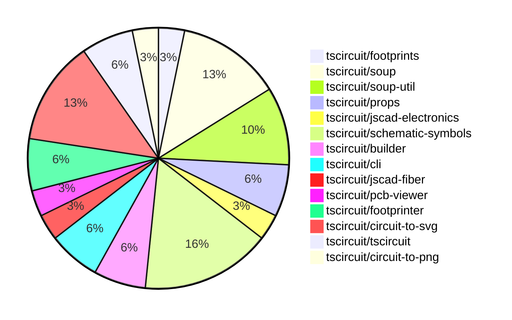

# contribution-tracker

Generates weekly contribution overviews for tscircuit contributors. Check out all
the [contribution overviews here](./contribution-overviews/)

* All PRs in the tscircuit org are scanned/summarized via Claude Haiku
* Claude classifies each Diff/PR as a Major, Minor or Tiny contribution
* All the PRs, summaries, and classifications are organized into charts and tables

The current week is shown below. There are 3 major sections:

* [Contributor Overview](#contributor-overview)
* [PRs by Repository](#prs-by-repository)
* [PRs by Contributor](#changes-by-contributor)

## Current Week

<!-- START_CURRENT_WEEK -->

# Contribution Overview 2024-08-17

## PRs by Repository

## Contributor Overview

| Contributor | 🐳 Major | 🐙 Minor | 🐌 Tiny |
|-------------|-------|-------|-------|
| seveibar | 10 | 9 | 0 |
| imrishabh18 | 3 | 5 | 3 |
| abhijitxy | 1 | 0 | 0 |

## Changes by Repository

### [tscircuit/footprints](https://github.com/tscircuit/footprints)

| PR # | Impact | Contributor | Description |
|------|--------|-------------|-------------|
| [#3](https://github.com/tscircuit/footprints/pull/3) | 🐳 Major | seveibar | This pull request performs a major cleanup of the repository, including switching to the Bun runtime, fixing type issues, adding workflows for format checking, type checking, and publishing releases to npm. |

### [tscircuit/soup](https://github.com/tscircuit/soup)

| PR # | Impact | Contributor | Description |
|------|--------|-------------|-------------|
| [#27](https://github.com/tscircuit/soup/pull/27) | 🐳 Major | seveibar | Introduce a new formatbot that has special behavior for forks (only checks without autofix) |
| [#23](https://github.com/tscircuit/soup/pull/23) | 🐙 Minor | seveibar | Add a new route thickness mode and a new boolean property to control whether corners should be rounded. |
| [#24](https://github.com/tscircuit/soup/pull/24) | 🐙 Minor | seveibar | Add an optional `symbol_name` field to `schematic_component` schema |
| [#22](https://github.com/tscircuit/soup/pull/22) | 🐙 Minor | seveibar | Add a new field `pcb_board_id` to the `pcb_board` object schema with a default value of `"pcb_board_0"`. |

### [tscircuit/soup-util](https://github.com/tscircuit/soup-util)

| PR # | Impact | Contributor | Description |
|------|--------|-------------|-------------|
| [#8](https://github.com/tscircuit/soup-util/pull/8) | 🐳 Major | seveibar | Adds an "update" method to the `su` utility for updating existing elements in a soup. |
| [#7](https://github.com/tscircuit/soup-util/pull/7) | 🐳 Major | seveibar | Add a new `delete` method to the `su` library to remove an element from the soup by its ID. |
| [#6](https://github.com/tscircuit/soup-util/pull/6) | 🐳 Major | seveibar | Adds support for the `insert` method and `toArray` method to the `su` object. |

### [tscircuit/props](https://github.com/tscircuit/props)

| PR # | Impact | Contributor | Description |
|------|--------|-------------|-------------|
| [#20](https://github.com/tscircuit/props/pull/20) | 🐳 Major | seveibar | Improve published types and add support for port references that use a function. |
| [#21](https://github.com/tscircuit/props/pull/21) | 🐙 Minor | seveibar | Avoid parsing `portRef` reference to prevent losing the reference. |

### [tscircuit/jscad-electronics](https://github.com/tscircuit/jscad-electronics)

| PR # | Impact | Contributor | Description |
|------|--------|-------------|-------------|
| [#13](https://github.com/tscircuit/jscad-electronics/pull/13) | 🐳 Major | seveibar | Implement the Tssop component, which represents a Thin Shrink Small Outline Package (TSSOP) integrated circuit package. |

### [tscircuit/schematic-symbols](https://github.com/tscircuit/schematic-symbols)

| PR # | Impact | Contributor | Description |
|------|--------|-------------|-------------|
| [#9](https://github.com/tscircuit/schematic-symbols/pull/9) | 🐳 Major | seveibar | Fix the coordinate values of the diode and LED symbols |
| [#7](https://github.com/tscircuit/schematic-symbols/pull/7) | 🐳 Major | seveibar | Add formatcheck and typecheck workflows, run format, and add formatbot |
| [#4](https://github.com/tscircuit/schematic-symbols/pull/4) | 🐳 Major | seveibar | Initial release of the schematic symbols library, including the addition of a Vercel build script, fix for type errors, and publication of version 0.0.1. |
| [#6](https://github.com/tscircuit/schematic-symbols/pull/6) | 🐙 Minor | seveibar | Add computed fields to make it easier to use symbols. |
| [#5](https://github.com/tscircuit/schematic-symbols/pull/5) | 🐙 Minor | seveibar | Add type exports for drawing primitives |

### [tscircuit/builder](https://github.com/tscircuit/builder)

| PR # | Impact | Contributor | Description |
|------|--------|-------------|-------------|
| [#104](https://github.com/tscircuit/builder/pull/104) | 🐙 Minor | seveibar | Fix the default value of `flip_y_axis` in the `convertSoupToExcellonDrillCommands`, `convertSoupToGerberCommands`, and `convertSoupToPickAndPlaceRows` functions. |
| [#103](https://github.com/tscircuit/builder/pull/103) | 🐌 Tiny | imrishabh18 | Add "circuit-to-png" as a devDependency |

### [tscircuit/cli](https://github.com/tscircuit/cli)

| PR # | Impact | Contributor | Description |
|------|--------|-------------|-------------|
| [#128](https://github.com/tscircuit/cli/pull/128) | 🐙 Minor | seveibar | Move `@tscircuit/builder` from devDependencies to dependencies |
| [#124](https://github.com/tscircuit/cli/pull/124) | 🐙 Minor | imrishabh18 | Add dynamic import for `circuitToPng` function to improve performance |

### [tscircuit/jscad-fiber](https://github.com/tscircuit/jscad-fiber)

| PR # | Impact | Contributor | Description |
|------|--------|-------------|-------------|
| [#71](https://github.com/tscircuit/jscad-fiber/pull/71) | 🐙 Minor | seveibar | Add a new `zAxisUp` prop to the `JsCadFixture` component to allow rotating the 3D scene by 90 degrees. |

### [tscircuit/pcb-viewer](https://github.com/tscircuit/pcb-viewer)

| PR # | Impact | Contributor | Description |
|------|--------|-------------|-------------|
| [#37](https://github.com/tscircuit/pcb-viewer/pull/37) | 🐳 Major | imrishabh18 | Add the "bulge" in the trace by implementing a custom stroke expansion algorithm. |

### [tscircuit/footprinter](https://github.com/tscircuit/footprinter)

| PR # | Impact | Contributor | Description |
|------|--------|-------------|-------------|
| [#17](https://github.com/tscircuit/footprinter/pull/17) | 🐳 Major | imrishabh18 | Adds a new package `circuit-to-svg` and integrates it into the test fixtures to generate SVG snapshots of the circuit soup. |
| [#15](https://github.com/tscircuit/footprinter/pull/15) | 🐳 Major | abhijitxy | Add SOT23 package definition |

### [tscircuit/circuit-to-svg](https://github.com/tscircuit/circuit-to-svg)

| PR # | Impact | Contributor | Description |
|------|--------|-------------|-------------|
| [#21](https://github.com/tscircuit/circuit-to-svg/pull/21) | 🐳 Major | imrishabh18 | Introduce a new dependency `svgson` to generate SVG objects from the PCB soup data. |
| [#24](https://github.com/tscircuit/circuit-to-svg/pull/24) | 🐙 Minor | imrishabh18 | Add a white background to the SVG output |
| [#23](https://github.com/tscircuit/circuit-to-svg/pull/23) | 🐙 Minor | imrishabh18 | Refactor function names to better describe their purpose |
| [#22](https://github.com/tscircuit/circuit-to-svg/pull/22) | 🐌 Tiny | imrishabh18 | Fix a typo in the `pcb-soup-to-svg.ts` file |

### [tscircuit/tscircuit](https://github.com/tscircuit/tscircuit)

| PR # | Impact | Contributor | Description |
|------|--------|-------------|-------------|
| [#351](https://github.com/tscircuit/tscircuit/pull/351) | 🐙 Minor | imrishabh18 | Automatically updates the package version and creates a pull request if the update passes the project's tests. |
| [#349](https://github.com/tscircuit/tscircuit/pull/349) | 🐙 Minor | imrishabh18 | Update the version of the "@tscircuit/builder" dependency in the package.json file. |

### [tscircuit/circuit-to-png](https://github.com/tscircuit/circuit-to-png)

| PR # | Impact | Contributor | Description |
|------|--------|-------------|-------------|
| [#13](https://github.com/tscircuit/circuit-to-png/pull/13) | 🐌 Tiny | imrishabh18 | Removes a dependency on `@resvg/resvg-wasm` package, which is not being used. |

## Changes by Contributor

### [seveibar](https://github.com/seveibar)

| PR # | Impact | Description |
|------|--------|-------------|
| [#3](https://github.com/tscircuit/footprints/pull/3) | 🐳 Major | This pull request performs a major cleanup of the repository, including switching to the Bun runtime, fixing type issues, adding workflows for format checking, type checking, and publishing releases to npm. |
| [#27](https://github.com/tscircuit/soup/pull/27) | 🐳 Major | Introduce a new formatbot that has special behavior for forks (only checks without autofix) |
| [#8](https://github.com/tscircuit/soup-util/pull/8) | 🐳 Major | Adds an "update" method to the `su` utility for updating existing elements in a soup. |
| [#7](https://github.com/tscircuit/soup-util/pull/7) | 🐳 Major | Add a new `delete` method to the `su` library to remove an element from the soup by its ID. |
| [#6](https://github.com/tscircuit/soup-util/pull/6) | 🐳 Major | Adds support for the `insert` method and `toArray` method to the `su` object. |
| [#20](https://github.com/tscircuit/props/pull/20) | 🐳 Major | Improve published types and add support for port references that use a function. |
| [#13](https://github.com/tscircuit/jscad-electronics/pull/13) | 🐳 Major | Implement the Tssop component, which represents a Thin Shrink Small Outline Package (TSSOP) integrated circuit package. |
| [#9](https://github.com/tscircuit/schematic-symbols/pull/9) | 🐳 Major | Fix the coordinate values of the diode and LED symbols |
| [#7](https://github.com/tscircuit/schematic-symbols/pull/7) | 🐳 Major | Add formatcheck and typecheck workflows, run format, and add formatbot |
| [#4](https://github.com/tscircuit/schematic-symbols/pull/4) | 🐳 Major | Initial release of the schematic symbols library, including the addition of a Vercel build script, fix for type errors, and publication of version 0.0.1. |
| [#104](https://github.com/tscircuit/builder/pull/104) | 🐙 Minor | Fix the default value of `flip_y_axis` in the `convertSoupToExcellonDrillCommands`, `convertSoupToGerberCommands`, and `convertSoupToPickAndPlaceRows` functions. |
| [#128](https://github.com/tscircuit/cli/pull/128) | 🐙 Minor | Move `@tscircuit/builder` from devDependencies to dependencies |
| [#23](https://github.com/tscircuit/soup/pull/23) | 🐙 Minor | Add a new route thickness mode and a new boolean property to control whether corners should be rounded. |
| [#24](https://github.com/tscircuit/soup/pull/24) | 🐙 Minor | Add an optional `symbol_name` field to `schematic_component` schema |
| [#22](https://github.com/tscircuit/soup/pull/22) | 🐙 Minor | Add a new field `pcb_board_id` to the `pcb_board` object schema with a default value of `"pcb_board_0"`. |
| [#21](https://github.com/tscircuit/props/pull/21) | 🐙 Minor | Avoid parsing `portRef` reference to prevent losing the reference. |
| [#71](https://github.com/tscircuit/jscad-fiber/pull/71) | 🐙 Minor | Add a new `zAxisUp` prop to the `JsCadFixture` component to allow rotating the 3D scene by 90 degrees. |
| [#6](https://github.com/tscircuit/schematic-symbols/pull/6) | 🐙 Minor | Add computed fields to make it easier to use symbols. |
| [#5](https://github.com/tscircuit/schematic-symbols/pull/5) | 🐙 Minor | Add type exports for drawing primitives |

### [imrishabh18](https://github.com/imrishabh18)

| PR # | Impact | Description |
|------|--------|-------------|
| [#37](https://github.com/tscircuit/pcb-viewer/pull/37) | 🐳 Major | Add the "bulge" in the trace by implementing a custom stroke expansion algorithm. |
| [#17](https://github.com/tscircuit/footprinter/pull/17) | 🐳 Major | Adds a new package `circuit-to-svg` and integrates it into the test fixtures to generate SVG snapshots of the circuit soup. |
| [#21](https://github.com/tscircuit/circuit-to-svg/pull/21) | 🐳 Major | Introduce a new dependency `svgson` to generate SVG objects from the PCB soup data. |
| [#351](https://github.com/tscircuit/tscircuit/pull/351) | 🐙 Minor | Automatically updates the package version and creates a pull request if the update passes the project's tests. |
| [#349](https://github.com/tscircuit/tscircuit/pull/349) | 🐙 Minor | Update the version of the "@tscircuit/builder" dependency in the package.json file. |
| [#124](https://github.com/tscircuit/cli/pull/124) | 🐙 Minor | Add dynamic import for `circuitToPng` function to improve performance |
| [#24](https://github.com/tscircuit/circuit-to-svg/pull/24) | 🐙 Minor | Add a white background to the SVG output |
| [#23](https://github.com/tscircuit/circuit-to-svg/pull/23) | 🐙 Minor | Refactor function names to better describe their purpose |
| [#103](https://github.com/tscircuit/builder/pull/103) | 🐌 Tiny | Add "circuit-to-png" as a devDependency |
| [#22](https://github.com/tscircuit/circuit-to-svg/pull/22) | 🐌 Tiny | Fix a typo in the `pcb-soup-to-svg.ts` file |
| [#13](https://github.com/tscircuit/circuit-to-png/pull/13) | 🐌 Tiny | Removes a dependency on `@resvg/resvg-wasm` package, which is not being used. |

### [abhijitxy](https://github.com/abhijitxy)

| PR # | Impact | Description |
|------|--------|-------------|
| [#15](https://github.com/tscircuit/footprinter/pull/15) | 🐳 Major | Add SOT23 package definition |

<!-- END_CURRENT_WEEK -->
