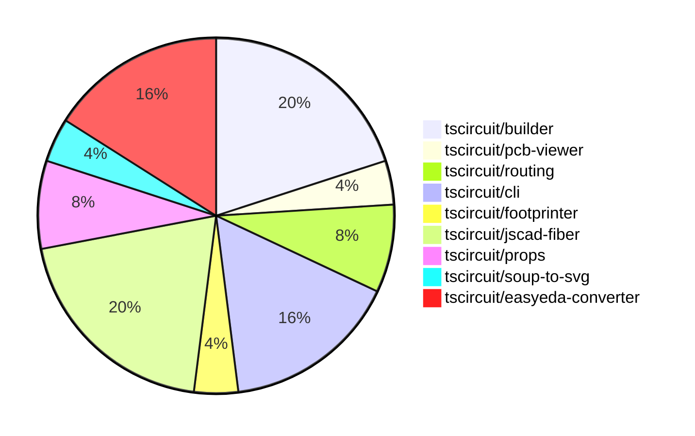

# contribution-tracker

Generates weekly contribution overviews for tscircuit contributors. Check out all
the [contribution overviews here](./contribution-overviews/)

* All PRs in the tscircuit org are scanned/summarized via Claude Haiku
* Claude classifies each Diff/PR as a Major, Minor or Tiny contribution
* All the PRs, summaries, and classifications are organized into charts and tables

The current week is shown below. There are 3 major sections:

* [Contributor Overview](#contributor-overview)
* [PRs by Repository](#prs-by-repository)
* [PRs by Contributor](#changes-by-contributor)

## Current Week

<!-- START_CURRENT_WEEK -->

# Contribution Overview 2024-07-13

## PRs by Repository

## Contributor Overview

| Contributor | 🐳 Major | 🐙 Minor | 🐌 Tiny |
|-------------|-------|-------|-------|
| seveibar | 9 | 5 | 0 |
| imrishabh18 | 2 | 0 | 0 |
| andrii-balitskyi | 3 | 2 | 0 |
| Slaviiiii | 2 | 1 | 0 |

## Changes by Repository

### [tscircuit/builder](https://github.com/tscircuit/builder)

| PR # | Impact | Contributor | Description |
|------|--------|-------------|-------------|
| [#74](https://github.com/tscircuit/builder/pull/74) | 🐳 Major | seveibar | Fix issue where failure to connect routes doesn't show an error that routes failed to connect |
| [#73](https://github.com/tscircuit/builder/pull/73) | 🐳 Major | seveibar | Fix bad usage of the `convert` function in the `PlatedHoleBuilder` class. |
| [#72](https://github.com/tscircuit/builder/pull/72) | 🐳 Major | seveibar | Fix default plated hole construction when there's no outer width or hole width |
| [#71](https://github.com/tscircuit/builder/pull/71) | 🐳 Major | seveibar | Fix the default plated hole construction when there's no outer width or hole width. |
| [#70](https://github.com/tscircuit/builder/pull/70) | 🐙 Minor | seveibar | Upgrade Footprinter package to version 0.0.44 |

### [tscircuit/pcb-viewer](https://github.com/tscircuit/pcb-viewer)

| PR # | Impact | Contributor | Description |
|------|--------|-------------|-------------|
| [#25](https://github.com/tscircuit/pcb-viewer/pull/25) | 🐳 Major | seveibar | Fix port aliases not appearing for smtpads and plated holes for most components |

### [tscircuit/routing](https://github.com/tscircuit/routing)

| PR # | Impact | Contributor | Description |
|------|--------|-------------|-------------|
| [#10](https://github.com/tscircuit/routing/pull/10) | 🐳 Major | seveibar | Improve automatic pasting by adjusting the viewbox automatically when the text area content changes significantly. |
| [#11](https://github.com/tscircuit/routing/pull/11) | 🐙 Minor | seveibar | Add a landing page for the Storybook stories |

### [tscircuit/cli](https://github.com/tscircuit/cli)

| PR # | Impact | Contributor | Description |
|------|--------|-------------|-------------|
| [#99](https://github.com/tscircuit/cli/pull/99) | 🐳 Major | seveibar | Fix "over dragging" issue, add debug logging, and fix LEVEL_NOT_FOUND error messages. |
| [#102](https://github.com/tscircuit/cli/pull/102) | 🐳 Major | imrishabh18 | Fix issue where localhost is interpreted as IPv6 instead of IPv4 by the axiosInstance package. |
| [#98](https://github.com/tscircuit/cli/pull/98) | 🐙 Minor | seveibar | Add a `--no-cleanup` flag to the development server command to keep temporary entrypoints around for debugging purposes. |
| [#100](https://github.com/tscircuit/cli/pull/100) | 🐙 Minor | andrii-balitskyi | Improve 401 error messages by adding a more informative message and exiting the process when a 401 error occurs. |

### [tscircuit/footprinter](https://github.com/tscircuit/footprinter)

| PR # | Impact | Contributor | Description |
|------|--------|-------------|-------------|
| [#11](https://github.com/tscircuit/footprinter/pull/11) | 🐳 Major | seveibar | Add pinrow function and biome configuration |

### [tscircuit/jscad-fiber](https://github.com/tscircuit/jscad-fiber)

| PR # | Impact | Contributor | Description |
|------|--------|-------------|-------------|
| [#16](https://github.com/tscircuit/jscad-fiber/pull/16) | 🐳 Major | seveibar | Add test and release workflows, fix exports, and add a build system. |
| [#19](https://github.com/tscircuit/jscad-fiber/pull/19) | 🐳 Major | Slaviiiii | Update functions and shapes in the project, including new extrude-related features and a project function. |
| [#20](https://github.com/tscircuit/jscad-fiber/pull/20) | 🐙 Minor | seveibar | Fix the issue with gh-pages not deploying |
| [#12](https://github.com/tscircuit/jscad-fiber/pull/12) | 🟣 | Slaviiiii | Adds support for three new extrusion types - helical, rectangular, and rotating extrusion. |
| [#15](https://github.com/tscircuit/jscad-fiber/pull/15) | 🐳 Major | Slaviiiii | Add support for geometry colorization in the JSCAD fixture component |

### [tscircuit/props](https://github.com/tscircuit/props)

| PR # | Impact | Contributor | Description |
|------|--------|-------------|-------------|
| [#6](https://github.com/tscircuit/props/pull/6) | 🐙 Minor | seveibar | Add formatter and format check, and add typecheck workflow. |
| [#7](https://github.com/tscircuit/props/pull/7) | 🐙 Minor | Slaviiiii | Change `pcbCenterX` and `pcbCenterY` to `pcbX` and `pcbY` in the `boardProps` type. |

### [tscircuit/soup-to-svg](https://github.com/tscircuit/soup-to-svg)

| PR # | Impact | Contributor | Description |
|------|--------|-------------|-------------|
| [#2](https://github.com/tscircuit/soup-to-svg/pull/2) | 🐳 Major | imrishabh18 | Initialized the lib with build and type checking |

### [tscircuit/easyeda-converter](https://github.com/tscircuit/easyeda-converter)

| PR # | Impact | Contributor | Description |
|------|--------|-------------|-------------|
| [#27](https://github.com/tscircuit/easyeda-converter/pull/27) | 🐳 Major | andrii-balitskyi | Fix the issue where the `SOLIDREGION` package detail shape did not correctly handle negative coordinates. |
| [#25](https://github.com/tscircuit/easyeda-converter/pull/25) | 🐳 Major | andrii-balitskyi | Use manufacturer part number as TypeScript component name |
| [#23](https://github.com/tscircuit/easyeda-converter/pull/23) | 🐳 Major | andrii-balitskyi | Support parsing `RECT` package detail shape |
| [#26](https://github.com/tscircuit/easyeda-converter/pull/26) | 🐙 Minor | andrii-balitskyi | Export the `normalizeManufacturerPartNumber` function from the `normalize-manufacturer-part-number` module. |

## Changes by Contributor

### [seveibar](https://github.com/seveibar)

| PR # | Impact | Description |
|------|--------|-------------|
| [#74](https://github.com/tscircuit/builder/pull/74) | 🐳 Major | Fix issue where failure to connect routes doesn't show an error that routes failed to connect |
| [#73](https://github.com/tscircuit/builder/pull/73) | 🐳 Major | Fix bad usage of the `convert` function in the `PlatedHoleBuilder` class. |
| [#72](https://github.com/tscircuit/builder/pull/72) | 🐳 Major | Fix default plated hole construction when there's no outer width or hole width |
| [#71](https://github.com/tscircuit/builder/pull/71) | 🐳 Major | Fix the default plated hole construction when there's no outer width or hole width. |
| [#25](https://github.com/tscircuit/pcb-viewer/pull/25) | 🐳 Major | Fix port aliases not appearing for smtpads and plated holes for most components |
| [#10](https://github.com/tscircuit/routing/pull/10) | 🐳 Major | Improve automatic pasting by adjusting the viewbox automatically when the text area content changes significantly. |
| [#99](https://github.com/tscircuit/cli/pull/99) | 🐳 Major | Fix "over dragging" issue, add debug logging, and fix LEVEL_NOT_FOUND error messages. |
| [#11](https://github.com/tscircuit/footprinter/pull/11) | 🐳 Major | Add pinrow function and biome configuration |
| [#16](https://github.com/tscircuit/jscad-fiber/pull/16) | 🐳 Major | Add test and release workflows, fix exports, and add a build system. |
| [#70](https://github.com/tscircuit/builder/pull/70) | 🐙 Minor | Upgrade Footprinter package to version 0.0.44 |
| [#11](https://github.com/tscircuit/routing/pull/11) | 🐙 Minor | Add a landing page for the Storybook stories |
| [#98](https://github.com/tscircuit/cli/pull/98) | 🐙 Minor | Add a `--no-cleanup` flag to the development server command to keep temporary entrypoints around for debugging purposes. |
| [#6](https://github.com/tscircuit/props/pull/6) | 🐙 Minor | Add formatter and format check, and add typecheck workflow. |
| [#20](https://github.com/tscircuit/jscad-fiber/pull/20) | 🐙 Minor | Fix the issue with gh-pages not deploying |

### [imrishabh18](https://github.com/imrishabh18)

| PR # | Impact | Description |
|------|--------|-------------|
| [#102](https://github.com/tscircuit/cli/pull/102) | 🐳 Major | Fix issue where localhost is interpreted as IPv6 instead of IPv4 by the axiosInstance package. |
| [#2](https://github.com/tscircuit/soup-to-svg/pull/2) | 🐳 Major | Initialized the lib with build and type checking |

### [andrii-balitskyi](https://github.com/andrii-balitskyi)

| PR # | Impact | Description |
|------|--------|-------------|
| [#27](https://github.com/tscircuit/easyeda-converter/pull/27) | 🐳 Major | Fix the issue where the `SOLIDREGION` package detail shape did not correctly handle negative coordinates. |
| [#25](https://github.com/tscircuit/easyeda-converter/pull/25) | 🐳 Major | Use manufacturer part number as TypeScript component name |
| [#23](https://github.com/tscircuit/easyeda-converter/pull/23) | 🐳 Major | Support parsing `RECT` package detail shape |
| [#100](https://github.com/tscircuit/cli/pull/100) | 🐙 Minor | Improve 401 error messages by adding a more informative message and exiting the process when a 401 error occurs. |
| [#26](https://github.com/tscircuit/easyeda-converter/pull/26) | 🐙 Minor | Export the `normalizeManufacturerPartNumber` function from the `normalize-manufacturer-part-number` module. |

### [Slaviiiii](https://github.com/Slaviiiii)

| PR # | Impact | Description |
|------|--------|-------------|
| [#19](https://github.com/tscircuit/jscad-fiber/pull/19) | 🐳 Major | Update functions and shapes in the project, including new extrude-related features and a project function. |
| [#7](https://github.com/tscircuit/props/pull/7) | 🐙 Minor | Change `pcbCenterX` and `pcbCenterY` to `pcbX` and `pcbY` in the `boardProps` type. |
| [#12](https://github.com/tscircuit/jscad-fiber/pull/12) | 🟣 | Adds support for three new extrusion types - helical, rectangular, and rotating extrusion. |
| [#15](https://github.com/tscircuit/jscad-fiber/pull/15) | 🐳 Major | Add support for geometry colorization in the JSCAD fixture component |

<!-- END_CURRENT_WEEK -->
