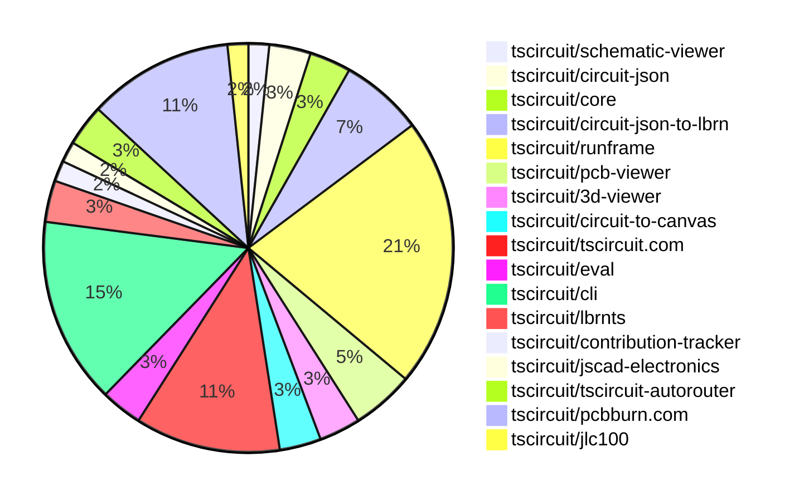

# contribution tracker

[contributions.tscircuit.com](https://contributions.tscircuit.com) ・ [tscircuit.com](https://tscircuit.com) ・ [Contribution Overviews](./contribution-overviews/) ・ [Changelogs](./changelogs/)

Generates weekly contribution overviews for tscircuit contributors. Check out all
the [contribution overviews here](./contribution-overviews/)
You can find AI-generated monthly changelogs in the [changelogs directory](./changelogs/)

- All PRs in the tscircuit org are scanned/summarized via an LLM
- The LLM classifies each Diff/PR as into a set of attributes for scoring
- All the PRs, summaries, and classifications are organized into charts and tables for [the website](https://contributions.tscircuit.com)

> Want to run locally? See the [Development Section](#development)

## Current Week

<!-- START_CURRENT_WEEK -->

# Contribution Overview 2026-01-28

The current week is shown below. There are 3 major sections:

- [Contributor Overview](#contributor-overview)
- [PRs by Repository](#prs-by-repository)
- [PRs by Contributor](#changes-by-contributor)
- [Scoring & Sponsorship Details](/docs/sponsorship-calculation-explanation.md)

## PRs by Repository



## Contributor Overview

| Contributor | 🐳 Major | 🐙 Minor | 🐌 Tiny | ⭐ | Discussion Contributions |
|-------------|---------|---------|---------|-----|--------------------------|
| [AnasSarkiz](#AnasSarkiz) | 1 | 6 | 2 | ⭐⭐ | 0🔹 0🔶 0💎 |
| [tscircuitbot](#tscircuitbot) | 0 | 0 | 35 | ⭐⭐ | 0🔹 0🔶 0💎 |
| [seveibar](#seveibar) | 1 | 3 | 1 | ⭐⭐ | 0🔹 0🔶 0💎 |
| [Abse2001](#Abse2001) | 0 | 5 | 0 | ⭐ | 0🔹 0🔶 0💎 |
| [ShiboSoftwareDev](#ShiboSoftwareDev) | 0 | 2 | 0 | ⭐ | 0🔹 0🔶 0💎 |
| [0hmX](#0hmX) | 1 | 0 | 0 | ⭐ | 0🔹 0🔶 0💎 |
| [MustafaMulla29](#MustafaMulla29) | 1 | 0 | 0 | ⭐ | 0🔹 0🔶 0💎 |
| [rushabhcodes](#rushabhcodes) | 0 | 1 | 1 |  | 0🔹 0🔶 0💎 |
| [Ayushjhawar8](#Ayushjhawar8) | 0 | 0 | 1 |  | 0🔹 0🔶 0💎 |

> Note: AI evaluates PRs and assigns 1-3 star ratings automatically. 4 and 5 star ratings require manual staff review.

### Discussion Contribution Legend

- 🔹 Normal Comments: Basic participation with minimal effort
- 🔶 Great Informative Comments: Thoughtful participation that adds value
- 💎 Incredible Comments: Exceptional participation with high-quality content

## Review Table

[reviews-received-hover]: ## "Number of reviews received for PRs for this contributor"
[approvals-received-hover]: ## "Number of approvals received for PRs this contributor authored"
[rejections-received-hover]: ## "Number of rejections received for PRs this contributor authored"
[prs-opened-hover]: ## "Number of PRs opened by this contributor"
[issues-created-hover]: ## "Number of issues created by this contributor"

| Contributor | Reviews Received | Approvals Received | Rejections Received | Approvals | Rejections | PRs Opened | PRs Merged | Issues Created |
|---|---|---|---|---|---|---|---|---|
| [seveibar](#seveibar) | 9 | 0 | 0 | 8 | 1 | 8 | 5 | 0 |
| [Abse2001](#Abse2001) | 6 | 6 | 0 | 0 | 0 | 5 | 5 | 0 |
| [ShiboSoftwareDev](#ShiboSoftwareDev) | 3 | 2 | 0 | 5 | 0 | 3 | 3 | 0 |
| [tscircuitbot](#tscircuitbot) | 0 | 0 | 0 | 0 | 0 | 41 | 35 | 0 |
| [MustafaMulla29](#MustafaMulla29) | 7 | 2 | 2 | 0 | 0 | 3 | 1 | 0 |
| [imrishabh18](#imrishabh18) | 0 | 0 | 0 | 1 | 1 | 0 | 0 | 0 |
| [Ayushjhawar8](#Ayushjhawar8) | 5 | 1 | 0 | 0 | 0 | 2 | 1 | 0 |
| [rushabhcodes](#rushabhcodes) | 6 | 2 | 0 | 0 | 0 | 2 | 2 | 0 |
| [ArnavK-09](#ArnavK-09) | 0 | 0 | 0 | 1 | 0 | 1 | 1 | 0 |
| [0hmX](#0hmX) | 3 | 2 | 0 | 0 | 0 | 2 | 2 | 0 |
| [pxlpal](#pxlpal) | 0 | 0 | 0 | 0 | 0 | 1 | 0 | 0 |
| [AnasSarkiz](#AnasSarkiz) | 0 | 0 | 0 | 0 | 0 | 9 | 9 | 0 |

## Changes by Repository

### [tscircuit/schematic-viewer](https://github.com/tscircuit/schematic-viewer)

| PR # | Impact | Rating | Contributor | Description |
|------|--------|--------|-------------|-------------|
| [#161](https://github.com/tscircuit/schematic-viewer/pull/161) | 🐳 Major | ⭐⭐⭐ | seveibar | Adds the ability to show schematic ports on hover when view mode is enabled |

### [tscircuit/circuit-json](https://github.com/tscircuit/circuit-json)

| PR # | Impact | Rating | Contributor | Description |
|------|--------|--------|-------------|-------------|
| [#433](https://github.com/tscircuit/circuit-json/pull/433) | 🐙 Minor | ⭐⭐ | seveibar | Add a new error type for PCB panelization placement failures, ensuring it is recognized in the type system and tooling. |

<details>
<summary>🐌 Tiny Contributions (1)</summary>

| PR # | Impact | Contributor | Description |
|------|--------|-------------|-------------|
| [#434](https://github.com/tscircuit/circuit-json/pull/434) | 🐌 Tiny | tscircuitbot | Automated package update |

</details>

### [tscircuit/core](https://github.com/tscircuit/core)

| PR # | Impact | Rating | Contributor | Description |
|------|--------|--------|-------------|-------------|
| [#1870](https://github.com/tscircuit/core/pull/1870) | 🐙 Minor | ⭐⭐ | seveibar | Adds an error handling mechanism for multiple boards in a panel without specified pcbXpcbY positions when layoutMode is set to none. |
| [#1872](https://github.com/tscircuit/core/pull/1872) | 🐙 Minor | ⭐⭐ | ShiboSoftwareDev | Adds a new subpanel component enabling nested panel hierarchies within panel elements, supporting recursive nesting for complex manufacturing layouts and comprehensive validation for board containment and positioning. |

### [tscircuit/circuit-json-to-lbrn](https://github.com/tscircuit/circuit-json-to-lbrn)

| PR # | Impact | Rating | Contributor | Description |
|------|--------|--------|-------------|-------------|
| [#112](https://github.com/tscircuit/circuit-json-to-lbrn/pull/112) | 🐙 Minor | ⭐⭐ | seveibar | Adds functionality to create an oxidation cleaning layer for laser ablation to clean oxidation from the copper surface of the PCB. |
| [#114](https://github.com/tscircuit/circuit-json-to-lbrn/pull/114) | 🐙 Minor | ⭐⭐ | AnasSarkiz | Replace the cut-setting field from pulseWidth to qPulseWidth so LBRN receives the correct parameter. Keep laser profile defaults and UI in ns, aligning tests and docs with the correct field. Bump lbrnts to 0.0.17 to match the updated schema. |

<details>
<summary>🐌 Tiny Contributions (2)</summary>

| PR # | Impact | Contributor | Description |
|------|--------|-------------|-------------|
| [#115](https://github.com/tscircuit/circuit-json-to-lbrn/pull/115) | 🐌 Tiny | tscircuitbot | Automated package update |
| [#113](https://github.com/tscircuit/circuit-json-to-lbrn/pull/113) | 🐌 Tiny | tscircuitbot | Automated package update |

</details>

### [tscircuit/runframe](https://github.com/tscircuit/runframe)


<details>
<summary>🐌 Tiny Contributions (13)</summary>

| PR # | Impact | Contributor | Description |
|------|--------|-------------|-------------|
| [#2468](https://github.com/tscircuit/runframe/pull/2468) | 🐌 Tiny | seveibar | Adds a new dropdown menu for viewing schematic options in the File Menu Left Header component. |
| [#2477](https://github.com/tscircuit/runframe/pull/2477) | 🐌 Tiny | tscircuitbot | Automated package update |
| [#2476](https://github.com/tscircuit/runframe/pull/2476) | 🐌 Tiny | tscircuitbot | Updates the tscircuitpcb-viewer package to version 1.11.326 |
| [#2475](https://github.com/tscircuit/runframe/pull/2475) | 🐌 Tiny | tscircuitbot | Automated package update |
| [#2474](https://github.com/tscircuit/runframe/pull/2474) | 🐌 Tiny | tscircuitbot | Updates the tscircuit3d-viewer package from version 0.0.502 to 0.0.503 in the package.json file. |
| [#2463](https://github.com/tscircuit/runframe/pull/2463) | 🐌 Tiny | tscircuitbot | Updates the tscircuiteval package from version 0.0.611 to 0.0.612 in the package.json file. |
| [#2470](https://github.com/tscircuit/runframe/pull/2470) | 🐌 Tiny | tscircuitbot | Updates the tscircuitpcb-viewer package from version 1.11.322 to 1.11.325 |
| [#2473](https://github.com/tscircuit/runframe/pull/2473) | 🐌 Tiny | tscircuitbot | Automated package update |
| [#2471](https://github.com/tscircuit/runframe/pull/2471) | 🐌 Tiny | tscircuitbot | Updates the package version from 0.0.1538 to 0.0.1539 in package.json |
| [#2467](https://github.com/tscircuit/runframe/pull/2467) | 🐌 Tiny | tscircuitbot | Automated package update |
| [#2472](https://github.com/tscircuit/runframe/pull/2472) | 🐌 Tiny | tscircuitbot | Updates the tscircuit3d-viewer package from version 0.0.501 to 0.0.502 |
| [#2464](https://github.com/tscircuit/runframe/pull/2464) | 🐌 Tiny | tscircuitbot | Automated package update |
| [#2466](https://github.com/tscircuit/runframe/pull/2466) | 🐌 Tiny | tscircuitbot | Updates the tscircuitschematic-viewer package to version 2.0.55 in the package.json file. |

</details>

### [tscircuit/pcb-viewer](https://github.com/tscircuit/pcb-viewer)

| PR # | Impact | Rating | Contributor | Description |
|------|--------|--------|-------------|-------------|
| [#633](https://github.com/tscircuit/pcb-viewer/pull/633) | 🐙 Minor | ⭐⭐ | Abse2001 | Fixes PCB note rendering order by explicitly associating top_notes and bottom_notes with their respective foreground sides, mirroring silkscreen behavior. |
| [#631](https://github.com/tscircuit/pcb-viewer/pull/631) | 🐙 Minor | ⭐⭐ | Abse2001 | Fixes PCB rendering issues by making soldermask a first-class layer and correcting drillsilkscreen ordering across the canvas pipeline. |

<details>
<summary>🐌 Tiny Contributions (1)</summary>

| PR # | Impact | Contributor | Description |
|------|--------|-------------|-------------|
| [#632](https://github.com/tscircuit/pcb-viewer/pull/632) | 🐌 Tiny | tscircuitbot | Automated package update to version 1.11.325 |

</details>

### [tscircuit/3d-viewer](https://github.com/tscircuit/3d-viewer)

| PR # | Impact | Rating | Contributor | Description |
|------|--------|--------|-------------|-------------|
| [#666](https://github.com/tscircuit/3d-viewer/pull/666) | 🐙 Minor | ⭐⭐ | Abse2001 | Fixes z-fighting between copper layers, soldermask, and board surfaces by enabling polygon offset for copper textures, ensuring correct visual stacking. |
| [#665](https://github.com/tscircuit/3d-viewer/pull/665) | 🐙 Minor | ⭐⭐ | Abse2001 | Removes copper pour generation from BoardGeomBuilders 3D JSCAD geometry pipeline and re-implements copper pours as dedicated topbottom textures in JscadBoardTextures, improving performance and aligning rendering with traces. |

### [tscircuit/circuit-to-canvas](https://github.com/tscircuit/circuit-to-canvas)

| PR # | Impact | Rating | Contributor | Description |
|------|--------|--------|-------------|-------------|
| [#138](https://github.com/tscircuit/circuit-to-canvas/pull/138) | 🐙 Minor | ⭐⭐ | Abse2001 | Fixes PCB rendering order to ensure soldermask correctly covers holes, improving visual accuracy in canvas rendering. |

<details>
<summary>🐌 Tiny Contributions (1)</summary>

| PR # | Impact | Contributor | Description |
|------|--------|-------------|-------------|
| [#139](https://github.com/tscircuit/circuit-to-canvas/pull/139) | 🐌 Tiny | tscircuitbot | Automated package update |

</details>

### [tscircuit/tscircuit.com](https://github.com/tscircuit/tscircuit.com)


<details>
<summary>🐌 Tiny Contributions (7)</summary>

| PR # | Impact | Contributor | Description |
|------|--------|-------------|-------------|
| [#2592](https://github.com/tscircuit/tscircuit.com/pull/2592) | 🐌 Tiny | tscircuitbot | Updates the version of the tscircuitrunframe package from 0.0.1540 to 0.0.1541 in package.json |
| [#2587](https://github.com/tscircuit/tscircuit.com/pull/2587) | 🐌 Tiny | tscircuitbot | Updates the tscircuitrunframe package to version 0.0.1537 |
| [#2591](https://github.com/tscircuit/tscircuit.com/pull/2591) | 🐌 Tiny | tscircuitbot | Automated package update |
| [#2590](https://github.com/tscircuit/tscircuit.com/pull/2590) | 🐌 Tiny | tscircuitbot | Automated package update |
| [#2588](https://github.com/tscircuit/tscircuit.com/pull/2588) | 🐌 Tiny | tscircuitbot | Updates the tscircuitrunframe package from version 0.0.1537 to 0.0.1538 and the tscircuitschematic-viewer package from version 2.0.54 to 2.0.55 |
| [#2586](https://github.com/tscircuit/tscircuit.com/pull/2586) | 🐌 Tiny | tscircuitbot | Automated package update |
| [#2574](https://github.com/tscircuit/tscircuit.com/pull/2574) | 🐌 Tiny | rushabhcodes | Updates the jscad-electronics dependency from version 0.0.25 to 0.0.113 in package.json to incorporate new improvements and bug fixes. |

</details>

### [tscircuit/eval](https://github.com/tscircuit/eval)


<details>
<summary>🐌 Tiny Contributions (2)</summary>

| PR # | Impact | Contributor | Description |
|------|--------|-------------|-------------|
| [#1938](https://github.com/tscircuit/eval/pull/1938) | 🐌 Tiny | tscircuitbot | Automated package update |
| [#1939](https://github.com/tscircuit/eval/pull/1939) | 🐌 Tiny | tscircuitbot | Automated package update |

</details>

### [tscircuit/cli](https://github.com/tscircuit/cli)


<details>
<summary>🐌 Tiny Contributions (9)</summary>

| PR # | Impact | Contributor | Description |
|------|--------|-------------|-------------|
| [#1810](https://github.com/tscircuit/cli/pull/1810) | 🐌 Tiny | tscircuitbot | Automated package update |
| [#1809](https://github.com/tscircuit/cli/pull/1809) | 🐌 Tiny | tscircuitbot | Updates the tscircuitrunframe package from version 0.0.1540 to 0.0.1541 |
| [#1808](https://github.com/tscircuit/cli/pull/1808) | 🐌 Tiny | tscircuitbot | Automated package update |
| [#1804](https://github.com/tscircuit/cli/pull/1804) | 🐌 Tiny | tscircuitbot | Automated package update |
| [#1807](https://github.com/tscircuit/cli/pull/1807) | 🐌 Tiny | tscircuitbot | Updates the tscircuitrunframe package to version 0.0.1540 |
| [#1803](https://github.com/tscircuit/cli/pull/1803) | 🐌 Tiny | tscircuitbot | Updates the tscircuitrunframe package from version 0.0.1537 to 0.0.1538 |
| [#1805](https://github.com/tscircuit/cli/pull/1805) | 🐌 Tiny | tscircuitbot | Updates the tscircuitrunframe package to version 0.0.1539 |
| [#1802](https://github.com/tscircuit/cli/pull/1802) | 🐌 Tiny | tscircuitbot | Automated package update |
| [#1801](https://github.com/tscircuit/cli/pull/1801) | 🐌 Tiny | tscircuitbot | Updates the tscircuitrunframe package from version 0.0.1536 to 0.0.1537 |

</details>

### [tscircuit/lbrnts](https://github.com/tscircuit/lbrnts)

| PR # | Impact | Rating | Contributor | Description |
|------|--------|--------|-------------|-------------|
| [#29](https://github.com/tscircuit/lbrnts/pull/29) | 🐙 Minor | ⭐⭐ | AnasSarkiz | Replaces all pulseWidth usage with qPulseWidth to match LightBurns QPulseWidth XML field, emits QPulseWidth Value1 in cut settings, and updates XML snapshot and roundtrip tests to validate the new field. |

<details>
<summary>🐌 Tiny Contributions (1)</summary>

| PR # | Impact | Contributor | Description |
|------|--------|-------------|-------------|
| [#30](https://github.com/tscircuit/lbrnts/pull/30) | 🐌 Tiny | tscircuitbot | Updates the package version from 0.0.16 to 0.0.17 in package.json |

</details>

### [tscircuit/contribution-tracker](https://github.com/tscircuit/contribution-tracker)

| PR # | Impact | Rating | Contributor | Description |
|------|--------|--------|-------------|-------------|
| [#298](https://github.com/tscircuit/contribution-tracker/pull/298) | 🐙 Minor | ⭐⭐ | ShiboSoftwareDev | Shifts the weekly start date calculation to align with Tuesday 18:30 UTC by applying a 5.5-hour offset from the last Wednesday, ensuring consistent UTC documentation and adding a test for early-Wednesday behavior. |

### [tscircuit/jscad-electronics](https://github.com/tscircuit/jscad-electronics)

| PR # | Impact | Rating | Contributor | Description |
|------|--------|--------|-------------|-------------|
| [#257](https://github.com/tscircuit/jscad-electronics/pull/257) | 🐙 Minor | ⭐⭐ | rushabhcodes | This PR adds a new function to render footprints with extruded pads in JSCAD models and updates the test helper to ensure rendered images include these pads. |

### [tscircuit/tscircuit-autorouter](https://github.com/tscircuit/tscircuit-autorouter)

| PR # | Impact | Rating | Contributor | Description |
|------|--------|--------|-------------|-------------|
| [#548](https://github.com/tscircuit/tscircuit-autorouter/pull/548) | 🐳 Major | ⭐⭐⭐ | 0hmX | hg-portpoint: move hypergraph portpoint solver into subfolder, fix imports and types process better WIP break viz WIP WIP WIP This is added as a new pipeline you can pick form the dropdown |

<details>
<summary>🐌 Tiny Contributions (1)</summary>

| PR # | Impact | Contributor | Description |
|------|--------|-------------|-------------|
| [#550](https://github.com/tscircuit/tscircuit-autorouter/pull/550) | 🐌 Tiny | Ayushjhawar8 | e dependency |

</details>

### [tscircuit/pcbburn.com](https://github.com/tscircuit/pcbburn.com)

| PR # | Impact | Rating | Contributor | Description |
|------|--------|--------|-------------|-------------|
| [#58](https://github.com/tscircuit/pcbburn.com/pull/58) | 🐳 Major | ⭐⭐⭐ | AnasSarkiz | Removes layer inclusion toggles from the settings UI so layers are always included and forces copper, soldermask, silkscreen, copper cut fill, and topbottom layers to stay enabled in LBRN options. |
| [#56](https://github.com/tscircuit/pcbburn.com/pull/56) | 🐙 Minor | ⭐⭐ | AnasSarkiz | Expands primary metadata with keyword-focused title and description, adds canonical URL, Open Graph and Twitter card metadata, and JSON-LD structured data for PCBBurn. |
| [#55](https://github.com/tscircuit/pcbburn.com/pull/55) | 🐙 Minor | ⭐⭐ | AnasSarkiz | Adds sitemap.xml and robots.txt files to enhance search engine visibility for the pcbburn.com website |
| [#52](https://github.com/tscircuit/pcbburn.com/pull/52) | 🐙 Minor | ⭐⭐ | AnasSarkiz | Fixes broken LBRN export XML formatting and standardizes .lbrn2 filenames for circuit exports |
| [#57](https://github.com/tscircuit/pcbburn.com/pull/57) | 🐙 Minor | ⭐⭐ | AnasSarkiz | Fixes broken sitemap and replaces external links with crawlable anchors to improve SEO performance. |

<details>
<summary>🐌 Tiny Contributions (2)</summary>

| PR # | Impact | Contributor | Description |
|------|--------|-------------|-------------|
| [#54](https://github.com/tscircuit/pcbburn.com/pull/54) | 🐌 Tiny | AnasSarkiz | Adds a link to the Discord channel in the main navbar for quicker access to the community. |
| [#53](https://github.com/tscircuit/pcbburn.com/pull/53) | 🐌 Tiny | AnasSarkiz | Updates laser profile defaults and pulse width inputs to use ns values instead of seconds to match the latest circuit-json-to-lbrn expectations and bumps circuit-json-to-lbrn and lbrnts versions in package.json and bun.lock. |

</details>

### [tscircuit/jlc100](https://github.com/tscircuit/jlc100)

| PR # | Impact | Rating | Contributor | Description |
|------|--------|--------|-------------|-------------|
| [#1](https://github.com/tscircuit/jlc100/pull/1) | 🐳 Major | ⭐⭐⭐ | MustafaMulla29 | This pull request initializes the tsci project and imports various components from the JLCPCB library, including processors and microcontrollers. It sets up the project structure, adds necessary files, and includes specific components that are essential for the development of electronic circuits. |

## Changes by Contributor

### [seveibar](https://github.com/seveibar)

| PRs # | Impact | Rating | Description |
|------|--------|--------|-------------|
| [#161](https://github.com/tscircuit/schematic-viewer/pull/161) | 🐳 Major | ⭐⭐⭐ | Adds the ability to show schematic ports on hover when view mode is enabled |
| [#433](https://github.com/tscircuit/circuit-json/pull/433) | 🐙 Minor | ⭐⭐ | Add a new error type for PCB panelization placement failures, ensuring it is recognized in the type system and tooling. |
| [#1870](https://github.com/tscircuit/core/pull/1870) | 🐙 Minor | ⭐⭐ | Adds an error handling mechanism for multiple boards in a panel without specified pcbXpcbY positions when layoutMode is set to none. |
| [#112](https://github.com/tscircuit/circuit-json-to-lbrn/pull/112) | 🐙 Minor | ⭐⭐ | Adds functionality to create an oxidation cleaning layer for laser ablation to clean oxidation from the copper surface of the PCB. |

<details>
<summary>🐌 Tiny Contributions (1)</summary>

| PR # | Impact | Description |
|------|--------|-------------|
| [#2468](https://github.com/tscircuit/runframe/pull/2468) | 🐌 Tiny | Adds a new dropdown menu for viewing schematic options in the File Menu Left Header component. |

</details>

### [Abse2001](https://github.com/Abse2001)

| PRs # | Impact | Rating | Description |
|------|--------|--------|-------------|
| [#633](https://github.com/tscircuit/pcb-viewer/pull/633) | 🐙 Minor | ⭐⭐ | Fixes PCB note rendering order by explicitly associating top_notes and bottom_notes with their respective foreground sides, mirroring silkscreen behavior. |
| [#631](https://github.com/tscircuit/pcb-viewer/pull/631) | 🐙 Minor | ⭐⭐ | Fixes PCB rendering issues by making soldermask a first-class layer and correcting drillsilkscreen ordering across the canvas pipeline. |
| [#666](https://github.com/tscircuit/3d-viewer/pull/666) | 🐙 Minor | ⭐⭐ | Fixes z-fighting between copper layers, soldermask, and board surfaces by enabling polygon offset for copper textures, ensuring correct visual stacking. |
| [#665](https://github.com/tscircuit/3d-viewer/pull/665) | 🐙 Minor | ⭐⭐ | Removes copper pour generation from BoardGeomBuilders 3D JSCAD geometry pipeline and re-implements copper pours as dedicated topbottom textures in JscadBoardTextures, improving performance and aligning rendering with traces. |
| [#138](https://github.com/tscircuit/circuit-to-canvas/pull/138) | 🐙 Minor | ⭐⭐ | Fixes PCB rendering order to ensure soldermask correctly covers holes, improving visual accuracy in canvas rendering. |

### [tscircuitbot](https://github.com/tscircuitbot)


<details>
<summary>🐌 Tiny Contributions (35)</summary>

| PR # | Impact | Description |
|------|--------|-------------|
| [#632](https://github.com/tscircuit/pcb-viewer/pull/632) | 🐌 Tiny | Automated package update to version 1.11.325 |
| [#434](https://github.com/tscircuit/circuit-json/pull/434) | 🐌 Tiny | Automated package update |
| [#2592](https://github.com/tscircuit/tscircuit.com/pull/2592) | 🐌 Tiny | Updates the version of the tscircuitrunframe package from 0.0.1540 to 0.0.1541 in package.json |
| [#2587](https://github.com/tscircuit/tscircuit.com/pull/2587) | 🐌 Tiny | Updates the tscircuitrunframe package to version 0.0.1537 |
| [#2591](https://github.com/tscircuit/tscircuit.com/pull/2591) | 🐌 Tiny | Automated package update |
| [#2590](https://github.com/tscircuit/tscircuit.com/pull/2590) | 🐌 Tiny | Automated package update |
| [#2588](https://github.com/tscircuit/tscircuit.com/pull/2588) | 🐌 Tiny | Updates the tscircuitrunframe package from version 0.0.1537 to 0.0.1538 and the tscircuitschematic-viewer package from version 2.0.54 to 2.0.55 |
| [#2586](https://github.com/tscircuit/tscircuit.com/pull/2586) | 🐌 Tiny | Automated package update |
| [#1938](https://github.com/tscircuit/eval/pull/1938) | 🐌 Tiny | Automated package update |
| [#1939](https://github.com/tscircuit/eval/pull/1939) | 🐌 Tiny | Automated package update |
| [#2477](https://github.com/tscircuit/runframe/pull/2477) | 🐌 Tiny | Automated package update |
| [#2476](https://github.com/tscircuit/runframe/pull/2476) | 🐌 Tiny | Updates the tscircuitpcb-viewer package to version 1.11.326 |
| [#2475](https://github.com/tscircuit/runframe/pull/2475) | 🐌 Tiny | Automated package update |
| [#2474](https://github.com/tscircuit/runframe/pull/2474) | 🐌 Tiny | Updates the tscircuit3d-viewer package from version 0.0.502 to 0.0.503 in the package.json file. |
| [#2463](https://github.com/tscircuit/runframe/pull/2463) | 🐌 Tiny | Updates the tscircuiteval package from version 0.0.611 to 0.0.612 in the package.json file. |
| [#2470](https://github.com/tscircuit/runframe/pull/2470) | 🐌 Tiny | Updates the tscircuitpcb-viewer package from version 1.11.322 to 1.11.325 |
| [#2473](https://github.com/tscircuit/runframe/pull/2473) | 🐌 Tiny | Automated package update |
| [#2471](https://github.com/tscircuit/runframe/pull/2471) | 🐌 Tiny | Updates the package version from 0.0.1538 to 0.0.1539 in package.json |
| [#2467](https://github.com/tscircuit/runframe/pull/2467) | 🐌 Tiny | Automated package update |
| [#2472](https://github.com/tscircuit/runframe/pull/2472) | 🐌 Tiny | Updates the tscircuit3d-viewer package from version 0.0.501 to 0.0.502 |
| [#2464](https://github.com/tscircuit/runframe/pull/2464) | 🐌 Tiny | Automated package update |
| [#2466](https://github.com/tscircuit/runframe/pull/2466) | 🐌 Tiny | Updates the tscircuitschematic-viewer package to version 2.0.55 in the package.json file. |
| [#1810](https://github.com/tscircuit/cli/pull/1810) | 🐌 Tiny | Automated package update |
| [#1809](https://github.com/tscircuit/cli/pull/1809) | 🐌 Tiny | Updates the tscircuitrunframe package from version 0.0.1540 to 0.0.1541 |
| [#1808](https://github.com/tscircuit/cli/pull/1808) | 🐌 Tiny | Automated package update |
| [#1804](https://github.com/tscircuit/cli/pull/1804) | 🐌 Tiny | Automated package update |
| [#1807](https://github.com/tscircuit/cli/pull/1807) | 🐌 Tiny | Updates the tscircuitrunframe package to version 0.0.1540 |
| [#1803](https://github.com/tscircuit/cli/pull/1803) | 🐌 Tiny | Updates the tscircuitrunframe package from version 0.0.1537 to 0.0.1538 |
| [#1805](https://github.com/tscircuit/cli/pull/1805) | 🐌 Tiny | Updates the tscircuitrunframe package to version 0.0.1539 |
| [#1802](https://github.com/tscircuit/cli/pull/1802) | 🐌 Tiny | Automated package update |
| [#1801](https://github.com/tscircuit/cli/pull/1801) | 🐌 Tiny | Updates the tscircuitrunframe package from version 0.0.1536 to 0.0.1537 |
| [#139](https://github.com/tscircuit/circuit-to-canvas/pull/139) | 🐌 Tiny | Automated package update |
| [#30](https://github.com/tscircuit/lbrnts/pull/30) | 🐌 Tiny | Updates the package version from 0.0.16 to 0.0.17 in package.json |
| [#115](https://github.com/tscircuit/circuit-json-to-lbrn/pull/115) | 🐌 Tiny | Automated package update |
| [#113](https://github.com/tscircuit/circuit-json-to-lbrn/pull/113) | 🐌 Tiny | Automated package update |

</details>

### [ShiboSoftwareDev](https://github.com/ShiboSoftwareDev)

| PRs # | Impact | Rating | Description |
|------|--------|--------|-------------|
| [#1872](https://github.com/tscircuit/core/pull/1872) | 🐙 Minor | ⭐⭐ | Adds a new subpanel component enabling nested panel hierarchies within panel elements, supporting recursive nesting for complex manufacturing layouts and comprehensive validation for board containment and positioning. |
| [#298](https://github.com/tscircuit/contribution-tracker/pull/298) | 🐙 Minor | ⭐⭐ | Shifts the weekly start date calculation to align with Tuesday 18:30 UTC by applying a 5.5-hour offset from the last Wednesday, ensuring consistent UTC documentation and adding a test for early-Wednesday behavior. |

### [rushabhcodes](https://github.com/rushabhcodes)

| PRs # | Impact | Rating | Description |
|------|--------|--------|-------------|
| [#257](https://github.com/tscircuit/jscad-electronics/pull/257) | 🐙 Minor | ⭐⭐ | This PR adds a new function to render footprints with extruded pads in JSCAD models and updates the test helper to ensure rendered images include these pads. |

<details>
<summary>🐌 Tiny Contributions (1)</summary>

| PR # | Impact | Description |
|------|--------|-------------|
| [#2574](https://github.com/tscircuit/tscircuit.com/pull/2574) | 🐌 Tiny | Updates the jscad-electronics dependency from version 0.0.25 to 0.0.113 in package.json to incorporate new improvements and bug fixes. |

</details>

### [Ayushjhawar8](https://github.com/Ayushjhawar8)


<details>
<summary>🐌 Tiny Contributions (1)</summary>

| PR # | Impact | Description |
|------|--------|-------------|
| [#550](https://github.com/tscircuit/tscircuit-autorouter/pull/550) | 🐌 Tiny | e dependency |

</details>

### [0hmX](https://github.com/0hmX)

| PRs # | Impact | Rating | Description |
|------|--------|--------|-------------|
| [#548](https://github.com/tscircuit/tscircuit-autorouter/pull/548) | 🐳 Major | ⭐⭐⭐ | hg-portpoint: move hypergraph portpoint solver into subfolder, fix imports and types process better WIP break viz WIP WIP WIP This is added as a new pipeline you can pick form the dropdown |

### [AnasSarkiz](https://github.com/AnasSarkiz)

| PRs # | Impact | Rating | Description |
|------|--------|--------|-------------|
| [#58](https://github.com/tscircuit/pcbburn.com/pull/58) | 🐳 Major | ⭐⭐⭐ | Removes layer inclusion toggles from the settings UI so layers are always included and forces copper, soldermask, silkscreen, copper cut fill, and topbottom layers to stay enabled in LBRN options. |
| [#29](https://github.com/tscircuit/lbrnts/pull/29) | 🐙 Minor | ⭐⭐ | Replaces all pulseWidth usage with qPulseWidth to match LightBurns QPulseWidth XML field, emits QPulseWidth Value1 in cut settings, and updates XML snapshot and roundtrip tests to validate the new field. |
| [#114](https://github.com/tscircuit/circuit-json-to-lbrn/pull/114) | 🐙 Minor | ⭐⭐ | Replace the cut-setting field from pulseWidth to qPulseWidth so LBRN receives the correct parameter. Keep laser profile defaults and UI in ns, aligning tests and docs with the correct field. Bump lbrnts to 0.0.17 to match the updated schema. |
| [#56](https://github.com/tscircuit/pcbburn.com/pull/56) | 🐙 Minor | ⭐⭐ | Expands primary metadata with keyword-focused title and description, adds canonical URL, Open Graph and Twitter card metadata, and JSON-LD structured data for PCBBurn. |
| [#55](https://github.com/tscircuit/pcbburn.com/pull/55) | 🐙 Minor | ⭐⭐ | Adds sitemap.xml and robots.txt files to enhance search engine visibility for the pcbburn.com website |
| [#52](https://github.com/tscircuit/pcbburn.com/pull/52) | 🐙 Minor | ⭐⭐ | Fixes broken LBRN export XML formatting and standardizes .lbrn2 filenames for circuit exports |
| [#57](https://github.com/tscircuit/pcbburn.com/pull/57) | 🐙 Minor | ⭐⭐ | Fixes broken sitemap and replaces external links with crawlable anchors to improve SEO performance. |

<details>
<summary>🐌 Tiny Contributions (2)</summary>

| PR # | Impact | Description |
|------|--------|-------------|
| [#54](https://github.com/tscircuit/pcbburn.com/pull/54) | 🐌 Tiny | Adds a link to the Discord channel in the main navbar for quicker access to the community. |
| [#53](https://github.com/tscircuit/pcbburn.com/pull/53) | 🐌 Tiny | Updates laser profile defaults and pulse width inputs to use ns values instead of seconds to match the latest circuit-json-to-lbrn expectations and bumps circuit-json-to-lbrn and lbrnts versions in package.json and bun.lock. |

</details>

### [MustafaMulla29](https://github.com/MustafaMulla29)

| PRs # | Impact | Rating | Description |
|------|--------|--------|-------------|
| [#1](https://github.com/tscircuit/jlc100/pull/1) | 🐳 Major | ⭐⭐⭐ | This pull request initializes the tsci project and imports various components from the JLCPCB library, including processors and microcontrollers. It sets up the project structure, adds necessary files, and includes specific components that are essential for the development of electronic circuits. |

## Repository Owners

| Repository | Codeowners |
|------------|------------|
| [builder](https://github.com/tscircuit/builder/blob/main/.github/CODEOWNERS) | [seveibar](https://github.com/seveibar)
| [pcb-viewer](https://github.com/tscircuit/pcb-viewer/blob/main/.github/CODEOWNERS) | [seveibar](https://github.com/seveibar), [ShiboSoftwareDev](https://github.com/ShiboSoftwareDev)
| [footprints-old](https://github.com/tscircuit/footprints-old/blob/main/.github/CODEOWNERS) | [seveibar](https://github.com/seveibar)
| [footprinter](https://github.com/tscircuit/footprinter/blob/main/.github/CODEOWNERS) | [seveibar](https://github.com/seveibar), [techmannih](https://github.com/techmannih)
| [3d-viewer](https://github.com/tscircuit/3d-viewer/blob/main/.github/CODEOWNERS) | [ShiboSoftwareDev](https://github.com/ShiboSoftwareDev)
| [winterspec](https://github.com/tscircuit/winterspec/blob/main/.github/CODEOWNERS) | [seveibar](https://github.com/seveibar), [ShiboSoftwareDev](https://github.com/ShiboSoftwareDev)
| [jscad-electronics](https://github.com/tscircuit/jscad-electronics/blob/main/.github/CODEOWNERS) | [seveibar](https://github.com/seveibar), [techmannih](https://github.com/techmannih), [ShiboSoftwareDev](https://github.com/ShiboSoftwareDev), [anas-sarkez](https://github.com/anas-sarkez)
| [circuit-to-svg](https://github.com/tscircuit/circuit-to-svg/blob/main/.github/CODEOWNERS) | [imrishabh18](https://github.com/imrishabh18)
| [schematic-symbols](https://github.com/tscircuit/schematic-symbols/blob/main/.github/CODEOWNERS) | [seveibar](https://github.com/seveibar), [imrishabh18](https://github.com/imrishabh18), [techmannih](https://github.com/techmannih)
| [circuit-json-to-gerber](https://github.com/tscircuit/circuit-json-to-gerber/blob/main/.github/CODEOWNERS) | [seveibar](https://github.com/seveibar), [ShiboSoftwareDev](https://github.com/ShiboSoftwareDev)
| [tscircuit.com](https://github.com/tscircuit/tscircuit.com/blob/main/.github/CODEOWNERS) | [seveibar](https://github.com/seveibar), [imrishabh18](https://github.com/imrishabh18)
| [issue-roulette](https://github.com/tscircuit/issue-roulette/blob/main/.github/CODEOWNERS) | [Anshgrover23](https://github.com/Anshgrover23)
| [sparkfun-boards](https://github.com/tscircuit/sparkfun-boards/blob/main/.github/CODEOWNERS) | [ShiboSoftwareDev](https://github.com/ShiboSoftwareDev), [Abse2001](https://github.com/Abse2001), [MustafaMulla29](https://github.com/MustafaMulla29), [Anshgrover23](https://github.com/Anshgrover23), [techmannih](https://github.com/techmannih)
| [schematic-corpus](https://github.com/tscircuit/schematic-corpus/blob/main/.github/CODEOWNERS) | [Abse2001](https://github.com/Abse2001)
| [copper-pour-solver](https://github.com/tscircuit/copper-pour-solver/blob/main/.github/CODEOWNERS) | [seveibar](https://github.com/seveibar), [ShiboSoftwareDev](https://github.com/ShiboSoftwareDev)
| [common](https://github.com/tscircuit/common/blob/main/.github/CODEOWNERS) | [seveibar](https://github.com/seveibar), [Abse2001](https://github.com/Abse2001)
| [circuit-json-to-lbrn](https://github.com/tscircuit/circuit-json-to-lbrn/blob/main/.github/CODEOWNERS) | [AnasSarkiz](https://github.com/AnasSarkiz)
| [pcbburn.com](https://github.com/tscircuit/pcbburn.com/blob/main/.github/CODEOWNERS) | [AnasSarkiz](https://github.com/AnasSarkiz)

## Repositories by Owner

| User | Repo |
|------|------|
| [seveibar](https://github.com/seveibar) | [builder](https://github.com/tscircuit/builder/blob/main/.github/CODEOWNERS) |
|  | [pcb-viewer](https://github.com/tscircuit/pcb-viewer/blob/main/.github/CODEOWNERS) |
|  | [footprints-old](https://github.com/tscircuit/footprints-old/blob/main/.github/CODEOWNERS) |
|  | [footprinter](https://github.com/tscircuit/footprinter/blob/main/.github/CODEOWNERS) |
|  | [winterspec](https://github.com/tscircuit/winterspec/blob/main/.github/CODEOWNERS) |
|  | [jscad-electronics](https://github.com/tscircuit/jscad-electronics/blob/main/.github/CODEOWNERS) |
|  | [schematic-symbols](https://github.com/tscircuit/schematic-symbols/blob/main/.github/CODEOWNERS) |
|  | [circuit-json-to-gerber](https://github.com/tscircuit/circuit-json-to-gerber/blob/main/.github/CODEOWNERS) |
|  | [tscircuit.com](https://github.com/tscircuit/tscircuit.com/blob/main/.github/CODEOWNERS) |
|  | [copper-pour-solver](https://github.com/tscircuit/copper-pour-solver/blob/main/.github/CODEOWNERS) |
|  | [common](https://github.com/tscircuit/common/blob/main/.github/CODEOWNERS) |
| [ShiboSoftwareDev](https://github.com/ShiboSoftwareDev) | [pcb-viewer](https://github.com/tscircuit/pcb-viewer/blob/main/.github/CODEOWNERS) |
|  | [3d-viewer](https://github.com/tscircuit/3d-viewer/blob/main/.github/CODEOWNERS) |
|  | [winterspec](https://github.com/tscircuit/winterspec/blob/main/.github/CODEOWNERS) |
|  | [jscad-electronics](https://github.com/tscircuit/jscad-electronics/blob/main/.github/CODEOWNERS) |
|  | [circuit-json-to-gerber](https://github.com/tscircuit/circuit-json-to-gerber/blob/main/.github/CODEOWNERS) |
|  | [sparkfun-boards](https://github.com/tscircuit/sparkfun-boards/blob/main/.github/CODEOWNERS) |
|  | [copper-pour-solver](https://github.com/tscircuit/copper-pour-solver/blob/main/.github/CODEOWNERS) |
| [techmannih](https://github.com/techmannih) | [footprinter](https://github.com/tscircuit/footprinter/blob/main/.github/CODEOWNERS) |
|  | [jscad-electronics](https://github.com/tscircuit/jscad-electronics/blob/main/.github/CODEOWNERS) |
|  | [schematic-symbols](https://github.com/tscircuit/schematic-symbols/blob/main/.github/CODEOWNERS) |
|  | [sparkfun-boards](https://github.com/tscircuit/sparkfun-boards/blob/main/.github/CODEOWNERS) |
| [anas-sarkez](https://github.com/anas-sarkez) | [jscad-electronics](https://github.com/tscircuit/jscad-electronics/blob/main/.github/CODEOWNERS) |
| [imrishabh18](https://github.com/imrishabh18) | [circuit-to-svg](https://github.com/tscircuit/circuit-to-svg/blob/main/.github/CODEOWNERS) |
|  | [schematic-symbols](https://github.com/tscircuit/schematic-symbols/blob/main/.github/CODEOWNERS) |
|  | [tscircuit.com](https://github.com/tscircuit/tscircuit.com/blob/main/.github/CODEOWNERS) |
| [Anshgrover23](https://github.com/Anshgrover23) | [issue-roulette](https://github.com/tscircuit/issue-roulette/blob/main/.github/CODEOWNERS) |
|  | [sparkfun-boards](https://github.com/tscircuit/sparkfun-boards/blob/main/.github/CODEOWNERS) |
| [Abse2001](https://github.com/Abse2001) | [sparkfun-boards](https://github.com/tscircuit/sparkfun-boards/blob/main/.github/CODEOWNERS) |
|  | [schematic-corpus](https://github.com/tscircuit/schematic-corpus/blob/main/.github/CODEOWNERS) |
|  | [common](https://github.com/tscircuit/common/blob/main/.github/CODEOWNERS) |
| [MustafaMulla29](https://github.com/MustafaMulla29) | [sparkfun-boards](https://github.com/tscircuit/sparkfun-boards/blob/main/.github/CODEOWNERS) |
| [AnasSarkiz](https://github.com/AnasSarkiz) | [circuit-json-to-lbrn](https://github.com/tscircuit/circuit-json-to-lbrn/blob/main/.github/CODEOWNERS) |
|  | [pcbburn.com](https://github.com/tscircuit/pcbburn.com/blob/main/.github/CODEOWNERS) |


<!-- END_CURRENT_WEEK -->


## Development

### Prerequisites

- [Bun](https://bun.sh/) runtime
- `.env` file with required API keys:
  ```
  GITHUB_TOKEN=your_github_token
  OPENAI_API_KEY=your_openai_api_key
  DISCORD_TOKEN=your_discord_token (optional, for Discord integration)
  SLACK_BOT_TOKEN=your_slack_token (optional, for Slack integration)
  ```

### Available Scripts

#### Core Generation Scripts

- `bun run generate:weekly` - Generate current week's contribution overview
- `bun run generate:monthly` - Generate current month's contribution overview
- `bun run generate:changelog` - Generate monthly changelog from PRs

#### Analysis & Testing

- `bun run analyze-pr` - Analyze a single PR (interactive prompt)
- `bun run test:github` - Test GitHub API integration

#### Notifications & Sync

- `bun run notifications:issues` - Send notifications for new issues
- `bun run notifications:pr` - Send notifications for new PRs
- `bun run sync:discord` - Sync contributor roles with Discord

#### Data Export

- `bun run export:sponsorship` - Generate sponsorship data CSV

#### Development

- `bun run dev` - Start development server for web UI
- `bun run build` - Build for production
- `bun run format` - Format code with Biome

### Usage Examples

```bash
# Generate this week's contribution overview
bun run generate:weekly

# Generate current month's overview
bun run generate:monthly

# Analyze a specific PR
bun run analyze-pr

# Test your GitHub token setup
bun run test:github
```
