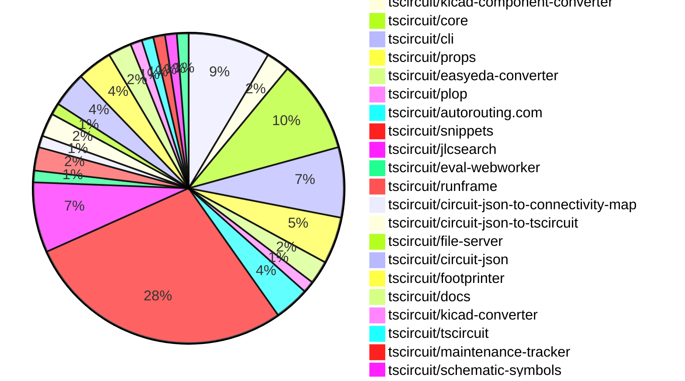

# contribution-tracker

Generates weekly contribution overviews for tscircuit contributors. Check out all
the [contribution overviews here](./contribution-overviews/)

* All PRs in the tscircuit org are scanned/summarized via Claude Haiku
* Claude classifies each Diff/PR as a Major, Minor or Tiny contribution
* All the PRs, summaries, and classifications are organized into charts and tables

The current week is shown below. There are 3 major sections:

* [Contributor Overview](#contributor-overview)
* [PRs by Repository](#prs-by-repository)
* [PRs by Contributor](#changes-by-contributor)

## Current Week

<!-- START_CURRENT_WEEK -->

# Contribution Overview 2025-01-01

## PRs by Repository

## Contributor Overview

| Contributor | 🐳 Major | 🐙 Minor | 🐌 Tiny | ⭐ | Issues Created |
|-------------|---------|---------|---------|-----|----------------|
| [seveibar](#seveibar) | 8 | 29 | 2 | 👑👑👑 | 61 |
| [Anshgrover23](#Anshgrover23) | 4 | 13 | 2 | ⭐⭐⭐ | 12 |
| [ShiboSoftwareDev](#ShiboSoftwareDev) | 2 | 4 | 0 | ⭐⭐ | 11 |
| [Abse2001](#Abse2001) | 2 | 5 | 0 | ⭐⭐ | 2 |
| [techmannih](#techmannih) | 1 | 3 | 1 | ⭐⭐ | 2 |
| [devin-ai-integration[bot]](#devin-ai-integration[bot]) | 0 | 1 | 0 |  | 0 |
| [DrSensor](#DrSensor) | 0 | 1 | 0 |  | 0 |
| [krushnarout](#krushnarout) | 0 | 1 | 0 |  | 0 |
| [oldbear26](#oldbear26) | 0 | 0 | 1 |  | 0 |

## Review Table

[reviews-received-hover]: ## "Number of reviews received for PRs for this contributor"
[approvals-received-hover]: ## "Number of approvals received for PRs this contributor authored"
[rejections-received-hover]: ## "Number of rejections received for PRs this contributor authored"
[prs-opened-hover]: ## "Number of PRs opened by this contributor"
[issues-created-hover]: ## "Number of issues created by this contributor"
[bountied-issues-hover]: ## "Number of issues this contributor created with a bounty"
[bountied-issue-$-hover]: ## "Total bounty amount placed on issues authored by this contributor"

| Contributor | Reviews Received | Approvals Received | Rejections Received | Approvals | Rejections | PRs Opened | PRs Merged | Issues Created | Bountied Issues | Bountied Issue $ |
|---|---|---|---|---|---|---|---|---|---|---|
| [seveibar](#seveibar) | 1 | 0 | 0 | 42 | 13 | 43 | 40 | 61 | 35 | 506 |
| [Abse2001](#Abse2001) | 34 | 7 | 0 | 4 | 5 | 10 | 7 | 2 | 0 | 0 |
| [DrSensor](#DrSensor) | 1 | 1 | 0 | 0 | 0 | 1 | 1 | 0 | 0 | 0 |
| [Anshgrover23](#Anshgrover23) | 55 | 20 | 15 | 0 | 6 | 26 | 20 | 12 | 1 | 4 |
| [techmannih](#techmannih) | 17 | 8 | 6 | 0 | 0 | 9 | 5 | 2 | 0 | 0 |
| [ShiboSoftwareDev](#ShiboSoftwareDev) | 9 | 7 | 1 | 0 | 2 | 8 | 6 | 11 | 6 | 67 |
| [devin-ai-integration[bot]](#devin-ai-integration[bot]) | 3 | 1 | 2 | 0 | 0 | 3 | 1 | 0 | 0 | 0 |
| [oldbear26](#oldbear26) | 4 | 1 | 1 | 0 | 0 | 2 | 1 | 0 | 0 | 0 |
| [krushnarout](#krushnarout) | 2 | 1 | 1 | 0 | 0 | 2 | 1 | 0 | 0 | 0 |

## Changes by Repository

### [tscircuit/pcb-viewer](https://github.com/tscircuit/pcb-viewer)

| PR # | Impact | Contributor | Description |
|------|--------|-------------|-------------|
| [#115](https://github.com/tscircuit/pcb-viewer/pull/115) | 🐳 Major | seveibar | Adds a large LED matrix circuit JSON file and fixes memoization in the PCBViewer component. |
| [#110](https://github.com/tscircuit/pcb-viewer/pull/110) | 🐳 Major | Abse2001 | Introduced a View dropdown to improve trace visibility control and enhanced algorithms to filter and display only traces with max_length by default. |
| [#122](https://github.com/tscircuit/pcb-viewer/pull/122) | 🐙 Minor | seveibar | Update the `use-mouse-matrix-transform` dependency to version 1.3.0 for better ESM compatibility. |
| [#121](https://github.com/tscircuit/pcb-viewer/pull/121) | 🐙 Minor | seveibar | Change the build script to use `--platform browser` to build for the browser, avoiding the need to import `webcrypto`. |
| [#105](https://github.com/tscircuit/pcb-viewer/pull/105) | 🐙 Minor | seveibar | Add Renovate configuration to automatically update dependencies (except for @tscircuit/* and circuit-json-to-connectivity-map) and bump circuit-json-to-connectivity-map to version 0.0.18 |
| [#107](https://github.com/tscircuit/pcb-viewer/pull/107) | 🐙 Minor | seveibar | Switches the project to use ESM (ECMAScript Modules) instead of CommonJS, dropping CommonJS support. |
| [#101](https://github.com/tscircuit/pcb-viewer/pull/101) | 🐙 Minor | Abse2001 | Adds a trace length tooltip and handles when the trace length exceeds the maximum length. |

### [tscircuit/kicad-component-converter](https://github.com/tscircuit/kicad-component-converter)

| PR # | Impact | Contributor | Description |
|------|--------|-------------|-------------|
| [#110](https://github.com/tscircuit/kicad-component-converter/pull/110) | 🐳 Major | seveibar | Converts Kicad Mod into Circuit Json on website. |
| [#112](https://github.com/tscircuit/kicad-component-converter/pull/112) | 🐙 Minor | seveibar | Adds a button to open the generated TSCircuit code in a code snippets website |

### [tscircuit/core](https://github.com/tscircuit/core)

| PR # | Impact | Contributor | Description |
|------|--------|-------------|-------------|
| [#480](https://github.com/tscircuit/core/pull/480) | 🐳 Major | seveibar | Allow duplicate port hints for overlapping PCB primitive elements, which fixes some KiCad conversion issues. |
| [#475](https://github.com/tscircuit/core/pull/475) | 🐳 Major | seveibar | Adds support for non-numeric pin labels in the schPinStyle property and introduces a new function to handle the conversion to a numeric pin style format. |
| [#481](https://github.com/tscircuit/core/pull/481) | 🐳 Major | ShiboSoftwareDev | Implement MOSFET component |
| [#489](https://github.com/tscircuit/core/pull/489) | 🐙 Minor | seveibar | Avoid calling PcbRouteNetIslands when routing is disabled and export types from Renderable. |
| [#488](https://github.com/tscircuit/core/pull/488) | 🐙 Minor | seveibar | Renames `asyncEffectComplete` event to `asyncEffect:end`, adds `asyncEffect:start` event, and refactors the emit function for clarity. |
| [#487](https://github.com/tscircuit/core/pull/487) | 🐙 Minor | Abse2001 | Implemented `<board />` `outlineOffsetX` and `outlineOffsetY` properties to allow offsetting the board outline. |
| [#479](https://github.com/tscircuit/core/pull/479) | 🐙 Minor | Abse2001 | Added a new function `getTraceDisplayName` to generate display names for traces based on connected ports and nets. |
| [#478](https://github.com/tscircuit/core/pull/478) | 🐙 Minor | Anshgrover23 | Adds a new property `noSchematicRepresentation` to the `Chip` component to allow skipping the schematic rendering. |

### [tscircuit/cli](https://github.com/tscircuit/cli)

| PR # | Impact | Contributor | Description |
|------|--------|-------------|-------------|
| [#16](https://github.com/tscircuit/cli/pull/16) | 🐳 Major | seveibar | Adds a new command "export" to the CLI that allows exporting circuit information in various formats like JSON, SVG, and GLTF. |
| [#12](https://github.com/tscircuit/cli/pull/12) | 🐳 Major | seveibar | Introduces authentication and configuration handling for the CLI, preparing for future feature additions like snippets sync. |
| [#15](https://github.com/tscircuit/cli/pull/15) | 🐙 Minor | seveibar | Refactor for DevServer class state management, add basic test for DevServer initialization, and add File Server API Types. |
| [#13](https://github.com/tscircuit/cli/pull/13) | 🐙 Minor | seveibar | Adds a new "clone" command to the CLI, allowing users to quickly download code snippets from the registry. |
| [#11](https://github.com/tscircuit/cli/pull/11) | 🟣 | seveibar | Fix Module Import issue in cli build |
| [#10](https://github.com/tscircuit/cli/pull/10) | 🐳 Major | seveibar | Adds support for drag and drop functionality in the schematic editor and dynamic loading of the runframe library. |

### [tscircuit/props](https://github.com/tscircuit/props)

| PR # | Impact | Contributor | Description |
|------|--------|-------------|-------------|
| [#144](https://github.com/tscircuit/props/pull/144) | 🐙 Minor | seveibar | Rename `pcbOffsetX` and `pcbOffsetY` to `outlineOffsetX` and `outlineOffsetY` respectively in the `board` component. |
| [#141](https://github.com/tscircuit/props/pull/141) | 🐙 Minor | Anshgrover23 | Add a new property `noSchematicRepresentation` to the `chipProps` type. |
| [#138](https://github.com/tscircuit/props/pull/138) | 🐙 Minor | ShiboSoftwareDev | Modifies the `mosfet` component to use more specific channel type and mode properties, and adds a list of MOSFET pins. |
| [#143](https://github.com/tscircuit/props/pull/143) | 🐙 Minor | devin-ai-integration[bot] | Add `pcbOffsetX` and `pcbOffsetY` properties to the board component to allow offsetting the board's PCB position on the X and Y axes. |

### [tscircuit/easyeda-converter](https://github.com/tscircuit/easyeda-converter)

| PR # | Impact | Contributor | Description |
|------|--------|-------------|-------------|
| [#146](https://github.com/tscircuit/easyeda-converter/pull/146) | 🐙 Minor | seveibar | Add support for parsing silkscreen text |
| [#141](https://github.com/tscircuit/easyeda-converter/pull/141) | 🐙 Minor | seveibar | Adds instructions to the README.md file for adding a new part test |

### [tscircuit/plop](https://github.com/tscircuit/plop)

| PR # | Impact | Contributor | Description |
|------|--------|-------------|-------------|
| [#7](https://github.com/tscircuit/plop/pull/7) | 🐙 Minor | seveibar | Allow bot token for bypassing branch protection on version commit |

### [tscircuit/autorouting.com](https://github.com/tscircuit/autorouting.com)

| PR # | Impact | Contributor | Description |
|------|--------|-------------|-------------|
| [#14](https://github.com/tscircuit/autorouting.com/pull/14) | 🐙 Minor | seveibar | Reverts the addition of the main logo animation. |
| [#16](https://github.com/tscircuit/autorouting.com/pull/16) | 🐙 Minor | Anshgrover23 | Add an autorouting animation on the main page. |
| [#13](https://github.com/tscircuit/autorouting.com/pull/13) | 🐙 Minor | Anshgrover23 | Add a main logo animation to the homepage |

### [tscircuit/snippets](https://github.com/tscircuit/snippets)

| PR # | Impact | Contributor | Description |
|------|--------|-------------|-------------|
| [#484](https://github.com/tscircuit/snippets/pull/484) | 🐳 Major | Abse2001 | Adds AI-driven auto-completion feature to the CodeEditor component using the Codeium library. |
| [#498](https://github.com/tscircuit/snippets/pull/498) | 🐳 Major | ShiboSoftwareDev | Enhances the footprint dialog by improving functionality and user experience. |
| [#506](https://github.com/tscircuit/snippets/pull/506) | 🐙 Minor | seveibar | Update the pcb-viewer package and fix alternate registry handling with special CORS handling. |
| [#505](https://github.com/tscircuit/snippets/pull/505) | 🐙 Minor | seveibar | Adds a retry mechanism to use an alternate registry server when the primary registry server returns a 413 (Request Entity Too Large) error. |
| [#503](https://github.com/tscircuit/snippets/pull/503) | 🐙 Minor | seveibar | Adds a fallback to a non-Vercel URL for updating code snippets when the request payload is too large to be handled by Vercel. |
| [#502](https://github.com/tscircuit/snippets/pull/502) | 🐙 Minor | seveibar | Adds support for downloading GLTF (GL Transmission Format) files from the circuit viewer. |
| [#493](https://github.com/tscircuit/snippets/pull/493) | 🐙 Minor | seveibar | Improves the search component by adding a new feature to handle links with new tab opening, and updates the layout and styling of the search results. |
| [#487](https://github.com/tscircuit/snippets/pull/487) | 🐙 Minor | seveibar | Revert a previous change that fixed card misalignment. |
| [#488](https://github.com/tscircuit/snippets/pull/488) | 🐙 Minor | seveibar | Fix the determination of the `snippetType` property to handle cases where `templateFromUrl` is null. |
| [#468](https://github.com/tscircuit/snippets/pull/468) | 🐙 Minor | seveibar | Improves the layout and display of bullet points on the landing page for mobile devices. |
| [#463](https://github.com/tscircuit/snippets/pull/463) | 🐙 Minor | seveibar | Adds analytics tracking with Vercel Analytics and Posthog, and improves the handling of unsaved changes in the CodeAndPreview component. |
| [#492](https://github.com/tscircuit/snippets/pull/492) | 🐙 Minor | Anshgrover23 | Fixes the selector used to click on the ellipsis button in the update description test. |
| [#490](https://github.com/tscircuit/snippets/pull/490) | 🐙 Minor | Anshgrover23 | Fix for all the tests and skipping manual edits for now |
| [#482](https://github.com/tscircuit/snippets/pull/482) | 🐙 Minor | Anshgrover23 | Adds a new feature to download KiCad PCB files from the existing circuit JSON data. |
| [#460](https://github.com/tscircuit/snippets/pull/460) | 🐙 Minor | Anshgrover23 | Fix the search component to handle search results with a scrollable container |
| [#458](https://github.com/tscircuit/snippets/pull/458) | 🐙 Minor | Anshgrover23 | Fixes Playwright tests by updating wait conditions and click actions. |
| [#489](https://github.com/tscircuit/snippets/pull/489) | 🐙 Minor | techmannih | Fix the alignment of the landing page cards |
| [#478](https://github.com/tscircuit/snippets/pull/478) | 🐙 Minor | techmannih | Fix card misalignment by adding a hover effect and adjusting the height to be "full". |
| [#475](https://github.com/tscircuit/snippets/pull/475) | 🐙 Minor | techmannih | Adds a download button for the Assembly SVG in the DownloadButtonAndMenu component. |
| [#465](https://github.com/tscircuit/snippets/pull/465) | 🐙 Minor | krushnarout | Adds a new button on the landing page to show the user's profile menu. |
| [#483](https://github.com/tscircuit/snippets/pull/483) | 🐌 Tiny | seveibar | Fix Discord link in header component |
| [#472](https://github.com/tscircuit/snippets/pull/472) | 🐌 Tiny | Anshgrover23 | Adds Algora bounty badges to the README.md file. |
| [#500](https://github.com/tscircuit/snippets/pull/500) | 🐌 Tiny | oldbear26 | Add type declaration for manual-edits.json in ATA |

### [tscircuit/jlcsearch](https://github.com/tscircuit/jlcsearch)

| PR # | Impact | Contributor | Description |
|------|--------|-------------|-------------|
| [#25](https://github.com/tscircuit/jlcsearch/pull/25) | 🐳 Major | Anshgrover23 | Adds a new table for LCD display modules, including fields for package, display size, resolution, and display type. The new table is integrated into the application's routes and UI. |
| [#23](https://github.com/tscircuit/jlcsearch/pull/23) | 🐳 Major | Anshgrover23 | Adds a new derived table for LED Dot Matrix Display Modules, including a new route and page for listing these components. |
| [#22](https://github.com/tscircuit/jlcsearch/pull/22) | 🐳 Major | Anshgrover23 | Adds a new page for OLED Display modules, including filtering options and a table to display the module details. |
| [#24](https://github.com/tscircuit/jlcsearch/pull/24) | 🐳 Major | Anshgrover23 | Adds a new derived table for LED Segment Display Modules, including columns for package, positions, type, size, and color. |
| [#16](https://github.com/tscircuit/jlcsearch/pull/16) | 🐙 Minor | seveibar | Adds the PostHog analytics script to the web application. |
| [#14](https://github.com/tscircuit/jlcsearch/pull/14) | 🟣 | Anshgrover23 |  |

### [tscircuit/eval-webworker](https://github.com/tscircuit/eval-webworker)

| PR # | Impact | Contributor | Description |
|------|--------|-------------|-------------|
| [#62](https://github.com/tscircuit/eval-webworker/pull/62) | 🐙 Minor | seveibar | The pull request fixes the event listening mechanism by rebinding the event listeners to the circuit when it is created or executed. |

### [tscircuit/runframe](https://github.com/tscircuit/runframe)

| PR # | Impact | Contributor | Description |
|------|--------|-------------|-------------|
| [#111](https://github.com/tscircuit/runframe/pull/111) | 🐙 Minor | seveibar |  |
| [#108](https://github.com/tscircuit/runframe/pull/108) | 🐙 Minor | seveibar | Add a new "Render Log" tab to the CircuitJsonPreview component. |

### [tscircuit/circuit-json-to-connectivity-map](https://github.com/tscircuit/circuit-json-to-connectivity-map)

| PR # | Impact | Contributor | Description |
|------|--------|-------------|-------------|
| [#7](https://github.com/tscircuit/circuit-json-to-connectivity-map/pull/7) | 🐌 Tiny | seveibar | Update the version of the `@tscircuit/math-utils` dependency. |

### [tscircuit/circuit-json-to-tscircuit](https://github.com/tscircuit/circuit-json-to-tscircuit)

| PR # | Impact | Contributor | Description |
|------|--------|-------------|-------------|
| [#2](https://github.com/tscircuit/circuit-json-to-tscircuit/pull/2) | 🐳 Major | seveibar | Adds initial GitHub workflows for format checking, type checking, testing, and publishing to npm. |
| [#3](https://github.com/tscircuit/circuit-json-to-tscircuit/pull/3) | 🐙 Minor | seveibar | Adds more information to the README and removes empty lines from the output. |

### [tscircuit/file-server](https://github.com/tscircuit/file-server)

| PR # | Impact | Contributor | Description |
|------|--------|-------------|-------------|
| [#4](https://github.com/tscircuit/file-server/pull/4) | 🐙 Minor | seveibar | Refactor Event name, start lib exports, add initiator support |

### [tscircuit/circuit-json](https://github.com/tscircuit/circuit-json)

| PR # | Impact | Contributor | Description |
|------|--------|-------------|-------------|
| [#115](https://github.com/tscircuit/circuit-json/pull/115) | 🐙 Minor | Abse2001 | Added an optional `display_name` property to the `source_trace` object. |
| [#119](https://github.com/tscircuit/circuit-json/pull/119) | 🐙 Minor | Anshgrover23 | Fixes an issue with rounding of capacitance values to ensure accurate representation. |
| [#116](https://github.com/tscircuit/circuit-json/pull/116) | 🐙 Minor | ShiboSoftwareDev | Added a new circuit element called "simple_mosfet" to the codebase. |

### [tscircuit/footprinter](https://github.com/tscircuit/footprinter)

| PR # | Impact | Contributor | Description |
|------|--------|-------------|-------------|
| [#108](https://github.com/tscircuit/footprinter/pull/108) | 🐙 Minor | Abse2001 | Fixes a bug in the `quad` component by setting the default value of the `legsoutside` parameter to `false`. |
| [#105](https://github.com/tscircuit/footprinter/pull/105) | 🐙 Minor | ShiboSoftwareDev | Change the data type of the `pushbutton` parameters from `number` to `length`. |
| [#104](https://github.com/tscircuit/footprinter/pull/104) | 🐙 Minor | ShiboSoftwareDev | Removed `num_pins` literal type from `axial`, updated `pushbutton` properties to use `z.number()` instead of literal types, and updated `quad` properties to use `z.boolean()` instead of literal types. |

### [tscircuit/docs](https://github.com/tscircuit/docs)

| PR # | Impact | Contributor | Description |
|------|--------|-------------|-------------|
| [#53](https://github.com/tscircuit/docs/pull/53) | 🐙 Minor | Anshgrover23 | Adds documentation for new components (transistor, inductor, LED, modified trace, and power source) and provides example usage. |
| [#46](https://github.com/tscircuit/docs/pull/46) | 🐌 Tiny | techmannih | Typo and terminology clarification in the description of the "trace" component |

### [tscircuit/kicad-converter](https://github.com/tscircuit/kicad-converter)

| PR # | Impact | Contributor | Description |
|------|--------|-------------|-------------|
| [#12](https://github.com/tscircuit/kicad-converter/pull/12) | 🐙 Minor | Anshgrover23 | Add support for kicad-pro module in the index file. |

### [tscircuit/tscircuit](https://github.com/tscircuit/tscircuit)

| PR # | Impact | Contributor | Description |
|------|--------|-------------|-------------|
| [#493](https://github.com/tscircuit/tscircuit/pull/493) | 🐌 Tiny | Anshgrover23 | Added Algora badges to the README.md file. |

### [tscircuit/maintenance-tracker](https://github.com/tscircuit/maintenance-tracker)

| PR # | Impact | Contributor | Description |
|------|--------|-------------|-------------|
| [#4](https://github.com/tscircuit/maintenance-tracker/pull/4) | 🐙 Minor | Anshgrover23 | Treat skipped checks as success checks |

### [tscircuit/schematic-symbols](https://github.com/tscircuit/schematic-symbols)

| PR # | Impact | Contributor | Description |
|------|--------|-------------|-------------|
| [#231](https://github.com/tscircuit/schematic-symbols/pull/231) | 🐳 Major | techmannih | Introduces a new opamp symbol in two variants (with and without power). |

### [tscircuit/3d-viewer](https://github.com/tscircuit/3d-viewer)

| PR # | Impact | Contributor | Description |
|------|--------|-------------|-------------|
| [#96](https://github.com/tscircuit/3d-viewer/pull/96) | 🐙 Minor | DrSensor | Add hooks for exporting to gltf |

## Changes by Contributor

### [seveibar](https://github.com/seveibar)

| PR # | Impact | Description |
|------|--------|-------------|
| [#115](https://github.com/tscircuit/pcb-viewer/pull/115) | 🐳 Major | Adds a large LED matrix circuit JSON file and fixes memoization in the PCBViewer component. |
| [#110](https://github.com/tscircuit/kicad-component-converter/pull/110) | 🐳 Major | Converts Kicad Mod into Circuit Json on website. |
| [#480](https://github.com/tscircuit/core/pull/480) | 🐳 Major | Allow duplicate port hints for overlapping PCB primitive elements, which fixes some KiCad conversion issues. |
| [#475](https://github.com/tscircuit/core/pull/475) | 🐳 Major | Adds support for non-numeric pin labels in the schPinStyle property and introduces a new function to handle the conversion to a numeric pin style format. |
| [#16](https://github.com/tscircuit/cli/pull/16) | 🐳 Major | Adds a new command "export" to the CLI that allows exporting circuit information in various formats like JSON, SVG, and GLTF. |
| [#12](https://github.com/tscircuit/cli/pull/12) | 🐳 Major | Introduces authentication and configuration handling for the CLI, preparing for future feature additions like snippets sync. |
| [#122](https://github.com/tscircuit/pcb-viewer/pull/122) | 🐙 Minor | Update the `use-mouse-matrix-transform` dependency to version 1.3.0 for better ESM compatibility. |
| [#121](https://github.com/tscircuit/pcb-viewer/pull/121) | 🐙 Minor | Change the build script to use `--platform browser` to build for the browser, avoiding the need to import `webcrypto`. |
| [#105](https://github.com/tscircuit/pcb-viewer/pull/105) | 🐙 Minor | Add Renovate configuration to automatically update dependencies (except for @tscircuit/* and circuit-json-to-connectivity-map) and bump circuit-json-to-connectivity-map to version 0.0.18 |
| [#107](https://github.com/tscircuit/pcb-viewer/pull/107) | 🐙 Minor | Switches the project to use ESM (ECMAScript Modules) instead of CommonJS, dropping CommonJS support. |
| [#144](https://github.com/tscircuit/props/pull/144) | 🐙 Minor | Rename `pcbOffsetX` and `pcbOffsetY` to `outlineOffsetX` and `outlineOffsetY` respectively in the `board` component. |
| [#112](https://github.com/tscircuit/kicad-component-converter/pull/112) | 🐙 Minor | Adds a button to open the generated TSCircuit code in a code snippets website |
| [#146](https://github.com/tscircuit/easyeda-converter/pull/146) | 🐙 Minor | Add support for parsing silkscreen text |
| [#141](https://github.com/tscircuit/easyeda-converter/pull/141) | 🐙 Minor | Adds instructions to the README.md file for adding a new part test |
| [#489](https://github.com/tscircuit/core/pull/489) | 🐙 Minor | Avoid calling PcbRouteNetIslands when routing is disabled and export types from Renderable. |
| [#488](https://github.com/tscircuit/core/pull/488) | 🐙 Minor | Renames `asyncEffectComplete` event to `asyncEffect:end`, adds `asyncEffect:start` event, and refactors the emit function for clarity. |
| [#7](https://github.com/tscircuit/plop/pull/7) | 🐙 Minor | Allow bot token for bypassing branch protection on version commit |
| [#14](https://github.com/tscircuit/autorouting.com/pull/14) | 🐙 Minor | Reverts the addition of the main logo animation. |
| [#506](https://github.com/tscircuit/snippets/pull/506) | 🐙 Minor | Update the pcb-viewer package and fix alternate registry handling with special CORS handling. |
| [#505](https://github.com/tscircuit/snippets/pull/505) | 🐙 Minor | Adds a retry mechanism to use an alternate registry server when the primary registry server returns a 413 (Request Entity Too Large) error. |
| [#503](https://github.com/tscircuit/snippets/pull/503) | 🐙 Minor | Adds a fallback to a non-Vercel URL for updating code snippets when the request payload is too large to be handled by Vercel. |
| [#502](https://github.com/tscircuit/snippets/pull/502) | 🐙 Minor | Adds support for downloading GLTF (GL Transmission Format) files from the circuit viewer. |
| [#493](https://github.com/tscircuit/snippets/pull/493) | 🐙 Minor | Improves the search component by adding a new feature to handle links with new tab opening, and updates the layout and styling of the search results. |
| [#487](https://github.com/tscircuit/snippets/pull/487) | 🐙 Minor | Revert a previous change that fixed card misalignment. |
| [#488](https://github.com/tscircuit/snippets/pull/488) | 🐙 Minor | Fix the determination of the `snippetType` property to handle cases where `templateFromUrl` is null. |
| [#468](https://github.com/tscircuit/snippets/pull/468) | 🐙 Minor | Improves the layout and display of bullet points on the landing page for mobile devices. |
| [#463](https://github.com/tscircuit/snippets/pull/463) | 🐙 Minor | Adds analytics tracking with Vercel Analytics and Posthog, and improves the handling of unsaved changes in the CodeAndPreview component. |
| [#16](https://github.com/tscircuit/jlcsearch/pull/16) | 🐙 Minor | Adds the PostHog analytics script to the web application. |
| [#62](https://github.com/tscircuit/eval-webworker/pull/62) | 🐙 Minor | The pull request fixes the event listening mechanism by rebinding the event listeners to the circuit when it is created or executed. |
| [#111](https://github.com/tscircuit/runframe/pull/111) | 🐙 Minor |  |
| [#108](https://github.com/tscircuit/runframe/pull/108) | 🐙 Minor | Add a new "Render Log" tab to the CircuitJsonPreview component. |
| [#15](https://github.com/tscircuit/cli/pull/15) | 🐙 Minor | Refactor for DevServer class state management, add basic test for DevServer initialization, and add File Server API Types. |
| [#13](https://github.com/tscircuit/cli/pull/13) | 🐙 Minor | Adds a new "clone" command to the CLI, allowing users to quickly download code snippets from the registry. |
| [#7](https://github.com/tscircuit/circuit-json-to-connectivity-map/pull/7) | 🐌 Tiny | Update the version of the `@tscircuit/math-utils` dependency. |
| [#483](https://github.com/tscircuit/snippets/pull/483) | 🐌 Tiny | Fix Discord link in header component |
| [#11](https://github.com/tscircuit/cli/pull/11) | 🟣 | Fix Module Import issue in cli build |
| [#10](https://github.com/tscircuit/cli/pull/10) | 🐳 Major | Adds support for drag and drop functionality in the schematic editor and dynamic loading of the runframe library. |
| [#2](https://github.com/tscircuit/circuit-json-to-tscircuit/pull/2) | 🐳 Major | Adds initial GitHub workflows for format checking, type checking, testing, and publishing to npm. |
| [#4](https://github.com/tscircuit/file-server/pull/4) | 🐙 Minor | Refactor Event name, start lib exports, add initiator support |
| [#3](https://github.com/tscircuit/circuit-json-to-tscircuit/pull/3) | 🐙 Minor | Adds more information to the README and removes empty lines from the output. |

### [Abse2001](https://github.com/Abse2001)

| PR # | Impact | Description |
|------|--------|-------------|
| [#110](https://github.com/tscircuit/pcb-viewer/pull/110) | 🐳 Major | Introduced a View dropdown to improve trace visibility control and enhanced algorithms to filter and display only traces with max_length by default. |
| [#484](https://github.com/tscircuit/snippets/pull/484) | 🐳 Major | Adds AI-driven auto-completion feature to the CodeEditor component using the Codeium library. |
| [#101](https://github.com/tscircuit/pcb-viewer/pull/101) | 🐙 Minor | Adds a trace length tooltip and handles when the trace length exceeds the maximum length. |
| [#115](https://github.com/tscircuit/circuit-json/pull/115) | 🐙 Minor | Added an optional `display_name` property to the `source_trace` object. |
| [#108](https://github.com/tscircuit/footprinter/pull/108) | 🐙 Minor | Fixes a bug in the `quad` component by setting the default value of the `legsoutside` parameter to `false`. |
| [#487](https://github.com/tscircuit/core/pull/487) | 🐙 Minor | Implemented `<board />` `outlineOffsetX` and `outlineOffsetY` properties to allow offsetting the board outline. |
| [#479](https://github.com/tscircuit/core/pull/479) | 🐙 Minor | Added a new function `getTraceDisplayName` to generate display names for traces based on connected ports and nets. |

### [Anshgrover23](https://github.com/Anshgrover23)

| PR # | Impact | Description |
|------|--------|-------------|
| [#25](https://github.com/tscircuit/jlcsearch/pull/25) | 🐳 Major | Adds a new table for LCD display modules, including fields for package, display size, resolution, and display type. The new table is integrated into the application's routes and UI. |
| [#23](https://github.com/tscircuit/jlcsearch/pull/23) | 🐳 Major | Adds a new derived table for LED Dot Matrix Display Modules, including a new route and page for listing these components. |
| [#22](https://github.com/tscircuit/jlcsearch/pull/22) | 🐳 Major | Adds a new page for OLED Display modules, including filtering options and a table to display the module details. |
| [#24](https://github.com/tscircuit/jlcsearch/pull/24) | 🐳 Major | Adds a new derived table for LED Segment Display Modules, including columns for package, positions, type, size, and color. |
| [#119](https://github.com/tscircuit/circuit-json/pull/119) | 🐙 Minor | Fixes an issue with rounding of capacitance values to ensure accurate representation. |
| [#53](https://github.com/tscircuit/docs/pull/53) | 🐙 Minor | Adds documentation for new components (transistor, inductor, LED, modified trace, and power source) and provides example usage. |
| [#141](https://github.com/tscircuit/props/pull/141) | 🐙 Minor | Add a new property `noSchematicRepresentation` to the `chipProps` type. |
| [#478](https://github.com/tscircuit/core/pull/478) | 🐙 Minor | Adds a new property `noSchematicRepresentation` to the `Chip` component to allow skipping the schematic rendering. |
| [#16](https://github.com/tscircuit/autorouting.com/pull/16) | 🐙 Minor | Add an autorouting animation on the main page. |
| [#13](https://github.com/tscircuit/autorouting.com/pull/13) | 🐙 Minor | Add a main logo animation to the homepage |
| [#12](https://github.com/tscircuit/kicad-converter/pull/12) | 🐙 Minor | Add support for kicad-pro module in the index file. |
| [#492](https://github.com/tscircuit/snippets/pull/492) | 🐙 Minor | Fixes the selector used to click on the ellipsis button in the update description test. |
| [#490](https://github.com/tscircuit/snippets/pull/490) | 🐙 Minor | Fix for all the tests and skipping manual edits for now |
| [#482](https://github.com/tscircuit/snippets/pull/482) | 🐙 Minor | Adds a new feature to download KiCad PCB files from the existing circuit JSON data. |
| [#460](https://github.com/tscircuit/snippets/pull/460) | 🐙 Minor | Fix the search component to handle search results with a scrollable container |
| [#458](https://github.com/tscircuit/snippets/pull/458) | 🐙 Minor | Fixes Playwright tests by updating wait conditions and click actions. |
| [#493](https://github.com/tscircuit/tscircuit/pull/493) | 🐌 Tiny | Added Algora badges to the README.md file. |
| [#472](https://github.com/tscircuit/snippets/pull/472) | 🐌 Tiny | Adds Algora bounty badges to the README.md file. |
| [#14](https://github.com/tscircuit/jlcsearch/pull/14) | 🟣 |  |
| [#4](https://github.com/tscircuit/maintenance-tracker/pull/4) | 🐙 Minor | Treat skipped checks as success checks |

### [ShiboSoftwareDev](https://github.com/ShiboSoftwareDev)

| PR # | Impact | Description |
|------|--------|-------------|
| [#481](https://github.com/tscircuit/core/pull/481) | 🐳 Major | Implement MOSFET component |
| [#498](https://github.com/tscircuit/snippets/pull/498) | 🐳 Major | Enhances the footprint dialog by improving functionality and user experience. |
| [#116](https://github.com/tscircuit/circuit-json/pull/116) | 🐙 Minor | Added a new circuit element called "simple_mosfet" to the codebase. |
| [#138](https://github.com/tscircuit/props/pull/138) | 🐙 Minor | Modifies the `mosfet` component to use more specific channel type and mode properties, and adds a list of MOSFET pins. |
| [#105](https://github.com/tscircuit/footprinter/pull/105) | 🐙 Minor | Change the data type of the `pushbutton` parameters from `number` to `length`. |
| [#104](https://github.com/tscircuit/footprinter/pull/104) | 🐙 Minor | Removed `num_pins` literal type from `axial`, updated `pushbutton` properties to use `z.number()` instead of literal types, and updated `quad` properties to use `z.boolean()` instead of literal types. |

### [techmannih](https://github.com/techmannih)

| PR # | Impact | Description |
|------|--------|-------------|
| [#231](https://github.com/tscircuit/schematic-symbols/pull/231) | 🐳 Major | Introduces a new opamp symbol in two variants (with and without power). |
| [#489](https://github.com/tscircuit/snippets/pull/489) | 🐙 Minor | Fix the alignment of the landing page cards |
| [#478](https://github.com/tscircuit/snippets/pull/478) | 🐙 Minor | Fix card misalignment by adding a hover effect and adjusting the height to be "full". |
| [#475](https://github.com/tscircuit/snippets/pull/475) | 🐙 Minor | Adds a download button for the Assembly SVG in the DownloadButtonAndMenu component. |
| [#46](https://github.com/tscircuit/docs/pull/46) | 🐌 Tiny | Typo and terminology clarification in the description of the "trace" component |

### [devin-ai-integration[bot]](https://github.com/devin-ai-integration[bot])

| PR # | Impact | Description |
|------|--------|-------------|
| [#143](https://github.com/tscircuit/props/pull/143) | 🐙 Minor | Add `pcbOffsetX` and `pcbOffsetY` properties to the board component to allow offsetting the board's PCB position on the X and Y axes. |

### [DrSensor](https://github.com/DrSensor)

| PR # | Impact | Description |
|------|--------|-------------|
| [#96](https://github.com/tscircuit/3d-viewer/pull/96) | 🐙 Minor | Add hooks for exporting to gltf |

### [oldbear26](https://github.com/oldbear26)

| PR # | Impact | Description |
|------|--------|-------------|
| [#500](https://github.com/tscircuit/snippets/pull/500) | 🐌 Tiny | Add type declaration for manual-edits.json in ATA |

### [krushnarout](https://github.com/krushnarout)

| PR # | Impact | Description |
|------|--------|-------------|
| [#465](https://github.com/tscircuit/snippets/pull/465) | 🐙 Minor | Adds a new button on the landing page to show the user's profile menu. |

<!-- END_CURRENT_WEEK -->
