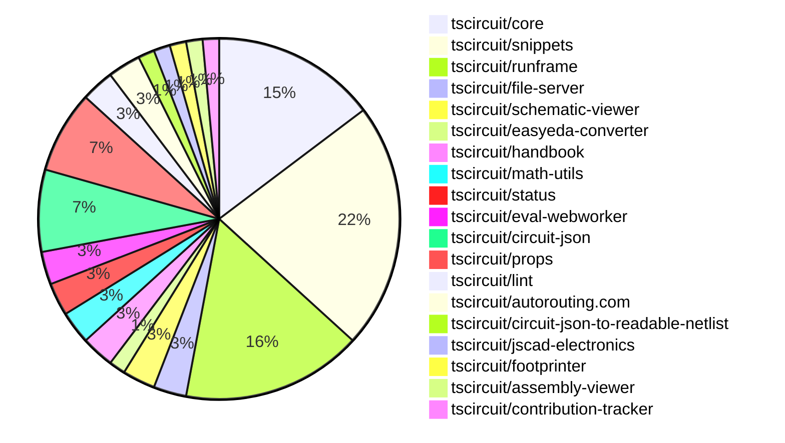

# contribution-tracker

Generates weekly contribution overviews for tscircuit contributors. Check out all
the [contribution overviews here](./contribution-overviews/)

* All PRs in the tscircuit org are scanned/summarized via Claude Haiku
* Claude classifies each Diff/PR as a Major, Minor or Tiny contribution
* All the PRs, summaries, and classifications are organized into charts and tables

The current week is shown below. There are 3 major sections:

* [Contributor Overview](#contributor-overview)
* [PRs by Repository](#prs-by-repository)
* [PRs by Contributor](#changes-by-contributor)

## Current Week

<!-- START_CURRENT_WEEK -->

# Contribution Overview 2024-12-25

## PRs by Repository

## Contributor Overview

| Contributor | 🐳 Major | 🐙 Minor | 🐌 Tiny | ⭐ | Issues Created |
|-------------|---------|---------|---------|-----|----------------|
| [seveibar](#seveibar) | 6 | 25 | 1 | 👑👑👑 | 65 |
| [Anshgrover23](#Anshgrover23) | 2 | 11 | 1 | ⭐⭐⭐ | 8 |
| [ShiboSoftwareDev](#ShiboSoftwareDev) | 1 | 2 | 0 | ⭐⭐⭐ | 13 |
| [Abse2001](#Abse2001) | 0 | 6 | 0 | ⭐⭐ | 3 |
| [AnasSarkiz](#AnasSarkiz) | 1 | 2 | 0 | ⭐⭐ | 4 |
| [devin-ai-integration[bot]](#devin-ai-integration[bot]) | 0 | 4 | 0 | ⭐ | 0 |
| [imrishabh18](#imrishabh18) | 0 | 1 | 0 | ⭐ | 8 |
| [techmannih](#techmannih) | 0 | 3 | 0 | ⭐ | 2 |
| [karthik-nair-20](#karthik-nair-20) | 0 | 1 | 0 |  | 0 |

## Review Table

[reviews-received-hover]: ## "Number of reviews received for PRs for this contributor"
[approvals-received-hover]: ## "Number of approvals received for PRs this contributor authored"
[rejections-received-hover]: ## "Number of rejections received for PRs this contributor authored"
[prs-opened-hover]: ## "Number of PRs opened by this contributor"
[issues-created-hover]: ## "Number of issues created by this contributor"
[bountied-issues-hover]: ## "Number of issues this contributor created with a bounty"
[bountied-issue-$-hover]: ## "Total bounty amount placed on issues authored by this contributor"

| Contributor | Reviews Received | Approvals Received | Rejections Received | Approvals | Rejections | PRs Opened | PRs Merged | Issues Created | Bountied Issues | Bountied Issue $ |
|---|---|---|---|---|---|---|---|---|---|---|
| [seveibar](#seveibar) | 0 | 0 | 0 | 35 | 19 | 35 | 33 | 65 | 30 | 654 |
| [devin-ai-integration[bot]](#devin-ai-integration[bot]) | 7 | 3 | 0 | 0 | 0 | 11 | 4 | 0 | 0 | 0 |
| [Anshgrover23](#Anshgrover23) | 64 | 16 | 15 | 0 | 3 | 21 | 14 | 8 | 0 | 0 |
| [Abse2001](#Abse2001) | 6 | 6 | 0 | 2 | 0 | 6 | 6 | 3 | 3 | 32 |
| [techmannih](#techmannih) | 23 | 4 | 11 | 0 | 0 | 9 | 3 | 2 | 0 | 0 |
| [imrishabh18](#imrishabh18) | 2 | 1 | 0 | 0 | 2 | 2 | 1 | 8 | 3 | 20 |
| [ShiboSoftwareDev](#ShiboSoftwareDev) | 9 | 4 | 0 | 1 | 3 | 5 | 3 | 13 | 6 | 102 |
| [AnasSarkiz](#AnasSarkiz) | 4 | 4 | 0 | 0 | 0 | 3 | 3 | 4 | 2 | 20 |
| [vishwamartur](#vishwamartur) | 1 | 0 | 1 | 0 | 0 | 1 | 0 | 0 | 0 | 0 |
| [abhijitxy](#abhijitxy) | 0 | 0 | 0 | 1 | 0 | 0 | 0 | 0 | 0 | 0 |
| [karthik-nair-20](#karthik-nair-20) | 1 | 1 | 0 | 0 | 0 | 2 | 1 | 0 | 0 | 0 |

## Changes by Repository

### [tscircuit/core](https://github.com/tscircuit/core)

| PR # | Impact | Contributor | Description |
|------|--------|-------------|-------------|
| [#455](https://github.com/tscircuit/core/pull/455) | 🐳 Major | seveibar | Adds support for schematic manual placements |
| [#442](https://github.com/tscircuit/core/pull/442) | 🐳 Major | Anshgrover23 | Adds a new resonator component to the circuit-json project. |
| [#459](https://github.com/tscircuit/core/pull/459) | 🐳 Major | Anshgrover23 | Adds a new component called 'Transistor' to the library. |
| [#470](https://github.com/tscircuit/core/pull/470) | 🐙 Minor | seveibar | Improves the positioning of schematic components and text when manual edits are made. |
| [#468](https://github.com/tscircuit/core/pull/468) | 🐙 Minor | seveibar | Improve error messages in the RootCircuit class |
| [#457](https://github.com/tscircuit/core/pull/457) | 🐙 Minor | seveibar | Adds support for sending the display name to the autorouting server and minor improvements to async expects. |
| [#456](https://github.com/tscircuit/core/pull/456) | 🐙 Minor | seveibar | Rename `Circuit` to `RootCircuit` |
| [#472](https://github.com/tscircuit/core/pull/472) | 🐙 Minor | Abse2001 | Adds support for tracing constraints, specifically the maximum decoupling trace length for capacitors. |
| [#466](https://github.com/tscircuit/core/pull/466) | 🐙 Minor | Anshgrover23 | Add `source_component.display_value` for resistor and capacitor components |
| [#458](https://github.com/tscircuit/core/pull/458) | 🐌 Tiny | seveibar | Add a new `Circuit` export for backwards compatibility. |

### [tscircuit/snippets](https://github.com/tscircuit/snippets)

| PR # | Impact | Contributor | Description |
|------|--------|-------------|-------------|
| [#446](https://github.com/tscircuit/snippets/pull/446) | 🐳 Major | seveibar | Introduces a new landing page for the tscircuit application. |
| [#423](https://github.com/tscircuit/snippets/pull/423) | 🐳 Major | ShiboSoftwareDev | Adds a feature to automatically load development snippets from a registry to the development server. |
| [#454](https://github.com/tscircuit/snippets/pull/454) | 🐙 Minor | seveibar | Introduces a slower animation for the trending snippets carousel and adds a PCB view in the carousel items. |
| [#451](https://github.com/tscircuit/snippets/pull/451) | 🐙 Minor | seveibar | Adds a search component to the header and improves the FAQ section with additional questions and answers. |
| [#442](https://github.com/tscircuit/snippets/pull/442) | 🐙 Minor | seveibar | Improves the SEO (Search Engine Optimization) of the website by adding more relevant title, description, and meta tags. |
| [#438](https://github.com/tscircuit/snippets/pull/438) | 🐙 Minor | seveibar | Add download for readable netlist |
| [#430](https://github.com/tscircuit/snippets/pull/430) | 🐙 Minor | seveibar | Add circuit name for better logs on autorouting server |
| [#452](https://github.com/tscircuit/snippets/pull/452) | 🐙 Minor | Anshgrover23 | Adds the display of the number of stars for each snippet on the user profile page. |
| [#434](https://github.com/tscircuit/snippets/pull/434) | 🐙 Minor | Anshgrover23 | Change the save button to a fork button if the user doesn't own the snippet. |
| [#431](https://github.com/tscircuit/snippets/pull/431) | 🐙 Minor | Anshgrover23 | Fix for playwright-tests failing |
| [#422](https://github.com/tscircuit/snippets/pull/422) | 🐙 Minor | Anshgrover23 | Adds `waitForLoadState` to the `view-snippet.spec.ts` test to ensure the page has fully loaded before interacting with elements. |
| [#439](https://github.com/tscircuit/snippets/pull/439) | 🐙 Minor | devin-ai-integration[bot] | Replace the chat icon with a Discord icon in the header, linking to the join page. |
| [#425](https://github.com/tscircuit/snippets/pull/425) | 🐙 Minor | karthik-nair-20 | Align the EditorNav component to the right side on responsive devices. |
| [#417](https://github.com/tscircuit/snippets/pull/417) | 🐙 Minor | imrishabh18 | Fixes the error thrown when importing an empty manual-edits.json file. |
| [#448](https://github.com/tscircuit/snippets/pull/448) | 🐌 Tiny | Anshgrover23 | Update snapshots of homePage test |

### [tscircuit/runframe](https://github.com/tscircuit/runframe)

| PR # | Impact | Contributor | Description |
|------|--------|-------------|-------------|
| [#73](https://github.com/tscircuit/runframe/pull/73) | 🐳 Major | seveibar | Adds a save snippet button, formalizes events for syncing, and includes various improvements to the sync logic. |
| [#52](https://github.com/tscircuit/runframe/pull/52) | 🐳 Major | seveibar | Adds schematic drag'n'drop support with filesystem syncing via @tscircuit/file-server. |
| [#79](https://github.com/tscircuit/runframe/pull/79) | 🐳 Major | seveibar | Fixes issues with entrypoint change trigger and the order of evaluation and rendering promises. |
| [#84](https://github.com/tscircuit/runframe/pull/84) | 🐙 Minor | seveibar | Update the `@tscircuit/core` and `@tscircuit/eval-webworker` dependencies. |
| [#78](https://github.com/tscircuit/runframe/pull/78) | 🐙 Minor | seveibar | Fix an issue where the `entrypoint` prop in `RunFrame` component was not triggering a re-render. |
| [#77](https://github.com/tscircuit/runframe/pull/77) | 🐙 Minor | seveibar | Adds support for loading initial files via a list and logging for the selected entrypoint. |
| [#76](https://github.com/tscircuit/runframe/pull/76) | 🐙 Minor | seveibar | Updates the default static build target to use the `RunFrameForCli` component and loads initial files via a list before starting. |
| [#75](https://github.com/tscircuit/runframe/pull/75) | 🐙 Minor | seveibar | Change the default static build target from `RunFrameWithApi` to `RunFrameForCli` in the main application file. |
| [#60](https://github.com/tscircuit/runframe/pull/60) | 🐙 Minor | seveibar | Fixes the initialization of `fsMap` when it is an object instead of a `Map` instance. |
| [#48](https://github.com/tscircuit/runframe/pull/48) | 🐙 Minor | seveibar | Adds a new prop `leftHeaderContent` to the `CircuitJsonPreview` and `RunFrame` components to allow displaying content on the left side of the header. |
| [#65](https://github.com/tscircuit/runframe/pull/65) | 🐙 Minor | techmannih | Add assembly view to the circuit component preview |

### [tscircuit/file-server](https://github.com/tscircuit/file-server)

| PR # | Impact | Contributor | Description |
|------|--------|-------------|-------------|
| [#3](https://github.com/tscircuit/file-server/pull/3) | 🐳 Major | seveibar | Adds a new admin page for listing events and improves the admin pages with a centralized dashboard. |
| [#2](https://github.com/tscircuit/file-server/pull/2) | 🐙 Minor | seveibar | Add a new /events/reset route to reset the events in the database. |

### [tscircuit/schematic-viewer](https://github.com/tscircuit/schematic-viewer)

| PR # | Impact | Contributor | Description |
|------|--------|-------------|-------------|
| [#76](https://github.com/tscircuit/schematic-viewer/pull/76) | 🐙 Minor | seveibar | Adds debug statements and ensures the circuit JSON is up-to-date when computing the original center for edit events. |
| [#75](https://github.com/tscircuit/schematic-viewer/pull/75) | 🐙 Minor | seveibar | Change tscircuit dependencies to peer deps to avoid dupes |

### [tscircuit/easyeda-converter](https://github.com/tscircuit/easyeda-converter)

| PR # | Impact | Contributor | Description |
|------|--------|-------------|-------------|
| [#141](https://github.com/tscircuit/easyeda-converter/pull/141) | 🐙 Minor | seveibar | Adds instructions to the README for adding new part tests |

### [tscircuit/handbook](https://github.com/tscircuit/handbook)

| PR # | Impact | Contributor | Description |
|------|--------|-------------|-------------|
| [#6](https://github.com/tscircuit/handbook/pull/6) | 🐙 Minor | seveibar | Adds a new document "learn-git.md" that provides guidance on learning Git and resolving conflicts with the "bun.lockb" file. |
| [#4](https://github.com/tscircuit/handbook/pull/4) | 🐙 Minor | Abse2001 | Added a tutorial for using yalc for local development |

### [tscircuit/math-utils](https://github.com/tscircuit/math-utils)

| PR # | Impact | Contributor | Description |
|------|--------|-------------|-------------|
| [#3](https://github.com/tscircuit/math-utils/pull/3) | 🐙 Minor | seveibar | Adds support for centering the grid and allows specifying total width/height instead of cell dimensions. |
| [#2](https://github.com/tscircuit/math-utils/pull/2) | 🐙 Minor | seveibar | Add support for grid function |

### [tscircuit/status](https://github.com/tscircuit/status)

| PR # | Impact | Contributor | Description |
|------|--------|-------------|-------------|
| [#6](https://github.com/tscircuit/status/pull/6) | 🐙 Minor | seveibar | Filters the outages table to only show outages longer than 15 minutes to prevent flaky health checks from being displayed. |
| [#8](https://github.com/tscircuit/status/pull/8) | 🐙 Minor | devin-ai-integration[bot] | Improve the display of outage durations by showing them in a more human-readable format. |

### [tscircuit/eval-webworker](https://github.com/tscircuit/eval-webworker)

| PR # | Impact | Contributor | Description |
|------|--------|-------------|-------------|
| [#55](https://github.com/tscircuit/eval-webworker/pull/55) | 🟣 | seveibar | Update Core, fix types, and add support for naming the circuit. |
| [#54](https://github.com/tscircuit/eval-webworker/pull/54) | 🐙 Minor | seveibar | Adds type exports for `CircuitWebWorker` and `WebWorkerConfiguration` from the `lib/index.ts` file. |

### [tscircuit/circuit-json](https://github.com/tscircuit/circuit-json)

| PR # | Impact | Contributor | Description |
|------|--------|-------------|-------------|
| [#114](https://github.com/tscircuit/circuit-json/pull/114) | 🐙 Minor | Abse2001 | Added the `max_decoupling_trace_length` property to the `source_simple_capacitor` type. |
| [#113](https://github.com/tscircuit/circuit-json/pull/113) | 🐙 Minor | Abse2001 | Added `trace_length` and `max_length` properties to `pcb_trace` and `source_trace` types respectively. |
| [#111](https://github.com/tscircuit/circuit-json/pull/111) | 🐙 Minor | Anshgrover23 | Add `display_resistance` and `display_capacitance` to the Zod schema for `source_simple_resistor` and `source_simple_capacitor` types. |
| [#103](https://github.com/tscircuit/circuit-json/pull/103) | 🐙 Minor | Anshgrover23 | Add a simple transistor component to the circuit element library. |
| [#105](https://github.com/tscircuit/circuit-json/pull/105) | 🐙 Minor | techmannih | Add a new type of PCB plated hole with a circular hole and a rectangular pad |

### [tscircuit/props](https://github.com/tscircuit/props)

| PR # | Impact | Contributor | Description |
|------|--------|-------------|-------------|
| [#139](https://github.com/tscircuit/props/pull/139) | 🐙 Minor | Abse2001 | Added `maxDecouplingTraceLength` prop to `CapacitorProps` and `maxLength` prop to `TraceProps` |
| [#125](https://github.com/tscircuit/props/pull/125) | 🐙 Minor | Anshgrover23 | Adds a new component called "transistor" with a "transistorType" prop that can be either "npn" or "pnp". |
| [#131](https://github.com/tscircuit/props/pull/131) | 🐙 Minor | Anshgrover23 | The pull request fixes the `resonator` component's `pinVariant` property by adding new possible variants and making it optional. |
| [#135](https://github.com/tscircuit/props/pull/135) | 🐙 Minor | devin-ai-integration[bot] | This pull request adds an automated script to generate documentation for the manual-edit events and files. |
| [#133](https://github.com/tscircuit/props/pull/133) | 🐙 Minor | devin-ai-integration[bot] | Add MOSFET component props with channel type validation |

### [tscircuit/lint](https://github.com/tscircuit/lint)

| PR # | Impact | Contributor | Description |
|------|--------|-------------|-------------|
| [#7](https://github.com/tscircuit/lint/pull/7) | 🐙 Minor | Abse2001 | Added a new rule to enforce the context-passing pattern for functions with two parameters. |
| [#5](https://github.com/tscircuit/lint/pull/5) | 🐙 Minor | techmannih | Adds a new script to the package.json file to enable the use of the tscircuit-lint command. |

### [tscircuit/autorouting.com](https://github.com/tscircuit/autorouting.com)

| PR # | Impact | Contributor | Description |
|------|--------|-------------|-------------|
| [#10](https://github.com/tscircuit/autorouting.com/pull/10) | 🐙 Minor | Anshgrover23 | Automatically retry sample uploads up to 3 times |
| [#12](https://github.com/tscircuit/autorouting.com/pull/12) | 🐙 Minor | ShiboSoftwareDev | Removed the `force-dynamic` configuration from various pages, allowing them to be pre-rendered. |

### [tscircuit/circuit-json-to-readable-netlist](https://github.com/tscircuit/circuit-json-to-readable-netlist)

| PR # | Impact | Contributor | Description |
|------|--------|-------------|-------------|
| [#3](https://github.com/tscircuit/circuit-json-to-readable-netlist/pull/3) | 🐙 Minor | Anshgrover23 | Adds a new "COMPONENTS" section to the generated netlist, which lists the components in the circuit along with their descriptions. |

### [tscircuit/jscad-electronics](https://github.com/tscircuit/jscad-electronics)

| PR # | Impact | Contributor | Description |
|------|--------|-------------|-------------|
| [#84](https://github.com/tscircuit/jscad-electronics/pull/84) | 🐳 Major | AnasSarkiz | Added 3D models for missing imperial passive components (A01005, A0201, A1206, A1210, A2010, A2512, and cap1206 footprint) |

### [tscircuit/footprinter](https://github.com/tscircuit/footprinter)

| PR # | Impact | Contributor | Description |
|------|--------|-------------|-------------|
| [#103](https://github.com/tscircuit/footprinter/pull/103) | 🐙 Minor | AnasSarkiz | Fixes the imperial footprints of passive components like capacitors. |

### [tscircuit/assembly-viewer](https://github.com/tscircuit/assembly-viewer)

| PR # | Impact | Contributor | Description |
|------|--------|-------------|-------------|
| [#4](https://github.com/tscircuit/assembly-viewer/pull/4) | 🐙 Minor | AnasSarkiz | Added "footprint" prop to capacitors in the circuit example. |

### [tscircuit/contribution-tracker](https://github.com/tscircuit/contribution-tracker)

| PR # | Impact | Contributor | Description |
|------|--------|-------------|-------------|
| [#27](https://github.com/tscircuit/contribution-tracker/pull/27) | 🐙 Minor | ShiboSoftwareDev | The pull request introduces a feature to count approvals and rejections as tiny contribution points, with a maximum of 20 points across approvals and rejections. |

## Changes by Contributor

### [seveibar](https://github.com/seveibar)

| PR # | Impact | Description |
|------|--------|-------------|
| [#455](https://github.com/tscircuit/core/pull/455) | 🐳 Major | Adds support for schematic manual placements |
| [#446](https://github.com/tscircuit/snippets/pull/446) | 🐳 Major | Introduces a new landing page for the tscircuit application. |
| [#73](https://github.com/tscircuit/runframe/pull/73) | 🐳 Major | Adds a save snippet button, formalizes events for syncing, and includes various improvements to the sync logic. |
| [#52](https://github.com/tscircuit/runframe/pull/52) | 🐳 Major | Adds schematic drag'n'drop support with filesystem syncing via @tscircuit/file-server. |
| [#3](https://github.com/tscircuit/file-server/pull/3) | 🐳 Major | Adds a new admin page for listing events and improves the admin pages with a centralized dashboard. |
| [#76](https://github.com/tscircuit/schematic-viewer/pull/76) | 🐙 Minor | Adds debug statements and ensures the circuit JSON is up-to-date when computing the original center for edit events. |
| [#75](https://github.com/tscircuit/schematic-viewer/pull/75) | 🐙 Minor | Change tscircuit dependencies to peer deps to avoid dupes |
| [#141](https://github.com/tscircuit/easyeda-converter/pull/141) | 🐙 Minor | Adds instructions to the README for adding new part tests |
| [#470](https://github.com/tscircuit/core/pull/470) | 🐙 Minor | Improves the positioning of schematic components and text when manual edits are made. |
| [#468](https://github.com/tscircuit/core/pull/468) | 🐙 Minor | Improve error messages in the RootCircuit class |
| [#457](https://github.com/tscircuit/core/pull/457) | 🐙 Minor | Adds support for sending the display name to the autorouting server and minor improvements to async expects. |
| [#456](https://github.com/tscircuit/core/pull/456) | 🐙 Minor | Rename `Circuit` to `RootCircuit` |
| [#6](https://github.com/tscircuit/handbook/pull/6) | 🐙 Minor | Adds a new document "learn-git.md" that provides guidance on learning Git and resolving conflicts with the "bun.lockb" file. |
| [#3](https://github.com/tscircuit/math-utils/pull/3) | 🐙 Minor | Adds support for centering the grid and allows specifying total width/height instead of cell dimensions. |
| [#2](https://github.com/tscircuit/math-utils/pull/2) | 🐙 Minor | Add support for grid function |
| [#454](https://github.com/tscircuit/snippets/pull/454) | 🐙 Minor | Introduces a slower animation for the trending snippets carousel and adds a PCB view in the carousel items. |
| [#451](https://github.com/tscircuit/snippets/pull/451) | 🐙 Minor | Adds a search component to the header and improves the FAQ section with additional questions and answers. |
| [#442](https://github.com/tscircuit/snippets/pull/442) | 🐙 Minor | Improves the SEO (Search Engine Optimization) of the website by adding more relevant title, description, and meta tags. |
| [#438](https://github.com/tscircuit/snippets/pull/438) | 🐙 Minor | Add download for readable netlist |
| [#430](https://github.com/tscircuit/snippets/pull/430) | 🐙 Minor | Add circuit name for better logs on autorouting server |
| [#6](https://github.com/tscircuit/status/pull/6) | 🐙 Minor | Filters the outages table to only show outages longer than 15 minutes to prevent flaky health checks from being displayed. |
| [#458](https://github.com/tscircuit/core/pull/458) | 🐌 Tiny | Add a new `Circuit` export for backwards compatibility. |
| [#55](https://github.com/tscircuit/eval-webworker/pull/55) | 🟣 | Update Core, fix types, and add support for naming the circuit. |
| [#79](https://github.com/tscircuit/runframe/pull/79) | 🐳 Major | Fixes issues with entrypoint change trigger and the order of evaluation and rendering promises. |
| [#54](https://github.com/tscircuit/eval-webworker/pull/54) | 🐙 Minor | Adds type exports for `CircuitWebWorker` and `WebWorkerConfiguration` from the `lib/index.ts` file. |
| [#84](https://github.com/tscircuit/runframe/pull/84) | 🐙 Minor | Update the `@tscircuit/core` and `@tscircuit/eval-webworker` dependencies. |
| [#78](https://github.com/tscircuit/runframe/pull/78) | 🐙 Minor | Fix an issue where the `entrypoint` prop in `RunFrame` component was not triggering a re-render. |
| [#77](https://github.com/tscircuit/runframe/pull/77) | 🐙 Minor | Adds support for loading initial files via a list and logging for the selected entrypoint. |
| [#76](https://github.com/tscircuit/runframe/pull/76) | 🐙 Minor | Updates the default static build target to use the `RunFrameForCli` component and loads initial files via a list before starting. |
| [#75](https://github.com/tscircuit/runframe/pull/75) | 🐙 Minor | Change the default static build target from `RunFrameWithApi` to `RunFrameForCli` in the main application file. |
| [#60](https://github.com/tscircuit/runframe/pull/60) | 🐙 Minor | Fixes the initialization of `fsMap` when it is an object instead of a `Map` instance. |
| [#48](https://github.com/tscircuit/runframe/pull/48) | 🐙 Minor | Adds a new prop `leftHeaderContent` to the `CircuitJsonPreview` and `RunFrame` components to allow displaying content on the left side of the header. |
| [#2](https://github.com/tscircuit/file-server/pull/2) | 🐙 Minor | Add a new /events/reset route to reset the events in the database. |

### [Abse2001](https://github.com/Abse2001)

| PR # | Impact | Description |
|------|--------|-------------|
| [#114](https://github.com/tscircuit/circuit-json/pull/114) | 🐙 Minor | Added the `max_decoupling_trace_length` property to the `source_simple_capacitor` type. |
| [#113](https://github.com/tscircuit/circuit-json/pull/113) | 🐙 Minor | Added `trace_length` and `max_length` properties to `pcb_trace` and `source_trace` types respectively. |
| [#139](https://github.com/tscircuit/props/pull/139) | 🐙 Minor | Added `maxDecouplingTraceLength` prop to `CapacitorProps` and `maxLength` prop to `TraceProps` |
| [#472](https://github.com/tscircuit/core/pull/472) | 🐙 Minor | Adds support for tracing constraints, specifically the maximum decoupling trace length for capacitors. |
| [#4](https://github.com/tscircuit/handbook/pull/4) | 🐙 Minor | Added a tutorial for using yalc for local development |
| [#7](https://github.com/tscircuit/lint/pull/7) | 🐙 Minor | Added a new rule to enforce the context-passing pattern for functions with two parameters. |

### [Anshgrover23](https://github.com/Anshgrover23)

| PR # | Impact | Description |
|------|--------|-------------|
| [#442](https://github.com/tscircuit/core/pull/442) | 🐳 Major | Adds a new resonator component to the circuit-json project. |
| [#459](https://github.com/tscircuit/core/pull/459) | 🐳 Major | Adds a new component called 'Transistor' to the library. |
| [#111](https://github.com/tscircuit/circuit-json/pull/111) | 🐙 Minor | Add `display_resistance` and `display_capacitance` to the Zod schema for `source_simple_resistor` and `source_simple_capacitor` types. |
| [#103](https://github.com/tscircuit/circuit-json/pull/103) | 🐙 Minor | Add a simple transistor component to the circuit element library. |
| [#125](https://github.com/tscircuit/props/pull/125) | 🐙 Minor | Adds a new component called "transistor" with a "transistorType" prop that can be either "npn" or "pnp". |
| [#131](https://github.com/tscircuit/props/pull/131) | 🐙 Minor | The pull request fixes the `resonator` component's `pinVariant` property by adding new possible variants and making it optional. |
| [#466](https://github.com/tscircuit/core/pull/466) | 🐙 Minor | Add `source_component.display_value` for resistor and capacitor components |
| [#10](https://github.com/tscircuit/autorouting.com/pull/10) | 🐙 Minor | Automatically retry sample uploads up to 3 times |
| [#452](https://github.com/tscircuit/snippets/pull/452) | 🐙 Minor | Adds the display of the number of stars for each snippet on the user profile page. |
| [#434](https://github.com/tscircuit/snippets/pull/434) | 🐙 Minor | Change the save button to a fork button if the user doesn't own the snippet. |
| [#431](https://github.com/tscircuit/snippets/pull/431) | 🐙 Minor | Fix for playwright-tests failing |
| [#422](https://github.com/tscircuit/snippets/pull/422) | 🐙 Minor | Adds `waitForLoadState` to the `view-snippet.spec.ts` test to ensure the page has fully loaded before interacting with elements. |
| [#3](https://github.com/tscircuit/circuit-json-to-readable-netlist/pull/3) | 🐙 Minor | Adds a new "COMPONENTS" section to the generated netlist, which lists the components in the circuit along with their descriptions. |
| [#448](https://github.com/tscircuit/snippets/pull/448) | 🐌 Tiny | Update snapshots of homePage test |

### [techmannih](https://github.com/techmannih)

| PR # | Impact | Description |
|------|--------|-------------|
| [#105](https://github.com/tscircuit/circuit-json/pull/105) | 🐙 Minor | Add a new type of PCB plated hole with a circular hole and a rectangular pad |
| [#65](https://github.com/tscircuit/runframe/pull/65) | 🐙 Minor | Add assembly view to the circuit component preview |
| [#5](https://github.com/tscircuit/lint/pull/5) | 🐙 Minor | Adds a new script to the package.json file to enable the use of the tscircuit-lint command. |

### [devin-ai-integration[bot]](https://github.com/devin-ai-integration[bot])

| PR # | Impact | Description |
|------|--------|-------------|
| [#135](https://github.com/tscircuit/props/pull/135) | 🐙 Minor | This pull request adds an automated script to generate documentation for the manual-edit events and files. |
| [#133](https://github.com/tscircuit/props/pull/133) | 🐙 Minor | Add MOSFET component props with channel type validation |
| [#439](https://github.com/tscircuit/snippets/pull/439) | 🐙 Minor | Replace the chat icon with a Discord icon in the header, linking to the join page. |
| [#8](https://github.com/tscircuit/status/pull/8) | 🐙 Minor | Improve the display of outage durations by showing them in a more human-readable format. |

### [AnasSarkiz](https://github.com/AnasSarkiz)

| PR # | Impact | Description |
|------|--------|-------------|
| [#84](https://github.com/tscircuit/jscad-electronics/pull/84) | 🐳 Major | Added 3D models for missing imperial passive components (A01005, A0201, A1206, A1210, A2010, A2512, and cap1206 footprint) |
| [#103](https://github.com/tscircuit/footprinter/pull/103) | 🐙 Minor | Fixes the imperial footprints of passive components like capacitors. |
| [#4](https://github.com/tscircuit/assembly-viewer/pull/4) | 🐙 Minor | Added "footprint" prop to capacitors in the circuit example. |

### [ShiboSoftwareDev](https://github.com/ShiboSoftwareDev)

| PR # | Impact | Description |
|------|--------|-------------|
| [#423](https://github.com/tscircuit/snippets/pull/423) | 🐳 Major | Adds a feature to automatically load development snippets from a registry to the development server. |
| [#27](https://github.com/tscircuit/contribution-tracker/pull/27) | 🐙 Minor | The pull request introduces a feature to count approvals and rejections as tiny contribution points, with a maximum of 20 points across approvals and rejections. |
| [#12](https://github.com/tscircuit/autorouting.com/pull/12) | 🐙 Minor | Removed the `force-dynamic` configuration from various pages, allowing them to be pre-rendered. |

### [karthik-nair-20](https://github.com/karthik-nair-20)

| PR # | Impact | Description |
|------|--------|-------------|
| [#425](https://github.com/tscircuit/snippets/pull/425) | 🐙 Minor | Align the EditorNav component to the right side on responsive devices. |

### [imrishabh18](https://github.com/imrishabh18)

| PR # | Impact | Description |
|------|--------|-------------|
| [#417](https://github.com/tscircuit/snippets/pull/417) | 🐙 Minor | Fixes the error thrown when importing an empty manual-edits.json file. |

<!-- END_CURRENT_WEEK -->
