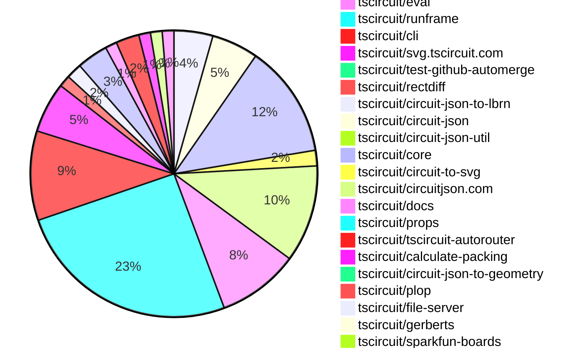
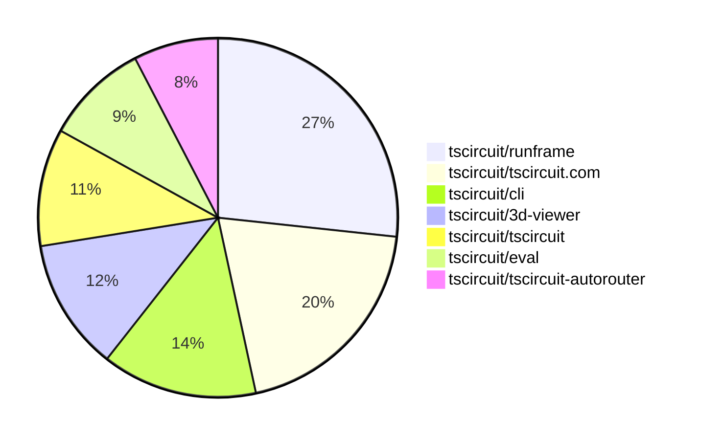

# contribution-tracker

[contributions.tscircuit.com](https://contributions.tscircuit.com) ・ [tscircuit.com](https://tscircuit.com) ・ [Contribution Overviews](./contribution-overviews/) ・ [Changelogs](./changelogs/)

Generates weekly contribution overviews for tscircuit contributors. Check out all
the [contribution overviews here](./contribution-overviews/)
You can find AI-generated monthly changelogs in the [changelogs directory](./changelogs/).

- All PRs in the tscircuit org are scanned/summarized via an LLM
- The LLM classifies each Diff/PR as into a set of attributes for scoring
- All the PRs, summaries, and classifications are organized into charts and tables for [the website](https://contributions.tscircuit.com)

> Want to run locally? See the [Development Section](#development)

The current week is shown below. There are 4 major sections:

- [Contributor Overview](#contributor-overview)
- [PRs by Repository](#prs-by-repository)
- [PRs by Contributor](#changes-by-contributor)
- [Scoring & Sponsorship System](#scoring--sponsorship-system)

## Current Week

<!-- START_CURRENT_WEEK -->

# Contribution Overview 2025-12-03

The current week is shown below. There are 4 major sections:

- [Contributor Overview](#contributor-overview)
- [PRs by Repository](#prs-by-repository)
- [PRs by Contributor](#changes-by-contributor)
- [Scoring & Sponsorship System](#scoring--sponsorship-system)

## PRs by Repository



## Contributor Overview

| Contributor | 🐳 Major | 🐙 Minor | 🐌 Tiny | ⭐ | Score | Discussion Contributions |
|-------------|---------|---------|---------|-----|----------------|--------------------------|
| [seveibar](#seveibar) | 11 | 6 | 15 | 👑 | 69 | 0🔹 0🔶 0💎 |
| [imrishabh18](#imrishabh18) | 4 | 6 | 2 | ⭐⭐⭐ | 31 | 0🔹 0🔶 0💎 |
| [techmannih](#techmannih) | 0 | 8 | 4 | ⭐⭐ | 28 | 0🔹 0🔶 0💎 |
| [ArnavK-09](#ArnavK-09) | 3 | 3 | 4 | ⭐⭐ | 24 | 0🔹 0🔶 0💎 |
| [MustafaMulla29](#MustafaMulla29) | 1 | 6 | 3 | ⭐⭐ | 19 | 0🔹 0🔶 0💎 |
| [Abse2001](#Abse2001) | 0 | 8 | 2 | ⭐⭐ | 18 | 0🔹 0🔶 0💎 |
| [0hmX](#0hmX) | 3 | 1 | 2 | ⭐⭐ | 15.5 | 0🔹 0🔶 0💎 |
| [tscircuitbot](#tscircuitbot) | 0 | 0 | 140 | ⭐⭐ | 15 | 0🔹 0🔶 0💎 |
| [rushabhcodes](#rushabhcodes) | 2 | 1 | 0 | ⭐⭐ | 14 | 0🔹 0🔶 0💎 |
| [AnasSarkiz](#AnasSarkiz) | 2 | 1 | 0 | ⭐⭐ | 14 | 0🔹 0🔶 0💎 |
| [Ayushjhawar8](#Ayushjhawar8) | 2 | 1 | 3 | ⭐⭐ | 13 | 0🔹 0🔶 0💎 |
| [ShiboSoftwareDev](#ShiboSoftwareDev) | 0 | 1 | 0 | ⭐ | 9 | 0🔹 0🔶 0💎 |
| [RaghavArora14](#RaghavArora14) | 1 | 1 | 0 | ⭐ | 7 | 0🔹 0🔶 0💎 |
| [pxlpal](#pxlpal) | 0 | 1 | 1 |  | 3 | 0🔹 0🔶 0💎 |

> Note: AI evaluates PRs and assigns 1-3 star ratings automatically. 4 and 5 star ratings require manual staff review.

### Discussion Contribution Legend

- 🔹 Normal Comments: Basic participation with minimal effort
- 🔶 Great Informative Comments: Thoughtful participation that adds value
- 💎 Incredible Comments: Exceptional participation with high-quality content

## Review Table

[reviews-received-hover]: ## "Number of reviews received for PRs for this contributor"
[approvals-received-hover]: ## "Number of approvals received for PRs this contributor authored"
[rejections-received-hover]: ## "Number of rejections received for PRs this contributor authored"
[prs-opened-hover]: ## "Number of PRs opened by this contributor"
[issues-created-hover]: ## "Number of issues created by this contributor"
[bountied-issues-hover]: ## "Number of issues this contributor created with a bounty"
[bountied-issue-$-hover]: ## "Total bounty amount placed on issues authored by this contributor"

| Contributor | Reviews Received | Approvals Received | Rejections Received | Approvals | Rejections | PRs Opened | PRs Merged | Score | Issues Created | Bountied Issues | Bountied Issue $ |
|---|---|---|---|---|---|---|---|---|---|---|---|
| [techmannih](#techmannih) | 12 | 9 | 2 | 2 | 0 | 18 | 12 | 28 | 0 | 0 | 0 |
| [seveibar](#seveibar) | 3 | 0 | 0 | 48 | 15 | 41 | 32 | 69 | 0 | 0 | 0 |
| [tscircuitbot](#tscircuitbot) | 0 | 0 | 0 | 0 | 0 | 178 | 140 | 15 | 0 | 0 | 0 |
| [Abse2001](#Abse2001) | 10 | 10 | 0 | 0 | 0 | 11 | 10 | 18 | 0 | 0 | 0 |
| [Ayushjhawar8](#Ayushjhawar8) | 13 | 5 | 4 | 0 | 0 | 10 | 6 | 13 | 0 | 0 | 0 |
| [Devesh36](#Devesh36) | 6 | 0 | 1 | 0 | 0 | 3 | 0 | 0 | 0 | 0 | 0 |
| [rushabhcodes](#rushabhcodes) | 29 | 9 | 2 | 1 | 0 | 10 | 3 | 14 | 0 | 0 | 0 |
| [Lulzx](#Lulzx) | 2 | 0 | 2 | 0 | 0 | 6 | 0 | 0 | 0 | 0 | 0 |
| [AnasSarkiz](#AnasSarkiz) | 12 | 5 | 3 | 0 | 0 | 6 | 3 | 14 | 0 | 0 | 0 |
| [MustafaMulla29](#MustafaMulla29) | 15 | 8 | 2 | 0 | 0 | 14 | 10 | 19 | 0 | 0 | 0 |
| [ShiboSoftwareDev](#ShiboSoftwareDev) | 2 | 1 | 1 | 7 | 0 | 2 | 1 | 9 | 0 | 0 | 0 |
| [Prachi-kushwaha](#Prachi-kushwaha) | 3 | 0 | 1 | 0 | 0 | 1 | 0 | 0 | 0 | 0 | 0 |
| [imrishabh18](#imrishabh18) | 7 | 1 | 0 | 3 | 3 | 13 | 12 | 31 | 0 | 0 | 0 |
| [Aqil-Ahmad](#Aqil-Ahmad) | 0 | 0 | 0 | 0 | 0 | 1 | 0 | 0 | 0 | 0 | 0 |
| [RaghavArora14](#RaghavArora14) | 16 | 4 | 0 | 1 | 0 | 3 | 2 | 7 | 0 | 0 | 0 |
| [ArnavK-09](#ArnavK-09) | 7 | 3 | 0 | 2 | 0 | 11 | 10 | 24 | 0 | 0 | 0 |
| [nailoo](#nailoo) | 1 | 1 | 0 | 0 | 0 | 2 | 0 | 0 | 0 | 0 | 0 |
| [pxlpal](#pxlpal) | 1 | 1 | 0 | 0 | 0 | 2 | 2 | 3 | 0 | 0 | 0 |
| [0hmX](#0hmX) | 13 | 7 | 0 | 0 | 0 | 10 | 6 | 15.5 | 0 | 0 | 0 |

## Top 7 Repositories by Contribution Points



## Scoring & Sponsorship System

### Overview

PRs are analyzed by AI and assigned a **star rating (1-3 stars)**. 4 and 5 star ratings can only be manually assigned by staff. Weekly scores use `2^(starRating - 1)` per PR (capped at 12 PRs per rating), plus review/discussion points.

### Weekly Score → Star String

| Score Range | Star String | Count Value |
|------------|-------------|-------------|
| 0-3 | (empty) | 0 stars |
| 4-10 | ⭐ | 1 star |
| 11-30 | ⭐⭐ | 2 stars |
| 31-50 | ⭐⭐⭐ | 3 stars |
| 51-75 | 👑 | 1 crown |
| 76-100 | 👑👑 | 2 crowns |
| 101+ | 👑👑👑 | 3 crowns |

> Crowns count as 3 stars for sponsorship.

### Monthly Sponsorship Calculation

The sponsorship system calculates monthly payments based on your **weekly star counts** over the complete weeks in that month (typically 4-5 weeks, Wednesday-Tuesday format).

**Step 1: Collect Weekly Stars**
- All complete weeks in the month are analyzed
- Each week's star string is converted to a numeric count (⭐ = 1 star, ⭐⭐⭐ = 3 stars)
- Example: `[2, 2, 2, 1, 0]` means 2 stars in week 1, 2 stars in week 2, etc.

**Step 2: Calculate Metrics**
- **Median stars**: The median value of all weekly star counts
- **Min stars**: The minimum weekly star count
- **Max stars**: The maximum weekly star count
- **High score**: The maximum raw weekly score (0-100+ range from the scoring table) from any week in the month

**Step 3: Determine Base Amount**
The sponsorship amount is calculated based on these metrics (checked in order):

| Condition | Base Amount |
|-----------|-------------|
| `minStarCount >= 3` | **$500** |
| `medianStars >= 3` | **$450** |
| `medianStars >= 2.5` | **$300** |
| `medianStars >= 2` | **$200** |
| `medianStars >= 1.5` | **$100** |
| `medianStars >= 1` | **$75** |
| `maxStarCount >= 2` | **$25** |
| `maxStarCount >= 1` | **$15** |
| `highScore >= 3` (and all stars = 0) | **$5** |

| Maintainer Level | Monthly Bonus |
|------------------|---------------|
| Level 1 | **$200** |
| Level 2 | **$350** |
| Level 3 | **$500** |

**Final Amount** = Base Amount + Maintainer Bonus

## Changes by Repository

### [tscircuit/pcb-viewer](https://github.com/tscircuit/pcb-viewer)

| PR # | Impact | Rating | Contributor | Description |
|------|--------|--------|-------------|-------------|
| [#523](https://github.com/tscircuit/pcb-viewer/pull/523) | 🐙 Minor | ⭐⭐ | techmannih | Fixes rotation support for pill-shaped SMT pads in the PCB viewer, allowing for proper rendering and handling of rotated pill shapes. |
| [#520](https://github.com/tscircuit/pcb-viewer/pull/520) | 🐙 Minor | ⭐⭐ | Abse2001 | Fixes the incorrect offset computation used when placing pcb_panel, ensuring accurate placement within PCB assemblies and during packinginflation. |
| [#515](https://github.com/tscircuit/pcb-viewer/pull/515) | 🐙 Minor | ⭐⭐ | seveibar | Offsets lowercase alphabet glyphs using the library baseline instead of centered positioning, includes baseline offset in text metrics to account for descender depth, and adds tests confirming baseline placement and descender rendering for lowercase text. |

<details>
<summary>🐌 Tiny Contributions (7)</summary>

| PR # | Impact | Contributor | Description |
|------|--------|-------------|-------------|
| [#517](https://github.com/tscircuit/pcb-viewer/pull/517) | 🐌 Tiny | techmannih | Refactors the SMT pad shape handling by extracting shape-specific conversion logic into separate files for better organization and maintainability. |
| [#524](https://github.com/tscircuit/pcb-viewer/pull/524) | 🐌 Tiny | tscircuitbot | Automated package update |
| [#522](https://github.com/tscircuit/pcb-viewer/pull/522) | 🐌 Tiny | tscircuitbot | Automated package update |
| [#521](https://github.com/tscircuit/pcb-viewer/pull/521) | 🐌 Tiny | tscircuitbot | Automated package update |
| [#519](https://github.com/tscircuit/pcb-viewer/pull/519) | 🐌 Tiny | tscircuitbot | Automated package update |
| [#516](https://github.com/tscircuit/pcb-viewer/pull/516) | 🐌 Tiny | tscircuitbot | Automated package update |
| [#518](https://github.com/tscircuit/pcb-viewer/pull/518) | 🐌 Tiny | Ayushjhawar8 | Disables the right-click context menu on the PCB Viewer component to prevent default actions. |

</details>

### [tscircuit/3d-viewer](https://github.com/tscircuit/3d-viewer)

| PR # | Impact | Rating | Contributor | Description |
|------|--------|--------|-------------|-------------|
| [#589](https://github.com/tscircuit/3d-viewer/pull/589) | 🐳 Major | ⭐⭐⭐ | Ayushjhawar8 | Adds support for translucency in 3D models by allowing models to be rendered with adjustable transparency settings based on the show_as_translucent_model property. |
| [#592](https://github.com/tscircuit/3d-viewer/pull/592) | 🐳 Major | ⭐⭐⭐ | rushabhcodes | Refactors the via geometry generation logic to improve the accuracy and visual representation of PCB vias, fixes a bug in drill hole processing, and adds new Storybook stories for testing and demonstration. |
| [#601](https://github.com/tscircuit/3d-viewer/pull/601) | 🐙 Minor | ⭐⭐ | techmannih | Fixes the issue where PCB cutouts are not visible due to the soldermask texture rendering incorrectly. |
| [#602](https://github.com/tscircuit/3d-viewer/pull/602) | 🐙 Minor | ⭐⭐ | techmannih | Fixes soldermask coverage for oval-shaped plated holes in the rendering engine. |
| [#603](https://github.com/tscircuit/3d-viewer/pull/603) | 🐙 Minor | ⭐⭐ | techmannih | Fixes rendering issues with polygon plated holes in soldermask coverage by adding support for various hole shapes and their respective rendering logic. |
| [#604](https://github.com/tscircuit/3d-viewer/pull/604) | 🐙 Minor | ⭐⭐ | techmannih | Adds support for soldermask coverage with corner radius and plated holes in the soldermask texture generation. |
| [#599](https://github.com/tscircuit/3d-viewer/pull/599) | 🐙 Minor | ⭐⭐ | techmannih | Fixes the visibility issue of non-plated holes in the PCB rendering due to improper soldermask texture coverage. |
| [#600](https://github.com/tscircuit/3d-viewer/pull/600) | 🐙 Minor | ⭐⭐ | techmannih | Fixes the rotation issue for pill-shaped plated holes in the soldermask texture rendering. |
| [#597](https://github.com/tscircuit/3d-viewer/pull/597) | 🐙 Minor | ⭐⭐ | techmannih | Adds support for rendering PCB fabrication note rectangles in the silkscreen layer, including customizable properties such as color, stroke, and fill options. |
| [#606](https://github.com/tscircuit/3d-viewer/pull/606) | 🐙 Minor | ⭐⭐ | MustafaMulla29 | Fixes the soldermask rotation application to ensure it aligns correctly with the 3D geometry, addressing issues with incorrect rotation directions for both pads and holes. |
| [#605](https://github.com/tscircuit/3d-viewer/pull/605) | 🐙 Minor | ⭐⭐ | MustafaMulla29 | Fixes the soldermask rendering to respect the board outline, ensuring that the soldermask is drawn only within the defined outline of the board instead of filling the entire canvas. |
| [#595](https://github.com/tscircuit/3d-viewer/pull/595) | 🐙 Minor | ⭐⭐ | MustafaMulla29 | Adds support for soldermask layers on PCB boards, allowing users to toggle visibility for top and bottom soldermask layers. |

### [tscircuit/easyeda-converter](https://github.com/tscircuit/easyeda-converter)


<details>
<summary>🐌 Tiny Contributions (2)</summary>

| PR # | Impact | Contributor | Description |
|------|--------|-------------|-------------|
| [#332](https://github.com/tscircuit/easyeda-converter/pull/332) | 🐌 Tiny | techmannih | Add a new electronic component footprint for the C75740 D-SUB 9-pin connector, including its schema and snapshot for use in the circuit design. |
| [#334](https://github.com/tscircuit/easyeda-converter/pull/334) | 🐌 Tiny | seveibar | Adds a conversion test for the USB-C part C2765186, verifying pad, plated hole, and CAD model handling, while ensuring safe handling of route-based cutouts during recentring. |

</details>

### [tscircuit/tscircuit.com](https://github.com/tscircuit/tscircuit.com)

| PR # | Impact | Rating | Contributor | Description |
|------|--------|--------|-------------|-------------|
| [#2130](https://github.com/tscircuit/tscircuit.com/pull/2130) | 🐳 Major | ⭐⭐⭐ | seveibar | Add avatar_url support to organization schemas and mapping in the fake API, implement POST orgsupload_avatar for the fake server storing image data and returning updated orgs, expose an organization settings dialog and hook to upload avatars from the UI. |
| [#2124](https://github.com/tscircuit/tscircuit.com/pull/2124) | 🐳 Major | ⭐⭐⭐ | seveibar | Add a GitHub connection card on the organization settings page to allow owners to initiate the installation flow directly from the organization view, handle installation completion with a confirmation toast and data refresh, and expose a refetch helper for reuse after connecting. |
| [#2122](https://github.com/tscircuit/tscircuit.com/pull/2122) | 🐳 Major | ⭐⭐⭐ | seveibar | Adds an Orgs submenu to the header account dropdown, listing organizations the user belongs to and linking to each org page. |
| [#2135](https://github.com/tscircuit/tscircuit.com/pull/2135) | 🐳 Major | ⭐⭐⭐ | ArnavK-09 | Refactors the avatar upload functionality to unify organization and personal avatar handling, introducing a new hook for managing avatar uploads and dialogs. |
| [#2123](https://github.com/tscircuit/tscircuit.com/pull/2123) | 🐙 Minor | ⭐⭐ | seveibar | Displays full package names in the dashboard quick-edit list, including organization or owner scope, and shows package owner scope on dashboard package cards for clearer context. |
| [#2120](https://github.com/tscircuit/tscircuit.com/pull/2120) | 🐙 Minor | ⭐⭐ | seveibar | Load circuit-json-to-gerber dynamically from jsdelivr when generating fabrication downloads and remove the bundled circuit-json-to-gerber dependency from the project |
| [#2142](https://github.com/tscircuit/tscircuit.com/pull/2142) | 🐙 Minor | ⭐⭐ | ArnavK-09 | Fixes a crash on the organization page by updating the member avatar handling to use a fallback mechanism for GitHub avatars. |
| [#2143](https://github.com/tscircuit/tscircuit.com/pull/2143) | 🐙 Minor | ⭐⭐ | ArnavK-09 | Changes email visibility in the list_members API based on the users membership status, ensuring that only members can see their own email addresses. |
| [#2106](https://github.com/tscircuit/tscircuit.com/pull/2106) | 🐙 Minor | ⭐⭐ | RaghavArora14 | Fixes z-index issues in dialog components to prevent overlay problems with the orientation cube. |
| [#2117](https://github.com/tscircuit/tscircuit.com/pull/2117) | 🐙 Minor | ⭐⭐ | pxlpal | Attaches account_id to the redirect URL for creating a new GitHub installation, enhancing the integration process. |

<details>
<summary>🐌 Tiny Contributions (19)</summary>

| PR # | Impact | Contributor | Description |
|------|--------|-------------|-------------|
| [#2108](https://github.com/tscircuit/tscircuit.com/pull/2108) | 🐌 Tiny | techmannih | Updates the tscircuit3d-viewer package to version 0.0.448 in the package.json file. |
| [#2144](https://github.com/tscircuit/tscircuit.com/pull/2144) | 🐌 Tiny | tscircuitbot | Automated package update |
| [#2140](https://github.com/tscircuit/tscircuit.com/pull/2140) | 🐌 Tiny | tscircuitbot | Automated package update |
| [#2139](https://github.com/tscircuit/tscircuit.com/pull/2139) | 🐌 Tiny | tscircuitbot | Automated package update |
| [#2138](https://github.com/tscircuit/tscircuit.com/pull/2138) | 🐌 Tiny | tscircuitbot | Updates the tscircuiteval package from version 0.0.522 to 0.0.523 |
| [#2134](https://github.com/tscircuit/tscircuit.com/pull/2134) | 🐌 Tiny | tscircuitbot | Automated package update |
| [#2131](https://github.com/tscircuit/tscircuit.com/pull/2131) | 🐌 Tiny | tscircuitbot | Updates the package version from 0.0.152 to 0.0.153 in package.json |
| [#2129](https://github.com/tscircuit/tscircuit.com/pull/2129) | 🐌 Tiny | tscircuitbot | Updates the tscircuiteval package from version 0.0.521 to 0.0.522 in the package.json file. |
| [#2128](https://github.com/tscircuit/tscircuit.com/pull/2128) | 🐌 Tiny | tscircuitbot | Updates the tscircuiteval package from version 0.0.520 to 0.0.521 |
| [#2126](https://github.com/tscircuit/tscircuit.com/pull/2126) | 🐌 Tiny | tscircuitbot | Updates the tscircuiteval package version from 0.0.519 to 0.0.520 in package.json |
| [#2119](https://github.com/tscircuit/tscircuit.com/pull/2119) | 🐌 Tiny | tscircuitbot | Automated package update |
| [#2118](https://github.com/tscircuit/tscircuit.com/pull/2118) | 🐌 Tiny | tscircuitbot | Updates the tscircuiteval package from version 0.0.517 to 0.0.518 |
| [#2116](https://github.com/tscircuit/tscircuit.com/pull/2116) | 🐌 Tiny | tscircuitbot | Automated package update |
| [#2115](https://github.com/tscircuit/tscircuit.com/pull/2115) | 🐌 Tiny | tscircuitbot | Automated package update |
| [#2113](https://github.com/tscircuit/tscircuit.com/pull/2113) | 🐌 Tiny | tscircuitbot | Updates the tscircuiteval package from version 0.0.514 to 0.0.515 |
| [#2125](https://github.com/tscircuit/tscircuit.com/pull/2125) | 🐌 Tiny | seveibar | Removes the Order button and associated dialog from the package header, along with cleaning up unused order-related imports and props. |
| [#2145](https://github.com/tscircuit/tscircuit.com/pull/2145) | 🐌 Tiny | ArnavK-09 | Redirects users to the home page after signing out from the application. |
| [#2133](https://github.com/tscircuit/tscircuit.com/pull/2133) | 🐌 Tiny | ArnavK-09 | Adds a test organization package for development and patches the UI for mobile responsiveness. |
| [#2121](https://github.com/tscircuit/tscircuit.com/pull/2121) | 🐌 Tiny | pxlpal | Fixes the package author extraction to use the organization name prefix instead of the GitHub username for org packages. |

</details>

### [tscircuit/circuit-json-to-gltf](https://github.com/tscircuit/circuit-json-to-gltf)

| PR # | Impact | Rating | Contributor | Description |
|------|--------|--------|-------------|-------------|
| [#96](https://github.com/tscircuit/circuit-json-to-gltf/pull/96) | 🐳 Major | ⭐⭐⭐ | Ayushjhawar8 | Adds support for translucent models in GLTF conversion and testing, allowing for better visualization of circuit components in 3D. |
| [#89](https://github.com/tscircuit/circuit-json-to-gltf/pull/89) | 🐳 Major | ⭐⭐⭐ | RaghavArora14 | Implements copper pour soldermask differentiation in GLTF rendering by integrating the two-layer soldermask approach from circuit-to-svg, ensuring copper pours render correctly based on their covered_with_solder_mask flag. |
| [#95](https://github.com/tscircuit/circuit-json-to-gltf/pull/95) | 🐙 Minor | ⭐⭐ | rushabhcodes | Removes the logic that adjusted the vertical position of loaded OBJ meshes to align their bottom with the specified position, simplifying the mesh positioning behavior. |

<details>
<summary>🐌 Tiny Contributions (1)</summary>

| PR # | Impact | Contributor | Description |
|------|--------|-------------|-------------|
| [#93](https://github.com/tscircuit/circuit-json-to-gltf/pull/93) | 🐌 Tiny | techmannih | Adds a reproduction test for the CAD model Z-coordinate position offset issue in the rendering process. |

</details>

### [tscircuit/tscircuit](https://github.com/tscircuit/tscircuit)


<details>
<summary>🐌 Tiny Contributions (25)</summary>

| PR # | Impact | Contributor | Description |
|------|--------|-------------|-------------|
| [#1595](https://github.com/tscircuit/tscircuit/pull/1595) | 🐌 Tiny | tscircuitbot | Automated package update |
| [#1594](https://github.com/tscircuit/tscircuit/pull/1594) | 🐌 Tiny | tscircuitbot | Updates the tscircuitcli package from version 0.1.612 to 0.1.613 and the tscircuitrunframe package from version 0.0.1353 to 0.0.1354 in package.json |
| [#1593](https://github.com/tscircuit/tscircuit/pull/1593) | 🐌 Tiny | tscircuitbot | Automated package update |
| [#1592](https://github.com/tscircuit/tscircuit/pull/1592) | 🐌 Tiny | tscircuitbot | Updates the tscircuitcli package to version 0.1.612 in the package.json file |
| [#1591](https://github.com/tscircuit/tscircuit/pull/1591) | 🐌 Tiny | tscircuitbot | Automated package update |
| [#1590](https://github.com/tscircuit/tscircuit/pull/1590) | 🐌 Tiny | tscircuitbot | Updates the tscircuitcli package from version 0.1.610 to 0.1.611 |
| [#1589](https://github.com/tscircuit/tscircuit/pull/1589) | 🐌 Tiny | tscircuitbot | Automated package update |
| [#1588](https://github.com/tscircuit/tscircuit/pull/1588) | 🐌 Tiny | tscircuitbot | Automated package update |
| [#1587](https://github.com/tscircuit/tscircuit/pull/1587) | 🐌 Tiny | tscircuitbot | Automated package update to version 0.0.1016 |
| [#1586](https://github.com/tscircuit/tscircuit/pull/1586) | 🐌 Tiny | tscircuitbot | Automated package update |
| [#1585](https://github.com/tscircuit/tscircuit/pull/1585) | 🐌 Tiny | tscircuitbot | Automated package update |
| [#1584](https://github.com/tscircuit/tscircuit/pull/1584) | 🐌 Tiny | tscircuitbot | Updates the tscircuitcli package to version 0.1.608 in the package.json file. |
| [#1583](https://github.com/tscircuit/tscircuit/pull/1583) | 🐌 Tiny | tscircuitbot | Automated package update |
| [#1582](https://github.com/tscircuit/tscircuit/pull/1582) | 🐌 Tiny | tscircuitbot | Automated package update |
| [#1578](https://github.com/tscircuit/tscircuit/pull/1578) | 🐌 Tiny | tscircuitbot | Automated package update |
| [#1577](https://github.com/tscircuit/tscircuit/pull/1577) | 🐌 Tiny | tscircuitbot | Automated package update |
| [#1575](https://github.com/tscircuit/tscircuit/pull/1575) | 🐌 Tiny | tscircuitbot | Automated package update |
| [#1574](https://github.com/tscircuit/tscircuit/pull/1574) | 🐌 Tiny | tscircuitbot | Updates the package version from 0.0.1010 to 0.0.1011 in package.json |
| [#1573](https://github.com/tscircuit/tscircuit/pull/1573) | 🐌 Tiny | tscircuitbot | Updates the tscircuitcli package to version 0.1.603 in package.json |
| [#1572](https://github.com/tscircuit/tscircuit/pull/1572) | 🐌 Tiny | tscircuitbot | Automated package update |
| [#1571](https://github.com/tscircuit/tscircuit/pull/1571) | 🐌 Tiny | tscircuitbot | Updates the tscircuitcli package to version 0.1.602 in package.json |
| [#1570](https://github.com/tscircuit/tscircuit/pull/1570) | 🐌 Tiny | tscircuitbot | Automated package update |
| [#1569](https://github.com/tscircuit/tscircuit/pull/1569) | 🐌 Tiny | tscircuitbot | Updates the tscircuitcli package to version 0.1.601 in the package.json file |
| [#1568](https://github.com/tscircuit/tscircuit/pull/1568) | 🐌 Tiny | tscircuitbot | Automated package update |
| [#1567](https://github.com/tscircuit/tscircuit/pull/1567) | 🐌 Tiny | tscircuitbot | Automated package update |

</details>

### [tscircuit/eval](https://github.com/tscircuit/eval)

| PR # | Impact | Rating | Contributor | Description |
|------|--------|--------|-------------|-------------|
| [#1623](https://github.com/tscircuit/eval/pull/1623) | 🐙 Minor | ⭐⭐ | seveibar | Refactors the import mechanism for npm packages to utilize CDN instead of local imports, enhancing package resolution. |

<details>
<summary>🐌 Tiny Contributions (20)</summary>

| PR # | Impact | Contributor | Description |
|------|--------|-------------|-------------|
| [#1664](https://github.com/tscircuit/eval/pull/1664) | 🐌 Tiny | tscircuitbot | Automated package update |
| [#1663](https://github.com/tscircuit/eval/pull/1663) | 🐌 Tiny | tscircuitbot | Updates the version of the tscircuitcore package from 0.0.902 to 0.0.903 in package.json |
| [#1661](https://github.com/tscircuit/eval/pull/1661) | 🐌 Tiny | tscircuitbot | Automated package update to version 0.0.524 |
| [#1660](https://github.com/tscircuit/eval/pull/1660) | 🐌 Tiny | tscircuitbot | Automated package update |
| [#1659](https://github.com/tscircuit/eval/pull/1659) | 🐌 Tiny | tscircuitbot | Automated package update |
| [#1658](https://github.com/tscircuit/eval/pull/1658) | 🐌 Tiny | tscircuitbot | Automated package update |
| [#1656](https://github.com/tscircuit/eval/pull/1656) | 🐌 Tiny | tscircuitbot | Automated package update |
| [#1655](https://github.com/tscircuit/eval/pull/1655) | 🐌 Tiny | tscircuitbot | Automated package update |
| [#1653](https://github.com/tscircuit/eval/pull/1653) | 🐌 Tiny | tscircuitbot | Automated package update |
| [#1652](https://github.com/tscircuit/eval/pull/1652) | 🐌 Tiny | tscircuitbot | Automated package update |
| [#1651](https://github.com/tscircuit/eval/pull/1651) | 🐌 Tiny | tscircuitbot | Updates package versions for dependencies in the project. |
| [#1649](https://github.com/tscircuit/eval/pull/1649) | 🐌 Tiny | tscircuitbot | Automated package update |
| [#1648](https://github.com/tscircuit/eval/pull/1648) | 🐌 Tiny | tscircuitbot | Automated package update |
| [#1646](https://github.com/tscircuit/eval/pull/1646) | 🐌 Tiny | tscircuitbot | Automated package update |
| [#1645](https://github.com/tscircuit/eval/pull/1645) | 🐌 Tiny | tscircuitbot | Updates the version of the tscircuitcore package from 0.0.897 to 0.0.898 in package.json |
| [#1643](https://github.com/tscircuit/eval/pull/1643) | 🐌 Tiny | tscircuitbot | Automated package update |
| [#1642](https://github.com/tscircuit/eval/pull/1642) | 🐌 Tiny | tscircuitbot | Updates the version of the tscircuitcore package from 0.0.896 to 0.0.897 in package.json |
| [#1639](https://github.com/tscircuit/eval/pull/1639) | 🐌 Tiny | tscircuitbot | Automated package update to version 0.0.515 |
| [#1654](https://github.com/tscircuit/eval/pull/1654) | 🐌 Tiny | seveibar | Removes comments from code before extracting import statements to ensure accurate analysis of imports. |
| [#1638](https://github.com/tscircuit/eval/pull/1638) | 🐌 Tiny | seveibar | Adds zod as a development dependency to ensure compatibility with the core version. |

</details>

### [tscircuit/runframe](https://github.com/tscircuit/runframe)

| PR # | Impact | Rating | Contributor | Description |
|------|--------|--------|-------------|-------------|
| [#1992](https://github.com/tscircuit/runframe/pull/1992) | 🐳 Major | ⭐⭐⭐ | ArnavK-09 | img width1496 height881 altimage srchttps:github.comuser-attachmentsassets7a538869-ad30-46e3-a5c0-d02352492a73  img width993 height776 altimage srchttps:github.comuser-attachmentsassetsdfebc0cb-f0eb-4e71-9d63-b34a58efb755 |
| [#2019](https://github.com/tscircuit/runframe/pull/2019) | 🐙 Minor | ⭐⭐ | seveibar | Removes the direct EasyEDA dependency from the package configuration and adds a helper to dynamically load the EasyEDA browser module from jsdelivr, updating JLCPCB import flows to request the EasyEDA converter only when needed. |
| [#1990](https://github.com/tscircuit/runframe/pull/1990) | 🐙 Minor | ⭐⭐ | ArnavK-09 | Disables the schematic tab in the UI when there are no schematic groups present in the circuit JSON. |

<details>
<summary>🐌 Tiny Contributions (55)</summary>

| PR # | Impact | Contributor | Description |
|------|--------|-------------|-------------|
| [#2022](https://github.com/tscircuit/runframe/pull/2022) | 🐌 Tiny | tscircuitbot | Updates the tscircuit3d-viewer package to version 0.0.461 in package.json |
| [#2021](https://github.com/tscircuit/runframe/pull/2021) | 🐌 Tiny | tscircuitbot | Automated package update |
| [#2018](https://github.com/tscircuit/runframe/pull/2018) | 🐌 Tiny | tscircuitbot | Automated package update |
| [#2017](https://github.com/tscircuit/runframe/pull/2017) | 🐌 Tiny | tscircuitbot | Updates the tscircuiteval package to version 0.0.525 in the package.json file. |
| [#2016](https://github.com/tscircuit/runframe/pull/2016) | 🐌 Tiny | tscircuitbot | Automated package update |
| [#2015](https://github.com/tscircuit/runframe/pull/2015) | 🐌 Tiny | tscircuitbot | Automated package update |
| [#2014](https://github.com/tscircuit/runframe/pull/2014) | 🐌 Tiny | tscircuitbot | Automated package update |
| [#2013](https://github.com/tscircuit/runframe/pull/2013) | 🐌 Tiny | tscircuitbot | Updates the tscircuit3d-viewer package to version 0.0.458 in package.json |
| [#2012](https://github.com/tscircuit/runframe/pull/2012) | 🐌 Tiny | tscircuitbot | Automated package update |
| [#2011](https://github.com/tscircuit/runframe/pull/2011) | 🐌 Tiny | tscircuitbot | Automated package update |
| [#2010](https://github.com/tscircuit/runframe/pull/2010) | 🐌 Tiny | tscircuitbot | Automated package update for tscircuit3d-viewer from version 0.0.455 to 0.0.456 |
| [#2009](https://github.com/tscircuit/runframe/pull/2009) | 🐌 Tiny | tscircuitbot | Automated package update |
| [#2008](https://github.com/tscircuit/runframe/pull/2008) | 🐌 Tiny | tscircuitbot | Updates the tscircuit3d-viewer package to version 0.0.455 in package.json |
| [#2007](https://github.com/tscircuit/runframe/pull/2007) | 🐌 Tiny | tscircuitbot | Automated package update |
| [#2006](https://github.com/tscircuit/runframe/pull/2006) | 🐌 Tiny | tscircuitbot | Automated package update for tscircuit3d-viewer from version 0.0.453 to 0.0.454 |
| [#2005](https://github.com/tscircuit/runframe/pull/2005) | 🐌 Tiny | tscircuitbot | Automated package update |
| [#2004](https://github.com/tscircuit/runframe/pull/2004) | 🐌 Tiny | tscircuitbot | Updates the tscircuiteval package to version 0.0.524 in the package.json file. |
| [#2003](https://github.com/tscircuit/runframe/pull/2003) | 🐌 Tiny | tscircuitbot | Automated package update |
| [#2002](https://github.com/tscircuit/runframe/pull/2002) | 🐌 Tiny | tscircuitbot | Updates the tscircuit3d-viewer package to version 0.0.453 in package.json |
| [#2001](https://github.com/tscircuit/runframe/pull/2001) | 🐌 Tiny | tscircuitbot | Automated package update |
| [#2000](https://github.com/tscircuit/runframe/pull/2000) | 🐌 Tiny | tscircuitbot | Updates the tscircuiteval package from version 0.0.521 to 0.0.523 |
| [#1999](https://github.com/tscircuit/runframe/pull/1999) | 🐌 Tiny | tscircuitbot | Automated package update |
| [#1998](https://github.com/tscircuit/runframe/pull/1998) | 🐌 Tiny | tscircuitbot | Updates the tscircuitpcb-viewer package from version 1.11.278 to 1.11.279 |
| [#1997](https://github.com/tscircuit/runframe/pull/1997) | 🐌 Tiny | tscircuitbot | Automated package update |
| [#1996](https://github.com/tscircuit/runframe/pull/1996) | 🐌 Tiny | tscircuitbot | Updates the tscircuitpcb-viewer package from version 1.11.277 to 1.11.278 |
| [#1995](https://github.com/tscircuit/runframe/pull/1995) | 🐌 Tiny | tscircuitbot | Automated package update |
| [#1994](https://github.com/tscircuit/runframe/pull/1994) | 🐌 Tiny | tscircuitbot | Automated package update |
| [#1993](https://github.com/tscircuit/runframe/pull/1993) | 🐌 Tiny | tscircuitbot | Automated package update |
| [#1991](https://github.com/tscircuit/runframe/pull/1991) | 🐌 Tiny | tscircuitbot | Automated package update |
| [#1989](https://github.com/tscircuit/runframe/pull/1989) | 🐌 Tiny | tscircuitbot | Automated package update |
| [#1987](https://github.com/tscircuit/runframe/pull/1987) | 🐌 Tiny | tscircuitbot | Automated package update |
| [#1986](https://github.com/tscircuit/runframe/pull/1986) | 🐌 Tiny | tscircuitbot | Updates the tscircuitpcb-viewer package from version 1.11.276 to 1.11.277 |
| [#1985](https://github.com/tscircuit/runframe/pull/1985) | 🐌 Tiny | tscircuitbot | Automated package update |
| [#1984](https://github.com/tscircuit/runframe/pull/1984) | 🐌 Tiny | tscircuitbot | Updates the tscircuitpcb-viewer package from version 1.11.275 to 1.11.276 |
| [#1982](https://github.com/tscircuit/runframe/pull/1982) | 🐌 Tiny | tscircuitbot | Automated package update |
| [#1981](https://github.com/tscircuit/runframe/pull/1981) | 🐌 Tiny | tscircuitbot | Updates the tscircuit3d-viewer package from version 0.0.450 to 0.0.451 |
| [#1979](https://github.com/tscircuit/runframe/pull/1979) | 🐌 Tiny | tscircuitbot | Automated package update |
| [#1978](https://github.com/tscircuit/runframe/pull/1978) | 🐌 Tiny | tscircuitbot | Updates the tscircuiteval package to version 0.0.521 |
| [#1976](https://github.com/tscircuit/runframe/pull/1976) | 🐌 Tiny | tscircuitbot | Automated package update |
| [#1975](https://github.com/tscircuit/runframe/pull/1975) | 🐌 Tiny | tscircuitbot | Updates the tscircuiteval package from version 0.0.519 to 0.0.520 |
| [#1974](https://github.com/tscircuit/runframe/pull/1974) | 🐌 Tiny | tscircuitbot | Automated package update |
| [#1972](https://github.com/tscircuit/runframe/pull/1972) | 🐌 Tiny | tscircuitbot | Updates the circuit-json-to-gerber package from version 0.0.43 to 0.0.44 |
| [#1971](https://github.com/tscircuit/runframe/pull/1971) | 🐌 Tiny | tscircuitbot | Updates the circuit-json-to-gerber package from version 0.0.42 to 0.0.43 |
| [#1970](https://github.com/tscircuit/runframe/pull/1970) | 🐌 Tiny | tscircuitbot | Updates the tscircuiteval package to version 0.0.519 in the package.json file. |
| [#1969](https://github.com/tscircuit/runframe/pull/1969) | 🐌 Tiny | tscircuitbot | Updates the tscircuiteval package to version 0.0.518 in the package.json file. |
| [#1968](https://github.com/tscircuit/runframe/pull/1968) | 🐌 Tiny | tscircuitbot | Updates the tscircuiteval package from version 0.0.516 to 0.0.517 |
| [#1967](https://github.com/tscircuit/runframe/pull/1967) | 🐌 Tiny | tscircuitbot | Updates the tscircuiteval package from version 0.0.515 to 0.0.516 |
| [#1966](https://github.com/tscircuit/runframe/pull/1966) | 🐌 Tiny | tscircuitbot | Updates the tscircuit3d-viewer package from version 0.0.449 to 0.0.450 |
| [#1965](https://github.com/tscircuit/runframe/pull/1965) | 🐌 Tiny | tscircuitbot | Updates the tscircuitpcb-viewer package from version 1.11.273 to 1.11.275 |
| [#1963](https://github.com/tscircuit/runframe/pull/1963) | 🐌 Tiny | tscircuitbot | Automated package update |
| [#1962](https://github.com/tscircuit/runframe/pull/1962) | 🐌 Tiny | tscircuitbot | Updates the tscircuiteval package from version 0.0.514 to 0.0.515 |
| [#2020](https://github.com/tscircuit/runframe/pull/2020) | 🐌 Tiny | seveibar | Updates the EasyEDA browser CDN import to use the latest tag for automatic fetching of the newest release. |
| [#1973](https://github.com/tscircuit/runframe/pull/1973) | 🐌 Tiny | seveibar | Updates the version output step in the release workflow to use a multiline script for clearer quoting and writes the resolved package version to the GitHub output file. |
| [#1964](https://github.com/tscircuit/runframe/pull/1964) | 🐌 Tiny | seveibar | Capture the package version after running pver release and include the version number in the automated bump PR commit message and title. |
| [#1988](https://github.com/tscircuit/runframe/pull/1988) | 🐌 Tiny | ArnavK-09 | img width896 height500 altimage srchttps:github.comuser-attachmentsassets63f4115d-a854-4304-a3f4-f1e70183e98a |

</details>

### [tscircuit/cli](https://github.com/tscircuit/cli)

| PR # | Impact | Rating | Contributor | Description |
|------|--------|--------|-------------|-------------|
| [#1239](https://github.com/tscircuit/cli/pull/1239) | 🐳 Major | ⭐⭐⭐ | seveibar | Ensures that the transpile process uses a single entrypoint by ignoring board file patterns when a main entrypoint is detected. |
| [#1246](https://github.com/tscircuit/cli/pull/1246) | 🐙 Minor | ⭐⭐ | Ayushjhawar8 | Fixes the issue where the tsci search command displays vundefined for packages without a defined version, ensuring cleaner output for users. |
| [#1254](https://github.com/tscircuit/cli/pull/1254) | 🐙 Minor | ⭐⭐ | MustafaMulla29 | Adds support for exporting KiCad footprint libraries through the tsci export command, allowing users to generate footprint files from circuit designs. |
| [#1272](https://github.com/tscircuit/cli/pull/1272) | 🐙 Minor | ⭐⭐ | MustafaMulla29 | Enables the DevServer to watch node_modulesdistindex.js files for changes, including scoped packages, by modifying the should-ignore-path pattern. |
| [#1240](https://github.com/tscircuit/cli/pull/1240) | 🐙 Minor | ⭐⭐ | MustafaMulla29 | Fixes the issue where KiCad .kicad_mod files are not uploaded when the package does not contain a package.json file. |
| [#1270](https://github.com/tscircuit/cli/pull/1270) | 🐙 Minor | ⭐⭐ | imrishabh18 | Fixes an issue where failure in generating one image type (PCB, schematic, or 3D) prevented the others from being written to disk. |
| [#1257](https://github.com/tscircuit/cli/pull/1257) | 🐙 Minor | ⭐⭐ | imrishabh18 | Fixes the issue where the fetch() function in the gltf library does not support local file paths, converting them to file: URLs for compatibility. |
| [#1225](https://github.com/tscircuit/cli/pull/1225) | 🐙 Minor | ⭐⭐ | imrishabh18 | Adds a browser test that supports bun link functionality, ensuring that tests pass with the bun link command. |

<details>
<summary>🐌 Tiny Contributions (15)</summary>

| PR # | Impact | Contributor | Description |
|------|--------|-------------|-------------|
| [#1286](https://github.com/tscircuit/cli/pull/1286) | 🐌 Tiny | tscircuitbot | Updates the tscircuitrunframe package from version 0.0.1360 to 0.0.1364 |
| [#1281](https://github.com/tscircuit/cli/pull/1281) | 🐌 Tiny | tscircuitbot | Automated package update for tscircuitrunframe from version 0.0.1359 to 0.0.1360 |
| [#1280](https://github.com/tscircuit/cli/pull/1280) | 🐌 Tiny | tscircuitbot | Automated package update |
| [#1273](https://github.com/tscircuit/cli/pull/1273) | 🐌 Tiny | tscircuitbot | Updates the tscircuitrunframe package from version 0.0.1353 to 0.0.1354 |
| [#1266](https://github.com/tscircuit/cli/pull/1266) | 🐌 Tiny | tscircuitbot | Updates the tscircuitrunframe package from version 0.0.1348 to 0.0.1353 |
| [#1259](https://github.com/tscircuit/cli/pull/1259) | 🐌 Tiny | tscircuitbot | Updates the tscircuitrunframe package from version 0.0.1347 to 0.0.1348 |
| [#1255](https://github.com/tscircuit/cli/pull/1255) | 🐌 Tiny | tscircuitbot | Updates the tscircuitrunframe package from version 0.0.1346 to 0.0.1347 |
| [#1252](https://github.com/tscircuit/cli/pull/1252) | 🐌 Tiny | tscircuitbot | Updates the tscircuitrunframe package from version 0.0.1344 to 0.0.1346 |
| [#1248](https://github.com/tscircuit/cli/pull/1248) | 🐌 Tiny | tscircuitbot | Updates the tscircuitrunframe package to version 0.0.1344 |
| [#1236](https://github.com/tscircuit/cli/pull/1236) | 🐌 Tiny | tscircuitbot | Automated README update with latest CLI usage output. |
| [#1235](https://github.com/tscircuit/cli/pull/1235) | 🐌 Tiny | seveibar | Sets the CLIs tscircuit peer dependency back to a wildcard while keeping the libonly dev dependency |
| [#1232](https://github.com/tscircuit/cli/pull/1232) | 🐌 Tiny | seveibar | Specifies the installation of Chromium for Playwright in the CI workflow. |
| [#1251](https://github.com/tscircuit/cli/pull/1251) | 🐌 Tiny | MustafaMulla29 | Removes the installation of type dependencies for snippets as they are now included within node_modules. |
| [#1243](https://github.com/tscircuit/cli/pull/1243) | 🐌 Tiny | MustafaMulla29 | Updates the package version in package.json from 0.1.591 to 0.1.601 |
| [#1244](https://github.com/tscircuit/cli/pull/1244) | 🐌 Tiny | MustafaMulla29 | Updates the package version in package.json from 0.1.601 to 0.1.602 |

</details>

### [tscircuit/svg.tscircuit.com](https://github.com/tscircuit/svg.tscircuit.com)


<details>
<summary>🐌 Tiny Contributions (13)</summary>

| PR # | Impact | Contributor | Description |
|------|--------|-------------|-------------|
| [#706](https://github.com/tscircuit/svg.tscircuit.com/pull/706) | 🐌 Tiny | tscircuitbot | Updates the tscircuit package version from 0.0.1019 to 0.0.1020 in package.json |
| [#705](https://github.com/tscircuit/svg.tscircuit.com/pull/705) | 🐌 Tiny | tscircuitbot | Automated package update |
| [#704](https://github.com/tscircuit/svg.tscircuit.com/pull/704) | 🐌 Tiny | tscircuitbot | Updates the tscircuit package version from 0.0.1017 to 0.0.1018 in package.json |
| [#703](https://github.com/tscircuit/svg.tscircuit.com/pull/703) | 🐌 Tiny | tscircuitbot | Updates the tscircuit package version from 0.0.1016 to 0.0.1017 in package.json |
| [#702](https://github.com/tscircuit/svg.tscircuit.com/pull/702) | 🐌 Tiny | tscircuitbot | Updates the tscircuit package from version 0.0.1015 to 0.0.1016 in package.json |
| [#701](https://github.com/tscircuit/svg.tscircuit.com/pull/701) | 🐌 Tiny | tscircuitbot | Updates the tscircuit package from version 0.0.1014 to 0.0.1015 in package.json |
| [#700](https://github.com/tscircuit/svg.tscircuit.com/pull/700) | 🐌 Tiny | tscircuitbot | Updates the tscircuit package version from 0.0.1013 to 0.0.1014 in package.json |
| [#699](https://github.com/tscircuit/svg.tscircuit.com/pull/699) | 🐌 Tiny | tscircuitbot | Automated package update |
| [#698](https://github.com/tscircuit/svg.tscircuit.com/pull/698) | 🐌 Tiny | tscircuitbot | Updates the tscircuit package from version 0.0.1010 to 0.0.1011 in package.json |
| [#697](https://github.com/tscircuit/svg.tscircuit.com/pull/697) | 🐌 Tiny | tscircuitbot | Updates the tscircuit package version from 0.0.1009 to 0.0.1010 in package.json |
| [#696](https://github.com/tscircuit/svg.tscircuit.com/pull/696) | 🐌 Tiny | tscircuitbot | Updates the tscircuit package version from 0.0.1008 to 0.0.1009 in package.json |
| [#695](https://github.com/tscircuit/svg.tscircuit.com/pull/695) | 🐌 Tiny | tscircuitbot | Updates the tscircuit package version from 0.0.1007 to 0.0.1008 in package.json |
| [#707](https://github.com/tscircuit/svg.tscircuit.com/pull/707) | 🐌 Tiny | Ayushjhawar8 | Updates the circuit-json-to-gltf dependency version from 0.0.48 to 0.0.53 in package.json |

</details>

### [tscircuit/test-github-automerge](https://github.com/tscircuit/test-github-automerge)


<details>
<summary>🐌 Tiny Contributions (2)</summary>

| PR # | Impact | Contributor | Description |
|------|--------|-------------|-------------|
| [#8](https://github.com/tscircuit/test-github-automerge/pull/8) | 🐌 Tiny | tscircuitbot | Updates the tscircuitcircuit-json-util package from version 0.0.72 to 0.0.73 in the project dependencies. |
| [#7](https://github.com/tscircuit/test-github-automerge/pull/7) | 🐌 Tiny | tscircuitbot | Updates the tscircuitcircuit-json-util package from version 0.0.72 to 0.0.73 in the project dependencies. |

</details>

### [tscircuit/rectdiff](https://github.com/tscircuit/rectdiff)

| PR # | Impact | Rating | Contributor | Description |
|------|--------|--------|-------------|-------------|
| [#17](https://github.com/tscircuit/rectdiff/pull/17) | 🐳 Major | ⭐⭐⭐ | 0hmX | Adds a new page to showcase the 2D outline visualization using SimpleRouteJson data for testing and demonstration. |
| [#16](https://github.com/tscircuit/rectdiff/pull/16) | 🐙 Minor | ⭐⭐ | 0hmX | Updates the visualize() method to draw the board outline as a closed loop of lines if srj.outline is present, falling back to the rectangular bounding box otherwise, providing a more accurate 2D representation for non-rectangular boards. |

<details>
<summary>🐌 Tiny Contributions (1)</summary>

| PR # | Impact | Contributor | Description |
|------|--------|-------------|-------------|
| [#18](https://github.com/tscircuit/rectdiff/pull/18) | 🐌 Tiny | tscircuitbot | Automated package update |

</details>

### [tscircuit/circuit-json-to-lbrn](https://github.com/tscircuit/circuit-json-to-lbrn)

| PR # | Impact | Rating | Contributor | Description |
|------|--------|--------|-------------|-------------|
| [#48](https://github.com/tscircuit/circuit-json-to-lbrn/pull/48) | 🐳 Major | ⭐⭐⭐⭐ | AnasSarkiz | Summary This PR introduces a full multi-layer copper architecture featuring independent top and bottom copper processing, precise via-aware trace splitting, and flexible layer-selective export. These improvements elevate the converter to true multi-layer PCB capability and enable advanced manufacturing workflows such as selective laser cutting, single-side operations, and accurate double-sided production. Key Enhancements 1. Dedicated TopBottom Copper Layers Replaces the previous single copper pipeline Each layer receives its own geometry and cut settings Supports double-sided PCB workflows with proper layer isolation 2. Via-Aware Multi-Layer Trace Splitting Correctly segments traces at vias Distributes trace geometry to the appropriate copper layer Ensures accurate copper distribution across stackups 3. New includeLayers Option (with full examples) The converter now allows exporting any combination of copper layers: tsx  Process all layers (default) convertCircuitJsonToLbrn(circuitJson)  Process only top layer convertCircuitJsonToLbrn(circuitJson,  includeLayers: top )  Process only bottom layer convertCircuitJsonToLbrn(circuitJson,  includeLayers: bottom )  Process both layers explicitly (bottom, top is equivalent to default) convertCircuitJsonToLbrn(circuitJson,  includeLayers: bottom, top )  Supports single-sided manufacturing Allows explicit multi-layer selection Maintains full backward compatibility 4. Updated Element Handling SMT Pads: Routed based on layer property Traces: Grouped and processed by copper layer Vias  Plated Holes: Added to both copper layers  through-board layer Reflects real-world multi-layer PCB behavior Cut Settings Update Previous: Copper Through Board Soldermask New: Top Copper (index 0) Bottom Copper (index 1) Through Board (index 2) Soldermask (index 3) This provides granular control but introduces index changes. Motivation The previous single-layer approach prevented accurate multi-layer export, limiting: Side-specific laser settings Selective production of top or bottom side Correct representation of traces that change layers via vias This PR removes these limitations and establishes a robust, production-ready multi-layer pipeline. Testing  Validation  All 39 existing tests pass  Comprehensive multi-layer tests added (using keyboard-default60.json)  Verified trace splitting at vias  Verified per-layer filtering and geometry isolation Tested on a 183-trace multi-layer board: All layers  Top: 402, Bottom: 512, Through: 455 Top only  402  through-board Bottom only  512  through-board Both explicitly  Same as all layers Breaking Changes  Cut setting indices updated: Soldermask: 2  3 Through Board: 1  2 Projects that reference indices numerically may require updates. Conclusion This PR delivers a complete, robust multi-layer copper system, enabling precise topbottom separation, accurate via segmentation, and flexible layer inclusion for manufacturing workflows. It significantly improves correctness, configurability, and production readiness. |
| [#51](https://github.com/tscircuit/circuit-json-to-lbrn/pull/51) | 🐳 Major | ⭐⭐⭐ | AnasSarkiz | Summary This PR introduces automated trace-margin rasterization, enabling precise laser-cut electrical-isolation zones around PCB traces. It generates accurate clearance regions and fills them with 45 crosshatched raster patterns using LightBurns Scan modesignificantly improving copper removal quality and fabrication reliability for laser-ablated PCBs. ---  Changes   New Features Automatic trace-margin clearance generation Computes the clearance area between normal-width traces and expanded traces (width  2margin) to create accurate isolation donut geometries. Crosshatch rasterization for copper removal Uses LightBurns Scan mode with a 45 crosshatch pattern for efficient and consistent margin ablation. Per-layer margin cut settings Provides dedicated cut settings for top and bottom copper clearances (LightBurn layer indices 4  5). Configurable laser spot size Laser spot size (default 0.005 mm) controls crosshatch spacing for optimized ablation performance. ---  API Changes New optional parameters added to convertCircuitJsonToLbrn: traceMargin?: number  Margin width (mm) for trace clearance (requires includeCopper: true) laserSpotSize?: number  Laser spot size (mm) for crosshatch spacing (default: 0.005mm) All parameters are fully optional and backward compatible. ---  Robustness Improvements More resilient boolean-ops handling for complex geometries that previously broke flatten-js Automatic fallback to per-polygon output when unioning fails Detailed warning logs help diagnose problematic trace shapes ---  Documentation Expanded README with full trace-margin workflow description Added examples, diagrams, and best-practice notes Documented all new API parameters and recommended usage patterns ---  Testing  Basic trace-margin test (simple horizontal trace)  Validation of invalid configurations (e.g., using traceMargin without copper)  Complex real-world circuit test (25-LED grid  ESP32)  All existing tests pass (4242) ---  Implementation Details Trace-margin generation works by: 1. Generating normal-width trace geometry (inner union) 2. Generating expanded-width geometry using width  2traceMargin (outer union) 3. Computing clearanceArea  outer  inner, producing margin rings 4. Exporting these areas as filled crosshatch Scan-mode shapes This design is highly efficient because it: Clears only the required isolation zonesnot entire copper layers Avoids error-prone manual offsetboolean geometry Uses LightBurns built-in optimized crosshatch engine Ensures reliable isolation by fully eliminating leftover conductive paths ---  Example Usage ts const lbrn  convertCircuitJsonToLbrn(circuitJson,  includeCopper: true, traceMargin: 0.2,  0.2mm clearance laserSpotSize: 0.005,  5m crosshatch spacing includeLayers: top, );  ---  Breaking Changes None. All new functionality is optional and preserves existing behavior. |

<details>
<summary>🐌 Tiny Contributions (2)</summary>

| PR # | Impact | Contributor | Description |
|------|--------|-------------|-------------|
| [#52](https://github.com/tscircuit/circuit-json-to-lbrn/pull/52) | 🐌 Tiny | tscircuitbot | Automated package update |
| [#49](https://github.com/tscircuit/circuit-json-to-lbrn/pull/49) | 🐌 Tiny | tscircuitbot | Automated package update |

</details>

### [tscircuit/circuit-json](https://github.com/tscircuit/circuit-json)

| PR # | Impact | Rating | Contributor | Description |
|------|--------|--------|-------------|-------------|
| [#367](https://github.com/tscircuit/circuit-json/pull/367) | 🐙 Minor | ⭐⭐ | Abse2001 | Adds an optional is_covered_with_solder_mask field to PcbPlatedHoleCircle, allowing explicit control of solder-mask coverage for plated holes. |

### [tscircuit/circuit-json-util](https://github.com/tscircuit/circuit-json-util)

| PR # | Impact | Rating | Contributor | Description |
|------|--------|--------|-------------|-------------|
| [#71](https://github.com/tscircuit/circuit-json-util/pull/71) | 🐙 Minor | ⭐⭐ | Abse2001 | Adds support for polygon-shaped SMT pads in both bounds and transform utilities, fixing PCB Auto Packing not working on polygon pads in core. |

### [tscircuit/core](https://github.com/tscircuit/core)

| PR # | Impact | Rating | Contributor | Description |
|------|--------|--------|-------------|-------------|
| [#1722](https://github.com/tscircuit/core/pull/1722) | 🐙 Minor | ⭐⭐ | Abse2001 | Changes the default panelization method from tab-routing to none in the Panel component. |
| [#1720](https://github.com/tscircuit/core/pull/1720) | 🐙 Minor | ⭐⭐ | Abse2001 | Fixes board positioning inside panels by using global PCB coordinates for layout, ensuring accurate absolute center calculations and panel auto-layout. |
| [#1713](https://github.com/tscircuit/core/pull/1713) | 🐙 Minor | ⭐⭐ | Abse2001 | Refactors board inflation logic to rely on pcb_board entries only, replacing inflateSourceBoard with the new inflatePcbBoard and updating inflateCircuitJson accordingly. |
| [#1710](https://github.com/tscircuit/core/pull/1710) | 🐙 Minor | ⭐⭐ | Abse2001 | Adds a new inflateSourceBoard inflator that creates a Board component from source_board entries in circuit-json. Prevents double-inflation when a board is already present. Wires board inflation into inflateCircuitJson to ensure boards render correctly in subcircuits. |
| [#1711](https://github.com/tscircuit/core/pull/1711) | 🐙 Minor | ⭐⭐ | seveibar | Checks renderable children for incomplete async effects to ensure traversal is shared across component types and removes redundant Group override as the base class now handles children. |
| [#1719](https://github.com/tscircuit/core/pull/1719) | 🐙 Minor | ⭐⭐ | AnasSarkiz | Fixes the issue where the Panel component ignored explicit width and height props, always replacing them with auto-sized values, thus preventing users from defining custom panel dimensions. |

<details>
<summary>🐌 Tiny Contributions (2)</summary>

| PR # | Impact | Contributor | Description |
|------|--------|-------------|-------------|
| [#1714](https://github.com/tscircuit/core/pull/1714) | 🐌 Tiny | Abse2001 | Upgrades tscircuitcircuit-json-util to the latest version, which includes fixes for polygon-shaped SMT pad packing. Ensures correct boundsgeometry handling so polygon pads pack properly during PCB layout. |
| [#1723](https://github.com/tscircuit/core/pull/1723) | 🐌 Tiny | seveibar | Updates the calculate-packing dependency to version 0.0.65 and refreshes PCB snapshot expectations affected by the new packing behavior. |

</details>

### [tscircuit/circuit-to-svg](https://github.com/tscircuit/circuit-to-svg)

| PR # | Impact | Rating | Contributor | Description |
|------|--------|--------|-------------|-------------|
| [#441](https://github.com/tscircuit/circuit-to-svg/pull/441) | 🐙 Minor | ⭐⭐ | Abse2001 | Adds anchor-offset indicator rendering for PCB panels and fixes the Y-offset sign issue in createAnchorOffsetIndicators while updating tscircuit-related dependencies to their latest versions. |

### [tscircuit/circuitjson.com](https://github.com/tscircuit/circuitjson.com)


<details>
<summary>🐌 Tiny Contributions (1)</summary>

| PR # | Impact | Contributor | Description |
|------|--------|-------------|-------------|
| [#84](https://github.com/tscircuit/circuitjson.com/pull/84) | 🐌 Tiny | Abse2001 | Updates peer dependencies for runframe and upgrades tscircuit and circuit-json dependencies to their latest versions. |

</details>

### [tscircuit/docs](https://github.com/tscircuit/docs)

| PR # | Impact | Rating | Contributor | Description |
|------|--------|--------|-------------|-------------|
| [#362](https://github.com/tscircuit/docs/pull/362) | 🐳 Major | ⭐⭐⭐ | MustafaMulla29 | Adds documentation for installing KiCad libraries from GitHub using the tscircuit command line tool. |

<details>
<summary>🐌 Tiny Contributions (2)</summary>

| PR # | Impact | Contributor | Description |
|------|--------|-------------|-------------|
| [#365](https://github.com/tscircuit/docs/pull/365) | 🐌 Tiny | Ayushjhawar8 | Adds a new flow from circuit-json-to-gltf to runframe in the auto update pipeline diagram. |
| [#364](https://github.com/tscircuit/docs/pull/364) | 🐌 Tiny | seveibar | Removes an unused comment related to a previous issue in the board.mdx file |

</details>

### [tscircuit/props](https://github.com/tscircuit/props)

| PR # | Impact | Rating | Contributor | Description |
|------|--------|--------|-------------|-------------|
| [#526](https://github.com/tscircuit/props/pull/526) | 🐳 Major | ⭐⭐⭐ | seveibar | Adds new components fiducial  and subpanel , introduces new layout modes for panels, and adds a boardGap property to the panel component. |

### [tscircuit/tscircuit-autorouter](https://github.com/tscircuit/tscircuit-autorouter)

| PR # | Impact | Rating | Contributor | Description |
|------|--------|--------|-------------|-------------|
| [#362](https://github.com/tscircuit/tscircuit-autorouter/pull/362) | 🐳 Major | ⭐⭐⭐ | seveibar | Add MultiLayerConnectionPoint and refactor to support MultiLayerConnectionPoint in routing solvers and utilities |
| [#360](https://github.com/tscircuit/tscircuit-autorouter/pull/360) | 🐳 Major | ⭐⭐⭐ | seveibar | Fixes the issue where high density nodes were not being downloaded correctly due to incorrect label matching in the autorouting debugger. |
| [#364](https://github.com/tscircuit/tscircuit-autorouter/pull/364) | 🐳 Major | ⭐⭐⭐ | 0hmX | Adds automatic merging of physically connected traces into unified nets to improve routing topology. |
| [#358](https://github.com/tscircuit/tscircuit-autorouter/pull/358) | 🐳 Major | ⭐⭐⭐ | 0hmX | Refactors the route stitching logic and fixes layer assignment issues in the unravel solver by removing the RouteDirectionFixSubSolver, improving route stitching selection with a scoring system, adding Z-lock constraints for target nodes, and handling edge cases in the SingleSimplifiedPathSolver. |

<details>
<summary>🐌 Tiny Contributions (2)</summary>

| PR # | Impact | Contributor | Description |
|------|--------|-------------|-------------|
| [#363](https://github.com/tscircuit/tscircuit-autorouter/pull/363) | 🐌 Tiny | 0hmX | Reproduces bug 19 with a comprehensive test case to facilitate debugging and resolution. |
| [#359](https://github.com/tscircuit/tscircuit-autorouter/pull/359) | 🐌 Tiny | 0hmX | Adds a comprehensive bug report and test for autorouting issues related to specific circuit configurations. |

</details>

### [tscircuit/calculate-packing](https://github.com/tscircuit/calculate-packing)

| PR # | Impact | Rating | Contributor | Description |
|------|--------|--------|-------------|-------------|
| [#81](https://github.com/tscircuit/calculate-packing/pull/81) | 🐳 Major | ⭐⭐⭐ | seveibar | Adds functionality to map circuit JSON source ports to pad IDs, derive weighted connections for directly connected source traces, and mark weak links to ignore, while updating related test coverage. |
| [#80](https://github.com/tscircuit/calculate-packing/pull/80) | 🐳 Major | ⭐⭐⭐ | seveibar | Adds support for weighted connections in the packing algorithm, allowing for differentiation between strong and weak connections during component placement. |

<details>
<summary>🐌 Tiny Contributions (1)</summary>

| PR # | Impact | Contributor | Description |
|------|--------|-------------|-------------|
| [#79](https://github.com/tscircuit/calculate-packing/pull/79) | 🐌 Tiny | seveibar | Adds a new page for users to paste and debug PackInput JSON data. |

</details>

### [tscircuit/circuit-json-to-geometry](https://github.com/tscircuit/circuit-json-to-geometry)

| PR # | Impact | Rating | Contributor | Description |
|------|--------|--------|-------------|-------------|
| [#2](https://github.com/tscircuit/circuit-json-to-geometry/pull/2) | 🐳 Major | ⭐⭐⭐ | seveibar | Add a helper to render circuit geometry layers into SVG for snapshot testing and add SVG snapshot tests for board outlines, pads, traces, cutouts, and plated holes. |
| [#1](https://github.com/tscircuit/circuit-json-to-geometry/pull/1) | 🐳 Major | ⭐⭐⭐ | seveibar | Add a convertCircuitJsonToGeometry entrypoint that builds Flatten polygons for board outline, copper, and cutouts |

### [tscircuit/plop](https://github.com/tscircuit/plop)


<details>
<summary>🐌 Tiny Contributions (1)</summary>

| PR # | Impact | Contributor | Description |
|------|--------|-------------|-------------|
| [#26](https://github.com/tscircuit/plop/pull/26) | 🐌 Tiny | seveibar | Adds a post-release step to read the updated package version and include the package version in bun-pver-release PR titles and commit messages. |

</details>

### [tscircuit/file-server](https://github.com/tscircuit/file-server)


<details>
<summary>🐌 Tiny Contributions (1)</summary>

| PR # | Impact | Contributor | Description |
|------|--------|-------------|-------------|
| [#25](https://github.com/tscircuit/file-server/pull/25) | 🐌 Tiny | seveibar | Changes the dependency status of zod from a regular dependency to a peer dependency in the package.json file. |

</details>

### [tscircuit/gerberts](https://github.com/tscircuit/gerberts)


<details>
<summary>🐌 Tiny Contributions (1)</summary>

| PR # | Impact | Contributor | Description |
|------|--------|-------------|-------------|
| [#1](https://github.com/tscircuit/gerberts/pull/1) | 🐌 Tiny | seveibar | Documents how to render parsed Gerber files to SVG in the README and adds the Biome formatter dependency while applying formatting across the codebase. |

</details>

### [tscircuit/sparkfun-boards](https://github.com/tscircuit/sparkfun-boards)

| PR # | Impact | Rating | Contributor | Description |
|------|--------|--------|-------------|-------------|
| [#215](https://github.com/tscircuit/sparkfun-boards/pull/215) | 🐳 Major | ⭐⭐⭐ | rushabhcodes | Adds a new board definition for the SparkFun Photo Interrupter Breakout Board (GP1A57HRJ00F), including a custom component definition and a new board layout with supporting components. |

### [tscircuit/contribution-tracker](https://github.com/tscircuit/contribution-tracker)

| PR # | Impact | Rating | Contributor | Description |
|------|--------|--------|-------------|-------------|
| [#275](https://github.com/tscircuit/contribution-tracker/pull/275) | 🐳 Major | ⭐⭐⭐ | ArnavK-09 | Adds a score breakdown view for contributors, displaying their scores and contributions in a visual format. |

<details>
<summary>🐌 Tiny Contributions (1)</summary>

| PR # | Impact | Contributor | Description |
|------|--------|-------------|-------------|
| [#276](https://github.com/tscircuit/contribution-tracker/pull/276) | 🐌 Tiny | ArnavK-09 | Changes the border radius of a div in the ContributorOverview component from rounded-full to rounded-lg. |

</details>

### [tscircuit/dsnts](https://github.com/tscircuit/dsnts)

| PR # | Impact | Rating | Contributor | Description |
|------|--------|--------|-------------|-------------|
| [#9](https://github.com/tscircuit/dsnts/pull/9) | 🐳 Major | ⭐⭐⭐ | imrishabh18 | This pull request introduces several new classes and modifications to existing classes in the SpectraSession file, enhancing the functionality and structure of the codebase. Key changes include the addition of classes such as SesBaseDesign, SesLibraryOut, SesNet, and others, which are essential for handling various aspects of SES files. The modifications also include updates to existing classes to accommodate new functionalities, such as allowing the layer property to accept both string and number types. Overall, this PR aims to improve the handling of SES files and their components, ensuring better integration and functionality within the project. |

<details>
<summary>🐌 Tiny Contributions (1)</summary>

| PR # | Impact | Contributor | Description |
|------|--------|-------------|-------------|
| [#8](https://github.com/tscircuit/dsnts/pull/8) | 🐌 Tiny | imrishabh18 | Fixes the net name output format to ensure the net name appears on the same line as the opening parenthesis in the output string. |

</details>

### [tscircuit/circuit-json-to-dsn](https://github.com/tscircuit/circuit-json-to-dsn)

| PR # | Impact | Rating | Contributor | Description |
|------|--------|--------|-------------|-------------|
| [#6](https://github.com/tscircuit/circuit-json-to-dsn/pull/6) | 🐳 Major | ⭐⭐⭐ | imrishabh18 | Fixes the library class to include via padstack definitions and updates layer naming conventions to use F.Cu for the top layer and B.Cu for the bottom layer. |
| [#7](https://github.com/tscircuit/circuit-json-to-dsn/pull/7) | 🐙 Minor | ⭐⭐ | imrishabh18 | Fixes the rotation calculation of components in DSN format to correctly handle 90 increments based on the components rotation in circuit JSON. |

<details>
<summary>🐌 Tiny Contributions (1)</summary>

| PR # | Impact | Contributor | Description |
|------|--------|-------------|-------------|
| [#8](https://github.com/tscircuit/circuit-json-to-dsn/pull/8) | 🐌 Tiny | imrishabh18 | This pull request adds a new motor driver test and updates the test workflow to include the new test. It also includes some minor formatting changes in the codebase. |

</details>

### [tscircuit/dsn-to-circuit-json](https://github.com/tscircuit/dsn-to-circuit-json)

| PR # | Impact | Rating | Contributor | Description |
|------|--------|--------|-------------|-------------|
| [#1](https://github.com/tscircuit/dsn-to-circuit-json/pull/1) | 🐳 Major | ⭐⭐⭐ | imrishabh18 | Add DsnToCircuitJsonConverter class for converting Spectra DSN files to Circuit JSON format, along with basic tests for functionality. |
| [#2](https://github.com/tscircuit/dsn-to-circuit-json/pull/2) | 🐳 Major | ⭐⭐⭐ | imrishabh18 | Add missing padstack handling and fix board dimensions in the conversion process from DSN to PCB. |
| [#3](https://github.com/tscircuit/dsn-to-circuit-json/pull/3) | 🐙 Minor | ⭐⭐ | imrishabh18 | Adds functionality to parse Spectra SES files and convert them to Circuit JSON format, enabling integration of SES routing results into the circuit design workflow. |

### [tscircuit/dsn-converter](https://github.com/tscircuit/dsn-converter)

| PR # | Impact | Rating | Contributor | Description |
|------|--------|--------|-------------|-------------|
| [#117](https://github.com/tscircuit/dsn-converter/pull/117) | 🐙 Minor | ⭐⭐ | imrishabh18 | Modifies the PCB trace processing to add a via point only once for the first trace that connects to it, rather than for every trace, improving the accuracy of via representation in the circuit JSON. |

### [tscircuit/ngspice-spice-engine](https://github.com/tscircuit/ngspice-spice-engine)

| PR # | Impact | Rating | Contributor | Description |
|------|--------|--------|-------------|-------------|
| [#6](https://github.com/tscircuit/ngspice-spice-engine/pull/6) | 🐙 Minor | ⭐⭐ | ShiboSoftwareDev | This PR resamples simulation output to enforce the tstep parameter from the .tran command, ensuring data is returned with the precise tstep specified by the user through linear interpolation of simulation results. |

## Changes by Contributor

### [techmannih](https://github.com/techmannih)

| PRs # | Impact | Rating | Description |
|------|--------|--------|-------------|
| [#523](https://github.com/tscircuit/pcb-viewer/pull/523) | 🐙 Minor | ⭐⭐ | Fixes rotation support for pill-shaped SMT pads in the PCB viewer, allowing for proper rendering and handling of rotated pill shapes. |
| [#601](https://github.com/tscircuit/3d-viewer/pull/601) | 🐙 Minor | ⭐⭐ | Fixes the issue where PCB cutouts are not visible due to the soldermask texture rendering incorrectly. |
| [#602](https://github.com/tscircuit/3d-viewer/pull/602) | 🐙 Minor | ⭐⭐ | Fixes soldermask coverage for oval-shaped plated holes in the rendering engine. |
| [#603](https://github.com/tscircuit/3d-viewer/pull/603) | 🐙 Minor | ⭐⭐ | Fixes rendering issues with polygon plated holes in soldermask coverage by adding support for various hole shapes and their respective rendering logic. |
| [#604](https://github.com/tscircuit/3d-viewer/pull/604) | 🐙 Minor | ⭐⭐ | Adds support for soldermask coverage with corner radius and plated holes in the soldermask texture generation. |
| [#599](https://github.com/tscircuit/3d-viewer/pull/599) | 🐙 Minor | ⭐⭐ | Fixes the visibility issue of non-plated holes in the PCB rendering due to improper soldermask texture coverage. |
| [#600](https://github.com/tscircuit/3d-viewer/pull/600) | 🐙 Minor | ⭐⭐ | Fixes the rotation issue for pill-shaped plated holes in the soldermask texture rendering. |
| [#597](https://github.com/tscircuit/3d-viewer/pull/597) | 🐙 Minor | ⭐⭐ | Adds support for rendering PCB fabrication note rectangles in the silkscreen layer, including customizable properties such as color, stroke, and fill options. |

<details>
<summary>🐌 Tiny Contributions (4)</summary>

| PR # | Impact | Description |
|------|--------|-------------|
| [#517](https://github.com/tscircuit/pcb-viewer/pull/517) | 🐌 Tiny | Refactors the SMT pad shape handling by extracting shape-specific conversion logic into separate files for better organization and maintainability. |
| [#332](https://github.com/tscircuit/easyeda-converter/pull/332) | 🐌 Tiny | Add a new electronic component footprint for the C75740 D-SUB 9-pin connector, including its schema and snapshot for use in the circuit design. |
| [#2108](https://github.com/tscircuit/tscircuit.com/pull/2108) | 🐌 Tiny | Updates the tscircuit3d-viewer package to version 0.0.448 in the package.json file. |
| [#93](https://github.com/tscircuit/circuit-json-to-gltf/pull/93) | 🐌 Tiny | Adds a reproduction test for the CAD model Z-coordinate position offset issue in the rendering process. |

</details>

### [tscircuitbot](https://github.com/tscircuitbot)


<details>
<summary>🐌 Tiny Contributions (140)</summary>

| PR # | Impact | Description |
|------|--------|-------------|
| [#524](https://github.com/tscircuit/pcb-viewer/pull/524) | 🐌 Tiny | Automated package update |
| [#522](https://github.com/tscircuit/pcb-viewer/pull/522) | 🐌 Tiny | Automated package update |
| [#521](https://github.com/tscircuit/pcb-viewer/pull/521) | 🐌 Tiny | Automated package update |
| [#519](https://github.com/tscircuit/pcb-viewer/pull/519) | 🐌 Tiny | Automated package update |
| [#516](https://github.com/tscircuit/pcb-viewer/pull/516) | 🐌 Tiny | Automated package update |
| [#1595](https://github.com/tscircuit/tscircuit/pull/1595) | 🐌 Tiny | Automated package update |
| [#1594](https://github.com/tscircuit/tscircuit/pull/1594) | 🐌 Tiny | Updates the tscircuitcli package from version 0.1.612 to 0.1.613 and the tscircuitrunframe package from version 0.0.1353 to 0.0.1354 in package.json |
| [#1593](https://github.com/tscircuit/tscircuit/pull/1593) | 🐌 Tiny | Automated package update |
| [#1592](https://github.com/tscircuit/tscircuit/pull/1592) | 🐌 Tiny | Updates the tscircuitcli package to version 0.1.612 in the package.json file |
| [#1591](https://github.com/tscircuit/tscircuit/pull/1591) | 🐌 Tiny | Automated package update |
| [#1590](https://github.com/tscircuit/tscircuit/pull/1590) | 🐌 Tiny | Updates the tscircuitcli package from version 0.1.610 to 0.1.611 |
| [#1589](https://github.com/tscircuit/tscircuit/pull/1589) | 🐌 Tiny | Automated package update |
| [#1588](https://github.com/tscircuit/tscircuit/pull/1588) | 🐌 Tiny | Automated package update |
| [#1587](https://github.com/tscircuit/tscircuit/pull/1587) | 🐌 Tiny | Automated package update to version 0.0.1016 |
| [#1586](https://github.com/tscircuit/tscircuit/pull/1586) | 🐌 Tiny | Automated package update |
| [#1585](https://github.com/tscircuit/tscircuit/pull/1585) | 🐌 Tiny | Automated package update |
| [#1584](https://github.com/tscircuit/tscircuit/pull/1584) | 🐌 Tiny | Updates the tscircuitcli package to version 0.1.608 in the package.json file. |
| [#1583](https://github.com/tscircuit/tscircuit/pull/1583) | 🐌 Tiny | Automated package update |
| [#1582](https://github.com/tscircuit/tscircuit/pull/1582) | 🐌 Tiny | Automated package update |
| [#1578](https://github.com/tscircuit/tscircuit/pull/1578) | 🐌 Tiny | Automated package update |
| [#1577](https://github.com/tscircuit/tscircuit/pull/1577) | 🐌 Tiny | Automated package update |
| [#1575](https://github.com/tscircuit/tscircuit/pull/1575) | 🐌 Tiny | Automated package update |
| [#1574](https://github.com/tscircuit/tscircuit/pull/1574) | 🐌 Tiny | Updates the package version from 0.0.1010 to 0.0.1011 in package.json |
| [#1573](https://github.com/tscircuit/tscircuit/pull/1573) | 🐌 Tiny | Updates the tscircuitcli package to version 0.1.603 in package.json |
| [#1572](https://github.com/tscircuit/tscircuit/pull/1572) | 🐌 Tiny | Automated package update |
| [#1571](https://github.com/tscircuit/tscircuit/pull/1571) | 🐌 Tiny | Updates the tscircuitcli package to version 0.1.602 in package.json |
| [#1570](https://github.com/tscircuit/tscircuit/pull/1570) | 🐌 Tiny | Automated package update |
| [#1569](https://github.com/tscircuit/tscircuit/pull/1569) | 🐌 Tiny | Updates the tscircuitcli package to version 0.1.601 in the package.json file |
| [#1568](https://github.com/tscircuit/tscircuit/pull/1568) | 🐌 Tiny | Automated package update |
| [#1567](https://github.com/tscircuit/tscircuit/pull/1567) | 🐌 Tiny | Automated package update |
| [#2144](https://github.com/tscircuit/tscircuit.com/pull/2144) | 🐌 Tiny | Automated package update |
| [#2140](https://github.com/tscircuit/tscircuit.com/pull/2140) | 🐌 Tiny | Automated package update |
| [#2139](https://github.com/tscircuit/tscircuit.com/pull/2139) | 🐌 Tiny | Automated package update |
| [#2138](https://github.com/tscircuit/tscircuit.com/pull/2138) | 🐌 Tiny | Updates the tscircuiteval package from version 0.0.522 to 0.0.523 |
| [#2134](https://github.com/tscircuit/tscircuit.com/pull/2134) | 🐌 Tiny | Automated package update |
| [#2131](https://github.com/tscircuit/tscircuit.com/pull/2131) | 🐌 Tiny | Updates the package version from 0.0.152 to 0.0.153 in package.json |
| [#2129](https://github.com/tscircuit/tscircuit.com/pull/2129) | 🐌 Tiny | Updates the tscircuiteval package from version 0.0.521 to 0.0.522 in the package.json file. |
| [#2128](https://github.com/tscircuit/tscircuit.com/pull/2128) | 🐌 Tiny | Updates the tscircuiteval package from version 0.0.520 to 0.0.521 |
| [#2126](https://github.com/tscircuit/tscircuit.com/pull/2126) | 🐌 Tiny | Updates the tscircuiteval package version from 0.0.519 to 0.0.520 in package.json |
| [#2119](https://github.com/tscircuit/tscircuit.com/pull/2119) | 🐌 Tiny | Automated package update |
| [#2118](https://github.com/tscircuit/tscircuit.com/pull/2118) | 🐌 Tiny | Updates the tscircuiteval package from version 0.0.517 to 0.0.518 |
| [#2116](https://github.com/tscircuit/tscircuit.com/pull/2116) | 🐌 Tiny | Automated package update |
| [#2115](https://github.com/tscircuit/tscircuit.com/pull/2115) | 🐌 Tiny | Automated package update |
| [#2113](https://github.com/tscircuit/tscircuit.com/pull/2113) | 🐌 Tiny | Updates the tscircuiteval package from version 0.0.514 to 0.0.515 |
| [#1664](https://github.com/tscircuit/eval/pull/1664) | 🐌 Tiny | Automated package update |
| [#1663](https://github.com/tscircuit/eval/pull/1663) | 🐌 Tiny | Updates the version of the tscircuitcore package from 0.0.902 to 0.0.903 in package.json |
| [#1661](https://github.com/tscircuit/eval/pull/1661) | 🐌 Tiny | Automated package update to version 0.0.524 |
| [#1660](https://github.com/tscircuit/eval/pull/1660) | 🐌 Tiny | Automated package update |
| [#1659](https://github.com/tscircuit/eval/pull/1659) | 🐌 Tiny | Automated package update |
| [#1658](https://github.com/tscircuit/eval/pull/1658) | 🐌 Tiny | Automated package update |
| [#1656](https://github.com/tscircuit/eval/pull/1656) | 🐌 Tiny | Automated package update |
| [#1655](https://github.com/tscircuit/eval/pull/1655) | 🐌 Tiny | Automated package update |
| [#1653](https://github.com/tscircuit/eval/pull/1653) | 🐌 Tiny | Automated package update |
| [#1652](https://github.com/tscircuit/eval/pull/1652) | 🐌 Tiny | Automated package update |
| [#1651](https://github.com/tscircuit/eval/pull/1651) | 🐌 Tiny | Updates package versions for dependencies in the project. |
| [#1649](https://github.com/tscircuit/eval/pull/1649) | 🐌 Tiny | Automated package update |
| [#1648](https://github.com/tscircuit/eval/pull/1648) | 🐌 Tiny | Automated package update |
| [#1646](https://github.com/tscircuit/eval/pull/1646) | 🐌 Tiny | Automated package update |
| [#1645](https://github.com/tscircuit/eval/pull/1645) | 🐌 Tiny | Updates the version of the tscircuitcore package from 0.0.897 to 0.0.898 in package.json |
| [#1643](https://github.com/tscircuit/eval/pull/1643) | 🐌 Tiny | Automated package update |
| [#1642](https://github.com/tscircuit/eval/pull/1642) | 🐌 Tiny | Updates the version of the tscircuitcore package from 0.0.896 to 0.0.897 in package.json |
| [#1639](https://github.com/tscircuit/eval/pull/1639) | 🐌 Tiny | Automated package update to version 0.0.515 |
| [#2022](https://github.com/tscircuit/runframe/pull/2022) | 🐌 Tiny | Updates the tscircuit3d-viewer package to version 0.0.461 in package.json |
| [#2021](https://github.com/tscircuit/runframe/pull/2021) | 🐌 Tiny | Automated package update |
| [#2018](https://github.com/tscircuit/runframe/pull/2018) | 🐌 Tiny | Automated package update |
| [#2017](https://github.com/tscircuit/runframe/pull/2017) | 🐌 Tiny | Updates the tscircuiteval package to version 0.0.525 in the package.json file. |
| [#2016](https://github.com/tscircuit/runframe/pull/2016) | 🐌 Tiny | Automated package update |
| [#2015](https://github.com/tscircuit/runframe/pull/2015) | 🐌 Tiny | Automated package update |
| [#2014](https://github.com/tscircuit/runframe/pull/2014) | 🐌 Tiny | Automated package update |
| [#2013](https://github.com/tscircuit/runframe/pull/2013) | 🐌 Tiny | Updates the tscircuit3d-viewer package to version 0.0.458 in package.json |
| [#2012](https://github.com/tscircuit/runframe/pull/2012) | 🐌 Tiny | Automated package update |
| [#2011](https://github.com/tscircuit/runframe/pull/2011) | 🐌 Tiny | Automated package update |
| [#2010](https://github.com/tscircuit/runframe/pull/2010) | 🐌 Tiny | Automated package update for tscircuit3d-viewer from version 0.0.455 to 0.0.456 |
| [#2009](https://github.com/tscircuit/runframe/pull/2009) | 🐌 Tiny | Automated package update |
| [#2008](https://github.com/tscircuit/runframe/pull/2008) | 🐌 Tiny | Updates the tscircuit3d-viewer package to version 0.0.455 in package.json |
| [#2007](https://github.com/tscircuit/runframe/pull/2007) | 🐌 Tiny | Automated package update |
| [#2006](https://github.com/tscircuit/runframe/pull/2006) | 🐌 Tiny | Automated package update for tscircuit3d-viewer from version 0.0.453 to 0.0.454 |
| [#2005](https://github.com/tscircuit/runframe/pull/2005) | 🐌 Tiny | Automated package update |
| [#2004](https://github.com/tscircuit/runframe/pull/2004) | 🐌 Tiny | Updates the tscircuiteval package to version 0.0.524 in the package.json file. |
| [#2003](https://github.com/tscircuit/runframe/pull/2003) | 🐌 Tiny | Automated package update |
| [#2002](https://github.com/tscircuit/runframe/pull/2002) | 🐌 Tiny | Updates the tscircuit3d-viewer package to version 0.0.453 in package.json |
| [#2001](https://github.com/tscircuit/runframe/pull/2001) | 🐌 Tiny | Automated package update |
| [#2000](https://github.com/tscircuit/runframe/pull/2000) | 🐌 Tiny | Updates the tscircuiteval package from version 0.0.521 to 0.0.523 |
| [#1999](https://github.com/tscircuit/runframe/pull/1999) | 🐌 Tiny | Automated package update |
| [#1998](https://github.com/tscircuit/runframe/pull/1998) | 🐌 Tiny | Updates the tscircuitpcb-viewer package from version 1.11.278 to 1.11.279 |
| [#1997](https://github.com/tscircuit/runframe/pull/1997) | 🐌 Tiny | Automated package update |
| [#1996](https://github.com/tscircuit/runframe/pull/1996) | 🐌 Tiny | Updates the tscircuitpcb-viewer package from version 1.11.277 to 1.11.278 |
| [#1995](https://github.com/tscircuit/runframe/pull/1995) | 🐌 Tiny | Automated package update |
| [#1994](https://github.com/tscircuit/runframe/pull/1994) | 🐌 Tiny | Automated package update |
| [#1993](https://github.com/tscircuit/runframe/pull/1993) | 🐌 Tiny | Automated package update |
| [#1991](https://github.com/tscircuit/runframe/pull/1991) | 🐌 Tiny | Automated package update |
| [#1989](https://github.com/tscircuit/runframe/pull/1989) | 🐌 Tiny | Automated package update |
| [#1987](https://github.com/tscircuit/runframe/pull/1987) | 🐌 Tiny | Automated package update |
| [#1986](https://github.com/tscircuit/runframe/pull/1986) | 🐌 Tiny | Updates the tscircuitpcb-viewer package from version 1.11.276 to 1.11.277 |
| [#1985](https://github.com/tscircuit/runframe/pull/1985) | 🐌 Tiny | Automated package update |
| [#1984](https://github.com/tscircuit/runframe/pull/1984) | 🐌 Tiny | Updates the tscircuitpcb-viewer package from version 1.11.275 to 1.11.276 |
| [#1982](https://github.com/tscircuit/runframe/pull/1982) | 🐌 Tiny | Automated package update |
| [#1981](https://github.com/tscircuit/runframe/pull/1981) | 🐌 Tiny | Updates the tscircuit3d-viewer package from version 0.0.450 to 0.0.451 |
| [#1979](https://github.com/tscircuit/runframe/pull/1979) | 🐌 Tiny | Automated package update |
| [#1978](https://github.com/tscircuit/runframe/pull/1978) | 🐌 Tiny | Updates the tscircuiteval package to version 0.0.521 |
| [#1976](https://github.com/tscircuit/runframe/pull/1976) | 🐌 Tiny | Automated package update |
| [#1975](https://github.com/tscircuit/runframe/pull/1975) | 🐌 Tiny | Updates the tscircuiteval package from version 0.0.519 to 0.0.520 |
| [#1974](https://github.com/tscircuit/runframe/pull/1974) | 🐌 Tiny | Automated package update |
| [#1972](https://github.com/tscircuit/runframe/pull/1972) | 🐌 Tiny | Updates the circuit-json-to-gerber package from version 0.0.43 to 0.0.44 |
| [#1971](https://github.com/tscircuit/runframe/pull/1971) | 🐌 Tiny | Updates the circuit-json-to-gerber package from version 0.0.42 to 0.0.43 |
| [#1970](https://github.com/tscircuit/runframe/pull/1970) | 🐌 Tiny | Updates the tscircuiteval package to version 0.0.519 in the package.json file. |
| [#1969](https://github.com/tscircuit/runframe/pull/1969) | 🐌 Tiny | Updates the tscircuiteval package to version 0.0.518 in the package.json file. |
| [#1968](https://github.com/tscircuit/runframe/pull/1968) | 🐌 Tiny | Updates the tscircuiteval package from version 0.0.516 to 0.0.517 |
| [#1967](https://github.com/tscircuit/runframe/pull/1967) | 🐌 Tiny | Updates the tscircuiteval package from version 0.0.515 to 0.0.516 |
| [#1966](https://github.com/tscircuit/runframe/pull/1966) | 🐌 Tiny | Updates the tscircuit3d-viewer package from version 0.0.449 to 0.0.450 |
| [#1965](https://github.com/tscircuit/runframe/pull/1965) | 🐌 Tiny | Updates the tscircuitpcb-viewer package from version 1.11.273 to 1.11.275 |
| [#1963](https://github.com/tscircuit/runframe/pull/1963) | 🐌 Tiny | Automated package update |
| [#1962](https://github.com/tscircuit/runframe/pull/1962) | 🐌 Tiny | Updates the tscircuiteval package from version 0.0.514 to 0.0.515 |
| [#1286](https://github.com/tscircuit/cli/pull/1286) | 🐌 Tiny | Updates the tscircuitrunframe package from version 0.0.1360 to 0.0.1364 |
| [#1281](https://github.com/tscircuit/cli/pull/1281) | 🐌 Tiny | Automated package update for tscircuitrunframe from version 0.0.1359 to 0.0.1360 |
| [#1280](https://github.com/tscircuit/cli/pull/1280) | 🐌 Tiny | Automated package update |
| [#1273](https://github.com/tscircuit/cli/pull/1273) | 🐌 Tiny | Updates the tscircuitrunframe package from version 0.0.1353 to 0.0.1354 |
| [#1266](https://github.com/tscircuit/cli/pull/1266) | 🐌 Tiny | Updates the tscircuitrunframe package from version 0.0.1348 to 0.0.1353 |
| [#1259](https://github.com/tscircuit/cli/pull/1259) | 🐌 Tiny | Updates the tscircuitrunframe package from version 0.0.1347 to 0.0.1348 |
| [#1255](https://github.com/tscircuit/cli/pull/1255) | 🐌 Tiny | Updates the tscircuitrunframe package from version 0.0.1346 to 0.0.1347 |
| [#1252](https://github.com/tscircuit/cli/pull/1252) | 🐌 Tiny | Updates the tscircuitrunframe package from version 0.0.1344 to 0.0.1346 |
| [#1248](https://github.com/tscircuit/cli/pull/1248) | 🐌 Tiny | Updates the tscircuitrunframe package to version 0.0.1344 |
| [#1236](https://github.com/tscircuit/cli/pull/1236) | 🐌 Tiny | Automated README update with latest CLI usage output. |
| [#706](https://github.com/tscircuit/svg.tscircuit.com/pull/706) | 🐌 Tiny | Updates the tscircuit package version from 0.0.1019 to 0.0.1020 in package.json |
| [#705](https://github.com/tscircuit/svg.tscircuit.com/pull/705) | 🐌 Tiny | Automated package update |
| [#704](https://github.com/tscircuit/svg.tscircuit.com/pull/704) | 🐌 Tiny | Updates the tscircuit package version from 0.0.1017 to 0.0.1018 in package.json |
| [#703](https://github.com/tscircuit/svg.tscircuit.com/pull/703) | 🐌 Tiny | Updates the tscircuit package version from 0.0.1016 to 0.0.1017 in package.json |
| [#702](https://github.com/tscircuit/svg.tscircuit.com/pull/702) | 🐌 Tiny | Updates the tscircuit package from version 0.0.1015 to 0.0.1016 in package.json |
| [#701](https://github.com/tscircuit/svg.tscircuit.com/pull/701) | 🐌 Tiny | Updates the tscircuit package from version 0.0.1014 to 0.0.1015 in package.json |
| [#700](https://github.com/tscircuit/svg.tscircuit.com/pull/700) | 🐌 Tiny | Updates the tscircuit package version from 0.0.1013 to 0.0.1014 in package.json |
| [#699](https://github.com/tscircuit/svg.tscircuit.com/pull/699) | 🐌 Tiny | Automated package update |
| [#698](https://github.com/tscircuit/svg.tscircuit.com/pull/698) | 🐌 Tiny | Updates the tscircuit package from version 0.0.1010 to 0.0.1011 in package.json |
| [#697](https://github.com/tscircuit/svg.tscircuit.com/pull/697) | 🐌 Tiny | Updates the tscircuit package version from 0.0.1009 to 0.0.1010 in package.json |
| [#696](https://github.com/tscircuit/svg.tscircuit.com/pull/696) | 🐌 Tiny | Updates the tscircuit package version from 0.0.1008 to 0.0.1009 in package.json |
| [#695](https://github.com/tscircuit/svg.tscircuit.com/pull/695) | 🐌 Tiny | Updates the tscircuit package version from 0.0.1007 to 0.0.1008 in package.json |
| [#8](https://github.com/tscircuit/test-github-automerge/pull/8) | 🐌 Tiny | Updates the tscircuitcircuit-json-util package from version 0.0.72 to 0.0.73 in the project dependencies. |
| [#7](https://github.com/tscircuit/test-github-automerge/pull/7) | 🐌 Tiny | Updates the tscircuitcircuit-json-util package from version 0.0.72 to 0.0.73 in the project dependencies. |
| [#18](https://github.com/tscircuit/rectdiff/pull/18) | 🐌 Tiny | Automated package update |
| [#52](https://github.com/tscircuit/circuit-json-to-lbrn/pull/52) | 🐌 Tiny | Automated package update |
| [#49](https://github.com/tscircuit/circuit-json-to-lbrn/pull/49) | 🐌 Tiny | Automated package update |

</details>

### [Abse2001](https://github.com/Abse2001)

| PRs # | Impact | Rating | Description |
|------|--------|--------|-------------|
| [#520](https://github.com/tscircuit/pcb-viewer/pull/520) | 🐙 Minor | ⭐⭐ | Fixes the incorrect offset computation used when placing pcb_panel, ensuring accurate placement within PCB assemblies and during packinginflation. |
| [#367](https://github.com/tscircuit/circuit-json/pull/367) | 🐙 Minor | ⭐⭐ | Adds an optional is_covered_with_solder_mask field to PcbPlatedHoleCircle, allowing explicit control of solder-mask coverage for plated holes. |
| [#71](https://github.com/tscircuit/circuit-json-util/pull/71) | 🐙 Minor | ⭐⭐ | Adds support for polygon-shaped SMT pads in both bounds and transform utilities, fixing PCB Auto Packing not working on polygon pads in core. |
| [#1722](https://github.com/tscircuit/core/pull/1722) | 🐙 Minor | ⭐⭐ | Changes the default panelization method from tab-routing to none in the Panel component. |
| [#1720](https://github.com/tscircuit/core/pull/1720) | 🐙 Minor | ⭐⭐ | Fixes board positioning inside panels by using global PCB coordinates for layout, ensuring accurate absolute center calculations and panel auto-layout. |
| [#1713](https://github.com/tscircuit/core/pull/1713) | 🐙 Minor | ⭐⭐ | Refactors board inflation logic to rely on pcb_board entries only, replacing inflateSourceBoard with the new inflatePcbBoard and updating inflateCircuitJson accordingly. |
| [#1710](https://github.com/tscircuit/core/pull/1710) | 🐙 Minor | ⭐⭐ | Adds a new inflateSourceBoard inflator that creates a Board component from source_board entries in circuit-json. Prevents double-inflation when a board is already present. Wires board inflation into inflateCircuitJson to ensure boards render correctly in subcircuits. |
| [#441](https://github.com/tscircuit/circuit-to-svg/pull/441) | 🐙 Minor | ⭐⭐ | Adds anchor-offset indicator rendering for PCB panels and fixes the Y-offset sign issue in createAnchorOffsetIndicators while updating tscircuit-related dependencies to their latest versions. |

<details>
<summary>🐌 Tiny Contributions (2)</summary>

| PR # | Impact | Description |
|------|--------|-------------|
| [#1714](https://github.com/tscircuit/core/pull/1714) | 🐌 Tiny | Upgrades tscircuitcircuit-json-util to the latest version, which includes fixes for polygon-shaped SMT pad packing. Ensures correct boundsgeometry handling so polygon pads pack properly during PCB layout. |
| [#84](https://github.com/tscircuit/circuitjson.com/pull/84) | 🐌 Tiny | Updates peer dependencies for runframe and upgrades tscircuit and circuit-json dependencies to their latest versions. |

</details>

### [Ayushjhawar8](https://github.com/Ayushjhawar8)

| PRs # | Impact | Rating | Description |
|------|--------|--------|-------------|
| [#589](https://github.com/tscircuit/3d-viewer/pull/589) | 🐳 Major | ⭐⭐⭐ | Adds support for translucency in 3D models by allowing models to be rendered with adjustable transparency settings based on the show_as_translucent_model property. |
| [#96](https://github.com/tscircuit/circuit-json-to-gltf/pull/96) | 🐳 Major | ⭐⭐⭐ | Adds support for translucent models in GLTF conversion and testing, allowing for better visualization of circuit components in 3D. |
| [#1246](https://github.com/tscircuit/cli/pull/1246) | 🐙 Minor | ⭐⭐ | Fixes the issue where the tsci search command displays vundefined for packages without a defined version, ensuring cleaner output for users. |

<details>
<summary>🐌 Tiny Contributions (3)</summary>

| PR # | Impact | Description |
|------|--------|-------------|
| [#518](https://github.com/tscircuit/pcb-viewer/pull/518) | 🐌 Tiny | Disables the right-click context menu on the PCB Viewer component to prevent default actions. |
| [#707](https://github.com/tscircuit/svg.tscircuit.com/pull/707) | 🐌 Tiny | Updates the circuit-json-to-gltf dependency version from 0.0.48 to 0.0.53 in package.json |
| [#365](https://github.com/tscircuit/docs/pull/365) | 🐌 Tiny | Adds a new flow from circuit-json-to-gltf to runframe in the auto update pipeline diagram. |

</details>

### [seveibar](https://github.com/seveibar)

| PRs # | Impact | Rating | Description |
|------|--------|--------|-------------|
| [#526](https://github.com/tscircuit/props/pull/526) | 🐳 Major | ⭐⭐⭐ | Adds new components fiducial  and subpanel , introduces new layout modes for panels, and adds a boardGap property to the panel component. |
| [#2130](https://github.com/tscircuit/tscircuit.com/pull/2130) | 🐳 Major | ⭐⭐⭐ | Add avatar_url support to organization schemas and mapping in the fake API, implement POST orgsupload_avatar for the fake server storing image data and returning updated orgs, expose an organization settings dialog and hook to upload avatars from the UI. |
| [#2124](https://github.com/tscircuit/tscircuit.com/pull/2124) | 🐳 Major | ⭐⭐⭐ | Add a GitHub connection card on the organization settings page to allow owners to initiate the installation flow directly from the organization view, handle installation completion with a confirmation toast and data refresh, and expose a refetch helper for reuse after connecting. |
| [#2122](https://github.com/tscircuit/tscircuit.com/pull/2122) | 🐳 Major | ⭐⭐⭐ | Adds an Orgs submenu to the header account dropdown, listing organizations the user belongs to and linking to each org page. |
| [#1239](https://github.com/tscircuit/cli/pull/1239) | 🐳 Major | ⭐⭐⭐ | Ensures that the transpile process uses a single entrypoint by ignoring board file patterns when a main entrypoint is detected. |
| [#362](https://github.com/tscircuit/tscircuit-autorouter/pull/362) | 🐳 Major | ⭐⭐⭐ | Add MultiLayerConnectionPoint and refactor to support MultiLayerConnectionPoint in routing solvers and utilities |
| [#360](https://github.com/tscircuit/tscircuit-autorouter/pull/360) | 🐳 Major | ⭐⭐⭐ | Fixes the issue where high density nodes were not being downloaded correctly due to incorrect label matching in the autorouting debugger. |
| [#81](https://github.com/tscircuit/calculate-packing/pull/81) | 🐳 Major | ⭐⭐⭐ | Adds functionality to map circuit JSON source ports to pad IDs, derive weighted connections for directly connected source traces, and mark weak links to ignore, while updating related test coverage. |
| [#80](https://github.com/tscircuit/calculate-packing/pull/80) | 🐳 Major | ⭐⭐⭐ | Adds support for weighted connections in the packing algorithm, allowing for differentiation between strong and weak connections during component placement. |
| [#2](https://github.com/tscircuit/circuit-json-to-geometry/pull/2) | 🐳 Major | ⭐⭐⭐ | Add a helper to render circuit geometry layers into SVG for snapshot testing and add SVG snapshot tests for board outlines, pads, traces, cutouts, and plated holes. |
| [#1](https://github.com/tscircuit/circuit-json-to-geometry/pull/1) | 🐳 Major | ⭐⭐⭐ | Add a convertCircuitJsonToGeometry entrypoint that builds Flatten polygons for board outline, copper, and cutouts |
| [#515](https://github.com/tscircuit/pcb-viewer/pull/515) | 🐙 Minor | ⭐⭐ | Offsets lowercase alphabet glyphs using the library baseline instead of centered positioning, includes baseline offset in text metrics to account for descender depth, and adds tests confirming baseline placement and descender rendering for lowercase text. |
| [#1711](https://github.com/tscircuit/core/pull/1711) | 🐙 Minor | ⭐⭐ | Checks renderable children for incomplete async effects to ensure traversal is shared across component types and removes redundant Group override as the base class now handles children. |
| [#2123](https://github.com/tscircuit/tscircuit.com/pull/2123) | 🐙 Minor | ⭐⭐ | Displays full package names in the dashboard quick-edit list, including organization or owner scope, and shows package owner scope on dashboard package cards for clearer context. |
| [#2120](https://github.com/tscircuit/tscircuit.com/pull/2120) | 🐙 Minor | ⭐⭐ | Load circuit-json-to-gerber dynamically from jsdelivr when generating fabrication downloads and remove the bundled circuit-json-to-gerber dependency from the project |
| [#1623](https://github.com/tscircuit/eval/pull/1623) | 🐙 Minor | ⭐⭐ | Refactors the import mechanism for npm packages to utilize CDN instead of local imports, enhancing package resolution. |
| [#2019](https://github.com/tscircuit/runframe/pull/2019) | 🐙 Minor | ⭐⭐ | Removes the direct EasyEDA dependency from the package configuration and adds a helper to dynamically load the EasyEDA browser module from jsdelivr, updating JLCPCB import flows to request the EasyEDA converter only when needed. |

<details>
<summary>🐌 Tiny Contributions (15)</summary>

| PR # | Impact | Description |
|------|--------|-------------|
| [#334](https://github.com/tscircuit/easyeda-converter/pull/334) | 🐌 Tiny | Adds a conversion test for the USB-C part C2765186, verifying pad, plated hole, and CAD model handling, while ensuring safe handling of route-based cutouts during recentring. |
| [#1723](https://github.com/tscircuit/core/pull/1723) | 🐌 Tiny | Updates the calculate-packing dependency to version 0.0.65 and refreshes PCB snapshot expectations affected by the new packing behavior. |
| [#26](https://github.com/tscircuit/plop/pull/26) | 🐌 Tiny | Adds a post-release step to read the updated package version and include the package version in bun-pver-release PR titles and commit messages. |
| [#2125](https://github.com/tscircuit/tscircuit.com/pull/2125) | 🐌 Tiny | Removes the Order button and associated dialog from the package header, along with cleaning up unused order-related imports and props. |
| [#1654](https://github.com/tscircuit/eval/pull/1654) | 🐌 Tiny | Removes comments from code before extracting import statements to ensure accurate analysis of imports. |
| [#1638](https://github.com/tscircuit/eval/pull/1638) | 🐌 Tiny | Adds zod as a development dependency to ensure compatibility with the core version. |
| [#2020](https://github.com/tscircuit/runframe/pull/2020) | 🐌 Tiny | Updates the EasyEDA browser CDN import to use the latest tag for automatic fetching of the newest release. |
| [#1973](https://github.com/tscircuit/runframe/pull/1973) | 🐌 Tiny | Updates the version output step in the release workflow to use a multiline script for clearer quoting and writes the resolved package version to the GitHub output file. |
| [#1964](https://github.com/tscircuit/runframe/pull/1964) | 🐌 Tiny | Capture the package version after running pver release and include the version number in the automated bump PR commit message and title. |
| [#1235](https://github.com/tscircuit/cli/pull/1235) | 🐌 Tiny | Sets the CLIs tscircuit peer dependency back to a wildcard while keeping the libonly dev dependency |
| [#1232](https://github.com/tscircuit/cli/pull/1232) | 🐌 Tiny | Specifies the installation of Chromium for Playwright in the CI workflow. |
| [#25](https://github.com/tscircuit/file-server/pull/25) | 🐌 Tiny | Changes the dependency status of zod from a regular dependency to a peer dependency in the package.json file. |
| [#364](https://github.com/tscircuit/docs/pull/364) | 🐌 Tiny | Removes an unused comment related to a previous issue in the board.mdx file |
| [#79](https://github.com/tscircuit/calculate-packing/pull/79) | 🐌 Tiny | Adds a new page for users to paste and debug PackInput JSON data. |
| [#1](https://github.com/tscircuit/gerberts/pull/1) | 🐌 Tiny | Documents how to render parsed Gerber files to SVG in the README and adds the Biome formatter dependency while applying formatting across the codebase. |

</details>

### [MustafaMulla29](https://github.com/MustafaMulla29)

| PRs # | Impact | Rating | Description |
|------|--------|--------|-------------|
| [#362](https://github.com/tscircuit/docs/pull/362) | 🐳 Major | ⭐⭐⭐ | Adds documentation for installing KiCad libraries from GitHub using the tscircuit command line tool. |
| [#606](https://github.com/tscircuit/3d-viewer/pull/606) | 🐙 Minor | ⭐⭐ | Fixes the soldermask rotation application to ensure it aligns correctly with the 3D geometry, addressing issues with incorrect rotation directions for both pads and holes. |
| [#605](https://github.com/tscircuit/3d-viewer/pull/605) | 🐙 Minor | ⭐⭐ | Fixes the soldermask rendering to respect the board outline, ensuring that the soldermask is drawn only within the defined outline of the board instead of filling the entire canvas. |
| [#595](https://github.com/tscircuit/3d-viewer/pull/595) | 🐙 Minor | ⭐⭐ | Adds support for soldermask layers on PCB boards, allowing users to toggle visibility for top and bottom soldermask layers. |
| [#1254](https://github.com/tscircuit/cli/pull/1254) | 🐙 Minor | ⭐⭐ | Adds support for exporting KiCad footprint libraries through the tsci export command, allowing users to generate footprint files from circuit designs. |
| [#1272](https://github.com/tscircuit/cli/pull/1272) | 🐙 Minor | ⭐⭐ | Enables the DevServer to watch node_modulesdistindex.js files for changes, including scoped packages, by modifying the should-ignore-path pattern. |
| [#1240](https://github.com/tscircuit/cli/pull/1240) | 🐙 Minor | ⭐⭐ | Fixes the issue where KiCad .kicad_mod files are not uploaded when the package does not contain a package.json file. |

<details>
<summary>🐌 Tiny Contributions (3)</summary>

| PR # | Impact | Description |
|------|--------|-------------|
| [#1251](https://github.com/tscircuit/cli/pull/1251) | 🐌 Tiny | Removes the installation of type dependencies for snippets as they are now included within node_modules. |
| [#1243](https://github.com/tscircuit/cli/pull/1243) | 🐌 Tiny | Updates the package version in package.json from 0.1.591 to 0.1.601 |
| [#1244](https://github.com/tscircuit/cli/pull/1244) | 🐌 Tiny | Updates the package version in package.json from 0.1.601 to 0.1.602 |

</details>

### [rushabhcodes](https://github.com/rushabhcodes)

| PRs # | Impact | Rating | Description |
|------|--------|--------|-------------|
| [#592](https://github.com/tscircuit/3d-viewer/pull/592) | 🐳 Major | ⭐⭐⭐ | Refactors the via geometry generation logic to improve the accuracy and visual representation of PCB vias, fixes a bug in drill hole processing, and adds new Storybook stories for testing and demonstration. |
| [#215](https://github.com/tscircuit/sparkfun-boards/pull/215) | 🐳 Major | ⭐⭐⭐ | Adds a new board definition for the SparkFun Photo Interrupter Breakout Board (GP1A57HRJ00F), including a custom component definition and a new board layout with supporting components. |
| [#95](https://github.com/tscircuit/circuit-json-to-gltf/pull/95) | 🐙 Minor | ⭐⭐ | Removes the logic that adjusted the vertical position of loaded OBJ meshes to align their bottom with the specified position, simplifying the mesh positioning behavior. |

### [AnasSarkiz](https://github.com/AnasSarkiz)

| PRs # | Impact | Rating | Description |
|------|--------|--------|-------------|
| [#48](https://github.com/tscircuit/circuit-json-to-lbrn/pull/48) | 🐳 Major | ⭐⭐⭐⭐ | Summary This PR introduces a full multi-layer copper architecture featuring independent top and bottom copper processing, precise via-aware trace splitting, and flexible layer-selective export. These improvements elevate the converter to true multi-layer PCB capability and enable advanced manufacturing workflows such as selective laser cutting, single-side operations, and accurate double-sided production. Key Enhancements 1. Dedicated TopBottom Copper Layers Replaces the previous single copper pipeline Each layer receives its own geometry and cut settings Supports double-sided PCB workflows with proper layer isolation 2. Via-Aware Multi-Layer Trace Splitting Correctly segments traces at vias Distributes trace geometry to the appropriate copper layer Ensures accurate copper distribution across stackups 3. New includeLayers Option (with full examples) The converter now allows exporting any combination of copper layers: tsx  Process all layers (default) convertCircuitJsonToLbrn(circuitJson)  Process only top layer convertCircuitJsonToLbrn(circuitJson,  includeLayers: top )  Process only bottom layer convertCircuitJsonToLbrn(circuitJson,  includeLayers: bottom )  Process both layers explicitly (bottom, top is equivalent to default) convertCircuitJsonToLbrn(circuitJson,  includeLayers: bottom, top )  Supports single-sided manufacturing Allows explicit multi-layer selection Maintains full backward compatibility 4. Updated Element Handling SMT Pads: Routed based on layer property Traces: Grouped and processed by copper layer Vias  Plated Holes: Added to both copper layers  through-board layer Reflects real-world multi-layer PCB behavior Cut Settings Update Previous: Copper Through Board Soldermask New: Top Copper (index 0) Bottom Copper (index 1) Through Board (index 2) Soldermask (index 3) This provides granular control but introduces index changes. Motivation The previous single-layer approach prevented accurate multi-layer export, limiting: Side-specific laser settings Selective production of top or bottom side Correct representation of traces that change layers via vias This PR removes these limitations and establishes a robust, production-ready multi-layer pipeline. Testing  Validation  All 39 existing tests pass  Comprehensive multi-layer tests added (using keyboard-default60.json)  Verified trace splitting at vias  Verified per-layer filtering and geometry isolation Tested on a 183-trace multi-layer board: All layers  Top: 402, Bottom: 512, Through: 455 Top only  402  through-board Bottom only  512  through-board Both explicitly  Same as all layers Breaking Changes  Cut setting indices updated: Soldermask: 2  3 Through Board: 1  2 Projects that reference indices numerically may require updates. Conclusion This PR delivers a complete, robust multi-layer copper system, enabling precise topbottom separation, accurate via segmentation, and flexible layer inclusion for manufacturing workflows. It significantly improves correctness, configurability, and production readiness. |
| [#51](https://github.com/tscircuit/circuit-json-to-lbrn/pull/51) | 🐳 Major | ⭐⭐⭐ | Summary This PR introduces automated trace-margin rasterization, enabling precise laser-cut electrical-isolation zones around PCB traces. It generates accurate clearance regions and fills them with 45 crosshatched raster patterns using LightBurns Scan modesignificantly improving copper removal quality and fabrication reliability for laser-ablated PCBs. ---  Changes   New Features Automatic trace-margin clearance generation Computes the clearance area between normal-width traces and expanded traces (width  2margin) to create accurate isolation donut geometries. Crosshatch rasterization for copper removal Uses LightBurns Scan mode with a 45 crosshatch pattern for efficient and consistent margin ablation. Per-layer margin cut settings Provides dedicated cut settings for top and bottom copper clearances (LightBurn layer indices 4  5). Configurable laser spot size Laser spot size (default 0.005 mm) controls crosshatch spacing for optimized ablation performance. ---  API Changes New optional parameters added to convertCircuitJsonToLbrn: traceMargin?: number  Margin width (mm) for trace clearance (requires includeCopper: true) laserSpotSize?: number  Laser spot size (mm) for crosshatch spacing (default: 0.005mm) All parameters are fully optional and backward compatible. ---  Robustness Improvements More resilient boolean-ops handling for complex geometries that previously broke flatten-js Automatic fallback to per-polygon output when unioning fails Detailed warning logs help diagnose problematic trace shapes ---  Documentation Expanded README with full trace-margin workflow description Added examples, diagrams, and best-practice notes Documented all new API parameters and recommended usage patterns ---  Testing  Basic trace-margin test (simple horizontal trace)  Validation of invalid configurations (e.g., using traceMargin without copper)  Complex real-world circuit test (25-LED grid  ESP32)  All existing tests pass (4242) ---  Implementation Details Trace-margin generation works by: 1. Generating normal-width trace geometry (inner union) 2. Generating expanded-width geometry using width  2traceMargin (outer union) 3. Computing clearanceArea  outer  inner, producing margin rings 4. Exporting these areas as filled crosshatch Scan-mode shapes This design is highly efficient because it: Clears only the required isolation zonesnot entire copper layers Avoids error-prone manual offsetboolean geometry Uses LightBurns built-in optimized crosshatch engine Ensures reliable isolation by fully eliminating leftover conductive paths ---  Example Usage ts const lbrn  convertCircuitJsonToLbrn(circuitJson,  includeCopper: true, traceMargin: 0.2,  0.2mm clearance laserSpotSize: 0.005,  5m crosshatch spacing includeLayers: top, );  ---  Breaking Changes None. All new functionality is optional and preserves existing behavior. |
| [#1719](https://github.com/tscircuit/core/pull/1719) | 🐙 Minor | ⭐⭐ | Fixes the issue where the Panel component ignored explicit width and height props, always replacing them with auto-sized values, thus preventing users from defining custom panel dimensions. |

### [ArnavK-09](https://github.com/ArnavK-09)

| PRs # | Impact | Rating | Description |
|------|--------|--------|-------------|
| [#275](https://github.com/tscircuit/contribution-tracker/pull/275) | 🐳 Major | ⭐⭐⭐ | Adds a score breakdown view for contributors, displaying their scores and contributions in a visual format. |
| [#2135](https://github.com/tscircuit/tscircuit.com/pull/2135) | 🐳 Major | ⭐⭐⭐ | Refactors the avatar upload functionality to unify organization and personal avatar handling, introducing a new hook for managing avatar uploads and dialogs. |
| [#1992](https://github.com/tscircuit/runframe/pull/1992) | 🐳 Major | ⭐⭐⭐ | img width1496 height881 altimage srchttps:github.comuser-attachmentsassets7a538869-ad30-46e3-a5c0-d02352492a73  img width993 height776 altimage srchttps:github.comuser-attachmentsassetsdfebc0cb-f0eb-4e71-9d63-b34a58efb755 |
| [#2142](https://github.com/tscircuit/tscircuit.com/pull/2142) | 🐙 Minor | ⭐⭐ | Fixes a crash on the organization page by updating the member avatar handling to use a fallback mechanism for GitHub avatars. |
| [#2143](https://github.com/tscircuit/tscircuit.com/pull/2143) | 🐙 Minor | ⭐⭐ | Changes email visibility in the list_members API based on the users membership status, ensuring that only members can see their own email addresses. |
| [#1990](https://github.com/tscircuit/runframe/pull/1990) | 🐙 Minor | ⭐⭐ | Disables the schematic tab in the UI when there are no schematic groups present in the circuit JSON. |

<details>
<summary>🐌 Tiny Contributions (4)</summary>

| PR # | Impact | Description |
|------|--------|-------------|
| [#276](https://github.com/tscircuit/contribution-tracker/pull/276) | 🐌 Tiny | Changes the border radius of a div in the ContributorOverview component from rounded-full to rounded-lg. |
| [#2145](https://github.com/tscircuit/tscircuit.com/pull/2145) | 🐌 Tiny | Redirects users to the home page after signing out from the application. |
| [#2133](https://github.com/tscircuit/tscircuit.com/pull/2133) | 🐌 Tiny | Adds a test organization package for development and patches the UI for mobile responsiveness. |
| [#1988](https://github.com/tscircuit/runframe/pull/1988) | 🐌 Tiny | img width896 height500 altimage srchttps:github.comuser-attachmentsassets63f4115d-a854-4304-a3f4-f1e70183e98a |

</details>

### [imrishabh18](https://github.com/imrishabh18)

| PRs # | Impact | Rating | Description |
|------|--------|--------|-------------|
| [#9](https://github.com/tscircuit/dsnts/pull/9) | 🐳 Major | ⭐⭐⭐ | This pull request introduces several new classes and modifications to existing classes in the SpectraSession file, enhancing the functionality and structure of the codebase. Key changes include the addition of classes such as SesBaseDesign, SesLibraryOut, SesNet, and others, which are essential for handling various aspects of SES files. The modifications also include updates to existing classes to accommodate new functionalities, such as allowing the layer property to accept both string and number types. Overall, this PR aims to improve the handling of SES files and their components, ensuring better integration and functionality within the project. |
| [#6](https://github.com/tscircuit/circuit-json-to-dsn/pull/6) | 🐳 Major | ⭐⭐⭐ | Fixes the library class to include via padstack definitions and updates layer naming conventions to use F.Cu for the top layer and B.Cu for the bottom layer. |
| [#1](https://github.com/tscircuit/dsn-to-circuit-json/pull/1) | 🐳 Major | ⭐⭐⭐ | Add DsnToCircuitJsonConverter class for converting Spectra DSN files to Circuit JSON format, along with basic tests for functionality. |
| [#2](https://github.com/tscircuit/dsn-to-circuit-json/pull/2) | 🐳 Major | ⭐⭐⭐ | Add missing padstack handling and fix board dimensions in the conversion process from DSN to PCB. |
| [#117](https://github.com/tscircuit/dsn-converter/pull/117) | 🐙 Minor | ⭐⭐ | Modifies the PCB trace processing to add a via point only once for the first trace that connects to it, rather than for every trace, improving the accuracy of via representation in the circuit JSON. |
| [#1270](https://github.com/tscircuit/cli/pull/1270) | 🐙 Minor | ⭐⭐ | Fixes an issue where failure in generating one image type (PCB, schematic, or 3D) prevented the others from being written to disk. |
| [#1257](https://github.com/tscircuit/cli/pull/1257) | 🐙 Minor | ⭐⭐ | Fixes the issue where the fetch() function in the gltf library does not support local file paths, converting them to file: URLs for compatibility. |
| [#1225](https://github.com/tscircuit/cli/pull/1225) | 🐙 Minor | ⭐⭐ | Adds a browser test that supports bun link functionality, ensuring that tests pass with the bun link command. |
| [#7](https://github.com/tscircuit/circuit-json-to-dsn/pull/7) | 🐙 Minor | ⭐⭐ | Fixes the rotation calculation of components in DSN format to correctly handle 90 increments based on the components rotation in circuit JSON. |
| [#3](https://github.com/tscircuit/dsn-to-circuit-json/pull/3) | 🐙 Minor | ⭐⭐ | Adds functionality to parse Spectra SES files and convert them to Circuit JSON format, enabling integration of SES routing results into the circuit design workflow. |

<details>
<summary>🐌 Tiny Contributions (2)</summary>

| PR # | Impact | Description |
|------|--------|-------------|
| [#8](https://github.com/tscircuit/dsnts/pull/8) | 🐌 Tiny | Fixes the net name output format to ensure the net name appears on the same line as the opening parenthesis in the output string. |
| [#8](https://github.com/tscircuit/circuit-json-to-dsn/pull/8) | 🐌 Tiny | This pull request adds a new motor driver test and updates the test workflow to include the new test. It also includes some minor formatting changes in the codebase. |

</details>

### [RaghavArora14](https://github.com/RaghavArora14)

| PRs # | Impact | Rating | Description |
|------|--------|--------|-------------|
| [#89](https://github.com/tscircuit/circuit-json-to-gltf/pull/89) | 🐳 Major | ⭐⭐⭐ | Implements copper pour soldermask differentiation in GLTF rendering by integrating the two-layer soldermask approach from circuit-to-svg, ensuring copper pours render correctly based on their covered_with_solder_mask flag. |
| [#2106](https://github.com/tscircuit/tscircuit.com/pull/2106) | 🐙 Minor | ⭐⭐ | Fixes z-index issues in dialog components to prevent overlay problems with the orientation cube. |

### [pxlpal](https://github.com/pxlpal)

| PRs # | Impact | Rating | Description |
|------|--------|--------|-------------|
| [#2117](https://github.com/tscircuit/tscircuit.com/pull/2117) | 🐙 Minor | ⭐⭐ | Attaches account_id to the redirect URL for creating a new GitHub installation, enhancing the integration process. |

<details>
<summary>🐌 Tiny Contributions (1)</summary>

| PR # | Impact | Description |
|------|--------|-------------|
| [#2121](https://github.com/tscircuit/tscircuit.com/pull/2121) | 🐌 Tiny | Fixes the package author extraction to use the organization name prefix instead of the GitHub username for org packages. |

</details>

### [0hmX](https://github.com/0hmX)

| PRs # | Impact | Rating | Description |
|------|--------|--------|-------------|
| [#364](https://github.com/tscircuit/tscircuit-autorouter/pull/364) | 🐳 Major | ⭐⭐⭐ | Adds automatic merging of physically connected traces into unified nets to improve routing topology. |
| [#358](https://github.com/tscircuit/tscircuit-autorouter/pull/358) | 🐳 Major | ⭐⭐⭐ | Refactors the route stitching logic and fixes layer assignment issues in the unravel solver by removing the RouteDirectionFixSubSolver, improving route stitching selection with a scoring system, adding Z-lock constraints for target nodes, and handling edge cases in the SingleSimplifiedPathSolver. |
| [#17](https://github.com/tscircuit/rectdiff/pull/17) | 🐳 Major | ⭐⭐⭐ | Adds a new page to showcase the 2D outline visualization using SimpleRouteJson data for testing and demonstration. |
| [#16](https://github.com/tscircuit/rectdiff/pull/16) | 🐙 Minor | ⭐⭐ | Updates the visualize() method to draw the board outline as a closed loop of lines if srj.outline is present, falling back to the rectangular bounding box otherwise, providing a more accurate 2D representation for non-rectangular boards. |

<details>
<summary>🐌 Tiny Contributions (2)</summary>

| PR # | Impact | Description |
|------|--------|-------------|
| [#363](https://github.com/tscircuit/tscircuit-autorouter/pull/363) | 🐌 Tiny | Reproduces bug 19 with a comprehensive test case to facilitate debugging and resolution. |
| [#359](https://github.com/tscircuit/tscircuit-autorouter/pull/359) | 🐌 Tiny | Adds a comprehensive bug report and test for autorouting issues related to specific circuit configurations. |

</details>

### [ShiboSoftwareDev](https://github.com/ShiboSoftwareDev)

| PRs # | Impact | Rating | Description |
|------|--------|--------|-------------|
| [#6](https://github.com/tscircuit/ngspice-spice-engine/pull/6) | 🐙 Minor | ⭐⭐ | This PR resamples simulation output to enforce the tstep parameter from the .tran command, ensuring data is returned with the precise tstep specified by the user through linear interpolation of simulation results. |

## Repository Owners

| Repository | Codeowners |
|------------|------------|
| [builder](https://github.com/tscircuit/builder/blob/main/.github/CODEOWNERS) | [seveibar](https://github.com/seveibar)
| [pcb-viewer](https://github.com/tscircuit/pcb-viewer/blob/main/.github/CODEOWNERS) | [seveibar](https://github.com/seveibar), [ShiboSoftwareDev](https://github.com/ShiboSoftwareDev)
| [footprints-old](https://github.com/tscircuit/footprints-old/blob/main/.github/CODEOWNERS) | [seveibar](https://github.com/seveibar)
| [footprinter](https://github.com/tscircuit/footprinter/blob/main/.github/CODEOWNERS) | [seveibar](https://github.com/seveibar), [techmannih](https://github.com/techmannih)
| [3d-viewer](https://github.com/tscircuit/3d-viewer/blob/main/.github/CODEOWNERS) | [ShiboSoftwareDev](https://github.com/ShiboSoftwareDev)
| [winterspec](https://github.com/tscircuit/winterspec/blob/main/.github/CODEOWNERS) | [seveibar](https://github.com/seveibar), [ShiboSoftwareDev](https://github.com/ShiboSoftwareDev)
| [jscad-electronics](https://github.com/tscircuit/jscad-electronics/blob/main/.github/CODEOWNERS) | [seveibar](https://github.com/seveibar), [techmannih](https://github.com/techmannih), [ShiboSoftwareDev](https://github.com/ShiboSoftwareDev), [anas-sarkez](https://github.com/anas-sarkez)
| [circuit-to-svg](https://github.com/tscircuit/circuit-to-svg/blob/main/.github/CODEOWNERS) | [imrishabh18](https://github.com/imrishabh18)
| [schematic-symbols](https://github.com/tscircuit/schematic-symbols/blob/main/.github/CODEOWNERS) | [seveibar](https://github.com/seveibar), [imrishabh18](https://github.com/imrishabh18), [techmannih](https://github.com/techmannih)
| [circuit-json-to-gerber](https://github.com/tscircuit/circuit-json-to-gerber/blob/main/.github/CODEOWNERS) | [seveibar](https://github.com/seveibar), [ShiboSoftwareDev](https://github.com/ShiboSoftwareDev)
| [tscircuit.com](https://github.com/tscircuit/tscircuit.com/blob/main/.github/CODEOWNERS) | [seveibar](https://github.com/seveibar), [imrishabh18](https://github.com/imrishabh18)
| [issue-roulette](https://github.com/tscircuit/issue-roulette/blob/main/.github/CODEOWNERS) | [Anshgrover23](https://github.com/Anshgrover23)
| [sparkfun-boards](https://github.com/tscircuit/sparkfun-boards/blob/main/.github/CODEOWNERS) | [ShiboSoftwareDev](https://github.com/ShiboSoftwareDev), [Abse2001](https://github.com/Abse2001), [MustafaMulla29](https://github.com/MustafaMulla29), [Anshgrover23](https://github.com/Anshgrover23), [techmannih](https://github.com/techmannih)
| [schematic-corpus](https://github.com/tscircuit/schematic-corpus/blob/main/.github/CODEOWNERS) | [Abse2001](https://github.com/Abse2001)
| [copper-pour-solver](https://github.com/tscircuit/copper-pour-solver/blob/main/.github/CODEOWNERS) | [seveibar](https://github.com/seveibar), [ShiboSoftwareDev](https://github.com/ShiboSoftwareDev)
| [common](https://github.com/tscircuit/common/blob/main/.github/CODEOWNERS) | [seveibar](https://github.com/seveibar), [Abse2001](https://github.com/Abse2001)

## Repositories by Owner

| User | Repo |
|------|------|
| [seveibar](https://github.com/seveibar) | [builder](https://github.com/tscircuit/builder/blob/main/.github/CODEOWNERS) |
|  | [pcb-viewer](https://github.com/tscircuit/pcb-viewer/blob/main/.github/CODEOWNERS) |
|  | [footprints-old](https://github.com/tscircuit/footprints-old/blob/main/.github/CODEOWNERS) |
|  | [footprinter](https://github.com/tscircuit/footprinter/blob/main/.github/CODEOWNERS) |
|  | [winterspec](https://github.com/tscircuit/winterspec/blob/main/.github/CODEOWNERS) |
|  | [jscad-electronics](https://github.com/tscircuit/jscad-electronics/blob/main/.github/CODEOWNERS) |
|  | [schematic-symbols](https://github.com/tscircuit/schematic-symbols/blob/main/.github/CODEOWNERS) |
|  | [circuit-json-to-gerber](https://github.com/tscircuit/circuit-json-to-gerber/blob/main/.github/CODEOWNERS) |
|  | [tscircuit.com](https://github.com/tscircuit/tscircuit.com/blob/main/.github/CODEOWNERS) |
|  | [copper-pour-solver](https://github.com/tscircuit/copper-pour-solver/blob/main/.github/CODEOWNERS) |
|  | [common](https://github.com/tscircuit/common/blob/main/.github/CODEOWNERS) |
| [ShiboSoftwareDev](https://github.com/ShiboSoftwareDev) | [pcb-viewer](https://github.com/tscircuit/pcb-viewer/blob/main/.github/CODEOWNERS) |
|  | [3d-viewer](https://github.com/tscircuit/3d-viewer/blob/main/.github/CODEOWNERS) |
|  | [winterspec](https://github.com/tscircuit/winterspec/blob/main/.github/CODEOWNERS) |
|  | [jscad-electronics](https://github.com/tscircuit/jscad-electronics/blob/main/.github/CODEOWNERS) |
|  | [circuit-json-to-gerber](https://github.com/tscircuit/circuit-json-to-gerber/blob/main/.github/CODEOWNERS) |
|  | [sparkfun-boards](https://github.com/tscircuit/sparkfun-boards/blob/main/.github/CODEOWNERS) |
|  | [copper-pour-solver](https://github.com/tscircuit/copper-pour-solver/blob/main/.github/CODEOWNERS) |
| [techmannih](https://github.com/techmannih) | [footprinter](https://github.com/tscircuit/footprinter/blob/main/.github/CODEOWNERS) |
|  | [jscad-electronics](https://github.com/tscircuit/jscad-electronics/blob/main/.github/CODEOWNERS) |
|  | [schematic-symbols](https://github.com/tscircuit/schematic-symbols/blob/main/.github/CODEOWNERS) |
|  | [sparkfun-boards](https://github.com/tscircuit/sparkfun-boards/blob/main/.github/CODEOWNERS) |
| [anas-sarkez](https://github.com/anas-sarkez) | [jscad-electronics](https://github.com/tscircuit/jscad-electronics/blob/main/.github/CODEOWNERS) |
| [imrishabh18](https://github.com/imrishabh18) | [circuit-to-svg](https://github.com/tscircuit/circuit-to-svg/blob/main/.github/CODEOWNERS) |
|  | [schematic-symbols](https://github.com/tscircuit/schematic-symbols/blob/main/.github/CODEOWNERS) |
|  | [tscircuit.com](https://github.com/tscircuit/tscircuit.com/blob/main/.github/CODEOWNERS) |
| [Anshgrover23](https://github.com/Anshgrover23) | [issue-roulette](https://github.com/tscircuit/issue-roulette/blob/main/.github/CODEOWNERS) |
|  | [sparkfun-boards](https://github.com/tscircuit/sparkfun-boards/blob/main/.github/CODEOWNERS) |
| [Abse2001](https://github.com/Abse2001) | [sparkfun-boards](https://github.com/tscircuit/sparkfun-boards/blob/main/.github/CODEOWNERS) |
|  | [schematic-corpus](https://github.com/tscircuit/schematic-corpus/blob/main/.github/CODEOWNERS) |
|  | [common](https://github.com/tscircuit/common/blob/main/.github/CODEOWNERS) |
| [MustafaMulla29](https://github.com/MustafaMulla29) | [sparkfun-boards](https://github.com/tscircuit/sparkfun-boards/blob/main/.github/CODEOWNERS) |


<!-- END_CURRENT_WEEK -->


## Development

### Prerequisites

- [Bun](https://bun.sh/) runtime
- `.env` file with required API keys:
  ```
  GITHUB_TOKEN=your_github_token
  OPENAI_API_KEY=your_openai_api_key
  DISCORD_TOKEN=your_discord_token (optional, for Discord integration)
  SLACK_BOT_TOKEN=your_slack_token (optional, for Slack integration)
  ```

### Available Scripts

#### Core Generation Scripts

- `bun run generate:weekly` - Generate current week's contribution overview
- `bun run generate:monthly` - Generate current month's contribution overview
- `bun run generate:changelog` - Generate monthly changelog from PRs

#### Analysis & Testing

- `bun run analyze-pr` - Analyze a single PR (interactive prompt)
- `bun run test:github` - Test GitHub API integration

#### Notifications & Sync

- `bun run notifications:issues` - Send notifications for new issues
- `bun run notifications:pr` - Send notifications for new PRs
- `bun run sync:discord` - Sync contributor roles with Discord

#### Data Export

- `bun run export:sponsorship` - Generate sponsorship data CSV

#### Development

- `bun run dev` - Start development server for web UI
- `bun run build` - Build for production
- `bun run format` - Format code with Biome

### Usage Examples

```bash
# Generate this week's contribution overview
bun run generate:weekly

# Generate current month's overview
bun run generate:monthly

# Analyze a specific PR
bun run analyze-pr

# Test your GitHub token setup
bun run test:github
```
