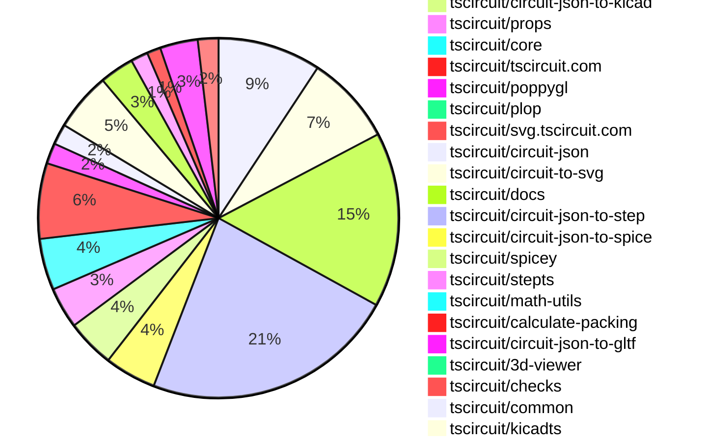
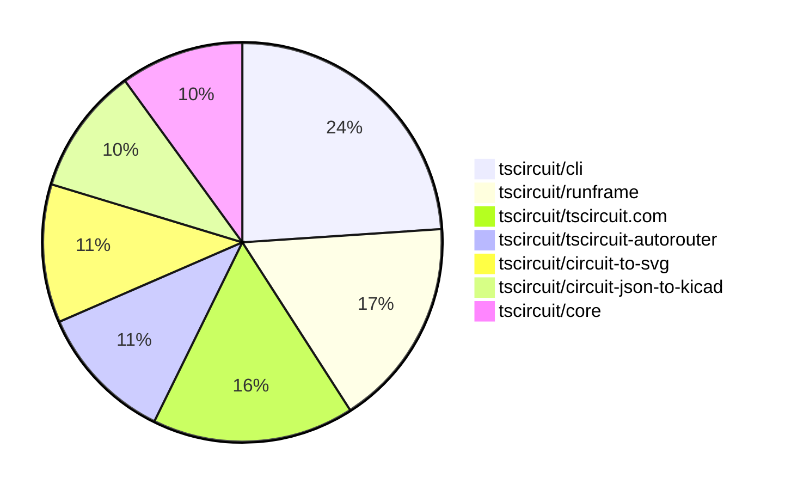

# contribution-tracker

[contributions.tscircuit.com](https://contributions.tscircuit.com) ・ [tscircuit.com](https://tscircuit.com) ・ [Contribution Overviews](./contribution-overviews/) ・ [Changelogs](./changelogs/)

Generates weekly contribution overviews for tscircuit contributors. Check out all
the [contribution overviews here](./contribution-overviews/)
You can find AI-generated monthly changelogs in the [changelogs directory](./changelogs/).

- All PRs in the tscircuit org are scanned/summarized via an LLM
- The LLM classifies each Diff/PR as into a set of attributes for scoring
- All the PRs, summaries, and classifications are organized into charts and tables for [the website](https://contributions.tscircuit.com)

> Want to run locally? See the [Development Section](#development)

The current week is shown below. There are 3 major sections:

- [Contributor Overview](#contributor-overview)
- [PRs by Repository](#prs-by-repository)
- [PRs by Contributor](#changes-by-contributor)

## Current Week

<!-- START_CURRENT_WEEK -->

# Contribution Overview 2025-10-01

## PRs by Repository



## Contributor Overview

| Contributor | 🐳 Major | 🐙 Minor | 🐌 Tiny | ⭐ | Score | Discussion Contributions |
|-------------|---------|---------|---------|-----|----------------|--------------------------|
| [seveibar](#seveibar) | 22 | 29 | 36 | 👑👑 | 99 | 0🔹 0🔶 0💎 |
| [imrishabh18](#imrishabh18) | 3 | 12 | 14 | 👑 | 60 | 0🔹 0🔶 0💎 |
| [ShiboSoftwareDev](#ShiboSoftwareDev) | 5 | 10 | 5 | ⭐⭐⭐ | 44.5 | 0🔹 0🔶 0💎 |
| [ArnavK-09](#ArnavK-09) | 4 | 6 | 4 | ⭐⭐⭐ | 34 | 0🔹 0🔶 0💎 |
| [0hmX](#0hmX) | 3 | 7 | 4 | ⭐⭐ | 30 | 0🔹 0🔶 0💎 |
| [tscircuitbot](#tscircuitbot) | 0 | 0 | 160 | ⭐⭐ | 18 | 0🔹 0🔶 0💎 |
| [MustafaMulla29](#MustafaMulla29) | 1 | 4 | 2 | ⭐⭐ | 14 | 0🔹 0🔶 0💎 |
| [pxlpal](#pxlpal) | 1 | 3 | 1 | ⭐⭐ | 11 | 0🔹 0🔶 0💎 |
| [nailoo](#nailoo) | 1 | 0 | 1 | ⭐ | 10 | 0🔹 0🔶 0💎 |
| [jayantpranjal0](#jayantpranjal0) | 0 | 2 | 2 | ⭐ | 6 | 0🔹 0🔶 0💎 |
| [Abse2001](#Abse2001) | 0 | 2 | 1 | ⭐ | 6 | 0🔹 0🔶 0💎 |
| [techmannih](#techmannih) | 0 | 1 | 0 | ⭐ | 6 | 0🔹 0🔶 0💎 |
| [Excellencedev](#Excellencedev) | 0 | 1 | 0 | ⭐ | 4 | 0🔹 0🔶 0💎 |
| [Ayushjhawar8](#Ayushjhawar8) | 0 | 1 | 2 | ⭐ | 4 | 0🔹 0🔶 0💎 |
| [Omar8345](#Omar8345) | 1 | 0 | 0 | ⭐ | 4 | 0🔹 0🔶 0💎 |

### Discussion Contribution Legend

- 🔹 Normal Comments: Basic participation with minimal effort
- 🔶 Great Informative Comments: Thoughtful participation that adds value
- 💎 Incredible Comments: Exceptional participation with high-quality content

## Review Table

[reviews-received-hover]: ## "Number of reviews received for PRs for this contributor"
[approvals-received-hover]: ## "Number of approvals received for PRs this contributor authored"
[rejections-received-hover]: ## "Number of rejections received for PRs this contributor authored"
[prs-opened-hover]: ## "Number of PRs opened by this contributor"
[issues-created-hover]: ## "Number of issues created by this contributor"
[bountied-issues-hover]: ## "Number of issues this contributor created with a bounty"
[bountied-issue-$-hover]: ## "Total bounty amount placed on issues authored by this contributor"

| Contributor | Reviews Received | Approvals Received | Rejections Received | Approvals | Rejections | PRs Opened | PRs Merged | Score | Issues Created | Bountied Issues | Bountied Issue $ |
|---|---|---|---|---|---|---|---|---|---|---|---|
| [tscircuitbot](#tscircuitbot) | 0 | 0 | 0 | 0 | 0 | 208 | 160 | 18 | 0 | 0 | 0 |
| [naaa760](#naaa760) | 2 | 0 | 0 | 0 | 0 | 6 | 0 | 0 | 0 | 0 | 0 |
| [nailoo](#nailoo) | 12 | 1 | 3 | 0 | 2 | 5 | 2 | 10 | 0 | 0 | 0 |
| [imrishabh18](#imrishabh18) | 14 | 11 | 0 | 5 | 8 | 33 | 30 | 60 | 0 | 0 | 0 |
| [Priyanshuthapliyal2005](#Priyanshuthapliyal2005) | 2 | 0 | 1 | 0 | 0 | 4 | 0 | 0 | 0 | 0 | 0 |
| [ShiboSoftwareDev](#ShiboSoftwareDev) | 32 | 22 | 1 | 0 | 0 | 22 | 20 | 44.5 | 0 | 0 | 0 |
| [seveibar](#seveibar) | 49 | 0 | 0 | 85 | 21 | 115 | 88 | 99 | 0 | 0 | 0 |
| [jayantpranjal0](#jayantpranjal0) | 9 | 4 | 0 | 0 | 0 | 6 | 4 | 6 | 0 | 0 | 0 |
| [Quanta-Naut](#Quanta-Naut) | 20 | 1 | 5 | 0 | 0 | 2 | 0 | 0 | 0 | 0 | 0 |
| [Abse2001](#Abse2001) | 5 | 3 | 0 | 1 | 0 | 5 | 3 | 6 | 0 | 0 | 0 |
| [techmannih](#techmannih) | 2 | 1 | 0 | 0 | 1 | 1 | 1 | 6 | 0 | 0 | 0 |
| [saish9901](#saish9901) | 3 | 0 | 1 | 0 | 0 | 2 | 0 | 0 | 0 | 0 | 0 |
| [Excellencedev](#Excellencedev) | 23 | 2 | 7 | 0 | 0 | 9 | 1 | 4 | 0 | 0 | 0 |
| [MustafaMulla29](#MustafaMulla29) | 22 | 9 | 2 | 0 | 0 | 8 | 7 | 14 | 0 | 0 | 0 |
| [ArnavK-09](#ArnavK-09) | 18 | 14 | 0 | 2 | 0 | 14 | 14 | 34 | 0 | 0 | 0 |
| [Omar8345](#Omar8345) | 2 | 2 | 0 | 0 | 0 | 2 | 1 | 4 | 0 | 0 | 0 |
| [Sanjay-Kirti](#Sanjay-Kirti) | 4 | 0 | 0 | 0 | 0 | 1 | 0 | 0 | 0 | 0 | 0 |
| [0hmX](#0hmX) | 15 | 15 | 0 | 0 | 0 | 15 | 14 | 30 | 0 | 0 | 0 |
| [baeoc](#baeoc) | 2 | 0 | 2 | 0 | 0 | 6 | 0 | 0 | 0 | 0 | 0 |
| [Harsh9485](#Harsh9485) | 1 | 0 | 0 | 0 | 0 | 1 | 0 | 0 | 0 | 0 | 0 |
| [Ayushjhawar8](#Ayushjhawar8) | 8 | 3 | 3 | 0 | 0 | 7 | 3 | 4 | 0 | 0 | 0 |
| [pxlpal](#pxlpal) | 5 | 5 | 0 | 0 | 0 | 5 | 5 | 11 | 0 | 0 | 0 |
| [Asymtode712](#Asymtode712) | 1 | 0 | 0 | 0 | 0 | 2 | 0 | 0 | 0 | 0 | 0 |
| [DevGajjar28](#DevGajjar28) | 1 | 0 | 0 | 0 | 0 | 1 | 0 | 0 | 0 | 0 | 0 |
| [brymut](#brymut) | 1 | 0 | 1 | 0 | 0 | 1 | 0 | 0 | 0 | 0 | 0 |
| [Sahelisaha04](#Sahelisaha04) | 5 | 0 | 0 | 0 | 0 | 1 | 0 | 0 | 0 | 0 | 0 |
| [Brijeshthummar02](#Brijeshthummar02) | 1 | 0 | 1 | 0 | 0 | 1 | 0 | 0 | 0 | 0 | 0 |
| [rajdeep-singha](#rajdeep-singha) | 0 | 0 | 0 | 0 | 0 | 1 | 0 | 0 | 0 | 0 | 0 |
| [ozimmortal](#ozimmortal) | 1 | 0 | 0 | 0 | 0 | 1 | 0 | 0 | 0 | 0 | 0 |
| [vansh2408](#vansh2408) | 1 | 0 | 1 | 0 | 0 | 1 | 0 | 0 | 0 | 0 | 0 |
| [bitsbyritik](#bitsbyritik) | 1 | 0 | 1 | 0 | 0 | 1 | 0 | 0 | 0 | 0 | 0 |
| [RaghavArora14](#RaghavArora14) | 1 | 0 | 0 | 0 | 0 | 3 | 0 | 0 | 0 | 0 | 0 |
| [1914Jegx](#1914Jegx) | 1 | 0 | 1 | 0 | 0 | 2 | 0 | 0 | 0 | 0 | 0 |
| [Incharajayaram](#Incharajayaram) | 1 | 0 | 0 | 0 | 0 | 4 | 0 | 0 | 0 | 0 | 0 |
| [devroy10](#devroy10) | 0 | 0 | 0 | 0 | 0 | 1 | 0 | 0 | 0 | 0 | 0 |
| [kavitasaini1999](#kavitasaini1999) | 3 | 0 | 1 | 0 | 0 | 1 | 0 | 0 | 0 | 0 | 0 |
| [h30s](#h30s) | 1 | 0 | 1 | 0 | 0 | 1 | 0 | 0 | 0 | 0 | 0 |

## Top 7 Repositories by Contribution Points



## Changes by Repository

### [tscircuit/tscircuit](https://github.com/tscircuit/tscircuit)


<details>
<summary>🐌 Tiny Contributions (30)</summary>

| PR # | Impact | Contributor | Description |
|------|--------|-------------|-------------|
| [#923](https://github.com/tscircuit/tscircuit/pull/923) | 🐌 Tiny | tscircuitbot | Updates the package version from 0.0.715 to 0.0.716 in package.json |
| [#921](https://github.com/tscircuit/tscircuit/pull/921) | 🐌 Tiny | tscircuitbot | Updates the tscircuitcli package from version 0.1.289 to 0.1.290 |
| [#922](https://github.com/tscircuit/tscircuit/pull/922) | 🐌 Tiny | tscircuitbot | Automated package update |
| [#920](https://github.com/tscircuit/tscircuit/pull/920) | 🐌 Tiny | tscircuitbot | Updates the tscircuitcli package to version 0.1.290 in the package.json file |
| [#919](https://github.com/tscircuit/tscircuit/pull/919) | 🐌 Tiny | tscircuitbot | Automated package update |
| [#918](https://github.com/tscircuit/tscircuit/pull/918) | 🐌 Tiny | tscircuitbot | Automated package update |
| [#917](https://github.com/tscircuit/tscircuit/pull/917) | 🐌 Tiny | tscircuitbot | Updates the tscircuitcli package from version 0.1.288 to 0.1.289 and the tscircuitrunframe package from version 0.0.1058 to 0.0.1060. |
| [#916](https://github.com/tscircuit/tscircuit/pull/916) | 🐌 Tiny | tscircuitbot | Automated package update |
| [#914](https://github.com/tscircuit/tscircuit/pull/914) | 🐌 Tiny | tscircuitbot | Updates the tscircuitcli package from version 0.1.287 to 0.1.288 and the tscircuitrunframe package from version 0.0.1057 to 0.0.1058. |
| [#915](https://github.com/tscircuit/tscircuit/pull/915) | 🐌 Tiny | tscircuitbot | Automated package update |
| [#913](https://github.com/tscircuit/tscircuit/pull/913) | 🐌 Tiny | tscircuitbot | Updates the tscircuitcli package from version 0.1.287 to 0.1.288 and the tscircuitrunframe package from version 0.0.1057 to 0.0.1058 as part of an automated package update. |
| [#912](https://github.com/tscircuit/tscircuit/pull/912) | 🐌 Tiny | tscircuitbot | Automated package update |
| [#910](https://github.com/tscircuit/tscircuit/pull/910) | 🐌 Tiny | tscircuitbot | Automated package update |
| [#911](https://github.com/tscircuit/tscircuit/pull/911) | 🐌 Tiny | tscircuitbot | Updates the package version from 0.0.709 to 0.0.710 in package.json |
| [#909](https://github.com/tscircuit/tscircuit/pull/909) | 🐌 Tiny | tscircuitbot | Updates various package dependencies to their latest versions in the project. |
| [#908](https://github.com/tscircuit/tscircuit/pull/908) | 🐌 Tiny | tscircuitbot | Automated package update to version 0.0.709 |
| [#906](https://github.com/tscircuit/tscircuit/pull/906) | 🐌 Tiny | tscircuitbot | Automated package update |
| [#907](https://github.com/tscircuit/tscircuit/pull/907) | 🐌 Tiny | tscircuitbot | Automated package update |
| [#905](https://github.com/tscircuit/tscircuit/pull/905) | 🐌 Tiny | tscircuitbot | Automated package update |
| [#904](https://github.com/tscircuit/tscircuit/pull/904) | 🐌 Tiny | tscircuitbot | Automated package update |
| [#903](https://github.com/tscircuit/tscircuit/pull/903) | 🐌 Tiny | tscircuitbot | Updates the package version from 0.0.705 to 0.0.706 in package.json |
| [#901](https://github.com/tscircuit/tscircuit/pull/901) | 🐌 Tiny | tscircuitbot | Updates the package version from 0.0.704 to 0.0.705 in package.json |
| [#899](https://github.com/tscircuit/tscircuit/pull/899) | 🐌 Tiny | tscircuitbot | Automated package update |
| [#894](https://github.com/tscircuit/tscircuit/pull/894) | 🐌 Tiny | tscircuitbot | Automated package update |
| [#892](https://github.com/tscircuit/tscircuit/pull/892) | 🐌 Tiny | tscircuitbot | Automated package update |
| [#902](https://github.com/tscircuit/tscircuit/pull/902) | 🐌 Tiny | imrishabh18 | Moves certain dependencies from devDependencies to dependencies in package.json |
| [#900](https://github.com/tscircuit/tscircuit/pull/900) | 🐌 Tiny | imrishabh18 | Updates various package dependencies in the project to their latest versions. |
| [#898](https://github.com/tscircuit/tscircuit/pull/898) | 🐌 Tiny | imrishabh18 | Updates the GitHub Actions workflow to change the environment variable from PACKAGE_NAMES to UPSTREAM_PACKAGES_TO_UPDATE for triggering upstream repo updates. |
| [#893](https://github.com/tscircuit/tscircuit/pull/893) | 🐌 Tiny | imrishabh18 | Updates the CLI dependency version from 0.1.259 to 0.1.262 in package.json |
| [#891](https://github.com/tscircuit/tscircuit/pull/891) | 🐌 Tiny | imrishabh18 | Updates the CLI dependency version from 0.1.253 to 0.1.259 in package.json |

</details>

### [tscircuit/eval](https://github.com/tscircuit/eval)

| PR # | Impact | Rating | Contributor | Description |
|------|--------|--------|-------------|-------------|
| [#1168](https://github.com/tscircuit/eval/pull/1168) | 🐙 Minor | ⭐⭐ | ArnavK-09 | Removes outdated KiCad logic and unused footprint parsing code from the project. |

<details>
<summary>🐌 Tiny Contributions (25)</summary>

| PR # | Impact | Contributor | Description |
|------|--------|-------------|-------------|
| [#1188](https://github.com/tscircuit/eval/pull/1188) | 🐌 Tiny | tscircuitbot | Automated package update |
| [#1186](https://github.com/tscircuit/eval/pull/1186) | 🐌 Tiny | tscircuitbot | Automated package update |
| [#1185](https://github.com/tscircuit/eval/pull/1185) | 🐌 Tiny | tscircuitbot | Automated package update |
| [#1184](https://github.com/tscircuit/eval/pull/1184) | 🐌 Tiny | tscircuitbot | Automated package update |
| [#1182](https://github.com/tscircuit/eval/pull/1182) | 🐌 Tiny | tscircuitbot | Automated package update |
| [#1181](https://github.com/tscircuit/eval/pull/1181) | 🐌 Tiny | tscircuitbot | Automated package update |
| [#1180](https://github.com/tscircuit/eval/pull/1180) | 🐌 Tiny | tscircuitbot | Automated package update to version 0.0.364 |
| [#1178](https://github.com/tscircuit/eval/pull/1178) | 🐌 Tiny | tscircuitbot | Automated package update |
| [#1176](https://github.com/tscircuit/eval/pull/1176) | 🐌 Tiny | tscircuitbot | Automated package update |
| [#1175](https://github.com/tscircuit/eval/pull/1175) | 🐌 Tiny | tscircuitbot | Automated package update |
| [#1174](https://github.com/tscircuit/eval/pull/1174) | 🐌 Tiny | tscircuitbot | Automated package update |
| [#1172](https://github.com/tscircuit/eval/pull/1172) | 🐌 Tiny | tscircuitbot | Automated package update |
| [#1171](https://github.com/tscircuit/eval/pull/1171) | 🐌 Tiny | tscircuitbot | Automated package update |
| [#1169](https://github.com/tscircuit/eval/pull/1169) | 🐌 Tiny | tscircuitbot | Automated package update |
| [#1167](https://github.com/tscircuit/eval/pull/1167) | 🐌 Tiny | tscircuitbot | Automated package update |
| [#1165](https://github.com/tscircuit/eval/pull/1165) | 🐌 Tiny | tscircuitbot | Updates package dependencies to their latest versions in package.json |
| [#1164](https://github.com/tscircuit/eval/pull/1164) | 🐌 Tiny | tscircuitbot | Automated package update |
| [#1162](https://github.com/tscircuit/eval/pull/1162) | 🐌 Tiny | tscircuitbot | Updates the version of the tscircuitcore package from 0.0.756 to 0.0.757 in package.json |
| [#1160](https://github.com/tscircuit/eval/pull/1160) | 🐌 Tiny | tscircuitbot | Automated package update |
| [#1158](https://github.com/tscircuit/eval/pull/1158) | 🐌 Tiny | tscircuitbot | Automated package update |
| [#1159](https://github.com/tscircuit/eval/pull/1159) | 🐌 Tiny | tscircuitbot | Automated package update |
| [#1157](https://github.com/tscircuit/eval/pull/1157) | 🐌 Tiny | tscircuitbot | Automated package update |
| [#1156](https://github.com/tscircuit/eval/pull/1156) | 🐌 Tiny | tscircuitbot | Automated package update |
| [#1155](https://github.com/tscircuit/eval/pull/1155) | 🐌 Tiny | tscircuitbot | Automated package update |
| [#1179](https://github.com/tscircuit/eval/pull/1179) | 🐌 Tiny | seveibar | Adds the built dist directory to the package.json files array for publishing purposes. |

</details>

### [tscircuit/runframe](https://github.com/tscircuit/runframe)

| PR # | Impact | Rating | Contributor | Description |
|------|--------|--------|-------------|-------------|
| [#1314](https://github.com/tscircuit/runframe/pull/1314) | 🐳 Major | ⭐⭐⭐ | seveibar | Adds a Pinout SVG export option in the export menu, implementing SVG export using circuit-to-svg and a download helper. |
| [#1297](https://github.com/tscircuit/runframe/pull/1297) | 🐙 Minor | ⭐⭐ | seveibar | Adds functionality to export KiCad projects as downloadable zip files containing schematic and PCB files. |
| [#1292](https://github.com/tscircuit/runframe/pull/1292) | 🐙 Minor | ⭐⭐ | pxlpal | Aligns the display of JLCPCB stock count on narrow viewports to ensure proper visibility and layout. |

<details>
<summary>🐌 Tiny Contributions (48)</summary>

| PR # | Impact | Contributor | Description |
|------|--------|-------------|-------------|
| [#1354](https://github.com/tscircuit/runframe/pull/1354) | 🐌 Tiny | tscircuitbot | Automated package update |
| [#1353](https://github.com/tscircuit/runframe/pull/1353) | 🐌 Tiny | tscircuitbot | Automated package update |
| [#1349](https://github.com/tscircuit/runframe/pull/1349) | 🐌 Tiny | tscircuitbot | Automated package update |
| [#1348](https://github.com/tscircuit/runframe/pull/1348) | 🐌 Tiny | tscircuitbot | Updates the tscircuit3d-viewer package to version 0.0.407 in the package.json file |
| [#1346](https://github.com/tscircuit/runframe/pull/1346) | 🐌 Tiny | tscircuitbot | Automated package update |
| [#1345](https://github.com/tscircuit/runframe/pull/1345) | 🐌 Tiny | tscircuitbot | Automated package update |
| [#1344](https://github.com/tscircuit/runframe/pull/1344) | 🐌 Tiny | tscircuitbot | Updates the tscircuiteval package to version 0.0.367 in the package.json file. |
| [#1342](https://github.com/tscircuit/runframe/pull/1342) | 🐌 Tiny | tscircuitbot | Automated package update |
| [#1341](https://github.com/tscircuit/runframe/pull/1341) | 🐌 Tiny | tscircuitbot | Updates the tscircuiteval package to version 0.0.366 |
| [#1340](https://github.com/tscircuit/runframe/pull/1340) | 🐌 Tiny | tscircuitbot | Automated package update |
| [#1338](https://github.com/tscircuit/runframe/pull/1338) | 🐌 Tiny | tscircuitbot | Automated package version bump from 0.0.1050 to 0.0.1052 |
| [#1337](https://github.com/tscircuit/runframe/pull/1337) | 🐌 Tiny | tscircuitbot | Updates the tscircuiteval package to version 0.0.365 in the package.json file. |
| [#1336](https://github.com/tscircuit/runframe/pull/1336) | 🐌 Tiny | tscircuitbot | Updates the tscircuiteval package from version 0.0.364 to 0.0.365 |
| [#1334](https://github.com/tscircuit/runframe/pull/1334) | 🐌 Tiny | tscircuitbot | Automated package update |
| [#1333](https://github.com/tscircuit/runframe/pull/1333) | 🐌 Tiny | tscircuitbot | Updates the tscircuiteval package to version 0.0.364 in the package.json file. |
| [#1332](https://github.com/tscircuit/runframe/pull/1332) | 🐌 Tiny | tscircuitbot | Updates the tscircuiteval package to version 0.0.364 in the package.json file. |
| [#1330](https://github.com/tscircuit/runframe/pull/1330) | 🐌 Tiny | tscircuitbot | Automated package update |
| [#1329](https://github.com/tscircuit/runframe/pull/1329) | 🐌 Tiny | tscircuitbot | Updates the tscircuiteval package to version 0.0.363 in the package.json file. |
| [#1328](https://github.com/tscircuit/runframe/pull/1328) | 🐌 Tiny | tscircuitbot | Updates the tscircuiteval package to version 0.0.363 in the package.json file. |
| [#1326](https://github.com/tscircuit/runframe/pull/1326) | 🐌 Tiny | tscircuitbot | Automated package update |
| [#1325](https://github.com/tscircuit/runframe/pull/1325) | 🐌 Tiny | tscircuitbot | Updates the tscircuiteval package to version 0.0.362 |
| [#1324](https://github.com/tscircuit/runframe/pull/1324) | 🐌 Tiny | tscircuitbot | Updates the tscircuiteval package from version 0.0.361 to 0.0.362 |
| [#1322](https://github.com/tscircuit/runframe/pull/1322) | 🐌 Tiny | tscircuitbot | Automated package update |
| [#1321](https://github.com/tscircuit/runframe/pull/1321) | 🐌 Tiny | tscircuitbot | Updates the tscircuiteval package to version 0.0.361 in the package.json file. |
| [#1320](https://github.com/tscircuit/runframe/pull/1320) | 🐌 Tiny | tscircuitbot | Updates the tscircuiteval package to version 0.0.361 |
| [#1318](https://github.com/tscircuit/runframe/pull/1318) | 🐌 Tiny | tscircuitbot | Automated package update |
| [#1317](https://github.com/tscircuit/runframe/pull/1317) | 🐌 Tiny | tscircuitbot | Automated package update |
| [#1316](https://github.com/tscircuit/runframe/pull/1316) | 🐌 Tiny | tscircuitbot | Automated package update |
| [#1315](https://github.com/tscircuit/runframe/pull/1315) | 🐌 Tiny | tscircuitbot | Automated package update |
| [#1312](https://github.com/tscircuit/runframe/pull/1312) | 🐌 Tiny | tscircuitbot | Automated package update |
| [#1311](https://github.com/tscircuit/runframe/pull/1311) | 🐌 Tiny | tscircuitbot | Updates the tscircuiteval package to version 0.0.359 |
| [#1310](https://github.com/tscircuit/runframe/pull/1310) | 🐌 Tiny | tscircuitbot | Updates the tscircuiteval package to version 0.0.359 |
| [#1308](https://github.com/tscircuit/runframe/pull/1308) | 🐌 Tiny | tscircuitbot | Automated package update |
| [#1307](https://github.com/tscircuit/runframe/pull/1307) | 🐌 Tiny | tscircuitbot | Updates the tscircuiteval package to version 0.0.358 in the package.json file. |
| [#1306](https://github.com/tscircuit/runframe/pull/1306) | 🐌 Tiny | tscircuitbot | Updates the tscircuiteval package to version 0.0.358 in the package.json file. |
| [#1303](https://github.com/tscircuit/runframe/pull/1303) | 🐌 Tiny | tscircuitbot | Automated package update |
| [#1302](https://github.com/tscircuit/runframe/pull/1302) | 🐌 Tiny | tscircuitbot | Updates the tscircuiteval package to version 0.0.357 in the package.json file. |
| [#1301](https://github.com/tscircuit/runframe/pull/1301) | 🐌 Tiny | tscircuitbot | Updates the tscircuiteval package to version 0.0.357 in package.json |
| [#1300](https://github.com/tscircuit/runframe/pull/1300) | 🐌 Tiny | tscircuitbot | Updates the tscircuiteval package to version 0.0.356 in the package.json file. |
| [#1299](https://github.com/tscircuit/runframe/pull/1299) | 🐌 Tiny | tscircuitbot | Updates the tscircuiteval package from version 0.0.355 to 0.0.356 |
| [#1298](https://github.com/tscircuit/runframe/pull/1298) | 🐌 Tiny | tscircuitbot | Updates the tscircuiteval package to version 0.0.355 in the package.json file. |
| [#1296](https://github.com/tscircuit/runframe/pull/1296) | 🐌 Tiny | tscircuitbot | Automated package update to version 0.0.1033 |
| [#1295](https://github.com/tscircuit/runframe/pull/1295) | 🐌 Tiny | tscircuitbot | Updates the tscircuit3d-viewer package to version 0.0.406 in package.json |
| [#1294](https://github.com/tscircuit/runframe/pull/1294) | 🐌 Tiny | tscircuitbot | Automated package update |
| [#1293](https://github.com/tscircuit/runframe/pull/1293) | 🐌 Tiny | tscircuitbot | Updates the tscircuit3d-viewer package to version 0.0.405 in package.json |
| [#1351](https://github.com/tscircuit/runframe/pull/1351) | 🐌 Tiny | ArnavK-09 | Fixes the link for displaying Circuit JSON in 3D, PCB or Schematic mode with the CircuitJsonPreview React component |
| [#1350](https://github.com/tscircuit/runframe/pull/1350) | 🐌 Tiny | ArnavK-09 | Displays the current version of the runframe package in the File Menu Left Header component. |
| [#1352](https://github.com/tscircuit/runframe/pull/1352) | 🐌 Tiny | ArnavK-09 | This pull request addresses the alignment issue of footer buttons in the ErrorTabContent component, ensuring they are properly displayed on the screen. |

</details>

### [tscircuit/cli](https://github.com/tscircuit/cli)

| PR # | Impact | Rating | Contributor | Description |
|------|--------|--------|-------------|-------------|
| [#458](https://github.com/tscircuit/cli/pull/458) | 🐙 Minor | ⭐⭐ | imrishabh18 | Allows users to push packages under their organization accounts if they have the necessary permissions, enhancing the package management capabilities. |
| [#442](https://github.com/tscircuit/cli/pull/442) | 🐙 Minor | ⭐⭐ | imrishabh18 | Replaces the simple 3D SVG conversion in snapshot generation with a poppygl-based GLB to PNG workflow, writing 3D snapshots as rendered PNG buffers and adjusting diffing logic accordingly, while removing the unused simple 3D dependency from package metadata. |
| [#435](https://github.com/tscircuit/cli/pull/435) | 🐙 Minor | ⭐⭐ | imrishabh18 | Switches the 3D PNG generation process from using simple-3d to poppygl, enhancing the rendering of 3D images in the tscircuit build process. |
| [#431](https://github.com/tscircuit/cli/pull/431) | 🐙 Minor | ⭐⭐ | seveibar | Add support for exporting KiCad schematic, PCB, and zip files using circuit-json-to-kicad, including necessary dependencies and CLI tests for the new formats. |
| [#423](https://github.com/tscircuit/cli/pull/423) | 🐙 Minor | ⭐⭐ | seveibar | Moves the logic for resolving tsci tarball URLs into a shared helper and reuses it from the add command when the registry entry is missing. |

<details>
<summary>🐌 Tiny Contributions (69)</summary>

| PR # | Impact | Contributor | Description |
|------|--------|-------------|-------------|
| [#505](https://github.com/tscircuit/cli/pull/505) | 🐌 Tiny | tscircuitbot | Automated package update |
| [#504](https://github.com/tscircuit/cli/pull/504) | 🐌 Tiny | tscircuitbot | Updates the tscircuitrunframe package to version 0.0.1060 |
| [#502](https://github.com/tscircuit/cli/pull/502) | 🐌 Tiny | tscircuitbot | Updates the tscircuitrunframe package to version 0.0.1059 in the package.json file. |
| [#503](https://github.com/tscircuit/cli/pull/503) | 🐌 Tiny | tscircuitbot | Automated package update |
| [#501](https://github.com/tscircuit/cli/pull/501) | 🐌 Tiny | tscircuitbot | Updates the tscircuitrunframe package to version 0.0.1059 in the package.json file. |
| [#500](https://github.com/tscircuit/cli/pull/500) | 🐌 Tiny | tscircuitbot | Automated package update |
| [#499](https://github.com/tscircuit/cli/pull/499) | 🐌 Tiny | tscircuitbot | Updates the tscircuitrunframe package to version 0.0.1058 in the package.json file. |
| [#498](https://github.com/tscircuit/cli/pull/498) | 🐌 Tiny | tscircuitbot | Automated package update |
| [#497](https://github.com/tscircuit/cli/pull/497) | 🐌 Tiny | tscircuitbot | Updates the tscircuitrunframe package from version 0.0.1055 to 0.0.1057 |
| [#495](https://github.com/tscircuit/cli/pull/495) | 🐌 Tiny | tscircuitbot | Automated package update |
| [#493](https://github.com/tscircuit/cli/pull/493) | 🐌 Tiny | tscircuitbot | Automated package update |
| [#491](https://github.com/tscircuit/cli/pull/491) | 🐌 Tiny | tscircuitbot | Automated package update |
| [#489](https://github.com/tscircuit/cli/pull/489) | 🐌 Tiny | tscircuitbot | Automated package update |
| [#488](https://github.com/tscircuit/cli/pull/488) | 🐌 Tiny | tscircuitbot | Updates the tscircuitrunframe package from version 0.0.1053 to 0.0.1055 |
| [#487](https://github.com/tscircuit/cli/pull/487) | 🐌 Tiny | tscircuitbot | Automated package update |
| [#485](https://github.com/tscircuit/cli/pull/485) | 🐌 Tiny | tscircuitbot | Updates the tscircuitrunframe package from version 0.0.1052 to 0.0.1053 |
| [#486](https://github.com/tscircuit/cli/pull/486) | 🐌 Tiny | tscircuitbot | Automated package update |
| [#483](https://github.com/tscircuit/cli/pull/483) | 🐌 Tiny | tscircuitbot | Updates the tscircuitrunframe package from version 0.0.1051 to 0.0.1052 |
| [#484](https://github.com/tscircuit/cli/pull/484) | 🐌 Tiny | tscircuitbot | Automated package update |
| [#482](https://github.com/tscircuit/cli/pull/482) | 🐌 Tiny | tscircuitbot | Updates the tscircuitrunframe package from version 0.0.1051 to 0.0.1052 |
| [#481](https://github.com/tscircuit/cli/pull/481) | 🐌 Tiny | tscircuitbot | Automated package update |
| [#480](https://github.com/tscircuit/cli/pull/480) | 🐌 Tiny | tscircuitbot | Automated package update |
| [#479](https://github.com/tscircuit/cli/pull/479) | 🐌 Tiny | tscircuitbot | Automated package update |
| [#477](https://github.com/tscircuit/cli/pull/477) | 🐌 Tiny | tscircuitbot | Updates the tscircuitrunframe package from version 0.0.1049 to 0.0.1050 |
| [#476](https://github.com/tscircuit/cli/pull/476) | 🐌 Tiny | tscircuitbot | Automated package update |
| [#475](https://github.com/tscircuit/cli/pull/475) | 🐌 Tiny | tscircuitbot | Automated package update |
| [#474](https://github.com/tscircuit/cli/pull/474) | 🐌 Tiny | tscircuitbot | Automated package update to version 0.1.276 |
| [#472](https://github.com/tscircuit/cli/pull/472) | 🐌 Tiny | tscircuitbot | Automated package update |
| [#471](https://github.com/tscircuit/cli/pull/471) | 🐌 Tiny | tscircuitbot | Automated package update |
| [#470](https://github.com/tscircuit/cli/pull/470) | 🐌 Tiny | tscircuitbot | Automated package update |
| [#469](https://github.com/tscircuit/cli/pull/469) | 🐌 Tiny | tscircuitbot | Updates the tscircuitrunframe package from version 0.0.1045 to 0.0.1047 |
| [#468](https://github.com/tscircuit/cli/pull/468) | 🐌 Tiny | tscircuitbot | Automated package update |
| [#467](https://github.com/tscircuit/cli/pull/467) | 🐌 Tiny | tscircuitbot | Updates the tscircuitrunframe package to version 0.0.1045 |
| [#466](https://github.com/tscircuit/cli/pull/466) | 🐌 Tiny | tscircuitbot | Automated package update |
| [#464](https://github.com/tscircuit/cli/pull/464) | 🐌 Tiny | tscircuitbot | Automated package update |
| [#463](https://github.com/tscircuit/cli/pull/463) | 🐌 Tiny | tscircuitbot | Automated package update |
| [#462](https://github.com/tscircuit/cli/pull/462) | 🐌 Tiny | tscircuitbot | Updates the tscircuitrunframe package to version 0.0.1043 in package.json |
| [#461](https://github.com/tscircuit/cli/pull/461) | 🐌 Tiny | tscircuitbot | Automated package update |
| [#459](https://github.com/tscircuit/cli/pull/459) | 🐌 Tiny | tscircuitbot | Updates the tscircuitrunframe package to version 0.0.1042 in the package.json file. |
| [#457](https://github.com/tscircuit/cli/pull/457) | 🐌 Tiny | tscircuitbot | Automated package update to version 0.1.269 |
| [#456](https://github.com/tscircuit/cli/pull/456) | 🐌 Tiny | tscircuitbot | Updates the tscircuitrunframe package to version 0.0.1041 in the package.json file. |
| [#454](https://github.com/tscircuit/cli/pull/454) | 🐌 Tiny | tscircuitbot | Automated package update |
| [#453](https://github.com/tscircuit/cli/pull/453) | 🐌 Tiny | tscircuitbot | Updates the tscircuitrunframe package version from 0.0.1039 to 0.0.1040 |
| [#452](https://github.com/tscircuit/cli/pull/452) | 🐌 Tiny | tscircuitbot | Automated package update |
| [#450](https://github.com/tscircuit/cli/pull/450) | 🐌 Tiny | tscircuitbot | Updates the tscircuitrunframe package to version 0.0.1039 in the package.json file |
| [#451](https://github.com/tscircuit/cli/pull/451) | 🐌 Tiny | tscircuitbot | Automated package update |
| [#449](https://github.com/tscircuit/cli/pull/449) | 🐌 Tiny | tscircuitbot | Updates the tscircuitrunframe package to version 0.0.1039 in the package.json file. |
| [#448](https://github.com/tscircuit/cli/pull/448) | 🐌 Tiny | tscircuitbot | Automated package update |
| [#446](https://github.com/tscircuit/cli/pull/446) | 🐌 Tiny | tscircuitbot | Updates the tscircuitrunframe package to version 0.0.1038 |
| [#447](https://github.com/tscircuit/cli/pull/447) | 🐌 Tiny | tscircuitbot | Automated package update |
| [#444](https://github.com/tscircuit/cli/pull/444) | 🐌 Tiny | tscircuitbot | Automated package update |
| [#445](https://github.com/tscircuit/cli/pull/445) | 🐌 Tiny | tscircuitbot | Automated package update |
| [#443](https://github.com/tscircuit/cli/pull/443) | 🐌 Tiny | tscircuitbot | Updates the tscircuitrunframe package to version 0.0.1037 in the package.json file. |
| [#441](https://github.com/tscircuit/cli/pull/441) | 🐌 Tiny | tscircuitbot | Automated package update |
| [#440](https://github.com/tscircuit/cli/pull/440) | 🐌 Tiny | tscircuitbot | Automated package update |
| [#439](https://github.com/tscircuit/cli/pull/439) | 🐌 Tiny | tscircuitbot | Updates the tscircuitrunframe package to version 0.0.1036 in the package.json file |
| [#438](https://github.com/tscircuit/cli/pull/438) | 🐌 Tiny | tscircuitbot | Automated package update to version 0.1.260 |
| [#436](https://github.com/tscircuit/cli/pull/436) | 🐌 Tiny | tscircuitbot | Updates the tscircuitrunframe package from version 0.0.1033 to 0.0.1034 |
| [#434](https://github.com/tscircuit/cli/pull/434) | 🐌 Tiny | tscircuitbot | Automated package update |
| [#432](https://github.com/tscircuit/cli/pull/432) | 🐌 Tiny | tscircuitbot | Automated package update |
| [#430](https://github.com/tscircuit/cli/pull/430) | 🐌 Tiny | tscircuitbot | Automated package update |
| [#429](https://github.com/tscircuit/cli/pull/429) | 🐌 Tiny | tscircuitbot | Updates the tscircuitrunframe package from version 0.0.1032 to 0.0.1033 |
| [#426](https://github.com/tscircuit/cli/pull/426) | 🐌 Tiny | tscircuitbot | Updates the tscircuitrunframe package to version 0.0.1032 |
| [#427](https://github.com/tscircuit/cli/pull/427) | 🐌 Tiny | tscircuitbot | Automated package update |
| [#425](https://github.com/tscircuit/cli/pull/425) | 🐌 Tiny | tscircuitbot | Updates the tscircuitrunframe package from version 0.0.1031 to 0.0.1032 |
| [#424](https://github.com/tscircuit/cli/pull/424) | 🐌 Tiny | tscircuitbot | Updates the package version from 0.1.253 to 0.1.254 in package.json |
| [#492](https://github.com/tscircuit/cli/pull/492) | 🐌 Tiny | imrishabh18 | Adds logging to track the start and end of asynchronous effects in the circuit generation process. |
| [#490](https://github.com/tscircuit/cli/pull/490) | 🐌 Tiny | imrishabh18 | Adds an exit code to indicate success or failure at the end of the build process. |
| [#433](https://github.com/tscircuit/cli/pull/433) | 🐌 Tiny | imrishabh18 | Adds additional logging during the tscircuit build command to help diagnose RPC disconnects caused by lack of stdout output. |

</details>

### [tscircuit/tscircuit-autorouter](https://github.com/tscircuit/tscircuit-autorouter)

| PR # | Impact | Rating | Contributor | Description |
|------|--------|--------|-------------|-------------|
| [#256](https://github.com/tscircuit/tscircuit-autorouter/pull/256) | 🐳 Major | ⭐⭐⭐ | imrishabh18 | Fixes the visualization of failed connections in the autorouting process by displaying the last failed connection instead of the next one when no candidates are available. |
| [#279](https://github.com/tscircuit/tscircuit-autorouter/pull/279) | 🐳 Major | ⭐⭐⭐ | seveibar | Add synchronous caching to the high-density intra-node solver with rounded cache keys and cached result application, and update the in-memory cache provider to track hitsmisses by prefix and surface intra-node cache stats from the high-density solver. |
| [#261](https://github.com/tscircuit/tscircuit-autorouter/pull/261) | 🐳 Major | ⭐⭐⭐ | seveibar | Adds a threshold for the percentage of a single-layer node that must be covered by obstacles to be considered under an obstacle, improving the autorouting algorithms handling of obstacles. |
| [#275](https://github.com/tscircuit/tscircuit-autorouter/pull/275) | 🐳 Major | ⭐⭐⭐ | seveibar | Add a reusable getDrcErrors helper that aggregates autorouter DRC violations and locates via-spacing issues, called from the pipeline debugger to generate DRC overlays, and updates DRC regression tests to rely on the shared helper when asserting error-free routes. |
| [#268](https://github.com/tscircuit/tscircuit-autorouter/pull/268) | 🐳 Major | ⭐⭐⭐ | seveibar | Fixes path simplification to ensure that routing segments do not leave the board outline, enhancing the autorouting accuracy. |
| [#265](https://github.com/tscircuit/tscircuit-autorouter/pull/265) | 🐳 Major | ⭐⭐⭐ | seveibar | Adds support for an optional outline polygon in the capacity node solver, allowing the solver to treat space outside the outline as obstacles and includes a new fixture for demonstration. |
| [#260](https://github.com/tscircuit/tscircuit-autorouter/pull/260) | 🐳 Major | ⭐⭐⭐ | seveibar | Fixes path simplification to ensure the solver falls back to the original segment when no 45 path can reach the tail, preserving vias and endpoints, and adds a regression test for a previously identified bug. |
| [#276](https://github.com/tscircuit/tscircuit-autorouter/pull/276) | 🐙 Minor | ⭐⭐ | seveibar | Add multi-layer support to node solver and other solvers, allowing for dynamic layer handling in the autorouting process. |

<details>
<summary>🐌 Tiny Contributions (7)</summary>

| PR # | Impact | Contributor | Description |
|------|--------|-------------|-------------|
| [#258](https://github.com/tscircuit/tscircuit-autorouter/pull/258) | 🐌 Tiny | imrishabh18 | Adds a simplified reproduction of an autorouting bug using a JSON fixture and a React component for debugging. |
| [#282](https://github.com/tscircuit/tscircuit-autorouter/pull/282) | 🐌 Tiny | seveibar | Exports the AutoroutingPipelineSolver along with the CapacityMeshSolver from the library index file. |
| [#272](https://github.com/tscircuit/tscircuit-autorouter/pull/272) | 🐌 Tiny | seveibar | Add a regression test that generates the bugreport8-e3ec95 PCB output and asserts it against a stored snapshot. |
| [#274](https://github.com/tscircuit/tscircuit-autorouter/pull/274) | 🐌 Tiny | seveibar | Add a helper script that downloads a bug report, scaffolds a fixture, and creates a matching snapshot test |
| [#271](https://github.com/tscircuit/tscircuit-autorouter/pull/271) | 🐌 Tiny | seveibar | Add a debugging fixture component and a corresponding JSON bug report for autorouting issues. |
| [#269](https://github.com/tscircuit/tscircuit-autorouter/pull/269) | 🐌 Tiny | seveibar | Adds a GitHub Actions stalebot workflow to automatically close stale issues and pull requests after a specified period of inactivity. |
| [#266](https://github.com/tscircuit/tscircuit-autorouter/pull/266) | 🐌 Tiny | seveibar | Draws the PCB outline in the initial problem visualization for visibility before solving starts, reuses the outline polygon when available, and modifies the capacity mesh outline visualization by removing explicit stroke width and adding point typing for linting compliance. |

</details>

### [tscircuit/circuit-json-to-kicad](https://github.com/tscircuit/circuit-json-to-kicad)

| PR # | Impact | Rating | Contributor | Description |
|------|--------|--------|-------------|-------------|
| [#16](https://github.com/tscircuit/circuit-json-to-kicad/pull/16) | 🐳 Major | ⭐⭐⭐ | imrishabh18 | Fixes pin orientation and overlapping issues for corner pins of non-square components in schematic generation. |
| [#15](https://github.com/tscircuit/circuit-json-to-kicad/pull/15) | 🐳 Major | ⭐⭐⭐ | imrishabh18 | Fixes the schematic trace connection to the port by updating the handling of schematic component positions and connections in the code. |
| [#13](https://github.com/tscircuit/circuit-json-to-kicad/pull/13) | 🐳 Major | ⭐⭐⭐ | 0hmX | Sometimes a lib_id is getting generated in a symbol that does not exist in lib_symbols, leading to a crash of Kicad problem package https:tscircuit.comeditor?package_id8a06fea2-9484-42e7-ad0c-6bb3fc3fa010file_pathindex.tsx Use the circuit JSON of the problem package to make a new test case! |
| [#3](https://github.com/tscircuit/circuit-json-to-kicad/pull/3) | 🐳 Major | ⭐⭐⭐ | 0hmX | This pull request removes an extra 0 from the coordinates of a Junction object in the AddSchematicTracesStage class, which was causing issues with junctions and the kicad_sch file generation. The change is aimed at fixing a bug that was breaking the functionality of the schematic generation process. |
| [#18](https://github.com/tscircuit/circuit-json-to-kicad/pull/18) | 🐙 Minor | ⭐⭐ | imrishabh18 | Adjusts the schematic output dimensions to A4 size for better compatibility with standard printing formats. |
| [#17](https://github.com/tscircuit/circuit-json-to-kicad/pull/17) | 🐙 Minor | ⭐⭐ | imrishabh18 | Adds a horizontal offset to the reference text of vertical components in the schematic to improve alignment. |
| [#7](https://github.com/tscircuit/circuit-json-to-kicad/pull/7) | 🐙 Minor | ⭐⭐ | imrishabh18 | Adds support for exporting KiCad project files (.kicad_pro) alongside existing schematic and PCB file exports. |
| [#2](https://github.com/tscircuit/circuit-json-to-kicad/pull/2) | 🐙 Minor | ⭐⭐ | seveibar | Add example with chip, init schematic chip conversion, including debug output and fixes for chip pins and schematic traces. |
| [#1](https://github.com/tscircuit/circuit-json-to-kicad/pull/1) | 🐙 Minor | ⭐⭐ | seveibar | Adds support for converting Circuit JSON to KiCad PCB format, including stages for initializing the PCB, adding nets, footprints, traces, vias, and graphics. |
| [#10](https://github.com/tscircuit/circuit-json-to-kicad/pull/10) | 🐙 Minor | ⭐⭐ | 0hmX | Fixes incorrect pin length calculation for chips in schematic representation, ensuring proper alignment with trace solver padding. |
| [#11](https://github.com/tscircuit/circuit-json-to-kicad/pull/11) | 🐙 Minor | ⭐⭐ | 0hmX | Centers the schematic on the page by calculating the bounding box of components and traces, ensuring proper alignment in the generated output. |
| [#5](https://github.com/tscircuit/circuit-json-to-kicad/pull/5) | 🐙 Minor | ⭐⭐ | 0hmX | Fixes broken schematic files caused by mismatched library IDs in symbols, preventing core dumps when opening in KiCad. |

<details>
<summary>🐌 Tiny Contributions (2)</summary>

| PR # | Impact | Contributor | Description |
|------|--------|-------------|-------------|
| [#9](https://github.com/tscircuit/circuit-json-to-kicad/pull/9) | 🐌 Tiny | imrishabh18 | Removes the import of crypto to enhance web compatibility by replacing randomUUID with a random string generator. |
| [#4](https://github.com/tscircuit/circuit-json-to-kicad/pull/4) | 🐌 Tiny | seveibar | Runs the bun test workflow inside the KiCad 9.0 docker container instead of installing packages on the runner |

</details>

### [tscircuit/props](https://github.com/tscircuit/props)

| PR # | Impact | Rating | Contributor | Description |
|------|--------|--------|-------------|-------------|
| [#438](https://github.com/tscircuit/props/pull/438) | 🐳 Major | ⭐⭐⭐ | seveibar | Wraps the autorouter string prop in the AutocompleteString helper to retain preset suggestions while allowing custom autorouter identifiers and aligns the autorouter zod schema with the updated type alias. |
| [#428](https://github.com/tscircuit/props/pull/428) | 🐳 Major | ⭐⭐⭐ | seveibar | Refactors the platform configuration to use a spice engine map instead of a single engine entry, adds an analog simulation component definition that defaults to spice transient analysis, and updates tests and documentation to cover the new configuration and component. |
| [#434](https://github.com/tscircuit/props/pull/434) | 🐙 Minor | ⭐⭐ | imrishabh18 | Renames the center property to schX and schY in the schematic rectangle component, affecting how users define the rectangles position. |
| [#437](https://github.com/tscircuit/props/pull/437) | 🐙 Minor | ⭐⭐ | ShiboSoftwareDev | Adds duration and timePerStep props to the analogsimulation component, allowing for more control over spice transient analysis simulations. |
| [#432](https://github.com/tscircuit/props/pull/432) | 🐙 Minor | ⭐⭐ | seveibar | Add voltage probe component definition with a required connectsTo prop and regenerate documentation. |
| [#430](https://github.com/tscircuit/props/pull/430) | 🐙 Minor | ⭐⭐ | seveibar | Add support for connections in the switch component, allowing switch props to accept connections and validate their shape, along with documentation updates and regression tests for connections parsing. |
| [#429](https://github.com/tscircuit/props/pull/429) | 🐙 Minor | ⭐⭐ | seveibar | Adds optional simulation scheduling fields to platform configuration and validates them with circuit-json schemas. |

<details>
<summary>🐌 Tiny Contributions (5)</summary>

| PR # | Impact | Contributor | Description |
|------|--------|-------------|-------------|
| [#439](https://github.com/tscircuit/props/pull/439) | 🐌 Tiny | ShiboSoftwareDev | Makes the name prop optional for the voltageprobe  component, allowing usage without a name prop. |
| [#433](https://github.com/tscircuit/props/pull/433) | 🐌 Tiny | seveibar | Make the props overview generator deterministic by removing the timestamped header and deleting the workflow that enforced re-running generation scripts in CI |
| [#431](https://github.com/tscircuit/props/pull/431) | 🐌 Tiny | seveibar | Adds repository guidance in AGENTS.md for required generation workflow, creates a GitHub Action to run generation scripts and ensure clean working tree, and refreshes generated documentation to reflect current PlatformConfig fields. |
| [#427](https://github.com/tscircuit/props/pull/427) | 🐌 Tiny | seveibar | Simplifies board color typing to use AutocompleteString presets, adds shared solder mask and silkscreen color props while removing dielectric core color, and documents and tests the revised board color configuration options. |
| [#435](https://github.com/tscircuit/props/pull/435) | 🐌 Tiny | jayantpranjal0 | Adds an optional title property to the BoardProps interface for better identification of board components. |

</details>

### [tscircuit/core](https://github.com/tscircuit/core)

| PR # | Impact | Rating | Contributor | Description |
|------|--------|--------|-------------|-------------|
| [#1443](https://github.com/tscircuit/core/pull/1443) | 🐳 Major | ⭐⭐⭐ | seveibar | Add a four-layer autorouting feature test that places a SOIC-16 between two 8-pin headers and configures dense cross-connected nets to assert the autorouter uses inner layers on the four-layer board. |
| [#1431](https://github.com/tscircuit/core/pull/1431) | 🐳 Major | ⭐⭐⭐ | seveibar | Fixes autorouter routing through U-shaped board outline and adds regression test for autorouted traces. |
| [#1447](https://github.com/tscircuit/core/pull/1447) | 🐙 Minor | ⭐⭐ | imrishabh18 | Calculates and updates the center of schematic components based on their bounds, ensuring proper alignment in the schematic representation. |
| [#1445](https://github.com/tscircuit/core/pull/1445) | 🐙 Minor | ⭐⭐ | ShiboSoftwareDev | Adds a new test case for spice analysis featuring an RC charging circuit with a voltage divider. |
| [#1444](https://github.com/tscircuit/core/pull/1444) | 🐙 Minor | ⭐⭐ | ShiboSoftwareDev | Adds a boost converter circuit for SPICE simulation, including a comprehensive test to validate its functionality. |
| [#1419](https://github.com/tscircuit/core/pull/1419) | 🐙 Minor | ⭐⭐ | ShiboSoftwareDev | Replace the simple-3d SVG pipeline with GLTF-based rendering, generating 3D snapshots as PNGs using poppygls rasterizer. |
| [#1446](https://github.com/tscircuit/core/pull/1446) | 🐙 Minor | ⭐⭐ | seveibar | Refactors the Switch simulation render logic to follow the codebase style while persisting provided simulation values and adds targeted helpers for unwrapping simulation props before inserting simulation_switch rows. |
| [#1441](https://github.com/tscircuit/core/pull/1441) | 🐙 Minor | ⭐⭐ | seveibar | Integrates the spicey simulation engine into the circuit simulation framework, adding support for analog simulations. |
| [#1427](https://github.com/tscircuit/core/pull/1427) | 🐙 Minor | ⭐⭐ | seveibar | Integrates SPICE simulation capabilities into the core library, allowing for circuit simulations using SPICE engines and generating corresponding simulation results. |
| [#1459](https://github.com/tscircuit/core/pull/1459) | 🐙 Minor | ⭐⭐ | jayantpranjal0 | Adds handling for different net via clearance errors in the PCB error reporting system. |
| [#1428](https://github.com/tscircuit/core/pull/1428) | 🐙 Minor | ⭐⭐ | Abse2001 | Adds MicroModBoard and GreenpillBoard fixtures with full pin mapping, outline, and footprint generator for PCB packing tests, along with a snapshot test to verify correct packing of imported boards. |
| [#1438](https://github.com/tscircuit/core/pull/1438) | 🐙 Minor | ⭐⭐ | Excellencedev | Adds boardAnchorPosition and boardAnchorAlignment props to the Board component for better auto-sizing control. |
| [#1436](https://github.com/tscircuit/core/pull/1436) | 🐙 Minor | ⭐⭐ | MustafaMulla29 | Adds functionality to check for PCB traces that extend beyond the board outline, including tests for this check. |
| [#1434](https://github.com/tscircuit/core/pull/1434) | 🐙 Minor | ⭐⭐ | ArnavK-09 | Resolves relative footprint URLs by constructing asset URLs based on the projects base URL and adds a fallback mechanism for loading footprints. |

<details>
<summary>🐌 Tiny Contributions (1)</summary>

| PR # | Impact | Contributor | Description |
|------|--------|-------------|-------------|
| [#1435](https://github.com/tscircuit/core/pull/1435) | 🐌 Tiny | MustafaMulla29 | Updates the tscircuitchecks dependency from version 0.0.75 to 0.0.79 in package.json |

</details>

### [tscircuit/tscircuit.com](https://github.com/tscircuit/tscircuit.com)

| PR # | Impact | Rating | Contributor | Description |
|------|--------|--------|-------------|-------------|
| [#1752](https://github.com/tscircuit/tscircuit.com/pull/1752) | 🐳 Major | ⭐⭐⭐ | seveibar | Update the header settings link to go to the signed-in users settings page and add a dedicated redirect route so settings forwards to usernamesettings |
| [#1770](https://github.com/tscircuit/tscircuit.com/pull/1770) | 🐳 Major | ⭐⭐⭐ | ArnavK-09 | Adds functionality to download circuit designs in STEP file format. |
| [#1771](https://github.com/tscircuit/tscircuit.com/pull/1771) | 🐳 Major | ⭐⭐⭐ | ArnavK-09 | Adds a new user settings page for managing account preferences and settings. |
| [#1769](https://github.com/tscircuit/tscircuit.com/pull/1769) | 🐳 Major | ⭐⭐⭐ | ArnavK-09 | Changes the organization handling in the API to use org_name instead of github_handle for organization identification and updates related tests accordingly. |
| [#1728](https://github.com/tscircuit/tscircuit.com/pull/1728) | 🐳 Major | ⭐⭐⭐ | ArnavK-09 | Allows organization managers to perform tasks related to package management in the ImportantFilesView component. |
| [#1743](https://github.com/tscircuit/tscircuit.com/pull/1743) | 🐳 Major | ⭐⭐⭐ | 0hmX | Adds a new library for converting circuit JSON to KiCad PCB and schematic formats, enhancing the export functionality for users. |
| [#1774](https://github.com/tscircuit/tscircuit.com/pull/1774) | 🐳 Major | ⭐⭐⭐ | Omar8345 | Fixes org visibility issue where public org pages are not accessible for unauthenticated users by updating API routes to use optional auth instead of requiring a session. |
| [#1742](https://github.com/tscircuit/tscircuit.com/pull/1742) | 🐳 Major | ⭐⭐⭐ | pxlpal | Migrate to ImportComponentDialog2, use single dialog for everywhere where import is exposed |
| [#1754](https://github.com/tscircuit/tscircuit.com/pull/1754) | 🐙 Minor | ⭐⭐ | imrishabh18 | Updates the test fixtures and routes to support creating packages under an organization, including adjustments to package naming conventions and organization membership handling. |
| [#1747](https://github.com/tscircuit/tscircuit.com/pull/1747) | 🐙 Minor | ⭐⭐ | ArnavK-09 | Adjusts the tab layout in the user profile page to enhance responsiveness by modifying the CSS classes used for the tab component. |
| [#1746](https://github.com/tscircuit/tscircuit.com/pull/1746) | 🐙 Minor | ⭐⭐ | ArnavK-09 | Refactors the NewPackageSavePromptDialog component to include the full package name based on the selected organization or GitHub username. |
| [#1749](https://github.com/tscircuit/tscircuit.com/pull/1749) | 🐙 Minor | ⭐⭐ | ArnavK-09 | Prevents the dropdown menu from displaying during navigation loading to enhance user experience. |
| [#1748](https://github.com/tscircuit/tscircuit.com/pull/1748) | 🐙 Minor | ⭐⭐ | ArnavK-09 | Prevents flickering by ensuring that the user profile page does not render until the account data has been fetched. |
| [#1744](https://github.com/tscircuit/tscircuit.com/pull/1744) | 🐙 Minor | ⭐⭐ | 0hmX | Fixes unexpected scrolling and layout issues in the code editor by implementing a responsive flexbox layout that adjusts to the window size, enhancing the user editing experience. |
| [#1775](https://github.com/tscircuit/tscircuit.com/pull/1775) | 🐙 Minor | ⭐⭐ | pxlpal | Fixes the error message displayed when organization creation fails, providing a clearer message to the user. |
| [#1756](https://github.com/tscircuit/tscircuit.com/pull/1756) | 🐙 Minor | ⭐⭐ | pxlpal | Adds Sentry warnings for 404 errors in package view, improving error tracking and reporting. |

<details>
<summary>🐌 Tiny Contributions (6)</summary>

| PR # | Impact | Contributor | Description |
|------|--------|-------------|-------------|
| [#1751](https://github.com/tscircuit/tscircuit.com/pull/1751) | 🐌 Tiny | imrishabh18 | Fixes the version number in package.json to ensure proper npm release of the fake-snippets package after previous failures. |
| [#1750](https://github.com/tscircuit/tscircuit.com/pull/1750) | 🐌 Tiny | imrishabh18 | Removes the openai package dependency as it is only used in the fake snippets and not in production, while updating the cli with the latest fake-snippets package version for types and seedDB. |
| [#1768](https://github.com/tscircuit/tscircuit.com/pull/1768) | 🐌 Tiny | 0hmX | Updates the circuit-json-to-kicad dependency version from 0.0.6 to 0.0.9 in package.json |
| [#1755](https://github.com/tscircuit/tscircuit.com/pull/1755) | 🐌 Tiny | 0hmX | Updates the circuit-json-to-kicad dependency version from 0.0.3 to 0.0.4 in package.json |
| [#1745](https://github.com/tscircuit/tscircuit.com/pull/1745) | 🐌 Tiny | 0hmX | Adds the --host option to the development script to allow easy access to the local network URL. |
| [#1757](https://github.com/tscircuit/tscircuit.com/pull/1757) | 🐌 Tiny | pxlpal | Ensures that organization cards maintain the same height for consistent layout and appearance. |

</details>

### [tscircuit/poppygl](https://github.com/tscircuit/poppygl)

| PR # | Impact | Rating | Contributor | Description |
|------|--------|--------|-------------|-------------|
| [#7](https://github.com/tscircuit/poppygl/pull/7) | 🐙 Minor | ⭐⭐ | imrishabh18 | Allows the renderGLTFToPNGBuffer function to accept a GLTF model as either a file path or a JSON string, enhancing flexibility in rendering. |
| [#6](https://github.com/tscircuit/poppygl/pull/6) | 🐙 Minor | ⭐⭐ | imrishabh18 | Exports the renderGLTFToPNGBuffer function from the library for use in other modules. |
| [#5](https://github.com/tscircuit/poppygl/pull/5) | 🐙 Minor | ⭐⭐ | imrishabh18 | Adds support for a customizable background color in rendering options, allowing users to specify a background color for rendered images. |
| [#9](https://github.com/tscircuit/poppygl/pull/9) | 🐙 Minor | ⭐⭐ | ShiboSoftwareDev | Adds the capability to render a customizable 3D grid on the XZ plane, with options for size, divisions, and color. |
| [#2](https://github.com/tscircuit/poppygl/pull/2) | 🐙 Minor | ⭐⭐ | 0hmX | Fixes the camera drag behavior in the viewer by inverting the horizontal drag direction. |

<details>
<summary>🐌 Tiny Contributions (1)</summary>

| PR # | Impact | Contributor | Description |
|------|--------|-------------|-------------|
| [#3](https://github.com/tscircuit/poppygl/pull/3) | 🐌 Tiny | seveibar | Adds a new example page that utilizes the soic8 chip in the PoppyGlViewer component. |

</details>

### [tscircuit/plop](https://github.com/tscircuit/plop)


<details>
<summary>🐌 Tiny Contributions (1)</summary>

| PR # | Impact | Contributor | Description |
|------|--------|-------------|-------------|
| [#20](https://github.com/tscircuit/plop/pull/20) | 🐌 Tiny | imrishabh18 | Adds a --no-push-main flag to the release command to prevent automatic pushing to the main branch, aligning with branch protection settings. |

</details>

### [tscircuit/svg.tscircuit.com](https://github.com/tscircuit/svg.tscircuit.com)


<details>
<summary>🐌 Tiny Contributions (3)</summary>

| PR # | Impact | Contributor | Description |
|------|--------|-------------|-------------|
| [#356](https://github.com/tscircuit/svg.tscircuit.com/pull/356) | 🐌 Tiny | imrishabh18 | Adds a step to close existing pull requests authored by tscircuitbot before creating a new update pull request. |
| [#355](https://github.com/tscircuit/svg.tscircuit.com/pull/355) | 🐌 Tiny | ShiboSoftwareDev | Adds a global afterEach cleanup for spawned Bun servers in tests, ensuring all servers are closed after tests run. |
| [#354](https://github.com/tscircuit/svg.tscircuit.com/pull/354) | 🐌 Tiny | ShiboSoftwareDev | Updates the version of the circuit-to-svg dependency to 0.0.215 in order to provide the latest pinout SVGs. |

</details>

### [tscircuit/circuit-json](https://github.com/tscircuit/circuit-json)

| PR # | Impact | Rating | Contributor | Description |
|------|--------|--------|-------------|-------------|
| [#305](https://github.com/tscircuit/circuit-json/pull/305) | 🐳 Major | ⭐⭐⭐ | ShiboSoftwareDev | Adds time_per_step, start_time_ms, and end_time_ms to SimulationExperiment to allow for more precise control over simulation timing. These properties are optional. |
| [#304](https://github.com/tscircuit/circuit-json/pull/304) | 🐳 Major | ⭐⭐⭐ | ShiboSoftwareDev | This pull request refactors the generic time unit into two more specific units: timestamp and duration, improving clarity and type-safety throughout the codebase. |
| [#306](https://github.com/tscircuit/circuit-json/pull/306) | 🐙 Minor | ⭐⭐ | ShiboSoftwareDev | Adds a simulation_voltage_probe element for voltage measurement in circuit simulations, allowing connections to source ports or nets. |
| [#302](https://github.com/tscircuit/circuit-json/pull/302) | 🐙 Minor | ⭐⭐ | seveibar | Add a simulation_switch schema with optional timing and frequency configuration, expose the new component in the simulation exports and README documentation, and cover the parser with dedicated unit tests. |

<details>
<summary>🐌 Tiny Contributions (2)</summary>

| PR # | Impact | Contributor | Description |
|------|--------|-------------|-------------|
| [#303](https://github.com/tscircuit/circuit-json/pull/303) | 🐌 Tiny | seveibar | Adds optional pcb_center coordinates to the pcb_via_clearance_error schema and interface, documents the pcb_center field in the README, and extends test coverage for pcb_center parsing. |
| [#301](https://github.com/tscircuit/circuit-json/pull/301) | 🐌 Tiny | seveibar | Add CAD components to the generated README documentation, including a dedicated section for CAD components and the inclusion of CAD TypeScript files. |

</details>

### [tscircuit/circuit-to-svg](https://github.com/tscircuit/circuit-to-svg)

| PR # | Impact | Rating | Contributor | Description |
|------|--------|--------|-------------|-------------|
| [#345](https://github.com/tscircuit/circuit-to-svg/pull/345) | 🐳 Major | ⭐⭐⭐ | ShiboSoftwareDev | Enhances pinout diagrams for small-pad boards by dynamically scaling UI elements and improving label separation for better readability. |
| [#363](https://github.com/tscircuit/circuit-to-svg/pull/363) | 🐳 Major | ⭐⭐⭐ | seveibar | Renders each simulation voltage trace with three dashed paths that cycle dash offsets to improve overlap visibility and adds a test for the layered dash rendering. |
| [#353](https://github.com/tscircuit/circuit-to-svg/pull/353) | 🐳 Major | ⭐⭐⭐ | seveibar | Extends the PCB copper color map to provide defaults for all eight copper layers and adds a PCB example test and snapshot that renders traces on eight distinct layers. |
| [#340](https://github.com/tscircuit/circuit-to-svg/pull/340) | 🐳 Major | ⭐⭐⭐ | seveibar | Add a converter that combines schematic and simulation graph SVGs with vertical stacking, exposes the converter from the public API, and parses child SVGs safely, while covering the new behavior with snapshot tests and layout assertions. |
| [#337](https://github.com/tscircuit/circuit-to-svg/pull/337) | 🐳 Major | ⭐⭐⭐ | seveibar | Add a dedicated converter for simulation transient voltage graphs and supporting types, export the simulation graph converter for standalone SVG generation, and cover rendering and filtering with SVG snapshot tests. |
| [#364](https://github.com/tscircuit/circuit-to-svg/pull/364) | 🐳 Major | ⭐⭐⭐ | nailoo | Adds the ability to render solder mask for surface mount pads based on the renderSolderMask flag in the context. |
| [#349](https://github.com/tscircuit/circuit-to-svg/pull/349) | 🐙 Minor | ⭐⭐ | ShiboSoftwareDev | Exports simulation types to facilitate integration with spicey. |
| [#365](https://github.com/tscircuit/circuit-to-svg/pull/365) | 🐙 Minor | ⭐⭐ | seveibar | Summary add the four-layer routing circuit fixture JSON from the upstream repo add a PCB SVG snapshot test that exercises the new fixture  Testing bun test testspcbfour-layer-routing-circuit.test.ts bunx tsc --noEmit |

<details>
<summary>🐌 Tiny Contributions (9)</summary>

| PR # | Impact | Contributor | Description |
|------|--------|-------------|-------------|
| [#343](https://github.com/tscircuit/circuit-to-svg/pull/343) | 🐌 Tiny | ShiboSoftwareDev | fix rotation issues better label style and alignment some routing improvements |
| [#356](https://github.com/tscircuit/circuit-to-svg/pull/356) | 🐌 Tiny | seveibar | Removes the tscircuit peer dependency from the package manifest and marks tscircuit as external in the tsup build command to prevent bundling it. |
| [#344](https://github.com/tscircuit/circuit-to-svg/pull/344) | 🐌 Tiny | seveibar | Replace README snapshot links with embedded images so previews render inline |
| [#341](https://github.com/tscircuit/circuit-to-svg/pull/341) | 🐌 Tiny | seveibar | Streamlines the README usage snippet to highlight minimal schematic conversion, adds TypeScript snippets and snapshot links for each API section, and removes obsolete contributing and license sections to keep the documentation focused on usage. |
| [#339](https://github.com/tscircuit/circuit-to-svg/pull/339) | 🐌 Tiny | seveibar | Add a stalebot GitHub Actions workflow to automatically mark and close stale issues and pull requests |
| [#348](https://github.com/tscircuit/circuit-to-svg/pull/348) | 🐌 Tiny | jayantpranjal0 | Adds documentation for the shouldDrawErrors option, which allows users to display visual error indicators for pcb_trace_error elements in the circuit JSON. |
| [#360](https://github.com/tscircuit/circuit-to-svg/pull/360) | 🐌 Tiny | nailoo | Changes the soldermask color from rgb(200, 52, 52) to 006400 for better visibility and consistency in PCB designs. |
| [#354](https://github.com/tscircuit/circuit-to-svg/pull/354) | 🐌 Tiny | Ayushjhawar8 | Adds a test for rendering simulation graphs with very long legend names to ensure correct behavior. |
| [#352](https://github.com/tscircuit/circuit-to-svg/pull/352) | 🐌 Tiny | Ayushjhawar8 | Fixes the graphs styling, adjusts padding, and repositions the legend for better visual alignment. |

</details>

### [tscircuit/docs](https://github.com/tscircuit/docs)

| PR # | Impact | Rating | Contributor | Description |
|------|--------|--------|-------------|-------------|
| [#164](https://github.com/tscircuit/docs/pull/164) | 🐳 Major | ⭐⭐⭐ | ShiboSoftwareDev | Adds a new guide for generating pinout diagrams and updates the CircuitPreview component to support rendering pinout views. |
| [#174](https://github.com/tscircuit/docs/pull/174) | 🐳 Major | ⭐⭐⭐ | seveibar | Add a guide for running tscircuit that explains the tsci build --site command, including prerequisites, local preview, and deployment tips for static hosting providers. |
| [#183](https://github.com/tscircuit/docs/pull/183) | 🐙 Minor | ⭐⭐ | Ayushjhawar8 | Redesigns the sidebar and header elements to include icons, adjust font sizes, and remove the File Issue link for a cleaner interface. |

<details>
<summary>🐌 Tiny Contributions (7)</summary>

| PR # | Impact | Contributor | Description |
|------|--------|-------------|-------------|
| [#177](https://github.com/tscircuit/docs/pull/177) | 🐌 Tiny | seveibar | Fixes documentation to reflect changes in output directory from distsite to dist for static site generation. |
| [#176](https://github.com/tscircuit/docs/pull/176) | 🐌 Tiny | seveibar | Add shared theme variables and selectors so markdown images and embedded media render inside padded, rounded containers in both light and dark themes, and style the reusable YouTubeEmbed component with the same container treatment for consistent responsive iframes. |
| [#175](https://github.com/tscircuit/docs/pull/175) | 🐌 Tiny | seveibar | Fixes the rotation of sidebar category chevrons to point upward when expanded and downward when collapsed. |
| [#172](https://github.com/tscircuit/docs/pull/172) | 🐌 Tiny | seveibar | Replaces the sidebar caret icon with a rounded chevron and adjusts its size, ensuring expanded sections display a right-facing icon and collapsed sections point downward. |
| [#173](https://github.com/tscircuit/docs/pull/173) | 🐌 Tiny | seveibar | Removes the embedded CircuitPreview snippet for the nine key keyboard from the intro page |
| [#165](https://github.com/tscircuit/docs/pull/165) | 🐌 Tiny | seveibar | Add documentation for the copperpour  groundplane element, including usage tips and examples. |
| [#182](https://github.com/tscircuit/docs/pull/182) | 🐌 Tiny | ArnavK-09 | Refactors the TscircuitIframe component to improve its structure and styling, including adjustments to iframe properties and CSS styles. |

</details>

### [tscircuit/circuit-json-to-step](https://github.com/tscircuit/circuit-json-to-step)

| PR # | Impact | Rating | Contributor | Description |
|------|--------|--------|-------------|-------------|
| [#4](https://github.com/tscircuit/circuit-json-to-step/pull/4) | 🐳 Major | ⭐⭐⭐ | ShiboSoftwareDev | Add functionality to generate visual snapshots of STEP files using poppygl and compare them with PNG matchers for testing. |
| [#2](https://github.com/tscircuit/circuit-json-to-step/pull/2) | 🐳 Major | ⭐⭐⭐ | seveibar | This pull request introduces support for generating 3D meshes for components in the circuit JSON to STEP conversion process. It adds options to include component meshes and external model meshes, enhancing the functionality of the circuitJsonToStep function. The implementation includes a new mesh-generation module that handles the creation of 3D representations for circuit components, allowing for a more detailed and accurate representation of the circuit in STEP format. |

### [tscircuit/circuit-json-to-spice](https://github.com/tscircuit/circuit-json-to-spice)

| PR # | Impact | Rating | Contributor | Description |
|------|--------|--------|-------------|-------------|
| [#13](https://github.com/tscircuit/circuit-json-to-spice/pull/13) | 🐙 Minor | ⭐⭐ | ShiboSoftwareDev | Adds automatic generation of .tran command for SPICE netlist based on simulation_experiment in circuit JSON, eliminating manual entry for transient simulations. |
| [#11](https://github.com/tscircuit/circuit-json-to-spice/pull/11) | 🐙 Minor | ⭐⭐ | seveibar | Add support for voltage-controlled switch components and control sources for simulation_switch entries when converting to SPICE, along with unit and integration tests for square-wave behavior driven by simulation switches. |

### [tscircuit/spicey](https://github.com/tscircuit/spicey)

| PR # | Impact | Rating | Contributor | Description |
|------|--------|--------|-------------|-------------|
| [#4](https://github.com/tscircuit/spicey/pull/4) | 🐙 Minor | ⭐⭐ | ShiboSoftwareDev | Adds a comparison framework for transient analysis between spicey and ngspice, integrating eecircuit-engine for simulations, adding visual snapshot testing, and fixing a parsing bug related to the PULSE() source definition. |
| [#6](https://github.com/tscircuit/spicey/pull/6) | 🐙 Minor | ⭐⭐ | seveibar | Adds support for voltage-controlled switches with piecewise linear (PWL) control in SPICE netlists, including new parsing and simulation capabilities. |

<details>
<summary>🐌 Tiny Contributions (1)</summary>

| PR # | Impact | Contributor | Description |
|------|--------|-------------|-------------|
| [#2](https://github.com/tscircuit/spicey/pull/2) | 🐌 Tiny | seveibar | Summary document a modular directory layout in the README for future feature expansion split the SPICE simulator into focused parsing, analysis, formatting, math, stamping, and utility modules with one exported function per file re-export the new modules through libindex.ts to preserve the public API  Testing bunx tsc --noEmit bun test testsbasicsbasics01.test.ts |

</details>

### [tscircuit/stepts](https://github.com/tscircuit/stepts)

| PR # | Impact | Rating | Contributor | Description |
|------|--------|--------|-------------|-------------|
| [#9](https://github.com/tscircuit/stepts/pull/9) | 🐙 Minor | ⭐⭐ | ShiboSoftwareDev | Adds a visual snapshot testing pipeline for STEP files, including new tests for validating and ensuring diff artifacts on changes. |
| [#5](https://github.com/tscircuit/stepts/pull/5) | 🐙 Minor | ⭐⭐ | seveibar | Fixes type errors in the codebase and integrates the OCC JavaScript import library for validating OCC files. |

<details>
<summary>🐌 Tiny Contributions (3)</summary>

| PR # | Impact | Contributor | Description |
|------|--------|-------------|-------------|
| [#10](https://github.com/tscircuit/stepts/pull/10) | 🐌 Tiny | ShiboSoftwareDev | Adds workflows for testing, formatting, and type checking using bun, while fixing type errors in the AdvancedFace entity. |
| [#4](https://github.com/tscircuit/stepts/pull/4) | 🐌 Tiny | seveibar | Add occt-import-js dependency and expose an async importer helper for STEP file imports, including a fixture and unit test for validation. |
| [#1](https://github.com/tscircuit/stepts/pull/1) | 🐌 Tiny | seveibar | Add a Python utility for validating STEP files using pythonocc-core, with usage documentation in the README. |

</details>

### [tscircuit/math-utils](https://github.com/tscircuit/math-utils)

| PR # | Impact | Rating | Contributor | Description |
|------|--------|--------|-------------|-------------|
| [#23](https://github.com/tscircuit/math-utils/pull/23) | 🐳 Major | ⭐⭐⭐ | seveibar | Add polygon utility module with point containment, overlap, and inclusion helpers for bounds and rect inputs |
| [#24](https://github.com/tscircuit/math-utils/pull/24) | 🐙 Minor | ⭐⭐ | seveibar | Adds support for a new UniversalRect type that allows polygon helpers to accept both center-based rectangles and bounds, enhancing flexibility in rectangle representation. |

### [tscircuit/calculate-packing](https://github.com/tscircuit/calculate-packing)

| PR # | Impact | Rating | Contributor | Description |
|------|--------|--------|-------------|-------------|
| [#54](https://github.com/tscircuit/calculate-packing/pull/54) | 🐳 Major | ⭐⭐⭐ | seveibar | Adds a new Cosmos page that hosts PackDebugger and accepts PackInput JSON pasted by the user, including a default sample PackInput, inline parsing feedback, and a reset action for quick iteration. |
| [#55](https://github.com/tscircuit/calculate-packing/pull/55) | 🐙 Minor | ⭐⭐ | seveibar | Add an optional boundaryOutline field to PackInput and propagate it into PackSolver2 and its sub-solvers, visualizing provided boundary outlines across multiple solvers. |

<details>
<summary>🐌 Tiny Contributions (2)</summary>

| PR # | Impact | Contributor | Description |
|------|--------|-------------|-------------|
| [#56](https://github.com/tscircuit/calculate-packing/pull/56) | 🐌 Tiny | seveibar | Adds a new page demonstrating packing within a T-shaped boundary and configures a pack input with two components for debugging. |
| [#52](https://github.com/tscircuit/calculate-packing/pull/52) | 🐌 Tiny | seveibar | This pull request introduces new files and test snapshots for repro06, enhancing the testing framework and providing additional test cases for the project. |

</details>

### [tscircuit/circuit-json-to-gltf](https://github.com/tscircuit/circuit-json-to-gltf)

| PR # | Impact | Rating | Contributor | Description |
|------|--------|--------|-------------|-------------|
| [#40](https://github.com/tscircuit/circuit-json-to-gltf/pull/40) | 🐳 Major | ⭐⭐⭐ | seveibar | Builds PCB board meshes with jscadmodeling, including outline polygons plus circular and pill drill support, and integrates the generated mesh into circuit-to-3D conversion while avoiding box-only texture rendering paths. |
| [#25](https://github.com/tscircuit/circuit-json-to-gltf/pull/25) | 🐳 Major | ⭐⭐⭐ | seveibar | Adds support for loading GLB models in the 3D circuit visualization, allowing users to utilize GLB files alongside STL and OBJ formats. |
| [#43](https://github.com/tscircuit/circuit-json-to-gltf/pull/43) | 🐙 Minor | ⭐⭐ | seveibar | Builds PCB board geometry using JSCAD, updates snapshots, initializes mesh construction, places texture correctly, fixes hole flipping and texture issues, and improves handling for footprinter strings. |
| [#41](https://github.com/tscircuit/circuit-json-to-gltf/pull/41) | 🐙 Minor | ⭐⭐ | seveibar | Allows rendering of circuit models even when the pcb_board element is absent from the circuit JSON. |
| [#33](https://github.com/tscircuit/circuit-json-to-gltf/pull/33) | 🐙 Minor | ⭐⭐ | seveibar | Fixes incorrectly rotated GLB models and addresses issues with GLB color loading. |
| [#29](https://github.com/tscircuit/circuit-json-to-gltf/pull/29) | 🐙 Minor | ⭐⭐ | seveibar | Adds support for generating 3D models from footprint strings in the circuit-to-3D conversion process. |
| [#24](https://github.com/tscircuit/circuit-json-to-gltf/pull/24) | 🐙 Minor | ⭐⭐ | seveibar | Adds an example for rendering a GLB model in the circuit visualization. |
| [#44](https://github.com/tscircuit/circuit-json-to-gltf/pull/44) | 🐙 Minor | ⭐⭐ | MustafaMulla29 | Fixes the positioning of bottom layer components in the 3D rendering of circuit boards by adjusting the calculation of their vertical placement. |
| [#37](https://github.com/tscircuit/circuit-json-to-gltf/pull/37) | 🐙 Minor | ⭐⭐ | MustafaMulla29 | Fixes the GLTF generation for components on the bottom layer to ensure correct positioning and rotation in 3D rendering. |
| [#31](https://github.com/tscircuit/circuit-json-to-gltf/pull/31) | 🐙 Minor | ⭐⭐ | 0hmX | Adds support for loading GLTF models in the circuit-to-3D conversion process by including a new model_gltf_url property in cad components. |

<details>
<summary>🐌 Tiny Contributions (1)</summary>

| PR # | Impact | Contributor | Description |
|------|--------|-------------|-------------|
| [#38](https://github.com/tscircuit/circuit-json-to-gltf/pull/38) | 🐌 Tiny | seveibar | Mark resvgresvg-js as an optional peer dependency alongside resvgresvg-wasm |

</details>

### [tscircuit/3d-viewer](https://github.com/tscircuit/3d-viewer)

| PR # | Impact | Rating | Contributor | Description |
|------|--------|--------|-------------|-------------|
| [#511](https://github.com/tscircuit/3d-viewer/pull/511) | 🐙 Minor | ⭐⭐ | seveibar | Update the FR4 base color to a darker forest green and apply FR4-specific material properties when generating manifold meshes and SVG exports. |
| [#509](https://github.com/tscircuit/3d-viewer/pull/509) | 🐙 Minor | ⭐⭐ | Abse2001 | Adds environment map configuration and a default environment map for GLB models to improve rendering quality. |
| [#501](https://github.com/tscircuit/3d-viewer/pull/501) | 🐙 Minor | ⭐⭐ | techmannih | Adds support for rectangular border radius in SMT pads and plated holes, allowing for rounded corners in PCB designs. |

### [tscircuit/checks](https://github.com/tscircuit/checks)

| PR # | Impact | Rating | Contributor | Description |
|------|--------|--------|-------------|-------------|
| [#80](https://github.com/tscircuit/checks/pull/80) | 🐳 Major | ⭐⭐⭐ | MustafaMulla29 | Adds functionality to visualize errors in PCB trace checks by utilizing the shouldDrawErrors property in tests. |
| [#81](https://github.com/tscircuit/checks/pull/81) | 🐙 Minor | ⭐⭐ | seveibar | Add a circuit fixture exercising different-net vias that violate spacing rules and a visual snapshot test to highlight the violation when rendering the PCB |
| [#85](https://github.com/tscircuit/checks/pull/85) | 🐙 Minor | ⭐⭐ | jayantpranjal0 | Changes error type from pcb_placement_error to pcb_via_clearance_error for spacing checks between vias on the same and different nets |
| [#79](https://github.com/tscircuit/checks/pull/79) | 🐙 Minor | ⭐⭐ | MustafaMulla29 | Checks if PCB traces are too close to or outside the board outline, ensuring compliance with design rules. |

<details>
<summary>🐌 Tiny Contributions (2)</summary>

| PR # | Impact | Contributor | Description |
|------|--------|-------------|-------------|
| [#86](https://github.com/tscircuit/checks/pull/86) | 🐌 Tiny | seveibar | Adds a README function overview table linking to the detailed sections for each check |
| [#84](https://github.com/tscircuit/checks/pull/84) | 🐌 Tiny | MustafaMulla29 | claim https:github.comtscircuitcoreissues1425 closes https:github.comtscircuitcoreissues1425 The function had if (!sourceTrace) continue which skipped ALL net-level traces (traces with IDs like source_net_1 instead of source_trace_22). This meant disconnected endpoints in net-level traces were never detected. Solution (3 changes): 1. Removed the skip: Deleted if (!sourceTrace) continue so net-level traces are now checked 2. Handle undefined sourceTrace: Changed to const expectedPorts  sourceTrace ? pcbPorts.filter(...) :  and added ?. operators 3. Added floating endpoint check: For net-level traces (with no expectedPorts, check if both endpoints connect to ANY pad. If not, report the disconnected endpoint with coordinates. |

</details>

### [tscircuit/common](https://github.com/tscircuit/common)

| PR # | Impact | Rating | Contributor | Description |
|------|--------|--------|-------------|-------------|
| [#23](https://github.com/tscircuit/common/pull/23) | 🐙 Minor | ⭐⭐ | seveibar | Add support for board props in board components by implementing a shared helper to split chip and board props, updating exported board components to accept these props, and covering the new functionality with unit tests. |

<details>
<summary>🐌 Tiny Contributions (2)</summary>

| PR # | Impact | Contributor | Description |
|------|--------|-------------|-------------|
| [#24](https://github.com/tscircuit/common/pull/24) | 🐌 Tiny | seveibar | Sets explicit board names for the MicroMod board variants to prevent component name collisions during tsci build. |
| [#21](https://github.com/tscircuit/common/pull/21) | 🐌 Tiny | Abse2001 | Adds CM5Connector and CM5Receiver components with full pinouts and footprints for Raspberry Pi Compute Module 5 carrier board development. |

</details>

### [tscircuit/kicadts](https://github.com/tscircuit/kicadts)

| PR # | Impact | Rating | Contributor | Description |
|------|--------|--------|-------------|-------------|
| [#8](https://github.com/tscircuit/kicadts/pull/8) | 🐙 Minor | ⭐⭐ | seveibar | Changes the handling of sheet_instances in KicadSch to allow multiple entries, preserving blocks during parsing and exposing them as an array. |
| [#6](https://github.com/tscircuit/kicadts/pull/6) | 🐙 Minor | ⭐⭐ | seveibar | Fixes the token representation for sheet instances in the schematic parser and adds a test for it. |

<details>
<summary>🐌 Tiny Contributions (1)</summary>

| PR # | Impact | Contributor | Description |
|------|--------|-------------|-------------|
| [#7](https://github.com/tscircuit/kicadts/pull/7) | 🐌 Tiny | seveibar | Add an npm version badge to the project README so readers can quickly navigate to the published package |

</details>

### [tscircuit/contribution-tracker](https://github.com/tscircuit/contribution-tracker)


<details>
<summary>🐌 Tiny Contributions (1)</summary>

| PR # | Impact | Contributor | Description |
|------|--------|-------------|-------------|
| [#229](https://github.com/tscircuit/contribution-tracker/pull/229) | 🐌 Tiny | seveibar | Adds MustafaMulla29 as a maintainer in the maintainers list. |

</details>

### [tscircuit/bun-match-svg](https://github.com/tscircuit/bun-match-svg)


<details>
<summary>🐌 Tiny Contributions (1)</summary>

| PR # | Impact | Contributor | Description |
|------|--------|-------------|-------------|
| [#12](https://github.com/tscircuit/bun-match-svg/pull/12) | 🐌 Tiny | seveibar | Include the originating test file name when building SVG snapshot filenames and update snapshot-related tests to expect the new naming convention. |

</details>

### [tscircuit/import](https://github.com/tscircuit/import)


<details>
<summary>🐌 Tiny Contributions (1)</summary>

| PR # | Impact | Contributor | Description |
|------|--------|-------------|-------------|
| [#2](https://github.com/tscircuit/import/pull/2) | 🐌 Tiny | seveibar | Adds peerDependenciesMeta entries to mark all peer dependencies as optional. |

</details>

### [tscircuit/jscad-electronics](https://github.com/tscircuit/jscad-electronics)

| PR # | Impact | Rating | Contributor | Description |
|------|--------|--------|-------------|-------------|
| [#121](https://github.com/tscircuit/jscad-electronics/pull/121) | 🐙 Minor | ⭐⭐ | 0hmX | Fixes the inverted winding order issue in the extrudeLinear operation, ensuring correct polygon rendering. |

### [tscircuit/jscad-to-gltf](https://github.com/tscircuit/jscad-to-gltf)


<details>
<summary>🐌 Tiny Contributions (1)</summary>

| PR # | Impact | Contributor | Description |
|------|--------|-------------|-------------|
| [#7](https://github.com/tscircuit/jscad-to-gltf/pull/7) | 🐌 Tiny | 0hmX | Updates the jscad-electronics dependency from version 0.0.42 to 0.0.43 and modifies the test to accommodate the new version. |

</details>

## Changes by Contributor

### [tscircuitbot](https://github.com/tscircuitbot)


<details>
<summary>🐌 Tiny Contributions (160)</summary>

| PR # | Impact | Description |
|------|--------|-------------|
| [#923](https://github.com/tscircuit/tscircuit/pull/923) | 🐌 Tiny | Updates the package version from 0.0.715 to 0.0.716 in package.json |
| [#921](https://github.com/tscircuit/tscircuit/pull/921) | 🐌 Tiny | Updates the tscircuitcli package from version 0.1.289 to 0.1.290 |
| [#922](https://github.com/tscircuit/tscircuit/pull/922) | 🐌 Tiny | Automated package update |
| [#920](https://github.com/tscircuit/tscircuit/pull/920) | 🐌 Tiny | Updates the tscircuitcli package to version 0.1.290 in the package.json file |
| [#919](https://github.com/tscircuit/tscircuit/pull/919) | 🐌 Tiny | Automated package update |
| [#918](https://github.com/tscircuit/tscircuit/pull/918) | 🐌 Tiny | Automated package update |
| [#917](https://github.com/tscircuit/tscircuit/pull/917) | 🐌 Tiny | Updates the tscircuitcli package from version 0.1.288 to 0.1.289 and the tscircuitrunframe package from version 0.0.1058 to 0.0.1060. |
| [#916](https://github.com/tscircuit/tscircuit/pull/916) | 🐌 Tiny | Automated package update |
| [#914](https://github.com/tscircuit/tscircuit/pull/914) | 🐌 Tiny | Updates the tscircuitcli package from version 0.1.287 to 0.1.288 and the tscircuitrunframe package from version 0.0.1057 to 0.0.1058. |
| [#915](https://github.com/tscircuit/tscircuit/pull/915) | 🐌 Tiny | Automated package update |
| [#913](https://github.com/tscircuit/tscircuit/pull/913) | 🐌 Tiny | Updates the tscircuitcli package from version 0.1.287 to 0.1.288 and the tscircuitrunframe package from version 0.0.1057 to 0.0.1058 as part of an automated package update. |
| [#912](https://github.com/tscircuit/tscircuit/pull/912) | 🐌 Tiny | Automated package update |
| [#910](https://github.com/tscircuit/tscircuit/pull/910) | 🐌 Tiny | Automated package update |
| [#911](https://github.com/tscircuit/tscircuit/pull/911) | 🐌 Tiny | Updates the package version from 0.0.709 to 0.0.710 in package.json |
| [#909](https://github.com/tscircuit/tscircuit/pull/909) | 🐌 Tiny | Updates various package dependencies to their latest versions in the project. |
| [#908](https://github.com/tscircuit/tscircuit/pull/908) | 🐌 Tiny | Automated package update to version 0.0.709 |
| [#906](https://github.com/tscircuit/tscircuit/pull/906) | 🐌 Tiny | Automated package update |
| [#907](https://github.com/tscircuit/tscircuit/pull/907) | 🐌 Tiny | Automated package update |
| [#905](https://github.com/tscircuit/tscircuit/pull/905) | 🐌 Tiny | Automated package update |
| [#904](https://github.com/tscircuit/tscircuit/pull/904) | 🐌 Tiny | Automated package update |
| [#903](https://github.com/tscircuit/tscircuit/pull/903) | 🐌 Tiny | Updates the package version from 0.0.705 to 0.0.706 in package.json |
| [#901](https://github.com/tscircuit/tscircuit/pull/901) | 🐌 Tiny | Updates the package version from 0.0.704 to 0.0.705 in package.json |
| [#899](https://github.com/tscircuit/tscircuit/pull/899) | 🐌 Tiny | Automated package update |
| [#894](https://github.com/tscircuit/tscircuit/pull/894) | 🐌 Tiny | Automated package update |
| [#892](https://github.com/tscircuit/tscircuit/pull/892) | 🐌 Tiny | Automated package update |
| [#1188](https://github.com/tscircuit/eval/pull/1188) | 🐌 Tiny | Automated package update |
| [#1186](https://github.com/tscircuit/eval/pull/1186) | 🐌 Tiny | Automated package update |
| [#1185](https://github.com/tscircuit/eval/pull/1185) | 🐌 Tiny | Automated package update |
| [#1184](https://github.com/tscircuit/eval/pull/1184) | 🐌 Tiny | Automated package update |
| [#1182](https://github.com/tscircuit/eval/pull/1182) | 🐌 Tiny | Automated package update |
| [#1181](https://github.com/tscircuit/eval/pull/1181) | 🐌 Tiny | Automated package update |
| [#1180](https://github.com/tscircuit/eval/pull/1180) | 🐌 Tiny | Automated package update to version 0.0.364 |
| [#1178](https://github.com/tscircuit/eval/pull/1178) | 🐌 Tiny | Automated package update |
| [#1176](https://github.com/tscircuit/eval/pull/1176) | 🐌 Tiny | Automated package update |
| [#1175](https://github.com/tscircuit/eval/pull/1175) | 🐌 Tiny | Automated package update |
| [#1174](https://github.com/tscircuit/eval/pull/1174) | 🐌 Tiny | Automated package update |
| [#1172](https://github.com/tscircuit/eval/pull/1172) | 🐌 Tiny | Automated package update |
| [#1171](https://github.com/tscircuit/eval/pull/1171) | 🐌 Tiny | Automated package update |
| [#1169](https://github.com/tscircuit/eval/pull/1169) | 🐌 Tiny | Automated package update |
| [#1167](https://github.com/tscircuit/eval/pull/1167) | 🐌 Tiny | Automated package update |
| [#1165](https://github.com/tscircuit/eval/pull/1165) | 🐌 Tiny | Updates package dependencies to their latest versions in package.json |
| [#1164](https://github.com/tscircuit/eval/pull/1164) | 🐌 Tiny | Automated package update |
| [#1162](https://github.com/tscircuit/eval/pull/1162) | 🐌 Tiny | Updates the version of the tscircuitcore package from 0.0.756 to 0.0.757 in package.json |
| [#1160](https://github.com/tscircuit/eval/pull/1160) | 🐌 Tiny | Automated package update |
| [#1158](https://github.com/tscircuit/eval/pull/1158) | 🐌 Tiny | Automated package update |
| [#1159](https://github.com/tscircuit/eval/pull/1159) | 🐌 Tiny | Automated package update |
| [#1157](https://github.com/tscircuit/eval/pull/1157) | 🐌 Tiny | Automated package update |
| [#1156](https://github.com/tscircuit/eval/pull/1156) | 🐌 Tiny | Automated package update |
| [#1155](https://github.com/tscircuit/eval/pull/1155) | 🐌 Tiny | Automated package update |
| [#1354](https://github.com/tscircuit/runframe/pull/1354) | 🐌 Tiny | Automated package update |
| [#1353](https://github.com/tscircuit/runframe/pull/1353) | 🐌 Tiny | Automated package update |
| [#1349](https://github.com/tscircuit/runframe/pull/1349) | 🐌 Tiny | Automated package update |
| [#1348](https://github.com/tscircuit/runframe/pull/1348) | 🐌 Tiny | Updates the tscircuit3d-viewer package to version 0.0.407 in the package.json file |
| [#1346](https://github.com/tscircuit/runframe/pull/1346) | 🐌 Tiny | Automated package update |
| [#1345](https://github.com/tscircuit/runframe/pull/1345) | 🐌 Tiny | Automated package update |
| [#1344](https://github.com/tscircuit/runframe/pull/1344) | 🐌 Tiny | Updates the tscircuiteval package to version 0.0.367 in the package.json file. |
| [#1342](https://github.com/tscircuit/runframe/pull/1342) | 🐌 Tiny | Automated package update |
| [#1341](https://github.com/tscircuit/runframe/pull/1341) | 🐌 Tiny | Updates the tscircuiteval package to version 0.0.366 |
| [#1340](https://github.com/tscircuit/runframe/pull/1340) | 🐌 Tiny | Automated package update |
| [#1338](https://github.com/tscircuit/runframe/pull/1338) | 🐌 Tiny | Automated package version bump from 0.0.1050 to 0.0.1052 |
| [#1337](https://github.com/tscircuit/runframe/pull/1337) | 🐌 Tiny | Updates the tscircuiteval package to version 0.0.365 in the package.json file. |
| [#1336](https://github.com/tscircuit/runframe/pull/1336) | 🐌 Tiny | Updates the tscircuiteval package from version 0.0.364 to 0.0.365 |
| [#1334](https://github.com/tscircuit/runframe/pull/1334) | 🐌 Tiny | Automated package update |
| [#1333](https://github.com/tscircuit/runframe/pull/1333) | 🐌 Tiny | Updates the tscircuiteval package to version 0.0.364 in the package.json file. |
| [#1332](https://github.com/tscircuit/runframe/pull/1332) | 🐌 Tiny | Updates the tscircuiteval package to version 0.0.364 in the package.json file. |
| [#1330](https://github.com/tscircuit/runframe/pull/1330) | 🐌 Tiny | Automated package update |
| [#1329](https://github.com/tscircuit/runframe/pull/1329) | 🐌 Tiny | Updates the tscircuiteval package to version 0.0.363 in the package.json file. |
| [#1328](https://github.com/tscircuit/runframe/pull/1328) | 🐌 Tiny | Updates the tscircuiteval package to version 0.0.363 in the package.json file. |
| [#1326](https://github.com/tscircuit/runframe/pull/1326) | 🐌 Tiny | Automated package update |
| [#1325](https://github.com/tscircuit/runframe/pull/1325) | 🐌 Tiny | Updates the tscircuiteval package to version 0.0.362 |
| [#1324](https://github.com/tscircuit/runframe/pull/1324) | 🐌 Tiny | Updates the tscircuiteval package from version 0.0.361 to 0.0.362 |
| [#1322](https://github.com/tscircuit/runframe/pull/1322) | 🐌 Tiny | Automated package update |
| [#1321](https://github.com/tscircuit/runframe/pull/1321) | 🐌 Tiny | Updates the tscircuiteval package to version 0.0.361 in the package.json file. |
| [#1320](https://github.com/tscircuit/runframe/pull/1320) | 🐌 Tiny | Updates the tscircuiteval package to version 0.0.361 |
| [#1318](https://github.com/tscircuit/runframe/pull/1318) | 🐌 Tiny | Automated package update |
| [#1317](https://github.com/tscircuit/runframe/pull/1317) | 🐌 Tiny | Automated package update |
| [#1316](https://github.com/tscircuit/runframe/pull/1316) | 🐌 Tiny | Automated package update |
| [#1315](https://github.com/tscircuit/runframe/pull/1315) | 🐌 Tiny | Automated package update |
| [#1312](https://github.com/tscircuit/runframe/pull/1312) | 🐌 Tiny | Automated package update |
| [#1311](https://github.com/tscircuit/runframe/pull/1311) | 🐌 Tiny | Updates the tscircuiteval package to version 0.0.359 |
| [#1310](https://github.com/tscircuit/runframe/pull/1310) | 🐌 Tiny | Updates the tscircuiteval package to version 0.0.359 |
| [#1308](https://github.com/tscircuit/runframe/pull/1308) | 🐌 Tiny | Automated package update |
| [#1307](https://github.com/tscircuit/runframe/pull/1307) | 🐌 Tiny | Updates the tscircuiteval package to version 0.0.358 in the package.json file. |
| [#1306](https://github.com/tscircuit/runframe/pull/1306) | 🐌 Tiny | Updates the tscircuiteval package to version 0.0.358 in the package.json file. |
| [#1303](https://github.com/tscircuit/runframe/pull/1303) | 🐌 Tiny | Automated package update |
| [#1302](https://github.com/tscircuit/runframe/pull/1302) | 🐌 Tiny | Updates the tscircuiteval package to version 0.0.357 in the package.json file. |
| [#1301](https://github.com/tscircuit/runframe/pull/1301) | 🐌 Tiny | Updates the tscircuiteval package to version 0.0.357 in package.json |
| [#1300](https://github.com/tscircuit/runframe/pull/1300) | 🐌 Tiny | Updates the tscircuiteval package to version 0.0.356 in the package.json file. |
| [#1299](https://github.com/tscircuit/runframe/pull/1299) | 🐌 Tiny | Updates the tscircuiteval package from version 0.0.355 to 0.0.356 |
| [#1298](https://github.com/tscircuit/runframe/pull/1298) | 🐌 Tiny | Updates the tscircuiteval package to version 0.0.355 in the package.json file. |
| [#1296](https://github.com/tscircuit/runframe/pull/1296) | 🐌 Tiny | Automated package update to version 0.0.1033 |
| [#1295](https://github.com/tscircuit/runframe/pull/1295) | 🐌 Tiny | Updates the tscircuit3d-viewer package to version 0.0.406 in package.json |
| [#1294](https://github.com/tscircuit/runframe/pull/1294) | 🐌 Tiny | Automated package update |
| [#1293](https://github.com/tscircuit/runframe/pull/1293) | 🐌 Tiny | Updates the tscircuit3d-viewer package to version 0.0.405 in package.json |
| [#505](https://github.com/tscircuit/cli/pull/505) | 🐌 Tiny | Automated package update |
| [#504](https://github.com/tscircuit/cli/pull/504) | 🐌 Tiny | Updates the tscircuitrunframe package to version 0.0.1060 |
| [#502](https://github.com/tscircuit/cli/pull/502) | 🐌 Tiny | Updates the tscircuitrunframe package to version 0.0.1059 in the package.json file. |
| [#503](https://github.com/tscircuit/cli/pull/503) | 🐌 Tiny | Automated package update |
| [#501](https://github.com/tscircuit/cli/pull/501) | 🐌 Tiny | Updates the tscircuitrunframe package to version 0.0.1059 in the package.json file. |
| [#500](https://github.com/tscircuit/cli/pull/500) | 🐌 Tiny | Automated package update |
| [#499](https://github.com/tscircuit/cli/pull/499) | 🐌 Tiny | Updates the tscircuitrunframe package to version 0.0.1058 in the package.json file. |
| [#498](https://github.com/tscircuit/cli/pull/498) | 🐌 Tiny | Automated package update |
| [#497](https://github.com/tscircuit/cli/pull/497) | 🐌 Tiny | Updates the tscircuitrunframe package from version 0.0.1055 to 0.0.1057 |
| [#495](https://github.com/tscircuit/cli/pull/495) | 🐌 Tiny | Automated package update |
| [#493](https://github.com/tscircuit/cli/pull/493) | 🐌 Tiny | Automated package update |
| [#491](https://github.com/tscircuit/cli/pull/491) | 🐌 Tiny | Automated package update |
| [#489](https://github.com/tscircuit/cli/pull/489) | 🐌 Tiny | Automated package update |
| [#488](https://github.com/tscircuit/cli/pull/488) | 🐌 Tiny | Updates the tscircuitrunframe package from version 0.0.1053 to 0.0.1055 |
| [#487](https://github.com/tscircuit/cli/pull/487) | 🐌 Tiny | Automated package update |
| [#485](https://github.com/tscircuit/cli/pull/485) | 🐌 Tiny | Updates the tscircuitrunframe package from version 0.0.1052 to 0.0.1053 |
| [#486](https://github.com/tscircuit/cli/pull/486) | 🐌 Tiny | Automated package update |
| [#483](https://github.com/tscircuit/cli/pull/483) | 🐌 Tiny | Updates the tscircuitrunframe package from version 0.0.1051 to 0.0.1052 |
| [#484](https://github.com/tscircuit/cli/pull/484) | 🐌 Tiny | Automated package update |
| [#482](https://github.com/tscircuit/cli/pull/482) | 🐌 Tiny | Updates the tscircuitrunframe package from version 0.0.1051 to 0.0.1052 |
| [#481](https://github.com/tscircuit/cli/pull/481) | 🐌 Tiny | Automated package update |
| [#480](https://github.com/tscircuit/cli/pull/480) | 🐌 Tiny | Automated package update |
| [#479](https://github.com/tscircuit/cli/pull/479) | 🐌 Tiny | Automated package update |
| [#477](https://github.com/tscircuit/cli/pull/477) | 🐌 Tiny | Updates the tscircuitrunframe package from version 0.0.1049 to 0.0.1050 |
| [#476](https://github.com/tscircuit/cli/pull/476) | 🐌 Tiny | Automated package update |
| [#475](https://github.com/tscircuit/cli/pull/475) | 🐌 Tiny | Automated package update |
| [#474](https://github.com/tscircuit/cli/pull/474) | 🐌 Tiny | Automated package update to version 0.1.276 |
| [#472](https://github.com/tscircuit/cli/pull/472) | 🐌 Tiny | Automated package update |
| [#471](https://github.com/tscircuit/cli/pull/471) | 🐌 Tiny | Automated package update |
| [#470](https://github.com/tscircuit/cli/pull/470) | 🐌 Tiny | Automated package update |
| [#469](https://github.com/tscircuit/cli/pull/469) | 🐌 Tiny | Updates the tscircuitrunframe package from version 0.0.1045 to 0.0.1047 |
| [#468](https://github.com/tscircuit/cli/pull/468) | 🐌 Tiny | Automated package update |
| [#467](https://github.com/tscircuit/cli/pull/467) | 🐌 Tiny | Updates the tscircuitrunframe package to version 0.0.1045 |
| [#466](https://github.com/tscircuit/cli/pull/466) | 🐌 Tiny | Automated package update |
| [#464](https://github.com/tscircuit/cli/pull/464) | 🐌 Tiny | Automated package update |
| [#463](https://github.com/tscircuit/cli/pull/463) | 🐌 Tiny | Automated package update |
| [#462](https://github.com/tscircuit/cli/pull/462) | 🐌 Tiny | Updates the tscircuitrunframe package to version 0.0.1043 in package.json |
| [#461](https://github.com/tscircuit/cli/pull/461) | 🐌 Tiny | Automated package update |
| [#459](https://github.com/tscircuit/cli/pull/459) | 🐌 Tiny | Updates the tscircuitrunframe package to version 0.0.1042 in the package.json file. |
| [#457](https://github.com/tscircuit/cli/pull/457) | 🐌 Tiny | Automated package update to version 0.1.269 |
| [#456](https://github.com/tscircuit/cli/pull/456) | 🐌 Tiny | Updates the tscircuitrunframe package to version 0.0.1041 in the package.json file. |
| [#454](https://github.com/tscircuit/cli/pull/454) | 🐌 Tiny | Automated package update |
| [#453](https://github.com/tscircuit/cli/pull/453) | 🐌 Tiny | Updates the tscircuitrunframe package version from 0.0.1039 to 0.0.1040 |
| [#452](https://github.com/tscircuit/cli/pull/452) | 🐌 Tiny | Automated package update |
| [#450](https://github.com/tscircuit/cli/pull/450) | 🐌 Tiny | Updates the tscircuitrunframe package to version 0.0.1039 in the package.json file |
| [#451](https://github.com/tscircuit/cli/pull/451) | 🐌 Tiny | Automated package update |
| [#449](https://github.com/tscircuit/cli/pull/449) | 🐌 Tiny | Updates the tscircuitrunframe package to version 0.0.1039 in the package.json file. |
| [#448](https://github.com/tscircuit/cli/pull/448) | 🐌 Tiny | Automated package update |
| [#446](https://github.com/tscircuit/cli/pull/446) | 🐌 Tiny | Updates the tscircuitrunframe package to version 0.0.1038 |
| [#447](https://github.com/tscircuit/cli/pull/447) | 🐌 Tiny | Automated package update |
| [#444](https://github.com/tscircuit/cli/pull/444) | 🐌 Tiny | Automated package update |
| [#445](https://github.com/tscircuit/cli/pull/445) | 🐌 Tiny | Automated package update |
| [#443](https://github.com/tscircuit/cli/pull/443) | 🐌 Tiny | Updates the tscircuitrunframe package to version 0.0.1037 in the package.json file. |
| [#441](https://github.com/tscircuit/cli/pull/441) | 🐌 Tiny | Automated package update |
| [#440](https://github.com/tscircuit/cli/pull/440) | 🐌 Tiny | Automated package update |
| [#439](https://github.com/tscircuit/cli/pull/439) | 🐌 Tiny | Updates the tscircuitrunframe package to version 0.0.1036 in the package.json file |
| [#438](https://github.com/tscircuit/cli/pull/438) | 🐌 Tiny | Automated package update to version 0.1.260 |
| [#436](https://github.com/tscircuit/cli/pull/436) | 🐌 Tiny | Updates the tscircuitrunframe package from version 0.0.1033 to 0.0.1034 |
| [#434](https://github.com/tscircuit/cli/pull/434) | 🐌 Tiny | Automated package update |
| [#432](https://github.com/tscircuit/cli/pull/432) | 🐌 Tiny | Automated package update |
| [#430](https://github.com/tscircuit/cli/pull/430) | 🐌 Tiny | Automated package update |
| [#429](https://github.com/tscircuit/cli/pull/429) | 🐌 Tiny | Updates the tscircuitrunframe package from version 0.0.1032 to 0.0.1033 |
| [#426](https://github.com/tscircuit/cli/pull/426) | 🐌 Tiny | Updates the tscircuitrunframe package to version 0.0.1032 |
| [#427](https://github.com/tscircuit/cli/pull/427) | 🐌 Tiny | Automated package update |
| [#425](https://github.com/tscircuit/cli/pull/425) | 🐌 Tiny | Updates the tscircuitrunframe package from version 0.0.1031 to 0.0.1032 |
| [#424](https://github.com/tscircuit/cli/pull/424) | 🐌 Tiny | Updates the package version from 0.1.253 to 0.1.254 in package.json |

</details>

### [imrishabh18](https://github.com/imrishabh18)

| PRs # | Impact | Rating | Description |
|------|--------|--------|-------------|
| [#256](https://github.com/tscircuit/tscircuit-autorouter/pull/256) | 🐳 Major | ⭐⭐⭐ | Fixes the visualization of failed connections in the autorouting process by displaying the last failed connection instead of the next one when no candidates are available. |
| [#16](https://github.com/tscircuit/circuit-json-to-kicad/pull/16) | 🐳 Major | ⭐⭐⭐ | Fixes pin orientation and overlapping issues for corner pins of non-square components in schematic generation. |
| [#15](https://github.com/tscircuit/circuit-json-to-kicad/pull/15) | 🐳 Major | ⭐⭐⭐ | Fixes the schematic trace connection to the port by updating the handling of schematic component positions and connections in the code. |
| [#434](https://github.com/tscircuit/props/pull/434) | 🐙 Minor | ⭐⭐ | Renames the center property to schX and schY in the schematic rectangle component, affecting how users define the rectangles position. |
| [#1447](https://github.com/tscircuit/core/pull/1447) | 🐙 Minor | ⭐⭐ | Calculates and updates the center of schematic components based on their bounds, ensuring proper alignment in the schematic representation. |
| [#1754](https://github.com/tscircuit/tscircuit.com/pull/1754) | 🐙 Minor | ⭐⭐ | Updates the test fixtures and routes to support creating packages under an organization, including adjustments to package naming conventions and organization membership handling. |
| [#458](https://github.com/tscircuit/cli/pull/458) | 🐙 Minor | ⭐⭐ | Allows users to push packages under their organization accounts if they have the necessary permissions, enhancing the package management capabilities. |
| [#442](https://github.com/tscircuit/cli/pull/442) | 🐙 Minor | ⭐⭐ | Replaces the simple 3D SVG conversion in snapshot generation with a poppygl-based GLB to PNG workflow, writing 3D snapshots as rendered PNG buffers and adjusting diffing logic accordingly, while removing the unused simple 3D dependency from package metadata. |
| [#435](https://github.com/tscircuit/cli/pull/435) | 🐙 Minor | ⭐⭐ | Switches the 3D PNG generation process from using simple-3d to poppygl, enhancing the rendering of 3D images in the tscircuit build process. |
| [#7](https://github.com/tscircuit/poppygl/pull/7) | 🐙 Minor | ⭐⭐ | Allows the renderGLTFToPNGBuffer function to accept a GLTF model as either a file path or a JSON string, enhancing flexibility in rendering. |
| [#6](https://github.com/tscircuit/poppygl/pull/6) | 🐙 Minor | ⭐⭐ | Exports the renderGLTFToPNGBuffer function from the library for use in other modules. |
| [#5](https://github.com/tscircuit/poppygl/pull/5) | 🐙 Minor | ⭐⭐ | Adds support for a customizable background color in rendering options, allowing users to specify a background color for rendered images. |
| [#18](https://github.com/tscircuit/circuit-json-to-kicad/pull/18) | 🐙 Minor | ⭐⭐ | Adjusts the schematic output dimensions to A4 size for better compatibility with standard printing formats. |
| [#17](https://github.com/tscircuit/circuit-json-to-kicad/pull/17) | 🐙 Minor | ⭐⭐ | Adds a horizontal offset to the reference text of vertical components in the schematic to improve alignment. |
| [#7](https://github.com/tscircuit/circuit-json-to-kicad/pull/7) | 🐙 Minor | ⭐⭐ | Adds support for exporting KiCad project files (.kicad_pro) alongside existing schematic and PCB file exports. |

<details>
<summary>🐌 Tiny Contributions (14)</summary>

| PR # | Impact | Description |
|------|--------|-------------|
| [#902](https://github.com/tscircuit/tscircuit/pull/902) | 🐌 Tiny | Moves certain dependencies from devDependencies to dependencies in package.json |
| [#900](https://github.com/tscircuit/tscircuit/pull/900) | 🐌 Tiny | Updates various package dependencies in the project to their latest versions. |
| [#898](https://github.com/tscircuit/tscircuit/pull/898) | 🐌 Tiny | Updates the GitHub Actions workflow to change the environment variable from PACKAGE_NAMES to UPSTREAM_PACKAGES_TO_UPDATE for triggering upstream repo updates. |
| [#893](https://github.com/tscircuit/tscircuit/pull/893) | 🐌 Tiny | Updates the CLI dependency version from 0.1.259 to 0.1.262 in package.json |
| [#891](https://github.com/tscircuit/tscircuit/pull/891) | 🐌 Tiny | Updates the CLI dependency version from 0.1.253 to 0.1.259 in package.json |
| [#20](https://github.com/tscircuit/plop/pull/20) | 🐌 Tiny | Adds a --no-push-main flag to the release command to prevent automatic pushing to the main branch, aligning with branch protection settings. |
| [#1751](https://github.com/tscircuit/tscircuit.com/pull/1751) | 🐌 Tiny | Fixes the version number in package.json to ensure proper npm release of the fake-snippets package after previous failures. |
| [#1750](https://github.com/tscircuit/tscircuit.com/pull/1750) | 🐌 Tiny | Removes the openai package dependency as it is only used in the fake snippets and not in production, while updating the cli with the latest fake-snippets package version for types and seedDB. |
| [#492](https://github.com/tscircuit/cli/pull/492) | 🐌 Tiny | Adds logging to track the start and end of asynchronous effects in the circuit generation process. |
| [#490](https://github.com/tscircuit/cli/pull/490) | 🐌 Tiny | Adds an exit code to indicate success or failure at the end of the build process. |
| [#433](https://github.com/tscircuit/cli/pull/433) | 🐌 Tiny | Adds additional logging during the tscircuit build command to help diagnose RPC disconnects caused by lack of stdout output. |
| [#356](https://github.com/tscircuit/svg.tscircuit.com/pull/356) | 🐌 Tiny | Adds a step to close existing pull requests authored by tscircuitbot before creating a new update pull request. |
| [#258](https://github.com/tscircuit/tscircuit-autorouter/pull/258) | 🐌 Tiny | Adds a simplified reproduction of an autorouting bug using a JSON fixture and a React component for debugging. |
| [#9](https://github.com/tscircuit/circuit-json-to-kicad/pull/9) | 🐌 Tiny | Removes the import of crypto to enhance web compatibility by replacing randomUUID with a random string generator. |

</details>

### [ShiboSoftwareDev](https://github.com/ShiboSoftwareDev)

| PRs # | Impact | Rating | Description |
|------|--------|--------|-------------|
| [#305](https://github.com/tscircuit/circuit-json/pull/305) | 🐳 Major | ⭐⭐⭐ | Adds time_per_step, start_time_ms, and end_time_ms to SimulationExperiment to allow for more precise control over simulation timing. These properties are optional. |
| [#304](https://github.com/tscircuit/circuit-json/pull/304) | 🐳 Major | ⭐⭐⭐ | This pull request refactors the generic time unit into two more specific units: timestamp and duration, improving clarity and type-safety throughout the codebase. |
| [#345](https://github.com/tscircuit/circuit-to-svg/pull/345) | 🐳 Major | ⭐⭐⭐ | Enhances pinout diagrams for small-pad boards by dynamically scaling UI elements and improving label separation for better readability. |
| [#164](https://github.com/tscircuit/docs/pull/164) | 🐳 Major | ⭐⭐⭐ | Adds a new guide for generating pinout diagrams and updates the CircuitPreview component to support rendering pinout views. |
| [#4](https://github.com/tscircuit/circuit-json-to-step/pull/4) | 🐳 Major | ⭐⭐⭐ | Add functionality to generate visual snapshots of STEP files using poppygl and compare them with PNG matchers for testing. |
| [#306](https://github.com/tscircuit/circuit-json/pull/306) | 🐙 Minor | ⭐⭐ | Adds a simulation_voltage_probe element for voltage measurement in circuit simulations, allowing connections to source ports or nets. |
| [#437](https://github.com/tscircuit/props/pull/437) | 🐙 Minor | ⭐⭐ | Adds duration and timePerStep props to the analogsimulation component, allowing for more control over spice transient analysis simulations. |
| [#1445](https://github.com/tscircuit/core/pull/1445) | 🐙 Minor | ⭐⭐ | Adds a new test case for spice analysis featuring an RC charging circuit with a voltage divider. |
| [#1444](https://github.com/tscircuit/core/pull/1444) | 🐙 Minor | ⭐⭐ | Adds a boost converter circuit for SPICE simulation, including a comprehensive test to validate its functionality. |
| [#1419](https://github.com/tscircuit/core/pull/1419) | 🐙 Minor | ⭐⭐ | Replace the simple-3d SVG pipeline with GLTF-based rendering, generating 3D snapshots as PNGs using poppygls rasterizer. |
| [#349](https://github.com/tscircuit/circuit-to-svg/pull/349) | 🐙 Minor | ⭐⭐ | Exports simulation types to facilitate integration with spicey. |
| [#13](https://github.com/tscircuit/circuit-json-to-spice/pull/13) | 🐙 Minor | ⭐⭐ | Adds automatic generation of .tran command for SPICE netlist based on simulation_experiment in circuit JSON, eliminating manual entry for transient simulations. |
| [#9](https://github.com/tscircuit/poppygl/pull/9) | 🐙 Minor | ⭐⭐ | Adds the capability to render a customizable 3D grid on the XZ plane, with options for size, divisions, and color. |
| [#4](https://github.com/tscircuit/spicey/pull/4) | 🐙 Minor | ⭐⭐ | Adds a comparison framework for transient analysis between spicey and ngspice, integrating eecircuit-engine for simulations, adding visual snapshot testing, and fixing a parsing bug related to the PULSE() source definition. |
| [#9](https://github.com/tscircuit/stepts/pull/9) | 🐙 Minor | ⭐⭐ | Adds a visual snapshot testing pipeline for STEP files, including new tests for validating and ensuring diff artifacts on changes. |

<details>
<summary>🐌 Tiny Contributions (5)</summary>

| PR # | Impact | Description |
|------|--------|-------------|
| [#439](https://github.com/tscircuit/props/pull/439) | 🐌 Tiny | Makes the name prop optional for the voltageprobe  component, allowing usage without a name prop. |
| [#343](https://github.com/tscircuit/circuit-to-svg/pull/343) | 🐌 Tiny | fix rotation issues better label style and alignment some routing improvements |
| [#355](https://github.com/tscircuit/svg.tscircuit.com/pull/355) | 🐌 Tiny | Adds a global afterEach cleanup for spawned Bun servers in tests, ensuring all servers are closed after tests run. |
| [#354](https://github.com/tscircuit/svg.tscircuit.com/pull/354) | 🐌 Tiny | Updates the version of the circuit-to-svg dependency to 0.0.215 in order to provide the latest pinout SVGs. |
| [#10](https://github.com/tscircuit/stepts/pull/10) | 🐌 Tiny | Adds workflows for testing, formatting, and type checking using bun, while fixing type errors in the AdvancedFace entity. |

</details>

### [seveibar](https://github.com/seveibar)

| PRs # | Impact | Rating | Description |
|------|--------|--------|-------------|
| [#438](https://github.com/tscircuit/props/pull/438) | 🐳 Major | ⭐⭐⭐ | Wraps the autorouter string prop in the AutocompleteString helper to retain preset suggestions while allowing custom autorouter identifiers and aligns the autorouter zod schema with the updated type alias. |
| [#428](https://github.com/tscircuit/props/pull/428) | 🐳 Major | ⭐⭐⭐ | Refactors the platform configuration to use a spice engine map instead of a single engine entry, adds an analog simulation component definition that defaults to spice transient analysis, and updates tests and documentation to cover the new configuration and component. |
| [#1443](https://github.com/tscircuit/core/pull/1443) | 🐳 Major | ⭐⭐⭐ | Add a four-layer autorouting feature test that places a SOIC-16 between two 8-pin headers and configures dense cross-connected nets to assert the autorouter uses inner layers on the four-layer board. |
| [#1431](https://github.com/tscircuit/core/pull/1431) | 🐳 Major | ⭐⭐⭐ | Fixes autorouter routing through U-shaped board outline and adds regression test for autorouted traces. |
| [#363](https://github.com/tscircuit/circuit-to-svg/pull/363) | 🐳 Major | ⭐⭐⭐ | Renders each simulation voltage trace with three dashed paths that cycle dash offsets to improve overlap visibility and adds a test for the layered dash rendering. |
| [#353](https://github.com/tscircuit/circuit-to-svg/pull/353) | 🐳 Major | ⭐⭐⭐ | Extends the PCB copper color map to provide defaults for all eight copper layers and adds a PCB example test and snapshot that renders traces on eight distinct layers. |
| [#340](https://github.com/tscircuit/circuit-to-svg/pull/340) | 🐳 Major | ⭐⭐⭐ | Add a converter that combines schematic and simulation graph SVGs with vertical stacking, exposes the converter from the public API, and parses child SVGs safely, while covering the new behavior with snapshot tests and layout assertions. |
| [#337](https://github.com/tscircuit/circuit-to-svg/pull/337) | 🐳 Major | ⭐⭐⭐ | Add a dedicated converter for simulation transient voltage graphs and supporting types, export the simulation graph converter for standalone SVG generation, and cover rendering and filtering with SVG snapshot tests. |
| [#23](https://github.com/tscircuit/math-utils/pull/23) | 🐳 Major | ⭐⭐⭐ | Add polygon utility module with point containment, overlap, and inclusion helpers for bounds and rect inputs |
| [#1752](https://github.com/tscircuit/tscircuit.com/pull/1752) | 🐳 Major | ⭐⭐⭐ | Update the header settings link to go to the signed-in users settings page and add a dedicated redirect route so settings forwards to usernamesettings |
| [#1314](https://github.com/tscircuit/runframe/pull/1314) | 🐳 Major | ⭐⭐⭐ | Adds a Pinout SVG export option in the export menu, implementing SVG export using circuit-to-svg and a download helper. |
| [#174](https://github.com/tscircuit/docs/pull/174) | 🐳 Major | ⭐⭐⭐ | Add a guide for running tscircuit that explains the tsci build --site command, including prerequisites, local preview, and deployment tips for static hosting providers. |
| [#279](https://github.com/tscircuit/tscircuit-autorouter/pull/279) | 🐳 Major | ⭐⭐⭐ | Add synchronous caching to the high-density intra-node solver with rounded cache keys and cached result application, and update the in-memory cache provider to track hitsmisses by prefix and surface intra-node cache stats from the high-density solver. |
| [#261](https://github.com/tscircuit/tscircuit-autorouter/pull/261) | 🐳 Major | ⭐⭐⭐ | Adds a threshold for the percentage of a single-layer node that must be covered by obstacles to be considered under an obstacle, improving the autorouting algorithms handling of obstacles. |
| [#275](https://github.com/tscircuit/tscircuit-autorouter/pull/275) | 🐳 Major | ⭐⭐⭐ | Add a reusable getDrcErrors helper that aggregates autorouter DRC violations and locates via-spacing issues, called from the pipeline debugger to generate DRC overlays, and updates DRC regression tests to rely on the shared helper when asserting error-free routes. |
| [#268](https://github.com/tscircuit/tscircuit-autorouter/pull/268) | 🐳 Major | ⭐⭐⭐ | Fixes path simplification to ensure that routing segments do not leave the board outline, enhancing the autorouting accuracy. |
| [#265](https://github.com/tscircuit/tscircuit-autorouter/pull/265) | 🐳 Major | ⭐⭐⭐ | Adds support for an optional outline polygon in the capacity node solver, allowing the solver to treat space outside the outline as obstacles and includes a new fixture for demonstration. |
| [#260](https://github.com/tscircuit/tscircuit-autorouter/pull/260) | 🐳 Major | ⭐⭐⭐ | Fixes path simplification to ensure the solver falls back to the original segment when no 45 path can reach the tail, preserving vias and endpoints, and adds a regression test for a previously identified bug. |
| [#54](https://github.com/tscircuit/calculate-packing/pull/54) | 🐳 Major | ⭐⭐⭐ | Adds a new Cosmos page that hosts PackDebugger and accepts PackInput JSON pasted by the user, including a default sample PackInput, inline parsing feedback, and a reset action for quick iteration. |
| [#40](https://github.com/tscircuit/circuit-json-to-gltf/pull/40) | 🐳 Major | ⭐⭐⭐ | Builds PCB board meshes with jscadmodeling, including outline polygons plus circular and pill drill support, and integrates the generated mesh into circuit-to-3D conversion while avoiding box-only texture rendering paths. |
| [#25](https://github.com/tscircuit/circuit-json-to-gltf/pull/25) | 🐳 Major | ⭐⭐⭐ | Adds support for loading GLB models in the 3D circuit visualization, allowing users to utilize GLB files alongside STL and OBJ formats. |
| [#2](https://github.com/tscircuit/circuit-json-to-step/pull/2) | 🐳 Major | ⭐⭐⭐ | This pull request introduces support for generating 3D meshes for components in the circuit JSON to STEP conversion process. It adds options to include component meshes and external model meshes, enhancing the functionality of the circuitJsonToStep function. The implementation includes a new mesh-generation module that handles the creation of 3D representations for circuit components, allowing for a more detailed and accurate representation of the circuit in STEP format. |
| [#302](https://github.com/tscircuit/circuit-json/pull/302) | 🐙 Minor | ⭐⭐ | Add a simulation_switch schema with optional timing and frequency configuration, expose the new component in the simulation exports and README documentation, and cover the parser with dedicated unit tests. |
| [#432](https://github.com/tscircuit/props/pull/432) | 🐙 Minor | ⭐⭐ | Add voltage probe component definition with a required connectsTo prop and regenerate documentation. |
| [#430](https://github.com/tscircuit/props/pull/430) | 🐙 Minor | ⭐⭐ | Add support for connections in the switch component, allowing switch props to accept connections and validate their shape, along with documentation updates and regression tests for connections parsing. |
| [#429](https://github.com/tscircuit/props/pull/429) | 🐙 Minor | ⭐⭐ | Adds optional simulation scheduling fields to platform configuration and validates them with circuit-json schemas. |
| [#511](https://github.com/tscircuit/3d-viewer/pull/511) | 🐙 Minor | ⭐⭐ | Update the FR4 base color to a darker forest green and apply FR4-specific material properties when generating manifold meshes and SVG exports. |
| [#1446](https://github.com/tscircuit/core/pull/1446) | 🐙 Minor | ⭐⭐ | Refactors the Switch simulation render logic to follow the codebase style while persisting provided simulation values and adds targeted helpers for unwrapping simulation props before inserting simulation_switch rows. |
| [#1441](https://github.com/tscircuit/core/pull/1441) | 🐙 Minor | ⭐⭐ | Integrates the spicey simulation engine into the circuit simulation framework, adding support for analog simulations. |
| [#1427](https://github.com/tscircuit/core/pull/1427) | 🐙 Minor | ⭐⭐ | Integrates SPICE simulation capabilities into the core library, allowing for circuit simulations using SPICE engines and generating corresponding simulation results. |
| [#365](https://github.com/tscircuit/circuit-to-svg/pull/365) | 🐙 Minor | ⭐⭐ | Summary add the four-layer routing circuit fixture JSON from the upstream repo add a PCB SVG snapshot test that exercises the new fixture  Testing bun test testspcbfour-layer-routing-circuit.test.ts bunx tsc --noEmit |
| [#81](https://github.com/tscircuit/checks/pull/81) | 🐙 Minor | ⭐⭐ | Add a circuit fixture exercising different-net vias that violate spacing rules and a visual snapshot test to highlight the violation when rendering the PCB |
| [#24](https://github.com/tscircuit/math-utils/pull/24) | 🐙 Minor | ⭐⭐ | Adds support for a new UniversalRect type that allows polygon helpers to accept both center-based rectangles and bounds, enhancing flexibility in rectangle representation. |
| [#11](https://github.com/tscircuit/circuit-json-to-spice/pull/11) | 🐙 Minor | ⭐⭐ | Add support for voltage-controlled switch components and control sources for simulation_switch entries when converting to SPICE, along with unit and integration tests for square-wave behavior driven by simulation switches. |
| [#1297](https://github.com/tscircuit/runframe/pull/1297) | 🐙 Minor | ⭐⭐ | Adds functionality to export KiCad projects as downloadable zip files containing schematic and PCB files. |
| [#431](https://github.com/tscircuit/cli/pull/431) | 🐙 Minor | ⭐⭐ | Add support for exporting KiCad schematic, PCB, and zip files using circuit-json-to-kicad, including necessary dependencies and CLI tests for the new formats. |
| [#423](https://github.com/tscircuit/cli/pull/423) | 🐙 Minor | ⭐⭐ | Moves the logic for resolving tsci tarball URLs into a shared helper and reuses it from the add command when the registry entry is missing. |
| [#276](https://github.com/tscircuit/tscircuit-autorouter/pull/276) | 🐙 Minor | ⭐⭐ | Add multi-layer support to node solver and other solvers, allowing for dynamic layer handling in the autorouting process. |
| [#55](https://github.com/tscircuit/calculate-packing/pull/55) | 🐙 Minor | ⭐⭐ | Add an optional boundaryOutline field to PackInput and propagate it into PackSolver2 and its sub-solvers, visualizing provided boundary outlines across multiple solvers. |
| [#43](https://github.com/tscircuit/circuit-json-to-gltf/pull/43) | 🐙 Minor | ⭐⭐ | Builds PCB board geometry using JSCAD, updates snapshots, initializes mesh construction, places texture correctly, fixes hole flipping and texture issues, and improves handling for footprinter strings. |
| [#41](https://github.com/tscircuit/circuit-json-to-gltf/pull/41) | 🐙 Minor | ⭐⭐ | Allows rendering of circuit models even when the pcb_board element is absent from the circuit JSON. |
| [#33](https://github.com/tscircuit/circuit-json-to-gltf/pull/33) | 🐙 Minor | ⭐⭐ | Fixes incorrectly rotated GLB models and addresses issues with GLB color loading. |
| [#29](https://github.com/tscircuit/circuit-json-to-gltf/pull/29) | 🐙 Minor | ⭐⭐ | Adds support for generating 3D models from footprint strings in the circuit-to-3D conversion process. |
| [#24](https://github.com/tscircuit/circuit-json-to-gltf/pull/24) | 🐙 Minor | ⭐⭐ | Adds an example for rendering a GLB model in the circuit visualization. |
| [#23](https://github.com/tscircuit/common/pull/23) | 🐙 Minor | ⭐⭐ | Add support for board props in board components by implementing a shared helper to split chip and board props, updating exported board components to accept these props, and covering the new functionality with unit tests. |
| [#8](https://github.com/tscircuit/kicadts/pull/8) | 🐙 Minor | ⭐⭐ | Changes the handling of sheet_instances in KicadSch to allow multiple entries, preserving blocks during parsing and exposing them as an array. |
| [#6](https://github.com/tscircuit/kicadts/pull/6) | 🐙 Minor | ⭐⭐ | Fixes the token representation for sheet instances in the schematic parser and adds a test for it. |
| [#6](https://github.com/tscircuit/spicey/pull/6) | 🐙 Minor | ⭐⭐ | Adds support for voltage-controlled switches with piecewise linear (PWL) control in SPICE netlists, including new parsing and simulation capabilities. |
| [#2](https://github.com/tscircuit/circuit-json-to-kicad/pull/2) | 🐙 Minor | ⭐⭐ | Add example with chip, init schematic chip conversion, including debug output and fixes for chip pins and schematic traces. |
| [#1](https://github.com/tscircuit/circuit-json-to-kicad/pull/1) | 🐙 Minor | ⭐⭐ | Adds support for converting Circuit JSON to KiCad PCB format, including stages for initializing the PCB, adding nets, footprints, traces, vias, and graphics. |
| [#5](https://github.com/tscircuit/stepts/pull/5) | 🐙 Minor | ⭐⭐ | Fixes type errors in the codebase and integrates the OCC JavaScript import library for validating OCC files. |

<details>
<summary>🐌 Tiny Contributions (36)</summary>

| PR # | Impact | Description |
|------|--------|-------------|
| [#303](https://github.com/tscircuit/circuit-json/pull/303) | 🐌 Tiny | Adds optional pcb_center coordinates to the pcb_via_clearance_error schema and interface, documents the pcb_center field in the README, and extends test coverage for pcb_center parsing. |
| [#301](https://github.com/tscircuit/circuit-json/pull/301) | 🐌 Tiny | Add CAD components to the generated README documentation, including a dedicated section for CAD components and the inclusion of CAD TypeScript files. |
| [#433](https://github.com/tscircuit/props/pull/433) | 🐌 Tiny | Make the props overview generator deterministic by removing the timestamped header and deleting the workflow that enforced re-running generation scripts in CI |
| [#431](https://github.com/tscircuit/props/pull/431) | 🐌 Tiny | Adds repository guidance in AGENTS.md for required generation workflow, creates a GitHub Action to run generation scripts and ensure clean working tree, and refreshes generated documentation to reflect current PlatformConfig fields. |
| [#427](https://github.com/tscircuit/props/pull/427) | 🐌 Tiny | Simplifies board color typing to use AutocompleteString presets, adds shared solder mask and silkscreen color props while removing dielectric core color, and documents and tests the revised board color configuration options. |
| [#229](https://github.com/tscircuit/contribution-tracker/pull/229) | 🐌 Tiny | Adds MustafaMulla29 as a maintainer in the maintainers list. |
| [#356](https://github.com/tscircuit/circuit-to-svg/pull/356) | 🐌 Tiny | Removes the tscircuit peer dependency from the package manifest and marks tscircuit as external in the tsup build command to prevent bundling it. |
| [#344](https://github.com/tscircuit/circuit-to-svg/pull/344) | 🐌 Tiny | Replace README snapshot links with embedded images so previews render inline |
| [#341](https://github.com/tscircuit/circuit-to-svg/pull/341) | 🐌 Tiny | Streamlines the README usage snippet to highlight minimal schematic conversion, adds TypeScript snippets and snapshot links for each API section, and removes obsolete contributing and license sections to keep the documentation focused on usage. |
| [#339](https://github.com/tscircuit/circuit-to-svg/pull/339) | 🐌 Tiny | Add a stalebot GitHub Actions workflow to automatically mark and close stale issues and pull requests |
| [#86](https://github.com/tscircuit/checks/pull/86) | 🐌 Tiny | Adds a README function overview table linking to the detailed sections for each check |
| [#12](https://github.com/tscircuit/bun-match-svg/pull/12) | 🐌 Tiny | Include the originating test file name when building SVG snapshot filenames and update snapshot-related tests to expect the new naming convention. |
| [#1179](https://github.com/tscircuit/eval/pull/1179) | 🐌 Tiny | Adds the built dist directory to the package.json files array for publishing purposes. |
| [#2](https://github.com/tscircuit/import/pull/2) | 🐌 Tiny | Adds peerDependenciesMeta entries to mark all peer dependencies as optional. |
| [#177](https://github.com/tscircuit/docs/pull/177) | 🐌 Tiny | Fixes documentation to reflect changes in output directory from distsite to dist for static site generation. |
| [#176](https://github.com/tscircuit/docs/pull/176) | 🐌 Tiny | Add shared theme variables and selectors so markdown images and embedded media render inside padded, rounded containers in both light and dark themes, and style the reusable YouTubeEmbed component with the same container treatment for consistent responsive iframes. |
| [#175](https://github.com/tscircuit/docs/pull/175) | 🐌 Tiny | Fixes the rotation of sidebar category chevrons to point upward when expanded and downward when collapsed. |
| [#172](https://github.com/tscircuit/docs/pull/172) | 🐌 Tiny | Replaces the sidebar caret icon with a rounded chevron and adjusts its size, ensuring expanded sections display a right-facing icon and collapsed sections point downward. |
| [#173](https://github.com/tscircuit/docs/pull/173) | 🐌 Tiny | Removes the embedded CircuitPreview snippet for the nine key keyboard from the intro page |
| [#165](https://github.com/tscircuit/docs/pull/165) | 🐌 Tiny | Add documentation for the copperpour  groundplane element, including usage tips and examples. |
| [#282](https://github.com/tscircuit/tscircuit-autorouter/pull/282) | 🐌 Tiny | Exports the AutoroutingPipelineSolver along with the CapacityMeshSolver from the library index file. |
| [#272](https://github.com/tscircuit/tscircuit-autorouter/pull/272) | 🐌 Tiny | Add a regression test that generates the bugreport8-e3ec95 PCB output and asserts it against a stored snapshot. |
| [#274](https://github.com/tscircuit/tscircuit-autorouter/pull/274) | 🐌 Tiny | Add a helper script that downloads a bug report, scaffolds a fixture, and creates a matching snapshot test |
| [#271](https://github.com/tscircuit/tscircuit-autorouter/pull/271) | 🐌 Tiny | Add a debugging fixture component and a corresponding JSON bug report for autorouting issues. |
| [#269](https://github.com/tscircuit/tscircuit-autorouter/pull/269) | 🐌 Tiny | Adds a GitHub Actions stalebot workflow to automatically close stale issues and pull requests after a specified period of inactivity. |
| [#266](https://github.com/tscircuit/tscircuit-autorouter/pull/266) | 🐌 Tiny | Draws the PCB outline in the initial problem visualization for visibility before solving starts, reuses the outline polygon when available, and modifies the capacity mesh outline visualization by removing explicit stroke width and adding point typing for linting compliance. |
| [#56](https://github.com/tscircuit/calculate-packing/pull/56) | 🐌 Tiny | Adds a new page demonstrating packing within a T-shaped boundary and configures a pack input with two components for debugging. |
| [#52](https://github.com/tscircuit/calculate-packing/pull/52) | 🐌 Tiny | This pull request introduces new files and test snapshots for repro06, enhancing the testing framework and providing additional test cases for the project. |
| [#38](https://github.com/tscircuit/circuit-json-to-gltf/pull/38) | 🐌 Tiny | Mark resvgresvg-js as an optional peer dependency alongside resvgresvg-wasm |
| [#24](https://github.com/tscircuit/common/pull/24) | 🐌 Tiny | Sets explicit board names for the MicroMod board variants to prevent component name collisions during tsci build. |
| [#7](https://github.com/tscircuit/kicadts/pull/7) | 🐌 Tiny | Add an npm version badge to the project README so readers can quickly navigate to the published package |
| [#3](https://github.com/tscircuit/poppygl/pull/3) | 🐌 Tiny | Adds a new example page that utilizes the soic8 chip in the PoppyGlViewer component. |
| [#2](https://github.com/tscircuit/spicey/pull/2) | 🐌 Tiny | Summary document a modular directory layout in the README for future feature expansion split the SPICE simulator into focused parsing, analysis, formatting, math, stamping, and utility modules with one exported function per file re-export the new modules through libindex.ts to preserve the public API  Testing bunx tsc --noEmit bun test testsbasicsbasics01.test.ts |
| [#4](https://github.com/tscircuit/circuit-json-to-kicad/pull/4) | 🐌 Tiny | Runs the bun test workflow inside the KiCad 9.0 docker container instead of installing packages on the runner |
| [#4](https://github.com/tscircuit/stepts/pull/4) | 🐌 Tiny | Add occt-import-js dependency and expose an async importer helper for STEP file imports, including a fixture and unit test for validation. |
| [#1](https://github.com/tscircuit/stepts/pull/1) | 🐌 Tiny | Add a Python utility for validating STEP files using pythonocc-core, with usage documentation in the README. |

</details>

### [jayantpranjal0](https://github.com/jayantpranjal0)

| PRs # | Impact | Rating | Description |
|------|--------|--------|-------------|
| [#1459](https://github.com/tscircuit/core/pull/1459) | 🐙 Minor | ⭐⭐ | Adds handling for different net via clearance errors in the PCB error reporting system. |
| [#85](https://github.com/tscircuit/checks/pull/85) | 🐙 Minor | ⭐⭐ | Changes error type from pcb_placement_error to pcb_via_clearance_error for spacing checks between vias on the same and different nets |

<details>
<summary>🐌 Tiny Contributions (2)</summary>

| PR # | Impact | Description |
|------|--------|-------------|
| [#435](https://github.com/tscircuit/props/pull/435) | 🐌 Tiny | Adds an optional title property to the BoardProps interface for better identification of board components. |
| [#348](https://github.com/tscircuit/circuit-to-svg/pull/348) | 🐌 Tiny | Adds documentation for the shouldDrawErrors option, which allows users to display visual error indicators for pcb_trace_error elements in the circuit JSON. |

</details>

### [Abse2001](https://github.com/Abse2001)

| PRs # | Impact | Rating | Description |
|------|--------|--------|-------------|
| [#509](https://github.com/tscircuit/3d-viewer/pull/509) | 🐙 Minor | ⭐⭐ | Adds environment map configuration and a default environment map for GLB models to improve rendering quality. |
| [#1428](https://github.com/tscircuit/core/pull/1428) | 🐙 Minor | ⭐⭐ | Adds MicroModBoard and GreenpillBoard fixtures with full pin mapping, outline, and footprint generator for PCB packing tests, along with a snapshot test to verify correct packing of imported boards. |

<details>
<summary>🐌 Tiny Contributions (1)</summary>

| PR # | Impact | Description |
|------|--------|-------------|
| [#21](https://github.com/tscircuit/common/pull/21) | 🐌 Tiny | Adds CM5Connector and CM5Receiver components with full pinouts and footprints for Raspberry Pi Compute Module 5 carrier board development. |

</details>

### [techmannih](https://github.com/techmannih)

| PRs # | Impact | Rating | Description |
|------|--------|--------|-------------|
| [#501](https://github.com/tscircuit/3d-viewer/pull/501) | 🐙 Minor | ⭐⭐ | Adds support for rectangular border radius in SMT pads and plated holes, allowing for rounded corners in PCB designs. |

### [Excellencedev](https://github.com/Excellencedev)

| PRs # | Impact | Rating | Description |
|------|--------|--------|-------------|
| [#1438](https://github.com/tscircuit/core/pull/1438) | 🐙 Minor | ⭐⭐ | Adds boardAnchorPosition and boardAnchorAlignment props to the Board component for better auto-sizing control. |

### [MustafaMulla29](https://github.com/MustafaMulla29)

| PRs # | Impact | Rating | Description |
|------|--------|--------|-------------|
| [#80](https://github.com/tscircuit/checks/pull/80) | 🐳 Major | ⭐⭐⭐ | Adds functionality to visualize errors in PCB trace checks by utilizing the shouldDrawErrors property in tests. |
| [#1436](https://github.com/tscircuit/core/pull/1436) | 🐙 Minor | ⭐⭐ | Adds functionality to check for PCB traces that extend beyond the board outline, including tests for this check. |
| [#79](https://github.com/tscircuit/checks/pull/79) | 🐙 Minor | ⭐⭐ | Checks if PCB traces are too close to or outside the board outline, ensuring compliance with design rules. |
| [#44](https://github.com/tscircuit/circuit-json-to-gltf/pull/44) | 🐙 Minor | ⭐⭐ | Fixes the positioning of bottom layer components in the 3D rendering of circuit boards by adjusting the calculation of their vertical placement. |
| [#37](https://github.com/tscircuit/circuit-json-to-gltf/pull/37) | 🐙 Minor | ⭐⭐ | Fixes the GLTF generation for components on the bottom layer to ensure correct positioning and rotation in 3D rendering. |

<details>
<summary>🐌 Tiny Contributions (2)</summary>

| PR # | Impact | Description |
|------|--------|-------------|
| [#1435](https://github.com/tscircuit/core/pull/1435) | 🐌 Tiny | Updates the tscircuitchecks dependency from version 0.0.75 to 0.0.79 in package.json |
| [#84](https://github.com/tscircuit/checks/pull/84) | 🐌 Tiny | claim https:github.comtscircuitcoreissues1425 closes https:github.comtscircuitcoreissues1425 The function had if (!sourceTrace) continue which skipped ALL net-level traces (traces with IDs like source_net_1 instead of source_trace_22). This meant disconnected endpoints in net-level traces were never detected. Solution (3 changes): 1. Removed the skip: Deleted if (!sourceTrace) continue so net-level traces are now checked 2. Handle undefined sourceTrace: Changed to const expectedPorts  sourceTrace ? pcbPorts.filter(...) :  and added ?. operators 3. Added floating endpoint check: For net-level traces (with no expectedPorts, check if both endpoints connect to ANY pad. If not, report the disconnected endpoint with coordinates. |

</details>

### [ArnavK-09](https://github.com/ArnavK-09)

| PRs # | Impact | Rating | Description |
|------|--------|--------|-------------|
| [#1770](https://github.com/tscircuit/tscircuit.com/pull/1770) | 🐳 Major | ⭐⭐⭐ | Adds functionality to download circuit designs in STEP file format. |
| [#1771](https://github.com/tscircuit/tscircuit.com/pull/1771) | 🐳 Major | ⭐⭐⭐ | Adds a new user settings page for managing account preferences and settings. |
| [#1769](https://github.com/tscircuit/tscircuit.com/pull/1769) | 🐳 Major | ⭐⭐⭐ | Changes the organization handling in the API to use org_name instead of github_handle for organization identification and updates related tests accordingly. |
| [#1728](https://github.com/tscircuit/tscircuit.com/pull/1728) | 🐳 Major | ⭐⭐⭐ | Allows organization managers to perform tasks related to package management in the ImportantFilesView component. |
| [#1434](https://github.com/tscircuit/core/pull/1434) | 🐙 Minor | ⭐⭐ | Resolves relative footprint URLs by constructing asset URLs based on the projects base URL and adds a fallback mechanism for loading footprints. |
| [#1747](https://github.com/tscircuit/tscircuit.com/pull/1747) | 🐙 Minor | ⭐⭐ | Adjusts the tab layout in the user profile page to enhance responsiveness by modifying the CSS classes used for the tab component. |
| [#1746](https://github.com/tscircuit/tscircuit.com/pull/1746) | 🐙 Minor | ⭐⭐ | Refactors the NewPackageSavePromptDialog component to include the full package name based on the selected organization or GitHub username. |
| [#1749](https://github.com/tscircuit/tscircuit.com/pull/1749) | 🐙 Minor | ⭐⭐ | Prevents the dropdown menu from displaying during navigation loading to enhance user experience. |
| [#1748](https://github.com/tscircuit/tscircuit.com/pull/1748) | 🐙 Minor | ⭐⭐ | Prevents flickering by ensuring that the user profile page does not render until the account data has been fetched. |
| [#1168](https://github.com/tscircuit/eval/pull/1168) | 🐙 Minor | ⭐⭐ | Removes outdated KiCad logic and unused footprint parsing code from the project. |

<details>
<summary>🐌 Tiny Contributions (4)</summary>

| PR # | Impact | Description |
|------|--------|-------------|
| [#1351](https://github.com/tscircuit/runframe/pull/1351) | 🐌 Tiny | Fixes the link for displaying Circuit JSON in 3D, PCB or Schematic mode with the CircuitJsonPreview React component |
| [#1350](https://github.com/tscircuit/runframe/pull/1350) | 🐌 Tiny | Displays the current version of the runframe package in the File Menu Left Header component. |
| [#1352](https://github.com/tscircuit/runframe/pull/1352) | 🐌 Tiny | This pull request addresses the alignment issue of footer buttons in the ErrorTabContent component, ensuring they are properly displayed on the screen. |
| [#182](https://github.com/tscircuit/docs/pull/182) | 🐌 Tiny | Refactors the TscircuitIframe component to improve its structure and styling, including adjustments to iframe properties and CSS styles. |

</details>

### [0hmX](https://github.com/0hmX)

| PRs # | Impact | Rating | Description |
|------|--------|--------|-------------|
| [#1743](https://github.com/tscircuit/tscircuit.com/pull/1743) | 🐳 Major | ⭐⭐⭐ | Adds a new library for converting circuit JSON to KiCad PCB and schematic formats, enhancing the export functionality for users. |
| [#13](https://github.com/tscircuit/circuit-json-to-kicad/pull/13) | 🐳 Major | ⭐⭐⭐ | Sometimes a lib_id is getting generated in a symbol that does not exist in lib_symbols, leading to a crash of Kicad problem package https:tscircuit.comeditor?package_id8a06fea2-9484-42e7-ad0c-6bb3fc3fa010file_pathindex.tsx Use the circuit JSON of the problem package to make a new test case! |
| [#3](https://github.com/tscircuit/circuit-json-to-kicad/pull/3) | 🐳 Major | ⭐⭐⭐ | This pull request removes an extra 0 from the coordinates of a Junction object in the AddSchematicTracesStage class, which was causing issues with junctions and the kicad_sch file generation. The change is aimed at fixing a bug that was breaking the functionality of the schematic generation process. |
| [#121](https://github.com/tscircuit/jscad-electronics/pull/121) | 🐙 Minor | ⭐⭐ | Fixes the inverted winding order issue in the extrudeLinear operation, ensuring correct polygon rendering. |
| [#1744](https://github.com/tscircuit/tscircuit.com/pull/1744) | 🐙 Minor | ⭐⭐ | Fixes unexpected scrolling and layout issues in the code editor by implementing a responsive flexbox layout that adjusts to the window size, enhancing the user editing experience. |
| [#31](https://github.com/tscircuit/circuit-json-to-gltf/pull/31) | 🐙 Minor | ⭐⭐ | Adds support for loading GLTF models in the circuit-to-3D conversion process by including a new model_gltf_url property in cad components. |
| [#2](https://github.com/tscircuit/poppygl/pull/2) | 🐙 Minor | ⭐⭐ | Fixes the camera drag behavior in the viewer by inverting the horizontal drag direction. |
| [#10](https://github.com/tscircuit/circuit-json-to-kicad/pull/10) | 🐙 Minor | ⭐⭐ | Fixes incorrect pin length calculation for chips in schematic representation, ensuring proper alignment with trace solver padding. |
| [#11](https://github.com/tscircuit/circuit-json-to-kicad/pull/11) | 🐙 Minor | ⭐⭐ | Centers the schematic on the page by calculating the bounding box of components and traces, ensuring proper alignment in the generated output. |
| [#5](https://github.com/tscircuit/circuit-json-to-kicad/pull/5) | 🐙 Minor | ⭐⭐ | Fixes broken schematic files caused by mismatched library IDs in symbols, preventing core dumps when opening in KiCad. |

<details>
<summary>🐌 Tiny Contributions (4)</summary>

| PR # | Impact | Description |
|------|--------|-------------|
| [#1768](https://github.com/tscircuit/tscircuit.com/pull/1768) | 🐌 Tiny | Updates the circuit-json-to-kicad dependency version from 0.0.6 to 0.0.9 in package.json |
| [#1755](https://github.com/tscircuit/tscircuit.com/pull/1755) | 🐌 Tiny | Updates the circuit-json-to-kicad dependency version from 0.0.3 to 0.0.4 in package.json |
| [#1745](https://github.com/tscircuit/tscircuit.com/pull/1745) | 🐌 Tiny | Adds the --host option to the development script to allow easy access to the local network URL. |
| [#7](https://github.com/tscircuit/jscad-to-gltf/pull/7) | 🐌 Tiny | Updates the jscad-electronics dependency from version 0.0.42 to 0.0.43 and modifies the test to accommodate the new version. |

</details>

### [nailoo](https://github.com/nailoo)

| PRs # | Impact | Rating | Description |
|------|--------|--------|-------------|
| [#364](https://github.com/tscircuit/circuit-to-svg/pull/364) | 🐳 Major | ⭐⭐⭐ | Adds the ability to render solder mask for surface mount pads based on the renderSolderMask flag in the context. |

<details>
<summary>🐌 Tiny Contributions (1)</summary>

| PR # | Impact | Description |
|------|--------|-------------|
| [#360](https://github.com/tscircuit/circuit-to-svg/pull/360) | 🐌 Tiny | Changes the soldermask color from rgb(200, 52, 52) to 006400 for better visibility and consistency in PCB designs. |

</details>

### [Ayushjhawar8](https://github.com/Ayushjhawar8)

| PRs # | Impact | Rating | Description |
|------|--------|--------|-------------|
| [#183](https://github.com/tscircuit/docs/pull/183) | 🐙 Minor | ⭐⭐ | Redesigns the sidebar and header elements to include icons, adjust font sizes, and remove the File Issue link for a cleaner interface. |

<details>
<summary>🐌 Tiny Contributions (2)</summary>

| PR # | Impact | Description |
|------|--------|-------------|
| [#354](https://github.com/tscircuit/circuit-to-svg/pull/354) | 🐌 Tiny | Adds a test for rendering simulation graphs with very long legend names to ensure correct behavior. |
| [#352](https://github.com/tscircuit/circuit-to-svg/pull/352) | 🐌 Tiny | Fixes the graphs styling, adjusts padding, and repositions the legend for better visual alignment. |

</details>

### [Omar8345](https://github.com/Omar8345)

| PRs # | Impact | Rating | Description |
|------|--------|--------|-------------|
| [#1774](https://github.com/tscircuit/tscircuit.com/pull/1774) | 🐳 Major | ⭐⭐⭐ | Fixes org visibility issue where public org pages are not accessible for unauthenticated users by updating API routes to use optional auth instead of requiring a session. |

### [pxlpal](https://github.com/pxlpal)

| PRs # | Impact | Rating | Description |
|------|--------|--------|-------------|
| [#1742](https://github.com/tscircuit/tscircuit.com/pull/1742) | 🐳 Major | ⭐⭐⭐ | Migrate to ImportComponentDialog2, use single dialog for everywhere where import is exposed |
| [#1775](https://github.com/tscircuit/tscircuit.com/pull/1775) | 🐙 Minor | ⭐⭐ | Fixes the error message displayed when organization creation fails, providing a clearer message to the user. |
| [#1756](https://github.com/tscircuit/tscircuit.com/pull/1756) | 🐙 Minor | ⭐⭐ | Adds Sentry warnings for 404 errors in package view, improving error tracking and reporting. |
| [#1292](https://github.com/tscircuit/runframe/pull/1292) | 🐙 Minor | ⭐⭐ | Aligns the display of JLCPCB stock count on narrow viewports to ensure proper visibility and layout. |

<details>
<summary>🐌 Tiny Contributions (1)</summary>

| PR # | Impact | Description |
|------|--------|-------------|
| [#1757](https://github.com/tscircuit/tscircuit.com/pull/1757) | 🐌 Tiny | Ensures that organization cards maintain the same height for consistent layout and appearance. |

</details>

## Repository Owners

| Repository | Codeowners |
|------------|------------|
| [builder](https://github.com/tscircuit/builder/blob/main/.github/CODEOWNERS) | [seveibar](https://github.com/seveibar)
| [pcb-viewer](https://github.com/tscircuit/pcb-viewer/blob/main/.github/CODEOWNERS) | [seveibar](https://github.com/seveibar), [ShiboSoftwareDev](https://github.com/ShiboSoftwareDev)
| [footprints-old](https://github.com/tscircuit/footprints-old/blob/main/.github/CODEOWNERS) | [seveibar](https://github.com/seveibar)
| [footprinter](https://github.com/tscircuit/footprinter/blob/main/.github/CODEOWNERS) | [seveibar](https://github.com/seveibar), [techmannih](https://github.com/techmannih)
| [3d-viewer](https://github.com/tscircuit/3d-viewer/blob/main/.github/CODEOWNERS) | [ShiboSoftwareDev](https://github.com/ShiboSoftwareDev)
| [winterspec](https://github.com/tscircuit/winterspec/blob/main/.github/CODEOWNERS) | [seveibar](https://github.com/seveibar), [ShiboSoftwareDev](https://github.com/ShiboSoftwareDev)
| [jscad-electronics](https://github.com/tscircuit/jscad-electronics/blob/main/.github/CODEOWNERS) | [seveibar](https://github.com/seveibar), [abhijitxy](https://github.com/abhijitxy), [anas-sarkez](https://github.com/anas-sarkez)
| [circuit-to-svg](https://github.com/tscircuit/circuit-to-svg/blob/main/.github/CODEOWNERS) | [imrishabh18](https://github.com/imrishabh18)
| [schematic-symbols](https://github.com/tscircuit/schematic-symbols/blob/main/.github/CODEOWNERS) | [seveibar](https://github.com/seveibar), [imrishabh18](https://github.com/imrishabh18), [techmannih](https://github.com/techmannih)
| [circuit-json-to-gerber](https://github.com/tscircuit/circuit-json-to-gerber/blob/main/.github/CODEOWNERS) | [seveibar](https://github.com/seveibar), [ShiboSoftwareDev](https://github.com/ShiboSoftwareDev)
| [tscircuit.com](https://github.com/tscircuit/tscircuit.com/blob/main/.github/CODEOWNERS) | [seveibar](https://github.com/seveibar), [imrishabh18](https://github.com/imrishabh18)
| [issue-roulette](https://github.com/tscircuit/issue-roulette/blob/main/.github/CODEOWNERS) | [Anshgrover23](https://github.com/Anshgrover23)
| [sparkfun-boards](https://github.com/tscircuit/sparkfun-boards/blob/main/.github/CODEOWNERS) | [ShiboSoftwareDev](https://github.com/ShiboSoftwareDev), [Abse2001](https://github.com/Abse2001), [MustafaMulla29](https://github.com/MustafaMulla29), [Anshgrover23](https://github.com/Anshgrover23), [techmannih](https://github.com/techmannih)
| [schematic-corpus](https://github.com/tscircuit/schematic-corpus/blob/main/.github/CODEOWNERS) | [Abse2001](https://github.com/Abse2001)

## Repositories by Owner

| User | Repo |
|------|------|
| [seveibar](https://github.com/seveibar) | [builder](https://github.com/tscircuit/builder/blob/main/.github/CODEOWNERS) |
|  | [pcb-viewer](https://github.com/tscircuit/pcb-viewer/blob/main/.github/CODEOWNERS) |
|  | [footprints-old](https://github.com/tscircuit/footprints-old/blob/main/.github/CODEOWNERS) |
|  | [footprinter](https://github.com/tscircuit/footprinter/blob/main/.github/CODEOWNERS) |
|  | [winterspec](https://github.com/tscircuit/winterspec/blob/main/.github/CODEOWNERS) |
|  | [jscad-electronics](https://github.com/tscircuit/jscad-electronics/blob/main/.github/CODEOWNERS) |
|  | [schematic-symbols](https://github.com/tscircuit/schematic-symbols/blob/main/.github/CODEOWNERS) |
|  | [circuit-json-to-gerber](https://github.com/tscircuit/circuit-json-to-gerber/blob/main/.github/CODEOWNERS) |
|  | [tscircuit.com](https://github.com/tscircuit/tscircuit.com/blob/main/.github/CODEOWNERS) |
| [ShiboSoftwareDev](https://github.com/ShiboSoftwareDev) | [pcb-viewer](https://github.com/tscircuit/pcb-viewer/blob/main/.github/CODEOWNERS) |
|  | [3d-viewer](https://github.com/tscircuit/3d-viewer/blob/main/.github/CODEOWNERS) |
|  | [winterspec](https://github.com/tscircuit/winterspec/blob/main/.github/CODEOWNERS) |
|  | [circuit-json-to-gerber](https://github.com/tscircuit/circuit-json-to-gerber/blob/main/.github/CODEOWNERS) |
|  | [sparkfun-boards](https://github.com/tscircuit/sparkfun-boards/blob/main/.github/CODEOWNERS) |
| [techmannih](https://github.com/techmannih) | [footprinter](https://github.com/tscircuit/footprinter/blob/main/.github/CODEOWNERS) |
|  | [schematic-symbols](https://github.com/tscircuit/schematic-symbols/blob/main/.github/CODEOWNERS) |
|  | [sparkfun-boards](https://github.com/tscircuit/sparkfun-boards/blob/main/.github/CODEOWNERS) |
| [abhijitxy](https://github.com/abhijitxy) | [jscad-electronics](https://github.com/tscircuit/jscad-electronics/blob/main/.github/CODEOWNERS) |
| [anas-sarkez](https://github.com/anas-sarkez) | [jscad-electronics](https://github.com/tscircuit/jscad-electronics/blob/main/.github/CODEOWNERS) |
| [imrishabh18](https://github.com/imrishabh18) | [circuit-to-svg](https://github.com/tscircuit/circuit-to-svg/blob/main/.github/CODEOWNERS) |
|  | [schematic-symbols](https://github.com/tscircuit/schematic-symbols/blob/main/.github/CODEOWNERS) |
|  | [tscircuit.com](https://github.com/tscircuit/tscircuit.com/blob/main/.github/CODEOWNERS) |
| [Anshgrover23](https://github.com/Anshgrover23) | [issue-roulette](https://github.com/tscircuit/issue-roulette/blob/main/.github/CODEOWNERS) |
|  | [sparkfun-boards](https://github.com/tscircuit/sparkfun-boards/blob/main/.github/CODEOWNERS) |
| [Abse2001](https://github.com/Abse2001) | [sparkfun-boards](https://github.com/tscircuit/sparkfun-boards/blob/main/.github/CODEOWNERS) |
|  | [schematic-corpus](https://github.com/tscircuit/schematic-corpus/blob/main/.github/CODEOWNERS) |
| [MustafaMulla29](https://github.com/MustafaMulla29) | [sparkfun-boards](https://github.com/tscircuit/sparkfun-boards/blob/main/.github/CODEOWNERS) |


<!-- END_CURRENT_WEEK -->


## Development

### Prerequisites

- [Bun](https://bun.sh/) runtime
- `.env` file with required API keys:
  ```
  GITHUB_TOKEN=your_github_token
  OPENAI_API_KEY=your_openai_api_key
  DISCORD_TOKEN=your_discord_token (optional, for Discord integration)
  SLACK_BOT_TOKEN=your_slack_token (optional, for Slack integration)
  ```

### Available Scripts

#### Core Generation Scripts

- `bun run generate:weekly` - Generate current week's contribution overview
- `bun run generate:monthly` - Generate current month's contribution overview
- `bun run generate:changelog` - Generate monthly changelog from PRs

#### Analysis & Testing

- `bun run analyze-pr` - Analyze a single PR (interactive prompt)
- `bun run test:github` - Test GitHub API integration

#### Notifications & Sync

- `bun run notifications:issues` - Send notifications for new issues
- `bun run notifications:pr` - Send notifications for new PRs
- `bun run sync:discord` - Sync contributor roles with Discord

#### Data Export

- `bun run export:sponsorship` - Generate sponsorship data CSV

#### Development

- `bun run dev` - Start development server for web UI
- `bun run build` - Build for production
- `bun run format` - Format code with Biome

### Usage Examples

```bash
# Generate this week's contribution overview
bun run generate:weekly

# Generate current month's overview
bun run generate:monthly

# Analyze a specific PR
bun run analyze-pr

# Test your GitHub token setup
bun run test:github
```
