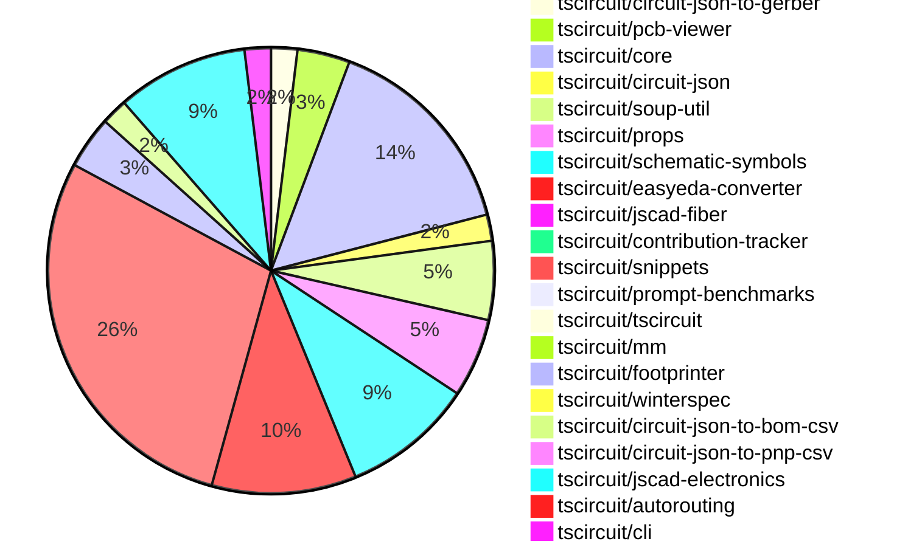

# contribution-tracker

Generates weekly contribution overviews for tscircuit contributors. Check out all
the [contribution overviews here](./contribution-overviews/)

* All PRs in the tscircuit org are scanned/summarized via Claude Haiku
* Claude classifies each Diff/PR as a Major, Minor or Tiny contribution
* All the PRs, summaries, and classifications are organized into charts and tables

The current week is shown below. There are 3 major sections:

* [Contributor Overview](#contributor-overview)
* [PRs by Repository](#prs-by-repository)
* [PRs by Contributor](#changes-by-contributor)

## Current Week

<!-- START_CURRENT_WEEK -->

# Contribution Overview 2024-10-09

## PRs by Repository

## Contributor Overview

| Contributor | 🐳 Major | 🐙 Minor | 🐌 Tiny | ⭐ |
|-------------|-------|-------|-------|-------|
| [seveibar](#seveibar) | 20 | 33 | 4 | 👑👑👑 |
| [imrishabh18](#imrishabh18) | 2 | 11 | 5 | ⭐⭐⭐ |
| [andrii-balitskyi](#andrii-balitskyi) | 6 | 1 | 0 | ⭐⭐ |
| [anas-sarkez](#anas-sarkez) | 5 | 3 | 0 | ⭐⭐ |
| [mrudulpatil18](#mrudulpatil18) | 1 | 4 | 0 | ⭐⭐ |
| [Abse2001](#Abse2001) | 0 | 4 | 0 | ⭐ |
| [ShiboSoftwareDev](#ShiboSoftwareDev) | 0 | 2 | 2 | ⭐ |
| [bbland1](#bbland1) | 1 | 0 | 0 | ⭐ |
| [ni9999](#ni9999) | 0 | 2 | 0 | ⭐ |
| [aman1376](#aman1376) | 0 | 2 | 0 | ⭐ |
| [MandeepPaul](#MandeepPaul) | 1 | 0 | 0 | ⭐ |
| [qalbun-salim](#qalbun-salim) | 0 | 1 | 0 |  |
| [anugcodes](#anugcodes) | 0 | 1 | 0 |  |
| [0SlowPoke0](#0SlowPoke0) | 0 | 1 | 0 |  |
| [kom-senapati](#kom-senapati) | 0 | 1 | 0 |  |
| [theajmalrazaq](#theajmalrazaq) | 0 | 1 | 0 |  |

## Changes by Repository

### [tscircuit/checks](https://github.com/tscircuit/checks)

| PR # | Impact | Contributor | Description |
|------|--------|-------------|-------------|
| [#17](https://github.com/tscircuit/checks/pull/17) | 🐙 Minor | ShiboSoftwareDev | Refactored the code to use the `circuit-json` library instead of `@tscircuit/soup`. |

### [tscircuit/circuit-json-to-gerber](https://github.com/tscircuit/circuit-json-to-gerber)

| PR # | Impact | Contributor | Description |
|------|--------|-------------|-------------|
| [#22](https://github.com/tscircuit/circuit-json-to-gerber/pull/22) | 🐙 Minor | ShiboSoftwareDev | Implemented silkscreen path drawing in the gerber conversion process. |
| [#20](https://github.com/tscircuit/circuit-json-to-gerber/pull/20) | 🐌 Tiny | ShiboSoftwareDev | Added a CODEOWNERS file to specify code owners for the repository. |

### [tscircuit/pcb-viewer](https://github.com/tscircuit/pcb-viewer)

| PR # | Impact | Contributor | Description |
|------|--------|-------------|-------------|
| [#74](https://github.com/tscircuit/pcb-viewer/pull/74) | 🐙 Minor | imrishabh18 | Refactor/remove builder |
| [#75](https://github.com/tscircuit/pcb-viewer/pull/75) | 🐌 Tiny | ShiboSoftwareDev | Added a CODEOWNERS file to specify the maintainers for the repository. |
| [#73](https://github.com/tscircuit/pcb-viewer/pull/73) | 🟣 | imrishabh18 | Refactor: remove builder |
| [#71](https://github.com/tscircuit/pcb-viewer/pull/71) | 🐳 Major | seveibar | Reverts the "Convert children rendering to core" change due to an issue with the bounds computation. |

### [tscircuit/core](https://github.com/tscircuit/core)

| PR # | Impact | Contributor | Description |
|------|--------|-------------|-------------|
| [#169](https://github.com/tscircuit/core/pull/169) | 🐳 Major | imrishabh18 | Adds the `PowerSource` and `NetAlias` components to the library. |
| [#151](https://github.com/tscircuit/core/pull/151) | 🐳 Major | imrishabh18 | Adds a new primitive component called "Via" to the library. |
| [#177](https://github.com/tscircuit/core/pull/177) | 🐳 Major | seveibar | Introduces a new `<battery />` component to the library. |
| [#176](https://github.com/tscircuit/core/pull/176) | 🐳 Major | seveibar | Fixes the rotation of SMT pads and keepouts when `pcbRotation={-90}` is used. |
| [#157](https://github.com/tscircuit/core/pull/157) | 🐳 Major | seveibar | Introduces a new function `createUseComponent` that allows creating React components with additional functionality, including automatic creation of traces based on component properties. |
| [#170](https://github.com/tscircuit/core/pull/170) | 🐙 Minor | imrishabh18 | Adds "schX" and "schY" properties to the "NetAlias" component to set the position of the net label in the schematic view. |
| [#155](https://github.com/tscircuit/core/pull/155) | 🐙 Minor | imrishabh18 | Adds new aliases "left" and "right" to the ports of Capacitor and Resistor components. |
| [#153](https://github.com/tscircuit/core/pull/153) | 🐙 Minor | imrishabh18 | Added two new primitive components, SilkscreenCircle and SilkscreenRect, which can be used to add silkscreen elements to a PCB design. |
| [#173](https://github.com/tscircuit/core/pull/173) | 🐙 Minor | seveibar | Adds support for shared pin labels in the NormalComponent class, allowing multiple ports to have the same primary label with additional aliases. |
| [#165](https://github.com/tscircuit/core/pull/165) | 🐙 Minor | seveibar | Fixes a bug where the trace layer was not correctly determined for explicitly defined SMT pads. |
| [#163](https://github.com/tscircuit/core/pull/163) | 🐙 Minor | seveibar | Set the rotation of the part properly dependent on the layer, fixing an issue where the layer was undefined. |
| [#161](https://github.com/tscircuit/core/pull/161) | 🐙 Minor | seveibar | Adds support for `cadModel.positionOffset` to adjust the position of CAD models in the circuit. |
| [#159](https://github.com/tscircuit/core/pull/159) | 🐙 Minor | seveibar | Adds support for creating a `pcb_hole` component from the parsed soup data. |
| [#158](https://github.com/tscircuit/core/pull/158) | 🐙 Minor | seveibar | Adds an export for the `createUseComponent` function. |
| [#182](https://github.com/tscircuit/core/pull/182) | 🐙 Minor | Abse2001 | Fixes the `toMatchSchematicSnapshot` test for the `Battery` component by updating the schematic symbol name. |
| [#166](https://github.com/tscircuit/core/pull/166) | 🐌 Tiny | seveibar | Update the `@tscircuit/footprinter` dependency to version 0.0.71. |

### [tscircuit/circuit-json](https://github.com/tscircuit/circuit-json)

| PR # | Impact | Contributor | Description |
|------|--------|-------------|-------------|
| [#59](https://github.com/tscircuit/circuit-json/pull/59) | 🐳 Major | seveibar | Adds a new circuit element, the "simple_battery", to the project. |
| [#58](https://github.com/tscircuit/circuit-json/pull/58) | 🐙 Minor | imrishabh18 | Adds an optional `display_value` field to the `SourceComponentBase` type. |

### [tscircuit/soup-util](https://github.com/tscircuit/soup-util)

| PR # | Impact | Contributor | Description |
|------|--------|-------------|-------------|
| [#21](https://github.com/tscircuit/soup-util/pull/21) | 🐙 Minor | imrishabh18 | Export the `find-bounds-and-center` function |
| [#20](https://github.com/tscircuit/soup-util/pull/20) | 🐙 Minor | imrishabh18 | Ports the `findBoundsAndCenter` function from the builder repository to the current repository. |
| [#23](https://github.com/tscircuit/soup-util/pull/23) | 🐌 Tiny | imrishabh18 | Fixes a type error by adding a non-null assertion operator (`!`) to the `debugObjects[0]` access. |
| [#22](https://github.com/tscircuit/soup-util/pull/22) | 🐌 Tiny | imrishabh18 | Reverts the previous change that exported a function. |
| [#19](https://github.com/tscircuit/soup-util/pull/19) | 🐌 Tiny | imrishabh18 | Updates the lock file to ensure consistent dependencies. |
| [#18](https://github.com/tscircuit/soup-util/pull/18) | 🐌 Tiny | imrishabh18 | Update the `circuit-json` dependency to the latest version |

### [tscircuit/props](https://github.com/tscircuit/props)

| PR # | Impact | Contributor | Description |
|------|--------|-------------|-------------|
| [#62](https://github.com/tscircuit/props/pull/62) | 🐙 Minor | imrishabh18 | Removes the `width` and `height` properties from the `commonLayoutProps` object. |
| [#60](https://github.com/tscircuit/props/pull/60) | 🐙 Minor | imrishabh18 | Replaces the `width` and `height` props with `schWidth`, `schHeight`, `pcbWidth`, and `pcbHeight` props. |
| [#58](https://github.com/tscircuit/props/pull/58) | 🐙 Minor | imrishabh18 | Add width and height properties to common component props |
| [#63](https://github.com/tscircuit/props/pull/63) | 🐙 Minor | seveibar | Introduces a new battery component with battery types, batteryProps, and sets the default unit to mAh. |
| [#61](https://github.com/tscircuit/props/pull/61) | 🐙 Minor | seveibar | Reverts the addition of `schWidth`, `schHeight`, `pcbWidth`, and `pcbHeight` props, and replaces them with `width` and `height` props. |
| [#59](https://github.com/tscircuit/props/pull/59) | 🐌 Tiny | imrishabh18 | Updated the project's dependency lock file |

### [tscircuit/schematic-symbols](https://github.com/tscircuit/schematic-symbols)

| PR # | Impact | Contributor | Description |
|------|--------|-------------|-------------|
| [#169](https://github.com/tscircuit/schematic-symbols/pull/169) | 🐳 Major | MandeepPaul | Introduce a new mushroom head normally open momentary component with detailed path information. |
| [#172](https://github.com/tscircuit/schematic-symbols/pull/172) | 🐙 Minor | imrishabh18 | Fix the calculation for the height of the SPDT switch and box resistor components. |
| [#174](https://github.com/tscircuit/schematic-symbols/pull/174) | 🐙 Minor | Abse2001 | Added a new battery symbol |
| [#168](https://github.com/tscircuit/schematic-symbols/pull/168) | 🐙 Minor | aman1376 | Add a new n-channel enhancement mode MOSFET transistor symbol. |
| [#158](https://github.com/tscircuit/schematic-symbols/pull/158) | 🐙 Minor | aman1376 | Adds a new SPST (Single Pole Single Throw) switch symbol. |
| [#166](https://github.com/tscircuit/schematic-symbols/pull/166) | 🐙 Minor | mrudulpatil18 | Added a count of unique schematic symbols and a GitHub stars badge to the header. |
| [#161](https://github.com/tscircuit/schematic-symbols/pull/161) | 🐙 Minor | mrudulpatil18 | Added a new PNP bipolar transistor symbol by updating the SVG and generated JSON files. |
| [#156](https://github.com/tscircuit/schematic-symbols/pull/156) | 🐙 Minor | mrudulpatil18 | Adds an SVG for an NPN bipolar transistor symbol. |
| [#160](https://github.com/tscircuit/schematic-symbols/pull/160) | 🐙 Minor | anugcodes | Added a SPDT (Single Pole Double Throw) switch symbol. |
| [#157](https://github.com/tscircuit/schematic-symbols/pull/157) | 🐙 Minor | 0SlowPoke0 | Adds a new SVG symbol for a filled diode. |

### [tscircuit/easyeda-converter](https://github.com/tscircuit/easyeda-converter)

| PR # | Impact | Contributor | Description |
|------|--------|-------------|-------------|
| [#74](https://github.com/tscircuit/easyeda-converter/pull/74) | 🐳 Major | seveibar | Introduces a script for quickly adding tests for parts and fixes an issue with the `importFlag` property in the `easy-eda-json-schema.ts` file. |
| [#60](https://github.com/tscircuit/easyeda-converter/pull/60) | 🐳 Major | seveibar | Introduces a new footprint tsx generation mechanism for more stable units and adds support for the `<hole />` tag. |
| [#59](https://github.com/tscircuit/easyeda-converter/pull/59) | 🐳 Major | seveibar | This pull request fixes issues with creating PCB holes and adds snapshot testing, which is a major fix for the application. |
| [#56](https://github.com/tscircuit/easyeda-converter/pull/56) | 🐳 Major | seveibar | Adds a benchmark script to convert EasyEDA JSON files to various formats and logs the results. |
| [#71](https://github.com/tscircuit/easyeda-converter/pull/71) | 🐙 Minor | seveibar | Fixes an issue with importing Arc data in the package detail shape schema. |
| [#66](https://github.com/tscircuit/easyeda-converter/pull/66) | 🐙 Minor | seveibar | Adds a new `supplierPartNumbers` prop to the `soupTypescriptComponentTemplate` component. |
| [#64](https://github.com/tscircuit/easyeda-converter/pull/64) | 🐙 Minor | seveibar | Adds support for parsing "PT~" shapes in the `SingleLetterShapeSchema`. |
| [#62](https://github.com/tscircuit/easyeda-converter/pull/62) | 🐙 Minor | seveibar | Fix the PCB component offset and add a test to check for large dimensions. |
| [#61](https://github.com/tscircuit/easyeda-converter/pull/61) | 🐙 Minor | seveibar | Removes the y-axis flip transformation to prevent double flip of the PCB elements. |
| [#49](https://github.com/tscircuit/easyeda-converter/pull/49) | 🐙 Minor | andrii-balitskyi | Allows both string and number values for the `number` prop in `PadSchema` and `pinNumber` prop in `PinShapeOutputSchema`. |
| [#54](https://github.com/tscircuit/easyeda-converter/pull/54) | 🐌 Tiny | seveibar | Importing `createUseComponent` from `@tscircuit/core` instead of `tscircuit` |

### [tscircuit/jscad-fiber](https://github.com/tscircuit/jscad-fiber)

| PR # | Impact | Contributor | Description |
|------|--------|-------------|-------------|
| [#84](https://github.com/tscircuit/jscad-fiber/pull/84) | 🐳 Major | seveibar | Implements the "subtract" operation in the JsCAD library, allowing the subtraction of one or more geometries from another. |

### [tscircuit/contribution-tracker](https://github.com/tscircuit/contribution-tracker)

| PR # | Impact | Contributor | Description |
|------|--------|-------------|-------------|
| [#4](https://github.com/tscircuit/contribution-tracker/pull/4) | 🐳 Major | seveibar | Adds nicknames, star system, and better sorting features. |

### [tscircuit/snippets](https://github.com/tscircuit/snippets)

| PR # | Impact | Contributor | Description |
|------|--------|-------------|-------------|
| [#65](https://github.com/tscircuit/snippets/pull/65) | 🐳 Major | seveibar | Introduces import caching for runtime imports and fixes related to the Footprinter feature. |
| [#62](https://github.com/tscircuit/snippets/pull/62) | 🐳 Major | seveibar | Adds replication in the seed and fixes recursive importing |
| [#61](https://github.com/tscircuit/snippets/pull/61) | 🐳 Major | seveibar | Adds functionality to delete snippets from the database. |
| [#57](https://github.com/tscircuit/snippets/pull/57) | 🐳 Major | seveibar | Adds a new functionality to rename a code snippet in the editor navigation. |
| [#56](https://github.com/tscircuit/snippets/pull/56) | 🐳 Major | seveibar | Adds Playwright testing setup, including a workflow to update snapshots when requested in a pull request comment, and several test files. |
| [#53](https://github.com/tscircuit/snippets/pull/53) | 🐳 Major | seveibar | Adds core to runtime, adds a format button, and a 404 snippet page, along with minor fixes. |
| [#52](https://github.com/tscircuit/snippets/pull/52) | 🐳 Major | seveibar | Implements anonymous user editing, fixes code editor scrolling, and improves the user experience for the AI chat and code editor pages. |
| [#48](https://github.com/tscircuit/snippets/pull/48) | 🐳 Major | seveibar | Imports a runner part and fixes the dashboard to load from a configurable base URL instead of a hardcoded value. |
| [#82](https://github.com/tscircuit/snippets/pull/82) | 🐳 Major | andrii-balitskyi | Adds the ability to edit shipping information in the user's profile settings. |
| [#68](https://github.com/tscircuit/snippets/pull/68) | 🐳 Major | andrii-balitskyi | Adds tests for the /orders/create, /orders/get, /orders/list, /orders/update, /order_files/upload, and /order_files/get endpoints. |
| [#78](https://github.com/tscircuit/snippets/pull/78) | 🐳 Major | andrii-balitskyi | Add a "Submit Order" button and a "Create Order" dialog to the application. |
| [#69](https://github.com/tscircuit/snippets/pull/69) | 🐳 Major | andrii-balitskyi | Introduce a new page `/orders/{order_id}` to display details of a specific order. |
| [#46](https://github.com/tscircuit/snippets/pull/46) | 🐳 Major | andrii-balitskyi | Introduces initial ordering API and UI with endpoints for orders, order files, and my orders page. |
| [#77](https://github.com/tscircuit/snippets/pull/77) | 🐳 Major | mrudulpatil18 | Adds a search component to the header, which allows users to search for code snippets and view the results in a dropdown. |
| [#84](https://github.com/tscircuit/snippets/pull/84) | 🐙 Minor | seveibar | Fix tab indent in the CodeEditor component |
| [#80](https://github.com/tscircuit/snippets/pull/80) | 🐙 Minor | seveibar | Fix issues with JLCPCB imports, update for shared pin label support, and fix errors in local development to show JLCPCB import errors. |
| [#74](https://github.com/tscircuit/snippets/pull/74) | 🐙 Minor | seveibar | Updates dependencies and fixes download issues for fabrication files. |
| [#73](https://github.com/tscircuit/snippets/pull/73) | 🐙 Minor | seveibar | Adds functionality to download fabrication files (gerber, pnp, bom, csv) for the circuit |
| [#67](https://github.com/tscircuit/snippets/pull/67) | 🐙 Minor | seveibar | Fixes an issue with importing modules on the first run of the application. |
| [#66](https://github.com/tscircuit/snippets/pull/66) | 🐙 Minor | seveibar | Upgrading the "@tscircuit/core" dependency to version 0.0.116 to fix a bun dependency issue and a routing issue. |
| [#63](https://github.com/tscircuit/snippets/pull/63) | 🐙 Minor | seveibar | Update easyeda dependency to fix issue importing diode |
| [#58](https://github.com/tscircuit/snippets/pull/58) | 🐙 Minor | seveibar | Fix an issue with an early hook return in the AI page test |
| [#54](https://github.com/tscircuit/snippets/pull/54) | 🐙 Minor | seveibar |  |
| [#51](https://github.com/tscircuit/snippets/pull/51) | 🐙 Minor | seveibar | Fix code editor scrolling overflow and support exporting hooks |
| [#50](https://github.com/tscircuit/snippets/pull/50) | 🐙 Minor | seveibar | Refactor for explicit runs, fix importing |
| [#45](https://github.com/tscircuit/snippets/pull/45) | 🐙 Minor | seveibar | Adds the ability to save the DTS (TypeScript definition) content along with the code snippet in the database. |
| [#49](https://github.com/tscircuit/snippets/pull/49) | 🐙 Minor | Abse2001 | Implemented a download function for the circuitJson download button. |
| [#43](https://github.com/tscircuit/snippets/pull/43) | 🐙 Minor | mrudulpatil18 | Persist the visibility of onboarding tips in the global store and update the LandingHero component to use the global store for managing onboarding tips visibility. |
| [#86](https://github.com/tscircuit/snippets/pull/86) | 🐙 Minor | kom-senapati | Update the page title to display the snippet name and owner name. |
| [#85](https://github.com/tscircuit/snippets/pull/85) | 🐙 Minor | theajmalrazaq | Fixed the search box rendering issue and improved the dashboard responsiveness. |

### [tscircuit/prompt-benchmarks](https://github.com/tscircuit/prompt-benchmarks)

| PR # | Impact | Contributor | Description |
|------|--------|-------------|-------------|
| [#3](https://github.com/tscircuit/prompt-benchmarks/pull/3) | 🐳 Major | seveibar | Adds a new function `safeCompileDts` to safely compile TypeScript code to a .d.ts file. |

### [tscircuit/tscircuit](https://github.com/tscircuit/tscircuit)

| PR # | Impact | Contributor | Description |
|------|--------|-------------|-------------|
| [#465](https://github.com/tscircuit/tscircuit/pull/465) | 🐙 Minor | seveibar | Require bun to use tscircuit, use bun as cli runtime |

### [tscircuit/mm](https://github.com/tscircuit/mm)

| PR # | Impact | Contributor | Description |
|------|--------|-------------|-------------|
| [#5](https://github.com/tscircuit/mm/pull/5) | 🐙 Minor | seveibar | Adds a new function `mil2mm` that converts mil (thousandths of an inch) to millimeters. |

### [tscircuit/footprinter](https://github.com/tscircuit/footprinter)

| PR # | Impact | Contributor | Description |
|------|--------|-------------|-------------|
| [#60](https://github.com/tscircuit/footprinter/pull/60) | 🐳 Major | bbland1 | Adds type definitions for parameters returned using .json() |
| [#62](https://github.com/tscircuit/footprinter/pull/62) | 🐳 Major | anas-sarkez | Modified and fixed the default value of `qfp` according to the data sheet. |
| [#63](https://github.com/tscircuit/footprinter/pull/63) | 🐙 Minor | seveibar | Remove the `bun` dependency, which was causing a massive bundle size increase. |
| [#61](https://github.com/tscircuit/footprinter/pull/61) | 🐙 Minor | seveibar | Add error handling for invalid footprint function strings in the footprinter library. |

### [tscircuit/winterspec](https://github.com/tscircuit/winterspec)

| PR # | Impact | Contributor | Description |
|------|--------|-------------|-------------|
| [#12](https://github.com/tscircuit/winterspec/pull/12) | 🐙 Minor | seveibar | Fix an issue related to the loading of the routes directory in the project. |

### [tscircuit/circuit-json-to-bom-csv](https://github.com/tscircuit/circuit-json-to-bom-csv)

| PR # | Impact | Contributor | Description |
|------|--------|-------------|-------------|
| [#3](https://github.com/tscircuit/circuit-json-to-bom-csv/pull/3) | 🐙 Minor | seveibar | Updates the library to support mixed-supplier BOM configuration with the "JLCPCB Part #" column. |
| [#2](https://github.com/tscircuit/circuit-json-to-bom-csv/pull/2) | 🐙 Minor | seveibar | Adds a test directory, a test for bom conversion with real sample data, and fixes a minor issue with invalid source components. |

### [tscircuit/circuit-json-to-pnp-csv](https://github.com/tscircuit/circuit-json-to-pnp-csv)

| PR # | Impact | Contributor | Description |
|------|--------|-------------|-------------|
| [#2](https://github.com/tscircuit/circuit-json-to-pnp-csv/pull/2) | 🐙 Minor | seveibar | Fix designator logic and add test for nine key keyboard |

### [tscircuit/jscad-electronics](https://github.com/tscircuit/jscad-electronics)

| PR # | Impact | Contributor | Description |
|------|--------|-------------|-------------|
| [#69](https://github.com/tscircuit/jscad-electronics/pull/69) | 🐳 Major | anas-sarkez | Implementing SmdLED packages with different colors |
| [#68](https://github.com/tscircuit/jscad-electronics/pull/68) | 🐳 Major | anas-sarkez | Implementing a 3D component for a USB-C female port |
| [#67](https://github.com/tscircuit/jscad-electronics/pull/67) | 🐳 Major | anas-sarkez | Implementing a USB-A female connector component |
| [#65](https://github.com/tscircuit/jscad-electronics/pull/65) | 🐳 Major | anas-sarkez | Refactor QFP component to support customizable pitch, lead width, and body dimensions, and add a new QFP 128 3D footprint. |
| [#72](https://github.com/tscircuit/jscad-electronics/pull/72) | 🐙 Minor | anas-sarkez | Refactored the USB_C component to use the Subtract operation for creating the curved metal casing, replacing complex calculations. |
| [#71](https://github.com/tscircuit/jscad-electronics/pull/71) | 🐙 Minor | anas-sarkez | Updated jscad-fiber dependency and subtracted curve slice from smdLED sides |
| [#64](https://github.com/tscircuit/jscad-electronics/pull/64) | 🐙 Minor | anas-sarkez | Added a new example for a wide DIP16 footprint and fixed the length calculation for the DIP model. |
| [#66](https://github.com/tscircuit/jscad-electronics/pull/66) | 🐙 Minor | ni9999 | Introduced a new component, `AxialCapacitor`, that allows rendering of axial capacitors with customizable pitch and variant (vertical or horizontal). |
| [#59](https://github.com/tscircuit/jscad-electronics/pull/59) | 🐙 Minor | ni9999 | Added an AxialLed component to the project, which provides a 3D model of an axial LED with configurable pitch. |
| [#70](https://github.com/tscircuit/jscad-electronics/pull/70) | 🐌 Tiny | seveibar | Add anas as a codeowner for the project |

### [tscircuit/autorouting](https://github.com/tscircuit/autorouting)

| PR # | Impact | Contributor | Description |
|------|--------|-------------|-------------|
| [#81](https://github.com/tscircuit/autorouting/pull/81) | 🐌 Tiny | seveibar | Update dependencies types |

### [tscircuit/cli](https://github.com/tscircuit/cli)

| PR # | Impact | Contributor | Description |
|------|--------|-------------|-------------|
| [#210](https://github.com/tscircuit/cli/pull/210) | 🐳 Major | andrii-balitskyi | Adds a new `gen jlcpcb <jlcpcbPartNumberOrUrl>` command to the CLI, which generates JLCPCB-specific files. |
| [#217](https://github.com/tscircuit/cli/pull/217) | 🐙 Minor | qalbun-salim | Adds a new command `export pnp_csv` to the CLI to export a Plug n Play CSV file from an example file. |

### [tscircuit/circuit-to-svg](https://github.com/tscircuit/circuit-to-svg)

| PR # | Impact | Contributor | Description |
|------|--------|-------------|-------------|
| [#86](https://github.com/tscircuit/circuit-to-svg/pull/86) | 🐙 Minor | Abse2001 | Updated the schematic symbols to fix the battery in the core and formatted the code. |

## Changes by Contributor

### [ShiboSoftwareDev](https://github.com/ShiboSoftwareDev)

| PR # | Impact | Description |
|------|--------|-------------|
| [#17](https://github.com/tscircuit/checks/pull/17) | 🐙 Minor | Refactored the code to use the `circuit-json` library instead of `@tscircuit/soup`. |
| [#22](https://github.com/tscircuit/circuit-json-to-gerber/pull/22) | 🐙 Minor | Implemented silkscreen path drawing in the gerber conversion process. |
| [#75](https://github.com/tscircuit/pcb-viewer/pull/75) | 🐌 Tiny | Added a CODEOWNERS file to specify the maintainers for the repository. |
| [#20](https://github.com/tscircuit/circuit-json-to-gerber/pull/20) | 🐌 Tiny | Added a CODEOWNERS file to specify code owners for the repository. |

### [imrishabh18](https://github.com/imrishabh18)

| PR # | Impact | Description |
|------|--------|-------------|
| [#169](https://github.com/tscircuit/core/pull/169) | 🐳 Major | Adds the `PowerSource` and `NetAlias` components to the library. |
| [#151](https://github.com/tscircuit/core/pull/151) | 🐳 Major | Adds a new primitive component called "Via" to the library. |
| [#74](https://github.com/tscircuit/pcb-viewer/pull/74) | 🐙 Minor | Refactor/remove builder |
| [#73](https://github.com/tscircuit/pcb-viewer/pull/73) | 🟣 | Refactor: remove builder |
| [#58](https://github.com/tscircuit/circuit-json/pull/58) | 🐙 Minor | Adds an optional `display_value` field to the `SourceComponentBase` type. |
| [#21](https://github.com/tscircuit/soup-util/pull/21) | 🐙 Minor | Export the `find-bounds-and-center` function |
| [#20](https://github.com/tscircuit/soup-util/pull/20) | 🐙 Minor | Ports the `findBoundsAndCenter` function from the builder repository to the current repository. |
| [#62](https://github.com/tscircuit/props/pull/62) | 🐙 Minor | Removes the `width` and `height` properties from the `commonLayoutProps` object. |
| [#60](https://github.com/tscircuit/props/pull/60) | 🐙 Minor | Replaces the `width` and `height` props with `schWidth`, `schHeight`, `pcbWidth`, and `pcbHeight` props. |
| [#58](https://github.com/tscircuit/props/pull/58) | 🐙 Minor | Add width and height properties to common component props |
| [#170](https://github.com/tscircuit/core/pull/170) | 🐙 Minor | Adds "schX" and "schY" properties to the "NetAlias" component to set the position of the net label in the schematic view. |
| [#155](https://github.com/tscircuit/core/pull/155) | 🐙 Minor | Adds new aliases "left" and "right" to the ports of Capacitor and Resistor components. |
| [#153](https://github.com/tscircuit/core/pull/153) | 🐙 Minor | Added two new primitive components, SilkscreenCircle and SilkscreenRect, which can be used to add silkscreen elements to a PCB design. |
| [#172](https://github.com/tscircuit/schematic-symbols/pull/172) | 🐙 Minor | Fix the calculation for the height of the SPDT switch and box resistor components. |
| [#23](https://github.com/tscircuit/soup-util/pull/23) | 🐌 Tiny | Fixes a type error by adding a non-null assertion operator (`!`) to the `debugObjects[0]` access. |
| [#22](https://github.com/tscircuit/soup-util/pull/22) | 🐌 Tiny | Reverts the previous change that exported a function. |
| [#19](https://github.com/tscircuit/soup-util/pull/19) | 🐌 Tiny | Updates the lock file to ensure consistent dependencies. |
| [#18](https://github.com/tscircuit/soup-util/pull/18) | 🐌 Tiny | Update the `circuit-json` dependency to the latest version |
| [#59](https://github.com/tscircuit/props/pull/59) | 🐌 Tiny | Updated the project's dependency lock file |

### [seveibar](https://github.com/seveibar)

| PR # | Impact | Description |
|------|--------|-------------|
| [#71](https://github.com/tscircuit/pcb-viewer/pull/71) | 🐳 Major | Reverts the "Convert children rendering to core" change due to an issue with the bounds computation. |
| [#59](https://github.com/tscircuit/circuit-json/pull/59) | 🐳 Major | Adds a new circuit element, the "simple_battery", to the project. |
| [#74](https://github.com/tscircuit/easyeda-converter/pull/74) | 🐳 Major | Introduces a script for quickly adding tests for parts and fixes an issue with the `importFlag` property in the `easy-eda-json-schema.ts` file. |
| [#60](https://github.com/tscircuit/easyeda-converter/pull/60) | 🐳 Major | Introduces a new footprint tsx generation mechanism for more stable units and adds support for the `<hole />` tag. |
| [#59](https://github.com/tscircuit/easyeda-converter/pull/59) | 🐳 Major | This pull request fixes issues with creating PCB holes and adds snapshot testing, which is a major fix for the application. |
| [#56](https://github.com/tscircuit/easyeda-converter/pull/56) | 🐳 Major | Adds a benchmark script to convert EasyEDA JSON files to various formats and logs the results. |
| [#177](https://github.com/tscircuit/core/pull/177) | 🐳 Major | Introduces a new `<battery />` component to the library. |
| [#176](https://github.com/tscircuit/core/pull/176) | 🐳 Major | Fixes the rotation of SMT pads and keepouts when `pcbRotation={-90}` is used. |
| [#157](https://github.com/tscircuit/core/pull/157) | 🐳 Major | Introduces a new function `createUseComponent` that allows creating React components with additional functionality, including automatic creation of traces based on component properties. |
| [#84](https://github.com/tscircuit/jscad-fiber/pull/84) | 🐳 Major | Implements the "subtract" operation in the JsCAD library, allowing the subtraction of one or more geometries from another. |
| [#4](https://github.com/tscircuit/contribution-tracker/pull/4) | 🐳 Major | Adds nicknames, star system, and better sorting features. |
| [#65](https://github.com/tscircuit/snippets/pull/65) | 🐳 Major | Introduces import caching for runtime imports and fixes related to the Footprinter feature. |
| [#62](https://github.com/tscircuit/snippets/pull/62) | 🐳 Major | Adds replication in the seed and fixes recursive importing |
| [#61](https://github.com/tscircuit/snippets/pull/61) | 🐳 Major | Adds functionality to delete snippets from the database. |
| [#57](https://github.com/tscircuit/snippets/pull/57) | 🐳 Major | Adds a new functionality to rename a code snippet in the editor navigation. |
| [#56](https://github.com/tscircuit/snippets/pull/56) | 🐳 Major | Adds Playwright testing setup, including a workflow to update snapshots when requested in a pull request comment, and several test files. |
| [#53](https://github.com/tscircuit/snippets/pull/53) | 🐳 Major | Adds core to runtime, adds a format button, and a 404 snippet page, along with minor fixes. |
| [#52](https://github.com/tscircuit/snippets/pull/52) | 🐳 Major | Implements anonymous user editing, fixes code editor scrolling, and improves the user experience for the AI chat and code editor pages. |
| [#48](https://github.com/tscircuit/snippets/pull/48) | 🐳 Major | Imports a runner part and fixes the dashboard to load from a configurable base URL instead of a hardcoded value. |
| [#3](https://github.com/tscircuit/prompt-benchmarks/pull/3) | 🐳 Major | Adds a new function `safeCompileDts` to safely compile TypeScript code to a .d.ts file. |
| [#465](https://github.com/tscircuit/tscircuit/pull/465) | 🐙 Minor | Require bun to use tscircuit, use bun as cli runtime |
| [#5](https://github.com/tscircuit/mm/pull/5) | 🐙 Minor | Adds a new function `mil2mm` that converts mil (thousandths of an inch) to millimeters. |
| [#63](https://github.com/tscircuit/props/pull/63) | 🐙 Minor | Introduces a new battery component with battery types, batteryProps, and sets the default unit to mAh. |
| [#61](https://github.com/tscircuit/props/pull/61) | 🐙 Minor | Reverts the addition of `schWidth`, `schHeight`, `pcbWidth`, and `pcbHeight` props, and replaces them with `width` and `height` props. |
| [#63](https://github.com/tscircuit/footprinter/pull/63) | 🐙 Minor | Remove the `bun` dependency, which was causing a massive bundle size increase. |
| [#61](https://github.com/tscircuit/footprinter/pull/61) | 🐙 Minor | Add error handling for invalid footprint function strings in the footprinter library. |
| [#71](https://github.com/tscircuit/easyeda-converter/pull/71) | 🐙 Minor | Fixes an issue with importing Arc data in the package detail shape schema. |
| [#66](https://github.com/tscircuit/easyeda-converter/pull/66) | 🐙 Minor | Adds a new `supplierPartNumbers` prop to the `soupTypescriptComponentTemplate` component. |
| [#64](https://github.com/tscircuit/easyeda-converter/pull/64) | 🐙 Minor | Adds support for parsing "PT~" shapes in the `SingleLetterShapeSchema`. |
| [#62](https://github.com/tscircuit/easyeda-converter/pull/62) | 🐙 Minor | Fix the PCB component offset and add a test to check for large dimensions. |
| [#61](https://github.com/tscircuit/easyeda-converter/pull/61) | 🐙 Minor | Removes the y-axis flip transformation to prevent double flip of the PCB elements. |
| [#12](https://github.com/tscircuit/winterspec/pull/12) | 🐙 Minor | Fix an issue related to the loading of the routes directory in the project. |
| [#173](https://github.com/tscircuit/core/pull/173) | 🐙 Minor | Adds support for shared pin labels in the NormalComponent class, allowing multiple ports to have the same primary label with additional aliases. |
| [#165](https://github.com/tscircuit/core/pull/165) | 🐙 Minor | Fixes a bug where the trace layer was not correctly determined for explicitly defined SMT pads. |
| [#163](https://github.com/tscircuit/core/pull/163) | 🐙 Minor | Set the rotation of the part properly dependent on the layer, fixing an issue where the layer was undefined. |
| [#161](https://github.com/tscircuit/core/pull/161) | 🐙 Minor | Adds support for `cadModel.positionOffset` to adjust the position of CAD models in the circuit. |
| [#159](https://github.com/tscircuit/core/pull/159) | 🐙 Minor | Adds support for creating a `pcb_hole` component from the parsed soup data. |
| [#158](https://github.com/tscircuit/core/pull/158) | 🐙 Minor | Adds an export for the `createUseComponent` function. |
| [#3](https://github.com/tscircuit/circuit-json-to-bom-csv/pull/3) | 🐙 Minor | Updates the library to support mixed-supplier BOM configuration with the "JLCPCB Part #" column. |
| [#2](https://github.com/tscircuit/circuit-json-to-bom-csv/pull/2) | 🐙 Minor | Adds a test directory, a test for bom conversion with real sample data, and fixes a minor issue with invalid source components. |
| [#2](https://github.com/tscircuit/circuit-json-to-pnp-csv/pull/2) | 🐙 Minor | Fix designator logic and add test for nine key keyboard |
| [#84](https://github.com/tscircuit/snippets/pull/84) | 🐙 Minor | Fix tab indent in the CodeEditor component |
| [#80](https://github.com/tscircuit/snippets/pull/80) | 🐙 Minor | Fix issues with JLCPCB imports, update for shared pin label support, and fix errors in local development to show JLCPCB import errors. |
| [#74](https://github.com/tscircuit/snippets/pull/74) | 🐙 Minor | Updates dependencies and fixes download issues for fabrication files. |
| [#73](https://github.com/tscircuit/snippets/pull/73) | 🐙 Minor | Adds functionality to download fabrication files (gerber, pnp, bom, csv) for the circuit |
| [#67](https://github.com/tscircuit/snippets/pull/67) | 🐙 Minor | Fixes an issue with importing modules on the first run of the application. |
| [#66](https://github.com/tscircuit/snippets/pull/66) | 🐙 Minor | Upgrading the "@tscircuit/core" dependency to version 0.0.116 to fix a bun dependency issue and a routing issue. |
| [#63](https://github.com/tscircuit/snippets/pull/63) | 🐙 Minor | Update easyeda dependency to fix issue importing diode |
| [#58](https://github.com/tscircuit/snippets/pull/58) | 🐙 Minor | Fix an issue with an early hook return in the AI page test |
| [#54](https://github.com/tscircuit/snippets/pull/54) | 🐙 Minor |  |
| [#51](https://github.com/tscircuit/snippets/pull/51) | 🐙 Minor | Fix code editor scrolling overflow and support exporting hooks |
| [#50](https://github.com/tscircuit/snippets/pull/50) | 🐙 Minor | Refactor for explicit runs, fix importing |
| [#45](https://github.com/tscircuit/snippets/pull/45) | 🐙 Minor | Adds the ability to save the DTS (TypeScript definition) content along with the code snippet in the database. |
| [#54](https://github.com/tscircuit/easyeda-converter/pull/54) | 🐌 Tiny | Importing `createUseComponent` from `@tscircuit/core` instead of `tscircuit` |
| [#166](https://github.com/tscircuit/core/pull/166) | 🐌 Tiny | Update the `@tscircuit/footprinter` dependency to version 0.0.71. |
| [#70](https://github.com/tscircuit/jscad-electronics/pull/70) | 🐌 Tiny | Add anas as a codeowner for the project |
| [#81](https://github.com/tscircuit/autorouting/pull/81) | 🐌 Tiny | Update dependencies types |

### [andrii-balitskyi](https://github.com/andrii-balitskyi)

| PR # | Impact | Description |
|------|--------|-------------|
| [#210](https://github.com/tscircuit/cli/pull/210) | 🐳 Major | Adds a new `gen jlcpcb <jlcpcbPartNumberOrUrl>` command to the CLI, which generates JLCPCB-specific files. |
| [#82](https://github.com/tscircuit/snippets/pull/82) | 🐳 Major | Adds the ability to edit shipping information in the user's profile settings. |
| [#68](https://github.com/tscircuit/snippets/pull/68) | 🐳 Major | Adds tests for the /orders/create, /orders/get, /orders/list, /orders/update, /order_files/upload, and /order_files/get endpoints. |
| [#78](https://github.com/tscircuit/snippets/pull/78) | 🐳 Major | Add a "Submit Order" button and a "Create Order" dialog to the application. |
| [#69](https://github.com/tscircuit/snippets/pull/69) | 🐳 Major | Introduce a new page `/orders/{order_id}` to display details of a specific order. |
| [#46](https://github.com/tscircuit/snippets/pull/46) | 🐳 Major | Introduces initial ordering API and UI with endpoints for orders, order files, and my orders page. |
| [#49](https://github.com/tscircuit/easyeda-converter/pull/49) | 🐙 Minor | Allows both string and number values for the `number` prop in `PadSchema` and `pinNumber` prop in `PinShapeOutputSchema`. |

### [qalbun-salim](https://github.com/qalbun-salim)

| PR # | Impact | Description |
|------|--------|-------------|
| [#217](https://github.com/tscircuit/cli/pull/217) | 🐙 Minor | Adds a new command `export pnp_csv` to the CLI to export a Plug n Play CSV file from an example file. |

### [bbland1](https://github.com/bbland1)

| PR # | Impact | Description |
|------|--------|-------------|
| [#60](https://github.com/tscircuit/footprinter/pull/60) | 🐳 Major | Adds type definitions for parameters returned using .json() |

### [anas-sarkez](https://github.com/anas-sarkez)

| PR # | Impact | Description |
|------|--------|-------------|
| [#62](https://github.com/tscircuit/footprinter/pull/62) | 🐳 Major | Modified and fixed the default value of `qfp` according to the data sheet. |
| [#69](https://github.com/tscircuit/jscad-electronics/pull/69) | 🐳 Major | Implementing SmdLED packages with different colors |
| [#68](https://github.com/tscircuit/jscad-electronics/pull/68) | 🐳 Major | Implementing a 3D component for a USB-C female port |
| [#67](https://github.com/tscircuit/jscad-electronics/pull/67) | 🐳 Major | Implementing a USB-A female connector component |
| [#65](https://github.com/tscircuit/jscad-electronics/pull/65) | 🐳 Major | Refactor QFP component to support customizable pitch, lead width, and body dimensions, and add a new QFP 128 3D footprint. |
| [#72](https://github.com/tscircuit/jscad-electronics/pull/72) | 🐙 Minor | Refactored the USB_C component to use the Subtract operation for creating the curved metal casing, replacing complex calculations. |
| [#71](https://github.com/tscircuit/jscad-electronics/pull/71) | 🐙 Minor | Updated jscad-fiber dependency and subtracted curve slice from smdLED sides |
| [#64](https://github.com/tscircuit/jscad-electronics/pull/64) | 🐙 Minor | Added a new example for a wide DIP16 footprint and fixed the length calculation for the DIP model. |

### [Abse2001](https://github.com/Abse2001)

| PR # | Impact | Description |
|------|--------|-------------|
| [#182](https://github.com/tscircuit/core/pull/182) | 🐙 Minor | Fixes the `toMatchSchematicSnapshot` test for the `Battery` component by updating the schematic symbol name. |
| [#86](https://github.com/tscircuit/circuit-to-svg/pull/86) | 🐙 Minor | Updated the schematic symbols to fix the battery in the core and formatted the code. |
| [#174](https://github.com/tscircuit/schematic-symbols/pull/174) | 🐙 Minor | Added a new battery symbol |
| [#49](https://github.com/tscircuit/snippets/pull/49) | 🐙 Minor | Implemented a download function for the circuitJson download button. |

### [ni9999](https://github.com/ni9999)

| PR # | Impact | Description |
|------|--------|-------------|
| [#66](https://github.com/tscircuit/jscad-electronics/pull/66) | 🐙 Minor | Introduced a new component, `AxialCapacitor`, that allows rendering of axial capacitors with customizable pitch and variant (vertical or horizontal). |
| [#59](https://github.com/tscircuit/jscad-electronics/pull/59) | 🐙 Minor | Added an AxialLed component to the project, which provides a 3D model of an axial LED with configurable pitch. |

### [aman1376](https://github.com/aman1376)

| PR # | Impact | Description |
|------|--------|-------------|
| [#168](https://github.com/tscircuit/schematic-symbols/pull/168) | 🐙 Minor | Add a new n-channel enhancement mode MOSFET transistor symbol. |
| [#158](https://github.com/tscircuit/schematic-symbols/pull/158) | 🐙 Minor | Adds a new SPST (Single Pole Single Throw) switch symbol. |

### [MandeepPaul](https://github.com/MandeepPaul)

| PR # | Impact | Description |
|------|--------|-------------|
| [#169](https://github.com/tscircuit/schematic-symbols/pull/169) | 🐳 Major | Introduce a new mushroom head normally open momentary component with detailed path information. |

### [mrudulpatil18](https://github.com/mrudulpatil18)

| PR # | Impact | Description |
|------|--------|-------------|
| [#77](https://github.com/tscircuit/snippets/pull/77) | 🐳 Major | Adds a search component to the header, which allows users to search for code snippets and view the results in a dropdown. |
| [#166](https://github.com/tscircuit/schematic-symbols/pull/166) | 🐙 Minor | Added a count of unique schematic symbols and a GitHub stars badge to the header. |
| [#161](https://github.com/tscircuit/schematic-symbols/pull/161) | 🐙 Minor | Added a new PNP bipolar transistor symbol by updating the SVG and generated JSON files. |
| [#156](https://github.com/tscircuit/schematic-symbols/pull/156) | 🐙 Minor | Adds an SVG for an NPN bipolar transistor symbol. |
| [#43](https://github.com/tscircuit/snippets/pull/43) | 🐙 Minor | Persist the visibility of onboarding tips in the global store and update the LandingHero component to use the global store for managing onboarding tips visibility. |

### [anugcodes](https://github.com/anugcodes)

| PR # | Impact | Description |
|------|--------|-------------|
| [#160](https://github.com/tscircuit/schematic-symbols/pull/160) | 🐙 Minor | Added a SPDT (Single Pole Double Throw) switch symbol. |

### [0SlowPoke0](https://github.com/0SlowPoke0)

| PR # | Impact | Description |
|------|--------|-------------|
| [#157](https://github.com/tscircuit/schematic-symbols/pull/157) | 🐙 Minor | Adds a new SVG symbol for a filled diode. |

### [kom-senapati](https://github.com/kom-senapati)

| PR # | Impact | Description |
|------|--------|-------------|
| [#86](https://github.com/tscircuit/snippets/pull/86) | 🐙 Minor | Update the page title to display the snippet name and owner name. |

### [theajmalrazaq](https://github.com/theajmalrazaq)

| PR # | Impact | Description |
|------|--------|-------------|
| [#85](https://github.com/tscircuit/snippets/pull/85) | 🐙 Minor | Fixed the search box rendering issue and improved the dashboard responsiveness. |

<!-- END_CURRENT_WEEK -->
