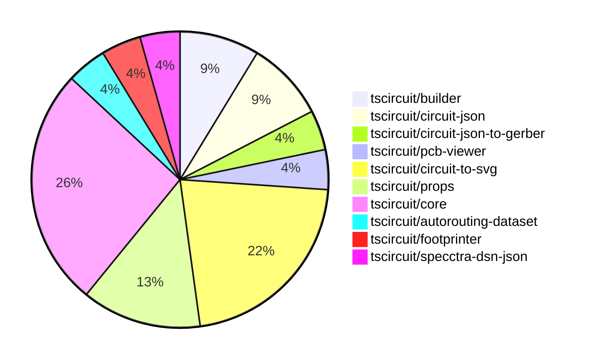

# contribution-tracker

Generates weekly contribution overviews for tscircuit contributors. Check out all
the [contribution overviews here](./contribution-overviews/)

* All PRs in the tscircuit org are scanned/summarized via Claude Haiku
* Claude classifies each Diff/PR as a Major, Minor or Tiny contribution
* All the PRs, summaries, and classifications are organized into charts and tables

The current week is shown below. There are 3 major sections:

* [Contributor Overview](#contributor-overview)
* [PRs by Repository](#prs-by-repository)
* [PRs by Contributor](#changes-by-contributor)

## Current Week

<!-- START_CURRENT_WEEK -->

# Contribution Overview 2024-08-31

## PRs by Repository

## Contributor Overview

| Contributor | 🐳 Major | 🐙 Minor | 🐌 Tiny |
|-------------|-------|-------|-------|
| ShiboSoftwareDev | 1 | 3 | 0 |
| imrishabh18 | 5 | 0 | 1 |
| seveibar | 7 | 4 | 0 |
| andrii-balitskyi | 0 | 1 | 0 |

## Changes by Repository

### [tscircuit/builder](https://github.com/tscircuit/builder)

| PR # | Impact | Contributor | Description |
|------|--------|-------------|-------------|
| [#107](https://github.com/tscircuit/builder/pull/107) | 🟣 | ShiboSoftwareDev | Changed `convertSoupToExcellonDrillCommands` to use metric units instead of inches. |
| [#106](https://github.com/tscircuit/builder/pull/106) | 🐳 Major | ShiboSoftwareDev | Gerber now supports board outline |

### [tscircuit/circuit-json](https://github.com/tscircuit/circuit-json)

| PR # | Impact | Contributor | Description |
|------|--------|-------------|-------------|
| [#34](https://github.com/tscircuit/circuit-json/pull/34) | 🐙 Minor | ShiboSoftwareDev | Fixed the import source for the `layer_ref` module. |
| [#32](https://github.com/tscircuit/circuit-json/pull/32) | 🐙 Minor | ShiboSoftwareDev | Changed the type of the `layer` field in the `pcb_trace` schema from `string` to `layer_ref`. |

### [tscircuit/circuit-json-to-gerber](https://github.com/tscircuit/circuit-json-to-gerber)

| PR # | Impact | Contributor | Description |
|------|--------|-------------|-------------|
| [#4](https://github.com/tscircuit/circuit-json-to-gerber/pull/4) | 🐙 Minor | ShiboSoftwareDev | Update dependencies and minor code changes |

### [tscircuit/pcb-viewer](https://github.com/tscircuit/pcb-viewer)

| PR # | Impact | Contributor | Description |
|------|--------|-------------|-------------|
| [#44](https://github.com/tscircuit/pcb-viewer/pull/44) | 🐳 Major | imrishabh18 | Fix trace rendering for the `route_thickness_mode` property |

### [tscircuit/circuit-to-svg](https://github.com/tscircuit/circuit-to-svg)

| PR # | Impact | Contributor | Description |
|------|--------|-------------|-------------|
| [#43](https://github.com/tscircuit/circuit-to-svg/pull/43) | 🐳 Major | imrishabh18 | The pull request fixes a bug to make the traces in the PCB (Printed Circuit Board) SVG (Scalable Vector Graphics) smooth. |
| [#39](https://github.com/tscircuit/circuit-to-svg/pull/39) | 🐳 Major | imrishabh18 | Fix the silkscreen appearance in the PCB viewer. |
| [#38](https://github.com/tscircuit/circuit-to-svg/pull/38) | 🐳 Major | imrishabh18 | Fix the CSS usage for `pcb_plated_hole` and use standard color values. |
| [#28](https://github.com/tscircuit/circuit-to-svg/pull/28) | 🐳 Major | imrishabh18 | Fix schematic symbols attributes to correctly handle position, width, height, and rotation. |
| [#34](https://github.com/tscircuit/circuit-to-svg/pull/34) | 🐌 Tiny | imrishabh18 | Rename `pcb-soup-to-svg.ts` to `circuit-to-pcb-svg.ts` and `soup-to-svg.ts` to `circuit-to-schematic-svg.ts` |

### [tscircuit/props](https://github.com/tscircuit/props)

| PR # | Impact | Contributor | Description |
|------|--------|-------------|-------------|
| [#35](https://github.com/tscircuit/props/pull/35) | 🐳 Major | seveibar | More refactoring to better define props, split out capacitor and resistor, add jumper, add pullupFor, decouplingFor |
| [#37](https://github.com/tscircuit/props/pull/37) | 🐙 Minor | seveibar | Refactor group props by moving the props definition to a separate file. |
| [#36](https://github.com/tscircuit/props/pull/36) | 🐙 Minor | seveibar | Add schematic direction to jumper component |

### [tscircuit/core](https://github.com/tscircuit/core)

| PR # | Impact | Contributor | Description |
|------|--------|-------------|-------------|
| [#21](https://github.com/tscircuit/core/pull/21) | 🐳 Major | seveibar | Adds GitHub Actions workflows for the Bunaider tool, which automatically fixes issues and pull requests when labeled with 'aider'. |
| [#20](https://github.com/tscircuit/core/pull/20) | 🐳 Major | seveibar | Introduce opaque groups, rename Project to Circuit, add pullupFor and pullupTo props for resistors, and add decouplingTo and decouplingFor props. |
| [#18](https://github.com/tscircuit/core/pull/18) | 🐳 Major | seveibar | Fix trace overlapping, fix SMTPads not rotating, and ensure silkscreen paths transform properly. |
| [#16](https://github.com/tscircuit/core/pull/16) | 🐳 Major | seveibar | Add PlatedHole component and support for rendering plated holes in the PCB. |
| [#15](https://github.com/tscircuit/core/pull/15) | 🐳 Major | seveibar | Introduce jumper support, fix chip pinLabel selectors, and add new components like Resistor.pullup, Capacitor.decoupling, and SilkscreenPath. |
| [#23](https://github.com/tscircuit/core/pull/23) | 🐙 Minor | seveibar | Add support for tagging with 'bunaider' label in GitHub Actions workflow |

### [tscircuit/autorouting-dataset](https://github.com/tscircuit/autorouting-dataset)

| PR # | Impact | Contributor | Description |
|------|--------|-------------|-------------|
| [#39](https://github.com/tscircuit/autorouting-dataset/pull/39) | 🐳 Major | seveibar | Adds PCB trace support in the dataset autorouting module. |

### [tscircuit/footprinter](https://github.com/tscircuit/footprinter)

| PR # | Impact | Contributor | Description |
|------|--------|-------------|-------------|
| [#28](https://github.com/tscircuit/footprinter/pull/28) | 🐙 Minor | seveibar | Update the `circuit-to-svg` package to version `0.0.13` to fix snapshots. |

### [tscircuit/specctra-dsn-json](https://github.com/tscircuit/specctra-dsn-json)

| PR # | Impact | Contributor | Description |
|------|--------|-------------|-------------|
| [#12](https://github.com/tscircuit/specctra-dsn-json/pull/12) | 🐙 Minor | andrii-balitskyi | Convert the test suite from Ava to Bun:test |

## Changes by Contributor

### [ShiboSoftwareDev](https://github.com/ShiboSoftwareDev)

| PR # | Impact | Description |
|------|--------|-------------|
| [#107](https://github.com/tscircuit/builder/pull/107) | 🟣 | Changed `convertSoupToExcellonDrillCommands` to use metric units instead of inches. |
| [#106](https://github.com/tscircuit/builder/pull/106) | 🐳 Major | Gerber now supports board outline |
| [#34](https://github.com/tscircuit/circuit-json/pull/34) | 🐙 Minor | Fixed the import source for the `layer_ref` module. |
| [#32](https://github.com/tscircuit/circuit-json/pull/32) | 🐙 Minor | Changed the type of the `layer` field in the `pcb_trace` schema from `string` to `layer_ref`. |
| [#4](https://github.com/tscircuit/circuit-json-to-gerber/pull/4) | 🐙 Minor | Update dependencies and minor code changes |

### [imrishabh18](https://github.com/imrishabh18)

| PR # | Impact | Description |
|------|--------|-------------|
| [#44](https://github.com/tscircuit/pcb-viewer/pull/44) | 🐳 Major | Fix trace rendering for the `route_thickness_mode` property |
| [#43](https://github.com/tscircuit/circuit-to-svg/pull/43) | 🐳 Major | The pull request fixes a bug to make the traces in the PCB (Printed Circuit Board) SVG (Scalable Vector Graphics) smooth. |
| [#39](https://github.com/tscircuit/circuit-to-svg/pull/39) | 🐳 Major | Fix the silkscreen appearance in the PCB viewer. |
| [#38](https://github.com/tscircuit/circuit-to-svg/pull/38) | 🐳 Major | Fix the CSS usage for `pcb_plated_hole` and use standard color values. |
| [#28](https://github.com/tscircuit/circuit-to-svg/pull/28) | 🐳 Major | Fix schematic symbols attributes to correctly handle position, width, height, and rotation. |
| [#34](https://github.com/tscircuit/circuit-to-svg/pull/34) | 🐌 Tiny | Rename `pcb-soup-to-svg.ts` to `circuit-to-pcb-svg.ts` and `soup-to-svg.ts` to `circuit-to-schematic-svg.ts` |

### [seveibar](https://github.com/seveibar)

| PR # | Impact | Description |
|------|--------|-------------|
| [#35](https://github.com/tscircuit/props/pull/35) | 🐳 Major | More refactoring to better define props, split out capacitor and resistor, add jumper, add pullupFor, decouplingFor |
| [#21](https://github.com/tscircuit/core/pull/21) | 🐳 Major | Adds GitHub Actions workflows for the Bunaider tool, which automatically fixes issues and pull requests when labeled with 'aider'. |
| [#20](https://github.com/tscircuit/core/pull/20) | 🐳 Major | Introduce opaque groups, rename Project to Circuit, add pullupFor and pullupTo props for resistors, and add decouplingTo and decouplingFor props. |
| [#18](https://github.com/tscircuit/core/pull/18) | 🐳 Major | Fix trace overlapping, fix SMTPads not rotating, and ensure silkscreen paths transform properly. |
| [#16](https://github.com/tscircuit/core/pull/16) | 🐳 Major | Add PlatedHole component and support for rendering plated holes in the PCB. |
| [#15](https://github.com/tscircuit/core/pull/15) | 🐳 Major | Introduce jumper support, fix chip pinLabel selectors, and add new components like Resistor.pullup, Capacitor.decoupling, and SilkscreenPath. |
| [#39](https://github.com/tscircuit/autorouting-dataset/pull/39) | 🐳 Major | Adds PCB trace support in the dataset autorouting module. |
| [#37](https://github.com/tscircuit/props/pull/37) | 🐙 Minor | Refactor group props by moving the props definition to a separate file. |
| [#36](https://github.com/tscircuit/props/pull/36) | 🐙 Minor | Add schematic direction to jumper component |
| [#28](https://github.com/tscircuit/footprinter/pull/28) | 🐙 Minor | Update the `circuit-to-svg` package to version `0.0.13` to fix snapshots. |
| [#23](https://github.com/tscircuit/core/pull/23) | 🐙 Minor | Add support for tagging with 'bunaider' label in GitHub Actions workflow |

### [andrii-balitskyi](https://github.com/andrii-balitskyi)

| PR # | Impact | Description |
|------|--------|-------------|
| [#12](https://github.com/tscircuit/specctra-dsn-json/pull/12) | 🐙 Minor | Convert the test suite from Ava to Bun:test |

<!-- END_CURRENT_WEEK -->
