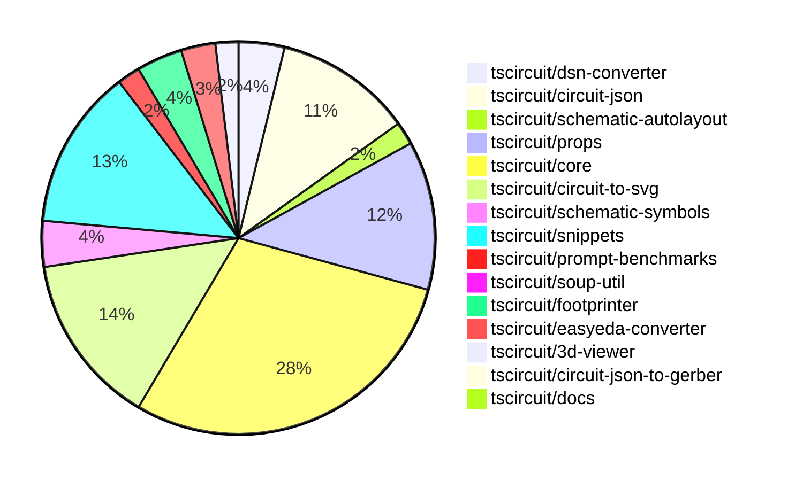

# contribution-tracker

Generates weekly contribution overviews for tscircuit contributors. Check out all
the [contribution overviews here](./contribution-overviews/)

* All PRs in the tscircuit org are scanned/summarized via Claude Haiku
* Claude classifies each Diff/PR as a Major, Minor or Tiny contribution
* All the PRs, summaries, and classifications are organized into charts and tables

The current week is shown below. There are 3 major sections:

* [Contributor Overview](#contributor-overview)
* [PRs by Repository](#prs-by-repository)
* [PRs by Contributor](#changes-by-contributor)

## Current Week

<!-- START_CURRENT_WEEK -->

# Contribution Overview 2024-11-06

## PRs by Repository

## Contributor Overview

| Contributor | 🐳 Major | 🐙 Minor | 🐌 Tiny | ⭐ |
|-------------|-------|-------|-------|-------|
| [seveibar](#seveibar) | 15 | 43 | 1 | 👑👑👑 |
| [imrishabh18](#imrishabh18) | 1 | 20 | 0 | ⭐⭐⭐ |
| [ShiboSoftwareDev](#ShiboSoftwareDev) | 3 | 7 | 0 | ⭐⭐ |
| [anas-sarkez](#anas-sarkez) | 4 | 0 | 0 | ⭐⭐ |
| [DhairyaMajmudar](#DhairyaMajmudar) | 1 | 1 | 0 | ⭐ |
| [Abse2001](#Abse2001) | 0 | 3 | 0 | ⭐ |
| [andrii-balitskyi](#andrii-balitskyi) | 0 | 3 | 0 | ⭐ |
| [mrudulpatil18](#mrudulpatil18) | 0 | 3 | 0 | ⭐ |
| [RohittCodes](#RohittCodes) | 0 | 2 | 0 | ⭐ |
| [tscircuitbot](#tscircuitbot) | 0 | 1 | 0 |  |
| [ahmedhalac](#ahmedhalac) | 0 | 1 | 0 |  |

## Changes by Repository

### [tscircuit/dsn-converter](https://github.com/tscircuit/dsn-converter)

| PR # | Impact | Contributor | Description |
|------|--------|-------------|-------------|
| [#13](https://github.com/tscircuit/dsn-converter/pull/13) | 🐳 Major | imrishabh18 | Adds a new feature to convert circuit JSON to DSN JSON and vice versa. |
| [#16](https://github.com/tscircuit/dsn-converter/pull/16) | 🐙 Minor | imrishabh18 | This pull request fixes a bug that converts circuit JSON to DSN file format. |
| [#15](https://github.com/tscircuit/dsn-converter/pull/15) | 🐙 Minor | imrishabh18 | Add support for the polygon shape in the padstack conversion |
| [#14](https://github.com/tscircuit/dsn-converter/pull/14) | 🐙 Minor | seveibar | Update the README with more details and examples for the library usage. |

### [tscircuit/circuit-json](https://github.com/tscircuit/circuit-json)

| PR # | Impact | Contributor | Description |
|------|--------|-------------|-------------|
| [#80](https://github.com/tscircuit/circuit-json/pull/80) | 🐙 Minor | imrishabh18 | Add support for exporting potentiometer circuit elements |
| [#79](https://github.com/tscircuit/circuit-json/pull/79) | 🐙 Minor | imrishabh18 | Added support for a simple potentiometer component. |
| [#78](https://github.com/tscircuit/circuit-json/pull/78) | 🐙 Minor | seveibar | Add a new source component overview documentation and improve the expectTypesMatch utility. |
| [#74](https://github.com/tscircuit/circuit-json/pull/74) | 🐙 Minor | seveibar | Added a new optional property `anchor_position` to the `SchematicNetLabelInput` interface. |
| [#63](https://github.com/tscircuit/circuit-json/pull/63) | 🐙 Minor | seveibar | Improve the definition of the schematic debug object by introducing explicit interfaces for `SchematicDebugRect` and `SchematicDebugLine`, and ensuring the types are properly matched. |
| [#73](https://github.com/tscircuit/circuit-json/pull/73) | 🐙 Minor | seveibar | Adds junctions to the SchematicTrace type. |
| [#72](https://github.com/tscircuit/circuit-json/pull/72) | 🐙 Minor | seveibar | Adds a new field `is_crossing` to the `SchematicTraceEdge` interface and updates the `schematic_trace` Zod schema to include this new field. |
| [#70](https://github.com/tscircuit/circuit-json/pull/70) | 🐙 Minor | seveibar | Fix a bug in parsing unitless resistance values. |
| [#69](https://github.com/tscircuit/circuit-json/pull/69) | 🐙 Minor | seveibar | Refactored the `schematic_component` type to a zod-based type, added a new `symbol_display_value` field. |
| [#68](https://github.com/tscircuit/circuit-json/pull/68) | 🐙 Minor | seveibar | Adds a new optional field `display_pin_label` to the `SchematicPort` interface. |
| [#77](https://github.com/tscircuit/circuit-json/pull/77) | 🐙 Minor | DhairyaMajmudar | Adds a new PCBMissingFootprintError component to the project. |
| [#76](https://github.com/tscircuit/circuit-json/pull/76) | 🐙 Minor | Abse2001 | Added support for a new circuit element, the push button. |

### [tscircuit/schematic-autolayout](https://github.com/tscircuit/schematic-autolayout)

| PR # | Impact | Contributor | Description |
|------|--------|-------------|-------------|
| [#4](https://github.com/tscircuit/schematic-autolayout/pull/4) | 🐙 Minor | imrishabh18 | Adds an auto publish workflow to the project. |
| [#3](https://github.com/tscircuit/schematic-autolayout/pull/3) | 🐙 Minor | imrishabh18 | Update dependency by migrating to bun, shifting dependency to devDependency, bundling using `tsup-node`, and removing `builder`. |

### [tscircuit/props](https://github.com/tscircuit/props)

| PR # | Impact | Contributor | Description |
|------|--------|-------------|-------------|
| [#96](https://github.com/tscircuit/props/pull/96) | 🐙 Minor | imrishabh18 | Add potentiometer component to the library. |
| [#93](https://github.com/tscircuit/props/pull/93) | 🐙 Minor | imrishabh18 | Adds a new property to the `pin-header` component to specify the direction the header is facing. |
| [#80](https://github.com/tscircuit/props/pull/80) | 🐙 Minor | imrishabh18 | Replace `@tscircuit/soup` dependencies with `circuit-json` dependencies. |
| [#79](https://github.com/tscircuit/props/pull/79) | 🐙 Minor | imrishabh18 | Adds support for defining pins as strings in the `PinSideDefinition` interface. |
| [#92](https://github.com/tscircuit/props/pull/92) | 🐙 Minor | seveibar | Allow strings and numbers to be defined together for pinLabels, and improve `expectTypesMatch` errors |
| [#90](https://github.com/tscircuit/props/pull/90) | 🐙 Minor | seveibar | Adds an optional `footprinterString` parameter to the `findPart` method in the `PartsEngine` type. |
| [#89](https://github.com/tscircuit/props/pull/89) | 🐙 Minor | seveibar | Add a new property `minTraceWidth` to the `group` component in the TypeScript code. |
| [#88](https://github.com/tscircuit/props/pull/88) | 🐙 Minor | seveibar | Fix the schRotation property for the NetAlias component. |
| [#87](https://github.com/tscircuit/props/pull/87) | 🐙 Minor | seveibar | Introduces a new `partsEngine` prop, refactors the `board` component, and fixes the `schX` definition in the `netalias` component. |
| [#83](https://github.com/tscircuit/props/pull/83) | 🐙 Minor | seveibar | Add new `netAlias` props with optional `net`, `schX`, `schY`, and `anchorSide` fields. |
| [#82](https://github.com/tscircuit/props/pull/82) | 🐙 Minor | seveibar | Change the type of `pinLabels` property in the `ChipProps` interface to accept readonly arrays instead of mutable arrays. |
| [#84](https://github.com/tscircuit/props/pull/84) | 🐙 Minor | Abse2001 | Adds a new `pushButtonProps` type and exports it from the library. |
| [#86](https://github.com/tscircuit/props/pull/86) | 🐙 Minor | tscircuitbot | Add `polarized: z.boolean().optional().default(false)` property to `CapacitorProps` interface and `capacitorProps` schema. |

### [tscircuit/core](https://github.com/tscircuit/core)

| PR # | Impact | Contributor | Description |
|------|--------|-------------|-------------|
| [#297](https://github.com/tscircuit/core/pull/297) | 🐳 Major | seveibar | Fixes a complex issue with trace crossing segments by improving the algorithm to handle intersections more robustly. |
| [#287](https://github.com/tscircuit/core/pull/287) | 🐳 Major | seveibar | Adds an SVG image with complex schematic crossings. |
| [#274](https://github.com/tscircuit/core/pull/274) | 🐳 Major | seveibar | Adds a new feature to the "NormalComponent" class to integrate with a "Parts Engine" for finding and updating supplier part numbers for source components. |
| [#264](https://github.com/tscircuit/core/pull/264) | 🐳 Major | seveibar | Adds support for schematic symbol rotation in the NormalComponent class. |
| [#260](https://github.com/tscircuit/core/pull/260) | 🐳 Major | seveibar | Add junction support to the trace component by implementing a new function `createSchematicTraceJunctions` that finds intersections between the current trace and other traces on the same net, and stores the intersection points as junctions. |
| [#252](https://github.com/tscircuit/core/pull/252) | 🐳 Major | seveibar | Adds the `is_crossing` property and splits schematic trace segments to enable the "trace hop" feature. |
| [#251](https://github.com/tscircuit/core/pull/251) | 🐳 Major | seveibar | Fixes a schematic trace overlap issue by pushing traces away from other traces. |
| [#253](https://github.com/tscircuit/core/pull/253) | 🐳 Major | DhairyaMajmudar | Adds error handling for missing footprint in the `NormalComponent` class and introduces a new `MissingFootprintError` class. |
| [#268](https://github.com/tscircuit/core/pull/268) | 🐳 Major | ShiboSoftwareDev | Added capacitor, inductor, diode and LED schematic symbol rotation support. |
| [#300](https://github.com/tscircuit/core/pull/300) | 🐙 Minor | imrishabh18 | Adds a new component, "Potentiometer", to the library. |
| [#295](https://github.com/tscircuit/core/pull/295) | 🐙 Minor | imrishabh18 | Fixes an issue where the header width was not adjusting properly when the label width was small. |
| [#294](https://github.com/tscircuit/core/pull/294) | 🐙 Minor | imrishabh18 | Adds a new `facingDirection` prop to the `PinHeader` component to control the arrangement of pins. |
| [#275](https://github.com/tscircuit/core/pull/275) | 🐙 Minor | imrishabh18 | Reduce the size dependency of the `schematic-autolayout` package by updating to version `0.0.6`. |
| [#270](https://github.com/tscircuit/core/pull/270) | 🐙 Minor | imrishabh18 | Moves the normalize function from the easyeda library to the core library. |
| [#245](https://github.com/tscircuit/core/pull/245) | 🐙 Minor | imrishabh18 | Fixes an issue where port dots were appearing in the center of the chip when a port arrangement was present. |
| [#299](https://github.com/tscircuit/core/pull/299) | 🐙 Minor | seveibar | Fix an issue with the simplified overshot check in the `create-schematic-trace-crossing-segments.ts` file. |
| [#296](https://github.com/tscircuit/core/pull/296) | 🐙 Minor | seveibar | Fix the facing direction of net labels |
| [#292](https://github.com/tscircuit/core/pull/292) | 🐙 Minor | seveibar | Allow `schPortArrangement` to accept strings in addition to numbers. |
| [#285](https://github.com/tscircuit/core/pull/285) | 🐙 Minor | seveibar | Fix stub edges not appearing for some edges |
| [#284](https://github.com/tscircuit/core/pull/284) | 🐙 Minor | seveibar | Fixes a visual bug in the crossing direction calculation of schematic traces. |
| [#283](https://github.com/tscircuit/core/pull/283) | 🐙 Minor | seveibar | Increase the line thickness for traces to prevent overlap and improve the rendering of crossings in the schematic. |
| [#277](https://github.com/tscircuit/core/pull/277) | 🐙 Minor | seveibar | Adapts the parts engine to use the `footprinterString` property of the source component. |
| [#262](https://github.com/tscircuit/core/pull/262) | 🐙 Minor | seveibar | Fixes an issue where the props of the schematic component were not being properly parsed, resulting in incorrect positioning and rotation of the component. |
| [#261](https://github.com/tscircuit/core/pull/261) | 🐙 Minor | seveibar | Add anchor_position to schematic_net_label, and add net labels when a schematic trace is connected to a net on one side. |
| [#257](https://github.com/tscircuit/core/pull/257) | 🐙 Minor | seveibar | Implement source_trace.subcircuit_connectivity_map_key |
| [#247](https://github.com/tscircuit/core/pull/247) | 🐙 Minor | seveibar | Adds `display_pin_label` to schematic ports and `symbol_display_value` to schematic components. |
| [#269](https://github.com/tscircuit/core/pull/269) | 🐙 Minor | ShiboSoftwareDev | The change updates the `schematic_port.facing_direction` to be more accurate by using the `localPortInfo.side` property to determine the facing direction. |
| [#259](https://github.com/tscircuit/core/pull/259) | 🐙 Minor | ShiboSoftwareDev | Schematic box components now expand to fit their label text. |
| [#242](https://github.com/tscircuit/core/pull/242) | 🐙 Minor | andrii-balitskyi | Adds a test for the `useDiode` hook to ensure it creates components with the correct props and traces. |
| [#244](https://github.com/tscircuit/core/pull/244) | 🐙 Minor | andrii-balitskyi | Add a GitHub Actions workflow for running a code formatter (formatbot) on pull requests. |
| [#243](https://github.com/tscircuit/core/pull/243) | 🐙 Minor | andrii-balitskyi | Add a new useLed hook to create LED components in the circuit. |

### [tscircuit/circuit-to-svg](https://github.com/tscircuit/circuit-to-svg)

| PR # | Impact | Contributor | Description |
|------|--------|-------------|-------------|
| [#117](https://github.com/tscircuit/circuit-to-svg/pull/117) | 🐳 Major | seveibar | Adds nonexistent symbol handling and error message when symbol ports don't align. |
| [#113](https://github.com/tscircuit/circuit-to-svg/pull/113) | 🐳 Major | seveibar | This pull request introduces comprehensive Netlabel size and position calculations with support for `center` and `anchor_position`. |
| [#112](https://github.com/tscircuit/circuit-to-svg/pull/112) | 🐳 Major | seveibar | Add support for junctions and improve the drawing of wire crossings in the schematic SVG generation. |
| [#110](https://github.com/tscircuit/circuit-to-svg/pull/110) | 🐳 Major | seveibar | Initial implementation of crossing trace rendering in the schematic SVG generator. |
| [#120](https://github.com/tscircuit/circuit-to-svg/pull/120) | 🐙 Minor | imrishabh18 | Fixed the top and bottom anchor position for net labels. |
| [#115](https://github.com/tscircuit/circuit-to-svg/pull/115) | 🐙 Minor | imrishabh18 | Use the source port name for the pin text instead of the pin number |
| [#106](https://github.com/tscircuit/circuit-to-svg/pull/106) | 🐙 Minor | imrishabh18 | Adds support for rendering schematic net labels in the SVG output. |
| [#124](https://github.com/tscircuit/circuit-to-svg/pull/124) | 🐙 Minor | seveibar | Change the trace color on hover and make the paths rounded. |
| [#121](https://github.com/tscircuit/circuit-to-svg/pull/121) | 🐙 Minor | seveibar | Reverts a previous fix that adjusted the top and bottom anchor position of the net label. |
| [#116](https://github.com/tscircuit/circuit-to-svg/pull/116) | 🐙 Minor | seveibar | Reverts the change to use the source port name for the pin text. |
| [#111](https://github.com/tscircuit/circuit-to-svg/pull/111) | 🐙 Minor | seveibar | Fix labeled points not appearing at correct position and make the labels use sans-serif font |
| [#109](https://github.com/tscircuit/circuit-to-svg/pull/109) | 🐙 Minor | seveibar | Fixes issues with schematic port label names, component text anchoring, and updates the core dependency. |
| [#108](https://github.com/tscircuit/circuit-to-svg/pull/108) | 🐙 Minor | seveibar | Switch to using `symbol_display_value` for symbol values instead of `display_value`, `capacitance`, or `resistance`. |
| [#107](https://github.com/tscircuit/circuit-to-svg/pull/107) | 🐙 Minor | seveibar | Adds a format check workflow to the project, formats the codebase, and adds a new rule to the linter. |
| [#114](https://github.com/tscircuit/circuit-to-svg/pull/114) | 🐙 Minor | ShiboSoftwareDev | Adds an option to draw PCB trace errors in the SVG conversion |

### [tscircuit/schematic-symbols](https://github.com/tscircuit/schematic-symbols)

| PR # | Impact | Contributor | Description |
|------|--------|-------------|-------------|
| [#195](https://github.com/tscircuit/schematic-symbols/pull/195) | 🐳 Major | anas-sarkez | The pull request changes the LED symbol from having "horz" and "vert" to having "up", "right", "left", and "down" orientations. |
| [#194](https://github.com/tscircuit/schematic-symbols/pull/194) | 🐳 Major | anas-sarkez | Refactor the `rotateAnchor` function to handle all anchor rotations based on the given orientation. |
| [#190](https://github.com/tscircuit/schematic-symbols/pull/190) | 🐳 Major | anas-sarkez | Diode components now have left/right/up/down variants instead of horizontal/vertical variants. |
| [#197](https://github.com/tscircuit/schematic-symbols/pull/197) | 🐙 Minor | imrishabh18 | Fix the position of the potentiometer label in the horizontal and vertical symbols. |

### [tscircuit/snippets](https://github.com/tscircuit/snippets)

| PR # | Impact | Contributor | Description |
|------|--------|-------------|-------------|
| [#196](https://github.com/tscircuit/snippets/pull/196) | 🐳 Major | seveibar | The pull request adds support for async circuit rendering and opens BOM links in a new tab. |
| [#192](https://github.com/tscircuit/snippets/pull/192) | 🐳 Major | seveibar | Adds a new BOM (Bill of Materials) tab and a dropdown for selecting different preview views (code, PCB, BOM) in the preview content. |
| [#186](https://github.com/tscircuit/snippets/pull/186) | 🐳 Major | seveibar | Introduces the initial integration of the Parts Engine, refactors test locations, and finishes the test refactor. |
| [#188](https://github.com/tscircuit/snippets/pull/188) | 🐙 Minor | seveibar | Update the `@tscircuit/core` dependency and add an automatic package update system via Renovate config |
| [#185](https://github.com/tscircuit/snippets/pull/185) | 🐙 Minor | seveibar | Add new route and test to list trending snippets based on recent star counts |
| [#173](https://github.com/tscircuit/snippets/pull/173) | 🐙 Minor | seveibar | Update dependencies for the project |
| [#169](https://github.com/tscircuit/snippets/pull/169) | 🐙 Minor | seveibar | Update dependencies (core and circuit-to-svg), swap schematic viewer to circuit-to-svg with mouse controls |
| [#183](https://github.com/tscircuit/snippets/pull/183) | 🐙 Minor | Abse2001 | Updated dependencies in the package.json file |
| [#206](https://github.com/tscircuit/snippets/pull/206) | 🐙 Minor | mrudulpatil18 |  |
| [#176](https://github.com/tscircuit/snippets/pull/176) | 🐙 Minor | mrudulpatil18 | Adds keyboard navigation, selection, and a footer to the CMDK UI dialog. |
| [#170](https://github.com/tscircuit/snippets/pull/170) | 🐙 Minor | mrudulpatil18 | Adds functionality to change the snippet type. |
| [#182](https://github.com/tscircuit/snippets/pull/182) | 🐙 Minor | RohittCodes | Refactors the search text functionality to address issues with playwright tests for different device sizes. |
| [#178](https://github.com/tscircuit/snippets/pull/178) | 🐙 Minor | RohittCodes | Adds a zoom effect for the schematic view by setting the `transformOrigin` CSS property. |
| [#184](https://github.com/tscircuit/snippets/pull/184) | 🐙 Minor | ahmedhalac | Added copy to clipboard functionality for the snippet page. |

### [tscircuit/prompt-benchmarks](https://github.com/tscircuit/prompt-benchmarks)

| PR # | Impact | Contributor | Description |
|------|--------|-------------|-------------|
| [#5](https://github.com/tscircuit/prompt-benchmarks/pull/5) | 🐳 Major | seveibar | Integrates tscircuit snippets for prompt generation |
| [#4](https://github.com/tscircuit/prompt-benchmarks/pull/4) | 🐙 Minor | seveibar | Adds new test cases for the `create-circuit-board1` prompt, including new board samples and module samples. |

### [tscircuit/soup-util](https://github.com/tscircuit/soup-util)

| PR # | Impact | Contributor | Description |
|------|--------|-------------|-------------|
| [#24](https://github.com/tscircuit/soup-util/pull/24) | 🐙 Minor | seveibar | Fix update method to correctly update the right objects based on the component type and ID. |

### [tscircuit/footprinter](https://github.com/tscircuit/footprinter)

| PR # | Impact | Contributor | Description |
|------|--------|-------------|-------------|
| [#78](https://github.com/tscircuit/footprinter/pull/78) | 🐳 Major | anas-sarkez | This pull request implements the sot235 (sot23-5) footprint with testing. |
| [#80](https://github.com/tscircuit/footprinter/pull/80) | 🐙 Minor | seveibar | Update the default outer diameter of plated holes to be 1.5mm |
| [#77](https://github.com/tscircuit/footprinter/pull/77) | 🐙 Minor | ShiboSoftwareDev | The change makes `getFootprintNames` a method of the `footprinter` object, allowing it to be accessed directly from the exported `footprinter` function. |
| [#76](https://github.com/tscircuit/footprinter/pull/76) | 🐙 Minor | ShiboSoftwareDev | Adds a new method `getFootprintNames()` to the `Footprinter` interface to retrieve an array of footprint names. |

### [tscircuit/easyeda-converter](https://github.com/tscircuit/easyeda-converter)

| PR # | Impact | Contributor | Description |
|------|--------|-------------|-------------|
| [#108](https://github.com/tscircuit/easyeda-converter/pull/108) | 🐙 Minor | seveibar | Add `manufacturerPartNumber` prop to the TypeScript component template |
| [#107](https://github.com/tscircuit/easyeda-converter/pull/107) | 🐙 Minor | seveibar | Changes the supplier part number to be sourced from JLCPCB instead of LCSC. |
| [#101](https://github.com/tscircuit/easyeda-converter/pull/101) | 🐌 Tiny | seveibar | Removed the `schPinSpacing` property from the `SoupTypescriptComponentTemplate` component. |

### [tscircuit/3d-viewer](https://github.com/tscircuit/3d-viewer)

| PR # | Impact | Contributor | Description |
|------|--------|-------------|-------------|
| [#33](https://github.com/tscircuit/3d-viewer/pull/33) | 🐳 Major | ShiboSoftwareDev | Adds a feature to hover over a component in the CAD viewer to highlight and view the reference designator. |
| [#34](https://github.com/tscircuit/3d-viewer/pull/34) | 🐙 Minor | ShiboSoftwareDev | Changed the highlight color of the 3D model from a low-intensity red to a blue color. |

### [tscircuit/circuit-json-to-gerber](https://github.com/tscircuit/circuit-json-to-gerber)

| PR # | Impact | Contributor | Description |
|------|--------|-------------|-------------|
| [#27](https://github.com/tscircuit/circuit-json-to-gerber/pull/27) | 🐳 Major | ShiboSoftwareDev | Added support for silkscreen text in the PCB rendering. |

### [tscircuit/docs](https://github.com/tscircuit/docs)

| PR # | Impact | Contributor | Description |
|------|--------|-------------|-------------|
| [#36](https://github.com/tscircuit/docs/pull/36) | 🐙 Minor | ShiboSoftwareDev | Added a new tutorial circuit for a pushbutton LED. |

## Changes by Contributor

### [imrishabh18](https://github.com/imrishabh18)

| PR # | Impact | Description |
|------|--------|-------------|
| [#13](https://github.com/tscircuit/dsn-converter/pull/13) | 🐳 Major | Adds a new feature to convert circuit JSON to DSN JSON and vice versa. |
| [#80](https://github.com/tscircuit/circuit-json/pull/80) | 🐙 Minor | Add support for exporting potentiometer circuit elements |
| [#79](https://github.com/tscircuit/circuit-json/pull/79) | 🐙 Minor | Added support for a simple potentiometer component. |
| [#4](https://github.com/tscircuit/schematic-autolayout/pull/4) | 🐙 Minor | Adds an auto publish workflow to the project. |
| [#3](https://github.com/tscircuit/schematic-autolayout/pull/3) | 🐙 Minor | Update dependency by migrating to bun, shifting dependency to devDependency, bundling using `tsup-node`, and removing `builder`. |
| [#96](https://github.com/tscircuit/props/pull/96) | 🐙 Minor | Add potentiometer component to the library. |
| [#93](https://github.com/tscircuit/props/pull/93) | 🐙 Minor | Adds a new property to the `pin-header` component to specify the direction the header is facing. |
| [#80](https://github.com/tscircuit/props/pull/80) | 🐙 Minor | Replace `@tscircuit/soup` dependencies with `circuit-json` dependencies. |
| [#79](https://github.com/tscircuit/props/pull/79) | 🐙 Minor | Adds support for defining pins as strings in the `PinSideDefinition` interface. |
| [#300](https://github.com/tscircuit/core/pull/300) | 🐙 Minor | Adds a new component, "Potentiometer", to the library. |
| [#295](https://github.com/tscircuit/core/pull/295) | 🐙 Minor | Fixes an issue where the header width was not adjusting properly when the label width was small. |
| [#294](https://github.com/tscircuit/core/pull/294) | 🐙 Minor | Adds a new `facingDirection` prop to the `PinHeader` component to control the arrangement of pins. |
| [#275](https://github.com/tscircuit/core/pull/275) | 🐙 Minor | Reduce the size dependency of the `schematic-autolayout` package by updating to version `0.0.6`. |
| [#270](https://github.com/tscircuit/core/pull/270) | 🐙 Minor | Moves the normalize function from the easyeda library to the core library. |
| [#245](https://github.com/tscircuit/core/pull/245) | 🐙 Minor | Fixes an issue where port dots were appearing in the center of the chip when a port arrangement was present. |
| [#120](https://github.com/tscircuit/circuit-to-svg/pull/120) | 🐙 Minor | Fixed the top and bottom anchor position for net labels. |
| [#115](https://github.com/tscircuit/circuit-to-svg/pull/115) | 🐙 Minor | Use the source port name for the pin text instead of the pin number |
| [#106](https://github.com/tscircuit/circuit-to-svg/pull/106) | 🐙 Minor | Adds support for rendering schematic net labels in the SVG output. |
| [#197](https://github.com/tscircuit/schematic-symbols/pull/197) | 🐙 Minor | Fix the position of the potentiometer label in the horizontal and vertical symbols. |
| [#16](https://github.com/tscircuit/dsn-converter/pull/16) | 🐙 Minor | This pull request fixes a bug that converts circuit JSON to DSN file format. |
| [#15](https://github.com/tscircuit/dsn-converter/pull/15) | 🐙 Minor | Add support for the polygon shape in the padstack conversion |

### [seveibar](https://github.com/seveibar)

| PR # | Impact | Description |
|------|--------|-------------|
| [#297](https://github.com/tscircuit/core/pull/297) | 🐳 Major | Fixes a complex issue with trace crossing segments by improving the algorithm to handle intersections more robustly. |
| [#287](https://github.com/tscircuit/core/pull/287) | 🐳 Major | Adds an SVG image with complex schematic crossings. |
| [#274](https://github.com/tscircuit/core/pull/274) | 🐳 Major | Adds a new feature to the "NormalComponent" class to integrate with a "Parts Engine" for finding and updating supplier part numbers for source components. |
| [#264](https://github.com/tscircuit/core/pull/264) | 🐳 Major | Adds support for schematic symbol rotation in the NormalComponent class. |
| [#260](https://github.com/tscircuit/core/pull/260) | 🐳 Major | Add junction support to the trace component by implementing a new function `createSchematicTraceJunctions` that finds intersections between the current trace and other traces on the same net, and stores the intersection points as junctions. |
| [#252](https://github.com/tscircuit/core/pull/252) | 🐳 Major | Adds the `is_crossing` property and splits schematic trace segments to enable the "trace hop" feature. |
| [#251](https://github.com/tscircuit/core/pull/251) | 🐳 Major | Fixes a schematic trace overlap issue by pushing traces away from other traces. |
| [#117](https://github.com/tscircuit/circuit-to-svg/pull/117) | 🐳 Major | Adds nonexistent symbol handling and error message when symbol ports don't align. |
| [#113](https://github.com/tscircuit/circuit-to-svg/pull/113) | 🐳 Major | This pull request introduces comprehensive Netlabel size and position calculations with support for `center` and `anchor_position`. |
| [#112](https://github.com/tscircuit/circuit-to-svg/pull/112) | 🐳 Major | Add support for junctions and improve the drawing of wire crossings in the schematic SVG generation. |
| [#110](https://github.com/tscircuit/circuit-to-svg/pull/110) | 🐳 Major | Initial implementation of crossing trace rendering in the schematic SVG generator. |
| [#196](https://github.com/tscircuit/snippets/pull/196) | 🐳 Major | The pull request adds support for async circuit rendering and opens BOM links in a new tab. |
| [#192](https://github.com/tscircuit/snippets/pull/192) | 🐳 Major | Adds a new BOM (Bill of Materials) tab and a dropdown for selecting different preview views (code, PCB, BOM) in the preview content. |
| [#186](https://github.com/tscircuit/snippets/pull/186) | 🐳 Major | Introduces the initial integration of the Parts Engine, refactors test locations, and finishes the test refactor. |
| [#5](https://github.com/tscircuit/prompt-benchmarks/pull/5) | 🐳 Major | Integrates tscircuit snippets for prompt generation |
| [#78](https://github.com/tscircuit/circuit-json/pull/78) | 🐙 Minor | Add a new source component overview documentation and improve the expectTypesMatch utility. |
| [#74](https://github.com/tscircuit/circuit-json/pull/74) | 🐙 Minor | Added a new optional property `anchor_position` to the `SchematicNetLabelInput` interface. |
| [#63](https://github.com/tscircuit/circuit-json/pull/63) | 🐙 Minor | Improve the definition of the schematic debug object by introducing explicit interfaces for `SchematicDebugRect` and `SchematicDebugLine`, and ensuring the types are properly matched. |
| [#73](https://github.com/tscircuit/circuit-json/pull/73) | 🐙 Minor | Adds junctions to the SchematicTrace type. |
| [#72](https://github.com/tscircuit/circuit-json/pull/72) | 🐙 Minor | Adds a new field `is_crossing` to the `SchematicTraceEdge` interface and updates the `schematic_trace` Zod schema to include this new field. |
| [#70](https://github.com/tscircuit/circuit-json/pull/70) | 🐙 Minor | Fix a bug in parsing unitless resistance values. |
| [#69](https://github.com/tscircuit/circuit-json/pull/69) | 🐙 Minor | Refactored the `schematic_component` type to a zod-based type, added a new `symbol_display_value` field. |
| [#68](https://github.com/tscircuit/circuit-json/pull/68) | 🐙 Minor | Adds a new optional field `display_pin_label` to the `SchematicPort` interface. |
| [#24](https://github.com/tscircuit/soup-util/pull/24) | 🐙 Minor | Fix update method to correctly update the right objects based on the component type and ID. |
| [#92](https://github.com/tscircuit/props/pull/92) | 🐙 Minor | Allow strings and numbers to be defined together for pinLabels, and improve `expectTypesMatch` errors |
| [#90](https://github.com/tscircuit/props/pull/90) | 🐙 Minor | Adds an optional `footprinterString` parameter to the `findPart` method in the `PartsEngine` type. |
| [#89](https://github.com/tscircuit/props/pull/89) | 🐙 Minor | Add a new property `minTraceWidth` to the `group` component in the TypeScript code. |
| [#88](https://github.com/tscircuit/props/pull/88) | 🐙 Minor | Fix the schRotation property for the NetAlias component. |
| [#87](https://github.com/tscircuit/props/pull/87) | 🐙 Minor | Introduces a new `partsEngine` prop, refactors the `board` component, and fixes the `schX` definition in the `netalias` component. |
| [#83](https://github.com/tscircuit/props/pull/83) | 🐙 Minor | Add new `netAlias` props with optional `net`, `schX`, `schY`, and `anchorSide` fields. |
| [#82](https://github.com/tscircuit/props/pull/82) | 🐙 Minor | Change the type of `pinLabels` property in the `ChipProps` interface to accept readonly arrays instead of mutable arrays. |
| [#80](https://github.com/tscircuit/footprinter/pull/80) | 🐙 Minor | Update the default outer diameter of plated holes to be 1.5mm |
| [#108](https://github.com/tscircuit/easyeda-converter/pull/108) | 🐙 Minor | Add `manufacturerPartNumber` prop to the TypeScript component template |
| [#107](https://github.com/tscircuit/easyeda-converter/pull/107) | 🐙 Minor | Changes the supplier part number to be sourced from JLCPCB instead of LCSC. |
| [#299](https://github.com/tscircuit/core/pull/299) | 🐙 Minor | Fix an issue with the simplified overshot check in the `create-schematic-trace-crossing-segments.ts` file. |
| [#296](https://github.com/tscircuit/core/pull/296) | 🐙 Minor | Fix the facing direction of net labels |
| [#292](https://github.com/tscircuit/core/pull/292) | 🐙 Minor | Allow `schPortArrangement` to accept strings in addition to numbers. |
| [#285](https://github.com/tscircuit/core/pull/285) | 🐙 Minor | Fix stub edges not appearing for some edges |
| [#284](https://github.com/tscircuit/core/pull/284) | 🐙 Minor | Fixes a visual bug in the crossing direction calculation of schematic traces. |
| [#283](https://github.com/tscircuit/core/pull/283) | 🐙 Minor | Increase the line thickness for traces to prevent overlap and improve the rendering of crossings in the schematic. |
| [#277](https://github.com/tscircuit/core/pull/277) | 🐙 Minor | Adapts the parts engine to use the `footprinterString` property of the source component. |
| [#262](https://github.com/tscircuit/core/pull/262) | 🐙 Minor | Fixes an issue where the props of the schematic component were not being properly parsed, resulting in incorrect positioning and rotation of the component. |
| [#261](https://github.com/tscircuit/core/pull/261) | 🐙 Minor | Add anchor_position to schematic_net_label, and add net labels when a schematic trace is connected to a net on one side. |
| [#257](https://github.com/tscircuit/core/pull/257) | 🐙 Minor | Implement source_trace.subcircuit_connectivity_map_key |
| [#247](https://github.com/tscircuit/core/pull/247) | 🐙 Minor | Adds `display_pin_label` to schematic ports and `symbol_display_value` to schematic components. |
| [#124](https://github.com/tscircuit/circuit-to-svg/pull/124) | 🐙 Minor | Change the trace color on hover and make the paths rounded. |
| [#121](https://github.com/tscircuit/circuit-to-svg/pull/121) | 🐙 Minor | Reverts a previous fix that adjusted the top and bottom anchor position of the net label. |
| [#116](https://github.com/tscircuit/circuit-to-svg/pull/116) | 🐙 Minor | Reverts the change to use the source port name for the pin text. |
| [#111](https://github.com/tscircuit/circuit-to-svg/pull/111) | 🐙 Minor | Fix labeled points not appearing at correct position and make the labels use sans-serif font |
| [#109](https://github.com/tscircuit/circuit-to-svg/pull/109) | 🐙 Minor | Fixes issues with schematic port label names, component text anchoring, and updates the core dependency. |
| [#108](https://github.com/tscircuit/circuit-to-svg/pull/108) | 🐙 Minor | Switch to using `symbol_display_value` for symbol values instead of `display_value`, `capacitance`, or `resistance`. |
| [#107](https://github.com/tscircuit/circuit-to-svg/pull/107) | 🐙 Minor | Adds a format check workflow to the project, formats the codebase, and adds a new rule to the linter. |
| [#14](https://github.com/tscircuit/dsn-converter/pull/14) | 🐙 Minor | Update the README with more details and examples for the library usage. |
| [#188](https://github.com/tscircuit/snippets/pull/188) | 🐙 Minor | Update the `@tscircuit/core` dependency and add an automatic package update system via Renovate config |
| [#185](https://github.com/tscircuit/snippets/pull/185) | 🐙 Minor | Add new route and test to list trending snippets based on recent star counts |
| [#173](https://github.com/tscircuit/snippets/pull/173) | 🐙 Minor | Update dependencies for the project |
| [#169](https://github.com/tscircuit/snippets/pull/169) | 🐙 Minor | Update dependencies (core and circuit-to-svg), swap schematic viewer to circuit-to-svg with mouse controls |
| [#4](https://github.com/tscircuit/prompt-benchmarks/pull/4) | 🐙 Minor | Adds new test cases for the `create-circuit-board1` prompt, including new board samples and module samples. |
| [#101](https://github.com/tscircuit/easyeda-converter/pull/101) | 🐌 Tiny | Removed the `schPinSpacing` property from the `SoupTypescriptComponentTemplate` component. |

### [DhairyaMajmudar](https://github.com/DhairyaMajmudar)

| PR # | Impact | Description |
|------|--------|-------------|
| [#253](https://github.com/tscircuit/core/pull/253) | 🐳 Major | Adds error handling for missing footprint in the `NormalComponent` class and introduces a new `MissingFootprintError` class. |
| [#77](https://github.com/tscircuit/circuit-json/pull/77) | 🐙 Minor | Adds a new PCBMissingFootprintError component to the project. |

### [Abse2001](https://github.com/Abse2001)

| PR # | Impact | Description |
|------|--------|-------------|
| [#76](https://github.com/tscircuit/circuit-json/pull/76) | 🐙 Minor | Added support for a new circuit element, the push button. |
| [#84](https://github.com/tscircuit/props/pull/84) | 🐙 Minor | Adds a new `pushButtonProps` type and exports it from the library. |
| [#183](https://github.com/tscircuit/snippets/pull/183) | 🐙 Minor | Updated dependencies in the package.json file |

### [ShiboSoftwareDev](https://github.com/ShiboSoftwareDev)

| PR # | Impact | Description |
|------|--------|-------------|
| [#33](https://github.com/tscircuit/3d-viewer/pull/33) | 🐳 Major | Adds a feature to hover over a component in the CAD viewer to highlight and view the reference designator. |
| [#268](https://github.com/tscircuit/core/pull/268) | 🐳 Major | Added capacitor, inductor, diode and LED schematic symbol rotation support. |
| [#27](https://github.com/tscircuit/circuit-json-to-gerber/pull/27) | 🐳 Major | Added support for silkscreen text in the PCB rendering. |
| [#36](https://github.com/tscircuit/docs/pull/36) | 🐙 Minor | Added a new tutorial circuit for a pushbutton LED. |
| [#77](https://github.com/tscircuit/footprinter/pull/77) | 🐙 Minor | The change makes `getFootprintNames` a method of the `footprinter` object, allowing it to be accessed directly from the exported `footprinter` function. |
| [#76](https://github.com/tscircuit/footprinter/pull/76) | 🐙 Minor | Adds a new method `getFootprintNames()` to the `Footprinter` interface to retrieve an array of footprint names. |
| [#34](https://github.com/tscircuit/3d-viewer/pull/34) | 🐙 Minor | Changed the highlight color of the 3D model from a low-intensity red to a blue color. |
| [#269](https://github.com/tscircuit/core/pull/269) | 🐙 Minor | The change updates the `schematic_port.facing_direction` to be more accurate by using the `localPortInfo.side` property to determine the facing direction. |
| [#259](https://github.com/tscircuit/core/pull/259) | 🐙 Minor | Schematic box components now expand to fit their label text. |
| [#114](https://github.com/tscircuit/circuit-to-svg/pull/114) | 🐙 Minor | Adds an option to draw PCB trace errors in the SVG conversion |

### [tscircuitbot](https://github.com/tscircuitbot)

| PR # | Impact | Description |
|------|--------|-------------|
| [#86](https://github.com/tscircuit/props/pull/86) | 🐙 Minor | Add `polarized: z.boolean().optional().default(false)` property to `CapacitorProps` interface and `capacitorProps` schema. |

### [anas-sarkez](https://github.com/anas-sarkez)

| PR # | Impact | Description |
|------|--------|-------------|
| [#78](https://github.com/tscircuit/footprinter/pull/78) | 🐳 Major | This pull request implements the sot235 (sot23-5) footprint with testing. |
| [#195](https://github.com/tscircuit/schematic-symbols/pull/195) | 🐳 Major | The pull request changes the LED symbol from having "horz" and "vert" to having "up", "right", "left", and "down" orientations. |
| [#194](https://github.com/tscircuit/schematic-symbols/pull/194) | 🐳 Major | Refactor the `rotateAnchor` function to handle all anchor rotations based on the given orientation. |
| [#190](https://github.com/tscircuit/schematic-symbols/pull/190) | 🐳 Major | Diode components now have left/right/up/down variants instead of horizontal/vertical variants. |

### [andrii-balitskyi](https://github.com/andrii-balitskyi)

| PR # | Impact | Description |
|------|--------|-------------|
| [#242](https://github.com/tscircuit/core/pull/242) | 🐙 Minor | Adds a test for the `useDiode` hook to ensure it creates components with the correct props and traces. |
| [#244](https://github.com/tscircuit/core/pull/244) | 🐙 Minor | Add a GitHub Actions workflow for running a code formatter (formatbot) on pull requests. |
| [#243](https://github.com/tscircuit/core/pull/243) | 🐙 Minor | Add a new useLed hook to create LED components in the circuit. |

### [mrudulpatil18](https://github.com/mrudulpatil18)

| PR # | Impact | Description |
|------|--------|-------------|
| [#206](https://github.com/tscircuit/snippets/pull/206) | 🐙 Minor |  |
| [#176](https://github.com/tscircuit/snippets/pull/176) | 🐙 Minor | Adds keyboard navigation, selection, and a footer to the CMDK UI dialog. |
| [#170](https://github.com/tscircuit/snippets/pull/170) | 🐙 Minor | Adds functionality to change the snippet type. |

### [RohittCodes](https://github.com/RohittCodes)

| PR # | Impact | Description |
|------|--------|-------------|
| [#182](https://github.com/tscircuit/snippets/pull/182) | 🐙 Minor | Refactors the search text functionality to address issues with playwright tests for different device sizes. |
| [#178](https://github.com/tscircuit/snippets/pull/178) | 🐙 Minor | Adds a zoom effect for the schematic view by setting the `transformOrigin` CSS property. |

### [ahmedhalac](https://github.com/ahmedhalac)

| PR # | Impact | Description |
|------|--------|-------------|
| [#184](https://github.com/tscircuit/snippets/pull/184) | 🐙 Minor | Added copy to clipboard functionality for the snippet page. |

<!-- END_CURRENT_WEEK -->
