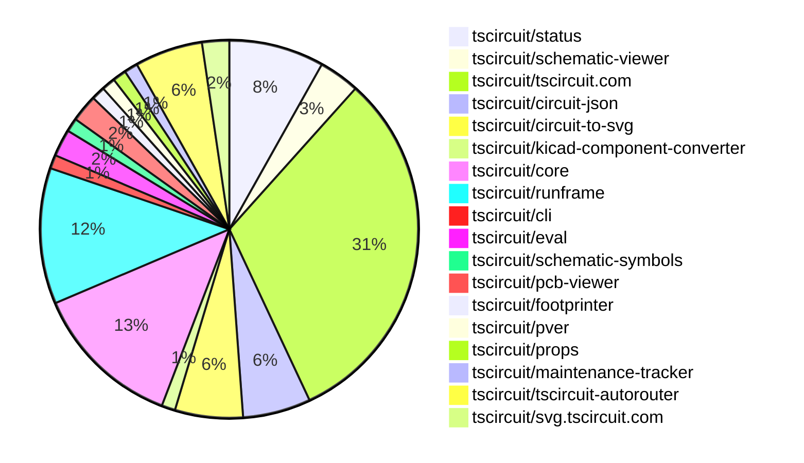

# contribution-tracker

Generates weekly contribution overviews for tscircuit contributors. Check out all
the [contribution overviews here](./contribution-overviews/)

* All PRs in the tscircuit org are scanned/summarized via Claude Haiku
* Claude classifies each Diff/PR as a Major, Minor or Tiny contribution
* All the PRs, summaries, and classifications are organized into charts and tables

The current week is shown below. There are 3 major sections:

* [Contributor Overview](#contributor-overview)
* [PRs by Repository](#prs-by-repository)
* [PRs by Contributor](#changes-by-contributor)

## Current Week

<!-- START_CURRENT_WEEK -->

# Contribution Overview 2025-04-30

## PRs by Repository

## Contributor Overview

| Contributor | 🐳 Major | 🐙 Minor | 🐌 Tiny | ⭐ | Issues Created | Discussion Contributions |
|-------------|---------|---------|---------|-----|----------------|--------------------------|
| [imrishabh18](#imrishabh18) | 0 | 15 | 3 | ⭐⭐⭐ | 7 | 0🔹 0🔶 0💎 |
| [seveibar](#seveibar) | 4 | 5 | 1 | ⭐⭐⭐ | 39 | 0🔹 0🔶 0💎 |
| [ShiboSoftwareDev](#ShiboSoftwareDev) | 1 | 11 | 2 | ⭐⭐⭐ | 11 | 0🔹 0🔶 0💎 |
| [ArnavK-09](#ArnavK-09) | 2 | 8 | 4 | ⭐⭐⭐ | 5 | 0🔹 0🔶 0💎 |
| [Anshgrover23](#Anshgrover23) | 2 | 3 | 1 | ⭐⭐ | 3 | 0🔹 0🔶 0💎 |
| [Abse2001](#Abse2001) | 2 | 4 | 0 | ⭐⭐ | 0 | 0🔹 0🔶 0💎 |
| [MustafaMulla29](#MustafaMulla29) | 1 | 2 | 1 | ⭐⭐ | 3 | 0🔹 0🔶 0💎 |
| [techmannih](#techmannih) | 1 | 3 | 0 | ⭐⭐ | 1 | 0🔹 0🔶 0💎 |
| [krushnarout](#krushnarout) | 0 | 2 | 0 | ⭐ | 0 | 0🔹 0🔶 0💎 |
| [mohan-bee](#mohan-bee) | 0 | 2 | 0 | ⭐ | 3 | 0🔹 0🔶 0💎 |
| [ricohageman](#ricohageman) | 1 | 0 | 0 | ⭐ | 0 | 0🔹 0🔶 0💎 |

### Discussion Contribution Legend

- 🔹 Participating: Basic participation with minimal effort
- 🔶 Very Active: Thoughtful participation that adds value
- 💎 Extremely Active: Exceptional participation with high-quality content

## Review Table

[reviews-received-hover]: ## "Number of reviews received for PRs for this contributor"
[approvals-received-hover]: ## "Number of approvals received for PRs this contributor authored"
[rejections-received-hover]: ## "Number of rejections received for PRs this contributor authored"
[prs-opened-hover]: ## "Number of PRs opened by this contributor"
[issues-created-hover]: ## "Number of issues created by this contributor"
[bountied-issues-hover]: ## "Number of issues this contributor created with a bounty"
[bountied-issue-$-hover]: ## "Total bounty amount placed on issues authored by this contributor"

| Contributor | Reviews Received | Approvals Received | Rejections Received | Approvals | Rejections | PRs Opened | PRs Merged | Issues Created | Bountied Issues | Bountied Issue $ |
|---|---|---|---|---|---|---|---|---|---|---|
| [Anshgrover23](#Anshgrover23) | 11 | 7 | 3 | 5 | 5 | 11 | 6 | 3 | 1 | 10 |
| [krushnarout](#krushnarout) | 2 | 2 | 0 | 0 | 0 | 4 | 2 | 0 | 0 | 0 |
| [mohan-bee](#mohan-bee) | 8 | 5 | 2 | 0 | 0 | 5 | 2 | 3 | 0 | 0 |
| [MustafaMulla29](#MustafaMulla29) | 16 | 7 | 5 | 0 | 1 | 6 | 5 | 3 | 1 | 5 |
| [seveibar](#seveibar) | 0 | 0 | 0 | 55 | 9 | 13 | 11 | 39 | 25 | 527 |
| [imrishabh18](#imrishabh18) | 11 | 3 | 0 | 13 | 5 | 20 | 18 | 7 | 4 | 32 |
| [ShiboSoftwareDev](#ShiboSoftwareDev) | 35 | 18 | 0 | 0 | 0 | 22 | 17 | 11 | 3 | 95 |
| [ArnavK-09](#ArnavK-09) | 29 | 18 | 3 | 2 | 0 | 23 | 14 | 5 | 1 | 20 |
| [luffy-orf](#luffy-orf) | 3 | 0 | 1 | 0 | 0 | 1 | 0 | 0 | 0 | 0 |
| [techmannih](#techmannih) | 19 | 7 | 5 | 0 | 2 | 10 | 4 | 1 | 0 | 0 |
| [Abse2001](#Abse2001) | 10 | 6 | 0 | 0 | 0 | 6 | 6 | 0 | 0 | 0 |
| [graphite-app[bot]](#graphite-app[bot]) | 0 | 0 | 0 | 0 | 0 | 0 | 0 | 0 | 0 | 0 |
| [zalabhavy](#zalabhavy) | 2 | 0 | 2 | 0 | 0 | 1 | 0 | 0 | 0 | 0 |
| [dhvll](#dhvll) | 3 | 2 | 1 | 0 | 0 | 3 | 0 | 0 | 0 | 0 |
| [tscircuitbot](#tscircuitbot) | 0 | 0 | 0 | 0 | 0 | 18 | 0 | 0 | 0 | 0 |
| [ricohageman](#ricohageman) | 0 | 0 | 0 | 0 | 0 | 1 | 1 | 0 | 0 | 0 |

## Changes by Repository

### [tscircuit/status](https://github.com/tscircuit/status)

| PR # | Impact | Contributor | Description | Milestone Aligned |
|------|--------|-------------|-------------|-------------------|
| [#27](https://github.com/tscircuit/status/pull/27) | 🐳 Major | MustafaMulla29 | Add specific errors from failure to the UI and display them in a modal. | ❌ |
| [#34](https://github.com/tscircuit/status/pull/34) | 🐳 Major | Anshgrover23 | Add logic to check for outages lasting more than 20 minutes and send Discord notifications for new outages. | ✅ |
| [#24](https://github.com/tscircuit/status/pull/24) | 🐙 Minor | krushnarout | Adds health checks for SVG, PNG, and browser preview services. | ✅ |
| [#20](https://github.com/tscircuit/status/pull/20) | 🐙 Minor | imrishabh18 | Add status check for compile.tscircuit.com | ✅ |
| [#29](https://github.com/tscircuit/status/pull/29) | 🐙 Minor | Anshgrover23 |  | ❌ |
| [#32](https://github.com/tscircuit/status/pull/32) | 🐙 Minor | techmannih | Improve mobile responsiveness for status bars and uptime history | ✅ |
| [#36](https://github.com/tscircuit/status/pull/36) | 🐌 Tiny | Anshgrover23 | Add `reported-outages.json` to the list of ignored files in the `biome.json` configuration. | ✅ |

### [tscircuit/schematic-viewer](https://github.com/tscircuit/schematic-viewer)

| PR # | Impact | Contributor | Description | Milestone Aligned |
|------|--------|-------------|-------------|-------------------|
| [#88](https://github.com/tscircuit/schematic-viewer/pull/88) | 🐙 Minor | MustafaMulla29 | Fixes the "click to interact" functionality on mobile devices by adding support for touch events. | ✅ |
| [#90](https://github.com/tscircuit/schematic-viewer/pull/90) | 🟣 | ShiboSoftwareDev | Fixed the type of `colorOverrides` property | ❌ |
| [#86](https://github.com/tscircuit/schematic-viewer/pull/86) | 🐙 Minor | ShiboSoftwareDev | Adds transparent background for customization in the SchematicViewer component. | ✅ |

### [tscircuit/tscircuit.com](https://github.com/tscircuit/tscircuit.com)

| PR # | Impact | Contributor | Description | Milestone Aligned |
|------|--------|-------------|-------------|-------------------|
| [#1030](https://github.com/tscircuit/tscircuit.com/pull/1030) | 🐙 Minor | MustafaMulla29 | Created a skeleton for SnippetCard and used it to remove redundant code | ❌ |
| [#1017](https://github.com/tscircuit/tscircuit.com/pull/1017) | 🟣 | MustafaMulla29 | Added syntax highlighter to the package-port/CodeEditor component. | ❌ |
| [#1009](https://github.com/tscircuit/tscircuit.com/pull/1009) | 🐳 Major | ArnavK-09 | Add package search functionality | ❌ |
| [#1007](https://github.com/tscircuit/tscircuit.com/pull/1007) | 🐙 Minor | ShiboSoftwareDev | Simplifies the `fsMap` object that is passed to the `runframe` function. | ✅ |
| [#985](https://github.com/tscircuit/tscircuit.com/pull/985) | 🐙 Minor | ShiboSoftwareDev | Fixed the rendering of double boards in the PCB viewer. | ✅ |
| [#1020](https://github.com/tscircuit/tscircuit.com/pull/1020) | 🐙 Minor | ArnavK-09 | Fix the route in the `EditorNav` component | ✅ |
| [#1011](https://github.com/tscircuit/tscircuit.com/pull/1011) | 🐙 Minor | ArnavK-09 | Add a copy button to the important files view component to allow users to copy the content of the active file. | ❌ |
| [#1003](https://github.com/tscircuit/tscircuit.com/pull/1003) | 🐙 Minor | ArnavK-09 | Update the tooltip text and preserve the scroll position when updating the editor content. | ✅ |
| [#1005](https://github.com/tscircuit/tscircuit.com/pull/1005) | 🐙 Minor | ArnavK-09 | The change modifies the `onEditClicked` handler to accept an optional `file_path` parameter and include it in the navigation URL, allowing for more precise editing of specific files within the package. | ❌ |
| [#1004](https://github.com/tscircuit/tscircuit.com/pull/1004) | 🐙 Minor | ArnavK-09 | The PR refactors the `CodeAndPreview` component to extract the logic for handling package visibility changes into a separate function to improve code maintainability and reduce redundancy. | ❌ |
| [#1023](https://github.com/tscircuit/tscircuit.com/pull/1023) | 🐙 Minor | imrishabh18 | Modify the fake error response and update the runframe dependency to version 0.0.403 | ❌ |
| [#1022](https://github.com/tscircuit/tscircuit.com/pull/1022) | 🐙 Minor | imrishabh18 | Handles the package transpilation step and shows the error message if any. | ✅ |
| [#1013](https://github.com/tscircuit/tscircuit.com/pull/1013) | 🐙 Minor | imrishabh18 | Switches the Stripe checkout base URL from the test environment to the production environment. | ✅ |
| [#1001](https://github.com/tscircuit/tscircuit.com/pull/1001) | 🐙 Minor | imrishabh18 | Updates the "@tscircuit/runframe" dependency to version 0.0.388 | ✅ |
| [#1000](https://github.com/tscircuit/tscircuit.com/pull/1000) | 🐙 Minor | imrishabh18 |  | ❌ |
| [#995](https://github.com/tscircuit/tscircuit.com/pull/995) | 🐙 Minor | imrishabh18 | Refactor the build-status component to simplify the rendering logic. | ✅ |
| [#993](https://github.com/tscircuit/tscircuit.com/pull/993) | 🐙 Minor | imrishabh18 | Adds a new test case to check if the `circuit_json_build_error` field is returned correctly when it exists. | ❌ |
| [#1025](https://github.com/tscircuit/tscircuit.com/pull/1025) | 🐙 Minor | techmannih | Add a destructive toast variant for download error | ✅ |
| [#999](https://github.com/tscircuit/tscircuit.com/pull/999) | 🐙 Minor | seveibar | Remove the "Edit Package" button with the "BETA" label from the dropdown menu. | ✅ |
| [#996](https://github.com/tscircuit/tscircuit.com/pull/996) | 🐙 Minor | seveibar | Update the `/editor` route to point to the `PackageEditorPage` and add a new `/legacy-editor` route to the `EditorPage`. | ✅ |
| [#987](https://github.com/tscircuit/tscircuit.com/pull/987) | 🐙 Minor | mohan-bee | Added a tooltip in fork and star buttons if the user is not logged in. | ❌ |
| [#1010](https://github.com/tscircuit/tscircuit.com/pull/1010) | 🐌 Tiny | ArnavK-09 | Removed the unused `hasUnrunChanges` prop from the `EditorNav` component. | ✅ |
| [#1012](https://github.com/tscircuit/tscircuit.com/pull/1012) | 🐌 Tiny | imrishabh18 | Upgrade the `@tscircuit/runframe` package to version `0.0.391`. | ✅ |
| [#1008](https://github.com/tscircuit/tscircuit.com/pull/1008) | 🐌 Tiny | imrishabh18 | Update the `@tscircuit/runframe` dependency to version `0.0.390`. | ✅ |
| [#1002](https://github.com/tscircuit/tscircuit.com/pull/1002) | 🐌 Tiny | imrishabh18 | Update the `@tscircuit/runframe` dependency to version `0.0.389`. | ✅ |
| [#998](https://github.com/tscircuit/tscircuit.com/pull/998) | 🟣 | seveibar | Upgrade Vite and disable Terser | ❌ |
| [#997](https://github.com/tscircuit/tscircuit.com/pull/997) | 🐌 Tiny | seveibar | Removes the "$50" text from the order button. | ✅ |

### [tscircuit/circuit-json](https://github.com/tscircuit/circuit-json)

| PR # | Impact | Contributor | Description | Milestone Aligned |
|------|--------|-------------|-------------|-------------------|
| [#173](https://github.com/tscircuit/circuit-json/pull/173) | 🐳 Major | techmannih | Adds support for pill, oval, and rotated rectangular solder paste shapes in the `pcb_solder_paste` type. | ✅ |
| [#181](https://github.com/tscircuit/circuit-json/pull/181) | 🐙 Minor | imrishabh18 | Adds a new `source_missing_property_error` element to the `any_source_component` union type and exports it in the `index.ts` file. | ✅ |
| [#180](https://github.com/tscircuit/circuit-json/pull/180) | 🐙 Minor | Anshgrover23 | Introduce a new property `are_pins_interchangeable` on the `source_component_base` type. | ✅ |
| [#176](https://github.com/tscircuit/circuit-json/pull/176) | 🐙 Minor | Abse2001 | Added a new type, `CircuitJsonError`, that represents different types of errors that can occur in a CircuitJSON file. | ✅ |
| [#179](https://github.com/tscircuit/circuit-json/pull/179) | 🐌 Tiny | MustafaMulla29 | Commit new readme after running script to regenerate the table of contents for the readme file. | ✅ |

### [tscircuit/circuit-to-svg](https://github.com/tscircuit/circuit-to-svg)

| PR # | Impact | Contributor | Description | Milestone Aligned |
|------|--------|-------------|-------------|-------------------|
| [#208](https://github.com/tscircuit/circuit-to-svg/pull/208) | 🐳 Major | ShiboSoftwareDev | Adds support for drawing DRC errors that involve vias in the PCB trace error visualization. | ✅ |
| [#203](https://github.com/tscircuit/circuit-to-svg/pull/203) | 🐙 Minor | ShiboSoftwareDev | Override any schematic color | ✅ |
| [#209](https://github.com/tscircuit/circuit-to-svg/pull/209) | 🐙 Minor | techmannih | Update circuit-json dependencies and fix error | ✅ |
| [#206](https://github.com/tscircuit/circuit-to-svg/pull/206) | 🐌 Tiny | ShiboSoftwareDev | Exported a new type `ColorOverrides` to be used in the `Options` interface. | ✅ |
| [#205](https://github.com/tscircuit/circuit-to-svg/pull/205) | 🐌 Tiny | ShiboSoftwareDev | Exports the ColorMap type from the utils/colors module. | ✅ |

### [tscircuit/kicad-component-converter](https://github.com/tscircuit/kicad-component-converter)

| PR # | Impact | Contributor | Description | Milestone Aligned |
|------|--------|-------------|-------------|-------------------|
| [#120](https://github.com/tscircuit/kicad-component-converter/pull/120) | 🐙 Minor | ShiboSoftwareDev | Adds mobile compatibility by allowing adding files on press/click | ❌ |

### [tscircuit/core](https://github.com/tscircuit/core)

| PR # | Impact | Contributor | Description | Milestone Aligned |
|------|--------|-------------|-------------|-------------------|
| [#778](https://github.com/tscircuit/core/pull/778) | 🐳 Major | Abse2001 | The pull request adds support for trace hints in the new autorouter. | ✅ |
| [#780](https://github.com/tscircuit/core/pull/780) | 🐙 Minor | ShiboSoftwareDev | Add `are_pins_interchangeable` field to various electrical components like Battery, Capacitor, Crystal, Diode, Inductor, Jumper, LED, PinHeader, Potentiometer, PowerSource, and PushButton. | ❌ |
| [#776](https://github.com/tscircuit/core/pull/776) | 🐙 Minor | ShiboSoftwareDev | Adding a border around the schematic to fix trace going into symbol | ✅ |
| [#773](https://github.com/tscircuit/core/pull/773) | 🐙 Minor | ShiboSoftwareDev | Fix double schematic trace | ✅ |
| [#770](https://github.com/tscircuit/core/pull/770) | 🟣 | ShiboSoftwareDev | Removed the build step from the typecheck workflow, making it faster to run. | ✅ |
| [#775](https://github.com/tscircuit/core/pull/775) | 🐳 Major | Abse2001 | Adds solder paste objects for each SMT pad and plated hole in the PCB design. | ✅ |
| [#769](https://github.com/tscircuit/core/pull/769) | 🐙 Minor | ShiboSoftwareDev | Introduced a smoke test to verify the generated distribution after building the project. | ✅ |
| [#766](https://github.com/tscircuit/core/pull/766) | 🐙 Minor | ShiboSoftwareDev | Fixed double schematic traces | ✅ |
| [#777](https://github.com/tscircuit/core/pull/777) | 🐙 Minor | ArnavK-09 | Updates GitHub Actions to use the latest versions of `actions/checkout` (v4) and `oven-sh/setup-bun` (v2). | ✅ |
| [#768](https://github.com/tscircuit/core/pull/768) | 🐙 Minor | imrishabh18 | Revert a previous change that fixed double schematic traces. | ❌ |
| [#781](https://github.com/tscircuit/core/pull/781) | 🐙 Minor | Abse2001 | Fixes the incorrect numbering of the collector pin in a PNP transistor component. | ✅ |

### [tscircuit/runframe](https://github.com/tscircuit/runframe)

| PR # | Impact | Contributor | Description | Milestone Aligned |
|------|--------|-------------|-------------|-------------------|
| [#541](https://github.com/tscircuit/runframe/pull/541) | 🐙 Minor | ShiboSoftwareDev | Adds custom color overrides for the schematic preview in the CircuitJsonPreview component to make it compatible with dark reader extensions. | ✅ |
| [#542](https://github.com/tscircuit/runframe/pull/542) | 🐙 Minor | ArnavK-09 | Add support for custom main component path in the RunFrame component and update the eval dependency. | ✅ |
| [#548](https://github.com/tscircuit/runframe/pull/548) | 🐙 Minor | imrishabh18 | Adds error handling and display when creating an order quote fails. | ✅ |
| [#535](https://github.com/tscircuit/runframe/pull/535) | 🐙 Minor | imrishabh18 | Add a failing message on the order dialog when there is an error fetching the quotes. | ✅ |
| [#533](https://github.com/tscircuit/runframe/pull/533) | 🐙 Minor | imrishabh18 | The pull request adds an error message display when there is an error in the response. | ✅ |
| [#532](https://github.com/tscircuit/runframe/pull/532) | 🐙 Minor | imrishabh18 | Removes the shipping option from the order dialog | ❌ |
| [#530](https://github.com/tscircuit/runframe/pull/530) | 🐙 Minor | imrishabh18 | Update the previous `total_cost` to the new field `total_cost_without_shipping` | ✅ |
| [#543](https://github.com/tscircuit/runframe/pull/543) | 🐙 Minor | Abse2001 | Switched to the `circuit-json` library's `CircuitJsonError` type instead of the previously used `getCircuitJsonErrors` function. | ✅ |
| [#516](https://github.com/tscircuit/runframe/pull/516) | 🐙 Minor | Abse2001 | Fix some errors not shown in the error tab and add support for multiple errors in the [nextJS] style. | ❌ |
| [#523](https://github.com/tscircuit/runframe/pull/523) | 🐙 Minor | mohan-bee | Use a globally stored tip in PreviewEmptyState to prevent re-renders from changing content | ✅ |

### [tscircuit/cli](https://github.com/tscircuit/cli)

| PR # | Impact | Contributor | Description | Milestone Aligned |
|------|--------|-------------|-------------|-------------------|
| [#185](https://github.com/tscircuit/cli/pull/185) | 🟣 | ShiboSoftwareDev | The pull request introduces a new function `addPackage` that handles the installation of a tscircuit component package, including handling different package name formats, ensuring the `.npmrc` file is configured, and using the appropriate package manager. It also adds event handling for `INSTALL_PACKAGE` events, triggering the `handleInstallPackage` function to install the package. | ❌ |

### [tscircuit/eval](https://github.com/tscircuit/eval)

| PR # | Impact | Contributor | Description | Milestone Aligned |
|------|--------|-------------|-------------|-------------------|
| [#266](https://github.com/tscircuit/eval/pull/266) | 🐳 Major | ArnavK-09 | This pull request introduces a new `mainComponentPath` option to the `executeWithFsMap` method in the `CircuitWebWorker` type, allowing users to specify the main component file when executing with a filesystem map. Additionally, new tests are added to verify the functionality of custom components with FSMap, including handling file not found errors and verifying maximum components. | ✅ |
| [#259](https://github.com/tscircuit/eval/pull/259) | 🐙 Minor | seveibar | Fix the `build:runner` script to bundle the `@tscircuit/parts-engine` dependency. | ✅ |

### [tscircuit/schematic-symbols](https://github.com/tscircuit/schematic-symbols)

| PR # | Impact | Contributor | Description | Milestone Aligned |
|------|--------|-------------|-------------|-------------------|
| [#265](https://github.com/tscircuit/schematic-symbols/pull/265) | 🐙 Minor | ArnavK-09 | Update all GitHub Actions workflows to use the latest versions of actions/checkout (v4), oven-sh/setup-bun (v2), and actions/setup-node (v4) to ensure compatibility and leverage the latest features and improvements. | ✅ |

### [tscircuit/pcb-viewer](https://github.com/tscircuit/pcb-viewer)

| PR # | Impact | Contributor | Description | Milestone Aligned |
|------|--------|-------------|-------------|-------------------|
| [#255](https://github.com/tscircuit/pcb-viewer/pull/255) | 🐙 Minor | krushnarout | Fixes the "touch to interact" functionality on mobile devices. | ✅ |
| [#260](https://github.com/tscircuit/pcb-viewer/pull/260) | 🐌 Tiny | ArnavK-09 | Update GitHub Actions dependencies to latest versions | ✅ |

### [tscircuit/footprinter](https://github.com/tscircuit/footprinter)

| PR # | Impact | Contributor | Description | Milestone Aligned |
|------|--------|-------------|-------------|-------------------|
| [#254](https://github.com/tscircuit/footprinter/pull/254) | 🐌 Tiny | ArnavK-09 | Update GitHub Actions workflows to use latest versions of actions/checkout, oven-sh/setup-bun, and actions/setup-node | ✅ |

### [tscircuit/pver](https://github.com/tscircuit/pver)

| PR # | Impact | Contributor | Description | Milestone Aligned |
|------|--------|-------------|-------------|-------------------|
| [#2](https://github.com/tscircuit/pver/pull/2) | 🐌 Tiny | ArnavK-09 | Bump the versions of the GitHub Actions used in the publish workflow | ✅ |

### [tscircuit/props](https://github.com/tscircuit/props)

| PR # | Impact | Contributor | Description | Milestone Aligned |
|------|--------|-------------|-------------|-------------------|
| [#216](https://github.com/tscircuit/props/pull/216) | 🐳 Major | Anshgrover23 | Adds support for different diode variants (Zener, Schottky, Photo, TVS) with corresponding boolean flags and validation. | ❌ |

### [tscircuit/maintenance-tracker](https://github.com/tscircuit/maintenance-tracker)

| PR # | Impact | Contributor | Description | Milestone Aligned |
|------|--------|-------------|-------------|-------------------|
| [#8](https://github.com/tscircuit/maintenance-tracker/pull/8) | 🐙 Minor | Anshgrover23 | Add format and typecheck workflows | ❌ |

### [tscircuit/tscircuit-autorouter](https://github.com/tscircuit/tscircuit-autorouter)

| PR # | Impact | Contributor | Description | Milestone Aligned |
|------|--------|-------------|-------------|-------------------|
| [#110](https://github.com/tscircuit/tscircuit-autorouter/pull/110) | 🐳 Major | seveibar | Introduces an initial caching implementation with cache warmup and performance testing. | ✅ |
| [#109](https://github.com/tscircuit/tscircuit-autorouter/pull/109) | 🐳 Major | seveibar | Capacity Pathing split into 2 stages, integrate new HD PolyLine, ledmatrix4 working again, add failing case for new HD Polyline, % time spent per stage. Add stats for pathingOptimizer. Display stats in autorouting debugger. | ✅ |
| [#108](https://github.com/tscircuit/tscircuit-autorouter/pull/108) | 🐳 Major | seveibar | Introduce a new MultiHead Polyline Solver with better/faster initial via possibilities generation. | ✅ |
| [#106](https://github.com/tscircuit/tscircuit-autorouter/pull/106) | 🐳 Major | seveibar | Adds a new component, "ViaPossibilitiesDebugger", that visualizes the via possibilities for a given "NodeWithPortPoints". | ✅ |
| [#107](https://github.com/tscircuit/tscircuit-autorouter/pull/107) | 🐳 Major | ricohageman | The pull request optimizes the pathing solver by reusing the nodeEdgeMap, reducing the runtime of the keyboard5 use case from 8.39s to 3.72s (-55%). | ✅ |

### [tscircuit/svg.tscircuit.com](https://github.com/tscircuit/svg.tscircuit.com)

| PR # | Impact | Contributor | Description | Milestone Aligned |
|------|--------|-------------|-------------|-------------------|
| [#168](https://github.com/tscircuit/svg.tscircuit.com/pull/168) | 🐙 Minor | seveibar | Add build, format and format:check scripts | ✅ |
| [#167](https://github.com/tscircuit/svg.tscircuit.com/pull/167) | 🐙 Minor | seveibar | This pull request makes tests run on CI, updates the core and eval libraries, and adds some new GitHub Actions workflows. | ✅ |

## Changes by Contributor

### [MustafaMulla29](https://github.com/MustafaMulla29)

| PR # | Impact | Description | Milestone Aligned |
|------|--------|-------------|-------------------|
| [#27](https://github.com/tscircuit/status/pull/27) | 🐳 Major | Add specific errors from failure to the UI and display them in a modal. | ❌ |
| [#88](https://github.com/tscircuit/schematic-viewer/pull/88) | 🐙 Minor | Fixes the "click to interact" functionality on mobile devices by adding support for touch events. | ✅ |
| [#1030](https://github.com/tscircuit/tscircuit.com/pull/1030) | 🐙 Minor | Created a skeleton for SnippetCard and used it to remove redundant code | ❌ |
| [#179](https://github.com/tscircuit/circuit-json/pull/179) | 🐌 Tiny | Commit new readme after running script to regenerate the table of contents for the readme file. | ✅ |
| [#1017](https://github.com/tscircuit/tscircuit.com/pull/1017) | 🟣 | Added syntax highlighter to the package-port/CodeEditor component. | ❌ |

### [ShiboSoftwareDev](https://github.com/ShiboSoftwareDev)

| PR # | Impact | Description | Milestone Aligned |
|------|--------|-------------|-------------------|
| [#90](https://github.com/tscircuit/schematic-viewer/pull/90) | 🟣 | Fixed the type of `colorOverrides` property | ❌ |
| [#208](https://github.com/tscircuit/circuit-to-svg/pull/208) | 🐳 Major | Adds support for drawing DRC errors that involve vias in the PCB trace error visualization. | ✅ |
| [#86](https://github.com/tscircuit/schematic-viewer/pull/86) | 🐙 Minor | Adds transparent background for customization in the SchematicViewer component. | ✅ |
| [#120](https://github.com/tscircuit/kicad-component-converter/pull/120) | 🐙 Minor | Adds mobile compatibility by allowing adding files on press/click | ❌ |
| [#780](https://github.com/tscircuit/core/pull/780) | 🐙 Minor | Add `are_pins_interchangeable` field to various electrical components like Battery, Capacitor, Crystal, Diode, Inductor, Jumper, LED, PinHeader, Potentiometer, PowerSource, and PushButton. | ❌ |
| [#776](https://github.com/tscircuit/core/pull/776) | 🐙 Minor | Adding a border around the schematic to fix trace going into symbol | ✅ |
| [#773](https://github.com/tscircuit/core/pull/773) | 🐙 Minor | Fix double schematic trace | ✅ |
| [#770](https://github.com/tscircuit/core/pull/770) | 🟣 | Removed the build step from the typecheck workflow, making it faster to run. | ✅ |
| [#769](https://github.com/tscircuit/core/pull/769) | 🐙 Minor | Introduced a smoke test to verify the generated distribution after building the project. | ✅ |
| [#766](https://github.com/tscircuit/core/pull/766) | 🐙 Minor | Fixed double schematic traces | ✅ |
| [#203](https://github.com/tscircuit/circuit-to-svg/pull/203) | 🐙 Minor | Override any schematic color | ✅ |
| [#1007](https://github.com/tscircuit/tscircuit.com/pull/1007) | 🐙 Minor | Simplifies the `fsMap` object that is passed to the `runframe` function. | ✅ |
| [#985](https://github.com/tscircuit/tscircuit.com/pull/985) | 🐙 Minor | Fixed the rendering of double boards in the PCB viewer. | ✅ |
| [#541](https://github.com/tscircuit/runframe/pull/541) | 🐙 Minor | Adds custom color overrides for the schematic preview in the CircuitJsonPreview component to make it compatible with dark reader extensions. | ✅ |
| [#206](https://github.com/tscircuit/circuit-to-svg/pull/206) | 🐌 Tiny | Exported a new type `ColorOverrides` to be used in the `Options` interface. | ✅ |
| [#205](https://github.com/tscircuit/circuit-to-svg/pull/205) | 🐌 Tiny | Exports the ColorMap type from the utils/colors module. | ✅ |
| [#185](https://github.com/tscircuit/cli/pull/185) | 🟣 | The pull request introduces a new function `addPackage` that handles the installation of a tscircuit component package, including handling different package name formats, ensuring the `.npmrc` file is configured, and using the appropriate package manager. It also adds event handling for `INSTALL_PACKAGE` events, triggering the `handleInstallPackage` function to install the package. | ❌ |

### [ArnavK-09](https://github.com/ArnavK-09)

| PR # | Impact | Description | Milestone Aligned |
|------|--------|-------------|-------------------|
| [#1009](https://github.com/tscircuit/tscircuit.com/pull/1009) | 🐳 Major | Add package search functionality | ❌ |
| [#266](https://github.com/tscircuit/eval/pull/266) | 🐳 Major | This pull request introduces a new `mainComponentPath` option to the `executeWithFsMap` method in the `CircuitWebWorker` type, allowing users to specify the main component file when executing with a filesystem map. Additionally, new tests are added to verify the functionality of custom components with FSMap, including handling file not found errors and verifying maximum components. | ✅ |
| [#777](https://github.com/tscircuit/core/pull/777) | 🐙 Minor | Updates GitHub Actions to use the latest versions of `actions/checkout` (v4) and `oven-sh/setup-bun` (v2). | ✅ |
| [#265](https://github.com/tscircuit/schematic-symbols/pull/265) | 🐙 Minor | Update all GitHub Actions workflows to use the latest versions of actions/checkout (v4), oven-sh/setup-bun (v2), and actions/setup-node (v4) to ensure compatibility and leverage the latest features and improvements. | ✅ |
| [#1020](https://github.com/tscircuit/tscircuit.com/pull/1020) | 🐙 Minor | Fix the route in the `EditorNav` component | ✅ |
| [#1011](https://github.com/tscircuit/tscircuit.com/pull/1011) | 🐙 Minor | Add a copy button to the important files view component to allow users to copy the content of the active file. | ❌ |
| [#1003](https://github.com/tscircuit/tscircuit.com/pull/1003) | 🐙 Minor | Update the tooltip text and preserve the scroll position when updating the editor content. | ✅ |
| [#1005](https://github.com/tscircuit/tscircuit.com/pull/1005) | 🐙 Minor | The change modifies the `onEditClicked` handler to accept an optional `file_path` parameter and include it in the navigation URL, allowing for more precise editing of specific files within the package. | ❌ |
| [#1004](https://github.com/tscircuit/tscircuit.com/pull/1004) | 🐙 Minor | The PR refactors the `CodeAndPreview` component to extract the logic for handling package visibility changes into a separate function to improve code maintainability and reduce redundancy. | ❌ |
| [#542](https://github.com/tscircuit/runframe/pull/542) | 🐙 Minor | Add support for custom main component path in the RunFrame component and update the eval dependency. | ✅ |
| [#260](https://github.com/tscircuit/pcb-viewer/pull/260) | 🐌 Tiny | Update GitHub Actions dependencies to latest versions | ✅ |
| [#254](https://github.com/tscircuit/footprinter/pull/254) | 🐌 Tiny | Update GitHub Actions workflows to use latest versions of actions/checkout, oven-sh/setup-bun, and actions/setup-node | ✅ |
| [#1010](https://github.com/tscircuit/tscircuit.com/pull/1010) | 🐌 Tiny | Removed the unused `hasUnrunChanges` prop from the `EditorNav` component. | ✅ |
| [#2](https://github.com/tscircuit/pver/pull/2) | 🐌 Tiny | Bump the versions of the GitHub Actions used in the publish workflow | ✅ |

### [krushnarout](https://github.com/krushnarout)

| PR # | Impact | Description | Milestone Aligned |
|------|--------|-------------|-------------------|
| [#255](https://github.com/tscircuit/pcb-viewer/pull/255) | 🐙 Minor | Fixes the "touch to interact" functionality on mobile devices. | ✅ |
| [#24](https://github.com/tscircuit/status/pull/24) | 🐙 Minor | Adds health checks for SVG, PNG, and browser preview services. | ✅ |

### [imrishabh18](https://github.com/imrishabh18)

| PR # | Impact | Description | Milestone Aligned |
|------|--------|-------------|-------------------|
| [#181](https://github.com/tscircuit/circuit-json/pull/181) | 🐙 Minor | Adds a new `source_missing_property_error` element to the `any_source_component` union type and exports it in the `index.ts` file. | ✅ |
| [#768](https://github.com/tscircuit/core/pull/768) | 🐙 Minor | Revert a previous change that fixed double schematic traces. | ❌ |
| [#1023](https://github.com/tscircuit/tscircuit.com/pull/1023) | 🐙 Minor | Modify the fake error response and update the runframe dependency to version 0.0.403 | ❌ |
| [#1022](https://github.com/tscircuit/tscircuit.com/pull/1022) | 🐙 Minor | Handles the package transpilation step and shows the error message if any. | ✅ |
| [#1013](https://github.com/tscircuit/tscircuit.com/pull/1013) | 🐙 Minor | Switches the Stripe checkout base URL from the test environment to the production environment. | ✅ |
| [#1001](https://github.com/tscircuit/tscircuit.com/pull/1001) | 🐙 Minor | Updates the "@tscircuit/runframe" dependency to version 0.0.388 | ✅ |
| [#1000](https://github.com/tscircuit/tscircuit.com/pull/1000) | 🐙 Minor |  | ❌ |
| [#995](https://github.com/tscircuit/tscircuit.com/pull/995) | 🐙 Minor | Refactor the build-status component to simplify the rendering logic. | ✅ |
| [#993](https://github.com/tscircuit/tscircuit.com/pull/993) | 🐙 Minor | Adds a new test case to check if the `circuit_json_build_error` field is returned correctly when it exists. | ❌ |
| [#20](https://github.com/tscircuit/status/pull/20) | 🐙 Minor | Add status check for compile.tscircuit.com | ✅ |
| [#548](https://github.com/tscircuit/runframe/pull/548) | 🐙 Minor | Adds error handling and display when creating an order quote fails. | ✅ |
| [#535](https://github.com/tscircuit/runframe/pull/535) | 🐙 Minor | Add a failing message on the order dialog when there is an error fetching the quotes. | ✅ |
| [#533](https://github.com/tscircuit/runframe/pull/533) | 🐙 Minor | The pull request adds an error message display when there is an error in the response. | ✅ |
| [#532](https://github.com/tscircuit/runframe/pull/532) | 🐙 Minor | Removes the shipping option from the order dialog | ❌ |
| [#530](https://github.com/tscircuit/runframe/pull/530) | 🐙 Minor | Update the previous `total_cost` to the new field `total_cost_without_shipping` | ✅ |
| [#1012](https://github.com/tscircuit/tscircuit.com/pull/1012) | 🐌 Tiny | Upgrade the `@tscircuit/runframe` package to version `0.0.391`. | ✅ |
| [#1008](https://github.com/tscircuit/tscircuit.com/pull/1008) | 🐌 Tiny | Update the `@tscircuit/runframe` dependency to version `0.0.390`. | ✅ |
| [#1002](https://github.com/tscircuit/tscircuit.com/pull/1002) | 🐌 Tiny | Update the `@tscircuit/runframe` dependency to version `0.0.389`. | ✅ |

### [Anshgrover23](https://github.com/Anshgrover23)

| PR # | Impact | Description | Milestone Aligned |
|------|--------|-------------|-------------------|
| [#216](https://github.com/tscircuit/props/pull/216) | 🐳 Major | Adds support for different diode variants (Zener, Schottky, Photo, TVS) with corresponding boolean flags and validation. | ❌ |
| [#34](https://github.com/tscircuit/status/pull/34) | 🐳 Major | Add logic to check for outages lasting more than 20 minutes and send Discord notifications for new outages. | ✅ |
| [#180](https://github.com/tscircuit/circuit-json/pull/180) | 🐙 Minor | Introduce a new property `are_pins_interchangeable` on the `source_component_base` type. | ✅ |
| [#29](https://github.com/tscircuit/status/pull/29) | 🐙 Minor |  | ❌ |
| [#8](https://github.com/tscircuit/maintenance-tracker/pull/8) | 🐙 Minor | Add format and typecheck workflows | ❌ |
| [#36](https://github.com/tscircuit/status/pull/36) | 🐌 Tiny | Add `reported-outages.json` to the list of ignored files in the `biome.json` configuration. | ✅ |

### [Abse2001](https://github.com/Abse2001)

| PR # | Impact | Description | Milestone Aligned |
|------|--------|-------------|-------------------|
| [#778](https://github.com/tscircuit/core/pull/778) | 🐳 Major | The pull request adds support for trace hints in the new autorouter. | ✅ |
| [#775](https://github.com/tscircuit/core/pull/775) | 🐳 Major | Adds solder paste objects for each SMT pad and plated hole in the PCB design. | ✅ |
| [#176](https://github.com/tscircuit/circuit-json/pull/176) | 🐙 Minor | Added a new type, `CircuitJsonError`, that represents different types of errors that can occur in a CircuitJSON file. | ✅ |
| [#781](https://github.com/tscircuit/core/pull/781) | 🐙 Minor | Fixes the incorrect numbering of the collector pin in a PNP transistor component. | ✅ |
| [#543](https://github.com/tscircuit/runframe/pull/543) | 🐙 Minor | Switched to the `circuit-json` library's `CircuitJsonError` type instead of the previously used `getCircuitJsonErrors` function. | ✅ |
| [#516](https://github.com/tscircuit/runframe/pull/516) | 🐙 Minor | Fix some errors not shown in the error tab and add support for multiple errors in the [nextJS] style. | ❌ |

### [techmannih](https://github.com/techmannih)

| PR # | Impact | Description | Milestone Aligned |
|------|--------|-------------|-------------------|
| [#173](https://github.com/tscircuit/circuit-json/pull/173) | 🐳 Major | Adds support for pill, oval, and rotated rectangular solder paste shapes in the `pcb_solder_paste` type. | ✅ |
| [#209](https://github.com/tscircuit/circuit-to-svg/pull/209) | 🐙 Minor | Update circuit-json dependencies and fix error | ✅ |
| [#1025](https://github.com/tscircuit/tscircuit.com/pull/1025) | 🐙 Minor | Add a destructive toast variant for download error | ✅ |
| [#32](https://github.com/tscircuit/status/pull/32) | 🐙 Minor | Improve mobile responsiveness for status bars and uptime history | ✅ |

### [seveibar](https://github.com/seveibar)

| PR # | Impact | Description | Milestone Aligned |
|------|--------|-------------|-------------------|
| [#999](https://github.com/tscircuit/tscircuit.com/pull/999) | 🐙 Minor | Remove the "Edit Package" button with the "BETA" label from the dropdown menu. | ✅ |
| [#998](https://github.com/tscircuit/tscircuit.com/pull/998) | 🟣 | Upgrade Vite and disable Terser | ❌ |
| [#110](https://github.com/tscircuit/tscircuit-autorouter/pull/110) | 🐳 Major | Introduces an initial caching implementation with cache warmup and performance testing. | ✅ |
| [#109](https://github.com/tscircuit/tscircuit-autorouter/pull/109) | 🐳 Major | Capacity Pathing split into 2 stages, integrate new HD PolyLine, ledmatrix4 working again, add failing case for new HD Polyline, % time spent per stage. Add stats for pathingOptimizer. Display stats in autorouting debugger. | ✅ |
| [#108](https://github.com/tscircuit/tscircuit-autorouter/pull/108) | 🐳 Major | Introduce a new MultiHead Polyline Solver with better/faster initial via possibilities generation. | ✅ |
| [#106](https://github.com/tscircuit/tscircuit-autorouter/pull/106) | 🐳 Major | Adds a new component, "ViaPossibilitiesDebugger", that visualizes the via possibilities for a given "NodeWithPortPoints". | ✅ |
| [#996](https://github.com/tscircuit/tscircuit.com/pull/996) | 🐙 Minor | Update the `/editor` route to point to the `PackageEditorPage` and add a new `/legacy-editor` route to the `EditorPage`. | ✅ |
| [#259](https://github.com/tscircuit/eval/pull/259) | 🐙 Minor | Fix the `build:runner` script to bundle the `@tscircuit/parts-engine` dependency. | ✅ |
| [#168](https://github.com/tscircuit/svg.tscircuit.com/pull/168) | 🐙 Minor | Add build, format and format:check scripts | ✅ |
| [#167](https://github.com/tscircuit/svg.tscircuit.com/pull/167) | 🐙 Minor | This pull request makes tests run on CI, updates the core and eval libraries, and adds some new GitHub Actions workflows. | ✅ |
| [#997](https://github.com/tscircuit/tscircuit.com/pull/997) | 🐌 Tiny | Removes the "$50" text from the order button. | ✅ |

### [mohan-bee](https://github.com/mohan-bee)

| PR # | Impact | Description | Milestone Aligned |
|------|--------|-------------|-------------------|
| [#987](https://github.com/tscircuit/tscircuit.com/pull/987) | 🐙 Minor | Added a tooltip in fork and star buttons if the user is not logged in. | ❌ |
| [#523](https://github.com/tscircuit/runframe/pull/523) | 🐙 Minor | Use a globally stored tip in PreviewEmptyState to prevent re-renders from changing content | ✅ |

### [ricohageman](https://github.com/ricohageman)

| PR # | Impact | Description | Milestone Aligned |
|------|--------|-------------|-------------------|
| [#107](https://github.com/tscircuit/tscircuit-autorouter/pull/107) | 🐳 Major | The pull request optimizes the pathing solver by reusing the nodeEdgeMap, reducing the runtime of the keyboard5 use case from 8.39s to 3.72s (-55%). | ✅ |

<!-- END_CURRENT_WEEK -->
