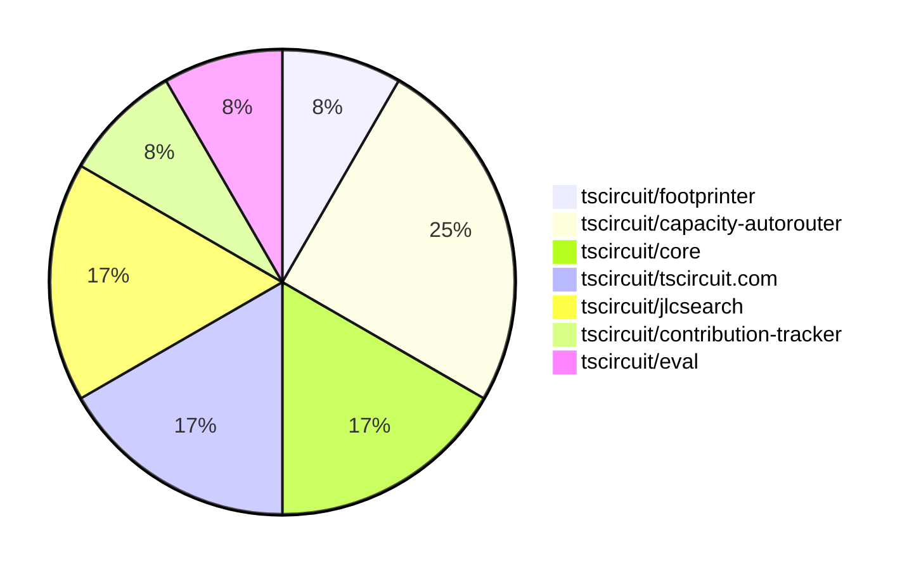

# contribution-tracker

Generates weekly contribution overviews for tscircuit contributors. Check out all
the [contribution overviews here](./contribution-overviews/)

* All PRs in the tscircuit org are scanned/summarized via Claude Haiku
* Claude classifies each Diff/PR as a Major, Minor or Tiny contribution
* All the PRs, summaries, and classifications are organized into charts and tables

The current week is shown below. There are 3 major sections:

* [Contributor Overview](#contributor-overview)
* [PRs by Repository](#prs-by-repository)
* [PRs by Contributor](#changes-by-contributor)

## Current Week

<!-- START_CURRENT_WEEK -->

# Contribution Overview 2025-03-05

## PRs by Repository

## Contributor Overview

| Contributor | 🐳 Major | 🐙 Minor | 🐌 Tiny | ⭐ | Issues Created |
|-------------|---------|---------|---------|-----|----------------|
| [seveibar](#seveibar) | 3 | 1 | 0 | ⭐⭐ | 12 |
| [imrishabh18](#imrishabh18) | 1 | 2 | 0 | ⭐⭐ | 8 |
| [ArnavK-09](#ArnavK-09) | 1 | 1 | 1 | ⭐ | 0 |
| [MustafaMulla29](#MustafaMulla29) | 0 | 1 | 0 |  | 2 |
| [tscircuitbot](#tscircuitbot) | 0 | 0 | 1 |  | 0 |

## Review Table

[reviews-received-hover]: ## "Number of reviews received for PRs for this contributor"
[approvals-received-hover]: ## "Number of approvals received for PRs this contributor authored"
[rejections-received-hover]: ## "Number of rejections received for PRs this contributor authored"
[prs-opened-hover]: ## "Number of PRs opened by this contributor"
[issues-created-hover]: ## "Number of issues created by this contributor"
[bountied-issues-hover]: ## "Number of issues this contributor created with a bounty"
[bountied-issue-$-hover]: ## "Total bounty amount placed on issues authored by this contributor"

| Contributor | Reviews Received | Approvals Received | Rejections Received | Approvals | Rejections | PRs Opened | PRs Merged | Issues Created | Bountied Issues | Bountied Issue $ |
|---|---|---|---|---|---|---|---|---|---|---|
| [ShiboSoftwareDev](#ShiboSoftwareDev) | 0 | 0 | 0 | 0 | 0 | 1 | 0 | 0 | 0 | 0 |
| [imrishabh18](#imrishabh18) | 5 | 2 | 0 | 2 | 1 | 5 | 3 | 8 | 4 | 25 |
| [MustafaMulla29](#MustafaMulla29) | 4 | 2 | 0 | 0 | 0 | 3 | 1 | 2 | 0 | 0 |
| [techmannih](#techmannih) | 0 | 0 | 0 | 1 | 0 | 1 | 0 | 1 | 1 | 5 |
| [seveibar](#seveibar) | 0 | 0 | 0 | 6 | 0 | 6 | 4 | 12 | 9 | 159 |
| [Ayushjhawar8](#Ayushjhawar8) | 3 | 2 | 0 | 0 | 0 | 2 | 0 | 1 | 1 | 10 |
| [ArnavK-09](#ArnavK-09) | 2 | 2 | 0 | 0 | 0 | 3 | 3 | 0 | 0 | 0 |
| [kom-senapati](#kom-senapati) | 7 | 1 | 1 | 0 | 0 | 1 | 0 | 0 | 0 | 0 |
| [PatanSharuKhan](#PatanSharuKhan) | 0 | 0 | 0 | 0 | 0 | 1 | 0 | 0 | 0 | 0 |
| [tscircuitbot](#tscircuitbot) | 0 | 0 | 0 | 0 | 0 | 1 | 1 | 0 | 0 | 0 |

## Changes by Repository

### [tscircuit/footprinter](https://github.com/tscircuit/footprinter)

| PR # | Impact | Contributor | Description |
|------|--------|-------------|-------------|
| [#235](https://github.com/tscircuit/footprinter/pull/235) | 🐙 Minor | MustafaMulla29 | Implemented the MSOP-8 component footprint. |

### [tscircuit/capacity-autorouter](https://github.com/tscircuit/capacity-autorouter)

| PR # | Impact | Contributor | Description |
|------|--------|-------------|-------------|
| [#34](https://github.com/tscircuit/capacity-autorouter/pull/34) | 🐳 Major | seveibar | Replace CapacitySegmentPointOptimizer with UnravelMultiSectionSolver, many fixes and optimizations with a 10x speed increase and higher quality. |
| [#33](https://github.com/tscircuit/capacity-autorouter/pull/33) | 🐳 Major | seveibar | Introduces a new UnravelSectionSolver with A* algorithm for path planning. |
| [#32](https://github.com/tscircuit/capacity-autorouter/pull/32) | 🐳 Major | seveibar | Fix major issues in Capacity Segment Optimization |

### [tscircuit/core](https://github.com/tscircuit/core)

| PR # | Impact | Contributor | Description |
|------|--------|-------------|-------------|
| [#692](https://github.com/tscircuit/core/pull/692) | 🐙 Minor | seveibar | Update the version of the capacity autorouter dependency. |
| [#691](https://github.com/tscircuit/core/pull/691) | 🐙 Minor | imrishabh18 | Fix a hover bug for traces by setting the `source_trace_id` property of the `pcb_trace` object. |

### [tscircuit/tscircuit.com](https://github.com/tscircuit/tscircuit.com)

| PR # | Impact | Contributor | Description |
|------|--------|-------------|-------------|
| [#714](https://github.com/tscircuit/tscircuit.com/pull/714) | 🐳 Major | imrishabh18 | Adds a new `/update` endpoint to the package fake API that allows updating existing packages, including privacy settings. |
| [#718](https://github.com/tscircuit/tscircuit.com/pull/718) | 🐙 Minor | imrishabh18 | Adds the support for users to have private snippets. |

### [tscircuit/jlcsearch](https://github.com/tscircuit/jlcsearch)

| PR # | Impact | Contributor | Description |
|------|--------|-------------|-------------|
| [#36](https://github.com/tscircuit/jlcsearch/pull/36) | 🐳 Major | ArnavK-09 | Introduces a new API endpoint `/api/search` for searching components with support for full-text search, filtering by package, and limiting the number of results. |
| [#39](https://github.com/tscircuit/jlcsearch/pull/39) | 🐌 Tiny | ArnavK-09 | Removes a surplus log statement from a search API test. |

### [tscircuit/contribution-tracker](https://github.com/tscircuit/contribution-tracker)

| PR # | Impact | Contributor | Description |
|------|--------|-------------|-------------|
| [#97](https://github.com/tscircuit/contribution-tracker/pull/97) | 🐙 Minor | ArnavK-09 | Upload the Anthropic cache to GitHub Actions |

### [tscircuit/eval](https://github.com/tscircuit/eval)

| PR # | Impact | Contributor | Description |
|------|--------|-------------|-------------|
| [#135](https://github.com/tscircuit/eval/pull/135) | 🐌 Tiny | tscircuitbot | Update @tscircuit/core to v0.0.348 |

## Changes by Contributor

### [MustafaMulla29](https://github.com/MustafaMulla29)

| PR # | Impact | Description |
|------|--------|-------------|
| [#235](https://github.com/tscircuit/footprinter/pull/235) | 🐙 Minor | Implemented the MSOP-8 component footprint. |

### [seveibar](https://github.com/seveibar)

| PR # | Impact | Description |
|------|--------|-------------|
| [#34](https://github.com/tscircuit/capacity-autorouter/pull/34) | 🐳 Major | Replace CapacitySegmentPointOptimizer with UnravelMultiSectionSolver, many fixes and optimizations with a 10x speed increase and higher quality. |
| [#33](https://github.com/tscircuit/capacity-autorouter/pull/33) | 🐳 Major | Introduces a new UnravelSectionSolver with A* algorithm for path planning. |
| [#32](https://github.com/tscircuit/capacity-autorouter/pull/32) | 🐳 Major | Fix major issues in Capacity Segment Optimization |
| [#692](https://github.com/tscircuit/core/pull/692) | 🐙 Minor | Update the version of the capacity autorouter dependency. |

### [imrishabh18](https://github.com/imrishabh18)

| PR # | Impact | Description |
|------|--------|-------------|
| [#714](https://github.com/tscircuit/tscircuit.com/pull/714) | 🐳 Major | Adds a new `/update` endpoint to the package fake API that allows updating existing packages, including privacy settings. |
| [#691](https://github.com/tscircuit/core/pull/691) | 🐙 Minor | Fix a hover bug for traces by setting the `source_trace_id` property of the `pcb_trace` object. |
| [#718](https://github.com/tscircuit/tscircuit.com/pull/718) | 🐙 Minor | Adds the support for users to have private snippets. |

### [ArnavK-09](https://github.com/ArnavK-09)

| PR # | Impact | Description |
|------|--------|-------------|
| [#36](https://github.com/tscircuit/jlcsearch/pull/36) | 🐳 Major | Introduces a new API endpoint `/api/search` for searching components with support for full-text search, filtering by package, and limiting the number of results. |
| [#97](https://github.com/tscircuit/contribution-tracker/pull/97) | 🐙 Minor | Upload the Anthropic cache to GitHub Actions |
| [#39](https://github.com/tscircuit/jlcsearch/pull/39) | 🐌 Tiny | Removes a surplus log statement from a search API test. |

### [tscircuitbot](https://github.com/tscircuitbot)

| PR # | Impact | Description |
|------|--------|-------------|
| [#135](https://github.com/tscircuit/eval/pull/135) | 🐌 Tiny | Update @tscircuit/core to v0.0.348 |

<!-- END_CURRENT_WEEK -->
