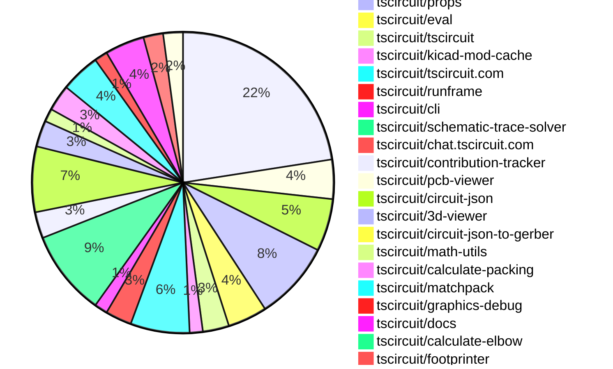
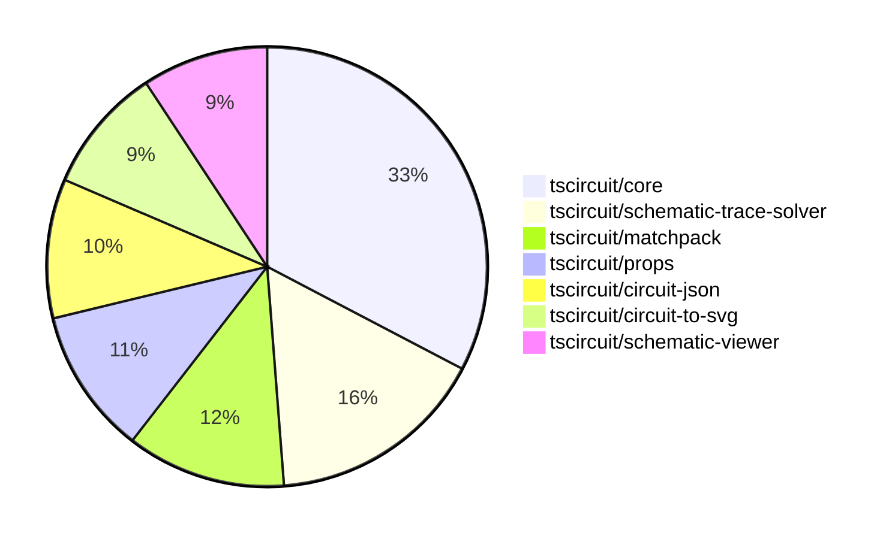

# contribution-tracker

[contributions.tscircuit.com](https://contributions.tscircuit.com) ・ [tscircuit.com](https://tscircuit.com) ・ [Contribution Overviews](./contribution-overviews/) ・ [Changelogs](./changelogs/)

Generates weekly contribution overviews for tscircuit contributors. Check out all
the [contribution overviews here](./contribution-overviews/)
You can find AI-generated monthly changelogs in the [changelogs directory](./changelogs/).

- All PRs in the tscircuit org are scanned/summarized via an LLM
- The LLM classifies each Diff/PR as into a set of attributes for scoring
- All the PRs, summaries, and classifications are organized into charts and tables for [the website](https://contributions.tscircuit.com)

> Want to run locally? See the [Development Section](#development)

The current week is shown below. There are 3 major sections:

- [Contributor Overview](#contributor-overview)
- [PRs by Repository](#prs-by-repository)
- [PRs by Contributor](#changes-by-contributor)

## Current Week

<!-- START_CURRENT_WEEK -->

# Contribution Overview 2025-09-03

## PRs by Repository



## Contributor Overview

| Contributor | 🐳 Major | 🐙 Minor | 🐌 Tiny | ⭐ | Score | Discussion Contributions |
|-------------|---------|---------|---------|-----|----------------|--------------------------|
| [seveibar](#seveibar) | 18 | 23 | 17 | 👑👑 | 99 | 1🔹 2🔶 0💎 |
| [ShiboSoftwareDev](#ShiboSoftwareDev) | 7 | 13 | 6 | 👑 | 63 | 0🔹 0🔶 0💎 |
| [imrishabh18](#imrishabh18) | 3 | 7 | 11 | ⭐⭐⭐ | 42 | 0🔹 0🔶 0💎 |
| [ArnavK-09](#ArnavK-09) | 4 | 4 | 10 | ⭐⭐⭐ | 33.5 | 0🔹 0🔶 0💎 |
| [techmannih](#techmannih) | 1 | 3 | 3 | ⭐⭐ | 18 | 1🔹 0🔶 0💎 |
| [Abse2001](#Abse2001) | 2 | 3 | 2 | ⭐⭐ | 16 | 0🔹 0🔶 0💎 |
| [MustafaMulla29](#MustafaMulla29) | 2 | 2 | 2 | ⭐⭐ | 14 | 0🔹 0🔶 0💎 |
| [Ayushjhawar8](#Ayushjhawar8) | 0 | 0 | 2 |  | 2 | 0🔹 0🔶 0💎 |
| [0hmX](#0hmX) | 0 | 1 | 0 |  | 2 | 0🔹 0🔶 0💎 |
| [AnasSarkiz](#AnasSarkiz) | 0 | 0 | 1 |  | 1 | 0🔹 0🔶 0💎 |
| [tscircuitbot](#tscircuitbot) | 0 | 0 | 1 |  | 1 | 0🔹 0🔶 0💎 |
| [raykholo](#raykholo) | 0 | 0 | 0 | ⭐ | 0 | 0🔹 2🔶 1💎 |
| [nathaniel-brough](#nathaniel-brough) | 0 | 0 | 0 |  | 0 | 1🔹 0🔶 0💎 |

### Discussion Contribution Legend

- 🔹 Normal Comments: Basic participation with minimal effort
- 🔶 Great Informative Comments: Thoughtful participation that adds value
- 💎 Incredible Comments: Exceptional participation with high-quality content

## Review Table

[reviews-received-hover]: ## "Number of reviews received for PRs for this contributor"
[approvals-received-hover]: ## "Number of approvals received for PRs this contributor authored"
[rejections-received-hover]: ## "Number of rejections received for PRs this contributor authored"
[prs-opened-hover]: ## "Number of PRs opened by this contributor"
[issues-created-hover]: ## "Number of issues created by this contributor"
[bountied-issues-hover]: ## "Number of issues this contributor created with a bounty"
[bountied-issue-$-hover]: ## "Total bounty amount placed on issues authored by this contributor"

| Contributor | Reviews Received | Approvals Received | Rejections Received | Approvals | Rejections | PRs Opened | PRs Merged | Score | Issues Created | Bountied Issues | Bountied Issue $ |
|---|---|---|---|---|---|---|---|---|---|---|---|
| [ArnavK-09](#ArnavK-09) | 28 | 21 | 0 | 0 | 0 | 22 | 18 | 33.5 | 0 | 0 | 0 |
| [seveibar](#seveibar) | 15 | 0 | 0 | 76 | 6 | 72 | 60 | 99 | 0 | 0 | 0 |
| [imrishabh18](#imrishabh18) | 27 | 13 | 1 | 4 | 2 | 27 | 21 | 42 | 0 | 0 | 0 |
| [JrmyDev](#JrmyDev) | 5 | 0 | 1 | 0 | 0 | 1 | 0 | 0 | 0 | 0 | 0 |
| [techmannih](#techmannih) | 20 | 8 | 0 | 2 | 0 | 10 | 7 | 18 | 0 | 0 | 0 |
| [baeoc](#baeoc) | 3 | 0 | 1 | 0 | 0 | 2 | 0 | 0 | 0 | 0 | 0 |
| [ShiboSoftwareDev](#ShiboSoftwareDev) | 40 | 27 | 1 | 6 | 0 | 32 | 28 | 63 | 0 | 0 | 0 |
| [MAVRICK-1](#MAVRICK-1) | 0 | 0 | 0 | 0 | 0 | 1 | 0 | 0 | 0 | 0 | 0 |
| [Abse2001](#Abse2001) | 11 | 8 | 0 | 0 | 0 | 9 | 7 | 16 | 0 | 0 | 0 |
| [MustafaMulla29](#MustafaMulla29) | 17 | 6 | 3 | 0 | 0 | 8 | 6 | 14 | 0 | 0 | 0 |
| [aryel780](#aryel780) | 1 | 0 | 0 | 0 | 0 | 1 | 0 | 0 | 0 | 0 | 0 |
| [AnasSarkiz](#AnasSarkiz) | 6 | 1 | 0 | 0 | 0 | 2 | 1 | 1 | 0 | 0 | 0 |
| [Ayushjhawar8](#Ayushjhawar8) | 4 | 3 | 0 | 0 | 0 | 4 | 2 | 2 | 0 | 0 | 0 |
| [tscircuitbot](#tscircuitbot) | 0 | 0 | 0 | 0 | 0 | 55 | 1 | 1 | 0 | 0 | 0 |
| [nailoo](#nailoo) | 1 | 0 | 1 | 0 | 0 | 2 | 0 | 0 | 0 | 0 | 0 |
| [0hmX](#0hmX) | 1 | 1 | 0 | 0 | 0 | 2 | 1 | 2 | 0 | 0 | 0 |
| [raykholo](#raykholo) | 0 | 0 | 0 | 0 | 0 | 0 | 0 | 8 | 0 | 0 | 0 |
| [nathaniel-brough](#nathaniel-brough) | 0 | 0 | 0 | 0 | 0 | 0 | 0 | 1 | 0 | 0 | 0 |

## Top 7 Repositories by Contribution Points



## Changes by Repository

### [tscircuit/core](https://github.com/tscircuit/core)

| PR # | Impact | Rating | Contributor | Description |
|------|--------|--------|-------------|-------------|
| [#1294](https://github.com/tscircuit/core/pull/1294) | 🐳 Major | ⭐⭐⭐ | imrishabh18 | Adds support for autorouting of footprints that are fetched asynchronously, ensuring proper rendering and handling of PCB components. |
| [#1290](https://github.com/tscircuit/core/pull/1290) | 🐳 Major | ⭐⭐⭐ | seveibar | Fixes backward net labels in schematic traces and updates the trace solver for improved debuggability and performance. |
| [#1281](https://github.com/tscircuit/core/pull/1281) | 🐳 Major | ⭐⭐⭐ | seveibar | Fixes schematic trace configuration for better snapshot reliability and updates matchpack to new defaults while addressing trace distance settings. |
| [#1273](https://github.com/tscircuit/core/pull/1273) | 🐳 Major | ⭐⭐⭐ | seveibar | Updates the matchpack dependency to version 0.0.12 and the calculate-packing dependency to version 0.0.31, optimizing symmetry handling in the packing algorithm. |
| [#1292](https://github.com/tscircuit/core/pull/1292) | 🐳 Major | ⭐⭐⭐ | techmannih | Fixes the issue of duplicate traces being rendered when manual routing is used alongside autorouting. |
| [#1296](https://github.com/tscircuit/core/pull/1296) | 🐳 Major | ⭐⭐⭐ | MustafaMulla29 | Refines the calculation of silkscreen text positioning to prevent overlaps by using accurate text bounds and exports the calculation function to a separate file for better modularity. |
| [#1306](https://github.com/tscircuit/core/pull/1306) | 🐙 Minor | ⭐⭐ | imrishabh18 | Fixes autosizing of the board when components fetch their footprints asynchronously. |
| [#1289](https://github.com/tscircuit/core/pull/1289) | 🐙 Minor | ⭐⭐ | imrishabh18 | Adds support for library-style footprint references in the footprint rendering process. |
| [#1279](https://github.com/tscircuit/core/pull/1279) | 🐙 Minor | ⭐⭐ | imrishabh18 | Adds a subcircuit_connectivity_map_key to schematic traces to improve connectivity mapping in circuit schematics. |
| [#1278](https://github.com/tscircuit/core/pull/1278) | 🐙 Minor | ⭐⭐ | imrishabh18 | Adds a test for overlapping junctions and crossings in circuit schematics. |
| [#1288](https://github.com/tscircuit/core/pull/1288) | 🐙 Minor | ⭐⭐ | ShiboSoftwareDev | Adds support for specifying a GLTF model for a component via the gltfUrl property within the cadModel prop. |
| [#1284](https://github.com/tscircuit/core/pull/1284) | 🐙 Minor | ⭐⭐ | ShiboSoftwareDev | Adds the ability to display power direction arrows on schematic ports based on the pinAttributes property of a component. |
| [#1303](https://github.com/tscircuit/core/pull/1303) | 🐙 Minor | ⭐⭐ | seveibar | Redirects debug outputs to the RootCircuit event emitter, allowing RunFrame to capture and log debug information more effectively. |
| [#1304](https://github.com/tscircuit/core/pull/1304) | 🐙 Minor | ⭐⭐ | seveibar | Fixes intermittent boolean operation errors by updating the calculate-packing library to version 0.0.33 and unskipping the repro44 PCB Pack test. |
| [#1302](https://github.com/tscircuit/core/pull/1302) | 🐙 Minor | ⭐⭐ | seveibar | Adds an enableDebug function to the RootCircuit class to control debug logging dynamically. |
| [#1301](https://github.com/tscircuit/core/pull/1301) | 🐙 Minor | ⭐⭐ | seveibar | Fixes flaky tests in the footprinter module by updating assertions, removing unreliable snapshots, and skipping a test due to a known bug in boolean operations. |
| [#1274](https://github.com/tscircuit/core/pull/1274) | 🐙 Minor | ⭐⭐ | seveibar | Add a pinout  component backed by simple_pinout source type and update dependencies. |
| [#1271](https://github.com/tscircuit/core/pull/1271) | 🐙 Minor | ⭐⭐ | seveibar | Skip the rp2040 decoupling capacitors test and add a benchmark for the RP2040 decoupling capacitors, registering it on the benchmark page. |
| [#1268](https://github.com/tscircuit/core/pull/1268) | 🐙 Minor | ⭐⭐ | seveibar | Adds an example circuit for the RP2040 microcontroller that includes decoupling capacitors for power stability. |
| [#1283](https://github.com/tscircuit/core/pull/1283) | 🐙 Minor | ⭐⭐ | techmannih | Adds support for manual via tracing in PCB design, allowing traces to connect to via layers. |
| [#1270](https://github.com/tscircuit/core/pull/1270) | 🐙 Minor | ⭐⭐ | Abse2001 | Fixes the rendering of manual PCB trace paths to support group rotation, ensuring accurate placement and orientation of traces in the PCB layout. |
| [#1287](https://github.com/tscircuit/core/pull/1287) | 🐙 Minor | ⭐⭐ | MustafaMulla29 | Prevents the creation of components with duplicate names within a subcircuit, ensuring that naming conflicts are handled gracefully by marking duplicates for removal and logging an error. |
| [#1267](https://github.com/tscircuit/core/pull/1267) | 🐙 Minor | ⭐⭐ | MustafaMulla29 | Automatically adjusts silkscreen reference designator text position for passive components when they overlap with other components. |

<details>
<summary>🐌 Tiny Contributions (9)</summary>

| PR # | Impact | Contributor | Description |
|------|--------|-------------|-------------|
| [#1280](https://github.com/tscircuit/core/pull/1280) | 🐌 Tiny | imrishabh18 | Updates the circuit-to-svg dependency to version 0.0.182 in the package.json file. |
| [#1297](https://github.com/tscircuit/core/pull/1297) | 🐌 Tiny | ShiboSoftwareDev | Fixes NetLabelPlacementSolver to process each net only once |
| [#1286](https://github.com/tscircuit/core/pull/1286) | 🐌 Tiny | ShiboSoftwareDev | Updates the versions of the tscircuitprops and circuit-json dependencies in package.json |
| [#1305](https://github.com/tscircuit/core/pull/1305) | 🐌 Tiny | seveibar | Adds a script to sync external projects from tscircuit.com into testsprojects, omitting lockfiles and config files, and includes a synced example with a basic snapshot test. |
| [#1298](https://github.com/tscircuit/core/pull/1298) | 🐌 Tiny | seveibar | Updates the schematic-trace-solver to fix the issue of straight lines connecting to the side of a schematic trace. |
| [#1272](https://github.com/tscircuit/core/pull/1272) | 🐌 Tiny | seveibar | Add instructions for getting inputs to algorithms and improve matchpack debug output |
| [#1295](https://github.com/tscircuit/core/pull/1295) | 🐌 Tiny | MustafaMulla29 | Updates the version of the tscircuitmath-utils dependency from 0.0.19 to 0.0.21 in package.json |
| [#1293](https://github.com/tscircuit/core/pull/1293) | 🐌 Tiny | MustafaMulla29 | Updates the math-utils dependency to version 0.0.19 to support the SilkscreenOverlapAdjustment render phase. |
| [#1260](https://github.com/tscircuit/core/pull/1260) | 🐌 Tiny | AnasSarkiz | Reproduces a bug where the same net is not combined in circuit layouts involving connectors, resistors, and solder jumpers. |

</details>

### [tscircuit/circuit-to-svg](https://github.com/tscircuit/circuit-to-svg)

| PR # | Impact | Rating | Contributor | Description |
|------|--------|--------|-------------|-------------|
| [#303](https://github.com/tscircuit/circuit-to-svg/pull/303) | 🐳 Major | ⭐⭐⭐ | imrishabh18 | Adds functionality to highlight all traces sharing the same connectivity key when hovered over in the schematic view. |
| [#302](https://github.com/tscircuit/circuit-to-svg/pull/302) | 🐳 Major | ⭐⭐⭐ | imrishabh18 | Fixes rendering issue where hops and arcs are buried under traces in schematic SVG output, ensuring correct visual layering of elements. |
| [#308](https://github.com/tscircuit/circuit-to-svg/pull/308) | 🐳 Major | ⭐⭐⭐ | ShiboSoftwareDev | Adds support for B-rep copper pours in PCB SVG conversion, including a new utility function for rendering and comprehensive tests for various shapes. |
| [#307](https://github.com/tscircuit/circuit-to-svg/pull/307) | 🐳 Major | ⭐⭐⭐ | ShiboSoftwareDev | Add support for rendering pcb_copper_pour elements in the PCB SVG output, enabling visualization of rectangular and polygonal copper pours on both top and bottom layers. |
| [#309](https://github.com/tscircuit/circuit-to-svg/pull/309) | 🐙 Minor | ⭐⭐ | ShiboSoftwareDev | Fixes a circuit JSON error caused by identical names for components in the test. |

<details>
<summary>🐌 Tiny Contributions (1)</summary>

| PR # | Impact | Contributor | Description |
|------|--------|-------------|-------------|
| [#306](https://github.com/tscircuit/circuit-to-svg/pull/306) | 🐌 Tiny | ShiboSoftwareDev | Reduces the size of arrows for schematic ports by adjusting the arrow size and stroke width calculations in the SVG rendering. |

</details>

### [tscircuit/schematic-viewer](https://github.com/tscircuit/schematic-viewer)

| PR # | Impact | Rating | Contributor | Description |
|------|--------|--------|-------------|-------------|
| [#124](https://github.com/tscircuit/schematic-viewer/pull/124) | 🐳 Major | ⭐⭐⭐ | ArnavK-09 | Adds localStorage persistence for the groups view in the schematic viewer, allowing users to disable group visibility and retain this setting across sessions. |
| [#120](https://github.com/tscircuit/schematic-viewer/pull/120) | 🐳 Major | ⭐⭐⭐ | ArnavK-09 | Adds mobile touch support for group viewing functionality in the schematic viewer, allowing users to interact with components using touch events. |
| [#119](https://github.com/tscircuit/schematic-viewer/pull/119) | 🐳 Major | ⭐⭐⭐ | ArnavK-09 | Adds mobile touch support for group viewing functionality in the schematic viewer, allowing users to toggle group visibility with touch events. |
| [#129](https://github.com/tscircuit/schematic-viewer/pull/129) | 🐙 Minor | ⭐⭐ | imrishabh18 | Fixes the issue where group overlays disappear during view panning by maintaining the latest touch handler reference. |
| [#125](https://github.com/tscircuit/schematic-viewer/pull/125) | 🐙 Minor | ⭐⭐ | ArnavK-09 | Fixes issue where schematic groups do not render when preferred settings are stored in local storage. |

<details>
<summary>🐌 Tiny Contributions (3)</summary>

| PR # | Impact | Contributor | Description |
|------|--------|-------------|-------------|
| [#128](https://github.com/tscircuit/schematic-viewer/pull/128) | 🐌 Tiny | ArnavK-09 | Fixes the z-index value for the view menu in the schematic viewer to ensure proper layering of UI elements. |
| [#127](https://github.com/tscircuit/schematic-viewer/pull/127) | 🐌 Tiny | ArnavK-09 | Adjusts z-index values for control elements to ensure proper layering in the schematic viewer interface |
| [#126](https://github.com/tscircuit/schematic-viewer/pull/126) | 🐌 Tiny | ArnavK-09 | Adds version information display in the menu for improved debugging. |

</details>

### [tscircuit/props](https://github.com/tscircuit/props)

| PR # | Impact | Rating | Contributor | Description |
|------|--------|--------|-------------|-------------|
| [#374](https://github.com/tscircuit/props/pull/374) | 🐙 Minor | ⭐⭐ | imrishabh18 | Fixes type definition for footprintLibraryMap to support a function that fetches footprint data from a given path. |
| [#380](https://github.com/tscircuit/props/pull/380) | 🐙 Minor | ⭐⭐ | ShiboSoftwareDev | Adds support for glb, step, and wrl CAD models in the props library, enhancing the range of CAD model formats available for use. |
| [#372](https://github.com/tscircuit/props/pull/372) | 🐙 Minor | ⭐⭐ | ShiboSoftwareDev | Adds support for glTF model URLs in the CAD model interface, allowing users to specify a glTF URL for CAD models. |
| [#371](https://github.com/tscircuit/props/pull/371) | 🐙 Minor | ⭐⭐ | ShiboSoftwareDev | Adds support for rect, circle, and polygon shapes in CopperPour components, along with a connectsTo prop for net association, zod schemas for validation, and comprehensive unit tests. |
| [#383](https://github.com/tscircuit/props/pull/383) | 🐙 Minor | ⭐⭐ | seveibar | Allows setting pcbPositionAnchor to customize PCB coordinate origin, documents pcbPositionAnchor in generated component docs, and tests pcbPositionAnchor with resistor component. |
| [#370](https://github.com/tscircuit/props/pull/370) | 🐙 Minor | ⭐⭐ | seveibar | Adds optional connections to VoltageSourceProps, enabling users to specify connections for voltage sources in their circuit designs. |
| [#369](https://github.com/tscircuit/props/pull/369) | 🐙 Minor | ⭐⭐ | seveibar | Adds support for connections prop in the inductor  component, documents the connections, and includes tests for parsing inductor connections. |
| [#368](https://github.com/tscircuit/props/pull/368) | 🐙 Minor | ⭐⭐ | seveibar | Allows specifying an optional borderRadius for board components, documents borderRadius in README and generated files, and tests borderRadius parsing. |
| [#367](https://github.com/tscircuit/props/pull/367) | 🐙 Minor | ⭐⭐ | seveibar | Add a new symbol  container element with associated properties and tests for parsing symbol properties. |
| [#366](https://github.com/tscircuit/props/pull/366) | 🐙 Minor | ⭐⭐ | seveibar | Add a new pinout  component that reuses chip properties, documents PinoutProps in the README, exports a new pinout schema, and includes a basic parsing test. |

<details>
<summary>🐌 Tiny Contributions (2)</summary>

| PR # | Impact | Contributor | Description |
|------|--------|-------------|-------------|
| [#378](https://github.com/tscircuit/props/pull/378) | 🐌 Tiny | seveibar | Allows footprint library functions to return cadModel along with footprintCircuitJson, enhancing the footprint librarys capabilities. |
| [#375](https://github.com/tscircuit/props/pull/375) | 🐌 Tiny | seveibar | Summary generate kicad footprint autocomplete type from hosted KiCad footprint list expose KicadAutocompleteStringPath and integrate into FootprintProp strip .kicad_mod and .pretty suffixes from footprint paths  Testing bun run format bun test tests |

</details>

### [tscircuit/eval](https://github.com/tscircuit/eval)

| PR # | Impact | Rating | Contributor | Description |
|------|--------|--------|-------------|-------------|
| [#1001](https://github.com/tscircuit/eval/pull/1001) | 🐙 Minor | ⭐⭐ | imrishabh18 | Adds support for fetching KiCad footprints from a remote cache in the platform configuration. |
| [#961](https://github.com/tscircuit/eval/pull/961) | 🐙 Minor | ⭐⭐ | ShiboSoftwareDev | Adds support for importing local .obj files, allowing developers to use local 3D models for CAD components in their designs. |
| [#1000](https://github.com/tscircuit/eval/pull/1000) | 🐙 Minor | ⭐⭐ | seveibar | Fixes the issue where debug logs were not appearing in the CircuitRunner and CircuitWebWorker by ensuring the debug functionality is correctly enabled and tested. |
| [#999](https://github.com/tscircuit/eval/pull/999) | 🐙 Minor | ⭐⭐ | seveibar | Adds support for enabling a debug namespace in the CircuitRunner and CircuitWebWorker, allowing circuits to emit debug log output. |

<details>
<summary>🐌 Tiny Contributions (2)</summary>

| PR # | Impact | Contributor | Description |
|------|--------|-------------|-------------|
| [#960](https://github.com/tscircuit/eval/pull/960) | 🐌 Tiny | imrishabh18 | Updates the core dependencies in the package.json file to newer versions. |
| [#988](https://github.com/tscircuit/eval/pull/988) | 🐌 Tiny | tscircuitbot | Automated update of tscircuitcore to v0.0.699. |

</details>

### [tscircuit/tscircuit](https://github.com/tscircuit/tscircuit)


<details>
<summary>🐌 Tiny Contributions (4)</summary>

| PR # | Impact | Contributor | Description |
|------|--------|-------------|-------------|
| [#756](https://github.com/tscircuit/tscircuit/pull/756) | 🐌 Tiny | imrishabh18 | Updates the version of tscircuitcore from 0.0.681 to 0.0.683 and tscircuitprops from 0.0.289 to 0.0.296 in package.json |
| [#755](https://github.com/tscircuit/tscircuit/pull/755) | 🐌 Tiny | imrishabh18 | Updates the circuit-to-svg dependency version from 0.0.174 to 0.0.182 in package.json |
| [#754](https://github.com/tscircuit/tscircuit/pull/754) | 🐌 Tiny | imrishabh18 | Updates the circuit-json dependency version from 0.0.236 to 0.0.238 in package.json |
| [#765](https://github.com/tscircuit/tscircuit/pull/765) | 🐌 Tiny | seveibar | Updates dependencies in package.json and adds the flatbush library for spatial indexing. |

</details>

### [tscircuit/kicad-mod-cache](https://github.com/tscircuit/kicad-mod-cache)


<details>
<summary>🐌 Tiny Contributions (2)</summary>

| PR # | Impact | Contributor | Description |
|------|--------|-------------|-------------|
| [#5](https://github.com/tscircuit/kicad-mod-cache/pull/5) | 🐌 Tiny | imrishabh18 | Adds support for API paths without the .pretty suffix and introduces GitHub workflows for automated testing and publishing to npm. |
| [#6](https://github.com/tscircuit/kicad-mod-cache/pull/6) | 🐌 Tiny | imrishabh18 | Fixes CORS issues by properly setting CORS headers for GET and OPTIONS requests in the route handler. |

</details>

### [tscircuit/tscircuit.com](https://github.com/tscircuit/tscircuit.com)

| PR # | Impact | Rating | Contributor | Description |
|------|--------|--------|-------------|-------------|
| [#1637](https://github.com/tscircuit/tscircuit.com/pull/1637) | 🐳 Major | ⭐⭐⭐ | ArnavK-09 | Adds a loading toast notification to inform users of the download status when downloading a large ZIP package, preventing a blank status display during the process. |
| [#1636](https://github.com/tscircuit/tscircuit.com/pull/1636) | 🐙 Minor | ⭐⭐ | ArnavK-09 | Allows downloading of legacy packages to maintain backwards compatibility for users. |
| [#1631](https://github.com/tscircuit/tscircuit.com/pull/1631) | 🐙 Minor | ⭐⭐ | ArnavK-09 | Adds functionality to manually update AI description and usage instructions for packages by their owners. |
| [#1640](https://github.com/tscircuit/tscircuit.com/pull/1640) | 🐙 Minor | ⭐⭐ | seveibar | Fetches 3D package release images as dist3d.png and returns a data URL, rendering 3D previews from PNG data across preview components. |

<details>
<summary>🐌 Tiny Contributions (5)</summary>

| PR # | Impact | Contributor | Description |
|------|--------|-------------|-------------|
| [#1632](https://github.com/tscircuit/tscircuit.com/pull/1632) | 🐌 Tiny | imrishabh18 | Updates the dependencies for tscircuit and circuit-to-svg to version 0.0.618 and 0.0.182 respectively, enabling support for trace highlighting functionality. |
| [#1635](https://github.com/tscircuit/tscircuit.com/pull/1635) | 🐌 Tiny | ArnavK-09 | Fixes z-index overlapping issues in dropdown menus and updates dependencies for improved functionality. |
| [#1633](https://github.com/tscircuit/tscircuit.com/pull/1633) | 🐌 Tiny | ArnavK-09 | Updates the schematic-viewer dependency to version 2.0.38 and disables preview groups in the SchematicViewer component. |
| [#1628](https://github.com/tscircuit/tscircuit.com/pull/1628) | 🐌 Tiny | ArnavK-09 | Disables the order button for packages that have no available releases to prevent users from attempting to place orders that would fail. |
| [#1639](https://github.com/tscircuit/tscircuit.com/pull/1639) | 🐌 Tiny | seveibar | Removes the Datasheets link from the header components in the application. |

</details>

### [tscircuit/runframe](https://github.com/tscircuit/runframe)

| PR # | Impact | Rating | Contributor | Description |
|------|--------|--------|-------------|-------------|
| [#1099](https://github.com/tscircuit/runframe/pull/1099) | 🐳 Major | ⭐⭐⭐ | seveibar | Add options in render log for rerunning with debug outputs, including a download button for debug outputs and updates to the evaluation process. |

<details>
<summary>🐌 Tiny Contributions (3)</summary>

| PR # | Impact | Contributor | Description |
|------|--------|-------------|-------------|
| [#1076](https://github.com/tscircuit/runframe/pull/1076) | 🐌 Tiny | imrishabh18 | Updates the circuit-to-svg and tscircuit dependencies to their latest versions in package.json |
| [#1091](https://github.com/tscircuit/runframe/pull/1091) | 🐌 Tiny | ArnavK-09 | This pull request addresses an issue with the z-index of the DropdownMenuContent component in the CircuitJsonPreview. The z-index was adjusted to ensure proper layering of UI elements, preventing overlap issues. |
| [#1081](https://github.com/tscircuit/runframe/pull/1081) | 🐌 Tiny | ShiboSoftwareDev | Updates the 3D viewer dependency to version 0.0.365 in the package.json file. |

</details>

### [tscircuit/cli](https://github.com/tscircuit/cli)


<details>
<summary>🐌 Tiny Contributions (2)</summary>

| PR # | Impact | Contributor | Description |
|------|--------|-------------|-------------|
| [#318](https://github.com/tscircuit/cli/pull/318) | 🐌 Tiny | imrishabh18 | Updates the versions of the tscircuitrunframe and tscircuit dependencies in package.json |
| [#319](https://github.com/tscircuit/cli/pull/319) | 🐌 Tiny | ShiboSoftwareDev | this was possible with the updated made to 3d-viewer and eval the resistor is a normal .obj file and the other is an OpenCASCADE obj file img width1654 height1324 altimage srchttps:github.comuser-attachmentsassets2f5faca8-d22e-4301-8119-7d019c8a4efb  claim https:github.comtscircuitcliissues316 closes https:github.comtscircuitcliissues316 |

</details>

### [tscircuit/schematic-trace-solver](https://github.com/tscircuit/schematic-trace-solver)

| PR # | Impact | Rating | Contributor | Description |
|------|--------|--------|-------------|-------------|
| [#44](https://github.com/tscircuit/schematic-trace-solver/pull/44) | 🐳 Major | ⭐⭐⭐ | ShiboSoftwareDev | Addresses a limitation in the TraceOverlapShiftSolver where it would fail to resolve overlaps on trace segments connected directly to pins by implementing a jog-based resolution strategy and increasing overlap detection tolerance. |
| [#39](https://github.com/tscircuit/schematic-trace-solver/pull/39) | 🐳 Major | ⭐⭐⭐ | ShiboSoftwareDev | Add logic to SchematicTraceSingleLineSolver to reject candidate elbow segments that would cross a chips center line on an axis where related pins on that chip face both directions (e.g., pins on both left and right faces - vertical center line restricted). |
| [#54](https://github.com/tscircuit/schematic-trace-solver/pull/54) | 🐳 Major | ⭐⭐⭐ | seveibar | Fixes the issue with straight line tracing in schematic rendering by adding new graphical representations for connections and paths. |
| [#50](https://github.com/tscircuit/schematic-trace-solver/pull/50) | 🐳 Major | ⭐⭐⭐ | seveibar | Implements the elbow-shift method for single trace solving, rewriting the SchematicTraceSingleLineSolver to enhance pathfinding capabilities and collision avoidance in schematic tracing. |
| [#49](https://github.com/tscircuit/schematic-trace-solver/pull/49) | 🐳 Major | ⭐⭐⭐ | seveibar | Fixes an infinite loop issue in the trace solver algorithm by validating candidate paths before marking them as solved. |
| [#43](https://github.com/tscircuit/schematic-trace-solver/pull/43) | 🐳 Major | ⭐⭐⭐ | seveibar | Fixes net label placement failure by implementing a fallback mechanism when overlaps occur during placement. |
| [#53](https://github.com/tscircuit/schematic-trace-solver/pull/53) | 🐙 Minor | ⭐⭐ | ShiboSoftwareDev | Fixes redundant net label creation by ensuring each net is processed only once, preventing spurious labels and islands. |
| [#30](https://github.com/tscircuit/schematic-trace-solver/pull/30) | 🐙 Minor | ⭐⭐ | 0hmX | Add U-turn generation for short traces in schematic trace generation, adjusting routing logic to accommodate U-turns and modifying example parameters accordingly. |

<details>
<summary>🐌 Tiny Contributions (5)</summary>

| PR # | Impact | Contributor | Description |
|------|--------|-------------|-------------|
| [#37](https://github.com/tscircuit/schematic-trace-solver/pull/37) | 🐌 Tiny | imrishabh18 | Adds example input problems and corresponding tests for the schematic trace solver functionality. |
| [#51](https://github.com/tscircuit/schematic-trace-solver/pull/51) | 🐌 Tiny | seveibar | This pull request introduces several new example files and tests that reproduce major active issues in the core schematic trace solver. The examples are designed to help developers understand and address existing problems in the codebase. |
| [#48](https://github.com/tscircuit/schematic-trace-solver/pull/48) | 🐌 Tiny | seveibar | Reproduces an infinite loop issue in the schematic trace solver by providing a detailed input problem for debugging. |
| [#41](https://github.com/tscircuit/schematic-trace-solver/pull/41) | 🐌 Tiny | seveibar | Reproduces a bug related to net label placement failure in the SingleNetLabelPlacementSolver. |
| [#35](https://github.com/tscircuit/schematic-trace-solver/pull/35) | 🐌 Tiny | seveibar | Add matcher functionality and example snapshots for testing the Schematic Trace Solver. |

</details>

### [tscircuit/chat.tscircuit.com](https://github.com/tscircuit/chat.tscircuit.com)

| PR # | Impact | Rating | Contributor | Description |
|------|--------|--------|-------------|-------------|
| [#43](https://github.com/tscircuit/chat.tscircuit.com/pull/43) | 🐙 Minor | ⭐⭐ | ArnavK-09 | Fixes various styling issues in the user interface, including scrollbar visibility and padding adjustments for better layout. |

### [tscircuit/contribution-tracker](https://github.com/tscircuit/contribution-tracker)

| PR # | Impact | Rating | Contributor | Description |
|------|--------|--------|-------------|-------------|
| [#219](https://github.com/tscircuit/contribution-tracker/pull/219) | 🐳 Major | ⭐⭐⭐ | MustafaMulla29 | Updates the scoring mechanism for contribution ratings by adjusting the multipliers for core changes and major improvements to core data modeling. |

<details>
<summary>🐌 Tiny Contributions (3)</summary>

| PR # | Impact | Contributor | Description |
|------|--------|-------------|-------------|
| [#221](https://github.com/tscircuit/contribution-tracker/pull/221) | 🐌 Tiny | ArnavK-09 | Changes the maintainer role of ArnavK-09 from maintainer2 to maintainer3 in the scoring module. |
| [#220](https://github.com/tscircuit/contribution-tracker/pull/220) | 🐌 Tiny | ArnavK-09 | Ignore PRs when contributor is in EXCLUDED_BOTS or login contains bot. |
| [#218](https://github.com/tscircuit/contribution-tracker/pull/218) | 🐌 Tiny | ArnavK-09 | Adds a new component to display the list of project maintainers with their roles and avatars. |

</details>

### [tscircuit/pcb-viewer](https://github.com/tscircuit/pcb-viewer)

| PR # | Impact | Rating | Contributor | Description |
|------|--------|--------|-------------|-------------|
| [#367](https://github.com/tscircuit/pcb-viewer/pull/367) | 🐳 Major | ⭐⭐⭐ | ShiboSoftwareDev | Adds support for rendering pcb_copper_pour elements in the PCB viewer, including rect and polygon shapes with rotation. |

### [tscircuit/circuit-json](https://github.com/tscircuit/circuit-json)

| PR # | Impact | Rating | Contributor | Description |
|------|--------|--------|-------------|-------------|
| [#267](https://github.com/tscircuit/circuit-json/pull/267) | 🐳 Major | ⭐⭐⭐ | ShiboSoftwareDev | This pull request modifies the pcb_copper_pour element by replacing the circle shape option with a more flexible brep (Boundary Representation) shape, allowing for defining more complex copper pour geometries, including those with arcs. |
| [#268](https://github.com/tscircuit/circuit-json/pull/268) | 🐙 Minor | ⭐⭐ | ShiboSoftwareDev | Adds optional model_glb_url and model_step_url properties to cad_component for supporting .glb and .step 3D models. |
| [#266](https://github.com/tscircuit/circuit-json/pull/266) | 🐙 Minor | ⭐⭐ | ShiboSoftwareDev | Adds support for model_gltf_url in CAD component definitions |
| [#265](https://github.com/tscircuit/circuit-json/pull/265) | 🐙 Minor | ⭐⭐ | ShiboSoftwareDev | Adds the pcb_copper_pour element to the Circuit JSON specification, enabling the definition of copper pour areas on a PCB for ground planes and net connections. |
| [#270](https://github.com/tscircuit/circuit-json/pull/270) | 🐙 Minor | ⭐⭐ | seveibar | Add optional model_wrl_url for CAD components to support VRML models |
| [#263](https://github.com/tscircuit/circuit-json/pull/263) | 🐙 Minor | ⭐⭐ | seveibar | Adds a boolean flag is_positive_voltage_source to the SourceNet schema and interface, updates documentation, and includes tests for parsing this new flag. |
| [#262](https://github.com/tscircuit/circuit-json/pull/262) | 🐙 Minor | ⭐⭐ | seveibar | Makes schematic_trace.source_trace_id and schematic_trace.subcircuit_connectivity_map_key optional fields in the schematic trace interface, with documentation and tests added for these changes. |
| [#261](https://github.com/tscircuit/circuit-json/pull/261) | 🐙 Minor | ⭐⭐ | seveibar | Adds a new SourceSimplePinout schema without a pin name list, includes it in unions and exports, and tests its parsing and union inclusion. |
| [#264](https://github.com/tscircuit/circuit-json/pull/264) | 🐙 Minor | ⭐⭐ | techmannih | Adds support for manually placed vias in the source domain, defining their properties and structure. |

<details>
<summary>🐌 Tiny Contributions (1)</summary>

| PR # | Impact | Contributor | Description |
|------|--------|-------------|-------------|
| [#269](https://github.com/tscircuit/circuit-json/pull/269) | 🐌 Tiny | techmannih | Removes x and y position attributes and layers from the source_manually_placed_via interface in the circuit JSON schema. |

</details>

### [tscircuit/3d-viewer](https://github.com/tscircuit/3d-viewer)

| PR # | Impact | Rating | Contributor | Description |
|------|--------|--------|-------------|-------------|
| [#455](https://github.com/tscircuit/3d-viewer/pull/455) | 🐳 Major | ⭐⭐⭐ | ShiboSoftwareDev | This pull request enhances the OBJ file loader to support models exported from OpenCASCADE. These files often reference external .mtl files that are not included, causing the loader to fail when attempting to fetch them. Changes: Modified useGlobalObjLoader.ts to strip mtllib directives from the OBJ file content before parsing, preventing failed network requests. The loader now gracefully handles OBJ files that do not contain any embedded material definitions. Added storiesOpenCascadeObj.stories.tsx to test and demonstrate loading an OBJ file from OpenCASCADE. |
| [#456](https://github.com/tscircuit/3d-viewer/pull/456) | 🐙 Minor | ⭐⭐ | ShiboSoftwareDev | Adds support for rendering pcb_copper_pour elements in the 3D viewer for both the Jscad and Manifold engines. |
| [#449](https://github.com/tscircuit/3d-viewer/pull/449) | 🐙 Minor | ⭐⭐ | techmannih | Fixes hole drilling on pads to ensure proper material removal during PCB fabrication. |

<details>
<summary>🐌 Tiny Contributions (1)</summary>

| PR # | Impact | Contributor | Description |
|------|--------|-------------|-------------|
| [#460](https://github.com/tscircuit/3d-viewer/pull/460) | 🐌 Tiny | ShiboSoftwareDev | Adds support for cadModel.gltfUrl to load GLTF models in the 3D viewer. |

</details>

### [tscircuit/circuit-json-to-gerber](https://github.com/tscircuit/circuit-json-to-gerber)

| PR # | Impact | Rating | Contributor | Description |
|------|--------|--------|-------------|-------------|
| [#53](https://github.com/tscircuit/circuit-json-to-gerber/pull/53) | 🐙 Minor | ⭐⭐ | ShiboSoftwareDev | Implements the pcb_copper_pour element for Gerber generation, handling rectangular and polygonal copper pours using Gerber region commands (G36G37) and emitting the layer polarity command in headers to ensure filled regions are rendered correctly. |

### [tscircuit/math-utils](https://github.com/tscircuit/math-utils)

| PR # | Impact | Rating | Contributor | Description |
|------|--------|--------|-------------|-------------|
| [#18](https://github.com/tscircuit/math-utils/pull/18) | 🐳 Major | ⭐⭐⭐ | seveibar | Add boundsAreaOverlap to compute overlapping area of bounds and boundsDistance to compute minimum distance between bounds, along with documentation updates. |
| [#17](https://github.com/tscircuit/math-utils/pull/17) | 🐳 Major | ⭐⭐⭐ | seveibar | Adds a function to determine if two bounding rectangles overlap. |

### [tscircuit/calculate-packing](https://github.com/tscircuit/calculate-packing)

| PR # | Impact | Rating | Contributor | Description |
|------|--------|--------|-------------|-------------|
| [#36](https://github.com/tscircuit/calculate-packing/pull/36) | 🐳 Major | ⭐⭐⭐ | seveibar | Adds fallbacks and an alternative boolean mode to handle failures in constructing outlines from pad polygons during the packing process. |
| [#30](https://github.com/tscircuit/calculate-packing/pull/30) | 🐳 Major | ⭐⭐⭐ | seveibar | This pull request introduces a new packing strategy called minimum_closest_sum_squared_distance to the OutlineSegmentCandidatePointSolver and SingleComponentPackSolver classes. It implements a two-phase optimization approach to improve the packing of components in a circuit design, addressing issues with misalignment in previous strategies. |
| [#31](https://github.com/tscircuit/calculate-packing/pull/31) | 🐙 Minor | ⭐⭐ | seveibar | Fixes the incorrect passing of pack placement strategies in the OutlineSegmentCandidatePointSolver and SingleComponentPackSolver classes. |

<details>
<summary>🐌 Tiny Contributions (1)</summary>

| PR # | Impact | Contributor | Description |
|------|--------|-------------|-------------|
| [#35](https://github.com/tscircuit/calculate-packing/pull/35) | 🐌 Tiny | seveibar | Reproduces a bug related to packing components in the circuit design by adding a new test case and relevant JSON configuration. |

</details>

### [tscircuit/matchpack](https://github.com/tscircuit/matchpack)

| PR # | Impact | Rating | Contributor | Description |
|------|--------|--------|-------------|-------------|
| [#24](https://github.com/tscircuit/matchpack/pull/24) | 🐳 Major | ⭐⭐⭐ | seveibar | Adds metadata for voltage sources to net definitions and modifies decoupling partition logic to require at least two decoupling capacitors connected to a positive voltage source and ground. |
| [#23](https://github.com/tscircuit/matchpack/pull/23) | 🐳 Major | ⭐⭐⭐ | seveibar | Optimizes the packing algorithm to prioritize direct connections between pins when handling inner partitions, enhancing the efficiency of the layout process. |
| [#19](https://github.com/tscircuit/matchpack/pull/19) | 🐳 Major | ⭐⭐⭐ | seveibar | Adds functionality to separate decoupling capacitor groups into their own partitions while partitioning remaining chips based on strong pin connections. |
| [#18](https://github.com/tscircuit/matchpack/pull/18) | 🐳 Major | ⭐⭐⭐ | seveibar | Adds a new solver to identify decoupling capacitor groups based on specific criteria, including pin configuration and connections to main chips, along with caching for input problem visualization. |
| [#17](https://github.com/tscircuit/matchpack/pull/17) | 🐳 Major | ⭐⭐⭐ | seveibar | Switches the packing placement strategy to minimum_closest_sum_squared_distance for improved packing symmetry in circuit layouts |
| [#16](https://github.com/tscircuit/matchpack/pull/16) | 🐳 Major | ⭐⭐⭐ | seveibar | Adjusts the packing algorithm to ensure that the chip body pad fully envelopes the pads, improving layout accuracy. |

### [tscircuit/graphics-debug](https://github.com/tscircuit/graphics-debug)

| PR # | Impact | Rating | Contributor | Description |
|------|--------|--------|-------------|-------------|
| [#74](https://github.com/tscircuit/graphics-debug/pull/74) | 🐙 Minor | ⭐⭐ | seveibar | Fixes the dimension overlay to ensure the key listener for the d hotkey is active immediately without requiring a mouse enterleave cycle. |
| [#73](https://github.com/tscircuit/graphics-debug/pull/73) | 🐙 Minor | ⭐⭐ | seveibar | Sorts rectangles by area before rendering so smaller ones appear on top when overlapping, and adds utility and tests for sorting rectangles by area. |

### [tscircuit/docs](https://github.com/tscircuit/docs)


<details>
<summary>🐌 Tiny Contributions (6)</summary>

| PR # | Impact | Contributor | Description |
|------|--------|-------------|-------------|
| [#134](https://github.com/tscircuit/docs/pull/134) | 🐌 Tiny | seveibar | Add a guide for connecting GitHub repositories to tscircuit for automatic updates and easier sharing of boards. |
| [#133](https://github.com/tscircuit/docs/pull/133) | 🐌 Tiny | seveibar | Moves various guides into the tscircuit-essentials directory for better organization and accessibility. |
| [#130](https://github.com/tscircuit/docs/pull/130) | 🐌 Tiny | seveibar | Organizes documentation by moving guides related to running tscircuit into a dedicated subdirectory for better structure and accessibility. |
| [#127](https://github.com/tscircuit/docs/pull/127) | 🐌 Tiny | seveibar | Add a guide on using JavaScript expressions to derive component values, including examples for voltage dividers and LC resonant circuits, while fixing existing examples and ensuring proper formatting for site builds. |
| [#132](https://github.com/tscircuit/docs/pull/132) | 🐌 Tiny | Ayushjhawar8 | Fixes layout issues in circuit previews by ensuring consistent rendering of PCB, schematic, and 3D previews through background color adjustments. |
| [#129](https://github.com/tscircuit/docs/pull/129) | 🐌 Tiny | Ayushjhawar8 | Fixes layout issues by moving background colors from img tags to parent containers and adjusting object-fit properties for PCB, schematic, and 3D previews in both split-view and single-view layouts. |

</details>

### [tscircuit/calculate-elbow](https://github.com/tscircuit/calculate-elbow)


<details>
<summary>🐌 Tiny Contributions (1)</summary>

| PR # | Impact | Contributor | Description |
|------|--------|-------------|-------------|
| [#14](https://github.com/tscircuit/calculate-elbow/pull/14) | 🐌 Tiny | seveibar | Fixes calculation logic for elbow bends when points are not aligned, ensuring correct rendering of elbow paths in the circuit layout. |

</details>

### [tscircuit/footprinter](https://github.com/tscircuit/footprinter)

| PR # | Impact | Rating | Contributor | Description |
|------|--------|--------|-------------|-------------|
| [#367](https://github.com/tscircuit/footprinter/pull/367) | 🐙 Minor | ⭐⭐ | Abse2001 | Adds support for pill-shaped SMT pads in the footprinter, allowing users to create pads with a pill shape for circuit designs. |

<details>
<summary>🐌 Tiny Contributions (2)</summary>

| PR # | Impact | Contributor | Description |
|------|--------|-------------|-------------|
| [#366](https://github.com/tscircuit/footprinter/pull/366) | 🐌 Tiny | techmannih | Removes the outer plating around stampboard holes to ensure proper fit and functionality of components. |
| [#368](https://github.com/tscircuit/footprinter/pull/368) | 🐌 Tiny | Abse2001 | Adds a pillpads parameter to SOIC footprints, allowing for the creation of pill-shaped pads instead of rectangular ones. |

</details>

### [tscircuit/jscad-electronics](https://github.com/tscircuit/jscad-electronics)


<details>
<summary>🐌 Tiny Contributions (1)</summary>

| PR # | Impact | Contributor | Description |
|------|--------|-------------|-------------|
| [#119](https://github.com/tscircuit/jscad-electronics/pull/119) | 🐌 Tiny | techmannih | Updates the tscircuitfootprinter package to version 0.0.234 in the projects package.json file. |

</details>

### [tscircuit/sparkfun-boards](https://github.com/tscircuit/sparkfun-boards)

| PR # | Impact | Rating | Contributor | Description |
|------|--------|--------|-------------|-------------|
| [#140](https://github.com/tscircuit/sparkfun-boards/pull/140) | 🐳 Major | ⭐⭐⭐ | Abse2001 | Adds a new SparkFun SDMMC Card Breakout board with complete schematic and footprint definitions. |
| [#138](https://github.com/tscircuit/sparkfun-boards/pull/138) | 🐳 Major | ⭐⭐⭐ | Abse2001 | Adds a new SparkFun SSOP to DIP Adapter 28 Pin circuit board with associated schematic and documentation. |

<details>
<summary>🐌 Tiny Contributions (1)</summary>

| PR # | Impact | Contributor | Description |
|------|--------|-------------|-------------|
| [#137](https://github.com/tscircuit/sparkfun-boards/pull/137) | 🐌 Tiny | Abse2001 | Fixes the position of ports JP2 and JP5 on the SparkFun Proximity Sensor Breakout board. |

</details>

### [tscircuit/easyeda-converter](https://github.com/tscircuit/easyeda-converter)

| PR # | Impact | Rating | Contributor | Description |
|------|--------|--------|-------------|-------------|
| [#317](https://github.com/tscircuit/easyeda-converter/pull/317) | 🐙 Minor | ⭐⭐ | Abse2001 | Fixes handling of NaN rotation values in PadSchema by implementing a safeNumber helper that defaults to 0. |

## Changes by Contributor

### [imrishabh18](https://github.com/imrishabh18)

| PRs # | Impact | Rating | Description |
|------|--------|--------|-------------|
| [#1294](https://github.com/tscircuit/core/pull/1294) | 🐳 Major | ⭐⭐⭐ | Adds support for autorouting of footprints that are fetched asynchronously, ensuring proper rendering and handling of PCB components. |
| [#303](https://github.com/tscircuit/circuit-to-svg/pull/303) | 🐳 Major | ⭐⭐⭐ | Adds functionality to highlight all traces sharing the same connectivity key when hovered over in the schematic view. |
| [#302](https://github.com/tscircuit/circuit-to-svg/pull/302) | 🐳 Major | ⭐⭐⭐ | Fixes rendering issue where hops and arcs are buried under traces in schematic SVG output, ensuring correct visual layering of elements. |
| [#129](https://github.com/tscircuit/schematic-viewer/pull/129) | 🐙 Minor | ⭐⭐ | Fixes the issue where group overlays disappear during view panning by maintaining the latest touch handler reference. |
| [#374](https://github.com/tscircuit/props/pull/374) | 🐙 Minor | ⭐⭐ | Fixes type definition for footprintLibraryMap to support a function that fetches footprint data from a given path. |
| [#1306](https://github.com/tscircuit/core/pull/1306) | 🐙 Minor | ⭐⭐ | Fixes autosizing of the board when components fetch their footprints asynchronously. |
| [#1289](https://github.com/tscircuit/core/pull/1289) | 🐙 Minor | ⭐⭐ | Adds support for library-style footprint references in the footprint rendering process. |
| [#1279](https://github.com/tscircuit/core/pull/1279) | 🐙 Minor | ⭐⭐ | Adds a subcircuit_connectivity_map_key to schematic traces to improve connectivity mapping in circuit schematics. |
| [#1278](https://github.com/tscircuit/core/pull/1278) | 🐙 Minor | ⭐⭐ | Adds a test for overlapping junctions and crossings in circuit schematics. |
| [#1001](https://github.com/tscircuit/eval/pull/1001) | 🐙 Minor | ⭐⭐ | Adds support for fetching KiCad footprints from a remote cache in the platform configuration. |

<details>
<summary>🐌 Tiny Contributions (11)</summary>

| PR # | Impact | Description |
|------|--------|-------------|
| [#756](https://github.com/tscircuit/tscircuit/pull/756) | 🐌 Tiny | Updates the version of tscircuitcore from 0.0.681 to 0.0.683 and tscircuitprops from 0.0.289 to 0.0.296 in package.json |
| [#755](https://github.com/tscircuit/tscircuit/pull/755) | 🐌 Tiny | Updates the circuit-to-svg dependency version from 0.0.174 to 0.0.182 in package.json |
| [#754](https://github.com/tscircuit/tscircuit/pull/754) | 🐌 Tiny | Updates the circuit-json dependency version from 0.0.236 to 0.0.238 in package.json |
| [#5](https://github.com/tscircuit/kicad-mod-cache/pull/5) | 🐌 Tiny | Adds support for API paths without the .pretty suffix and introduces GitHub workflows for automated testing and publishing to npm. |
| [#6](https://github.com/tscircuit/kicad-mod-cache/pull/6) | 🐌 Tiny | Fixes CORS issues by properly setting CORS headers for GET and OPTIONS requests in the route handler. |
| [#1280](https://github.com/tscircuit/core/pull/1280) | 🐌 Tiny | Updates the circuit-to-svg dependency to version 0.0.182 in the package.json file. |
| [#1632](https://github.com/tscircuit/tscircuit.com/pull/1632) | 🐌 Tiny | Updates the dependencies for tscircuit and circuit-to-svg to version 0.0.618 and 0.0.182 respectively, enabling support for trace highlighting functionality. |
| [#960](https://github.com/tscircuit/eval/pull/960) | 🐌 Tiny | Updates the core dependencies in the package.json file to newer versions. |
| [#1076](https://github.com/tscircuit/runframe/pull/1076) | 🐌 Tiny | Updates the circuit-to-svg and tscircuit dependencies to their latest versions in package.json |
| [#318](https://github.com/tscircuit/cli/pull/318) | 🐌 Tiny | Updates the versions of the tscircuitrunframe and tscircuit dependencies in package.json |
| [#37](https://github.com/tscircuit/schematic-trace-solver/pull/37) | 🐌 Tiny | Adds example input problems and corresponding tests for the schematic trace solver functionality. |

</details>

### [ArnavK-09](https://github.com/ArnavK-09)

| PRs # | Impact | Rating | Description |
|------|--------|--------|-------------|
| [#124](https://github.com/tscircuit/schematic-viewer/pull/124) | 🐳 Major | ⭐⭐⭐ | Adds localStorage persistence for the groups view in the schematic viewer, allowing users to disable group visibility and retain this setting across sessions. |
| [#120](https://github.com/tscircuit/schematic-viewer/pull/120) | 🐳 Major | ⭐⭐⭐ | Adds mobile touch support for group viewing functionality in the schematic viewer, allowing users to interact with components using touch events. |
| [#119](https://github.com/tscircuit/schematic-viewer/pull/119) | 🐳 Major | ⭐⭐⭐ | Adds mobile touch support for group viewing functionality in the schematic viewer, allowing users to toggle group visibility with touch events. |
| [#1637](https://github.com/tscircuit/tscircuit.com/pull/1637) | 🐳 Major | ⭐⭐⭐ | Adds a loading toast notification to inform users of the download status when downloading a large ZIP package, preventing a blank status display during the process. |
| [#125](https://github.com/tscircuit/schematic-viewer/pull/125) | 🐙 Minor | ⭐⭐ | Fixes issue where schematic groups do not render when preferred settings are stored in local storage. |
| [#1636](https://github.com/tscircuit/tscircuit.com/pull/1636) | 🐙 Minor | ⭐⭐ | Allows downloading of legacy packages to maintain backwards compatibility for users. |
| [#1631](https://github.com/tscircuit/tscircuit.com/pull/1631) | 🐙 Minor | ⭐⭐ | Adds functionality to manually update AI description and usage instructions for packages by their owners. |
| [#43](https://github.com/tscircuit/chat.tscircuit.com/pull/43) | 🐙 Minor | ⭐⭐ | Fixes various styling issues in the user interface, including scrollbar visibility and padding adjustments for better layout. |

<details>
<summary>🐌 Tiny Contributions (10)</summary>

| PR # | Impact | Description |
|------|--------|-------------|
| [#128](https://github.com/tscircuit/schematic-viewer/pull/128) | 🐌 Tiny | Fixes the z-index value for the view menu in the schematic viewer to ensure proper layering of UI elements. |
| [#127](https://github.com/tscircuit/schematic-viewer/pull/127) | 🐌 Tiny | Adjusts z-index values for control elements to ensure proper layering in the schematic viewer interface |
| [#126](https://github.com/tscircuit/schematic-viewer/pull/126) | 🐌 Tiny | Adds version information display in the menu for improved debugging. |
| [#221](https://github.com/tscircuit/contribution-tracker/pull/221) | 🐌 Tiny | Changes the maintainer role of ArnavK-09 from maintainer2 to maintainer3 in the scoring module. |
| [#220](https://github.com/tscircuit/contribution-tracker/pull/220) | 🐌 Tiny | Ignore PRs when contributor is in EXCLUDED_BOTS or login contains bot. |
| [#218](https://github.com/tscircuit/contribution-tracker/pull/218) | 🐌 Tiny | Adds a new component to display the list of project maintainers with their roles and avatars. |
| [#1635](https://github.com/tscircuit/tscircuit.com/pull/1635) | 🐌 Tiny | Fixes z-index overlapping issues in dropdown menus and updates dependencies for improved functionality. |
| [#1633](https://github.com/tscircuit/tscircuit.com/pull/1633) | 🐌 Tiny | Updates the schematic-viewer dependency to version 2.0.38 and disables preview groups in the SchematicViewer component. |
| [#1628](https://github.com/tscircuit/tscircuit.com/pull/1628) | 🐌 Tiny | Disables the order button for packages that have no available releases to prevent users from attempting to place orders that would fail. |
| [#1091](https://github.com/tscircuit/runframe/pull/1091) | 🐌 Tiny | This pull request addresses an issue with the z-index of the DropdownMenuContent component in the CircuitJsonPreview. The z-index was adjusted to ensure proper layering of UI elements, preventing overlap issues. |

</details>

### [ShiboSoftwareDev](https://github.com/ShiboSoftwareDev)

| PRs # | Impact | Rating | Description |
|------|--------|--------|-------------|
| [#367](https://github.com/tscircuit/pcb-viewer/pull/367) | 🐳 Major | ⭐⭐⭐ | Adds support for rendering pcb_copper_pour elements in the PCB viewer, including rect and polygon shapes with rotation. |
| [#267](https://github.com/tscircuit/circuit-json/pull/267) | 🐳 Major | ⭐⭐⭐ | This pull request modifies the pcb_copper_pour element by replacing the circle shape option with a more flexible brep (Boundary Representation) shape, allowing for defining more complex copper pour geometries, including those with arcs. |
| [#455](https://github.com/tscircuit/3d-viewer/pull/455) | 🐳 Major | ⭐⭐⭐ | This pull request enhances the OBJ file loader to support models exported from OpenCASCADE. These files often reference external .mtl files that are not included, causing the loader to fail when attempting to fetch them. Changes: Modified useGlobalObjLoader.ts to strip mtllib directives from the OBJ file content before parsing, preventing failed network requests. The loader now gracefully handles OBJ files that do not contain any embedded material definitions. Added storiesOpenCascadeObj.stories.tsx to test and demonstrate loading an OBJ file from OpenCASCADE. |
| [#308](https://github.com/tscircuit/circuit-to-svg/pull/308) | 🐳 Major | ⭐⭐⭐ | Adds support for B-rep copper pours in PCB SVG conversion, including a new utility function for rendering and comprehensive tests for various shapes. |
| [#307](https://github.com/tscircuit/circuit-to-svg/pull/307) | 🐳 Major | ⭐⭐⭐ | Add support for rendering pcb_copper_pour elements in the PCB SVG output, enabling visualization of rectangular and polygonal copper pours on both top and bottom layers. |
| [#44](https://github.com/tscircuit/schematic-trace-solver/pull/44) | 🐳 Major | ⭐⭐⭐ | Addresses a limitation in the TraceOverlapShiftSolver where it would fail to resolve overlaps on trace segments connected directly to pins by implementing a jog-based resolution strategy and increasing overlap detection tolerance. |
| [#39](https://github.com/tscircuit/schematic-trace-solver/pull/39) | 🐳 Major | ⭐⭐⭐ | Add logic to SchematicTraceSingleLineSolver to reject candidate elbow segments that would cross a chips center line on an axis where related pins on that chip face both directions (e.g., pins on both left and right faces - vertical center line restricted). |
| [#268](https://github.com/tscircuit/circuit-json/pull/268) | 🐙 Minor | ⭐⭐ | Adds optional model_glb_url and model_step_url properties to cad_component for supporting .glb and .step 3D models. |
| [#266](https://github.com/tscircuit/circuit-json/pull/266) | 🐙 Minor | ⭐⭐ | Adds support for model_gltf_url in CAD component definitions |
| [#265](https://github.com/tscircuit/circuit-json/pull/265) | 🐙 Minor | ⭐⭐ | Adds the pcb_copper_pour element to the Circuit JSON specification, enabling the definition of copper pour areas on a PCB for ground planes and net connections. |
| [#380](https://github.com/tscircuit/props/pull/380) | 🐙 Minor | ⭐⭐ | Adds support for glb, step, and wrl CAD models in the props library, enhancing the range of CAD model formats available for use. |
| [#372](https://github.com/tscircuit/props/pull/372) | 🐙 Minor | ⭐⭐ | Adds support for glTF model URLs in the CAD model interface, allowing users to specify a glTF URL for CAD models. |
| [#371](https://github.com/tscircuit/props/pull/371) | 🐙 Minor | ⭐⭐ | Adds support for rect, circle, and polygon shapes in CopperPour components, along with a connectsTo prop for net association, zod schemas for validation, and comprehensive unit tests. |
| [#456](https://github.com/tscircuit/3d-viewer/pull/456) | 🐙 Minor | ⭐⭐ | Adds support for rendering pcb_copper_pour elements in the 3D viewer for both the Jscad and Manifold engines. |
| [#1288](https://github.com/tscircuit/core/pull/1288) | 🐙 Minor | ⭐⭐ | Adds support for specifying a GLTF model for a component via the gltfUrl property within the cadModel prop. |
| [#1284](https://github.com/tscircuit/core/pull/1284) | 🐙 Minor | ⭐⭐ | Adds the ability to display power direction arrows on schematic ports based on the pinAttributes property of a component. |
| [#309](https://github.com/tscircuit/circuit-to-svg/pull/309) | 🐙 Minor | ⭐⭐ | Fixes a circuit JSON error caused by identical names for components in the test. |
| [#53](https://github.com/tscircuit/circuit-json-to-gerber/pull/53) | 🐙 Minor | ⭐⭐ | Implements the pcb_copper_pour element for Gerber generation, handling rectangular and polygonal copper pours using Gerber region commands (G36G37) and emitting the layer polarity command in headers to ensure filled regions are rendered correctly. |
| [#961](https://github.com/tscircuit/eval/pull/961) | 🐙 Minor | ⭐⭐ | Adds support for importing local .obj files, allowing developers to use local 3D models for CAD components in their designs. |
| [#53](https://github.com/tscircuit/schematic-trace-solver/pull/53) | 🐙 Minor | ⭐⭐ | Fixes redundant net label creation by ensuring each net is processed only once, preventing spurious labels and islands. |

<details>
<summary>🐌 Tiny Contributions (6)</summary>

| PR # | Impact | Description |
|------|--------|-------------|
| [#460](https://github.com/tscircuit/3d-viewer/pull/460) | 🐌 Tiny | Adds support for cadModel.gltfUrl to load GLTF models in the 3D viewer. |
| [#1297](https://github.com/tscircuit/core/pull/1297) | 🐌 Tiny | Fixes NetLabelPlacementSolver to process each net only once |
| [#1286](https://github.com/tscircuit/core/pull/1286) | 🐌 Tiny | Updates the versions of the tscircuitprops and circuit-json dependencies in package.json |
| [#306](https://github.com/tscircuit/circuit-to-svg/pull/306) | 🐌 Tiny | Reduces the size of arrows for schematic ports by adjusting the arrow size and stroke width calculations in the SVG rendering. |
| [#1081](https://github.com/tscircuit/runframe/pull/1081) | 🐌 Tiny | Updates the 3D viewer dependency to version 0.0.365 in the package.json file. |
| [#319](https://github.com/tscircuit/cli/pull/319) | 🐌 Tiny | this was possible with the updated made to 3d-viewer and eval the resistor is a normal .obj file and the other is an OpenCASCADE obj file img width1654 height1324 altimage srchttps:github.comuser-attachmentsassets2f5faca8-d22e-4301-8119-7d019c8a4efb  claim https:github.comtscircuitcliissues316 closes https:github.comtscircuitcliissues316 |

</details>

### [seveibar](https://github.com/seveibar)

| PRs # | Impact | Rating | Description |
|------|--------|--------|-------------|
| [#1290](https://github.com/tscircuit/core/pull/1290) | 🐳 Major | ⭐⭐⭐ | Fixes backward net labels in schematic traces and updates the trace solver for improved debuggability and performance. |
| [#1281](https://github.com/tscircuit/core/pull/1281) | 🐳 Major | ⭐⭐⭐ | Fixes schematic trace configuration for better snapshot reliability and updates matchpack to new defaults while addressing trace distance settings. |
| [#1273](https://github.com/tscircuit/core/pull/1273) | 🐳 Major | ⭐⭐⭐ | Updates the matchpack dependency to version 0.0.12 and the calculate-packing dependency to version 0.0.31, optimizing symmetry handling in the packing algorithm. |
| [#18](https://github.com/tscircuit/math-utils/pull/18) | 🐳 Major | ⭐⭐⭐ | Add boundsAreaOverlap to compute overlapping area of bounds and boundsDistance to compute minimum distance between bounds, along with documentation updates. |
| [#17](https://github.com/tscircuit/math-utils/pull/17) | 🐳 Major | ⭐⭐⭐ | Adds a function to determine if two bounding rectangles overlap. |
| [#1099](https://github.com/tscircuit/runframe/pull/1099) | 🐳 Major | ⭐⭐⭐ | Add options in render log for rerunning with debug outputs, including a download button for debug outputs and updates to the evaluation process. |
| [#36](https://github.com/tscircuit/calculate-packing/pull/36) | 🐳 Major | ⭐⭐⭐ | Adds fallbacks and an alternative boolean mode to handle failures in constructing outlines from pad polygons during the packing process. |
| [#30](https://github.com/tscircuit/calculate-packing/pull/30) | 🐳 Major | ⭐⭐⭐ | This pull request introduces a new packing strategy called minimum_closest_sum_squared_distance to the OutlineSegmentCandidatePointSolver and SingleComponentPackSolver classes. It implements a two-phase optimization approach to improve the packing of components in a circuit design, addressing issues with misalignment in previous strategies. |
| [#24](https://github.com/tscircuit/matchpack/pull/24) | 🐳 Major | ⭐⭐⭐ | Adds metadata for voltage sources to net definitions and modifies decoupling partition logic to require at least two decoupling capacitors connected to a positive voltage source and ground. |
| [#23](https://github.com/tscircuit/matchpack/pull/23) | 🐳 Major | ⭐⭐⭐ | Optimizes the packing algorithm to prioritize direct connections between pins when handling inner partitions, enhancing the efficiency of the layout process. |
| [#19](https://github.com/tscircuit/matchpack/pull/19) | 🐳 Major | ⭐⭐⭐ | Adds functionality to separate decoupling capacitor groups into their own partitions while partitioning remaining chips based on strong pin connections. |
| [#18](https://github.com/tscircuit/matchpack/pull/18) | 🐳 Major | ⭐⭐⭐ | Adds a new solver to identify decoupling capacitor groups based on specific criteria, including pin configuration and connections to main chips, along with caching for input problem visualization. |
| [#17](https://github.com/tscircuit/matchpack/pull/17) | 🐳 Major | ⭐⭐⭐ | Switches the packing placement strategy to minimum_closest_sum_squared_distance for improved packing symmetry in circuit layouts |
| [#16](https://github.com/tscircuit/matchpack/pull/16) | 🐳 Major | ⭐⭐⭐ | Adjusts the packing algorithm to ensure that the chip body pad fully envelopes the pads, improving layout accuracy. |
| [#54](https://github.com/tscircuit/schematic-trace-solver/pull/54) | 🐳 Major | ⭐⭐⭐ | Fixes the issue with straight line tracing in schematic rendering by adding new graphical representations for connections and paths. |
| [#50](https://github.com/tscircuit/schematic-trace-solver/pull/50) | 🐳 Major | ⭐⭐⭐ | Implements the elbow-shift method for single trace solving, rewriting the SchematicTraceSingleLineSolver to enhance pathfinding capabilities and collision avoidance in schematic tracing. |
| [#49](https://github.com/tscircuit/schematic-trace-solver/pull/49) | 🐳 Major | ⭐⭐⭐ | Fixes an infinite loop issue in the trace solver algorithm by validating candidate paths before marking them as solved. |
| [#43](https://github.com/tscircuit/schematic-trace-solver/pull/43) | 🐳 Major | ⭐⭐⭐ | Fixes net label placement failure by implementing a fallback mechanism when overlaps occur during placement. |
| [#270](https://github.com/tscircuit/circuit-json/pull/270) | 🐙 Minor | ⭐⭐ | Add optional model_wrl_url for CAD components to support VRML models |
| [#263](https://github.com/tscircuit/circuit-json/pull/263) | 🐙 Minor | ⭐⭐ | Adds a boolean flag is_positive_voltage_source to the SourceNet schema and interface, updates documentation, and includes tests for parsing this new flag. |
| [#262](https://github.com/tscircuit/circuit-json/pull/262) | 🐙 Minor | ⭐⭐ | Makes schematic_trace.source_trace_id and schematic_trace.subcircuit_connectivity_map_key optional fields in the schematic trace interface, with documentation and tests added for these changes. |
| [#261](https://github.com/tscircuit/circuit-json/pull/261) | 🐙 Minor | ⭐⭐ | Adds a new SourceSimplePinout schema without a pin name list, includes it in unions and exports, and tests its parsing and union inclusion. |
| [#383](https://github.com/tscircuit/props/pull/383) | 🐙 Minor | ⭐⭐ | Allows setting pcbPositionAnchor to customize PCB coordinate origin, documents pcbPositionAnchor in generated component docs, and tests pcbPositionAnchor with resistor component. |
| [#370](https://github.com/tscircuit/props/pull/370) | 🐙 Minor | ⭐⭐ | Adds optional connections to VoltageSourceProps, enabling users to specify connections for voltage sources in their circuit designs. |
| [#369](https://github.com/tscircuit/props/pull/369) | 🐙 Minor | ⭐⭐ | Adds support for connections prop in the inductor  component, documents the connections, and includes tests for parsing inductor connections. |
| [#368](https://github.com/tscircuit/props/pull/368) | 🐙 Minor | ⭐⭐ | Allows specifying an optional borderRadius for board components, documents borderRadius in README and generated files, and tests borderRadius parsing. |
| [#367](https://github.com/tscircuit/props/pull/367) | 🐙 Minor | ⭐⭐ | Add a new symbol  container element with associated properties and tests for parsing symbol properties. |
| [#366](https://github.com/tscircuit/props/pull/366) | 🐙 Minor | ⭐⭐ | Add a new pinout  component that reuses chip properties, documents PinoutProps in the README, exports a new pinout schema, and includes a basic parsing test. |
| [#1303](https://github.com/tscircuit/core/pull/1303) | 🐙 Minor | ⭐⭐ | Redirects debug outputs to the RootCircuit event emitter, allowing RunFrame to capture and log debug information more effectively. |
| [#1304](https://github.com/tscircuit/core/pull/1304) | 🐙 Minor | ⭐⭐ | Fixes intermittent boolean operation errors by updating the calculate-packing library to version 0.0.33 and unskipping the repro44 PCB Pack test. |
| [#1302](https://github.com/tscircuit/core/pull/1302) | 🐙 Minor | ⭐⭐ | Adds an enableDebug function to the RootCircuit class to control debug logging dynamically. |
| [#1301](https://github.com/tscircuit/core/pull/1301) | 🐙 Minor | ⭐⭐ | Fixes flaky tests in the footprinter module by updating assertions, removing unreliable snapshots, and skipping a test due to a known bug in boolean operations. |
| [#1274](https://github.com/tscircuit/core/pull/1274) | 🐙 Minor | ⭐⭐ | Add a pinout  component backed by simple_pinout source type and update dependencies. |
| [#1271](https://github.com/tscircuit/core/pull/1271) | 🐙 Minor | ⭐⭐ | Skip the rp2040 decoupling capacitors test and add a benchmark for the RP2040 decoupling capacitors, registering it on the benchmark page. |
| [#1268](https://github.com/tscircuit/core/pull/1268) | 🐙 Minor | ⭐⭐ | Adds an example circuit for the RP2040 microcontroller that includes decoupling capacitors for power stability. |
| [#1640](https://github.com/tscircuit/tscircuit.com/pull/1640) | 🐙 Minor | ⭐⭐ | Fetches 3D package release images as dist3d.png and returns a data URL, rendering 3D previews from PNG data across preview components. |
| [#74](https://github.com/tscircuit/graphics-debug/pull/74) | 🐙 Minor | ⭐⭐ | Fixes the dimension overlay to ensure the key listener for the d hotkey is active immediately without requiring a mouse enterleave cycle. |
| [#73](https://github.com/tscircuit/graphics-debug/pull/73) | 🐙 Minor | ⭐⭐ | Sorts rectangles by area before rendering so smaller ones appear on top when overlapping, and adds utility and tests for sorting rectangles by area. |
| [#1000](https://github.com/tscircuit/eval/pull/1000) | 🐙 Minor | ⭐⭐ | Fixes the issue where debug logs were not appearing in the CircuitRunner and CircuitWebWorker by ensuring the debug functionality is correctly enabled and tested. |
| [#999](https://github.com/tscircuit/eval/pull/999) | 🐙 Minor | ⭐⭐ | Adds support for enabling a debug namespace in the CircuitRunner and CircuitWebWorker, allowing circuits to emit debug log output. |
| [#31](https://github.com/tscircuit/calculate-packing/pull/31) | 🐙 Minor | ⭐⭐ | Fixes the incorrect passing of pack placement strategies in the OutlineSegmentCandidatePointSolver and SingleComponentPackSolver classes. |

<details>
<summary>🐌 Tiny Contributions (17)</summary>

| PR # | Impact | Description |
|------|--------|-------------|
| [#765](https://github.com/tscircuit/tscircuit/pull/765) | 🐌 Tiny | Updates dependencies in package.json and adds the flatbush library for spatial indexing. |
| [#378](https://github.com/tscircuit/props/pull/378) | 🐌 Tiny | Allows footprint library functions to return cadModel along with footprintCircuitJson, enhancing the footprint librarys capabilities. |
| [#375](https://github.com/tscircuit/props/pull/375) | 🐌 Tiny | Summary generate kicad footprint autocomplete type from hosted KiCad footprint list expose KicadAutocompleteStringPath and integrate into FootprintProp strip .kicad_mod and .pretty suffixes from footprint paths  Testing bun run format bun test tests |
| [#1305](https://github.com/tscircuit/core/pull/1305) | 🐌 Tiny | Adds a script to sync external projects from tscircuit.com into testsprojects, omitting lockfiles and config files, and includes a synced example with a basic snapshot test. |
| [#1298](https://github.com/tscircuit/core/pull/1298) | 🐌 Tiny | Updates the schematic-trace-solver to fix the issue of straight lines connecting to the side of a schematic trace. |
| [#1272](https://github.com/tscircuit/core/pull/1272) | 🐌 Tiny | Add instructions for getting inputs to algorithms and improve matchpack debug output |
| [#1639](https://github.com/tscircuit/tscircuit.com/pull/1639) | 🐌 Tiny | Removes the Datasheets link from the header components in the application. |
| [#134](https://github.com/tscircuit/docs/pull/134) | 🐌 Tiny | Add a guide for connecting GitHub repositories to tscircuit for automatic updates and easier sharing of boards. |
| [#133](https://github.com/tscircuit/docs/pull/133) | 🐌 Tiny | Moves various guides into the tscircuit-essentials directory for better organization and accessibility. |
| [#130](https://github.com/tscircuit/docs/pull/130) | 🐌 Tiny | Organizes documentation by moving guides related to running tscircuit into a dedicated subdirectory for better structure and accessibility. |
| [#127](https://github.com/tscircuit/docs/pull/127) | 🐌 Tiny | Add a guide on using JavaScript expressions to derive component values, including examples for voltage dividers and LC resonant circuits, while fixing existing examples and ensuring proper formatting for site builds. |
| [#14](https://github.com/tscircuit/calculate-elbow/pull/14) | 🐌 Tiny | Fixes calculation logic for elbow bends when points are not aligned, ensuring correct rendering of elbow paths in the circuit layout. |
| [#35](https://github.com/tscircuit/calculate-packing/pull/35) | 🐌 Tiny | Reproduces a bug related to packing components in the circuit design by adding a new test case and relevant JSON configuration. |
| [#51](https://github.com/tscircuit/schematic-trace-solver/pull/51) | 🐌 Tiny | This pull request introduces several new example files and tests that reproduce major active issues in the core schematic trace solver. The examples are designed to help developers understand and address existing problems in the codebase. |
| [#48](https://github.com/tscircuit/schematic-trace-solver/pull/48) | 🐌 Tiny | Reproduces an infinite loop issue in the schematic trace solver by providing a detailed input problem for debugging. |
| [#41](https://github.com/tscircuit/schematic-trace-solver/pull/41) | 🐌 Tiny | Reproduces a bug related to net label placement failure in the SingleNetLabelPlacementSolver. |
| [#35](https://github.com/tscircuit/schematic-trace-solver/pull/35) | 🐌 Tiny | Add matcher functionality and example snapshots for testing the Schematic Trace Solver. |

</details>

### [techmannih](https://github.com/techmannih)

| PRs # | Impact | Rating | Description |
|------|--------|--------|-------------|
| [#1292](https://github.com/tscircuit/core/pull/1292) | 🐳 Major | ⭐⭐⭐ | Fixes the issue of duplicate traces being rendered when manual routing is used alongside autorouting. |
| [#264](https://github.com/tscircuit/circuit-json/pull/264) | 🐙 Minor | ⭐⭐ | Adds support for manually placed vias in the source domain, defining their properties and structure. |
| [#449](https://github.com/tscircuit/3d-viewer/pull/449) | 🐙 Minor | ⭐⭐ | Fixes hole drilling on pads to ensure proper material removal during PCB fabrication. |
| [#1283](https://github.com/tscircuit/core/pull/1283) | 🐙 Minor | ⭐⭐ | Adds support for manual via tracing in PCB design, allowing traces to connect to via layers. |

<details>
<summary>🐌 Tiny Contributions (3)</summary>

| PR # | Impact | Description |
|------|--------|-------------|
| [#269](https://github.com/tscircuit/circuit-json/pull/269) | 🐌 Tiny | Removes x and y position attributes and layers from the source_manually_placed_via interface in the circuit JSON schema. |
| [#366](https://github.com/tscircuit/footprinter/pull/366) | 🐌 Tiny | Removes the outer plating around stampboard holes to ensure proper fit and functionality of components. |
| [#119](https://github.com/tscircuit/jscad-electronics/pull/119) | 🐌 Tiny | Updates the tscircuitfootprinter package to version 0.0.234 in the projects package.json file. |

</details>

### [Abse2001](https://github.com/Abse2001)

| PRs # | Impact | Rating | Description |
|------|--------|--------|-------------|
| [#140](https://github.com/tscircuit/sparkfun-boards/pull/140) | 🐳 Major | ⭐⭐⭐ | Adds a new SparkFun SDMMC Card Breakout board with complete schematic and footprint definitions. |
| [#138](https://github.com/tscircuit/sparkfun-boards/pull/138) | 🐳 Major | ⭐⭐⭐ | Adds a new SparkFun SSOP to DIP Adapter 28 Pin circuit board with associated schematic and documentation. |
| [#367](https://github.com/tscircuit/footprinter/pull/367) | 🐙 Minor | ⭐⭐ | Adds support for pill-shaped SMT pads in the footprinter, allowing users to create pads with a pill shape for circuit designs. |
| [#317](https://github.com/tscircuit/easyeda-converter/pull/317) | 🐙 Minor | ⭐⭐ | Fixes handling of NaN rotation values in PadSchema by implementing a safeNumber helper that defaults to 0. |
| [#1270](https://github.com/tscircuit/core/pull/1270) | 🐙 Minor | ⭐⭐ | Fixes the rendering of manual PCB trace paths to support group rotation, ensuring accurate placement and orientation of traces in the PCB layout. |

<details>
<summary>🐌 Tiny Contributions (2)</summary>

| PR # | Impact | Description |
|------|--------|-------------|
| [#368](https://github.com/tscircuit/footprinter/pull/368) | 🐌 Tiny | Adds a pillpads parameter to SOIC footprints, allowing for the creation of pill-shaped pads instead of rectangular ones. |
| [#137](https://github.com/tscircuit/sparkfun-boards/pull/137) | 🐌 Tiny | Fixes the position of ports JP2 and JP5 on the SparkFun Proximity Sensor Breakout board. |

</details>

### [MustafaMulla29](https://github.com/MustafaMulla29)

| PRs # | Impact | Rating | Description |
|------|--------|--------|-------------|
| [#1296](https://github.com/tscircuit/core/pull/1296) | 🐳 Major | ⭐⭐⭐ | Refines the calculation of silkscreen text positioning to prevent overlaps by using accurate text bounds and exports the calculation function to a separate file for better modularity. |
| [#219](https://github.com/tscircuit/contribution-tracker/pull/219) | 🐳 Major | ⭐⭐⭐ | Updates the scoring mechanism for contribution ratings by adjusting the multipliers for core changes and major improvements to core data modeling. |
| [#1287](https://github.com/tscircuit/core/pull/1287) | 🐙 Minor | ⭐⭐ | Prevents the creation of components with duplicate names within a subcircuit, ensuring that naming conflicts are handled gracefully by marking duplicates for removal and logging an error. |
| [#1267](https://github.com/tscircuit/core/pull/1267) | 🐙 Minor | ⭐⭐ | Automatically adjusts silkscreen reference designator text position for passive components when they overlap with other components. |

<details>
<summary>🐌 Tiny Contributions (2)</summary>

| PR # | Impact | Description |
|------|--------|-------------|
| [#1295](https://github.com/tscircuit/core/pull/1295) | 🐌 Tiny | Updates the version of the tscircuitmath-utils dependency from 0.0.19 to 0.0.21 in package.json |
| [#1293](https://github.com/tscircuit/core/pull/1293) | 🐌 Tiny | Updates the math-utils dependency to version 0.0.19 to support the SilkscreenOverlapAdjustment render phase. |

</details>

### [AnasSarkiz](https://github.com/AnasSarkiz)


<details>
<summary>🐌 Tiny Contributions (1)</summary>

| PR # | Impact | Description |
|------|--------|-------------|
| [#1260](https://github.com/tscircuit/core/pull/1260) | 🐌 Tiny | Reproduces a bug where the same net is not combined in circuit layouts involving connectors, resistors, and solder jumpers. |

</details>

### [tscircuitbot](https://github.com/tscircuitbot)


<details>
<summary>🐌 Tiny Contributions (1)</summary>

| PR # | Impact | Description |
|------|--------|-------------|
| [#988](https://github.com/tscircuit/eval/pull/988) | 🐌 Tiny | Automated update of tscircuitcore to v0.0.699. |

</details>

### [Ayushjhawar8](https://github.com/Ayushjhawar8)


<details>
<summary>🐌 Tiny Contributions (2)</summary>

| PR # | Impact | Description |
|------|--------|-------------|
| [#132](https://github.com/tscircuit/docs/pull/132) | 🐌 Tiny | Fixes layout issues in circuit previews by ensuring consistent rendering of PCB, schematic, and 3D previews through background color adjustments. |
| [#129](https://github.com/tscircuit/docs/pull/129) | 🐌 Tiny | Fixes layout issues by moving background colors from img tags to parent containers and adjusting object-fit properties for PCB, schematic, and 3D previews in both split-view and single-view layouts. |

</details>

### [0hmX](https://github.com/0hmX)

| PRs # | Impact | Rating | Description |
|------|--------|--------|-------------|
| [#30](https://github.com/tscircuit/schematic-trace-solver/pull/30) | 🐙 Minor | ⭐⭐ | Add U-turn generation for short traces in schematic trace generation, adjusting routing logic to accommodate U-turns and modifying example parameters accordingly. |

## Repository Owners

| Repository | Codeowners |
|------------|------------|
| [builder](https://github.com/tscircuit/builder/blob/main/.github/CODEOWNERS) | [seveibar](https://github.com/seveibar)
| [pcb-viewer](https://github.com/tscircuit/pcb-viewer/blob/main/.github/CODEOWNERS) | [seveibar](https://github.com/seveibar), [ShiboSoftwareDev](https://github.com/ShiboSoftwareDev)
| [footprints-old](https://github.com/tscircuit/footprints-old/blob/main/.github/CODEOWNERS) | [seveibar](https://github.com/seveibar)
| [footprinter](https://github.com/tscircuit/footprinter/blob/main/.github/CODEOWNERS) | [seveibar](https://github.com/seveibar), [techmannih](https://github.com/techmannih)
| [3d-viewer](https://github.com/tscircuit/3d-viewer/blob/main/.github/CODEOWNERS) | [ShiboSoftwareDev](https://github.com/ShiboSoftwareDev)
| [winterspec](https://github.com/tscircuit/winterspec/blob/main/.github/CODEOWNERS) | [seveibar](https://github.com/seveibar), [ShiboSoftwareDev](https://github.com/ShiboSoftwareDev)
| [jscad-electronics](https://github.com/tscircuit/jscad-electronics/blob/main/.github/CODEOWNERS) | [seveibar](https://github.com/seveibar), [abhijitxy](https://github.com/abhijitxy), [anas-sarkez](https://github.com/anas-sarkez)
| [circuit-to-svg](https://github.com/tscircuit/circuit-to-svg/blob/main/.github/CODEOWNERS) | [imrishabh18](https://github.com/imrishabh18)
| [schematic-symbols](https://github.com/tscircuit/schematic-symbols/blob/main/.github/CODEOWNERS) | [seveibar](https://github.com/seveibar), [imrishabh18](https://github.com/imrishabh18), [techmannih](https://github.com/techmannih)
| [circuit-json-to-gerber](https://github.com/tscircuit/circuit-json-to-gerber/blob/main/.github/CODEOWNERS) | [seveibar](https://github.com/seveibar), [ShiboSoftwareDev](https://github.com/ShiboSoftwareDev)
| [tscircuit.com](https://github.com/tscircuit/tscircuit.com/blob/main/.github/CODEOWNERS) | [seveibar](https://github.com/seveibar), [imrishabh18](https://github.com/imrishabh18)
| [cli](https://github.com/tscircuit/cli/blob/main/.github/CODEOWNERS) | [seveibar](https://github.com/seveibar), [imrishabh18](https://github.com/imrishabh18), [ArnavK-09](https://github.com/ArnavK-09)
| [issue-roulette](https://github.com/tscircuit/issue-roulette/blob/main/.github/CODEOWNERS) | [Anshgrover23](https://github.com/Anshgrover23)
| [sparkfun-boards](https://github.com/tscircuit/sparkfun-boards/blob/main/.github/CODEOWNERS) | [ShiboSoftwareDev](https://github.com/ShiboSoftwareDev), [Abse2001](https://github.com/Abse2001), [MustafaMulla29](https://github.com/MustafaMulla29), [Anshgrover23](https://github.com/Anshgrover23), [techmannih](https://github.com/techmannih)
| [schematic-corpus](https://github.com/tscircuit/schematic-corpus/blob/main/.github/CODEOWNERS) | [Abse2001](https://github.com/Abse2001)

## Repositories by Owner

| User | Repo |
|------|------|
| [seveibar](https://github.com/seveibar) | [builder](https://github.com/tscircuit/builder/blob/main/.github/CODEOWNERS) |
|  | [pcb-viewer](https://github.com/tscircuit/pcb-viewer/blob/main/.github/CODEOWNERS) |
|  | [footprints-old](https://github.com/tscircuit/footprints-old/blob/main/.github/CODEOWNERS) |
|  | [footprinter](https://github.com/tscircuit/footprinter/blob/main/.github/CODEOWNERS) |
|  | [winterspec](https://github.com/tscircuit/winterspec/blob/main/.github/CODEOWNERS) |
|  | [jscad-electronics](https://github.com/tscircuit/jscad-electronics/blob/main/.github/CODEOWNERS) |
|  | [schematic-symbols](https://github.com/tscircuit/schematic-symbols/blob/main/.github/CODEOWNERS) |
|  | [circuit-json-to-gerber](https://github.com/tscircuit/circuit-json-to-gerber/blob/main/.github/CODEOWNERS) |
|  | [tscircuit.com](https://github.com/tscircuit/tscircuit.com/blob/main/.github/CODEOWNERS) |
|  | [cli](https://github.com/tscircuit/cli/blob/main/.github/CODEOWNERS) |
| [ShiboSoftwareDev](https://github.com/ShiboSoftwareDev) | [pcb-viewer](https://github.com/tscircuit/pcb-viewer/blob/main/.github/CODEOWNERS) |
|  | [3d-viewer](https://github.com/tscircuit/3d-viewer/blob/main/.github/CODEOWNERS) |
|  | [winterspec](https://github.com/tscircuit/winterspec/blob/main/.github/CODEOWNERS) |
|  | [circuit-json-to-gerber](https://github.com/tscircuit/circuit-json-to-gerber/blob/main/.github/CODEOWNERS) |
|  | [sparkfun-boards](https://github.com/tscircuit/sparkfun-boards/blob/main/.github/CODEOWNERS) |
| [techmannih](https://github.com/techmannih) | [footprinter](https://github.com/tscircuit/footprinter/blob/main/.github/CODEOWNERS) |
|  | [schematic-symbols](https://github.com/tscircuit/schematic-symbols/blob/main/.github/CODEOWNERS) |
|  | [sparkfun-boards](https://github.com/tscircuit/sparkfun-boards/blob/main/.github/CODEOWNERS) |
| [abhijitxy](https://github.com/abhijitxy) | [jscad-electronics](https://github.com/tscircuit/jscad-electronics/blob/main/.github/CODEOWNERS) |
| [anas-sarkez](https://github.com/anas-sarkez) | [jscad-electronics](https://github.com/tscircuit/jscad-electronics/blob/main/.github/CODEOWNERS) |
| [imrishabh18](https://github.com/imrishabh18) | [circuit-to-svg](https://github.com/tscircuit/circuit-to-svg/blob/main/.github/CODEOWNERS) |
|  | [schematic-symbols](https://github.com/tscircuit/schematic-symbols/blob/main/.github/CODEOWNERS) |
|  | [tscircuit.com](https://github.com/tscircuit/tscircuit.com/blob/main/.github/CODEOWNERS) |
|  | [cli](https://github.com/tscircuit/cli/blob/main/.github/CODEOWNERS) |
| [ArnavK-09](https://github.com/ArnavK-09) | [cli](https://github.com/tscircuit/cli/blob/main/.github/CODEOWNERS) |
| [Anshgrover23](https://github.com/Anshgrover23) | [issue-roulette](https://github.com/tscircuit/issue-roulette/blob/main/.github/CODEOWNERS) |
|  | [sparkfun-boards](https://github.com/tscircuit/sparkfun-boards/blob/main/.github/CODEOWNERS) |
| [Abse2001](https://github.com/Abse2001) | [sparkfun-boards](https://github.com/tscircuit/sparkfun-boards/blob/main/.github/CODEOWNERS) |
|  | [schematic-corpus](https://github.com/tscircuit/schematic-corpus/blob/main/.github/CODEOWNERS) |
| [MustafaMulla29](https://github.com/MustafaMulla29) | [sparkfun-boards](https://github.com/tscircuit/sparkfun-boards/blob/main/.github/CODEOWNERS) |


<!-- END_CURRENT_WEEK -->


## Development

### Prerequisites

- [Bun](https://bun.sh/) runtime
- `.env` file with required API keys:
  ```
  GITHUB_TOKEN=your_github_token
  OPENAI_API_KEY=your_openai_api_key
  DISCORD_TOKEN=your_discord_token (optional, for Discord integration)
  SLACK_BOT_TOKEN=your_slack_token (optional, for Slack integration)
  ```

### Available Scripts

#### Core Generation Scripts

- `bun run generate:weekly` - Generate current week's contribution overview
- `bun run generate:monthly` - Generate current month's contribution overview
- `bun run generate:changelog` - Generate monthly changelog from PRs

#### Analysis & Testing

- `bun run analyze-pr` - Analyze a single PR (interactive prompt)
- `bun run test:github` - Test GitHub API integration

#### Notifications & Sync

- `bun run notifications:issues` - Send notifications for new issues
- `bun run notifications:pr` - Send notifications for new PRs
- `bun run sync:discord` - Sync contributor roles with Discord

#### Data Export

- `bun run export:sponsorship` - Generate sponsorship data CSV

#### Development

- `bun run dev` - Start development server for web UI
- `bun run build` - Build for production
- `bun run format` - Format code with Biome

### Usage Examples

```bash
# Generate this week's contribution overview
bun run generate:weekly

# Generate current month's overview
bun run generate:monthly

# Analyze a specific PR
bun run analyze-pr

# Test your GitHub token setup
bun run test:github
```
