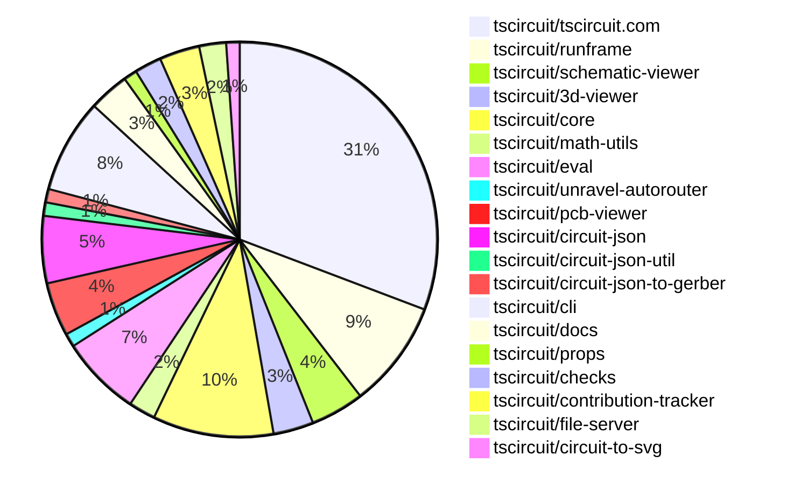

# contribution-tracker

Generates weekly contribution overviews for tscircuit contributors. Check out all
the [contribution overviews here](./contribution-overviews/)

* All PRs in the tscircuit org are scanned/summarized via Claude Haiku
* Claude classifies each Diff/PR as a Major, Minor or Tiny contribution
* All the PRs, summaries, and classifications are organized into charts and tables

The current week is shown below. There are 3 major sections:

* [Contributor Overview](#contributor-overview)
* [PRs by Repository](#prs-by-repository)
* [PRs by Contributor](#changes-by-contributor)

## Current Week

<!-- START_CURRENT_WEEK -->

# Contribution Overview 2025-04-16

## PRs by Repository

## Contributor Overview

| Contributor | 🐳 Major | 🐙 Minor | 🐌 Tiny | ⭐ | Issues Created | Discussion Contributions |
|-------------|---------|---------|---------|-----|----------------|--------------------------|
| [seveibar](#seveibar) | 6 | 13 | 3 | 👑 | 37 | 0🔹 0🔶 0💎 |
| [imrishabh18](#imrishabh18) | 4 | 11 | 4 | 👑 | 9 | 0🔹 0🔶 0💎 |
| [ArnavK-09](#ArnavK-09) | 4 | 13 | 2 | 👑 | 16 | 0🔹 0🔶 0💎 |
| [Abse2001](#Abse2001) | 2 | 6 | 0 | ⭐⭐ | 1 | 0🔹 0🔶 0💎 |
| [MustafaMulla29](#MustafaMulla29) | 1 | 7 | 0 | ⭐⭐ | 4 | 0🔹 0🔶 0💎 |
| [ShiboSoftwareDev](#ShiboSoftwareDev) | 1 | 2 | 0 | ⭐ | 10 | 0🔹 0🔶 0💎 |
| [tscircuitbot](#tscircuitbot) | 0 | 2 | 2 | ⭐ | 0 | 0🔹 0🔶 0💎 |
| [Ayushjhawar8](#Ayushjhawar8) | 0 | 2 | 1 | ⭐ | 2 | 0🔹 0🔶 0💎 |
| [dhvll](#dhvll) | 0 | 2 | 1 | ⭐ | 0 | 0🔹 0🔶 0💎 |
| [mohan-bee](#mohan-bee) | 0 | 1 | 0 |  | 0 | 0🔹 0🔶 0💎 |

### Discussion Contribution Legend

- 🔹 Participating: Basic participation with minimal effort
- 🔶 Very Active: Thoughtful participation that adds value
- 💎 Extremely Active: Exceptional participation with high-quality content

## Review Table

[reviews-received-hover]: ## "Number of reviews received for PRs for this contributor"
[approvals-received-hover]: ## "Number of approvals received for PRs this contributor authored"
[rejections-received-hover]: ## "Number of rejections received for PRs this contributor authored"
[prs-opened-hover]: ## "Number of PRs opened by this contributor"
[issues-created-hover]: ## "Number of issues created by this contributor"
[bountied-issues-hover]: ## "Number of issues this contributor created with a bounty"
[bountied-issue-$-hover]: ## "Total bounty amount placed on issues authored by this contributor"

| Contributor | Reviews Received | Approvals Received | Rejections Received | Approvals | Rejections | PRs Opened | PRs Merged | Issues Created | Bountied Issues | Bountied Issue $ |
|---|---|---|---|---|---|---|---|---|---|---|
| [ShiboSoftwareDev](#ShiboSoftwareDev) | 5 | 4 | 0 | 0 | 0 | 4 | 3 | 10 | 1 | 15 |
| [imrishabh18](#imrishabh18) | 11 | 7 | 0 | 4 | 2 | 20 | 19 | 9 | 5 | 112 |
| [seveibar](#seveibar) | 2 | 1 | 0 | 45 | 6 | 28 | 22 | 37 | 29 | 661 |
| [MustafaMulla29](#MustafaMulla29) | 14 | 11 | 2 | 0 | 2 | 10 | 9 | 4 | 1 | 5 |
| [Abse2001](#Abse2001) | 16 | 8 | 2 | 1 | 0 | 10 | 8 | 1 | 1 | 20 |
| [graphite-app[bot]](#graphite-app[bot]) | 0 | 0 | 0 | 0 | 0 | 0 | 0 | 0 | 0 | 0 |
| [Ayushjhawar8](#Ayushjhawar8) | 8 | 4 | 2 | 0 | 0 | 4 | 3 | 2 | 0 | 0 |
| [ArnavK-09](#ArnavK-09) | 25 | 17 | 0 | 4 | 0 | 22 | 19 | 16 | 3 | 35 |
| [mohan-bee](#mohan-bee) | 5 | 1 | 1 | 0 | 0 | 4 | 1 | 0 | 0 | 0 |
| [CodeMan62](#CodeMan62) | 1 | 0 | 1 | 0 | 0 | 2 | 0 | 0 | 0 | 0 |
| [Nitish-Naik](#Nitish-Naik) | 1 | 0 | 1 | 0 | 0 | 1 | 0 | 0 | 0 | 0 |
| [tscircuitbot](#tscircuitbot) | 0 | 0 | 0 | 0 | 0 | 16 | 4 | 0 | 0 | 0 |
| [dhvll](#dhvll) | 3 | 1 | 0 | 0 | 0 | 3 | 3 | 0 | 0 | 0 |
| [yashksaini-coder](#yashksaini-coder) | 1 | 0 | 1 | 0 | 0 | 1 | 0 | 0 | 0 | 0 |

## Changes by Repository

### [tscircuit/tscircuit.com](https://github.com/tscircuit/tscircuit.com)

| PR # | Impact | Contributor | Description | Milestone Aligned |
|------|--------|-------------|-------------|-------------------|
| [#916](https://github.com/tscircuit/tscircuit.com/pull/916) | 🐳 Major | imrishabh18 | Update the fake endpoint to support multiple vendors and add fake data | ❌ |
| [#860](https://github.com/tscircuit/tscircuit.com/pull/860) | 🐳 Major | imrishabh18 | The pull request adds a fake endpoint for `order_quotes` that allows creating, retrieving, and creating all vendor quotes for a package release. | ❌ |
| [#886](https://github.com/tscircuit/tscircuit.com/pull/886) | 🐳 Major | ArnavK-09 | Enhance UI and error handling in package editor | ❌ |
| [#845](https://github.com/tscircuit/tscircuit.com/pull/845) | 🐳 Major | ArnavK-09 | Change Editor Page endpoints from `/snippets/*` to `/packages/*`, introduce file tree, multi-file selection in editor | ✅ |
| [#917](https://github.com/tscircuit/tscircuit.com/pull/917) | 🐙 Minor | imrishabh18 | Add an "Order" button on the view package page with fake data. | ❌ |
| [#906](https://github.com/tscircuit/tscircuit.com/pull/906) | 🐙 Minor | imrishabh18 | Adds a fake endpoint to get the completed order_quote and adds an environment variable `TSCIRCUIT_REGISTRY_API_BASE_URL` for the order button. | ❌ |
| [#864](https://github.com/tscircuit/tscircuit.com/pull/864) | 🐙 Minor | imrishabh18 | Rename the "order_quote" directory to "order_quotes" | ✅ |
| [#859](https://github.com/tscircuit/tscircuit.com/pull/859) | 🐙 Minor | imrishabh18 | Fix the image preview in the package page. | ✅ |
| [#865](https://github.com/tscircuit/tscircuit.com/pull/865) | 🐙 Minor | seveibar | Update the `circuit-json-to-gerber` dependency to fix issues with rotated rectangles. | ✅ |
| [#903](https://github.com/tscircuit/tscircuit.com/pull/903) | 🐙 Minor | MustafaMulla29 | Removed the "Insert > Chip" feature from the code editor and the footprint dialog. | ❌ |
| [#893](https://github.com/tscircuit/tscircuit.com/pull/893) | 🐙 Minor | MustafaMulla29 | Restricts the edit package name button to only the package owner. | ✅ |
| [#879](https://github.com/tscircuit/tscircuit.com/pull/879) | 🐙 Minor | MustafaMulla29 | Added a file selector to the /p/editor page. | ✅ |
| [#904](https://github.com/tscircuit/tscircuit.com/pull/904) | 🐙 Minor | Ayushjhawar8 |  | ✅ |
| [#899](https://github.com/tscircuit/tscircuit.com/pull/899) | 🐙 Minor | Ayushjhawar8 | Add a filter to the user profile page to sort snippets by various criteria (most recent, least recent, most starred, A-Z, Z-A). | ❌ |
| [#861](https://github.com/tscircuit/tscircuit.com/pull/861) | 🐙 Minor | ArnavK-09 | Improve responsiveness and styling of the package header and code viewer components | ❌ |
| [#907](https://github.com/tscircuit/tscircuit.com/pull/907) | 🐙 Minor | ArnavK-09 | This change enhances the returned object by including all files from `pkgFilesWithContent`, improving the completeness of the data structure used in the component. | ✅ |
| [#895](https://github.com/tscircuit/tscircuit.com/pull/895) | 🐙 Minor | ArnavK-09 | Refactor the CodeEditor component to move the logic for finding the target file into a separate utility function, and add support for the `tscircuit.config.json` file. | ✅ |
| [#891](https://github.com/tscircuit/tscircuit.com/pull/891) | 🐙 Minor | ArnavK-09 | Refactor the CodeEditorHeader component to add support for formatting Markdown and HTML files, improve file type detection, and handle errors for unsupported file types. | ✅ |
| [#880](https://github.com/tscircuit/tscircuit.com/pull/880) | 🐙 Minor | ArnavK-09 | Refactor the file selection logic in the `useEffect` hook to improve readability and maintainability. | ❌ |
| [#882](https://github.com/tscircuit/tscircuit.com/pull/882) | 🐙 Minor | ArnavK-09 | Fix syntax error in `selectedTreeVariants` and refactor `transformFilesToTreeData` to handle hidden files and use an array structure for tree data. | ✅ |
| [#862](https://github.com/tscircuit/tscircuit.com/pull/862) | 🐙 Minor | ArnavK-09 | Fixes an error that occurs when trying to fork one's own package. | ✅ |
| [#913](https://github.com/tscircuit/tscircuit.com/pull/913) | 🐙 Minor | ShiboSoftwareDev | Refactored the trending page to add support for filtering by time period and tags, and added sorting options. | ❌ |
| [#919](https://github.com/tscircuit/tscircuit.com/pull/919) | 🐙 Minor | mohan-bee | Added a "No starred packages" message when there are no starred packages in the user profile. | ✅ |
| [#912](https://github.com/tscircuit/tscircuit.com/pull/912) | 🐌 Tiny | imrishabh18 | Add missing entrypoint for the `bundle` in package.json | ✅ |
| [#910](https://github.com/tscircuit/tscircuit.com/pull/910) | 🐌 Tiny | imrishabh18 | Add manual trigger for publishing to npm | ✅ |
| [#908](https://github.com/tscircuit/tscircuit.com/pull/908) | 🐌 Tiny | imrishabh18 | The change exports the `schema` type from the `fake` module. | ✅ |
| [#905](https://github.com/tscircuit/tscircuit.com/pull/905) | 🐌 Tiny | imrishabh18 | Update the version of `@tscircuit/runframe` dependency | ✅ |
| [#878](https://github.com/tscircuit/tscircuit.com/pull/878) | 🐌 Tiny | ArnavK-09 | Update the icon color in the FileSidebar and CodeEditorHeader components. | ✅ |

### [tscircuit/runframe](https://github.com/tscircuit/runframe)

| PR # | Impact | Contributor | Description | Milestone Aligned |
|------|--------|-------------|-------------|-------------------|
| [#495](https://github.com/tscircuit/runframe/pull/495) | 🐳 Major | imrishabh18 | Modified the whole checkout flow with only the initialScreen | ❌ |
| [#480](https://github.com/tscircuit/runframe/pull/480) | 🐳 Major | imrishabh18 | Adds a new feature to the Runframe component to display an order dialog. | ✅ |
| [#496](https://github.com/tscircuit/runframe/pull/496) | 🐙 Minor | imrishabh18 | The pull request adds support for displaying the discounted value for the vendors DKRed and JLCPCB. | ✅ |
| [#481](https://github.com/tscircuit/runframe/pull/481) | 🐙 Minor | imrishabh18 | Fix the endpoint base URL for `tscircuit.com` in local as well as production environments. | ✅ |
| [#490](https://github.com/tscircuit/runframe/pull/490) | 🐙 Minor | imrishabh18 | Update the schematic-viewer without the snapping feature. | ❌ |
| [#475](https://github.com/tscircuit/runframe/pull/475) | 🐙 Minor | imrishabh18 | Fix snapping movement back to origin on manual edit | ❌ |
| [#478](https://github.com/tscircuit/runframe/pull/478) | 🐙 Minor | seveibar | Fix import errors not throwing and update easyeda dependency to version 0.0.134 | ✅ |
| [#473](https://github.com/tscircuit/runframe/pull/473) | 🐙 Minor | ArnavK-09 | Dynamically set the document title based on the package.json name or the guessed entrypoint from the file system map. | ✅ |

### [tscircuit/schematic-viewer](https://github.com/tscircuit/schematic-viewer)

| PR # | Impact | Contributor | Description | Milestone Aligned |
|------|--------|-------------|-------------|-------------------|
| [#84](https://github.com/tscircuit/schematic-viewer/pull/84) | 🐙 Minor | imrishabh18 | Fix the double movement of position on manual edits | ❌ |
| [#82](https://github.com/tscircuit/schematic-viewer/pull/82) | 🐙 Minor | imrishabh18 | Reverts a previous commit that fixed a bug in the schematic viewer. | ❌ |
| [#81](https://github.com/tscircuit/schematic-viewer/pull/81) | 🐙 Minor | imrishabh18 | Update the center position of a schematic component based on the last drag event | ❌ |
| [#83](https://github.com/tscircuit/schematic-viewer/pull/83) | 🐙 Minor | seveibar | Revert a previous revert of the fix to update the center of a schematic component as per the last position. | ✅ |

### [tscircuit/3d-viewer](https://github.com/tscircuit/3d-viewer)

| PR # | Impact | Contributor | Description | Milestone Aligned |
|------|--------|-------------|-------------|-------------------|
| [#245](https://github.com/tscircuit/3d-viewer/pull/245) | 🐳 Major | seveibar | Introduces major performance improvements, fixes for board centering, trace drawings, and tooltip slowdown. | ✅ |
| [#252](https://github.com/tscircuit/3d-viewer/pull/252) | 🐳 Major | Abse2001 | Adds support for silkscreen text on the bottom layer and updates the text positioning and rotation behavior to match PCB-like behavior. | ✅ |
| [#251](https://github.com/tscircuit/3d-viewer/pull/251) | 🐳 Major | Abse2001 | Adds support for different board materials (FR1 and FR4) with corresponding color customization. | ✅ |

### [tscircuit/core](https://github.com/tscircuit/core)

| PR # | Impact | Contributor | Description | Milestone Aligned |
|------|--------|-------------|-------------|-------------------|
| [#748](https://github.com/tscircuit/core/pull/748) | 🐳 Major | seveibar | Optimize selector cache prior to SourceTraceRender, resulting in a 2x speedup on the benchmark. | ✅ |
| [#747](https://github.com/tscircuit/core/pull/747) | 🐳 Major | seveibar | Use css-select for faster selectOne and selectAll queries, and cache the results to improve overall render times. | ✅ |
| [#751](https://github.com/tscircuit/core/pull/751) | 🐳 Major | MustafaMulla29 | Emits warnings for both schematic and PCB when there are manual placement conflicts with prop-defined coordinates. | ✅ |
| [#741](https://github.com/tscircuit/core/pull/741) | 🐙 Minor | seveibar | The pull request updates the `@tscircuit/circuit-json-util` package to remove the dependency on `@tscircuit/soup-util`. | ✅ |
| [#739](https://github.com/tscircuit/core/pull/739) | 🐙 Minor | seveibar | Update checks and circuit JSON to connectivity net, a speculative fix for spurious DRC errors | ✅ |
| [#753](https://github.com/tscircuit/core/pull/753) | 🐙 Minor | Abse2001 | Fixes a bug where the schematic trace crossing "hop" is generated incorrectly. | ✅ |
| [#752](https://github.com/tscircuit/core/pull/752) | 🐙 Minor | Abse2001 | Updating the versions of `@tscircuit/checks` and `@tscircuit/math-utils` dependencies to fix Invalid DRC Errors. | ✅ |
| [#746](https://github.com/tscircuit/core/pull/746) | 🐙 Minor | Abse2001 | Adds a new "material" property to the Board component | ✅ |
| [#750](https://github.com/tscircuit/core/pull/750) | 🐌 Tiny | seveibar | Add css-select as a production dependency | ✅ |

### [tscircuit/math-utils](https://github.com/tscircuit/math-utils)

| PR # | Impact | Contributor | Description | Milestone Aligned |
|------|--------|-------------|-------------|-------------------|
| [#8](https://github.com/tscircuit/math-utils/pull/8) | 🐳 Major | seveibar | The pull request introduces two new functions, `pointToBoxDistance` and `pointToBoundsDistance`, that calculate the minimum distance from a point to a box or a bounds rectangle, respectively. | ❌ |
| [#9](https://github.com/tscircuit/math-utils/pull/9) | 🐌 Tiny | seveibar | Adds a function to calculate the midpoint between two points. | ✅ |

### [tscircuit/eval](https://github.com/tscircuit/eval)

| PR # | Impact | Contributor | Description | Milestone Aligned |
|------|--------|-------------|-------------|-------------------|
| [#239](https://github.com/tscircuit/eval/pull/239) | 🐳 Major | seveibar | The pull request adds support for passing props to the main component of a module and support for modules with named exports in the `runTscircuitModule` function. | ✅ |
| [#236](https://github.com/tscircuit/eval/pull/236) | 🐙 Minor | seveibar | Adds a new function `runTscircuitModule` to quickly run a published tscircuit module by its name. | ✅ |
| [#238](https://github.com/tscircuit/eval/pull/238) | 🐙 Minor | tscircuitbot | Update @tscircuit/core to v0.0.379 | ✅ |
| [#230](https://github.com/tscircuit/eval/pull/230) | 🐙 Minor | tscircuitbot | Update @tscircuit/core to v0.0.377 | ✅ |
| [#234](https://github.com/tscircuit/eval/pull/234) | 🐌 Tiny | tscircuitbot | Update @tscircuit/core to v0.0.378 | ✅ |
| [#217](https://github.com/tscircuit/eval/pull/217) | 🐌 Tiny | tscircuitbot | Automated update of @tscircuit/core to v0.0.372. | ✅ |

### [tscircuit/unravel-autorouter](https://github.com/tscircuit/unravel-autorouter)

| PR # | Impact | Contributor | Description | Milestone Aligned |
|------|--------|-------------|-------------|-------------------|
| [#96](https://github.com/tscircuit/unravel-autorouter/pull/96) | 🐳 Major | seveibar | Introduce LED Matrix 4 Example, Introduce MultiSectionPathingSolver, Rewrite TwoTraceCrossing Solver, Run Simplification Twice, Straw Penalty | ✅ |

### [tscircuit/pcb-viewer](https://github.com/tscircuit/pcb-viewer)

| PR # | Impact | Contributor | Description | Milestone Aligned |
|------|--------|-------------|-------------|-------------------|
| [#235](https://github.com/tscircuit/pcb-viewer/pull/235) | 🐙 Minor | seveibar | Patch a regression in the `use-mouse-matrix` library, which broke the mouse pan functionality. | ❌ |
| [#231](https://github.com/tscircuit/pcb-viewer/pull/231) | 🐙 Minor | seveibar | Adding the `editCount` property to the `circuitJsonKey` to uniquely identify the circuit. | ✅ |
| [#234](https://github.com/tscircuit/pcb-viewer/pull/234) | 🐌 Tiny | seveibar | Update the version of the "use-mouse-matrix-transform" dependency to 1.3.3. | ✅ |
| [#239](https://github.com/tscircuit/pcb-viewer/pull/239) | 🟣 | MustafaMulla29 | Fixed press interaction on mobile devices | ✅ |

### [tscircuit/circuit-json](https://github.com/tscircuit/circuit-json)

| PR # | Impact | Contributor | Description | Milestone Aligned |
|------|--------|-------------|-------------|-------------------|
| [#170](https://github.com/tscircuit/circuit-json/pull/170) | 🐙 Minor | seveibar | Adds safety checks to ensure that every `AnyCircuitElement` has a type and an `id` property with the key name `{type}_id`. | ✅ |
| [#169](https://github.com/tscircuit/circuit-json/pull/169) | 🐙 Minor | MustafaMulla29 | Refactored the `pcb_manual_edit_conflict_error` to `pcb_manual_edit_conflict_warning`. | ✅ |
| [#168](https://github.com/tscircuit/circuit-json/pull/168) | 🐙 Minor | MustafaMulla29 | Exported the `schematic_manual_edit_conflict_warning` property from `any_circuit_element`. | ✅ |
| [#167](https://github.com/tscircuit/circuit-json/pull/167) | 🐙 Minor | MustafaMulla29 | Defines an error object for handling conflicts between manual edits and explicit schX/schY coordinates in a schematic. | ✅ |
| [#166](https://github.com/tscircuit/circuit-json/pull/166) | 🐙 Minor | Abse2001 | Added a new `material` field to the `PcbBoard` type, allowing users to specify the material of the PCB board as either "fr4" or "fr1". | ✅ |

### [tscircuit/circuit-json-util](https://github.com/tscircuit/circuit-json-util)

| PR # | Impact | Contributor | Description | Milestone Aligned |
|------|--------|-------------|-------------|-------------------|
| [#31](https://github.com/tscircuit/circuit-json-util/pull/31) | 🐙 Minor | seveibar | Adds support for editCount on cju objects to enable smarter keying downstream | ✅ |

### [tscircuit/circuit-json-to-gerber](https://github.com/tscircuit/circuit-json-to-gerber)

| PR # | Impact | Contributor | Description | Milestone Aligned |
|------|--------|-------------|-------------|-------------------|
| [#28](https://github.com/tscircuit/circuit-json-to-gerber/pull/28) | 🐙 Minor | seveibar | Fix unsupported shape "rotated_rect" in the Gerber file generation. | ✅ |

### [tscircuit/cli](https://github.com/tscircuit/cli)

| PR # | Impact | Contributor | Description | Milestone Aligned |
|------|--------|-------------|-------------|-------------------|
| [#171](https://github.com/tscircuit/cli/pull/171) | 🐙 Minor | seveibar | Update the `@tscircuit/file-server` dependency to version `0.0.19` to fix the issue with the JLCPCB import functionality. | ✅ |
| [#169](https://github.com/tscircuit/cli/pull/169) | 🐙 Minor | MustafaMulla29 | Fixed the instructions displayed after cloning a project. | ✅ |
| [#180](https://github.com/tscircuit/cli/pull/180) | 🐙 Minor | ArnavK-09 | Ensure the user is logged in before attempting to clear the session to provide a more user-friendly message when the user is already logged out. | ❌ |
| [#176](https://github.com/tscircuit/cli/pull/176) | 🐙 Minor | ArnavK-09 | Introduces a new "upgrade" command to the CLI that allows users to check for the latest version of the CLI and display a message if the user is already on the latest version. | ✅ |
| [#170](https://github.com/tscircuit/cli/pull/170) | 🐙 Minor | ArnavK-09 | Update dependencies to the latest versions | ✅ |
| [#164](https://github.com/tscircuit/cli/pull/164) | 🐙 Minor | ArnavK-09 | Add a confirmation prompt to the `tsci init` command when no directory is provided. | ✅ |
| [#173](https://github.com/tscircuit/cli/pull/173) | 🐙 Minor | dhvll | Rename "snippet type" to "package type" in the UI | ✅ |

### [tscircuit/docs](https://github.com/tscircuit/docs)

| PR # | Impact | Contributor | Description | Milestone Aligned |
|------|--------|-------------|-------------|-------------------|
| [#33](https://github.com/tscircuit/docs/pull/33) | 🐙 Minor | seveibar | Add an iframe with keyboard example code to the "build-a-custom-keyboard-with-tscircuit" tutorial | ✅ |
| [#34](https://github.com/tscircuit/docs/pull/34) | 🐙 Minor | dhvll | Adds documentation and images for the `tsci push` command in the quickstart-cli documentation. | ✅ |
| [#36](https://github.com/tscircuit/docs/pull/36) | 🐌 Tiny | dhvll | Added image captions to enhance the documentation for the `tsci push` command. | ✅ |

### [tscircuit/props](https://github.com/tscircuit/props)

| PR # | Impact | Contributor | Description | Milestone Aligned |
|------|--------|-------------|-------------|-------------------|
| [#210](https://github.com/tscircuit/props/pull/210) | 🐙 Minor | Abse2001 | Added a new `material` prop to the `board` component with `fr4` as the default and `fr1` as an optional value. | ✅ |

### [tscircuit/checks](https://github.com/tscircuit/checks)

| PR # | Impact | Contributor | Description | Milestone Aligned |
|------|--------|-------------|-------------|-------------------|
| [#34](https://github.com/tscircuit/checks/pull/34) | 🐳 Major | ShiboSoftwareDev | Adds a new function `checkTracesAreContiguous` that checks if PCB traces are contiguous and aligned at vias, and reports any errors found. | ✅ |
| [#32](https://github.com/tscircuit/checks/pull/32) | 🐙 Minor | Abse2001 | Fixes a logic error causing false overlaps errors in the PCB trace non-overlapping check. | ✅ |

### [tscircuit/contribution-tracker](https://github.com/tscircuit/contribution-tracker)

| PR # | Impact | Contributor | Description | Milestone Aligned |
|------|--------|-------------|-------------|-------------------|
| [#122](https://github.com/tscircuit/contribution-tracker/pull/122) | 🐳 Major | ArnavK-09 | Refactors the PR analysis feature by introducing a new `PrsTable` component to replace the deprecated `PRsByRepository` component, and adds support for fetching and processing PR analysis data, including grouping PRs by repository and contributor. | ✅ |
| [#123](https://github.com/tscircuit/contribution-tracker/pull/123) | 🐙 Minor | ArnavK-09 | Patch to handle cases where the PR impact cannot be determined gracefully. | ✅ |
| [#124](https://github.com/tscircuit/contribution-tracker/pull/124) | 🐌 Tiny | Ayushjhawar8 | Add colors to the "Impact" column in the PR table | ✅ |

### [tscircuit/file-server](https://github.com/tscircuit/file-server)

| PR # | Impact | Contributor | Description | Milestone Aligned |
|------|--------|-------------|-------------|-------------------|
| [#11](https://github.com/tscircuit/file-server/pull/11) | 🐳 Major | ArnavK-09 | Introduce a new DELETE endpoint for file deletion, supporting deletion by file_id or file_path. The deletion triggers a FILE_DELETED event. | ❌ |
| [#10](https://github.com/tscircuit/file-server/pull/10) | 🐌 Tiny | ArnavK-09 | Update GitHub Actions to use latest versions of actions/checkout and setup-bun | ❌ |

### [tscircuit/circuit-to-svg](https://github.com/tscircuit/circuit-to-svg)

| PR # | Impact | Contributor | Description | Milestone Aligned |
|------|--------|-------------|-------------|-------------------|
| [#199](https://github.com/tscircuit/circuit-to-svg/pull/199) | 🐙 Minor | ShiboSoftwareDev | Fixed the automatic dark mode for the application. | ✅ |

## Changes by Contributor

### [imrishabh18](https://github.com/imrishabh18)

| PR # | Impact | Description | Milestone Aligned |
|------|--------|-------------|-------------------|
| [#916](https://github.com/tscircuit/tscircuit.com/pull/916) | 🐳 Major | Update the fake endpoint to support multiple vendors and add fake data | ❌ |
| [#860](https://github.com/tscircuit/tscircuit.com/pull/860) | 🐳 Major | The pull request adds a fake endpoint for `order_quotes` that allows creating, retrieving, and creating all vendor quotes for a package release. | ❌ |
| [#495](https://github.com/tscircuit/runframe/pull/495) | 🐳 Major | Modified the whole checkout flow with only the initialScreen | ❌ |
| [#480](https://github.com/tscircuit/runframe/pull/480) | 🐳 Major | Adds a new feature to the Runframe component to display an order dialog. | ✅ |
| [#84](https://github.com/tscircuit/schematic-viewer/pull/84) | 🐙 Minor | Fix the double movement of position on manual edits | ❌ |
| [#82](https://github.com/tscircuit/schematic-viewer/pull/82) | 🐙 Minor | Reverts a previous commit that fixed a bug in the schematic viewer. | ❌ |
| [#81](https://github.com/tscircuit/schematic-viewer/pull/81) | 🐙 Minor | Update the center position of a schematic component based on the last drag event | ❌ |
| [#917](https://github.com/tscircuit/tscircuit.com/pull/917) | 🐙 Minor | Add an "Order" button on the view package page with fake data. | ❌ |
| [#906](https://github.com/tscircuit/tscircuit.com/pull/906) | 🐙 Minor | Adds a fake endpoint to get the completed order_quote and adds an environment variable `TSCIRCUIT_REGISTRY_API_BASE_URL` for the order button. | ❌ |
| [#864](https://github.com/tscircuit/tscircuit.com/pull/864) | 🐙 Minor | Rename the "order_quote" directory to "order_quotes" | ✅ |
| [#859](https://github.com/tscircuit/tscircuit.com/pull/859) | 🐙 Minor | Fix the image preview in the package page. | ✅ |
| [#496](https://github.com/tscircuit/runframe/pull/496) | 🐙 Minor | The pull request adds support for displaying the discounted value for the vendors DKRed and JLCPCB. | ✅ |
| [#481](https://github.com/tscircuit/runframe/pull/481) | 🐙 Minor | Fix the endpoint base URL for `tscircuit.com` in local as well as production environments. | ✅ |
| [#490](https://github.com/tscircuit/runframe/pull/490) | 🐙 Minor | Update the schematic-viewer without the snapping feature. | ❌ |
| [#475](https://github.com/tscircuit/runframe/pull/475) | 🐙 Minor | Fix snapping movement back to origin on manual edit | ❌ |
| [#912](https://github.com/tscircuit/tscircuit.com/pull/912) | 🐌 Tiny | Add missing entrypoint for the `bundle` in package.json | ✅ |
| [#910](https://github.com/tscircuit/tscircuit.com/pull/910) | 🐌 Tiny | Add manual trigger for publishing to npm | ✅ |
| [#908](https://github.com/tscircuit/tscircuit.com/pull/908) | 🐌 Tiny | The change exports the `schema` type from the `fake` module. | ✅ |
| [#905](https://github.com/tscircuit/tscircuit.com/pull/905) | 🐌 Tiny | Update the version of `@tscircuit/runframe` dependency | ✅ |

### [seveibar](https://github.com/seveibar)

| PR # | Impact | Description | Milestone Aligned |
|------|--------|-------------|-------------------|
| [#245](https://github.com/tscircuit/3d-viewer/pull/245) | 🐳 Major | Introduces major performance improvements, fixes for board centering, trace drawings, and tooltip slowdown. | ✅ |
| [#748](https://github.com/tscircuit/core/pull/748) | 🐳 Major | Optimize selector cache prior to SourceTraceRender, resulting in a 2x speedup on the benchmark. | ✅ |
| [#747](https://github.com/tscircuit/core/pull/747) | 🐳 Major | Use css-select for faster selectOne and selectAll queries, and cache the results to improve overall render times. | ✅ |
| [#8](https://github.com/tscircuit/math-utils/pull/8) | 🐳 Major | The pull request introduces two new functions, `pointToBoxDistance` and `pointToBoundsDistance`, that calculate the minimum distance from a point to a box or a bounds rectangle, respectively. | ❌ |
| [#239](https://github.com/tscircuit/eval/pull/239) | 🐳 Major | The pull request adds support for passing props to the main component of a module and support for modules with named exports in the `runTscircuitModule` function. | ✅ |
| [#96](https://github.com/tscircuit/unravel-autorouter/pull/96) | 🐳 Major | Introduce LED Matrix 4 Example, Introduce MultiSectionPathingSolver, Rewrite TwoTraceCrossing Solver, Run Simplification Twice, Straw Penalty | ✅ |
| [#83](https://github.com/tscircuit/schematic-viewer/pull/83) | 🐙 Minor | Revert a previous revert of the fix to update the center of a schematic component as per the last position. | ✅ |
| [#235](https://github.com/tscircuit/pcb-viewer/pull/235) | 🐙 Minor | Patch a regression in the `use-mouse-matrix` library, which broke the mouse pan functionality. | ❌ |
| [#231](https://github.com/tscircuit/pcb-viewer/pull/231) | 🐙 Minor | Adding the `editCount` property to the `circuitJsonKey` to uniquely identify the circuit. | ✅ |
| [#170](https://github.com/tscircuit/circuit-json/pull/170) | 🐙 Minor | Adds safety checks to ensure that every `AnyCircuitElement` has a type and an `id` property with the key name `{type}_id`. | ✅ |
| [#31](https://github.com/tscircuit/circuit-json-util/pull/31) | 🐙 Minor | Adds support for editCount on cju objects to enable smarter keying downstream | ✅ |
| [#741](https://github.com/tscircuit/core/pull/741) | 🐙 Minor | The pull request updates the `@tscircuit/circuit-json-util` package to remove the dependency on `@tscircuit/soup-util`. | ✅ |
| [#739](https://github.com/tscircuit/core/pull/739) | 🐙 Minor | Update checks and circuit JSON to connectivity net, a speculative fix for spurious DRC errors | ✅ |
| [#28](https://github.com/tscircuit/circuit-json-to-gerber/pull/28) | 🐙 Minor | Fix unsupported shape "rotated_rect" in the Gerber file generation. | ✅ |
| [#865](https://github.com/tscircuit/tscircuit.com/pull/865) | 🐙 Minor | Update the `circuit-json-to-gerber` dependency to fix issues with rotated rectangles. | ✅ |
| [#236](https://github.com/tscircuit/eval/pull/236) | 🐙 Minor | Adds a new function `runTscircuitModule` to quickly run a published tscircuit module by its name. | ✅ |
| [#478](https://github.com/tscircuit/runframe/pull/478) | 🐙 Minor | Fix import errors not throwing and update easyeda dependency to version 0.0.134 | ✅ |
| [#171](https://github.com/tscircuit/cli/pull/171) | 🐙 Minor | Update the `@tscircuit/file-server` dependency to version `0.0.19` to fix the issue with the JLCPCB import functionality. | ✅ |
| [#33](https://github.com/tscircuit/docs/pull/33) | 🐙 Minor | Add an iframe with keyboard example code to the "build-a-custom-keyboard-with-tscircuit" tutorial | ✅ |
| [#234](https://github.com/tscircuit/pcb-viewer/pull/234) | 🐌 Tiny | Update the version of the "use-mouse-matrix-transform" dependency to 1.3.3. | ✅ |
| [#750](https://github.com/tscircuit/core/pull/750) | 🐌 Tiny | Add css-select as a production dependency | ✅ |
| [#9](https://github.com/tscircuit/math-utils/pull/9) | 🐌 Tiny | Adds a function to calculate the midpoint between two points. | ✅ |

### [MustafaMulla29](https://github.com/MustafaMulla29)

| PR # | Impact | Description | Milestone Aligned |
|------|--------|-------------|-------------------|
| [#239](https://github.com/tscircuit/pcb-viewer/pull/239) | 🟣 | Fixed press interaction on mobile devices | ✅ |
| [#751](https://github.com/tscircuit/core/pull/751) | 🐳 Major | Emits warnings for both schematic and PCB when there are manual placement conflicts with prop-defined coordinates. | ✅ |
| [#169](https://github.com/tscircuit/circuit-json/pull/169) | 🐙 Minor | Refactored the `pcb_manual_edit_conflict_error` to `pcb_manual_edit_conflict_warning`. | ✅ |
| [#168](https://github.com/tscircuit/circuit-json/pull/168) | 🐙 Minor | Exported the `schematic_manual_edit_conflict_warning` property from `any_circuit_element`. | ✅ |
| [#167](https://github.com/tscircuit/circuit-json/pull/167) | 🐙 Minor | Defines an error object for handling conflicts between manual edits and explicit schX/schY coordinates in a schematic. | ✅ |
| [#903](https://github.com/tscircuit/tscircuit.com/pull/903) | 🐙 Minor | Removed the "Insert > Chip" feature from the code editor and the footprint dialog. | ❌ |
| [#893](https://github.com/tscircuit/tscircuit.com/pull/893) | 🐙 Minor | Restricts the edit package name button to only the package owner. | ✅ |
| [#879](https://github.com/tscircuit/tscircuit.com/pull/879) | 🐙 Minor | Added a file selector to the /p/editor page. | ✅ |
| [#169](https://github.com/tscircuit/cli/pull/169) | 🐙 Minor | Fixed the instructions displayed after cloning a project. | ✅ |

### [Abse2001](https://github.com/Abse2001)

| PR # | Impact | Description | Milestone Aligned |
|------|--------|-------------|-------------------|
| [#252](https://github.com/tscircuit/3d-viewer/pull/252) | 🐳 Major | Adds support for silkscreen text on the bottom layer and updates the text positioning and rotation behavior to match PCB-like behavior. | ✅ |
| [#251](https://github.com/tscircuit/3d-viewer/pull/251) | 🐳 Major | Adds support for different board materials (FR1 and FR4) with corresponding color customization. | ✅ |
| [#166](https://github.com/tscircuit/circuit-json/pull/166) | 🐙 Minor | Added a new `material` field to the `PcbBoard` type, allowing users to specify the material of the PCB board as either "fr4" or "fr1". | ✅ |
| [#210](https://github.com/tscircuit/props/pull/210) | 🐙 Minor | Added a new `material` prop to the `board` component with `fr4` as the default and `fr1` as an optional value. | ✅ |
| [#753](https://github.com/tscircuit/core/pull/753) | 🐙 Minor | Fixes a bug where the schematic trace crossing "hop" is generated incorrectly. | ✅ |
| [#752](https://github.com/tscircuit/core/pull/752) | 🐙 Minor | Updating the versions of `@tscircuit/checks` and `@tscircuit/math-utils` dependencies to fix Invalid DRC Errors. | ✅ |
| [#746](https://github.com/tscircuit/core/pull/746) | 🐙 Minor | Adds a new "material" property to the Board component | ✅ |
| [#32](https://github.com/tscircuit/checks/pull/32) | 🐙 Minor | Fixes a logic error causing false overlaps errors in the PCB trace non-overlapping check. | ✅ |

### [Ayushjhawar8](https://github.com/Ayushjhawar8)

| PR # | Impact | Description | Milestone Aligned |
|------|--------|-------------|-------------------|
| [#904](https://github.com/tscircuit/tscircuit.com/pull/904) | 🐙 Minor |  | ✅ |
| [#899](https://github.com/tscircuit/tscircuit.com/pull/899) | 🐙 Minor | Add a filter to the user profile page to sort snippets by various criteria (most recent, least recent, most starred, A-Z, Z-A). | ❌ |
| [#124](https://github.com/tscircuit/contribution-tracker/pull/124) | 🐌 Tiny | Add colors to the "Impact" column in the PR table | ✅ |

### [ArnavK-09](https://github.com/ArnavK-09)

| PR # | Impact | Description | Milestone Aligned |
|------|--------|-------------|-------------------|
| [#122](https://github.com/tscircuit/contribution-tracker/pull/122) | 🐳 Major | Refactors the PR analysis feature by introducing a new `PrsTable` component to replace the deprecated `PRsByRepository` component, and adds support for fetching and processing PR analysis data, including grouping PRs by repository and contributor. | ✅ |
| [#886](https://github.com/tscircuit/tscircuit.com/pull/886) | 🐳 Major | Enhance UI and error handling in package editor | ❌ |
| [#845](https://github.com/tscircuit/tscircuit.com/pull/845) | 🐳 Major | Change Editor Page endpoints from `/snippets/*` to `/packages/*`, introduce file tree, multi-file selection in editor | ✅ |
| [#11](https://github.com/tscircuit/file-server/pull/11) | 🐳 Major | Introduce a new DELETE endpoint for file deletion, supporting deletion by file_id or file_path. The deletion triggers a FILE_DELETED event. | ❌ |
| [#123](https://github.com/tscircuit/contribution-tracker/pull/123) | 🐙 Minor | Patch to handle cases where the PR impact cannot be determined gracefully. | ✅ |
| [#861](https://github.com/tscircuit/tscircuit.com/pull/861) | 🐙 Minor | Improve responsiveness and styling of the package header and code viewer components | ❌ |
| [#907](https://github.com/tscircuit/tscircuit.com/pull/907) | 🐙 Minor | This change enhances the returned object by including all files from `pkgFilesWithContent`, improving the completeness of the data structure used in the component. | ✅ |
| [#895](https://github.com/tscircuit/tscircuit.com/pull/895) | 🐙 Minor | Refactor the CodeEditor component to move the logic for finding the target file into a separate utility function, and add support for the `tscircuit.config.json` file. | ✅ |
| [#891](https://github.com/tscircuit/tscircuit.com/pull/891) | 🐙 Minor | Refactor the CodeEditorHeader component to add support for formatting Markdown and HTML files, improve file type detection, and handle errors for unsupported file types. | ✅ |
| [#880](https://github.com/tscircuit/tscircuit.com/pull/880) | 🐙 Minor | Refactor the file selection logic in the `useEffect` hook to improve readability and maintainability. | ❌ |
| [#882](https://github.com/tscircuit/tscircuit.com/pull/882) | 🐙 Minor | Fix syntax error in `selectedTreeVariants` and refactor `transformFilesToTreeData` to handle hidden files and use an array structure for tree data. | ✅ |
| [#862](https://github.com/tscircuit/tscircuit.com/pull/862) | 🐙 Minor | Fixes an error that occurs when trying to fork one's own package. | ✅ |
| [#473](https://github.com/tscircuit/runframe/pull/473) | 🐙 Minor | Dynamically set the document title based on the package.json name or the guessed entrypoint from the file system map. | ✅ |
| [#180](https://github.com/tscircuit/cli/pull/180) | 🐙 Minor | Ensure the user is logged in before attempting to clear the session to provide a more user-friendly message when the user is already logged out. | ❌ |
| [#176](https://github.com/tscircuit/cli/pull/176) | 🐙 Minor | Introduces a new "upgrade" command to the CLI that allows users to check for the latest version of the CLI and display a message if the user is already on the latest version. | ✅ |
| [#170](https://github.com/tscircuit/cli/pull/170) | 🐙 Minor | Update dependencies to the latest versions | ✅ |
| [#164](https://github.com/tscircuit/cli/pull/164) | 🐙 Minor | Add a confirmation prompt to the `tsci init` command when no directory is provided. | ✅ |
| [#878](https://github.com/tscircuit/tscircuit.com/pull/878) | 🐌 Tiny | Update the icon color in the FileSidebar and CodeEditorHeader components. | ✅ |
| [#10](https://github.com/tscircuit/file-server/pull/10) | 🐌 Tiny | Update GitHub Actions to use latest versions of actions/checkout and setup-bun | ❌ |

### [ShiboSoftwareDev](https://github.com/ShiboSoftwareDev)

| PR # | Impact | Description | Milestone Aligned |
|------|--------|-------------|-------------------|
| [#34](https://github.com/tscircuit/checks/pull/34) | 🐳 Major | Adds a new function `checkTracesAreContiguous` that checks if PCB traces are contiguous and aligned at vias, and reports any errors found. | ✅ |
| [#199](https://github.com/tscircuit/circuit-to-svg/pull/199) | 🐙 Minor | Fixed the automatic dark mode for the application. | ✅ |
| [#913](https://github.com/tscircuit/tscircuit.com/pull/913) | 🐙 Minor | Refactored the trending page to add support for filtering by time period and tags, and added sorting options. | ❌ |

### [mohan-bee](https://github.com/mohan-bee)

| PR # | Impact | Description | Milestone Aligned |
|------|--------|-------------|-------------------|
| [#919](https://github.com/tscircuit/tscircuit.com/pull/919) | 🐙 Minor | Added a "No starred packages" message when there are no starred packages in the user profile. | ✅ |

### [tscircuitbot](https://github.com/tscircuitbot)

| PR # | Impact | Description | Milestone Aligned |
|------|--------|-------------|-------------------|
| [#238](https://github.com/tscircuit/eval/pull/238) | 🐙 Minor | Update @tscircuit/core to v0.0.379 | ✅ |
| [#230](https://github.com/tscircuit/eval/pull/230) | 🐙 Minor | Update @tscircuit/core to v0.0.377 | ✅ |
| [#234](https://github.com/tscircuit/eval/pull/234) | 🐌 Tiny | Update @tscircuit/core to v0.0.378 | ✅ |
| [#217](https://github.com/tscircuit/eval/pull/217) | 🐌 Tiny | Automated update of @tscircuit/core to v0.0.372. | ✅ |

### [dhvll](https://github.com/dhvll)

| PR # | Impact | Description | Milestone Aligned |
|------|--------|-------------|-------------------|
| [#173](https://github.com/tscircuit/cli/pull/173) | 🐙 Minor | Rename "snippet type" to "package type" in the UI | ✅ |
| [#34](https://github.com/tscircuit/docs/pull/34) | 🐙 Minor | Adds documentation and images for the `tsci push` command in the quickstart-cli documentation. | ✅ |
| [#36](https://github.com/tscircuit/docs/pull/36) | 🐌 Tiny | Added image captions to enhance the documentation for the `tsci push` command. | ✅ |

<!-- END_CURRENT_WEEK -->
