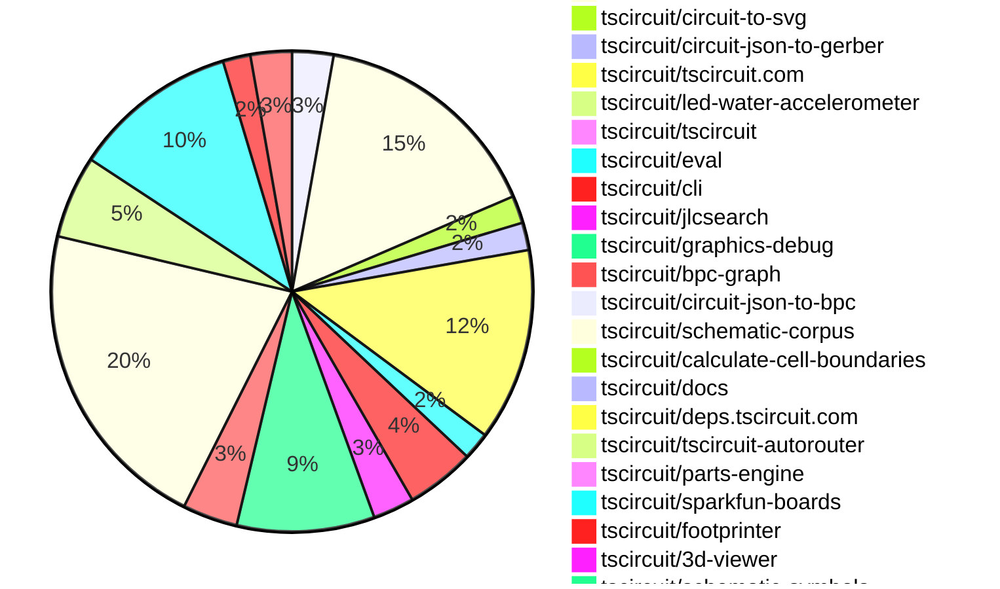

# contribution-tracker

Generates weekly contribution overviews for tscircuit contributors. Check out all
the [contribution overviews here](./contribution-overviews/)
You can find AI-generated monthly changelogs in the [changelogs directory](./changelogs/).

* All PRs in the tscircuit org are scanned/summarized via Claude Haiku
* Claude classifies each Diff/PR as a Major, Minor or Tiny contribution
* All the PRs, summaries, and classifications are organized into charts and tables

The current week is shown below. There are 3 major sections:

* [Contributor Overview](#contributor-overview)
* [PRs by Repository](#prs-by-repository)
* [PRs by Contributor](#changes-by-contributor)

## Current Week

<!-- START_CURRENT_WEEK -->

# Contribution Overview 2025-06-25

## PRs by Repository

## Contributor Overview

| Contributor | 🐳 Major | 🐙 Minor | 🐌 Tiny | ⭐ | Issues Created | Discussion Contributions |
|-------------|---------|---------|---------|-----|----------------|--------------------------|
| [seveibar](#seveibar) | 0 | 27 | 4 | 👑 | 2 | 0🔹 0🔶 0💎 |
| [Anshgrover23](#Anshgrover23) | 0 | 15 | 4 | ⭐⭐⭐ | 7 | 0🔹 0🔶 0💎 |
| [Abse2001](#Abse2001) | 1 | 10 | 0 | ⭐⭐⭐ | 1 | 0🔹 0🔶 0💎 |
| [imrishabh18](#imrishabh18) | 0 | 11 | 4 | ⭐⭐⭐ | 1 | 0🔹 0🔶 0💎 |
| [ArnavK-09](#ArnavK-09) | 2 | 8 | 4 | ⭐⭐ | 7 | 0🔹 0🔶 0💎 |
| [ShiboSoftwareDev](#ShiboSoftwareDev) | 0 | 8 | 2 | ⭐⭐ | 4 | 0🔹 0🔶 0💎 |
| [techmannih](#techmannih) | 0 | 9 | 3 | ⭐⭐ | 2 | 0🔹 0🔶 0💎 |
| [MustafaMulla29](#MustafaMulla29) | 0 | 2 | 1 | ⭐ | 4 | 0🔹 0🔶 0💎 |
| [andrii-balitskyi](#andrii-balitskyi) | 0 | 1 | 0 |  | 0 | 0🔹 0🔶 0💎 |
| [tscircuitbot](#tscircuitbot) | 0 | 0 | 1 |  | 0 | 0🔹 0🔶 0💎 |

### Discussion Contribution Legend

- 🔹 Normal Comments: Basic participation with minimal effort
- 🔶 Great Informative Comments: Thoughtful participation that adds value
- 💎 Incredible Comments: Exceptional participation with high-quality content

## Review Table

[reviews-received-hover]: ## "Number of reviews received for PRs for this contributor"
[approvals-received-hover]: ## "Number of approvals received for PRs this contributor authored"
[rejections-received-hover]: ## "Number of rejections received for PRs this contributor authored"
[prs-opened-hover]: ## "Number of PRs opened by this contributor"
[issues-created-hover]: ## "Number of issues created by this contributor"
[bountied-issues-hover]: ## "Number of issues this contributor created with a bounty"
[bountied-issue-$-hover]: ## "Total bounty amount placed on issues authored by this contributor"

| Contributor | Reviews Received | Approvals Received | Rejections Received | Approvals | Rejections | PRs Opened | PRs Merged | Issues Created | Bountied Issues | Bountied Issue $ |
|---|---|---|---|---|---|---|---|---|---|---|
| [seveibar](#seveibar) | 5 | 1 | 0 | 38 | 3 | 38 | 31 | 2 | 0 | 0 |
| [imrishabh18](#imrishabh18) | 15 | 7 | 0 | 5 | 0 | 18 | 15 | 1 | 0 | 0 |
| [graphite-app[bot]](#graphite-app[bot]) | 0 | 0 | 0 | 0 | 0 | 0 | 0 | 0 | 0 | 0 |
| [techmannih](#techmannih) | 37 | 16 | 5 | 0 | 4 | 23 | 12 | 2 | 0 | 0 |
| [Anshgrover23](#Anshgrover23) | 26 | 17 | 4 | 2 | 6 | 21 | 19 | 7 | 0 | 0 |
| [ShiboSoftwareDev](#ShiboSoftwareDev) | 10 | 8 | 0 | 12 | 2 | 13 | 10 | 4 | 1 | 5 |
| [MustafaMulla29](#MustafaMulla29) | 8 | 3 | 4 | 0 | 0 | 7 | 3 | 4 | 0 | 0 |
| [ArnavK-09](#ArnavK-09) | 23 | 15 | 0 | 1 | 0 | 16 | 14 | 7 | 0 | 0 |
| [Abse2001](#Abse2001) | 5 | 3 | 1 | 13 | 0 | 13 | 11 | 1 | 0 | 0 |
| [andrii-balitskyi](#andrii-balitskyi) | 2 | 1 | 1 | 0 | 0 | 2 | 1 | 0 | 0 | 0 |
| [tscircuitbot](#tscircuitbot) | 0 | 0 | 0 | 0 | 0 | 28 | 1 | 0 | 0 | 0 |

## Changes by Repository

### [tscircuit/props](https://github.com/tscircuit/props)

| PR # | Impact | Contributor | Description | Milestone Aligned |
|------|--------|-------------|-------------|-------------------|
| [#307](https://github.com/tscircuit/props/pull/307) | 🐙 Minor | imrishabh18 | Enhancements to the PlatformConfig interface improve configurability and documentation for board information. | ❌ |
| [#308](https://github.com/tscircuit/props/pull/308) | 🐙 Minor | seveibar | Enhances component flexibility by introducing a new optional property for pin attributes, improving type safety and usability. | ❌ |
| [#304](https://github.com/tscircuit/props/pull/304) | 🐙 Minor | Anshgrover23 | Enhancing the LED component with a connections property improves its configurability and usability in circuit designs. | ❌ |

### [tscircuit/core](https://github.com/tscircuit/core)

| PR # | Impact | Contributor | Description | Milestone Aligned |
|------|--------|-------------|-------------|-------------------|
| [#998](https://github.com/tscircuit/core/pull/998) | 🐙 Minor | imrishabh18 | Enhances the board's silkscreen by adding project-specific information, improving documentation and usability. | ❌ |
| [#1002](https://github.com/tscircuit/core/pull/1002) | 🐙 Minor | imrishabh18 | Enhances routing logic to prevent multiple traces between the same pins in subcircuits, improving circuit design integrity. | ❌ |
| [#997](https://github.com/tscircuit/core/pull/997) | 🐙 Minor | imrishabh18 | The addition of a test case to ensure that subcircuits do not generate duplicate traces enhances the reliability of the circuit design process. | ❌ |
| [#992](https://github.com/tscircuit/core/pull/992) | 🐙 Minor | imrishabh18 | Enhancements to the SolderJumper component improve its configurability by allowing the use of a custom symbol name. | ❌ |
| [#989](https://github.com/tscircuit/core/pull/989) | 🐙 Minor | imrishabh18 | Enhancement of the SolderJumper component to support a new bridged property, improving its functionality. | ❌ |
| [#1005](https://github.com/tscircuit/core/pull/1005) | 🐙 Minor | seveibar | Elimination of a placeholder improves code clarity and ensures proper fallback naming in component generation. | ❌ |
| [#1004](https://github.com/tscircuit/core/pull/1004) | 🐙 Minor | seveibar | Enhancements to netlabel positioning improve schematic accuracy and usability. | ❌ |
| [#1003](https://github.com/tscircuit/core/pull/1003) | 🐙 Minor | seveibar | Fixes a bug related to net IDs in schematic net labels, ensuring correct data is used. | ❌ |
| [#976](https://github.com/tscircuit/core/pull/976) | 🐙 Minor | seveibar | Enhancements to net label positioning improve schematic clarity and usability. | ❌ |
| [#1008](https://github.com/tscircuit/core/pull/1008) | 🐙 Minor | ShiboSoftwareDev | Enhancements to the board center calculation improve accuracy in PCB design. | ❌ |
| [#1000](https://github.com/tscircuit/core/pull/1000) | 🐙 Minor | ShiboSoftwareDev | Enhancements for generating obstacles in PCB designs, improving the handling of cutout shapes. | ❌ |
| [#1009](https://github.com/tscircuit/core/pull/1009) | 🐙 Minor | MustafaMulla29 | Enhances testing capabilities for jumper netlabel connections in the circuit design. | ❌ |
| [#996](https://github.com/tscircuit/core/pull/996) | 🐙 Minor | Abse2001 | Enhancement of selector functionality by adding support for test point selectors, improving usability in circuit design. | ❌ |
| [#1013](https://github.com/tscircuit/core/pull/1013) | 🐌 Tiny | imrishabh18 | Locking the css-select package version to avoid breaking type definitions enhances stability in the project. | ❌ |
| [#995](https://github.com/tscircuit/core/pull/995) | 🐌 Tiny | Anshgrover23 | Enhances testing capabilities for LED connections, ensuring proper functionality in the circuit. | ❌ |
| [#999](https://github.com/tscircuit/core/pull/999) | 🐌 Tiny | ShiboSoftwareDev | Updates the footprinter package version and corrects minor inconsistencies in test files. | ❌ |
| [#1014](https://github.com/tscircuit/core/pull/1014) | 🐌 Tiny | techmannih | Enhancements to schematic testing and symbol updates contribute to improved functionality in circuit design. | ❌ |

### [tscircuit/circuit-to-svg](https://github.com/tscircuit/circuit-to-svg)

| PR # | Impact | Contributor | Description | Milestone Aligned |
|------|--------|-------------|-------------|-------------------|
| [#268](https://github.com/tscircuit/circuit-to-svg/pull/268) | 🐙 Minor | imrishabh18 | Enhancement of text rendering capabilities in PCB silkscreen by supporting multi-line text through newline handling. | ❌ |
| [#270](https://github.com/tscircuit/circuit-to-svg/pull/270) | 🐙 Minor | ShiboSoftwareDev | Enhancements to the SVG rendering of assembly components by adding pads, pins, and holes, improving visual representation. | ❌ |

### [tscircuit/circuit-json-to-gerber](https://github.com/tscircuit/circuit-json-to-gerber)

| PR # | Impact | Contributor | Description | Milestone Aligned |
|------|--------|-------------|-------------|-------------------|
| [#45](https://github.com/tscircuit/circuit-json-to-gerber/pull/45) | 🐙 Minor | imrishabh18 | Enhancements to text rendering in Gerber files improve layout precision for silkscreen text. | ❌ |
| [#44](https://github.com/tscircuit/circuit-json-to-gerber/pull/44) | 🐙 Minor | seveibar | Enhancements to text anchor support in Gerber conversion significantly improve layout flexibility. | ❌ |

### [tscircuit/tscircuit.com](https://github.com/tscircuit/tscircuit.com)

| PR # | Impact | Contributor | Description | Milestone Aligned |
|------|--------|-------------|-------------|-------------------|
| [#1378](https://github.com/tscircuit/tscircuit.com/pull/1378) | 🐳 Major | ArnavK-09 | Revamping the Cmd+K menu enhances user experience by improving search functionality and interface design. | ❌ |
| [#1371](https://github.com/tscircuit/tscircuit.com/pull/1371) | 🐙 Minor | imrishabh18 | Enhances the dashboard by ensuring packages are sorted based on their update or creation date, improving user experience. | ❌ |
| [#1370](https://github.com/tscircuit/tscircuit.com/pull/1370) | 🐙 Minor | imrishabh18 | Enhancing the dashboard's package sorting functionality by preventing mutation of cached data. | ❌ |
| [#1325](https://github.com/tscircuit/tscircuit.com/pull/1325) | 🐙 Minor | seveibar | Enhancing TypeScript library caching through IndexedDB improves performance and resource management in the CodeEditor. | ❌ |
| [#1382](https://github.com/tscircuit/tscircuit.com/pull/1382) | 🐙 Minor | ArnavK-09 | Introducing a native sharing feature enhances user engagement by allowing easy sharing of package information. | ❌ |
| [#1381](https://github.com/tscircuit/tscircuit.com/pull/1381) | 🐙 Minor | ArnavK-09 | Enhances user experience by preventing navigation errors during package loading. | ❌ |
| [#1379](https://github.com/tscircuit/tscircuit.com/pull/1379) | 🐙 Minor | ArnavK-09 | Enhancements to responsiveness improve user experience on build pages. | ❌ |
| [#1374](https://github.com/tscircuit/tscircuit.com/pull/1374) | 🐙 Minor | ArnavK-09 | Enhancement of user identification by switching from account ID to GitHub username for improved clarity in the settings dialog. | ❌ |
| [#1373](https://github.com/tscircuit/tscircuit.com/pull/1373) | 🐙 Minor | ArnavK-09 | Enhances security by limiting AI review generation to package owners, ensuring only authorized users can access this feature. | ❌ |
| [#1372](https://github.com/tscircuit/tscircuit.com/pull/1372) | 🐙 Minor | ArnavK-09 | Introducing a toggle button for AI autocomplete enhances user interaction and functionality within the Code Editor. | ❌ |
| [#1368](https://github.com/tscircuit/tscircuit.com/pull/1368) | 🐙 Minor | andrii-balitskyi | Enhancements to the AI review loading state improve user experience during review requests. | ❌ |
| [#1387](https://github.com/tscircuit/tscircuit.com/pull/1387) | 🐌 Tiny | ArnavK-09 | Updating dependencies enhances the stability and performance of the project by ensuring that the latest features and fixes are included. | ❌ |
| [#1384](https://github.com/tscircuit/tscircuit.com/pull/1384) | 🐌 Tiny | ArnavK-09 | Enhancements to the UI components for better size management and performance. | ❌ |
| [#1383](https://github.com/tscircuit/tscircuit.com/pull/1383) | 🐌 Tiny | ArnavK-09 | The change enhances the visual presentation of the CmdKMenu component by removing unnecessary spacing, leading to a cleaner UI. | ❌ |

### [tscircuit/led-water-accelerometer](https://github.com/tscircuit/led-water-accelerometer)

| PR # | Impact | Contributor | Description | Milestone Aligned |
|------|--------|-------------|-------------|-------------------|
| [#3](https://github.com/tscircuit/led-water-accelerometer/pull/3) | 🐙 Minor | imrishabh18 | Enhancements to the PCB design by adding mounting holes and improving power connections. | ❌ |

### [tscircuit/tscircuit](https://github.com/tscircuit/tscircuit)

| PR # | Impact | Contributor | Description | Milestone Aligned |
|------|--------|-------------|-------------|-------------------|
| [#694](https://github.com/tscircuit/tscircuit/pull/694) | 🐌 Tiny | imrishabh18 | Updates the core and eval packages to their latest versions, ensuring compatibility and potentially introducing minor improvements. | ❌ |

### [tscircuit/eval](https://github.com/tscircuit/eval)

| PR # | Impact | Contributor | Description | Milestone Aligned |
|------|--------|-------------|-------------|-------------------|
| [#608](https://github.com/tscircuit/eval/pull/608) | 🐌 Tiny | imrishabh18 | Updating the core dependency version enhances compatibility and potentially introduces new features or fixes. | ❌ |
| [#619](https://github.com/tscircuit/eval/pull/619) | 🐌 Tiny | tscircuitbot | Updating dependencies is essential for maintaining the health and performance of the project. | ❌ |

### [tscircuit/cli](https://github.com/tscircuit/cli)

| PR # | Impact | Contributor | Description | Milestone Aligned |
|------|--------|-------------|-------------|-------------------|
| [#251](https://github.com/tscircuit/cli/pull/251) | 🐙 Minor | ShiboSoftwareDev | Updating the Node.js version in workflows enhances compatibility and performance for the project. | ❌ |
| [#250](https://github.com/tscircuit/cli/pull/250) | 🐙 Minor | ShiboSoftwareDev | Enhancing the build command to allow for error tolerance improves user experience and flexibility during the build process. | ❌ |
| [#252](https://github.com/tscircuit/cli/pull/252) | 🐌 Tiny | imrishabh18 | Updates dependencies in the package.json file to newer versions, ensuring compatibility and potentially improved functionality. | ❌ |
| [#253](https://github.com/tscircuit/cli/pull/253) | 🐌 Tiny | seveibar | Refactoring the CLI to utilize peer dependencies enhances compatibility and reduces bundle size, improving overall performance. | ❌ |
| [#254](https://github.com/tscircuit/cli/pull/254) | 🐌 Tiny | ArnavK-09 | Updates dependencies to newer versions, ensuring compatibility and potentially improving performance. | ❌ |

### [tscircuit/jlcsearch](https://github.com/tscircuit/jlcsearch)

| PR # | Impact | Contributor | Description | Milestone Aligned |
|------|--------|-------------|-------------|-------------------|
| [#62](https://github.com/tscircuit/jlcsearch/pull/62) | 🐙 Minor | seveibar | Enhances the gas sensors functionality by introducing a measurement filter, improving user experience and data specificity. | ❌ |
| [#61](https://github.com/tscircuit/jlcsearch/pull/61) | 🐙 Minor | seveibar | Enhances the gas sensor functionality by adding measurement flags for various gases, improving data accuracy and usability. | ❌ |
| [#60](https://github.com/tscircuit/jlcsearch/pull/60) | 🐙 Minor | seveibar | The addition of a dedicated page for Boost DC-DC converters enhances the repository's functionality by providing users with a comprehensive list and details of available converters. | ❌ |

### [tscircuit/graphics-debug](https://github.com/tscircuit/graphics-debug)

| PR # | Impact | Contributor | Description | Milestone Aligned |
|------|--------|-------------|-------------|-------------------|
| [#64](https://github.com/tscircuit/graphics-debug/pull/64) | 🐙 Minor | seveibar | Enhancements to rectangle label positioning and size improve visual clarity and usability. | ❌ |
| [#66](https://github.com/tscircuit/graphics-debug/pull/66) | 🐙 Minor | seveibar | Enhancing SVG customization by allowing dynamic width and height parameters significantly improves flexibility for users. | ❌ |
| [#65](https://github.com/tscircuit/graphics-debug/pull/65) | 🐙 Minor | seveibar | Corrects the Y offset in graphics grid creation to ensure proper row orientation, enhancing the functionality of the graphics grid. | ❌ |
| [#63](https://github.com/tscircuit/graphics-debug/pull/63) | 🐙 Minor | seveibar | Dynamic font sizing for rectangle labels enhances visual clarity and adaptability in graphics rendering. | ❌ |
| [#62](https://github.com/tscircuit/graphics-debug/pull/62) | 🐙 Minor | seveibar | Enhancements to the graphics grid functionality by allowing customizable gaps between cells, improving layout flexibility. | ❌ |
| [#61](https://github.com/tscircuit/graphics-debug/pull/61) | 🐙 Minor | seveibar | Introduces a new method for arranging graphics in a grid layout, enhancing the library's functionality. | ❌ |
| [#60](https://github.com/tscircuit/graphics-debug/pull/60) | 🐙 Minor | seveibar | The addition of stacking utilities enhances the library's functionality by allowing users to easily arrange graphics, improving usability and flexibility. | ❌ |
| [#59](https://github.com/tscircuit/graphics-debug/pull/59) | 🐙 Minor | seveibar | Enhancements to text sizing logic improve rendering accuracy and flexibility in graphics. | ❌ |
| [#58](https://github.com/tscircuit/graphics-debug/pull/58) | 🐙 Minor | seveibar | Enhancements to graphics rendering by adding text support, improving interactivity and visual representation. | ❌ |
| [#57](https://github.com/tscircuit/graphics-debug/pull/57) | 🐙 Minor | seveibar | The addition of the mergeGraphics utility enhances the library's functionality by allowing users to combine multiple graphics objects seamlessly. | ❌ |

### [tscircuit/bpc-graph](https://github.com/tscircuit/bpc-graph)

| PR # | Impact | Contributor | Description | Milestone Aligned |
|------|--------|-------------|-------------|-------------------|
| [#7](https://github.com/tscircuit/bpc-graph/pull/7) | 🐙 Minor | seveibar | Enhancements to adjacency matrix computations and graph matching functionalities significantly improve the library's capabilities. | ❌ |
| [#6](https://github.com/tscircuit/bpc-graph/pull/6) | 🐙 Minor | seveibar | The pull request introduces a significant refactor of the graph similarity calculation logic, enhancing the functionality and maintainability of the codebase. | ❌ |
| [#5](https://github.com/tscircuit/bpc-graph/pull/5) | 🐙 Minor | seveibar | Enhancements to the graph transformation process with added logging and a new corpus matcher page. | ❌ |
| [#4](https://github.com/tscircuit/bpc-graph/pull/4) | 🐙 Minor | seveibar | The addition of a corpus matcher page enhances the functionality of the application by allowing users to compare BPC graphs against a predefined corpus, thereby improving usability and feature set. | ❌ |

### [tscircuit/circuit-json-to-bpc](https://github.com/tscircuit/circuit-json-to-bpc)

| PR # | Impact | Contributor | Description | Milestone Aligned |
|------|--------|-------------|-------------|-------------------|
| [#2](https://github.com/tscircuit/circuit-json-to-bpc/pull/2) | 🐙 Minor | seveibar | Enhancements to the circuit conversion process by adding functionality for converting schematic net labels into boxes with pins, improving the overall utility of the tool. | ❌ |

### [tscircuit/schematic-corpus](https://github.com/tscircuit/schematic-corpus)

| PR # | Impact | Contributor | Description | Milestone Aligned |
|------|--------|-------------|-------------|-------------------|
| [#25](https://github.com/tscircuit/schematic-corpus/pull/25) | 🐙 Minor | seveibar | Enhancements to the graphics generation for BPC graphs improve the visual representation of circuit designs. | ❌ |
| [#36](https://github.com/tscircuit/schematic-corpus/pull/36) | 🐙 Minor | Anshgrover23 | Introduces a new circuit design component that enhances the schematic capabilities of the project. | ❌ |
| [#34](https://github.com/tscircuit/schematic-corpus/pull/34) | 🐙 Minor | Anshgrover23 | Introduces a new circuit design with specific component placements and updates the core dependency version. | ❌ |
| [#32](https://github.com/tscircuit/schematic-corpus/pull/32) | 🐙 Minor | Anshgrover23 | The addition of design 24 introduces new circuit components and connections, enhancing the overall functionality of the schematic. | ❌ |
| [#24](https://github.com/tscircuit/schematic-corpus/pull/24) | 🐙 Minor | Anshgrover23 | Introduces a new circuit design with components including a solder jumper, resistor, and LED, enhancing the schematic corpus. | ❌ |
| [#22](https://github.com/tscircuit/schematic-corpus/pull/22) | 🐙 Minor | Anshgrover23 | Introduces a new circuit design component that enhances the schematic library. | ❌ |
| [#10](https://github.com/tscircuit/schematic-corpus/pull/10) | 🐙 Minor | Anshgrover23 | Introduces a new design example that enhances the library's usability and showcases additional functionality. | ❌ |
| [#33](https://github.com/tscircuit/schematic-corpus/pull/33) | 🐙 Minor | techmannih | Introduces a new circuit design component that enhances the schematic library. | ❌ |
| [#31](https://github.com/tscircuit/schematic-corpus/pull/31) | 🐙 Minor | techmannih | Enhancements to the design025 circuit layout, improving pin arrangement and net labels for better functionality. | ❌ |
| [#27](https://github.com/tscircuit/schematic-corpus/pull/27) | 🐙 Minor | techmannih | Introduces a new circuit design component that enhances the schematic library. | ❌ |
| [#26](https://github.com/tscircuit/schematic-corpus/pull/26) | 🐙 Minor | techmannih | Introduces a new circuit design component that enhances the schematic library. | ❌ |
| [#21](https://github.com/tscircuit/schematic-corpus/pull/21) | 🐙 Minor | techmannih | Introduces a new circuit design component that enhances the schematic library. | ❌ |
| [#20](https://github.com/tscircuit/schematic-corpus/pull/20) | 🐙 Minor | Abse2001 | Introduces a new circuit design file with multiple net labels for a chip, enhancing the schematic representation. | ❌ |
| [#19](https://github.com/tscircuit/schematic-corpus/pull/19) | 🐙 Minor | Abse2001 | Enhancements to circuit design with additional net labels and connections for improved functionality. | ❌ |
| [#18](https://github.com/tscircuit/schematic-corpus/pull/18) | 🐙 Minor | Abse2001 | Introduces a new circuit design component with specific net labels and connections. | ❌ |
| [#17](https://github.com/tscircuit/schematic-corpus/pull/17) | 🐙 Minor | Abse2001 | Introduces a new circuit design component with specific net labels and connections. | ❌ |
| [#16](https://github.com/tscircuit/schematic-corpus/pull/16) | 🐙 Minor | Abse2001 | Introduces a new circuit design component with various electronic elements. | ❌ |
| [#15](https://github.com/tscircuit/schematic-corpus/pull/15) | 🐙 Minor | Abse2001 | Introduces a new circuit design component with a switch and net labels for connections. | ❌ |
| [#14](https://github.com/tscircuit/schematic-corpus/pull/14) | 🐙 Minor | Abse2001 | Introduces a new circuit design featuring Schottky diodes, addressing a specific issue with the symbol not functioning correctly. | ❌ |
| [#13](https://github.com/tscircuit/schematic-corpus/pull/13) | 🐙 Minor | Abse2001 | Introduces a new circuit design with specific capacitor placements and net labels. | ❌ |
| [#12](https://github.com/tscircuit/schematic-corpus/pull/12) | 🐙 Minor | Abse2001 | Introduces a new circuit design with specific component placements and updates package dependencies. | ❌ |
| [#11](https://github.com/tscircuit/schematic-corpus/pull/11) | 🐌 Tiny | seveibar | The changes enhance the package dependencies and type definitions, improving the overall development experience. | ❌ |
| [#35](https://github.com/tscircuit/schematic-corpus/pull/35) | 🐌 Tiny | techmannih | Introduces a new circuit design component that enhances the schematic library. | ❌ |

### [tscircuit/calculate-cell-boundaries](https://github.com/tscircuit/calculate-cell-boundaries)

| PR # | Impact | Contributor | Description | Milestone Aligned |
|------|--------|-------------|-------------|-------------------|
| [#7](https://github.com/tscircuit/calculate-cell-boundaries/pull/7) | 🐙 Minor | seveibar | Refactoring the internal layout enhances code organization and maintainability, improving the overall structure of the project. | ❌ |

### [tscircuit/docs](https://github.com/tscircuit/docs)

| PR # | Impact | Contributor | Description | Milestone Aligned |
|------|--------|-------------|-------------|-------------------|
| [#92](https://github.com/tscircuit/docs/pull/92) | 🐌 Tiny | seveibar | Enhancing documentation for the `sel.net` usage improves developer understanding and usability. | ❌ |

### [tscircuit/deps.tscircuit.com](https://github.com/tscircuit/deps.tscircuit.com)

| PR # | Impact | Contributor | Description | Milestone Aligned |
|------|--------|-------------|-------------|-------------------|
| [#23](https://github.com/tscircuit/deps.tscircuit.com/pull/23) | 🐌 Tiny | seveibar | Introducing a new downstream dependency enhances the dependency graph and improves package management. | ❌ |

### [tscircuit/tscircuit-autorouter](https://github.com/tscircuit/tscircuit-autorouter)

| PR # | Impact | Contributor | Description | Milestone Aligned |
|------|--------|-------------|-------------|-------------------|
| [#172](https://github.com/tscircuit/tscircuit-autorouter/pull/172) | 🐙 Minor | Anshgrover23 | Enhancements to testing fixtures for improved debugging of hypersolver issues. | ❌ |
| [#171](https://github.com/tscircuit/tscircuit-autorouter/pull/171) | 🐙 Minor | Anshgrover23 | Enhancements to testing fixtures for hyperdensity bugs improve the robustness of the autorouting feature. | ❌ |
| [#165](https://github.com/tscircuit/tscircuit-autorouter/pull/165) | 🐙 Minor | Anshgrover23 | Enhancements to the hyperdensity solver through the addition of new fixtures for testing. | ❌ |
| [#168](https://github.com/tscircuit/tscircuit-autorouter/pull/168) | 🐙 Minor | Anshgrover23 | Introduces a new JSON asset and a corresponding fixture for high-density debugging, enhancing testing capabilities. | ❌ |
| [#177](https://github.com/tscircuit/tscircuit-autorouter/pull/177) | 🐙 Minor | techmannih | Enhancements to high-density node fixtures improve the functionality and testing capabilities of the autorouter. | ❌ |
| [#170](https://github.com/tscircuit/tscircuit-autorouter/pull/170) | 🐌 Tiny | Anshgrover23 | Excluding JSON files from formatting enhances the project's code quality by preventing unnecessary changes in these files during formatting operations. | ❌ |

### [tscircuit/parts-engine](https://github.com/tscircuit/parts-engine)

| PR # | Impact | Contributor | Description | Milestone Aligned |
|------|--------|-------------|-------------|-------------------|
| [#8](https://github.com/tscircuit/parts-engine/pull/8) | 🐙 Minor | Anshgrover23 | Enhancing robustness by ensuring undefined fuses are handled gracefully in the findPart function. | ❌ |

### [tscircuit/sparkfun-boards](https://github.com/tscircuit/sparkfun-boards)

| PR # | Impact | Contributor | Description | Milestone Aligned |
|------|--------|-------------|-------------|-------------------|
| [#29](https://github.com/tscircuit/sparkfun-boards/pull/29) | 🐳 Major | Abse2001 | Introduces a new board design for the SparkFun Transceiver Breakout MAX3232, enhancing the repository's offerings. | ❌ |
| [#33](https://github.com/tscircuit/sparkfun-boards/pull/33) | 🐙 Minor | Anshgrover23 | Refactoring the code to improve organization and maintainability by separating the jumper footprint into its own file enhances clarity and modularity. | ❌ |
| [#24](https://github.com/tscircuit/sparkfun-boards/pull/24) | 🐙 Minor | Anshgrover23 | The update enhances the RFM69 breakout board design with improved PCB layout and schematic adjustments. | ❌ |
| [#18](https://github.com/tscircuit/sparkfun-boards/pull/18) | 🐙 Minor | Anshgrover23 | The addition of the SparkFun Human Presence and Motion Sensor enhances the repository's offerings, providing new functionality for users interested in motion detection. | ❌ |
| [#25](https://github.com/tscircuit/sparkfun-boards/pull/25) | 🐙 Minor | ShiboSoftwareDev | Enhancements to CI workflows and dependency updates improve build reliability and maintainability. | ❌ |
| [#12](https://github.com/tscircuit/sparkfun-boards/pull/12) | 🐙 Minor | techmannih | The pull request enhances the USBToSerialBreakout board by correcting pin labels and adding a new component, improving functionality and clarity. | ❌ |
| [#37](https://github.com/tscircuit/sparkfun-boards/pull/37) | 🐙 Minor | MustafaMulla29 | The changes enhance the design and functionality of the HMC6343 breakout board, improving component placement and specifications. | ❌ |
| [#32](https://github.com/tscircuit/sparkfun-boards/pull/32) | 🐌 Tiny | Anshgrover23 | Enhances the development workflow by adding snapshot scripts for easier testing and updates. | ❌ |
| [#16](https://github.com/tscircuit/sparkfun-boards/pull/16) | 🐌 Tiny | Anshgrover23 | Adding a README file enhances documentation and usability for the SparkFun RFM69 Breakout board. | ❌ |
| [#30](https://github.com/tscircuit/sparkfun-boards/pull/30) | 🐌 Tiny | ShiboSoftwareDev | Adjustments to schematic coordinates for improved layout accuracy. | ❌ |
| [#31](https://github.com/tscircuit/sparkfun-boards/pull/31) | 🐌 Tiny | techmannih | Adding a README file enhances documentation and usability for the SparkFun USB to Serial Breakout board. | ❌ |
| [#21](https://github.com/tscircuit/sparkfun-boards/pull/21) | 🐌 Tiny | MustafaMulla29 | Updates dependencies and snapshots to ensure compatibility and reflect recent changes in the project. | ❌ |

### [tscircuit/footprinter](https://github.com/tscircuit/footprinter)

| PR # | Impact | Contributor | Description | Milestone Aligned |
|------|--------|-------------|-------------|-------------------|
| [#307](https://github.com/tscircuit/footprinter/pull/307) | 🐙 Minor | ShiboSoftwareDev | Enhancement of the pinrow functionality by allowing the omission of silkscreen pin labels, improving customization for users. | ❌ |
| [#306](https://github.com/tscircuit/footprinter/pull/306) | 🐙 Minor | techmannih | Adjusts the dimensions of the 1210 footprint to improve compatibility with tall pads, enhancing design accuracy. | ❌ |

### [tscircuit/3d-viewer](https://github.com/tscircuit/3d-viewer)

| PR # | Impact | Contributor | Description | Milestone Aligned |
|------|--------|-------------|-------------|-------------------|
| [#364](https://github.com/tscircuit/3d-viewer/pull/364) | 🐙 Minor | ShiboSoftwareDev | Enhancements to handle empty board scenarios in the manifold rendering process. | ❌ |

### [tscircuit/schematic-symbols](https://github.com/tscircuit/schematic-symbols)

| PR # | Impact | Contributor | Description | Milestone Aligned |
|------|--------|-------------|-------------|-------------------|
| [#315](https://github.com/tscircuit/schematic-symbols/pull/315) | 🐙 Minor | techmannih | The pull request reduces the size of the testpoint symbol, enhancing the visual clarity of schematic diagrams. | ❌ |

### [tscircuit/runframe](https://github.com/tscircuit/runframe)

| PR # | Impact | Contributor | Description | Milestone Aligned |
|------|--------|-------------|-------------|-------------------|
| [#820](https://github.com/tscircuit/runframe/pull/820) | 🐳 Major | ArnavK-09 | Enhancements to the user interface for full screen previews significantly improve user experience on tscircuit.com. | ❌ |
| [#824](https://github.com/tscircuit/runframe/pull/824) | 🐙 Minor | ArnavK-09 | Enhances user experience by ensuring that the last active tab is preserved when an error occurs, improving usability. | ❌ |
| [#823](https://github.com/tscircuit/runframe/pull/823) | 🐙 Minor | ArnavK-09 | The changes enhance the user interface by ensuring proper height adjustments for full-screen and CLI runframe previews, improving usability and visual consistency. | ❌ |

## Changes by Contributor

### [imrishabh18](https://github.com/imrishabh18)

| PR # | Impact | Description | Milestone Aligned |
|------|--------|-------------|-------------------|
| [#307](https://github.com/tscircuit/props/pull/307) | 🐙 Minor | Enhancements to the PlatformConfig interface improve configurability and documentation for board information. | ❌ |
| [#998](https://github.com/tscircuit/core/pull/998) | 🐙 Minor | Enhances the board's silkscreen by adding project-specific information, improving documentation and usability. | ❌ |
| [#1002](https://github.com/tscircuit/core/pull/1002) | 🐙 Minor | Enhances routing logic to prevent multiple traces between the same pins in subcircuits, improving circuit design integrity. | ❌ |
| [#997](https://github.com/tscircuit/core/pull/997) | 🐙 Minor | The addition of a test case to ensure that subcircuits do not generate duplicate traces enhances the reliability of the circuit design process. | ❌ |
| [#992](https://github.com/tscircuit/core/pull/992) | 🐙 Minor | Enhancements to the SolderJumper component improve its configurability by allowing the use of a custom symbol name. | ❌ |
| [#989](https://github.com/tscircuit/core/pull/989) | 🐙 Minor | Enhancement of the SolderJumper component to support a new bridged property, improving its functionality. | ❌ |
| [#268](https://github.com/tscircuit/circuit-to-svg/pull/268) | 🐙 Minor | Enhancement of text rendering capabilities in PCB silkscreen by supporting multi-line text through newline handling. | ❌ |
| [#45](https://github.com/tscircuit/circuit-json-to-gerber/pull/45) | 🐙 Minor | Enhancements to text rendering in Gerber files improve layout precision for silkscreen text. | ❌ |
| [#1371](https://github.com/tscircuit/tscircuit.com/pull/1371) | 🐙 Minor | Enhances the dashboard by ensuring packages are sorted based on their update or creation date, improving user experience. | ❌ |
| [#1370](https://github.com/tscircuit/tscircuit.com/pull/1370) | 🐙 Minor | Enhancing the dashboard's package sorting functionality by preventing mutation of cached data. | ❌ |
| [#3](https://github.com/tscircuit/led-water-accelerometer/pull/3) | 🐙 Minor | Enhancements to the PCB design by adding mounting holes and improving power connections. | ❌ |
| [#694](https://github.com/tscircuit/tscircuit/pull/694) | 🐌 Tiny | Updates the core and eval packages to their latest versions, ensuring compatibility and potentially introducing minor improvements. | ❌ |
| [#1013](https://github.com/tscircuit/core/pull/1013) | 🐌 Tiny | Locking the css-select package version to avoid breaking type definitions enhances stability in the project. | ❌ |
| [#608](https://github.com/tscircuit/eval/pull/608) | 🐌 Tiny | Updating the core dependency version enhances compatibility and potentially introduces new features or fixes. | ❌ |
| [#252](https://github.com/tscircuit/cli/pull/252) | 🐌 Tiny | Updates dependencies in the package.json file to newer versions, ensuring compatibility and potentially improved functionality. | ❌ |

### [seveibar](https://github.com/seveibar)

| PR # | Impact | Description | Milestone Aligned |
|------|--------|-------------|-------------------|
| [#308](https://github.com/tscircuit/props/pull/308) | 🐙 Minor | Enhances component flexibility by introducing a new optional property for pin attributes, improving type safety and usability. | ❌ |
| [#1005](https://github.com/tscircuit/core/pull/1005) | 🐙 Minor | Elimination of a placeholder improves code clarity and ensures proper fallback naming in component generation. | ❌ |
| [#1004](https://github.com/tscircuit/core/pull/1004) | 🐙 Minor | Enhancements to netlabel positioning improve schematic accuracy and usability. | ❌ |
| [#1003](https://github.com/tscircuit/core/pull/1003) | 🐙 Minor | Fixes a bug related to net IDs in schematic net labels, ensuring correct data is used. | ❌ |
| [#976](https://github.com/tscircuit/core/pull/976) | 🐙 Minor | Enhancements to net label positioning improve schematic clarity and usability. | ❌ |
| [#44](https://github.com/tscircuit/circuit-json-to-gerber/pull/44) | 🐙 Minor | Enhancements to text anchor support in Gerber conversion significantly improve layout flexibility. | ❌ |
| [#1325](https://github.com/tscircuit/tscircuit.com/pull/1325) | 🐙 Minor | Enhancing TypeScript library caching through IndexedDB improves performance and resource management in the CodeEditor. | ❌ |
| [#62](https://github.com/tscircuit/jlcsearch/pull/62) | 🐙 Minor | Enhances the gas sensors functionality by introducing a measurement filter, improving user experience and data specificity. | ❌ |
| [#61](https://github.com/tscircuit/jlcsearch/pull/61) | 🐙 Minor | Enhances the gas sensor functionality by adding measurement flags for various gases, improving data accuracy and usability. | ❌ |
| [#60](https://github.com/tscircuit/jlcsearch/pull/60) | 🐙 Minor | The addition of a dedicated page for Boost DC-DC converters enhances the repository's functionality by providing users with a comprehensive list and details of available converters. | ❌ |
| [#64](https://github.com/tscircuit/graphics-debug/pull/64) | 🐙 Minor | Enhancements to rectangle label positioning and size improve visual clarity and usability. | ❌ |
| [#66](https://github.com/tscircuit/graphics-debug/pull/66) | 🐙 Minor | Enhancing SVG customization by allowing dynamic width and height parameters significantly improves flexibility for users. | ❌ |
| [#65](https://github.com/tscircuit/graphics-debug/pull/65) | 🐙 Minor | Corrects the Y offset in graphics grid creation to ensure proper row orientation, enhancing the functionality of the graphics grid. | ❌ |
| [#63](https://github.com/tscircuit/graphics-debug/pull/63) | 🐙 Minor | Dynamic font sizing for rectangle labels enhances visual clarity and adaptability in graphics rendering. | ❌ |
| [#62](https://github.com/tscircuit/graphics-debug/pull/62) | 🐙 Minor | Enhancements to the graphics grid functionality by allowing customizable gaps between cells, improving layout flexibility. | ❌ |
| [#61](https://github.com/tscircuit/graphics-debug/pull/61) | 🐙 Minor | Introduces a new method for arranging graphics in a grid layout, enhancing the library's functionality. | ❌ |
| [#60](https://github.com/tscircuit/graphics-debug/pull/60) | 🐙 Minor | The addition of stacking utilities enhances the library's functionality by allowing users to easily arrange graphics, improving usability and flexibility. | ❌ |
| [#59](https://github.com/tscircuit/graphics-debug/pull/59) | 🐙 Minor | Enhancements to text sizing logic improve rendering accuracy and flexibility in graphics. | ❌ |
| [#58](https://github.com/tscircuit/graphics-debug/pull/58) | 🐙 Minor | Enhancements to graphics rendering by adding text support, improving interactivity and visual representation. | ❌ |
| [#57](https://github.com/tscircuit/graphics-debug/pull/57) | 🐙 Minor | The addition of the mergeGraphics utility enhances the library's functionality by allowing users to combine multiple graphics objects seamlessly. | ❌ |
| [#7](https://github.com/tscircuit/bpc-graph/pull/7) | 🐙 Minor | Enhancements to adjacency matrix computations and graph matching functionalities significantly improve the library's capabilities. | ❌ |
| [#6](https://github.com/tscircuit/bpc-graph/pull/6) | 🐙 Minor | The pull request introduces a significant refactor of the graph similarity calculation logic, enhancing the functionality and maintainability of the codebase. | ❌ |
| [#5](https://github.com/tscircuit/bpc-graph/pull/5) | 🐙 Minor | Enhancements to the graph transformation process with added logging and a new corpus matcher page. | ❌ |
| [#4](https://github.com/tscircuit/bpc-graph/pull/4) | 🐙 Minor | The addition of a corpus matcher page enhances the functionality of the application by allowing users to compare BPC graphs against a predefined corpus, thereby improving usability and feature set. | ❌ |
| [#2](https://github.com/tscircuit/circuit-json-to-bpc/pull/2) | 🐙 Minor | Enhancements to the circuit conversion process by adding functionality for converting schematic net labels into boxes with pins, improving the overall utility of the tool. | ❌ |
| [#25](https://github.com/tscircuit/schematic-corpus/pull/25) | 🐙 Minor | Enhancements to the graphics generation for BPC graphs improve the visual representation of circuit designs. | ❌ |
| [#7](https://github.com/tscircuit/calculate-cell-boundaries/pull/7) | 🐙 Minor | Refactoring the internal layout enhances code organization and maintainability, improving the overall structure of the project. | ❌ |
| [#253](https://github.com/tscircuit/cli/pull/253) | 🐌 Tiny | Refactoring the CLI to utilize peer dependencies enhances compatibility and reduces bundle size, improving overall performance. | ❌ |
| [#92](https://github.com/tscircuit/docs/pull/92) | 🐌 Tiny | Enhancing documentation for the `sel.net` usage improves developer understanding and usability. | ❌ |
| [#11](https://github.com/tscircuit/schematic-corpus/pull/11) | 🐌 Tiny | The changes enhance the package dependencies and type definitions, improving the overall development experience. | ❌ |
| [#23](https://github.com/tscircuit/deps.tscircuit.com/pull/23) | 🐌 Tiny | Introducing a new downstream dependency enhances the dependency graph and improves package management. | ❌ |

### [Anshgrover23](https://github.com/Anshgrover23)

| PR # | Impact | Description | Milestone Aligned |
|------|--------|-------------|-------------------|
| [#304](https://github.com/tscircuit/props/pull/304) | 🐙 Minor | Enhancing the LED component with a connections property improves its configurability and usability in circuit designs. | ❌ |
| [#172](https://github.com/tscircuit/tscircuit-autorouter/pull/172) | 🐙 Minor | Enhancements to testing fixtures for improved debugging of hypersolver issues. | ❌ |
| [#171](https://github.com/tscircuit/tscircuit-autorouter/pull/171) | 🐙 Minor | Enhancements to testing fixtures for hyperdensity bugs improve the robustness of the autorouting feature. | ❌ |
| [#165](https://github.com/tscircuit/tscircuit-autorouter/pull/165) | 🐙 Minor | Enhancements to the hyperdensity solver through the addition of new fixtures for testing. | ❌ |
| [#168](https://github.com/tscircuit/tscircuit-autorouter/pull/168) | 🐙 Minor | Introduces a new JSON asset and a corresponding fixture for high-density debugging, enhancing testing capabilities. | ❌ |
| [#8](https://github.com/tscircuit/parts-engine/pull/8) | 🐙 Minor | Enhancing robustness by ensuring undefined fuses are handled gracefully in the findPart function. | ❌ |
| [#33](https://github.com/tscircuit/sparkfun-boards/pull/33) | 🐙 Minor | Refactoring the code to improve organization and maintainability by separating the jumper footprint into its own file enhances clarity and modularity. | ❌ |
| [#24](https://github.com/tscircuit/sparkfun-boards/pull/24) | 🐙 Minor | The update enhances the RFM69 breakout board design with improved PCB layout and schematic adjustments. | ❌ |
| [#18](https://github.com/tscircuit/sparkfun-boards/pull/18) | 🐙 Minor | The addition of the SparkFun Human Presence and Motion Sensor enhances the repository's offerings, providing new functionality for users interested in motion detection. | ❌ |
| [#36](https://github.com/tscircuit/schematic-corpus/pull/36) | 🐙 Minor | Introduces a new circuit design component that enhances the schematic capabilities of the project. | ❌ |
| [#34](https://github.com/tscircuit/schematic-corpus/pull/34) | 🐙 Minor | Introduces a new circuit design with specific component placements and updates the core dependency version. | ❌ |
| [#32](https://github.com/tscircuit/schematic-corpus/pull/32) | 🐙 Minor | The addition of design 24 introduces new circuit components and connections, enhancing the overall functionality of the schematic. | ❌ |
| [#24](https://github.com/tscircuit/schematic-corpus/pull/24) | 🐙 Minor | Introduces a new circuit design with components including a solder jumper, resistor, and LED, enhancing the schematic corpus. | ❌ |
| [#22](https://github.com/tscircuit/schematic-corpus/pull/22) | 🐙 Minor | Introduces a new circuit design component that enhances the schematic library. | ❌ |
| [#10](https://github.com/tscircuit/schematic-corpus/pull/10) | 🐙 Minor | Introduces a new design example that enhances the library's usability and showcases additional functionality. | ❌ |
| [#995](https://github.com/tscircuit/core/pull/995) | 🐌 Tiny | Enhances testing capabilities for LED connections, ensuring proper functionality in the circuit. | ❌ |
| [#170](https://github.com/tscircuit/tscircuit-autorouter/pull/170) | 🐌 Tiny | Excluding JSON files from formatting enhances the project's code quality by preventing unnecessary changes in these files during formatting operations. | ❌ |
| [#32](https://github.com/tscircuit/sparkfun-boards/pull/32) | 🐌 Tiny | Enhances the development workflow by adding snapshot scripts for easier testing and updates. | ❌ |
| [#16](https://github.com/tscircuit/sparkfun-boards/pull/16) | 🐌 Tiny | Adding a README file enhances documentation and usability for the SparkFun RFM69 Breakout board. | ❌ |

### [ShiboSoftwareDev](https://github.com/ShiboSoftwareDev)

| PR # | Impact | Description | Milestone Aligned |
|------|--------|-------------|-------------------|
| [#307](https://github.com/tscircuit/footprinter/pull/307) | 🐙 Minor | Enhancement of the pinrow functionality by allowing the omission of silkscreen pin labels, improving customization for users. | ❌ |
| [#364](https://github.com/tscircuit/3d-viewer/pull/364) | 🐙 Minor | Enhancements to handle empty board scenarios in the manifold rendering process. | ❌ |
| [#1008](https://github.com/tscircuit/core/pull/1008) | 🐙 Minor | Enhancements to the board center calculation improve accuracy in PCB design. | ❌ |
| [#1000](https://github.com/tscircuit/core/pull/1000) | 🐙 Minor | Enhancements for generating obstacles in PCB designs, improving the handling of cutout shapes. | ❌ |
| [#270](https://github.com/tscircuit/circuit-to-svg/pull/270) | 🐙 Minor | Enhancements to the SVG rendering of assembly components by adding pads, pins, and holes, improving visual representation. | ❌ |
| [#251](https://github.com/tscircuit/cli/pull/251) | 🐙 Minor | Updating the Node.js version in workflows enhances compatibility and performance for the project. | ❌ |
| [#250](https://github.com/tscircuit/cli/pull/250) | 🐙 Minor | Enhancing the build command to allow for error tolerance improves user experience and flexibility during the build process. | ❌ |
| [#25](https://github.com/tscircuit/sparkfun-boards/pull/25) | 🐙 Minor | Enhancements to CI workflows and dependency updates improve build reliability and maintainability. | ❌ |
| [#999](https://github.com/tscircuit/core/pull/999) | 🐌 Tiny | Updates the footprinter package version and corrects minor inconsistencies in test files. | ❌ |
| [#30](https://github.com/tscircuit/sparkfun-boards/pull/30) | 🐌 Tiny | Adjustments to schematic coordinates for improved layout accuracy. | ❌ |

### [techmannih](https://github.com/techmannih)

| PR # | Impact | Description | Milestone Aligned |
|------|--------|-------------|-------------------|
| [#306](https://github.com/tscircuit/footprinter/pull/306) | 🐙 Minor | Adjusts the dimensions of the 1210 footprint to improve compatibility with tall pads, enhancing design accuracy. | ❌ |
| [#315](https://github.com/tscircuit/schematic-symbols/pull/315) | 🐙 Minor | The pull request reduces the size of the testpoint symbol, enhancing the visual clarity of schematic diagrams. | ❌ |
| [#177](https://github.com/tscircuit/tscircuit-autorouter/pull/177) | 🐙 Minor | Enhancements to high-density node fixtures improve the functionality and testing capabilities of the autorouter. | ❌ |
| [#12](https://github.com/tscircuit/sparkfun-boards/pull/12) | 🐙 Minor | The pull request enhances the USBToSerialBreakout board by correcting pin labels and adding a new component, improving functionality and clarity. | ❌ |
| [#33](https://github.com/tscircuit/schematic-corpus/pull/33) | 🐙 Minor | Introduces a new circuit design component that enhances the schematic library. | ❌ |
| [#31](https://github.com/tscircuit/schematic-corpus/pull/31) | 🐙 Minor | Enhancements to the design025 circuit layout, improving pin arrangement and net labels for better functionality. | ❌ |
| [#27](https://github.com/tscircuit/schematic-corpus/pull/27) | 🐙 Minor | Introduces a new circuit design component that enhances the schematic library. | ❌ |
| [#26](https://github.com/tscircuit/schematic-corpus/pull/26) | 🐙 Minor | Introduces a new circuit design component that enhances the schematic library. | ❌ |
| [#21](https://github.com/tscircuit/schematic-corpus/pull/21) | 🐙 Minor | Introduces a new circuit design component that enhances the schematic library. | ❌ |
| [#1014](https://github.com/tscircuit/core/pull/1014) | 🐌 Tiny | Enhancements to schematic testing and symbol updates contribute to improved functionality in circuit design. | ❌ |
| [#31](https://github.com/tscircuit/sparkfun-boards/pull/31) | 🐌 Tiny | Adding a README file enhances documentation and usability for the SparkFun USB to Serial Breakout board. | ❌ |
| [#35](https://github.com/tscircuit/schematic-corpus/pull/35) | 🐌 Tiny | Introduces a new circuit design component that enhances the schematic library. | ❌ |

### [MustafaMulla29](https://github.com/MustafaMulla29)

| PR # | Impact | Description | Milestone Aligned |
|------|--------|-------------|-------------------|
| [#1009](https://github.com/tscircuit/core/pull/1009) | 🐙 Minor | Enhances testing capabilities for jumper netlabel connections in the circuit design. | ❌ |
| [#37](https://github.com/tscircuit/sparkfun-boards/pull/37) | 🐙 Minor | The changes enhance the design and functionality of the HMC6343 breakout board, improving component placement and specifications. | ❌ |
| [#21](https://github.com/tscircuit/sparkfun-boards/pull/21) | 🐌 Tiny | Updates dependencies and snapshots to ensure compatibility and reflect recent changes in the project. | ❌ |

### [Abse2001](https://github.com/Abse2001)

| PR # | Impact | Description | Milestone Aligned |
|------|--------|-------------|-------------------|
| [#29](https://github.com/tscircuit/sparkfun-boards/pull/29) | 🐳 Major | Introduces a new board design for the SparkFun Transceiver Breakout MAX3232, enhancing the repository's offerings. | ❌ |
| [#996](https://github.com/tscircuit/core/pull/996) | 🐙 Minor | Enhancement of selector functionality by adding support for test point selectors, improving usability in circuit design. | ❌ |
| [#20](https://github.com/tscircuit/schematic-corpus/pull/20) | 🐙 Minor | Introduces a new circuit design file with multiple net labels for a chip, enhancing the schematic representation. | ❌ |
| [#19](https://github.com/tscircuit/schematic-corpus/pull/19) | 🐙 Minor | Enhancements to circuit design with additional net labels and connections for improved functionality. | ❌ |
| [#18](https://github.com/tscircuit/schematic-corpus/pull/18) | 🐙 Minor | Introduces a new circuit design component with specific net labels and connections. | ❌ |
| [#17](https://github.com/tscircuit/schematic-corpus/pull/17) | 🐙 Minor | Introduces a new circuit design component with specific net labels and connections. | ❌ |
| [#16](https://github.com/tscircuit/schematic-corpus/pull/16) | 🐙 Minor | Introduces a new circuit design component with various electronic elements. | ❌ |
| [#15](https://github.com/tscircuit/schematic-corpus/pull/15) | 🐙 Minor | Introduces a new circuit design component with a switch and net labels for connections. | ❌ |
| [#14](https://github.com/tscircuit/schematic-corpus/pull/14) | 🐙 Minor | Introduces a new circuit design featuring Schottky diodes, addressing a specific issue with the symbol not functioning correctly. | ❌ |
| [#13](https://github.com/tscircuit/schematic-corpus/pull/13) | 🐙 Minor | Introduces a new circuit design with specific capacitor placements and net labels. | ❌ |
| [#12](https://github.com/tscircuit/schematic-corpus/pull/12) | 🐙 Minor | Introduces a new circuit design with specific component placements and updates package dependencies. | ❌ |

### [ArnavK-09](https://github.com/ArnavK-09)

| PR # | Impact | Description | Milestone Aligned |
|------|--------|-------------|-------------------|
| [#1378](https://github.com/tscircuit/tscircuit.com/pull/1378) | 🐳 Major | Revamping the Cmd+K menu enhances user experience by improving search functionality and interface design. | ❌ |
| [#820](https://github.com/tscircuit/runframe/pull/820) | 🐳 Major | Enhancements to the user interface for full screen previews significantly improve user experience on tscircuit.com. | ❌ |
| [#1382](https://github.com/tscircuit/tscircuit.com/pull/1382) | 🐙 Minor | Introducing a native sharing feature enhances user engagement by allowing easy sharing of package information. | ❌ |
| [#1381](https://github.com/tscircuit/tscircuit.com/pull/1381) | 🐙 Minor | Enhances user experience by preventing navigation errors during package loading. | ❌ |
| [#1379](https://github.com/tscircuit/tscircuit.com/pull/1379) | 🐙 Minor | Enhancements to responsiveness improve user experience on build pages. | ❌ |
| [#1374](https://github.com/tscircuit/tscircuit.com/pull/1374) | 🐙 Minor | Enhancement of user identification by switching from account ID to GitHub username for improved clarity in the settings dialog. | ❌ |
| [#1373](https://github.com/tscircuit/tscircuit.com/pull/1373) | 🐙 Minor | Enhances security by limiting AI review generation to package owners, ensuring only authorized users can access this feature. | ❌ |
| [#1372](https://github.com/tscircuit/tscircuit.com/pull/1372) | 🐙 Minor | Introducing a toggle button for AI autocomplete enhances user interaction and functionality within the Code Editor. | ❌ |
| [#824](https://github.com/tscircuit/runframe/pull/824) | 🐙 Minor | Enhances user experience by ensuring that the last active tab is preserved when an error occurs, improving usability. | ❌ |
| [#823](https://github.com/tscircuit/runframe/pull/823) | 🐙 Minor | The changes enhance the user interface by ensuring proper height adjustments for full-screen and CLI runframe previews, improving usability and visual consistency. | ❌ |
| [#1387](https://github.com/tscircuit/tscircuit.com/pull/1387) | 🐌 Tiny | Updating dependencies enhances the stability and performance of the project by ensuring that the latest features and fixes are included. | ❌ |
| [#1384](https://github.com/tscircuit/tscircuit.com/pull/1384) | 🐌 Tiny | Enhancements to the UI components for better size management and performance. | ❌ |
| [#1383](https://github.com/tscircuit/tscircuit.com/pull/1383) | 🐌 Tiny | The change enhances the visual presentation of the CmdKMenu component by removing unnecessary spacing, leading to a cleaner UI. | ❌ |
| [#254](https://github.com/tscircuit/cli/pull/254) | 🐌 Tiny | Updates dependencies to newer versions, ensuring compatibility and potentially improving performance. | ❌ |

### [andrii-balitskyi](https://github.com/andrii-balitskyi)

| PR # | Impact | Description | Milestone Aligned |
|------|--------|-------------|-------------------|
| [#1368](https://github.com/tscircuit/tscircuit.com/pull/1368) | 🐙 Minor | Enhancements to the AI review loading state improve user experience during review requests. | ❌ |

### [tscircuitbot](https://github.com/tscircuitbot)

| PR # | Impact | Description | Milestone Aligned |
|------|--------|-------------|-------------------|
| [#619](https://github.com/tscircuit/eval/pull/619) | 🐌 Tiny | Updating dependencies is essential for maintaining the health and performance of the project. | ❌ |

## Repository Owners

| Repository | Codeowners |
|------------|------------|
| [circuit-json-to-gerber](https://github.com/tscircuit/circuit-json-to-gerber/blob/main/.github/CODEOWNERS) | [seveibar](https://github.com/seveibar), [ShiboSoftwareDev](https://github.com/ShiboSoftwareDev) |
| [tscircuit.com](https://github.com/tscircuit/tscircuit.com/blob/main/.github/CODEOWNERS) | [seveibar](https://github.com/seveibar), [imrishabh18](https://github.com/imrishabh18) |
| [cli](https://github.com/tscircuit/cli/blob/main/.github/CODEOWNERS) | [seveibar](https://github.com/seveibar), [imrishabh18](https://github.com/imrishabh18), [ArnavK-09](https://github.com/ArnavK-09) |
| [circuit-to-svg](https://github.com/tscircuit/circuit-to-svg/blob/main/.github/CODEOWNERS) | [imrishabh18](https://github.com/imrishabh18) |
| [footprinter](https://github.com/tscircuit/footprinter/blob/main/.github/CODEOWNERS) | [techmannih](https://github.com/techmannih) |

## Repos by Owner

| User | Repo |
|------|------|
| [seveibar](https://github.com/seveibar) | [circuit-json-to-gerber](https://github.com/tscircuit/circuit-json-to-gerber/blob/main/.github/CODEOWNERS) |
|  | [tscircuit.com](https://github.com/tscircuit/tscircuit.com/blob/main/.github/CODEOWNERS) |
|  | [cli](https://github.com/tscircuit/cli/blob/main/.github/CODEOWNERS) |
| [imrishabh18](https://github.com/imrishabh18) | [circuit-to-svg](https://github.com/tscircuit/circuit-to-svg/blob/main/.github/CODEOWNERS) |
|  | [tscircuit.com](https://github.com/tscircuit/tscircuit.com/blob/main/.github/CODEOWNERS) |
|  | [cli](https://github.com/tscircuit/cli/blob/main/.github/CODEOWNERS) |
| [techmannih](https://github.com/techmannih) | [footprinter](https://github.com/tscircuit/footprinter/blob/main/.github/CODEOWNERS) |
| [ShiboSoftwareDev](https://github.com/ShiboSoftwareDev) | [circuit-json-to-gerber](https://github.com/tscircuit/circuit-json-to-gerber/blob/main/.github/CODEOWNERS) |
| [ArnavK-09](https://github.com/ArnavK-09) | [cli](https://github.com/tscircuit/cli/blob/main/.github/CODEOWNERS) |

<!-- END_CURRENT_WEEK -->
