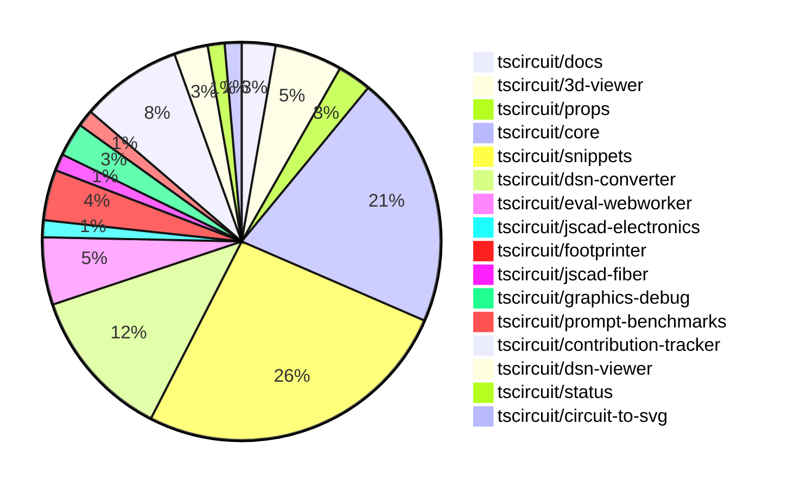

# contribution-tracker

Generates weekly contribution overviews for tscircuit contributors. Check out all
the [contribution overviews here](./contribution-overviews/)

* All PRs in the tscircuit org are scanned/summarized via Claude Haiku
* Claude classifies each Diff/PR as a Major, Minor or Tiny contribution
* All the PRs, summaries, and classifications are organized into charts and tables

The current week is shown below. There are 3 major sections:

* [Contributor Overview](#contributor-overview)
* [PRs by Repository](#prs-by-repository)
* [PRs by Contributor](#changes-by-contributor)

## Current Week

<!-- START_CURRENT_WEEK -->

# Contribution Overview 2024-11-27

## PRs by Repository

## Contributor Overview

| Contributor | 🐳 Major | 🐙 Minor | 🐌 Tiny | ⭐ | Issues Created |
|-------------|---------|---------|---------|-----|----------------|
| [ShiboSoftwareDev](#ShiboSoftwareDev) | 2 | 6 | 3 | ⭐⭐⭐ | 5 |
| [seveibar](#seveibar) | 0 | 5 | 0 | ⭐⭐ | 83 |
| [AnasSarkiz](#AnasSarkiz) | 3 | 8 | 0 | ⭐⭐ | 5 |
| [imrishabh18](#imrishabh18) | 0 | 10 | 1 | ⭐⭐ | 6 |
| [Abse2001](#Abse2001) | 2 | 7 | 0 | ⭐⭐ | 4 |
| [Anshgrover23](#Anshgrover23) | 1 | 8 | 0 | ⭐⭐ | 4 |
| [mrudulpatil18](#mrudulpatil18) | 1 | 7 | 0 | ⭐⭐ | 3 |
| [RohittCodes](#RohittCodes) | 0 | 4 | 0 | ⭐ | 1 |
| [divanshu-go](#divanshu-go) | 1 | 1 | 0 | ⭐ | 0 |
| [Niharika0104](#Niharika0104) | 1 | 0 | 0 | ⭐ | 0 |
| [techmannih](#techmannih) | 0 | 1 | 0 |  | 0 |

## Review Table

| Contributor | Reviews Received | Approvals | Rejections | Changes Requested | PRs Opened | PRs Closed | Issues Created | Bountied Issues | Bountied Issue $ |
|-------------|------------------|-----------|------------|-------------------|------------|------------|----------------|-----------------|------------------|
| [AnasSarkiz](https://github.com/AnasSarkiz) | 24 | 10 | 7 | 4 | 14 | 12 | 5 | 2 | 15 |
| [Niharika0104](https://github.com/Niharika0104) | 1 | 1 | 0 | 0 | 1 | 1 | 0 | 0 | 0 |
| [Abse2001](https://github.com/Abse2001) | 16 | 9 | 1 | 1 | 9 | 9 | 4 | 1 | 15 |
| [seveibar](https://github.com/seveibar) | 1 | 0 | 2 | 0 | 7 | 6 | 83 | 47 | 1,083 |
| [Anshgrover23](https://github.com/Anshgrover23) | 35 | 9 | 5 | 9 | 13 | 13 | 4 | 0 | 0 |
| [mrudulpatil18](https://github.com/mrudulpatil18) | 13 | 8 | 0 | 1 | 9 | 9 | 3 | 0 | 0 |
| [ShiboSoftwareDev](https://github.com/ShiboSoftwareDev) | 19 | 11 | 6 | 2 | 14 | 12 | 5 | 2 | 50 |
| [divanshu-go](https://github.com/divanshu-go) | 4 | 2 | 0 | 1 | 3 | 2 | 0 | 0 | 0 |
| [imrishabh18](https://github.com/imrishabh18) | 4 | 4 | 4 | 0 | 11 | 11 | 6 | 2 | 20 |
| [RohittCodes](https://github.com/RohittCodes) | 14 | 4 | 5 | 5 | 7 | 6 | 1 | 1 | 5 |
| [techmannih](https://github.com/techmannih) | 3 | 1 | 2 | 1 | 3 | 2 | 0 | 0 | 0 |
| [krushnarout](https://github.com/krushnarout) | 4 | 0 | 1 | 2 | 1 | 0 | 0 | 0 | 0 |

## Changes by Repository

### [tscircuit/docs](https://github.com/tscircuit/docs)

| PR # | Impact | Contributor | Description |
|------|--------|-------------|-------------|
| [#40](https://github.com/tscircuit/docs/pull/40) | 🐳 Major | Niharika0104 | Added a new tutorial for creating an AND gate circuit using the XD74LS08 AND chip, including a USB-C connector, push buttons, resistors, and LEDs to demonstrate the circuit's functionality. |
| [#41](https://github.com/tscircuit/docs/pull/41) | 🐙 Minor | Abse2001 | Added an OR-Gate tutorial with a custom hexagonal board design. |

### [tscircuit/3d-viewer](https://github.com/tscircuit/3d-viewer)

| PR # | Impact | Contributor | Description |
|------|--------|-------------|-------------|
| [#52](https://github.com/tscircuit/3d-viewer/pull/52) | 🐳 Major | Abse2001 | Fixed a bug where tooltips were popping up excessively in the 3D viewer. |
| [#50](https://github.com/tscircuit/3d-viewer/pull/50) | 🐳 Major | Abse2001 | Fixed bottom trace between vias not showing and added a test. |
| [#47](https://github.com/tscircuit/3d-viewer/pull/47) | 🐙 Minor | Abse2001 | Fixed misaligned 3D viewer components by updating the tooltip position calculation. |
| [#46](https://github.com/tscircuit/3d-viewer/pull/46) | 🐙 Minor | Abse2001 | Updates the `jscad-electronics` dependency to version `0.0.22` to use the `sot235` in the snippet for the OR gate. |

### [tscircuit/props](https://github.com/tscircuit/props)

| PR # | Impact | Contributor | Description |
|------|--------|-------------|-------------|
| [#110](https://github.com/tscircuit/props/pull/110) | 🐙 Minor | Abse2001 | Added the `schDisplayLabel` prop to the `trace` component. |
| [#109](https://github.com/tscircuit/props/pull/109) | 🐙 Minor | seveibar | Add a new `serverMode` property to the `AutorouterConfig` interface. |

### [tscircuit/core](https://github.com/tscircuit/core)

| PR # | Impact | Contributor | Description |
|------|--------|-------------|-------------|
| [#364](https://github.com/tscircuit/core/pull/364) | 🐳 Major | ShiboSoftwareDev | Adds support for the "rotated_rect" shape in the SmtPad component. |
| [#381](https://github.com/tscircuit/core/pull/381) | 🐙 Minor | Abse2001 | Adds a new prop `schDisplayLabel` to the `<trace />` component and a test for it. |
| [#367](https://github.com/tscircuit/core/pull/367) | 🐙 Minor | Abse2001 | Disables two tests for remote autorouting functionality |
| [#374](https://github.com/tscircuit/core/pull/374) | 🐙 Minor | seveibar | Fix for production issues related to the difference between GET and POST requests for autorouting job creation |
| [#373](https://github.com/tscircuit/core/pull/373) | 🟣 | seveibar |  |
| [#362](https://github.com/tscircuit/core/pull/362) | 🐳 Major | AnasSarkiz | Implemented a new event `renderable:renderLifecycle:anyEvent` to make it easier to listen to renderable events. |
| [#352](https://github.com/tscircuit/core/pull/352) | 🐳 Major | AnasSarkiz | Implemented `getCurrentRenderPhase` and `getRenderGraph` methods for debugging |
| [#379](https://github.com/tscircuit/core/pull/379) | 🐙 Minor | AnasSarkiz | Removed the schematic text logic from the `Jumper.ts` file. |
| [#378](https://github.com/tscircuit/core/pull/378) | 🐙 Minor | AnasSarkiz | Moved the schematic text logic for the manufacturer part number and component name to the `SchematicComponentRenderWithSchematicBoxDimensions` function. |
| [#376](https://github.com/tscircuit/core/pull/376) | 🐙 Minor | AnasSarkiz | Adds a `schematicDisabled` property to the `Circuit` class to skip rendering all schematic components. |
| [#358](https://github.com/tscircuit/core/pull/358) | 🐙 Minor | AnasSarkiz | Updated the footprinter dependency to the newest version |
| [#355](https://github.com/tscircuit/core/pull/355) | 🐙 Minor | mrudulpatil18 | The pull request ensures that the component name passed as a prop takes precedence over the default name from the `useRedLed` hook, and adds a test to verify this behavior. |
| [#369](https://github.com/tscircuit/core/pull/369) | 🐙 Minor | ShiboSoftwareDev | Added a test to check that 90-degree rotation of SMT pads draws normal rectangular shapes. |
| [#368](https://github.com/tscircuit/core/pull/368) | 🐙 Minor | ShiboSoftwareDev | Add a check for 90-degree rotation when drawing rectangular SMT pads. |
| [#363](https://github.com/tscircuit/core/pull/363) | 🐙 Minor | Anshgrover23 | Fix the bundle-size.yml file to run on pull requests from forks. |

### [tscircuit/snippets](https://github.com/tscircuit/snippets)

| PR # | Impact | Contributor | Description |
|------|--------|-------------|-------------|
| [#291](https://github.com/tscircuit/snippets/pull/291) | 🐳 Major | ShiboSoftwareDev | Adds a new GitHub Actions workflow to analyze the bundle size and generate a report for pull requests. |
| [#309](https://github.com/tscircuit/snippets/pull/309) | 🐙 Minor | Abse2001 | Updating the `@tscircuit/core` package from version `0.0.206` to `0.0.208` to fix an issue where components were not rendering when `pcbRotation="90"`. |
| [#325](https://github.com/tscircuit/snippets/pull/325) | 🐙 Minor | seveibar | Update the `@tscircuit/core` dependency version and fix the expand button in the `PreviewContent` component. |
| [#330](https://github.com/tscircuit/snippets/pull/330) | 🐙 Minor | mrudulpatil18 | Added a static skeleton page with fixed data to mimic the normal components and provide a loading state. |
| [#318](https://github.com/tscircuit/snippets/pull/318) | 🐙 Minor | mrudulpatil18 | The pull request adds a Playwright test to verify the behavior of underlined and clickable imports in the editor. |
| [#332](https://github.com/tscircuit/snippets/pull/332) | 🐙 Minor | ShiboSoftwareDev | Fixed test flakiness by using a deterministic port generation instead of random. |
| [#311](https://github.com/tscircuit/snippets/pull/311) | 🐙 Minor | ShiboSoftwareDev | Limit bundle size analysis to only run on dependency changes. |
| [#294](https://github.com/tscircuit/snippets/pull/294) | 🐙 Minor | ShiboSoftwareDev | This pull request adds a comparison of the bundle size between the PR branch and the main branch, and generates a markdown report with the differences. |
| [#317](https://github.com/tscircuit/snippets/pull/317) | 🐙 Minor | Anshgrover23 | Fix Cmd Click functionality for clicking on snippets |
| [#302](https://github.com/tscircuit/snippets/pull/302) | 🐙 Minor | Anshgrover23 | The pull request fixes a bug in the regex used to import names with dashes properly. |
| [#303](https://github.com/tscircuit/snippets/pull/303) | 🐙 Minor | imrishabh18 | Adds a new "Dev Login" page that allows users to log in using their GitHub username. |
| [#298](https://github.com/tscircuit/snippets/pull/298) | 🐙 Minor | imrishabh18 | Fixes an issue with the `auth generate` feature not working when the application is not running on `localhost`. |
| [#338](https://github.com/tscircuit/snippets/pull/338) | 🐙 Minor | techmannih | Fixes an issue where multiple cursors were being created when "ctrl+click" was triggered. |
| [#307](https://github.com/tscircuit/snippets/pull/307) | 🐙 Minor | RohittCodes | Refactor the search links to open in a new tab if the user is on the "/editor" or "/ai" pages, and use a Link component instead of an anchor tag for other pages. |
| [#297](https://github.com/tscircuit/snippets/pull/297) | 🐙 Minor | RohittCodes | Added a timeout and introduced a finally block to handle errors during the rename snippet operation. |
| [#341](https://github.com/tscircuit/snippets/pull/341) | 🐙 Minor | RohittCodes | Increase the timeout for Playwright tests from 5 minutes to 10 minutes. |
| [#285](https://github.com/tscircuit/snippets/pull/285) | 🐙 Minor | RohittCodes | Adds a fullscreen mode toggle to the preview component. |
| [#306](https://github.com/tscircuit/snippets/pull/306) | 🐌 Tiny | ShiboSoftwareDev | Updated the `@tscircuit/3d-viewer` dependency from version `0.0.43` to `0.0.44`. |
| [#304](https://github.com/tscircuit/snippets/pull/304) | 🐌 Tiny | ShiboSoftwareDev | Removed an unused GitHub workflow file. |

### [tscircuit/dsn-converter](https://github.com/tscircuit/dsn-converter)

| PR # | Impact | Contributor | Description |
|------|--------|-------------|-------------|
| [#39](https://github.com/tscircuit/dsn-converter/pull/39) | 🐙 Minor | seveibar | Correctly size plated holes for homogenous components |
| [#49](https://github.com/tscircuit/dsn-converter/pull/49) | 🐙 Minor | imrishabh18 | Fix the position of pads in the `registry-api` traces |
| [#47](https://github.com/tscircuit/dsn-converter/pull/47) | 🐙 Minor | imrishabh18 | Add support for pill-shaped plated holes |
| [#46](https://github.com/tscircuit/dsn-converter/pull/46) | 🐙 Minor | imrishabh18 | Fixes handling of plated holes with different sizes by grouping them by dimensions and creating separate components for each size. |
| [#45](https://github.com/tscircuit/dsn-converter/pull/45) | 🐙 Minor | imrishabh18 | Removes the processing of chip components from the `convertCircuitJsonToDsnJson` function. |
| [#43](https://github.com/tscircuit/dsn-converter/pull/43) | 🐙 Minor | imrishabh18 | Removes hardcoded size of smtpads and uses the default trace width of circuit json |
| [#38](https://github.com/tscircuit/dsn-converter/pull/38) | 🐙 Minor | imrishabh18 | Adds the `from_layer` and `to_layer` properties to the output object in the `convert-via-to-pcb-via.ts` file. |
| [#37](https://github.com/tscircuit/dsn-converter/pull/37) | 🐙 Minor | imrishabh18 | Add the via's and test to check the via's are present |
| [#36](https://github.com/tscircuit/dsn-converter/pull/36) | 🐙 Minor | imrishabh18 | Adds support for handling circle shapes in the DSN to circuit JSON conversion process. |

### [tscircuit/eval-webworker](https://github.com/tscircuit/eval-webworker)

| PR # | Impact | Contributor | Description |
|------|--------|-------------|-------------|
| [#6](https://github.com/tscircuit/eval-webworker/pull/6) | 🐳 Major | mrudulpatil18 | This pull request re-emits all events from the circuit web worker to the client, allowing for better event handling and monitoring. |
| [#5](https://github.com/tscircuit/eval-webworker/pull/5) | 🐙 Minor | seveibar | Add GitHub Actions workflows for formatting, testing, and type-checking the project. |
| [#10](https://github.com/tscircuit/eval-webworker/pull/10) | 🐙 Minor | mrudulpatil18 | Configure the build process to generate declaration files |
| [#8](https://github.com/tscircuit/eval-webworker/pull/8) | 🐙 Minor | mrudulpatil18 | Adds a build step before the release process. |

### [tscircuit/jscad-electronics](https://github.com/tscircuit/jscad-electronics)

| PR # | Impact | Contributor | Description |
|------|--------|-------------|-------------|
| [#81](https://github.com/tscircuit/jscad-electronics/pull/81) | 🐳 Major | AnasSarkiz | Implemented the `SOT235` (SOT-23-5) 3D component and added an example for the Footprinter3d component. |

### [tscircuit/footprinter](https://github.com/tscircuit/footprinter)

| PR # | Impact | Contributor | Description |
|------|--------|-------------|-------------|
| [#92](https://github.com/tscircuit/footprinter/pull/92) | 🐙 Minor | AnasSarkiz | Added default values of 2 for top and bottom properties in stampboard and stampreceiver components |
| [#87](https://github.com/tscircuit/footprinter/pull/87) | 🐙 Minor | AnasSarkiz | Rearranged the pins of the SOT23-5 (sot235) package to match the data sheet in an anti-clockwise direction. |
| [#86](https://github.com/tscircuit/footprinter/pull/86) | 🐙 Minor | AnasSarkiz | Refactor Stampboard and Stampreceiver functions to separate SMD pads and holes into individual pins. |

### [tscircuit/jscad-fiber](https://github.com/tscircuit/jscad-fiber)

| PR # | Impact | Contributor | Description |
|------|--------|-------------|-------------|
| [#95](https://github.com/tscircuit/jscad-fiber/pull/95) | 🐙 Minor | AnasSarkiz | Improves the usage documentation by adding examples of each component in the README. |

### [tscircuit/graphics-debug](https://github.com/tscircuit/graphics-debug)

| PR # | Impact | Contributor | Description |
|------|--------|-------------|-------------|
| [#8](https://github.com/tscircuit/graphics-debug/pull/8) | 🐙 Minor | mrudulpatil18 | Fixes an issue with handling CDATA from SVGs when using `dangerouslySetInnerHTML` on the website. |
| [#7](https://github.com/tscircuit/graphics-debug/pull/7) | 🐙 Minor | mrudulpatil18 | Added a "See Example" button to load sample graphics data in the input element for visualization. |

### [tscircuit/prompt-benchmarks](https://github.com/tscircuit/prompt-benchmarks)

| PR # | Impact | Contributor | Description |
|------|--------|-------------|-------------|
| [#8](https://github.com/tscircuit/prompt-benchmarks/pull/8) | 🐙 Minor | ShiboSoftwareDev | The pull request adds new benchmark problems for creating circuits using AI, including a 555 timer with a blinking LED, an LED driver circuit using a transistor, an RC low-pass filter, and an astable multivibrator circuit. |

### [tscircuit/contribution-tracker](https://github.com/tscircuit/contribution-tracker)

| PR # | Impact | Contributor | Description |
|------|--------|-------------|-------------|
| [#17](https://github.com/tscircuit/contribution-tracker/pull/17) | 🐳 Major | Anshgrover23 | The pull request adds functionality to detect the number of issues created that have a bounty. |
| [#20](https://github.com/tscircuit/contribution-tracker/pull/20) | 🐙 Minor | Anshgrover23 | Adds the number of issues created by each contributor as a star factor. |
| [#13](https://github.com/tscircuit/contribution-tracker/pull/13) | 🐙 Minor | Anshgrover23 | Fix the review table in the markdown generated for the project. |
| [#11](https://github.com/tscircuit/contribution-tracker/pull/11) | 🐙 Minor | Anshgrover23 | Fixes issues with the review table, including adding a column for "Issues Created" and formatting the table correctly. |
| [#14](https://github.com/tscircuit/contribution-tracker/pull/14) | 🐌 Tiny | ShiboSoftwareDev | Fixed the formatting of the review table in the markdown file. |
| [#12](https://github.com/tscircuit/contribution-tracker/pull/12) | 🐌 Tiny | imrishabh18 | Reverts the "Fix review table" pull request (tscircuit/contribution-tracker#11) |

### [tscircuit/dsn-viewer](https://github.com/tscircuit/dsn-viewer)

| PR # | Impact | Contributor | Description |
|------|--------|-------------|-------------|
| [#7](https://github.com/tscircuit/dsn-viewer/pull/7) | 🐳 Major | divanshu-go | Adds support for multiple file uploads and handling of both DSN PCB and session files. |
| [#8](https://github.com/tscircuit/dsn-viewer/pull/8) | 🐙 Minor | Anshgrover23 | Set up a basic Playwright test suite for the project |

### [tscircuit/status](https://github.com/tscircuit/status)

| PR # | Impact | Contributor | Description |
|------|--------|-------------|-------------|
| [#3](https://github.com/tscircuit/status/pull/3) | 🐙 Minor | Anshgrover23 | Fix bars getting cut off in the UI |

### [tscircuit/circuit-to-svg](https://github.com/tscircuit/circuit-to-svg)

| PR # | Impact | Contributor | Description |
|------|--------|-------------|-------------|
| [#140](https://github.com/tscircuit/circuit-to-svg/pull/140) | 🐙 Minor | divanshu-go | Adds a GitHub workflow to calculate and report the bundle and install size differences between the base and pull request branches. |

## Changes by Contributor

### [Niharika0104](https://github.com/Niharika0104)

| PR # | Impact | Description |
|------|--------|-------------|
| [#40](https://github.com/tscircuit/docs/pull/40) | 🐳 Major | Added a new tutorial for creating an AND gate circuit using the XD74LS08 AND chip, including a USB-C connector, push buttons, resistors, and LEDs to demonstrate the circuit's functionality. |

### [Abse2001](https://github.com/Abse2001)

| PR # | Impact | Description |
|------|--------|-------------|
| [#52](https://github.com/tscircuit/3d-viewer/pull/52) | 🐳 Major | Fixed a bug where tooltips were popping up excessively in the 3D viewer. |
| [#50](https://github.com/tscircuit/3d-viewer/pull/50) | 🐳 Major | Fixed bottom trace between vias not showing and added a test. |
| [#41](https://github.com/tscircuit/docs/pull/41) | 🐙 Minor | Added an OR-Gate tutorial with a custom hexagonal board design. |
| [#110](https://github.com/tscircuit/props/pull/110) | 🐙 Minor | Added the `schDisplayLabel` prop to the `trace` component. |
| [#47](https://github.com/tscircuit/3d-viewer/pull/47) | 🐙 Minor | Fixed misaligned 3D viewer components by updating the tooltip position calculation. |
| [#46](https://github.com/tscircuit/3d-viewer/pull/46) | 🐙 Minor | Updates the `jscad-electronics` dependency to version `0.0.22` to use the `sot235` in the snippet for the OR gate. |
| [#381](https://github.com/tscircuit/core/pull/381) | 🐙 Minor | Adds a new prop `schDisplayLabel` to the `<trace />` component and a test for it. |
| [#367](https://github.com/tscircuit/core/pull/367) | 🐙 Minor | Disables two tests for remote autorouting functionality |
| [#309](https://github.com/tscircuit/snippets/pull/309) | 🐙 Minor | Updating the `@tscircuit/core` package from version `0.0.206` to `0.0.208` to fix an issue where components were not rendering when `pcbRotation="90"`. |

### [seveibar](https://github.com/seveibar)

| PR # | Impact | Description |
|------|--------|-------------|
| [#109](https://github.com/tscircuit/props/pull/109) | 🐙 Minor | Add a new `serverMode` property to the `AutorouterConfig` interface. |
| [#374](https://github.com/tscircuit/core/pull/374) | 🐙 Minor | Fix for production issues related to the difference between GET and POST requests for autorouting job creation |
| [#373](https://github.com/tscircuit/core/pull/373) | 🟣 |  |
| [#39](https://github.com/tscircuit/dsn-converter/pull/39) | 🐙 Minor | Correctly size plated holes for homogenous components |
| [#325](https://github.com/tscircuit/snippets/pull/325) | 🐙 Minor | Update the `@tscircuit/core` dependency version and fix the expand button in the `PreviewContent` component. |
| [#5](https://github.com/tscircuit/eval-webworker/pull/5) | 🐙 Minor | Add GitHub Actions workflows for formatting, testing, and type-checking the project. |

### [AnasSarkiz](https://github.com/AnasSarkiz)

| PR # | Impact | Description |
|------|--------|-------------|
| [#362](https://github.com/tscircuit/core/pull/362) | 🐳 Major | Implemented a new event `renderable:renderLifecycle:anyEvent` to make it easier to listen to renderable events. |
| [#352](https://github.com/tscircuit/core/pull/352) | 🐳 Major | Implemented `getCurrentRenderPhase` and `getRenderGraph` methods for debugging |
| [#81](https://github.com/tscircuit/jscad-electronics/pull/81) | 🐳 Major | Implemented the `SOT235` (SOT-23-5) 3D component and added an example for the Footprinter3d component. |
| [#92](https://github.com/tscircuit/footprinter/pull/92) | 🐙 Minor | Added default values of 2 for top and bottom properties in stampboard and stampreceiver components |
| [#87](https://github.com/tscircuit/footprinter/pull/87) | 🐙 Minor | Rearranged the pins of the SOT23-5 (sot235) package to match the data sheet in an anti-clockwise direction. |
| [#86](https://github.com/tscircuit/footprinter/pull/86) | 🐙 Minor | Refactor Stampboard and Stampreceiver functions to separate SMD pads and holes into individual pins. |
| [#379](https://github.com/tscircuit/core/pull/379) | 🐙 Minor | Removed the schematic text logic from the `Jumper.ts` file. |
| [#378](https://github.com/tscircuit/core/pull/378) | 🐙 Minor | Moved the schematic text logic for the manufacturer part number and component name to the `SchematicComponentRenderWithSchematicBoxDimensions` function. |
| [#376](https://github.com/tscircuit/core/pull/376) | 🐙 Minor | Adds a `schematicDisabled` property to the `Circuit` class to skip rendering all schematic components. |
| [#358](https://github.com/tscircuit/core/pull/358) | 🐙 Minor | Updated the footprinter dependency to the newest version |
| [#95](https://github.com/tscircuit/jscad-fiber/pull/95) | 🐙 Minor | Improves the usage documentation by adding examples of each component in the README. |

### [mrudulpatil18](https://github.com/mrudulpatil18)

| PR # | Impact | Description |
|------|--------|-------------|
| [#6](https://github.com/tscircuit/eval-webworker/pull/6) | 🐳 Major | This pull request re-emits all events from the circuit web worker to the client, allowing for better event handling and monitoring. |
| [#355](https://github.com/tscircuit/core/pull/355) | 🐙 Minor | The pull request ensures that the component name passed as a prop takes precedence over the default name from the `useRedLed` hook, and adds a test to verify this behavior. |
| [#330](https://github.com/tscircuit/snippets/pull/330) | 🐙 Minor | Added a static skeleton page with fixed data to mimic the normal components and provide a loading state. |
| [#318](https://github.com/tscircuit/snippets/pull/318) | 🐙 Minor | The pull request adds a Playwright test to verify the behavior of underlined and clickable imports in the editor. |
| [#8](https://github.com/tscircuit/graphics-debug/pull/8) | 🐙 Minor | Fixes an issue with handling CDATA from SVGs when using `dangerouslySetInnerHTML` on the website. |
| [#7](https://github.com/tscircuit/graphics-debug/pull/7) | 🐙 Minor | Added a "See Example" button to load sample graphics data in the input element for visualization. |
| [#10](https://github.com/tscircuit/eval-webworker/pull/10) | 🐙 Minor | Configure the build process to generate declaration files |
| [#8](https://github.com/tscircuit/eval-webworker/pull/8) | 🐙 Minor | Adds a build step before the release process. |

### [ShiboSoftwareDev](https://github.com/ShiboSoftwareDev)

| PR # | Impact | Description |
|------|--------|-------------|
| [#364](https://github.com/tscircuit/core/pull/364) | 🐳 Major | Adds support for the "rotated_rect" shape in the SmtPad component. |
| [#291](https://github.com/tscircuit/snippets/pull/291) | 🐳 Major | Adds a new GitHub Actions workflow to analyze the bundle size and generate a report for pull requests. |
| [#369](https://github.com/tscircuit/core/pull/369) | 🐙 Minor | Added a test to check that 90-degree rotation of SMT pads draws normal rectangular shapes. |
| [#368](https://github.com/tscircuit/core/pull/368) | 🐙 Minor | Add a check for 90-degree rotation when drawing rectangular SMT pads. |
| [#332](https://github.com/tscircuit/snippets/pull/332) | 🐙 Minor | Fixed test flakiness by using a deterministic port generation instead of random. |
| [#311](https://github.com/tscircuit/snippets/pull/311) | 🐙 Minor | Limit bundle size analysis to only run on dependency changes. |
| [#294](https://github.com/tscircuit/snippets/pull/294) | 🐙 Minor | This pull request adds a comparison of the bundle size between the PR branch and the main branch, and generates a markdown report with the differences. |
| [#8](https://github.com/tscircuit/prompt-benchmarks/pull/8) | 🐙 Minor | The pull request adds new benchmark problems for creating circuits using AI, including a 555 timer with a blinking LED, an LED driver circuit using a transistor, an RC low-pass filter, and an astable multivibrator circuit. |
| [#14](https://github.com/tscircuit/contribution-tracker/pull/14) | 🐌 Tiny | Fixed the formatting of the review table in the markdown file. |
| [#306](https://github.com/tscircuit/snippets/pull/306) | 🐌 Tiny | Updated the `@tscircuit/3d-viewer` dependency from version `0.0.43` to `0.0.44`. |
| [#304](https://github.com/tscircuit/snippets/pull/304) | 🐌 Tiny | Removed an unused GitHub workflow file. |

### [Anshgrover23](https://github.com/Anshgrover23)

| PR # | Impact | Description |
|------|--------|-------------|
| [#17](https://github.com/tscircuit/contribution-tracker/pull/17) | 🐳 Major | The pull request adds functionality to detect the number of issues created that have a bounty. |
| [#363](https://github.com/tscircuit/core/pull/363) | 🐙 Minor | Fix the bundle-size.yml file to run on pull requests from forks. |
| [#20](https://github.com/tscircuit/contribution-tracker/pull/20) | 🐙 Minor | Adds the number of issues created by each contributor as a star factor. |
| [#13](https://github.com/tscircuit/contribution-tracker/pull/13) | 🐙 Minor | Fix the review table in the markdown generated for the project. |
| [#11](https://github.com/tscircuit/contribution-tracker/pull/11) | 🐙 Minor | Fixes issues with the review table, including adding a column for "Issues Created" and formatting the table correctly. |
| [#317](https://github.com/tscircuit/snippets/pull/317) | 🐙 Minor | Fix Cmd Click functionality for clicking on snippets |
| [#302](https://github.com/tscircuit/snippets/pull/302) | 🐙 Minor | The pull request fixes a bug in the regex used to import names with dashes properly. |
| [#8](https://github.com/tscircuit/dsn-viewer/pull/8) | 🐙 Minor | Set up a basic Playwright test suite for the project |
| [#3](https://github.com/tscircuit/status/pull/3) | 🐙 Minor | Fix bars getting cut off in the UI |

### [imrishabh18](https://github.com/imrishabh18)

| PR # | Impact | Description |
|------|--------|-------------|
| [#49](https://github.com/tscircuit/dsn-converter/pull/49) | 🐙 Minor | Fix the position of pads in the `registry-api` traces |
| [#47](https://github.com/tscircuit/dsn-converter/pull/47) | 🐙 Minor | Add support for pill-shaped plated holes |
| [#46](https://github.com/tscircuit/dsn-converter/pull/46) | 🐙 Minor | Fixes handling of plated holes with different sizes by grouping them by dimensions and creating separate components for each size. |
| [#45](https://github.com/tscircuit/dsn-converter/pull/45) | 🐙 Minor | Removes the processing of chip components from the `convertCircuitJsonToDsnJson` function. |
| [#43](https://github.com/tscircuit/dsn-converter/pull/43) | 🐙 Minor | Removes hardcoded size of smtpads and uses the default trace width of circuit json |
| [#38](https://github.com/tscircuit/dsn-converter/pull/38) | 🐙 Minor | Adds the `from_layer` and `to_layer` properties to the output object in the `convert-via-to-pcb-via.ts` file. |
| [#37](https://github.com/tscircuit/dsn-converter/pull/37) | 🐙 Minor | Add the via's and test to check the via's are present |
| [#36](https://github.com/tscircuit/dsn-converter/pull/36) | 🐙 Minor | Adds support for handling circle shapes in the DSN to circuit JSON conversion process. |
| [#303](https://github.com/tscircuit/snippets/pull/303) | 🐙 Minor | Adds a new "Dev Login" page that allows users to log in using their GitHub username. |
| [#298](https://github.com/tscircuit/snippets/pull/298) | 🐙 Minor | Fixes an issue with the `auth generate` feature not working when the application is not running on `localhost`. |
| [#12](https://github.com/tscircuit/contribution-tracker/pull/12) | 🐌 Tiny | Reverts the "Fix review table" pull request (tscircuit/contribution-tracker#11) |

### [divanshu-go](https://github.com/divanshu-go)

| PR # | Impact | Description |
|------|--------|-------------|
| [#7](https://github.com/tscircuit/dsn-viewer/pull/7) | 🐳 Major | Adds support for multiple file uploads and handling of both DSN PCB and session files. |
| [#140](https://github.com/tscircuit/circuit-to-svg/pull/140) | 🐙 Minor | Adds a GitHub workflow to calculate and report the bundle and install size differences between the base and pull request branches. |

### [techmannih](https://github.com/techmannih)

| PR # | Impact | Description |
|------|--------|-------------|
| [#338](https://github.com/tscircuit/snippets/pull/338) | 🐙 Minor | Fixes an issue where multiple cursors were being created when "ctrl+click" was triggered. |

### [RohittCodes](https://github.com/RohittCodes)

| PR # | Impact | Description |
|------|--------|-------------|
| [#307](https://github.com/tscircuit/snippets/pull/307) | 🐙 Minor | Refactor the search links to open in a new tab if the user is on the "/editor" or "/ai" pages, and use a Link component instead of an anchor tag for other pages. |
| [#297](https://github.com/tscircuit/snippets/pull/297) | 🐙 Minor | Added a timeout and introduced a finally block to handle errors during the rename snippet operation. |
| [#341](https://github.com/tscircuit/snippets/pull/341) | 🐙 Minor | Increase the timeout for Playwright tests from 5 minutes to 10 minutes. |
| [#285](https://github.com/tscircuit/snippets/pull/285) | 🐙 Minor | Adds a fullscreen mode toggle to the preview component. |

<!-- END_CURRENT_WEEK -->
