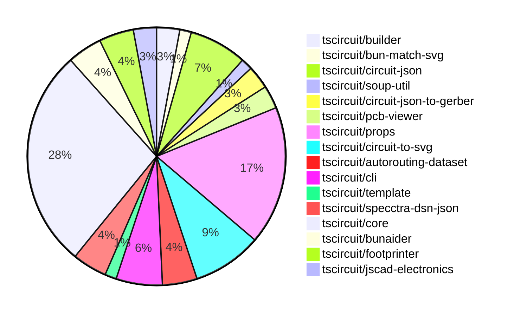

# contribution-tracker

Generates weekly contribution overviews for tscircuit contributors. Check out all
the [contribution overviews here](./contribution-overviews/)

* All PRs in the tscircuit org are scanned/summarized via Claude Haiku
* Claude classifies each Diff/PR as a Major, Minor or Tiny contribution
* All the PRs, summaries, and classifications are organized into charts and tables

The current week is shown below. There are 3 major sections:

* [Contributor Overview](#contributor-overview)
* [PRs by Repository](#prs-by-repository)
* [PRs by Contributor](#changes-by-contributor)

## Current Week

<!-- START_CURRENT_WEEK -->

# Contribution Overview 2024-08-31

## PRs by Repository

## Contributor Overview

| Contributor | 🐳 Major | 🐙 Minor | 🐌 Tiny |
|-------------|-------|-------|-------|
| ShiboSoftwareDev | 3 | 3 | 1 |
| imrishabh18 | 9 | 4 | 0 |
| seveibar | 32 | 8 | 0 |
| tscircuitbot | 0 | 3 | 0 |
| anas-sarkez | 2 | 0 | 0 |
| andrii-balitskyi | 1 | 0 | 0 |
| abhijitxy | 1 | 1 | 0 |

## Changes by Repository

### [tscircuit/builder](https://github.com/tscircuit/builder)

| PR # | Impact | Contributor | Description |
|------|--------|-------------|-------------|
| [#107](https://github.com/tscircuit/builder/pull/107) | 🐳 Major | ShiboSoftwareDev | Changed the `convertSoupToExcellonDrillCommands` function to use metric units instead of inches. |
| [#106](https://github.com/tscircuit/builder/pull/106) | 🐳 Major | ShiboSoftwareDev | Add support for board outline in Gerber format |

### [tscircuit/bun-match-svg](https://github.com/tscircuit/bun-match-svg)

| PR # | Impact | Contributor | Description |
|------|--------|-------------|-------------|
| [#2](https://github.com/tscircuit/bun-match-svg/pull/2) | 🐳 Major | ShiboSoftwareDev | Added a new custom matcher `toMatchMultipleSvgSnapshots` to handle testing multiple SVG snapshots. |

### [tscircuit/circuit-json](https://github.com/tscircuit/circuit-json)

| PR # | Impact | Contributor | Description |
|------|--------|-------------|-------------|
| [#35](https://github.com/tscircuit/circuit-json/pull/35) | 🐳 Major | imrishabh18 | Add a new `pcb_keepout` type to the `any_soup_element` and define the schema for both rectangle and circle shapes. |
| [#39](https://github.com/tscircuit/circuit-json/pull/39) | 🐳 Major | seveibar | Implement `pcb_hole_id` and add typechecking to CI |
| [#32](https://github.com/tscircuit/circuit-json/pull/32) | 🐙 Minor | ShiboSoftwareDev | Changed the type of the "layer" field in the "pcb_trace" schema from a string to a "layer_ref" type. |
| [#37](https://github.com/tscircuit/circuit-json/pull/37) | 🐙 Minor | tscircuitbot | Add a new field `pcb_plated_hole_id` to the PCB plated hole object schema. |
| [#34](https://github.com/tscircuit/circuit-json/pull/34) | 🐌 Tiny | ShiboSoftwareDev | Fixed the import source for `layer_ref` in `pcb_trace.ts`. |

### [tscircuit/soup-util](https://github.com/tscircuit/soup-util)

| PR # | Impact | Contributor | Description |
|------|--------|-------------|-------------|
| [#10](https://github.com/tscircuit/soup-util/pull/10) | 🐙 Minor | ShiboSoftwareDev | Update the version of the `@tscircuit/soup` dependency to a specific version `^0.0.66`. |

### [tscircuit/circuit-json-to-gerber](https://github.com/tscircuit/circuit-json-to-gerber)

| PR # | Impact | Contributor | Description |
|------|--------|-------------|-------------|
| [#5](https://github.com/tscircuit/circuit-json-to-gerber/pull/5) | 🐳 Major | anas-sarkez | Fix a bug related to multilayer SVG gerber layers |
| [#4](https://github.com/tscircuit/circuit-json-to-gerber/pull/4) | 🐙 Minor | ShiboSoftwareDev | Update package dependencies and fix type imports |

### [tscircuit/pcb-viewer](https://github.com/tscircuit/pcb-viewer)

| PR # | Impact | Contributor | Description |
|------|--------|-------------|-------------|
| [#45](https://github.com/tscircuit/pcb-viewer/pull/45) | 🐳 Major | imrishabh18 | Introduce a new feature to draw a mesh pattern fill for PCB elements like rectangles and circles. |
| [#44](https://github.com/tscircuit/pcb-viewer/pull/44) | 🐳 Major | imrishabh18 | Fix trace rendering when the `route_thickness_mode` is set to `constant`. |

### [tscircuit/props](https://github.com/tscircuit/props)

| PR # | Impact | Contributor | Description |
|------|--------|-------------|-------------|
| [#41](https://github.com/tscircuit/props/pull/41) | 🐳 Major | imrishabh18 | Introduce a new `pcbKeepoutProps` type to support circular and rectangular keepout areas in PCB layouts. |
| [#47](https://github.com/tscircuit/props/pull/47) | 🐳 Major | seveibar | Improve Hole Props, allow specifying radius, infer diameter in every case |
| [#44](https://github.com/tscircuit/props/pull/44) | 🐳 Major | seveibar | Introduce optional constraint properties to clarify the application of constraints, such as `edgeToEdge`, `centerToCenter`, and additional positional properties. |
| [#42](https://github.com/tscircuit/props/pull/42) | 🐳 Major | seveibar | Refactor chip component to use new type pattern, add ConstrainedLayout and Constraint components |
| [#39](https://github.com/tscircuit/props/pull/39) | 🐳 Major | seveibar | Introduce subcircuit group props |
| [#38](https://github.com/tscircuit/props/pull/38) | 🐳 Major | seveibar | Introduce a new component called "net" with a defined set of properties. |
| [#37](https://github.com/tscircuit/props/pull/37) | 🐳 Major | seveibar | Refactor group props by moving them to a separate file and using Zod for type validation. |
| [#36](https://github.com/tscircuit/props/pull/36) | 🐳 Major | seveibar | Add schematic direction and port arrangement properties to the jumper component. |
| [#35](https://github.com/tscircuit/props/pull/35) | 🐳 Major | seveibar | Refactor the codebase to better define props, split out capacitor and resistor, add jumper, and add pullupFor and decouplingFor properties. |
| [#46](https://github.com/tscircuit/props/pull/46) | 🐙 Minor | seveibar | Make `pcbX` and `pcbY` optional for `pcbLayoutProps` in the `layout.ts` file. |
| [#45](https://github.com/tscircuit/props/pull/45) | 🐙 Minor | seveibar | Refactor and fix requirements for PCB SMT pad |
| [#43](https://github.com/tscircuit/props/pull/43) | 🐙 Minor | seveibar | Remove legacy constraint props |

### [tscircuit/circuit-to-svg](https://github.com/tscircuit/circuit-to-svg)

| PR # | Impact | Contributor | Description |
|------|--------|-------------|-------------|
| [#43](https://github.com/tscircuit/circuit-to-svg/pull/43) | 🐳 Major | imrishabh18 | Modify the `createPcbTrace` function to create smooth traces by adding rounded corners. |
| [#39](https://github.com/tscircuit/circuit-to-svg/pull/39) | 🐳 Major | imrishabh18 | Fix the colors and appearance of the PCB silkscreen |
| [#38](https://github.com/tscircuit/circuit-to-svg/pull/38) | 🐳 Major | imrishabh18 | Fixes the appearance of plated holes and standardizes the color usage in the PCB SVG rendering. |
| [#28](https://github.com/tscircuit/circuit-to-svg/pull/28) | 🐳 Major | imrishabh18 | Fix/update schematic symbols attributes to correctly render the SVG representation. |
| [#44](https://github.com/tscircuit/circuit-to-svg/pull/44) | 🐙 Minor | imrishabh18 | Moved the silkscreen layer to the topmost position in the SVG hierarchy. |
| [#34](https://github.com/tscircuit/circuit-to-svg/pull/34) | 🐙 Minor | imrishabh18 | Renaming files from "pcb-soup-to-svg.ts" to "circuit-to-pcb-svg.ts" and "soup-to-svg.ts" to "circuit-to-schematic-svg.ts" |

### [tscircuit/autorouting-dataset](https://github.com/tscircuit/autorouting-dataset)

| PR # | Impact | Contributor | Description |
|------|--------|-------------|-------------|
| [#40](https://github.com/tscircuit/autorouting-dataset/pull/40) | 🐳 Major | imrishabh18 | Add PCB keepout areas as obstacles |
| [#41](https://github.com/tscircuit/autorouting-dataset/pull/41) | 🐳 Major | seveibar | Create a new GitHub Actions workflow to publish the `@tscircuit/infgrid-ijump-astar` package to npm. |
| [#39](https://github.com/tscircuit/autorouting-dataset/pull/39) | 🐳 Major | seveibar | Add support for PCB trace obstacles in dataset autorouting |

### [tscircuit/cli](https://github.com/tscircuit/cli)

| PR # | Impact | Contributor | Description |
|------|--------|-------------|-------------|
| [#155](https://github.com/tscircuit/cli/pull/155) | 🐳 Major | seveibar | Fix custom keyboard, fix errors from entrypoint, progress on switch shaft, and core updates enabling switch shaft to render. |
| [#149](https://github.com/tscircuit/cli/pull/149) | 🐳 Major | seveibar | Update the test.yml workflow to use the --no-core option instead of --core, and update the soupify-and-upload-example-file.ts and soupify.ts files to use the --no-core option instead of --core. |
| [#142](https://github.com/tscircuit/cli/pull/142) | 🐙 Minor | imrishabh18 | Fix the import path for MyCircuit in the example file. |
| [#144](https://github.com/tscircuit/cli/pull/144) | 🐙 Minor | seveibar | Fix the `dev:test-project` command in the `package.json` file. |

### [tscircuit/template](https://github.com/tscircuit/template)

| PR # | Impact | Contributor | Description |
|------|--------|-------------|-------------|
| [#3](https://github.com/tscircuit/template/pull/3) | 🐙 Minor | imrishabh18 | Fix a bug in the CLI by updating the import path for `MyCircuit` component |

### [tscircuit/specctra-dsn-json](https://github.com/tscircuit/specctra-dsn-json)

| PR # | Impact | Contributor | Description |
|------|--------|-------------|-------------|
| [#13](https://github.com/tscircuit/specctra-dsn-json/pull/13) | 🐳 Major | seveibar | This pull request adds a GitHub Actions workflow for running Bun tests and a workflow for type checking the project. |
| [#11](https://github.com/tscircuit/specctra-dsn-json/pull/11) | 🐳 Major | andrii-balitskyi | Update the code to convert the DSN `via` element to the soup format. |
| [#12](https://github.com/tscircuit/specctra-dsn-json/pull/12) | 🟣 | andrii-balitskyi | Convert test suite to bun:test |

### [tscircuit/core](https://github.com/tscircuit/core)

| PR # | Impact | Contributor | Description |
|------|--------|-------------|-------------|
| [#44](https://github.com/tscircuit/core/pull/44) | 🐳 Major | seveibar | Adds the Diode component to the index.ts file and includes a snapshot test for the Diode component's SVG rendering. |
| [#41](https://github.com/tscircuit/core/pull/41) | 🐳 Major | seveibar | Various fixes for constraint and layout calculation |
| [#36](https://github.com/tscircuit/core/pull/36) | 🐳 Major | seveibar | Implement `sameX` and `sameY` constraints, refactor constraint reference code in preparation for edge selectors. |
| [#35](https://github.com/tscircuit/core/pull/35) | 🐳 Major | seveibar | The pull request adds support for constraining holes, implements type checking on CI, adds constraint solving for the `ydist` constraint, and fixes an issue with the `edgeToEdge` constraint. |
| [#34](https://github.com/tscircuit/core/pull/34) | 🐳 Major | seveibar | Implement the Hole and pcb_hole rendering components |
| [#33](https://github.com/tscircuit/core/pull/33) | 🐳 Major | seveibar | Introduce a new component called "PrimitiveContainers" and make changes to the existing components to support it. |
| [#32](https://github.com/tscircuit/core/pull/32) | 🐳 Major | seveibar | Refactor the Project class to use the "firstChild" property instead of "rootComponent", implement the InitializePortsFromChildren render phase, and fix the footprint port initialization. |
| [#31](https://github.com/tscircuit/core/pull/31) | 🐳 Major | seveibar | The pull request correctly computes the size of PCB components by examining their child primitives and updating the database with the correct width and height. |
| [#30](https://github.com/tscircuit/core/pull/30) | 🐳 Major | seveibar | Fix manual placements not moving SMT pads (or any children) |
| [#29](https://github.com/tscircuit/core/pull/29) | 🐳 Major | seveibar | Implement a feature to allow manual placements of PCB components within a subcircuit. |
| [#28](https://github.com/tscircuit/core/pull/28) | 🐳 Major | seveibar | Improve the autorouter's same-net detection and create nets from properties. |
| [#26](https://github.com/tscircuit/core/pull/26) | 🐳 Major | seveibar | Adds support for creating nets from component properties, introduces a new render phase for routing net islands, and renames "OpaqueGroup" to "Subcircuit". |
| [#21](https://github.com/tscircuit/core/pull/21) | 🐳 Major | seveibar | Add a GitHub Actions workflow to automatically respond to pull request reviews and run the `bunaider` tool to fix the issues. |
| [#20](https://github.com/tscircuit/core/pull/20) | 🐳 Major | seveibar | Introduce opaque groups, rename Project to Circuit, add pullupFor, pullupTo, decouplingTo and decouplingFor props to components |
| [#18](https://github.com/tscircuit/core/pull/18) | 🐳 Major | seveibar | Fix trace overlapping, rotation issues for SMTPads and SilkscreenPaths, and adjust rotation for jumper. |
| [#16](https://github.com/tscircuit/core/pull/16) | 🐳 Major | seveibar | Add support for rendering PCB plated holes. |
| [#15](https://github.com/tscircuit/core/pull/15) | 🐳 Major | seveibar | Adds support for jumper components, fixes chip pinLabel selectors, and introduces new features like Resistor.pullup, Capacitor.decoupling, and Silkscreen drawings. |
| [#27](https://github.com/tscircuit/core/pull/27) | 🐙 Minor | seveibar | Upgrade the `circuit-to-svg` library to version `0.0.18` to improve the snapshot images. |
| [#23](https://github.com/tscircuit/core/pull/23) | 🐙 Minor | seveibar | Expand the GitHub Actions workflow to support tagging with 'bunaider' in addition to 'aider'. |

### [tscircuit/bunaider](https://github.com/tscircuit/bunaider)

| PR # | Impact | Contributor | Description |
|------|--------|-------------|-------------|
| [#16](https://github.com/tscircuit/bunaider/pull/16) | 🐳 Major | seveibar | Adds support for automatically adding context files (TypeScript/TSX files and README.md) to the `aider` command. |
| [#15](https://github.com/tscircuit/bunaider/pull/15) | 🐙 Minor | tscircuitbot | Automatically add TypeScript files to the context (unless they're inside .aiderignore), and add the README.md file. |
| [#14](https://github.com/tscircuit/bunaider/pull/14) | 🐙 Minor | tscircuitbot | Fix for issue #12 by automatically generating the pull request title based on the issue title |

### [tscircuit/footprinter](https://github.com/tscircuit/footprinter)

| PR # | Impact | Contributor | Description |
|------|--------|-------------|-------------|
| [#29](https://github.com/tscircuit/footprinter/pull/29) | 🐳 Major | anas-sarkez | Add silkscreen for all passive-fn components (e.g., 0402, 0603) and add a plus sign property and silkscreen. |
| [#30](https://github.com/tscircuit/footprinter/pull/30) | 🐙 Minor | seveibar | Reverts the previous change to add silkscreen for passive components and a positive sign for polarized components. |
| [#28](https://github.com/tscircuit/footprinter/pull/28) | 🐙 Minor | seveibar | Update `circuit-to-svg` dependency to fix snapshots |

### [tscircuit/jscad-electronics](https://github.com/tscircuit/jscad-electronics)

| PR # | Impact | Contributor | Description |
|------|--------|-------------|-------------|
| [#20](https://github.com/tscircuit/jscad-electronics/pull/20) | 🐳 Major | abhijitxy | Adds a new component `QFP` (Quad Flat Package) which generates a 3D model of a quad flat package with configurable pin count and dimensions. |
| [#22](https://github.com/tscircuit/jscad-electronics/pull/22) | 🐙 Minor | abhijitxy | Update all fixtures to use `zAxisUp` property |

## Changes by Contributor

### [ShiboSoftwareDev](https://github.com/ShiboSoftwareDev)

| PR # | Impact | Description |
|------|--------|-------------|
| [#107](https://github.com/tscircuit/builder/pull/107) | 🐳 Major | Changed the `convertSoupToExcellonDrillCommands` function to use metric units instead of inches. |
| [#106](https://github.com/tscircuit/builder/pull/106) | 🐳 Major | Add support for board outline in Gerber format |
| [#2](https://github.com/tscircuit/bun-match-svg/pull/2) | 🐳 Major | Added a new custom matcher `toMatchMultipleSvgSnapshots` to handle testing multiple SVG snapshots. |
| [#32](https://github.com/tscircuit/circuit-json/pull/32) | 🐙 Minor | Changed the type of the "layer" field in the "pcb_trace" schema from a string to a "layer_ref" type. |
| [#10](https://github.com/tscircuit/soup-util/pull/10) | 🐙 Minor | Update the version of the `@tscircuit/soup` dependency to a specific version `^0.0.66`. |
| [#4](https://github.com/tscircuit/circuit-json-to-gerber/pull/4) | 🐙 Minor | Update package dependencies and fix type imports |
| [#34](https://github.com/tscircuit/circuit-json/pull/34) | 🐌 Tiny | Fixed the import source for `layer_ref` in `pcb_trace.ts`. |

### [imrishabh18](https://github.com/imrishabh18)

| PR # | Impact | Description |
|------|--------|-------------|
| [#45](https://github.com/tscircuit/pcb-viewer/pull/45) | 🐳 Major | Introduce a new feature to draw a mesh pattern fill for PCB elements like rectangles and circles. |
| [#44](https://github.com/tscircuit/pcb-viewer/pull/44) | 🐳 Major | Fix trace rendering when the `route_thickness_mode` is set to `constant`. |
| [#35](https://github.com/tscircuit/circuit-json/pull/35) | 🐳 Major | Add a new `pcb_keepout` type to the `any_soup_element` and define the schema for both rectangle and circle shapes. |
| [#41](https://github.com/tscircuit/props/pull/41) | 🐳 Major | Introduce a new `pcbKeepoutProps` type to support circular and rectangular keepout areas in PCB layouts. |
| [#43](https://github.com/tscircuit/circuit-to-svg/pull/43) | 🐳 Major | Modify the `createPcbTrace` function to create smooth traces by adding rounded corners. |
| [#39](https://github.com/tscircuit/circuit-to-svg/pull/39) | 🐳 Major | Fix the colors and appearance of the PCB silkscreen |
| [#38](https://github.com/tscircuit/circuit-to-svg/pull/38) | 🐳 Major | Fixes the appearance of plated holes and standardizes the color usage in the PCB SVG rendering. |
| [#28](https://github.com/tscircuit/circuit-to-svg/pull/28) | 🐳 Major | Fix/update schematic symbols attributes to correctly render the SVG representation. |
| [#40](https://github.com/tscircuit/autorouting-dataset/pull/40) | 🐳 Major | Add PCB keepout areas as obstacles |
| [#142](https://github.com/tscircuit/cli/pull/142) | 🐙 Minor | Fix the import path for MyCircuit in the example file. |
| [#44](https://github.com/tscircuit/circuit-to-svg/pull/44) | 🐙 Minor | Moved the silkscreen layer to the topmost position in the SVG hierarchy. |
| [#34](https://github.com/tscircuit/circuit-to-svg/pull/34) | 🐙 Minor | Renaming files from "pcb-soup-to-svg.ts" to "circuit-to-pcb-svg.ts" and "soup-to-svg.ts" to "circuit-to-schematic-svg.ts" |
| [#3](https://github.com/tscircuit/template/pull/3) | 🐙 Minor | Fix a bug in the CLI by updating the import path for `MyCircuit` component |

### [seveibar](https://github.com/seveibar)

| PR # | Impact | Description |
|------|--------|-------------|
| [#155](https://github.com/tscircuit/cli/pull/155) | 🐳 Major | Fix custom keyboard, fix errors from entrypoint, progress on switch shaft, and core updates enabling switch shaft to render. |
| [#149](https://github.com/tscircuit/cli/pull/149) | 🐳 Major | Update the test.yml workflow to use the --no-core option instead of --core, and update the soupify-and-upload-example-file.ts and soupify.ts files to use the --no-core option instead of --core. |
| [#39](https://github.com/tscircuit/circuit-json/pull/39) | 🐳 Major | Implement `pcb_hole_id` and add typechecking to CI |
| [#47](https://github.com/tscircuit/props/pull/47) | 🐳 Major | Improve Hole Props, allow specifying radius, infer diameter in every case |
| [#44](https://github.com/tscircuit/props/pull/44) | 🐳 Major | Introduce optional constraint properties to clarify the application of constraints, such as `edgeToEdge`, `centerToCenter`, and additional positional properties. |
| [#42](https://github.com/tscircuit/props/pull/42) | 🐳 Major | Refactor chip component to use new type pattern, add ConstrainedLayout and Constraint components |
| [#39](https://github.com/tscircuit/props/pull/39) | 🐳 Major | Introduce subcircuit group props |
| [#38](https://github.com/tscircuit/props/pull/38) | 🐳 Major | Introduce a new component called "net" with a defined set of properties. |
| [#37](https://github.com/tscircuit/props/pull/37) | 🐳 Major | Refactor group props by moving them to a separate file and using Zod for type validation. |
| [#36](https://github.com/tscircuit/props/pull/36) | 🐳 Major | Add schematic direction and port arrangement properties to the jumper component. |
| [#35](https://github.com/tscircuit/props/pull/35) | 🐳 Major | Refactor the codebase to better define props, split out capacitor and resistor, add jumper, and add pullupFor and decouplingFor properties. |
| [#13](https://github.com/tscircuit/specctra-dsn-json/pull/13) | 🐳 Major | This pull request adds a GitHub Actions workflow for running Bun tests and a workflow for type checking the project. |
| [#44](https://github.com/tscircuit/core/pull/44) | 🐳 Major | Adds the Diode component to the index.ts file and includes a snapshot test for the Diode component's SVG rendering. |
| [#41](https://github.com/tscircuit/core/pull/41) | 🐳 Major | Various fixes for constraint and layout calculation |
| [#36](https://github.com/tscircuit/core/pull/36) | 🐳 Major | Implement `sameX` and `sameY` constraints, refactor constraint reference code in preparation for edge selectors. |
| [#35](https://github.com/tscircuit/core/pull/35) | 🐳 Major | The pull request adds support for constraining holes, implements type checking on CI, adds constraint solving for the `ydist` constraint, and fixes an issue with the `edgeToEdge` constraint. |
| [#34](https://github.com/tscircuit/core/pull/34) | 🐳 Major | Implement the Hole and pcb_hole rendering components |
| [#33](https://github.com/tscircuit/core/pull/33) | 🐳 Major | Introduce a new component called "PrimitiveContainers" and make changes to the existing components to support it. |
| [#32](https://github.com/tscircuit/core/pull/32) | 🐳 Major | Refactor the Project class to use the "firstChild" property instead of "rootComponent", implement the InitializePortsFromChildren render phase, and fix the footprint port initialization. |
| [#31](https://github.com/tscircuit/core/pull/31) | 🐳 Major | The pull request correctly computes the size of PCB components by examining their child primitives and updating the database with the correct width and height. |
| [#30](https://github.com/tscircuit/core/pull/30) | 🐳 Major | Fix manual placements not moving SMT pads (or any children) |
| [#29](https://github.com/tscircuit/core/pull/29) | 🐳 Major | Implement a feature to allow manual placements of PCB components within a subcircuit. |
| [#28](https://github.com/tscircuit/core/pull/28) | 🐳 Major | Improve the autorouter's same-net detection and create nets from properties. |
| [#26](https://github.com/tscircuit/core/pull/26) | 🐳 Major | Adds support for creating nets from component properties, introduces a new render phase for routing net islands, and renames "OpaqueGroup" to "Subcircuit". |
| [#21](https://github.com/tscircuit/core/pull/21) | 🐳 Major | Add a GitHub Actions workflow to automatically respond to pull request reviews and run the `bunaider` tool to fix the issues. |
| [#20](https://github.com/tscircuit/core/pull/20) | 🐳 Major | Introduce opaque groups, rename Project to Circuit, add pullupFor, pullupTo, decouplingTo and decouplingFor props to components |
| [#18](https://github.com/tscircuit/core/pull/18) | 🐳 Major | Fix trace overlapping, rotation issues for SMTPads and SilkscreenPaths, and adjust rotation for jumper. |
| [#16](https://github.com/tscircuit/core/pull/16) | 🐳 Major | Add support for rendering PCB plated holes. |
| [#15](https://github.com/tscircuit/core/pull/15) | 🐳 Major | Adds support for jumper components, fixes chip pinLabel selectors, and introduces new features like Resistor.pullup, Capacitor.decoupling, and Silkscreen drawings. |
| [#41](https://github.com/tscircuit/autorouting-dataset/pull/41) | 🐳 Major | Create a new GitHub Actions workflow to publish the `@tscircuit/infgrid-ijump-astar` package to npm. |
| [#39](https://github.com/tscircuit/autorouting-dataset/pull/39) | 🐳 Major | Add support for PCB trace obstacles in dataset autorouting |
| [#16](https://github.com/tscircuit/bunaider/pull/16) | 🐳 Major | Adds support for automatically adding context files (TypeScript/TSX files and README.md) to the `aider` command. |
| [#144](https://github.com/tscircuit/cli/pull/144) | 🐙 Minor | Fix the `dev:test-project` command in the `package.json` file. |
| [#46](https://github.com/tscircuit/props/pull/46) | 🐙 Minor | Make `pcbX` and `pcbY` optional for `pcbLayoutProps` in the `layout.ts` file. |
| [#45](https://github.com/tscircuit/props/pull/45) | 🐙 Minor | Refactor and fix requirements for PCB SMT pad |
| [#43](https://github.com/tscircuit/props/pull/43) | 🐙 Minor | Remove legacy constraint props |
| [#30](https://github.com/tscircuit/footprinter/pull/30) | 🐙 Minor | Reverts the previous change to add silkscreen for passive components and a positive sign for polarized components. |
| [#28](https://github.com/tscircuit/footprinter/pull/28) | 🐙 Minor | Update `circuit-to-svg` dependency to fix snapshots |
| [#27](https://github.com/tscircuit/core/pull/27) | 🐙 Minor | Upgrade the `circuit-to-svg` library to version `0.0.18` to improve the snapshot images. |
| [#23](https://github.com/tscircuit/core/pull/23) | 🐙 Minor | Expand the GitHub Actions workflow to support tagging with 'bunaider' in addition to 'aider'. |

### [tscircuitbot](https://github.com/tscircuitbot)

| PR # | Impact | Description |
|------|--------|-------------|
| [#37](https://github.com/tscircuit/circuit-json/pull/37) | 🐙 Minor | Add a new field `pcb_plated_hole_id` to the PCB plated hole object schema. |
| [#15](https://github.com/tscircuit/bunaider/pull/15) | 🐙 Minor | Automatically add TypeScript files to the context (unless they're inside .aiderignore), and add the README.md file. |
| [#14](https://github.com/tscircuit/bunaider/pull/14) | 🐙 Minor | Fix for issue #12 by automatically generating the pull request title based on the issue title |

### [anas-sarkez](https://github.com/anas-sarkez)

| PR # | Impact | Description |
|------|--------|-------------|
| [#29](https://github.com/tscircuit/footprinter/pull/29) | 🐳 Major | Add silkscreen for all passive-fn components (e.g., 0402, 0603) and add a plus sign property and silkscreen. |
| [#5](https://github.com/tscircuit/circuit-json-to-gerber/pull/5) | 🐳 Major | Fix a bug related to multilayer SVG gerber layers |

### [andrii-balitskyi](https://github.com/andrii-balitskyi)

| PR # | Impact | Description |
|------|--------|-------------|
| [#11](https://github.com/tscircuit/specctra-dsn-json/pull/11) | 🐳 Major | Update the code to convert the DSN `via` element to the soup format. |
| [#12](https://github.com/tscircuit/specctra-dsn-json/pull/12) | 🟣 | Convert test suite to bun:test |

### [abhijitxy](https://github.com/abhijitxy)

| PR # | Impact | Description |
|------|--------|-------------|
| [#20](https://github.com/tscircuit/jscad-electronics/pull/20) | 🐳 Major | Adds a new component `QFP` (Quad Flat Package) which generates a 3D model of a quad flat package with configurable pin count and dimensions. |
| [#22](https://github.com/tscircuit/jscad-electronics/pull/22) | 🐙 Minor | Update all fixtures to use `zAxisUp` property |

<!-- END_CURRENT_WEEK -->
