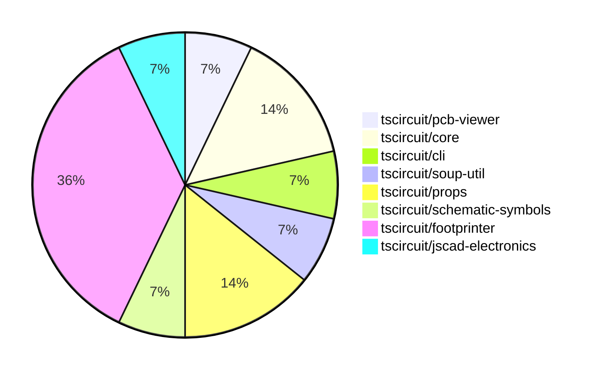

# contribution-tracker

Generates weekly contribution overviews for tscircuit contributors. Check out all
the [contribution overviews here](./contribution-overviews/)

* All PRs in the tscircuit org are scanned/summarized via Claude Haiku
* Claude classifies each Diff/PR as a Major, Minor or Tiny contribution
* All the PRs, summaries, and classifications are organized into charts and tables

The current week is shown below. There are 3 major sections:

* [Contributor Overview](#contributor-overview)
* [PRs by Repository](#prs-by-repository)
* [PRs by Contributor](#changes-by-contributor)

## Current Week

<!-- START_CURRENT_WEEK -->

# Contribution Overview 2024-08-24

## PRs by Repository

## Contributor Overview

| Contributor | 🐳 Major | 🐙 Minor | 🐌 Tiny |
|-------------|-------|-------|-------|
| imrishabh18 | 1 | 0 | 0 |
| seveibar | 2 | 4 | 0 |
| anas-sarkez | 2 | 2 | 0 |
| ShiboSoftwareDev | 1 | 0 | 0 |
| abhijitxy | 1 | 0 | 0 |

## Changes by Repository

### [tscircuit/pcb-viewer](https://github.com/tscircuit/pcb-viewer)

| PR # | Impact | Contributor | Description |
|------|--------|-------------|-------------|
| [#40](https://github.com/tscircuit/pcb-viewer/pull/40) | 🐳 Major | imrishabh18 | Adds support for trace-hint on plated-hole elements |

### [tscircuit/core](https://github.com/tscircuit/core)

| PR # | Impact | Contributor | Description |
|------|--------|-------------|-------------|
| [#6](https://github.com/tscircuit/core/pull/6) | 🐳 Major | seveibar | Implements a trace hint feature to allow custom routing between ports using PCB route hints. |
| [#4](https://github.com/tscircuit/core/pull/4) | 🟣 | seveibar |  |

### [tscircuit/cli](https://github.com/tscircuit/cli)

| PR # | Impact | Contributor | Description |
|------|--------|-------------|-------------|
| [#130](https://github.com/tscircuit/cli/pull/130) | 🐙 Minor | seveibar | Change the `flip_y_axis` flag to `false` for both Gerber and Excellon drill commands. |

### [tscircuit/soup-util](https://github.com/tscircuit/soup-util)

| PR # | Impact | Contributor | Description |
|------|--------|-------------|-------------|
| [#9](https://github.com/tscircuit/soup-util/pull/9) | 🐙 Minor | seveibar | Allow creating a Soup Utility (su) with an option to turn on validation when inserting new elements. |

### [tscircuit/props](https://github.com/tscircuit/props)

| PR # | Impact | Contributor | Description |
|------|--------|-------------|-------------|
| [#24](https://github.com/tscircuit/props/pull/24) | 🐙 Minor | seveibar | Modify the `pinLabels` type to accept strings to fix React parsing issues. |
| [#22](https://github.com/tscircuit/props/pull/22) | 🐙 Minor | seveibar | Make the `for` property in `tracehint` optional to support a new syntax that allows defining the offset directly in the `trace` element. |

### [tscircuit/schematic-symbols](https://github.com/tscircuit/schematic-symbols)

| PR # | Impact | Contributor | Description |
|------|--------|-------------|-------------|
| [#10](https://github.com/tscircuit/schematic-symbols/pull/10) | 🐳 Major | seveibar | Introduces a new function `getInnerSvg` to extract the inner SVG content without the outer `<svg>` tag. |

### [tscircuit/footprinter](https://github.com/tscircuit/footprinter)

| PR # | Impact | Contributor | Description |
|------|--------|-------------|-------------|
| [#24](https://github.com/tscircuit/footprinter/pull/24) | 🐳 Major | anas-sarkez | Added a new component, SOT723, to the project. |
| [#23](https://github.com/tscircuit/footprinter/pull/23) | 🐳 Major | anas-sarkez | Added a new function 'sot563' and a test case for it |
| [#19](https://github.com/tscircuit/footprinter/pull/19) | 🐳 Major | ShiboSoftwareDev | Added two new footprints, ms-012 and ms-013, to the project. |
| [#21](https://github.com/tscircuit/footprinter/pull/21) | 🐙 Minor | anas-sarkez | Added more tests for a BGA component with 64 pins, 10mm x 10mm size, 8x8 grid, and 1.27mm pitch. |
| [#20](https://github.com/tscircuit/footprinter/pull/20) | 🐙 Minor | anas-sarkez | Added some missing tests and snapshots |

### [tscircuit/jscad-electronics](https://github.com/tscircuit/jscad-electronics)

| PR # | Impact | Contributor | Description |
|------|--------|-------------|-------------|
| [#14](https://github.com/tscircuit/jscad-electronics/pull/14) | 🐳 Major | abhijitxy | Implement a new component for the SOT-23-3P package. |

## Changes by Contributor

### [imrishabh18](https://github.com/imrishabh18)

| PR # | Impact | Description |
|------|--------|-------------|
| [#40](https://github.com/tscircuit/pcb-viewer/pull/40) | 🐳 Major | Adds support for trace-hint on plated-hole elements |

### [seveibar](https://github.com/seveibar)

| PR # | Impact | Description |
|------|--------|-------------|
| [#6](https://github.com/tscircuit/core/pull/6) | 🐳 Major | Implements a trace hint feature to allow custom routing between ports using PCB route hints. |
| [#130](https://github.com/tscircuit/cli/pull/130) | 🐙 Minor | Change the `flip_y_axis` flag to `false` for both Gerber and Excellon drill commands. |
| [#9](https://github.com/tscircuit/soup-util/pull/9) | 🐙 Minor | Allow creating a Soup Utility (su) with an option to turn on validation when inserting new elements. |
| [#24](https://github.com/tscircuit/props/pull/24) | 🐙 Minor | Modify the `pinLabels` type to accept strings to fix React parsing issues. |
| [#22](https://github.com/tscircuit/props/pull/22) | 🐙 Minor | Make the `for` property in `tracehint` optional to support a new syntax that allows defining the offset directly in the `trace` element. |
| [#4](https://github.com/tscircuit/core/pull/4) | 🟣 |  |
| [#10](https://github.com/tscircuit/schematic-symbols/pull/10) | 🐳 Major | Introduces a new function `getInnerSvg` to extract the inner SVG content without the outer `<svg>` tag. |

### [anas-sarkez](https://github.com/anas-sarkez)

| PR # | Impact | Description |
|------|--------|-------------|
| [#24](https://github.com/tscircuit/footprinter/pull/24) | 🐳 Major | Added a new component, SOT723, to the project. |
| [#23](https://github.com/tscircuit/footprinter/pull/23) | 🐳 Major | Added a new function 'sot563' and a test case for it |
| [#21](https://github.com/tscircuit/footprinter/pull/21) | 🐙 Minor | Added more tests for a BGA component with 64 pins, 10mm x 10mm size, 8x8 grid, and 1.27mm pitch. |
| [#20](https://github.com/tscircuit/footprinter/pull/20) | 🐙 Minor | Added some missing tests and snapshots |

### [ShiboSoftwareDev](https://github.com/ShiboSoftwareDev)

| PR # | Impact | Description |
|------|--------|-------------|
| [#19](https://github.com/tscircuit/footprinter/pull/19) | 🐳 Major | Added two new footprints, ms-012 and ms-013, to the project. |

### [abhijitxy](https://github.com/abhijitxy)

| PR # | Impact | Description |
|------|--------|-------------|
| [#14](https://github.com/tscircuit/jscad-electronics/pull/14) | 🐳 Major | Implement a new component for the SOT-23-3P package. |

<!-- END_CURRENT_WEEK -->
