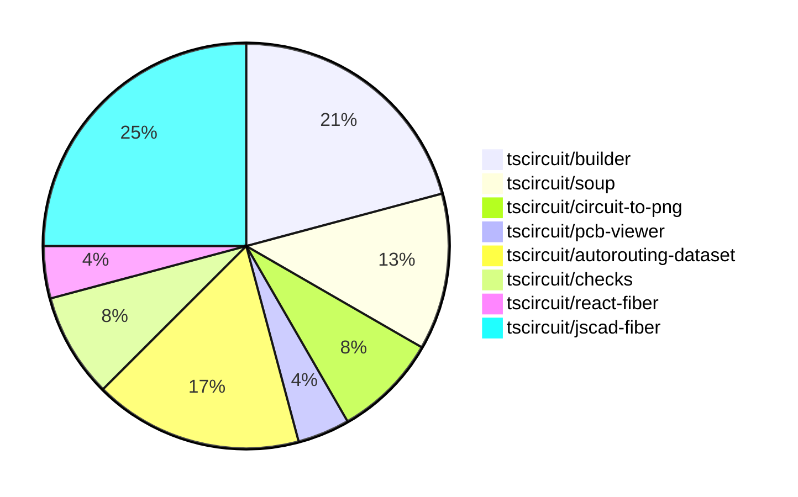

# contribution-tracker

Generates weekly contribution overviews for tscircuit contributors. Check out all
the [contribution overviews here](./contribution-overviews/)

* All PRs in the tscircuit org are scanned/summarized via Claude Haiku
* Claude classifies each Diff/PR as a Major, Minor or Tiny contribution
* All the PRs, summaries, and classifications are organized into charts and tables

The current week is shown below. There are 3 major sections:

* [Contributor Overview](#contributor-overview)
* [PRs by Repository](#prs-by-repository)
* [PRs by Contributor](#changes-by-contributor)

## Current Week

<!-- START_CURRENT_WEEK -->

# Contribution Overview 2024-07-27

## PRs by Repository

## Contributor Overview

| Contributor | 🐳 Major | 🐙 Minor | 🐌 Tiny |
|-------------|-------|-------|-------|
| imrishabh18 | 2 | 4 | 2 |
| seveibar | 8 | 0 | 0 |
| abhijitxy | 2 | 0 | 0 |
| Slaviiiii | 2 | 3 | 0 |
| r-bt | 1 | 0 | 0 |

## Changes by Repository

### [tscircuit/builder](https://github.com/tscircuit/builder)

| PR # | Impact | Contributor | Description |
|------|--------|-------------|-------------|
| [#90](https://github.com/tscircuit/builder/pull/90) | 🐳 Major | imrishabh18 | Add the ability to take a PCB snapshot of the circuit |
| [#88](https://github.com/tscircuit/builder/pull/88) | 🐳 Major | imrishabh18 | Add port IDs to the PCB trace route. |
| [#93](https://github.com/tscircuit/builder/pull/93) | 🐙 Minor | imrishabh18 | Fix the directory URL generated on the second time by using `fileURLToPath` to convert the file URL to a file path. |
| [#92](https://github.com/tscircuit/builder/pull/92) | 🐙 Minor | imrishabh18 | Adds a suffix to the snapshot file names to differentiate between PCB and schematic snapshots. |
| [#89](https://github.com/tscircuit/builder/pull/89) | 🐙 Minor | imrishabh18 | Added a new function `writeSchematicSnapshotPng` to take a schematic circuit and generate a PNG image snapshot. |

### [tscircuit/soup](https://github.com/tscircuit/soup)

| PR # | Impact | Contributor | Description |
|------|--------|-------------|-------------|
| [#16](https://github.com/tscircuit/soup/pull/16) | 🐳 Major | seveibar | Add a GitHub Actions workflow to automatically format code on pull requests. |
| [#15](https://github.com/tscircuit/soup/pull/15) | 🐳 Major | abhijitxy | Introduce a new `simple_chip` type into the `tscircuit/soup` project. |
| [#17](https://github.com/tscircuit/soup/pull/17) | 🐙 Minor | imrishabh18 | Add a new optional `trace_width` property to the `SourceNet` type. |

### [tscircuit/circuit-to-png](https://github.com/tscircuit/circuit-to-png)

| PR # | Impact | Contributor | Description |
|------|--------|-------------|-------------|
| [#10](https://github.com/tscircuit/circuit-to-png/pull/10) | 🐌 Tiny | imrishabh18 | Add missing version field to the package.json file. |
| [#9](https://github.com/tscircuit/circuit-to-png/pull/9) | 🐌 Tiny | imrishabh18 | Update the project's lock file to the latest version. |

### [tscircuit/pcb-viewer](https://github.com/tscircuit/pcb-viewer)

| PR # | Impact | Contributor | Description |
|------|--------|-------------|-------------|
| [#31](https://github.com/tscircuit/pcb-viewer/pull/31) | 🐳 Major | seveibar | Introduce a rats nest toggle and allow setting the initial state of the PCBViewer. |

### [tscircuit/autorouting-dataset](https://github.com/tscircuit/autorouting-dataset)

| PR # | Impact | Contributor | Description |
|------|--------|-------------|-------------|
| [#13](https://github.com/tscircuit/autorouting-dataset/pull/13) | 🐳 Major | seveibar | Adds documentation for the CLI usage, including options to start a dev server, run benchmarks, generate datasets, and generate single problems. Also adds support for specifying a custom solver URL in the CLI. |
| [#11](https://github.com/tscircuit/autorouting-dataset/pull/11) | 🐳 Major | seveibar | Add a new "solve" endpoint to the dev server and add a test for it. |
| [#7](https://github.com/tscircuit/autorouting-dataset/pull/7) | 🐳 Major | seveibar | This pull request adds a simple grid-based autorouting algorithm implemented in Python, which can be used as a non-Typescript solver for the autorouting dataset. |
| [#6](https://github.com/tscircuit/autorouting-dataset/pull/6) | 🐳 Major | seveibar | Finish distance single trace dataset by adding a distance parameter to the `SingleTraceCircuit` component and updating the `isValidSolution` function to handle the new format of the `solution` argument. |

### [tscircuit/checks](https://github.com/tscircuit/checks)

| PR # | Impact | Contributor | Description |
|------|--------|-------------|-------------|
| [#12](https://github.com/tscircuit/checks/pull/12) | 🐳 Major | seveibar | Fix port association failure when trace width makes them overlap |
| [#11](https://github.com/tscircuit/checks/pull/11) | 🐳 Major | seveibar | Improve error messages to use selectors instead of IDs for better readability |

### [tscircuit/react-fiber](https://github.com/tscircuit/react-fiber)

| PR # | Impact | Contributor | Description |
|------|--------|-------------|-------------|
| [#14](https://github.com/tscircuit/react-fiber/pull/14) | 🐳 Major | abhijitxy | Change the name of the "useBug" hook to "useChip" and add a new "useChip" hook. |

### [tscircuit/jscad-fiber](https://github.com/tscircuit/jscad-fiber)

| PR # | Impact | Contributor | Description |
|------|--------|-------------|-------------|
| [#44](https://github.com/tscircuit/jscad-fiber/pull/44) | 🐳 Major | Slaviiiii | Adds support for the `Hull` and `HullChain` components, which allow creating 3D shapes by taking the convex hull of multiple child geometries. |
| [#43](https://github.com/tscircuit/jscad-fiber/pull/43) | 🐳 Major | Slaviiiii | Add a new rectangle shape component to the library. |
| [#40](https://github.com/tscircuit/jscad-fiber/pull/40) | 🐳 Major | r-bt | Allow component props to be updated |
| [#41](https://github.com/tscircuit/jscad-fiber/pull/41) | 🐙 Minor | Slaviiiii | Add a new `Circle` component to the library. |
| [#42](https://github.com/tscircuit/jscad-fiber/pull/42) | 🐙 Minor | Slaviiiii | Updating the add-circle functionality and fixing a bug in the `createInstance` function. |
| [#39](https://github.com/tscircuit/jscad-fiber/pull/39) | 🐙 Minor | Slaviiiii | Update the `Rotate` component to accept either `rotation` or `angles` props, and handle both cases with proper type checking. |

## Changes by Contributor

### [imrishabh18](https://github.com/imrishabh18)

| PR # | Impact | Description |
|------|--------|-------------|
| [#90](https://github.com/tscircuit/builder/pull/90) | 🐳 Major | Add the ability to take a PCB snapshot of the circuit |
| [#88](https://github.com/tscircuit/builder/pull/88) | 🐳 Major | Add port IDs to the PCB trace route. |
| [#93](https://github.com/tscircuit/builder/pull/93) | 🐙 Minor | Fix the directory URL generated on the second time by using `fileURLToPath` to convert the file URL to a file path. |
| [#92](https://github.com/tscircuit/builder/pull/92) | 🐙 Minor | Adds a suffix to the snapshot file names to differentiate between PCB and schematic snapshots. |
| [#89](https://github.com/tscircuit/builder/pull/89) | 🐙 Minor | Added a new function `writeSchematicSnapshotPng` to take a schematic circuit and generate a PNG image snapshot. |
| [#17](https://github.com/tscircuit/soup/pull/17) | 🐙 Minor | Add a new optional `trace_width` property to the `SourceNet` type. |
| [#10](https://github.com/tscircuit/circuit-to-png/pull/10) | 🐌 Tiny | Add missing version field to the package.json file. |
| [#9](https://github.com/tscircuit/circuit-to-png/pull/9) | 🐌 Tiny | Update the project's lock file to the latest version. |

### [seveibar](https://github.com/seveibar)

| PR # | Impact | Description |
|------|--------|-------------|
| [#31](https://github.com/tscircuit/pcb-viewer/pull/31) | 🐳 Major | Introduce a rats nest toggle and allow setting the initial state of the PCBViewer. |
| [#16](https://github.com/tscircuit/soup/pull/16) | 🐳 Major | Add a GitHub Actions workflow to automatically format code on pull requests. |
| [#13](https://github.com/tscircuit/autorouting-dataset/pull/13) | 🐳 Major | Adds documentation for the CLI usage, including options to start a dev server, run benchmarks, generate datasets, and generate single problems. Also adds support for specifying a custom solver URL in the CLI. |
| [#11](https://github.com/tscircuit/autorouting-dataset/pull/11) | 🐳 Major | Add a new "solve" endpoint to the dev server and add a test for it. |
| [#7](https://github.com/tscircuit/autorouting-dataset/pull/7) | 🐳 Major | This pull request adds a simple grid-based autorouting algorithm implemented in Python, which can be used as a non-Typescript solver for the autorouting dataset. |
| [#6](https://github.com/tscircuit/autorouting-dataset/pull/6) | 🐳 Major | Finish distance single trace dataset by adding a distance parameter to the `SingleTraceCircuit` component and updating the `isValidSolution` function to handle the new format of the `solution` argument. |
| [#12](https://github.com/tscircuit/checks/pull/12) | 🐳 Major | Fix port association failure when trace width makes them overlap |
| [#11](https://github.com/tscircuit/checks/pull/11) | 🐳 Major | Improve error messages to use selectors instead of IDs for better readability |

### [abhijitxy](https://github.com/abhijitxy)

| PR # | Impact | Description |
|------|--------|-------------|
| [#14](https://github.com/tscircuit/react-fiber/pull/14) | 🐳 Major | Change the name of the "useBug" hook to "useChip" and add a new "useChip" hook. |
| [#15](https://github.com/tscircuit/soup/pull/15) | 🐳 Major | Introduce a new `simple_chip` type into the `tscircuit/soup` project. |

### [Slaviiiii](https://github.com/Slaviiiii)

| PR # | Impact | Description |
|------|--------|-------------|
| [#44](https://github.com/tscircuit/jscad-fiber/pull/44) | 🐳 Major | Adds support for the `Hull` and `HullChain` components, which allow creating 3D shapes by taking the convex hull of multiple child geometries. |
| [#43](https://github.com/tscircuit/jscad-fiber/pull/43) | 🐳 Major | Add a new rectangle shape component to the library. |
| [#41](https://github.com/tscircuit/jscad-fiber/pull/41) | 🐙 Minor | Add a new `Circle` component to the library. |
| [#42](https://github.com/tscircuit/jscad-fiber/pull/42) | 🐙 Minor | Updating the add-circle functionality and fixing a bug in the `createInstance` function. |
| [#39](https://github.com/tscircuit/jscad-fiber/pull/39) | 🐙 Minor | Update the `Rotate` component to accept either `rotation` or `angles` props, and handle both cases with proper type checking. |

### [r-bt](https://github.com/r-bt)

| PR # | Impact | Description |
|------|--------|-------------|
| [#40](https://github.com/tscircuit/jscad-fiber/pull/40) | 🐳 Major | Allow component props to be updated |

<!-- END_CURRENT_WEEK -->
