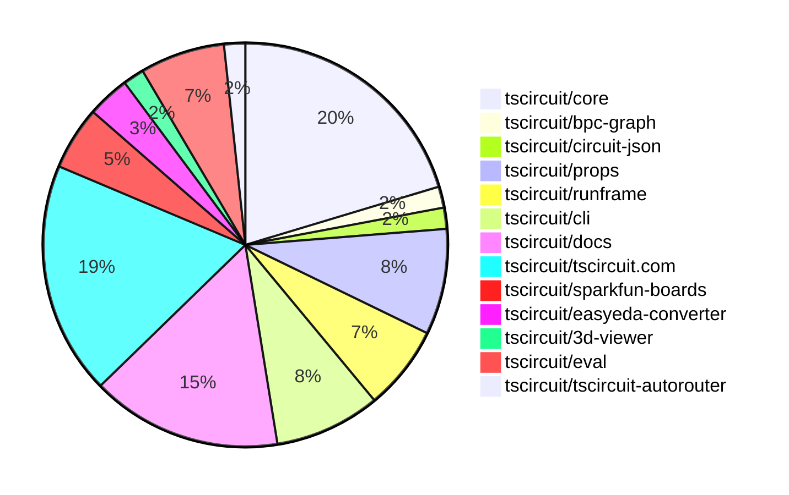

# contribution-tracker

Generates weekly contribution overviews for tscircuit contributors. Check out all
the [contribution overviews here](./contribution-overviews/)

* All PRs in the tscircuit org are scanned/summarized via Claude Haiku
* Claude classifies each Diff/PR as a Major, Minor or Tiny contribution
* All the PRs, summaries, and classifications are organized into charts and tables

The current week is shown below. There are 3 major sections:

* [Contributor Overview](#contributor-overview)
* [PRs by Repository](#prs-by-repository)
* [PRs by Contributor](#changes-by-contributor)

## Current Week

<!-- START_CURRENT_WEEK -->

# Contribution Overview 2025-06-18

## PRs by Repository

## Contributor Overview

| Contributor | 🐳 Major | 🐙 Minor | 🐌 Tiny | ⭐ | Issues Created | Discussion Contributions |
|-------------|---------|---------|---------|-----|----------------|--------------------------|
| [seveibar](#seveibar) | 2 | 12 | 7 | ⭐⭐⭐ | 0 | 0🔹 0🔶 0💎 |
| [imrishabh18](#imrishabh18) | 0 | 10 | 7 | ⭐⭐ | 0 | 0🔹 0🔶 0💎 |
| [ShiboSoftwareDev](#ShiboSoftwareDev) | 0 | 5 | 1 | ⭐⭐ | 3 | 0🔹 0🔶 0💎 |
| [techmannih](#techmannih) | 1 | 2 | 1 | ⭐⭐ | 2 | 0🔹 0🔶 0💎 |
| [Anshgrover23](#Anshgrover23) | 0 | 3 | 2 | ⭐ | 5 | 0🔹 0🔶 0💎 |
| [ArnavK-09](#ArnavK-09) | 0 | 3 | 0 | ⭐ | 2 | 0🔹 0🔶 0💎 |
| [Abse2001](#Abse2001) | 0 | 1 | 0 |  | 0 | 0🔹 0🔶 0💎 |
| [tscircuitbot](#tscircuitbot) | 0 | 0 | 2 |  | 0 | 0🔹 0🔶 0💎 |

### Discussion Contribution Legend

- 🔹 Normal Comments: Basic participation with minimal effort
- 🔶 Great Informative Comments: Thoughtful participation that adds value
- 💎 Incredible Comments: Exceptional participation with high-quality content

## Review Table

[reviews-received-hover]: ## "Number of reviews received for PRs for this contributor"
[approvals-received-hover]: ## "Number of approvals received for PRs this contributor authored"
[rejections-received-hover]: ## "Number of rejections received for PRs this contributor authored"
[prs-opened-hover]: ## "Number of PRs opened by this contributor"
[issues-created-hover]: ## "Number of issues created by this contributor"
[bountied-issues-hover]: ## "Number of issues this contributor created with a bounty"
[bountied-issue-$-hover]: ## "Total bounty amount placed on issues authored by this contributor"

| Contributor | Reviews Received | Approvals Received | Rejections Received | Approvals | Rejections | PRs Opened | PRs Merged | Issues Created | Bountied Issues | Bountied Issue $ |
|---|---|---|---|---|---|---|---|---|---|---|
| [seveibar](#seveibar) | 9 | 1 | 0 | 28 | 3 | 29 | 21 | 0 | 0 | 0 |
| [graphite-app[bot]](#graphite-app[bot]) | 0 | 0 | 0 | 0 | 0 | 0 | 0 | 0 | 0 | 0 |
| [Anshgrover23](#Anshgrover23) | 13 | 9 | 1 | 2 | 1 | 6 | 5 | 5 | 0 | 0 |
| [imrishabh18](#imrishabh18) | 8 | 5 | 0 | 2 | 0 | 20 | 18 | 0 | 0 | 0 |
| [techmannih](#techmannih) | 7 | 5 | 0 | 1 | 1 | 7 | 4 | 2 | 0 | 0 |
| [ShiboSoftwareDev](#ShiboSoftwareDev) | 19 | 10 | 1 | 5 | 0 | 10 | 6 | 3 | 0 | 0 |
| [Abse2001](#Abse2001) | 2 | 1 | 0 | 0 | 0 | 2 | 1 | 0 | 0 | 0 |
| [andrii-balitskyi](#andrii-balitskyi) | 6 | 3 | 0 | 0 | 0 | 3 | 0 | 0 | 0 | 0 |
| [ArnavK-09](#ArnavK-09) | 4 | 3 | 0 | 1 | 0 | 3 | 3 | 2 | 0 | 0 |
| [tscircuitbot](#tscircuitbot) | 0 | 0 | 0 | 0 | 0 | 21 | 2 | 0 | 0 | 0 |
| [cursor[bot]](#cursor[bot]) | 0 | 0 | 0 | 0 | 0 | 0 | 0 | 0 | 0 | 0 |
| [MustafaMulla29](#MustafaMulla29) | 9 | 2 | 3 | 0 | 0 | 1 | 0 | 0 | 0 | 0 |

## Changes by Repository

### [tscircuit/core](https://github.com/tscircuit/core)

| PR # | Impact | Contributor | Description | Milestone Aligned |
|------|--------|-------------|-------------|-------------------|
| [#950](https://github.com/tscircuit/core/pull/950) | 🐳 Major | seveibar | Enhancements to trace connections with netlabels improve schematic accuracy and usability. | ✅ |
| [#959](https://github.com/tscircuit/core/pull/959) | 🐙 Minor | seveibar | Enhancements to the `sel` function allow for dynamic reference designator usage, improving flexibility in design implementations. | ❌ |
| [#957](https://github.com/tscircuit/core/pull/957) | 🐙 Minor | seveibar | Enhancing the netlabel functionality to support multiple connections significantly improves flexibility in circuit design. | ❌ |
| [#951](https://github.com/tscircuit/core/pull/951) | 🐙 Minor | seveibar | Enhancements to netlabel functionality improve circuit design capabilities by allowing dynamic net creation and trace generation based on connections. | ❌ |
| [#948](https://github.com/tscircuit/core/pull/948) | 🐙 Minor | seveibar | Refactoring of deprecated components enhances code maintainability and aligns with modern practices. | ❌ |
| [#954](https://github.com/tscircuit/core/pull/954) | 🐙 Minor | Anshgrover23 | Enhances the SchematicText component by ensuring default values for position properties, improving robustness. | ❌ |
| [#947](https://github.com/tscircuit/core/pull/947) | 🐙 Minor | imrishabh18 | Enhancement of PCB layout capabilities by introducing padding support for subcircuits in the Group component. | ❌ |
| [#938](https://github.com/tscircuit/core/pull/938) | 🐙 Minor | imrishabh18 | Enhancements to net label lookup improve circuit functionality and testing reliability. | ❌ |
| [#956](https://github.com/tscircuit/core/pull/956) | 🐙 Minor | Abse2001 | Enhances the selector functionality by adding support for J references, improving usability in component selection. | ❌ |
| [#955](https://github.com/tscircuit/core/pull/955) | 🐌 Tiny | seveibar | The addition of a configuration to disable the lockfile in the project enhances flexibility in dependency management. | ❌ |
| [#946](https://github.com/tscircuit/core/pull/946) | 🐌 Tiny | seveibar | Enhancements to testing capabilities for netalias connections improve overall code reliability and maintainability. | ❌ |
| [#953](https://github.com/tscircuit/core/pull/953) | 🐌 Tiny | Anshgrover23 | Updating the dependency version for props enhances compatibility and ensures the latest features and fixes are utilized. | ❌ |

### [tscircuit/bpc-graph](https://github.com/tscircuit/bpc-graph)

| PR # | Impact | Contributor | Description | Milestone Aligned |
|------|--------|-------------|-------------|-------------------|
| [#2](https://github.com/tscircuit/bpc-graph/pull/2) | 🐳 Major | seveibar | Enhancements to the graph transformation logic with A* algorithm integration for improved operation cost calculations. | ❌ |

### [tscircuit/circuit-json](https://github.com/tscircuit/circuit-json)

| PR # | Impact | Contributor | Description | Milestone Aligned |
|------|--------|-------------|-------------|-------------------|
| [#232](https://github.com/tscircuit/circuit-json/pull/232) | 🐙 Minor | seveibar | The removal of the default value for `is_movable` enhances the flexibility of schematic net labels by allowing explicit control over their repositioning behavior. | ❌ |

### [tscircuit/props](https://github.com/tscircuit/props)

| PR # | Impact | Contributor | Description | Milestone Aligned |
|------|--------|-------------|-------------|-------------------|
| [#295](https://github.com/tscircuit/props/pull/295) | 🐙 Minor | seveibar | Enhancing the jumper component with a new connections property significantly improves its functionality and flexibility. | ❌ |
| [#291](https://github.com/tscircuit/props/pull/291) | 🐙 Minor | seveibar | Enhancing the `connectsTo` property to accept both string and array types improves flexibility in component connections. | ❌ |
| [#293](https://github.com/tscircuit/props/pull/293) | 🐙 Minor | Anshgrover23 | Enhancing flexibility in component properties by making schX and schY optional improves usability and testing coverage. | ❌ |
| [#292](https://github.com/tscircuit/props/pull/292) | 🐙 Minor | Anshgrover23 | Enhancements to the PinHeader component by adding new properties for schematic dimensions and styles. | ❌ |
| [#294](https://github.com/tscircuit/props/pull/294) | 🐌 Tiny | seveibar | Clarification of documentation enhances understanding of the `internallyConnectedPins` property. | ❌ |

### [tscircuit/runframe](https://github.com/tscircuit/runframe)

| PR # | Impact | Contributor | Description | Milestone Aligned |
|------|--------|-------------|-------------|-------------------|
| [#783](https://github.com/tscircuit/runframe/pull/783) | 🐙 Minor | seveibar | Enhances user experience by displaying the last run evaluation version in the CircuitJsonPreview dropdown, providing better context for users. | ❌ |
| [#781](https://github.com/tscircuit/runframe/pull/781) | 🐙 Minor | imrishabh18 | Elevating the OrderDialog's z-index enhances its visibility and usability in the UI. | ❌ |
| [#780](https://github.com/tscircuit/runframe/pull/780) | 🐙 Minor | imrishabh18 | Enhancing error tracking in the order dialog improves overall application reliability and user experience. | ❌ |
| [#786](https://github.com/tscircuit/runframe/pull/786) | 🐌 Tiny | imrishabh18 | Updating the version of the 3D viewer package enhances the project's dependencies, ensuring compatibility and potentially introducing new features or fixes from the updated package. | ❌ |

### [tscircuit/cli](https://github.com/tscircuit/cli)

| PR # | Impact | Contributor | Description | Milestone Aligned |
|------|--------|-------------|-------------|-------------------|
| [#236](https://github.com/tscircuit/cli/pull/236) | 🐙 Minor | seveibar | Enhancements to snapshot functionality provide users with more control over the output of PCB and schematic snapshots. | ❌ |
| [#234](https://github.com/tscircuit/cli/pull/234) | 🐙 Minor | seveibar | Enhancements to logging provide better visibility into snapshot creation processes. | ❌ |
| [#233](https://github.com/tscircuit/cli/pull/233) | 🐙 Minor | imrishabh18 | Renaming the configuration entry field enhances clarity and consistency in the codebase. | ❌ |
| [#237](https://github.com/tscircuit/cli/pull/237) | 🐙 Minor | ShiboSoftwareDev | Enhancements to cross-platform compatibility for the snapshot command significantly improve usability for Windows users. | ❌ |
| [#239](https://github.com/tscircuit/cli/pull/239) | 🐌 Tiny | ShiboSoftwareDev | Updating dependencies can help resolve issues and improve the overall stability and performance of the project. | ❌ |

### [tscircuit/docs](https://github.com/tscircuit/docs)

| PR # | Impact | Contributor | Description | Milestone Aligned |
|------|--------|-------------|-------------|-------------------|
| [#81](https://github.com/tscircuit/docs/pull/81) | 🐙 Minor | seveibar | Enhancements to the CircuitPreview component allow for more flexible display options, improving user experience. | ❌ |
| [#76](https://github.com/tscircuit/docs/pull/76) | 🐙 Minor | seveibar | The addition of the `<netlabel />` element enhances documentation clarity and usability for users working with schematic designs. | ❌ |
| [#74](https://github.com/tscircuit/docs/pull/74) | 🐙 Minor | imrishabh18 | The addition of a comprehensive ordering section enhances user experience by streamlining the prototype ordering process. | ❌ |
| [#82](https://github.com/tscircuit/docs/pull/82) | 🐌 Tiny | seveibar | Enhancing documentation for the `sel()` function improves usability and understanding for developers. | ❌ |
| [#80](https://github.com/tscircuit/docs/pull/80) | 🐌 Tiny | seveibar | Enhancements to documentation for the `<jumper />` component improve clarity and usability for developers. | ❌ |
| [#77](https://github.com/tscircuit/docs/pull/77) | 🐌 Tiny | seveibar | Enhancements to TypeScript configuration and package updates improve developer experience and maintainability. | ❌ |
| [#75](https://github.com/tscircuit/docs/pull/75) | 🐌 Tiny | seveibar | Enhancing documentation for build and snapshot commands significantly improves user understanding and usability of the tool. | ❌ |
| [#79](https://github.com/tscircuit/docs/pull/79) | 🐌 Tiny | imrishabh18 | Enhancing documentation for the `<schematictext />` component and ensuring compliance in the `YouTubeEmbed` component. | ❌ |
| [#78](https://github.com/tscircuit/docs/pull/78) | 🐌 Tiny | imrishabh18 | Enhancements to documentation clarity improve user understanding of the `<net />` element's functionality. | ❌ |

### [tscircuit/tscircuit.com](https://github.com/tscircuit/tscircuit.com)

| PR # | Impact | Contributor | Description | Milestone Aligned |
|------|--------|-------------|-------------|-------------------|
| [#1328](https://github.com/tscircuit/tscircuit.com/pull/1328) | 🐙 Minor | imrishabh18 | Enhancements to the build status indicators improve clarity and user experience in the sidebar release section. | ❌ |
| [#1307](https://github.com/tscircuit/tscircuit.com/pull/1307) | 🐙 Minor | ArnavK-09 | Enhances the SEO capabilities by allowing dynamic selection of the Open Graph image based on the package's default view. | ❌ |
| [#1310](https://github.com/tscircuit/tscircuit.com/pull/1310) | 🐙 Minor | ArnavK-09 | Enhancements to caching and refetching behavior improve the editor's responsiveness after saving changes. | ❌ |
| [#1313](https://github.com/tscircuit/tscircuit.com/pull/1313) | 🐙 Minor | ArnavK-09 | Introduces a new feature for downloading PNG images of circuit designs, enhancing user functionality. | ❌ |
| [#1312](https://github.com/tscircuit/tscircuit.com/pull/1312) | 🐙 Minor | ShiboSoftwareDev | Enhancement of the user interface for better interaction with tree actions. | ❌ |
| [#1323](https://github.com/tscircuit/tscircuit.com/pull/1323) | 🐌 Tiny | Anshgrover23 | Updating dependencies enhances the stability and performance of the project, ensuring compatibility with the latest features and fixes. | ❌ |
| [#1322](https://github.com/tscircuit/tscircuit.com/pull/1322) | 🐌 Tiny | techmannih | Updating the easyeda dependency enhances the project's compatibility with the latest features and fixes. | ❌ |
| [#1324](https://github.com/tscircuit/tscircuit.com/pull/1324) | 🐌 Tiny | imrishabh18 | Updating dependencies in the package.json file enhances the project's compatibility and performance. | ❌ |
| [#1318](https://github.com/tscircuit/tscircuit.com/pull/1318) | 🐌 Tiny | imrishabh18 | Updating the runframe package to fix a z-index dialog issue enhances the UI functionality. | ❌ |
| [#1317](https://github.com/tscircuit/tscircuit.com/pull/1317) | 🐌 Tiny | imrishabh18 | Enhancing the dropdown width improves user experience by accommodating longer file names. | ❌ |
| [#1314](https://github.com/tscircuit/tscircuit.com/pull/1314) | 🐌 Tiny | imrishabh18 | The PR enhances the project by updating dependencies and ensuring compatibility with the latest version of the runframe package. | ❌ |

### [tscircuit/sparkfun-boards](https://github.com/tscircuit/sparkfun-boards)

| PR # | Impact | Contributor | Description | Milestone Aligned |
|------|--------|-------------|-------------|-------------------|
| [#5](https://github.com/tscircuit/sparkfun-boards/pull/5) | 🐳 Major | techmannih | The addition of the SparkFun USB to Serial Breakout FT232RL enhances the repository by providing a new component for USB to serial communication, which is valuable for various electronic projects. | ❌ |
| [#9](https://github.com/tscircuit/sparkfun-boards/pull/9) | 🐙 Minor | ShiboSoftwareDev | Introduces CI workflows for building and snapshotting TSCircuit projects, enhancing automation and reliability. | ❌ |
| [#8](https://github.com/tscircuit/sparkfun-boards/pull/8) | 🐙 Minor | ShiboSoftwareDev | The addition of a new component enhances the library's functionality by integrating a specific DAC breakout, which is valuable for users needing this component. | ❌ |

### [tscircuit/easyeda-converter](https://github.com/tscircuit/easyeda-converter)

| PR # | Impact | Contributor | Description | Milestone Aligned |
|------|--------|-------------|-------------|-------------------|
| [#254](https://github.com/tscircuit/easyeda-converter/pull/254) | 🐙 Minor | techmannih | The changes enhance the import functionality for a specific component, ensuring better compatibility and error handling. | ❌ |
| [#255](https://github.com/tscircuit/easyeda-converter/pull/255) | 🐙 Minor | techmannih | Addresses a specific import failure issue related to a JLCPCB part, enhancing the functionality of the converter. | ❌ |

### [tscircuit/3d-viewer](https://github.com/tscircuit/3d-viewer)

| PR # | Impact | Contributor | Description | Milestone Aligned |
|------|--------|-------------|-------------|-------------------|
| [#350](https://github.com/tscircuit/3d-viewer/pull/350) | 🐙 Minor | imrishabh18 | Loading the Manifold WASM module from a CDN enhances the application's performance and reduces local resource dependency. | ❌ |

### [tscircuit/eval](https://github.com/tscircuit/eval)

| PR # | Impact | Contributor | Description | Milestone Aligned |
|------|--------|-------------|-------------|-------------------|
| [#537](https://github.com/tscircuit/eval/pull/537) | 🐙 Minor | imrishabh18 | Enhancing configuration handling by setting the entry point based on the parsed configuration file improves the flexibility and usability of the code. | ❌ |
| [#528](https://github.com/tscircuit/eval/pull/528) | 🐙 Minor | imrishabh18 | Enhances the configuration parsing by allowing the main component path to be specified in the tscircuit.config.js file. | ❌ |
| [#546](https://github.com/tscircuit/eval/pull/546) | 🐌 Tiny | tscircuitbot | Updating the core library version enhances compatibility and may include important bug fixes or improvements. | ❌ |
| [#536](https://github.com/tscircuit/eval/pull/536) | 🐌 Tiny | tscircuitbot | Updating dependencies is essential for maintaining the health and performance of the project. | ❌ |

### [tscircuit/tscircuit-autorouter](https://github.com/tscircuit/tscircuit-autorouter)

| PR # | Impact | Contributor | Description | Milestone Aligned |
|------|--------|-------------|-------------|-------------------|
| [#156](https://github.com/tscircuit/tscircuit-autorouter/pull/156) | 🐙 Minor | ShiboSoftwareDev | The addition of high-density node input data enhances the autorouting capabilities of the system, providing a more robust testing framework for future developments. | ❌ |

## Changes by Contributor

### [seveibar](https://github.com/seveibar)

| PR # | Impact | Description | Milestone Aligned |
|------|--------|-------------|-------------------|
| [#950](https://github.com/tscircuit/core/pull/950) | 🐳 Major | Enhancements to trace connections with netlabels improve schematic accuracy and usability. | ✅ |
| [#2](https://github.com/tscircuit/bpc-graph/pull/2) | 🐳 Major | Enhancements to the graph transformation logic with A* algorithm integration for improved operation cost calculations. | ❌ |
| [#232](https://github.com/tscircuit/circuit-json/pull/232) | 🐙 Minor | The removal of the default value for `is_movable` enhances the flexibility of schematic net labels by allowing explicit control over their repositioning behavior. | ❌ |
| [#295](https://github.com/tscircuit/props/pull/295) | 🐙 Minor | Enhancing the jumper component with a new connections property significantly improves its functionality and flexibility. | ❌ |
| [#291](https://github.com/tscircuit/props/pull/291) | 🐙 Minor | Enhancing the `connectsTo` property to accept both string and array types improves flexibility in component connections. | ❌ |
| [#959](https://github.com/tscircuit/core/pull/959) | 🐙 Minor | Enhancements to the `sel` function allow for dynamic reference designator usage, improving flexibility in design implementations. | ❌ |
| [#957](https://github.com/tscircuit/core/pull/957) | 🐙 Minor | Enhancing the netlabel functionality to support multiple connections significantly improves flexibility in circuit design. | ❌ |
| [#951](https://github.com/tscircuit/core/pull/951) | 🐙 Minor | Enhancements to netlabel functionality improve circuit design capabilities by allowing dynamic net creation and trace generation based on connections. | ❌ |
| [#948](https://github.com/tscircuit/core/pull/948) | 🐙 Minor | Refactoring of deprecated components enhances code maintainability and aligns with modern practices. | ❌ |
| [#783](https://github.com/tscircuit/runframe/pull/783) | 🐙 Minor | Enhances user experience by displaying the last run evaluation version in the CircuitJsonPreview dropdown, providing better context for users. | ❌ |
| [#236](https://github.com/tscircuit/cli/pull/236) | 🐙 Minor | Enhancements to snapshot functionality provide users with more control over the output of PCB and schematic snapshots. | ❌ |
| [#234](https://github.com/tscircuit/cli/pull/234) | 🐙 Minor | Enhancements to logging provide better visibility into snapshot creation processes. | ❌ |
| [#81](https://github.com/tscircuit/docs/pull/81) | 🐙 Minor | Enhancements to the CircuitPreview component allow for more flexible display options, improving user experience. | ❌ |
| [#76](https://github.com/tscircuit/docs/pull/76) | 🐙 Minor | The addition of the `<netlabel />` element enhances documentation clarity and usability for users working with schematic designs. | ❌ |
| [#294](https://github.com/tscircuit/props/pull/294) | 🐌 Tiny | Clarification of documentation enhances understanding of the `internallyConnectedPins` property. | ❌ |
| [#955](https://github.com/tscircuit/core/pull/955) | 🐌 Tiny | The addition of a configuration to disable the lockfile in the project enhances flexibility in dependency management. | ❌ |
| [#946](https://github.com/tscircuit/core/pull/946) | 🐌 Tiny | Enhancements to testing capabilities for netalias connections improve overall code reliability and maintainability. | ❌ |
| [#82](https://github.com/tscircuit/docs/pull/82) | 🐌 Tiny | Enhancing documentation for the `sel()` function improves usability and understanding for developers. | ❌ |
| [#80](https://github.com/tscircuit/docs/pull/80) | 🐌 Tiny | Enhancements to documentation for the `<jumper />` component improve clarity and usability for developers. | ❌ |
| [#77](https://github.com/tscircuit/docs/pull/77) | 🐌 Tiny | Enhancements to TypeScript configuration and package updates improve developer experience and maintainability. | ❌ |
| [#75](https://github.com/tscircuit/docs/pull/75) | 🐌 Tiny | Enhancing documentation for build and snapshot commands significantly improves user understanding and usability of the tool. | ❌ |

### [Anshgrover23](https://github.com/Anshgrover23)

| PR # | Impact | Description | Milestone Aligned |
|------|--------|-------------|-------------------|
| [#293](https://github.com/tscircuit/props/pull/293) | 🐙 Minor | Enhancing flexibility in component properties by making schX and schY optional improves usability and testing coverage. | ❌ |
| [#292](https://github.com/tscircuit/props/pull/292) | 🐙 Minor | Enhancements to the PinHeader component by adding new properties for schematic dimensions and styles. | ❌ |
| [#954](https://github.com/tscircuit/core/pull/954) | 🐙 Minor | Enhances the SchematicText component by ensuring default values for position properties, improving robustness. | ❌ |
| [#953](https://github.com/tscircuit/core/pull/953) | 🐌 Tiny | Updating the dependency version for props enhances compatibility and ensures the latest features and fixes are utilized. | ❌ |
| [#1323](https://github.com/tscircuit/tscircuit.com/pull/1323) | 🐌 Tiny | Updating dependencies enhances the stability and performance of the project, ensuring compatibility with the latest features and fixes. | ❌ |

### [techmannih](https://github.com/techmannih)

| PR # | Impact | Description | Milestone Aligned |
|------|--------|-------------|-------------------|
| [#5](https://github.com/tscircuit/sparkfun-boards/pull/5) | 🐳 Major | The addition of the SparkFun USB to Serial Breakout FT232RL enhances the repository by providing a new component for USB to serial communication, which is valuable for various electronic projects. | ❌ |
| [#254](https://github.com/tscircuit/easyeda-converter/pull/254) | 🐙 Minor | The changes enhance the import functionality for a specific component, ensuring better compatibility and error handling. | ❌ |
| [#255](https://github.com/tscircuit/easyeda-converter/pull/255) | 🐙 Minor | Addresses a specific import failure issue related to a JLCPCB part, enhancing the functionality of the converter. | ❌ |
| [#1322](https://github.com/tscircuit/tscircuit.com/pull/1322) | 🐌 Tiny | Updating the easyeda dependency enhances the project's compatibility with the latest features and fixes. | ❌ |

### [imrishabh18](https://github.com/imrishabh18)

| PR # | Impact | Description | Milestone Aligned |
|------|--------|-------------|-------------------|
| [#350](https://github.com/tscircuit/3d-viewer/pull/350) | 🐙 Minor | Loading the Manifold WASM module from a CDN enhances the application's performance and reduces local resource dependency. | ❌ |
| [#947](https://github.com/tscircuit/core/pull/947) | 🐙 Minor | Enhancement of PCB layout capabilities by introducing padding support for subcircuits in the Group component. | ❌ |
| [#938](https://github.com/tscircuit/core/pull/938) | 🐙 Minor | Enhancements to net label lookup improve circuit functionality and testing reliability. | ❌ |
| [#1328](https://github.com/tscircuit/tscircuit.com/pull/1328) | 🐙 Minor | Enhancements to the build status indicators improve clarity and user experience in the sidebar release section. | ❌ |
| [#537](https://github.com/tscircuit/eval/pull/537) | 🐙 Minor | Enhancing configuration handling by setting the entry point based on the parsed configuration file improves the flexibility and usability of the code. | ❌ |
| [#528](https://github.com/tscircuit/eval/pull/528) | 🐙 Minor | Enhances the configuration parsing by allowing the main component path to be specified in the tscircuit.config.js file. | ❌ |
| [#781](https://github.com/tscircuit/runframe/pull/781) | 🐙 Minor | Elevating the OrderDialog's z-index enhances its visibility and usability in the UI. | ❌ |
| [#780](https://github.com/tscircuit/runframe/pull/780) | 🐙 Minor | Enhancing error tracking in the order dialog improves overall application reliability and user experience. | ❌ |
| [#233](https://github.com/tscircuit/cli/pull/233) | 🐙 Minor | Renaming the configuration entry field enhances clarity and consistency in the codebase. | ❌ |
| [#74](https://github.com/tscircuit/docs/pull/74) | 🐙 Minor | The addition of a comprehensive ordering section enhances user experience by streamlining the prototype ordering process. | ❌ |
| [#1324](https://github.com/tscircuit/tscircuit.com/pull/1324) | 🐌 Tiny | Updating dependencies in the package.json file enhances the project's compatibility and performance. | ❌ |
| [#1318](https://github.com/tscircuit/tscircuit.com/pull/1318) | 🐌 Tiny | Updating the runframe package to fix a z-index dialog issue enhances the UI functionality. | ❌ |
| [#1317](https://github.com/tscircuit/tscircuit.com/pull/1317) | 🐌 Tiny | Enhancing the dropdown width improves user experience by accommodating longer file names. | ❌ |
| [#1314](https://github.com/tscircuit/tscircuit.com/pull/1314) | 🐌 Tiny | The PR enhances the project by updating dependencies and ensuring compatibility with the latest version of the runframe package. | ❌ |
| [#786](https://github.com/tscircuit/runframe/pull/786) | 🐌 Tiny | Updating the version of the 3D viewer package enhances the project's dependencies, ensuring compatibility and potentially introducing new features or fixes from the updated package. | ❌ |
| [#79](https://github.com/tscircuit/docs/pull/79) | 🐌 Tiny | Enhancing documentation for the `<schematictext />` component and ensuring compliance in the `YouTubeEmbed` component. | ❌ |
| [#78](https://github.com/tscircuit/docs/pull/78) | 🐌 Tiny | Enhancements to documentation clarity improve user understanding of the `<net />` element's functionality. | ❌ |

### [Abse2001](https://github.com/Abse2001)

| PR # | Impact | Description | Milestone Aligned |
|------|--------|-------------|-------------------|
| [#956](https://github.com/tscircuit/core/pull/956) | 🐙 Minor | Enhances the selector functionality by adding support for J references, improving usability in component selection. | ❌ |

### [ArnavK-09](https://github.com/ArnavK-09)

| PR # | Impact | Description | Milestone Aligned |
|------|--------|-------------|-------------------|
| [#1307](https://github.com/tscircuit/tscircuit.com/pull/1307) | 🐙 Minor | Enhances the SEO capabilities by allowing dynamic selection of the Open Graph image based on the package's default view. | ❌ |
| [#1310](https://github.com/tscircuit/tscircuit.com/pull/1310) | 🐙 Minor | Enhancements to caching and refetching behavior improve the editor's responsiveness after saving changes. | ❌ |
| [#1313](https://github.com/tscircuit/tscircuit.com/pull/1313) | 🐙 Minor | Introduces a new feature for downloading PNG images of circuit designs, enhancing user functionality. | ❌ |

### [ShiboSoftwareDev](https://github.com/ShiboSoftwareDev)

| PR # | Impact | Description | Milestone Aligned |
|------|--------|-------------|-------------------|
| [#1312](https://github.com/tscircuit/tscircuit.com/pull/1312) | 🐙 Minor | Enhancement of the user interface for better interaction with tree actions. | ❌ |
| [#237](https://github.com/tscircuit/cli/pull/237) | 🐙 Minor | Enhancements to cross-platform compatibility for the snapshot command significantly improve usability for Windows users. | ❌ |
| [#156](https://github.com/tscircuit/tscircuit-autorouter/pull/156) | 🐙 Minor | The addition of high-density node input data enhances the autorouting capabilities of the system, providing a more robust testing framework for future developments. | ❌ |
| [#9](https://github.com/tscircuit/sparkfun-boards/pull/9) | 🐙 Minor | Introduces CI workflows for building and snapshotting TSCircuit projects, enhancing automation and reliability. | ❌ |
| [#8](https://github.com/tscircuit/sparkfun-boards/pull/8) | 🐙 Minor | The addition of a new component enhances the library's functionality by integrating a specific DAC breakout, which is valuable for users needing this component. | ❌ |
| [#239](https://github.com/tscircuit/cli/pull/239) | 🐌 Tiny | Updating dependencies can help resolve issues and improve the overall stability and performance of the project. | ❌ |

### [tscircuitbot](https://github.com/tscircuitbot)

| PR # | Impact | Description | Milestone Aligned |
|------|--------|-------------|-------------------|
| [#546](https://github.com/tscircuit/eval/pull/546) | 🐌 Tiny | Updating the core library version enhances compatibility and may include important bug fixes or improvements. | ❌ |
| [#536](https://github.com/tscircuit/eval/pull/536) | 🐌 Tiny | Updating dependencies is essential for maintaining the health and performance of the project. | ❌ |

## Repository Owners

| Repository | Codeowners |
|------------|------------|
| [tscircuit.com](https://github.com/tscircuit/tscircuit.com/blob/main/.github/CODEOWNERS) | [seveibar](https://github.com/seveibar), [imrishabh18](https://github.com/imrishabh18) |
| [cli](https://github.com/tscircuit/cli/blob/main/.github/CODEOWNERS) | [seveibar](https://github.com/seveibar), [imrishabh18](https://github.com/imrishabh18) |

## Repos by Owner

| User | Repo |
|------|------|
| [seveibar](https://github.com/seveibar) | [tscircuit.com](https://github.com/tscircuit/tscircuit.com/blob/main/.github/CODEOWNERS) |
|  | [cli](https://github.com/tscircuit/cli/blob/main/.github/CODEOWNERS) |
| [imrishabh18](https://github.com/imrishabh18) | [tscircuit.com](https://github.com/tscircuit/tscircuit.com/blob/main/.github/CODEOWNERS) |
|  | [cli](https://github.com/tscircuit/cli/blob/main/.github/CODEOWNERS) |

<!-- END_CURRENT_WEEK -->
