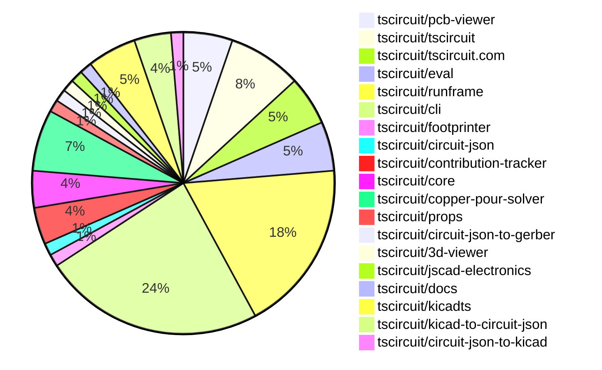
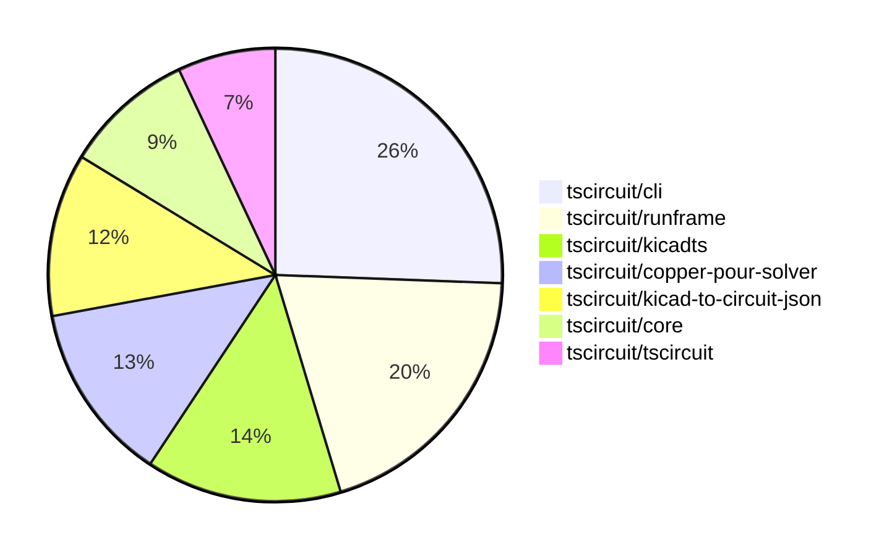

# contribution-tracker

[contributions.tscircuit.com](https://contributions.tscircuit.com) ・ [tscircuit.com](https://tscircuit.com) ・ [Contribution Overviews](./contribution-overviews/) ・ [Changelogs](./changelogs/)

Generates weekly contribution overviews for tscircuit contributors. Check out all
the [contribution overviews here](./contribution-overviews/)
You can find AI-generated monthly changelogs in the [changelogs directory](./changelogs/).

- All PRs in the tscircuit org are scanned/summarized via an LLM
- The LLM classifies each Diff/PR as into a set of attributes for scoring
- All the PRs, summaries, and classifications are organized into charts and tables for [the website](https://contributions.tscircuit.com)

> Want to run locally? See the [Development Section](#development)

The current week is shown below. There are 4 major sections:

- [Contributor Overview](#contributor-overview)
- [PRs by Repository](#prs-by-repository)
- [PRs by Contributor](#changes-by-contributor)
- [Scoring & Sponsorship System](#scoring--sponsorship-system)

## Current Week

<!-- START_CURRENT_WEEK -->

# Contribution Overview 2025-11-05

The current week is shown below. There are 4 major sections:

- [Contributor Overview](#contributor-overview)
- [PRs by Repository](#prs-by-repository)
- [PRs by Contributor](#changes-by-contributor)
- [Scoring & Sponsorship System](#scoring--sponsorship-system)

## PRs by Repository



## Contributor Overview

| Contributor | 🐳 Major | 🐙 Minor | 🐌 Tiny | ⭐ | Score | Discussion Contributions |
|-------------|---------|---------|---------|-----|----------------|--------------------------|
| [imrishabh18](#imrishabh18) | 5 | 5 | 1 | ⭐⭐⭐ | 35 | 0🔹 0🔶 0💎 |
| [ShiboSoftwareDev](#ShiboSoftwareDev) | 3 | 2 | 3 | ⭐⭐ | 24 | 0🔹 0🔶 0💎 |
| [tscircuitbot](#tscircuitbot) | 0 | 0 | 42 | ⭐⭐ | 12.5 | 0🔹 0🔶 0💎 |
| [techmannih](#techmannih) | 0 | 1 | 2 | ⭐ | 7 | 0🔹 0🔶 0💎 |
| [Ayushjhawar8](#Ayushjhawar8) | 1 | 1 | 1 | ⭐ | 7 | 0🔹 0🔶 0💎 |
| [Enity300](#Enity300) | 1 | 0 | 1 | ⭐ | 5 | 0🔹 0🔶 0💎 |
| [Asymtode712](#Asymtode712) | 0 | 2 | 0 | ⭐ | 4 | 0🔹 0🔶 0💎 |
| [rushabhcodes](#rushabhcodes) | 0 | 0 | 3 | ⭐ | 4 | 0🔹 0🔶 0💎 |
| [RaghavArora14](#RaghavArora14) | 0 | 0 | 1 |  | 3 | 0🔹 0🔶 0💎 |
| [ArnavK-09](#ArnavK-09) | 0 | 0 | 1 |  | 1 | 0🔹 0🔶 0💎 |

> Note: AI evaluates PRs and assigns 1-3 star ratings automatically. 4 and 5 star ratings require manual staff review.

### Discussion Contribution Legend

- 🔹 Normal Comments: Basic participation with minimal effort
- 🔶 Great Informative Comments: Thoughtful participation that adds value
- 💎 Incredible Comments: Exceptional participation with high-quality content

## Review Table

[reviews-received-hover]: ## "Number of reviews received for PRs for this contributor"
[approvals-received-hover]: ## "Number of approvals received for PRs this contributor authored"
[rejections-received-hover]: ## "Number of rejections received for PRs this contributor authored"
[prs-opened-hover]: ## "Number of PRs opened by this contributor"
[issues-created-hover]: ## "Number of issues created by this contributor"
[bountied-issues-hover]: ## "Number of issues this contributor created with a bounty"
[bountied-issue-$-hover]: ## "Total bounty amount placed on issues authored by this contributor"

| Contributor | Reviews Received | Approvals Received | Rejections Received | Approvals | Rejections | PRs Opened | PRs Merged | Score | Issues Created | Bountied Issues | Bountied Issue $ |
|---|---|---|---|---|---|---|---|---|---|---|---|
| [tscircuitbot](#tscircuitbot) | 1 | 0 | 0 | 0 | 0 | 47 | 42 | 12.5 | 0 | 0 | 0 |
| [techmannih](#techmannih) | 3 | 2 | 0 | 1 | 1 | 3 | 3 | 7 | 0 | 0 | 0 |
| [seveibar](#seveibar) | 0 | 0 | 0 | 19 | 1 | 1 | 0 | 0 | 0 | 0 | 0 |
| [Quanta-Naut](#Quanta-Naut) | 2 | 0 | 1 | 0 | 0 | 1 | 0 | 0 | 0 | 0 | 0 |
| [imrishabh18](#imrishabh18) | 8 | 3 | 0 | 1 | 3 | 11 | 11 | 35 | 0 | 0 | 0 |
| [Enity300](#Enity300) | 7 | 3 | 0 | 0 | 0 | 3 | 2 | 5 | 0 | 0 | 0 |
| [ShiboSoftwareDev](#ShiboSoftwareDev) | 6 | 5 | 0 | 5 | 0 | 8 | 8 | 24 | 0 | 0 | 0 |
| [rushabhcodes](#rushabhcodes) | 15 | 5 | 1 | 0 | 1 | 8 | 3 | 4 | 0 | 0 | 0 |
| [Abse2001](#Abse2001) | 0 | 0 | 0 | 0 | 0 | 1 | 0 | 0 | 0 | 0 | 0 |
| [Ayushjhawar8](#Ayushjhawar8) | 5 | 2 | 0 | 0 | 0 | 3 | 3 | 7 | 0 | 0 | 0 |
| [Asymtode712](#Asymtode712) | 5 | 2 | 0 | 0 | 0 | 2 | 2 | 4 | 0 | 0 | 0 |
| [nailoo](#nailoo) | 8 | 1 | 1 | 1 | 0 | 2 | 0 | 0 | 0 | 0 | 0 |
| [RaghavArora14](#RaghavArora14) | 17 | 3 | 3 | 0 | 0 | 3 | 1 | 3 | 0 | 0 | 0 |
| [ArnavK-09](#ArnavK-09) | 1 | 1 | 0 | 0 | 0 | 2 | 1 | 1 | 0 | 0 | 0 |

## Top 7 Repositories by Contribution Points



## Scoring & Sponsorship System

### Overview

PRs are analyzed by AI and assigned a **star rating (1-3 stars)**. 4 and 5 star ratings can only be manually assigned by staff. Weekly scores use `2^(starRating - 1)` per PR (capped at 12 PRs per rating), plus review/discussion points.

### Weekly Score → Star String

| Score Range | Star String | Count Value |
|------------|-------------|-------------|
| 0-3 | (empty) | 0 stars |
| 4-10 | ⭐ | 1 star |
| 11-30 | ⭐⭐ | 2 stars |
| 31-50 | ⭐⭐⭐ | 3 stars |
| 51-75 | 👑 | 1 crown |
| 76-100 | 👑👑 | 2 crowns |
| 101+ | 👑👑👑 | 3 crowns |

> Crowns count as 3 stars for sponsorship.

### Monthly Sponsorship Calculation

The sponsorship system calculates monthly payments based on your **weekly star counts** over the complete weeks in that month (typically 4-5 weeks, Wednesday-Tuesday format).

**Step 1: Collect Weekly Stars**
- All complete weeks in the month are analyzed
- Each week's star string is converted to a numeric count (⭐ = 1 star, ⭐⭐⭐ = 3 stars)
- Example: `[2, 2, 2, 1, 0]` means 2 stars in week 1, 2 stars in week 2, etc.

**Step 2: Calculate Metrics**
- **Median stars**: The median value of all weekly star counts
- **Min stars**: The minimum weekly star count
- **Max stars**: The maximum weekly star count
- **High score**: The maximum raw weekly score (0-100+ range from the scoring table) from any week in the month

**Step 3: Determine Base Amount**
The sponsorship amount is calculated based on these metrics (checked in order):

| Condition | Base Amount |
|-----------|-------------|
| `minStarCount >= 3` | **$500** |
| `medianStars >= 3` | **$450** |
| `medianStars >= 2.5` | **$300** |
| `medianStars >= 2` | **$200** |
| `medianStars >= 1.5` | **$100** |
| `medianStars >= 1` | **$75** |
| `maxStarCount >= 2` | **$25** |
| `maxStarCount >= 1` | **$15** |
| `highScore >= 3` (and all stars = 0) | **$5** |

| Maintainer Level | Monthly Bonus |
|------------------|---------------|
| Level 1 | **$200** |
| Level 2 | **$350** |
| Level 3 | **$500** |

**Final Amount** = Base Amount + Maintainer Bonus

## Changes by Repository

### [tscircuit/pcb-viewer](https://github.com/tscircuit/pcb-viewer)

| PR # | Impact | Rating | Contributor | Description |
|------|--------|--------|-------------|-------------|
| [#460](https://github.com/tscircuit/pcb-viewer/pull/460) | 🐙 Minor | ⭐⭐ | techmannih | Adds support for corner radius in rectangle components, allowing for rounded corners in PCB designs. |

<details>
<summary>🐌 Tiny Contributions (3)</summary>

| PR # | Impact | Contributor | Description |
|------|--------|-------------|-------------|
| [#464](https://github.com/tscircuit/pcb-viewer/pull/464) | 🐌 Tiny | tscircuitbot | Automated package update |
| [#463](https://github.com/tscircuit/pcb-viewer/pull/463) | 🐌 Tiny | tscircuitbot | Automated package update |
| [#461](https://github.com/tscircuit/pcb-viewer/pull/461) | 🐌 Tiny | techmannih | Fixes handling of optional width and height properties for the pcb_board element in rendering calculations. |

</details>

### [tscircuit/tscircuit](https://github.com/tscircuit/tscircuit)


<details>
<summary>🐌 Tiny Contributions (6)</summary>

| PR # | Impact | Contributor | Description |
|------|--------|-------------|-------------|
| [#1269](https://github.com/tscircuit/tscircuit/pull/1269) | 🐌 Tiny | tscircuitbot | Automated package update |
| [#1268](https://github.com/tscircuit/tscircuit/pull/1268) | 🐌 Tiny | tscircuitbot | Automated package update |
| [#1267](https://github.com/tscircuit/tscircuit/pull/1267) | 🐌 Tiny | tscircuitbot | Automated package update |
| [#1266](https://github.com/tscircuit/tscircuit/pull/1266) | 🐌 Tiny | tscircuitbot | Updates the tscircuitcli package from version 0.1.444 to 0.1.445 and the tscircuitrunframe package from version 0.0.1207 to 0.0.1208 in package.json |
| [#1265](https://github.com/tscircuit/tscircuit/pull/1265) | 🐌 Tiny | tscircuitbot | Automated package update |
| [#1264](https://github.com/tscircuit/tscircuit/pull/1264) | 🐌 Tiny | tscircuitbot | Updates the tscircuitcli package from version 0.1.443 to 0.1.444 and the tscircuitrunframe package from version 0.0.1206 to 0.0.1207 in package.json |

</details>

### [tscircuit/tscircuit.com](https://github.com/tscircuit/tscircuit.com)


<details>
<summary>🐌 Tiny Contributions (4)</summary>

| PR # | Impact | Contributor | Description |
|------|--------|-------------|-------------|
| [#1954](https://github.com/tscircuit/tscircuit.com/pull/1954) | 🐌 Tiny | tscircuitbot | Updates the tscircuiteval package from version 0.0.452 to 0.0.453 in the package.json file. |
| [#1951](https://github.com/tscircuit/tscircuit.com/pull/1951) | 🐌 Tiny | tscircuitbot | Updates the tscircuiteval package version from 0.0.451 to 0.0.452 in package.json |
| [#1953](https://github.com/tscircuit/tscircuit.com/pull/1953) | 🐌 Tiny | imrishabh18 | Updates the tscircuitrunframe dependency to version 0.0.1209 in package.json |
| [#1952](https://github.com/tscircuit/tscircuit.com/pull/1952) | 🐌 Tiny | ArnavK-09 | Fixes the proxy URL used in the import dialog to ensure correct API calls are made. |

</details>

### [tscircuit/eval](https://github.com/tscircuit/eval)


<details>
<summary>🐌 Tiny Contributions (4)</summary>

| PR # | Impact | Contributor | Description |
|------|--------|-------------|-------------|
| [#1463](https://github.com/tscircuit/eval/pull/1463) | 🐌 Tiny | tscircuitbot | Automated package update |
| [#1462](https://github.com/tscircuit/eval/pull/1462) | 🐌 Tiny | tscircuitbot | Automated package update |
| [#1460](https://github.com/tscircuit/eval/pull/1460) | 🐌 Tiny | tscircuitbot | Automated package update |
| [#1459](https://github.com/tscircuit/eval/pull/1459) | 🐌 Tiny | tscircuitbot | Automated package update |

</details>

### [tscircuit/runframe](https://github.com/tscircuit/runframe)

| PR # | Impact | Rating | Contributor | Description |
|------|--------|--------|-------------|-------------|
| [#1673](https://github.com/tscircuit/runframe/pull/1673) | 🐳 Major | ⭐⭐⭐ | Ayushjhawar8 | Fixes the natural sorting of filenames in the file selector component to ensure correct order based on numeric values. |

<details>
<summary>🐌 Tiny Contributions (13)</summary>

| PR # | Impact | Contributor | Description |
|------|--------|-------------|-------------|
| [#1691](https://github.com/tscircuit/runframe/pull/1691) | 🐌 Tiny | tscircuitbot | Updates the package version from 0.0.1212 to 0.0.1213 in package.json |
| [#1690](https://github.com/tscircuit/runframe/pull/1690) | 🐌 Tiny | tscircuitbot | Updates the tscircuitpcb-viewer package from version 1.11.252 to 1.11.253 |
| [#1689](https://github.com/tscircuit/runframe/pull/1689) | 🐌 Tiny | tscircuitbot | Automated package update |
| [#1688](https://github.com/tscircuit/runframe/pull/1688) | 🐌 Tiny | tscircuitbot | Updates the tscircuitpcb-viewer package to version 1.11.252 |
| [#1687](https://github.com/tscircuit/runframe/pull/1687) | 🐌 Tiny | tscircuitbot | Automated package update |
| [#1686](https://github.com/tscircuit/runframe/pull/1686) | 🐌 Tiny | tscircuitbot | Updates the tscircuit3d-viewer package to version 0.0.427 in package.json |
| [#1685](https://github.com/tscircuit/runframe/pull/1685) | 🐌 Tiny | tscircuitbot | Updates the package version from 0.0.1209 to 0.0.1210 in package.json |
| [#1684](https://github.com/tscircuit/runframe/pull/1684) | 🐌 Tiny | tscircuitbot | Updates the tscircuiteval package to version 0.0.453 in the package.json file. |
| [#1683](https://github.com/tscircuit/runframe/pull/1683) | 🐌 Tiny | tscircuitbot | Updates the package version from 0.0.1208 to 0.0.1209 in package.json |
| [#1682](https://github.com/tscircuit/runframe/pull/1682) | 🐌 Tiny | tscircuitbot | Updates the tscircuiteval package to version 0.0.452 in the package.json file. |
| [#1681](https://github.com/tscircuit/runframe/pull/1681) | 🐌 Tiny | tscircuitbot | Automated package update |
| [#1680](https://github.com/tscircuit/runframe/pull/1680) | 🐌 Tiny | tscircuitbot | Automated package update |
| [#1672](https://github.com/tscircuit/runframe/pull/1672) | 🐌 Tiny | Ayushjhawar8 | img width1021 height277 altimage srchttps:github.comuser-attachmentsassets4430e588-fc3e-4519-be92-f22a44b67fa2 |

</details>

### [tscircuit/cli](https://github.com/tscircuit/cli)

| PR # | Impact | Rating | Contributor | Description |
|------|--------|--------|-------------|-------------|
| [#841](https://github.com/tscircuit/cli/pull/841) | 🐳 Major | ⭐⭐⭐ | imrishabh18 | Adds support for transpiling TypeScript to ESM, CommonJS, and generating type declarations with the tsci build --transpile command. |
| [#844](https://github.com/tscircuit/cli/pull/844) | 🐙 Minor | ⭐⭐ | imrishabh18 | Allows users to specify file paths using glob patterns when generating schematic and PCB snapshots, enhancing flexibility in file selection. |

<details>
<summary>🐌 Tiny Contributions (16)</summary>

| PR # | Impact | Contributor | Description |
|------|--------|-------------|-------------|
| [#852](https://github.com/tscircuit/cli/pull/852) | 🐌 Tiny | tscircuitbot | Automated package update |
| [#851](https://github.com/tscircuit/cli/pull/851) | 🐌 Tiny | tscircuitbot | Updates the tscircuitrunframe package from version 0.0.1212 to 0.0.1213 |
| [#850](https://github.com/tscircuit/cli/pull/850) | 🐌 Tiny | tscircuitbot | Automated package update to version 0.1.451 |
| [#849](https://github.com/tscircuit/cli/pull/849) | 🐌 Tiny | tscircuitbot | Updates the tscircuitrunframe package to version 0.0.1212 |
| [#848](https://github.com/tscircuit/cli/pull/848) | 🐌 Tiny | tscircuitbot | Automated package update |
| [#847](https://github.com/tscircuit/cli/pull/847) | 🐌 Tiny | tscircuitbot | Automated package update |
| [#846](https://github.com/tscircuit/cli/pull/846) | 🐌 Tiny | tscircuitbot | Updates the tscircuitrunframe package from version 0.0.1210 to 0.0.1211 |
| [#845](https://github.com/tscircuit/cli/pull/845) | 🐌 Tiny | tscircuitbot | Automated package update |
| [#843](https://github.com/tscircuit/cli/pull/843) | 🐌 Tiny | tscircuitbot | Automated package update |
| [#842](https://github.com/tscircuit/cli/pull/842) | 🐌 Tiny | tscircuitbot | Updates the tscircuitrunframe package from version 0.0.1209 to 0.0.1210 |
| [#840](https://github.com/tscircuit/cli/pull/840) | 🐌 Tiny | tscircuitbot | Automated package update |
| [#839](https://github.com/tscircuit/cli/pull/839) | 🐌 Tiny | tscircuitbot | Updates the tscircuitrunframe package from version 0.0.1208 to 0.0.1209 |
| [#838](https://github.com/tscircuit/cli/pull/838) | 🐌 Tiny | tscircuitbot | Automated package update |
| [#837](https://github.com/tscircuit/cli/pull/837) | 🐌 Tiny | tscircuitbot | Updates the tscircuitrunframe package from version 0.0.1207 to 0.0.1208 |
| [#836](https://github.com/tscircuit/cli/pull/836) | 🐌 Tiny | tscircuitbot | Automated package update |
| [#835](https://github.com/tscircuit/cli/pull/835) | 🐌 Tiny | tscircuitbot | Automated package update for tscircuitrunframe from version 0.0.1206 to 0.0.1207 |

</details>

### [tscircuit/footprinter](https://github.com/tscircuit/footprinter)


<details>
<summary>🐌 Tiny Contributions (1)</summary>

| PR # | Impact | Contributor | Description |
|------|--------|-------------|-------------|
| [#407](https://github.com/tscircuit/footprinter/pull/407) | 🐌 Tiny | techmannih | Adds a test for the sod123 footprint to ensure parity with KiCads representation. |

</details>

### [tscircuit/circuit-json](https://github.com/tscircuit/circuit-json)

| PR # | Impact | Rating | Contributor | Description |
|------|--------|--------|-------------|-------------|
| [#339](https://github.com/tscircuit/circuit-json/pull/339) | 🐳 Major | ⭐⭐⭐ | Enity300 | This PR makes the width and height properties optional on the PCBBoard interface to support boards with custom outlines. |

### [tscircuit/contribution-tracker](https://github.com/tscircuit/contribution-tracker)


<details>
<summary>🐌 Tiny Contributions (3)</summary>

| PR # | Impact | Contributor | Description |
|------|--------|-------------|-------------|
| [#260](https://github.com/tscircuit/contribution-tracker/pull/260) | 🐌 Tiny | Enity300 | Adds a new user Enity300 to the users.json file. |
| [#258](https://github.com/tscircuit/contribution-tracker/pull/258) | 🐌 Tiny | rushabhcodes | Adds the Discord ID and GitHub username of the user rushabhcodes to the users.json file |
| [#259](https://github.com/tscircuit/contribution-tracker/pull/259) | 🐌 Tiny | RaghavArora14 | Adds GitHub username and Discord ID for user RaghavArora14 in users.json |

</details>

### [tscircuit/core](https://github.com/tscircuit/core)

| PR # | Impact | Rating | Contributor | Description |
|------|--------|--------|-------------|-------------|
| [#1621](https://github.com/tscircuit/core/pull/1621) | 🐳 Major | ⭐⭐⭐ | ShiboSoftwareDev | This PR replaces the internal copper pour generation logic with the new tscircuitcopper-pour-solver package, delegating complex geometry calculations to a more robust, dedicated package. |
| [#1620](https://github.com/tscircuit/core/pull/1620) | 🐙 Minor | ⭐⭐ | Asymtode712 | Adds visual verification for the pcbStyle.silkscreenFontSize override by including a silkscreen text element and dimension annotation to ensure correct font size rendering in tests. |
| [#1617](https://github.com/tscircuit/core/pull/1617) | 🐙 Minor | ⭐⭐ | Asymtode712 | Implements pcbStyle inheritance for kicad: footprints by passing the resolved pcbStyle to footprintLibraryMap functions, enabling override of silkscreen font size and other style properties. |

### [tscircuit/copper-pour-solver](https://github.com/tscircuit/copper-pour-solver)

| PR # | Impact | Rating | Contributor | Description |
|------|--------|--------|-------------|-------------|
| [#6](https://github.com/tscircuit/copper-pour-solver/pull/6) | 🐳 Major | ⭐⭐⭐ | ShiboSoftwareDev | Adds support for a boardEdgeMargin parameter to control clearance between copper pours and board edges, improving handling of complex board shapes. |
| [#2](https://github.com/tscircuit/copper-pour-solver/pull/2) | 🐳 Major | ⭐⭐⭐ | ShiboSoftwareDev | This pull request implements the core logic for the copper pour solver. It introduces a complete pipeline that takes a circuit-json input and generates B-Rep shapes for the copper pour regions. Key changes include: Copper Pour Solver Implementation: The CopperPourPipelineSolver is built out to process obstacles, perform boolean geometry operations using flatten-js, and generate final B-Rep shapes. Circuit JSON Conversion: A new function convertCircuitJsonToInputProblem is added to translate standard circuit-json elements (pads, traces, holes) into the solvers internal InputProblem format. Comprehensive Testing: A suite of snapshot tests has been added, rendering the output of the solver to SVG for multiple circuit configurations to visually validate the results. Type Definitions: Updated libtypes.ts to support various pad shapes (rect, circle, trace) and define the solvers input and output structures. Dependency Updates: Added flatten-jscore for geometric calculations and circuit-to-svg for test rendering. |

<details>
<summary>🐌 Tiny Contributions (3)</summary>

| PR # | Impact | Contributor | Description |
|------|--------|-------------|-------------|
| [#4](https://github.com/tscircuit/copper-pour-solver/pull/4) | 🐌 Tiny | ShiboSoftwareDev | Adds a new script to check formatting in the project using biome. |
| [#5](https://github.com/tscircuit/copper-pour-solver/pull/5) | 🐌 Tiny | ShiboSoftwareDev | Removes the lockfile as it is deemed unnecessary for the project. |
| [#3](https://github.com/tscircuit/copper-pour-solver/pull/3) | 🐌 Tiny | ShiboSoftwareDev | Adds a CODEOWNERS file to define code ownership for the repository |

</details>

### [tscircuit/props](https://github.com/tscircuit/props)

| PR # | Impact | Rating | Contributor | Description |
|------|--------|--------|-------------|-------------|
| [#488](https://github.com/tscircuit/props/pull/488) | 🐙 Minor | ⭐⭐ | ShiboSoftwareDev | Adds the boardEdgeMargin property to the copper-pour component, allowing specification of a margin between a copper pour and the board edge. |

### [tscircuit/circuit-json-to-gerber](https://github.com/tscircuit/circuit-json-to-gerber)

| PR # | Impact | Rating | Contributor | Description |
|------|--------|--------|-------------|-------------|
| [#62](https://github.com/tscircuit/circuit-json-to-gerber/pull/62) | 🐙 Minor | ⭐⭐ | ShiboSoftwareDev | Adds a boolean property, covered_with_solder_mask, to copper pour elements, allowing for solder mask-free regions when set to false. |

### [tscircuit/3d-viewer](https://github.com/tscircuit/3d-viewer)

| PR # | Impact | Rating | Contributor | Description |
|------|--------|--------|-------------|-------------|
| [#551](https://github.com/tscircuit/3d-viewer/pull/551) | 🐙 Minor | ⭐⭐ | Ayushjhawar8 | Fixes the default camera angle when loading boards in the viewer, ensuring they are displayed from the correct perspective. |

### [tscircuit/jscad-electronics](https://github.com/tscircuit/jscad-electronics)


<details>
<summary>🐌 Tiny Contributions (1)</summary>

| PR # | Impact | Contributor | Description |
|------|--------|-------------|-------------|
| [#199](https://github.com/tscircuit/jscad-electronics/pull/199) | 🐌 Tiny | rushabhcodes | Adds support for the MS-012 chip package to the 3D footprint rendering system, including a new component, integration into the renderer, and a test for rendering correctness. |

</details>

### [tscircuit/docs](https://github.com/tscircuit/docs)


<details>
<summary>🐌 Tiny Contributions (1)</summary>

| PR # | Impact | Contributor | Description |
|------|--------|-------------|-------------|
| [#308](https://github.com/tscircuit/docs/pull/308) | 🐌 Tiny | rushabhcodes | Wraps CircuitPreview components in board tags to ensure proper rendering in PCB view, while adding an acceptable border. |

</details>

### [tscircuit/kicadts](https://github.com/tscircuit/kicadts)

| PR # | Impact | Rating | Contributor | Description |
|------|--------|--------|-------------|-------------|
| [#18](https://github.com/tscircuit/kicadts/pull/18) | 🐳 Major | ⭐⭐⭐ | imrishabh18 | Add new classes for graphical elements including GrCircle, GrRect, and Group with properties for locked state and UUID. |
| [#19](https://github.com/tscircuit/kicadts/pull/19) | 🐳 Major | ⭐⭐⭐ | imrishabh18 | Adds GrPoly class for polygon representation and enhances GrText class by introducing render_cache functionality for text rendering. |
| [#20](https://github.com/tscircuit/kicadts/pull/20) | 🐙 Minor | ⭐⭐ | imrishabh18 | Adds support for the fill token with a string value in PadPrimitiveGrPoly class, allowing for more flexible fill configurations. |
| [#21](https://github.com/tscircuit/kicadts/pull/21) | 🐙 Minor | ⭐⭐ | imrishabh18 | Adds support for graphic polygons and rectangles in the KicadPcb type, allowing for more complex graphical representations in PCB designs. |

### [tscircuit/kicad-to-circuit-json](https://github.com/tscircuit/kicad-to-circuit-json)

| PR # | Impact | Rating | Contributor | Description |
|------|--------|--------|-------------|-------------|
| [#20](https://github.com/tscircuit/kicad-to-circuit-json/pull/20) | 🐳 Major | ⭐⭐⭐ | imrishabh18 | This pull request introduces the ViaGridBoard feature, which processes filled rectangles on copper layers and creates corresponding SMT pads in the PCB design. It enhances the PCB graphics processing capabilities by adding support for gr_rect elements, ensuring that filled rectangles are correctly interpreted and represented in the output JSON format. Additionally, it updates the kicadts dependency to a newer version and includes new test snapshots and assets for the ViaGridBoard functionality. |
| [#21](https://github.com/tscircuit/kicad-to-circuit-json/pull/21) | 🐳 Major | ⭐⭐⭐ | imrishabh18 | Adds support for parsing filled polygons from KiCad and converting them into pcb_smtpad shapes in the Circuit JSON format. |
| [#22](https://github.com/tscircuit/kicad-to-circuit-json/pull/22) | 🐙 Minor | ⭐⭐ | imrishabh18 | This pull request adds the missing shape for the smtpad shaped rect in the PCB design process. It ensures that the correct shape is assigned to the smtpad based on the specified parameters, improving the accuracy of the PCB representation in the circuit JSON output. |

### [tscircuit/circuit-json-to-kicad](https://github.com/tscircuit/circuit-json-to-kicad)

| PR # | Impact | Rating | Contributor | Description |
|------|--------|--------|-------------|-------------|
| [#29](https://github.com/tscircuit/circuit-json-to-kicad/pull/29) | 🐙 Minor | ⭐⭐ | imrishabh18 | The ViaGridBoard in the common module should be supported for export |

## Changes by Contributor

### [tscircuitbot](https://github.com/tscircuitbot)


<details>
<summary>🐌 Tiny Contributions (42)</summary>

| PR # | Impact | Description |
|------|--------|-------------|
| [#464](https://github.com/tscircuit/pcb-viewer/pull/464) | 🐌 Tiny | Automated package update |
| [#463](https://github.com/tscircuit/pcb-viewer/pull/463) | 🐌 Tiny | Automated package update |
| [#1269](https://github.com/tscircuit/tscircuit/pull/1269) | 🐌 Tiny | Automated package update |
| [#1268](https://github.com/tscircuit/tscircuit/pull/1268) | 🐌 Tiny | Automated package update |
| [#1267](https://github.com/tscircuit/tscircuit/pull/1267) | 🐌 Tiny | Automated package update |
| [#1266](https://github.com/tscircuit/tscircuit/pull/1266) | 🐌 Tiny | Updates the tscircuitcli package from version 0.1.444 to 0.1.445 and the tscircuitrunframe package from version 0.0.1207 to 0.0.1208 in package.json |
| [#1265](https://github.com/tscircuit/tscircuit/pull/1265) | 🐌 Tiny | Automated package update |
| [#1264](https://github.com/tscircuit/tscircuit/pull/1264) | 🐌 Tiny | Updates the tscircuitcli package from version 0.1.443 to 0.1.444 and the tscircuitrunframe package from version 0.0.1206 to 0.0.1207 in package.json |
| [#1954](https://github.com/tscircuit/tscircuit.com/pull/1954) | 🐌 Tiny | Updates the tscircuiteval package from version 0.0.452 to 0.0.453 in the package.json file. |
| [#1951](https://github.com/tscircuit/tscircuit.com/pull/1951) | 🐌 Tiny | Updates the tscircuiteval package version from 0.0.451 to 0.0.452 in package.json |
| [#1463](https://github.com/tscircuit/eval/pull/1463) | 🐌 Tiny | Automated package update |
| [#1462](https://github.com/tscircuit/eval/pull/1462) | 🐌 Tiny | Automated package update |
| [#1460](https://github.com/tscircuit/eval/pull/1460) | 🐌 Tiny | Automated package update |
| [#1459](https://github.com/tscircuit/eval/pull/1459) | 🐌 Tiny | Automated package update |
| [#1691](https://github.com/tscircuit/runframe/pull/1691) | 🐌 Tiny | Updates the package version from 0.0.1212 to 0.0.1213 in package.json |
| [#1690](https://github.com/tscircuit/runframe/pull/1690) | 🐌 Tiny | Updates the tscircuitpcb-viewer package from version 1.11.252 to 1.11.253 |
| [#1689](https://github.com/tscircuit/runframe/pull/1689) | 🐌 Tiny | Automated package update |
| [#1688](https://github.com/tscircuit/runframe/pull/1688) | 🐌 Tiny | Updates the tscircuitpcb-viewer package to version 1.11.252 |
| [#1687](https://github.com/tscircuit/runframe/pull/1687) | 🐌 Tiny | Automated package update |
| [#1686](https://github.com/tscircuit/runframe/pull/1686) | 🐌 Tiny | Updates the tscircuit3d-viewer package to version 0.0.427 in package.json |
| [#1685](https://github.com/tscircuit/runframe/pull/1685) | 🐌 Tiny | Updates the package version from 0.0.1209 to 0.0.1210 in package.json |
| [#1684](https://github.com/tscircuit/runframe/pull/1684) | 🐌 Tiny | Updates the tscircuiteval package to version 0.0.453 in the package.json file. |
| [#1683](https://github.com/tscircuit/runframe/pull/1683) | 🐌 Tiny | Updates the package version from 0.0.1208 to 0.0.1209 in package.json |
| [#1682](https://github.com/tscircuit/runframe/pull/1682) | 🐌 Tiny | Updates the tscircuiteval package to version 0.0.452 in the package.json file. |
| [#1681](https://github.com/tscircuit/runframe/pull/1681) | 🐌 Tiny | Automated package update |
| [#1680](https://github.com/tscircuit/runframe/pull/1680) | 🐌 Tiny | Automated package update |
| [#852](https://github.com/tscircuit/cli/pull/852) | 🐌 Tiny | Automated package update |
| [#851](https://github.com/tscircuit/cli/pull/851) | 🐌 Tiny | Updates the tscircuitrunframe package from version 0.0.1212 to 0.0.1213 |
| [#850](https://github.com/tscircuit/cli/pull/850) | 🐌 Tiny | Automated package update to version 0.1.451 |
| [#849](https://github.com/tscircuit/cli/pull/849) | 🐌 Tiny | Updates the tscircuitrunframe package to version 0.0.1212 |
| [#848](https://github.com/tscircuit/cli/pull/848) | 🐌 Tiny | Automated package update |
| [#847](https://github.com/tscircuit/cli/pull/847) | 🐌 Tiny | Automated package update |
| [#846](https://github.com/tscircuit/cli/pull/846) | 🐌 Tiny | Updates the tscircuitrunframe package from version 0.0.1210 to 0.0.1211 |
| [#845](https://github.com/tscircuit/cli/pull/845) | 🐌 Tiny | Automated package update |
| [#843](https://github.com/tscircuit/cli/pull/843) | 🐌 Tiny | Automated package update |
| [#842](https://github.com/tscircuit/cli/pull/842) | 🐌 Tiny | Updates the tscircuitrunframe package from version 0.0.1209 to 0.0.1210 |
| [#840](https://github.com/tscircuit/cli/pull/840) | 🐌 Tiny | Automated package update |
| [#839](https://github.com/tscircuit/cli/pull/839) | 🐌 Tiny | Updates the tscircuitrunframe package from version 0.0.1208 to 0.0.1209 |
| [#838](https://github.com/tscircuit/cli/pull/838) | 🐌 Tiny | Automated package update |
| [#837](https://github.com/tscircuit/cli/pull/837) | 🐌 Tiny | Updates the tscircuitrunframe package from version 0.0.1207 to 0.0.1208 |
| [#836](https://github.com/tscircuit/cli/pull/836) | 🐌 Tiny | Automated package update |
| [#835](https://github.com/tscircuit/cli/pull/835) | 🐌 Tiny | Automated package update for tscircuitrunframe from version 0.0.1206 to 0.0.1207 |

</details>

### [techmannih](https://github.com/techmannih)

| PRs # | Impact | Rating | Description |
|------|--------|--------|-------------|
| [#460](https://github.com/tscircuit/pcb-viewer/pull/460) | 🐙 Minor | ⭐⭐ | Adds support for corner radius in rectangle components, allowing for rounded corners in PCB designs. |

<details>
<summary>🐌 Tiny Contributions (2)</summary>

| PR # | Impact | Description |
|------|--------|-------------|
| [#461](https://github.com/tscircuit/pcb-viewer/pull/461) | 🐌 Tiny | Fixes handling of optional width and height properties for the pcb_board element in rendering calculations. |
| [#407](https://github.com/tscircuit/footprinter/pull/407) | 🐌 Tiny | Adds a test for the sod123 footprint to ensure parity with KiCads representation. |

</details>

### [Enity300](https://github.com/Enity300)

| PRs # | Impact | Rating | Description |
|------|--------|--------|-------------|
| [#339](https://github.com/tscircuit/circuit-json/pull/339) | 🐳 Major | ⭐⭐⭐ | This PR makes the width and height properties optional on the PCBBoard interface to support boards with custom outlines. |

<details>
<summary>🐌 Tiny Contributions (1)</summary>

| PR # | Impact | Description |
|------|--------|-------------|
| [#260](https://github.com/tscircuit/contribution-tracker/pull/260) | 🐌 Tiny | Adds a new user Enity300 to the users.json file. |

</details>

### [ShiboSoftwareDev](https://github.com/ShiboSoftwareDev)

| PRs # | Impact | Rating | Description |
|------|--------|--------|-------------|
| [#1621](https://github.com/tscircuit/core/pull/1621) | 🐳 Major | ⭐⭐⭐ | This PR replaces the internal copper pour generation logic with the new tscircuitcopper-pour-solver package, delegating complex geometry calculations to a more robust, dedicated package. |
| [#6](https://github.com/tscircuit/copper-pour-solver/pull/6) | 🐳 Major | ⭐⭐⭐ | Adds support for a boardEdgeMargin parameter to control clearance between copper pours and board edges, improving handling of complex board shapes. |
| [#2](https://github.com/tscircuit/copper-pour-solver/pull/2) | 🐳 Major | ⭐⭐⭐ | This pull request implements the core logic for the copper pour solver. It introduces a complete pipeline that takes a circuit-json input and generates B-Rep shapes for the copper pour regions. Key changes include: Copper Pour Solver Implementation: The CopperPourPipelineSolver is built out to process obstacles, perform boolean geometry operations using flatten-js, and generate final B-Rep shapes. Circuit JSON Conversion: A new function convertCircuitJsonToInputProblem is added to translate standard circuit-json elements (pads, traces, holes) into the solvers internal InputProblem format. Comprehensive Testing: A suite of snapshot tests has been added, rendering the output of the solver to SVG for multiple circuit configurations to visually validate the results. Type Definitions: Updated libtypes.ts to support various pad shapes (rect, circle, trace) and define the solvers input and output structures. Dependency Updates: Added flatten-jscore for geometric calculations and circuit-to-svg for test rendering. |
| [#488](https://github.com/tscircuit/props/pull/488) | 🐙 Minor | ⭐⭐ | Adds the boardEdgeMargin property to the copper-pour component, allowing specification of a margin between a copper pour and the board edge. |
| [#62](https://github.com/tscircuit/circuit-json-to-gerber/pull/62) | 🐙 Minor | ⭐⭐ | Adds a boolean property, covered_with_solder_mask, to copper pour elements, allowing for solder mask-free regions when set to false. |

<details>
<summary>🐌 Tiny Contributions (3)</summary>

| PR # | Impact | Description |
|------|--------|-------------|
| [#4](https://github.com/tscircuit/copper-pour-solver/pull/4) | 🐌 Tiny | Adds a new script to check formatting in the project using biome. |
| [#5](https://github.com/tscircuit/copper-pour-solver/pull/5) | 🐌 Tiny | Removes the lockfile as it is deemed unnecessary for the project. |
| [#3](https://github.com/tscircuit/copper-pour-solver/pull/3) | 🐌 Tiny | Adds a CODEOWNERS file to define code ownership for the repository |

</details>

### [Ayushjhawar8](https://github.com/Ayushjhawar8)

| PRs # | Impact | Rating | Description |
|------|--------|--------|-------------|
| [#1673](https://github.com/tscircuit/runframe/pull/1673) | 🐳 Major | ⭐⭐⭐ | Fixes the natural sorting of filenames in the file selector component to ensure correct order based on numeric values. |
| [#551](https://github.com/tscircuit/3d-viewer/pull/551) | 🐙 Minor | ⭐⭐ | Fixes the default camera angle when loading boards in the viewer, ensuring they are displayed from the correct perspective. |

<details>
<summary>🐌 Tiny Contributions (1)</summary>

| PR # | Impact | Description |
|------|--------|-------------|
| [#1672](https://github.com/tscircuit/runframe/pull/1672) | 🐌 Tiny | img width1021 height277 altimage srchttps:github.comuser-attachmentsassets4430e588-fc3e-4519-be92-f22a44b67fa2 |

</details>

### [Asymtode712](https://github.com/Asymtode712)

| PRs # | Impact | Rating | Description |
|------|--------|--------|-------------|
| [#1620](https://github.com/tscircuit/core/pull/1620) | 🐙 Minor | ⭐⭐ | Adds visual verification for the pcbStyle.silkscreenFontSize override by including a silkscreen text element and dimension annotation to ensure correct font size rendering in tests. |
| [#1617](https://github.com/tscircuit/core/pull/1617) | 🐙 Minor | ⭐⭐ | Implements pcbStyle inheritance for kicad: footprints by passing the resolved pcbStyle to footprintLibraryMap functions, enabling override of silkscreen font size and other style properties. |

### [rushabhcodes](https://github.com/rushabhcodes)


<details>
<summary>🐌 Tiny Contributions (3)</summary>

| PR # | Impact | Description |
|------|--------|-------------|
| [#199](https://github.com/tscircuit/jscad-electronics/pull/199) | 🐌 Tiny | Adds support for the MS-012 chip package to the 3D footprint rendering system, including a new component, integration into the renderer, and a test for rendering correctness. |
| [#258](https://github.com/tscircuit/contribution-tracker/pull/258) | 🐌 Tiny | Adds the Discord ID and GitHub username of the user rushabhcodes to the users.json file |
| [#308](https://github.com/tscircuit/docs/pull/308) | 🐌 Tiny | Wraps CircuitPreview components in board tags to ensure proper rendering in PCB view, while adding an acceptable border. |

</details>

### [RaghavArora14](https://github.com/RaghavArora14)


<details>
<summary>🐌 Tiny Contributions (1)</summary>

| PR # | Impact | Description |
|------|--------|-------------|
| [#259](https://github.com/tscircuit/contribution-tracker/pull/259) | 🐌 Tiny | Adds GitHub username and Discord ID for user RaghavArora14 in users.json |

</details>

### [imrishabh18](https://github.com/imrishabh18)

| PRs # | Impact | Rating | Description |
|------|--------|--------|-------------|
| [#841](https://github.com/tscircuit/cli/pull/841) | 🐳 Major | ⭐⭐⭐ | Adds support for transpiling TypeScript to ESM, CommonJS, and generating type declarations with the tsci build --transpile command. |
| [#18](https://github.com/tscircuit/kicadts/pull/18) | 🐳 Major | ⭐⭐⭐ | Add new classes for graphical elements including GrCircle, GrRect, and Group with properties for locked state and UUID. |
| [#19](https://github.com/tscircuit/kicadts/pull/19) | 🐳 Major | ⭐⭐⭐ | Adds GrPoly class for polygon representation and enhances GrText class by introducing render_cache functionality for text rendering. |
| [#20](https://github.com/tscircuit/kicad-to-circuit-json/pull/20) | 🐳 Major | ⭐⭐⭐ | This pull request introduces the ViaGridBoard feature, which processes filled rectangles on copper layers and creates corresponding SMT pads in the PCB design. It enhances the PCB graphics processing capabilities by adding support for gr_rect elements, ensuring that filled rectangles are correctly interpreted and represented in the output JSON format. Additionally, it updates the kicadts dependency to a newer version and includes new test snapshots and assets for the ViaGridBoard functionality. |
| [#21](https://github.com/tscircuit/kicad-to-circuit-json/pull/21) | 🐳 Major | ⭐⭐⭐ | Adds support for parsing filled polygons from KiCad and converting them into pcb_smtpad shapes in the Circuit JSON format. |
| [#844](https://github.com/tscircuit/cli/pull/844) | 🐙 Minor | ⭐⭐ | Allows users to specify file paths using glob patterns when generating schematic and PCB snapshots, enhancing flexibility in file selection. |
| [#20](https://github.com/tscircuit/kicadts/pull/20) | 🐙 Minor | ⭐⭐ | Adds support for the fill token with a string value in PadPrimitiveGrPoly class, allowing for more flexible fill configurations. |
| [#21](https://github.com/tscircuit/kicadts/pull/21) | 🐙 Minor | ⭐⭐ | Adds support for graphic polygons and rectangles in the KicadPcb type, allowing for more complex graphical representations in PCB designs. |
| [#29](https://github.com/tscircuit/circuit-json-to-kicad/pull/29) | 🐙 Minor | ⭐⭐ | The ViaGridBoard in the common module should be supported for export |
| [#22](https://github.com/tscircuit/kicad-to-circuit-json/pull/22) | 🐙 Minor | ⭐⭐ | This pull request adds the missing shape for the smtpad shaped rect in the PCB design process. It ensures that the correct shape is assigned to the smtpad based on the specified parameters, improving the accuracy of the PCB representation in the circuit JSON output. |

<details>
<summary>🐌 Tiny Contributions (1)</summary>

| PR # | Impact | Description |
|------|--------|-------------|
| [#1953](https://github.com/tscircuit/tscircuit.com/pull/1953) | 🐌 Tiny | Updates the tscircuitrunframe dependency to version 0.0.1209 in package.json |

</details>

### [ArnavK-09](https://github.com/ArnavK-09)


<details>
<summary>🐌 Tiny Contributions (1)</summary>

| PR # | Impact | Description |
|------|--------|-------------|
| [#1952](https://github.com/tscircuit/tscircuit.com/pull/1952) | 🐌 Tiny | Fixes the proxy URL used in the import dialog to ensure correct API calls are made. |

</details>

## Repository Owners

| Repository | Codeowners |
|------------|------------|
| [builder](https://github.com/tscircuit/builder/blob/main/.github/CODEOWNERS) | [seveibar](https://github.com/seveibar)
| [pcb-viewer](https://github.com/tscircuit/pcb-viewer/blob/main/.github/CODEOWNERS) | [seveibar](https://github.com/seveibar), [ShiboSoftwareDev](https://github.com/ShiboSoftwareDev)
| [footprints-old](https://github.com/tscircuit/footprints-old/blob/main/.github/CODEOWNERS) | [seveibar](https://github.com/seveibar)
| [footprinter](https://github.com/tscircuit/footprinter/blob/main/.github/CODEOWNERS) | [seveibar](https://github.com/seveibar), [techmannih](https://github.com/techmannih)
| [3d-viewer](https://github.com/tscircuit/3d-viewer/blob/main/.github/CODEOWNERS) | [ShiboSoftwareDev](https://github.com/ShiboSoftwareDev)
| [winterspec](https://github.com/tscircuit/winterspec/blob/main/.github/CODEOWNERS) | [seveibar](https://github.com/seveibar), [ShiboSoftwareDev](https://github.com/ShiboSoftwareDev)
| [jscad-electronics](https://github.com/tscircuit/jscad-electronics/blob/main/.github/CODEOWNERS) | [seveibar](https://github.com/seveibar), [techmannih](https://github.com/techmannih), [ShiboSoftwareDev](https://github.com/ShiboSoftwareDev), [anas-sarkez](https://github.com/anas-sarkez)
| [circuit-to-svg](https://github.com/tscircuit/circuit-to-svg/blob/main/.github/CODEOWNERS) | [imrishabh18](https://github.com/imrishabh18)
| [schematic-symbols](https://github.com/tscircuit/schematic-symbols/blob/main/.github/CODEOWNERS) | [seveibar](https://github.com/seveibar), [imrishabh18](https://github.com/imrishabh18), [techmannih](https://github.com/techmannih)
| [circuit-json-to-gerber](https://github.com/tscircuit/circuit-json-to-gerber/blob/main/.github/CODEOWNERS) | [seveibar](https://github.com/seveibar), [ShiboSoftwareDev](https://github.com/ShiboSoftwareDev)
| [tscircuit.com](https://github.com/tscircuit/tscircuit.com/blob/main/.github/CODEOWNERS) | [seveibar](https://github.com/seveibar), [imrishabh18](https://github.com/imrishabh18)
| [issue-roulette](https://github.com/tscircuit/issue-roulette/blob/main/.github/CODEOWNERS) | [Anshgrover23](https://github.com/Anshgrover23)
| [sparkfun-boards](https://github.com/tscircuit/sparkfun-boards/blob/main/.github/CODEOWNERS) | [ShiboSoftwareDev](https://github.com/ShiboSoftwareDev), [Abse2001](https://github.com/Abse2001), [MustafaMulla29](https://github.com/MustafaMulla29), [Anshgrover23](https://github.com/Anshgrover23), [techmannih](https://github.com/techmannih)
| [schematic-corpus](https://github.com/tscircuit/schematic-corpus/blob/main/.github/CODEOWNERS) | [Abse2001](https://github.com/Abse2001)
| [copper-pour-solver](https://github.com/tscircuit/copper-pour-solver/blob/main/.github/CODEOWNERS) | [seveibar](https://github.com/seveibar), [ShiboSoftwareDev](https://github.com/ShiboSoftwareDev)
| [common](https://github.com/tscircuit/common/blob/main/.github/CODEOWNERS) | [seveibar](https://github.com/seveibar), [Abse2001](https://github.com/Abse2001)

## Repositories by Owner

| User | Repo |
|------|------|
| [seveibar](https://github.com/seveibar) | [builder](https://github.com/tscircuit/builder/blob/main/.github/CODEOWNERS) |
|  | [pcb-viewer](https://github.com/tscircuit/pcb-viewer/blob/main/.github/CODEOWNERS) |
|  | [footprints-old](https://github.com/tscircuit/footprints-old/blob/main/.github/CODEOWNERS) |
|  | [footprinter](https://github.com/tscircuit/footprinter/blob/main/.github/CODEOWNERS) |
|  | [winterspec](https://github.com/tscircuit/winterspec/blob/main/.github/CODEOWNERS) |
|  | [jscad-electronics](https://github.com/tscircuit/jscad-electronics/blob/main/.github/CODEOWNERS) |
|  | [schematic-symbols](https://github.com/tscircuit/schematic-symbols/blob/main/.github/CODEOWNERS) |
|  | [circuit-json-to-gerber](https://github.com/tscircuit/circuit-json-to-gerber/blob/main/.github/CODEOWNERS) |
|  | [tscircuit.com](https://github.com/tscircuit/tscircuit.com/blob/main/.github/CODEOWNERS) |
|  | [copper-pour-solver](https://github.com/tscircuit/copper-pour-solver/blob/main/.github/CODEOWNERS) |
|  | [common](https://github.com/tscircuit/common/blob/main/.github/CODEOWNERS) |
| [ShiboSoftwareDev](https://github.com/ShiboSoftwareDev) | [pcb-viewer](https://github.com/tscircuit/pcb-viewer/blob/main/.github/CODEOWNERS) |
|  | [3d-viewer](https://github.com/tscircuit/3d-viewer/blob/main/.github/CODEOWNERS) |
|  | [winterspec](https://github.com/tscircuit/winterspec/blob/main/.github/CODEOWNERS) |
|  | [jscad-electronics](https://github.com/tscircuit/jscad-electronics/blob/main/.github/CODEOWNERS) |
|  | [circuit-json-to-gerber](https://github.com/tscircuit/circuit-json-to-gerber/blob/main/.github/CODEOWNERS) |
|  | [sparkfun-boards](https://github.com/tscircuit/sparkfun-boards/blob/main/.github/CODEOWNERS) |
|  | [copper-pour-solver](https://github.com/tscircuit/copper-pour-solver/blob/main/.github/CODEOWNERS) |
| [techmannih](https://github.com/techmannih) | [footprinter](https://github.com/tscircuit/footprinter/blob/main/.github/CODEOWNERS) |
|  | [jscad-electronics](https://github.com/tscircuit/jscad-electronics/blob/main/.github/CODEOWNERS) |
|  | [schematic-symbols](https://github.com/tscircuit/schematic-symbols/blob/main/.github/CODEOWNERS) |
|  | [sparkfun-boards](https://github.com/tscircuit/sparkfun-boards/blob/main/.github/CODEOWNERS) |
| [anas-sarkez](https://github.com/anas-sarkez) | [jscad-electronics](https://github.com/tscircuit/jscad-electronics/blob/main/.github/CODEOWNERS) |
| [imrishabh18](https://github.com/imrishabh18) | [circuit-to-svg](https://github.com/tscircuit/circuit-to-svg/blob/main/.github/CODEOWNERS) |
|  | [schematic-symbols](https://github.com/tscircuit/schematic-symbols/blob/main/.github/CODEOWNERS) |
|  | [tscircuit.com](https://github.com/tscircuit/tscircuit.com/blob/main/.github/CODEOWNERS) |
| [Anshgrover23](https://github.com/Anshgrover23) | [issue-roulette](https://github.com/tscircuit/issue-roulette/blob/main/.github/CODEOWNERS) |
|  | [sparkfun-boards](https://github.com/tscircuit/sparkfun-boards/blob/main/.github/CODEOWNERS) |
| [Abse2001](https://github.com/Abse2001) | [sparkfun-boards](https://github.com/tscircuit/sparkfun-boards/blob/main/.github/CODEOWNERS) |
|  | [schematic-corpus](https://github.com/tscircuit/schematic-corpus/blob/main/.github/CODEOWNERS) |
|  | [common](https://github.com/tscircuit/common/blob/main/.github/CODEOWNERS) |
| [MustafaMulla29](https://github.com/MustafaMulla29) | [sparkfun-boards](https://github.com/tscircuit/sparkfun-boards/blob/main/.github/CODEOWNERS) |


<!-- END_CURRENT_WEEK -->


## Development

### Prerequisites

- [Bun](https://bun.sh/) runtime
- `.env` file with required API keys:
  ```
  GITHUB_TOKEN=your_github_token
  OPENAI_API_KEY=your_openai_api_key
  DISCORD_TOKEN=your_discord_token (optional, for Discord integration)
  SLACK_BOT_TOKEN=your_slack_token (optional, for Slack integration)
  ```

### Available Scripts

#### Core Generation Scripts

- `bun run generate:weekly` - Generate current week's contribution overview
- `bun run generate:monthly` - Generate current month's contribution overview
- `bun run generate:changelog` - Generate monthly changelog from PRs

#### Analysis & Testing

- `bun run analyze-pr` - Analyze a single PR (interactive prompt)
- `bun run test:github` - Test GitHub API integration

#### Notifications & Sync

- `bun run notifications:issues` - Send notifications for new issues
- `bun run notifications:pr` - Send notifications for new PRs
- `bun run sync:discord` - Sync contributor roles with Discord

#### Data Export

- `bun run export:sponsorship` - Generate sponsorship data CSV

#### Development

- `bun run dev` - Start development server for web UI
- `bun run build` - Build for production
- `bun run format` - Format code with Biome

### Usage Examples

```bash
# Generate this week's contribution overview
bun run generate:weekly

# Generate current month's overview
bun run generate:monthly

# Analyze a specific PR
bun run analyze-pr

# Test your GitHub token setup
bun run test:github
```
