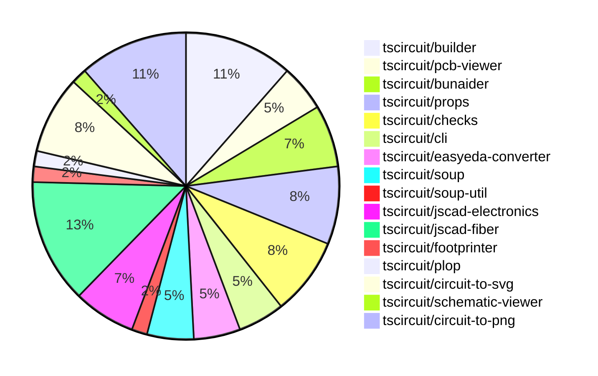

# contribution-tracker

Generates weekly contribution overviews for tscircuit contributors. Check out all
the [contribution overviews here](./contribution-overviews/)

* All PRs in the tscircuit org are scanned/summarized via Claude Haiku
* Claude classifies each Diff/PR as a Major, Minor or Tiny contribution
* All the PRs, summaries, and classifications are organized into charts and tables

The current week is shown below. There are 3 major sections:

* [Contributor Overview](#contributor-overview)
* [PRs by Repository](#prs-by-repository)
* [PRs by Contributor](#changes-by-contributor)

## Current Week

<!-- START_CURRENT_WEEK -->

# Contribution Overview 2024-07-20

## PRs by Repository

## Contributor Overview

| Contributor | 🐳 Major | 🐙 Minor | 🐌 Tiny |
|-------------|-------|-------|-------|
| tscircuitbot | 3 | 2 | 0 |
| andrii-balitskyi | 4 | 1 | 0 |
| seveibar | 14 | 10 | 1 |
| imrishabh18 | 9 | 3 | 2 |
| DamilolaAlao | 0 | 1 | 0 |
| syedbarimanjan | 0 | 0 | 1 |
| Slaviiiii | 5 | 1 | 0 |
| r-bt | 2 | 0 | 1 |

## Changes by Repository

### [tscircuit/builder](https://github.com/tscircuit/builder)

| PR # | Impact | Contributor | Description |
|------|--------|-------------|-------------|
| [#85](https://github.com/tscircuit/builder/pull/85) | 🐳 Major | tscircuitbot | Adds a `routingDisabled` option to the `GroupBuilder` class, which allows disabling the generation of PCB traces and vias. |
| [#82](https://github.com/tscircuit/builder/pull/82) | 🐳 Major | andrii-balitskyi | Set the `y` coordinate of the `cad_component` to `180` when it's on the bottom layer. |
| [#84](https://github.com/tscircuit/builder/pull/84) | 🐳 Major | seveibar | Add a GitHub Actions workflow for the "bunaider" tool to automatically fix issues labeled with "aider" |
| [#80](https://github.com/tscircuit/builder/pull/80) | 🐳 Major | seveibar | Handle PCB routes when finding the center of bounds, and handle cases where there are no available points in the bounds. |
| [#81](https://github.com/tscircuit/builder/pull/81) | 🐙 Minor | seveibar | Adds a new function `buildPcbTraceElements` to the library for exporting PCB trace elements for benchmarking. |
| [#79](https://github.com/tscircuit/builder/pull/79) | 🐙 Minor | seveibar | Adds support for `pcbX` and `pcbY` properties in the `<board />` component, which can be used instead of the deprecated `center_x`, `center_y`, and `center` properties. |
| [#78](https://github.com/tscircuit/builder/pull/78) | 🐙 Minor | seveibar | Add a development guide for the `@tscircuit/builder` library, including information on running tests and the process for addressing issues. |

### [tscircuit/pcb-viewer](https://github.com/tscircuit/pcb-viewer)

| PR # | Impact | Contributor | Description |
|------|--------|-------------|-------------|
| [#30](https://github.com/tscircuit/pcb-viewer/pull/30) | 🐳 Major | tscircuitbot | Add support for displaying error diamonds at error location |
| [#28](https://github.com/tscircuit/pcb-viewer/pull/28) | 🐳 Major | seveibar | Add npm build workflow and fix build error |
| [#26](https://github.com/tscircuit/pcb-viewer/pull/26) | 🐙 Minor | seveibar | Update deprecated builder import to soup |

### [tscircuit/bunaider](https://github.com/tscircuit/bunaider)

| PR # | Impact | Contributor | Description |
|------|--------|-------------|-------------|
| [#10](https://github.com/tscircuit/bunaider/pull/10) | 🐳 Major | tscircuitbot | Fix for issue #7 by creating a pull request and commenting on the original issue. |
| [#11](https://github.com/tscircuit/bunaider/pull/11) | 🐳 Major | seveibar | Fixes scanning of pull request comments using the Octokit library by adding support for fetching review comments and reviews. |
| [#9](https://github.com/tscircuit/bunaider/pull/9) | 🐳 Major | seveibar | Allow bunaider to respond to comments on PRs |
| [#4](https://github.com/tscircuit/bunaider/pull/4) | 🐌 Tiny | seveibar | Update the version in the CLI program to use the version from the package.json file. |

### [tscircuit/props](https://github.com/tscircuit/props)

| PR # | Impact | Contributor | Description |
|------|--------|-------------|-------------|
| [#12](https://github.com/tscircuit/props/pull/12) | 🐳 Major | seveibar | Add a GitHub workflow to automatically fix issues labeled as 'aider' |
| [#13](https://github.com/tscircuit/props/pull/13) | 🐙 Minor | tscircuitbot | Add an optional `routingDisabled` property to the `GroupProps` type. |
| [#10](https://github.com/tscircuit/props/pull/10) | 🐙 Minor | seveibar | Add a GitHub Actions workflow to automatically format code in pull requests. |
| [#8](https://github.com/tscircuit/props/pull/8) | 🐙 Minor | seveibar | Make `pinLabels` and `schPortArrangement` optional in the component props |
| [#9](https://github.com/tscircuit/props/pull/9) | 🐙 Minor | imrishabh18 | Add a new manufacturer part number field to the `bugProps` interface. |

### [tscircuit/checks](https://github.com/tscircuit/checks)

| PR # | Impact | Contributor | Description |
|------|--------|-------------|-------------|
| [#6](https://github.com/tscircuit/checks/pull/6) | 🐳 Major | seveibar | The pull request fixes a bug in the `tracesOverlap` function by returning the intersection point instead of just a boolean value. |
| [#5](https://github.com/tscircuit/checks/pull/5) | 🐳 Major | seveibar | Add a hack to allow missing `start_pcb_port_ids` and `end_pcb_port_ids` to not break overlap testing when a trace only contains two ports. |
| [#4](https://github.com/tscircuit/checks/pull/4) | 🐳 Major | seveibar | This pull request fixes a bug in the `check-each-pcb-trace-non-overlapping.ts` file by ensuring that the `start_pcb_port_id` and `end_pcb_port_id` properties are correctly added to the `PCBTrace` objects if they are missing. It also adds a regression test case to ensure the fix works as expected. |
| [#3](https://github.com/tscircuit/checks/pull/3) | 🐳 Major | seveibar | Implement nonoverlapping checks, add NetManager system for detecting connected traces, and add workflows |
| [#8](https://github.com/tscircuit/checks/pull/8) | 🐙 Minor | tscircuitbot | Fix issue #7 by handling the case where a source trace is found but has no connected source ports. |

### [tscircuit/cli](https://github.com/tscircuit/cli)

| PR # | Impact | Contributor | Description |
|------|--------|-------------|-------------|
| [#107](https://github.com/tscircuit/cli/pull/107) | 🟣 | andrii-balitskyi | Add biome and formatbot workflow |
| [#108](https://github.com/tscircuit/cli/pull/108) | 🐳 Major | andrii-balitskyi | Ensure that the .npmignore file is read when publishing packages. |
| [#111](https://github.com/tscircuit/cli/pull/111) | 🐙 Minor | DamilolaAlao | Add a new "go" command to the CLI that opens the TSCircuit Getting Started tutorial in the user's default browser. |

### [tscircuit/easyeda-converter](https://github.com/tscircuit/easyeda-converter)

| PR # | Impact | Contributor | Description |
|------|--------|-------------|-------------|
| [#35](https://github.com/tscircuit/easyeda-converter/pull/35) | 🐳 Major | andrii-balitskyi | Make sure the model object URL resolves when generating TypeScript components. |
| [#33](https://github.com/tscircuit/easyeda-converter/pull/33) | 🐳 Major | andrii-balitskyi | When specifying `-t tsx`, the base component filename is now based on the manufacturer part number instead of the input file name. |
| [#34](https://github.com/tscircuit/easyeda-converter/pull/34) | 🐙 Minor | andrii-balitskyi | Make `SMT` and `jlcOnSale` properties optional in the `EasyEdaJsonSchema`. |

### [tscircuit/soup](https://github.com/tscircuit/soup)

| PR # | Impact | Contributor | Description |
|------|--------|-------------|-------------|
| [#14](https://github.com/tscircuit/soup/pull/14) | 🐳 Major | seveibar | Add "center" to pcb_trace_error and add biome.json |
| [#13](https://github.com/tscircuit/soup/pull/13) | 🐙 Minor | imrishabh18 | Add a new field `manufacturer_part_number` to the `source_component_base` schema. |
| [#12](https://github.com/tscircuit/soup/pull/12) | 🐌 Tiny | syedbarimanjan | Fix a typo in the export declaration to match the file name. |

### [tscircuit/soup-util](https://github.com/tscircuit/soup-util)

| PR # | Impact | Contributor | Description |
|------|--------|-------------|-------------|
| [#5](https://github.com/tscircuit/soup-util/pull/5) | 🐳 Major | seveibar | Introduces a feature to get readable names for various elements in a circuit, including PCB traces, ports, and SMT pads. |

### [tscircuit/jscad-electronics](https://github.com/tscircuit/jscad-electronics)

| PR # | Impact | Contributor | Description |
|------|--------|-------------|-------------|
| [#7](https://github.com/tscircuit/jscad-electronics/pull/7) | 🐳 Major | seveibar | Add Footprint Pads for sizing, add 0603 resistor footprint + 3D model |
| [#10](https://github.com/tscircuit/jscad-electronics/pull/10) | 🐳 Major | Slaviiiii | Implement a 0402 component with accurate dimensions and terminator pads. |
| [#9](https://github.com/tscircuit/jscad-electronics/pull/9) | 🐳 Major | Slaviiiii | Add a new 0805 component |
| [#8](https://github.com/tscircuit/jscad-electronics/pull/8) | 🐳 Major | Slaviiiii | Introduce new components `A0603`, `ExtrudedPads`, `FootprintPad`, and `FootprintPlatedHole`, and update dependencies and configuration. |

### [tscircuit/jscad-fiber](https://github.com/tscircuit/jscad-fiber)

| PR # | Impact | Contributor | Description |
|------|--------|-------------|-------------|
| [#34](https://github.com/tscircuit/jscad-fiber/pull/34) | 🐳 Major | seveibar | Introduce `withOffsetProp` and `withColorProp` higher-order components to enable setting `offset` and `color` props on the `<Cuboid>` component. |
| [#37](https://github.com/tscircuit/jscad-fiber/pull/37) | 🐳 Major | Slaviiiii | Add a new "Rotate" wrapper component to the library |
| [#29](https://github.com/tscircuit/jscad-fiber/pull/29) | 🐳 Major | Slaviiiii | Implement union and translate wrappers |
| [#26](https://github.com/tscircuit/jscad-fiber/pull/26) | 🐳 Major | r-bt | Adds a new `JSCadThreeMesh` component that uses the `useJSCADRenderer` hook to render 3D objects from JSCAD code in a React Three Fiber scene. |
| [#22](https://github.com/tscircuit/jscad-fiber/pull/22) | 🐳 Major | r-bt | Adds a `<custom>` component that supports rendering custom geometry, which is useful for testing and for rendering geometry that cannot be made declaratively. |
| [#28](https://github.com/tscircuit/jscad-fiber/pull/28) | 🐙 Minor | seveibar | Have format ignore package.json, fix status checks |
| [#39](https://github.com/tscircuit/jscad-fiber/pull/39) | 🐙 Minor | Slaviiiii | Adds support for both `rotation` and `angles` props in the `Rotate` component, allowing for more flexibility in how rotation is specified. |
| [#24](https://github.com/tscircuit/jscad-fiber/pull/24) | 🐌 Tiny | r-bt | Update the version in package.json to publish a new version on npm |

### [tscircuit/footprinter](https://github.com/tscircuit/footprinter)

| PR # | Impact | Contributor | Description |
|------|--------|-------------|-------------|
| [#12](https://github.com/tscircuit/footprinter/pull/12) | 🐙 Minor | seveibar | Update the build system to target `esnext` instead of `es2022` and use `moduleResolution: "Bundler"` to avoid the Vite lodash issue. |

### [tscircuit/plop](https://github.com/tscircuit/plop)

| PR # | Impact | Contributor | Description |
|------|--------|-------------|-------------|
| [#2](https://github.com/tscircuit/plop/pull/2) | 🐙 Minor | seveibar | Fix looking for biome dependency inside of dependencies rather than devDependencies |

### [tscircuit/circuit-to-svg](https://github.com/tscircuit/circuit-to-svg)

| PR # | Impact | Contributor | Description |
|------|--------|-------------|-------------|
| [#9](https://github.com/tscircuit/circuit-to-svg/pull/9) | 🐳 Major | imrishabh18 | Add a GitHub workflow to publish the project to npm |
| [#6](https://github.com/tscircuit/circuit-to-svg/pull/6) | 🐳 Major | imrishabh18 | Added a new function `pcbSoupToSvg` to render a PCB circuit as an SVG. |
| [#5](https://github.com/tscircuit/circuit-to-svg/pull/5) | 🐳 Major | imrishabh18 | Storybook added to the project |
| [#3](https://github.com/tscircuit/circuit-to-svg/pull/3) | 🐳 Major | imrishabh18 | Add a new function to generate SVG from soup data |
| [#8](https://github.com/tscircuit/circuit-to-svg/pull/8) | 🐙 Minor | seveibar | Rename the package from "@tscircuit/soup-to-svg" to "circuit-to-svg" and update the description to reflect the purpose of converting Circuit JSON to SVG. |

### [tscircuit/schematic-viewer](https://github.com/tscircuit/schematic-viewer)

| PR # | Impact | Contributor | Description |
|------|--------|-------------|-------------|
| [#47](https://github.com/tscircuit/schematic-viewer/pull/47) | 🐳 Major | imrishabh18 | Adds manufacturer part number feature to the SimpleBug component |

### [tscircuit/circuit-to-png](https://github.com/tscircuit/circuit-to-png)

| PR # | Impact | Contributor | Description |
|------|--------|-------------|-------------|
| [#7](https://github.com/tscircuit/circuit-to-png/pull/7) | 🐳 Major | imrishabh18 | Add a GitHub Actions workflow to publish the package to npm |
| [#6](https://github.com/tscircuit/circuit-to-png/pull/6) | 🐳 Major | imrishabh18 | Refactor the `circuitToPng` function to accept a `circuitType` parameter and use the appropriate `pcbSoupToSvg` or `soupToSvg` function to generate the SVG. |
| [#4](https://github.com/tscircuit/circuit-to-png/pull/4) | 🐳 Major | imrishabh18 | Introduces a new feature to convert a circuit represented as a SOUP (Structured Object Markup) to a PNG image. |
| [#2](https://github.com/tscircuit/circuit-to-png/pull/2) | 🐳 Major | imrishabh18 | Initialize the repository with a .gitignore file, a README.md file, and a biome.json file for project configuration. |
| [#10](https://github.com/tscircuit/circuit-to-png/pull/10) | 🐙 Minor | imrishabh18 | Add missing version field in package.json |
| [#9](https://github.com/tscircuit/circuit-to-png/pull/9) | 🐌 Tiny | imrishabh18 | Update the lock file to the latest version |
| [#8](https://github.com/tscircuit/circuit-to-png/pull/8) | 🐌 Tiny | imrishabh18 | Update README and package dependencies. |

## Changes by Contributor

### [tscircuitbot](https://github.com/tscircuitbot)

| PR # | Impact | Description |
|------|--------|-------------|
| [#85](https://github.com/tscircuit/builder/pull/85) | 🐳 Major | Adds a `routingDisabled` option to the `GroupBuilder` class, which allows disabling the generation of PCB traces and vias. |
| [#30](https://github.com/tscircuit/pcb-viewer/pull/30) | 🐳 Major | Add support for displaying error diamonds at error location |
| [#10](https://github.com/tscircuit/bunaider/pull/10) | 🐳 Major | Fix for issue #7 by creating a pull request and commenting on the original issue. |
| [#13](https://github.com/tscircuit/props/pull/13) | 🐙 Minor | Add an optional `routingDisabled` property to the `GroupProps` type. |
| [#8](https://github.com/tscircuit/checks/pull/8) | 🐙 Minor | Fix issue #7 by handling the case where a source trace is found but has no connected source ports. |

### [andrii-balitskyi](https://github.com/andrii-balitskyi)

| PR # | Impact | Description |
|------|--------|-------------|
| [#82](https://github.com/tscircuit/builder/pull/82) | 🐳 Major | Set the `y` coordinate of the `cad_component` to `180` when it's on the bottom layer. |
| [#107](https://github.com/tscircuit/cli/pull/107) | 🟣 | Add biome and formatbot workflow |
| [#108](https://github.com/tscircuit/cli/pull/108) | 🐳 Major | Ensure that the .npmignore file is read when publishing packages. |
| [#35](https://github.com/tscircuit/easyeda-converter/pull/35) | 🐳 Major | Make sure the model object URL resolves when generating TypeScript components. |
| [#33](https://github.com/tscircuit/easyeda-converter/pull/33) | 🐳 Major | When specifying `-t tsx`, the base component filename is now based on the manufacturer part number instead of the input file name. |
| [#34](https://github.com/tscircuit/easyeda-converter/pull/34) | 🐙 Minor | Make `SMT` and `jlcOnSale` properties optional in the `EasyEdaJsonSchema`. |

### [seveibar](https://github.com/seveibar)

| PR # | Impact | Description |
|------|--------|-------------|
| [#84](https://github.com/tscircuit/builder/pull/84) | 🐳 Major | Add a GitHub Actions workflow for the "bunaider" tool to automatically fix issues labeled with "aider" |
| [#80](https://github.com/tscircuit/builder/pull/80) | 🐳 Major | Handle PCB routes when finding the center of bounds, and handle cases where there are no available points in the bounds. |
| [#28](https://github.com/tscircuit/pcb-viewer/pull/28) | 🐳 Major | Add npm build workflow and fix build error |
| [#14](https://github.com/tscircuit/soup/pull/14) | 🐳 Major | Add "center" to pcb_trace_error and add biome.json |
| [#5](https://github.com/tscircuit/soup-util/pull/5) | 🐳 Major | Introduces a feature to get readable names for various elements in a circuit, including PCB traces, ports, and SMT pads. |
| [#12](https://github.com/tscircuit/props/pull/12) | 🐳 Major | Add a GitHub workflow to automatically fix issues labeled as 'aider' |
| [#7](https://github.com/tscircuit/jscad-electronics/pull/7) | 🐳 Major | Add Footprint Pads for sizing, add 0603 resistor footprint + 3D model |
| [#34](https://github.com/tscircuit/jscad-fiber/pull/34) | 🐳 Major | Introduce `withOffsetProp` and `withColorProp` higher-order components to enable setting `offset` and `color` props on the `<Cuboid>` component. |
| [#6](https://github.com/tscircuit/checks/pull/6) | 🐳 Major | The pull request fixes a bug in the `tracesOverlap` function by returning the intersection point instead of just a boolean value. |
| [#5](https://github.com/tscircuit/checks/pull/5) | 🐳 Major | Add a hack to allow missing `start_pcb_port_ids` and `end_pcb_port_ids` to not break overlap testing when a trace only contains two ports. |
| [#4](https://github.com/tscircuit/checks/pull/4) | 🐳 Major | This pull request fixes a bug in the `check-each-pcb-trace-non-overlapping.ts` file by ensuring that the `start_pcb_port_id` and `end_pcb_port_id` properties are correctly added to the `PCBTrace` objects if they are missing. It also adds a regression test case to ensure the fix works as expected. |
| [#3](https://github.com/tscircuit/checks/pull/3) | 🐳 Major | Implement nonoverlapping checks, add NetManager system for detecting connected traces, and add workflows |
| [#11](https://github.com/tscircuit/bunaider/pull/11) | 🐳 Major | Fixes scanning of pull request comments using the Octokit library by adding support for fetching review comments and reviews. |
| [#9](https://github.com/tscircuit/bunaider/pull/9) | 🐳 Major | Allow bunaider to respond to comments on PRs |
| [#81](https://github.com/tscircuit/builder/pull/81) | 🐙 Minor | Adds a new function `buildPcbTraceElements` to the library for exporting PCB trace elements for benchmarking. |
| [#79](https://github.com/tscircuit/builder/pull/79) | 🐙 Minor | Adds support for `pcbX` and `pcbY` properties in the `<board />` component, which can be used instead of the deprecated `center_x`, `center_y`, and `center` properties. |
| [#78](https://github.com/tscircuit/builder/pull/78) | 🐙 Minor | Add a development guide for the `@tscircuit/builder` library, including information on running tests and the process for addressing issues. |
| [#26](https://github.com/tscircuit/pcb-viewer/pull/26) | 🐙 Minor | Update deprecated builder import to soup |
| [#10](https://github.com/tscircuit/props/pull/10) | 🐙 Minor | Add a GitHub Actions workflow to automatically format code in pull requests. |
| [#8](https://github.com/tscircuit/props/pull/8) | 🐙 Minor | Make `pinLabels` and `schPortArrangement` optional in the component props |
| [#12](https://github.com/tscircuit/footprinter/pull/12) | 🐙 Minor | Update the build system to target `esnext` instead of `es2022` and use `moduleResolution: "Bundler"` to avoid the Vite lodash issue. |
| [#28](https://github.com/tscircuit/jscad-fiber/pull/28) | 🐙 Minor | Have format ignore package.json, fix status checks |
| [#2](https://github.com/tscircuit/plop/pull/2) | 🐙 Minor | Fix looking for biome dependency inside of dependencies rather than devDependencies |
| [#8](https://github.com/tscircuit/circuit-to-svg/pull/8) | 🐙 Minor | Rename the package from "@tscircuit/soup-to-svg" to "circuit-to-svg" and update the description to reflect the purpose of converting Circuit JSON to SVG. |
| [#4](https://github.com/tscircuit/bunaider/pull/4) | 🐌 Tiny | Update the version in the CLI program to use the version from the package.json file. |

### [imrishabh18](https://github.com/imrishabh18)

| PR # | Impact | Description |
|------|--------|-------------|
| [#47](https://github.com/tscircuit/schematic-viewer/pull/47) | 🐳 Major | Adds manufacturer part number feature to the SimpleBug component |
| [#9](https://github.com/tscircuit/circuit-to-svg/pull/9) | 🐳 Major | Add a GitHub workflow to publish the project to npm |
| [#6](https://github.com/tscircuit/circuit-to-svg/pull/6) | 🐳 Major | Added a new function `pcbSoupToSvg` to render a PCB circuit as an SVG. |
| [#5](https://github.com/tscircuit/circuit-to-svg/pull/5) | 🐳 Major | Storybook added to the project |
| [#3](https://github.com/tscircuit/circuit-to-svg/pull/3) | 🐳 Major | Add a new function to generate SVG from soup data |
| [#7](https://github.com/tscircuit/circuit-to-png/pull/7) | 🐳 Major | Add a GitHub Actions workflow to publish the package to npm |
| [#6](https://github.com/tscircuit/circuit-to-png/pull/6) | 🐳 Major | Refactor the `circuitToPng` function to accept a `circuitType` parameter and use the appropriate `pcbSoupToSvg` or `soupToSvg` function to generate the SVG. |
| [#4](https://github.com/tscircuit/circuit-to-png/pull/4) | 🐳 Major | Introduces a new feature to convert a circuit represented as a SOUP (Structured Object Markup) to a PNG image. |
| [#2](https://github.com/tscircuit/circuit-to-png/pull/2) | 🐳 Major | Initialize the repository with a .gitignore file, a README.md file, and a biome.json file for project configuration. |
| [#13](https://github.com/tscircuit/soup/pull/13) | 🐙 Minor | Add a new field `manufacturer_part_number` to the `source_component_base` schema. |
| [#9](https://github.com/tscircuit/props/pull/9) | 🐙 Minor | Add a new manufacturer part number field to the `bugProps` interface. |
| [#10](https://github.com/tscircuit/circuit-to-png/pull/10) | 🐙 Minor | Add missing version field in package.json |
| [#9](https://github.com/tscircuit/circuit-to-png/pull/9) | 🐌 Tiny | Update the lock file to the latest version |
| [#8](https://github.com/tscircuit/circuit-to-png/pull/8) | 🐌 Tiny | Update README and package dependencies. |

### [DamilolaAlao](https://github.com/DamilolaAlao)

| PR # | Impact | Description |
|------|--------|-------------|
| [#111](https://github.com/tscircuit/cli/pull/111) | 🐙 Minor | Add a new "go" command to the CLI that opens the TSCircuit Getting Started tutorial in the user's default browser. |

### [syedbarimanjan](https://github.com/syedbarimanjan)

| PR # | Impact | Description |
|------|--------|-------------|
| [#12](https://github.com/tscircuit/soup/pull/12) | 🐌 Tiny | Fix a typo in the export declaration to match the file name. |

### [Slaviiiii](https://github.com/Slaviiiii)

| PR # | Impact | Description |
|------|--------|-------------|
| [#10](https://github.com/tscircuit/jscad-electronics/pull/10) | 🐳 Major | Implement a 0402 component with accurate dimensions and terminator pads. |
| [#9](https://github.com/tscircuit/jscad-electronics/pull/9) | 🐳 Major | Add a new 0805 component |
| [#8](https://github.com/tscircuit/jscad-electronics/pull/8) | 🐳 Major | Introduce new components `A0603`, `ExtrudedPads`, `FootprintPad`, and `FootprintPlatedHole`, and update dependencies and configuration. |
| [#37](https://github.com/tscircuit/jscad-fiber/pull/37) | 🐳 Major | Add a new "Rotate" wrapper component to the library |
| [#29](https://github.com/tscircuit/jscad-fiber/pull/29) | 🐳 Major | Implement union and translate wrappers |
| [#39](https://github.com/tscircuit/jscad-fiber/pull/39) | 🐙 Minor | Adds support for both `rotation` and `angles` props in the `Rotate` component, allowing for more flexibility in how rotation is specified. |

### [r-bt](https://github.com/r-bt)

| PR # | Impact | Description |
|------|--------|-------------|
| [#26](https://github.com/tscircuit/jscad-fiber/pull/26) | 🐳 Major | Adds a new `JSCadThreeMesh` component that uses the `useJSCADRenderer` hook to render 3D objects from JSCAD code in a React Three Fiber scene. |
| [#22](https://github.com/tscircuit/jscad-fiber/pull/22) | 🐳 Major | Adds a `<custom>` component that supports rendering custom geometry, which is useful for testing and for rendering geometry that cannot be made declaratively. |
| [#24](https://github.com/tscircuit/jscad-fiber/pull/24) | 🐌 Tiny | Update the version in package.json to publish a new version on npm |

<!-- END_CURRENT_WEEK -->
