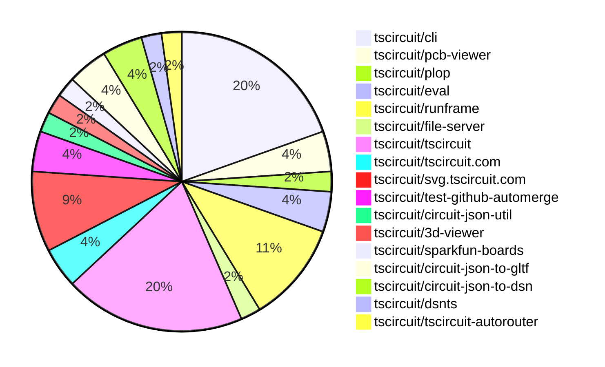
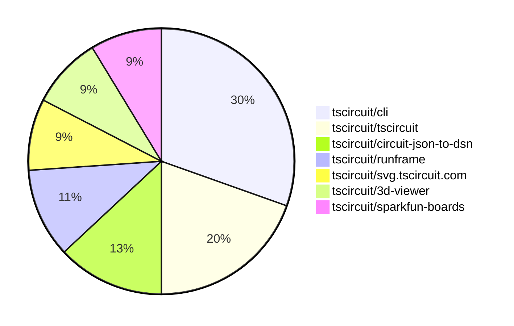

# contribution-tracker

[contributions.tscircuit.com](https://contributions.tscircuit.com) ・ [tscircuit.com](https://tscircuit.com) ・ [Contribution Overviews](./contribution-overviews/) ・ [Changelogs](./changelogs/)

Generates weekly contribution overviews for tscircuit contributors. Check out all
the [contribution overviews here](./contribution-overviews/)
You can find AI-generated monthly changelogs in the [changelogs directory](./changelogs/).

- All PRs in the tscircuit org are scanned/summarized via an LLM
- The LLM classifies each Diff/PR as into a set of attributes for scoring
- All the PRs, summaries, and classifications are organized into charts and tables for [the website](https://contributions.tscircuit.com)

> Want to run locally? See the [Development Section](#development)

The current week is shown below. There are 4 major sections:

- [Contributor Overview](#contributor-overview)
- [PRs by Repository](#prs-by-repository)
- [PRs by Contributor](#changes-by-contributor)
- [Scoring & Sponsorship System](#scoring--sponsorship-system)

## Current Week

<!-- START_CURRENT_WEEK -->

# Contribution Overview 2025-12-03

The current week is shown below. There are 4 major sections:

- [Contributor Overview](#contributor-overview)
- [PRs by Repository](#prs-by-repository)
- [PRs by Contributor](#changes-by-contributor)
- [Scoring & Sponsorship System](#scoring--sponsorship-system)

## PRs by Repository



## Contributor Overview

| Contributor | 🐳 Major | 🐙 Minor | 🐌 Tiny | ⭐ | Score | Discussion Contributions |
|-------------|---------|---------|---------|-----|----------------|--------------------------|
| [seveibar](#seveibar) | 1 | 1 | 6 | ⭐⭐ | 13 | 0🔹 0🔶 0💎 |
| [tscircuitbot](#tscircuitbot) | 0 | 0 | 23 | ⭐⭐ | 12 | 0🔹 0🔶 0💎 |
| [imrishabh18](#imrishabh18) | 1 | 1 | 2 | ⭐ | 9 | 0🔹 0🔶 0💎 |
| [rushabhcodes](#rushabhcodes) | 2 | 0 | 0 | ⭐ | 8 | 0🔹 0🔶 0💎 |
| [techmannih](#techmannih) | 0 | 0 | 2 | ⭐ | 4 | 0🔹 0🔶 0💎 |
| [MustafaMulla29](#MustafaMulla29) | 0 | 1 | 2 | ⭐ | 4 | 0🔹 0🔶 0💎 |
| [0hmX](#0hmX) | 1 | 0 | 0 | ⭐ | 4 | 0🔹 0🔶 0💎 |
| [RaghavArora14](#RaghavArora14) | 0 | 1 | 0 |  | 3 | 0🔹 0🔶 0💎 |
| [Abse2001](#Abse2001) | 0 | 1 | 0 |  | 2 | 0🔹 0🔶 0💎 |
| [Ayushjhawar8](#Ayushjhawar8) | 0 | 1 | 0 |  | 2 | 0🔹 0🔶 0💎 |

> Note: AI evaluates PRs and assigns 1-3 star ratings automatically. 4 and 5 star ratings require manual staff review.

### Discussion Contribution Legend

- 🔹 Normal Comments: Basic participation with minimal effort
- 🔶 Great Informative Comments: Thoughtful participation that adds value
- 💎 Incredible Comments: Exceptional participation with high-quality content

## Review Table

[reviews-received-hover]: ## "Number of reviews received for PRs for this contributor"
[approvals-received-hover]: ## "Number of approvals received for PRs this contributor authored"
[rejections-received-hover]: ## "Number of rejections received for PRs this contributor authored"
[prs-opened-hover]: ## "Number of PRs opened by this contributor"
[issues-created-hover]: ## "Number of issues created by this contributor"
[bountied-issues-hover]: ## "Number of issues this contributor created with a bounty"
[bountied-issue-$-hover]: ## "Total bounty amount placed on issues authored by this contributor"

| Contributor | Reviews Received | Approvals Received | Rejections Received | Approvals | Rejections | PRs Opened | PRs Merged | Score | Issues Created | Bountied Issues | Bountied Issue $ |
|---|---|---|---|---|---|---|---|---|---|---|---|
| [seveibar](#seveibar) | 0 | 0 | 0 | 9 | 3 | 13 | 8 | 13 | 0 | 0 | 0 |
| [tscircuitbot](#tscircuitbot) | 0 | 0 | 0 | 0 | 0 | 30 | 23 | 12 | 0 | 0 | 0 |
| [Abse2001](#Abse2001) | 1 | 1 | 0 | 0 | 0 | 2 | 1 | 2 | 0 | 0 | 0 |
| [AnasSarkiz](#AnasSarkiz) | 2 | 0 | 2 | 0 | 0 | 2 | 0 | 0 | 0 | 0 | 0 |
| [techmannih](#techmannih) | 4 | 3 | 0 | 1 | 0 | 4 | 2 | 4 | 0 | 0 | 0 |
| [rushabhcodes](#rushabhcodes) | 10 | 5 | 0 | 0 | 0 | 4 | 2 | 8 | 0 | 0 | 0 |
| [Ayushjhawar8](#Ayushjhawar8) | 3 | 1 | 1 | 0 | 0 | 2 | 1 | 2 | 0 | 0 | 0 |
| [imrishabh18](#imrishabh18) | 3 | 1 | 0 | 2 | 0 | 4 | 4 | 9 | 0 | 0 | 0 |
| [Devesh36](#Devesh36) | 0 | 0 | 0 | 0 | 0 | 1 | 0 | 0 | 0 | 0 | 0 |
| [MustafaMulla29](#MustafaMulla29) | 2 | 1 | 0 | 0 | 0 | 5 | 3 | 4 | 0 | 0 | 0 |
| [0hmX](#0hmX) | 3 | 1 | 0 | 0 | 0 | 2 | 1 | 4 | 0 | 0 | 0 |
| [ShiboSoftwareDev](#ShiboSoftwareDev) | 0 | 0 | 0 | 2 | 0 | 0 | 0 | 0 | 0 | 0 | 0 |
| [RaghavArora14](#RaghavArora14) | 2 | 2 | 0 | 1 | 0 | 1 | 1 | 3 | 0 | 0 | 0 |

## Top 7 Repositories by Contribution Points



## Scoring & Sponsorship System

### Overview

PRs are analyzed by AI and assigned a **star rating (1-3 stars)**. 4 and 5 star ratings can only be manually assigned by staff. Weekly scores use `2^(starRating - 1)` per PR (capped at 12 PRs per rating), plus review/discussion points.

### Weekly Score → Star String

| Score Range | Star String | Count Value |
|------------|-------------|-------------|
| 0-3 | (empty) | 0 stars |
| 4-10 | ⭐ | 1 star |
| 11-30 | ⭐⭐ | 2 stars |
| 31-50 | ⭐⭐⭐ | 3 stars |
| 51-75 | 👑 | 1 crown |
| 76-100 | 👑👑 | 2 crowns |
| 101+ | 👑👑👑 | 3 crowns |

> Crowns count as 3 stars for sponsorship.

### Monthly Sponsorship Calculation

The sponsorship system calculates monthly payments based on your **weekly star counts** over the complete weeks in that month (typically 4-5 weeks, Wednesday-Tuesday format).

**Step 1: Collect Weekly Stars**
- All complete weeks in the month are analyzed
- Each week's star string is converted to a numeric count (⭐ = 1 star, ⭐⭐⭐ = 3 stars)
- Example: `[2, 2, 2, 1, 0]` means 2 stars in week 1, 2 stars in week 2, etc.

**Step 2: Calculate Metrics**
- **Median stars**: The median value of all weekly star counts
- **Min stars**: The minimum weekly star count
- **Max stars**: The maximum weekly star count
- **High score**: The maximum raw weekly score (0-100+ range from the scoring table) from any week in the month

**Step 3: Determine Base Amount**
The sponsorship amount is calculated based on these metrics (checked in order):

| Condition | Base Amount |
|-----------|-------------|
| `minStarCount >= 3` | **$700** |
| `medianStars >= 3` | **$550** |
| `medianStars >= 2.5` | **$400** |
| `medianStars >= 2` | **$250** |
| `medianStars >= 1.5` | **$120** |
| `medianStars >= 1` | **$75** |
| `maxStarCount >= 2` | **$45** |
| `maxStarCount >= 1` | **$30** |
| `highScore >= 3` (and all stars = 0) | **$10** |

| Maintainer Level | Monthly Bonus |
|------------------|---------------|
| Level 1 | **$200** |
| Level 2 | **$350** |
| Level 3 | **$500** |
| Level 4 | **$850** |
| Level 5 | **$1300** |
| Level 6 | **$2000** |

**Final Amount** = Base Amount + Maintainer Bonus

## Changes by Repository

### [tscircuit/cli](https://github.com/tscircuit/cli)

| PR # | Impact | Rating | Contributor | Description |
|------|--------|--------|-------------|-------------|
| [#1239](https://github.com/tscircuit/cli/pull/1239) | 🐳 Major | ⭐⭐⭐ | seveibar | Changes the transpile process to ignore includeBoardFiles globs and prioritize the detected main entrypoint for building. |
| [#1246](https://github.com/tscircuit/cli/pull/1246) | 🐙 Minor | ⭐⭐ | Ayushjhawar8 | Fixes the issue where the tsci search command displays vundefined for packages with missing version information. |
| [#1240](https://github.com/tscircuit/cli/pull/1240) | 🐙 Minor | ⭐⭐ | MustafaMulla29 | Fixes the issue where KiCad .kicad_mod files are not uploaded when the package does not contain a package.json file. |

<details>
<summary>🐌 Tiny Contributions (6)</summary>

| PR # | Impact | Contributor | Description |
|------|--------|-------------|-------------|
| [#1235](https://github.com/tscircuit/cli/pull/1235) | 🐌 Tiny | seveibar | Sets the CLIs tscircuit peer dependency back to a wildcard while keeping the libonly dev dependency. |
| [#1232](https://github.com/tscircuit/cli/pull/1232) | 🐌 Tiny | seveibar | Specifies the installation of Chromium for Playwright in the GitHub Actions workflow. |
| [#1236](https://github.com/tscircuit/cli/pull/1236) | 🐌 Tiny | tscircuitbot | Automated README update with latest CLI usage output. |
| [#1225](https://github.com/tscircuit/cli/pull/1225) | 🐌 Tiny | imrishabh18 | Adds a new browser test that supports bun link functionality for multi-package setups. |
| [#1243](https://github.com/tscircuit/cli/pull/1243) | 🐌 Tiny | MustafaMulla29 | Updates the package version in package.json from 0.1.591 to 0.1.601 |
| [#1244](https://github.com/tscircuit/cli/pull/1244) | 🐌 Tiny | MustafaMulla29 | Updates the package version in package.json from 0.1.601 to 0.1.602 |

</details>

### [tscircuit/pcb-viewer](https://github.com/tscircuit/pcb-viewer)

| PR # | Impact | Rating | Contributor | Description |
|------|--------|--------|-------------|-------------|
| [#515](https://github.com/tscircuit/pcb-viewer/pull/515) | 🐙 Minor | ⭐⭐ | seveibar | Offsets lowercase alphabet glyphs using the library baseline instead of centered positioning, includes baseline offset in text metrics to account for descender depth, and adds tests confirming baseline placement and descender rendering for lowercase text. |

<details>
<summary>🐌 Tiny Contributions (1)</summary>

| PR # | Impact | Contributor | Description |
|------|--------|-------------|-------------|
| [#516](https://github.com/tscircuit/pcb-viewer/pull/516) | 🐌 Tiny | tscircuitbot | Automated package update |

</details>

### [tscircuit/plop](https://github.com/tscircuit/plop)


<details>
<summary>🐌 Tiny Contributions (1)</summary>

| PR # | Impact | Contributor | Description |
|------|--------|-------------|-------------|
| [#26](https://github.com/tscircuit/plop/pull/26) | 🐌 Tiny | seveibar | Adds a post-release step to read the updated package version and include the package version in bun-pver-release PR titles and commit messages. |

</details>

### [tscircuit/eval](https://github.com/tscircuit/eval)


<details>
<summary>🐌 Tiny Contributions (2)</summary>

| PR # | Impact | Contributor | Description |
|------|--------|-------------|-------------|
| [#1638](https://github.com/tscircuit/eval/pull/1638) | 🐌 Tiny | seveibar | Adds zod as a development dependency to ensure compatibility with the core version. |
| [#1639](https://github.com/tscircuit/eval/pull/1639) | 🐌 Tiny | tscircuitbot | Automated package update to version 0.0.515 |

</details>

### [tscircuit/runframe](https://github.com/tscircuit/runframe)


<details>
<summary>🐌 Tiny Contributions (5)</summary>

| PR # | Impact | Contributor | Description |
|------|--------|-------------|-------------|
| [#1964](https://github.com/tscircuit/runframe/pull/1964) | 🐌 Tiny | seveibar | Capture the package version after running pver release and include the version number in the automated bump PR commit message and title. |
| [#1966](https://github.com/tscircuit/runframe/pull/1966) | 🐌 Tiny | tscircuitbot | Updates the tscircuit3d-viewer package from version 0.0.449 to 0.0.450 |
| [#1965](https://github.com/tscircuit/runframe/pull/1965) | 🐌 Tiny | tscircuitbot | Updates the tscircuitpcb-viewer package from version 1.11.273 to 1.11.275 |
| [#1963](https://github.com/tscircuit/runframe/pull/1963) | 🐌 Tiny | tscircuitbot | Automated package update |
| [#1962](https://github.com/tscircuit/runframe/pull/1962) | 🐌 Tiny | tscircuitbot | Updates the tscircuiteval package from version 0.0.514 to 0.0.515 |

</details>

### [tscircuit/file-server](https://github.com/tscircuit/file-server)


<details>
<summary>🐌 Tiny Contributions (1)</summary>

| PR # | Impact | Contributor | Description |
|------|--------|-------------|-------------|
| [#25](https://github.com/tscircuit/file-server/pull/25) | 🐌 Tiny | seveibar | Changes the dependency status of zod from a regular dependency to a peer dependency in the package.json file. |

</details>

### [tscircuit/tscircuit](https://github.com/tscircuit/tscircuit)


<details>
<summary>🐌 Tiny Contributions (9)</summary>

| PR # | Impact | Contributor | Description |
|------|--------|-------------|-------------|
| [#1575](https://github.com/tscircuit/tscircuit/pull/1575) | 🐌 Tiny | tscircuitbot | Automated package update |
| [#1574](https://github.com/tscircuit/tscircuit/pull/1574) | 🐌 Tiny | tscircuitbot | Automated package update |
| [#1573](https://github.com/tscircuit/tscircuit/pull/1573) | 🐌 Tiny | tscircuitbot | Updates the tscircuitcli package to version 0.1.603 in package.json |
| [#1572](https://github.com/tscircuit/tscircuit/pull/1572) | 🐌 Tiny | tscircuitbot | Automated package update |
| [#1571](https://github.com/tscircuit/tscircuit/pull/1571) | 🐌 Tiny | tscircuitbot | Updates the tscircuitcli package to version 0.1.602 |
| [#1570](https://github.com/tscircuit/tscircuit/pull/1570) | 🐌 Tiny | tscircuitbot | Automated package update |
| [#1569](https://github.com/tscircuit/tscircuit/pull/1569) | 🐌 Tiny | tscircuitbot | Updates the tscircuitcli package to version 0.1.601 in the package.json file. |
| [#1568](https://github.com/tscircuit/tscircuit/pull/1568) | 🐌 Tiny | tscircuitbot | Updates the package version from 0.0.1007 to 0.0.1008 in package.json |
| [#1567](https://github.com/tscircuit/tscircuit/pull/1567) | 🐌 Tiny | tscircuitbot | Automated package update |

</details>

### [tscircuit/tscircuit.com](https://github.com/tscircuit/tscircuit.com)


<details>
<summary>🐌 Tiny Contributions (2)</summary>

| PR # | Impact | Contributor | Description |
|------|--------|-------------|-------------|
| [#2113](https://github.com/tscircuit/tscircuit.com/pull/2113) | 🐌 Tiny | tscircuitbot | Updates the tscircuiteval package from version 0.0.514 to 0.0.515 |
| [#2108](https://github.com/tscircuit/tscircuit.com/pull/2108) | 🐌 Tiny | techmannih | Updates the tscircuit3d-viewer package to version 0.0.448 in the package.json file. |

</details>

### [tscircuit/svg.tscircuit.com](https://github.com/tscircuit/svg.tscircuit.com)


<details>
<summary>🐌 Tiny Contributions (4)</summary>

| PR # | Impact | Contributor | Description |
|------|--------|-------------|-------------|
| [#698](https://github.com/tscircuit/svg.tscircuit.com/pull/698) | 🐌 Tiny | tscircuitbot | Updates the tscircuit package version from 0.0.1010 to 0.0.1011 in package.json |
| [#697](https://github.com/tscircuit/svg.tscircuit.com/pull/697) | 🐌 Tiny | tscircuitbot | Updates the tscircuit package version from 0.0.1009 to 0.0.1010 in package.json |
| [#696](https://github.com/tscircuit/svg.tscircuit.com/pull/696) | 🐌 Tiny | tscircuitbot | Updates the tscircuit package version from 0.0.1008 to 0.0.1009 in package.json |
| [#695](https://github.com/tscircuit/svg.tscircuit.com/pull/695) | 🐌 Tiny | tscircuitbot | Updates the tscircuit package version from 0.0.1007 to 0.0.1008 in package.json |

</details>

### [tscircuit/test-github-automerge](https://github.com/tscircuit/test-github-automerge)


<details>
<summary>🐌 Tiny Contributions (2)</summary>

| PR # | Impact | Contributor | Description |
|------|--------|-------------|-------------|
| [#8](https://github.com/tscircuit/test-github-automerge/pull/8) | 🐌 Tiny | tscircuitbot | Updates the tscircuitcircuit-json-util package from version 0.0.72 to 0.0.73 in the project dependencies. |
| [#7](https://github.com/tscircuit/test-github-automerge/pull/7) | 🐌 Tiny | tscircuitbot | Updates the tscircuitcircuit-json-util package from version 0.0.72 to 0.0.73 in the development dependencies. |

</details>

### [tscircuit/circuit-json-util](https://github.com/tscircuit/circuit-json-util)

| PR # | Impact | Rating | Contributor | Description |
|------|--------|--------|-------------|-------------|
| [#71](https://github.com/tscircuit/circuit-json-util/pull/71) | 🐙 Minor | ⭐⭐ | Abse2001 | Adds support for polygon-shaped SMT pads in both bounds and transform utilities, fixing PCB Auto Packing not working on polygon pads in core. |

### [tscircuit/3d-viewer](https://github.com/tscircuit/3d-viewer)

| PR # | Impact | Rating | Contributor | Description |
|------|--------|--------|-------------|-------------|
| [#592](https://github.com/tscircuit/3d-viewer/pull/592) | 🐳 Major | ⭐⭐⭐ | rushabhcodes | Refactors the via geometry generation logic to improve the accuracy and visual representation of PCB vias, fixes a bug in drill hole processing, and adds new Storybook stories for testing and demonstration. |

### [tscircuit/sparkfun-boards](https://github.com/tscircuit/sparkfun-boards)

| PR # | Impact | Rating | Contributor | Description |
|------|--------|--------|-------------|-------------|
| [#215](https://github.com/tscircuit/sparkfun-boards/pull/215) | 🐳 Major | ⭐⭐⭐ | rushabhcodes | Adds a new board definition for the SparkFun Photo Interrupter Breakout Board (GP1A57HRJ00F), including a custom component definition and a new board layout with supporting components. |

### [tscircuit/circuit-json-to-gltf](https://github.com/tscircuit/circuit-json-to-gltf)

| PR # | Impact | Rating | Contributor | Description |
|------|--------|--------|-------------|-------------|
| [#89](https://github.com/tscircuit/circuit-json-to-gltf/pull/89) | 🐙 Minor | ⭐⭐ | RaghavArora14 | Implements copper pour soldermask differentiation in GLTF rendering by integrating the two-layer soldermask approach from circuit-to-svg, ensuring copper pours render correctly based on their covered_with_solder_mask flag. |

<details>
<summary>🐌 Tiny Contributions (1)</summary>

| PR # | Impact | Contributor | Description |
|------|--------|-------------|-------------|
| [#93](https://github.com/tscircuit/circuit-json-to-gltf/pull/93) | 🐌 Tiny | techmannih | Adds a reproduction test for the CAD model Z-coordinate position offset issue in the rendering process. |

</details>

### [tscircuit/circuit-json-to-dsn](https://github.com/tscircuit/circuit-json-to-dsn)

| PR # | Impact | Rating | Contributor | Description |
|------|--------|--------|-------------|-------------|
| [#6](https://github.com/tscircuit/circuit-json-to-dsn/pull/6) | 🐳 Major | ⭐⭐⭐ | imrishabh18 | Adds via padstack support in the library class and updates layer naming conventions to use F.Cu and B.Cu for better clarity in routing. |
| [#7](https://github.com/tscircuit/circuit-json-to-dsn/pull/7) | 🐙 Minor | ⭐⭐ | imrishabh18 | Fixes incorrect rotation of components in DSN by applying modulo 90 to the rotation value, ensuring proper alignment in the design. |

### [tscircuit/dsnts](https://github.com/tscircuit/dsnts)


<details>
<summary>🐌 Tiny Contributions (1)</summary>

| PR # | Impact | Contributor | Description |
|------|--------|-------------|-------------|
| [#8](https://github.com/tscircuit/dsnts/pull/8) | 🐌 Tiny | imrishabh18 | Fixes the net name output format to ensure the net name appears on the same line as the opening parenthesis in the output string. |

</details>

### [tscircuit/tscircuit-autorouter](https://github.com/tscircuit/tscircuit-autorouter)

| PR # | Impact | Rating | Contributor | Description |
|------|--------|--------|-------------|-------------|
| [#358](https://github.com/tscircuit/tscircuit-autorouter/pull/358) | 🐳 Major | ⭐⭐⭐ | 0hmX | Refactors the route stitching logic and fixes layer assignment issues in the unravel solver by removing the RouteDirectionFixSubSolver, improving route stitching selection with a scoring system, adding Z-lock constraints for target nodes, and handling edge cases in the SingleSimplifiedPathSolver. |

## Changes by Contributor

### [seveibar](https://github.com/seveibar)

| PRs # | Impact | Rating | Description |
|------|--------|--------|-------------|
| [#1239](https://github.com/tscircuit/cli/pull/1239) | 🐳 Major | ⭐⭐⭐ | Changes the transpile process to ignore includeBoardFiles globs and prioritize the detected main entrypoint for building. |
| [#515](https://github.com/tscircuit/pcb-viewer/pull/515) | 🐙 Minor | ⭐⭐ | Offsets lowercase alphabet glyphs using the library baseline instead of centered positioning, includes baseline offset in text metrics to account for descender depth, and adds tests confirming baseline placement and descender rendering for lowercase text. |

<details>
<summary>🐌 Tiny Contributions (6)</summary>

| PR # | Impact | Description |
|------|--------|-------------|
| [#26](https://github.com/tscircuit/plop/pull/26) | 🐌 Tiny | Adds a post-release step to read the updated package version and include the package version in bun-pver-release PR titles and commit messages. |
| [#1638](https://github.com/tscircuit/eval/pull/1638) | 🐌 Tiny | Adds zod as a development dependency to ensure compatibility with the core version. |
| [#1964](https://github.com/tscircuit/runframe/pull/1964) | 🐌 Tiny | Capture the package version after running pver release and include the version number in the automated bump PR commit message and title. |
| [#1235](https://github.com/tscircuit/cli/pull/1235) | 🐌 Tiny | Sets the CLIs tscircuit peer dependency back to a wildcard while keeping the libonly dev dependency. |
| [#1232](https://github.com/tscircuit/cli/pull/1232) | 🐌 Tiny | Specifies the installation of Chromium for Playwright in the GitHub Actions workflow. |
| [#25](https://github.com/tscircuit/file-server/pull/25) | 🐌 Tiny | Changes the dependency status of zod from a regular dependency to a peer dependency in the package.json file. |

</details>

### [tscircuitbot](https://github.com/tscircuitbot)


<details>
<summary>🐌 Tiny Contributions (23)</summary>

| PR # | Impact | Description |
|------|--------|-------------|
| [#516](https://github.com/tscircuit/pcb-viewer/pull/516) | 🐌 Tiny | Automated package update |
| [#1575](https://github.com/tscircuit/tscircuit/pull/1575) | 🐌 Tiny | Automated package update |
| [#1574](https://github.com/tscircuit/tscircuit/pull/1574) | 🐌 Tiny | Automated package update |
| [#1573](https://github.com/tscircuit/tscircuit/pull/1573) | 🐌 Tiny | Updates the tscircuitcli package to version 0.1.603 in package.json |
| [#1572](https://github.com/tscircuit/tscircuit/pull/1572) | 🐌 Tiny | Automated package update |
| [#1571](https://github.com/tscircuit/tscircuit/pull/1571) | 🐌 Tiny | Updates the tscircuitcli package to version 0.1.602 |
| [#1570](https://github.com/tscircuit/tscircuit/pull/1570) | 🐌 Tiny | Automated package update |
| [#1569](https://github.com/tscircuit/tscircuit/pull/1569) | 🐌 Tiny | Updates the tscircuitcli package to version 0.1.601 in the package.json file. |
| [#1568](https://github.com/tscircuit/tscircuit/pull/1568) | 🐌 Tiny | Updates the package version from 0.0.1007 to 0.0.1008 in package.json |
| [#1567](https://github.com/tscircuit/tscircuit/pull/1567) | 🐌 Tiny | Automated package update |
| [#2113](https://github.com/tscircuit/tscircuit.com/pull/2113) | 🐌 Tiny | Updates the tscircuiteval package from version 0.0.514 to 0.0.515 |
| [#1639](https://github.com/tscircuit/eval/pull/1639) | 🐌 Tiny | Automated package update to version 0.0.515 |
| [#1966](https://github.com/tscircuit/runframe/pull/1966) | 🐌 Tiny | Updates the tscircuit3d-viewer package from version 0.0.449 to 0.0.450 |
| [#1965](https://github.com/tscircuit/runframe/pull/1965) | 🐌 Tiny | Updates the tscircuitpcb-viewer package from version 1.11.273 to 1.11.275 |
| [#1963](https://github.com/tscircuit/runframe/pull/1963) | 🐌 Tiny | Automated package update |
| [#1962](https://github.com/tscircuit/runframe/pull/1962) | 🐌 Tiny | Updates the tscircuiteval package from version 0.0.514 to 0.0.515 |
| [#1236](https://github.com/tscircuit/cli/pull/1236) | 🐌 Tiny | Automated README update with latest CLI usage output. |
| [#698](https://github.com/tscircuit/svg.tscircuit.com/pull/698) | 🐌 Tiny | Updates the tscircuit package version from 0.0.1010 to 0.0.1011 in package.json |
| [#697](https://github.com/tscircuit/svg.tscircuit.com/pull/697) | 🐌 Tiny | Updates the tscircuit package version from 0.0.1009 to 0.0.1010 in package.json |
| [#696](https://github.com/tscircuit/svg.tscircuit.com/pull/696) | 🐌 Tiny | Updates the tscircuit package version from 0.0.1008 to 0.0.1009 in package.json |
| [#695](https://github.com/tscircuit/svg.tscircuit.com/pull/695) | 🐌 Tiny | Updates the tscircuit package version from 0.0.1007 to 0.0.1008 in package.json |
| [#8](https://github.com/tscircuit/test-github-automerge/pull/8) | 🐌 Tiny | Updates the tscircuitcircuit-json-util package from version 0.0.72 to 0.0.73 in the project dependencies. |
| [#7](https://github.com/tscircuit/test-github-automerge/pull/7) | 🐌 Tiny | Updates the tscircuitcircuit-json-util package from version 0.0.72 to 0.0.73 in the development dependencies. |

</details>

### [Abse2001](https://github.com/Abse2001)

| PRs # | Impact | Rating | Description |
|------|--------|--------|-------------|
| [#71](https://github.com/tscircuit/circuit-json-util/pull/71) | 🐙 Minor | ⭐⭐ | Adds support for polygon-shaped SMT pads in both bounds and transform utilities, fixing PCB Auto Packing not working on polygon pads in core. |

### [rushabhcodes](https://github.com/rushabhcodes)

| PRs # | Impact | Rating | Description |
|------|--------|--------|-------------|
| [#592](https://github.com/tscircuit/3d-viewer/pull/592) | 🐳 Major | ⭐⭐⭐ | Refactors the via geometry generation logic to improve the accuracy and visual representation of PCB vias, fixes a bug in drill hole processing, and adds new Storybook stories for testing and demonstration. |
| [#215](https://github.com/tscircuit/sparkfun-boards/pull/215) | 🐳 Major | ⭐⭐⭐ | Adds a new board definition for the SparkFun Photo Interrupter Breakout Board (GP1A57HRJ00F), including a custom component definition and a new board layout with supporting components. |

### [techmannih](https://github.com/techmannih)


<details>
<summary>🐌 Tiny Contributions (2)</summary>

| PR # | Impact | Description |
|------|--------|-------------|
| [#2108](https://github.com/tscircuit/tscircuit.com/pull/2108) | 🐌 Tiny | Updates the tscircuit3d-viewer package to version 0.0.448 in the package.json file. |
| [#93](https://github.com/tscircuit/circuit-json-to-gltf/pull/93) | 🐌 Tiny | Adds a reproduction test for the CAD model Z-coordinate position offset issue in the rendering process. |

</details>

### [Ayushjhawar8](https://github.com/Ayushjhawar8)

| PRs # | Impact | Rating | Description |
|------|--------|--------|-------------|
| [#1246](https://github.com/tscircuit/cli/pull/1246) | 🐙 Minor | ⭐⭐ | Fixes the issue where the tsci search command displays vundefined for packages with missing version information. |

### [imrishabh18](https://github.com/imrishabh18)

| PRs # | Impact | Rating | Description |
|------|--------|--------|-------------|
| [#6](https://github.com/tscircuit/circuit-json-to-dsn/pull/6) | 🐳 Major | ⭐⭐⭐ | Adds via padstack support in the library class and updates layer naming conventions to use F.Cu and B.Cu for better clarity in routing. |
| [#7](https://github.com/tscircuit/circuit-json-to-dsn/pull/7) | 🐙 Minor | ⭐⭐ | Fixes incorrect rotation of components in DSN by applying modulo 90 to the rotation value, ensuring proper alignment in the design. |

<details>
<summary>🐌 Tiny Contributions (2)</summary>

| PR # | Impact | Description |
|------|--------|-------------|
| [#1225](https://github.com/tscircuit/cli/pull/1225) | 🐌 Tiny | Adds a new browser test that supports bun link functionality for multi-package setups. |
| [#8](https://github.com/tscircuit/dsnts/pull/8) | 🐌 Tiny | Fixes the net name output format to ensure the net name appears on the same line as the opening parenthesis in the output string. |

</details>

### [MustafaMulla29](https://github.com/MustafaMulla29)

| PRs # | Impact | Rating | Description |
|------|--------|--------|-------------|
| [#1240](https://github.com/tscircuit/cli/pull/1240) | 🐙 Minor | ⭐⭐ | Fixes the issue where KiCad .kicad_mod files are not uploaded when the package does not contain a package.json file. |

<details>
<summary>🐌 Tiny Contributions (2)</summary>

| PR # | Impact | Description |
|------|--------|-------------|
| [#1243](https://github.com/tscircuit/cli/pull/1243) | 🐌 Tiny | Updates the package version in package.json from 0.1.591 to 0.1.601 |
| [#1244](https://github.com/tscircuit/cli/pull/1244) | 🐌 Tiny | Updates the package version in package.json from 0.1.601 to 0.1.602 |

</details>

### [0hmX](https://github.com/0hmX)

| PRs # | Impact | Rating | Description |
|------|--------|--------|-------------|
| [#358](https://github.com/tscircuit/tscircuit-autorouter/pull/358) | 🐳 Major | ⭐⭐⭐ | Refactors the route stitching logic and fixes layer assignment issues in the unravel solver by removing the RouteDirectionFixSubSolver, improving route stitching selection with a scoring system, adding Z-lock constraints for target nodes, and handling edge cases in the SingleSimplifiedPathSolver. |

### [RaghavArora14](https://github.com/RaghavArora14)

| PRs # | Impact | Rating | Description |
|------|--------|--------|-------------|
| [#89](https://github.com/tscircuit/circuit-json-to-gltf/pull/89) | 🐙 Minor | ⭐⭐ | Implements copper pour soldermask differentiation in GLTF rendering by integrating the two-layer soldermask approach from circuit-to-svg, ensuring copper pours render correctly based on their covered_with_solder_mask flag. |

## Repository Owners

| Repository | Codeowners |
|------------|------------|
| [builder](https://github.com/tscircuit/builder/blob/main/.github/CODEOWNERS) | [seveibar](https://github.com/seveibar)
| [pcb-viewer](https://github.com/tscircuit/pcb-viewer/blob/main/.github/CODEOWNERS) | [seveibar](https://github.com/seveibar), [ShiboSoftwareDev](https://github.com/ShiboSoftwareDev)
| [footprints-old](https://github.com/tscircuit/footprints-old/blob/main/.github/CODEOWNERS) | [seveibar](https://github.com/seveibar)
| [footprinter](https://github.com/tscircuit/footprinter/blob/main/.github/CODEOWNERS) | [seveibar](https://github.com/seveibar), [techmannih](https://github.com/techmannih)
| [3d-viewer](https://github.com/tscircuit/3d-viewer/blob/main/.github/CODEOWNERS) | [ShiboSoftwareDev](https://github.com/ShiboSoftwareDev)
| [winterspec](https://github.com/tscircuit/winterspec/blob/main/.github/CODEOWNERS) | [seveibar](https://github.com/seveibar), [ShiboSoftwareDev](https://github.com/ShiboSoftwareDev)
| [jscad-electronics](https://github.com/tscircuit/jscad-electronics/blob/main/.github/CODEOWNERS) | [seveibar](https://github.com/seveibar), [techmannih](https://github.com/techmannih), [ShiboSoftwareDev](https://github.com/ShiboSoftwareDev), [anas-sarkez](https://github.com/anas-sarkez)
| [circuit-to-svg](https://github.com/tscircuit/circuit-to-svg/blob/main/.github/CODEOWNERS) | [imrishabh18](https://github.com/imrishabh18)
| [schematic-symbols](https://github.com/tscircuit/schematic-symbols/blob/main/.github/CODEOWNERS) | [seveibar](https://github.com/seveibar), [imrishabh18](https://github.com/imrishabh18), [techmannih](https://github.com/techmannih)
| [circuit-json-to-gerber](https://github.com/tscircuit/circuit-json-to-gerber/blob/main/.github/CODEOWNERS) | [seveibar](https://github.com/seveibar), [ShiboSoftwareDev](https://github.com/ShiboSoftwareDev)
| [tscircuit.com](https://github.com/tscircuit/tscircuit.com/blob/main/.github/CODEOWNERS) | [seveibar](https://github.com/seveibar), [imrishabh18](https://github.com/imrishabh18)
| [issue-roulette](https://github.com/tscircuit/issue-roulette/blob/main/.github/CODEOWNERS) | [Anshgrover23](https://github.com/Anshgrover23)
| [sparkfun-boards](https://github.com/tscircuit/sparkfun-boards/blob/main/.github/CODEOWNERS) | [ShiboSoftwareDev](https://github.com/ShiboSoftwareDev), [Abse2001](https://github.com/Abse2001), [MustafaMulla29](https://github.com/MustafaMulla29), [Anshgrover23](https://github.com/Anshgrover23), [techmannih](https://github.com/techmannih)
| [schematic-corpus](https://github.com/tscircuit/schematic-corpus/blob/main/.github/CODEOWNERS) | [Abse2001](https://github.com/Abse2001)
| [copper-pour-solver](https://github.com/tscircuit/copper-pour-solver/blob/main/.github/CODEOWNERS) | [seveibar](https://github.com/seveibar), [ShiboSoftwareDev](https://github.com/ShiboSoftwareDev)
| [common](https://github.com/tscircuit/common/blob/main/.github/CODEOWNERS) | [seveibar](https://github.com/seveibar), [Abse2001](https://github.com/Abse2001)

## Repositories by Owner

| User | Repo |
|------|------|
| [seveibar](https://github.com/seveibar) | [builder](https://github.com/tscircuit/builder/blob/main/.github/CODEOWNERS) |
|  | [pcb-viewer](https://github.com/tscircuit/pcb-viewer/blob/main/.github/CODEOWNERS) |
|  | [footprints-old](https://github.com/tscircuit/footprints-old/blob/main/.github/CODEOWNERS) |
|  | [footprinter](https://github.com/tscircuit/footprinter/blob/main/.github/CODEOWNERS) |
|  | [winterspec](https://github.com/tscircuit/winterspec/blob/main/.github/CODEOWNERS) |
|  | [jscad-electronics](https://github.com/tscircuit/jscad-electronics/blob/main/.github/CODEOWNERS) |
|  | [schematic-symbols](https://github.com/tscircuit/schematic-symbols/blob/main/.github/CODEOWNERS) |
|  | [circuit-json-to-gerber](https://github.com/tscircuit/circuit-json-to-gerber/blob/main/.github/CODEOWNERS) |
|  | [tscircuit.com](https://github.com/tscircuit/tscircuit.com/blob/main/.github/CODEOWNERS) |
|  | [copper-pour-solver](https://github.com/tscircuit/copper-pour-solver/blob/main/.github/CODEOWNERS) |
|  | [common](https://github.com/tscircuit/common/blob/main/.github/CODEOWNERS) |
| [ShiboSoftwareDev](https://github.com/ShiboSoftwareDev) | [pcb-viewer](https://github.com/tscircuit/pcb-viewer/blob/main/.github/CODEOWNERS) |
|  | [3d-viewer](https://github.com/tscircuit/3d-viewer/blob/main/.github/CODEOWNERS) |
|  | [winterspec](https://github.com/tscircuit/winterspec/blob/main/.github/CODEOWNERS) |
|  | [jscad-electronics](https://github.com/tscircuit/jscad-electronics/blob/main/.github/CODEOWNERS) |
|  | [circuit-json-to-gerber](https://github.com/tscircuit/circuit-json-to-gerber/blob/main/.github/CODEOWNERS) |
|  | [sparkfun-boards](https://github.com/tscircuit/sparkfun-boards/blob/main/.github/CODEOWNERS) |
|  | [copper-pour-solver](https://github.com/tscircuit/copper-pour-solver/blob/main/.github/CODEOWNERS) |
| [techmannih](https://github.com/techmannih) | [footprinter](https://github.com/tscircuit/footprinter/blob/main/.github/CODEOWNERS) |
|  | [jscad-electronics](https://github.com/tscircuit/jscad-electronics/blob/main/.github/CODEOWNERS) |
|  | [schematic-symbols](https://github.com/tscircuit/schematic-symbols/blob/main/.github/CODEOWNERS) |
|  | [sparkfun-boards](https://github.com/tscircuit/sparkfun-boards/blob/main/.github/CODEOWNERS) |
| [anas-sarkez](https://github.com/anas-sarkez) | [jscad-electronics](https://github.com/tscircuit/jscad-electronics/blob/main/.github/CODEOWNERS) |
| [imrishabh18](https://github.com/imrishabh18) | [circuit-to-svg](https://github.com/tscircuit/circuit-to-svg/blob/main/.github/CODEOWNERS) |
|  | [schematic-symbols](https://github.com/tscircuit/schematic-symbols/blob/main/.github/CODEOWNERS) |
|  | [tscircuit.com](https://github.com/tscircuit/tscircuit.com/blob/main/.github/CODEOWNERS) |
| [Anshgrover23](https://github.com/Anshgrover23) | [issue-roulette](https://github.com/tscircuit/issue-roulette/blob/main/.github/CODEOWNERS) |
|  | [sparkfun-boards](https://github.com/tscircuit/sparkfun-boards/blob/main/.github/CODEOWNERS) |
| [Abse2001](https://github.com/Abse2001) | [sparkfun-boards](https://github.com/tscircuit/sparkfun-boards/blob/main/.github/CODEOWNERS) |
|  | [schematic-corpus](https://github.com/tscircuit/schematic-corpus/blob/main/.github/CODEOWNERS) |
|  | [common](https://github.com/tscircuit/common/blob/main/.github/CODEOWNERS) |
| [MustafaMulla29](https://github.com/MustafaMulla29) | [sparkfun-boards](https://github.com/tscircuit/sparkfun-boards/blob/main/.github/CODEOWNERS) |


<!-- END_CURRENT_WEEK -->


## Development

### Prerequisites

- [Bun](https://bun.sh/) runtime
- `.env` file with required API keys:
  ```
  GITHUB_TOKEN=your_github_token
  OPENAI_API_KEY=your_openai_api_key
  DISCORD_TOKEN=your_discord_token (optional, for Discord integration)
  SLACK_BOT_TOKEN=your_slack_token (optional, for Slack integration)
  ```

### Available Scripts

#### Core Generation Scripts

- `bun run generate:weekly` - Generate current week's contribution overview
- `bun run generate:monthly` - Generate current month's contribution overview
- `bun run generate:changelog` - Generate monthly changelog from PRs

#### Analysis & Testing

- `bun run analyze-pr` - Analyze a single PR (interactive prompt)
- `bun run test:github` - Test GitHub API integration

#### Notifications & Sync

- `bun run notifications:issues` - Send notifications for new issues
- `bun run notifications:pr` - Send notifications for new PRs
- `bun run sync:discord` - Sync contributor roles with Discord

#### Data Export

- `bun run export:sponsorship` - Generate sponsorship data CSV

#### Development

- `bun run dev` - Start development server for web UI
- `bun run build` - Build for production
- `bun run format` - Format code with Biome

### Usage Examples

```bash
# Generate this week's contribution overview
bun run generate:weekly

# Generate current month's overview
bun run generate:monthly

# Analyze a specific PR
bun run analyze-pr

# Test your GitHub token setup
bun run test:github
```
