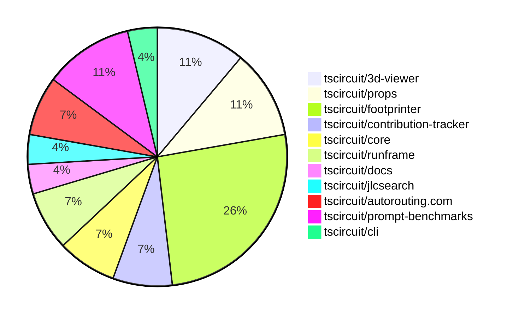

# contribution-tracker

Generates weekly contribution overviews for tscircuit contributors. Check out all
the [contribution overviews here](./contribution-overviews/)

* All PRs in the tscircuit org are scanned/summarized via Claude Haiku
* Claude classifies each Diff/PR as a Major, Minor or Tiny contribution
* All the PRs, summaries, and classifications are organized into charts and tables

The current week is shown below. There are 3 major sections:

* [Contributor Overview](#contributor-overview)
* [PRs by Repository](#prs-by-repository)
* [PRs by Contributor](#changes-by-contributor)

## Current Week

<!-- START_CURRENT_WEEK -->

# Contribution Overview 2025-02-05

## PRs by Repository

## Contributor Overview

| Contributor | 🐳 Major | 🐙 Minor | 🐌 Tiny | ⭐ | Issues Created |
|-------------|---------|---------|---------|-----|----------------|
| [seveibar](#seveibar) | 0 | 1 | 0 | ⭐⭐ | 25 |
| [techmannih](#techmannih) | 1 | 6 | 0 | ⭐⭐ | 13 |
| [ShiboSoftwareDev](#ShiboSoftwareDev) | 2 | 1 | 0 | ⭐⭐ | 2 |
| [Anshgrover23](#Anshgrover23) | 1 | 2 | 1 | ⭐ | 4 |
| [imrishabh18](#imrishabh18) | 0 | 4 | 0 | ⭐ | 4 |
| [Ayushjhawar8](#Ayushjhawar8) | 0 | 3 | 0 | ⭐ | 0 |
| [Abse2001](#Abse2001) | 0 | 2 | 0 | ⭐ | 0 |
| [Rishikesh63](#Rishikesh63) | 0 | 1 | 0 |  | 2 |
| [kom-senapati](#kom-senapati) | 0 | 1 | 0 |  | 3 |
| [ArnavK-09](#ArnavK-09) | 0 | 1 | 0 |  | 0 |

## Review Table

[reviews-received-hover]: ## "Number of reviews received for PRs for this contributor"
[approvals-received-hover]: ## "Number of approvals received for PRs this contributor authored"
[rejections-received-hover]: ## "Number of rejections received for PRs this contributor authored"
[prs-opened-hover]: ## "Number of PRs opened by this contributor"
[issues-created-hover]: ## "Number of issues created by this contributor"
[bountied-issues-hover]: ## "Number of issues this contributor created with a bounty"
[bountied-issue-$-hover]: ## "Total bounty amount placed on issues authored by this contributor"

| Contributor | Reviews Received | Approvals Received | Rejections Received | Approvals | Rejections | PRs Opened | PRs Merged | Issues Created | Bountied Issues | Bountied Issue $ |
|---|---|---|---|---|---|---|---|---|---|---|
| [Ayushjhawar8](#Ayushjhawar8) | 6 | 3 | 2 | 0 | 0 | 4 | 3 | 0 | 0 | 0 |
| [seveibar](#seveibar) | 0 | 0 | 0 | 22 | 8 | 2 | 1 | 25 | 20 | 322 |
| [Anshgrover23](#Anshgrover23) | 7 | 2 | 3 | 3 | 8 | 7 | 4 | 4 | 0 | 0 |
| [Rishikesh63](#Rishikesh63) | 6 | 1 | 2 | 0 | 0 | 4 | 1 | 2 | 0 | 0 |
| [techmannih](#techmannih) | 20 | 10 | 7 | 0 | 0 | 14 | 7 | 13 | 2 | 20 |
| [imrishabh18](#imrishabh18) | 3 | 3 | 0 | 1 | 7 | 8 | 4 | 4 | 0 | 0 |
| [rohittcodes](#rohittcodes) | 3 | 0 | 0 | 0 | 0 | 1 | 0 | 1 | 0 | 0 |
| [AbhinavTheDev](#AbhinavTheDev) | 0 | 0 | 0 | 0 | 0 | 2 | 0 | 0 | 0 | 0 |
| [ArnavK-09](#ArnavK-09) | 22 | 1 | 6 | 0 | 0 | 3 | 1 | 0 | 0 | 0 |
| [kom-senapati](#kom-senapati) | 4 | 1 | 2 | 0 | 0 | 4 | 1 | 3 | 1 | 2 |
| [Abse2001](#Abse2001) | 3 | 2 | 1 | 0 | 0 | 2 | 2 | 0 | 0 | 0 |
| [ShiboSoftwareDev](#ShiboSoftwareDev) | 3 | 3 | 0 | 0 | 0 | 3 | 3 | 2 | 1 | 12 |

## Changes by Repository

### [tscircuit/3d-viewer](https://github.com/tscircuit/3d-viewer)

| PR # | Impact | Contributor | Description |
|------|--------|-------------|-------------|
| [#151](https://github.com/tscircuit/3d-viewer/pull/151) | 🐳 Major | Anshgrover23 | Replace `@tscircuit/soup` with `circuit-json` in the codebase. |
| [#160](https://github.com/tscircuit/3d-viewer/pull/160) | 🐙 Minor | imrishabh18 | Fix backwards compatibility by setting `circuitJson` to `soup` if `circuitJson` is not provided. |
| [#157](https://github.com/tscircuit/3d-viewer/pull/157) | 🐌 Tiny | Anshgrover23 | Updates the bun lockfile |

### [tscircuit/props](https://github.com/tscircuit/props)

| PR # | Impact | Contributor | Description |
|------|--------|-------------|-------------|
| [#161](https://github.com/tscircuit/props/pull/161) | 🐙 Minor | Anshgrover23 | Add a new `schFacingDirection` prop to the `pinHeaderProps` interface to specify the schematic facing direction. |
| [#162](https://github.com/tscircuit/props/pull/162) | 🐙 Minor | Anshgrover23 | Fix transistor test cases by renaming `transistorType` to `type`. |
| [#158](https://github.com/tscircuit/props/pull/158) | 🐙 Minor | seveibar | Rename `transistorType` to `type` and expand the allowed values for the `type` property. |

### [tscircuit/footprinter](https://github.com/tscircuit/footprinter)

| PR # | Impact | Contributor | Description |
|------|--------|-------------|-------------|
| [#132](https://github.com/tscircuit/footprinter/pull/132) | 🐳 Major | techmannih | Implements the "sod523" component, which includes the definition of the component's parameters, the generation of its pads, and the creation of its silkscreen reference and path. |
| [#142](https://github.com/tscircuit/footprinter/pull/142) | 🐙 Minor | techmannih | Adds a new footprint for the Sod882 package |
| [#146](https://github.com/tscircuit/footprinter/pull/146) | 🐙 Minor | techmannih | Add sod323f footprint |
| [#144](https://github.com/tscircuit/footprinter/pull/144) | 🐙 Minor | techmannih | Add sod123f footprint |
| [#150](https://github.com/tscircuit/footprinter/pull/150) | 🐙 Minor | techmannih | Adds the sod128 footprint to the library. |
| [#137](https://github.com/tscircuit/footprinter/pull/137) | 🐙 Minor | techmannih | Adds a new footprint for the SOD723 package. |
| [#128](https://github.com/tscircuit/footprinter/pull/128) | 🐙 Minor | Rishikesh63 | Added support for SOP-8 footprint |

### [tscircuit/contribution-tracker](https://github.com/tscircuit/contribution-tracker)

| PR # | Impact | Contributor | Description |
|------|--------|-------------|-------------|
| [#48](https://github.com/tscircuit/contribution-tracker/pull/48) | 🐙 Minor | techmannih | Add GitHub profile link for top contributors |
| [#51](https://github.com/tscircuit/contribution-tracker/pull/51) | 🐙 Minor | kom-senapati | Add faded lines for stars in contributor graph |

### [tscircuit/core](https://github.com/tscircuit/core)

| PR # | Impact | Contributor | Description |
|------|--------|-------------|-------------|
| [#596](https://github.com/tscircuit/core/pull/596) | 🐙 Minor | imrishabh18 | Adds a test for subcircuit caching functionality to ensure maximum number of traces. |
| [#580](https://github.com/tscircuit/core/pull/580) | 🐙 Minor | Ayushjhawar8 | The pull request improves error handling for components with no PCB connection and missing footprint. |

### [tscircuit/runframe](https://github.com/tscircuit/runframe)

| PR # | Impact | Contributor | Description |
|------|--------|-------------|-------------|
| [#211](https://github.com/tscircuit/runframe/pull/211) | 🐙 Minor | imrishabh18 | Add the autoRotateDisabled prop for 3d-viewer |
| [#207](https://github.com/tscircuit/runframe/pull/207) | 🐙 Minor | Ayushjhawar8 | Fix the issue where the cancel button was overlapping the run button. |

### [tscircuit/docs](https://github.com/tscircuit/docs)

| PR # | Impact | Contributor | Description |
|------|--------|-------------|-------------|
| [#4](https://github.com/tscircuit/docs/pull/4) | 🐙 Minor | imrishabh18 | Adds support for 3D view of circuit snippets |

### [tscircuit/jlcsearch](https://github.com/tscircuit/jlcsearch)

| PR # | Impact | Contributor | Description |
|------|--------|-------------|-------------|
| [#30](https://github.com/tscircuit/jlcsearch/pull/30) | 🐙 Minor | Ayushjhawar8 | Fixes the wrong linking of issues from the footprint index page to the tscircuit repository instead of the footprinter repository. |

### [tscircuit/autorouting.com](https://github.com/tscircuit/autorouting.com)

| PR # | Impact | Contributor | Description |
|------|--------|-------------|-------------|
| [#32](https://github.com/tscircuit/autorouting.com/pull/32) | 🐙 Minor | Abse2001 | Refactored the CLI to use the Golang error style for better error handling and reporting. |
| [#31](https://github.com/tscircuit/autorouting.com/pull/31) | 🐙 Minor | Abse2001 | Refactor the download command to use Golang-style error handling instead of try-catch. |

### [tscircuit/prompt-benchmarks](https://github.com/tscircuit/prompt-benchmarks)

| PR # | Impact | Contributor | Description |
|------|--------|-------------|-------------|
| [#27](https://github.com/tscircuit/prompt-benchmarks/pull/27) | 🐳 Major | ShiboSoftwareDev | The pull request introduces an interface for creating a circuit with streaming and a virtual file system (VFS) for attempts. |
| [#25](https://github.com/tscircuit/prompt-benchmarks/pull/25) | 🐳 Major | ShiboSoftwareDev | Refactor the codebase structure by removing the old benchmark script and making changes to the code to add tests. |
| [#26](https://github.com/tscircuit/prompt-benchmarks/pull/26) | 🐙 Minor | ShiboSoftwareDev | Updated the README file with more detailed information about the project, including the benchmarking process, problem sets, and directory structure. |

### [tscircuit/cli](https://github.com/tscircuit/cli)

| PR # | Impact | Contributor | Description |
|------|--------|-------------|-------------|
| [#50](https://github.com/tscircuit/cli/pull/50) | 🐙 Minor | ArnavK-09 | Fixes the type declarations for React in the project. |

## Changes by Contributor

### [Anshgrover23](https://github.com/Anshgrover23)

| PR # | Impact | Description |
|------|--------|-------------|
| [#151](https://github.com/tscircuit/3d-viewer/pull/151) | 🐳 Major | Replace `@tscircuit/soup` with `circuit-json` in the codebase. |
| [#161](https://github.com/tscircuit/props/pull/161) | 🐙 Minor | Add a new `schFacingDirection` prop to the `pinHeaderProps` interface to specify the schematic facing direction. |
| [#162](https://github.com/tscircuit/props/pull/162) | 🐙 Minor | Fix transistor test cases by renaming `transistorType` to `type`. |
| [#157](https://github.com/tscircuit/3d-viewer/pull/157) | 🐌 Tiny | Updates the bun lockfile |

### [seveibar](https://github.com/seveibar)

| PR # | Impact | Description |
|------|--------|-------------|
| [#158](https://github.com/tscircuit/props/pull/158) | 🐙 Minor | Rename `transistorType` to `type` and expand the allowed values for the `type` property. |

### [techmannih](https://github.com/techmannih)

| PR # | Impact | Description |
|------|--------|-------------|
| [#132](https://github.com/tscircuit/footprinter/pull/132) | 🐳 Major | Implements the "sod523" component, which includes the definition of the component's parameters, the generation of its pads, and the creation of its silkscreen reference and path. |
| [#142](https://github.com/tscircuit/footprinter/pull/142) | 🐙 Minor | Adds a new footprint for the Sod882 package |
| [#146](https://github.com/tscircuit/footprinter/pull/146) | 🐙 Minor | Add sod323f footprint |
| [#144](https://github.com/tscircuit/footprinter/pull/144) | 🐙 Minor | Add sod123f footprint |
| [#150](https://github.com/tscircuit/footprinter/pull/150) | 🐙 Minor | Adds the sod128 footprint to the library. |
| [#137](https://github.com/tscircuit/footprinter/pull/137) | 🐙 Minor | Adds a new footprint for the SOD723 package. |
| [#48](https://github.com/tscircuit/contribution-tracker/pull/48) | 🐙 Minor | Add GitHub profile link for top contributors |

### [Rishikesh63](https://github.com/Rishikesh63)

| PR # | Impact | Description |
|------|--------|-------------|
| [#128](https://github.com/tscircuit/footprinter/pull/128) | 🐙 Minor | Added support for SOP-8 footprint |

### [imrishabh18](https://github.com/imrishabh18)

| PR # | Impact | Description |
|------|--------|-------------|
| [#160](https://github.com/tscircuit/3d-viewer/pull/160) | 🐙 Minor | Fix backwards compatibility by setting `circuitJson` to `soup` if `circuitJson` is not provided. |
| [#596](https://github.com/tscircuit/core/pull/596) | 🐙 Minor | Adds a test for subcircuit caching functionality to ensure maximum number of traces. |
| [#211](https://github.com/tscircuit/runframe/pull/211) | 🐙 Minor | Add the autoRotateDisabled prop for 3d-viewer |
| [#4](https://github.com/tscircuit/docs/pull/4) | 🐙 Minor | Adds support for 3D view of circuit snippets |

### [Ayushjhawar8](https://github.com/Ayushjhawar8)

| PR # | Impact | Description |
|------|--------|-------------|
| [#580](https://github.com/tscircuit/core/pull/580) | 🐙 Minor | The pull request improves error handling for components with no PCB connection and missing footprint. |
| [#30](https://github.com/tscircuit/jlcsearch/pull/30) | 🐙 Minor | Fixes the wrong linking of issues from the footprint index page to the tscircuit repository instead of the footprinter repository. |
| [#207](https://github.com/tscircuit/runframe/pull/207) | 🐙 Minor | Fix the issue where the cancel button was overlapping the run button. |

### [kom-senapati](https://github.com/kom-senapati)

| PR # | Impact | Description |
|------|--------|-------------|
| [#51](https://github.com/tscircuit/contribution-tracker/pull/51) | 🐙 Minor | Add faded lines for stars in contributor graph |

### [Abse2001](https://github.com/Abse2001)

| PR # | Impact | Description |
|------|--------|-------------|
| [#32](https://github.com/tscircuit/autorouting.com/pull/32) | 🐙 Minor | Refactored the CLI to use the Golang error style for better error handling and reporting. |
| [#31](https://github.com/tscircuit/autorouting.com/pull/31) | 🐙 Minor | Refactor the download command to use Golang-style error handling instead of try-catch. |

### [ShiboSoftwareDev](https://github.com/ShiboSoftwareDev)

| PR # | Impact | Description |
|------|--------|-------------|
| [#27](https://github.com/tscircuit/prompt-benchmarks/pull/27) | 🐳 Major | The pull request introduces an interface for creating a circuit with streaming and a virtual file system (VFS) for attempts. |
| [#25](https://github.com/tscircuit/prompt-benchmarks/pull/25) | 🐳 Major | Refactor the codebase structure by removing the old benchmark script and making changes to the code to add tests. |
| [#26](https://github.com/tscircuit/prompt-benchmarks/pull/26) | 🐙 Minor | Updated the README file with more detailed information about the project, including the benchmarking process, problem sets, and directory structure. |

### [ArnavK-09](https://github.com/ArnavK-09)

| PR # | Impact | Description |
|------|--------|-------------|
| [#50](https://github.com/tscircuit/cli/pull/50) | 🐙 Minor | Fixes the type declarations for React in the project. |

<!-- END_CURRENT_WEEK -->
