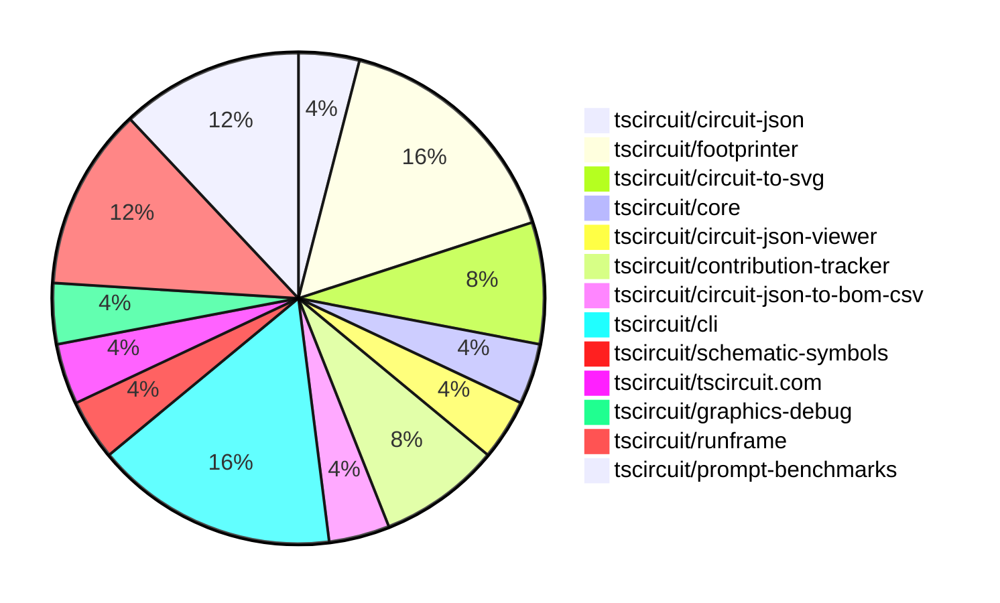

# contribution-tracker

Generates weekly contribution overviews for tscircuit contributors. Check out all
the [contribution overviews here](./contribution-overviews/)

* All PRs in the tscircuit org are scanned/summarized via Claude Haiku
* Claude classifies each Diff/PR as a Major, Minor or Tiny contribution
* All the PRs, summaries, and classifications are organized into charts and tables

The current week is shown below. There are 3 major sections:

* [Contributor Overview](#contributor-overview)
* [PRs by Repository](#prs-by-repository)
* [PRs by Contributor](#changes-by-contributor)

## Current Week

<!-- START_CURRENT_WEEK -->

# Contribution Overview 2025-02-19

## PRs by Repository

## Contributor Overview

| Contributor | 🐳 Major | 🐙 Minor | 🐌 Tiny | ⭐ | Issues Created |
|-------------|---------|---------|---------|-----|----------------|
| [seveibar](#seveibar) | 1 | 5 | 0 | ⭐⭐⭐ | 13 |
| [ShiboSoftwareDev](#ShiboSoftwareDev) | 0 | 3 | 0 | ⭐⭐ | 2 |
| [techmannih](#techmannih) | 0 | 3 | 0 | ⭐ | 3 |
| [ArnavK-09](#ArnavK-09) | 0 | 3 | 1 | ⭐ | 1 |
| [Abse2001](#Abse2001) | 0 | 3 | 0 | ⭐ | 1 |
| [imrishabh18](#imrishabh18) | 0 | 1 | 0 | ⭐ | 4 |
| [MustafaMulla29](#MustafaMulla29) | 1 | 0 | 0 | ⭐ | 0 |
| [kom-senapati](#kom-senapati) | 0 | 2 | 0 | ⭐ | 2 |
| [Ayushjhawar8](#Ayushjhawar8) | 0 | 1 | 0 |  | 0 |
| [Anshgrover23](#Anshgrover23) | 0 | 1 | 0 |  | 2 |

## Review Table

[reviews-received-hover]: ## "Number of reviews received for PRs for this contributor"
[approvals-received-hover]: ## "Number of approvals received for PRs this contributor authored"
[rejections-received-hover]: ## "Number of rejections received for PRs this contributor authored"
[prs-opened-hover]: ## "Number of PRs opened by this contributor"
[issues-created-hover]: ## "Number of issues created by this contributor"
[bountied-issues-hover]: ## "Number of issues this contributor created with a bounty"
[bountied-issue-$-hover]: ## "Total bounty amount placed on issues authored by this contributor"

| Contributor | Reviews Received | Approvals Received | Rejections Received | Approvals | Rejections | PRs Opened | PRs Merged | Issues Created | Bountied Issues | Bountied Issue $ |
|---|---|---|---|---|---|---|---|---|---|---|
| [techmannih](#techmannih) | 9 | 4 | 4 | 1 | 2 | 3 | 3 | 3 | 2 | 12 |
| [imrishabh18](#imrishabh18) | 0 | 0 | 0 | 7 | 4 | 2 | 1 | 4 | 1 | 25 |
| [MustafaMulla29](#MustafaMulla29) | 14 | 4 | 6 | 0 | 0 | 3 | 1 | 0 | 0 | 0 |
| [Anshgrover23](#Anshgrover23) | 4 | 1 | 1 | 3 | 10 | 2 | 1 | 2 | 0 | 0 |
| [Abse2001](#Abse2001) | 4 | 3 | 1 | 0 | 0 | 3 | 3 | 1 | 0 | 0 |
| [seveibar](#seveibar) | 1 | 1 | 0 | 13 | 5 | 9 | 6 | 13 | 12 | 162 |
| [ShiboSoftwareDev](#ShiboSoftwareDev) | 1 | 1 | 0 | 1 | 1 | 3 | 3 | 2 | 1 | 30 |
| [ArnavK-09](#ArnavK-09) | 6 | 5 | 0 | 1 | 4 | 6 | 4 | 1 | 0 | 0 |
| [kom-senapati](#kom-senapati) | 11 | 6 | 2 | 0 | 0 | 3 | 2 | 2 | 0 | 0 |
| [Ayushjhawar8](#Ayushjhawar8) | 20 | 1 | 7 | 0 | 0 | 2 | 1 | 0 | 0 | 0 |
| [AayushSaini101](#AayushSaini101) | 8 | 0 | 3 | 0 | 0 | 1 | 0 | 0 | 0 | 0 |
| [deekshatomer](#deekshatomer) | 2 | 0 | 2 | 0 | 0 | 1 | 0 | 0 | 0 | 0 |

## Changes by Repository

### [tscircuit/circuit-json](https://github.com/tscircuit/circuit-json)

| PR # | Impact | Contributor | Description |
|------|--------|-------------|-------------|
| [#135](https://github.com/tscircuit/circuit-json/pull/135) | 🐙 Minor | techmannih | Adds stroke width for silkscreen circle and silkscreen rectangle |

### [tscircuit/footprinter](https://github.com/tscircuit/footprinter)

| PR # | Impact | Contributor | Description |
|------|--------|-------------|-------------|
| [#184](https://github.com/tscircuit/footprinter/pull/184) | 🐳 Major | MustafaMulla29 | Implemented a new component type VSSOP-8-0.65mm |
| [#135](https://github.com/tscircuit/footprinter/pull/135) | 🐙 Minor | techmannih | Adds the sod323 footprint to the project. |
| [#208](https://github.com/tscircuit/footprinter/pull/208) | 🐙 Minor | Abse2001 | Fixed the NaN issue in the sot23 silkscreen |
| [#207](https://github.com/tscircuit/footprinter/pull/207) | 🐙 Minor | imrishabh18 | Add a build workflow using Bun |

### [tscircuit/circuit-to-svg](https://github.com/tscircuit/circuit-to-svg)

| PR # | Impact | Contributor | Description |
|------|--------|-------------|-------------|
| [#170](https://github.com/tscircuit/circuit-to-svg/pull/170) | 🐙 Minor | techmannih | Adds support for silkscreenline, silkscreencircle, and silkscreenrect elements in the PCB SVG conversion |
| [#172](https://github.com/tscircuit/circuit-to-svg/pull/172) | 🐙 Minor | Anshgrover23 | Fix incorrect bounds calculation for PCB silkscreen elements |

### [tscircuit/core](https://github.com/tscircuit/core)

| PR # | Impact | Contributor | Description |
|------|--------|-------------|-------------|
| [#639](https://github.com/tscircuit/core/pull/639) | 🐙 Minor | Abse2001 | Adds silkscreen text for component names in the PCB view. |

### [tscircuit/circuit-json-viewer](https://github.com/tscircuit/circuit-json-viewer)

| PR # | Impact | Contributor | Description |
|------|--------|-------------|-------------|
| [#3](https://github.com/tscircuit/circuit-json-viewer/pull/3) | 🐙 Minor | Abse2001 | Update the version of the `@tscircuit/runframe` dependency from `0.0.12` to `0.0.189`. |

### [tscircuit/contribution-tracker](https://github.com/tscircuit/contribution-tracker)

| PR # | Impact | Contributor | Description |
|------|--------|-------------|-------------|
| [#72](https://github.com/tscircuit/contribution-tracker/pull/72) | 🐙 Minor | kom-senapati | Introduce workflows to automate format checking, testing, and type checking on push and pull request events. |
| [#58](https://github.com/tscircuit/contribution-tracker/pull/58) | 🐙 Minor | Ayushjhawar8 | Fix issue #52 by separating full-time contributors from other contributors and showing them in a dedicated section. |

### [tscircuit/circuit-json-to-bom-csv](https://github.com/tscircuit/circuit-json-to-bom-csv)

| PR # | Impact | Contributor | Description |
|------|--------|-------------|-------------|
| [#6](https://github.com/tscircuit/circuit-json-to-bom-csv/pull/6) | 🐙 Minor | kom-senapati | Adds support for mapping LCSC part numbers to the "JLCPCB Part #" column in the BOM CSV output. |

### [tscircuit/cli](https://github.com/tscircuit/cli)

| PR # | Impact | Contributor | Description |
|------|--------|-------------|-------------|
| [#88](https://github.com/tscircuit/cli/pull/88) | 🐳 Major | seveibar | Migrate from `tsup-node` to `bun build` for bundling, resulting in a significant reduction in install size. |
| [#89](https://github.com/tscircuit/cli/pull/89) | 🐙 Minor | seveibar | Remove all the "import @tscircuit/core" statements from the codebase. |
| [#95](https://github.com/tscircuit/cli/pull/95) | 🐙 Minor | ArnavK-09 | Adds detection for the new "bun.lock" file to determine the package manager. |
| [#92](https://github.com/tscircuit/cli/pull/92) | 🐙 Minor | ArnavK-09 | The pull request adds the ability to send an error message to the runframe if saving a snippet fails. |

### [tscircuit/schematic-symbols](https://github.com/tscircuit/schematic-symbols)

| PR # | Impact | Contributor | Description |
|------|--------|-------------|-------------|
| [#256](https://github.com/tscircuit/schematic-symbols/pull/256) | 🐙 Minor | seveibar | Remove unused directories from the package output |

### [tscircuit/tscircuit.com](https://github.com/tscircuit/tscircuit.com)

| PR # | Impact | Contributor | Description |
|------|--------|-------------|-------------|
| [#688](https://github.com/tscircuit/tscircuit.com/pull/688) | 🐙 Minor | seveibar | Change AI links to chat.tscircuit.com |

### [tscircuit/graphics-debug](https://github.com/tscircuit/graphics-debug)

| PR # | Impact | Contributor | Description |
|------|--------|-------------|-------------|
| [#24](https://github.com/tscircuit/graphics-debug/pull/24) | 🐙 Minor | seveibar | Add support for line dash array and line cap to the `Line` component. |

### [tscircuit/runframe](https://github.com/tscircuit/runframe)

| PR # | Impact | Contributor | Description |
|------|--------|-------------|-------------|
| [#270](https://github.com/tscircuit/runframe/pull/270) | 🐙 Minor | seveibar | Allow standalone bundle to display the CLI version of RunFrame |
| [#273](https://github.com/tscircuit/runframe/pull/273) | 🐙 Minor | ArnavK-09 | Tweaks to the RunframeForCli application, including changes to the alert dialog, notifications, styling, and export functionality. |
| [#274](https://github.com/tscircuit/runframe/pull/274) | 🐌 Tiny | ArnavK-09 | Bump the versions of GitHub Actions used in the project. |

### [tscircuit/prompt-benchmarks](https://github.com/tscircuit/prompt-benchmarks)

| PR # | Impact | Contributor | Description |
|------|--------|-------------|-------------|
| [#44](https://github.com/tscircuit/prompt-benchmarks/pull/44) | 🐙 Minor | ShiboSoftwareDev | Added more tests for utility functions |
| [#43](https://github.com/tscircuit/prompt-benchmarks/pull/43) | 🐙 Minor | ShiboSoftwareDev | Added more tests for utility functions |
| [#42](https://github.com/tscircuit/prompt-benchmarks/pull/42) | 🐙 Minor | ShiboSoftwareDev | Renaming and refactoring of the project structure, including changes to file paths and imports. |

## Changes by Contributor

### [techmannih](https://github.com/techmannih)

| PR # | Impact | Description |
|------|--------|-------------|
| [#135](https://github.com/tscircuit/circuit-json/pull/135) | 🐙 Minor | Adds stroke width for silkscreen circle and silkscreen rectangle |
| [#135](https://github.com/tscircuit/footprinter/pull/135) | 🐙 Minor | Adds the sod323 footprint to the project. |
| [#170](https://github.com/tscircuit/circuit-to-svg/pull/170) | 🐙 Minor | Adds support for silkscreenline, silkscreencircle, and silkscreenrect elements in the PCB SVG conversion |

### [Abse2001](https://github.com/Abse2001)

| PR # | Impact | Description |
|------|--------|-------------|
| [#208](https://github.com/tscircuit/footprinter/pull/208) | 🐙 Minor | Fixed the NaN issue in the sot23 silkscreen |
| [#639](https://github.com/tscircuit/core/pull/639) | 🐙 Minor | Adds silkscreen text for component names in the PCB view. |
| [#3](https://github.com/tscircuit/circuit-json-viewer/pull/3) | 🐙 Minor | Update the version of the `@tscircuit/runframe` dependency from `0.0.12` to `0.0.189`. |

### [imrishabh18](https://github.com/imrishabh18)

| PR # | Impact | Description |
|------|--------|-------------|
| [#207](https://github.com/tscircuit/footprinter/pull/207) | 🐙 Minor | Add a build workflow using Bun |

### [MustafaMulla29](https://github.com/MustafaMulla29)

| PR # | Impact | Description |
|------|--------|-------------|
| [#184](https://github.com/tscircuit/footprinter/pull/184) | 🐳 Major | Implemented a new component type VSSOP-8-0.65mm |

### [kom-senapati](https://github.com/kom-senapati)

| PR # | Impact | Description |
|------|--------|-------------|
| [#72](https://github.com/tscircuit/contribution-tracker/pull/72) | 🐙 Minor | Introduce workflows to automate format checking, testing, and type checking on push and pull request events. |
| [#6](https://github.com/tscircuit/circuit-json-to-bom-csv/pull/6) | 🐙 Minor | Adds support for mapping LCSC part numbers to the "JLCPCB Part #" column in the BOM CSV output. |

### [Ayushjhawar8](https://github.com/Ayushjhawar8)

| PR # | Impact | Description |
|------|--------|-------------|
| [#58](https://github.com/tscircuit/contribution-tracker/pull/58) | 🐙 Minor | Fix issue #52 by separating full-time contributors from other contributors and showing them in a dedicated section. |

### [Anshgrover23](https://github.com/Anshgrover23)

| PR # | Impact | Description |
|------|--------|-------------|
| [#172](https://github.com/tscircuit/circuit-to-svg/pull/172) | 🐙 Minor | Fix incorrect bounds calculation for PCB silkscreen elements |

### [seveibar](https://github.com/seveibar)

| PR # | Impact | Description |
|------|--------|-------------|
| [#88](https://github.com/tscircuit/cli/pull/88) | 🐳 Major | Migrate from `tsup-node` to `bun build` for bundling, resulting in a significant reduction in install size. |
| [#256](https://github.com/tscircuit/schematic-symbols/pull/256) | 🐙 Minor | Remove unused directories from the package output |
| [#688](https://github.com/tscircuit/tscircuit.com/pull/688) | 🐙 Minor | Change AI links to chat.tscircuit.com |
| [#24](https://github.com/tscircuit/graphics-debug/pull/24) | 🐙 Minor | Add support for line dash array and line cap to the `Line` component. |
| [#270](https://github.com/tscircuit/runframe/pull/270) | 🐙 Minor | Allow standalone bundle to display the CLI version of RunFrame |
| [#89](https://github.com/tscircuit/cli/pull/89) | 🐙 Minor | Remove all the "import @tscircuit/core" statements from the codebase. |

### [ShiboSoftwareDev](https://github.com/ShiboSoftwareDev)

| PR # | Impact | Description |
|------|--------|-------------|
| [#44](https://github.com/tscircuit/prompt-benchmarks/pull/44) | 🐙 Minor | Added more tests for utility functions |
| [#43](https://github.com/tscircuit/prompt-benchmarks/pull/43) | 🐙 Minor | Added more tests for utility functions |
| [#42](https://github.com/tscircuit/prompt-benchmarks/pull/42) | 🐙 Minor | Renaming and refactoring of the project structure, including changes to file paths and imports. |

### [ArnavK-09](https://github.com/ArnavK-09)

| PR # | Impact | Description |
|------|--------|-------------|
| [#273](https://github.com/tscircuit/runframe/pull/273) | 🐙 Minor | Tweaks to the RunframeForCli application, including changes to the alert dialog, notifications, styling, and export functionality. |
| [#95](https://github.com/tscircuit/cli/pull/95) | 🐙 Minor | Adds detection for the new "bun.lock" file to determine the package manager. |
| [#92](https://github.com/tscircuit/cli/pull/92) | 🐙 Minor | The pull request adds the ability to send an error message to the runframe if saving a snippet fails. |
| [#274](https://github.com/tscircuit/runframe/pull/274) | 🐌 Tiny | Bump the versions of GitHub Actions used in the project. |

<!-- END_CURRENT_WEEK -->
