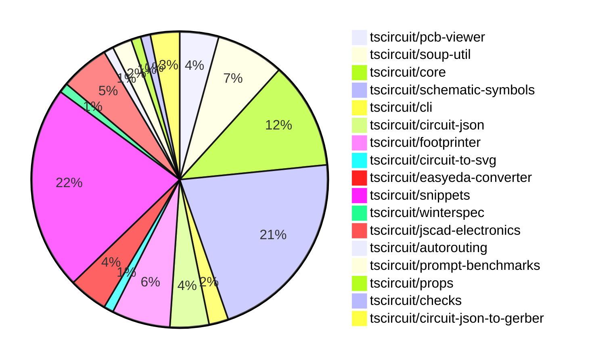

# contribution-tracker

Generates weekly contribution overviews for tscircuit contributors. Check out all
the [contribution overviews here](./contribution-overviews/)

* All PRs in the tscircuit org are scanned/summarized via Claude Haiku
* Claude classifies each Diff/PR as a Major, Minor or Tiny contribution
* All the PRs, summaries, and classifications are organized into charts and tables

The current week is shown below. There are 3 major sections:

* [Contributor Overview](#contributor-overview)
* [PRs by Repository](#prs-by-repository)
* [PRs by Contributor](#changes-by-contributor)

## Current Week

<!-- START_CURRENT_WEEK -->

# Contribution Overview 2024-10-05

## PRs by Repository

## Contributor Overview

| Contributor | 🐳 Major | 🐙 Minor | 🐌 Tiny |
|-------------|-------|-------|-------|
| imrishabh18 | 7 | 11 | 2 |
| seveibar | 22 | 4 | 1 |
| DhairyaMajmudar | 3 | 2 | 0 |
| anas-sarkez | 3 | 5 | 0 |
| ShiboSoftwareDev | 6 | 1 | 1 |
| andrii-balitskyi | 2 | 0 | 0 |
| mrudulpatil18 | 1 | 1 | 0 |
| 0SlowPoke0 | 1 | 0 | 0 |
| aman1376 | 7 | 0 | 0 |
| Complexlity | 0 | 1 | 0 |
| 0xkafkaa | 4 | 0 | 0 |
| Timer00 | 1 | 0 | 0 |
| bbland1 | 3 | 1 | 0 |
| Abse2001 | 1 | 0 | 0 |
| PALLAVIKHEDLE | 1 | 0 | 0 |

## Changes by Repository

### [tscircuit/pcb-viewer](https://github.com/tscircuit/pcb-viewer)

| PR # | Impact | Contributor | Description |
|------|--------|-------------|-------------|
| [#74](https://github.com/tscircuit/pcb-viewer/pull/74) | 🐳 Major | imrishabh18 | Refactor/remove builder |
| [#73](https://github.com/tscircuit/pcb-viewer/pull/73) | 🐳 Major | imrishabh18 | Refactor: remove the builder dependency and simplify the PCBViewer component. |
| [#71](https://github.com/tscircuit/pcb-viewer/pull/71) | 🐳 Major | seveibar | Reverts the previous change that broke the PCB viewer's bounds computation. |
| [#70](https://github.com/tscircuit/pcb-viewer/pull/70) | 🐳 Major | seveibar | Convert children rendering to use the core library instead of the builder library. |

### [tscircuit/soup-util](https://github.com/tscircuit/soup-util)

| PR # | Impact | Contributor | Description |
|------|--------|-------------|-------------|
| [#20](https://github.com/tscircuit/soup-util/pull/20) | 🐳 Major | imrishabh18 | Port the `findBoundsAndCenter` function from the builder repo to this repo. |
| [#23](https://github.com/tscircuit/soup-util/pull/23) | 🐙 Minor | imrishabh18 | Fix type issues in the `find-bounds-and-center.ts` file. |
| [#22](https://github.com/tscircuit/soup-util/pull/22) | 🐙 Minor | imrishabh18 | Reverts the previous change that exported the "find-bounds-and-center" function. |
| [#21](https://github.com/tscircuit/soup-util/pull/21) | 🐙 Minor | imrishabh18 | Exports the `find-bounds-and-center` function from the library. |
| [#18](https://github.com/tscircuit/soup-util/pull/18) | 🐙 Minor | imrishabh18 | Update the `circuit-json` dependency to the latest version `0.0.85` |
| [#19](https://github.com/tscircuit/soup-util/pull/19) | 🐌 Tiny | imrishabh18 | Updates the lock file to ensure consistent dependencies across environments. |
| [#17](https://github.com/tscircuit/soup-util/pull/17) | 🐌 Tiny | imrishabh18 | Deletes an unused dependency from the project. |

### [tscircuit/core](https://github.com/tscircuit/core)

| PR # | Impact | Contributor | Description |
|------|--------|-------------|-------------|
| [#153](https://github.com/tscircuit/core/pull/153) | 🐳 Major | imrishabh18 | Added SilkscreenCircle and SilkscreenRect components to the library. |
| [#151](https://github.com/tscircuit/core/pull/151) | 🐳 Major | imrishabh18 | Adds a new "Via" component to the project. |
| [#139](https://github.com/tscircuit/core/pull/139) | 🐳 Major | imrishabh18 | Fix the placement of chips in the schematic view. |
| [#157](https://github.com/tscircuit/core/pull/157) | 🐳 Major | seveibar | Introduce a new hook `createUseComponent` that generates a custom React component with dynamic props and traces. |
| [#149](https://github.com/tscircuit/core/pull/149) | 🐳 Major | seveibar | Introduce the `useRenderedCircuit` hook and set up a system for testing hooks. |
| [#137](https://github.com/tscircuit/core/pull/137) | 🐳 Major | seveibar | The change improves the error reporting for invalid component props by introducing a new `InvalidProps` error class that provides detailed information about the invalid props. |
| [#136](https://github.com/tscircuit/core/pull/136) | 🐳 Major | ShiboSoftwareDev | Create a new `pcb_solder_paste` component from `smtpads`. |
| [#155](https://github.com/tscircuit/core/pull/155) | 🐙 Minor | imrishabh18 | Add aliases "left" and "right" to the Capacitor and Resistor component ports |
| [#143](https://github.com/tscircuit/core/pull/143) | 🐙 Minor | imrishabh18 | Update the `@tscircuit/soup-util` package to a smaller version |
| [#141](https://github.com/tscircuit/core/pull/141) | 🐙 Minor | imrishabh18 | Update with latest footprinter version without lodash |
| [#138](https://github.com/tscircuit/core/pull/138) | 🐙 Minor | ShiboSoftwareDev | Inherit `pcb_smt_pad _setPositionFromLayout` behaviour for `pcb_solder_paste` component. |

### [tscircuit/schematic-symbols](https://github.com/tscircuit/schematic-symbols)

| PR # | Impact | Contributor | Description |
|------|--------|-------------|-------------|
| [#135](https://github.com/tscircuit/schematic-symbols/pull/135) | 🐳 Major | imrishabh18 | Adding support for cubic bezier curve (C command) in the `svgPathToPoints` function. |
| [#156](https://github.com/tscircuit/schematic-symbols/pull/156) | 🐳 Major | mrudulpatil18 | Add an NPN bipolar transistor symbol |
| [#157](https://github.com/tscircuit/schematic-symbols/pull/157) | 🐳 Major | 0SlowPoke0 | Adds a filled diode symbol in JSON and SVG formats. |
| [#158](https://github.com/tscircuit/schematic-symbols/pull/158) | 🐳 Major | aman1376 | Adds a new SPST switch symbol. |
| [#154](https://github.com/tscircuit/schematic-symbols/pull/154) | 🐳 Major | aman1376 | Add a new JSON file containing the definition of a P-channel E-MOSFET transistor symbol |
| [#151](https://github.com/tscircuit/schematic-symbols/pull/151) | 🐳 Major | aman1376 | Add a new n-channel D-MOSFET transistor symbol |
| [#152](https://github.com/tscircuit/schematic-symbols/pull/152) | 🐳 Major | aman1376 | Add a new P-channel DMOSFET transistor symbol. |
| [#150](https://github.com/tscircuit/schematic-symbols/pull/150) | 🐳 Major | aman1376 | Add a new JSON file for an n-fet transistor symbol. |
| [#149](https://github.com/tscircuit/schematic-symbols/pull/149) | 🐳 Major | aman1376 | Add a P-JFET transistor symbol and its related JSON data. |
| [#130](https://github.com/tscircuit/schematic-symbols/pull/130) | 🐳 Major | aman1376 | Generate a TypeScript type for the list of base symbol names. |
| [#145](https://github.com/tscircuit/schematic-symbols/pull/145) | 🐳 Major | 0xkafkaa | Add a new SVG image and JSON data for a crystal component. |
| [#146](https://github.com/tscircuit/schematic-symbols/pull/146) | 🐳 Major | 0xkafkaa | Add a new resonator JSON file |
| [#137](https://github.com/tscircuit/schematic-symbols/pull/137) | 🐳 Major | 0xkafkaa | Add a step recovery diode component to the library. |
| [#133](https://github.com/tscircuit/schematic-symbols/pull/133) | 🐳 Major | 0xkafkaa | Adds a new JSON file "gunn_diode.json" and an SVG file "gunn.svg" for a Gunn diode symbol. |
| [#136](https://github.com/tscircuit/schematic-symbols/pull/136) | 🐳 Major | Timer00 | Add Bun test workflow and snapshot testing for SVG symbols |
| [#132](https://github.com/tscircuit/schematic-symbols/pull/132) | 🐳 Major | bbland1 | The pull request fixes the issue where the green center dot in the silicon controlled rectifier symbol was off-center for some symbols. |
| [#110](https://github.com/tscircuit/schematic-symbols/pull/110) | 🐳 Major | bbland1 | Add diac SVG and TypeScript files |
| [#111](https://github.com/tscircuit/schematic-symbols/pull/111) | 🐳 Major | bbland1 | Create an SVG and TypeScript code for a unijunction transistor symbol. |
| [#102](https://github.com/tscircuit/schematic-symbols/pull/102) | 🐙 Minor | Complexlity | Modify the `getTsFileContentForSvgGroup` function to add the `Primitive` type for the `texts` property in the generated TypeScript file. |
| [#131](https://github.com/tscircuit/schematic-symbols/pull/131) | 🐙 Minor | bbland1 | Fixing the reference point (REF) in the diac symbol. |

### [tscircuit/cli](https://github.com/tscircuit/cli)

| PR # | Impact | Contributor | Description |
|------|--------|-------------|-------------|
| [#215](https://github.com/tscircuit/cli/pull/215) | 🐳 Major | DhairyaMajmudar | Refactoring files to improve the use of TypeScript types by removing `any` keywords and replacing them with suitable types, and removing unused imports. |
| [#226](https://github.com/tscircuit/cli/pull/226) | 🐙 Minor | imrishabh18 | Update the `circuit-to-svg` dependency to the latest version. |

### [tscircuit/circuit-json](https://github.com/tscircuit/circuit-json)

| PR # | Impact | Contributor | Description |
|------|--------|-------------|-------------|
| [#55](https://github.com/tscircuit/circuit-json/pull/55) | 🐳 Major | seveibar | Introduce a GitHub workflow to run tests for the project using the Bun runtime. |
| [#56](https://github.com/tscircuit/circuit-json/pull/56) | 🐳 Major | ShiboSoftwareDev | Introduce a new `pcb_solder_paste` component for defining solder paste on a printed circuit board. |
| [#58](https://github.com/tscircuit/circuit-json/pull/58) | 🐙 Minor | imrishabh18 | Adds a new optional `display_value` field to the `SourceComponentBase` interface. |
| [#57](https://github.com/tscircuit/circuit-json/pull/57) | 🐙 Minor | anas-sarkez | Add mil unit and format script |

### [tscircuit/footprinter](https://github.com/tscircuit/footprinter)

| PR # | Impact | Contributor | Description |
|------|--------|-------------|-------------|
| [#61](https://github.com/tscircuit/footprinter/pull/61) | 🐳 Major | seveibar | Add error handling for invalid footprinter string inputs |
| [#48](https://github.com/tscircuit/footprinter/pull/48) | 🐳 Major | DhairyaMajmudar | Adding the SOT363 circuit component. |
| [#62](https://github.com/tscircuit/footprinter/pull/62) | 🐳 Major | anas-sarkez | Modified the default values of the `qfp` function parameters based on the component's data sheet. |
| [#55](https://github.com/tscircuit/footprinter/pull/55) | 🐙 Minor | imrishabh18 | Update the package dependencies to the latest versions without the use of lodash. |
| [#58](https://github.com/tscircuit/footprinter/pull/58) | 🐙 Minor | anas-sarkez | Modified test files and added preload |
| [#56](https://github.com/tscircuit/footprinter/pull/56) | 🐙 Minor | anas-sarkez | Migrate from ava to bun test |

### [tscircuit/circuit-to-svg](https://github.com/tscircuit/circuit-to-svg)

| PR # | Impact | Contributor | Description |
|------|--------|-------------|-------------|
| [#82](https://github.com/tscircuit/circuit-to-svg/pull/82) | 🐙 Minor | imrishabh18 | Fix chip port placement issue |

### [tscircuit/easyeda-converter](https://github.com/tscircuit/easyeda-converter)

| PR # | Impact | Contributor | Description |
|------|--------|-------------|-------------|
| [#46](https://github.com/tscircuit/easyeda-converter/pull/46) | 🐳 Major | seveibar | Convert the project to use ECMAScript modules (ESM) instead of CommonJS modules. |
| [#45](https://github.com/tscircuit/easyeda-converter/pull/45) | 🐳 Major | seveibar | Update the README with more usage details, migrate to `circuit-json` and `@tscircuit/soup-util`, and remove the `builder` dependency. |
| [#49](https://github.com/tscircuit/easyeda-converter/pull/49) | 🐳 Major | andrii-balitskyi | This pull request modifies the `PadSchema` and `PinShapeOutputSchema` types to accept either strings or numbers for the `number` and `pinNumber` properties, respectively. |
| [#44](https://github.com/tscircuit/easyeda-converter/pull/44) | 🐳 Major | andrii-balitskyi | Fix build and add typecheck workflow |

### [tscircuit/snippets](https://github.com/tscircuit/snippets)

| PR # | Impact | Contributor | Description |
|------|--------|-------------|-------------|
| [#52](https://github.com/tscircuit/snippets/pull/52) | 🐳 Major | seveibar | Introduces anonymous user editing, improves empty states for the code editor and AI page, and fixes a bug where the code editor was not scrollable. |
| [#50](https://github.com/tscircuit/snippets/pull/50) | 🐳 Major | seveibar | Refactor the code to use explicit runs, and fix importing issues. |
| [#48](https://github.com/tscircuit/snippets/pull/48) | 🐳 Major | seveibar | Introduce the "Import Runner" feature and fix the issue of the dashboard always loading from a hardcoded "seveibar/" path. |
| [#45](https://github.com/tscircuit/snippets/pull/45) | 🐳 Major | seveibar | Save DTS content to the database along with the code snippet. |
| [#42](https://github.com/tscircuit/snippets/pull/42) | 🐳 Major | seveibar | The pull request adds a new field "compiled_js" to the Snippet schema, which allows storing the compiled JavaScript code for a snippet. It also introduces error handling and request logging middleware. |
| [#40](https://github.com/tscircuit/snippets/pull/40) | 🐳 Major | seveibar | Add database seeding, fix view snippets page, and load TypeScript types for imported snippets. |
| [#49](https://github.com/tscircuit/snippets/pull/49) | 🐳 Major | Abse2001 | Implemented a download function for the circuitJson download button. |
| [#33](https://github.com/tscircuit/snippets/pull/33) | 🐳 Major | PALLAVIKHEDLE | Implement a new button hover functionality that displays a dropdown with additional options. |
| [#51](https://github.com/tscircuit/snippets/pull/51) | 🐙 Minor | seveibar | Fix code editor scrolling overflow, support exporting hooks |
| [#35](https://github.com/tscircuit/snippets/pull/35) | 🟣 | seveibar | Reverts the "new button hover changes" pull request. |
| [#39](https://github.com/tscircuit/snippets/pull/39) | 🐳 Major | seveibar | Introduced a new TypeScript-aware code editor component with features like autocomplete, linting, and hover tooltips. |
| [#36](https://github.com/tscircuit/snippets/pull/36) | 🐳 Major | seveibar | Adds a switch to use a fake API instead of the real API when the `SNIPPETS_API_URL` environment variable is not set. |
| [#32](https://github.com/tscircuit/snippets/pull/32) | 🟣 | seveibar |  |
| [#23](https://github.com/tscircuit/snippets/pull/23) | 🐳 Major | seveibar | Introduces improvements and fixes for the AI chat feature, including changes to the chat interface, snippet management, and link handling. |
| [#21](https://github.com/tscircuit/snippets/pull/21) | 🐳 Major | seveibar | Introduce an empty state for the AI chat interface and show the account balance in the header. |
| [#12](https://github.com/tscircuit/snippets/pull/12) | 🐳 Major | seveibar | Adds new database schemas for sessions, login pages, and accounts, and updates the `updateSnippet` function to use the `code` field instead of `content`. |
| [#37](https://github.com/tscircuit/snippets/pull/37) | 🐳 Major | DhairyaMajmudar | Home page made responsive and HTML tags in the footer were updated. |
| [#13](https://github.com/tscircuit/snippets/pull/13) | 🐙 Minor | seveibar | The pull request formats the repository, adds Vercel rewrites, and makes minor fixes. |
| [#28](https://github.com/tscircuit/snippets/pull/28) | 🐙 Minor | DhairyaMajmudar | Adds rules for camelCase in the biome.json file. |
| [#10](https://github.com/tscircuit/snippets/pull/10) | 🐙 Minor | DhairyaMajmudar | Adding the functionality to hide the "Onboarding Tips" section by clicking the cross button. |
| [#43](https://github.com/tscircuit/snippets/pull/43) | 🐙 Minor | mrudulpatil18 | Persist the visibility of onboarding tips in the global store and update the LandingHero component to use the global store. |

### [tscircuit/winterspec](https://github.com/tscircuit/winterspec)

| PR # | Impact | Contributor | Description |
|------|--------|-------------|-------------|
| [#12](https://github.com/tscircuit/winterspec/pull/12) | 🐙 Minor | seveibar | Fix issue with loading routes directory in smoke tests |

### [tscircuit/jscad-electronics](https://github.com/tscircuit/jscad-electronics)

| PR # | Impact | Contributor | Description |
|------|--------|-------------|-------------|
| [#64](https://github.com/tscircuit/jscad-electronics/pull/64) | 🐳 Major | anas-sarkez | Added a new example for a DIP 16 wide footprint and fixed the length of the DIP model. |
| [#58](https://github.com/tscircuit/jscad-electronics/pull/58) | 🐳 Major | anas-sarkez | Fixed the dimensions of the SOT-23, SOT-563, and SOT-723 component models to match their footprints. |
| [#61](https://github.com/tscircuit/jscad-electronics/pull/61) | 🐙 Minor | seveibar | Create a CODEOWNERS file to specify code owners for the repository |
| [#62](https://github.com/tscircuit/jscad-electronics/pull/62) | 🐙 Minor | anas-sarkez | Updated the soup dependency to circuit-json |
| [#60](https://github.com/tscircuit/jscad-electronics/pull/60) | 🐙 Minor | anas-sarkez | Added the `showGrid` property to all test examples to display a grid in the 3D viewer. |

### [tscircuit/autorouting](https://github.com/tscircuit/autorouting)

| PR # | Impact | Contributor | Description |
|------|--------|-------------|-------------|
| [#81](https://github.com/tscircuit/autorouting/pull/81) | 🐌 Tiny | seveibar | Update dependency types in the project |

### [tscircuit/prompt-benchmarks](https://github.com/tscircuit/prompt-benchmarks)

| PR # | Impact | Contributor | Description |
|------|--------|-------------|-------------|
| [#3](https://github.com/tscircuit/prompt-benchmarks/pull/3) | 🐳 Major | seveibar | Introduces a new function `safeCompileDts` that compiles TypeScript code to a declaration file in a safe and isolated environment. |
| [#2](https://github.com/tscircuit/prompt-benchmarks/pull/2) | 🐳 Major | seveibar | Introduces a feature to run generated code and test it with a threshold acceptance |

### [tscircuit/props](https://github.com/tscircuit/props)

| PR # | Impact | Contributor | Description |
|------|--------|-------------|-------------|
| [#56](https://github.com/tscircuit/props/pull/56) | 🐳 Major | ShiboSoftwareDev | Introducing a new component for solder paste with rectangle and circle shapes. |

### [tscircuit/checks](https://github.com/tscircuit/checks)

| PR # | Impact | Contributor | Description |
|------|--------|-------------|-------------|
| [#17](https://github.com/tscircuit/checks/pull/17) | 🐳 Major | ShiboSoftwareDev | Refactored the code to use the `circuit-json` library instead of the `@tscircuit/soup` library. |

### [tscircuit/circuit-json-to-gerber](https://github.com/tscircuit/circuit-json-to-gerber)

| PR # | Impact | Contributor | Description |
|------|--------|-------------|-------------|
| [#19](https://github.com/tscircuit/circuit-json-to-gerber/pull/19) | 🐳 Major | ShiboSoftwareDev | Fixed the excellon-drill snapshot test to prevent concatenation and ensure proper diffing. |
| [#18](https://github.com/tscircuit/circuit-json-to-gerber/pull/18) | 🐳 Major | ShiboSoftwareDev | Implemented pcb_solder_paste feature |
| [#20](https://github.com/tscircuit/circuit-json-to-gerber/pull/20) | 🐌 Tiny | ShiboSoftwareDev | Add a CODEOWNERS file to define code ownership |

## Changes by Contributor

### [imrishabh18](https://github.com/imrishabh18)

| PR # | Impact | Description |
|------|--------|-------------|
| [#74](https://github.com/tscircuit/pcb-viewer/pull/74) | 🐳 Major | Refactor/remove builder |
| [#73](https://github.com/tscircuit/pcb-viewer/pull/73) | 🐳 Major | Refactor: remove the builder dependency and simplify the PCBViewer component. |
| [#20](https://github.com/tscircuit/soup-util/pull/20) | 🐳 Major | Port the `findBoundsAndCenter` function from the builder repo to this repo. |
| [#153](https://github.com/tscircuit/core/pull/153) | 🐳 Major | Added SilkscreenCircle and SilkscreenRect components to the library. |
| [#151](https://github.com/tscircuit/core/pull/151) | 🐳 Major | Adds a new "Via" component to the project. |
| [#139](https://github.com/tscircuit/core/pull/139) | 🐳 Major | Fix the placement of chips in the schematic view. |
| [#135](https://github.com/tscircuit/schematic-symbols/pull/135) | 🐳 Major | Adding support for cubic bezier curve (C command) in the `svgPathToPoints` function. |
| [#226](https://github.com/tscircuit/cli/pull/226) | 🐙 Minor | Update the `circuit-to-svg` dependency to the latest version. |
| [#58](https://github.com/tscircuit/circuit-json/pull/58) | 🐙 Minor | Adds a new optional `display_value` field to the `SourceComponentBase` interface. |
| [#23](https://github.com/tscircuit/soup-util/pull/23) | 🐙 Minor | Fix type issues in the `find-bounds-and-center.ts` file. |
| [#22](https://github.com/tscircuit/soup-util/pull/22) | 🐙 Minor | Reverts the previous change that exported the "find-bounds-and-center" function. |
| [#21](https://github.com/tscircuit/soup-util/pull/21) | 🐙 Minor | Exports the `find-bounds-and-center` function from the library. |
| [#18](https://github.com/tscircuit/soup-util/pull/18) | 🐙 Minor | Update the `circuit-json` dependency to the latest version `0.0.85` |
| [#55](https://github.com/tscircuit/footprinter/pull/55) | 🐙 Minor | Update the package dependencies to the latest versions without the use of lodash. |
| [#155](https://github.com/tscircuit/core/pull/155) | 🐙 Minor | Add aliases "left" and "right" to the Capacitor and Resistor component ports |
| [#143](https://github.com/tscircuit/core/pull/143) | 🐙 Minor | Update the `@tscircuit/soup-util` package to a smaller version |
| [#141](https://github.com/tscircuit/core/pull/141) | 🐙 Minor | Update with latest footprinter version without lodash |
| [#82](https://github.com/tscircuit/circuit-to-svg/pull/82) | 🐙 Minor | Fix chip port placement issue |
| [#19](https://github.com/tscircuit/soup-util/pull/19) | 🐌 Tiny | Updates the lock file to ensure consistent dependencies across environments. |
| [#17](https://github.com/tscircuit/soup-util/pull/17) | 🐌 Tiny | Deletes an unused dependency from the project. |

### [seveibar](https://github.com/seveibar)

| PR # | Impact | Description |
|------|--------|-------------|
| [#71](https://github.com/tscircuit/pcb-viewer/pull/71) | 🐳 Major | Reverts the previous change that broke the PCB viewer's bounds computation. |
| [#70](https://github.com/tscircuit/pcb-viewer/pull/70) | 🐳 Major | Convert children rendering to use the core library instead of the builder library. |
| [#55](https://github.com/tscircuit/circuit-json/pull/55) | 🐳 Major | Introduce a GitHub workflow to run tests for the project using the Bun runtime. |
| [#61](https://github.com/tscircuit/footprinter/pull/61) | 🐳 Major | Add error handling for invalid footprinter string inputs |
| [#46](https://github.com/tscircuit/easyeda-converter/pull/46) | 🐳 Major | Convert the project to use ECMAScript modules (ESM) instead of CommonJS modules. |
| [#45](https://github.com/tscircuit/easyeda-converter/pull/45) | 🐳 Major | Update the README with more usage details, migrate to `circuit-json` and `@tscircuit/soup-util`, and remove the `builder` dependency. |
| [#157](https://github.com/tscircuit/core/pull/157) | 🐳 Major | Introduce a new hook `createUseComponent` that generates a custom React component with dynamic props and traces. |
| [#149](https://github.com/tscircuit/core/pull/149) | 🐳 Major | Introduce the `useRenderedCircuit` hook and set up a system for testing hooks. |
| [#137](https://github.com/tscircuit/core/pull/137) | 🐳 Major | The change improves the error reporting for invalid component props by introducing a new `InvalidProps` error class that provides detailed information about the invalid props. |
| [#52](https://github.com/tscircuit/snippets/pull/52) | 🐳 Major | Introduces anonymous user editing, improves empty states for the code editor and AI page, and fixes a bug where the code editor was not scrollable. |
| [#50](https://github.com/tscircuit/snippets/pull/50) | 🐳 Major | Refactor the code to use explicit runs, and fix importing issues. |
| [#48](https://github.com/tscircuit/snippets/pull/48) | 🐳 Major | Introduce the "Import Runner" feature and fix the issue of the dashboard always loading from a hardcoded "seveibar/" path. |
| [#45](https://github.com/tscircuit/snippets/pull/45) | 🐳 Major | Save DTS content to the database along with the code snippet. |
| [#42](https://github.com/tscircuit/snippets/pull/42) | 🐳 Major | The pull request adds a new field "compiled_js" to the Snippet schema, which allows storing the compiled JavaScript code for a snippet. It also introduces error handling and request logging middleware. |
| [#40](https://github.com/tscircuit/snippets/pull/40) | 🐳 Major | Add database seeding, fix view snippets page, and load TypeScript types for imported snippets. |
| [#12](https://github.com/tscircuit/winterspec/pull/12) | 🐙 Minor | Fix issue with loading routes directory in smoke tests |
| [#61](https://github.com/tscircuit/jscad-electronics/pull/61) | 🐙 Minor | Create a CODEOWNERS file to specify code owners for the repository |
| [#51](https://github.com/tscircuit/snippets/pull/51) | 🐙 Minor | Fix code editor scrolling overflow, support exporting hooks |
| [#81](https://github.com/tscircuit/autorouting/pull/81) | 🐌 Tiny | Update dependency types in the project |
| [#35](https://github.com/tscircuit/snippets/pull/35) | 🟣 | Reverts the "new button hover changes" pull request. |
| [#39](https://github.com/tscircuit/snippets/pull/39) | 🐳 Major | Introduced a new TypeScript-aware code editor component with features like autocomplete, linting, and hover tooltips. |
| [#36](https://github.com/tscircuit/snippets/pull/36) | 🐳 Major | Adds a switch to use a fake API instead of the real API when the `SNIPPETS_API_URL` environment variable is not set. |
| [#32](https://github.com/tscircuit/snippets/pull/32) | 🟣 |  |
| [#23](https://github.com/tscircuit/snippets/pull/23) | 🐳 Major | Introduces improvements and fixes for the AI chat feature, including changes to the chat interface, snippet management, and link handling. |
| [#21](https://github.com/tscircuit/snippets/pull/21) | 🐳 Major | Introduce an empty state for the AI chat interface and show the account balance in the header. |
| [#12](https://github.com/tscircuit/snippets/pull/12) | 🐳 Major | Adds new database schemas for sessions, login pages, and accounts, and updates the `updateSnippet` function to use the `code` field instead of `content`. |
| [#3](https://github.com/tscircuit/prompt-benchmarks/pull/3) | 🐳 Major | Introduces a new function `safeCompileDts` that compiles TypeScript code to a declaration file in a safe and isolated environment. |
| [#2](https://github.com/tscircuit/prompt-benchmarks/pull/2) | 🐳 Major | Introduces a feature to run generated code and test it with a threshold acceptance |
| [#13](https://github.com/tscircuit/snippets/pull/13) | 🐙 Minor | The pull request formats the repository, adds Vercel rewrites, and makes minor fixes. |

### [DhairyaMajmudar](https://github.com/DhairyaMajmudar)

| PR # | Impact | Description |
|------|--------|-------------|
| [#215](https://github.com/tscircuit/cli/pull/215) | 🐳 Major | Refactoring files to improve the use of TypeScript types by removing `any` keywords and replacing them with suitable types, and removing unused imports. |
| [#48](https://github.com/tscircuit/footprinter/pull/48) | 🐳 Major | Adding the SOT363 circuit component. |
| [#37](https://github.com/tscircuit/snippets/pull/37) | 🐳 Major | Home page made responsive and HTML tags in the footer were updated. |
| [#28](https://github.com/tscircuit/snippets/pull/28) | 🐙 Minor | Adds rules for camelCase in the biome.json file. |
| [#10](https://github.com/tscircuit/snippets/pull/10) | 🐙 Minor | Adding the functionality to hide the "Onboarding Tips" section by clicking the cross button. |

### [anas-sarkez](https://github.com/anas-sarkez)

| PR # | Impact | Description |
|------|--------|-------------|
| [#62](https://github.com/tscircuit/footprinter/pull/62) | 🐳 Major | Modified the default values of the `qfp` function parameters based on the component's data sheet. |
| [#64](https://github.com/tscircuit/jscad-electronics/pull/64) | 🐳 Major | Added a new example for a DIP 16 wide footprint and fixed the length of the DIP model. |
| [#58](https://github.com/tscircuit/jscad-electronics/pull/58) | 🐳 Major | Fixed the dimensions of the SOT-23, SOT-563, and SOT-723 component models to match their footprints. |
| [#57](https://github.com/tscircuit/circuit-json/pull/57) | 🐙 Minor | Add mil unit and format script |
| [#58](https://github.com/tscircuit/footprinter/pull/58) | 🐙 Minor | Modified test files and added preload |
| [#56](https://github.com/tscircuit/footprinter/pull/56) | 🐙 Minor | Migrate from ava to bun test |
| [#62](https://github.com/tscircuit/jscad-electronics/pull/62) | 🐙 Minor | Updated the soup dependency to circuit-json |
| [#60](https://github.com/tscircuit/jscad-electronics/pull/60) | 🐙 Minor | Added the `showGrid` property to all test examples to display a grid in the 3D viewer. |

### [ShiboSoftwareDev](https://github.com/ShiboSoftwareDev)

| PR # | Impact | Description |
|------|--------|-------------|
| [#56](https://github.com/tscircuit/circuit-json/pull/56) | 🐳 Major | Introduce a new `pcb_solder_paste` component for defining solder paste on a printed circuit board. |
| [#56](https://github.com/tscircuit/props/pull/56) | 🐳 Major | Introducing a new component for solder paste with rectangle and circle shapes. |
| [#136](https://github.com/tscircuit/core/pull/136) | 🐳 Major | Create a new `pcb_solder_paste` component from `smtpads`. |
| [#17](https://github.com/tscircuit/checks/pull/17) | 🐳 Major | Refactored the code to use the `circuit-json` library instead of the `@tscircuit/soup` library. |
| [#19](https://github.com/tscircuit/circuit-json-to-gerber/pull/19) | 🐳 Major | Fixed the excellon-drill snapshot test to prevent concatenation and ensure proper diffing. |
| [#18](https://github.com/tscircuit/circuit-json-to-gerber/pull/18) | 🐳 Major | Implemented pcb_solder_paste feature |
| [#138](https://github.com/tscircuit/core/pull/138) | 🐙 Minor | Inherit `pcb_smt_pad _setPositionFromLayout` behaviour for `pcb_solder_paste` component. |
| [#20](https://github.com/tscircuit/circuit-json-to-gerber/pull/20) | 🐌 Tiny | Add a CODEOWNERS file to define code ownership |

### [andrii-balitskyi](https://github.com/andrii-balitskyi)

| PR # | Impact | Description |
|------|--------|-------------|
| [#49](https://github.com/tscircuit/easyeda-converter/pull/49) | 🐳 Major | This pull request modifies the `PadSchema` and `PinShapeOutputSchema` types to accept either strings or numbers for the `number` and `pinNumber` properties, respectively. |
| [#44](https://github.com/tscircuit/easyeda-converter/pull/44) | 🐳 Major | Fix build and add typecheck workflow |

### [mrudulpatil18](https://github.com/mrudulpatil18)

| PR # | Impact | Description |
|------|--------|-------------|
| [#156](https://github.com/tscircuit/schematic-symbols/pull/156) | 🐳 Major | Add an NPN bipolar transistor symbol |
| [#43](https://github.com/tscircuit/snippets/pull/43) | 🐙 Minor | Persist the visibility of onboarding tips in the global store and update the LandingHero component to use the global store. |

### [0SlowPoke0](https://github.com/0SlowPoke0)

| PR # | Impact | Description |
|------|--------|-------------|
| [#157](https://github.com/tscircuit/schematic-symbols/pull/157) | 🐳 Major | Adds a filled diode symbol in JSON and SVG formats. |

### [aman1376](https://github.com/aman1376)

| PR # | Impact | Description |
|------|--------|-------------|
| [#158](https://github.com/tscircuit/schematic-symbols/pull/158) | 🐳 Major | Adds a new SPST switch symbol. |
| [#154](https://github.com/tscircuit/schematic-symbols/pull/154) | 🐳 Major | Add a new JSON file containing the definition of a P-channel E-MOSFET transistor symbol |
| [#151](https://github.com/tscircuit/schematic-symbols/pull/151) | 🐳 Major | Add a new n-channel D-MOSFET transistor symbol |
| [#152](https://github.com/tscircuit/schematic-symbols/pull/152) | 🐳 Major | Add a new P-channel DMOSFET transistor symbol. |
| [#150](https://github.com/tscircuit/schematic-symbols/pull/150) | 🐳 Major | Add a new JSON file for an n-fet transistor symbol. |
| [#149](https://github.com/tscircuit/schematic-symbols/pull/149) | 🐳 Major | Add a P-JFET transistor symbol and its related JSON data. |
| [#130](https://github.com/tscircuit/schematic-symbols/pull/130) | 🐳 Major | Generate a TypeScript type for the list of base symbol names. |

### [Complexlity](https://github.com/Complexlity)

| PR # | Impact | Description |
|------|--------|-------------|
| [#102](https://github.com/tscircuit/schematic-symbols/pull/102) | 🐙 Minor | Modify the `getTsFileContentForSvgGroup` function to add the `Primitive` type for the `texts` property in the generated TypeScript file. |

### [0xkafkaa](https://github.com/0xkafkaa)

| PR # | Impact | Description |
|------|--------|-------------|
| [#145](https://github.com/tscircuit/schematic-symbols/pull/145) | 🐳 Major | Add a new SVG image and JSON data for a crystal component. |
| [#146](https://github.com/tscircuit/schematic-symbols/pull/146) | 🐳 Major | Add a new resonator JSON file |
| [#137](https://github.com/tscircuit/schematic-symbols/pull/137) | 🐳 Major | Add a step recovery diode component to the library. |
| [#133](https://github.com/tscircuit/schematic-symbols/pull/133) | 🐳 Major | Adds a new JSON file "gunn_diode.json" and an SVG file "gunn.svg" for a Gunn diode symbol. |

### [Timer00](https://github.com/Timer00)

| PR # | Impact | Description |
|------|--------|-------------|
| [#136](https://github.com/tscircuit/schematic-symbols/pull/136) | 🐳 Major | Add Bun test workflow and snapshot testing for SVG symbols |

### [bbland1](https://github.com/bbland1)

| PR # | Impact | Description |
|------|--------|-------------|
| [#132](https://github.com/tscircuit/schematic-symbols/pull/132) | 🐳 Major | The pull request fixes the issue where the green center dot in the silicon controlled rectifier symbol was off-center for some symbols. |
| [#110](https://github.com/tscircuit/schematic-symbols/pull/110) | 🐳 Major | Add diac SVG and TypeScript files |
| [#111](https://github.com/tscircuit/schematic-symbols/pull/111) | 🐳 Major | Create an SVG and TypeScript code for a unijunction transistor symbol. |
| [#131](https://github.com/tscircuit/schematic-symbols/pull/131) | 🐙 Minor | Fixing the reference point (REF) in the diac symbol. |

### [Abse2001](https://github.com/Abse2001)

| PR # | Impact | Description |
|------|--------|-------------|
| [#49](https://github.com/tscircuit/snippets/pull/49) | 🐳 Major | Implemented a download function for the circuitJson download button. |

### [PALLAVIKHEDLE](https://github.com/PALLAVIKHEDLE)

| PR # | Impact | Description |
|------|--------|-------------|
| [#33](https://github.com/tscircuit/snippets/pull/33) | 🐳 Major | Implement a new button hover functionality that displays a dropdown with additional options. |

<!-- END_CURRENT_WEEK -->
