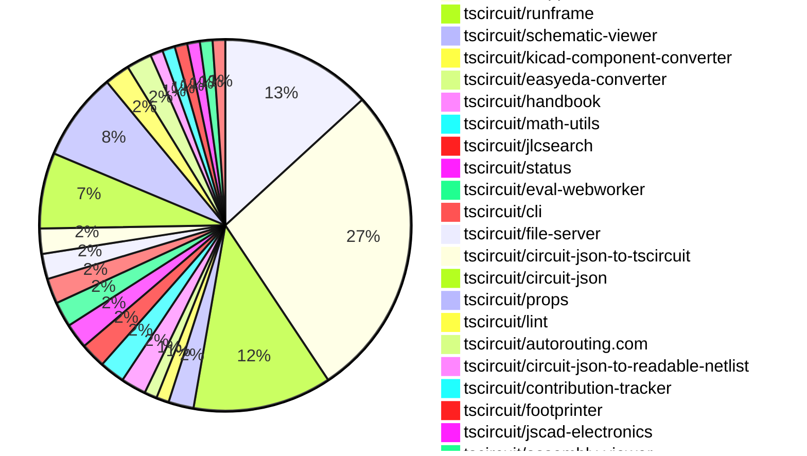

# contribution-tracker

Generates weekly contribution overviews for tscircuit contributors. Check out all
the [contribution overviews here](./contribution-overviews/)

* All PRs in the tscircuit org are scanned/summarized via Claude Haiku
* Claude classifies each Diff/PR as a Major, Minor or Tiny contribution
* All the PRs, summaries, and classifications are organized into charts and tables

The current week is shown below. There are 3 major sections:

* [Contributor Overview](#contributor-overview)
* [PRs by Repository](#prs-by-repository)
* [PRs by Contributor](#changes-by-contributor)

## Current Week

<!-- START_CURRENT_WEEK -->

# Contribution Overview 2024-12-25

## PRs by Repository

## Contributor Overview

| Contributor | 🐳 Major | 🐙 Minor | 🐌 Tiny | ⭐ | Issues Created |
|-------------|---------|---------|---------|-----|----------------|
| [seveibar](#seveibar) | 6 | 33 | 3 | 👑👑👑 | 69 |
| [Anshgrover23](#Anshgrover23) | 3 | 17 | 1 | 👑 | 13 |
| [ShiboSoftwareDev](#ShiboSoftwareDev) | 1 | 3 | 0 | ⭐⭐⭐ | 14 |
| [Abse2001](#Abse2001) | 1 | 6 | 0 | ⭐⭐ | 3 |
| [techmannih](#techmannih) | 0 | 5 | 0 | ⭐ | 3 |
| [devin-ai-integration[bot]](#devin-ai-integration[bot]) | 1 | 3 | 0 | ⭐ | 0 |
| [AnasSarkiz](#AnasSarkiz) | 0 | 3 | 0 | ⭐ | 4 |
| [imrishabh18](#imrishabh18) | 0 | 1 | 0 | ⭐ | 8 |
| [DrSensor](#DrSensor) | 1 | 0 | 0 | ⭐ | 0 |
| [krushnarout](#krushnarout) | 0 | 1 | 0 |  | 0 |
| [karthik-nair-20](#karthik-nair-20) | 0 | 1 | 0 |  | 0 |

## Review Table

[reviews-received-hover]: ## "Number of reviews received for PRs for this contributor"
[approvals-received-hover]: ## "Number of approvals received for PRs this contributor authored"
[rejections-received-hover]: ## "Number of rejections received for PRs this contributor authored"
[prs-opened-hover]: ## "Number of PRs opened by this contributor"
[issues-created-hover]: ## "Number of issues created by this contributor"
[bountied-issues-hover]: ## "Number of issues this contributor created with a bounty"
[bountied-issue-$-hover]: ## "Total bounty amount placed on issues authored by this contributor"

| Contributor | Reviews Received | Approvals Received | Rejections Received | Approvals | Rejections | PRs Opened | PRs Merged | Issues Created | Bountied Issues | Bountied Issue $ |
|---|---|---|---|---|---|---|---|---|---|---|
| [seveibar](#seveibar) | 1 | 0 | 0 | 49 | 25 | 46 | 43 | 69 | 41 | 742 |
| [Abse2001](#Abse2001) | 25 | 7 | 0 | 2 | 0 | 9 | 7 | 3 | 3 | 32 |
| [DrSensor](#DrSensor) | 1 | 1 | 0 | 0 | 0 | 1 | 1 | 0 | 0 | 0 |
| [devin-ai-integration[bot]](#devin-ai-integration[bot]) | 9 | 3 | 2 | 0 | 0 | 13 | 4 | 0 | 0 | 0 |
| [Anshgrover23](#Anshgrover23) | 90 | 23 | 21 | 0 | 5 | 29 | 21 | 13 | 1 | 4 |
| [techmannih](#techmannih) | 26 | 6 | 11 | 0 | 0 | 12 | 5 | 3 | 0 | 0 |
| [imrishabh18](#imrishabh18) | 2 | 1 | 0 | 0 | 2 | 2 | 1 | 8 | 3 | 20 |
| [ShiboSoftwareDev](#ShiboSoftwareDev) | 11 | 6 | 0 | 1 | 3 | 6 | 4 | 14 | 6 | 102 |
| [AnasSarkiz](#AnasSarkiz) | 4 | 4 | 0 | 0 | 0 | 3 | 3 | 4 | 2 | 20 |
| [vishwamartur](#vishwamartur) | 1 | 0 | 1 | 0 | 0 | 1 | 0 | 0 | 0 | 0 |
| [abhijitxy](#abhijitxy) | 0 | 0 | 0 | 1 | 0 | 0 | 0 | 0 | 0 | 0 |
| [krushnarout](#krushnarout) | 1 | 1 | 0 | 0 | 0 | 2 | 1 | 0 | 0 | 0 |
| [karthik-nair-20](#karthik-nair-20) | 1 | 1 | 0 | 0 | 0 | 2 | 1 | 0 | 0 | 0 |

## Changes by Repository

### [tscircuit/core](https://github.com/tscircuit/core)

| PR # | Impact | Contributor | Description |
|------|--------|-------------|-------------|
| [#455](https://github.com/tscircuit/core/pull/455) | 🐳 Major | seveibar | Adds support for schematic manual placements |
| [#472](https://github.com/tscircuit/core/pull/472) | 🐳 Major | Abse2001 | Adds a new feature to trace components that considers the maximum decoupling trace length of connected capacitors. |
| [#442](https://github.com/tscircuit/core/pull/442) | 🐳 Major | Anshgrover23 | Adds a new component called "resonator" to the project. |
| [#459](https://github.com/tscircuit/core/pull/459) | 🐳 Major | Anshgrover23 | Adds a new Transistor component to the library. |
| [#475](https://github.com/tscircuit/core/pull/475) | 🐙 Minor | seveibar | This pull request adds support for non-numeric pin labels in the `schPinStyle` property, and includes a function to convert pin styles with labels or numbers into a single numeric format. |
| [#470](https://github.com/tscircuit/core/pull/470) | 🐙 Minor | seveibar | Improves the handling of schematic manual edits by fixing the calculation of the `center` property for `schematic_component` and `schematic_text` objects. |
| [#457](https://github.com/tscircuit/core/pull/457) | 🐙 Minor | seveibar | Adds support for sending the display name to the autorouting server and requires the display name to be present. |
| [#456](https://github.com/tscircuit/core/pull/456) | 🐙 Minor | seveibar | Rename `Circuit` class to `RootCircuit` class. |
| [#478](https://github.com/tscircuit/core/pull/478) | 🐙 Minor | Anshgrover23 | Added a new method `doInitialSchematicComponentRender()` that checks if `noSchematicRepresentation` prop is true and skips the normal schematic rendering if so. |
| [#466](https://github.com/tscircuit/core/pull/466) | 🐙 Minor | Anshgrover23 | Adds the `display_value` property for resistors and capacitors in the `Resistor` and `Capacitor` classes, respectively. |
| [#468](https://github.com/tscircuit/core/pull/468) | 🐌 Tiny | seveibar | Improve error messages in the RootCircuit class to provide more context. |
| [#458](https://github.com/tscircuit/core/pull/458) | 🐌 Tiny | seveibar | Add a new `Circuit` export for backwards compatibility |

### [tscircuit/snippets](https://github.com/tscircuit/snippets)

| PR # | Impact | Contributor | Description |
|------|--------|-------------|-------------|
| [#446](https://github.com/tscircuit/snippets/pull/446) | 🐳 Major | seveibar | Adds a new landing page for the tscircuit project, including a FAQ section, a footer, and various metadata updates. |
| [#423](https://github.com/tscircuit/snippets/pull/423) | 🐳 Major | ShiboSoftwareDev | Import snippets from registry to development server |
| [#468](https://github.com/tscircuit/snippets/pull/468) | 🐙 Minor | seveibar | Improves the layout and presentation of the landing page's bullet points on mobile devices. |
| [#463](https://github.com/tscircuit/snippets/pull/463) | 🐙 Minor | seveibar | Adds analytics tracking and cookie consent functionality to the application. |
| [#454](https://github.com/tscircuit/snippets/pull/454) | 🐙 Minor | seveibar | Slower animation for the trending snippets carousel and added a preview of the PCB view to the carousel items. |
| [#451](https://github.com/tscircuit/snippets/pull/451) | 🐙 Minor | seveibar | Adds a search component and expands the FAQ section with more details about tscircuit |
| [#442](https://github.com/tscircuit/snippets/pull/442) | 🐙 Minor | seveibar | Improves the SEO (Search Engine Optimization) of the website by adding a more descriptive title, meta description, meta keywords, and other SEO-related tags. |
| [#438](https://github.com/tscircuit/snippets/pull/438) | 🐙 Minor | seveibar | Add download for readable netlist |
| [#430](https://github.com/tscircuit/snippets/pull/430) | 🐙 Minor | seveibar | Add circuit name for better logs on autorouting server |
| [#482](https://github.com/tscircuit/snippets/pull/482) | 🐙 Minor | Anshgrover23 | Adds a new option to download KiCAD PCB files from the circuit JSON data. |
| [#460](https://github.com/tscircuit/snippets/pull/460) | 🐙 Minor | Anshgrover23 | Fix the search component to have a maximum height and enable scrolling for the search results. |
| [#472](https://github.com/tscircuit/snippets/pull/472) | 🐙 Minor | Anshgrover23 | Add Algora bounty badge to the project's README |
| [#458](https://github.com/tscircuit/snippets/pull/458) | 🐙 Minor | Anshgrover23 | Fixes the Playwright tests to use the correct selectors and wait for elements to be visible. |
| [#452](https://github.com/tscircuit/snippets/pull/452) | 🐙 Minor | Anshgrover23 | Adds the display of the number of stars for each snippet on the user profile page. |
| [#434](https://github.com/tscircuit/snippets/pull/434) | 🐙 Minor | Anshgrover23 | Changes the save button to a "Fork" button if the user does not own the snippet. |
| [#431](https://github.com/tscircuit/snippets/pull/431) | 🐙 Minor | Anshgrover23 | Fix for playwright-tests failing |
| [#422](https://github.com/tscircuit/snippets/pull/422) | 🐙 Minor | Anshgrover23 | Adds `waitForLoadState` to `view-snippet.spec.ts` tests to ensure the page is fully loaded before taking screenshots. |
| [#478](https://github.com/tscircuit/snippets/pull/478) | 🐙 Minor | techmannih | Fixes card misalignment by adding a hover effect and adjusting the height. |
| [#475](https://github.com/tscircuit/snippets/pull/475) | 🐙 Minor | techmannih | Adds a new button to download the Assembly SVG of the circuit. |
| [#439](https://github.com/tscircuit/snippets/pull/439) | 🐙 Minor | devin-ai-integration[bot] | Switch chat icon to Discord icon in the header |
| [#465](https://github.com/tscircuit/snippets/pull/465) | 🐙 Minor | krushnarout | Adds a new "Header Dropdown" component on the landing page for logged-in users. |
| [#425](https://github.com/tscircuit/snippets/pull/425) | 🐙 Minor | karthik-nair-20 | Align the EditorNav component to the right side on responsive devices. |
| [#417](https://github.com/tscircuit/snippets/pull/417) | 🐙 Minor | imrishabh18 | Fixes an issue with importing an empty file for "manual-edits" when using the "use-run-tsx" hook. |
| [#483](https://github.com/tscircuit/snippets/pull/483) | 🐌 Tiny | seveibar | Update the Discord link in the Header2 component. |
| [#448](https://github.com/tscircuit/snippets/pull/448) | 🐌 Tiny | Anshgrover23 | Update snapshots of homePage test |

### [tscircuit/runframe](https://github.com/tscircuit/runframe)

| PR # | Impact | Contributor | Description |
|------|--------|-------------|-------------|
| [#73](https://github.com/tscircuit/runframe/pull/73) | 🐳 Major | seveibar | Adds a save button functionality and formalizes the events for syncing the circuit between the browser and the server. |
| [#52](https://github.com/tscircuit/runframe/pull/52) | 🐳 Major | seveibar | Adds support for schematic drag'n'drop with filesystem syncing via the `@tscircuit/file-server`. |
| [#84](https://github.com/tscircuit/runframe/pull/84) | 🐙 Minor | seveibar | Update the core and eval-webworker dependencies in the project. |
| [#79](https://github.com/tscircuit/runframe/pull/79) | 🐙 Minor | seveibar | Fixes issues with entrypoint change not triggering re-render and the order of rendering vs. evaluation promises. |
| [#78](https://github.com/tscircuit/runframe/pull/78) | 🐙 Minor | seveibar | Fix entrypoint not triggering re-render |
| [#77](https://github.com/tscircuit/runframe/pull/77) | 🐙 Minor | seveibar | Introduces a new default static build target `RunFrameForCli`, loads initial files via a list, and adds logging for the selected entrypoint. |
| [#76](https://github.com/tscircuit/runframe/pull/76) | 🐙 Minor | seveibar | Use the `RunFrameForCli` component as the default static build target and load initial files via a list. |
| [#75](https://github.com/tscircuit/runframe/pull/75) | 🐙 Minor | seveibar | Use `RunFrameForCli` instead of `RunFrameWithApi` as the default static build target for the CLI. |
| [#60](https://github.com/tscircuit/runframe/pull/60) | 🐙 Minor | seveibar | Fix for the `fsmap` issue in the `RunFrame` component. |
| [#48](https://github.com/tscircuit/runframe/pull/48) | 🐙 Minor | seveibar | Adds a new prop `leftHeaderContent` to the `CircuitJsonPreview` and `RunFrame` components to allow for customization of the left-side header content. |
| [#65](https://github.com/tscircuit/runframe/pull/65) | 🐙 Minor | techmannih | Add assembly view to the circuit editor |

### [tscircuit/schematic-viewer](https://github.com/tscircuit/schematic-viewer)

| PR # | Impact | Contributor | Description |
|------|--------|-------------|-------------|
| [#76](https://github.com/tscircuit/schematic-viewer/pull/76) | 🐙 Minor | seveibar | Fix circuit JSON updates by adding debug statements and ensuring the circuit JSON is up-to-date when computing the original center for edit events. |
| [#75](https://github.com/tscircuit/schematic-viewer/pull/75) | 🐙 Minor | seveibar | Change tscircuit dependencies to peer deps to avoid dupes |

### [tscircuit/kicad-component-converter](https://github.com/tscircuit/kicad-component-converter)

| PR # | Impact | Contributor | Description |
|------|--------|-------------|-------------|
| [#110](https://github.com/tscircuit/kicad-component-converter/pull/110) | 🐙 Minor | seveibar | Converts Kicad Mod files into Circuit JSON format on a website. |

### [tscircuit/easyeda-converter](https://github.com/tscircuit/easyeda-converter)

| PR # | Impact | Contributor | Description |
|------|--------|-------------|-------------|
| [#141](https://github.com/tscircuit/easyeda-converter/pull/141) | 🐙 Minor | seveibar | Adds instructions to the README for adding new part tests |

### [tscircuit/handbook](https://github.com/tscircuit/handbook)

| PR # | Impact | Contributor | Description |
|------|--------|-------------|-------------|
| [#6](https://github.com/tscircuit/handbook/pull/6) | 🐙 Minor | seveibar | Create a new markdown file "learn-git.md" with instructions for learning Git. |
| [#4](https://github.com/tscircuit/handbook/pull/4) | 🐙 Minor | Abse2001 | Added a tutorial for using yalc for local development. |

### [tscircuit/math-utils](https://github.com/tscircuit/math-utils)

| PR # | Impact | Contributor | Description |
|------|--------|-------------|-------------|
| [#3](https://github.com/tscircuit/math-utils/pull/3) | 🐙 Minor | seveibar | Adds support for centered and non-centered grid layouts, with adjustments to the calculation of cell positions. |
| [#2](https://github.com/tscircuit/math-utils/pull/2) | 🐙 Minor | seveibar | Add support for grid function to the library. |

### [tscircuit/jlcsearch](https://github.com/tscircuit/jlcsearch)

| PR # | Impact | Contributor | Description |
|------|--------|-------------|-------------|
| [#14](https://github.com/tscircuit/jlcsearch/pull/14) | 🐳 Major | Anshgrover23 |  |
| [#16](https://github.com/tscircuit/jlcsearch/pull/16) | 🐙 Minor | seveibar | Adds the PostHog analytics script to the application. |

### [tscircuit/status](https://github.com/tscircuit/status)

| PR # | Impact | Contributor | Description |
|------|--------|-------------|-------------|
| [#6](https://github.com/tscircuit/status/pull/6) | 🐙 Minor | seveibar | Filters the outages table to only show outages longer than 15 minutes, preventing flaky health checks from being listed. |
| [#8](https://github.com/tscircuit/status/pull/8) | 🐙 Minor | devin-ai-integration[bot] | Improve the display of outage durations by showing them in a more human-readable format. |

### [tscircuit/eval-webworker](https://github.com/tscircuit/eval-webworker)

| PR # | Impact | Contributor | Description |
|------|--------|-------------|-------------|
| [#55](https://github.com/tscircuit/eval-webworker/pull/55) | 🐙 Minor | seveibar | Updates the core library, fixes types, and adds support for setting the name of the circuit. |
| [#54](https://github.com/tscircuit/eval-webworker/pull/54) | 🐙 Minor | seveibar | Adds type exports for `CircuitWebWorker` and `WebWorkerConfiguration` in the `lib/index.ts` file. |

### [tscircuit/cli](https://github.com/tscircuit/cli)

| PR # | Impact | Contributor | Description |
|------|--------|-------------|-------------|
| [#11](https://github.com/tscircuit/cli/pull/11) | 🟣 | seveibar | Fix Module Import issue in cli build |
| [#10](https://github.com/tscircuit/cli/pull/10) | 🐳 Major | seveibar | Adds schematic drag and drop support, dynamic loading of runframe, and an events watcher on the CLI. |

### [tscircuit/file-server](https://github.com/tscircuit/file-server)

| PR # | Impact | Contributor | Description |
|------|--------|-------------|-------------|
| [#3](https://github.com/tscircuit/file-server/pull/3) | 🐳 Major | seveibar | Adds a new admin page to list all events and improves the admin pages with a central index page. |
| [#2](https://github.com/tscircuit/file-server/pull/2) | 🐙 Minor | seveibar | Add a new route `/events/reset` to reset the events list. |

### [tscircuit/circuit-json-to-tscircuit](https://github.com/tscircuit/circuit-json-to-tscircuit)

| PR # | Impact | Contributor | Description |
|------|--------|-------------|-------------|
| [#3](https://github.com/tscircuit/circuit-json-to-tscircuit/pull/3) | 🐙 Minor | seveibar | Adds more information to the README and removes empty lines from the output. |
| [#2](https://github.com/tscircuit/circuit-json-to-tscircuit/pull/2) | 🐙 Minor | seveibar | Add initial GitHub Actions workflows for formatting, type checking, testing, and publishing to npm. |

### [tscircuit/circuit-json](https://github.com/tscircuit/circuit-json)

| PR # | Impact | Contributor | Description |
|------|--------|-------------|-------------|
| [#115](https://github.com/tscircuit/circuit-json/pull/115) | 🐙 Minor | Abse2001 | Added `display_name` property to the `SourceTrace` interface. |
| [#114](https://github.com/tscircuit/circuit-json/pull/114) | 🐙 Minor | Abse2001 | Added a new optional property `max_decoupling_trace_length` to the `source_simple_capacitor` object. |
| [#113](https://github.com/tscircuit/circuit-json/pull/113) | 🐙 Minor | Abse2001 | Added `pcb_trace.trace_length` and `source_trace.max_length` properties to the corresponding TypeScript interfaces. |
| [#111](https://github.com/tscircuit/circuit-json/pull/111) | 🐙 Minor | Anshgrover23 | Add optional `display_resistance` and `display_capacitance` fields to the `source_simple_resistor` and `source_simple_capacitor` schemas, respectively. |
| [#103](https://github.com/tscircuit/circuit-json/pull/103) | 🐙 Minor | Anshgrover23 | Add a new simple transistor component to the circuit element library. |
| [#105](https://github.com/tscircuit/circuit-json/pull/105) | 🐙 Minor | techmannih | Add a new type of PCB plated hole with a circular hole and a rectangular pad. |

### [tscircuit/props](https://github.com/tscircuit/props)

| PR # | Impact | Contributor | Description |
|------|--------|-------------|-------------|
| [#133](https://github.com/tscircuit/props/pull/133) | 🐳 Major | devin-ai-integration[bot] | Adds a new MOSFET component with props and validation using Zod. |
| [#139](https://github.com/tscircuit/props/pull/139) | 🐙 Minor | Abse2001 | Added `maxLength` and `maxDecouplingTraceLength` props to `Trace` and `Capacitor` components, respectively. |
| [#141](https://github.com/tscircuit/props/pull/141) | 🐙 Minor | Anshgrover23 | Add a new property `noSchematicRepresentation` to the `chipProps` type to allow disabling the schematic representation of a chip. |
| [#125](https://github.com/tscircuit/props/pull/125) | 🐙 Minor | Anshgrover23 | Add transistorProps to the library |
| [#131](https://github.com/tscircuit/props/pull/131) | 🐙 Minor | Anshgrover23 | Change the resonator pin variant property to support different options like "no_ground", "ground_pin", and "two_ground_pins". |
| [#138](https://github.com/tscircuit/props/pull/138) | 🐙 Minor | ShiboSoftwareDev | Changes the `channelType` property of the `MosfetProps` interface from `"nmos" | "pmos"` to `"n" | "p"`, and adds a new `mosfetMode` property with values `"enhancement" | "depletion"`. Also adds a new `mosfetPins` constant. |
| [#135](https://github.com/tscircuit/props/pull/135) | 🐙 Minor | devin-ai-integration[bot] | This PR adds an automated script to generate documentation for manual edit events and files. |

### [tscircuit/lint](https://github.com/tscircuit/lint)

| PR # | Impact | Contributor | Description |
|------|--------|-------------|-------------|
| [#7](https://github.com/tscircuit/lint/pull/7) | 🐙 Minor | Abse2001 | Added a new ESLint rule to enforce the context-passing pattern for functions with two parameters. |
| [#5](https://github.com/tscircuit/lint/pull/5) | 🐙 Minor | techmannih | Enables the use of the `tscircuit-lint` command by adding a bin script to the package.json file and configuring the build process with `tsup`. |

### [tscircuit/autorouting.com](https://github.com/tscircuit/autorouting.com)

| PR # | Impact | Contributor | Description |
|------|--------|-------------|-------------|
| [#10](https://github.com/tscircuit/autorouting.com/pull/10) | 🐙 Minor | Anshgrover23 | Automatically retries sample uploads up to 3 times on failure. |
| [#12](https://github.com/tscircuit/autorouting.com/pull/12) | 🐙 Minor | ShiboSoftwareDev | Removed the "force-dynamic" configuration from several pages, as it seems dynamic routes cannot be prerendered. |

### [tscircuit/circuit-json-to-readable-netlist](https://github.com/tscircuit/circuit-json-to-readable-netlist)

| PR # | Impact | Contributor | Description |
|------|--------|-------------|-------------|
| [#3](https://github.com/tscircuit/circuit-json-to-readable-netlist/pull/3) | 🐙 Minor | Anshgrover23 | Add a new "COMPONENTS" section to the netlist output, which includes a description of each component in the circuit. |

### [tscircuit/contribution-tracker](https://github.com/tscircuit/contribution-tracker)

| PR # | Impact | Contributor | Description |
|------|--------|-------------|-------------|
| [#27](https://github.com/tscircuit/contribution-tracker/pull/27) | 🐙 Minor | ShiboSoftwareDev | The pull request adds a feature to count approvals and rejections as tiny contribution points, with a maximum of 20 points across approvals and rejections. |

### [tscircuit/footprinter](https://github.com/tscircuit/footprinter)

| PR # | Impact | Contributor | Description |
|------|--------|-------------|-------------|
| [#103](https://github.com/tscircuit/footprinter/pull/103) | 🐙 Minor | AnasSarkiz | Fixes the imperial footprints of passive components |

### [tscircuit/jscad-electronics](https://github.com/tscircuit/jscad-electronics)

| PR # | Impact | Contributor | Description |
|------|--------|-------------|-------------|
| [#84](https://github.com/tscircuit/jscad-electronics/pull/84) | 🐙 Minor | AnasSarkiz | Added 3D components for missing imperial passive footprints (01005, 0201, 1206, 1210, 2010, 2512, and cap1206). |

### [tscircuit/assembly-viewer](https://github.com/tscircuit/assembly-viewer)

| PR # | Impact | Contributor | Description |
|------|--------|-------------|-------------|
| [#4](https://github.com/tscircuit/assembly-viewer/pull/4) | 🐙 Minor | AnasSarkiz | Added the `footprint` prop to the `capacitor` component in the example circuit. |

### [tscircuit/3d-viewer](https://github.com/tscircuit/3d-viewer)

| PR # | Impact | Contributor | Description |
|------|--------|-------------|-------------|
| [#96](https://github.com/tscircuit/3d-viewer/pull/96) | 🐳 Major | DrSensor | Adds hooks for exporting 3D models to GLTF format, allowing users to save their models in GLTF or GLB format. |

## Changes by Contributor

### [seveibar](https://github.com/seveibar)

| PR # | Impact | Description |
|------|--------|-------------|
| [#455](https://github.com/tscircuit/core/pull/455) | 🐳 Major | Adds support for schematic manual placements |
| [#446](https://github.com/tscircuit/snippets/pull/446) | 🐳 Major | Adds a new landing page for the tscircuit project, including a FAQ section, a footer, and various metadata updates. |
| [#73](https://github.com/tscircuit/runframe/pull/73) | 🐳 Major | Adds a save button functionality and formalizes the events for syncing the circuit between the browser and the server. |
| [#52](https://github.com/tscircuit/runframe/pull/52) | 🐳 Major | Adds support for schematic drag'n'drop with filesystem syncing via the `@tscircuit/file-server`. |
| [#76](https://github.com/tscircuit/schematic-viewer/pull/76) | 🐙 Minor | Fix circuit JSON updates by adding debug statements and ensuring the circuit JSON is up-to-date when computing the original center for edit events. |
| [#75](https://github.com/tscircuit/schematic-viewer/pull/75) | 🐙 Minor | Change tscircuit dependencies to peer deps to avoid dupes |
| [#110](https://github.com/tscircuit/kicad-component-converter/pull/110) | 🐙 Minor | Converts Kicad Mod files into Circuit JSON format on a website. |
| [#141](https://github.com/tscircuit/easyeda-converter/pull/141) | 🐙 Minor | Adds instructions to the README for adding new part tests |
| [#475](https://github.com/tscircuit/core/pull/475) | 🐙 Minor | This pull request adds support for non-numeric pin labels in the `schPinStyle` property, and includes a function to convert pin styles with labels or numbers into a single numeric format. |
| [#470](https://github.com/tscircuit/core/pull/470) | 🐙 Minor | Improves the handling of schematic manual edits by fixing the calculation of the `center` property for `schematic_component` and `schematic_text` objects. |
| [#457](https://github.com/tscircuit/core/pull/457) | 🐙 Minor | Adds support for sending the display name to the autorouting server and requires the display name to be present. |
| [#456](https://github.com/tscircuit/core/pull/456) | 🐙 Minor | Rename `Circuit` class to `RootCircuit` class. |
| [#6](https://github.com/tscircuit/handbook/pull/6) | 🐙 Minor | Create a new markdown file "learn-git.md" with instructions for learning Git. |
| [#3](https://github.com/tscircuit/math-utils/pull/3) | 🐙 Minor | Adds support for centered and non-centered grid layouts, with adjustments to the calculation of cell positions. |
| [#2](https://github.com/tscircuit/math-utils/pull/2) | 🐙 Minor | Add support for grid function to the library. |
| [#468](https://github.com/tscircuit/snippets/pull/468) | 🐙 Minor | Improves the layout and presentation of the landing page's bullet points on mobile devices. |
| [#463](https://github.com/tscircuit/snippets/pull/463) | 🐙 Minor | Adds analytics tracking and cookie consent functionality to the application. |
| [#454](https://github.com/tscircuit/snippets/pull/454) | 🐙 Minor | Slower animation for the trending snippets carousel and added a preview of the PCB view to the carousel items. |
| [#451](https://github.com/tscircuit/snippets/pull/451) | 🐙 Minor | Adds a search component and expands the FAQ section with more details about tscircuit |
| [#442](https://github.com/tscircuit/snippets/pull/442) | 🐙 Minor | Improves the SEO (Search Engine Optimization) of the website by adding a more descriptive title, meta description, meta keywords, and other SEO-related tags. |
| [#438](https://github.com/tscircuit/snippets/pull/438) | 🐙 Minor | Add download for readable netlist |
| [#430](https://github.com/tscircuit/snippets/pull/430) | 🐙 Minor | Add circuit name for better logs on autorouting server |
| [#16](https://github.com/tscircuit/jlcsearch/pull/16) | 🐙 Minor | Adds the PostHog analytics script to the application. |
| [#6](https://github.com/tscircuit/status/pull/6) | 🐙 Minor | Filters the outages table to only show outages longer than 15 minutes, preventing flaky health checks from being listed. |
| [#55](https://github.com/tscircuit/eval-webworker/pull/55) | 🐙 Minor | Updates the core library, fixes types, and adds support for setting the name of the circuit. |
| [#54](https://github.com/tscircuit/eval-webworker/pull/54) | 🐙 Minor | Adds type exports for `CircuitWebWorker` and `WebWorkerConfiguration` in the `lib/index.ts` file. |
| [#84](https://github.com/tscircuit/runframe/pull/84) | 🐙 Minor | Update the core and eval-webworker dependencies in the project. |
| [#79](https://github.com/tscircuit/runframe/pull/79) | 🐙 Minor | Fixes issues with entrypoint change not triggering re-render and the order of rendering vs. evaluation promises. |
| [#78](https://github.com/tscircuit/runframe/pull/78) | 🐙 Minor | Fix entrypoint not triggering re-render |
| [#77](https://github.com/tscircuit/runframe/pull/77) | 🐙 Minor | Introduces a new default static build target `RunFrameForCli`, loads initial files via a list, and adds logging for the selected entrypoint. |
| [#76](https://github.com/tscircuit/runframe/pull/76) | 🐙 Minor | Use the `RunFrameForCli` component as the default static build target and load initial files via a list. |
| [#75](https://github.com/tscircuit/runframe/pull/75) | 🐙 Minor | Use `RunFrameForCli` instead of `RunFrameWithApi` as the default static build target for the CLI. |
| [#60](https://github.com/tscircuit/runframe/pull/60) | 🐙 Minor | Fix for the `fsmap` issue in the `RunFrame` component. |
| [#48](https://github.com/tscircuit/runframe/pull/48) | 🐙 Minor | Adds a new prop `leftHeaderContent` to the `CircuitJsonPreview` and `RunFrame` components to allow for customization of the left-side header content. |
| [#468](https://github.com/tscircuit/core/pull/468) | 🐌 Tiny | Improve error messages in the RootCircuit class to provide more context. |
| [#458](https://github.com/tscircuit/core/pull/458) | 🐌 Tiny | Add a new `Circuit` export for backwards compatibility |
| [#483](https://github.com/tscircuit/snippets/pull/483) | 🐌 Tiny | Update the Discord link in the Header2 component. |
| [#11](https://github.com/tscircuit/cli/pull/11) | 🟣 | Fix Module Import issue in cli build |
| [#10](https://github.com/tscircuit/cli/pull/10) | 🐳 Major | Adds schematic drag and drop support, dynamic loading of runframe, and an events watcher on the CLI. |
| [#3](https://github.com/tscircuit/file-server/pull/3) | 🐳 Major | Adds a new admin page to list all events and improves the admin pages with a central index page. |
| [#2](https://github.com/tscircuit/file-server/pull/2) | 🐙 Minor | Add a new route `/events/reset` to reset the events list. |
| [#3](https://github.com/tscircuit/circuit-json-to-tscircuit/pull/3) | 🐙 Minor | Adds more information to the README and removes empty lines from the output. |
| [#2](https://github.com/tscircuit/circuit-json-to-tscircuit/pull/2) | 🐙 Minor | Add initial GitHub Actions workflows for formatting, type checking, testing, and publishing to npm. |

### [Abse2001](https://github.com/Abse2001)

| PR # | Impact | Description |
|------|--------|-------------|
| [#472](https://github.com/tscircuit/core/pull/472) | 🐳 Major | Adds a new feature to trace components that considers the maximum decoupling trace length of connected capacitors. |
| [#115](https://github.com/tscircuit/circuit-json/pull/115) | 🐙 Minor | Added `display_name` property to the `SourceTrace` interface. |
| [#114](https://github.com/tscircuit/circuit-json/pull/114) | 🐙 Minor | Added a new optional property `max_decoupling_trace_length` to the `source_simple_capacitor` object. |
| [#113](https://github.com/tscircuit/circuit-json/pull/113) | 🐙 Minor | Added `pcb_trace.trace_length` and `source_trace.max_length` properties to the corresponding TypeScript interfaces. |
| [#139](https://github.com/tscircuit/props/pull/139) | 🐙 Minor | Added `maxLength` and `maxDecouplingTraceLength` props to `Trace` and `Capacitor` components, respectively. |
| [#4](https://github.com/tscircuit/handbook/pull/4) | 🐙 Minor | Added a tutorial for using yalc for local development. |
| [#7](https://github.com/tscircuit/lint/pull/7) | 🐙 Minor | Added a new ESLint rule to enforce the context-passing pattern for functions with two parameters. |

### [Anshgrover23](https://github.com/Anshgrover23)

| PR # | Impact | Description |
|------|--------|-------------|
| [#442](https://github.com/tscircuit/core/pull/442) | 🐳 Major | Adds a new component called "resonator" to the project. |
| [#459](https://github.com/tscircuit/core/pull/459) | 🐳 Major | Adds a new Transistor component to the library. |
| [#14](https://github.com/tscircuit/jlcsearch/pull/14) | 🐳 Major |  |
| [#111](https://github.com/tscircuit/circuit-json/pull/111) | 🐙 Minor | Add optional `display_resistance` and `display_capacitance` fields to the `source_simple_resistor` and `source_simple_capacitor` schemas, respectively. |
| [#103](https://github.com/tscircuit/circuit-json/pull/103) | 🐙 Minor | Add a new simple transistor component to the circuit element library. |
| [#141](https://github.com/tscircuit/props/pull/141) | 🐙 Minor | Add a new property `noSchematicRepresentation` to the `chipProps` type to allow disabling the schematic representation of a chip. |
| [#125](https://github.com/tscircuit/props/pull/125) | 🐙 Minor | Add transistorProps to the library |
| [#131](https://github.com/tscircuit/props/pull/131) | 🐙 Minor | Change the resonator pin variant property to support different options like "no_ground", "ground_pin", and "two_ground_pins". |
| [#478](https://github.com/tscircuit/core/pull/478) | 🐙 Minor | Added a new method `doInitialSchematicComponentRender()` that checks if `noSchematicRepresentation` prop is true and skips the normal schematic rendering if so. |
| [#466](https://github.com/tscircuit/core/pull/466) | 🐙 Minor | Adds the `display_value` property for resistors and capacitors in the `Resistor` and `Capacitor` classes, respectively. |
| [#10](https://github.com/tscircuit/autorouting.com/pull/10) | 🐙 Minor | Automatically retries sample uploads up to 3 times on failure. |
| [#482](https://github.com/tscircuit/snippets/pull/482) | 🐙 Minor | Adds a new option to download KiCAD PCB files from the circuit JSON data. |
| [#460](https://github.com/tscircuit/snippets/pull/460) | 🐙 Minor | Fix the search component to have a maximum height and enable scrolling for the search results. |
| [#472](https://github.com/tscircuit/snippets/pull/472) | 🐙 Minor | Add Algora bounty badge to the project's README |
| [#458](https://github.com/tscircuit/snippets/pull/458) | 🐙 Minor | Fixes the Playwright tests to use the correct selectors and wait for elements to be visible. |
| [#452](https://github.com/tscircuit/snippets/pull/452) | 🐙 Minor | Adds the display of the number of stars for each snippet on the user profile page. |
| [#434](https://github.com/tscircuit/snippets/pull/434) | 🐙 Minor | Changes the save button to a "Fork" button if the user does not own the snippet. |
| [#431](https://github.com/tscircuit/snippets/pull/431) | 🐙 Minor | Fix for playwright-tests failing |
| [#422](https://github.com/tscircuit/snippets/pull/422) | 🐙 Minor | Adds `waitForLoadState` to `view-snippet.spec.ts` tests to ensure the page is fully loaded before taking screenshots. |
| [#3](https://github.com/tscircuit/circuit-json-to-readable-netlist/pull/3) | 🐙 Minor | Add a new "COMPONENTS" section to the netlist output, which includes a description of each component in the circuit. |
| [#448](https://github.com/tscircuit/snippets/pull/448) | 🐌 Tiny | Update snapshots of homePage test |

### [techmannih](https://github.com/techmannih)

| PR # | Impact | Description |
|------|--------|-------------|
| [#105](https://github.com/tscircuit/circuit-json/pull/105) | 🐙 Minor | Add a new type of PCB plated hole with a circular hole and a rectangular pad. |
| [#478](https://github.com/tscircuit/snippets/pull/478) | 🐙 Minor | Fixes card misalignment by adding a hover effect and adjusting the height. |
| [#475](https://github.com/tscircuit/snippets/pull/475) | 🐙 Minor | Adds a new button to download the Assembly SVG of the circuit. |
| [#65](https://github.com/tscircuit/runframe/pull/65) | 🐙 Minor | Add assembly view to the circuit editor |
| [#5](https://github.com/tscircuit/lint/pull/5) | 🐙 Minor | Enables the use of the `tscircuit-lint` command by adding a bin script to the package.json file and configuring the build process with `tsup`. |

### [ShiboSoftwareDev](https://github.com/ShiboSoftwareDev)

| PR # | Impact | Description |
|------|--------|-------------|
| [#423](https://github.com/tscircuit/snippets/pull/423) | 🐳 Major | Import snippets from registry to development server |
| [#138](https://github.com/tscircuit/props/pull/138) | 🐙 Minor | Changes the `channelType` property of the `MosfetProps` interface from `"nmos" | "pmos"` to `"n" | "p"`, and adds a new `mosfetMode` property with values `"enhancement" | "depletion"`. Also adds a new `mosfetPins` constant. |
| [#27](https://github.com/tscircuit/contribution-tracker/pull/27) | 🐙 Minor | The pull request adds a feature to count approvals and rejections as tiny contribution points, with a maximum of 20 points across approvals and rejections. |
| [#12](https://github.com/tscircuit/autorouting.com/pull/12) | 🐙 Minor | Removed the "force-dynamic" configuration from several pages, as it seems dynamic routes cannot be prerendered. |

### [devin-ai-integration[bot]](https://github.com/devin-ai-integration[bot])

| PR # | Impact | Description |
|------|--------|-------------|
| [#133](https://github.com/tscircuit/props/pull/133) | 🐳 Major | Adds a new MOSFET component with props and validation using Zod. |
| [#135](https://github.com/tscircuit/props/pull/135) | 🐙 Minor | This PR adds an automated script to generate documentation for manual edit events and files. |
| [#439](https://github.com/tscircuit/snippets/pull/439) | 🐙 Minor | Switch chat icon to Discord icon in the header |
| [#8](https://github.com/tscircuit/status/pull/8) | 🐙 Minor | Improve the display of outage durations by showing them in a more human-readable format. |

### [AnasSarkiz](https://github.com/AnasSarkiz)

| PR # | Impact | Description |
|------|--------|-------------|
| [#103](https://github.com/tscircuit/footprinter/pull/103) | 🐙 Minor | Fixes the imperial footprints of passive components |
| [#84](https://github.com/tscircuit/jscad-electronics/pull/84) | 🐙 Minor | Added 3D components for missing imperial passive footprints (01005, 0201, 1206, 1210, 2010, 2512, and cap1206). |
| [#4](https://github.com/tscircuit/assembly-viewer/pull/4) | 🐙 Minor | Added the `footprint` prop to the `capacitor` component in the example circuit. |

### [DrSensor](https://github.com/DrSensor)

| PR # | Impact | Description |
|------|--------|-------------|
| [#96](https://github.com/tscircuit/3d-viewer/pull/96) | 🐳 Major | Adds hooks for exporting 3D models to GLTF format, allowing users to save their models in GLTF or GLB format. |

### [krushnarout](https://github.com/krushnarout)

| PR # | Impact | Description |
|------|--------|-------------|
| [#465](https://github.com/tscircuit/snippets/pull/465) | 🐙 Minor | Adds a new "Header Dropdown" component on the landing page for logged-in users. |

### [karthik-nair-20](https://github.com/karthik-nair-20)

| PR # | Impact | Description |
|------|--------|-------------|
| [#425](https://github.com/tscircuit/snippets/pull/425) | 🐙 Minor | Align the EditorNav component to the right side on responsive devices. |

### [imrishabh18](https://github.com/imrishabh18)

| PR # | Impact | Description |
|------|--------|-------------|
| [#417](https://github.com/tscircuit/snippets/pull/417) | 🐙 Minor | Fixes an issue with importing an empty file for "manual-edits" when using the "use-run-tsx" hook. |

<!-- END_CURRENT_WEEK -->
