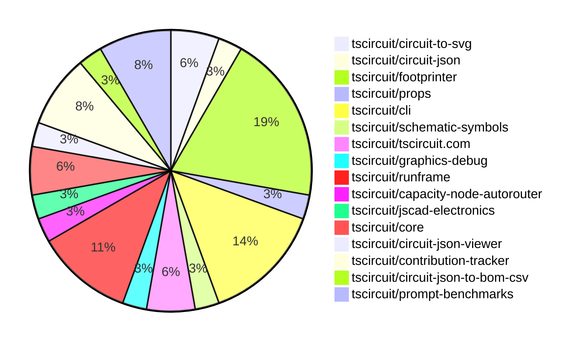

# contribution-tracker

Generates weekly contribution overviews for tscircuit contributors. Check out all
the [contribution overviews here](./contribution-overviews/)

* All PRs in the tscircuit org are scanned/summarized via Claude Haiku
* Claude classifies each Diff/PR as a Major, Minor or Tiny contribution
* All the PRs, summaries, and classifications are organized into charts and tables

The current week is shown below. There are 3 major sections:

* [Contributor Overview](#contributor-overview)
* [PRs by Repository](#prs-by-repository)
* [PRs by Contributor](#changes-by-contributor)

## Current Week

<!-- START_CURRENT_WEEK -->

# Contribution Overview 2025-02-19

## PRs by Repository

## Contributor Overview

| Contributor | 🐳 Major | 🐙 Minor | 🐌 Tiny | ⭐ | Issues Created |
|-------------|---------|---------|---------|-----|----------------|
| [seveibar](#seveibar) | 2 | 6 | 0 | ⭐⭐⭐ | 21 |
| [ShiboSoftwareDev](#ShiboSoftwareDev) | 1 | 2 | 0 | ⭐⭐ | 5 |
| [techmannih](#techmannih) | 1 | 3 | 0 | ⭐⭐ | 5 |
| [ArnavK-09](#ArnavK-09) | 1 | 3 | 1 | ⭐⭐ | 1 |
| [imrishabh18](#imrishabh18) | 0 | 3 | 0 | ⭐ | 7 |
| [Abse2001](#Abse2001) | 0 | 3 | 0 | ⭐ | 2 |
| [AnasSarkiz](#AnasSarkiz) | 1 | 1 | 0 | ⭐ | 1 |
| [kom-senapati](#kom-senapati) | 1 | 1 | 0 | ⭐ | 2 |
| [Ayushjhawar8](#Ayushjhawar8) | 1 | 1 | 0 | ⭐ | 1 |
| [MustafaMulla29](#MustafaMulla29) | 1 | 0 | 0 | ⭐ | 1 |
| [Anshgrover23](#Anshgrover23) | 0 | 1 | 1 |  | 3 |
| [siva222003](#siva222003) | 0 | 1 | 0 |  | 1 |

## Review Table

[reviews-received-hover]: ## "Number of reviews received for PRs for this contributor"
[approvals-received-hover]: ## "Number of approvals received for PRs this contributor authored"
[rejections-received-hover]: ## "Number of rejections received for PRs this contributor authored"
[prs-opened-hover]: ## "Number of PRs opened by this contributor"
[issues-created-hover]: ## "Number of issues created by this contributor"
[bountied-issues-hover]: ## "Number of issues this contributor created with a bounty"
[bountied-issue-$-hover]: ## "Total bounty amount placed on issues authored by this contributor"

| Contributor | Reviews Received | Approvals Received | Rejections Received | Approvals | Rejections | PRs Opened | PRs Merged | Issues Created | Bountied Issues | Bountied Issue $ |
|---|---|---|---|---|---|---|---|---|---|---|
| [techmannih](#techmannih) | 13 | 4 | 3 | 1 | 1 | 6 | 4 | 5 | 4 | 32 |
| [imrishabh18](#imrishabh18) | 1 | 1 | 0 | 7 | 2 | 4 | 3 | 7 | 2 | 27 |
| [seveibar](#seveibar) | 1 | 1 | 0 | 19 | 3 | 11 | 8 | 21 | 20 | 322 |
| [MustafaMulla29](#MustafaMulla29) | 9 | 4 | 3 | 0 | 0 | 3 | 1 | 1 | 0 | 0 |
| [AnasSarkiz](#AnasSarkiz) | 3 | 2 | 0 | 0 | 1 | 2 | 2 | 1 | 1 | 5 |
| [Anshgrover23](#Anshgrover23) | 2 | 2 | 0 | 4 | 9 | 2 | 2 | 3 | 0 | 0 |
| [Abse2001](#Abse2001) | 4 | 3 | 1 | 0 | 0 | 3 | 3 | 2 | 1 | 10 |
| [ShiboSoftwareDev](#ShiboSoftwareDev) | 1 | 1 | 0 | 1 | 0 | 3 | 3 | 5 | 3 | 100 |
| [kom-senapati](#kom-senapati) | 14 | 6 | 2 | 0 | 0 | 3 | 2 | 2 | 0 | 0 |
| [ArnavK-09](#ArnavK-09) | 6 | 6 | 0 | 3 | 4 | 6 | 5 | 1 | 0 | 0 |
| [Ayushjhawar8](#Ayushjhawar8) | 21 | 2 | 6 | 0 | 0 | 3 | 2 | 1 | 0 | 0 |
| [siva222003](#siva222003) | 2 | 1 | 0 | 0 | 0 | 1 | 1 | 1 | 0 | 0 |
| [AayushSaini101](#AayushSaini101) | 15 | 2 | 3 | 0 | 0 | 1 | 0 | 0 | 0 | 0 |
| [deekshatomer](#deekshatomer) | 2 | 0 | 2 | 0 | 0 | 1 | 0 | 0 | 0 | 0 |

## Changes by Repository

### [tscircuit/circuit-to-svg](https://github.com/tscircuit/circuit-to-svg)

| PR # | Impact | Contributor | Description |
|------|--------|-------------|-------------|
| [#170](https://github.com/tscircuit/circuit-to-svg/pull/170) | 🐳 Major | techmannih | Adds support for silkscreenline, silkscreencircle, and silkscreenrect in the PCB SVG conversion process. |
| [#172](https://github.com/tscircuit/circuit-to-svg/pull/172) | 🐙 Minor | Anshgrover23 | Fix incorrect bounds calculation for PCB silkscreen elements in the Circuit-to-SVG conversion. |

### [tscircuit/circuit-json](https://github.com/tscircuit/circuit-json)

| PR # | Impact | Contributor | Description |
|------|--------|-------------|-------------|
| [#135](https://github.com/tscircuit/circuit-json/pull/135) | 🐙 Minor | techmannih | Add stroke width for silkscreen circle and silkscreen rectangle |

### [tscircuit/footprinter](https://github.com/tscircuit/footprinter)

| PR # | Impact | Contributor | Description |
|------|--------|-------------|-------------|
| [#184](https://github.com/tscircuit/footprinter/pull/184) | 🐳 Major | MustafaMulla29 | Implemented VSSOP-8-0.65mm footprint |
| [#148](https://github.com/tscircuit/footprinter/pull/148) | 🐙 Minor | techmannih | Adds a new footprint for the SOD123W package. |
| [#135](https://github.com/tscircuit/footprinter/pull/135) | 🐙 Minor | techmannih | Adds the sod323 footprint to the project. |
| [#204](https://github.com/tscircuit/footprinter/pull/204) | 🐙 Minor | AnasSarkiz | Added support for male and female pin headers in the `pinrow` footprint. |
| [#208](https://github.com/tscircuit/footprinter/pull/208) | 🐙 Minor | Abse2001 | Fixed NaN in sot23 silkscreen. |
| [#207](https://github.com/tscircuit/footprinter/pull/207) | 🐙 Minor | imrishabh18 | Add a build workflow for the Bun runtime |
| [#209](https://github.com/tscircuit/footprinter/pull/209) | 🐌 Tiny | Anshgrover23 | Add a test for the `dip_0.1in` component. |

### [tscircuit/props](https://github.com/tscircuit/props)

| PR # | Impact | Contributor | Description |
|------|--------|-------------|-------------|
| [#186](https://github.com/tscircuit/props/pull/186) | 🐳 Major | seveibar | Introduce `layoutMode`, `pcbLayout` and `schLayout` properties to the `<group />` component to allow flexbox layout and grid layout inside the component. |

### [tscircuit/cli](https://github.com/tscircuit/cli)

| PR # | Impact | Contributor | Description |
|------|--------|-------------|-------------|
| [#88](https://github.com/tscircuit/cli/pull/88) | 🐳 Major | seveibar | Switch from `tsup-node` to `bun build` to bundle the application, resulting in a massive reduction in install size. |
| [#89](https://github.com/tscircuit/cli/pull/89) | 🐙 Minor | seveibar | Removes all the "import @tscircuit/core" statements from the codebase. |
| [#96](https://github.com/tscircuit/cli/pull/96) | 🐙 Minor | imrishabh18 | Upgrades the `@tscircuit/core` dependency from version `0.0.249` to `0.0.323` |
| [#95](https://github.com/tscircuit/cli/pull/95) | 🐙 Minor | ArnavK-09 | Detect the new "bun.lock" file to identify the Bun package manager. |
| [#92](https://github.com/tscircuit/cli/pull/92) | 🐙 Minor | ArnavK-09 | Patch the DevServer to send an error message to runframe if saving a snippet fails. |

### [tscircuit/schematic-symbols](https://github.com/tscircuit/schematic-symbols)

| PR # | Impact | Contributor | Description |
|------|--------|-------------|-------------|
| [#256](https://github.com/tscircuit/schematic-symbols/pull/256) | 🐙 Minor | seveibar | Removes unused directories from the package output |

### [tscircuit/tscircuit.com](https://github.com/tscircuit/tscircuit.com)

| PR # | Impact | Contributor | Description |
|------|--------|-------------|-------------|
| [#688](https://github.com/tscircuit/tscircuit.com/pull/688) | 🐙 Minor | seveibar | Changes all references to the "/ai" URL to "https://chat.tscircuit.com". |
| [#685](https://github.com/tscircuit/tscircuit.com/pull/685) | 🐙 Minor | siva222003 | Adjust the layout of UI cards and badge on the /quickstart page for improved responsiveness on small screens. |

### [tscircuit/graphics-debug](https://github.com/tscircuit/graphics-debug)

| PR # | Impact | Contributor | Description |
|------|--------|-------------|-------------|
| [#24](https://github.com/tscircuit/graphics-debug/pull/24) | 🐙 Minor | seveibar | Add support for stroke dash array and line cap to the Line component. |

### [tscircuit/runframe](https://github.com/tscircuit/runframe)

| PR # | Impact | Contributor | Description |
|------|--------|-------------|-------------|
| [#250](https://github.com/tscircuit/runframe/pull/250) | 🐳 Major | Ayushjhawar8 | The pull request fixes an issue with the `RunFrame` component by improving error handling and providing better error messages when the input files or entrypoint are missing or empty. |
| [#270](https://github.com/tscircuit/runframe/pull/270) | 🐙 Minor | seveibar | Allow standalone bundle to display CLI version of RunFrame |
| [#273](https://github.com/tscircuit/runframe/pull/273) | 🐙 Minor | ArnavK-09 | Tweaks various aspects of the RunframeForCli, including the use of alert dialog, notification for export processing, text styling, export naming, tab menu density, and a new clickable NotSync badge. |
| [#274](https://github.com/tscircuit/runframe/pull/274) | 🐌 Tiny | ArnavK-09 | Bump versions of GitHub Actions used in the project's CI workflows |

### [tscircuit/capacity-node-autorouter](https://github.com/tscircuit/capacity-node-autorouter)

| PR # | Impact | Contributor | Description |
|------|--------|-------------|-------------|
| [#2](https://github.com/tscircuit/capacity-node-autorouter/pull/2) | 🐙 Minor | seveibar | Improve the High Density Autorouter by combining the visualizations of successful and failed solvers. |

### [tscircuit/jscad-electronics](https://github.com/tscircuit/jscad-electronics)

| PR # | Impact | Contributor | Description |
|------|--------|-------------|-------------|
| [#89](https://github.com/tscircuit/jscad-electronics/pull/89) | 🐳 Major | AnasSarkiz | Introduce Female headers 3D model and added example |

### [tscircuit/core](https://github.com/tscircuit/core)

| PR # | Impact | Contributor | Description |
|------|--------|-------------|-------------|
| [#639](https://github.com/tscircuit/core/pull/639) | 🐙 Minor | Abse2001 | Adds silkscreen text for component names in the PCB layout. |
| [#640](https://github.com/tscircuit/core/pull/640) | 🐙 Minor | imrishabh18 | Adds the `subcircuit_id` property to the output traces in the `Group` component. |

### [tscircuit/circuit-json-viewer](https://github.com/tscircuit/circuit-json-viewer)

| PR # | Impact | Contributor | Description |
|------|--------|-------------|-------------|
| [#3](https://github.com/tscircuit/circuit-json-viewer/pull/3) | 🐙 Minor | Abse2001 | Updated the version of the `@tscircuit/runframe` dependency from `0.0.12` to `0.0.189`. |

### [tscircuit/contribution-tracker](https://github.com/tscircuit/contribution-tracker)

| PR # | Impact | Contributor | Description |
|------|--------|-------------|-------------|
| [#76](https://github.com/tscircuit/contribution-tracker/pull/76) | 🐳 Major | ArnavK-09 | The pull request requires approval for points by processing reviews for merged and non-merged pull requests. |
| [#72](https://github.com/tscircuit/contribution-tracker/pull/72) | 🐳 Major | kom-senapati | Introduce workflows to automate format checking, testing, and type checking on push and pull request events. |
| [#58](https://github.com/tscircuit/contribution-tracker/pull/58) | 🐙 Minor | Ayushjhawar8 | Fixes an issue with the special honor for full-time contributors in the contributor overview component. |

### [tscircuit/circuit-json-to-bom-csv](https://github.com/tscircuit/circuit-json-to-bom-csv)

| PR # | Impact | Contributor | Description |
|------|--------|-------------|-------------|
| [#6](https://github.com/tscircuit/circuit-json-to-bom-csv/pull/6) | 🐙 Minor | kom-senapati | Adds support for interpreting LCSC part numbers in the JLCPCB Part # column |

### [tscircuit/prompt-benchmarks](https://github.com/tscircuit/prompt-benchmarks)

| PR # | Impact | Contributor | Description |
|------|--------|-------------|-------------|
| [#42](https://github.com/tscircuit/prompt-benchmarks/pull/42) | 🐳 Major | ShiboSoftwareDev | Renaming and refactoring the project structure, including the AiCoder interface and related code. |
| [#44](https://github.com/tscircuit/prompt-benchmarks/pull/44) | 🐙 Minor | ShiboSoftwareDev | Added more tests for various utility functions |
| [#43](https://github.com/tscircuit/prompt-benchmarks/pull/43) | 🐙 Minor | ShiboSoftwareDev | Added more tests for various utility functions |

## Changes by Contributor

### [techmannih](https://github.com/techmannih)

| PR # | Impact | Description |
|------|--------|-------------|
| [#170](https://github.com/tscircuit/circuit-to-svg/pull/170) | 🐳 Major | Adds support for silkscreenline, silkscreencircle, and silkscreenrect in the PCB SVG conversion process. |
| [#135](https://github.com/tscircuit/circuit-json/pull/135) | 🐙 Minor | Add stroke width for silkscreen circle and silkscreen rectangle |
| [#148](https://github.com/tscircuit/footprinter/pull/148) | 🐙 Minor | Adds a new footprint for the SOD123W package. |
| [#135](https://github.com/tscircuit/footprinter/pull/135) | 🐙 Minor | Adds the sod323 footprint to the project. |

### [seveibar](https://github.com/seveibar)

| PR # | Impact | Description |
|------|--------|-------------|
| [#186](https://github.com/tscircuit/props/pull/186) | 🐳 Major | Introduce `layoutMode`, `pcbLayout` and `schLayout` properties to the `<group />` component to allow flexbox layout and grid layout inside the component. |
| [#88](https://github.com/tscircuit/cli/pull/88) | 🐳 Major | Switch from `tsup-node` to `bun build` to bundle the application, resulting in a massive reduction in install size. |
| [#256](https://github.com/tscircuit/schematic-symbols/pull/256) | 🐙 Minor | Removes unused directories from the package output |
| [#688](https://github.com/tscircuit/tscircuit.com/pull/688) | 🐙 Minor | Changes all references to the "/ai" URL to "https://chat.tscircuit.com". |
| [#24](https://github.com/tscircuit/graphics-debug/pull/24) | 🐙 Minor | Add support for stroke dash array and line cap to the Line component. |
| [#270](https://github.com/tscircuit/runframe/pull/270) | 🐙 Minor | Allow standalone bundle to display CLI version of RunFrame |
| [#89](https://github.com/tscircuit/cli/pull/89) | 🐙 Minor | Removes all the "import @tscircuit/core" statements from the codebase. |
| [#2](https://github.com/tscircuit/capacity-node-autorouter/pull/2) | 🐙 Minor | Improve the High Density Autorouter by combining the visualizations of successful and failed solvers. |

### [AnasSarkiz](https://github.com/AnasSarkiz)

| PR # | Impact | Description |
|------|--------|-------------|
| [#89](https://github.com/tscircuit/jscad-electronics/pull/89) | 🐳 Major | Introduce Female headers 3D model and added example |
| [#204](https://github.com/tscircuit/footprinter/pull/204) | 🐙 Minor | Added support for male and female pin headers in the `pinrow` footprint. |

### [Anshgrover23](https://github.com/Anshgrover23)

| PR # | Impact | Description |
|------|--------|-------------|
| [#172](https://github.com/tscircuit/circuit-to-svg/pull/172) | 🐙 Minor | Fix incorrect bounds calculation for PCB silkscreen elements in the Circuit-to-SVG conversion. |
| [#209](https://github.com/tscircuit/footprinter/pull/209) | 🐌 Tiny | Add a test for the `dip_0.1in` component. |

### [Abse2001](https://github.com/Abse2001)

| PR # | Impact | Description |
|------|--------|-------------|
| [#208](https://github.com/tscircuit/footprinter/pull/208) | 🐙 Minor | Fixed NaN in sot23 silkscreen. |
| [#639](https://github.com/tscircuit/core/pull/639) | 🐙 Minor | Adds silkscreen text for component names in the PCB layout. |
| [#3](https://github.com/tscircuit/circuit-json-viewer/pull/3) | 🐙 Minor | Updated the version of the `@tscircuit/runframe` dependency from `0.0.12` to `0.0.189`. |

### [imrishabh18](https://github.com/imrishabh18)

| PR # | Impact | Description |
|------|--------|-------------|
| [#207](https://github.com/tscircuit/footprinter/pull/207) | 🐙 Minor | Add a build workflow for the Bun runtime |
| [#640](https://github.com/tscircuit/core/pull/640) | 🐙 Minor | Adds the `subcircuit_id` property to the output traces in the `Group` component. |
| [#96](https://github.com/tscircuit/cli/pull/96) | 🐙 Minor | Upgrades the `@tscircuit/core` dependency from version `0.0.249` to `0.0.323` |

### [MustafaMulla29](https://github.com/MustafaMulla29)

| PR # | Impact | Description |
|------|--------|-------------|
| [#184](https://github.com/tscircuit/footprinter/pull/184) | 🐳 Major | Implemented VSSOP-8-0.65mm footprint |

### [ArnavK-09](https://github.com/ArnavK-09)

| PR # | Impact | Description |
|------|--------|-------------|
| [#76](https://github.com/tscircuit/contribution-tracker/pull/76) | 🐳 Major | The pull request requires approval for points by processing reviews for merged and non-merged pull requests. |
| [#273](https://github.com/tscircuit/runframe/pull/273) | 🐙 Minor | Tweaks various aspects of the RunframeForCli, including the use of alert dialog, notification for export processing, text styling, export naming, tab menu density, and a new clickable NotSync badge. |
| [#95](https://github.com/tscircuit/cli/pull/95) | 🐙 Minor | Detect the new "bun.lock" file to identify the Bun package manager. |
| [#92](https://github.com/tscircuit/cli/pull/92) | 🐙 Minor | Patch the DevServer to send an error message to runframe if saving a snippet fails. |
| [#274](https://github.com/tscircuit/runframe/pull/274) | 🐌 Tiny | Bump versions of GitHub Actions used in the project's CI workflows |

### [kom-senapati](https://github.com/kom-senapati)

| PR # | Impact | Description |
|------|--------|-------------|
| [#72](https://github.com/tscircuit/contribution-tracker/pull/72) | 🐳 Major | Introduce workflows to automate format checking, testing, and type checking on push and pull request events. |
| [#6](https://github.com/tscircuit/circuit-json-to-bom-csv/pull/6) | 🐙 Minor | Adds support for interpreting LCSC part numbers in the JLCPCB Part # column |

### [Ayushjhawar8](https://github.com/Ayushjhawar8)

| PR # | Impact | Description |
|------|--------|-------------|
| [#250](https://github.com/tscircuit/runframe/pull/250) | 🐳 Major | The pull request fixes an issue with the `RunFrame` component by improving error handling and providing better error messages when the input files or entrypoint are missing or empty. |
| [#58](https://github.com/tscircuit/contribution-tracker/pull/58) | 🐙 Minor | Fixes an issue with the special honor for full-time contributors in the contributor overview component. |

### [siva222003](https://github.com/siva222003)

| PR # | Impact | Description |
|------|--------|-------------|
| [#685](https://github.com/tscircuit/tscircuit.com/pull/685) | 🐙 Minor | Adjust the layout of UI cards and badge on the /quickstart page for improved responsiveness on small screens. |

### [ShiboSoftwareDev](https://github.com/ShiboSoftwareDev)

| PR # | Impact | Description |
|------|--------|-------------|
| [#42](https://github.com/tscircuit/prompt-benchmarks/pull/42) | 🐳 Major | Renaming and refactoring the project structure, including the AiCoder interface and related code. |
| [#44](https://github.com/tscircuit/prompt-benchmarks/pull/44) | 🐙 Minor | Added more tests for various utility functions |
| [#43](https://github.com/tscircuit/prompt-benchmarks/pull/43) | 🐙 Minor | Added more tests for various utility functions |

<!-- END_CURRENT_WEEK -->
