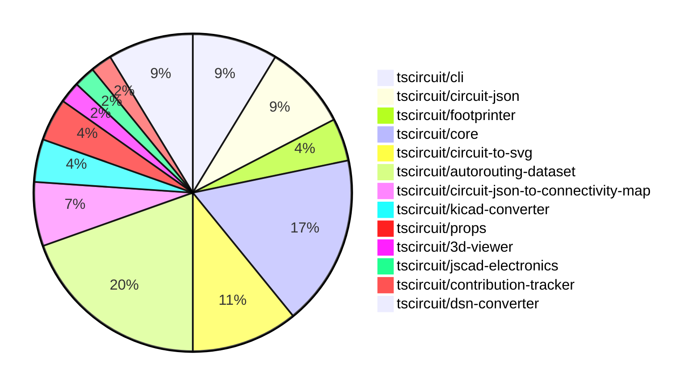

# contribution-tracker

Generates weekly contribution overviews for tscircuit contributors. Check out all
the [contribution overviews here](./contribution-overviews/)

* All PRs in the tscircuit org are scanned/summarized via Claude Haiku
* Claude classifies each Diff/PR as a Major, Minor or Tiny contribution
* All the PRs, summaries, and classifications are organized into charts and tables

The current week is shown below. There are 3 major sections:

* [Contributor Overview](#contributor-overview)
* [PRs by Repository](#prs-by-repository)
* [PRs by Contributor](#changes-by-contributor)

## Current Week

<!-- START_CURRENT_WEEK -->

# Contribution Overview 2024-09-14

## PRs by Repository

## Contributor Overview

| Contributor | 🐳 Major | 🐙 Minor | 🐌 Tiny |
|-------------|-------|-------|-------|
| seveibar | 24 | 9 | 0 |
| anas-sarkez | 0 | 1 | 0 |
| ShiboSoftwareDev | 4 | 0 | 0 |
| abhijitxy | 1 | 0 | 0 |
| tscircuitbot | 1 | 0 | 0 |
| imrishabh18 | 5 | 1 | 0 |

## Changes by Repository

### [tscircuit/cli](https://github.com/tscircuit/cli)

| PR # | Impact | Contributor | Description |
|------|--------|-------------|-------------|
| [#189](https://github.com/tscircuit/cli/pull/189) | 🐳 Major | seveibar | Update the kicad-converter workflow to use bun instead of Node.js, and delete temporary entrypoint files before creating new ones. |
| [#188](https://github.com/tscircuit/cli/pull/188) | 🐳 Major | seveibar | Adds support for exporting KiCad PCB files from the CLI. |
| [#185](https://github.com/tscircuit/cli/pull/185) | 🐳 Major | seveibar | Fix Gerber Exporting, add tests for gerber export |
| [#179](https://github.com/tscircuit/cli/pull/179) | 🐳 Major | seveibar | Fully route the macrokeypad |

### [tscircuit/circuit-json](https://github.com/tscircuit/circuit-json)

| PR # | Impact | Contributor | Description |
|------|--------|-------------|-------------|
| [#47](https://github.com/tscircuit/circuit-json/pull/47) | 🐳 Major | seveibar | Fix the `pcb_hole.hole_shape` field by renaming "round" to "circle" and adding a Zod transform to correctly handle old data. |
| [#44](https://github.com/tscircuit/circuit-json/pull/44) | 🐳 Major | seveibar | Update the fabrication note/path IDs to use correctly named fields |
| [#46](https://github.com/tscircuit/circuit-json/pull/46) | 🐳 Major | seveibar | Updating naming convention, switch to bun, switch AnySoupElement to AnyCircuitElement with deprecated comments |
| [#48](https://github.com/tscircuit/circuit-json/pull/48) | 🐙 Minor | seveibar | Fix a bug in the `hole_shape` enum by removing the "oval" option and fixing the "round" to "circle" transformation. |

### [tscircuit/footprinter](https://github.com/tscircuit/footprinter)

| PR # | Impact | Contributor | Description |
|------|--------|-------------|-------------|
| [#36](https://github.com/tscircuit/footprinter/pull/36) | 🐳 Major | seveibar | Add a GitHub Actions workflow that formats the code in pull requests. |
| [#37](https://github.com/tscircuit/footprinter/pull/37) | 🐙 Minor | anas-sarkez | Updated the `circuit-to-svg` dependency and the corresponding changes in the SVG output files. |

### [tscircuit/core](https://github.com/tscircuit/core)

| PR # | Impact | Contributor | Description |
|------|--------|-------------|-------------|
| [#95](https://github.com/tscircuit/core/pull/95) | 🐳 Major | seveibar | Fix null `pcb_component_id` by looking at `PrimitiveContainer` |
| [#94](https://github.com/tscircuit/core/pull/94) | 🐳 Major | seveibar | Fix bounds calculation for PCB components with null widths. |
| [#91](https://github.com/tscircuit/core/pull/91) | 🐳 Major | seveibar | Add support for configuring the minimum trace width in the autorouting algorithm. |
| [#90](https://github.com/tscircuit/core/pull/90) | 🐳 Major | seveibar | Possible fix for traces switching layers accidentally, cleanup trace code, add test for 9 key keyboard |
| [#89](https://github.com/tscircuit/core/pull/89) | 🐳 Major | seveibar | Enable goalbox optimization for PCB traces. |
| [#92](https://github.com/tscircuit/core/pull/92) | 🐳 Major | ShiboSoftwareDev | Add support for board outline |
| [#96](https://github.com/tscircuit/core/pull/96) | 🐙 Minor | seveibar | Add a test to ensure that every PCB SMT pad has a populated PCB component ID |
| [#86](https://github.com/tscircuit/core/pull/86) | 🐙 Minor | seveibar | Upgrades the `@tscircuit/infgrid-ijump-astar` dependency from version `0.0.16` to `0.0.17`. |

### [tscircuit/circuit-to-svg](https://github.com/tscircuit/circuit-to-svg)

| PR # | Impact | Contributor | Description |
|------|--------|-------------|-------------|
| [#74](https://github.com/tscircuit/circuit-to-svg/pull/74) | 🐳 Major | seveibar | Fix type issues, add typecheck and test, and update @tscircuit/soup dependency |
| [#73](https://github.com/tscircuit/circuit-to-svg/pull/73) | 🐳 Major | ShiboSoftwareDev | Introduce the ability to draw PCB boards as rectangular or outlined shapes |
| [#69](https://github.com/tscircuit/circuit-to-svg/pull/69) | 🐳 Major | ShiboSoftwareDev | Implemented colored fabrication note path and text |
| [#70](https://github.com/tscircuit/circuit-to-svg/pull/70) | 🐳 Major | imrishabh18 | Introduce a new feature to create SVG objects from PCB vias. |
| [#71](https://github.com/tscircuit/circuit-to-svg/pull/71) | 🐙 Minor | imrishabh18 | Update deprecated `soup` names to `AnyCircuitElement` in the code. |

### [tscircuit/autorouting-dataset](https://github.com/tscircuit/autorouting-dataset)

| PR # | Impact | Contributor | Description |
|------|--------|-------------|-------------|
| [#74](https://github.com/tscircuit/autorouting-dataset/pull/74) | 🐳 Major | seveibar | Fix a dependency breaking the build for the "bun-build-infgrid" GitHub workflow. |
| [#73](https://github.com/tscircuit/autorouting-dataset/pull/73) | 🐳 Major | seveibar | Introduce a new GitHub Actions workflow to benchmark the algorithm solvers and store the results in the BENCHMARKS.md file. |
| [#72](https://github.com/tscircuit/autorouting-dataset/pull/72) | 🐳 Major | seveibar | Implement a preprocessing step to adjust connection points based on previous iterations, and add a postprocessing step to add solved traces to the PCB connectivity map. |
| [#71](https://github.com/tscircuit/autorouting-dataset/pull/71) | 🐳 Major | seveibar | Adds a snapshot "worst case" example to fix in the multi-layer-ijump algorithm. |
| [#69](https://github.com/tscircuit/autorouting-dataset/pull/69) | 🐳 Major | seveibar | Introduce alternative goal box functions for ConnectionWithAlternatives. |
| [#66](https://github.com/tscircuit/autorouting-dataset/pull/66) | 🐳 Major | seveibar | Add vias for PCB trace routes |
| [#78](https://github.com/tscircuit/autorouting-dataset/pull/78) | 🐙 Minor | seveibar | Move `minTraceWidth` from `GeneralizedAstar` and `MultilayerIjump` to `SimpleRouteJson`. |
| [#77](https://github.com/tscircuit/autorouting-dataset/pull/77) | 🐙 Minor | seveibar | Add a new configuration option `minTraceWidth` to control the minimum width of the generated trace routes. |
| [#67](https://github.com/tscircuit/autorouting-dataset/pull/67) | 🐙 Minor | seveibar | Add a snapshot for the keyboard sample 7 against the multilayer autorouter (preparation for the Route to Neighbor Strategy) |

### [tscircuit/circuit-json-to-connectivity-map](https://github.com/tscircuit/circuit-json-to-connectivity-map)

| PR # | Impact | Contributor | Description |
|------|--------|-------------|-------------|
| [#4](https://github.com/tscircuit/circuit-json-to-connectivity-map/pull/4) | 🐳 Major | seveibar | The pull request adds support for adding connections to an existing connectivity map. |
| [#3](https://github.com/tscircuit/circuit-json-to-connectivity-map/pull/3) | 🐳 Major | seveibar | Implement a PCB Connectivity Map feature to determine what traces a port is physically connected to. |
| [#5](https://github.com/tscircuit/circuit-json-to-connectivity-map/pull/5) | 🐙 Minor | seveibar | Add support for initializing an empty `PcbConnectivityMap` when no circuit JSON is provided. |

### [tscircuit/kicad-converter](https://github.com/tscircuit/kicad-converter)

| PR # | Impact | Contributor | Description |
|------|--------|-------------|-------------|
| [#6](https://github.com/tscircuit/kicad-converter/pull/6) | 🐳 Major | seveibar | Adds support for handling plated holes and regular holes in the circuit JSON to KiCad PCB conversion process. |
| [#2](https://github.com/tscircuit/kicad-converter/pull/2) | 🐳 Major | seveibar | Add support for converting circuit JSON to KiCAD PCB format and add tests for the conversion |

### [tscircuit/props](https://github.com/tscircuit/props)

| PR # | Impact | Contributor | Description |
|------|--------|-------------|-------------|
| [#51](https://github.com/tscircuit/props/pull/51) | 🐙 Minor | seveibar | Add a `defaultTraceWidth` prop to `Board` and `Group` components |
| [#50](https://github.com/tscircuit/props/pull/50) | 🐙 Minor | seveibar | Add key as an optional parameter for trace props |

### [tscircuit/3d-viewer](https://github.com/tscircuit/3d-viewer)

| PR # | Impact | Contributor | Description |
|------|--------|-------------|-------------|
| [#17](https://github.com/tscircuit/3d-viewer/pull/17) | 🐳 Major | ShiboSoftwareDev | Implemented a function to create a 3D board geometry based on a list of 2D points representing the board outline. |

### [tscircuit/jscad-electronics](https://github.com/tscircuit/jscad-electronics)

| PR # | Impact | Contributor | Description |
|------|--------|-------------|-------------|
| [#35](https://github.com/tscircuit/jscad-electronics/pull/35) | 🐳 Major | abhijitxy | Add a new component for the SOT-723 package. |

### [tscircuit/contribution-tracker](https://github.com/tscircuit/contribution-tracker)

| PR # | Impact | Contributor | Description |
|------|--------|-------------|-------------|
| [#3](https://github.com/tscircuit/contribution-tracker/pull/3) | 🐳 Major | tscircuitbot | Add pagination to the `getRepos` function to retrieve all organization repositories. |

### [tscircuit/dsn-converter](https://github.com/tscircuit/dsn-converter)

| PR # | Impact | Contributor | Description |
|------|--------|-------------|-------------|
| [#6](https://github.com/tscircuit/dsn-converter/pull/6) | 🐳 Major | imrishabh18 | Update the parsing of PCB JSON to handle the new circuit JSON format. |
| [#5](https://github.com/tscircuit/dsn-converter/pull/5) | 🐳 Major | imrishabh18 | Removed the requirement for a source component in the PCB to Circuit JSON conversion. |
| [#3](https://github.com/tscircuit/dsn-converter/pull/3) | 🐳 Major | imrishabh18 | Add a function to convert DSN PCB data to Circuit JSON format |
| [#2](https://github.com/tscircuit/dsn-converter/pull/2) | 🐳 Major | imrishabh18 | The pull request adds a feature to convert S-expressions to JSON. |

## Changes by Contributor

### [seveibar](https://github.com/seveibar)

| PR # | Impact | Description |
|------|--------|-------------|
| [#189](https://github.com/tscircuit/cli/pull/189) | 🐳 Major | Update the kicad-converter workflow to use bun instead of Node.js, and delete temporary entrypoint files before creating new ones. |
| [#188](https://github.com/tscircuit/cli/pull/188) | 🐳 Major | Adds support for exporting KiCad PCB files from the CLI. |
| [#185](https://github.com/tscircuit/cli/pull/185) | 🐳 Major | Fix Gerber Exporting, add tests for gerber export |
| [#179](https://github.com/tscircuit/cli/pull/179) | 🐳 Major | Fully route the macrokeypad |
| [#47](https://github.com/tscircuit/circuit-json/pull/47) | 🐳 Major | Fix the `pcb_hole.hole_shape` field by renaming "round" to "circle" and adding a Zod transform to correctly handle old data. |
| [#44](https://github.com/tscircuit/circuit-json/pull/44) | 🐳 Major | Update the fabrication note/path IDs to use correctly named fields |
| [#46](https://github.com/tscircuit/circuit-json/pull/46) | 🐳 Major | Updating naming convention, switch to bun, switch AnySoupElement to AnyCircuitElement with deprecated comments |
| [#36](https://github.com/tscircuit/footprinter/pull/36) | 🐳 Major | Add a GitHub Actions workflow that formats the code in pull requests. |
| [#95](https://github.com/tscircuit/core/pull/95) | 🐳 Major | Fix null `pcb_component_id` by looking at `PrimitiveContainer` |
| [#94](https://github.com/tscircuit/core/pull/94) | 🐳 Major | Fix bounds calculation for PCB components with null widths. |
| [#91](https://github.com/tscircuit/core/pull/91) | 🐳 Major | Add support for configuring the minimum trace width in the autorouting algorithm. |
| [#90](https://github.com/tscircuit/core/pull/90) | 🐳 Major | Possible fix for traces switching layers accidentally, cleanup trace code, add test for 9 key keyboard |
| [#89](https://github.com/tscircuit/core/pull/89) | 🐳 Major | Enable goalbox optimization for PCB traces. |
| [#74](https://github.com/tscircuit/circuit-to-svg/pull/74) | 🐳 Major | Fix type issues, add typecheck and test, and update @tscircuit/soup dependency |
| [#74](https://github.com/tscircuit/autorouting-dataset/pull/74) | 🐳 Major | Fix a dependency breaking the build for the "bun-build-infgrid" GitHub workflow. |
| [#73](https://github.com/tscircuit/autorouting-dataset/pull/73) | 🐳 Major | Introduce a new GitHub Actions workflow to benchmark the algorithm solvers and store the results in the BENCHMARKS.md file. |
| [#72](https://github.com/tscircuit/autorouting-dataset/pull/72) | 🐳 Major | Implement a preprocessing step to adjust connection points based on previous iterations, and add a postprocessing step to add solved traces to the PCB connectivity map. |
| [#71](https://github.com/tscircuit/autorouting-dataset/pull/71) | 🐳 Major | Adds a snapshot "worst case" example to fix in the multi-layer-ijump algorithm. |
| [#69](https://github.com/tscircuit/autorouting-dataset/pull/69) | 🐳 Major | Introduce alternative goal box functions for ConnectionWithAlternatives. |
| [#66](https://github.com/tscircuit/autorouting-dataset/pull/66) | 🐳 Major | Add vias for PCB trace routes |
| [#4](https://github.com/tscircuit/circuit-json-to-connectivity-map/pull/4) | 🐳 Major | The pull request adds support for adding connections to an existing connectivity map. |
| [#3](https://github.com/tscircuit/circuit-json-to-connectivity-map/pull/3) | 🐳 Major | Implement a PCB Connectivity Map feature to determine what traces a port is physically connected to. |
| [#6](https://github.com/tscircuit/kicad-converter/pull/6) | 🐳 Major | Adds support for handling plated holes and regular holes in the circuit JSON to KiCad PCB conversion process. |
| [#2](https://github.com/tscircuit/kicad-converter/pull/2) | 🐳 Major | Add support for converting circuit JSON to KiCAD PCB format and add tests for the conversion |
| [#48](https://github.com/tscircuit/circuit-json/pull/48) | 🐙 Minor | Fix a bug in the `hole_shape` enum by removing the "oval" option and fixing the "round" to "circle" transformation. |
| [#51](https://github.com/tscircuit/props/pull/51) | 🐙 Minor | Add a `defaultTraceWidth` prop to `Board` and `Group` components |
| [#50](https://github.com/tscircuit/props/pull/50) | 🐙 Minor | Add key as an optional parameter for trace props |
| [#96](https://github.com/tscircuit/core/pull/96) | 🐙 Minor | Add a test to ensure that every PCB SMT pad has a populated PCB component ID |
| [#86](https://github.com/tscircuit/core/pull/86) | 🐙 Minor | Upgrades the `@tscircuit/infgrid-ijump-astar` dependency from version `0.0.16` to `0.0.17`. |
| [#78](https://github.com/tscircuit/autorouting-dataset/pull/78) | 🐙 Minor | Move `minTraceWidth` from `GeneralizedAstar` and `MultilayerIjump` to `SimpleRouteJson`. |
| [#77](https://github.com/tscircuit/autorouting-dataset/pull/77) | 🐙 Minor | Add a new configuration option `minTraceWidth` to control the minimum width of the generated trace routes. |
| [#67](https://github.com/tscircuit/autorouting-dataset/pull/67) | 🐙 Minor | Add a snapshot for the keyboard sample 7 against the multilayer autorouter (preparation for the Route to Neighbor Strategy) |
| [#5](https://github.com/tscircuit/circuit-json-to-connectivity-map/pull/5) | 🐙 Minor | Add support for initializing an empty `PcbConnectivityMap` when no circuit JSON is provided. |

### [anas-sarkez](https://github.com/anas-sarkez)

| PR # | Impact | Description |
|------|--------|-------------|
| [#37](https://github.com/tscircuit/footprinter/pull/37) | 🐙 Minor | Updated the `circuit-to-svg` dependency and the corresponding changes in the SVG output files. |

### [ShiboSoftwareDev](https://github.com/ShiboSoftwareDev)

| PR # | Impact | Description |
|------|--------|-------------|
| [#17](https://github.com/tscircuit/3d-viewer/pull/17) | 🐳 Major | Implemented a function to create a 3D board geometry based on a list of 2D points representing the board outline. |
| [#92](https://github.com/tscircuit/core/pull/92) | 🐳 Major | Add support for board outline |
| [#73](https://github.com/tscircuit/circuit-to-svg/pull/73) | 🐳 Major | Introduce the ability to draw PCB boards as rectangular or outlined shapes |
| [#69](https://github.com/tscircuit/circuit-to-svg/pull/69) | 🐳 Major | Implemented colored fabrication note path and text |

### [abhijitxy](https://github.com/abhijitxy)

| PR # | Impact | Description |
|------|--------|-------------|
| [#35](https://github.com/tscircuit/jscad-electronics/pull/35) | 🐳 Major | Add a new component for the SOT-723 package. |

### [tscircuitbot](https://github.com/tscircuitbot)

| PR # | Impact | Description |
|------|--------|-------------|
| [#3](https://github.com/tscircuit/contribution-tracker/pull/3) | 🐳 Major | Add pagination to the `getRepos` function to retrieve all organization repositories. |

### [imrishabh18](https://github.com/imrishabh18)

| PR # | Impact | Description |
|------|--------|-------------|
| [#70](https://github.com/tscircuit/circuit-to-svg/pull/70) | 🐳 Major | Introduce a new feature to create SVG objects from PCB vias. |
| [#6](https://github.com/tscircuit/dsn-converter/pull/6) | 🐳 Major | Update the parsing of PCB JSON to handle the new circuit JSON format. |
| [#5](https://github.com/tscircuit/dsn-converter/pull/5) | 🐳 Major | Removed the requirement for a source component in the PCB to Circuit JSON conversion. |
| [#3](https://github.com/tscircuit/dsn-converter/pull/3) | 🐳 Major | Add a function to convert DSN PCB data to Circuit JSON format |
| [#2](https://github.com/tscircuit/dsn-converter/pull/2) | 🐳 Major | The pull request adds a feature to convert S-expressions to JSON. |
| [#71](https://github.com/tscircuit/circuit-to-svg/pull/71) | 🐙 Minor | Update deprecated `soup` names to `AnyCircuitElement` in the code. |

<!-- END_CURRENT_WEEK -->
