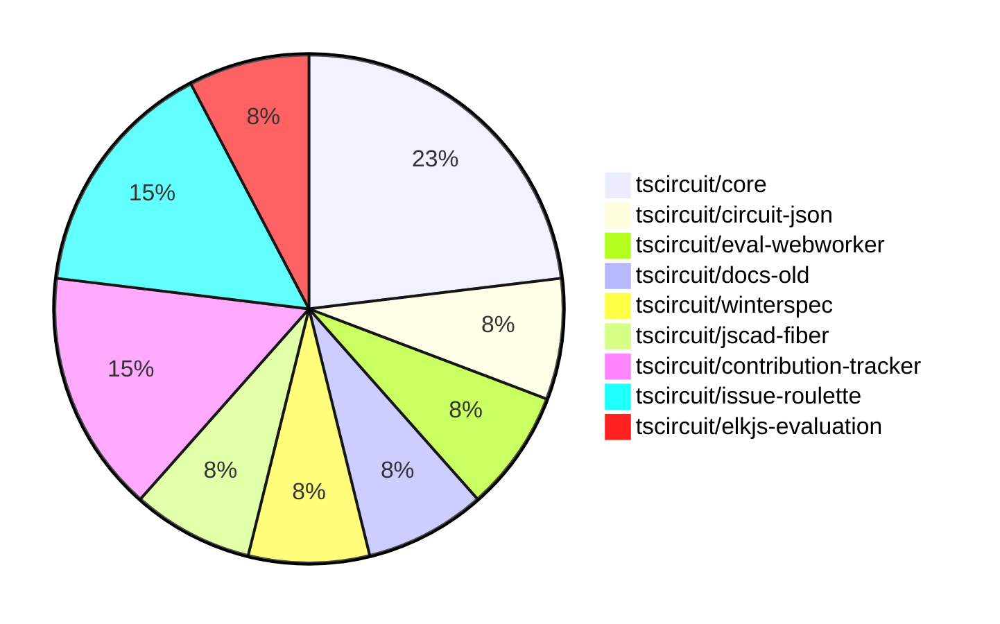

# contribution-tracker

Generates weekly contribution overviews for tscircuit contributors. Check out all
the [contribution overviews here](./contribution-overviews/)

* All PRs in the tscircuit org are scanned/summarized via Claude Haiku
* Claude classifies each Diff/PR as a Major, Minor or Tiny contribution
* All the PRs, summaries, and classifications are organized into charts and tables

The current week is shown below. There are 3 major sections:

* [Contributor Overview](#contributor-overview)
* [PRs by Repository](#prs-by-repository)
* [PRs by Contributor](#changes-by-contributor)

## Current Week

<!-- START_CURRENT_WEEK -->

# Contribution Overview 2025-01-22

## PRs by Repository

## Contributor Overview

| Contributor | 🐳 Major | 🐙 Minor | 🐌 Tiny | ⭐ | Issues Created |
|-------------|---------|---------|---------|-----|----------------|
| [seveibar](#seveibar) | 1 | 2 | 0 | ⭐⭐ | 29 |
| [imrishabh18](#imrishabh18) | 1 | 1 | 0 | ⭐ | 1 |
| [Anshgrover23](#Anshgrover23) | 0 | 3 | 0 | ⭐ | 1 |
| [AnasSarkiz](#AnasSarkiz) | 1 | 0 | 0 | ⭐ | 1 |
| [krushnarout](#krushnarout) | 0 | 1 | 0 |  | 0 |
| [ArnavK-09](#ArnavK-09) | 0 | 1 | 0 |  | 0 |
| [kom-senapati](#kom-senapati) | 0 | 1 | 0 |  | 1 |
| [techmannih](#techmannih) | 0 | 1 | 0 |  | 2 |

## Review Table

[reviews-received-hover]: ## "Number of reviews received for PRs for this contributor"
[approvals-received-hover]: ## "Number of approvals received for PRs this contributor authored"
[rejections-received-hover]: ## "Number of rejections received for PRs this contributor authored"
[prs-opened-hover]: ## "Number of PRs opened by this contributor"
[issues-created-hover]: ## "Number of issues created by this contributor"
[bountied-issues-hover]: ## "Number of issues this contributor created with a bounty"
[bountied-issue-$-hover]: ## "Total bounty amount placed on issues authored by this contributor"

| Contributor | Reviews Received | Approvals Received | Rejections Received | Approvals | Rejections | PRs Opened | PRs Merged | Issues Created | Bountied Issues | Bountied Issue $ |
|---|---|---|---|---|---|---|---|---|---|---|
| [seveibar](#seveibar) | 0 | 0 | 0 | 7 | 5 | 4 | 3 | 29 | 24 | 365 |
| [krushnarout](#krushnarout) | 10 | 0 | 3 | 0 | 0 | 2 | 1 | 0 | 0 | 0 |
| [imrishabh18](#imrishabh18) | 8 | 0 | 0 | 0 | 2 | 3 | 2 | 1 | 1 | 10 |
| [Ayushjhawar8](#Ayushjhawar8) | 5 | 0 | 3 | 0 | 0 | 2 | 0 | 0 | 0 | 0 |
| [Anshgrover23](#Anshgrover23) | 7 | 3 | 1 | 1 | 4 | 4 | 3 | 1 | 0 | 0 |
| [ArnavK-09](#ArnavK-09) | 3 | 2 | 0 | 0 | 0 | 3 | 1 | 0 | 0 | 0 |
| [kom-senapati](#kom-senapati) | 4 | 1 | 3 | 0 | 0 | 3 | 1 | 1 | 0 | 0 |
| [Girma35](#Girma35) | 0 | 0 | 0 | 0 | 0 | 1 | 0 | 0 | 0 | 0 |
| [techmannih](#techmannih) | 2 | 1 | 1 | 0 | 0 | 2 | 1 | 2 | 0 | 0 |
| [AnasSarkiz](#AnasSarkiz) | 1 | 1 | 0 | 0 | 0 | 1 | 1 | 1 | 0 | 0 |

## Changes by Repository

### [tscircuit/core](https://github.com/tscircuit/core)

| PR # | Impact | Contributor | Description |
|------|--------|-------------|-------------|
| [#543](https://github.com/tscircuit/core/pull/543) | 🐳 Major | seveibar | Adds support for subcircuit-dependent autorouting in the circuit rendering process. |
| [#545](https://github.com/tscircuit/core/pull/545) | 🐳 Major | imrishabh18 | Optimized the circuit JSON sent to the autorouter and added the `subcircuit_id` to the request and `pcb_component` object. |
| [#539](https://github.com/tscircuit/core/pull/539) | 🐙 Minor | imrishabh18 | Add subcircuit_id and pcb_group_id properties to primitive components |

### [tscircuit/circuit-json](https://github.com/tscircuit/circuit-json)

| PR # | Impact | Contributor | Description |
|------|--------|-------------|-------------|
| [#125](https://github.com/tscircuit/circuit-json/pull/125) | 🐙 Minor | seveibar | Add parent subcircuit ID to source group |

### [tscircuit/eval-webworker](https://github.com/tscircuit/eval-webworker)

| PR # | Impact | Contributor | Description |
|------|--------|-------------|-------------|
| [#89](https://github.com/tscircuit/eval-webworker/pull/89) | 🐙 Minor | seveibar | Allow importing "tscircuit" and alias it to "@tscircuit/core" |

### [tscircuit/docs-old](https://github.com/tscircuit/docs-old)

| PR # | Impact | Contributor | Description |
|------|--------|-------------|-------------|
| [#59](https://github.com/tscircuit/docs-old/pull/59) | 🐙 Minor | krushnarout | This pull request ports the project's documentation from Mintlify to Docusaurus. |

### [tscircuit/winterspec](https://github.com/tscircuit/winterspec)

| PR # | Impact | Contributor | Description |
|------|--------|-------------|-------------|
| [#29](https://github.com/tscircuit/winterspec/pull/29) | 🐙 Minor | ArnavK-09 | Adds a new GitHub workflow to run tests with Bun, a new JavaScript runtime, and fixes the existing Node.js-based CI workflow. |

### [tscircuit/jscad-fiber](https://github.com/tscircuit/jscad-fiber)

| PR # | Impact | Contributor | Description |
|------|--------|-------------|-------------|
| [#103](https://github.com/tscircuit/jscad-fiber/pull/103) | 🐙 Minor | kom-senapati | Isolate functions requiring Three.js into a separate entrypoint |

### [tscircuit/contribution-tracker](https://github.com/tscircuit/contribution-tracker)

| PR # | Impact | Contributor | Description |
|------|--------|-------------|-------------|
| [#39](https://github.com/tscircuit/contribution-tracker/pull/39) | 🐙 Minor | Anshgrover23 | Add new fields "major", "minor", "tiny", and "stars" to the contributor stats in the generated Markdown. |
| [#37](https://github.com/tscircuit/contribution-tracker/pull/37) | 🐙 Minor | Anshgrover23 | Ensures that reviews are counted only once per PR, rather than counting multiple reviews on the same PR. |

### [tscircuit/issue-roulette](https://github.com/tscircuit/issue-roulette)

| PR # | Impact | Contributor | Description |
|------|--------|-------------|-------------|
| [#8](https://github.com/tscircuit/issue-roulette/pull/8) | 🐙 Minor | Anshgrover23 | Adds a filter to the Issue Roulette component to allow users to view all issues, only bountied issues, or only unbountied issues. |
| [#14](https://github.com/tscircuit/issue-roulette/pull/14) | 🐙 Minor | techmannih | Updates the title of the application in the metadata object |

### [tscircuit/elkjs-evaluation](https://github.com/tscircuit/elkjs-evaluation)

| PR # | Impact | Contributor | Description |
|------|--------|-------------|-------------|
| [#2](https://github.com/tscircuit/elkjs-evaluation/pull/2) | 🐳 Major | AnasSarkiz | Added Bootstrap ElkJS Evaluation |

## Changes by Contributor

### [seveibar](https://github.com/seveibar)

| PR # | Impact | Description |
|------|--------|-------------|
| [#543](https://github.com/tscircuit/core/pull/543) | 🐳 Major | Adds support for subcircuit-dependent autorouting in the circuit rendering process. |
| [#125](https://github.com/tscircuit/circuit-json/pull/125) | 🐙 Minor | Add parent subcircuit ID to source group |
| [#89](https://github.com/tscircuit/eval-webworker/pull/89) | 🐙 Minor | Allow importing "tscircuit" and alias it to "@tscircuit/core" |

### [krushnarout](https://github.com/krushnarout)

| PR # | Impact | Description |
|------|--------|-------------|
| [#59](https://github.com/tscircuit/docs-old/pull/59) | 🐙 Minor | This pull request ports the project's documentation from Mintlify to Docusaurus. |

### [ArnavK-09](https://github.com/ArnavK-09)

| PR # | Impact | Description |
|------|--------|-------------|
| [#29](https://github.com/tscircuit/winterspec/pull/29) | 🐙 Minor | Adds a new GitHub workflow to run tests with Bun, a new JavaScript runtime, and fixes the existing Node.js-based CI workflow. |

### [imrishabh18](https://github.com/imrishabh18)

| PR # | Impact | Description |
|------|--------|-------------|
| [#545](https://github.com/tscircuit/core/pull/545) | 🐳 Major | Optimized the circuit JSON sent to the autorouter and added the `subcircuit_id` to the request and `pcb_component` object. |
| [#539](https://github.com/tscircuit/core/pull/539) | 🐙 Minor | Add subcircuit_id and pcb_group_id properties to primitive components |

### [kom-senapati](https://github.com/kom-senapati)

| PR # | Impact | Description |
|------|--------|-------------|
| [#103](https://github.com/tscircuit/jscad-fiber/pull/103) | 🐙 Minor | Isolate functions requiring Three.js into a separate entrypoint |

### [Anshgrover23](https://github.com/Anshgrover23)

| PR # | Impact | Description |
|------|--------|-------------|
| [#39](https://github.com/tscircuit/contribution-tracker/pull/39) | 🐙 Minor | Add new fields "major", "minor", "tiny", and "stars" to the contributor stats in the generated Markdown. |
| [#37](https://github.com/tscircuit/contribution-tracker/pull/37) | 🐙 Minor | Ensures that reviews are counted only once per PR, rather than counting multiple reviews on the same PR. |
| [#8](https://github.com/tscircuit/issue-roulette/pull/8) | 🐙 Minor | Adds a filter to the Issue Roulette component to allow users to view all issues, only bountied issues, or only unbountied issues. |

### [techmannih](https://github.com/techmannih)

| PR # | Impact | Description |
|------|--------|-------------|
| [#14](https://github.com/tscircuit/issue-roulette/pull/14) | 🐙 Minor | Updates the title of the application in the metadata object |

### [AnasSarkiz](https://github.com/AnasSarkiz)

| PR # | Impact | Description |
|------|--------|-------------|
| [#2](https://github.com/tscircuit/elkjs-evaluation/pull/2) | 🐳 Major | Added Bootstrap ElkJS Evaluation |

<!-- END_CURRENT_WEEK -->
