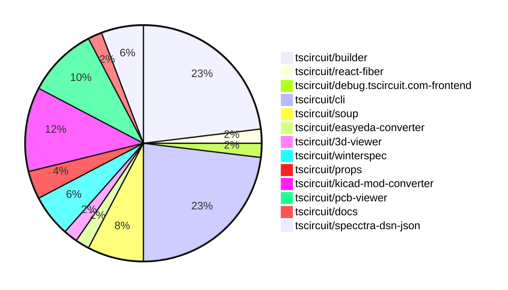

# contribution-tracker

Generates weekly contribution overviews for tscircuit contributors. Check out all
the [contribution overviews here](./contribution-overviews/)

* All PRs in the tscircuit org are scanned/summarized via Claude Haiku
* Claude classifies each Diff/PR as a Major, Minor or Tiny contribution
* All the PRs, summaries, and classifications are organized into charts and tables

The current week is shown below. There are 3 major sections:

* [Contributor Overview](#contributor-overview)
* [PRs by Repository](#prs-by-repository)
* [PRs by Contributor](#changes-by-contributor)

## Current Week

<!-- START_CURRENT_WEEK -->

# Contribution Overview 2024-06-29

## PRs by Repository

## Contributor Overview

| Contributor      | Major | Minor | Other |
| ---------------- | ----- | ----- | ----- |
| seveibar         | 17    | 11    | 1     |
| imrishabh18      | 9     | 4     | 0     |
| DamilolaAlao     | 1     | 2     | 0     |
| Slaviiiii        | 1     | 2     | 0     |
| sahilahluwalia   | 0     | 1     | 0     |
| andrii-balitskyi | 3     | 0     | 0     |

## Changes by Repository

### [tscircuit/builder](https://github.com/tscircuit/builder)

| PR #                                                | Impact | Contributor | Description                                                                                                      |
| --------------------------------------------------- | ------ | ----------- | ---------------------------------------------------------------------------------------------------------------- |
| [#63](https://github.com/tscircuit/builder/pull/63) | Major  | seveibar    | Update the layout engine to fix an issue with silkscreen footprints not moving when translated via manual edits. |
| [#61](https://github.com/tscircuit/builder/pull/61) | Major  | seveibar    | Improve the CAD model test by adding support for board-level components and traces.                              |
| [#56](https://github.com/tscircuit/builder/pull/56) | Major  | seveibar    | Add support for specifying CAD model information for a component.                                                |
| [#59](https://github.com/tscircuit/builder/pull/59) | Major  | imrishabh18 | Update the plated hole builder to support oval and pill-shaped holes in addition to circular holes.              |
| [#57](https://github.com/tscircuit/builder/pull/57) | Major  | imrishabh18 | Added support for oval-shaped plated holes in the PlatedHoleBuilder.                                             |
| [#54](https://github.com/tscircuit/builder/pull/54) | Major  | imrishabh18 | Adds an obstacle for net labels to prevent traces from overlapping them.                                         |
| [#66](https://github.com/tscircuit/builder/pull/66) | Minor  | seveibar    | Handle undefined board thickness in the `ComponentBuilder` class.                                                |
| [#65](https://github.com/tscircuit/builder/pull/65) | Minor  | seveibar    | Use `npm ci` instead of `npm install` for the release workflow                                                   |
| [#64](https://github.com/tscircuit/builder/pull/64) | Minor  | seveibar    | Add a CI workflow to build and check the project on push and pull request to the main branch.                    |
| [#62](https://github.com/tscircuit/builder/pull/62) | Minor  | seveibar    | Fixes some prop remapping issues in the `remap-prop.ts` file.                                                    |
| [#58](https://github.com/tscircuit/builder/pull/58) | Minor  | seveibar    | Reverts the previous change that added support for oval-shaped plated holes.                                     |
| [#60](https://github.com/tscircuit/builder/pull/60) | Minor  | imrishabh18 | Update snapshot test to fix test case                                                                            |

### [tscircuit/react-fiber](https://github.com/tscircuit/react-fiber)

| PR #                                                    | Impact | Contributor | Description                                                                              |
| ------------------------------------------------------- | ------ | ----------- | ---------------------------------------------------------------------------------------- |
| [#12](https://github.com/tscircuit/react-fiber/pull/12) | Major  | seveibar    | Introduces a new logging library `@tscircuit/log-soup` and updates various dependencies. |

### [tscircuit/debug.tscircuit.com-frontend](https://github.com/tscircuit/debug.tscircuit.com-frontend)

| PR #                                                                       | Impact | Contributor | Description                                                                             |
| -------------------------------------------------------------------------- | ------ | ----------- | --------------------------------------------------------------------------------------- |
| [#124](https://github.com/tscircuit/debug.tscircuit.com-frontend/pull/124) | Major  | seveibar    | Added a 3D viewer component and updated the DebugLayout to handle PCB and CAD elements. |

### [tscircuit/cli](https://github.com/tscircuit/cli)

| PR #                                            | Impact | Contributor    | Description                                                                                                          |
| ----------------------------------------------- | ------ | -------------- | -------------------------------------------------------------------------------------------------------------------- |
| [#69](https://github.com/tscircuit/cli/pull/69) | Major  | seveibar       | Refactor the code to use the "level" library instead of SQLite.                                                      |
| [#68](https://github.com/tscircuit/cli/pull/68) | Major  | seveibar       | Introduce a new level schema and handler to migrate off SQLite.                                                      |
| [#67](https://github.com/tscircuit/cli/pull/67) | Major  | seveibar       | Add test setup for dev-server-api                                                                                    |
| [#66](https://github.com/tscircuit/cli/pull/66) | Major  | seveibar       | Add a static routes build step to fix a cli import not resolving.                                                    |
| [#62](https://github.com/tscircuit/cli/pull/62) | Major  | seveibar       | Remove bundle requirement, allow dev server to be imported without bundling                                          |
| [#61](https://github.com/tscircuit/cli/pull/61) | Major  | seveibar       | Change the start script for the API server to use the Bun runtime instead of the Edgespec runtime.                   |
| [#59](https://github.com/tscircuit/cli/pull/59) | Major  | seveibar       | Integrate 3D viewer into CLI preview                                                                                 |
| [#71](https://github.com/tscircuit/cli/pull/71) | Minor  | seveibar       | Hoist the `example-project` directory to the root of the repository.                                                 |
| [#63](https://github.com/tscircuit/cli/pull/63) | Minor  | seveibar       | Add 'winterspec' as a dependency                                                                                     |
| [#57](https://github.com/tscircuit/cli/pull/57) | Minor  | DamilolaAlao   | Fix to add project prefix name to the exported CSV file names.                                                       |
| [#64](https://github.com/tscircuit/cli/pull/64) | Minor  | Slaviiiii      | Fix package name in file menu                                                                                        |
| [#56](https://github.com/tscircuit/cli/pull/56) | Minor  | sahilahluwalia | Fixes the issue of bad overlap on the TSCI dev overlay during export by increasing the z-index of the export dialog. |

### [tscircuit/soup](https://github.com/tscircuit/soup)

| PR #                                             | Impact | Contributor  | Description                                                                               |
| ------------------------------------------------ | ------ | ------------ | ----------------------------------------------------------------------------------------- |
| [#6](https://github.com/tscircuit/soup/pull/6)   | Major  | seveibar     | Introduce a new CAD component model to the application.                                   |
| [#7](https://github.com/tscircuit/soup/pull/7)   | Major  | imrishabh18  | Add support for oval type in the PCB viewer.                                              |
| [#8](https://github.com/tscircuit/soup/pull/8)   | Major  | DamilolaAlao | Add a new `pcb_silkscreen_pill` type to the PCB schema                                    |
| [#10](https://github.com/tscircuit/soup/pull/10) | Tiny   | seveibar     | Rename `cad_component_model.ts` to `cad_component.ts` and make minor changes to the file. |

### [tscircuit/easyeda-converter](https://github.com/tscircuit/easyeda-converter)

| PR #                                                        | Impact | Contributor | Description                                                                                              |
| ----------------------------------------------------------- | ------ | ----------- | -------------------------------------------------------------------------------------------------------- |
| [#4](https://github.com/tscircuit/easyeda-converter/pull/4) | Major  | seveibar    | Introduce GitHub Actions workflows for format checking, publishing to npm, and running tests/benchmarks. |

### [tscircuit/3d-viewer](https://github.com/tscircuit/3d-viewer)

| PR #                                                | Impact | Contributor | Description                                             |
| --------------------------------------------------- | ------ | ----------- | ------------------------------------------------------- |
| [#3](https://github.com/tscircuit/3d-viewer/pull/3) | Major  | seveibar    | Remove old app files and support not having a PCB board |

### [tscircuit/winterspec](https://github.com/tscircuit/winterspec)

| PR #                                                 | Impact | Contributor | Description                                                                                  |
| ---------------------------------------------------- | ------ | ----------- | -------------------------------------------------------------------------------------------- |
| [#4](https://github.com/tscircuit/winterspec/pull/4) | Major  | seveibar    | Add a new `bundle-routes` command to the CLI that bundles all the routes into a single file. |
| [#2](https://github.com/tscircuit/winterspec/pull/2) | Major  | seveibar    | Many exports and helpers are added to make Bun servers easier to use.                        |
| [#3](https://github.com/tscircuit/winterspec/pull/3) | Minor  | seveibar    | Add edgeruntime request adapter for better bun support                                       |

### [tscircuit/props](https://github.com/tscircuit/props)

| PR #                                            | Impact | Contributor | Description                                                     |
| ----------------------------------------------- | ------ | ----------- | --------------------------------------------------------------- |
| [#3](https://github.com/tscircuit/props/pull/3) | Major  | imrishabh18 | Added support for oval-shaped plated holes in the PCB layout.   |
| [#2](https://github.com/tscircuit/props/pull/2) | Minor  | seveibar    | Add support for `cadModel` prop in `commonComponentProps` type. |

### [tscircuit/kicad-mod-converter](https://github.com/tscircuit/kicad-mod-converter)

| PR #                                                            | Impact | Contributor | Description                                                       |
| --------------------------------------------------------------- | ------ | ----------- | ----------------------------------------------------------------- |
| [#21](https://github.com/tscircuit/kicad-mod-converter/pull/21) | Major  | imrishabh18 | Added the oval shape support for plated holes.                    |
| [#18](https://github.com/tscircuit/kicad-mod-converter/pull/18) | Major  | Slaviiiii   | Finish KiCad JSON serialization                                   |
| [#24](https://github.com/tscircuit/kicad-mod-converter/pull/24) | Minor  | seveibar    | Reformatted the code according to the specified formatting rules. |
| [#23](https://github.com/tscircuit/kicad-mod-converter/pull/23) | Minor  | seveibar    | Add a GitHub Actions workflow to check for code formatting        |
| [#22](https://github.com/tscircuit/kicad-mod-converter/pull/22) | Minor  | imrishabh18 | Change the shape of a pad from "oval" to "pill"                   |
| [#19](https://github.com/tscircuit/kicad-mod-converter/pull/19) | Minor  | imrishabh18 | Add fabrication line to the circuit footprint                     |

### [tscircuit/pcb-viewer](https://github.com/tscircuit/pcb-viewer)

| PR #                                                   | Impact | Contributor  | Description                                                                   |
| ------------------------------------------------------ | ------ | ------------ | ----------------------------------------------------------------------------- |
| [#24](https://github.com/tscircuit/pcb-viewer/pull/24) | Major  | imrishabh18  | Added support for "pill" shape in the `convert-element-to-primitive.ts` file. |
| [#23](https://github.com/tscircuit/pcb-viewer/pull/23) | Major  | imrishabh18  | Add support for oval-shaped plated holes in the PCB conversion process.       |
| [#19](https://github.com/tscircuit/pcb-viewer/pull/19) | Major  | imrishabh18  | Add support for drawing oval primitives in the PCB viewer.                    |
| [#20](https://github.com/tscircuit/pcb-viewer/pull/20) | Minor  | imrishabh18  | Update the syntax in `pcb-viewer` to fix a bug.                               |
| [#21](https://github.com/tscircuit/pcb-viewer/pull/21) | Minor  | DamilolaAlao | Add a new "pill" story to the Silkscreen section of the Storybook.            |

### [tscircuit/docs](https://github.com/tscircuit/docs)

| PR #                                           | Impact | Contributor | Description                                             |
| ---------------------------------------------- | ------ | ----------- | ------------------------------------------------------- |
| [#7](https://github.com/tscircuit/docs/pull/7) | Minor  | Slaviiiii   | Update the bug component to use updated property names. |

### [tscircuit/specctra-dsn-json](https://github.com/tscircuit/specctra-dsn-json)

| PR #                                                        | Impact | Contributor      | Description                                                                                                                                          |
| ----------------------------------------------------------- | ------ | ---------------- | ---------------------------------------------------------------------------------------------------------------------------------------------------- |
| [#8](https://github.com/tscircuit/specctra-dsn-json/pull/8) | Major  | andrii-balitskyi | Implement parsing of `library` DSN element, including parsing of `image` and `padstack` elements.                                                    |
| [#7](https://github.com/tscircuit/specctra-dsn-json/pull/7) | Major  | andrii-balitskyi | Implement parsing for the `placement` DSN element, which includes support for component placement, placement pins, and corresponding schema updates. |
| [#6](https://github.com/tscircuit/specctra-dsn-json/pull/6) | Major  | andrii-balitskyi | Introduce a new parser to parse PCB, parser, resolution, unit, and structure elements                                                                |

## Changes by Contributor

### [seveibar](https://github.com/seveibar)

| PR #                                                                       | Impact | Description                                                                                                      |
| -------------------------------------------------------------------------- | ------ | ---------------------------------------------------------------------------------------------------------------- |
| [#63](https://github.com/tscircuit/builder/pull/63)                        | Major  | Update the layout engine to fix an issue with silkscreen footprints not moving when translated via manual edits. |
| [#61](https://github.com/tscircuit/builder/pull/61)                        | Major  | Improve the CAD model test by adding support for board-level components and traces.                              |
| [#56](https://github.com/tscircuit/builder/pull/56)                        | Major  | Add support for specifying CAD model information for a component.                                                |
| [#12](https://github.com/tscircuit/react-fiber/pull/12)                    | Major  | Introduces a new logging library `@tscircuit/log-soup` and updates various dependencies.                         |
| [#124](https://github.com/tscircuit/debug.tscircuit.com-frontend/pull/124) | Major  | Added a 3D viewer component and updated the DebugLayout to handle PCB and CAD elements.                          |
| [#69](https://github.com/tscircuit/cli/pull/69)                            | Major  | Refactor the code to use the "level" library instead of SQLite.                                                  |
| [#68](https://github.com/tscircuit/cli/pull/68)                            | Major  | Introduce a new level schema and handler to migrate off SQLite.                                                  |
| [#67](https://github.com/tscircuit/cli/pull/67)                            | Major  | Add test setup for dev-server-api                                                                                |
| [#66](https://github.com/tscircuit/cli/pull/66)                            | Major  | Add a static routes build step to fix a cli import not resolving.                                                |
| [#62](https://github.com/tscircuit/cli/pull/62)                            | Major  | Remove bundle requirement, allow dev server to be imported without bundling                                      |
| [#61](https://github.com/tscircuit/cli/pull/61)                            | Major  | Change the start script for the API server to use the Bun runtime instead of the Edgespec runtime.               |
| [#59](https://github.com/tscircuit/cli/pull/59)                            | Major  | Integrate 3D viewer into CLI preview                                                                             |
| [#6](https://github.com/tscircuit/soup/pull/6)                             | Major  | Introduce a new CAD component model to the application.                                                          |
| [#4](https://github.com/tscircuit/easyeda-converter/pull/4)                | Major  | Introduce GitHub Actions workflows for format checking, publishing to npm, and running tests/benchmarks.         |
| [#3](https://github.com/tscircuit/3d-viewer/pull/3)                        | Major  | Remove old app files and support not having a PCB board                                                          |
| [#4](https://github.com/tscircuit/winterspec/pull/4)                       | Major  | Add a new `bundle-routes` command to the CLI that bundles all the routes into a single file.                     |
| [#2](https://github.com/tscircuit/winterspec/pull/2)                       | Major  | Many exports and helpers are added to make Bun servers easier to use.                                            |
| [#66](https://github.com/tscircuit/builder/pull/66)                        | Minor  | Handle undefined board thickness in the `ComponentBuilder` class.                                                |
| [#65](https://github.com/tscircuit/builder/pull/65)                        | Minor  | Use `npm ci` instead of `npm install` for the release workflow                                                   |
| [#64](https://github.com/tscircuit/builder/pull/64)                        | Minor  | Add a CI workflow to build and check the project on push and pull request to the main branch.                    |
| [#62](https://github.com/tscircuit/builder/pull/62)                        | Minor  | Fixes some prop remapping issues in the `remap-prop.ts` file.                                                    |
| [#58](https://github.com/tscircuit/builder/pull/58)                        | Minor  | Reverts the previous change that added support for oval-shaped plated holes.                                     |
| [#71](https://github.com/tscircuit/cli/pull/71)                            | Minor  | Hoist the `example-project` directory to the root of the repository.                                             |
| [#63](https://github.com/tscircuit/cli/pull/63)                            | Minor  | Add 'winterspec' as a dependency                                                                                 |
| [#2](https://github.com/tscircuit/props/pull/2)                            | Minor  | Add support for `cadModel` prop in `commonComponentProps` type.                                                  |
| [#24](https://github.com/tscircuit/kicad-mod-converter/pull/24)            | Minor  | Reformatted the code according to the specified formatting rules.                                                |
| [#23](https://github.com/tscircuit/kicad-mod-converter/pull/23)            | Minor  | Add a GitHub Actions workflow to check for code formatting                                                       |
| [#3](https://github.com/tscircuit/winterspec/pull/3)                       | Minor  | Add edgeruntime request adapter for better bun support                                                           |
| [#10](https://github.com/tscircuit/soup/pull/10)                           | Tiny   | Rename `cad_component_model.ts` to `cad_component.ts` and make minor changes to the file.                        |

### [imrishabh18](https://github.com/imrishabh18)

| PR #                                                            | Impact | Description                                                                                         |
| --------------------------------------------------------------- | ------ | --------------------------------------------------------------------------------------------------- |
| [#59](https://github.com/tscircuit/builder/pull/59)             | Major  | Update the plated hole builder to support oval and pill-shaped holes in addition to circular holes. |
| [#57](https://github.com/tscircuit/builder/pull/57)             | Major  | Added support for oval-shaped plated holes in the PlatedHoleBuilder.                                |
| [#54](https://github.com/tscircuit/builder/pull/54)             | Major  | Adds an obstacle for net labels to prevent traces from overlapping them.                            |
| [#24](https://github.com/tscircuit/pcb-viewer/pull/24)          | Major  | Added support for "pill" shape in the `convert-element-to-primitive.ts` file.                       |
| [#23](https://github.com/tscircuit/pcb-viewer/pull/23)          | Major  | Add support for oval-shaped plated holes in the PCB conversion process.                             |
| [#19](https://github.com/tscircuit/pcb-viewer/pull/19)          | Major  | Add support for drawing oval primitives in the PCB viewer.                                          |
| [#7](https://github.com/tscircuit/soup/pull/7)                  | Major  | Add support for oval type in the PCB viewer.                                                        |
| [#3](https://github.com/tscircuit/props/pull/3)                 | Major  | Added support for oval-shaped plated holes in the PCB layout.                                       |
| [#21](https://github.com/tscircuit/kicad-mod-converter/pull/21) | Major  | Added the oval shape support for plated holes.                                                      |
| [#60](https://github.com/tscircuit/builder/pull/60)             | Minor  | Update snapshot test to fix test case                                                               |
| [#20](https://github.com/tscircuit/pcb-viewer/pull/20)          | Minor  | Update the syntax in `pcb-viewer` to fix a bug.                                                     |
| [#22](https://github.com/tscircuit/kicad-mod-converter/pull/22) | Minor  | Change the shape of a pad from "oval" to "pill"                                                     |
| [#19](https://github.com/tscircuit/kicad-mod-converter/pull/19) | Minor  | Add fabrication line to the circuit footprint                                                       |

### [DamilolaAlao](https://github.com/DamilolaAlao)

| PR #                                                   | Impact | Description                                                        |
| ------------------------------------------------------ | ------ | ------------------------------------------------------------------ |
| [#8](https://github.com/tscircuit/soup/pull/8)         | Major  | Add a new `pcb_silkscreen_pill` type to the PCB schema             |
| [#21](https://github.com/tscircuit/pcb-viewer/pull/21) | Minor  | Add a new "pill" story to the Silkscreen section of the Storybook. |
| [#57](https://github.com/tscircuit/cli/pull/57)        | Minor  | Fix to add project prefix name to the exported CSV file names.     |

### [Slaviiiii](https://github.com/Slaviiiii)

| PR #                                                            | Impact | Description                                             |
| --------------------------------------------------------------- | ------ | ------------------------------------------------------- |
| [#18](https://github.com/tscircuit/kicad-mod-converter/pull/18) | Major  | Finish KiCad JSON serialization                         |
| [#64](https://github.com/tscircuit/cli/pull/64)                 | Minor  | Fix package name in file menu                           |
| [#7](https://github.com/tscircuit/docs/pull/7)                  | Minor  | Update the bug component to use updated property names. |

### [sahilahluwalia](https://github.com/sahilahluwalia)

| PR #                                            | Impact | Description                                                                                                          |
| ----------------------------------------------- | ------ | -------------------------------------------------------------------------------------------------------------------- |
| [#56](https://github.com/tscircuit/cli/pull/56) | Minor  | Fixes the issue of bad overlap on the TSCI dev overlay during export by increasing the z-index of the export dialog. |

### [andrii-balitskyi](https://github.com/andrii-balitskyi)

| PR #                                                        | Impact | Description                                                                                                                                          |
| ----------------------------------------------------------- | ------ | ---------------------------------------------------------------------------------------------------------------------------------------------------- |
| [#8](https://github.com/tscircuit/specctra-dsn-json/pull/8) | Major  | Implement parsing of `library` DSN element, including parsing of `image` and `padstack` elements.                                                    |
| [#7](https://github.com/tscircuit/specctra-dsn-json/pull/7) | Major  | Implement parsing for the `placement` DSN element, which includes support for component placement, placement pins, and corresponding schema updates. |
| [#6](https://github.com/tscircuit/specctra-dsn-json/pull/6) | Major  | Introduce a new parser to parse PCB, parser, resolution, unit, and structure elements                                                                |

<!-- END_CURRENT_WEEK -->
