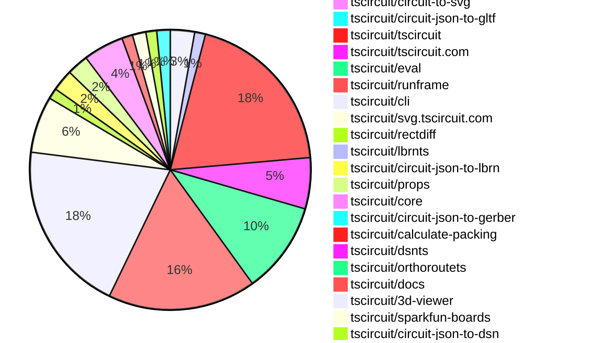
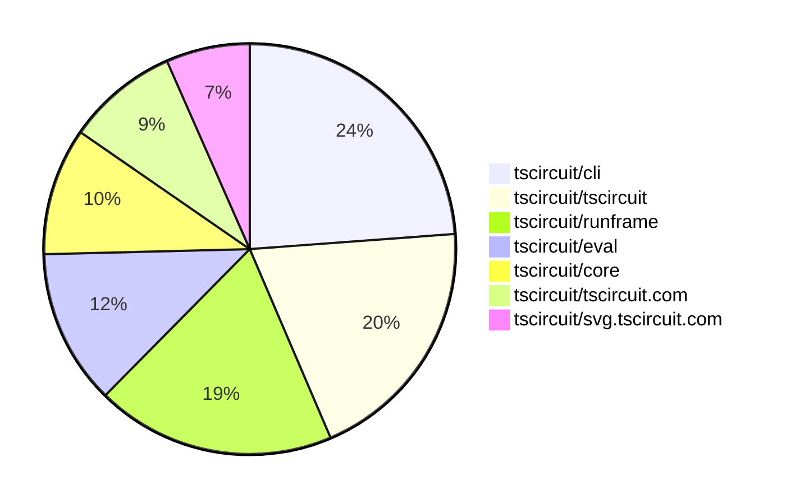

# contribution-tracker

[contributions.tscircuit.com](https://contributions.tscircuit.com) ・ [tscircuit.com](https://tscircuit.com) ・ [Contribution Overviews](./contribution-overviews/) ・ [Changelogs](./changelogs/)

Generates weekly contribution overviews for tscircuit contributors. Check out all
the [contribution overviews here](./contribution-overviews/)
You can find AI-generated monthly changelogs in the [changelogs directory](./changelogs/).

- All PRs in the tscircuit org are scanned/summarized via an LLM
- The LLM classifies each Diff/PR as into a set of attributes for scoring
- All the PRs, summaries, and classifications are organized into charts and tables for [the website](https://contributions.tscircuit.com)

> Want to run locally? See the [Development Section](#development)

The current week is shown below. There are 4 major sections:

- [Contributor Overview](#contributor-overview)
- [PRs by Repository](#prs-by-repository)
- [PRs by Contributor](#changes-by-contributor)
- [Scoring & Sponsorship System](#scoring--sponsorship-system)

## Current Week

<!-- START_CURRENT_WEEK -->

# Contribution Overview 2025-11-26

The current week is shown below. There are 4 major sections:

- [Contributor Overview](#contributor-overview)
- [PRs by Repository](#prs-by-repository)
- [PRs by Contributor](#changes-by-contributor)
- [Scoring & Sponsorship System](#scoring--sponsorship-system)

## PRs by Repository



## Contributor Overview

| Contributor | 🐳 Major | 🐙 Minor | 🐌 Tiny | ⭐ | Score | Discussion Contributions |
|-------------|---------|---------|---------|-----|----------------|--------------------------|
| [seveibar](#seveibar) | 6 | 13 | 8 | 👑 | 57 | 0🔹 0🔶 0💎 |
| [imrishabh18](#imrishabh18) | 4 | 8 | 4 | ⭐⭐⭐ | 37 | 0🔹 0🔶 0💎 |
| [techmannih](#techmannih) | 2 | 6 | 4 | ⭐⭐⭐ | 32 | 0🔹 0🔶 0💎 |
| [ShiboSoftwareDev](#ShiboSoftwareDev) | 1 | 5 | 2 | ⭐⭐ | 28 | 0🔹 0🔶 0💎 |
| [ArnavK-09](#ArnavK-09) | 4 | 2 | 4 | ⭐⭐ | 26 | 0🔹 0🔶 0💎 |
| [rushabhcodes](#rushabhcodes) | 3 | 4 | 2 | ⭐⭐ | 23 | 0🔹 0🔶 0💎 |
| [tscircuitbot](#tscircuitbot) | 0 | 0 | 240 | ⭐⭐ | 18 | 0🔹 0🔶 0💎 |
| [Ayushjhawar8](#Ayushjhawar8) | 1 | 5 | 1 | ⭐⭐ | 16 | 0🔹 0🔶 0💎 |
| [AnasSarkiz](#AnasSarkiz) | 2 | 4 | 0 | ⭐⭐ | 16 | 0🔹 0🔶 0💎 |
| [0hmX](#0hmX) | 3 | 0 | 1 | ⭐⭐ | 13 | 0🔹 0🔶 0💎 |
| [MustafaMulla29](#MustafaMulla29) | 1 | 4 | 0 | ⭐⭐ | 12 | 0🔹 0🔶 0💎 |
| [Heinrich-XIAO](#Heinrich-XIAO) | 2 | 0 | 2 | ⭐ | 10 | 0🔹 0🔶 0💎 |
| [Abse2001](#Abse2001) | 1 | 0 | 0 | ⭐ | 5 | 0🔹 0🔶 0💎 |
| [Anshgrover23](#Anshgrover23) | 1 | 0 | 0 | ⭐ | 4 | 0🔹 0🔶 0💎 |
| [pxlpal](#pxlpal) | 1 | 0 | 0 | ⭐ | 4 | 0🔹 0🔶 0💎 |
| [Asymtode712](#Asymtode712) | 0 | 0 | 1 |  | 1 | 0🔹 0🔶 0💎 |

> Note: AI evaluates PRs and assigns 1-3 star ratings automatically. 4 and 5 star ratings require manual staff review.

### Discussion Contribution Legend

- 🔹 Normal Comments: Basic participation with minimal effort
- 🔶 Great Informative Comments: Thoughtful participation that adds value
- 💎 Incredible Comments: Exceptional participation with high-quality content

## Review Table

[reviews-received-hover]: ## "Number of reviews received for PRs for this contributor"
[approvals-received-hover]: ## "Number of approvals received for PRs this contributor authored"
[rejections-received-hover]: ## "Number of rejections received for PRs this contributor authored"
[prs-opened-hover]: ## "Number of PRs opened by this contributor"
[issues-created-hover]: ## "Number of issues created by this contributor"
[bountied-issues-hover]: ## "Number of issues this contributor created with a bounty"
[bountied-issue-$-hover]: ## "Total bounty amount placed on issues authored by this contributor"

| Contributor | Reviews Received | Approvals Received | Rejections Received | Approvals | Rejections | PRs Opened | PRs Merged | Score | Issues Created | Bountied Issues | Bountied Issue $ |
|---|---|---|---|---|---|---|---|---|---|---|---|
| [techmannih](#techmannih) | 23 | 10 | 3 | 2 | 0 | 18 | 13 | 32 | 0 | 0 | 0 |
| [seveibar](#seveibar) | 5 | 0 | 0 | 55 | 8 | 40 | 28 | 57 | 0 | 0 | 0 |
| [Asymtode712](#Asymtode712) | 1 | 1 | 0 | 0 | 0 | 2 | 1 | 1 | 0 | 0 | 0 |
| [ShiboSoftwareDev](#ShiboSoftwareDev) | 11 | 8 | 0 | 12 | 1 | 9 | 8 | 28 | 0 | 0 | 0 |
| [tscircuitbot](#tscircuitbot) | 0 | 0 | 0 | 0 | 0 | 283 | 240 | 18 | 0 | 0 | 0 |
| [imrishabh18](#imrishabh18) | 14 | 3 | 1 | 6 | 0 | 20 | 16 | 37 | 0 | 0 | 0 |
| [rushabhcodes](#rushabhcodes) | 33 | 18 | 1 | 0 | 0 | 18 | 9 | 23 | 0 | 0 | 0 |
| [Ayushjhawar8](#Ayushjhawar8) | 19 | 6 | 1 | 0 | 0 | 10 | 7 | 16 | 0 | 0 | 0 |
| [baeoc](#baeoc) | 0 | 0 | 0 | 1 | 0 | 0 | 0 | 0 | 0 | 0 | 0 |
| [Abse2001](#Abse2001) | 1 | 1 | 0 | 1 | 0 | 1 | 1 | 5 | 0 | 0 | 0 |
| [MustafaMulla29](#MustafaMulla29) | 13 | 7 | 1 | 0 | 0 | 13 | 5 | 12 | 0 | 0 | 0 |
| [ArnavK-09](#ArnavK-09) | 19 | 8 | 0 | 1 | 0 | 14 | 10 | 26 | 0 | 0 | 0 |
| [RaghavArora14](#RaghavArora14) | 0 | 0 | 0 | 1 | 0 | 0 | 0 | 0 | 0 | 0 | 0 |
| [Anshgrover23](#Anshgrover23) | 5 | 1 | 1 | 0 | 0 | 1 | 1 | 4 | 0 | 0 | 0 |
| [nailoo](#nailoo) | 0 | 0 | 0 | 0 | 0 | 0 | 0 | 0 | 0 | 0 | 0 |
| [AnasSarkiz](#AnasSarkiz) | 18 | 7 | 1 | 0 | 0 | 9 | 6 | 16 | 0 | 0 | 0 |
| [pxlpal](#pxlpal) | 1 | 1 | 0 | 0 | 0 | 1 | 1 | 4 | 0 | 0 | 0 |
| [guptadeepak8](#guptadeepak8) | 0 | 0 | 0 | 0 | 0 | 1 | 0 | 0 | 0 | 0 | 0 |
| [Heinrich-XIAO](#Heinrich-XIAO) | 5 | 4 | 0 | 0 | 0 | 5 | 4 | 10 | 0 | 0 | 0 |
| [0hmX](#0hmX) | 6 | 4 | 0 | 0 | 0 | 4 | 4 | 13 | 0 | 0 | 0 |
| [lau90eth](#lau90eth) | 8 | 0 | 0 | 0 | 0 | 1 | 0 | 0 | 0 | 0 | 0 |
| [Excellencedev](#Excellencedev) | 0 | 0 | 0 | 0 | 0 | 0 | 0 | 0 | 0 | 0 | 0 |

## Top 7 Repositories by Contribution Points



## Scoring & Sponsorship System

### Overview

PRs are analyzed by AI and assigned a **star rating (1-3 stars)**. 4 and 5 star ratings can only be manually assigned by staff. Weekly scores use `2^(starRating - 1)` per PR (capped at 12 PRs per rating), plus review/discussion points.

### Weekly Score → Star String

| Score Range | Star String | Count Value |
|------------|-------------|-------------|
| 0-3 | (empty) | 0 stars |
| 4-10 | ⭐ | 1 star |
| 11-30 | ⭐⭐ | 2 stars |
| 31-50 | ⭐⭐⭐ | 3 stars |
| 51-75 | 👑 | 1 crown |
| 76-100 | 👑👑 | 2 crowns |
| 101+ | 👑👑👑 | 3 crowns |

> Crowns count as 3 stars for sponsorship.

### Monthly Sponsorship Calculation

The sponsorship system calculates monthly payments based on your **weekly star counts** over the complete weeks in that month (typically 4-5 weeks, Wednesday-Tuesday format).

**Step 1: Collect Weekly Stars**
- All complete weeks in the month are analyzed
- Each week's star string is converted to a numeric count (⭐ = 1 star, ⭐⭐⭐ = 3 stars)
- Example: `[2, 2, 2, 1, 0]` means 2 stars in week 1, 2 stars in week 2, etc.

**Step 2: Calculate Metrics**
- **Median stars**: The median value of all weekly star counts
- **Min stars**: The minimum weekly star count
- **Max stars**: The maximum weekly star count
- **High score**: The maximum raw weekly score (0-100+ range from the scoring table) from any week in the month

**Step 3: Determine Base Amount**
The sponsorship amount is calculated based on these metrics (checked in order):

| Condition | Base Amount |
|-----------|-------------|
| `minStarCount >= 3` | **$500** |
| `medianStars >= 3` | **$450** |
| `medianStars >= 2.5` | **$300** |
| `medianStars >= 2` | **$200** |
| `medianStars >= 1.5` | **$100** |
| `medianStars >= 1` | **$75** |
| `maxStarCount >= 2` | **$25** |
| `maxStarCount >= 1` | **$15** |
| `highScore >= 3` (and all stars = 0) | **$5** |

| Maintainer Level | Monthly Bonus |
|------------------|---------------|
| Level 1 | **$200** |
| Level 2 | **$350** |
| Level 3 | **$500** |

**Final Amount** = Base Amount + Maintainer Bonus

## Changes by Repository

### [tscircuit/pcb-viewer](https://github.com/tscircuit/pcb-viewer)

| PR # | Impact | Rating | Contributor | Description |
|------|--------|--------|-------------|-------------|
| [#502](https://github.com/tscircuit/pcb-viewer/pull/502) | 🐳 Major | ⭐⭐⭐ | techmannih | Adds support for solder mask margins on surface mount pads, allowing for positive and negative margins to be specified for better control over solder mask coverage. |
| [#500](https://github.com/tscircuit/pcb-viewer/pull/500) | 🐙 Minor | ⭐⭐ | techmannih | Add support for rendering solder masks on surface mount technology (SMT) pads in the PCB viewer, allowing users to visualize solder mask coverage on pads. |

<details>
<summary>🐌 Tiny Contributions (7)</summary>

| PR # | Impact | Contributor | Description |
|------|--------|-------------|-------------|
| [#503](https://github.com/tscircuit/pcb-viewer/pull/503) | 🐌 Tiny | techmannih | Updates the tscircuitalphabet dependency from version 0.0.3 to 0.0.8 in package.json |
| [#509](https://github.com/tscircuit/pcb-viewer/pull/509) | 🐌 Tiny | Asymtode712 | Adds scrolling functionality to the error list in the toolbar overlay by setting a maximum height and enabling overflow when the error list exceeds this height. |
| [#510](https://github.com/tscircuit/pcb-viewer/pull/510) | 🐌 Tiny | tscircuitbot | Automated package update |
| [#508](https://github.com/tscircuit/pcb-viewer/pull/508) | 🐌 Tiny | tscircuitbot | Automated package update |
| [#506](https://github.com/tscircuit/pcb-viewer/pull/506) | 🐌 Tiny | tscircuitbot | Automated package update |
| [#505](https://github.com/tscircuit/pcb-viewer/pull/505) | 🐌 Tiny | tscircuitbot | Automated package update |
| [#501](https://github.com/tscircuit/pcb-viewer/pull/501) | 🐌 Tiny | tscircuitbot | Automated package update |

</details>

### [tscircuit/kicad-component-converter](https://github.com/tscircuit/kicad-component-converter)

| PR # | Impact | Rating | Contributor | Description |
|------|--------|--------|-------------|-------------|
| [#171](https://github.com/tscircuit/kicad-component-converter/pull/171) | 🐳 Major | ⭐⭐⭐ | techmannih | Adds pin label tooltips for PCB elements using the format pinN, enhancing clarity in pin identification. |

### [tscircuit/circuit-json](https://github.com/tscircuit/circuit-json)

| PR # | Impact | Rating | Contributor | Description |
|------|--------|--------|-------------|-------------|
| [#364](https://github.com/tscircuit/circuit-json/pull/364) | 🐙 Minor | ⭐⭐ | techmannih | Adds an optional boolean property is_tented to the PCB via definition, allowing for better representation of tented vias in PCB designs. |
| [#365](https://github.com/tscircuit/circuit-json/pull/365) | 🐙 Minor | ⭐⭐ | seveibar | Adds a SourceInterconnect schema with ftype interconnect built on the source component base, includes the interconnect element in source exports and the any_source_component union, and adds coverage to ensure source interconnect elements parse and appear in any_circuit_element. |
| [#363](https://github.com/tscircuit/circuit-json/pull/363) | 🐙 Minor | ⭐⭐ | Ayushjhawar8 | Adds an optional boolean property show_as_translucent_model to the CadComponent type, allowing for the representation of components as translucent models in the PCB design. |

### [tscircuit/footprinter](https://github.com/tscircuit/footprinter)

| PR # | Impact | Rating | Contributor | Description |
|------|--------|--------|-------------|-------------|
| [#433](https://github.com/tscircuit/footprinter/pull/433) | 🐙 Minor | ⭐⭐ | techmannih | Adds a faceup flag to the pinrow definition to control the orientation of the 3D model, ensuring the male pin header faces upwards. |
| [#434](https://github.com/tscircuit/footprinter/pull/434) | 🐙 Minor | ⭐⭐ | seveibar | Adds a nosilkscreen flag to the shared footprint definition options, allowing users to filter generated footprints to remove silkscreen elements when the flag is set. |
| [#432](https://github.com/tscircuit/footprinter/pull/432) | 🐙 Minor | ⭐⭐ | rushabhcodes | Adds an optional boolean property invert to the base_def schema to hint for flipping headers in jscad-electronics. |

<details>
<summary>🐌 Tiny Contributions (1)</summary>

| PR # | Impact | Contributor | Description |
|------|--------|-------------|-------------|
| [#435](https://github.com/tscircuit/footprinter/pull/435) | 🐌 Tiny | techmannih | Fixes type error by adding missing hole_offset_x and hole_offset_y properties to PcbHoleCircularWithRectPad type definition |

</details>

### [tscircuit/easyeda-converter](https://github.com/tscircuit/easyeda-converter)

| PR # | Impact | Rating | Contributor | Description |
|------|--------|--------|-------------|-------------|
| [#330](https://github.com/tscircuit/easyeda-converter/pull/330) | 🐙 Minor | ⭐⭐ | techmannih | Fixes handling of circuit-json type errors by adding support for path shapes and ensuring proper application of transformations to various shapes. |

### [tscircuit/jscad-electronics](https://github.com/tscircuit/jscad-electronics)

| PR # | Impact | Rating | Contributor | Description |
|------|--------|--------|-------------|-------------|
| [#241](https://github.com/tscircuit/jscad-electronics/pull/241) | 🐙 Minor | ⭐⭐ | techmannih | Adds faceup functionality to the PinRow component, allowing for better representation of pin configurations in 3D views. |
| [#236](https://github.com/tscircuit/jscad-electronics/pull/236) | 🐙 Minor | ⭐⭐ | rushabhcodes | Adds support for rendering inverted pin row footprints in the 3D visualization components by detecting the invert parameter and flipping Z coordinates in the PinRow component. |

<details>
<summary>🐌 Tiny Contributions (1)</summary>

| PR # | Impact | Contributor | Description |
|------|--------|-------------|-------------|
| [#243](https://github.com/tscircuit/jscad-electronics/pull/243) | 🐌 Tiny | techmannih | Fixes DIP leg positioning to prevent body overlap with the hole grid in the Dual Inline Package component. |

</details>

### [tscircuit/circuit-to-svg](https://github.com/tscircuit/circuit-to-svg)

| PR # | Impact | Rating | Contributor | Description |
|------|--------|--------|-------------|-------------|
| [#439](https://github.com/tscircuit/circuit-to-svg/pull/439) | 🐳 Major | ⭐⭐⭐ | AnasSarkiz | Implemented rotation support for pill-shaped SMT pads and added proper handling of soldermask margins for rotated pills, along with updated test cases to verify rotated pill rendering. |
| [#440](https://github.com/tscircuit/circuit-to-svg/pull/440) | 🐙 Minor | ⭐⭐ | techmannih | Adds support for rendering solder masks for rotated pill-shaped SMT pads in SVG output. |

### [tscircuit/circuit-json-to-gltf](https://github.com/tscircuit/circuit-json-to-gltf)

| PR # | Impact | Rating | Contributor | Description |
|------|--------|--------|-------------|-------------|
| [#88](https://github.com/tscircuit/circuit-json-to-gltf/pull/88) | 🐙 Minor | ⭐⭐ | ArnavK-09 | Updates the color factors for PCB rendering in the GLTF output, changing the base color factors for various materials to improve visual representation. |

<details>
<summary>🐌 Tiny Contributions (1)</summary>

| PR # | Impact | Contributor | Description |
|------|--------|-------------|-------------|
| [#91](https://github.com/tscircuit/circuit-json-to-gltf/pull/91) | 🐌 Tiny | techmannih | Removes the interfaces and types related to PCB copper pours from the codebase, simplifying the structure and eliminating unused code. |

</details>

### [tscircuit/tscircuit](https://github.com/tscircuit/tscircuit)


<details>
<summary>🐌 Tiny Contributions (63)</summary>

| PR # | Impact | Contributor | Description |
|------|--------|-------------|-------------|
| [#1517](https://github.com/tscircuit/tscircuit/pull/1517) | 🐌 Tiny | tscircuitbot | Automated package update |
| [#1516](https://github.com/tscircuit/tscircuit/pull/1516) | 🐌 Tiny | tscircuitbot | Automated package update |
| [#1515](https://github.com/tscircuit/tscircuit/pull/1515) | 🐌 Tiny | tscircuitbot | Automated package update |
| [#1514](https://github.com/tscircuit/tscircuit/pull/1514) | 🐌 Tiny | tscircuitbot | Automated package update |
| [#1513](https://github.com/tscircuit/tscircuit/pull/1513) | 🐌 Tiny | tscircuitbot | Automated package update |
| [#1512](https://github.com/tscircuit/tscircuit/pull/1512) | 🐌 Tiny | tscircuitbot | Automated package update |
| [#1510](https://github.com/tscircuit/tscircuit/pull/1510) | 🐌 Tiny | tscircuitbot | Automated package update |
| [#1509](https://github.com/tscircuit/tscircuit/pull/1509) | 🐌 Tiny | tscircuitbot | Automated package update |
| [#1504](https://github.com/tscircuit/tscircuit/pull/1504) | 🐌 Tiny | tscircuitbot | Automated package update |
| [#1503](https://github.com/tscircuit/tscircuit/pull/1503) | 🐌 Tiny | tscircuitbot | Updates the tscircuitcli package from version 0.1.571 to 0.1.572 and the tscircuitrunframe package from version 0.0.1306 to 0.0.1308 in package.json |
| [#1502](https://github.com/tscircuit/tscircuit/pull/1502) | 🐌 Tiny | tscircuitbot | Updates the package version from 0.0.979 to 0.0.980 in package.json |
| [#1501](https://github.com/tscircuit/tscircuit/pull/1501) | 🐌 Tiny | tscircuitbot | Automated package update |
| [#1500](https://github.com/tscircuit/tscircuit/pull/1500) | 🐌 Tiny | tscircuitbot | Automated package update |
| [#1499](https://github.com/tscircuit/tscircuit/pull/1499) | 🐌 Tiny | tscircuitbot | Updates the tscircuitcli package to version 0.1.570 in package.json |
| [#1498](https://github.com/tscircuit/tscircuit/pull/1498) | 🐌 Tiny | tscircuitbot | Automated package update |
| [#1497](https://github.com/tscircuit/tscircuit/pull/1497) | 🐌 Tiny | tscircuitbot | Updates the tscircuitcli and tscircuiteval packages to their latest versions. |
| [#1496](https://github.com/tscircuit/tscircuit/pull/1496) | 🐌 Tiny | tscircuitbot | Automated package update |
| [#1495](https://github.com/tscircuit/tscircuit/pull/1495) | 🐌 Tiny | tscircuitbot | Updates the tscircuitcli package to version 0.1.568 in the package.json file. |
| [#1494](https://github.com/tscircuit/tscircuit/pull/1494) | 🐌 Tiny | tscircuitbot | Automated package update |
| [#1493](https://github.com/tscircuit/tscircuit/pull/1493) | 🐌 Tiny | tscircuitbot | Automated package update |
| [#1492](https://github.com/tscircuit/tscircuit/pull/1492) | 🐌 Tiny | tscircuitbot | Automated package update |
| [#1491](https://github.com/tscircuit/tscircuit/pull/1491) | 🐌 Tiny | tscircuitbot | Automated package update |
| [#1490](https://github.com/tscircuit/tscircuit/pull/1490) | 🐌 Tiny | tscircuitbot | Automated package update |
| [#1489](https://github.com/tscircuit/tscircuit/pull/1489) | 🐌 Tiny | tscircuitbot | Updates the tscircuitcli package from version 0.1.564 to 0.1.565 and the tscircuitrunframe package from version 0.0.1302 to 0.0.1303 in package.json |
| [#1488](https://github.com/tscircuit/tscircuit/pull/1488) | 🐌 Tiny | tscircuitbot | Automated package update |
| [#1487](https://github.com/tscircuit/tscircuit/pull/1487) | 🐌 Tiny | tscircuitbot | Automated package update |
| [#1486](https://github.com/tscircuit/tscircuit/pull/1486) | 🐌 Tiny | tscircuitbot | Automated package update |
| [#1485](https://github.com/tscircuit/tscircuit/pull/1485) | 🐌 Tiny | tscircuitbot | Updates the tscircuitcli package from version 0.1.562 to 0.1.563 and the tscircuitrunframe package from version 0.0.1300 to 0.0.1301 in package.json |
| [#1484](https://github.com/tscircuit/tscircuit/pull/1484) | 🐌 Tiny | tscircuitbot | Automated package update |
| [#1483](https://github.com/tscircuit/tscircuit/pull/1483) | 🐌 Tiny | tscircuitbot | Automated package update |
| [#1482](https://github.com/tscircuit/tscircuit/pull/1482) | 🐌 Tiny | tscircuitbot | Automated package update |
| [#1481](https://github.com/tscircuit/tscircuit/pull/1481) | 🐌 Tiny | tscircuitbot | Automated package update |
| [#1480](https://github.com/tscircuit/tscircuit/pull/1480) | 🐌 Tiny | tscircuitbot | Automated package update |
| [#1479](https://github.com/tscircuit/tscircuit/pull/1479) | 🐌 Tiny | tscircuitbot | Automated package update |
| [#1478](https://github.com/tscircuit/tscircuit/pull/1478) | 🐌 Tiny | tscircuitbot | Automated package update |
| [#1477](https://github.com/tscircuit/tscircuit/pull/1477) | 🐌 Tiny | tscircuitbot | Automated package update |
| [#1476](https://github.com/tscircuit/tscircuit/pull/1476) | 🐌 Tiny | tscircuitbot | Automated package update |
| [#1475](https://github.com/tscircuit/tscircuit/pull/1475) | 🐌 Tiny | tscircuitbot | Automated package update |
| [#1474](https://github.com/tscircuit/tscircuit/pull/1474) | 🐌 Tiny | tscircuitbot | Automated package update |
| [#1473](https://github.com/tscircuit/tscircuit/pull/1473) | 🐌 Tiny | tscircuitbot | Updates the tscircuitcli package to version 0.1.557 in the package.json file. |
| [#1471](https://github.com/tscircuit/tscircuit/pull/1471) | 🐌 Tiny | tscircuitbot | Updates the tscircuitcli package to version 0.1.556 in package.json |
| [#1470](https://github.com/tscircuit/tscircuit/pull/1470) | 🐌 Tiny | tscircuitbot | Automated package update |
| [#1469](https://github.com/tscircuit/tscircuit/pull/1469) | 🐌 Tiny | tscircuitbot | Updates the tscircuitcli package to version 0.1.555 in package.json |
| [#1468](https://github.com/tscircuit/tscircuit/pull/1468) | 🐌 Tiny | tscircuitbot | Automated package update |
| [#1467](https://github.com/tscircuit/tscircuit/pull/1467) | 🐌 Tiny | tscircuitbot | Updates the tscircuitcli package to version 0.1.554 |
| [#1466](https://github.com/tscircuit/tscircuit/pull/1466) | 🐌 Tiny | tscircuitbot | Automated package update |
| [#1465](https://github.com/tscircuit/tscircuit/pull/1465) | 🐌 Tiny | tscircuitbot | Updates the tscircuitcli package to version 0.1.553 in package.json |
| [#1464](https://github.com/tscircuit/tscircuit/pull/1464) | 🐌 Tiny | tscircuitbot | Automated package update |
| [#1463](https://github.com/tscircuit/tscircuit/pull/1463) | 🐌 Tiny | tscircuitbot | Updates the tscircuitcli package to version 0.1.552 |
| [#1462](https://github.com/tscircuit/tscircuit/pull/1462) | 🐌 Tiny | tscircuitbot | Automated package update |
| [#1461](https://github.com/tscircuit/tscircuit/pull/1461) | 🐌 Tiny | tscircuitbot | Updates the tscircuitcli package from version 0.1.550 to 0.1.551 and the tscircuitrunframe package from version 0.0.1293 to 0.0.1294 in the package.json file. |
| [#1460](https://github.com/tscircuit/tscircuit/pull/1460) | 🐌 Tiny | tscircuitbot | Automated package update |
| [#1459](https://github.com/tscircuit/tscircuit/pull/1459) | 🐌 Tiny | tscircuitbot | Automated package update |
| [#1458](https://github.com/tscircuit/tscircuit/pull/1458) | 🐌 Tiny | tscircuitbot | Automated package update |
| [#1457](https://github.com/tscircuit/tscircuit/pull/1457) | 🐌 Tiny | tscircuitbot | Updates the tscircuitcli package version from 0.1.548 to 0.1.549 in package.json |
| [#1456](https://github.com/tscircuit/tscircuit/pull/1456) | 🐌 Tiny | tscircuitbot | Automated package update |
| [#1455](https://github.com/tscircuit/tscircuit/pull/1455) | 🐌 Tiny | tscircuitbot | Updates the tscircuitcli package to version 0.1.548 in the package.json file. |
| [#1454](https://github.com/tscircuit/tscircuit/pull/1454) | 🐌 Tiny | tscircuitbot | Automated package update |
| [#1453](https://github.com/tscircuit/tscircuit/pull/1453) | 🐌 Tiny | tscircuitbot | Automated package update |
| [#1452](https://github.com/tscircuit/tscircuit/pull/1452) | 🐌 Tiny | tscircuitbot | Automated package update |
| [#1451](https://github.com/tscircuit/tscircuit/pull/1451) | 🐌 Tiny | tscircuitbot | Updates the tscircuitcli package to version 0.1.546 in package.json |
| [#1450](https://github.com/tscircuit/tscircuit/pull/1450) | 🐌 Tiny | tscircuitbot | Automated package update |
| [#1449](https://github.com/tscircuit/tscircuit/pull/1449) | 🐌 Tiny | tscircuitbot | Updates the tscircuitcli package version from 0.1.544 to 0.1.545 in package.json |

</details>

### [tscircuit/tscircuit.com](https://github.com/tscircuit/tscircuit.com)

| PR # | Impact | Rating | Contributor | Description |
|------|--------|--------|-------------|-------------|
| [#2091](https://github.com/tscircuit/tscircuit.com/pull/2091) | 🐳 Major | ⭐⭐⭐ | ArnavK-09 | Fixes the handling of 401 errors by removing the previous 401 error handler and implementing a new toast notification system for unauthorized access. |
| [#2072](https://github.com/tscircuit/tscircuit.com/pull/2072) | 🐳 Major | ⭐⭐⭐ | ArnavK-09 | Adds autoclose functionality to the CLI login page, allowing the window to close automatically after a successful login if specified in the URL parameters. |
| [#2080](https://github.com/tscircuit/tscircuit.com/pull/2080) | 🐳 Major | ⭐⭐⭐ | pxlpal | Modifies the GitHub App installation flow to support non-personal organizations by adding organization ID handling and updating repository fetching logic accordingly. |

<details>
<summary>🐌 Tiny Contributions (16)</summary>

| PR # | Impact | Contributor | Description |
|------|--------|-------------|-------------|
| [#2100](https://github.com/tscircuit/tscircuit.com/pull/2100) | 🐌 Tiny | tscircuitbot | Automated package update |
| [#2099](https://github.com/tscircuit/tscircuit.com/pull/2099) | 🐌 Tiny | tscircuitbot | Updates the tscircuiteval package from version 0.0.507 to 0.0.508 |
| [#2098](https://github.com/tscircuit/tscircuit.com/pull/2098) | 🐌 Tiny | tscircuitbot | Updates the tscircuiteval package from version 0.0.505 to 0.0.507 in the package.json file. |
| [#2094](https://github.com/tscircuit/tscircuit.com/pull/2094) | 🐌 Tiny | tscircuitbot | Updates the tscircuiteval package from version 0.0.503 to 0.0.505 in the package.json file. |
| [#2090](https://github.com/tscircuit/tscircuit.com/pull/2090) | 🐌 Tiny | tscircuitbot | Automated package update |
| [#2089](https://github.com/tscircuit/tscircuit.com/pull/2089) | 🐌 Tiny | tscircuitbot | Updates the tscircuiteval package to version 0.0.502 in the package.json file. |
| [#2088](https://github.com/tscircuit/tscircuit.com/pull/2088) | 🐌 Tiny | tscircuitbot | Automated package update |
| [#2087](https://github.com/tscircuit/tscircuit.com/pull/2087) | 🐌 Tiny | tscircuitbot | Automated package update |
| [#2086](https://github.com/tscircuit/tscircuit.com/pull/2086) | 🐌 Tiny | tscircuitbot | Automated package update |
| [#2085](https://github.com/tscircuit/tscircuit.com/pull/2085) | 🐌 Tiny | tscircuitbot | Updates the tscircuiteval package to version 0.0.498 in the package.json file. |
| [#2084](https://github.com/tscircuit/tscircuit.com/pull/2084) | 🐌 Tiny | tscircuitbot | Updates the tscircuiteval package from version 0.0.496 to 0.0.497 |
| [#2083](https://github.com/tscircuit/tscircuit.com/pull/2083) | 🐌 Tiny | tscircuitbot | Updates the tscircuiteval package from version 0.0.495 to 0.0.496 |
| [#2082](https://github.com/tscircuit/tscircuit.com/pull/2082) | 🐌 Tiny | tscircuitbot | Updates the tscircuiteval package to version 0.0.495 in the package.json file. |
| [#2081](https://github.com/tscircuit/tscircuit.com/pull/2081) | 🐌 Tiny | tscircuitbot | Automated package update |
| [#2079](https://github.com/tscircuit/tscircuit.com/pull/2079) | 🐌 Tiny | tscircuitbot | Updates the tscircuiteval package from version 0.0.492 to 0.0.493 |
| [#2092](https://github.com/tscircuit/tscircuit.com/pull/2092) | 🐌 Tiny | ArnavK-09 | Shows the edit icon to visitors on the file view page, enhancing visibility of edit options. |

</details>

### [tscircuit/eval](https://github.com/tscircuit/eval)

| PR # | Impact | Rating | Contributor | Description |
|------|--------|--------|-------------|-------------|
| [#1599](https://github.com/tscircuit/eval/pull/1599) | 🐙 Minor | ⭐⭐ | Ayushjhawar8 | Adds a validation flow for node module imports that checks for package declaration in package.json, existence of files in node_modules, unsupported TypeScript entrypoints, and checks for empty dist directories. |
| [#1593](https://github.com/tscircuit/eval/pull/1593) | 🐙 Minor | ⭐⭐ | Ayushjhawar8 | Throws an error when attempting to import a dependency from jsDelivr that is not declared in package.json, ensuring that all dependencies are explicitly listed before use. |
| [#1596](https://github.com/tscircuit/eval/pull/1596) | 🐙 Minor | ⭐⭐ | imrishabh18 | Adds the reactjsx-runtime to the preSuppliedImports context for improved JSX handling in the execution context. |
| [#1594](https://github.com/tscircuit/eval/pull/1594) | 🐙 Minor | ⭐⭐ | imrishabh18 | Adds logic to handle subpath imports for packages, specifically resolving imports like reactjsx-runtime from local transpiled packages. |
| [#1583](https://github.com/tscircuit/eval/pull/1583) | 🐙 Minor | ⭐⭐ | imrishabh18 | Adds a flag to disable loading npm packages from jsDelivr CDN, throwing an error for import statements instead. |

<details>
<summary>🐌 Tiny Contributions (29)</summary>

| PR # | Impact | Contributor | Description |
|------|--------|-------------|-------------|
| [#1622](https://github.com/tscircuit/eval/pull/1622) | 🐌 Tiny | tscircuitbot | Automated package update |
| [#1621](https://github.com/tscircuit/eval/pull/1621) | 🐌 Tiny | tscircuitbot | Automated package update |
| [#1617](https://github.com/tscircuit/eval/pull/1617) | 🐌 Tiny | tscircuitbot | Automated package update |
| [#1614](https://github.com/tscircuit/eval/pull/1614) | 🐌 Tiny | tscircuitbot | Automated package update |
| [#1613](https://github.com/tscircuit/eval/pull/1613) | 🐌 Tiny | tscircuitbot | Automated package update |
| [#1611](https://github.com/tscircuit/eval/pull/1611) | 🐌 Tiny | tscircuitbot | Automated package update |
| [#1610](https://github.com/tscircuit/eval/pull/1610) | 🐌 Tiny | tscircuitbot | Automated package update |
| [#1608](https://github.com/tscircuit/eval/pull/1608) | 🐌 Tiny | tscircuitbot | Automated package update |
| [#1606](https://github.com/tscircuit/eval/pull/1606) | 🐌 Tiny | tscircuitbot | Automated package version bump from 0.0.503 to 0.0.504 in package.json |
| [#1605](https://github.com/tscircuit/eval/pull/1605) | 🐌 Tiny | tscircuitbot | Automated package update |
| [#1601](https://github.com/tscircuit/eval/pull/1601) | 🐌 Tiny | tscircuitbot | Automated package update |
| [#1600](https://github.com/tscircuit/eval/pull/1600) | 🐌 Tiny | tscircuitbot | Automated package update |
| [#1598](https://github.com/tscircuit/eval/pull/1598) | 🐌 Tiny | tscircuitbot | Automated package update |
| [#1597](https://github.com/tscircuit/eval/pull/1597) | 🐌 Tiny | tscircuitbot | Automated package update |
| [#1595](https://github.com/tscircuit/eval/pull/1595) | 🐌 Tiny | tscircuitbot | Automated package update |
| [#1592](https://github.com/tscircuit/eval/pull/1592) | 🐌 Tiny | tscircuitbot | Automated package update |
| [#1591](https://github.com/tscircuit/eval/pull/1591) | 🐌 Tiny | tscircuitbot | Automated package update |
| [#1589](https://github.com/tscircuit/eval/pull/1589) | 🐌 Tiny | tscircuitbot | Updates the package version from 0.0.497 to 0.0.498 in package.json |
| [#1588](https://github.com/tscircuit/eval/pull/1588) | 🐌 Tiny | tscircuitbot | Automated package update |
| [#1587](https://github.com/tscircuit/eval/pull/1587) | 🐌 Tiny | tscircuitbot | Automated package update |
| [#1586](https://github.com/tscircuit/eval/pull/1586) | 🐌 Tiny | tscircuitbot | Updates the version of the tscircuitcore package from 0.0.882 to 0.0.883 in package.json |
| [#1584](https://github.com/tscircuit/eval/pull/1584) | 🐌 Tiny | tscircuitbot | Automated package update |
| [#1582](https://github.com/tscircuit/eval/pull/1582) | 🐌 Tiny | tscircuitbot | Automated package update |
| [#1581](https://github.com/tscircuit/eval/pull/1581) | 🐌 Tiny | tscircuitbot | Automated package update |
| [#1579](https://github.com/tscircuit/eval/pull/1579) | 🐌 Tiny | tscircuitbot | Automated package update |
| [#1578](https://github.com/tscircuit/eval/pull/1578) | 🐌 Tiny | tscircuitbot | Automated package update |
| [#1576](https://github.com/tscircuit/eval/pull/1576) | 🐌 Tiny | tscircuitbot | Automated package update |
| [#1575](https://github.com/tscircuit/eval/pull/1575) | 🐌 Tiny | tscircuitbot | Automated package update |
| [#1616](https://github.com/tscircuit/eval/pull/1616) | 🐌 Tiny | seveibar | Refactors the directory structure to separate webworker and library code, ensuring that webworker imports do not mix with library imports, and adds a GitHub workflow to check for violations. |

</details>

### [tscircuit/runframe](https://github.com/tscircuit/runframe)

| PR # | Impact | Rating | Contributor | Description |
|------|--------|--------|-------------|-------------|
| [#1852](https://github.com/tscircuit/runframe/pull/1852) | 🐳 Major | ⭐⭐⭐ | ArnavK-09 | Adds a login dialog for CLI access and integrates it with the bug report functionality, requiring user authentication for reporting bugs. |
| [#1873](https://github.com/tscircuit/runframe/pull/1873) | 🐙 Minor | ⭐⭐ | rushabhcodes | Fixes the issue where the CadViewer component does not re-render correctly when toggling fullscreen mode by adding a key prop based on the isFullScreen state. |
| [#1892](https://github.com/tscircuit/runframe/pull/1892) | 🐙 Minor | ⭐⭐ | imrishabh18 | Adds functionality to disable CDN loading of packages when using the CLI for RunFrame. |

<details>
<summary>🐌 Tiny Contributions (52)</summary>

| PR # | Impact | Contributor | Description |
|------|--------|-------------|-------------|
| [#1930](https://github.com/tscircuit/runframe/pull/1930) | 🐌 Tiny | tscircuitbot | Updates the package version from 0.0.1317 to 0.0.1318 in package.json |
| [#1929](https://github.com/tscircuit/runframe/pull/1929) | 🐌 Tiny | tscircuitbot | Updates the tscircuiteval package from version 0.0.508 to 0.0.509 |
| [#1927](https://github.com/tscircuit/runframe/pull/1927) | 🐌 Tiny | tscircuitbot | Updates the package version from 0.0.1316 to 0.0.1317 in package.json |
| [#1926](https://github.com/tscircuit/runframe/pull/1926) | 🐌 Tiny | tscircuitbot | Automated package update for tscircuit3d-viewer from version 0.0.446 to 0.0.447 |
| [#1924](https://github.com/tscircuit/runframe/pull/1924) | 🐌 Tiny | tscircuitbot | Automated package update |
| [#1922](https://github.com/tscircuit/runframe/pull/1922) | 🐌 Tiny | tscircuitbot | Automated package update |
| [#1921](https://github.com/tscircuit/runframe/pull/1921) | 🐌 Tiny | tscircuitbot | Updates the tscircuiteval package from version 0.0.507 to 0.0.508 |
| [#1920](https://github.com/tscircuit/runframe/pull/1920) | 🐌 Tiny | tscircuitbot | Automated package update |
| [#1919](https://github.com/tscircuit/runframe/pull/1919) | 🐌 Tiny | tscircuitbot | Updates the tscircuiteval package from version 0.0.505 to 0.0.507 in the package.json file. |
| [#1917](https://github.com/tscircuit/runframe/pull/1917) | 🐌 Tiny | tscircuitbot | Automated package update |
| [#1916](https://github.com/tscircuit/runframe/pull/1916) | 🐌 Tiny | tscircuitbot | Updates the tscircuitpcb-viewer package from version 1.11.272 to 1.11.273 |
| [#1914](https://github.com/tscircuit/runframe/pull/1914) | 🐌 Tiny | tscircuitbot | Updates the package version from 0.0.1311 to 0.0.1312 in package.json |
| [#1913](https://github.com/tscircuit/runframe/pull/1913) | 🐌 Tiny | tscircuitbot | Updates the tscircuiteval package from version 0.0.503 to 0.0.505 |
| [#1912](https://github.com/tscircuit/runframe/pull/1912) | 🐌 Tiny | tscircuitbot | Automated package update |
| [#1911](https://github.com/tscircuit/runframe/pull/1911) | 🐌 Tiny | tscircuitbot | Automated package update |
| [#1910](https://github.com/tscircuit/runframe/pull/1910) | 🐌 Tiny | tscircuitbot | Automated package update to version 0.0.1310 |
| [#1909](https://github.com/tscircuit/runframe/pull/1909) | 🐌 Tiny | tscircuitbot | Updates the tscircuitpcb-viewer package from version 1.11.271 to 1.11.272 |
| [#1908](https://github.com/tscircuit/runframe/pull/1908) | 🐌 Tiny | tscircuitbot | Updates the package version from 0.0.1307 to 0.0.1309 in package.json |
| [#1907](https://github.com/tscircuit/runframe/pull/1907) | 🐌 Tiny | tscircuitbot | Updates the tscircuitpcb-viewer package from version 1.11.270 to 1.11.271 |
| [#1906](https://github.com/tscircuit/runframe/pull/1906) | 🐌 Tiny | tscircuitbot | Updates the tscircuitpcb-viewer package from version 1.11.269 to 1.11.270 |
| [#1904](https://github.com/tscircuit/runframe/pull/1904) | 🐌 Tiny | tscircuitbot | Automated package update |
| [#1903](https://github.com/tscircuit/runframe/pull/1903) | 🐌 Tiny | tscircuitbot | Updates the tscircuiteval package from version 0.0.502 to 0.0.503 |
| [#1902](https://github.com/tscircuit/runframe/pull/1902) | 🐌 Tiny | tscircuitbot | Automated package update |
| [#1901](https://github.com/tscircuit/runframe/pull/1901) | 🐌 Tiny | tscircuitbot | Updates the tscircuiteval package to version 0.0.502 in the package.json file. |
| [#1900](https://github.com/tscircuit/runframe/pull/1900) | 🐌 Tiny | tscircuitbot | Automated package update |
| [#1899](https://github.com/tscircuit/runframe/pull/1899) | 🐌 Tiny | tscircuitbot | Updates the tscircuiteval package from version 0.0.500 to 0.0.501 |
| [#1898](https://github.com/tscircuit/runframe/pull/1898) | 🐌 Tiny | tscircuitbot | Automated package update |
| [#1897](https://github.com/tscircuit/runframe/pull/1897) | 🐌 Tiny | tscircuitbot | Updates the tscircuiteval package from version 0.0.499 to 0.0.500 |
| [#1896](https://github.com/tscircuit/runframe/pull/1896) | 🐌 Tiny | tscircuitbot | Automated package update to version 0.0.1303 |
| [#1895](https://github.com/tscircuit/runframe/pull/1895) | 🐌 Tiny | tscircuitbot | Updates the tscircuiteval package to version 0.0.499 in package.json |
| [#1894](https://github.com/tscircuit/runframe/pull/1894) | 🐌 Tiny | tscircuitbot | Updates the package version from 0.0.1301 to 0.0.1302 in package.json |
| [#1893](https://github.com/tscircuit/runframe/pull/1893) | 🐌 Tiny | tscircuitbot | Updates the tscircuiteval package to version 0.0.498 in the package.json file. |
| [#1891](https://github.com/tscircuit/runframe/pull/1891) | 🐌 Tiny | tscircuitbot | Automated package update to version 0.0.1301 |
| [#1890](https://github.com/tscircuit/runframe/pull/1890) | 🐌 Tiny | tscircuitbot | Updates the tscircuitpcb-viewer package to version 1.11.269 |
| [#1889](https://github.com/tscircuit/runframe/pull/1889) | 🐌 Tiny | tscircuitbot | Automated package update to version 0.0.1300 |
| [#1888](https://github.com/tscircuit/runframe/pull/1888) | 🐌 Tiny | tscircuitbot | Updates the tscircuiteval package to version 0.0.497 in package.json |
| [#1887](https://github.com/tscircuit/runframe/pull/1887) | 🐌 Tiny | tscircuitbot | Automated package update |
| [#1886](https://github.com/tscircuit/runframe/pull/1886) | 🐌 Tiny | tscircuitbot | Updates the tscircuiteval package from version 0.0.495 to 0.0.496 |
| [#1885](https://github.com/tscircuit/runframe/pull/1885) | 🐌 Tiny | tscircuitbot | Automated package update |
| [#1884](https://github.com/tscircuit/runframe/pull/1884) | 🐌 Tiny | tscircuitbot | Automated package update |
| [#1883](https://github.com/tscircuit/runframe/pull/1883) | 🐌 Tiny | tscircuitbot | Automated package update to version 0.0.1297 |
| [#1882](https://github.com/tscircuit/runframe/pull/1882) | 🐌 Tiny | tscircuitbot | Updates the tscircuiteval package to version 0.0.494 in package.json |
| [#1881](https://github.com/tscircuit/runframe/pull/1881) | 🐌 Tiny | tscircuitbot | Automated package update to version 0.0.1296 |
| [#1880](https://github.com/tscircuit/runframe/pull/1880) | 🐌 Tiny | tscircuitbot | Updates the tscircuit3d-viewer package to version 0.0.446 in the package.json file. |
| [#1879](https://github.com/tscircuit/runframe/pull/1879) | 🐌 Tiny | tscircuitbot | Automated package update |
| [#1878](https://github.com/tscircuit/runframe/pull/1878) | 🐌 Tiny | tscircuitbot | Automated package update to version 0.0.1294 |
| [#1877](https://github.com/tscircuit/runframe/pull/1877) | 🐌 Tiny | tscircuitbot | Updates the tscircuit3d-viewer package to version 0.0.445 in package.json |
| [#1876](https://github.com/tscircuit/runframe/pull/1876) | 🐌 Tiny | tscircuitbot | Automated package update |
| [#1875](https://github.com/tscircuit/runframe/pull/1875) | 🐌 Tiny | tscircuitbot | Updates the tscircuiteval package to version 0.0.493 |
| [#1872](https://github.com/tscircuit/runframe/pull/1872) | 🐌 Tiny | tscircuitbot | Automated package update |
| [#1923](https://github.com/tscircuit/runframe/pull/1923) | 🐌 Tiny | seveibar | Updates the circuit-json-to-gerber package to version 0.0.41 and refreshes bun.lock with new dependency metadata. |
| [#1871](https://github.com/tscircuit/runframe/pull/1871) | 🐌 Tiny | ArnavK-09 | This pull request introduces a generated CSS file that includes various utility classes and styles for the project, likely based on Tailwind CSS. |

</details>

### [tscircuit/cli](https://github.com/tscircuit/cli)

| PR # | Impact | Rating | Contributor | Description |
|------|--------|--------|-------------|-------------|
| [#1070](https://github.com/tscircuit/cli/pull/1070) | 🐳 Major | ⭐⭐⭐ | MustafaMulla29 | Adds functionality to install packages using the command tsci add, similar to bun add, allowing for various package specifications including GitHub URLs and versioning. |
| [#1077](https://github.com/tscircuit/cli/pull/1077) | 🐳 Major | ⭐⭐⭐ | ArnavK-09 | Adds a --use-global flag to the CLI to allow users to skip the local version check and use the global version of the CLI instead. |
| [#1072](https://github.com/tscircuit/cli/pull/1072) | 🐙 Minor | ⭐⭐ | seveibar | Fixes the asset loading mechanism in the transpilation process to ensure static assets are correctly resolved and copied during the build. |
| [#1065](https://github.com/tscircuit/cli/pull/1065) | 🐙 Minor | ⭐⭐ | seveibar | Extracts a shared validator to ensure package.json main points inside dist before transpiling, used for both tsci build --transpile and tsci transpile. |
| [#1107](https://github.com/tscircuit/cli/pull/1107) | 🐙 Minor | ⭐⭐ | imrishabh18 | Fixes the resolution of node_modules imports by searching upward for hoisted packages, collecting local package roots, and skipping runtime-provided packages during uploads. |
| [#1125](https://github.com/tscircuit/cli/pull/1125) | 🐙 Minor | ⭐⭐ | MustafaMulla29 | Adds support for loading .kicad_mod files by converting absolute file paths to file: URLs for Buns fetch, enhancing platform configuration with KiCad parsing support. |
| [#1104](https://github.com/tscircuit/cli/pull/1104) | 🐙 Minor | ⭐⭐ | MustafaMulla29 | Adds functionality to detect KiCad libraries and generate TypeScript type declarations for KiCad footprint files. |
| [#1032](https://github.com/tscircuit/cli/pull/1032) | 🐙 Minor | ⭐⭐ | ArnavK-09 | Adds handling for session token updates in the DevServer, including logging success or error messages. |

<details>
<summary>🐌 Tiny Contributions (56)</summary>

| PR # | Impact | Contributor | Description |
|------|--------|-------------|-------------|
| [#1155](https://github.com/tscircuit/cli/pull/1155) | 🐌 Tiny | tscircuitbot | Automated package update |
| [#1154](https://github.com/tscircuit/cli/pull/1154) | 🐌 Tiny | tscircuitbot | Automated package update |
| [#1153](https://github.com/tscircuit/cli/pull/1153) | 🐌 Tiny | tscircuitbot | Automated package update |
| [#1146](https://github.com/tscircuit/cli/pull/1146) | 🐌 Tiny | tscircuitbot | Automated package update |
| [#1141](https://github.com/tscircuit/cli/pull/1141) | 🐌 Tiny | tscircuitbot | Automated package update |
| [#1140](https://github.com/tscircuit/cli/pull/1140) | 🐌 Tiny | tscircuitbot | Updates the tscircuitrunframe package from version 0.0.1308 to 0.0.1314 in the package.json file. |
| [#1133](https://github.com/tscircuit/cli/pull/1133) | 🐌 Tiny | tscircuitbot | Automated package update |
| [#1132](https://github.com/tscircuit/cli/pull/1132) | 🐌 Tiny | tscircuitbot | Updates the tscircuitrunframe package from version 0.0.1306 to 0.0.1308 |
| [#1130](https://github.com/tscircuit/cli/pull/1130) | 🐌 Tiny | tscircuitbot | Automated package update |
| [#1128](https://github.com/tscircuit/cli/pull/1128) | 🐌 Tiny | tscircuitbot | Automated package update |
| [#1127](https://github.com/tscircuit/cli/pull/1127) | 🐌 Tiny | tscircuitbot | Automated package update |
| [#1126](https://github.com/tscircuit/cli/pull/1126) | 🐌 Tiny | tscircuitbot | Updates the tscircuitrunframe package from version 0.0.1305 to 0.0.1306 |
| [#1122](https://github.com/tscircuit/cli/pull/1122) | 🐌 Tiny | tscircuitbot | Automated package update |
| [#1121](https://github.com/tscircuit/cli/pull/1121) | 🐌 Tiny | tscircuitbot | Automated package update |
| [#1120](https://github.com/tscircuit/cli/pull/1120) | 🐌 Tiny | tscircuitbot | Updates the tscircuitrunframe package from version 0.0.1304 to 0.0.1305 |
| [#1119](https://github.com/tscircuit/cli/pull/1119) | 🐌 Tiny | tscircuitbot | Automated package update |
| [#1118](https://github.com/tscircuit/cli/pull/1118) | 🐌 Tiny | tscircuitbot | Updates the tscircuitrunframe package from version 0.0.1303 to 0.0.1304 |
| [#1117](https://github.com/tscircuit/cli/pull/1117) | 🐌 Tiny | tscircuitbot | Automated package update |
| [#1116](https://github.com/tscircuit/cli/pull/1116) | 🐌 Tiny | tscircuitbot | Updates the tscircuitrunframe package from version 0.0.1302 to 0.0.1303 |
| [#1115](https://github.com/tscircuit/cli/pull/1115) | 🐌 Tiny | tscircuitbot | Automated package update |
| [#1114](https://github.com/tscircuit/cli/pull/1114) | 🐌 Tiny | tscircuitbot | Updates the tscircuitrunframe package from version 0.0.1301 to 0.0.1302 |
| [#1113](https://github.com/tscircuit/cli/pull/1113) | 🐌 Tiny | tscircuitbot | Automated package update |
| [#1112](https://github.com/tscircuit/cli/pull/1112) | 🐌 Tiny | tscircuitbot | Automated package update |
| [#1111](https://github.com/tscircuit/cli/pull/1111) | 🐌 Tiny | tscircuitbot | Automated package update |
| [#1110](https://github.com/tscircuit/cli/pull/1110) | 🐌 Tiny | tscircuitbot | Updates the tscircuitrunframe package from version 0.0.1299 to 0.0.1300 |
| [#1109](https://github.com/tscircuit/cli/pull/1109) | 🐌 Tiny | tscircuitbot | Automated package update |
| [#1108](https://github.com/tscircuit/cli/pull/1108) | 🐌 Tiny | tscircuitbot | Updates the tscircuitrunframe package from version 0.0.1298 to 0.0.1299 |
| [#1106](https://github.com/tscircuit/cli/pull/1106) | 🐌 Tiny | tscircuitbot | Automated package update |
| [#1105](https://github.com/tscircuit/cli/pull/1105) | 🐌 Tiny | tscircuitbot | Updates the tscircuitrunframe package from version 0.0.1297 to 0.0.1298 |
| [#1103](https://github.com/tscircuit/cli/pull/1103) | 🐌 Tiny | tscircuitbot | Automated package update |
| [#1102](https://github.com/tscircuit/cli/pull/1102) | 🐌 Tiny | tscircuitbot | Updates the tscircuitrunframe package from version 0.0.1295 to 0.0.1297 |
| [#1100](https://github.com/tscircuit/cli/pull/1100) | 🐌 Tiny | tscircuitbot | Automated package update |
| [#1099](https://github.com/tscircuit/cli/pull/1099) | 🐌 Tiny | tscircuitbot | Updates the tscircuitrunframe package from version 0.0.1294 to 0.0.1295 |
| [#1098](https://github.com/tscircuit/cli/pull/1098) | 🐌 Tiny | tscircuitbot | Automated package update |
| [#1097](https://github.com/tscircuit/cli/pull/1097) | 🐌 Tiny | tscircuitbot | Automated README update with latest CLI usage output. |
| [#1096](https://github.com/tscircuit/cli/pull/1096) | 🐌 Tiny | tscircuitbot | Automated package update |
| [#1094](https://github.com/tscircuit/cli/pull/1094) | 🐌 Tiny | tscircuitbot | Automated package update |
| [#1093](https://github.com/tscircuit/cli/pull/1093) | 🐌 Tiny | tscircuitbot | Automated README update with latest CLI usage output. |
| [#1092](https://github.com/tscircuit/cli/pull/1092) | 🐌 Tiny | tscircuitbot | Automated package update |
| [#1089](https://github.com/tscircuit/cli/pull/1089) | 🐌 Tiny | tscircuitbot | Automated package update |
| [#1085](https://github.com/tscircuit/cli/pull/1085) | 🐌 Tiny | tscircuitbot | Automated package update |
| [#1083](https://github.com/tscircuit/cli/pull/1083) | 🐌 Tiny | tscircuitbot | Automated package update to version 0.1.551 |
| [#1082](https://github.com/tscircuit/cli/pull/1082) | 🐌 Tiny | tscircuitbot | Updates the tscircuitrunframe package from version 0.0.1293 to 0.0.1294 |
| [#1081](https://github.com/tscircuit/cli/pull/1081) | 🐌 Tiny | tscircuitbot | Automated package update |
| [#1080](https://github.com/tscircuit/cli/pull/1080) | 🐌 Tiny | tscircuitbot | Updates the tscircuitrunframe package from version 0.0.1292 to 0.0.1293 |
| [#1079](https://github.com/tscircuit/cli/pull/1079) | 🐌 Tiny | tscircuitbot | Automated package update to version 0.1.549 |
| [#1073](https://github.com/tscircuit/cli/pull/1073) | 🐌 Tiny | tscircuitbot | Automated package update |
| [#1069](https://github.com/tscircuit/cli/pull/1069) | 🐌 Tiny | tscircuitbot | Automated package update |
| [#1068](https://github.com/tscircuit/cli/pull/1068) | 🐌 Tiny | tscircuitbot | Updates the tscircuitrunframe package from version 0.0.1291 to 0.0.1292 |
| [#1067](https://github.com/tscircuit/cli/pull/1067) | 🐌 Tiny | tscircuitbot | Automated package update |
| [#1066](https://github.com/tscircuit/cli/pull/1066) | 🐌 Tiny | tscircuitbot | Automated package update |
| [#1078](https://github.com/tscircuit/cli/pull/1078) | 🐌 Tiny | seveibar | Adds a prompt to optionally rename cloned bug report directories using the bug report package name and id suffix. |
| [#1152](https://github.com/tscircuit/cli/pull/1152) | 🐌 Tiny | imrishabh18 | Updates the version of the tscircuit and tscircuitprops dependencies in package.json |
| [#1145](https://github.com/tscircuit/cli/pull/1145) | 🐌 Tiny | imrishabh18 | Fixes blocking tests by ensuring process exits correctly after export and simulation operations in the CLI. |
| [#1086](https://github.com/tscircuit/cli/pull/1086) | 🐌 Tiny | ArnavK-09 | Enables automatic merging of pull requests for the README file when CI checks pass. |
| [#1076](https://github.com/tscircuit/cli/pull/1076) | 🐌 Tiny | ArnavK-09 | Updates the README workflow to create a pull request for changes instead of pushing directly to the main branch. |

</details>

### [tscircuit/svg.tscircuit.com](https://github.com/tscircuit/svg.tscircuit.com)


<details>
<summary>🐌 Tiny Contributions (21)</summary>

| PR # | Impact | Contributor | Description |
|------|--------|-------------|-------------|
| [#673](https://github.com/tscircuit/svg.tscircuit.com/pull/673) | 🐌 Tiny | tscircuitbot | Updates the tscircuit package version from 0.0.984 to 0.0.985 in package.json |
| [#672](https://github.com/tscircuit/svg.tscircuit.com/pull/672) | 🐌 Tiny | tscircuitbot | Updates the tscircuit package version from 0.0.983 to 0.0.984 in package.json |
| [#670](https://github.com/tscircuit/svg.tscircuit.com/pull/670) | 🐌 Tiny | tscircuitbot | Updates the tscircuit package version from 0.0.982 to 0.0.983 in package.json |
| [#669](https://github.com/tscircuit/svg.tscircuit.com/pull/669) | 🐌 Tiny | tscircuitbot | Updates the tscircuit package version from 0.0.981 to 0.0.982 in package.json |
| [#668](https://github.com/tscircuit/svg.tscircuit.com/pull/668) | 🐌 Tiny | tscircuitbot | Updates the tscircuit package version from 0.0.980 to 0.0.981 in package.json |
| [#667](https://github.com/tscircuit/svg.tscircuit.com/pull/667) | 🐌 Tiny | tscircuitbot | Updates the tscircuit package version from 0.0.968 to 0.0.980 in package.json |
| [#655](https://github.com/tscircuit/svg.tscircuit.com/pull/655) | 🐌 Tiny | tscircuitbot | Updates the tscircuit package version from 0.0.967 to 0.0.968 in package.json |
| [#654](https://github.com/tscircuit/svg.tscircuit.com/pull/654) | 🐌 Tiny | tscircuitbot | Automated package update |
| [#653](https://github.com/tscircuit/svg.tscircuit.com/pull/653) | 🐌 Tiny | tscircuitbot | Updates the tscircuit package version from 0.0.964 to 0.0.966 in package.json |
| [#652](https://github.com/tscircuit/svg.tscircuit.com/pull/652) | 🐌 Tiny | tscircuitbot | Automated package update |
| [#651](https://github.com/tscircuit/svg.tscircuit.com/pull/651) | 🐌 Tiny | tscircuitbot | Updates the tscircuit package version from 0.0.962 to 0.0.963 in package.json |
| [#650](https://github.com/tscircuit/svg.tscircuit.com/pull/650) | 🐌 Tiny | tscircuitbot | Updates the tscircuit package version from 0.0.961 to 0.0.962 in package.json |
| [#649](https://github.com/tscircuit/svg.tscircuit.com/pull/649) | 🐌 Tiny | tscircuitbot | Updates the tscircuit package version from 0.0.960 to 0.0.961 in package.json |
| [#648](https://github.com/tscircuit/svg.tscircuit.com/pull/648) | 🐌 Tiny | tscircuitbot | Updates the tscircuit package version from 0.0.959 to 0.0.960 in package.json |
| [#647](https://github.com/tscircuit/svg.tscircuit.com/pull/647) | 🐌 Tiny | tscircuitbot | Updates the tscircuit package version from 0.0.958 to 0.0.959 in package.json |
| [#646](https://github.com/tscircuit/svg.tscircuit.com/pull/646) | 🐌 Tiny | tscircuitbot | Automated package update |
| [#645](https://github.com/tscircuit/svg.tscircuit.com/pull/645) | 🐌 Tiny | tscircuitbot | Automated package update |
| [#644](https://github.com/tscircuit/svg.tscircuit.com/pull/644) | 🐌 Tiny | tscircuitbot | Updates the tscircuit package version from 0.0.955 to 0.0.956 in package.json |
| [#643](https://github.com/tscircuit/svg.tscircuit.com/pull/643) | 🐌 Tiny | tscircuitbot | Updates the tscircuit package version from 0.0.954 to 0.0.955 in package.json |
| [#642](https://github.com/tscircuit/svg.tscircuit.com/pull/642) | 🐌 Tiny | tscircuitbot | Automated package update |
| [#671](https://github.com/tscircuit/svg.tscircuit.com/pull/671) | 🐌 Tiny | imrishabh18 | Fixes the evaluation issue in tscircuit that caused an outage by updating the tscircuit dependency to version 0.0.983. |

</details>

### [tscircuit/rectdiff](https://github.com/tscircuit/rectdiff)

| PR # | Impact | Rating | Contributor | Description |
|------|--------|--------|-------------|-------------|
| [#11](https://github.com/tscircuit/rectdiff/pull/11) | 🐳 Major | ⭐⭐⭐ | 0hmX | How GapFillSubSolver Works GapFillSubSolver operates as a post-processing cleanup algorithm that creates brand new rectangles to fill empty spaces left after the main RectDiff placement. It follows a four-stage process: 1. SCAN: Detects uncovered areas using grid-based sweep-line algorithm, merging adjacent empty cells into maximal gap rectangles 2. SELECT: Prioritizes gaps by size and multi-layer coverage, choosing the most valuable gap to fill next 3. EXPAND: Places seed point at gap center and grows a rectangle outward until hitting existing rectangles, obstacles, or boundaries 4. PLACE: Adds the successfully expanded rectangle to the solution as a new placement  Fundamental Difference from RectDiff RectDiff solves the routing problem - it places rectangles to enable electrical signal connections based on circuit topology and routing requirements from SimpleRouteJson input. GapFillSubSolver solves the coverage problem - it maximizes board area utilization by filling leftover empty spaces with new rectangles, regardless of routing needs. RectDiff creates rectangles for electrical functionality (routing paths), while GapFillSubSolver creates rectangles for geometric efficiency (space utilization). They serve complementary but entirely different purposes in the placement pipeline: connectivity versus coverage optimization. |

<details>
<summary>🐌 Tiny Contributions (3)</summary>

| PR # | Impact | Contributor | Description |
|------|--------|-------------|-------------|
| [#14](https://github.com/tscircuit/rectdiff/pull/14) | 🐌 Tiny | tscircuitbot | Automated package update to version 0.0.5 |
| [#13](https://github.com/tscircuit/rectdiff/pull/13) | 🐌 Tiny | tscircuitbot | Automated package update |
| [#12](https://github.com/tscircuit/rectdiff/pull/12) | 🐌 Tiny | 0hmX | Fixes the preview rendering by updating the HTML title and script source paths, and adds a Vite configuration file for React integration. |

</details>

### [tscircuit/lbrnts](https://github.com/tscircuit/lbrnts)

| PR # | Impact | Rating | Contributor | Description |
|------|--------|--------|-------------|-------------|
| [#10](https://github.com/tscircuit/lbrnts/pull/10) | 🐳 Major | ⭐⭐⭐ | AnasSarkiz | Introduces high-fidelity scan-path generation for laser fill operations, including configurable scan patterns, optimized clipping for geometric primitives, and enhanced fill logic, while maintaining backward compatibility. |

<details>
<summary>🐌 Tiny Contributions (2)</summary>

| PR # | Impact | Contributor | Description |
|------|--------|-------------|-------------|
| [#11](https://github.com/tscircuit/lbrnts/pull/11) | 🐌 Tiny | tscircuitbot | Automated package update to version 0.0.8 |
| [#9](https://github.com/tscircuit/lbrnts/pull/9) | 🐌 Tiny | tscircuitbot | Updates the package version from 0.0.6 to 0.0.7 in package.json |

</details>

### [tscircuit/circuit-json-to-lbrn](https://github.com/tscircuit/circuit-json-to-lbrn)

| PR # | Impact | Rating | Contributor | Description |
|------|--------|--------|-------------|-------------|
| [#28](https://github.com/tscircuit/circuit-json-to-lbrn/pull/28) | 🐙 Minor | ⭐⭐ | AnasSarkiz | Switches the soldermask layer generation from Cut mode to Scan mode, enabling filled shapes for laser-cutting Kapton tape, preventing bridging during the process. |
| [#26](https://github.com/tscircuit/circuit-json-to-lbrn/pull/26) | 🐙 Minor | ⭐⭐ | AnasSarkiz | Add soldermaskCutSetting with optimized parameters and update SMT pad and plated hole handlers to use this new setting, ensuring soldermask layers are processed with appropriate laser parameters instead of reusing heavy copper cut settings. |
| [#24](https://github.com/tscircuit/circuit-json-to-lbrn/pull/24) | 🐙 Minor | ⭐⭐ | AnasSarkiz | Add options to include copper and soldermask layers in PCB element handlers, modifying their behavior accordingly and improving documentation for these features. |
| [#21](https://github.com/tscircuit/circuit-json-to-lbrn/pull/21) | 🐙 Minor | ⭐⭐ | AnasSarkiz | Adds support for new SMT pad shapes including circle, pill, polygon, rotated rectangle, and rounded rectangle, along with corresponding path generation and snapshot tests. |

<details>
<summary>🐌 Tiny Contributions (4)</summary>

| PR # | Impact | Contributor | Description |
|------|--------|-------------|-------------|
| [#30](https://github.com/tscircuit/circuit-json-to-lbrn/pull/30) | 🐌 Tiny | tscircuitbot | Automated package update |
| [#29](https://github.com/tscircuit/circuit-json-to-lbrn/pull/29) | 🐌 Tiny | tscircuitbot | Automated package update |
| [#27](https://github.com/tscircuit/circuit-json-to-lbrn/pull/27) | 🐌 Tiny | tscircuitbot | Automated package update to version 0.0.11 |
| [#25](https://github.com/tscircuit/circuit-json-to-lbrn/pull/25) | 🐌 Tiny | tscircuitbot | Automated package update |

</details>

### [tscircuit/props](https://github.com/tscircuit/props)

| PR # | Impact | Rating | Contributor | Description |
|------|--------|--------|-------------|-------------|
| [#522](https://github.com/tscircuit/props/pull/522) | 🐳 Major | ⭐⭐⭐ | seveibar | Add pcbLeftEdgeX, pcbRightEdgeX, pcbTopEdgeY, and pcbBottomEdgeY layout properties for edge-anchored PCB positioning and regenerate documentation, extending component schemas to accept the new edge coordinates while keeping notedimensionpath props aligned with supported positioning options, and adding validation tests covering edge-based coordinates for cad models and cutouts. |
| [#520](https://github.com/tscircuit/props/pull/520) | 🐙 Minor | ⭐⭐ | seveibar | Allows pcbXpcbY coordinates to accept calc(...) expressions across shared layout schemas and ensures cad model coordinates use the new calc-aware validation. |
| [#519](https://github.com/tscircuit/props/pull/519) | 🐙 Minor | ⭐⭐ | seveibar | Adds a SchStyle schema covering passive size and capacitor orientation defaults, exposes optional schStyle on layout props, and regenerates documentation artifacts to include the new schematic style options. |
| [#516](https://github.com/tscircuit/props/pull/516) | 🐙 Minor | ⭐⭐ | seveibar | Allows board props to accept 6- and 8-layer stackups, updates generated documentation to reflect the expanded layer options, and adds coverage ensuring new layer counts parse correctly. |
| [#517](https://github.com/tscircuit/props/pull/517) | 🐙 Minor | ⭐⭐ | seveibar | Add viaPadDiameter and viaHoleDiameter fields to the PcbStyle interface and validation schema, along with updated documentation to reflect these new properties. |
| [#513](https://github.com/tscircuit/props/pull/513) | 🐙 Minor | ⭐⭐ | Ayushjhawar8 | Adds a new property to the CommonComponentProps interface to allow components to be displayed as translucent models in the 3D viewer. |

<details>
<summary>🐌 Tiny Contributions (2)</summary>

| PR # | Impact | Contributor | Description |
|------|--------|-------------|-------------|
| [#523](https://github.com/tscircuit/props/pull/523) | 🐌 Tiny | seveibar | Allows interconnect components to use 0805, 0603, and 1206 standard values, regenerates component and props documentation to reflect the new standards, and extends interconnect tests to cover all supported standards. |
| [#518](https://github.com/tscircuit/props/pull/518) | 🐌 Tiny | seveibar | Adds a shared schematicSymbolSize schema for describing symbol pin spacing and exposes an optional schSize on resistor and capacitor components, along with regenerating documentation and exports to reflect the new property. |

</details>

### [tscircuit/core](https://github.com/tscircuit/core)

| PR # | Impact | Rating | Contributor | Description |
|------|--------|--------|-------------|-------------|
| [#1702](https://github.com/tscircuit/core/pull/1702) | 🐳 Major | ⭐⭐⭐ | seveibar | Removes the interconnect-specific externally-connected port grouping in the autorouter connection builder and drops the interconnect autorouter jumper test that relied on the removed behavior. |
| [#1696](https://github.com/tscircuit/core/pull/1696) | 🐳 Major | ⭐⭐⭐ | Abse2001 | Fixes PCB component positioning inside subcircuits by applying the correct component-local transform and adds missing placement fields for various components. |
| [#1698](https://github.com/tscircuit/core/pull/1698) | 🐙 Minor | ⭐⭐ | seveibar | Add support for calc string evaluation and PCB position resolution with board bounds context, including board traversal and calc variable support while guarding auto-sized boards, and update primitives to use resolved PCB positions with new tests. |
| [#1697](https://github.com/tscircuit/core/pull/1697) | 🐙 Minor | ⭐⭐ | seveibar | Adds support for double-row pinheader footprints by including a doubleRow prop, allowing for dual-row pad layouts and adding a regression test to ensure correct placement across two PCB rows. |
| [#1693](https://github.com/tscircuit/core/pull/1693) | 🐙 Minor | ⭐⭐ | seveibar | Updates the intrinsic JSX footprint element to use FootprintProps while retaining optional name support and updates the tscircuitprops dependency to the latest release. |
| [#1689](https://github.com/tscircuit/core/pull/1689) | 🐙 Minor | ⭐⭐ | seveibar | Adds default via diameters for PCB styles and includes a regression test for the new functionality. |
| [#1685](https://github.com/tscircuit/core/pull/1685) | 🐙 Minor | ⭐⭐ | Ayushjhawar8 | Updates NormalComponent and CadModel to pass the show_as_translucent_model property for rendering translucent models. |
| [#1683](https://github.com/tscircuit/core/pull/1683) | 🐙 Minor | ⭐⭐ | imrishabh18 | Adds error handling for missing x and y coordinates in port connections, logging an error message and skipping the trace if coordinates are not defined. |
| [#1703](https://github.com/tscircuit/core/pull/1703) | 🐙 Minor | ⭐⭐ | ShiboSoftwareDev | Enables the use of circuitJson directly on Board components and adds a new PanelLayout render phase for panelizing these boards. |
| [#1700](https://github.com/tscircuit/core/pull/1700) | 🐙 Minor | ⭐⭐ | ShiboSoftwareDev | Adds support for NPN transistors in SPICE simulations by updating the circuit-json-to-spice library and testing transistor functionality in a switch circuit. |
| [#1695](https://github.com/tscircuit/core/pull/1695) | 🐙 Minor | ⭐⭐ | ShiboSoftwareDev | Adds support for differential voltage probes in simulation, allowing measurement of voltage differences between two points in a circuit. Includes a full-wave bridge rectifier test demonstrating the new functionality. |
| [#1692](https://github.com/tscircuit/core/pull/1692) | 🐙 Minor | ⭐⭐ | MustafaMulla29 | Fixes issue where traces extend beyond the edges of pads in PCB layout rendering. |
| [#1691](https://github.com/tscircuit/core/pull/1691) | 🐙 Minor | ⭐⭐ | MustafaMulla29 | Adds a test to verify that a straight trace correctly connects a circular pad to a capacitor without rendering issues. |

<details>
<summary>🐌 Tiny Contributions (2)</summary>

| PR # | Impact | Contributor | Description |
|------|--------|-------------|-------------|
| [#1690](https://github.com/tscircuit/core/pull/1690) | 🐌 Tiny | seveibar | Updates the calculate-packing dependency from version 0.0.58 to 0.0.62 in the package.json file. |
| [#1687](https://github.com/tscircuit/core/pull/1687) | 🐌 Tiny | Ayushjhawar8 | Fixes errors related to updated circuit-json dependencies in the VoltageProbe component. |

</details>

### [tscircuit/circuit-json-to-gerber](https://github.com/tscircuit/circuit-json-to-gerber)

| PR # | Impact | Rating | Contributor | Description |
|------|--------|--------|-------------|-------------|
| [#67](https://github.com/tscircuit/circuit-json-to-gerber/pull/67) | 🐳 Major | ⭐⭐⭐ | seveibar | repro4 reproduction of missing trace in gerber snapshot |
| [#71](https://github.com/tscircuit/circuit-json-to-gerber/pull/71) | 🐙 Minor | ⭐⭐ | seveibar | Summary close custom board outlines and flip Y coordinates when generating edge cut gerbers add a regression test and SVG snapshots for the greenboard outline fixture  Testing BUN_UPDATE_SNAPSHOTS1 bun test testsreprosrepro5greenboard-outline.test.tsx bunx tsc --noEmit bun run format |

### [tscircuit/calculate-packing](https://github.com/tscircuit/calculate-packing)

| PR # | Impact | Rating | Contributor | Description |
|------|--------|--------|-------------|-------------|
| [#77](https://github.com/tscircuit/calculate-packing/pull/77) | 🐳 Major | ⭐⭐⭐ | seveibar | Fixes incorrect merging of collinear segments in the packing algorithm due to improper usage of the .map function. |

### [tscircuit/dsnts](https://github.com/tscircuit/dsnts)

| PR # | Impact | Rating | Contributor | Description |
|------|--------|--------|-------------|-------------|
| [#3](https://github.com/tscircuit/dsnts/pull/3) | 🐳 Major | ⭐⭐⭐ | seveibar | Add SVG generation helpers and export generateSvgFromDsn using svgson serialization with white backgrounds, and install svgsonbun-match-svg for snapshot tests covering various DSN scenarios. |
| [#4](https://github.com/tscircuit/dsnts/pull/4) | 🐳 Major | ⭐⭐⭐ | imrishabh18 | Adds the DsnProperty element to the DsnLayer, allowing for nested properties such as index within the layer definition. |

### [tscircuit/orthoroutets](https://github.com/tscircuit/orthoroutets)

| PR # | Impact | Rating | Contributor | Description |
|------|--------|--------|-------------|-------------|
| [#1](https://github.com/tscircuit/orthoroutets/pull/1) | 🐳 Major | ⭐⭐⭐ | seveibar | Adds SVG generation capabilities for ORP and ORS files, allowing users to visualize circuit board designs and routing solutions in SVG format. |

### [tscircuit/docs](https://github.com/tscircuit/docs)


<details>
<summary>🐌 Tiny Contributions (4)</summary>

| PR # | Impact | Contributor | Description |
|------|--------|-------------|-------------|
| [#360](https://github.com/tscircuit/docs/pull/360) | 🐌 Tiny | seveibar | Adds a link from the circuit-json-to-gerber package node to the runframe in the package dependencies diagram. |
| [#358](https://github.com/tscircuit/docs/pull/358) | 🐌 Tiny | seveibar | Simplifies the pinrow rows parameter description to omit unsupported pin distribution note |
| [#361](https://github.com/tscircuit/docs/pull/361) | 🐌 Tiny | ShiboSoftwareDev | Standardizes titles for diode examples and adds a new transistor switch example with a full MDX page and circuit preview. |
| [#359](https://github.com/tscircuit/docs/pull/359) | 🐌 Tiny | ShiboSoftwareDev | Adds a new documentation page with an example of a full-wave bridge rectifier for SPICE simulation. |

</details>

### [tscircuit/3d-viewer](https://github.com/tscircuit/3d-viewer)

| PR # | Impact | Rating | Contributor | Description |
|------|--------|--------|-------------|-------------|
| [#585](https://github.com/tscircuit/3d-viewer/pull/585) | 🐳 Major | ⭐⭐⭐ | Ayushjhawar8 | Add a keyboard shortcut to toggle the visibility of translucent components in the 3D viewer. |
| [#579](https://github.com/tscircuit/3d-viewer/pull/579) | 🐙 Minor | ⭐⭐ | rushabhcodes | Fixes z-fighting artifacts in 3D geometry rendering by enabling polygon offset for mesh materials and updates the jscad-electronics package version to the latest. |
| [#583](https://github.com/tscircuit/3d-viewer/pull/583) | 🐙 Minor | ⭐⭐ | imrishabh18 | Tracks glTF loader failures and stores them in component state, throwing load errors for rendering in the ThreeErrorBoundary when models fail to load. |

### [tscircuit/sparkfun-boards](https://github.com/tscircuit/sparkfun-boards)

| PR # | Impact | Rating | Contributor | Description |
|------|--------|--------|-------------|-------------|
| [#216](https://github.com/tscircuit/sparkfun-boards/pull/216) | 🐳 Major | ⭐⭐⭐ | rushabhcodes | Adds a new SparkFun Audio Jack Breakout board definition, including the PJ_307C audio jack component, board layout, and documentation. |
| [#217](https://github.com/tscircuit/sparkfun-boards/pull/217) | 🐳 Major | ⭐⭐⭐ | rushabhcodes | Adds a new board definition for the SparkFun USB-C Breakout - Vertical, including schematic, layout, and custom USB-C connector component with detailed pin mapping and documentation. |
| [#212](https://github.com/tscircuit/sparkfun-boards/pull/212) | 🐳 Major | ⭐⭐⭐ | rushabhcodes | Adds support for the SparkFun Tristimulus Color Sensor - OPT4048DTSR (Qwiic) board by introducing component definitions, footprints, and documentation. |

<details>
<summary>🐌 Tiny Contributions (2)</summary>

| PR # | Impact | Contributor | Description |
|------|--------|-------------|-------------|
| [#213](https://github.com/tscircuit/sparkfun-boards/pull/213) | 🐌 Tiny | rushabhcodes | Adds a new variant of the SM04B_SRSS_TB_LF__SN connector component and updates the board schematic to use this new version for one of the connectors, along with a minor adjustment to the 3D model positioning of the original component. |
| [#211](https://github.com/tscircuit/sparkfun-boards/pull/211) | 🐌 Tiny | rushabhcodes | Adjusts the Z-axis rotation offset of the AP2112K CAD model from 0 to 90 degrees to correct its orientation. |

</details>

### [tscircuit/circuit-json-to-dsn](https://github.com/tscircuit/circuit-json-to-dsn)

| PR # | Impact | Rating | Contributor | Description |
|------|--------|--------|-------------|-------------|
| [#3](https://github.com/tscircuit/circuit-json-to-dsn/pull/3) | 🐳 Major | ⭐⭐⭐ | imrishabh18 | Changes the stage name from CreateBoardBoundaryStage to AddStructureStage and adds design rules for width and clearances in the DSN structure. |
| [#4](https://github.com/tscircuit/circuit-json-to-dsn/pull/4) | 🐳 Major | ⭐⭐⭐ | imrishabh18 | Adds the placement stage to the DSN file, handling component placement and transformation from circuit JSON to DSN format. |
| [#2](https://github.com/tscircuit/circuit-json-to-dsn/pull/2) | 🐳 Major | ⭐⭐⭐ | imrishabh18 | img width2308 height1910 altimage srchttps:github.comuser-attachmentsassets12858576-0bd8-4761-bcdd-6d6e26fa1bc4 |

<details>
<summary>🐌 Tiny Contributions (1)</summary>

| PR # | Impact | Contributor | Description |
|------|--------|-------------|-------------|
| [#1](https://github.com/tscircuit/circuit-json-to-dsn/pull/1) | 🐌 Tiny | imrishabh18 | Sets up the project to use Bun as the JavaScript runtime and includes initial configuration files for development. |

</details>

### [tscircuit/dsn-converter](https://github.com/tscircuit/dsn-converter)

| PR # | Impact | Rating | Contributor | Description |
|------|--------|--------|-------------|-------------|
| [#114](https://github.com/tscircuit/dsn-converter/pull/114) | 🐙 Minor | ⭐⭐ | imrishabh18 | Adds support for specifying the number of layers in PCB routing, allowing for dynamic layer generation based on user input. |

### [tscircuit/ngspice-spice-engine](https://github.com/tscircuit/ngspice-spice-engine)

| PR # | Impact | Rating | Contributor | Description |
|------|--------|--------|-------------|-------------|
| [#5](https://github.com/tscircuit/ngspice-spice-engine/pull/5) | 🐳 Major | ⭐⭐⭐ | ShiboSoftwareDev | Adds a test fixture for visualizing SPICE simulation results as SVG snapshots, enabling visual regression testing of simulation output. |

### [tscircuit/circuit-json-to-spice](https://github.com/tscircuit/circuit-json-to-spice)

| PR # | Impact | Rating | Contributor | Description |
|------|--------|--------|-------------|-------------|
| [#27](https://github.com/tscircuit/circuit-json-to-spice/pull/27) | 🐙 Minor | ⭐⭐ | ShiboSoftwareDev | Adds support for simple_transistor components, converting them into SPICE BJT elements. |
| [#26](https://github.com/tscircuit/circuit-json-to-spice/pull/26) | 🐙 Minor | ⭐⭐ | ShiboSoftwareDev | Adds support for differential voltage probes by updating circuitJsonToSpice.ts to handle signal_input_source_ and reference_input_source_ properties, updating tests to use the new SimulationVoltageProbe format, and adding a new test for differential voltage probing. |

### [tscircuit/contribution-tracker](https://github.com/tscircuit/contribution-tracker)

| PR # | Impact | Rating | Contributor | Description |
|------|--------|--------|-------------|-------------|
| [#257](https://github.com/tscircuit/contribution-tracker/pull/257) | 🐳 Major | ⭐⭐⭐ | Anshgrover23 | Implements contributor toggle functionality in the PR section for enhanced user interaction. |

### [tscircuit/tscircuit-autorouter](https://github.com/tscircuit/tscircuit-autorouter)

| PR # | Impact | Rating | Contributor | Description |
|------|--------|--------|-------------|-------------|
| [#355](https://github.com/tscircuit/tscircuit-autorouter/pull/355) | 🐳 Major | ⭐⭐⭐ | Heinrich-XIAO | Fixes the restriction on navigating to a specific iteration in the autorouting debugger, allowing users to go to any iteration regardless of the solvers state. |
| [#338](https://github.com/tscircuit/tscircuit-autorouter/pull/338) | 🐳 Major | ⭐⭐⭐ | Heinrich-XIAO | Adds SameNetViaMergerSolver to optimize via merging for high-density routes in autorouting. |
| [#329](https://github.com/tscircuit/tscircuit-autorouter/pull/329) | 🐳 Major | ⭐⭐⭐ | 0hmX | Integrates the RectDiffSolver into the AutoroutingPipelineSolver, replacing the previous node solver and modifying the pipeline steps accordingly. |
| [#344](https://github.com/tscircuit/tscircuit-autorouter/pull/344) | 🐳 Major | ⭐⭐⭐ | 0hmX | Implements offBoardConnectsTo functionality in the AssignableViaAutoroutingPipelineSolver to create offboard edges between assignable obstacles that share the same net name, enhancing routing capabilities. |

<details>
<summary>🐌 Tiny Contributions (1)</summary>

| PR # | Impact | Contributor | Description |
|------|--------|-------------|-------------|
| [#340](https://github.com/tscircuit/tscircuit-autorouter/pull/340) | 🐌 Tiny | Heinrich-XIAO | Adds a bug report fixture and corresponding test for bug report ID d95f3897-599c-4f1b-a35a-73342e6114fb, facilitating the reproduction of an autorouting issue. |

</details>

### [tscircuit/common](https://github.com/tscircuit/common)


<details>
<summary>🐌 Tiny Contributions (1)</summary>

| PR # | Impact | Contributor | Description |
|------|--------|-------------|-------------|
| [#58](https://github.com/tscircuit/common/pull/58) | 🐌 Tiny | Heinrich-XIAO | Adds support for through-hole technology (THT) in the XiaoReceiver component by introducing a new prop to control plated holes in the footprint. |

</details>

## Changes by Contributor

### [techmannih](https://github.com/techmannih)

| PRs # | Impact | Rating | Description |
|------|--------|--------|-------------|
| [#502](https://github.com/tscircuit/pcb-viewer/pull/502) | 🐳 Major | ⭐⭐⭐ | Adds support for solder mask margins on surface mount pads, allowing for positive and negative margins to be specified for better control over solder mask coverage. |
| [#171](https://github.com/tscircuit/kicad-component-converter/pull/171) | 🐳 Major | ⭐⭐⭐ | Adds pin label tooltips for PCB elements using the format pinN, enhancing clarity in pin identification. |
| [#500](https://github.com/tscircuit/pcb-viewer/pull/500) | 🐙 Minor | ⭐⭐ | Add support for rendering solder masks on surface mount technology (SMT) pads in the PCB viewer, allowing users to visualize solder mask coverage on pads. |
| [#364](https://github.com/tscircuit/circuit-json/pull/364) | 🐙 Minor | ⭐⭐ | Adds an optional boolean property is_tented to the PCB via definition, allowing for better representation of tented vias in PCB designs. |
| [#433](https://github.com/tscircuit/footprinter/pull/433) | 🐙 Minor | ⭐⭐ | Adds a faceup flag to the pinrow definition to control the orientation of the 3D model, ensuring the male pin header faces upwards. |
| [#330](https://github.com/tscircuit/easyeda-converter/pull/330) | 🐙 Minor | ⭐⭐ | Fixes handling of circuit-json type errors by adding support for path shapes and ensuring proper application of transformations to various shapes. |
| [#241](https://github.com/tscircuit/jscad-electronics/pull/241) | 🐙 Minor | ⭐⭐ | Adds faceup functionality to the PinRow component, allowing for better representation of pin configurations in 3D views. |
| [#440](https://github.com/tscircuit/circuit-to-svg/pull/440) | 🐙 Minor | ⭐⭐ | Adds support for rendering solder masks for rotated pill-shaped SMT pads in SVG output. |

<details>
<summary>🐌 Tiny Contributions (4)</summary>

| PR # | Impact | Description |
|------|--------|-------------|
| [#503](https://github.com/tscircuit/pcb-viewer/pull/503) | 🐌 Tiny | Updates the tscircuitalphabet dependency from version 0.0.3 to 0.0.8 in package.json |
| [#435](https://github.com/tscircuit/footprinter/pull/435) | 🐌 Tiny | Fixes type error by adding missing hole_offset_x and hole_offset_y properties to PcbHoleCircularWithRectPad type definition |
| [#243](https://github.com/tscircuit/jscad-electronics/pull/243) | 🐌 Tiny | Fixes DIP leg positioning to prevent body overlap with the hole grid in the Dual Inline Package component. |
| [#91](https://github.com/tscircuit/circuit-json-to-gltf/pull/91) | 🐌 Tiny | Removes the interfaces and types related to PCB copper pours from the codebase, simplifying the structure and eliminating unused code. |

</details>

### [Asymtode712](https://github.com/Asymtode712)


<details>
<summary>🐌 Tiny Contributions (1)</summary>

| PR # | Impact | Description |
|------|--------|-------------|
| [#509](https://github.com/tscircuit/pcb-viewer/pull/509) | 🐌 Tiny | Adds scrolling functionality to the error list in the toolbar overlay by setting a maximum height and enabling overflow when the error list exceeds this height. |

</details>

### [tscircuitbot](https://github.com/tscircuitbot)


<details>
<summary>🐌 Tiny Contributions (240)</summary>

| PR # | Impact | Description |
|------|--------|-------------|
| [#510](https://github.com/tscircuit/pcb-viewer/pull/510) | 🐌 Tiny | Automated package update |
| [#508](https://github.com/tscircuit/pcb-viewer/pull/508) | 🐌 Tiny | Automated package update |
| [#506](https://github.com/tscircuit/pcb-viewer/pull/506) | 🐌 Tiny | Automated package update |
| [#505](https://github.com/tscircuit/pcb-viewer/pull/505) | 🐌 Tiny | Automated package update |
| [#501](https://github.com/tscircuit/pcb-viewer/pull/501) | 🐌 Tiny | Automated package update |
| [#1517](https://github.com/tscircuit/tscircuit/pull/1517) | 🐌 Tiny | Automated package update |
| [#1516](https://github.com/tscircuit/tscircuit/pull/1516) | 🐌 Tiny | Automated package update |
| [#1515](https://github.com/tscircuit/tscircuit/pull/1515) | 🐌 Tiny | Automated package update |
| [#1514](https://github.com/tscircuit/tscircuit/pull/1514) | 🐌 Tiny | Automated package update |
| [#1513](https://github.com/tscircuit/tscircuit/pull/1513) | 🐌 Tiny | Automated package update |
| [#1512](https://github.com/tscircuit/tscircuit/pull/1512) | 🐌 Tiny | Automated package update |
| [#1510](https://github.com/tscircuit/tscircuit/pull/1510) | 🐌 Tiny | Automated package update |
| [#1509](https://github.com/tscircuit/tscircuit/pull/1509) | 🐌 Tiny | Automated package update |
| [#1504](https://github.com/tscircuit/tscircuit/pull/1504) | 🐌 Tiny | Automated package update |
| [#1503](https://github.com/tscircuit/tscircuit/pull/1503) | 🐌 Tiny | Updates the tscircuitcli package from version 0.1.571 to 0.1.572 and the tscircuitrunframe package from version 0.0.1306 to 0.0.1308 in package.json |
| [#1502](https://github.com/tscircuit/tscircuit/pull/1502) | 🐌 Tiny | Updates the package version from 0.0.979 to 0.0.980 in package.json |
| [#1501](https://github.com/tscircuit/tscircuit/pull/1501) | 🐌 Tiny | Automated package update |
| [#1500](https://github.com/tscircuit/tscircuit/pull/1500) | 🐌 Tiny | Automated package update |
| [#1499](https://github.com/tscircuit/tscircuit/pull/1499) | 🐌 Tiny | Updates the tscircuitcli package to version 0.1.570 in package.json |
| [#1498](https://github.com/tscircuit/tscircuit/pull/1498) | 🐌 Tiny | Automated package update |
| [#1497](https://github.com/tscircuit/tscircuit/pull/1497) | 🐌 Tiny | Updates the tscircuitcli and tscircuiteval packages to their latest versions. |
| [#1496](https://github.com/tscircuit/tscircuit/pull/1496) | 🐌 Tiny | Automated package update |
| [#1495](https://github.com/tscircuit/tscircuit/pull/1495) | 🐌 Tiny | Updates the tscircuitcli package to version 0.1.568 in the package.json file. |
| [#1494](https://github.com/tscircuit/tscircuit/pull/1494) | 🐌 Tiny | Automated package update |
| [#1493](https://github.com/tscircuit/tscircuit/pull/1493) | 🐌 Tiny | Automated package update |
| [#1492](https://github.com/tscircuit/tscircuit/pull/1492) | 🐌 Tiny | Automated package update |
| [#1491](https://github.com/tscircuit/tscircuit/pull/1491) | 🐌 Tiny | Automated package update |
| [#1490](https://github.com/tscircuit/tscircuit/pull/1490) | 🐌 Tiny | Automated package update |
| [#1489](https://github.com/tscircuit/tscircuit/pull/1489) | 🐌 Tiny | Updates the tscircuitcli package from version 0.1.564 to 0.1.565 and the tscircuitrunframe package from version 0.0.1302 to 0.0.1303 in package.json |
| [#1488](https://github.com/tscircuit/tscircuit/pull/1488) | 🐌 Tiny | Automated package update |
| [#1487](https://github.com/tscircuit/tscircuit/pull/1487) | 🐌 Tiny | Automated package update |
| [#1486](https://github.com/tscircuit/tscircuit/pull/1486) | 🐌 Tiny | Automated package update |
| [#1485](https://github.com/tscircuit/tscircuit/pull/1485) | 🐌 Tiny | Updates the tscircuitcli package from version 0.1.562 to 0.1.563 and the tscircuitrunframe package from version 0.0.1300 to 0.0.1301 in package.json |
| [#1484](https://github.com/tscircuit/tscircuit/pull/1484) | 🐌 Tiny | Automated package update |
| [#1483](https://github.com/tscircuit/tscircuit/pull/1483) | 🐌 Tiny | Automated package update |
| [#1482](https://github.com/tscircuit/tscircuit/pull/1482) | 🐌 Tiny | Automated package update |
| [#1481](https://github.com/tscircuit/tscircuit/pull/1481) | 🐌 Tiny | Automated package update |
| [#1480](https://github.com/tscircuit/tscircuit/pull/1480) | 🐌 Tiny | Automated package update |
| [#1479](https://github.com/tscircuit/tscircuit/pull/1479) | 🐌 Tiny | Automated package update |
| [#1478](https://github.com/tscircuit/tscircuit/pull/1478) | 🐌 Tiny | Automated package update |
| [#1477](https://github.com/tscircuit/tscircuit/pull/1477) | 🐌 Tiny | Automated package update |
| [#1476](https://github.com/tscircuit/tscircuit/pull/1476) | 🐌 Tiny | Automated package update |
| [#1475](https://github.com/tscircuit/tscircuit/pull/1475) | 🐌 Tiny | Automated package update |
| [#1474](https://github.com/tscircuit/tscircuit/pull/1474) | 🐌 Tiny | Automated package update |
| [#1473](https://github.com/tscircuit/tscircuit/pull/1473) | 🐌 Tiny | Updates the tscircuitcli package to version 0.1.557 in the package.json file. |
| [#1471](https://github.com/tscircuit/tscircuit/pull/1471) | 🐌 Tiny | Updates the tscircuitcli package to version 0.1.556 in package.json |
| [#1470](https://github.com/tscircuit/tscircuit/pull/1470) | 🐌 Tiny | Automated package update |
| [#1469](https://github.com/tscircuit/tscircuit/pull/1469) | 🐌 Tiny | Updates the tscircuitcli package to version 0.1.555 in package.json |
| [#1468](https://github.com/tscircuit/tscircuit/pull/1468) | 🐌 Tiny | Automated package update |
| [#1467](https://github.com/tscircuit/tscircuit/pull/1467) | 🐌 Tiny | Updates the tscircuitcli package to version 0.1.554 |
| [#1466](https://github.com/tscircuit/tscircuit/pull/1466) | 🐌 Tiny | Automated package update |
| [#1465](https://github.com/tscircuit/tscircuit/pull/1465) | 🐌 Tiny | Updates the tscircuitcli package to version 0.1.553 in package.json |
| [#1464](https://github.com/tscircuit/tscircuit/pull/1464) | 🐌 Tiny | Automated package update |
| [#1463](https://github.com/tscircuit/tscircuit/pull/1463) | 🐌 Tiny | Updates the tscircuitcli package to version 0.1.552 |
| [#1462](https://github.com/tscircuit/tscircuit/pull/1462) | 🐌 Tiny | Automated package update |
| [#1461](https://github.com/tscircuit/tscircuit/pull/1461) | 🐌 Tiny | Updates the tscircuitcli package from version 0.1.550 to 0.1.551 and the tscircuitrunframe package from version 0.0.1293 to 0.0.1294 in the package.json file. |
| [#1460](https://github.com/tscircuit/tscircuit/pull/1460) | 🐌 Tiny | Automated package update |
| [#1459](https://github.com/tscircuit/tscircuit/pull/1459) | 🐌 Tiny | Automated package update |
| [#1458](https://github.com/tscircuit/tscircuit/pull/1458) | 🐌 Tiny | Automated package update |
| [#1457](https://github.com/tscircuit/tscircuit/pull/1457) | 🐌 Tiny | Updates the tscircuitcli package version from 0.1.548 to 0.1.549 in package.json |
| [#1456](https://github.com/tscircuit/tscircuit/pull/1456) | 🐌 Tiny | Automated package update |
| [#1455](https://github.com/tscircuit/tscircuit/pull/1455) | 🐌 Tiny | Updates the tscircuitcli package to version 0.1.548 in the package.json file. |
| [#1454](https://github.com/tscircuit/tscircuit/pull/1454) | 🐌 Tiny | Automated package update |
| [#1453](https://github.com/tscircuit/tscircuit/pull/1453) | 🐌 Tiny | Automated package update |
| [#1452](https://github.com/tscircuit/tscircuit/pull/1452) | 🐌 Tiny | Automated package update |
| [#1451](https://github.com/tscircuit/tscircuit/pull/1451) | 🐌 Tiny | Updates the tscircuitcli package to version 0.1.546 in package.json |
| [#1450](https://github.com/tscircuit/tscircuit/pull/1450) | 🐌 Tiny | Automated package update |
| [#1449](https://github.com/tscircuit/tscircuit/pull/1449) | 🐌 Tiny | Updates the tscircuitcli package version from 0.1.544 to 0.1.545 in package.json |
| [#2100](https://github.com/tscircuit/tscircuit.com/pull/2100) | 🐌 Tiny | Automated package update |
| [#2099](https://github.com/tscircuit/tscircuit.com/pull/2099) | 🐌 Tiny | Updates the tscircuiteval package from version 0.0.507 to 0.0.508 |
| [#2098](https://github.com/tscircuit/tscircuit.com/pull/2098) | 🐌 Tiny | Updates the tscircuiteval package from version 0.0.505 to 0.0.507 in the package.json file. |
| [#2094](https://github.com/tscircuit/tscircuit.com/pull/2094) | 🐌 Tiny | Updates the tscircuiteval package from version 0.0.503 to 0.0.505 in the package.json file. |
| [#2090](https://github.com/tscircuit/tscircuit.com/pull/2090) | 🐌 Tiny | Automated package update |
| [#2089](https://github.com/tscircuit/tscircuit.com/pull/2089) | 🐌 Tiny | Updates the tscircuiteval package to version 0.0.502 in the package.json file. |
| [#2088](https://github.com/tscircuit/tscircuit.com/pull/2088) | 🐌 Tiny | Automated package update |
| [#2087](https://github.com/tscircuit/tscircuit.com/pull/2087) | 🐌 Tiny | Automated package update |
| [#2086](https://github.com/tscircuit/tscircuit.com/pull/2086) | 🐌 Tiny | Automated package update |
| [#2085](https://github.com/tscircuit/tscircuit.com/pull/2085) | 🐌 Tiny | Updates the tscircuiteval package to version 0.0.498 in the package.json file. |
| [#2084](https://github.com/tscircuit/tscircuit.com/pull/2084) | 🐌 Tiny | Updates the tscircuiteval package from version 0.0.496 to 0.0.497 |
| [#2083](https://github.com/tscircuit/tscircuit.com/pull/2083) | 🐌 Tiny | Updates the tscircuiteval package from version 0.0.495 to 0.0.496 |
| [#2082](https://github.com/tscircuit/tscircuit.com/pull/2082) | 🐌 Tiny | Updates the tscircuiteval package to version 0.0.495 in the package.json file. |
| [#2081](https://github.com/tscircuit/tscircuit.com/pull/2081) | 🐌 Tiny | Automated package update |
| [#2079](https://github.com/tscircuit/tscircuit.com/pull/2079) | 🐌 Tiny | Updates the tscircuiteval package from version 0.0.492 to 0.0.493 |
| [#1622](https://github.com/tscircuit/eval/pull/1622) | 🐌 Tiny | Automated package update |
| [#1621](https://github.com/tscircuit/eval/pull/1621) | 🐌 Tiny | Automated package update |
| [#1617](https://github.com/tscircuit/eval/pull/1617) | 🐌 Tiny | Automated package update |
| [#1614](https://github.com/tscircuit/eval/pull/1614) | 🐌 Tiny | Automated package update |
| [#1613](https://github.com/tscircuit/eval/pull/1613) | 🐌 Tiny | Automated package update |
| [#1611](https://github.com/tscircuit/eval/pull/1611) | 🐌 Tiny | Automated package update |
| [#1610](https://github.com/tscircuit/eval/pull/1610) | 🐌 Tiny | Automated package update |
| [#1608](https://github.com/tscircuit/eval/pull/1608) | 🐌 Tiny | Automated package update |
| [#1606](https://github.com/tscircuit/eval/pull/1606) | 🐌 Tiny | Automated package version bump from 0.0.503 to 0.0.504 in package.json |
| [#1605](https://github.com/tscircuit/eval/pull/1605) | 🐌 Tiny | Automated package update |
| [#1601](https://github.com/tscircuit/eval/pull/1601) | 🐌 Tiny | Automated package update |
| [#1600](https://github.com/tscircuit/eval/pull/1600) | 🐌 Tiny | Automated package update |
| [#1598](https://github.com/tscircuit/eval/pull/1598) | 🐌 Tiny | Automated package update |
| [#1597](https://github.com/tscircuit/eval/pull/1597) | 🐌 Tiny | Automated package update |
| [#1595](https://github.com/tscircuit/eval/pull/1595) | 🐌 Tiny | Automated package update |
| [#1592](https://github.com/tscircuit/eval/pull/1592) | 🐌 Tiny | Automated package update |
| [#1591](https://github.com/tscircuit/eval/pull/1591) | 🐌 Tiny | Automated package update |
| [#1589](https://github.com/tscircuit/eval/pull/1589) | 🐌 Tiny | Updates the package version from 0.0.497 to 0.0.498 in package.json |
| [#1588](https://github.com/tscircuit/eval/pull/1588) | 🐌 Tiny | Automated package update |
| [#1587](https://github.com/tscircuit/eval/pull/1587) | 🐌 Tiny | Automated package update |
| [#1586](https://github.com/tscircuit/eval/pull/1586) | 🐌 Tiny | Updates the version of the tscircuitcore package from 0.0.882 to 0.0.883 in package.json |
| [#1584](https://github.com/tscircuit/eval/pull/1584) | 🐌 Tiny | Automated package update |
| [#1582](https://github.com/tscircuit/eval/pull/1582) | 🐌 Tiny | Automated package update |
| [#1581](https://github.com/tscircuit/eval/pull/1581) | 🐌 Tiny | Automated package update |
| [#1579](https://github.com/tscircuit/eval/pull/1579) | 🐌 Tiny | Automated package update |
| [#1578](https://github.com/tscircuit/eval/pull/1578) | 🐌 Tiny | Automated package update |
| [#1576](https://github.com/tscircuit/eval/pull/1576) | 🐌 Tiny | Automated package update |
| [#1575](https://github.com/tscircuit/eval/pull/1575) | 🐌 Tiny | Automated package update |
| [#1930](https://github.com/tscircuit/runframe/pull/1930) | 🐌 Tiny | Updates the package version from 0.0.1317 to 0.0.1318 in package.json |
| [#1929](https://github.com/tscircuit/runframe/pull/1929) | 🐌 Tiny | Updates the tscircuiteval package from version 0.0.508 to 0.0.509 |
| [#1927](https://github.com/tscircuit/runframe/pull/1927) | 🐌 Tiny | Updates the package version from 0.0.1316 to 0.0.1317 in package.json |
| [#1926](https://github.com/tscircuit/runframe/pull/1926) | 🐌 Tiny | Automated package update for tscircuit3d-viewer from version 0.0.446 to 0.0.447 |
| [#1924](https://github.com/tscircuit/runframe/pull/1924) | 🐌 Tiny | Automated package update |
| [#1922](https://github.com/tscircuit/runframe/pull/1922) | 🐌 Tiny | Automated package update |
| [#1921](https://github.com/tscircuit/runframe/pull/1921) | 🐌 Tiny | Updates the tscircuiteval package from version 0.0.507 to 0.0.508 |
| [#1920](https://github.com/tscircuit/runframe/pull/1920) | 🐌 Tiny | Automated package update |
| [#1919](https://github.com/tscircuit/runframe/pull/1919) | 🐌 Tiny | Updates the tscircuiteval package from version 0.0.505 to 0.0.507 in the package.json file. |
| [#1917](https://github.com/tscircuit/runframe/pull/1917) | 🐌 Tiny | Automated package update |
| [#1916](https://github.com/tscircuit/runframe/pull/1916) | 🐌 Tiny | Updates the tscircuitpcb-viewer package from version 1.11.272 to 1.11.273 |
| [#1914](https://github.com/tscircuit/runframe/pull/1914) | 🐌 Tiny | Updates the package version from 0.0.1311 to 0.0.1312 in package.json |
| [#1913](https://github.com/tscircuit/runframe/pull/1913) | 🐌 Tiny | Updates the tscircuiteval package from version 0.0.503 to 0.0.505 |
| [#1912](https://github.com/tscircuit/runframe/pull/1912) | 🐌 Tiny | Automated package update |
| [#1911](https://github.com/tscircuit/runframe/pull/1911) | 🐌 Tiny | Automated package update |
| [#1910](https://github.com/tscircuit/runframe/pull/1910) | 🐌 Tiny | Automated package update to version 0.0.1310 |
| [#1909](https://github.com/tscircuit/runframe/pull/1909) | 🐌 Tiny | Updates the tscircuitpcb-viewer package from version 1.11.271 to 1.11.272 |
| [#1908](https://github.com/tscircuit/runframe/pull/1908) | 🐌 Tiny | Updates the package version from 0.0.1307 to 0.0.1309 in package.json |
| [#1907](https://github.com/tscircuit/runframe/pull/1907) | 🐌 Tiny | Updates the tscircuitpcb-viewer package from version 1.11.270 to 1.11.271 |
| [#1906](https://github.com/tscircuit/runframe/pull/1906) | 🐌 Tiny | Updates the tscircuitpcb-viewer package from version 1.11.269 to 1.11.270 |
| [#1904](https://github.com/tscircuit/runframe/pull/1904) | 🐌 Tiny | Automated package update |
| [#1903](https://github.com/tscircuit/runframe/pull/1903) | 🐌 Tiny | Updates the tscircuiteval package from version 0.0.502 to 0.0.503 |
| [#1902](https://github.com/tscircuit/runframe/pull/1902) | 🐌 Tiny | Automated package update |
| [#1901](https://github.com/tscircuit/runframe/pull/1901) | 🐌 Tiny | Updates the tscircuiteval package to version 0.0.502 in the package.json file. |
| [#1900](https://github.com/tscircuit/runframe/pull/1900) | 🐌 Tiny | Automated package update |
| [#1899](https://github.com/tscircuit/runframe/pull/1899) | 🐌 Tiny | Updates the tscircuiteval package from version 0.0.500 to 0.0.501 |
| [#1898](https://github.com/tscircuit/runframe/pull/1898) | 🐌 Tiny | Automated package update |
| [#1897](https://github.com/tscircuit/runframe/pull/1897) | 🐌 Tiny | Updates the tscircuiteval package from version 0.0.499 to 0.0.500 |
| [#1896](https://github.com/tscircuit/runframe/pull/1896) | 🐌 Tiny | Automated package update to version 0.0.1303 |
| [#1895](https://github.com/tscircuit/runframe/pull/1895) | 🐌 Tiny | Updates the tscircuiteval package to version 0.0.499 in package.json |
| [#1894](https://github.com/tscircuit/runframe/pull/1894) | 🐌 Tiny | Updates the package version from 0.0.1301 to 0.0.1302 in package.json |
| [#1893](https://github.com/tscircuit/runframe/pull/1893) | 🐌 Tiny | Updates the tscircuiteval package to version 0.0.498 in the package.json file. |
| [#1891](https://github.com/tscircuit/runframe/pull/1891) | 🐌 Tiny | Automated package update to version 0.0.1301 |
| [#1890](https://github.com/tscircuit/runframe/pull/1890) | 🐌 Tiny | Updates the tscircuitpcb-viewer package to version 1.11.269 |
| [#1889](https://github.com/tscircuit/runframe/pull/1889) | 🐌 Tiny | Automated package update to version 0.0.1300 |
| [#1888](https://github.com/tscircuit/runframe/pull/1888) | 🐌 Tiny | Updates the tscircuiteval package to version 0.0.497 in package.json |
| [#1887](https://github.com/tscircuit/runframe/pull/1887) | 🐌 Tiny | Automated package update |
| [#1886](https://github.com/tscircuit/runframe/pull/1886) | 🐌 Tiny | Updates the tscircuiteval package from version 0.0.495 to 0.0.496 |
| [#1885](https://github.com/tscircuit/runframe/pull/1885) | 🐌 Tiny | Automated package update |
| [#1884](https://github.com/tscircuit/runframe/pull/1884) | 🐌 Tiny | Automated package update |
| [#1883](https://github.com/tscircuit/runframe/pull/1883) | 🐌 Tiny | Automated package update to version 0.0.1297 |
| [#1882](https://github.com/tscircuit/runframe/pull/1882) | 🐌 Tiny | Updates the tscircuiteval package to version 0.0.494 in package.json |
| [#1881](https://github.com/tscircuit/runframe/pull/1881) | 🐌 Tiny | Automated package update to version 0.0.1296 |
| [#1880](https://github.com/tscircuit/runframe/pull/1880) | 🐌 Tiny | Updates the tscircuit3d-viewer package to version 0.0.446 in the package.json file. |
| [#1879](https://github.com/tscircuit/runframe/pull/1879) | 🐌 Tiny | Automated package update |
| [#1878](https://github.com/tscircuit/runframe/pull/1878) | 🐌 Tiny | Automated package update to version 0.0.1294 |
| [#1877](https://github.com/tscircuit/runframe/pull/1877) | 🐌 Tiny | Updates the tscircuit3d-viewer package to version 0.0.445 in package.json |
| [#1876](https://github.com/tscircuit/runframe/pull/1876) | 🐌 Tiny | Automated package update |
| [#1875](https://github.com/tscircuit/runframe/pull/1875) | 🐌 Tiny | Updates the tscircuiteval package to version 0.0.493 |
| [#1872](https://github.com/tscircuit/runframe/pull/1872) | 🐌 Tiny | Automated package update |
| [#1155](https://github.com/tscircuit/cli/pull/1155) | 🐌 Tiny | Automated package update |
| [#1154](https://github.com/tscircuit/cli/pull/1154) | 🐌 Tiny | Automated package update |
| [#1153](https://github.com/tscircuit/cli/pull/1153) | 🐌 Tiny | Automated package update |
| [#1146](https://github.com/tscircuit/cli/pull/1146) | 🐌 Tiny | Automated package update |
| [#1141](https://github.com/tscircuit/cli/pull/1141) | 🐌 Tiny | Automated package update |
| [#1140](https://github.com/tscircuit/cli/pull/1140) | 🐌 Tiny | Updates the tscircuitrunframe package from version 0.0.1308 to 0.0.1314 in the package.json file. |
| [#1133](https://github.com/tscircuit/cli/pull/1133) | 🐌 Tiny | Automated package update |
| [#1132](https://github.com/tscircuit/cli/pull/1132) | 🐌 Tiny | Updates the tscircuitrunframe package from version 0.0.1306 to 0.0.1308 |
| [#1130](https://github.com/tscircuit/cli/pull/1130) | 🐌 Tiny | Automated package update |
| [#1128](https://github.com/tscircuit/cli/pull/1128) | 🐌 Tiny | Automated package update |
| [#1127](https://github.com/tscircuit/cli/pull/1127) | 🐌 Tiny | Automated package update |
| [#1126](https://github.com/tscircuit/cli/pull/1126) | 🐌 Tiny | Updates the tscircuitrunframe package from version 0.0.1305 to 0.0.1306 |
| [#1122](https://github.com/tscircuit/cli/pull/1122) | 🐌 Tiny | Automated package update |
| [#1121](https://github.com/tscircuit/cli/pull/1121) | 🐌 Tiny | Automated package update |
| [#1120](https://github.com/tscircuit/cli/pull/1120) | 🐌 Tiny | Updates the tscircuitrunframe package from version 0.0.1304 to 0.0.1305 |
| [#1119](https://github.com/tscircuit/cli/pull/1119) | 🐌 Tiny | Automated package update |
| [#1118](https://github.com/tscircuit/cli/pull/1118) | 🐌 Tiny | Updates the tscircuitrunframe package from version 0.0.1303 to 0.0.1304 |
| [#1117](https://github.com/tscircuit/cli/pull/1117) | 🐌 Tiny | Automated package update |
| [#1116](https://github.com/tscircuit/cli/pull/1116) | 🐌 Tiny | Updates the tscircuitrunframe package from version 0.0.1302 to 0.0.1303 |
| [#1115](https://github.com/tscircuit/cli/pull/1115) | 🐌 Tiny | Automated package update |
| [#1114](https://github.com/tscircuit/cli/pull/1114) | 🐌 Tiny | Updates the tscircuitrunframe package from version 0.0.1301 to 0.0.1302 |
| [#1113](https://github.com/tscircuit/cli/pull/1113) | 🐌 Tiny | Automated package update |
| [#1112](https://github.com/tscircuit/cli/pull/1112) | 🐌 Tiny | Automated package update |
| [#1111](https://github.com/tscircuit/cli/pull/1111) | 🐌 Tiny | Automated package update |
| [#1110](https://github.com/tscircuit/cli/pull/1110) | 🐌 Tiny | Updates the tscircuitrunframe package from version 0.0.1299 to 0.0.1300 |
| [#1109](https://github.com/tscircuit/cli/pull/1109) | 🐌 Tiny | Automated package update |
| [#1108](https://github.com/tscircuit/cli/pull/1108) | 🐌 Tiny | Updates the tscircuitrunframe package from version 0.0.1298 to 0.0.1299 |
| [#1106](https://github.com/tscircuit/cli/pull/1106) | 🐌 Tiny | Automated package update |
| [#1105](https://github.com/tscircuit/cli/pull/1105) | 🐌 Tiny | Updates the tscircuitrunframe package from version 0.0.1297 to 0.0.1298 |
| [#1103](https://github.com/tscircuit/cli/pull/1103) | 🐌 Tiny | Automated package update |
| [#1102](https://github.com/tscircuit/cli/pull/1102) | 🐌 Tiny | Updates the tscircuitrunframe package from version 0.0.1295 to 0.0.1297 |
| [#1100](https://github.com/tscircuit/cli/pull/1100) | 🐌 Tiny | Automated package update |
| [#1099](https://github.com/tscircuit/cli/pull/1099) | 🐌 Tiny | Updates the tscircuitrunframe package from version 0.0.1294 to 0.0.1295 |
| [#1098](https://github.com/tscircuit/cli/pull/1098) | 🐌 Tiny | Automated package update |
| [#1097](https://github.com/tscircuit/cli/pull/1097) | 🐌 Tiny | Automated README update with latest CLI usage output. |
| [#1096](https://github.com/tscircuit/cli/pull/1096) | 🐌 Tiny | Automated package update |
| [#1094](https://github.com/tscircuit/cli/pull/1094) | 🐌 Tiny | Automated package update |
| [#1093](https://github.com/tscircuit/cli/pull/1093) | 🐌 Tiny | Automated README update with latest CLI usage output. |
| [#1092](https://github.com/tscircuit/cli/pull/1092) | 🐌 Tiny | Automated package update |
| [#1089](https://github.com/tscircuit/cli/pull/1089) | 🐌 Tiny | Automated package update |
| [#1085](https://github.com/tscircuit/cli/pull/1085) | 🐌 Tiny | Automated package update |
| [#1083](https://github.com/tscircuit/cli/pull/1083) | 🐌 Tiny | Automated package update to version 0.1.551 |
| [#1082](https://github.com/tscircuit/cli/pull/1082) | 🐌 Tiny | Updates the tscircuitrunframe package from version 0.0.1293 to 0.0.1294 |
| [#1081](https://github.com/tscircuit/cli/pull/1081) | 🐌 Tiny | Automated package update |
| [#1080](https://github.com/tscircuit/cli/pull/1080) | 🐌 Tiny | Updates the tscircuitrunframe package from version 0.0.1292 to 0.0.1293 |
| [#1079](https://github.com/tscircuit/cli/pull/1079) | 🐌 Tiny | Automated package update to version 0.1.549 |
| [#1073](https://github.com/tscircuit/cli/pull/1073) | 🐌 Tiny | Automated package update |
| [#1069](https://github.com/tscircuit/cli/pull/1069) | 🐌 Tiny | Automated package update |
| [#1068](https://github.com/tscircuit/cli/pull/1068) | 🐌 Tiny | Updates the tscircuitrunframe package from version 0.0.1291 to 0.0.1292 |
| [#1067](https://github.com/tscircuit/cli/pull/1067) | 🐌 Tiny | Automated package update |
| [#1066](https://github.com/tscircuit/cli/pull/1066) | 🐌 Tiny | Automated package update |
| [#673](https://github.com/tscircuit/svg.tscircuit.com/pull/673) | 🐌 Tiny | Updates the tscircuit package version from 0.0.984 to 0.0.985 in package.json |
| [#672](https://github.com/tscircuit/svg.tscircuit.com/pull/672) | 🐌 Tiny | Updates the tscircuit package version from 0.0.983 to 0.0.984 in package.json |
| [#670](https://github.com/tscircuit/svg.tscircuit.com/pull/670) | 🐌 Tiny | Updates the tscircuit package version from 0.0.982 to 0.0.983 in package.json |
| [#669](https://github.com/tscircuit/svg.tscircuit.com/pull/669) | 🐌 Tiny | Updates the tscircuit package version from 0.0.981 to 0.0.982 in package.json |
| [#668](https://github.com/tscircuit/svg.tscircuit.com/pull/668) | 🐌 Tiny | Updates the tscircuit package version from 0.0.980 to 0.0.981 in package.json |
| [#667](https://github.com/tscircuit/svg.tscircuit.com/pull/667) | 🐌 Tiny | Updates the tscircuit package version from 0.0.968 to 0.0.980 in package.json |
| [#655](https://github.com/tscircuit/svg.tscircuit.com/pull/655) | 🐌 Tiny | Updates the tscircuit package version from 0.0.967 to 0.0.968 in package.json |
| [#654](https://github.com/tscircuit/svg.tscircuit.com/pull/654) | 🐌 Tiny | Automated package update |
| [#653](https://github.com/tscircuit/svg.tscircuit.com/pull/653) | 🐌 Tiny | Updates the tscircuit package version from 0.0.964 to 0.0.966 in package.json |
| [#652](https://github.com/tscircuit/svg.tscircuit.com/pull/652) | 🐌 Tiny | Automated package update |
| [#651](https://github.com/tscircuit/svg.tscircuit.com/pull/651) | 🐌 Tiny | Updates the tscircuit package version from 0.0.962 to 0.0.963 in package.json |
| [#650](https://github.com/tscircuit/svg.tscircuit.com/pull/650) | 🐌 Tiny | Updates the tscircuit package version from 0.0.961 to 0.0.962 in package.json |
| [#649](https://github.com/tscircuit/svg.tscircuit.com/pull/649) | 🐌 Tiny | Updates the tscircuit package version from 0.0.960 to 0.0.961 in package.json |
| [#648](https://github.com/tscircuit/svg.tscircuit.com/pull/648) | 🐌 Tiny | Updates the tscircuit package version from 0.0.959 to 0.0.960 in package.json |
| [#647](https://github.com/tscircuit/svg.tscircuit.com/pull/647) | 🐌 Tiny | Updates the tscircuit package version from 0.0.958 to 0.0.959 in package.json |
| [#646](https://github.com/tscircuit/svg.tscircuit.com/pull/646) | 🐌 Tiny | Automated package update |
| [#645](https://github.com/tscircuit/svg.tscircuit.com/pull/645) | 🐌 Tiny | Automated package update |
| [#644](https://github.com/tscircuit/svg.tscircuit.com/pull/644) | 🐌 Tiny | Updates the tscircuit package version from 0.0.955 to 0.0.956 in package.json |
| [#643](https://github.com/tscircuit/svg.tscircuit.com/pull/643) | 🐌 Tiny | Updates the tscircuit package version from 0.0.954 to 0.0.955 in package.json |
| [#642](https://github.com/tscircuit/svg.tscircuit.com/pull/642) | 🐌 Tiny | Automated package update |
| [#14](https://github.com/tscircuit/rectdiff/pull/14) | 🐌 Tiny | Automated package update to version 0.0.5 |
| [#13](https://github.com/tscircuit/rectdiff/pull/13) | 🐌 Tiny | Automated package update |
| [#11](https://github.com/tscircuit/lbrnts/pull/11) | 🐌 Tiny | Automated package update to version 0.0.8 |
| [#9](https://github.com/tscircuit/lbrnts/pull/9) | 🐌 Tiny | Updates the package version from 0.0.6 to 0.0.7 in package.json |
| [#30](https://github.com/tscircuit/circuit-json-to-lbrn/pull/30) | 🐌 Tiny | Automated package update |
| [#29](https://github.com/tscircuit/circuit-json-to-lbrn/pull/29) | 🐌 Tiny | Automated package update |
| [#27](https://github.com/tscircuit/circuit-json-to-lbrn/pull/27) | 🐌 Tiny | Automated package update to version 0.0.11 |
| [#25](https://github.com/tscircuit/circuit-json-to-lbrn/pull/25) | 🐌 Tiny | Automated package update |

</details>

### [seveibar](https://github.com/seveibar)

| PRs # | Impact | Rating | Description |
|------|--------|--------|-------------|
| [#522](https://github.com/tscircuit/props/pull/522) | 🐳 Major | ⭐⭐⭐ | Add pcbLeftEdgeX, pcbRightEdgeX, pcbTopEdgeY, and pcbBottomEdgeY layout properties for edge-anchored PCB positioning and regenerate documentation, extending component schemas to accept the new edge coordinates while keeping notedimensionpath props aligned with supported positioning options, and adding validation tests covering edge-based coordinates for cad models and cutouts. |
| [#1702](https://github.com/tscircuit/core/pull/1702) | 🐳 Major | ⭐⭐⭐ | Removes the interconnect-specific externally-connected port grouping in the autorouter connection builder and drops the interconnect autorouter jumper test that relied on the removed behavior. |
| [#67](https://github.com/tscircuit/circuit-json-to-gerber/pull/67) | 🐳 Major | ⭐⭐⭐ | repro4 reproduction of missing trace in gerber snapshot |
| [#77](https://github.com/tscircuit/calculate-packing/pull/77) | 🐳 Major | ⭐⭐⭐ | Fixes incorrect merging of collinear segments in the packing algorithm due to improper usage of the .map function. |
| [#3](https://github.com/tscircuit/dsnts/pull/3) | 🐳 Major | ⭐⭐⭐ | Add SVG generation helpers and export generateSvgFromDsn using svgson serialization with white backgrounds, and install svgsonbun-match-svg for snapshot tests covering various DSN scenarios. |
| [#1](https://github.com/tscircuit/orthoroutets/pull/1) | 🐳 Major | ⭐⭐⭐ | Adds SVG generation capabilities for ORP and ORS files, allowing users to visualize circuit board designs and routing solutions in SVG format. |
| [#365](https://github.com/tscircuit/circuit-json/pull/365) | 🐙 Minor | ⭐⭐ | Adds a SourceInterconnect schema with ftype interconnect built on the source component base, includes the interconnect element in source exports and the any_source_component union, and adds coverage to ensure source interconnect elements parse and appear in any_circuit_element. |
| [#520](https://github.com/tscircuit/props/pull/520) | 🐙 Minor | ⭐⭐ | Allows pcbXpcbY coordinates to accept calc(...) expressions across shared layout schemas and ensures cad model coordinates use the new calc-aware validation. |
| [#519](https://github.com/tscircuit/props/pull/519) | 🐙 Minor | ⭐⭐ | Adds a SchStyle schema covering passive size and capacitor orientation defaults, exposes optional schStyle on layout props, and regenerates documentation artifacts to include the new schematic style options. |
| [#516](https://github.com/tscircuit/props/pull/516) | 🐙 Minor | ⭐⭐ | Allows board props to accept 6- and 8-layer stackups, updates generated documentation to reflect the expanded layer options, and adds coverage ensuring new layer counts parse correctly. |
| [#517](https://github.com/tscircuit/props/pull/517) | 🐙 Minor | ⭐⭐ | Add viaPadDiameter and viaHoleDiameter fields to the PcbStyle interface and validation schema, along with updated documentation to reflect these new properties. |
| [#434](https://github.com/tscircuit/footprinter/pull/434) | 🐙 Minor | ⭐⭐ | Adds a nosilkscreen flag to the shared footprint definition options, allowing users to filter generated footprints to remove silkscreen elements when the flag is set. |
| [#1698](https://github.com/tscircuit/core/pull/1698) | 🐙 Minor | ⭐⭐ | Add support for calc string evaluation and PCB position resolution with board bounds context, including board traversal and calc variable support while guarding auto-sized boards, and update primitives to use resolved PCB positions with new tests. |
| [#1697](https://github.com/tscircuit/core/pull/1697) | 🐙 Minor | ⭐⭐ | Adds support for double-row pinheader footprints by including a doubleRow prop, allowing for dual-row pad layouts and adding a regression test to ensure correct placement across two PCB rows. |
| [#1693](https://github.com/tscircuit/core/pull/1693) | 🐙 Minor | ⭐⭐ | Updates the intrinsic JSX footprint element to use FootprintProps while retaining optional name support and updates the tscircuitprops dependency to the latest release. |
| [#1689](https://github.com/tscircuit/core/pull/1689) | 🐙 Minor | ⭐⭐ | Adds default via diameters for PCB styles and includes a regression test for the new functionality. |
| [#71](https://github.com/tscircuit/circuit-json-to-gerber/pull/71) | 🐙 Minor | ⭐⭐ | Summary close custom board outlines and flip Y coordinates when generating edge cut gerbers add a regression test and SVG snapshots for the greenboard outline fixture  Testing BUN_UPDATE_SNAPSHOTS1 bun test testsreprosrepro5greenboard-outline.test.tsx bunx tsc --noEmit bun run format |
| [#1072](https://github.com/tscircuit/cli/pull/1072) | 🐙 Minor | ⭐⭐ | Fixes the asset loading mechanism in the transpilation process to ensure static assets are correctly resolved and copied during the build. |
| [#1065](https://github.com/tscircuit/cli/pull/1065) | 🐙 Minor | ⭐⭐ | Extracts a shared validator to ensure package.json main points inside dist before transpiling, used for both tsci build --transpile and tsci transpile. |

<details>
<summary>🐌 Tiny Contributions (8)</summary>

| PR # | Impact | Description |
|------|--------|-------------|
| [#523](https://github.com/tscircuit/props/pull/523) | 🐌 Tiny | Allows interconnect components to use 0805, 0603, and 1206 standard values, regenerates component and props documentation to reflect the new standards, and extends interconnect tests to cover all supported standards. |
| [#518](https://github.com/tscircuit/props/pull/518) | 🐌 Tiny | Adds a shared schematicSymbolSize schema for describing symbol pin spacing and exposes an optional schSize on resistor and capacitor components, along with regenerating documentation and exports to reflect the new property. |
| [#1690](https://github.com/tscircuit/core/pull/1690) | 🐌 Tiny | Updates the calculate-packing dependency from version 0.0.58 to 0.0.62 in the package.json file. |
| [#1616](https://github.com/tscircuit/eval/pull/1616) | 🐌 Tiny | Refactors the directory structure to separate webworker and library code, ensuring that webworker imports do not mix with library imports, and adds a GitHub workflow to check for violations. |
| [#1923](https://github.com/tscircuit/runframe/pull/1923) | 🐌 Tiny | Updates the circuit-json-to-gerber package to version 0.0.41 and refreshes bun.lock with new dependency metadata. |
| [#1078](https://github.com/tscircuit/cli/pull/1078) | 🐌 Tiny | Adds a prompt to optionally rename cloned bug report directories using the bug report package name and id suffix. |
| [#360](https://github.com/tscircuit/docs/pull/360) | 🐌 Tiny | Adds a link from the circuit-json-to-gerber package node to the runframe in the package dependencies diagram. |
| [#358](https://github.com/tscircuit/docs/pull/358) | 🐌 Tiny | Simplifies the pinrow rows parameter description to omit unsupported pin distribution note |

</details>

### [Ayushjhawar8](https://github.com/Ayushjhawar8)

| PRs # | Impact | Rating | Description |
|------|--------|--------|-------------|
| [#585](https://github.com/tscircuit/3d-viewer/pull/585) | 🐳 Major | ⭐⭐⭐ | Add a keyboard shortcut to toggle the visibility of translucent components in the 3D viewer. |
| [#363](https://github.com/tscircuit/circuit-json/pull/363) | 🐙 Minor | ⭐⭐ | Adds an optional boolean property show_as_translucent_model to the CadComponent type, allowing for the representation of components as translucent models in the PCB design. |
| [#513](https://github.com/tscircuit/props/pull/513) | 🐙 Minor | ⭐⭐ | Adds a new property to the CommonComponentProps interface to allow components to be displayed as translucent models in the 3D viewer. |
| [#1685](https://github.com/tscircuit/core/pull/1685) | 🐙 Minor | ⭐⭐ | Updates NormalComponent and CadModel to pass the show_as_translucent_model property for rendering translucent models. |
| [#1599](https://github.com/tscircuit/eval/pull/1599) | 🐙 Minor | ⭐⭐ | Adds a validation flow for node module imports that checks for package declaration in package.json, existence of files in node_modules, unsupported TypeScript entrypoints, and checks for empty dist directories. |
| [#1593](https://github.com/tscircuit/eval/pull/1593) | 🐙 Minor | ⭐⭐ | Throws an error when attempting to import a dependency from jsDelivr that is not declared in package.json, ensuring that all dependencies are explicitly listed before use. |

<details>
<summary>🐌 Tiny Contributions (1)</summary>

| PR # | Impact | Description |
|------|--------|-------------|
| [#1687](https://github.com/tscircuit/core/pull/1687) | 🐌 Tiny | Fixes errors related to updated circuit-json dependencies in the VoltageProbe component. |

</details>

### [rushabhcodes](https://github.com/rushabhcodes)

| PRs # | Impact | Rating | Description |
|------|--------|--------|-------------|
| [#216](https://github.com/tscircuit/sparkfun-boards/pull/216) | 🐳 Major | ⭐⭐⭐ | Adds a new SparkFun Audio Jack Breakout board definition, including the PJ_307C audio jack component, board layout, and documentation. |
| [#217](https://github.com/tscircuit/sparkfun-boards/pull/217) | 🐳 Major | ⭐⭐⭐ | Adds a new board definition for the SparkFun USB-C Breakout - Vertical, including schematic, layout, and custom USB-C connector component with detailed pin mapping and documentation. |
| [#212](https://github.com/tscircuit/sparkfun-boards/pull/212) | 🐳 Major | ⭐⭐⭐ | Adds support for the SparkFun Tristimulus Color Sensor - OPT4048DTSR (Qwiic) board by introducing component definitions, footprints, and documentation. |
| [#432](https://github.com/tscircuit/footprinter/pull/432) | 🐙 Minor | ⭐⭐ | Adds an optional boolean property invert to the base_def schema to hint for flipping headers in jscad-electronics. |
| [#579](https://github.com/tscircuit/3d-viewer/pull/579) | 🐙 Minor | ⭐⭐ | Fixes z-fighting artifacts in 3D geometry rendering by enabling polygon offset for mesh materials and updates the jscad-electronics package version to the latest. |
| [#236](https://github.com/tscircuit/jscad-electronics/pull/236) | 🐙 Minor | ⭐⭐ | Adds support for rendering inverted pin row footprints in the 3D visualization components by detecting the invert parameter and flipping Z coordinates in the PinRow component. |
| [#1873](https://github.com/tscircuit/runframe/pull/1873) | 🐙 Minor | ⭐⭐ | Fixes the issue where the CadViewer component does not re-render correctly when toggling fullscreen mode by adding a key prop based on the isFullScreen state. |

<details>
<summary>🐌 Tiny Contributions (2)</summary>

| PR # | Impact | Description |
|------|--------|-------------|
| [#213](https://github.com/tscircuit/sparkfun-boards/pull/213) | 🐌 Tiny | Adds a new variant of the SM04B_SRSS_TB_LF__SN connector component and updates the board schematic to use this new version for one of the connectors, along with a minor adjustment to the 3D model positioning of the original component. |
| [#211](https://github.com/tscircuit/sparkfun-boards/pull/211) | 🐌 Tiny | Adjusts the Z-axis rotation offset of the AP2112K CAD model from 0 to 90 degrees to correct its orientation. |

</details>

### [imrishabh18](https://github.com/imrishabh18)

| PRs # | Impact | Rating | Description |
|------|--------|--------|-------------|
| [#4](https://github.com/tscircuit/dsnts/pull/4) | 🐳 Major | ⭐⭐⭐ | Adds the DsnProperty element to the DsnLayer, allowing for nested properties such as index within the layer definition. |
| [#3](https://github.com/tscircuit/circuit-json-to-dsn/pull/3) | 🐳 Major | ⭐⭐⭐ | Changes the stage name from CreateBoardBoundaryStage to AddStructureStage and adds design rules for width and clearances in the DSN structure. |
| [#4](https://github.com/tscircuit/circuit-json-to-dsn/pull/4) | 🐳 Major | ⭐⭐⭐ | Adds the placement stage to the DSN file, handling component placement and transformation from circuit JSON to DSN format. |
| [#2](https://github.com/tscircuit/circuit-json-to-dsn/pull/2) | 🐳 Major | ⭐⭐⭐ | img width2308 height1910 altimage srchttps:github.comuser-attachmentsassets12858576-0bd8-4761-bcdd-6d6e26fa1bc4 |
| [#583](https://github.com/tscircuit/3d-viewer/pull/583) | 🐙 Minor | ⭐⭐ | Tracks glTF loader failures and stores them in component state, throwing load errors for rendering in the ThreeErrorBoundary when models fail to load. |
| [#1683](https://github.com/tscircuit/core/pull/1683) | 🐙 Minor | ⭐⭐ | Adds error handling for missing x and y coordinates in port connections, logging an error message and skipping the trace if coordinates are not defined. |
| [#114](https://github.com/tscircuit/dsn-converter/pull/114) | 🐙 Minor | ⭐⭐ | Adds support for specifying the number of layers in PCB routing, allowing for dynamic layer generation based on user input. |
| [#1596](https://github.com/tscircuit/eval/pull/1596) | 🐙 Minor | ⭐⭐ | Adds the reactjsx-runtime to the preSuppliedImports context for improved JSX handling in the execution context. |
| [#1594](https://github.com/tscircuit/eval/pull/1594) | 🐙 Minor | ⭐⭐ | Adds logic to handle subpath imports for packages, specifically resolving imports like reactjsx-runtime from local transpiled packages. |
| [#1583](https://github.com/tscircuit/eval/pull/1583) | 🐙 Minor | ⭐⭐ | Adds a flag to disable loading npm packages from jsDelivr CDN, throwing an error for import statements instead. |
| [#1892](https://github.com/tscircuit/runframe/pull/1892) | 🐙 Minor | ⭐⭐ | Adds functionality to disable CDN loading of packages when using the CLI for RunFrame. |
| [#1107](https://github.com/tscircuit/cli/pull/1107) | 🐙 Minor | ⭐⭐ | Fixes the resolution of node_modules imports by searching upward for hoisted packages, collecting local package roots, and skipping runtime-provided packages during uploads. |

<details>
<summary>🐌 Tiny Contributions (4)</summary>

| PR # | Impact | Description |
|------|--------|-------------|
| [#1152](https://github.com/tscircuit/cli/pull/1152) | 🐌 Tiny | Updates the version of the tscircuit and tscircuitprops dependencies in package.json |
| [#1145](https://github.com/tscircuit/cli/pull/1145) | 🐌 Tiny | Fixes blocking tests by ensuring process exits correctly after export and simulation operations in the CLI. |
| [#671](https://github.com/tscircuit/svg.tscircuit.com/pull/671) | 🐌 Tiny | Fixes the evaluation issue in tscircuit that caused an outage by updating the tscircuit dependency to version 0.0.983. |
| [#1](https://github.com/tscircuit/circuit-json-to-dsn/pull/1) | 🐌 Tiny | Sets up the project to use Bun as the JavaScript runtime and includes initial configuration files for development. |

</details>

### [ShiboSoftwareDev](https://github.com/ShiboSoftwareDev)

| PRs # | Impact | Rating | Description |
|------|--------|--------|-------------|
| [#5](https://github.com/tscircuit/ngspice-spice-engine/pull/5) | 🐳 Major | ⭐⭐⭐ | Adds a test fixture for visualizing SPICE simulation results as SVG snapshots, enabling visual regression testing of simulation output. |
| [#1703](https://github.com/tscircuit/core/pull/1703) | 🐙 Minor | ⭐⭐ | Enables the use of circuitJson directly on Board components and adds a new PanelLayout render phase for panelizing these boards. |
| [#1700](https://github.com/tscircuit/core/pull/1700) | 🐙 Minor | ⭐⭐ | Adds support for NPN transistors in SPICE simulations by updating the circuit-json-to-spice library and testing transistor functionality in a switch circuit. |
| [#1695](https://github.com/tscircuit/core/pull/1695) | 🐙 Minor | ⭐⭐ | Adds support for differential voltage probes in simulation, allowing measurement of voltage differences between two points in a circuit. Includes a full-wave bridge rectifier test demonstrating the new functionality. |
| [#27](https://github.com/tscircuit/circuit-json-to-spice/pull/27) | 🐙 Minor | ⭐⭐ | Adds support for simple_transistor components, converting them into SPICE BJT elements. |
| [#26](https://github.com/tscircuit/circuit-json-to-spice/pull/26) | 🐙 Minor | ⭐⭐ | Adds support for differential voltage probes by updating circuitJsonToSpice.ts to handle signal_input_source_ and reference_input_source_ properties, updating tests to use the new SimulationVoltageProbe format, and adding a new test for differential voltage probing. |

<details>
<summary>🐌 Tiny Contributions (2)</summary>

| PR # | Impact | Description |
|------|--------|-------------|
| [#361](https://github.com/tscircuit/docs/pull/361) | 🐌 Tiny | Standardizes titles for diode examples and adds a new transistor switch example with a full MDX page and circuit preview. |
| [#359](https://github.com/tscircuit/docs/pull/359) | 🐌 Tiny | Adds a new documentation page with an example of a full-wave bridge rectifier for SPICE simulation. |

</details>

### [Abse2001](https://github.com/Abse2001)

| PRs # | Impact | Rating | Description |
|------|--------|--------|-------------|
| [#1696](https://github.com/tscircuit/core/pull/1696) | 🐳 Major | ⭐⭐⭐ | Fixes PCB component positioning inside subcircuits by applying the correct component-local transform and adds missing placement fields for various components. |

### [MustafaMulla29](https://github.com/MustafaMulla29)

| PRs # | Impact | Rating | Description |
|------|--------|--------|-------------|
| [#1070](https://github.com/tscircuit/cli/pull/1070) | 🐳 Major | ⭐⭐⭐ | Adds functionality to install packages using the command tsci add, similar to bun add, allowing for various package specifications including GitHub URLs and versioning. |
| [#1692](https://github.com/tscircuit/core/pull/1692) | 🐙 Minor | ⭐⭐ | Fixes issue where traces extend beyond the edges of pads in PCB layout rendering. |
| [#1691](https://github.com/tscircuit/core/pull/1691) | 🐙 Minor | ⭐⭐ | Adds a test to verify that a straight trace correctly connects a circular pad to a capacitor without rendering issues. |
| [#1125](https://github.com/tscircuit/cli/pull/1125) | 🐙 Minor | ⭐⭐ | Adds support for loading .kicad_mod files by converting absolute file paths to file: URLs for Buns fetch, enhancing platform configuration with KiCad parsing support. |
| [#1104](https://github.com/tscircuit/cli/pull/1104) | 🐙 Minor | ⭐⭐ | Adds functionality to detect KiCad libraries and generate TypeScript type declarations for KiCad footprint files. |

### [Anshgrover23](https://github.com/Anshgrover23)

| PRs # | Impact | Rating | Description |
|------|--------|--------|-------------|
| [#257](https://github.com/tscircuit/contribution-tracker/pull/257) | 🐳 Major | ⭐⭐⭐ | Implements contributor toggle functionality in the PR section for enhanced user interaction. |

### [AnasSarkiz](https://github.com/AnasSarkiz)

| PRs # | Impact | Rating | Description |
|------|--------|--------|-------------|
| [#439](https://github.com/tscircuit/circuit-to-svg/pull/439) | 🐳 Major | ⭐⭐⭐ | Implemented rotation support for pill-shaped SMT pads and added proper handling of soldermask margins for rotated pills, along with updated test cases to verify rotated pill rendering. |
| [#10](https://github.com/tscircuit/lbrnts/pull/10) | 🐳 Major | ⭐⭐⭐ | Introduces high-fidelity scan-path generation for laser fill operations, including configurable scan patterns, optimized clipping for geometric primitives, and enhanced fill logic, while maintaining backward compatibility. |
| [#28](https://github.com/tscircuit/circuit-json-to-lbrn/pull/28) | 🐙 Minor | ⭐⭐ | Switches the soldermask layer generation from Cut mode to Scan mode, enabling filled shapes for laser-cutting Kapton tape, preventing bridging during the process. |
| [#26](https://github.com/tscircuit/circuit-json-to-lbrn/pull/26) | 🐙 Minor | ⭐⭐ | Add soldermaskCutSetting with optimized parameters and update SMT pad and plated hole handlers to use this new setting, ensuring soldermask layers are processed with appropriate laser parameters instead of reusing heavy copper cut settings. |
| [#24](https://github.com/tscircuit/circuit-json-to-lbrn/pull/24) | 🐙 Minor | ⭐⭐ | Add options to include copper and soldermask layers in PCB element handlers, modifying their behavior accordingly and improving documentation for these features. |
| [#21](https://github.com/tscircuit/circuit-json-to-lbrn/pull/21) | 🐙 Minor | ⭐⭐ | Adds support for new SMT pad shapes including circle, pill, polygon, rotated rectangle, and rounded rectangle, along with corresponding path generation and snapshot tests. |

### [ArnavK-09](https://github.com/ArnavK-09)

| PRs # | Impact | Rating | Description |
|------|--------|--------|-------------|
| [#2091](https://github.com/tscircuit/tscircuit.com/pull/2091) | 🐳 Major | ⭐⭐⭐ | Fixes the handling of 401 errors by removing the previous 401 error handler and implementing a new toast notification system for unauthorized access. |
| [#2072](https://github.com/tscircuit/tscircuit.com/pull/2072) | 🐳 Major | ⭐⭐⭐ | Adds autoclose functionality to the CLI login page, allowing the window to close automatically after a successful login if specified in the URL parameters. |
| [#1852](https://github.com/tscircuit/runframe/pull/1852) | 🐳 Major | ⭐⭐⭐ | Adds a login dialog for CLI access and integrates it with the bug report functionality, requiring user authentication for reporting bugs. |
| [#1077](https://github.com/tscircuit/cli/pull/1077) | 🐳 Major | ⭐⭐⭐ | Adds a --use-global flag to the CLI to allow users to skip the local version check and use the global version of the CLI instead. |
| [#1032](https://github.com/tscircuit/cli/pull/1032) | 🐙 Minor | ⭐⭐ | Adds handling for session token updates in the DevServer, including logging success or error messages. |
| [#88](https://github.com/tscircuit/circuit-json-to-gltf/pull/88) | 🐙 Minor | ⭐⭐ | Updates the color factors for PCB rendering in the GLTF output, changing the base color factors for various materials to improve visual representation. |

<details>
<summary>🐌 Tiny Contributions (4)</summary>

| PR # | Impact | Description |
|------|--------|-------------|
| [#2092](https://github.com/tscircuit/tscircuit.com/pull/2092) | 🐌 Tiny | Shows the edit icon to visitors on the file view page, enhancing visibility of edit options. |
| [#1871](https://github.com/tscircuit/runframe/pull/1871) | 🐌 Tiny | This pull request introduces a generated CSS file that includes various utility classes and styles for the project, likely based on Tailwind CSS. |
| [#1086](https://github.com/tscircuit/cli/pull/1086) | 🐌 Tiny | Enables automatic merging of pull requests for the README file when CI checks pass. |
| [#1076](https://github.com/tscircuit/cli/pull/1076) | 🐌 Tiny | Updates the README workflow to create a pull request for changes instead of pushing directly to the main branch. |

</details>

### [pxlpal](https://github.com/pxlpal)

| PRs # | Impact | Rating | Description |
|------|--------|--------|-------------|
| [#2080](https://github.com/tscircuit/tscircuit.com/pull/2080) | 🐳 Major | ⭐⭐⭐ | Modifies the GitHub App installation flow to support non-personal organizations by adding organization ID handling and updating repository fetching logic accordingly. |

### [Heinrich-XIAO](https://github.com/Heinrich-XIAO)

| PRs # | Impact | Rating | Description |
|------|--------|--------|-------------|
| [#355](https://github.com/tscircuit/tscircuit-autorouter/pull/355) | 🐳 Major | ⭐⭐⭐ | Fixes the restriction on navigating to a specific iteration in the autorouting debugger, allowing users to go to any iteration regardless of the solvers state. |
| [#338](https://github.com/tscircuit/tscircuit-autorouter/pull/338) | 🐳 Major | ⭐⭐⭐ | Adds SameNetViaMergerSolver to optimize via merging for high-density routes in autorouting. |

<details>
<summary>🐌 Tiny Contributions (2)</summary>

| PR # | Impact | Description |
|------|--------|-------------|
| [#340](https://github.com/tscircuit/tscircuit-autorouter/pull/340) | 🐌 Tiny | Adds a bug report fixture and corresponding test for bug report ID d95f3897-599c-4f1b-a35a-73342e6114fb, facilitating the reproduction of an autorouting issue. |
| [#58](https://github.com/tscircuit/common/pull/58) | 🐌 Tiny | Adds support for through-hole technology (THT) in the XiaoReceiver component by introducing a new prop to control plated holes in the footprint. |

</details>

### [0hmX](https://github.com/0hmX)

| PRs # | Impact | Rating | Description |
|------|--------|--------|-------------|
| [#329](https://github.com/tscircuit/tscircuit-autorouter/pull/329) | 🐳 Major | ⭐⭐⭐ | Integrates the RectDiffSolver into the AutoroutingPipelineSolver, replacing the previous node solver and modifying the pipeline steps accordingly. |
| [#344](https://github.com/tscircuit/tscircuit-autorouter/pull/344) | 🐳 Major | ⭐⭐⭐ | Implements offBoardConnectsTo functionality in the AssignableViaAutoroutingPipelineSolver to create offboard edges between assignable obstacles that share the same net name, enhancing routing capabilities. |
| [#11](https://github.com/tscircuit/rectdiff/pull/11) | 🐳 Major | ⭐⭐⭐ | How GapFillSubSolver Works GapFillSubSolver operates as a post-processing cleanup algorithm that creates brand new rectangles to fill empty spaces left after the main RectDiff placement. It follows a four-stage process: 1. SCAN: Detects uncovered areas using grid-based sweep-line algorithm, merging adjacent empty cells into maximal gap rectangles 2. SELECT: Prioritizes gaps by size and multi-layer coverage, choosing the most valuable gap to fill next 3. EXPAND: Places seed point at gap center and grows a rectangle outward until hitting existing rectangles, obstacles, or boundaries 4. PLACE: Adds the successfully expanded rectangle to the solution as a new placement  Fundamental Difference from RectDiff RectDiff solves the routing problem - it places rectangles to enable electrical signal connections based on circuit topology and routing requirements from SimpleRouteJson input. GapFillSubSolver solves the coverage problem - it maximizes board area utilization by filling leftover empty spaces with new rectangles, regardless of routing needs. RectDiff creates rectangles for electrical functionality (routing paths), while GapFillSubSolver creates rectangles for geometric efficiency (space utilization). They serve complementary but entirely different purposes in the placement pipeline: connectivity versus coverage optimization. |

<details>
<summary>🐌 Tiny Contributions (1)</summary>

| PR # | Impact | Description |
|------|--------|-------------|
| [#12](https://github.com/tscircuit/rectdiff/pull/12) | 🐌 Tiny | Fixes the preview rendering by updating the HTML title and script source paths, and adds a Vite configuration file for React integration. |

</details>

## Repository Owners

| Repository | Codeowners |
|------------|------------|
| [builder](https://github.com/tscircuit/builder/blob/main/.github/CODEOWNERS) | [seveibar](https://github.com/seveibar)
| [pcb-viewer](https://github.com/tscircuit/pcb-viewer/blob/main/.github/CODEOWNERS) | [seveibar](https://github.com/seveibar), [ShiboSoftwareDev](https://github.com/ShiboSoftwareDev)
| [footprints-old](https://github.com/tscircuit/footprints-old/blob/main/.github/CODEOWNERS) | [seveibar](https://github.com/seveibar)
| [footprinter](https://github.com/tscircuit/footprinter/blob/main/.github/CODEOWNERS) | [seveibar](https://github.com/seveibar), [techmannih](https://github.com/techmannih)
| [3d-viewer](https://github.com/tscircuit/3d-viewer/blob/main/.github/CODEOWNERS) | [ShiboSoftwareDev](https://github.com/ShiboSoftwareDev)
| [winterspec](https://github.com/tscircuit/winterspec/blob/main/.github/CODEOWNERS) | [seveibar](https://github.com/seveibar), [ShiboSoftwareDev](https://github.com/ShiboSoftwareDev)
| [jscad-electronics](https://github.com/tscircuit/jscad-electronics/blob/main/.github/CODEOWNERS) | [seveibar](https://github.com/seveibar), [techmannih](https://github.com/techmannih), [ShiboSoftwareDev](https://github.com/ShiboSoftwareDev), [anas-sarkez](https://github.com/anas-sarkez)
| [circuit-to-svg](https://github.com/tscircuit/circuit-to-svg/blob/main/.github/CODEOWNERS) | [imrishabh18](https://github.com/imrishabh18)
| [schematic-symbols](https://github.com/tscircuit/schematic-symbols/blob/main/.github/CODEOWNERS) | [seveibar](https://github.com/seveibar), [imrishabh18](https://github.com/imrishabh18), [techmannih](https://github.com/techmannih)
| [circuit-json-to-gerber](https://github.com/tscircuit/circuit-json-to-gerber/blob/main/.github/CODEOWNERS) | [seveibar](https://github.com/seveibar), [ShiboSoftwareDev](https://github.com/ShiboSoftwareDev)
| [tscircuit.com](https://github.com/tscircuit/tscircuit.com/blob/main/.github/CODEOWNERS) | [seveibar](https://github.com/seveibar), [imrishabh18](https://github.com/imrishabh18)
| [issue-roulette](https://github.com/tscircuit/issue-roulette/blob/main/.github/CODEOWNERS) | [Anshgrover23](https://github.com/Anshgrover23)
| [sparkfun-boards](https://github.com/tscircuit/sparkfun-boards/blob/main/.github/CODEOWNERS) | [ShiboSoftwareDev](https://github.com/ShiboSoftwareDev), [Abse2001](https://github.com/Abse2001), [MustafaMulla29](https://github.com/MustafaMulla29), [Anshgrover23](https://github.com/Anshgrover23), [techmannih](https://github.com/techmannih)
| [schematic-corpus](https://github.com/tscircuit/schematic-corpus/blob/main/.github/CODEOWNERS) | [Abse2001](https://github.com/Abse2001)
| [copper-pour-solver](https://github.com/tscircuit/copper-pour-solver/blob/main/.github/CODEOWNERS) | [seveibar](https://github.com/seveibar), [ShiboSoftwareDev](https://github.com/ShiboSoftwareDev)
| [common](https://github.com/tscircuit/common/blob/main/.github/CODEOWNERS) | [seveibar](https://github.com/seveibar), [Abse2001](https://github.com/Abse2001)

## Repositories by Owner

| User | Repo |
|------|------|
| [seveibar](https://github.com/seveibar) | [builder](https://github.com/tscircuit/builder/blob/main/.github/CODEOWNERS) |
|  | [pcb-viewer](https://github.com/tscircuit/pcb-viewer/blob/main/.github/CODEOWNERS) |
|  | [footprints-old](https://github.com/tscircuit/footprints-old/blob/main/.github/CODEOWNERS) |
|  | [footprinter](https://github.com/tscircuit/footprinter/blob/main/.github/CODEOWNERS) |
|  | [winterspec](https://github.com/tscircuit/winterspec/blob/main/.github/CODEOWNERS) |
|  | [jscad-electronics](https://github.com/tscircuit/jscad-electronics/blob/main/.github/CODEOWNERS) |
|  | [schematic-symbols](https://github.com/tscircuit/schematic-symbols/blob/main/.github/CODEOWNERS) |
|  | [circuit-json-to-gerber](https://github.com/tscircuit/circuit-json-to-gerber/blob/main/.github/CODEOWNERS) |
|  | [tscircuit.com](https://github.com/tscircuit/tscircuit.com/blob/main/.github/CODEOWNERS) |
|  | [copper-pour-solver](https://github.com/tscircuit/copper-pour-solver/blob/main/.github/CODEOWNERS) |
|  | [common](https://github.com/tscircuit/common/blob/main/.github/CODEOWNERS) |
| [ShiboSoftwareDev](https://github.com/ShiboSoftwareDev) | [pcb-viewer](https://github.com/tscircuit/pcb-viewer/blob/main/.github/CODEOWNERS) |
|  | [3d-viewer](https://github.com/tscircuit/3d-viewer/blob/main/.github/CODEOWNERS) |
|  | [winterspec](https://github.com/tscircuit/winterspec/blob/main/.github/CODEOWNERS) |
|  | [jscad-electronics](https://github.com/tscircuit/jscad-electronics/blob/main/.github/CODEOWNERS) |
|  | [circuit-json-to-gerber](https://github.com/tscircuit/circuit-json-to-gerber/blob/main/.github/CODEOWNERS) |
|  | [sparkfun-boards](https://github.com/tscircuit/sparkfun-boards/blob/main/.github/CODEOWNERS) |
|  | [copper-pour-solver](https://github.com/tscircuit/copper-pour-solver/blob/main/.github/CODEOWNERS) |
| [techmannih](https://github.com/techmannih) | [footprinter](https://github.com/tscircuit/footprinter/blob/main/.github/CODEOWNERS) |
|  | [jscad-electronics](https://github.com/tscircuit/jscad-electronics/blob/main/.github/CODEOWNERS) |
|  | [schematic-symbols](https://github.com/tscircuit/schematic-symbols/blob/main/.github/CODEOWNERS) |
|  | [sparkfun-boards](https://github.com/tscircuit/sparkfun-boards/blob/main/.github/CODEOWNERS) |
| [anas-sarkez](https://github.com/anas-sarkez) | [jscad-electronics](https://github.com/tscircuit/jscad-electronics/blob/main/.github/CODEOWNERS) |
| [imrishabh18](https://github.com/imrishabh18) | [circuit-to-svg](https://github.com/tscircuit/circuit-to-svg/blob/main/.github/CODEOWNERS) |
|  | [schematic-symbols](https://github.com/tscircuit/schematic-symbols/blob/main/.github/CODEOWNERS) |
|  | [tscircuit.com](https://github.com/tscircuit/tscircuit.com/blob/main/.github/CODEOWNERS) |
| [Anshgrover23](https://github.com/Anshgrover23) | [issue-roulette](https://github.com/tscircuit/issue-roulette/blob/main/.github/CODEOWNERS) |
|  | [sparkfun-boards](https://github.com/tscircuit/sparkfun-boards/blob/main/.github/CODEOWNERS) |
| [Abse2001](https://github.com/Abse2001) | [sparkfun-boards](https://github.com/tscircuit/sparkfun-boards/blob/main/.github/CODEOWNERS) |
|  | [schematic-corpus](https://github.com/tscircuit/schematic-corpus/blob/main/.github/CODEOWNERS) |
|  | [common](https://github.com/tscircuit/common/blob/main/.github/CODEOWNERS) |
| [MustafaMulla29](https://github.com/MustafaMulla29) | [sparkfun-boards](https://github.com/tscircuit/sparkfun-boards/blob/main/.github/CODEOWNERS) |


<!-- END_CURRENT_WEEK -->


## Development

### Prerequisites

- [Bun](https://bun.sh/) runtime
- `.env` file with required API keys:
  ```
  GITHUB_TOKEN=your_github_token
  OPENAI_API_KEY=your_openai_api_key
  DISCORD_TOKEN=your_discord_token (optional, for Discord integration)
  SLACK_BOT_TOKEN=your_slack_token (optional, for Slack integration)
  ```

### Available Scripts

#### Core Generation Scripts

- `bun run generate:weekly` - Generate current week's contribution overview
- `bun run generate:monthly` - Generate current month's contribution overview
- `bun run generate:changelog` - Generate monthly changelog from PRs

#### Analysis & Testing

- `bun run analyze-pr` - Analyze a single PR (interactive prompt)
- `bun run test:github` - Test GitHub API integration

#### Notifications & Sync

- `bun run notifications:issues` - Send notifications for new issues
- `bun run notifications:pr` - Send notifications for new PRs
- `bun run sync:discord` - Sync contributor roles with Discord

#### Data Export

- `bun run export:sponsorship` - Generate sponsorship data CSV

#### Development

- `bun run dev` - Start development server for web UI
- `bun run build` - Build for production
- `bun run format` - Format code with Biome

### Usage Examples

```bash
# Generate this week's contribution overview
bun run generate:weekly

# Generate current month's overview
bun run generate:monthly

# Analyze a specific PR
bun run analyze-pr

# Test your GitHub token setup
bun run test:github
```
