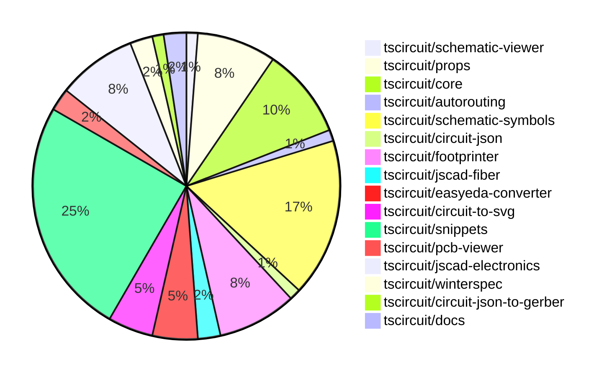

# contribution-tracker

Generates weekly contribution overviews for tscircuit contributors. Check out all
the [contribution overviews here](./contribution-overviews/)

* All PRs in the tscircuit org are scanned/summarized via Claude Haiku
* Claude classifies each Diff/PR as a Major, Minor or Tiny contribution
* All the PRs, summaries, and classifications are organized into charts and tables

The current week is shown below. There are 3 major sections:

* [Contributor Overview](#contributor-overview)
* [PRs by Repository](#prs-by-repository)
* [PRs by Contributor](#changes-by-contributor)

## Current Week

<!-- START_CURRENT_WEEK -->

# Contribution Overview 2024-10-16

## PRs by Repository

## Contributor Overview

| Contributor | 🐳 Major | 🐙 Minor | 🐌 Tiny | ⭐ |
|-------------|-------|-------|-------|-------|
| [seveibar](#seveibar) | 5 | 20 | 2 | 👑 |
| [anas-sarkez](#anas-sarkez) | 4 | 6 | 0 | ⭐⭐ |
| [andrii-balitskyi](#andrii-balitskyi) | 4 | 3 | 0 | ⭐⭐ |
| [Timer00](#Timer00) | 5 | 0 | 0 | ⭐⭐ |
| [imrishabh18](#imrishabh18) | 1 | 6 | 3 | ⭐⭐ |
| [Abse2001](#Abse2001) | 1 | 4 | 1 | ⭐⭐ |
| [mrudulpatil18](#mrudulpatil18) | 2 | 1 | 0 | ⭐ |
| [aman1376](#aman1376) | 2 | 0 | 0 | ⭐ |
| [ShiboSoftwareDev](#ShiboSoftwareDev) | 0 | 2 | 2 | ⭐ |
| [theajmalrazaq](#theajmalrazaq) | 0 | 3 | 0 | ⭐ |
| [sarthak-kumar-shailendra](#sarthak-kumar-shailendra) | 0 | 2 | 0 | ⭐ |
| [bbland1](#bbland1) | 0 | 1 | 0 |  |
| [alex-marinov](#alex-marinov) | 0 | 1 | 0 |  |
| [anugcodes](#anugcodes) | 0 | 1 | 0 |  |
| [kom-senapati](#kom-senapati) | 0 | 1 | 0 |  |
| [AlexVCS](#AlexVCS) | 0 | 0 | 1 |  |

## Changes by Repository

### [tscircuit/schematic-viewer](https://github.com/tscircuit/schematic-viewer)

| PR # | Impact | Contributor | Description |
|------|--------|-------------|-------------|
| [#65](https://github.com/tscircuit/schematic-viewer/pull/65) | 🐳 Major | imrishabh18 | Refactor the schematic viewer component to use the new `@tscircuit/core` package and update the schematic viewer functionality. |

### [tscircuit/props](https://github.com/tscircuit/props)

| PR # | Impact | Contributor | Description |
|------|--------|-------------|-------------|
| [#62](https://github.com/tscircuit/props/pull/62) | 🐙 Minor | imrishabh18 | Reverts changes to `width` and `height` properties in `commonLayoutProps`. |
| [#60](https://github.com/tscircuit/props/pull/60) | 🐙 Minor | imrishabh18 | Adds `schWidth` and `schHeight` properties to the `commonLayoutProps` object, replacing the previous `width` and `height` properties. |
| [#58](https://github.com/tscircuit/props/pull/58) | 🐙 Minor | imrishabh18 | Add width and height properties to common components |
| [#65](https://github.com/tscircuit/props/pull/65) | 🐙 Minor | seveibar | Add support for the `schAutoLayoutEnabled` prop on the `<group />` component. |
| [#63](https://github.com/tscircuit/props/pull/63) | 🐙 Minor | seveibar | Adds battery types, batteryProps, and sets the default unit to mAh. |
| [#61](https://github.com/tscircuit/props/pull/61) | 🐙 Minor | seveibar | Revert the addition of `schWidth`, `schHeight`, `pcbWidth`, and `pcbHeight` props in the `commonLayoutProps` interface and replace them with `width` and `height` props. |
| [#59](https://github.com/tscircuit/props/pull/59) | 🐌 Tiny | imrishabh18 | Updated the project's dependency lockfile. |

### [tscircuit/core](https://github.com/tscircuit/core)

| PR # | Impact | Contributor | Description |
|------|--------|-------------|-------------|
| [#185](https://github.com/tscircuit/core/pull/185) | 🐳 Major | seveibar | Implemented schematic autolayout and fixed routing issues |
| [#177](https://github.com/tscircuit/core/pull/177) | 🐳 Major | seveibar | Introduces a new "battery" component. |
| [#187](https://github.com/tscircuit/core/pull/187) | 🐙 Minor | imrishabh18 | Adds support for the `-size` suffix in port arrangements for the `NormalComponent` class. |
| [#188](https://github.com/tscircuit/core/pull/188) | 🐙 Minor | seveibar | Update the `circuit-to-svg` dependency to fix a bug where `pinNumber 0` was not being recognized. |
| [#186](https://github.com/tscircuit/core/pull/186) | 🐙 Minor | seveibar | Fixes the issue of using local instead of global positions for schematic ports, which simplifies computations and rendering operations. |
| [#176](https://github.com/tscircuit/core/pull/176) | 🐙 Minor | seveibar | Fixes the rotation of SMT pads and keepouts when `pcbRotation={-90}` is used. |
| [#173](https://github.com/tscircuit/core/pull/173) | 🐙 Minor | seveibar | Adds support for shared pin labels in the NormalComponent class, allowing for multiple labels per pin. |
| [#182](https://github.com/tscircuit/core/pull/182) | 🐙 Minor | Abse2001 | Fixed the `toMatchSchematicSnapshot` test for the Battery component by updating the schematicSymbolName property. |

### [tscircuit/autorouting](https://github.com/tscircuit/autorouting)

| PR # | Impact | Contributor | Description |
|------|--------|-------------|-------------|
| [#82](https://github.com/tscircuit/autorouting/pull/82) | 🐙 Minor | imrishabh18 | The pull request removes the builder pattern from the `get-debug-svg.ts` file. |

### [tscircuit/schematic-symbols](https://github.com/tscircuit/schematic-symbols)

| PR # | Impact | Contributor | Description |
|------|--------|-------------|-------------|
| [#185](https://github.com/tscircuit/schematic-symbols/pull/185) | 🐳 Major | Abse2001 | Implemented SVG Arc support and added an inductor symbol |
| [#78](https://github.com/tscircuit/schematic-symbols/pull/78) | 🐳 Major | Timer00 | Introduces a new symbol for a wattmeter. |
| [#95](https://github.com/tscircuit/schematic-symbols/pull/95) | 🐳 Major | Timer00 | Introduce a new symbol called "varmeter" |
| [#96](https://github.com/tscircuit/schematic-symbols/pull/96) | 🐳 Major | Timer00 | Introduce a new symbol called "watt_hour_meter" |
| [#97](https://github.com/tscircuit/schematic-symbols/pull/97) | 🐳 Major | Timer00 | Introduces a new symbol called "frequency_meter" |
| [#100](https://github.com/tscircuit/schematic-symbols/pull/100) | 🐳 Major | Timer00 | Introduces a new symbol called "tachometer" |
| [#176](https://github.com/tscircuit/schematic-symbols/pull/176) | 🐳 Major | aman1376 | Adds a new light-dependent resistor symbol to the project. |
| [#162](https://github.com/tscircuit/schematic-symbols/pull/162) | 🐳 Major | aman1376 | Adds a new JSON file and SVG file for a DPST switch symbol. |
| [#172](https://github.com/tscircuit/schematic-symbols/pull/172) | 🐙 Minor | imrishabh18 | Fix the calculation for the height of the SPDT switch and the boxresistor components. |
| [#174](https://github.com/tscircuit/schematic-symbols/pull/174) | 🐙 Minor | Abse2001 | Added a battery symbol |
| [#153](https://github.com/tscircuit/schematic-symbols/pull/153) | 🐙 Minor | mrudulpatil18 | Added a new rectifier diode symbol to the project. |
| [#167](https://github.com/tscircuit/schematic-symbols/pull/167) | 🐙 Minor | anugcodes | Adds a new symbol for a Darlington pair transistor. |
| [#184](https://github.com/tscircuit/schematic-symbols/pull/184) | 🐌 Tiny | imrishabh18 | Updated the lockfile to fix a failing npm publish |
| [#183](https://github.com/tscircuit/schematic-symbols/pull/183) | 🐌 Tiny | imrishabh18 | Update .gitignore to ignore .diff.png files |

### [tscircuit/circuit-json](https://github.com/tscircuit/circuit-json)

| PR # | Impact | Contributor | Description |
|------|--------|-------------|-------------|
| [#59](https://github.com/tscircuit/circuit-json/pull/59) | 🐳 Major | seveibar | Add a new circuit element type `simple_battery` to the project. |

### [tscircuit/footprinter](https://github.com/tscircuit/footprinter)

| PR # | Impact | Contributor | Description |
|------|--------|-------------|-------------|
| [#67](https://github.com/tscircuit/footprinter/pull/67) | 🐳 Major | seveibar | Introduces a new feature to automatically generate a gallery page for SVG snapshots. |
| [#70](https://github.com/tscircuit/footprinter/pull/70) | 🐳 Major | anas-sarkez | Implemented a function to generate a stampreceiver footprint. |
| [#68](https://github.com/tscircuit/footprinter/pull/68) | 🐳 Major | anas-sarkez | Implemented a new function for generating a stampboard footprint. |
| [#66](https://github.com/tscircuit/footprinter/pull/66) | 🐙 Minor | seveibar | Introduce a new pushbutton footprint and update the circuit-to-svg dependency. |
| [#71](https://github.com/tscircuit/footprinter/pull/71) | 🐙 Minor | anas-sarkez | The pull request adds support for holes in the stampboard and stampreceiver components, and modifies the pad length and holes position. |
| [#69](https://github.com/tscircuit/footprinter/pull/69) | 🐙 Minor | anas-sarkez | Implement silkscreen reference for every component and added silkscreenRef function to helpers |
| [#60](https://github.com/tscircuit/footprinter/pull/60) | 🐙 Minor | bbland1 | Adds TypeScript type definitions for the parameters returned by the `.json()` method in the `footprinter` module. |

### [tscircuit/jscad-fiber](https://github.com/tscircuit/jscad-fiber)

| PR # | Impact | Contributor | Description |
|------|--------|-------------|-------------|
| [#84](https://github.com/tscircuit/jscad-fiber/pull/84) | 🐳 Major | seveibar | Implement the "subtract" operation for 3D models in the library. |
| [#85](https://github.com/tscircuit/jscad-fiber/pull/85) | 🐙 Minor | alex-marinov | Adds support for <Translate/> component to accept multiple children |

### [tscircuit/easyeda-converter](https://github.com/tscircuit/easyeda-converter)

| PR # | Impact | Contributor | Description |
|------|--------|-------------|-------------|
| [#74](https://github.com/tscircuit/easyeda-converter/pull/74) | 🐙 Minor | seveibar | The pull request fixes the C490691 import and adds a script for quickly adding tests for parts. |
| [#71](https://github.com/tscircuit/easyeda-converter/pull/71) | 🐙 Minor | seveibar | Fixes an issue with importing Arc data in the `package-detail-shape-schema.ts` file. |
| [#78](https://github.com/tscircuit/easyeda-converter/pull/78) | 🐙 Minor | andrii-balitskyi | Adds support for `T~` text shapes and fixes a script that adds tests for a part. |
| [#77](https://github.com/tscircuit/easyeda-converter/pull/77) | 🐙 Minor | andrii-balitskyi | Fix error message in the convert command to reflect the correct command option. |

### [tscircuit/circuit-to-svg](https://github.com/tscircuit/circuit-to-svg)

| PR # | Impact | Contributor | Description |
|------|--------|-------------|-------------|
| [#88](https://github.com/tscircuit/circuit-to-svg/pull/88) | 🐙 Minor | seveibar | Fix schematic port using a relative position |
| [#87](https://github.com/tscircuit/circuit-to-svg/pull/87) | 🐙 Minor | seveibar | Fix silkscreen paths being erroneously closed, improving the appearance of pushbutton silkscreens. |
| [#89](https://github.com/tscircuit/circuit-to-svg/pull/89) | 🐙 Minor | Abse2001 | Updated the dependency version of "schematic-symbols" from 0.0.79 to 0.0.90. |
| [#86](https://github.com/tscircuit/circuit-to-svg/pull/86) | 🐙 Minor | Abse2001 | Updated the schematic symbols to fix the battery in core and formatted the code. |

### [tscircuit/snippets](https://github.com/tscircuit/snippets)

| PR # | Impact | Contributor | Description |
|------|--------|-------------|-------------|
| [#88](https://github.com/tscircuit/snippets/pull/88) | 🐳 Major | andrii-balitskyi | Introduces country and state dropdowns in the shipping information section. |
| [#89](https://github.com/tscircuit/snippets/pull/89) | 🐳 Major | andrii-balitskyi | Adds a new feature that displays a preview of the order, including a PCB viewer, 3D viewer, and a JSON table viewer. |
| [#82](https://github.com/tscircuit/snippets/pull/82) | 🐳 Major | andrii-balitskyi | Adds functionality to edit shipping information in the user's profile settings. |
| [#78](https://github.com/tscircuit/snippets/pull/78) | 🐳 Major | andrii-balitskyi | Adds a new "Submit Order" button to the editor's navbar and a "Create Order" dialog to the application. |
| [#117](https://github.com/tscircuit/snippets/pull/117) | 🐳 Major | mrudulpatil18 | Added a command palette feature with search functionality, recent snippets, blank snippet templates, and import options. |
| [#77](https://github.com/tscircuit/snippets/pull/77) | 🐳 Major | mrudulpatil18 | Adds a search component to the header, which allows users to search for code snippets and opens the editor view in a new tab when a snippet is selected. |
| [#122](https://github.com/tscircuit/snippets/pull/122) | 🐙 Minor | seveibar | Introduces a new `add_star` endpoint that allows users to star a snippet. |
| [#118](https://github.com/tscircuit/snippets/pull/118) | 🐙 Minor | seveibar | Fix broken search functionality and cmd+click behavior in the CodeEditor component. |
| [#115](https://github.com/tscircuit/snippets/pull/115) | 🐙 Minor | seveibar | Introduce CMD+click to open snippets |
| [#114](https://github.com/tscircuit/snippets/pull/114) | 🐙 Minor | seveibar | Introduce a new "Files" dialog to allow viewing the build files of a snippet. |
| [#108](https://github.com/tscircuit/snippets/pull/108) | 🐙 Minor | seveibar | Order my snippets by last created time |
| [#84](https://github.com/tscircuit/snippets/pull/84) | 🐙 Minor | seveibar | Fix tab indent in CodeEditor component |
| [#80](https://github.com/tscircuit/snippets/pull/80) | 🐙 Minor | seveibar | Fix issues with JLCPCB imports, update for shared pin label support, and fix errors in local development to show JLCPCB import errors. |
| [#74](https://github.com/tscircuit/snippets/pull/74) | 🐙 Minor | seveibar | Fixes download issues for fabrication files. |
| [#68](https://github.com/tscircuit/snippets/pull/68) | 🐙 Minor | andrii-balitskyi | Adds tests for the order-related API endpoints, including creating, getting, listing, and updating orders, as well as uploading and getting order files. |
| [#95](https://github.com/tscircuit/snippets/pull/95) | 🐙 Minor | theajmalrazaq | Fixed the responsiveness of the quickstart page |
| [#97](https://github.com/tscircuit/snippets/pull/97) | 🐙 Minor | theajmalrazaq | Added Playwright tests for the AI Page and Quickstart Page, added viewports to the existing tests, fixed them, and updated the snapshots. |
| [#85](https://github.com/tscircuit/snippets/pull/85) | 🐙 Minor | theajmalrazaq | Fixes the search box rendering issue in small views and improves the responsiveness of the dashboard. |
| [#86](https://github.com/tscircuit/snippets/pull/86) | 🐙 Minor | kom-senapati | Updates the page title to include the snippet name and owner in the format "tscircuit - <owner>/<package>" |
| [#96](https://github.com/tscircuit/snippets/pull/96) | 🐌 Tiny | Abse2001 | Update the `winterspec` package to version 0.0.94. |
| [#110](https://github.com/tscircuit/snippets/pull/110) | 🐌 Tiny | AlexVCS | Adds a favicon to the web page. |

### [tscircuit/pcb-viewer](https://github.com/tscircuit/pcb-viewer)

| PR # | Impact | Contributor | Description |
|------|--------|-------------|-------------|
| [#76](https://github.com/tscircuit/pcb-viewer/pull/76) | 🐌 Tiny | seveibar | Fixes formatting and removes a console log in the silkscreen path story to ensure it renders properly. |
| [#75](https://github.com/tscircuit/pcb-viewer/pull/75) | 🐌 Tiny | ShiboSoftwareDev | Added a CODEOWNERS file in the .github directory to specify the code reviewers for the project. |

### [tscircuit/jscad-electronics](https://github.com/tscircuit/jscad-electronics)

| PR # | Impact | Contributor | Description |
|------|--------|-------------|-------------|
| [#75](https://github.com/tscircuit/jscad-electronics/pull/75) | 🐳 Major | anas-sarkez | Implementing 3D model for pin row and refactoring footprint plated holes |
| [#68](https://github.com/tscircuit/jscad-electronics/pull/68) | 🐳 Major | anas-sarkez | Implementing a USB-C female port 3D component |
| [#76](https://github.com/tscircuit/jscad-electronics/pull/76) | 🐙 Minor | anas-sarkez | Added a new example for a pin row 6 footprinter3D component. |
| [#72](https://github.com/tscircuit/jscad-electronics/pull/72) | 🐙 Minor | anas-sarkez | Refactored the USB_C component to use the Subtract function for creating the curved metal casing, replacing the complex calculations. |
| [#71](https://github.com/tscircuit/jscad-electronics/pull/71) | 🐙 Minor | anas-sarkez | Updated jscad-fiber dependency and subtracted curve slices from smdLED sides |
| [#69](https://github.com/tscircuit/jscad-electronics/pull/69) | 🐙 Minor | anas-sarkez | Implementing SmdLED packages with different colors |
| [#70](https://github.com/tscircuit/jscad-electronics/pull/70) | 🐌 Tiny | seveibar | Add anas as a codeowner for the repository |

### [tscircuit/winterspec](https://github.com/tscircuit/winterspec)

| PR # | Impact | Contributor | Description |
|------|--------|-------------|-------------|
| [#17](https://github.com/tscircuit/winterspec/pull/17) | 🐙 Minor | ShiboSoftwareDev | The pull request fixes a bug in esbuild that caused issues on Windows by modifying the file paths to always use Unix-based file paths. |
| [#18](https://github.com/tscircuit/winterspec/pull/18) | 🐌 Tiny | ShiboSoftwareDev | Update the `construct-manifest.ts` file to fix the path fix for Windows, where esbuild uses Unix-based forward slash for paths. |

### [tscircuit/circuit-json-to-gerber](https://github.com/tscircuit/circuit-json-to-gerber)

| PR # | Impact | Contributor | Description |
|------|--------|-------------|-------------|
| [#22](https://github.com/tscircuit/circuit-json-to-gerber/pull/22) | 🐙 Minor | ShiboSoftwareDev | Implemented silkscreen path rendering in the Gerber file conversion process. |

### [tscircuit/docs](https://github.com/tscircuit/docs)

| PR # | Impact | Contributor | Description |
|------|--------|-------------|-------------|
| [#29](https://github.com/tscircuit/docs/pull/29) | 🐙 Minor | sarthak-kumar-shailendra | Fixes the incorrect Twitter icon and URL in the sidebar and footer of the application. |
| [#28](https://github.com/tscircuit/docs/pull/28) | 🐙 Minor | sarthak-kumar-shailendra | Update the Twitter logo to the new "X" icon. |

## Changes by Contributor

### [imrishabh18](https://github.com/imrishabh18)

| PR # | Impact | Description |
|------|--------|-------------|
| [#65](https://github.com/tscircuit/schematic-viewer/pull/65) | 🐳 Major | Refactor the schematic viewer component to use the new `@tscircuit/core` package and update the schematic viewer functionality. |
| [#62](https://github.com/tscircuit/props/pull/62) | 🐙 Minor | Reverts changes to `width` and `height` properties in `commonLayoutProps`. |
| [#60](https://github.com/tscircuit/props/pull/60) | 🐙 Minor | Adds `schWidth` and `schHeight` properties to the `commonLayoutProps` object, replacing the previous `width` and `height` properties. |
| [#58](https://github.com/tscircuit/props/pull/58) | 🐙 Minor | Add width and height properties to common components |
| [#187](https://github.com/tscircuit/core/pull/187) | 🐙 Minor | Adds support for the `-size` suffix in port arrangements for the `NormalComponent` class. |
| [#82](https://github.com/tscircuit/autorouting/pull/82) | 🐙 Minor | The pull request removes the builder pattern from the `get-debug-svg.ts` file. |
| [#172](https://github.com/tscircuit/schematic-symbols/pull/172) | 🐙 Minor | Fix the calculation for the height of the SPDT switch and the boxresistor components. |
| [#59](https://github.com/tscircuit/props/pull/59) | 🐌 Tiny | Updated the project's dependency lockfile. |
| [#184](https://github.com/tscircuit/schematic-symbols/pull/184) | 🐌 Tiny | Updated the lockfile to fix a failing npm publish |
| [#183](https://github.com/tscircuit/schematic-symbols/pull/183) | 🐌 Tiny | Update .gitignore to ignore .diff.png files |

### [seveibar](https://github.com/seveibar)

| PR # | Impact | Description |
|------|--------|-------------|
| [#59](https://github.com/tscircuit/circuit-json/pull/59) | 🐳 Major | Add a new circuit element type `simple_battery` to the project. |
| [#67](https://github.com/tscircuit/footprinter/pull/67) | 🐳 Major | Introduces a new feature to automatically generate a gallery page for SVG snapshots. |
| [#185](https://github.com/tscircuit/core/pull/185) | 🐳 Major | Implemented schematic autolayout and fixed routing issues |
| [#177](https://github.com/tscircuit/core/pull/177) | 🐳 Major | Introduces a new "battery" component. |
| [#84](https://github.com/tscircuit/jscad-fiber/pull/84) | 🐳 Major | Implement the "subtract" operation for 3D models in the library. |
| [#65](https://github.com/tscircuit/props/pull/65) | 🐙 Minor | Add support for the `schAutoLayoutEnabled` prop on the `<group />` component. |
| [#63](https://github.com/tscircuit/props/pull/63) | 🐙 Minor | Adds battery types, batteryProps, and sets the default unit to mAh. |
| [#61](https://github.com/tscircuit/props/pull/61) | 🐙 Minor | Revert the addition of `schWidth`, `schHeight`, `pcbWidth`, and `pcbHeight` props in the `commonLayoutProps` interface and replace them with `width` and `height` props. |
| [#66](https://github.com/tscircuit/footprinter/pull/66) | 🐙 Minor | Introduce a new pushbutton footprint and update the circuit-to-svg dependency. |
| [#74](https://github.com/tscircuit/easyeda-converter/pull/74) | 🐙 Minor | The pull request fixes the C490691 import and adds a script for quickly adding tests for parts. |
| [#71](https://github.com/tscircuit/easyeda-converter/pull/71) | 🐙 Minor | Fixes an issue with importing Arc data in the `package-detail-shape-schema.ts` file. |
| [#188](https://github.com/tscircuit/core/pull/188) | 🐙 Minor | Update the `circuit-to-svg` dependency to fix a bug where `pinNumber 0` was not being recognized. |
| [#186](https://github.com/tscircuit/core/pull/186) | 🐙 Minor | Fixes the issue of using local instead of global positions for schematic ports, which simplifies computations and rendering operations. |
| [#176](https://github.com/tscircuit/core/pull/176) | 🐙 Minor | Fixes the rotation of SMT pads and keepouts when `pcbRotation={-90}` is used. |
| [#173](https://github.com/tscircuit/core/pull/173) | 🐙 Minor | Adds support for shared pin labels in the NormalComponent class, allowing for multiple labels per pin. |
| [#88](https://github.com/tscircuit/circuit-to-svg/pull/88) | 🐙 Minor | Fix schematic port using a relative position |
| [#87](https://github.com/tscircuit/circuit-to-svg/pull/87) | 🐙 Minor | Fix silkscreen paths being erroneously closed, improving the appearance of pushbutton silkscreens. |
| [#122](https://github.com/tscircuit/snippets/pull/122) | 🐙 Minor | Introduces a new `add_star` endpoint that allows users to star a snippet. |
| [#118](https://github.com/tscircuit/snippets/pull/118) | 🐙 Minor | Fix broken search functionality and cmd+click behavior in the CodeEditor component. |
| [#115](https://github.com/tscircuit/snippets/pull/115) | 🐙 Minor | Introduce CMD+click to open snippets |
| [#114](https://github.com/tscircuit/snippets/pull/114) | 🐙 Minor | Introduce a new "Files" dialog to allow viewing the build files of a snippet. |
| [#108](https://github.com/tscircuit/snippets/pull/108) | 🐙 Minor | Order my snippets by last created time |
| [#84](https://github.com/tscircuit/snippets/pull/84) | 🐙 Minor | Fix tab indent in CodeEditor component |
| [#80](https://github.com/tscircuit/snippets/pull/80) | 🐙 Minor | Fix issues with JLCPCB imports, update for shared pin label support, and fix errors in local development to show JLCPCB import errors. |
| [#74](https://github.com/tscircuit/snippets/pull/74) | 🐙 Minor | Fixes download issues for fabrication files. |
| [#76](https://github.com/tscircuit/pcb-viewer/pull/76) | 🐌 Tiny | Fixes formatting and removes a console log in the silkscreen path story to ensure it renders properly. |
| [#70](https://github.com/tscircuit/jscad-electronics/pull/70) | 🐌 Tiny | Add anas as a codeowner for the repository |

### [ShiboSoftwareDev](https://github.com/ShiboSoftwareDev)

| PR # | Impact | Description |
|------|--------|-------------|
| [#17](https://github.com/tscircuit/winterspec/pull/17) | 🐙 Minor | The pull request fixes a bug in esbuild that caused issues on Windows by modifying the file paths to always use Unix-based file paths. |
| [#22](https://github.com/tscircuit/circuit-json-to-gerber/pull/22) | 🐙 Minor | Implemented silkscreen path rendering in the Gerber file conversion process. |
| [#75](https://github.com/tscircuit/pcb-viewer/pull/75) | 🐌 Tiny | Added a CODEOWNERS file in the .github directory to specify the code reviewers for the project. |
| [#18](https://github.com/tscircuit/winterspec/pull/18) | 🐌 Tiny | Update the `construct-manifest.ts` file to fix the path fix for Windows, where esbuild uses Unix-based forward slash for paths. |

### [sarthak-kumar-shailendra](https://github.com/sarthak-kumar-shailendra)

| PR # | Impact | Description |
|------|--------|-------------|
| [#29](https://github.com/tscircuit/docs/pull/29) | 🐙 Minor | Fixes the incorrect Twitter icon and URL in the sidebar and footer of the application. |
| [#28](https://github.com/tscircuit/docs/pull/28) | 🐙 Minor | Update the Twitter logo to the new "X" icon. |

### [anas-sarkez](https://github.com/anas-sarkez)

| PR # | Impact | Description |
|------|--------|-------------|
| [#70](https://github.com/tscircuit/footprinter/pull/70) | 🐳 Major | Implemented a function to generate a stampreceiver footprint. |
| [#68](https://github.com/tscircuit/footprinter/pull/68) | 🐳 Major | Implemented a new function for generating a stampboard footprint. |
| [#75](https://github.com/tscircuit/jscad-electronics/pull/75) | 🐳 Major | Implementing 3D model for pin row and refactoring footprint plated holes |
| [#68](https://github.com/tscircuit/jscad-electronics/pull/68) | 🐳 Major | Implementing a USB-C female port 3D component |
| [#71](https://github.com/tscircuit/footprinter/pull/71) | 🐙 Minor | The pull request adds support for holes in the stampboard and stampreceiver components, and modifies the pad length and holes position. |
| [#69](https://github.com/tscircuit/footprinter/pull/69) | 🐙 Minor | Implement silkscreen reference for every component and added silkscreenRef function to helpers |
| [#76](https://github.com/tscircuit/jscad-electronics/pull/76) | 🐙 Minor | Added a new example for a pin row 6 footprinter3D component. |
| [#72](https://github.com/tscircuit/jscad-electronics/pull/72) | 🐙 Minor | Refactored the USB_C component to use the Subtract function for creating the curved metal casing, replacing the complex calculations. |
| [#71](https://github.com/tscircuit/jscad-electronics/pull/71) | 🐙 Minor | Updated jscad-fiber dependency and subtracted curve slices from smdLED sides |
| [#69](https://github.com/tscircuit/jscad-electronics/pull/69) | 🐙 Minor | Implementing SmdLED packages with different colors |

### [bbland1](https://github.com/bbland1)

| PR # | Impact | Description |
|------|--------|-------------|
| [#60](https://github.com/tscircuit/footprinter/pull/60) | 🐙 Minor | Adds TypeScript type definitions for the parameters returned by the `.json()` method in the `footprinter` module. |

### [andrii-balitskyi](https://github.com/andrii-balitskyi)

| PR # | Impact | Description |
|------|--------|-------------|
| [#88](https://github.com/tscircuit/snippets/pull/88) | 🐳 Major | Introduces country and state dropdowns in the shipping information section. |
| [#89](https://github.com/tscircuit/snippets/pull/89) | 🐳 Major | Adds a new feature that displays a preview of the order, including a PCB viewer, 3D viewer, and a JSON table viewer. |
| [#82](https://github.com/tscircuit/snippets/pull/82) | 🐳 Major | Adds functionality to edit shipping information in the user's profile settings. |
| [#78](https://github.com/tscircuit/snippets/pull/78) | 🐳 Major | Adds a new "Submit Order" button to the editor's navbar and a "Create Order" dialog to the application. |
| [#78](https://github.com/tscircuit/easyeda-converter/pull/78) | 🐙 Minor | Adds support for `T~` text shapes and fixes a script that adds tests for a part. |
| [#77](https://github.com/tscircuit/easyeda-converter/pull/77) | 🐙 Minor | Fix error message in the convert command to reflect the correct command option. |
| [#68](https://github.com/tscircuit/snippets/pull/68) | 🐙 Minor | Adds tests for the order-related API endpoints, including creating, getting, listing, and updating orders, as well as uploading and getting order files. |

### [Abse2001](https://github.com/Abse2001)

| PR # | Impact | Description |
|------|--------|-------------|
| [#185](https://github.com/tscircuit/schematic-symbols/pull/185) | 🐳 Major | Implemented SVG Arc support and added an inductor symbol |
| [#182](https://github.com/tscircuit/core/pull/182) | 🐙 Minor | Fixed the `toMatchSchematicSnapshot` test for the Battery component by updating the schematicSymbolName property. |
| [#89](https://github.com/tscircuit/circuit-to-svg/pull/89) | 🐙 Minor | Updated the dependency version of "schematic-symbols" from 0.0.79 to 0.0.90. |
| [#86](https://github.com/tscircuit/circuit-to-svg/pull/86) | 🐙 Minor | Updated the schematic symbols to fix the battery in core and formatted the code. |
| [#174](https://github.com/tscircuit/schematic-symbols/pull/174) | 🐙 Minor | Added a battery symbol |
| [#96](https://github.com/tscircuit/snippets/pull/96) | 🐌 Tiny | Update the `winterspec` package to version 0.0.94. |

### [alex-marinov](https://github.com/alex-marinov)

| PR # | Impact | Description |
|------|--------|-------------|
| [#85](https://github.com/tscircuit/jscad-fiber/pull/85) | 🐙 Minor | Adds support for <Translate/> component to accept multiple children |

### [Timer00](https://github.com/Timer00)

| PR # | Impact | Description |
|------|--------|-------------|
| [#78](https://github.com/tscircuit/schematic-symbols/pull/78) | 🐳 Major | Introduces a new symbol for a wattmeter. |
| [#95](https://github.com/tscircuit/schematic-symbols/pull/95) | 🐳 Major | Introduce a new symbol called "varmeter" |
| [#96](https://github.com/tscircuit/schematic-symbols/pull/96) | 🐳 Major | Introduce a new symbol called "watt_hour_meter" |
| [#97](https://github.com/tscircuit/schematic-symbols/pull/97) | 🐳 Major | Introduces a new symbol called "frequency_meter" |
| [#100](https://github.com/tscircuit/schematic-symbols/pull/100) | 🐳 Major | Introduces a new symbol called "tachometer" |

### [aman1376](https://github.com/aman1376)

| PR # | Impact | Description |
|------|--------|-------------|
| [#176](https://github.com/tscircuit/schematic-symbols/pull/176) | 🐳 Major | Adds a new light-dependent resistor symbol to the project. |
| [#162](https://github.com/tscircuit/schematic-symbols/pull/162) | 🐳 Major | Adds a new JSON file and SVG file for a DPST switch symbol. |

### [mrudulpatil18](https://github.com/mrudulpatil18)

| PR # | Impact | Description |
|------|--------|-------------|
| [#117](https://github.com/tscircuit/snippets/pull/117) | 🐳 Major | Added a command palette feature with search functionality, recent snippets, blank snippet templates, and import options. |
| [#77](https://github.com/tscircuit/snippets/pull/77) | 🐳 Major | Adds a search component to the header, which allows users to search for code snippets and opens the editor view in a new tab when a snippet is selected. |
| [#153](https://github.com/tscircuit/schematic-symbols/pull/153) | 🐙 Minor | Added a new rectifier diode symbol to the project. |

### [anugcodes](https://github.com/anugcodes)

| PR # | Impact | Description |
|------|--------|-------------|
| [#167](https://github.com/tscircuit/schematic-symbols/pull/167) | 🐙 Minor | Adds a new symbol for a Darlington pair transistor. |

### [AlexVCS](https://github.com/AlexVCS)

| PR # | Impact | Description |
|------|--------|-------------|
| [#110](https://github.com/tscircuit/snippets/pull/110) | 🐌 Tiny | Adds a favicon to the web page. |

### [theajmalrazaq](https://github.com/theajmalrazaq)

| PR # | Impact | Description |
|------|--------|-------------|
| [#95](https://github.com/tscircuit/snippets/pull/95) | 🐙 Minor | Fixed the responsiveness of the quickstart page |
| [#97](https://github.com/tscircuit/snippets/pull/97) | 🐙 Minor | Added Playwright tests for the AI Page and Quickstart Page, added viewports to the existing tests, fixed them, and updated the snapshots. |
| [#85](https://github.com/tscircuit/snippets/pull/85) | 🐙 Minor | Fixes the search box rendering issue in small views and improves the responsiveness of the dashboard. |

### [kom-senapati](https://github.com/kom-senapati)

| PR # | Impact | Description |
|------|--------|-------------|
| [#86](https://github.com/tscircuit/snippets/pull/86) | 🐙 Minor | Updates the page title to include the snippet name and owner in the format "tscircuit - <owner>/<package>" |

<!-- END_CURRENT_WEEK -->
