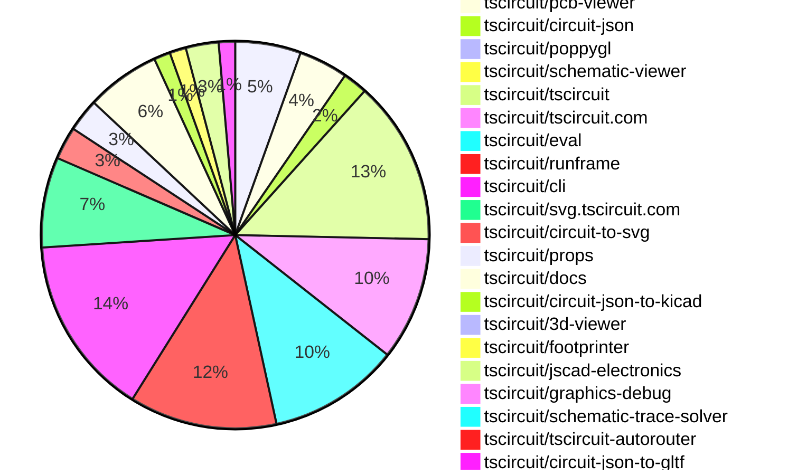
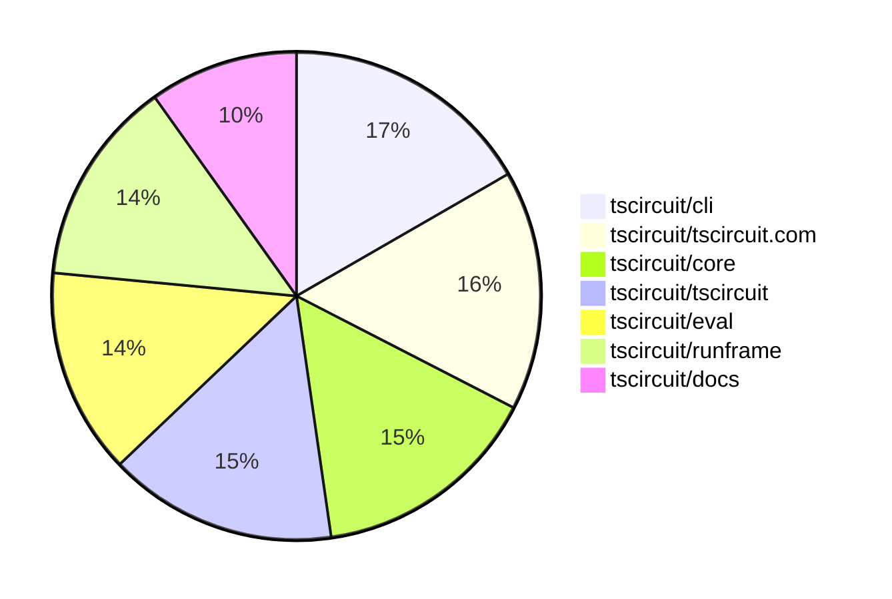

# contribution-tracker

[contributions.tscircuit.com](https://contributions.tscircuit.com) ・ [tscircuit.com](https://tscircuit.com) ・ [Contribution Overviews](./contribution-overviews/) ・ [Changelogs](./changelogs/)

Generates weekly contribution overviews for tscircuit contributors. Check out all
the [contribution overviews here](./contribution-overviews/)
You can find AI-generated monthly changelogs in the [changelogs directory](./changelogs/).

- All PRs in the tscircuit org are scanned/summarized via an LLM
- The LLM classifies each Diff/PR as into a set of attributes for scoring
- All the PRs, summaries, and classifications are organized into charts and tables for [the website](https://contributions.tscircuit.com)

> Want to run locally? See the [Development Section](#development)

The current week is shown below. There are 4 major sections:

- [Contributor Overview](#contributor-overview)
- [PRs by Repository](#prs-by-repository)
- [PRs by Contributor](#changes-by-contributor)
- [Scoring & Sponsorship System](#scoring--sponsorship-system)

## Current Week

<!-- START_CURRENT_WEEK -->

# Contribution Overview 2025-11-12

The current week is shown below. There are 4 major sections:

- [Contributor Overview](#contributor-overview)
- [PRs by Repository](#prs-by-repository)
- [PRs by Contributor](#changes-by-contributor)
- [Scoring & Sponsorship System](#scoring--sponsorship-system)

## PRs by Repository



## Contributor Overview

| Contributor | 🐳 Major | 🐙 Minor | 🐌 Tiny | ⭐ | Score | Discussion Contributions |
|-------------|---------|---------|---------|-----|----------------|--------------------------|
| [ShiboSoftwareDev](#ShiboSoftwareDev) | 3 | 5 | 5 | ⭐⭐⭐ | 34 | 0🔹 0🔶 0💎 |
| [seveibar](#seveibar) | 2 | 3 | 3 | ⭐⭐⭐ | 32 | 0🔹 0🔶 0💎 |
| [imrishabh18](#imrishabh18) | 0 | 5 | 8 | ⭐⭐ | 20 | 0🔹 0🔶 0💎 |
| [techmannih](#techmannih) | 2 | 2 | 4 | ⭐⭐ | 19 | 0🔹 0🔶 0💎 |
| [tscircuitbot](#tscircuitbot) | 0 | 0 | 90 | ⭐⭐ | 13.5 | 0🔹 0🔶 0💎 |
| [Ayushjhawar8](#Ayushjhawar8) | 1 | 3 | 1 | ⭐⭐ | 12 | 0🔹 0🔶 0💎 |
| [0hmX](#0hmX) | 2 | 0 | 1 | ⭐ | 9 | 0🔹 0🔶 0💎 |
| [rushabhcodes](#rushabhcodes) | 0 | 0 | 6 | ⭐ | 8 | 0🔹 0🔶 0💎 |
| [ArnavK-09](#ArnavK-09) | 1 | 0 | 0 | ⭐ | 4 | 0🔹 0🔶 0💎 |
| [pxlpal](#pxlpal) | 1 | 0 | 0 | ⭐ | 4 | 0🔹 0🔶 0💎 |
| [baeoc](#baeoc) | 0 | 1 | 2 | ⭐ | 4 | 0🔹 0🔶 0💎 |
| [Abse2001](#Abse2001) | 0 | 0 | 1 |  | 3 | 0🔹 0🔶 0💎 |
| [nailoo](#nailoo) | 0 | 0 | 1 |  | 2 | 0🔹 0🔶 0💎 |

> Note: AI evaluates PRs and assigns 1-3 star ratings automatically. 4 and 5 star ratings require manual staff review.

### Discussion Contribution Legend

- 🔹 Normal Comments: Basic participation with minimal effort
- 🔶 Great Informative Comments: Thoughtful participation that adds value
- 💎 Incredible Comments: Exceptional participation with high-quality content

## Review Table

[reviews-received-hover]: ## "Number of reviews received for PRs for this contributor"
[approvals-received-hover]: ## "Number of approvals received for PRs this contributor authored"
[rejections-received-hover]: ## "Number of rejections received for PRs this contributor authored"
[prs-opened-hover]: ## "Number of PRs opened by this contributor"
[issues-created-hover]: ## "Number of issues created by this contributor"
[bountied-issues-hover]: ## "Number of issues this contributor created with a bounty"
[bountied-issue-$-hover]: ## "Total bounty amount placed on issues authored by this contributor"

| Contributor | Reviews Received | Approvals Received | Rejections Received | Approvals | Rejections | PRs Opened | PRs Merged | Score | Issues Created | Bountied Issues | Bountied Issue $ |
|---|---|---|---|---|---|---|---|---|---|---|---|
| [Ayushjhawar8](#Ayushjhawar8) | 31 | 6 | 3 | 0 | 0 | 9 | 5 | 12 | 0 | 0 | 0 |
| [seveibar](#seveibar) | 6 | 0 | 0 | 38 | 6 | 14 | 8 | 32 | 0 | 0 | 0 |
| [tscircuitbot](#tscircuitbot) | 0 | 0 | 0 | 0 | 0 | 105 | 90 | 13.5 | 0 | 0 | 0 |
| [techmannih](#techmannih) | 15 | 7 | 0 | 1 | 1 | 10 | 8 | 19 | 0 | 0 | 0 |
| [imrishabh18](#imrishabh18) | 12 | 5 | 0 | 1 | 0 | 15 | 13 | 20 | 0 | 0 | 0 |
| [ShiboSoftwareDev](#ShiboSoftwareDev) | 13 | 13 | 0 | 6 | 0 | 13 | 13 | 34 | 0 | 0 | 0 |
| [rushabhcodes](#rushabhcodes) | 15 | 8 | 1 | 1 | 1 | 9 | 6 | 8 | 0 | 0 | 0 |
| [RaghavArora14](#RaghavArora14) | 6 | 1 | 0 | 0 | 0 | 1 | 0 | 0 | 0 | 0 | 0 |
| [Abse2001](#Abse2001) | 5 | 1 | 1 | 2 | 1 | 2 | 1 | 3 | 0 | 0 | 0 |
| [Dasdebsankar54](#Dasdebsankar54) | 3 | 0 | 1 | 0 | 0 | 1 | 0 | 0 | 0 | 0 | 0 |
| [nailoo](#nailoo) | 1 | 0 | 0 | 0 | 0 | 2 | 1 | 2 | 0 | 0 | 0 |
| [ArnavK-09](#ArnavK-09) | 1 | 1 | 0 | 0 | 0 | 1 | 1 | 4 | 0 | 0 | 0 |
| [pxlpal](#pxlpal) | 1 | 1 | 0 | 0 | 0 | 1 | 1 | 4 | 0 | 0 | 0 |
| [0hmX](#0hmX) | 12 | 2 | 1 | 0 | 0 | 8 | 3 | 9 | 0 | 0 | 0 |
| [baeoc](#baeoc) | 6 | 3 | 0 | 0 | 0 | 4 | 3 | 4 | 0 | 0 | 0 |
| [MustafaMulla29](#MustafaMulla29) | 0 | 0 | 0 | 0 | 0 | 0 | 0 | 0 | 0 | 0 | 0 |
| [Kunal-Darekar](#Kunal-Darekar) | 0 | 0 | 0 | 0 | 0 | 1 | 0 | 0 | 0 | 0 | 0 |
| [Enity300](#Enity300) | 3 | 1 | 2 | 0 | 0 | 1 | 0 | 0 | 0 | 0 | 0 |

## Top 7 Repositories by Contribution Points



## Scoring & Sponsorship System

### Overview

PRs are analyzed by AI and assigned a **star rating (1-3 stars)**. 4 and 5 star ratings can only be manually assigned by staff. Weekly scores use `2^(starRating - 1)` per PR (capped at 12 PRs per rating), plus review/discussion points.

### Weekly Score → Star String

| Score Range | Star String | Count Value |
|------------|-------------|-------------|
| 0-3 | (empty) | 0 stars |
| 4-10 | ⭐ | 1 star |
| 11-30 | ⭐⭐ | 2 stars |
| 31-50 | ⭐⭐⭐ | 3 stars |
| 51-75 | 👑 | 1 crown |
| 76-100 | 👑👑 | 2 crowns |
| 101+ | 👑👑👑 | 3 crowns |

> Crowns count as 3 stars for sponsorship.

### Monthly Sponsorship Calculation

The sponsorship system calculates monthly payments based on your **weekly star counts** over the complete weeks in that month (typically 4-5 weeks, Wednesday-Tuesday format).

**Step 1: Collect Weekly Stars**
- All complete weeks in the month are analyzed
- Each week's star string is converted to a numeric count (⭐ = 1 star, ⭐⭐⭐ = 3 stars)
- Example: `[2, 2, 2, 1, 0]` means 2 stars in week 1, 2 stars in week 2, etc.

**Step 2: Calculate Metrics**
- **Median stars**: The median value of all weekly star counts
- **Min stars**: The minimum weekly star count
- **Max stars**: The maximum weekly star count
- **High score**: The maximum raw weekly score (0-100+ range from the scoring table) from any week in the month

**Step 3: Determine Base Amount**
The sponsorship amount is calculated based on these metrics (checked in order):

| Condition | Base Amount |
|-----------|-------------|
| `minStarCount >= 3` | **$500** |
| `medianStars >= 3` | **$450** |
| `medianStars >= 2.5` | **$300** |
| `medianStars >= 2` | **$200** |
| `medianStars >= 1.5` | **$100** |
| `medianStars >= 1` | **$75** |
| `maxStarCount >= 2` | **$25** |
| `maxStarCount >= 1` | **$15** |
| `highScore >= 3` (and all stars = 0) | **$5** |

| Maintainer Level | Monthly Bonus |
|------------------|---------------|
| Level 1 | **$200** |
| Level 2 | **$350** |
| Level 3 | **$500** |

**Final Amount** = Base Amount + Maintainer Bonus

## Changes by Repository

### [tscircuit/core](https://github.com/tscircuit/core)

| PR # | Impact | Rating | Contributor | Description |
|------|--------|--------|-------------|-------------|
| [#1650](https://github.com/tscircuit/core/pull/1650) | 🐳 Major | ⭐⭐⭐ | Ayushjhawar8 | Adds pcb_panel records with width, height, center, and solder mask coverage info, and upgrades circuit-json to v0.0.307. |
| [#1656](https://github.com/tscircuit/core/pull/1656) | 🐳 Major | ⭐⭐⭐ | ShiboSoftwareDev | Add support for inflating traces from subcircuit components defined in circuitJson, allowing internal connections to be respected upon instantiation. |
| [#1655](https://github.com/tscircuit/core/pull/1655) | 🐙 Minor | ⭐⭐ | ShiboSoftwareDev | Adds a new SPICE analysis test for a half-bridge rectifier circuit using ngspice as the simulation engine. |
| [#1651](https://github.com/tscircuit/core/pull/1651) | 🐙 Minor | ⭐⭐ | ShiboSoftwareDev | Adds support for inflating diode components when defined within a circuitJson property of a subcircuit. |
| [#1649](https://github.com/tscircuit/core/pull/1649) | 🐙 Minor | ⭐⭐ | ShiboSoftwareDev | Adds support for inflating inductor components defined within a circuitJson property of a subcircuit. |
| [#1648](https://github.com/tscircuit/core/pull/1648) | 🐙 Minor | ⭐⭐ | ShiboSoftwareDev | Adds support for inflating capacitor components from circuitJson when used in a subcircuit |
| [#1653](https://github.com/tscircuit/core/pull/1653) | 🐙 Minor | ⭐⭐ | seveibar | Includes the component name and provided net identifier in the validation error messages for net names containing  or -. |
| [#1652](https://github.com/tscircuit/core/pull/1652) | 🐙 Minor | ⭐⭐ | seveibar | Fixes SmtPad rendering issue when port hints are omitted by defaulting to an empty hint list and adds a regression test for this functionality. |

### [tscircuit/pcb-viewer](https://github.com/tscircuit/pcb-viewer)

| PR # | Impact | Rating | Contributor | Description |
|------|--------|--------|-------------|-------------|
| [#476](https://github.com/tscircuit/pcb-viewer/pull/476) | 🐙 Minor | ⭐⭐ | Ayushjhawar8 | Add origin snapping point for the dimension tool, allowing the PCB origin to be an always-available snapping target alongside element-derived anchors. |
| [#472](https://github.com/tscircuit/pcb-viewer/pull/472) | 🐙 Minor | ⭐⭐ | techmannih | Adds support for rectangular holes in PCB designs, allowing users to define rectangular hole shapes with specified dimensions in the PCB viewer. |

<details>
<summary>🐌 Tiny Contributions (4)</summary>

| PR # | Impact | Contributor | Description |
|------|--------|-------------|-------------|
| [#478](https://github.com/tscircuit/pcb-viewer/pull/478) | 🐌 Tiny | tscircuitbot | Automated package update |
| [#475](https://github.com/tscircuit/pcb-viewer/pull/475) | 🐌 Tiny | tscircuitbot | Automated package update |
| [#474](https://github.com/tscircuit/pcb-viewer/pull/474) | 🐌 Tiny | tscircuitbot | Automated package update |
| [#473](https://github.com/tscircuit/pcb-viewer/pull/473) | 🐌 Tiny | techmannih | Adds a center property to the PCB panel configuration, allowing for precise positioning of components within the panel. |

</details>

### [tscircuit/circuit-json](https://github.com/tscircuit/circuit-json)

| PR # | Impact | Rating | Contributor | Description |
|------|--------|--------|-------------|-------------|
| [#345](https://github.com/tscircuit/circuit-json/pull/345) | 🐳 Major | ⭐⭐⭐ | techmannih | Adds a new interface for a plated hole with a polygon pad schema in the PCB design. |
| [#344](https://github.com/tscircuit/circuit-json/pull/344) | 🐙 Minor | ⭐⭐ | Ayushjhawar8 | Adds a required center point to the pcb_panel schema and TypeScript interface, and updates tests to include the center position. |
| [#347](https://github.com/tscircuit/circuit-json/pull/347) | 🐙 Minor | ⭐⭐ | ShiboSoftwareDev | Adds an optional name property to SchematicVoltageProbe for identifying simulation results associated with that probe. |

### [tscircuit/poppygl](https://github.com/tscircuit/poppygl)

| PR # | Impact | Rating | Contributor | Description |
|------|--------|--------|-------------|-------------|
| [#21](https://github.com/tscircuit/poppygl/pull/21) | 🐙 Minor | ⭐⭐ | Ayushjhawar8 | Adds support to parse hex string for backgroundColor in rendering options, allowing users to specify background colors in hex format. |

### [tscircuit/schematic-viewer](https://github.com/tscircuit/schematic-viewer)


<details>
<summary>🐌 Tiny Contributions (1)</summary>

| PR # | Impact | Contributor | Description |
|------|--------|-------------|-------------|
| [#146](https://github.com/tscircuit/schematic-viewer/pull/146) | 🐌 Tiny | Ayushjhawar8 | Add descriptive tooltips to the schematic viewers control icons to explain their actions |

</details>

### [tscircuit/tscircuit](https://github.com/tscircuit/tscircuit)


<details>
<summary>🐌 Tiny Contributions (20)</summary>

| PR # | Impact | Contributor | Description |
|------|--------|-------------|-------------|
| [#1342](https://github.com/tscircuit/tscircuit/pull/1342) | 🐌 Tiny | tscircuitbot | Automated package update |
| [#1341](https://github.com/tscircuit/tscircuit/pull/1341) | 🐌 Tiny | tscircuitbot | Automated package update |
| [#1340](https://github.com/tscircuit/tscircuit/pull/1340) | 🐌 Tiny | tscircuitbot | Automated package update |
| [#1339](https://github.com/tscircuit/tscircuit/pull/1339) | 🐌 Tiny | tscircuitbot | Automated package update |
| [#1338](https://github.com/tscircuit/tscircuit/pull/1338) | 🐌 Tiny | tscircuitbot | Automated package update |
| [#1337](https://github.com/tscircuit/tscircuit/pull/1337) | 🐌 Tiny | tscircuitbot | Updates the tscircuitcli package from version 0.1.488 to 0.1.489 and the tscircuitrunframe package from version 0.0.1249 to 0.0.1250 in package.json |
| [#1335](https://github.com/tscircuit/tscircuit/pull/1335) | 🐌 Tiny | tscircuitbot | Automated package update |
| [#1334](https://github.com/tscircuit/tscircuit/pull/1334) | 🐌 Tiny | tscircuitbot | Automated package update |
| [#1333](https://github.com/tscircuit/tscircuit/pull/1333) | 🐌 Tiny | tscircuitbot | Automated package update |
| [#1332](https://github.com/tscircuit/tscircuit/pull/1332) | 🐌 Tiny | tscircuitbot | Automated package update |
| [#1331](https://github.com/tscircuit/tscircuit/pull/1331) | 🐌 Tiny | tscircuitbot | Automated package update |
| [#1328](https://github.com/tscircuit/tscircuit/pull/1328) | 🐌 Tiny | tscircuitbot | Automated package update |
| [#1327](https://github.com/tscircuit/tscircuit/pull/1327) | 🐌 Tiny | tscircuitbot | Updates the tscircuitcli package to version 0.1.485 in the package.json file. |
| [#1326](https://github.com/tscircuit/tscircuit/pull/1326) | 🐌 Tiny | tscircuitbot | Automated package update |
| [#1325](https://github.com/tscircuit/tscircuit/pull/1325) | 🐌 Tiny | tscircuitbot | Automated package update |
| [#1324](https://github.com/tscircuit/tscircuit/pull/1324) | 🐌 Tiny | tscircuitbot | Automated package update |
| [#1323](https://github.com/tscircuit/tscircuit/pull/1323) | 🐌 Tiny | tscircuitbot | Updates the version of several packages in the project, including tscircuitcli, tscircuitcore, and tscircuiteval. |
| [#1322](https://github.com/tscircuit/tscircuit/pull/1322) | 🐌 Tiny | tscircuitbot | Automated package update |
| [#1321](https://github.com/tscircuit/tscircuit/pull/1321) | 🐌 Tiny | tscircuitbot | Automated package update |
| [#1330](https://github.com/tscircuit/tscircuit/pull/1330) | 🐌 Tiny | imrishabh18 | Updates the versions of the tscircuitcli and tscircuiteval dependencies in package.json |

</details>

### [tscircuit/tscircuit.com](https://github.com/tscircuit/tscircuit.com)

| PR # | Impact | Rating | Contributor | Description |
|------|--------|--------|-------------|-------------|
| [#1998](https://github.com/tscircuit/tscircuit.com/pull/1998) | 🐳 Major | ⭐⭐⭐ | ArnavK-09 | Adds functionality for managing tscircuit_handle, including validation, updates, and a dialog for users to set their handle if not already done. |
| [#1992](https://github.com/tscircuit/tscircuit.com/pull/1992) | 🐳 Major | ⭐⭐⭐ | pxlpal | Adds functionality for users to update their tscircuit handle and redirects them to a settings page if the handle is not set after authentication. |

<details>
<summary>🐌 Tiny Contributions (13)</summary>

| PR # | Impact | Contributor | Description |
|------|--------|-------------|-------------|
| [#2003](https://github.com/tscircuit/tscircuit.com/pull/2003) | 🐌 Tiny | tscircuitbot | Updates the tscircuiteval package from version 0.0.473 to 0.0.474 |
| [#2002](https://github.com/tscircuit/tscircuit.com/pull/2002) | 🐌 Tiny | tscircuitbot | Automated package update |
| [#2001](https://github.com/tscircuit/tscircuit.com/pull/2001) | 🐌 Tiny | tscircuitbot | Automated package update |
| [#2000](https://github.com/tscircuit/tscircuit.com/pull/2000) | 🐌 Tiny | tscircuitbot | Automated package update |
| [#1994](https://github.com/tscircuit/tscircuit.com/pull/1994) | 🐌 Tiny | tscircuitbot | Updates the tscircuiteval package from version 0.0.470 to 0.0.471 |
| [#1993](https://github.com/tscircuit/tscircuit.com/pull/1993) | 🐌 Tiny | tscircuitbot | Updates the tscircuiteval package from version 0.0.469 to 0.0.470 |
| [#1990](https://github.com/tscircuit/tscircuit.com/pull/1990) | 🐌 Tiny | tscircuitbot | Automated package update |
| [#1988](https://github.com/tscircuit/tscircuit.com/pull/1988) | 🐌 Tiny | tscircuitbot | Automated package update |
| [#1987](https://github.com/tscircuit/tscircuit.com/pull/1987) | 🐌 Tiny | tscircuitbot | Automated package update |
| [#1996](https://github.com/tscircuit/tscircuit.com/pull/1996) | 🐌 Tiny | techmannih | Updates the tscircuitpcb-viewer package to version 1.11.256 in the package.json file. |
| [#1997](https://github.com/tscircuit/tscircuit.com/pull/1997) | 🐌 Tiny | techmannih | Updates the tscircuit3d-viewer dependency to version 0.0.435 in package.json |
| [#1991](https://github.com/tscircuit/tscircuit.com/pull/1991) | 🐌 Tiny | imrishabh18 | Removes the build step status list from the releases sidebar on the package view page and eliminates the transpilation and circuit JSON build status helpers that fed the sidebar list. |
| [#1981](https://github.com/tscircuit/tscircuit.com/pull/1981) | 🐌 Tiny | imrishabh18 | Removes the logs section for transpilation, circuit JSON build, and image generation from the package release overview, retaining only user code logs. |

</details>

### [tscircuit/eval](https://github.com/tscircuit/eval)

| PR # | Impact | Rating | Contributor | Description |
|------|--------|--------|-------------|-------------|
| [#1516](https://github.com/tscircuit/eval/pull/1516) | 🐙 Minor | ⭐⭐ | imrishabh18 | Adds support for a custom node modules resolver to allow dynamic resolution of modules not present in the filesystem map. |
| [#1495](https://github.com/tscircuit/eval/pull/1495) | 🐙 Minor | ⭐⭐ | imrishabh18 | Add support for importing kicad_pcb files directly into the circuit simulation environment. |

<details>
<summary>🐌 Tiny Contributions (14)</summary>

| PR # | Impact | Contributor | Description |
|------|--------|-------------|-------------|
| [#1522](https://github.com/tscircuit/eval/pull/1522) | 🐌 Tiny | tscircuitbot | Automated package update |
| [#1521](https://github.com/tscircuit/eval/pull/1521) | 🐌 Tiny | tscircuitbot | Automated package update |
| [#1520](https://github.com/tscircuit/eval/pull/1520) | 🐌 Tiny | tscircuitbot | Automated package update |
| [#1518](https://github.com/tscircuit/eval/pull/1518) | 🐌 Tiny | tscircuitbot | Automated package update |
| [#1517](https://github.com/tscircuit/eval/pull/1517) | 🐌 Tiny | tscircuitbot | Updates the version of the tscircuitcore package from 0.0.864 to 0.0.865 in package.json |
| [#1515](https://github.com/tscircuit/eval/pull/1515) | 🐌 Tiny | tscircuitbot | Automated package update |
| [#1514](https://github.com/tscircuit/eval/pull/1514) | 🐌 Tiny | tscircuitbot | Automated package update |
| [#1511](https://github.com/tscircuit/eval/pull/1511) | 🐌 Tiny | tscircuitbot | Automated package update |
| [#1510](https://github.com/tscircuit/eval/pull/1510) | 🐌 Tiny | tscircuitbot | Automated package update |
| [#1508](https://github.com/tscircuit/eval/pull/1508) | 🐌 Tiny | tscircuitbot | Automated package update |
| [#1507](https://github.com/tscircuit/eval/pull/1507) | 🐌 Tiny | tscircuitbot | Automated package update |
| [#1506](https://github.com/tscircuit/eval/pull/1506) | 🐌 Tiny | tscircuitbot | Updates the version of the tscircuitcore package from 0.0.860 to 0.0.861 in package.json |
| [#1504](https://github.com/tscircuit/eval/pull/1504) | 🐌 Tiny | tscircuitbot | Automated package update |
| [#1503](https://github.com/tscircuit/eval/pull/1503) | 🐌 Tiny | tscircuitbot | Updates the version of the tscircuitcore package from 0.0.859 to 0.0.860 in package.json |

</details>

### [tscircuit/runframe](https://github.com/tscircuit/runframe)


<details>
<summary>🐌 Tiny Contributions (18)</summary>

| PR # | Impact | Contributor | Description |
|------|--------|-------------|-------------|
| [#1779](https://github.com/tscircuit/runframe/pull/1779) | 🐌 Tiny | tscircuitbot | Automated package update |
| [#1778](https://github.com/tscircuit/runframe/pull/1778) | 🐌 Tiny | tscircuitbot | Updates the tscircuitpcb-viewer package from version 1.11.258 to 1.11.259 |
| [#1776](https://github.com/tscircuit/runframe/pull/1776) | 🐌 Tiny | tscircuitbot | Automated package update |
| [#1772](https://github.com/tscircuit/runframe/pull/1772) | 🐌 Tiny | tscircuitbot | Automated package update |
| [#1771](https://github.com/tscircuit/runframe/pull/1771) | 🐌 Tiny | tscircuitbot | Updates the tscircuitpcb-viewer package from version 1.11.257 to 1.11.258 |
| [#1770](https://github.com/tscircuit/runframe/pull/1770) | 🐌 Tiny | tscircuitbot | Updates the package version from 0.0.1248 to 0.0.1249 in package.json |
| [#1769](https://github.com/tscircuit/runframe/pull/1769) | 🐌 Tiny | tscircuitbot | Updates the tscircuitpcb-viewer package from version 1.11.256 to 1.11.257 |
| [#1767](https://github.com/tscircuit/runframe/pull/1767) | 🐌 Tiny | tscircuitbot | Automated package update |
| [#1766](https://github.com/tscircuit/runframe/pull/1766) | 🐌 Tiny | tscircuitbot | Updates the tscircuit3d-viewer package to version 0.0.435 in package.json |
| [#1763](https://github.com/tscircuit/runframe/pull/1763) | 🐌 Tiny | tscircuitbot | Updates the package version from 0.0.1246 to 0.0.1247 in package.json |
| [#1762](https://github.com/tscircuit/runframe/pull/1762) | 🐌 Tiny | tscircuitbot | Updates the tscircuiteval package to version 0.0.468 in the package.json file. |
| [#1761](https://github.com/tscircuit/runframe/pull/1761) | 🐌 Tiny | tscircuitbot | Automated package update to version 0.0.1246 |
| [#1760](https://github.com/tscircuit/runframe/pull/1760) | 🐌 Tiny | tscircuitbot | Updates the tscircuiteval package to version 0.0.467 in the package.json file. |
| [#1759](https://github.com/tscircuit/runframe/pull/1759) | 🐌 Tiny | tscircuitbot | Updates the package version from 0.0.1244 to 0.0.1245 in package.json |
| [#1758](https://github.com/tscircuit/runframe/pull/1758) | 🐌 Tiny | tscircuitbot | Updates the tscircuitschematic-viewer package from version 2.0.48 to 2.0.49 |
| [#1756](https://github.com/tscircuit/runframe/pull/1756) | 🐌 Tiny | tscircuitbot | Automated package update |
| [#1775](https://github.com/tscircuit/runframe/pull/1775) | 🐌 Tiny | imrishabh18 | Updates the UPSTREAM_REPOS environment variable to include tscircuit.com, allowing for integration with the specified repository. |
| [#1755](https://github.com/tscircuit/runframe/pull/1755) | 🐌 Tiny | seveibar | Updates the circuit-json-to-kicad dependency to version 0.0.25 and refreshes the lockfile to track the new version. |

</details>

### [tscircuit/cli](https://github.com/tscircuit/cli)


<details>
<summary>🐌 Tiny Contributions (22)</summary>

| PR # | Impact | Contributor | Description |
|------|--------|-------------|-------------|
| [#940](https://github.com/tscircuit/cli/pull/940) | 🐌 Tiny | tscircuitbot | Automated package update |
| [#939](https://github.com/tscircuit/cli/pull/939) | 🐌 Tiny | tscircuitbot | Updates the tscircuitrunframe package from version 0.0.1251 to 0.0.1252 |
| [#938](https://github.com/tscircuit/cli/pull/938) | 🐌 Tiny | tscircuitbot | Automated package update |
| [#937](https://github.com/tscircuit/cli/pull/937) | 🐌 Tiny | tscircuitbot | Updates the tscircuitrunframe package to version 0.0.1251 |
| [#936](https://github.com/tscircuit/cli/pull/936) | 🐌 Tiny | tscircuitbot | Automated package update |
| [#935](https://github.com/tscircuit/cli/pull/935) | 🐌 Tiny | tscircuitbot | Automated package update |
| [#934](https://github.com/tscircuit/cli/pull/934) | 🐌 Tiny | tscircuitbot | Automated package update |
| [#933](https://github.com/tscircuit/cli/pull/933) | 🐌 Tiny | tscircuitbot | Automated package update |
| [#932](https://github.com/tscircuit/cli/pull/932) | 🐌 Tiny | tscircuitbot | Automated package update |
| [#931](https://github.com/tscircuit/cli/pull/931) | 🐌 Tiny | tscircuitbot | Updates the tscircuitrunframe package to version 0.0.1248 |
| [#930](https://github.com/tscircuit/cli/pull/930) | 🐌 Tiny | tscircuitbot | Automated package update |
| [#928](https://github.com/tscircuit/cli/pull/928) | 🐌 Tiny | tscircuitbot | Automated package update |
| [#927](https://github.com/tscircuit/cli/pull/927) | 🐌 Tiny | tscircuitbot | Automated package update |
| [#926](https://github.com/tscircuit/cli/pull/926) | 🐌 Tiny | tscircuitbot | Automated package update |
| [#925](https://github.com/tscircuit/cli/pull/925) | 🐌 Tiny | tscircuitbot | Automated package update |
| [#924](https://github.com/tscircuit/cli/pull/924) | 🐌 Tiny | tscircuitbot | Updates the tscircuitrunframe package from version 0.0.1245 to 0.0.1246 |
| [#922](https://github.com/tscircuit/cli/pull/922) | 🐌 Tiny | tscircuitbot | Automated package update |
| [#921](https://github.com/tscircuit/cli/pull/921) | 🐌 Tiny | tscircuitbot | Automated package update |
| [#920](https://github.com/tscircuit/cli/pull/920) | 🐌 Tiny | tscircuitbot | Automated package update |
| [#919](https://github.com/tscircuit/cli/pull/919) | 🐌 Tiny | tscircuitbot | Updates the tscircuitrunframe package from version 0.0.1242 to 0.0.1244 |
| [#929](https://github.com/tscircuit/cli/pull/929) | 🐌 Tiny | imrishabh18 | Adds tscircuit as a development dependency in package.json |
| [#923](https://github.com/tscircuit/cli/pull/923) | 🐌 Tiny | imrishabh18 | Adds support for the tsci install command to install project dependencies and generate a package.json if needed. |

</details>

### [tscircuit/svg.tscircuit.com](https://github.com/tscircuit/svg.tscircuit.com)

| PR # | Impact | Rating | Contributor | Description |
|------|--------|--------|-------------|-------------|
| [#580](https://github.com/tscircuit/svg.tscircuit.com/pull/580) | 🐙 Minor | ⭐⭐ | imrishabh18 | Adds an offset y position to the infinite grid rendering functionality, improving the layout of 3D views. |

<details>
<summary>🐌 Tiny Contributions (10)</summary>

| PR # | Impact | Contributor | Description |
|------|--------|-------------|-------------|
| [#590](https://github.com/tscircuit/svg.tscircuit.com/pull/590) | 🐌 Tiny | tscircuitbot | Updates the tscircuit package version from 0.0.899 to 0.0.900 in package.json |
| [#589](https://github.com/tscircuit/svg.tscircuit.com/pull/589) | 🐌 Tiny | tscircuitbot | Updates the tscircuit package version from 0.0.898 to 0.0.899 in package.json |
| [#587](https://github.com/tscircuit/svg.tscircuit.com/pull/587) | 🐌 Tiny | tscircuitbot | Updates the tscircuit package version from 0.0.897 to 0.0.898 in package.json |
| [#586](https://github.com/tscircuit/svg.tscircuit.com/pull/586) | 🐌 Tiny | tscircuitbot | Updates the tscircuit package version from 0.0.896 to 0.0.897 in package.json |
| [#585](https://github.com/tscircuit/svg.tscircuit.com/pull/585) | 🐌 Tiny | tscircuitbot | Automated package update |
| [#584](https://github.com/tscircuit/svg.tscircuit.com/pull/584) | 🐌 Tiny | tscircuitbot | Updates the tscircuit package version from 0.0.893 to 0.0.895 in package.json |
| [#583](https://github.com/tscircuit/svg.tscircuit.com/pull/583) | 🐌 Tiny | tscircuitbot | Updates the tscircuit package version from 0.0.892 to 0.0.893 in package.json |
| [#582](https://github.com/tscircuit/svg.tscircuit.com/pull/582) | 🐌 Tiny | tscircuitbot | Updates the tscircuit package version from 0.0.891 to 0.0.892 in package.json |
| [#581](https://github.com/tscircuit/svg.tscircuit.com/pull/581) | 🐌 Tiny | tscircuitbot | Updates the tscircuit package version from 0.0.890 to 0.0.891 in package.json |
| [#579](https://github.com/tscircuit/svg.tscircuit.com/pull/579) | 🐌 Tiny | imrishabh18 | Updates the circuit-json-to-gltf package to version 0.0.37, fixing the issue of overlapping infinite grid rendering in 3D views. |

</details>

### [tscircuit/circuit-to-svg](https://github.com/tscircuit/circuit-to-svg)

| PR # | Impact | Rating | Contributor | Description |
|------|--------|--------|-------------|-------------|
| [#420](https://github.com/tscircuit/circuit-to-svg/pull/420) | 🐳 Major | ⭐⭐⭐ | techmannih | Adds support for rendering plated holes with polygon pads in SVG format, including various hole shapes such as circle, oval, pill, and rotated pill. |
| [#422](https://github.com/tscircuit/circuit-to-svg/pull/422) | 🐳 Major | ⭐⭐⭐ | ShiboSoftwareDev | Updates the schematic SVG rendering to support the name property on schematic voltage probes, displaying the name as the probes label and formatting it with voltage if present. |

<details>
<summary>🐌 Tiny Contributions (2)</summary>

| PR # | Impact | Contributor | Description |
|------|--------|-------------|-------------|
| [#421](https://github.com/tscircuit/circuit-to-svg/pull/421) | 🐌 Tiny | techmannih | Adds center coordinates for PCB panels in the panel configuration. |
| [#423](https://github.com/tscircuit/circuit-to-svg/pull/423) | 🐌 Tiny | ShiboSoftwareDev | Adjusts the alignment of schematic voltage probe labels to be left-aligned and modifies the arrow position to point to the name when both name and voltage are present. |

</details>

### [tscircuit/props](https://github.com/tscircuit/props)

| PR # | Impact | Rating | Contributor | Description |
|------|--------|--------|-------------|-------------|
| [#497](https://github.com/tscircuit/props/pull/497) | 🐙 Minor | ⭐⭐ | techmannih | Adds the HoleWithPolygonPadPlatedHoleProps interface to define properties for a new type of plated hole with polygon pads in PCB layouts. |
| [#495](https://github.com/tscircuit/props/pull/495) | 🐙 Minor | ⭐⭐ | imrishabh18 | Adds a new property nodeModulesResolver to the PlatformConfig interface, allowing for custom resolution of module paths. |
| [#496](https://github.com/tscircuit/props/pull/496) | 🐙 Minor | ⭐⭐ | imrishabh18 | Changes the return type of nodeModulesResolver to allow null when modules are not found, improving error handling. |
| [#494](https://github.com/tscircuit/props/pull/494) | 🐙 Minor | ⭐⭐ | seveibar | Add an optional circuitJson property to the footprint  component API and schema |

### [tscircuit/docs](https://github.com/tscircuit/docs)

| PR # | Impact | Rating | Contributor | Description |
|------|--------|--------|-------------|-------------|
| [#329](https://github.com/tscircuit/docs/pull/329) | 🐳 Major | ⭐⭐⭐ | ShiboSoftwareDev | Adds a verticalStack prop to the CircuitPreview component, allowing for a vertical layout with the image preview on top of the code editor, and updates SPICE simulation examples to utilize this layout while hiding PCB and 3D tabs. |
| [#332](https://github.com/tscircuit/docs/pull/332) | 🐙 Minor | ⭐⭐ | baeoc | Fixes rendering issues in 3D and PCB views by adding a board tag to the vai component. |

<details>
<summary>🐌 Tiny Contributions (7)</summary>

| PR # | Impact | Contributor | Description |
|------|--------|-------------|-------------|
| [#330](https://github.com/tscircuit/docs/pull/330) | 🐌 Tiny | imrishabh18 | Updates the flowchart to include the connection from Runframe to tscircuit.com in the documentation. |
| [#333](https://github.com/tscircuit/docs/pull/333) | 🐌 Tiny | ShiboSoftwareDev | Adds a new SPICE simulation example for a half-wave rectifier circuit and introduces a new Diodes category in the documentation. |
| [#328](https://github.com/tscircuit/docs/pull/328) | 🐌 Tiny | ShiboSoftwareDev | Adds a new documentation page with an example of using a switch  component in a SPICE simulation and updates the introduction to include details on the switch  components simulation-specific properties. |
| [#326](https://github.com/tscircuit/docs/pull/326) | 🐌 Tiny | ShiboSoftwareDev | Refactors the SPICE simulation documentation by moving it from the Advanced section to a new, dedicated SPICE Simulation category within the Guides, splitting the content into separate files for better organization and direct linking to examples. |
| [#325](https://github.com/tscircuit/docs/pull/325) | 🐌 Tiny | ShiboSoftwareDev | Adds an RC charging circuit example to the SPICE simulation documentation and clarifies the default spice engine used in the documentation. |
| [#327](https://github.com/tscircuit/docs/pull/327) | 🐌 Tiny | seveibar | Adds the schematicDisabled property to the board property reference table and moves schematic-disabled guidance into a tip callout with an example. |
| [#324](https://github.com/tscircuit/docs/pull/324) | 🐌 Tiny | nailoo | Fixes the PCB and 3D view representation for the Manufacturer Part Number documentation by adding a name attribute to the diode component. |

</details>

### [tscircuit/circuit-json-to-kicad](https://github.com/tscircuit/circuit-json-to-kicad)

| PR # | Impact | Rating | Contributor | Description |
|------|--------|--------|-------------|-------------|
| [#33](https://github.com/tscircuit/circuit-json-to-kicad/pull/33) | 🐳 Major | ⭐⭐⭐ | seveibar | Builds the KiCad net list from source netstraces keyed by each subcircuit_connectivity_map_key, propagates connectivity-derived net metadata to traces, vias, and footprint pads so rats nests appear in KiCad, and adds a regression test that asserts nets are created from connectivity keys and referenced across pads, segments, and vias. |
| [#34](https://github.com/tscircuit/circuit-json-to-kicad/pull/34) | 🐳 Major | ⭐⭐⭐ | seveibar | Add a site for uploading and testing Circuit JSON files with deterministic UUID generation for components and traces. |

### [tscircuit/3d-viewer](https://github.com/tscircuit/3d-viewer)


<details>
<summary>🐌 Tiny Contributions (1)</summary>

| PR # | Impact | Contributor | Description |
|------|--------|-------------|-------------|
| [#569](https://github.com/tscircuit/3d-viewer/pull/569) | 🐌 Tiny | seveibar | This pull request introduces an orthogonal camera option to the 3D viewer, allowing users to switch between perspective and orthographic views. It also refactors the camera control logic to use a context-based approach, improving the overall architecture and maintainability of the code. The changes include updates to various components to support the new camera type and ensure that camera settings are persisted in local storage. |

</details>

### [tscircuit/footprinter](https://github.com/tscircuit/footprinter)


<details>
<summary>🐌 Tiny Contributions (2)</summary>

| PR # | Impact | Contributor | Description |
|------|--------|-------------|-------------|
| [#420](https://github.com/tscircuit/footprinter/pull/420) | 🐌 Tiny | rushabhcodes | Changes the default width of SOT-89 from 4.80mm to 4.20mm, adjusts pad positions in the SOT-89-3 footprint, updates SVG snapshots for SOT-89-3 and SOT-89-5, and creates new test files for footprint comparisons against KiCad. |
| [#418](https://github.com/tscircuit/footprinter/pull/418) | 🐌 Tiny | rushabhcodes | Updates the SOT-363 footprint parameters and adds a test for visual parity with KiCads footprint using automated SVG comparisons. |

</details>

### [tscircuit/jscad-electronics](https://github.com/tscircuit/jscad-electronics)


<details>
<summary>🐌 Tiny Contributions (4)</summary>

| PR # | Impact | Contributor | Description |
|------|--------|-------------|-------------|
| [#221](https://github.com/tscircuit/jscad-electronics/pull/221) | 🐌 Tiny | rushabhcodes | Adds support for the SOT23W footprint, including 3D rendering and snapshot tests for the component. |
| [#217](https://github.com/tscircuit/jscad-electronics/pull/217) | 🐌 Tiny | rushabhcodes | Adds support for the SOT-457 surface-mount package to the 3D footprint rendering system, including a new component, integration into rendering logic, and corresponding tests and examples. |
| [#214](https://github.com/tscircuit/jscad-electronics/pull/214) | 🐌 Tiny | rushabhcodes | Adds support for the TO92 package to the 3D footprint rendering library, including implementation of the TO92 component, integration into the footprint renderer, and addition of an example and snapshot test. |
| [#219](https://github.com/tscircuit/jscad-electronics/pull/219) | 🐌 Tiny | rushabhcodes | Adds support for the SOT-363 surface-mount package to the 3D footprint rendering system, including a new component, integration into rendering logic, and tests for visual regression. |

</details>

### [tscircuit/graphics-debug](https://github.com/tscircuit/graphics-debug)

| PR # | Impact | Rating | Contributor | Description |
|------|--------|--------|-------------|-------------|
| [#80](https://github.com/tscircuit/graphics-debug/pull/80) | 🐳 Major | ⭐⭐⭐ | 0hmX | This PR adds support for rendering arrows in the graphics library, including new arrow types and rendering logic. |

### [tscircuit/schematic-trace-solver](https://github.com/tscircuit/schematic-trace-solver)

| PR # | Impact | Rating | Contributor | Description |
|------|--------|--------|-------------|-------------|
| [#97](https://github.com/tscircuit/schematic-trace-solver/pull/97) | 🐳 Major | ⭐⭐⭐ | 0hmX | Fixes an issue where schematic traces loop incorrectly when encountering net labels, improving the accuracy of trace routing. |

### [tscircuit/tscircuit-autorouter](https://github.com/tscircuit/tscircuit-autorouter)


<details>
<summary>🐌 Tiny Contributions (1)</summary>

| PR # | Impact | Contributor | Description |
|------|--------|-------------|-------------|
| [#303](https://github.com/tscircuit/tscircuit-autorouter/pull/303) | 🐌 Tiny | 0hmX | Updates the bun version in GitHub workflows from latest to 1.3.1 |

</details>

### [tscircuit/circuit-json-to-gltf](https://github.com/tscircuit/circuit-json-to-gltf)


<details>
<summary>🐌 Tiny Contributions (2)</summary>

| PR # | Impact | Contributor | Description |
|------|--------|-------------|-------------|
| [#77](https://github.com/tscircuit/circuit-json-to-gltf/pull/77) | 🐌 Tiny | baeoc | Adds a test to reproduce the behavior of silkscreen text font sizing in circuit rendering. |
| [#78](https://github.com/tscircuit/circuit-json-to-gltf/pull/78) | 🐌 Tiny | baeoc | Updates the bun version in the GitHub workflow configuration to 1.3.1 from the latest version. |

</details>

### [tscircuit/sparkfun-boards](https://github.com/tscircuit/sparkfun-boards)


<details>
<summary>🐌 Tiny Contributions (1)</summary>

| PR # | Impact | Contributor | Description |
|------|--------|-------------|-------------|
| [#204](https://github.com/tscircuit/sparkfun-boards/pull/204) | 🐌 Tiny | Abse2001 | This pull request updates the tscircuit dependency to enhance the PCB schematic and 3D snapshots for various SparkFun boards. The changes include modifications to the 3D snapshot images and PCB representations, ensuring better visualization and accuracy in the design files. |

</details>

## Changes by Contributor

### [Ayushjhawar8](https://github.com/Ayushjhawar8)

| PRs # | Impact | Rating | Description |
|------|--------|--------|-------------|
| [#1650](https://github.com/tscircuit/core/pull/1650) | 🐳 Major | ⭐⭐⭐ | Adds pcb_panel records with width, height, center, and solder mask coverage info, and upgrades circuit-json to v0.0.307. |
| [#476](https://github.com/tscircuit/pcb-viewer/pull/476) | 🐙 Minor | ⭐⭐ | Add origin snapping point for the dimension tool, allowing the PCB origin to be an always-available snapping target alongside element-derived anchors. |
| [#344](https://github.com/tscircuit/circuit-json/pull/344) | 🐙 Minor | ⭐⭐ | Adds a required center point to the pcb_panel schema and TypeScript interface, and updates tests to include the center position. |
| [#21](https://github.com/tscircuit/poppygl/pull/21) | 🐙 Minor | ⭐⭐ | Adds support to parse hex string for backgroundColor in rendering options, allowing users to specify background colors in hex format. |

<details>
<summary>🐌 Tiny Contributions (1)</summary>

| PR # | Impact | Description |
|------|--------|-------------|
| [#146](https://github.com/tscircuit/schematic-viewer/pull/146) | 🐌 Tiny | Add descriptive tooltips to the schematic viewers control icons to explain their actions |

</details>

### [tscircuitbot](https://github.com/tscircuitbot)


<details>
<summary>🐌 Tiny Contributions (90)</summary>

| PR # | Impact | Description |
|------|--------|-------------|
| [#478](https://github.com/tscircuit/pcb-viewer/pull/478) | 🐌 Tiny | Automated package update |
| [#475](https://github.com/tscircuit/pcb-viewer/pull/475) | 🐌 Tiny | Automated package update |
| [#474](https://github.com/tscircuit/pcb-viewer/pull/474) | 🐌 Tiny | Automated package update |
| [#1342](https://github.com/tscircuit/tscircuit/pull/1342) | 🐌 Tiny | Automated package update |
| [#1341](https://github.com/tscircuit/tscircuit/pull/1341) | 🐌 Tiny | Automated package update |
| [#1340](https://github.com/tscircuit/tscircuit/pull/1340) | 🐌 Tiny | Automated package update |
| [#1339](https://github.com/tscircuit/tscircuit/pull/1339) | 🐌 Tiny | Automated package update |
| [#1338](https://github.com/tscircuit/tscircuit/pull/1338) | 🐌 Tiny | Automated package update |
| [#1337](https://github.com/tscircuit/tscircuit/pull/1337) | 🐌 Tiny | Updates the tscircuitcli package from version 0.1.488 to 0.1.489 and the tscircuitrunframe package from version 0.0.1249 to 0.0.1250 in package.json |
| [#1335](https://github.com/tscircuit/tscircuit/pull/1335) | 🐌 Tiny | Automated package update |
| [#1334](https://github.com/tscircuit/tscircuit/pull/1334) | 🐌 Tiny | Automated package update |
| [#1333](https://github.com/tscircuit/tscircuit/pull/1333) | 🐌 Tiny | Automated package update |
| [#1332](https://github.com/tscircuit/tscircuit/pull/1332) | 🐌 Tiny | Automated package update |
| [#1331](https://github.com/tscircuit/tscircuit/pull/1331) | 🐌 Tiny | Automated package update |
| [#1328](https://github.com/tscircuit/tscircuit/pull/1328) | 🐌 Tiny | Automated package update |
| [#1327](https://github.com/tscircuit/tscircuit/pull/1327) | 🐌 Tiny | Updates the tscircuitcli package to version 0.1.485 in the package.json file. |
| [#1326](https://github.com/tscircuit/tscircuit/pull/1326) | 🐌 Tiny | Automated package update |
| [#1325](https://github.com/tscircuit/tscircuit/pull/1325) | 🐌 Tiny | Automated package update |
| [#1324](https://github.com/tscircuit/tscircuit/pull/1324) | 🐌 Tiny | Automated package update |
| [#1323](https://github.com/tscircuit/tscircuit/pull/1323) | 🐌 Tiny | Updates the version of several packages in the project, including tscircuitcli, tscircuitcore, and tscircuiteval. |
| [#1322](https://github.com/tscircuit/tscircuit/pull/1322) | 🐌 Tiny | Automated package update |
| [#1321](https://github.com/tscircuit/tscircuit/pull/1321) | 🐌 Tiny | Automated package update |
| [#2003](https://github.com/tscircuit/tscircuit.com/pull/2003) | 🐌 Tiny | Updates the tscircuiteval package from version 0.0.473 to 0.0.474 |
| [#2002](https://github.com/tscircuit/tscircuit.com/pull/2002) | 🐌 Tiny | Automated package update |
| [#2001](https://github.com/tscircuit/tscircuit.com/pull/2001) | 🐌 Tiny | Automated package update |
| [#2000](https://github.com/tscircuit/tscircuit.com/pull/2000) | 🐌 Tiny | Automated package update |
| [#1994](https://github.com/tscircuit/tscircuit.com/pull/1994) | 🐌 Tiny | Updates the tscircuiteval package from version 0.0.470 to 0.0.471 |
| [#1993](https://github.com/tscircuit/tscircuit.com/pull/1993) | 🐌 Tiny | Updates the tscircuiteval package from version 0.0.469 to 0.0.470 |
| [#1990](https://github.com/tscircuit/tscircuit.com/pull/1990) | 🐌 Tiny | Automated package update |
| [#1988](https://github.com/tscircuit/tscircuit.com/pull/1988) | 🐌 Tiny | Automated package update |
| [#1987](https://github.com/tscircuit/tscircuit.com/pull/1987) | 🐌 Tiny | Automated package update |
| [#1522](https://github.com/tscircuit/eval/pull/1522) | 🐌 Tiny | Automated package update |
| [#1521](https://github.com/tscircuit/eval/pull/1521) | 🐌 Tiny | Automated package update |
| [#1520](https://github.com/tscircuit/eval/pull/1520) | 🐌 Tiny | Automated package update |
| [#1518](https://github.com/tscircuit/eval/pull/1518) | 🐌 Tiny | Automated package update |
| [#1517](https://github.com/tscircuit/eval/pull/1517) | 🐌 Tiny | Updates the version of the tscircuitcore package from 0.0.864 to 0.0.865 in package.json |
| [#1515](https://github.com/tscircuit/eval/pull/1515) | 🐌 Tiny | Automated package update |
| [#1514](https://github.com/tscircuit/eval/pull/1514) | 🐌 Tiny | Automated package update |
| [#1511](https://github.com/tscircuit/eval/pull/1511) | 🐌 Tiny | Automated package update |
| [#1510](https://github.com/tscircuit/eval/pull/1510) | 🐌 Tiny | Automated package update |
| [#1508](https://github.com/tscircuit/eval/pull/1508) | 🐌 Tiny | Automated package update |
| [#1507](https://github.com/tscircuit/eval/pull/1507) | 🐌 Tiny | Automated package update |
| [#1506](https://github.com/tscircuit/eval/pull/1506) | 🐌 Tiny | Updates the version of the tscircuitcore package from 0.0.860 to 0.0.861 in package.json |
| [#1504](https://github.com/tscircuit/eval/pull/1504) | 🐌 Tiny | Automated package update |
| [#1503](https://github.com/tscircuit/eval/pull/1503) | 🐌 Tiny | Updates the version of the tscircuitcore package from 0.0.859 to 0.0.860 in package.json |
| [#1779](https://github.com/tscircuit/runframe/pull/1779) | 🐌 Tiny | Automated package update |
| [#1778](https://github.com/tscircuit/runframe/pull/1778) | 🐌 Tiny | Updates the tscircuitpcb-viewer package from version 1.11.258 to 1.11.259 |
| [#1776](https://github.com/tscircuit/runframe/pull/1776) | 🐌 Tiny | Automated package update |
| [#1772](https://github.com/tscircuit/runframe/pull/1772) | 🐌 Tiny | Automated package update |
| [#1771](https://github.com/tscircuit/runframe/pull/1771) | 🐌 Tiny | Updates the tscircuitpcb-viewer package from version 1.11.257 to 1.11.258 |
| [#1770](https://github.com/tscircuit/runframe/pull/1770) | 🐌 Tiny | Updates the package version from 0.0.1248 to 0.0.1249 in package.json |
| [#1769](https://github.com/tscircuit/runframe/pull/1769) | 🐌 Tiny | Updates the tscircuitpcb-viewer package from version 1.11.256 to 1.11.257 |
| [#1767](https://github.com/tscircuit/runframe/pull/1767) | 🐌 Tiny | Automated package update |
| [#1766](https://github.com/tscircuit/runframe/pull/1766) | 🐌 Tiny | Updates the tscircuit3d-viewer package to version 0.0.435 in package.json |
| [#1763](https://github.com/tscircuit/runframe/pull/1763) | 🐌 Tiny | Updates the package version from 0.0.1246 to 0.0.1247 in package.json |
| [#1762](https://github.com/tscircuit/runframe/pull/1762) | 🐌 Tiny | Updates the tscircuiteval package to version 0.0.468 in the package.json file. |
| [#1761](https://github.com/tscircuit/runframe/pull/1761) | 🐌 Tiny | Automated package update to version 0.0.1246 |
| [#1760](https://github.com/tscircuit/runframe/pull/1760) | 🐌 Tiny | Updates the tscircuiteval package to version 0.0.467 in the package.json file. |
| [#1759](https://github.com/tscircuit/runframe/pull/1759) | 🐌 Tiny | Updates the package version from 0.0.1244 to 0.0.1245 in package.json |
| [#1758](https://github.com/tscircuit/runframe/pull/1758) | 🐌 Tiny | Updates the tscircuitschematic-viewer package from version 2.0.48 to 2.0.49 |
| [#1756](https://github.com/tscircuit/runframe/pull/1756) | 🐌 Tiny | Automated package update |
| [#940](https://github.com/tscircuit/cli/pull/940) | 🐌 Tiny | Automated package update |
| [#939](https://github.com/tscircuit/cli/pull/939) | 🐌 Tiny | Updates the tscircuitrunframe package from version 0.0.1251 to 0.0.1252 |
| [#938](https://github.com/tscircuit/cli/pull/938) | 🐌 Tiny | Automated package update |
| [#937](https://github.com/tscircuit/cli/pull/937) | 🐌 Tiny | Updates the tscircuitrunframe package to version 0.0.1251 |
| [#936](https://github.com/tscircuit/cli/pull/936) | 🐌 Tiny | Automated package update |
| [#935](https://github.com/tscircuit/cli/pull/935) | 🐌 Tiny | Automated package update |
| [#934](https://github.com/tscircuit/cli/pull/934) | 🐌 Tiny | Automated package update |
| [#933](https://github.com/tscircuit/cli/pull/933) | 🐌 Tiny | Automated package update |
| [#932](https://github.com/tscircuit/cli/pull/932) | 🐌 Tiny | Automated package update |
| [#931](https://github.com/tscircuit/cli/pull/931) | 🐌 Tiny | Updates the tscircuitrunframe package to version 0.0.1248 |
| [#930](https://github.com/tscircuit/cli/pull/930) | 🐌 Tiny | Automated package update |
| [#928](https://github.com/tscircuit/cli/pull/928) | 🐌 Tiny | Automated package update |
| [#927](https://github.com/tscircuit/cli/pull/927) | 🐌 Tiny | Automated package update |
| [#926](https://github.com/tscircuit/cli/pull/926) | 🐌 Tiny | Automated package update |
| [#925](https://github.com/tscircuit/cli/pull/925) | 🐌 Tiny | Automated package update |
| [#924](https://github.com/tscircuit/cli/pull/924) | 🐌 Tiny | Updates the tscircuitrunframe package from version 0.0.1245 to 0.0.1246 |
| [#922](https://github.com/tscircuit/cli/pull/922) | 🐌 Tiny | Automated package update |
| [#921](https://github.com/tscircuit/cli/pull/921) | 🐌 Tiny | Automated package update |
| [#920](https://github.com/tscircuit/cli/pull/920) | 🐌 Tiny | Automated package update |
| [#919](https://github.com/tscircuit/cli/pull/919) | 🐌 Tiny | Updates the tscircuitrunframe package from version 0.0.1242 to 0.0.1244 |
| [#590](https://github.com/tscircuit/svg.tscircuit.com/pull/590) | 🐌 Tiny | Updates the tscircuit package version from 0.0.899 to 0.0.900 in package.json |
| [#589](https://github.com/tscircuit/svg.tscircuit.com/pull/589) | 🐌 Tiny | Updates the tscircuit package version from 0.0.898 to 0.0.899 in package.json |
| [#587](https://github.com/tscircuit/svg.tscircuit.com/pull/587) | 🐌 Tiny | Updates the tscircuit package version from 0.0.897 to 0.0.898 in package.json |
| [#586](https://github.com/tscircuit/svg.tscircuit.com/pull/586) | 🐌 Tiny | Updates the tscircuit package version from 0.0.896 to 0.0.897 in package.json |
| [#585](https://github.com/tscircuit/svg.tscircuit.com/pull/585) | 🐌 Tiny | Automated package update |
| [#584](https://github.com/tscircuit/svg.tscircuit.com/pull/584) | 🐌 Tiny | Updates the tscircuit package version from 0.0.893 to 0.0.895 in package.json |
| [#583](https://github.com/tscircuit/svg.tscircuit.com/pull/583) | 🐌 Tiny | Updates the tscircuit package version from 0.0.892 to 0.0.893 in package.json |
| [#582](https://github.com/tscircuit/svg.tscircuit.com/pull/582) | 🐌 Tiny | Updates the tscircuit package version from 0.0.891 to 0.0.892 in package.json |
| [#581](https://github.com/tscircuit/svg.tscircuit.com/pull/581) | 🐌 Tiny | Updates the tscircuit package version from 0.0.890 to 0.0.891 in package.json |

</details>

### [techmannih](https://github.com/techmannih)

| PRs # | Impact | Rating | Description |
|------|--------|--------|-------------|
| [#345](https://github.com/tscircuit/circuit-json/pull/345) | 🐳 Major | ⭐⭐⭐ | Adds a new interface for a plated hole with a polygon pad schema in the PCB design. |
| [#420](https://github.com/tscircuit/circuit-to-svg/pull/420) | 🐳 Major | ⭐⭐⭐ | Adds support for rendering plated holes with polygon pads in SVG format, including various hole shapes such as circle, oval, pill, and rotated pill. |
| [#472](https://github.com/tscircuit/pcb-viewer/pull/472) | 🐙 Minor | ⭐⭐ | Adds support for rectangular holes in PCB designs, allowing users to define rectangular hole shapes with specified dimensions in the PCB viewer. |
| [#497](https://github.com/tscircuit/props/pull/497) | 🐙 Minor | ⭐⭐ | Adds the HoleWithPolygonPadPlatedHoleProps interface to define properties for a new type of plated hole with polygon pads in PCB layouts. |

<details>
<summary>🐌 Tiny Contributions (4)</summary>

| PR # | Impact | Description |
|------|--------|-------------|
| [#473](https://github.com/tscircuit/pcb-viewer/pull/473) | 🐌 Tiny | Adds a center property to the PCB panel configuration, allowing for precise positioning of components within the panel. |
| [#421](https://github.com/tscircuit/circuit-to-svg/pull/421) | 🐌 Tiny | Adds center coordinates for PCB panels in the panel configuration. |
| [#1996](https://github.com/tscircuit/tscircuit.com/pull/1996) | 🐌 Tiny | Updates the tscircuitpcb-viewer package to version 1.11.256 in the package.json file. |
| [#1997](https://github.com/tscircuit/tscircuit.com/pull/1997) | 🐌 Tiny | Updates the tscircuit3d-viewer dependency to version 0.0.435 in package.json |

</details>

### [imrishabh18](https://github.com/imrishabh18)

| PRs # | Impact | Rating | Description |
|------|--------|--------|-------------|
| [#495](https://github.com/tscircuit/props/pull/495) | 🐙 Minor | ⭐⭐ | Adds a new property nodeModulesResolver to the PlatformConfig interface, allowing for custom resolution of module paths. |
| [#496](https://github.com/tscircuit/props/pull/496) | 🐙 Minor | ⭐⭐ | Changes the return type of nodeModulesResolver to allow null when modules are not found, improving error handling. |
| [#1516](https://github.com/tscircuit/eval/pull/1516) | 🐙 Minor | ⭐⭐ | Adds support for a custom node modules resolver to allow dynamic resolution of modules not present in the filesystem map. |
| [#1495](https://github.com/tscircuit/eval/pull/1495) | 🐙 Minor | ⭐⭐ | Add support for importing kicad_pcb files directly into the circuit simulation environment. |
| [#580](https://github.com/tscircuit/svg.tscircuit.com/pull/580) | 🐙 Minor | ⭐⭐ | Adds an offset y position to the infinite grid rendering functionality, improving the layout of 3D views. |

<details>
<summary>🐌 Tiny Contributions (8)</summary>

| PR # | Impact | Description |
|------|--------|-------------|
| [#1330](https://github.com/tscircuit/tscircuit/pull/1330) | 🐌 Tiny | Updates the versions of the tscircuitcli and tscircuiteval dependencies in package.json |
| [#1991](https://github.com/tscircuit/tscircuit.com/pull/1991) | 🐌 Tiny | Removes the build step status list from the releases sidebar on the package view page and eliminates the transpilation and circuit JSON build status helpers that fed the sidebar list. |
| [#1981](https://github.com/tscircuit/tscircuit.com/pull/1981) | 🐌 Tiny | Removes the logs section for transpilation, circuit JSON build, and image generation from the package release overview, retaining only user code logs. |
| [#1775](https://github.com/tscircuit/runframe/pull/1775) | 🐌 Tiny | Updates the UPSTREAM_REPOS environment variable to include tscircuit.com, allowing for integration with the specified repository. |
| [#929](https://github.com/tscircuit/cli/pull/929) | 🐌 Tiny | Adds tscircuit as a development dependency in package.json |
| [#923](https://github.com/tscircuit/cli/pull/923) | 🐌 Tiny | Adds support for the tsci install command to install project dependencies and generate a package.json if needed. |
| [#579](https://github.com/tscircuit/svg.tscircuit.com/pull/579) | 🐌 Tiny | Updates the circuit-json-to-gltf package to version 0.0.37, fixing the issue of overlapping infinite grid rendering in 3D views. |
| [#330](https://github.com/tscircuit/docs/pull/330) | 🐌 Tiny | Updates the flowchart to include the connection from Runframe to tscircuit.com in the documentation. |

</details>

### [ShiboSoftwareDev](https://github.com/ShiboSoftwareDev)

| PRs # | Impact | Rating | Description |
|------|--------|--------|-------------|
| [#1656](https://github.com/tscircuit/core/pull/1656) | 🐳 Major | ⭐⭐⭐ | Add support for inflating traces from subcircuit components defined in circuitJson, allowing internal connections to be respected upon instantiation. |
| [#422](https://github.com/tscircuit/circuit-to-svg/pull/422) | 🐳 Major | ⭐⭐⭐ | Updates the schematic SVG rendering to support the name property on schematic voltage probes, displaying the name as the probes label and formatting it with voltage if present. |
| [#329](https://github.com/tscircuit/docs/pull/329) | 🐳 Major | ⭐⭐⭐ | Adds a verticalStack prop to the CircuitPreview component, allowing for a vertical layout with the image preview on top of the code editor, and updates SPICE simulation examples to utilize this layout while hiding PCB and 3D tabs. |
| [#347](https://github.com/tscircuit/circuit-json/pull/347) | 🐙 Minor | ⭐⭐ | Adds an optional name property to SchematicVoltageProbe for identifying simulation results associated with that probe. |
| [#1655](https://github.com/tscircuit/core/pull/1655) | 🐙 Minor | ⭐⭐ | Adds a new SPICE analysis test for a half-bridge rectifier circuit using ngspice as the simulation engine. |
| [#1651](https://github.com/tscircuit/core/pull/1651) | 🐙 Minor | ⭐⭐ | Adds support for inflating diode components when defined within a circuitJson property of a subcircuit. |
| [#1649](https://github.com/tscircuit/core/pull/1649) | 🐙 Minor | ⭐⭐ | Adds support for inflating inductor components defined within a circuitJson property of a subcircuit. |
| [#1648](https://github.com/tscircuit/core/pull/1648) | 🐙 Minor | ⭐⭐ | Adds support for inflating capacitor components from circuitJson when used in a subcircuit |

<details>
<summary>🐌 Tiny Contributions (5)</summary>

| PR # | Impact | Description |
|------|--------|-------------|
| [#423](https://github.com/tscircuit/circuit-to-svg/pull/423) | 🐌 Tiny | Adjusts the alignment of schematic voltage probe labels to be left-aligned and modifies the arrow position to point to the name when both name and voltage are present. |
| [#333](https://github.com/tscircuit/docs/pull/333) | 🐌 Tiny | Adds a new SPICE simulation example for a half-wave rectifier circuit and introduces a new Diodes category in the documentation. |
| [#328](https://github.com/tscircuit/docs/pull/328) | 🐌 Tiny | Adds a new documentation page with an example of using a switch  component in a SPICE simulation and updates the introduction to include details on the switch  components simulation-specific properties. |
| [#326](https://github.com/tscircuit/docs/pull/326) | 🐌 Tiny | Refactors the SPICE simulation documentation by moving it from the Advanced section to a new, dedicated SPICE Simulation category within the Guides, splitting the content into separate files for better organization and direct linking to examples. |
| [#325](https://github.com/tscircuit/docs/pull/325) | 🐌 Tiny | Adds an RC charging circuit example to the SPICE simulation documentation and clarifies the default spice engine used in the documentation. |

</details>

### [seveibar](https://github.com/seveibar)

| PRs # | Impact | Rating | Description |
|------|--------|--------|-------------|
| [#33](https://github.com/tscircuit/circuit-json-to-kicad/pull/33) | 🐳 Major | ⭐⭐⭐ | Builds the KiCad net list from source netstraces keyed by each subcircuit_connectivity_map_key, propagates connectivity-derived net metadata to traces, vias, and footprint pads so rats nests appear in KiCad, and adds a regression test that asserts nets are created from connectivity keys and referenced across pads, segments, and vias. |
| [#34](https://github.com/tscircuit/circuit-json-to-kicad/pull/34) | 🐳 Major | ⭐⭐⭐ | Add a site for uploading and testing Circuit JSON files with deterministic UUID generation for components and traces. |
| [#494](https://github.com/tscircuit/props/pull/494) | 🐙 Minor | ⭐⭐ | Add an optional circuitJson property to the footprint  component API and schema |
| [#1653](https://github.com/tscircuit/core/pull/1653) | 🐙 Minor | ⭐⭐ | Includes the component name and provided net identifier in the validation error messages for net names containing  or -. |
| [#1652](https://github.com/tscircuit/core/pull/1652) | 🐙 Minor | ⭐⭐ | Fixes SmtPad rendering issue when port hints are omitted by defaulting to an empty hint list and adds a regression test for this functionality. |

<details>
<summary>🐌 Tiny Contributions (3)</summary>

| PR # | Impact | Description |
|------|--------|-------------|
| [#569](https://github.com/tscircuit/3d-viewer/pull/569) | 🐌 Tiny | This pull request introduces an orthogonal camera option to the 3D viewer, allowing users to switch between perspective and orthographic views. It also refactors the camera control logic to use a context-based approach, improving the overall architecture and maintainability of the code. The changes include updates to various components to support the new camera type and ensure that camera settings are persisted in local storage. |
| [#1755](https://github.com/tscircuit/runframe/pull/1755) | 🐌 Tiny | Updates the circuit-json-to-kicad dependency to version 0.0.25 and refreshes the lockfile to track the new version. |
| [#327](https://github.com/tscircuit/docs/pull/327) | 🐌 Tiny | Adds the schematicDisabled property to the board property reference table and moves schematic-disabled guidance into a tip callout with an example. |

</details>

### [rushabhcodes](https://github.com/rushabhcodes)


<details>
<summary>🐌 Tiny Contributions (6)</summary>

| PR # | Impact | Description |
|------|--------|-------------|
| [#420](https://github.com/tscircuit/footprinter/pull/420) | 🐌 Tiny | Changes the default width of SOT-89 from 4.80mm to 4.20mm, adjusts pad positions in the SOT-89-3 footprint, updates SVG snapshots for SOT-89-3 and SOT-89-5, and creates new test files for footprint comparisons against KiCad. |
| [#418](https://github.com/tscircuit/footprinter/pull/418) | 🐌 Tiny | Updates the SOT-363 footprint parameters and adds a test for visual parity with KiCads footprint using automated SVG comparisons. |
| [#221](https://github.com/tscircuit/jscad-electronics/pull/221) | 🐌 Tiny | Adds support for the SOT23W footprint, including 3D rendering and snapshot tests for the component. |
| [#217](https://github.com/tscircuit/jscad-electronics/pull/217) | 🐌 Tiny | Adds support for the SOT-457 surface-mount package to the 3D footprint rendering system, including a new component, integration into rendering logic, and corresponding tests and examples. |
| [#214](https://github.com/tscircuit/jscad-electronics/pull/214) | 🐌 Tiny | Adds support for the TO92 package to the 3D footprint rendering library, including implementation of the TO92 component, integration into the footprint renderer, and addition of an example and snapshot test. |
| [#219](https://github.com/tscircuit/jscad-electronics/pull/219) | 🐌 Tiny | Adds support for the SOT-363 surface-mount package to the 3D footprint rendering system, including a new component, integration into rendering logic, and tests for visual regression. |

</details>

### [ArnavK-09](https://github.com/ArnavK-09)

| PRs # | Impact | Rating | Description |
|------|--------|--------|-------------|
| [#1998](https://github.com/tscircuit/tscircuit.com/pull/1998) | 🐳 Major | ⭐⭐⭐ | Adds functionality for managing tscircuit_handle, including validation, updates, and a dialog for users to set their handle if not already done. |

### [pxlpal](https://github.com/pxlpal)

| PRs # | Impact | Rating | Description |
|------|--------|--------|-------------|
| [#1992](https://github.com/tscircuit/tscircuit.com/pull/1992) | 🐳 Major | ⭐⭐⭐ | Adds functionality for users to update their tscircuit handle and redirects them to a settings page if the handle is not set after authentication. |

### [0hmX](https://github.com/0hmX)

| PRs # | Impact | Rating | Description |
|------|--------|--------|-------------|
| [#80](https://github.com/tscircuit/graphics-debug/pull/80) | 🐳 Major | ⭐⭐⭐ | This PR adds support for rendering arrows in the graphics library, including new arrow types and rendering logic. |
| [#97](https://github.com/tscircuit/schematic-trace-solver/pull/97) | 🐳 Major | ⭐⭐⭐ | Fixes an issue where schematic traces loop incorrectly when encountering net labels, improving the accuracy of trace routing. |

<details>
<summary>🐌 Tiny Contributions (1)</summary>

| PR # | Impact | Description |
|------|--------|-------------|
| [#303](https://github.com/tscircuit/tscircuit-autorouter/pull/303) | 🐌 Tiny | Updates the bun version in GitHub workflows from latest to 1.3.1 |

</details>

### [baeoc](https://github.com/baeoc)

| PRs # | Impact | Rating | Description |
|------|--------|--------|-------------|
| [#332](https://github.com/tscircuit/docs/pull/332) | 🐙 Minor | ⭐⭐ | Fixes rendering issues in 3D and PCB views by adding a board tag to the vai component. |

<details>
<summary>🐌 Tiny Contributions (2)</summary>

| PR # | Impact | Description |
|------|--------|-------------|
| [#77](https://github.com/tscircuit/circuit-json-to-gltf/pull/77) | 🐌 Tiny | Adds a test to reproduce the behavior of silkscreen text font sizing in circuit rendering. |
| [#78](https://github.com/tscircuit/circuit-json-to-gltf/pull/78) | 🐌 Tiny | Updates the bun version in the GitHub workflow configuration to 1.3.1 from the latest version. |

</details>

### [nailoo](https://github.com/nailoo)


<details>
<summary>🐌 Tiny Contributions (1)</summary>

| PR # | Impact | Description |
|------|--------|-------------|
| [#324](https://github.com/tscircuit/docs/pull/324) | 🐌 Tiny | Fixes the PCB and 3D view representation for the Manufacturer Part Number documentation by adding a name attribute to the diode component. |

</details>

### [Abse2001](https://github.com/Abse2001)


<details>
<summary>🐌 Tiny Contributions (1)</summary>

| PR # | Impact | Description |
|------|--------|-------------|
| [#204](https://github.com/tscircuit/sparkfun-boards/pull/204) | 🐌 Tiny | This pull request updates the tscircuit dependency to enhance the PCB schematic and 3D snapshots for various SparkFun boards. The changes include modifications to the 3D snapshot images and PCB representations, ensuring better visualization and accuracy in the design files. |

</details>

## Repository Owners

| Repository | Codeowners |
|------------|------------|
| [builder](https://github.com/tscircuit/builder/blob/main/.github/CODEOWNERS) | [seveibar](https://github.com/seveibar)
| [pcb-viewer](https://github.com/tscircuit/pcb-viewer/blob/main/.github/CODEOWNERS) | [seveibar](https://github.com/seveibar), [ShiboSoftwareDev](https://github.com/ShiboSoftwareDev)
| [footprints-old](https://github.com/tscircuit/footprints-old/blob/main/.github/CODEOWNERS) | [seveibar](https://github.com/seveibar)
| [footprinter](https://github.com/tscircuit/footprinter/blob/main/.github/CODEOWNERS) | [seveibar](https://github.com/seveibar), [techmannih](https://github.com/techmannih)
| [3d-viewer](https://github.com/tscircuit/3d-viewer/blob/main/.github/CODEOWNERS) | [ShiboSoftwareDev](https://github.com/ShiboSoftwareDev)
| [winterspec](https://github.com/tscircuit/winterspec/blob/main/.github/CODEOWNERS) | [seveibar](https://github.com/seveibar), [ShiboSoftwareDev](https://github.com/ShiboSoftwareDev)
| [jscad-electronics](https://github.com/tscircuit/jscad-electronics/blob/main/.github/CODEOWNERS) | [seveibar](https://github.com/seveibar), [techmannih](https://github.com/techmannih), [ShiboSoftwareDev](https://github.com/ShiboSoftwareDev), [anas-sarkez](https://github.com/anas-sarkez)
| [circuit-to-svg](https://github.com/tscircuit/circuit-to-svg/blob/main/.github/CODEOWNERS) | [imrishabh18](https://github.com/imrishabh18)
| [schematic-symbols](https://github.com/tscircuit/schematic-symbols/blob/main/.github/CODEOWNERS) | [seveibar](https://github.com/seveibar), [imrishabh18](https://github.com/imrishabh18), [techmannih](https://github.com/techmannih)
| [circuit-json-to-gerber](https://github.com/tscircuit/circuit-json-to-gerber/blob/main/.github/CODEOWNERS) | [seveibar](https://github.com/seveibar), [ShiboSoftwareDev](https://github.com/ShiboSoftwareDev)
| [tscircuit.com](https://github.com/tscircuit/tscircuit.com/blob/main/.github/CODEOWNERS) | [seveibar](https://github.com/seveibar), [imrishabh18](https://github.com/imrishabh18)
| [issue-roulette](https://github.com/tscircuit/issue-roulette/blob/main/.github/CODEOWNERS) | [Anshgrover23](https://github.com/Anshgrover23)
| [sparkfun-boards](https://github.com/tscircuit/sparkfun-boards/blob/main/.github/CODEOWNERS) | [ShiboSoftwareDev](https://github.com/ShiboSoftwareDev), [Abse2001](https://github.com/Abse2001), [MustafaMulla29](https://github.com/MustafaMulla29), [Anshgrover23](https://github.com/Anshgrover23), [techmannih](https://github.com/techmannih)
| [schematic-corpus](https://github.com/tscircuit/schematic-corpus/blob/main/.github/CODEOWNERS) | [Abse2001](https://github.com/Abse2001)
| [copper-pour-solver](https://github.com/tscircuit/copper-pour-solver/blob/main/.github/CODEOWNERS) | [seveibar](https://github.com/seveibar), [ShiboSoftwareDev](https://github.com/ShiboSoftwareDev)
| [common](https://github.com/tscircuit/common/blob/main/.github/CODEOWNERS) | [seveibar](https://github.com/seveibar), [Abse2001](https://github.com/Abse2001)

## Repositories by Owner

| User | Repo |
|------|------|
| [seveibar](https://github.com/seveibar) | [builder](https://github.com/tscircuit/builder/blob/main/.github/CODEOWNERS) |
|  | [pcb-viewer](https://github.com/tscircuit/pcb-viewer/blob/main/.github/CODEOWNERS) |
|  | [footprints-old](https://github.com/tscircuit/footprints-old/blob/main/.github/CODEOWNERS) |
|  | [footprinter](https://github.com/tscircuit/footprinter/blob/main/.github/CODEOWNERS) |
|  | [winterspec](https://github.com/tscircuit/winterspec/blob/main/.github/CODEOWNERS) |
|  | [jscad-electronics](https://github.com/tscircuit/jscad-electronics/blob/main/.github/CODEOWNERS) |
|  | [schematic-symbols](https://github.com/tscircuit/schematic-symbols/blob/main/.github/CODEOWNERS) |
|  | [circuit-json-to-gerber](https://github.com/tscircuit/circuit-json-to-gerber/blob/main/.github/CODEOWNERS) |
|  | [tscircuit.com](https://github.com/tscircuit/tscircuit.com/blob/main/.github/CODEOWNERS) |
|  | [copper-pour-solver](https://github.com/tscircuit/copper-pour-solver/blob/main/.github/CODEOWNERS) |
|  | [common](https://github.com/tscircuit/common/blob/main/.github/CODEOWNERS) |
| [ShiboSoftwareDev](https://github.com/ShiboSoftwareDev) | [pcb-viewer](https://github.com/tscircuit/pcb-viewer/blob/main/.github/CODEOWNERS) |
|  | [3d-viewer](https://github.com/tscircuit/3d-viewer/blob/main/.github/CODEOWNERS) |
|  | [winterspec](https://github.com/tscircuit/winterspec/blob/main/.github/CODEOWNERS) |
|  | [jscad-electronics](https://github.com/tscircuit/jscad-electronics/blob/main/.github/CODEOWNERS) |
|  | [circuit-json-to-gerber](https://github.com/tscircuit/circuit-json-to-gerber/blob/main/.github/CODEOWNERS) |
|  | [sparkfun-boards](https://github.com/tscircuit/sparkfun-boards/blob/main/.github/CODEOWNERS) |
|  | [copper-pour-solver](https://github.com/tscircuit/copper-pour-solver/blob/main/.github/CODEOWNERS) |
| [techmannih](https://github.com/techmannih) | [footprinter](https://github.com/tscircuit/footprinter/blob/main/.github/CODEOWNERS) |
|  | [jscad-electronics](https://github.com/tscircuit/jscad-electronics/blob/main/.github/CODEOWNERS) |
|  | [schematic-symbols](https://github.com/tscircuit/schematic-symbols/blob/main/.github/CODEOWNERS) |
|  | [sparkfun-boards](https://github.com/tscircuit/sparkfun-boards/blob/main/.github/CODEOWNERS) |
| [anas-sarkez](https://github.com/anas-sarkez) | [jscad-electronics](https://github.com/tscircuit/jscad-electronics/blob/main/.github/CODEOWNERS) |
| [imrishabh18](https://github.com/imrishabh18) | [circuit-to-svg](https://github.com/tscircuit/circuit-to-svg/blob/main/.github/CODEOWNERS) |
|  | [schematic-symbols](https://github.com/tscircuit/schematic-symbols/blob/main/.github/CODEOWNERS) |
|  | [tscircuit.com](https://github.com/tscircuit/tscircuit.com/blob/main/.github/CODEOWNERS) |
| [Anshgrover23](https://github.com/Anshgrover23) | [issue-roulette](https://github.com/tscircuit/issue-roulette/blob/main/.github/CODEOWNERS) |
|  | [sparkfun-boards](https://github.com/tscircuit/sparkfun-boards/blob/main/.github/CODEOWNERS) |
| [Abse2001](https://github.com/Abse2001) | [sparkfun-boards](https://github.com/tscircuit/sparkfun-boards/blob/main/.github/CODEOWNERS) |
|  | [schematic-corpus](https://github.com/tscircuit/schematic-corpus/blob/main/.github/CODEOWNERS) |
|  | [common](https://github.com/tscircuit/common/blob/main/.github/CODEOWNERS) |
| [MustafaMulla29](https://github.com/MustafaMulla29) | [sparkfun-boards](https://github.com/tscircuit/sparkfun-boards/blob/main/.github/CODEOWNERS) |


<!-- END_CURRENT_WEEK -->


## Development

### Prerequisites

- [Bun](https://bun.sh/) runtime
- `.env` file with required API keys:
  ```
  GITHUB_TOKEN=your_github_token
  OPENAI_API_KEY=your_openai_api_key
  DISCORD_TOKEN=your_discord_token (optional, for Discord integration)
  SLACK_BOT_TOKEN=your_slack_token (optional, for Slack integration)
  ```

### Available Scripts

#### Core Generation Scripts

- `bun run generate:weekly` - Generate current week's contribution overview
- `bun run generate:monthly` - Generate current month's contribution overview
- `bun run generate:changelog` - Generate monthly changelog from PRs

#### Analysis & Testing

- `bun run analyze-pr` - Analyze a single PR (interactive prompt)
- `bun run test:github` - Test GitHub API integration

#### Notifications & Sync

- `bun run notifications:issues` - Send notifications for new issues
- `bun run notifications:pr` - Send notifications for new PRs
- `bun run sync:discord` - Sync contributor roles with Discord

#### Data Export

- `bun run export:sponsorship` - Generate sponsorship data CSV

#### Development

- `bun run dev` - Start development server for web UI
- `bun run build` - Build for production
- `bun run format` - Format code with Biome

### Usage Examples

```bash
# Generate this week's contribution overview
bun run generate:weekly

# Generate current month's overview
bun run generate:monthly

# Analyze a specific PR
bun run analyze-pr

# Test your GitHub token setup
bun run test:github
```
