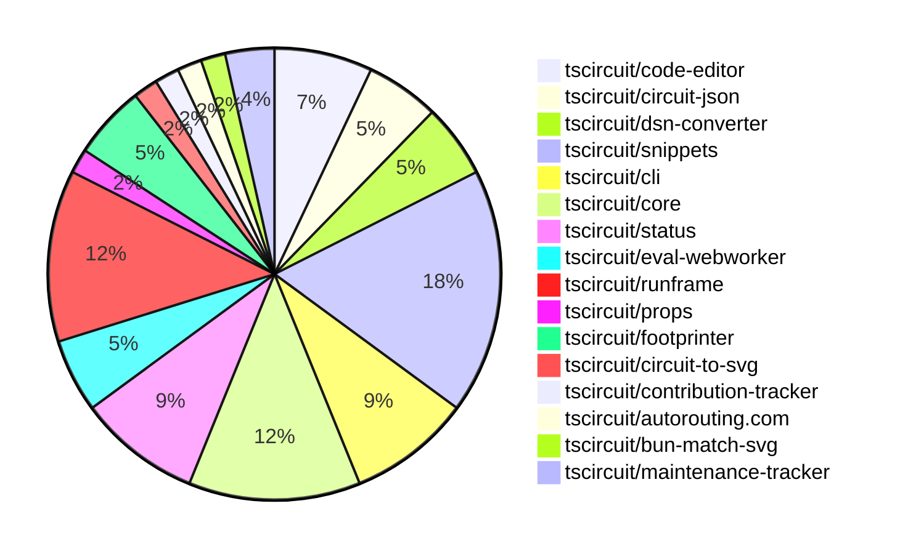

# contribution-tracker

Generates weekly contribution overviews for tscircuit contributors. Check out all
the [contribution overviews here](./contribution-overviews/)

* All PRs in the tscircuit org are scanned/summarized via Claude Haiku
* Claude classifies each Diff/PR as a Major, Minor or Tiny contribution
* All the PRs, summaries, and classifications are organized into charts and tables

The current week is shown below. There are 3 major sections:

* [Contributor Overview](#contributor-overview)
* [PRs by Repository](#prs-by-repository)
* [PRs by Contributor](#changes-by-contributor)

## Current Week

<!-- START_CURRENT_WEEK -->

# Contribution Overview 2025-01-15

## PRs by Repository

## Contributor Overview

| Contributor | 🐳 Major | 🐙 Minor | 🐌 Tiny | ⭐ | Issues Created |
|-------------|---------|---------|---------|-----|----------------|
| [seveibar](#seveibar) | 4 | 15 | 1 | 👑👑 | 72 |
| [imrishabh18](#imrishabh18) | 4 | 7 | 0 | ⭐⭐⭐ | 2 |
| [ShiboSoftwareDev](#ShiboSoftwareDev) | 0 | 5 | 1 | ⭐⭐⭐ | 13 |
| [Anshgrover23](#Anshgrover23) | 0 | 4 | 1 | ⭐⭐ | 2 |
| [Abse2001](#Abse2001) | 1 | 1 | 0 | ⭐⭐ | 3 |
| [kom-senapati](#kom-senapati) | 0 | 5 | 0 | ⭐ | 2 |
| [techmannih](#techmannih) | 0 | 4 | 0 | ⭐ | 0 |
| [ArnavK-09](#ArnavK-09) | 0 | 1 | 1 |  | 2 |
| [Ayushjhawar8](#Ayushjhawar8) | 0 | 0 | 1 |  | 0 |

## Review Table

[reviews-received-hover]: ## "Number of reviews received for PRs for this contributor"
[approvals-received-hover]: ## "Number of approvals received for PRs this contributor authored"
[rejections-received-hover]: ## "Number of rejections received for PRs this contributor authored"
[prs-opened-hover]: ## "Number of PRs opened by this contributor"
[issues-created-hover]: ## "Number of issues created by this contributor"
[bountied-issues-hover]: ## "Number of issues this contributor created with a bounty"
[bountied-issue-$-hover]: ## "Total bounty amount placed on issues authored by this contributor"

| Contributor | Reviews Received | Approvals Received | Rejections Received | Approvals | Rejections | PRs Opened | PRs Merged | Issues Created | Bountied Issues | Bountied Issue $ |
|---|---|---|---|---|---|---|---|---|---|---|
| [kom-senapati](#kom-senapati) | 12 | 6 | 3 | 0 | 0 | 7 | 5 | 2 | 1 | 2 |
| [seveibar](#seveibar) | 3 | 1 | 0 | 25 | 16 | 26 | 20 | 72 | 56 | 983 |
| [imrishabh18](#imrishabh18) | 7 | 2 | 0 | 4 | 7 | 15 | 11 | 2 | 2 | 15 |
| [techmannih](#techmannih) | 20 | 6 | 8 | 0 | 0 | 6 | 4 | 0 | 0 | 0 |
| [krushnarout](#krushnarout) | 8 | 0 | 1 | 0 | 0 | 1 | 0 | 0 | 0 | 0 |
| [ShiboSoftwareDev](#ShiboSoftwareDev) | 8 | 3 | 0 | 5 | 2 | 7 | 6 | 13 | 7 | 85 |
| [Anshgrover23](#Anshgrover23) | 18 | 7 | 4 | 0 | 7 | 9 | 6 | 2 | 1 | 10 |
| [Ayushjhawar8](#Ayushjhawar8) | 9 | 1 | 4 | 0 | 0 | 4 | 1 | 0 | 0 | 0 |
| [Abse2001](#Abse2001) | 5 | 3 | 0 | 0 | 1 | 2 | 2 | 3 | 3 | 20 |
| [Saurabhsing21](#Saurabhsing21) | 10 | 2 | 5 | 0 | 0 | 1 | 0 | 0 | 0 | 0 |
| [ArnavK-09](#ArnavK-09) | 7 | 2 | 2 | 0 | 0 | 6 | 2 | 2 | 0 | 0 |
| [B-Mustafa](#B-Mustafa) | 2 | 0 | 2 | 0 | 0 | 1 | 0 | 0 | 0 | 0 |
| [yashksaini-coder](#yashksaini-coder) | 13 | 1 | 4 | 0 | 0 | 1 | 0 | 0 | 0 | 0 |

## Changes by Repository

### [tscircuit/code-editor](https://github.com/tscircuit/code-editor)

| PR # | Impact | Contributor | Description |
|------|--------|-------------|-------------|
| [#8](https://github.com/tscircuit/code-editor/pull/8) | 🐳 Major | imrishabh18 | Adds setup for the ATA (Assisted Type Acquisition) and the TypeScript compiler in the browser, and initializes the code editor with the TypeScript compiler. |
| [#7](https://github.com/tscircuit/code-editor/pull/7) | 🐳 Major | imrishabh18 | Introduces state management, formats the code using Prettier, and ports the UI from snippets. |
| [#6](https://github.com/tscircuit/code-editor/pull/6) | 🐳 Major | imrishabh18 | Introduces a basic code editor with Cosmos + Vite and Twind integrated. |
| [#4](https://github.com/tscircuit/code-editor/pull/4) | 🐳 Major | imrishabh18 | This pull request introduces a basic setup for a new project, including configuration files for Bun build, test, and type checking workflows, a .gitignore file, and various dependencies and development tools. |

### [tscircuit/circuit-json](https://github.com/tscircuit/circuit-json)

| PR # | Impact | Contributor | Description |
|------|--------|-------------|-------------|
| [#123](https://github.com/tscircuit/circuit-json/pull/123) | 🐙 Minor | imrishabh18 | Adding missing `subcircuit_id` and `pcb_group_id` fields to the `pcb_smtpad` shape type. |
| [#122](https://github.com/tscircuit/circuit-json/pull/122) | 🐙 Minor | imrishabh18 | Add the `source_group_id` field to the `PcbGroup` type. |
| [#121](https://github.com/tscircuit/circuit-json/pull/121) | 🐙 Minor | seveibar | Adds subcircuit_id and pcb_group_id fields to various PCB-related elements. |

### [tscircuit/dsn-converter](https://github.com/tscircuit/dsn-converter)

| PR # | Impact | Contributor | Description |
|------|--------|-------------|-------------|
| [#80](https://github.com/tscircuit/dsn-converter/pull/80) | 🐙 Minor | imrishabh18 | Fix the plated_hole naming by appending the source_component_id to the component name. |
| [#79](https://github.com/tscircuit/dsn-converter/pull/79) | 🐙 Minor | imrishabh18 | Fix trace linkage issue. |
| [#78](https://github.com/tscircuit/dsn-converter/pull/78) | 🐙 Minor | imrishabh18 | Fixes a bug where subcircuits with the same component name were not being properly handled, by appending the source component ID to the component name. |

### [tscircuit/snippets](https://github.com/tscircuit/snippets)

| PR # | Impact | Contributor | Description |
|------|--------|-------------|-------------|
| [#586](https://github.com/tscircuit/snippets/pull/586) | 🐳 Major | seveibar | Integrates the RunFrame (Use Webworker Beta) feature, with some home page fixes. |
| [#571](https://github.com/tscircuit/snippets/pull/571) | 🐙 Minor | imrishabh18 | Reverts the update to the "@tscircuit/3d-viewer" dependency to the previous version "^0.0.94" due to a breakage in the code editor page. |
| [#578](https://github.com/tscircuit/snippets/pull/578) | 🐙 Minor | seveibar | Set up GitHub Actions workflow to publish the "fake-snippets-api" package to npm. |
| [#590](https://github.com/tscircuit/snippets/pull/590) | 🐙 Minor | ShiboSoftwareDev | Enables Terser minification in Vite configuration. |
| [#585](https://github.com/tscircuit/snippets/pull/585) | 🐙 Minor | ShiboSoftwareDev | Updated the `getFootprintNamesByType()` function to get the names of normal footprints. |
| [#552](https://github.com/tscircuit/snippets/pull/552) | 🐙 Minor | techmannih | Fixes the issue where fork errors are not being properly displayed to the user. |
| [#574](https://github.com/tscircuit/snippets/pull/574) | 🐙 Minor | techmannih | Improve error message for 3D model download when 3D viewer is not open |
| [#597](https://github.com/tscircuit/snippets/pull/597) | 🐙 Minor | Anshgrover23 | Fixes the cmd-click and editor tests by updating the snippet ID and text checks. |
| [#575](https://github.com/tscircuit/snippets/pull/575) | 🐙 Minor | Anshgrover23 | Fixes the GLTF downloader to use the correct file extension based on whether the download is binary or not. |
| [#583](https://github.com/tscircuit/snippets/pull/583) | 🐙 Minor | ArnavK-09 | Adds support for generating assembly images for code snippets. |

### [tscircuit/cli](https://github.com/tscircuit/cli)

| PR # | Impact | Contributor | Description |
|------|--------|-------------|-------------|
| [#34](https://github.com/tscircuit/cli/pull/34) | 🐙 Minor | imrishabh18 | Test added for few CLI commands (add, push, release, snapshot) |
| [#22](https://github.com/tscircuit/cli/pull/22) | 🐙 Minor | kom-senapati | Adds a simple test fixture for CLI and `tsci init` test |
| [#25](https://github.com/tscircuit/cli/pull/25) | 🐙 Minor | Anshgrover23 | Adds an alias for the `tsci auth login` command, allowing users to use `tsci login` as a shorthand. |
| [#26](https://github.com/tscircuit/cli/pull/26) | 🐌 Tiny | ShiboSoftwareDev | Fixed the `dev` script in the `package.json` file to use the correct file path for the example directory. |
| [#31](https://github.com/tscircuit/cli/pull/31) | 🐌 Tiny | ArnavK-09 | Adds a console log message to indicate that the server has refreshed after a file is saved. |

### [tscircuit/core](https://github.com/tscircuit/core)

| PR # | Impact | Contributor | Description |
|------|--------|-------------|-------------|
| [#531](https://github.com/tscircuit/core/pull/531) | 🐳 Major | seveibar | Introduces a new benchmarking server that runs benchmarks for the @tscircuit/core library and provides a UI to view historical performance data. |
| [#532](https://github.com/tscircuit/core/pull/532) | 🐳 Major | seveibar | Upgrades the project to use React 19 and updates the corresponding dependencies. |
| [#523](https://github.com/tscircuit/core/pull/523) | 🐳 Major | seveibar | Fixes an infinite loop issue in the creation of schematic trace crossing segments. |
| [#538](https://github.com/tscircuit/core/pull/538) | 🐙 Minor | seveibar | Adds a `subcircuit_id` property to the `Group` component and updates the `doInitialSourceRender` and `doInitialPcbComponentRender` methods to handle the new property. |
| [#534](https://github.com/tscircuit/core/pull/534) | 🐙 Minor | seveibar | Adds an MIT license to the project. |
| [#533](https://github.com/tscircuit/core/pull/533) | 🐙 Minor | seveibar | Adds support for React 18 by using a separate `react-reconciler-18` package and handling the differences in the update process between React 19 and React 18. |
| [#527](https://github.com/tscircuit/core/pull/527) | 🐙 Minor | techmannih | Automatically adds net labels when a chip-to-chip trace is detected. |

### [tscircuit/status](https://github.com/tscircuit/status)

| PR # | Impact | Contributor | Description |
|------|--------|-------------|-------------|
| [#19](https://github.com/tscircuit/status/pull/19) | 🐳 Major | Abse2001 | Switches the `check-autorouting-api-health.ts` script to use the `autorouting/jobs` endpoint instead of the `autorouting/solve` endpoint, adding support for polling the job status and retrieving the output. |
| [#16](https://github.com/tscircuit/status/pull/16) | 🐙 Minor | seveibar | Add a new health check for the Fly Registry API |
| [#18](https://github.com/tscircuit/status/pull/18) | 🐙 Minor | kom-senapati | Adds handling for missing data in the uptime graph component. |
| [#12](https://github.com/tscircuit/status/pull/12) | 🐙 Minor | kom-senapati | Change the UptimeGraph component to use the latest check for the services instead of the first check. |
| [#10](https://github.com/tscircuit/status/pull/10) | 🐙 Minor | kom-senapati | Introduces a status check for the "registry and bundling" endpoints, ensuring the health of the ESM, CJS, and NPM endpoints. |

### [tscircuit/eval-webworker](https://github.com/tscircuit/eval-webworker)

| PR # | Impact | Contributor | Description |
|------|--------|-------------|-------------|
| [#83](https://github.com/tscircuit/eval-webworker/pull/83) | 🐙 Minor | seveibar | Dynamically load the webworker blob instead of using a fixed URL |
| [#78](https://github.com/tscircuit/eval-webworker/pull/78) | 🐙 Minor | seveibar | Update to use CJS bundle registry URL |
| [#81](https://github.com/tscircuit/eval-webworker/pull/81) | 🐙 Minor | Anshgrover23 | Adds a `.kill()` function to the web worker to allow terminating the worker from the main thread. |

### [tscircuit/runframe](https://github.com/tscircuit/runframe)

| PR # | Impact | Contributor | Description |
|------|--------|-------------|-------------|
| [#162](https://github.com/tscircuit/runframe/pull/162) | 🐙 Minor | seveibar | Use the CDN for the webworker URL properly |
| [#159](https://github.com/tscircuit/runframe/pull/159) | 🐙 Minor | seveibar | Adds an empty state for the render log viewer and shows progress even when the render logs tab is not open. Also, updates the eval webworker to get math-utils support. |
| [#157](https://github.com/tscircuit/runframe/pull/157) | 🐙 Minor | seveibar | Adds an empty state for the render log viewer and shows progress even if not on the render log page. |
| [#154](https://github.com/tscircuit/runframe/pull/154) | 🐙 Minor | seveibar | Fix PCB Viewer to update whenever circuit JSON changes, and fix re-running without run button |
| [#150](https://github.com/tscircuit/runframe/pull/150) | 🐙 Minor | seveibar | Add support for showing a run button in the CircuitJsonPreview component |
| [#149](https://github.com/tscircuit/runframe/pull/149) | 🐙 Minor | seveibar | Adds Tailwind prefix, improves build system in dev, and fixes minor issues with the circuit JSON viewer and BOM table. |
| [#139](https://github.com/tscircuit/runframe/pull/139) | 🐙 Minor | seveibar | Adds a render timings bar to the render log view and allows sorting of render phases by duration or chronological order. |

### [tscircuit/props](https://github.com/tscircuit/props)

| PR # | Impact | Contributor | Description |
|------|--------|-------------|-------------|
| [#146](https://github.com/tscircuit/props/pull/146) | 🐌 Tiny | seveibar | Add a `key` prop to the `BaseGroupProps` interface and extend the `baseGroupProps` to include the `key` prop. |

### [tscircuit/footprinter](https://github.com/tscircuit/footprinter)

| PR # | Impact | Contributor | Description |
|------|--------|-------------|-------------|
| [#113](https://github.com/tscircuit/footprinter/pull/113) | 🐙 Minor | ShiboSoftwareDev | Adds a new function `getFootprintSizes` that returns the supported footprint sizes. |
| [#112](https://github.com/tscircuit/footprinter/pull/112) | 🐙 Minor | ShiboSoftwareDev | Renames the properties `passiveFootprints` and `normalFootprints` to `passiveFootprintNames` and `normalFootprintNames` in the `getFootprintNamesByType` function. |
| [#111](https://github.com/tscircuit/footprinter/pull/111) | 🐙 Minor | ShiboSoftwareDev | Adds a new function `getFootprintNamesByType` that returns an object with two properties: `passiveFootprints` and `normalFootprints`, which contain the names of passive and non-passive footprints, respectively. |

### [tscircuit/circuit-to-svg](https://github.com/tscircuit/circuit-to-svg)

| PR # | Impact | Contributor | Description |
|------|--------|-------------|-------------|
| [#161](https://github.com/tscircuit/circuit-to-svg/pull/161) | 🐙 Minor | techmannih | Fixes the fill color of the schematic net label to be semi-transparent white. |

### [tscircuit/contribution-tracker](https://github.com/tscircuit/contribution-tracker)

| PR # | Impact | Contributor | Description |
|------|--------|-------------|-------------|
| [#36](https://github.com/tscircuit/contribution-tracker/pull/36) | 🐌 Tiny | Ayushjhawar8 | Changes the terminology from "Approvals" to "Approval Sent" in the README.md file. |

### [tscircuit/autorouting.com](https://github.com/tscircuit/autorouting.com)

| PR # | Impact | Contributor | Description |
|------|--------|-------------|-------------|
| [#28](https://github.com/tscircuit/autorouting.com/pull/28) | 🐙 Minor | Abse2001 | Adds `delete_file` and `update_file` sample endpoints and a `create-package-json` function for the dataset download command. |

### [tscircuit/bun-match-svg](https://github.com/tscircuit/bun-match-svg)

| PR # | Impact | Contributor | Description |
|------|--------|-------------|-------------|
| [#7](https://github.com/tscircuit/bun-match-svg/pull/7) | 🐙 Minor | kom-senapati | Fix the `init` command by removing unnecessary imports and arguments. |

### [tscircuit/maintenance-tracker](https://github.com/tscircuit/maintenance-tracker)

| PR # | Impact | Contributor | Description |
|------|--------|-------------|-------------|
| [#7](https://github.com/tscircuit/maintenance-tracker/pull/7) | 🐌 Tiny | Anshgrover23 | Updates the `bun.lockb` file |
| [#6](https://github.com/tscircuit/maintenance-tracker/pull/6) | 🟣 | Anshgrover23 |  |

## Changes by Contributor

### [imrishabh18](https://github.com/imrishabh18)

| PR # | Impact | Description |
|------|--------|-------------|
| [#8](https://github.com/tscircuit/code-editor/pull/8) | 🐳 Major | Adds setup for the ATA (Assisted Type Acquisition) and the TypeScript compiler in the browser, and initializes the code editor with the TypeScript compiler. |
| [#7](https://github.com/tscircuit/code-editor/pull/7) | 🐳 Major | Introduces state management, formats the code using Prettier, and ports the UI from snippets. |
| [#6](https://github.com/tscircuit/code-editor/pull/6) | 🐳 Major | Introduces a basic code editor with Cosmos + Vite and Twind integrated. |
| [#4](https://github.com/tscircuit/code-editor/pull/4) | 🐳 Major | This pull request introduces a basic setup for a new project, including configuration files for Bun build, test, and type checking workflows, a .gitignore file, and various dependencies and development tools. |
| [#123](https://github.com/tscircuit/circuit-json/pull/123) | 🐙 Minor | Adding missing `subcircuit_id` and `pcb_group_id` fields to the `pcb_smtpad` shape type. |
| [#122](https://github.com/tscircuit/circuit-json/pull/122) | 🐙 Minor | Add the `source_group_id` field to the `PcbGroup` type. |
| [#80](https://github.com/tscircuit/dsn-converter/pull/80) | 🐙 Minor | Fix the plated_hole naming by appending the source_component_id to the component name. |
| [#79](https://github.com/tscircuit/dsn-converter/pull/79) | 🐙 Minor | Fix trace linkage issue. |
| [#78](https://github.com/tscircuit/dsn-converter/pull/78) | 🐙 Minor | Fixes a bug where subcircuits with the same component name were not being properly handled, by appending the source component ID to the component name. |
| [#571](https://github.com/tscircuit/snippets/pull/571) | 🐙 Minor | Reverts the update to the "@tscircuit/3d-viewer" dependency to the previous version "^0.0.94" due to a breakage in the code editor page. |
| [#34](https://github.com/tscircuit/cli/pull/34) | 🐙 Minor | Test added for few CLI commands (add, push, release, snapshot) |

### [seveibar](https://github.com/seveibar)

| PR # | Impact | Description |
|------|--------|-------------|
| [#531](https://github.com/tscircuit/core/pull/531) | 🐳 Major | Introduces a new benchmarking server that runs benchmarks for the @tscircuit/core library and provides a UI to view historical performance data. |
| [#532](https://github.com/tscircuit/core/pull/532) | 🐳 Major | Upgrades the project to use React 19 and updates the corresponding dependencies. |
| [#523](https://github.com/tscircuit/core/pull/523) | 🐳 Major | Fixes an infinite loop issue in the creation of schematic trace crossing segments. |
| [#586](https://github.com/tscircuit/snippets/pull/586) | 🐳 Major | Integrates the RunFrame (Use Webworker Beta) feature, with some home page fixes. |
| [#121](https://github.com/tscircuit/circuit-json/pull/121) | 🐙 Minor | Adds subcircuit_id and pcb_group_id fields to various PCB-related elements. |
| [#538](https://github.com/tscircuit/core/pull/538) | 🐙 Minor | Adds a `subcircuit_id` property to the `Group` component and updates the `doInitialSourceRender` and `doInitialPcbComponentRender` methods to handle the new property. |
| [#534](https://github.com/tscircuit/core/pull/534) | 🐙 Minor | Adds an MIT license to the project. |
| [#533](https://github.com/tscircuit/core/pull/533) | 🐙 Minor | Adds support for React 18 by using a separate `react-reconciler-18` package and handling the differences in the update process between React 19 and React 18. |
| [#578](https://github.com/tscircuit/snippets/pull/578) | 🐙 Minor | Set up GitHub Actions workflow to publish the "fake-snippets-api" package to npm. |
| [#16](https://github.com/tscircuit/status/pull/16) | 🐙 Minor | Add a new health check for the Fly Registry API |
| [#83](https://github.com/tscircuit/eval-webworker/pull/83) | 🐙 Minor | Dynamically load the webworker blob instead of using a fixed URL |
| [#78](https://github.com/tscircuit/eval-webworker/pull/78) | 🐙 Minor | Update to use CJS bundle registry URL |
| [#162](https://github.com/tscircuit/runframe/pull/162) | 🐙 Minor | Use the CDN for the webworker URL properly |
| [#159](https://github.com/tscircuit/runframe/pull/159) | 🐙 Minor | Adds an empty state for the render log viewer and shows progress even when the render logs tab is not open. Also, updates the eval webworker to get math-utils support. |
| [#157](https://github.com/tscircuit/runframe/pull/157) | 🐙 Minor | Adds an empty state for the render log viewer and shows progress even if not on the render log page. |
| [#154](https://github.com/tscircuit/runframe/pull/154) | 🐙 Minor | Fix PCB Viewer to update whenever circuit JSON changes, and fix re-running without run button |
| [#150](https://github.com/tscircuit/runframe/pull/150) | 🐙 Minor | Add support for showing a run button in the CircuitJsonPreview component |
| [#149](https://github.com/tscircuit/runframe/pull/149) | 🐙 Minor | Adds Tailwind prefix, improves build system in dev, and fixes minor issues with the circuit JSON viewer and BOM table. |
| [#139](https://github.com/tscircuit/runframe/pull/139) | 🐙 Minor | Adds a render timings bar to the render log view and allows sorting of render phases by duration or chronological order. |
| [#146](https://github.com/tscircuit/props/pull/146) | 🐌 Tiny | Add a `key` prop to the `BaseGroupProps` interface and extend the `baseGroupProps` to include the `key` prop. |

### [ShiboSoftwareDev](https://github.com/ShiboSoftwareDev)

| PR # | Impact | Description |
|------|--------|-------------|
| [#113](https://github.com/tscircuit/footprinter/pull/113) | 🐙 Minor | Adds a new function `getFootprintSizes` that returns the supported footprint sizes. |
| [#112](https://github.com/tscircuit/footprinter/pull/112) | 🐙 Minor | Renames the properties `passiveFootprints` and `normalFootprints` to `passiveFootprintNames` and `normalFootprintNames` in the `getFootprintNamesByType` function. |
| [#111](https://github.com/tscircuit/footprinter/pull/111) | 🐙 Minor | Adds a new function `getFootprintNamesByType` that returns an object with two properties: `passiveFootprints` and `normalFootprints`, which contain the names of passive and non-passive footprints, respectively. |
| [#590](https://github.com/tscircuit/snippets/pull/590) | 🐙 Minor | Enables Terser minification in Vite configuration. |
| [#585](https://github.com/tscircuit/snippets/pull/585) | 🐙 Minor | Updated the `getFootprintNamesByType()` function to get the names of normal footprints. |
| [#26](https://github.com/tscircuit/cli/pull/26) | 🐌 Tiny | Fixed the `dev` script in the `package.json` file to use the correct file path for the example directory. |

### [techmannih](https://github.com/techmannih)

| PR # | Impact | Description |
|------|--------|-------------|
| [#527](https://github.com/tscircuit/core/pull/527) | 🐙 Minor | Automatically adds net labels when a chip-to-chip trace is detected. |
| [#161](https://github.com/tscircuit/circuit-to-svg/pull/161) | 🐙 Minor | Fixes the fill color of the schematic net label to be semi-transparent white. |
| [#552](https://github.com/tscircuit/snippets/pull/552) | 🐙 Minor | Fixes the issue where fork errors are not being properly displayed to the user. |
| [#574](https://github.com/tscircuit/snippets/pull/574) | 🐙 Minor | Improve error message for 3D model download when 3D viewer is not open |

### [Ayushjhawar8](https://github.com/Ayushjhawar8)

| PR # | Impact | Description |
|------|--------|-------------|
| [#36](https://github.com/tscircuit/contribution-tracker/pull/36) | 🐌 Tiny | Changes the terminology from "Approvals" to "Approval Sent" in the README.md file. |

### [Abse2001](https://github.com/Abse2001)

| PR # | Impact | Description |
|------|--------|-------------|
| [#19](https://github.com/tscircuit/status/pull/19) | 🐳 Major | Switches the `check-autorouting-api-health.ts` script to use the `autorouting/jobs` endpoint instead of the `autorouting/solve` endpoint, adding support for polling the job status and retrieving the output. |
| [#28](https://github.com/tscircuit/autorouting.com/pull/28) | 🐙 Minor | Adds `delete_file` and `update_file` sample endpoints and a `create-package-json` function for the dataset download command. |

### [kom-senapati](https://github.com/kom-senapati)

| PR # | Impact | Description |
|------|--------|-------------|
| [#7](https://github.com/tscircuit/bun-match-svg/pull/7) | 🐙 Minor | Fix the `init` command by removing unnecessary imports and arguments. |
| [#18](https://github.com/tscircuit/status/pull/18) | 🐙 Minor | Adds handling for missing data in the uptime graph component. |
| [#12](https://github.com/tscircuit/status/pull/12) | 🐙 Minor | Change the UptimeGraph component to use the latest check for the services instead of the first check. |
| [#10](https://github.com/tscircuit/status/pull/10) | 🐙 Minor | Introduces a status check for the "registry and bundling" endpoints, ensuring the health of the ESM, CJS, and NPM endpoints. |
| [#22](https://github.com/tscircuit/cli/pull/22) | 🐙 Minor | Adds a simple test fixture for CLI and `tsci init` test |

### [Anshgrover23](https://github.com/Anshgrover23)

| PR # | Impact | Description |
|------|--------|-------------|
| [#597](https://github.com/tscircuit/snippets/pull/597) | 🐙 Minor | Fixes the cmd-click and editor tests by updating the snippet ID and text checks. |
| [#575](https://github.com/tscircuit/snippets/pull/575) | 🐙 Minor | Fixes the GLTF downloader to use the correct file extension based on whether the download is binary or not. |
| [#81](https://github.com/tscircuit/eval-webworker/pull/81) | 🐙 Minor | Adds a `.kill()` function to the web worker to allow terminating the worker from the main thread. |
| [#25](https://github.com/tscircuit/cli/pull/25) | 🐙 Minor | Adds an alias for the `tsci auth login` command, allowing users to use `tsci login` as a shorthand. |
| [#7](https://github.com/tscircuit/maintenance-tracker/pull/7) | 🐌 Tiny | Updates the `bun.lockb` file |
| [#6](https://github.com/tscircuit/maintenance-tracker/pull/6) | 🟣 |  |

### [ArnavK-09](https://github.com/ArnavK-09)

| PR # | Impact | Description |
|------|--------|-------------|
| [#583](https://github.com/tscircuit/snippets/pull/583) | 🐙 Minor | Adds support for generating assembly images for code snippets. |
| [#31](https://github.com/tscircuit/cli/pull/31) | 🐌 Tiny | Adds a console log message to indicate that the server has refreshed after a file is saved. |

<!-- END_CURRENT_WEEK -->
