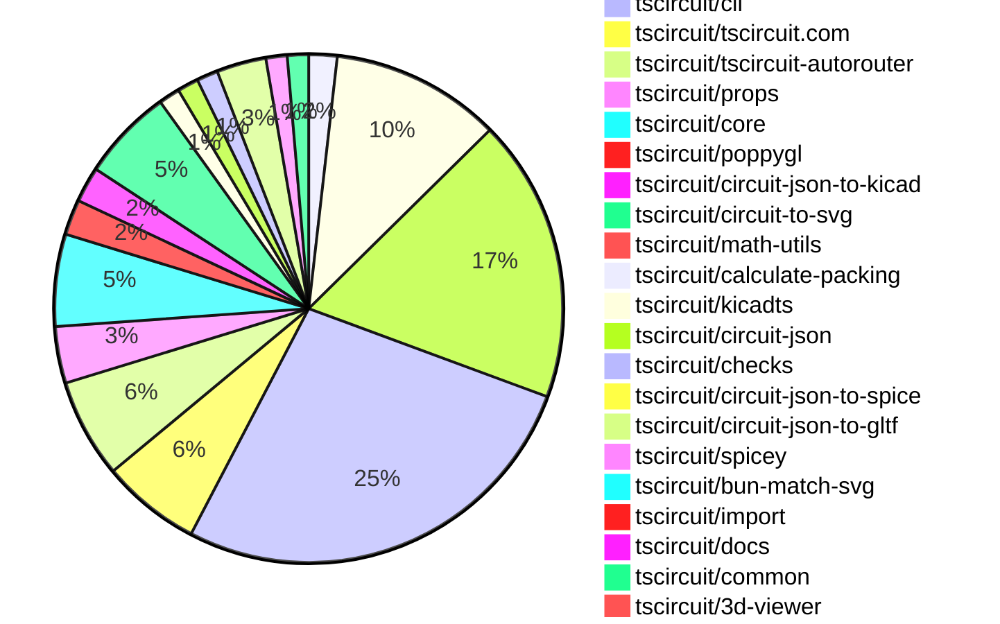
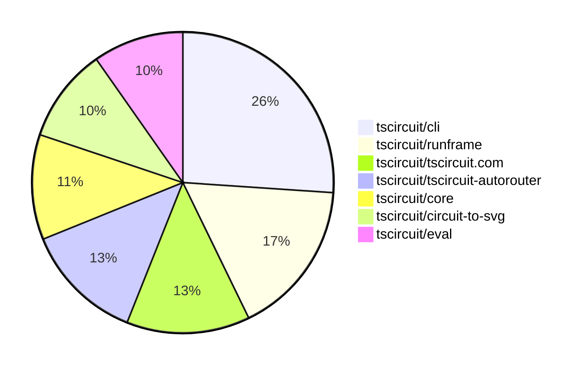

# contribution-tracker

[contributions.tscircuit.com](https://contributions.tscircuit.com) ・ [tscircuit.com](https://tscircuit.com) ・ [Contribution Overviews](./contribution-overviews/) ・ [Changelogs](./changelogs/)

Generates weekly contribution overviews for tscircuit contributors. Check out all
the [contribution overviews here](./contribution-overviews/)
You can find AI-generated monthly changelogs in the [changelogs directory](./changelogs/).

- All PRs in the tscircuit org are scanned/summarized via an LLM
- The LLM classifies each Diff/PR as into a set of attributes for scoring
- All the PRs, summaries, and classifications are organized into charts and tables for [the website](https://contributions.tscircuit.com)

> Want to run locally? See the [Development Section](#development)

The current week is shown below. There are 3 major sections:

- [Contributor Overview](#contributor-overview)
- [PRs by Repository](#prs-by-repository)
- [PRs by Contributor](#changes-by-contributor)

## Current Week

<!-- START_CURRENT_WEEK -->

# Contribution Overview 2025-10-01

## PRs by Repository



## Contributor Overview

| Contributor | 🐳 Major | 🐙 Minor | 🐌 Tiny | ⭐ | Score | Discussion Contributions |
|-------------|---------|---------|---------|-----|----------------|--------------------------|
| [seveibar](#seveibar) | 16 | 21 | 28 | 👑👑 | 99 | 0🔹 0🔶 0💎 |
| [imrishabh18](#imrishabh18) | 3 | 8 | 6 | ⭐⭐⭐ | 42 | 0🔹 0🔶 0💎 |
| [ShiboSoftwareDev](#ShiboSoftwareDev) | 2 | 5 | 3 | ⭐⭐ | 20.5 | 0🔹 0🔶 0💎 |
| [ArnavK-09](#ArnavK-09) | 2 | 5 | 0 | ⭐⭐ | 19 | 0🔹 0🔶 0💎 |
| [0hmX](#0hmX) | 1 | 5 | 3 | ⭐⭐ | 17 | 0🔹 0🔶 0💎 |
| [tscircuitbot](#tscircuitbot) | 0 | 0 | 116 | ⭐⭐ | 16.5 | 0🔹 0🔶 0💎 |
| [MustafaMulla29](#MustafaMulla29) | 0 | 4 | 1 | ⭐ | 9 | 0🔹 0🔶 0💎 |
| [Abse2001](#Abse2001) | 1 | 1 | 1 | ⭐ | 8 | 0🔹 0🔶 0💎 |
| [pxlpal](#pxlpal) | 1 | 0 | 0 | ⭐ | 4 | 0🔹 0🔶 0💎 |
| [techmannih](#techmannih) | 0 | 1 | 0 |  | 2 | 0🔹 0🔶 0💎 |
| [Ayushjhawar8](#Ayushjhawar8) | 0 | 0 | 2 |  | 2 | 0🔹 0🔶 0💎 |
| [jayantpranjal0](#jayantpranjal0) | 0 | 0 | 1 |  | 1 | 0🔹 0🔶 0💎 |

### Discussion Contribution Legend

- 🔹 Normal Comments: Basic participation with minimal effort
- 🔶 Great Informative Comments: Thoughtful participation that adds value
- 💎 Incredible Comments: Exceptional participation with high-quality content

## Review Table

[reviews-received-hover]: ## "Number of reviews received for PRs for this contributor"
[approvals-received-hover]: ## "Number of approvals received for PRs this contributor authored"
[rejections-received-hover]: ## "Number of rejections received for PRs this contributor authored"
[prs-opened-hover]: ## "Number of PRs opened by this contributor"
[issues-created-hover]: ## "Number of issues created by this contributor"
[bountied-issues-hover]: ## "Number of issues this contributor created with a bounty"
[bountied-issue-$-hover]: ## "Total bounty amount placed on issues authored by this contributor"

| Contributor | Reviews Received | Approvals Received | Rejections Received | Approvals | Rejections | PRs Opened | PRs Merged | Score | Issues Created | Bountied Issues | Bountied Issue $ |
|---|---|---|---|---|---|---|---|---|---|---|---|
| [Priyanshuthapliyal2005](#Priyanshuthapliyal2005) | 0 | 0 | 0 | 0 | 0 | 4 | 0 | 0 | 0 | 0 | 0 |
| [naaa760](#naaa760) | 0 | 0 | 0 | 0 | 0 | 6 | 0 | 0 | 0 | 0 | 0 |
| [tscircuitbot](#tscircuitbot) | 0 | 0 | 0 | 0 | 0 | 146 | 116 | 16.5 | 0 | 0 | 0 |
| [imrishabh18](#imrishabh18) | 11 | 9 | 0 | 3 | 4 | 18 | 17 | 42 | 0 | 0 | 0 |
| [seveibar](#seveibar) | 42 | 0 | 0 | 49 | 9 | 87 | 65 | 99 | 0 | 0 | 0 |
| [jayantpranjal0](#jayantpranjal0) | 5 | 0 | 0 | 0 | 0 | 5 | 1 | 1 | 0 | 0 | 0 |
| [Quanta-Naut](#Quanta-Naut) | 16 | 0 | 2 | 0 | 0 | 2 | 0 | 0 | 0 | 0 | 0 |
| [Abse2001](#Abse2001) | 4 | 3 | 0 | 1 | 0 | 4 | 3 | 8 | 0 | 0 | 0 |
| [techmannih](#techmannih) | 2 | 1 | 0 | 0 | 0 | 1 | 1 | 2 | 0 | 0 | 0 |
| [ShiboSoftwareDev](#ShiboSoftwareDev) | 12 | 11 | 0 | 0 | 0 | 11 | 10 | 20.5 | 0 | 0 | 0 |
| [Excellencedev](#Excellencedev) | 9 | 0 | 1 | 0 | 0 | 8 | 0 | 0 | 0 | 0 | 0 |
| [MustafaMulla29](#MustafaMulla29) | 25 | 7 | 3 | 0 | 0 | 7 | 5 | 9 | 0 | 0 | 0 |
| [ArnavK-09](#ArnavK-09) | 9 | 7 | 0 | 1 | 0 | 7 | 7 | 19 | 0 | 0 | 0 |
| [Omar8345](#Omar8345) | 0 | 0 | 0 | 0 | 0 | 1 | 0 | 0 | 0 | 0 | 0 |
| [Sanjay-Kirti](#Sanjay-Kirti) | 4 | 0 | 0 | 0 | 0 | 1 | 0 | 0 | 0 | 0 | 0 |
| [saish9901](#saish9901) | 2 | 0 | 1 | 0 | 0 | 1 | 0 | 0 | 0 | 0 | 0 |
| [0hmX](#0hmX) | 12 | 11 | 0 | 0 | 0 | 11 | 9 | 17 | 0 | 0 | 0 |
| [nailoo](#nailoo) | 4 | 0 | 1 | 0 | 0 | 3 | 0 | 0 | 0 | 0 | 0 |
| [baeoc](#baeoc) | 1 | 0 | 1 | 0 | 0 | 5 | 0 | 0 | 0 | 0 | 0 |
| [Ayushjhawar8](#Ayushjhawar8) | 4 | 2 | 2 | 0 | 0 | 4 | 2 | 2 | 0 | 0 | 0 |
| [pxlpal](#pxlpal) | 4 | 3 | 1 | 0 | 0 | 4 | 1 | 4 | 0 | 0 | 0 |
| [RaghavArora14](#RaghavArora14) | 0 | 0 | 0 | 0 | 0 | 3 | 0 | 0 | 0 | 0 | 0 |
| [1914Jegx](#1914Jegx) | 1 | 0 | 1 | 0 | 0 | 2 | 0 | 0 | 0 | 0 | 0 |

## Top 7 Repositories by Contribution Points



## Changes by Repository

### [tscircuit/tscircuit](https://github.com/tscircuit/tscircuit)


<details>
<summary>🐌 Tiny Contributions (4)</summary>

| PR # | Impact | Contributor | Description |
|------|--------|-------------|-------------|
| [#894](https://github.com/tscircuit/tscircuit/pull/894) | 🐌 Tiny | tscircuitbot | Automated package update |
| [#892](https://github.com/tscircuit/tscircuit/pull/892) | 🐌 Tiny | tscircuitbot | Automated package update |
| [#893](https://github.com/tscircuit/tscircuit/pull/893) | 🐌 Tiny | imrishabh18 | Updates the CLI dependency version from 0.1.259 to 0.1.262 in package.json |
| [#891](https://github.com/tscircuit/tscircuit/pull/891) | 🐌 Tiny | imrishabh18 | Updates the CLI dependency version from 0.1.253 to 0.1.259 in package.json |

</details>

### [tscircuit/eval](https://github.com/tscircuit/eval)

| PR # | Impact | Rating | Contributor | Description |
|------|--------|--------|-------------|-------------|
| [#1168](https://github.com/tscircuit/eval/pull/1168) | 🐙 Minor | ⭐⭐ | ArnavK-09 | Removes outdated KiCad logic and unused footprint parsing code from the project. |

<details>
<summary>🐌 Tiny Contributions (23)</summary>

| PR # | Impact | Contributor | Description |
|------|--------|-------------|-------------|
| [#1185](https://github.com/tscircuit/eval/pull/1185) | 🐌 Tiny | tscircuitbot | Automated package update |
| [#1184](https://github.com/tscircuit/eval/pull/1184) | 🐌 Tiny | tscircuitbot | Automated package update |
| [#1182](https://github.com/tscircuit/eval/pull/1182) | 🐌 Tiny | tscircuitbot | Automated package update |
| [#1181](https://github.com/tscircuit/eval/pull/1181) | 🐌 Tiny | tscircuitbot | Updates package dependencies to their latest versions in package.json |
| [#1180](https://github.com/tscircuit/eval/pull/1180) | 🐌 Tiny | tscircuitbot | Automated package update |
| [#1178](https://github.com/tscircuit/eval/pull/1178) | 🐌 Tiny | tscircuitbot | Automated package update to version 0.0.363 |
| [#1176](https://github.com/tscircuit/eval/pull/1176) | 🐌 Tiny | tscircuitbot | Automated package update |
| [#1175](https://github.com/tscircuit/eval/pull/1175) | 🐌 Tiny | tscircuitbot | Automated package update |
| [#1174](https://github.com/tscircuit/eval/pull/1174) | 🐌 Tiny | tscircuitbot | Automated package update |
| [#1172](https://github.com/tscircuit/eval/pull/1172) | 🐌 Tiny | tscircuitbot | Automated package update |
| [#1171](https://github.com/tscircuit/eval/pull/1171) | 🐌 Tiny | tscircuitbot | Automated package update |
| [#1169](https://github.com/tscircuit/eval/pull/1169) | 🐌 Tiny | tscircuitbot | Automated package update |
| [#1167](https://github.com/tscircuit/eval/pull/1167) | 🐌 Tiny | tscircuitbot | Automated package update |
| [#1165](https://github.com/tscircuit/eval/pull/1165) | 🐌 Tiny | tscircuitbot | Updates package dependencies to their latest versions as part of routine maintenance. |
| [#1164](https://github.com/tscircuit/eval/pull/1164) | 🐌 Tiny | tscircuitbot | Automated package update |
| [#1162](https://github.com/tscircuit/eval/pull/1162) | 🐌 Tiny | tscircuitbot | Updates the version of the tscircuitcore package from 0.0.756 to 0.0.757 in package.json |
| [#1160](https://github.com/tscircuit/eval/pull/1160) | 🐌 Tiny | tscircuitbot | Automated package update |
| [#1158](https://github.com/tscircuit/eval/pull/1158) | 🐌 Tiny | tscircuitbot | Updates the version of several development dependencies in the package.json file. |
| [#1159](https://github.com/tscircuit/eval/pull/1159) | 🐌 Tiny | tscircuitbot | Automated package update |
| [#1157](https://github.com/tscircuit/eval/pull/1157) | 🐌 Tiny | tscircuitbot | Automated package update |
| [#1156](https://github.com/tscircuit/eval/pull/1156) | 🐌 Tiny | tscircuitbot | Automated package update |
| [#1155](https://github.com/tscircuit/eval/pull/1155) | 🐌 Tiny | tscircuitbot | Automated package update |
| [#1179](https://github.com/tscircuit/eval/pull/1179) | 🐌 Tiny | seveibar | Adds the built dist directory to the package.json files array for publishing. |

</details>

### [tscircuit/runframe](https://github.com/tscircuit/runframe)

| PR # | Impact | Rating | Contributor | Description |
|------|--------|--------|-------------|-------------|
| [#1314](https://github.com/tscircuit/runframe/pull/1314) | 🐳 Major | ⭐⭐⭐ | seveibar | Add an option to export pinout diagrams as SVG files in the export menu. |

<details>
<summary>🐌 Tiny Contributions (39)</summary>

| PR # | Impact | Contributor | Description |
|------|--------|-------------|-------------|
| [#1342](https://github.com/tscircuit/runframe/pull/1342) | 🐌 Tiny | tscircuitbot | Automated package update |
| [#1341](https://github.com/tscircuit/runframe/pull/1341) | 🐌 Tiny | tscircuitbot | Automated package update |
| [#1340](https://github.com/tscircuit/runframe/pull/1340) | 🐌 Tiny | tscircuitbot | Updates the tscircuiteval package from version 0.0.365 to 0.0.366 |
| [#1338](https://github.com/tscircuit/runframe/pull/1338) | 🐌 Tiny | tscircuitbot | Automated package update to version 0.0.1052 |
| [#1337](https://github.com/tscircuit/runframe/pull/1337) | 🐌 Tiny | tscircuitbot | Updates the tscircuiteval package from version 0.0.364 to 0.0.365 |
| [#1336](https://github.com/tscircuit/runframe/pull/1336) | 🐌 Tiny | tscircuitbot | Updates the tscircuiteval package from version 0.0.364 to 0.0.365 |
| [#1334](https://github.com/tscircuit/runframe/pull/1334) | 🐌 Tiny | tscircuitbot | Automated package update |
| [#1333](https://github.com/tscircuit/runframe/pull/1333) | 🐌 Tiny | tscircuitbot | Updates the tscircuiteval package to version 0.0.364 |
| [#1332](https://github.com/tscircuit/runframe/pull/1332) | 🐌 Tiny | tscircuitbot | Updates the tscircuiteval package to version 0.0.364 |
| [#1330](https://github.com/tscircuit/runframe/pull/1330) | 🐌 Tiny | tscircuitbot | Automated package update |
| [#1329](https://github.com/tscircuit/runframe/pull/1329) | 🐌 Tiny | tscircuitbot | Updates the tscircuiteval package to version 0.0.363 in the package.json file. |
| [#1328](https://github.com/tscircuit/runframe/pull/1328) | 🐌 Tiny | tscircuitbot | Updates the tscircuiteval package to version 0.0.363 |
| [#1326](https://github.com/tscircuit/runframe/pull/1326) | 🐌 Tiny | tscircuitbot | Automated package update |
| [#1325](https://github.com/tscircuit/runframe/pull/1325) | 🐌 Tiny | tscircuitbot | Updates the tscircuiteval package to version 0.0.362 |
| [#1324](https://github.com/tscircuit/runframe/pull/1324) | 🐌 Tiny | tscircuitbot | Updates the tscircuiteval package from version 0.0.361 to 0.0.362 |
| [#1322](https://github.com/tscircuit/runframe/pull/1322) | 🐌 Tiny | tscircuitbot | Updates the package version from 0.0.1042 to 0.0.1044 in package.json |
| [#1321](https://github.com/tscircuit/runframe/pull/1321) | 🐌 Tiny | tscircuitbot | Updates the tscircuiteval package to version 0.0.361 in the package.json file. |
| [#1320](https://github.com/tscircuit/runframe/pull/1320) | 🐌 Tiny | tscircuitbot | Updates the tscircuiteval package to version 0.0.361 |
| [#1318](https://github.com/tscircuit/runframe/pull/1318) | 🐌 Tiny | tscircuitbot | Automated package update |
| [#1317](https://github.com/tscircuit/runframe/pull/1317) | 🐌 Tiny | tscircuitbot | Automated package update |
| [#1316](https://github.com/tscircuit/runframe/pull/1316) | 🐌 Tiny | tscircuitbot | Updates the tscircuiteval package from version 0.0.359 to 0.0.360 |
| [#1315](https://github.com/tscircuit/runframe/pull/1315) | 🐌 Tiny | tscircuitbot | Automated package update |
| [#1312](https://github.com/tscircuit/runframe/pull/1312) | 🐌 Tiny | tscircuitbot | Automated package update |
| [#1311](https://github.com/tscircuit/runframe/pull/1311) | 🐌 Tiny | tscircuitbot | Updates the tscircuiteval package to version 0.0.359 in the package.json file. |
| [#1310](https://github.com/tscircuit/runframe/pull/1310) | 🐌 Tiny | tscircuitbot | Updates the tscircuiteval package to version 0.0.359 in the package.json file. |
| [#1308](https://github.com/tscircuit/runframe/pull/1308) | 🐌 Tiny | tscircuitbot | Automated package update |
| [#1307](https://github.com/tscircuit/runframe/pull/1307) | 🐌 Tiny | tscircuitbot | Updates the tscircuiteval package to version 0.0.358 in the package.json file. |
| [#1306](https://github.com/tscircuit/runframe/pull/1306) | 🐌 Tiny | tscircuitbot | Updates the tscircuiteval package from version 0.0.357 to 0.0.358 |
| [#1303](https://github.com/tscircuit/runframe/pull/1303) | 🐌 Tiny | tscircuitbot | Automated package update |
| [#1302](https://github.com/tscircuit/runframe/pull/1302) | 🐌 Tiny | tscircuitbot | Updates the tscircuiteval package to version 0.0.357 in the package.json file. |
| [#1301](https://github.com/tscircuit/runframe/pull/1301) | 🐌 Tiny | tscircuitbot | Updates the tscircuiteval package to version 0.0.357 in the package.json file. |
| [#1300](https://github.com/tscircuit/runframe/pull/1300) | 🐌 Tiny | tscircuitbot | Automated package update |
| [#1299](https://github.com/tscircuit/runframe/pull/1299) | 🐌 Tiny | tscircuitbot | Updates the tscircuiteval package from version 0.0.355 to 0.0.356 |
| [#1298](https://github.com/tscircuit/runframe/pull/1298) | 🐌 Tiny | tscircuitbot | Updates the tscircuiteval package to version 0.0.355 in the package.json file. |
| [#1296](https://github.com/tscircuit/runframe/pull/1296) | 🐌 Tiny | tscircuitbot | Automated package update to version 0.0.1033 |
| [#1295](https://github.com/tscircuit/runframe/pull/1295) | 🐌 Tiny | tscircuitbot | Updates the tscircuit3d-viewer package from version 0.0.405 to 0.0.406 |
| [#1294](https://github.com/tscircuit/runframe/pull/1294) | 🐌 Tiny | tscircuitbot | Automated package update |
| [#1293](https://github.com/tscircuit/runframe/pull/1293) | 🐌 Tiny | tscircuitbot | Updates the tscircuit3d-viewer package to version 0.0.405 in package.json |
| [#1297](https://github.com/tscircuit/runframe/pull/1297) | 🐌 Tiny | seveibar | Adds functionality to export KiCad projects by creating a zip file containing the schematic and PCB files from the circuit JSON. |

</details>

### [tscircuit/cli](https://github.com/tscircuit/cli)

| PR # | Impact | Rating | Contributor | Description |
|------|--------|--------|-------------|-------------|
| [#458](https://github.com/tscircuit/cli/pull/458) | 🐳 Major | ⭐⭐⭐ | imrishabh18 | Allows users to push packages to organizations they have access to, enabling better collaboration and package management within teams. |
| [#442](https://github.com/tscircuit/cli/pull/442) | 🐙 Minor | ⭐⭐ | imrishabh18 | Replaces the simple 3D SVG conversion in snapshot generation with a poppygl-based GLB to PNG workflow, writing 3D snapshots as rendered PNG buffers and adjusting diffing logic accordingly, while removing the unused simple 3D dependency from package metadata. |
| [#435](https://github.com/tscircuit/cli/pull/435) | 🐙 Minor | ⭐⭐ | imrishabh18 | Switches the 3D PNG generation process from using simple-3d to poppygl, enhancing the rendering of 3D images in the tscircuit build process. |
| [#431](https://github.com/tscircuit/cli/pull/431) | 🐙 Minor | ⭐⭐ | seveibar | Add support for exporting KiCad schematic, PCB, and zip files using circuit-json-to-kicad, including necessary dependencies and CLI tests for the new formats. |
| [#423](https://github.com/tscircuit/cli/pull/423) | 🐙 Minor | ⭐⭐ | seveibar | Moves the logic for resolving tsci tarball URLs into a shared helper and reuses it from the add command when the registry entry is missing. |

<details>
<summary>🐌 Tiny Contributions (55)</summary>

| PR # | Impact | Contributor | Description |
|------|--------|-------------|-------------|
| [#489](https://github.com/tscircuit/cli/pull/489) | 🐌 Tiny | tscircuitbot | Automated package update |
| [#488](https://github.com/tscircuit/cli/pull/488) | 🐌 Tiny | tscircuitbot | Automated package update |
| [#487](https://github.com/tscircuit/cli/pull/487) | 🐌 Tiny | tscircuitbot | Automated package update |
| [#485](https://github.com/tscircuit/cli/pull/485) | 🐌 Tiny | tscircuitbot | Updates the tscircuitrunframe package from version 0.0.1052 to 0.0.1053 in the package.json file. |
| [#486](https://github.com/tscircuit/cli/pull/486) | 🐌 Tiny | tscircuitbot | Automated package update |
| [#483](https://github.com/tscircuit/cli/pull/483) | 🐌 Tiny | tscircuitbot | Updates the tscircuitrunframe package from version 0.0.1051 to 0.0.1052 |
| [#484](https://github.com/tscircuit/cli/pull/484) | 🐌 Tiny | tscircuitbot | Automated package update to version 0.1.280 |
| [#482](https://github.com/tscircuit/cli/pull/482) | 🐌 Tiny | tscircuitbot | Automated package update |
| [#481](https://github.com/tscircuit/cli/pull/481) | 🐌 Tiny | tscircuitbot | Automated package update |
| [#480](https://github.com/tscircuit/cli/pull/480) | 🐌 Tiny | tscircuitbot | Updates the tscircuitrunframe package to version 0.0.1051 in the package.json file. |
| [#479](https://github.com/tscircuit/cli/pull/479) | 🐌 Tiny | tscircuitbot | Automated package update to version 0.1.278 |
| [#477](https://github.com/tscircuit/cli/pull/477) | 🐌 Tiny | tscircuitbot | Updates the tscircuitrunframe package from version 0.0.1049 to 0.0.1050 |
| [#476](https://github.com/tscircuit/cli/pull/476) | 🐌 Tiny | tscircuitbot | Automated package update |
| [#475](https://github.com/tscircuit/cli/pull/475) | 🐌 Tiny | tscircuitbot | Updates the tscircuitrunframe package to version 0.0.1049 |
| [#474](https://github.com/tscircuit/cli/pull/474) | 🐌 Tiny | tscircuitbot | Automated package update |
| [#472](https://github.com/tscircuit/cli/pull/472) | 🐌 Tiny | tscircuitbot | Updates the tscircuitrunframe package from version 0.0.1047 to 0.0.1048 |
| [#471](https://github.com/tscircuit/cli/pull/471) | 🐌 Tiny | tscircuitbot | Automated package update |
| [#470](https://github.com/tscircuit/cli/pull/470) | 🐌 Tiny | tscircuitbot | Automated package update |
| [#469](https://github.com/tscircuit/cli/pull/469) | 🐌 Tiny | tscircuitbot | Updates the tscircuitrunframe package from version 0.0.1045 to 0.0.1047 |
| [#468](https://github.com/tscircuit/cli/pull/468) | 🐌 Tiny | tscircuitbot | Automated package update |
| [#467](https://github.com/tscircuit/cli/pull/467) | 🐌 Tiny | tscircuitbot | Updates the tscircuitrunframe package to version 0.0.1045 in the package.json file |
| [#466](https://github.com/tscircuit/cli/pull/466) | 🐌 Tiny | tscircuitbot | Automated package update |
| [#464](https://github.com/tscircuit/cli/pull/464) | 🐌 Tiny | tscircuitbot | Automated package update |
| [#463](https://github.com/tscircuit/cli/pull/463) | 🐌 Tiny | tscircuitbot | Automated package update |
| [#462](https://github.com/tscircuit/cli/pull/462) | 🐌 Tiny | tscircuitbot | Automated package update |
| [#461](https://github.com/tscircuit/cli/pull/461) | 🐌 Tiny | tscircuitbot | Automated package update |
| [#459](https://github.com/tscircuit/cli/pull/459) | 🐌 Tiny | tscircuitbot | Updates the tscircuitrunframe package to version 0.0.1042 in the package.json file. |
| [#457](https://github.com/tscircuit/cli/pull/457) | 🐌 Tiny | tscircuitbot | Automated package update |
| [#456](https://github.com/tscircuit/cli/pull/456) | 🐌 Tiny | tscircuitbot | Updates the tscircuitrunframe package to version 0.0.1041 |
| [#454](https://github.com/tscircuit/cli/pull/454) | 🐌 Tiny | tscircuitbot | Automated package update |
| [#453](https://github.com/tscircuit/cli/pull/453) | 🐌 Tiny | tscircuitbot | Updates the tscircuitrunframe package from version 0.0.1039 to 0.0.1040 |
| [#452](https://github.com/tscircuit/cli/pull/452) | 🐌 Tiny | tscircuitbot | Automated package update |
| [#450](https://github.com/tscircuit/cli/pull/450) | 🐌 Tiny | tscircuitbot | Updates the tscircuitrunframe package to version 0.0.1039 in the package.json file. |
| [#451](https://github.com/tscircuit/cli/pull/451) | 🐌 Tiny | tscircuitbot | Automated package update |
| [#449](https://github.com/tscircuit/cli/pull/449) | 🐌 Tiny | tscircuitbot | Updates the tscircuitrunframe package to version 0.0.1039 in the package.json file. |
| [#448](https://github.com/tscircuit/cli/pull/448) | 🐌 Tiny | tscircuitbot | Automated package update |
| [#446](https://github.com/tscircuit/cli/pull/446) | 🐌 Tiny | tscircuitbot | Automated package update |
| [#447](https://github.com/tscircuit/cli/pull/447) | 🐌 Tiny | tscircuitbot | Automated package update |
| [#444](https://github.com/tscircuit/cli/pull/444) | 🐌 Tiny | tscircuitbot | Automated package update |
| [#445](https://github.com/tscircuit/cli/pull/445) | 🐌 Tiny | tscircuitbot | Updates the package version from 0.1.262 to 0.1.263 in package.json |
| [#443](https://github.com/tscircuit/cli/pull/443) | 🐌 Tiny | tscircuitbot | Updates the tscircuitrunframe package to version 0.0.1037 in the package.json file. |
| [#441](https://github.com/tscircuit/cli/pull/441) | 🐌 Tiny | tscircuitbot | Automated package update |
| [#440](https://github.com/tscircuit/cli/pull/440) | 🐌 Tiny | tscircuitbot | Automated package update |
| [#439](https://github.com/tscircuit/cli/pull/439) | 🐌 Tiny | tscircuitbot | Automated package update |
| [#438](https://github.com/tscircuit/cli/pull/438) | 🐌 Tiny | tscircuitbot | Automated package update |
| [#436](https://github.com/tscircuit/cli/pull/436) | 🐌 Tiny | tscircuitbot | Updates the tscircuitrunframe package from version 0.0.1033 to 0.0.1034 |
| [#434](https://github.com/tscircuit/cli/pull/434) | 🐌 Tiny | tscircuitbot | Automated package update |
| [#432](https://github.com/tscircuit/cli/pull/432) | 🐌 Tiny | tscircuitbot | Automated package update |
| [#430](https://github.com/tscircuit/cli/pull/430) | 🐌 Tiny | tscircuitbot | Automated package update |
| [#429](https://github.com/tscircuit/cli/pull/429) | 🐌 Tiny | tscircuitbot | Updates the tscircuitrunframe package from version 0.0.1032 to 0.0.1033 |
| [#426](https://github.com/tscircuit/cli/pull/426) | 🐌 Tiny | tscircuitbot | Automated package update for tscircuitrunframe from version 0.0.1031 to 0.0.1032 |
| [#427](https://github.com/tscircuit/cli/pull/427) | 🐌 Tiny | tscircuitbot | Automated package update |
| [#425](https://github.com/tscircuit/cli/pull/425) | 🐌 Tiny | tscircuitbot | Updates the tscircuitrunframe package from version 0.0.1031 to 0.0.1032 |
| [#424](https://github.com/tscircuit/cli/pull/424) | 🐌 Tiny | tscircuitbot | Automated package update |
| [#433](https://github.com/tscircuit/cli/pull/433) | 🐌 Tiny | imrishabh18 | Adds additional logging during the tscircuit build command to help diagnose RPC disconnects caused by lack of stdout output. |

</details>

### [tscircuit/tscircuit.com](https://github.com/tscircuit/tscircuit.com)

| PR # | Impact | Rating | Contributor | Description |
|------|--------|--------|-------------|-------------|
| [#1754](https://github.com/tscircuit/tscircuit.com/pull/1754) | 🐳 Major | ⭐⭐⭐ | imrishabh18 | Updates the test fixtures and routes to support creating packages under an organization, including adjustments to package naming conventions and organization membership handling. |
| [#1752](https://github.com/tscircuit/tscircuit.com/pull/1752) | 🐳 Major | ⭐⭐⭐ | seveibar | Update the header settings link to go to the signed-in users settings page and add a dedicated redirect route so settings forwards to usernamesettings |
| [#1728](https://github.com/tscircuit/tscircuit.com/pull/1728) | 🐳 Major | ⭐⭐⭐ | ArnavK-09 | Allows organization managers to perform tasks related to package management in the ImportantFilesView component. |
| [#1748](https://github.com/tscircuit/tscircuit.com/pull/1748) | 🐳 Major | ⭐⭐⭐ | ArnavK-09 | Prevents flickering by ensuring that the user profile page does not render until the account data has been fetched. |
| [#1742](https://github.com/tscircuit/tscircuit.com/pull/1742) | 🐳 Major | ⭐⭐⭐ | pxlpal | Migrate to ImportComponentDialog2, use single dialog for everywhere where import is exposed |
| [#1749](https://github.com/tscircuit/tscircuit.com/pull/1749) | 🐙 Minor | ⭐⭐ | ArnavK-09 | Prevents the dropdown menu from displaying during navigation loading to enhance user experience. |
| [#1746](https://github.com/tscircuit/tscircuit.com/pull/1746) | 🐙 Minor | ⭐⭐ | ArnavK-09 | Modifies the NewPackageSavePromptDialog component to include the full package name by combining the selected organization name or GitHub username with the package name. |
| [#1747](https://github.com/tscircuit/tscircuit.com/pull/1747) | 🐙 Minor | ⭐⭐ | ArnavK-09 | Adjusts the tab layout in the user profile page to enhance responsiveness by modifying the CSS classes used for the tabs. |
| [#1744](https://github.com/tscircuit/tscircuit.com/pull/1744) | 🐙 Minor | ⭐⭐ | 0hmX | Fixes unexpected scrolling and layout issues in the code editor by implementing a responsive flexbox layout that adjusts to the window size, enhancing the user editing experience. |
| [#1743](https://github.com/tscircuit/tscircuit.com/pull/1743) | 🐙 Minor | ⭐⭐ | 0hmX | Adds functionality to convert circuit JSON to KiCad PCB and schematic formats using new converters. |

<details>
<summary>🐌 Tiny Contributions (4)</summary>

| PR # | Impact | Contributor | Description |
|------|--------|-------------|-------------|
| [#1751](https://github.com/tscircuit/tscircuit.com/pull/1751) | 🐌 Tiny | imrishabh18 | Fixes the npm release failure for the fake-snippets package by updating the version number in package.json from 0.0.98 to 0.0.109. |
| [#1750](https://github.com/tscircuit/tscircuit.com/pull/1750) | 🐌 Tiny | imrishabh18 | Removes the openai package dependency as it is only used in the fake snippets and not in production, while updating the cli with the latest fake-snippets package version for types and seedDB. |
| [#1755](https://github.com/tscircuit/tscircuit.com/pull/1755) | 🐌 Tiny | 0hmX | Updates the circuit-json-to-kicad dependency version from 0.0.3 to 0.0.4 in package.json |
| [#1745](https://github.com/tscircuit/tscircuit.com/pull/1745) | 🐌 Tiny | 0hmX | Adds the --host option to the development script to allow easy access to the local network URL. |

</details>

### [tscircuit/tscircuit-autorouter](https://github.com/tscircuit/tscircuit-autorouter)

| PR # | Impact | Rating | Contributor | Description |
|------|--------|--------|-------------|-------------|
| [#256](https://github.com/tscircuit/tscircuit-autorouter/pull/256) | 🐳 Major | ⭐⭐⭐ | imrishabh18 | Fixes the visualization of failed connections in the autorouting process by displaying the last failed connection instead of the next one when no candidates are available. |
| [#261](https://github.com/tscircuit/tscircuit-autorouter/pull/261) | 🐳 Major | ⭐⭐⭐ | seveibar | Adds a threshold for the percentage of a single-layer node that must be covered by obstacles to be considered under an obstacle, improving the autorouting algorithms handling of obstacles. |
| [#275](https://github.com/tscircuit/tscircuit-autorouter/pull/275) | 🐳 Major | ⭐⭐⭐ | seveibar | Add a reusable getDrcErrors helper that aggregates autorouter DRC violations and locates via-spacing issues, called from the pipeline debugger to generate DRC overlays, and updates DRC regression tests to rely on the shared helper when asserting error-free routes. |
| [#268](https://github.com/tscircuit/tscircuit-autorouter/pull/268) | 🐳 Major | ⭐⭐⭐ | seveibar | Fixes path simplification to ensure routing segments do not leave the board outline by introducing polygon containment checks and regression tests. |
| [#265](https://github.com/tscircuit/tscircuit-autorouter/pull/265) | 🐳 Major | ⭐⭐⭐ | seveibar | Adds support for an optional outline polygon in the capacity node solver, allowing the solver to treat space outside the outline as obstacles and includes a new fixture for demonstration. |
| [#260](https://github.com/tscircuit/tscircuit-autorouter/pull/260) | 🐳 Major | ⭐⭐⭐ | seveibar | Fixes path simplification to ensure fallback to original segment when no 45 path can reach the tail, preserving vias and endpoints, and adds a regression test for bug d3f3be1b. |
| [#276](https://github.com/tscircuit/tscircuit-autorouter/pull/276) | 🐙 Minor | ⭐⭐ | seveibar | Adds multi-layer support to node solver and other solvers, allowing for more than two layers in the autorouting process. |

<details>
<summary>🐌 Tiny Contributions (7)</summary>

| PR # | Impact | Contributor | Description |
|------|--------|-------------|-------------|
| [#258](https://github.com/tscircuit/tscircuit-autorouter/pull/258) | 🐌 Tiny | imrishabh18 | Adds a simplified reproduction of an autorouting bug using a JSON fixture and a React component for debugging. |
| [#282](https://github.com/tscircuit/tscircuit-autorouter/pull/282) | 🐌 Tiny | seveibar | Exports the AutoroutingPipelineSolver along with the CapacityMeshSolver from the library index file. |
| [#272](https://github.com/tscircuit/tscircuit-autorouter/pull/272) | 🐌 Tiny | seveibar | Add a regression test that generates the bugreport8-e3ec95 PCB output and asserts it against a stored snapshot. |
| [#274](https://github.com/tscircuit/tscircuit-autorouter/pull/274) | 🐌 Tiny | seveibar | Add a helper script that downloads a bug report, scaffolds a fixture, and creates a matching snapshot test, while exposing the new script through package.json and documenting it in the README. |
| [#271](https://github.com/tscircuit/tscircuit-autorouter/pull/271) | 🐌 Tiny | seveibar | Add a debugging fixture component for bug report e3ec95c8-e4a0-4930-9c1f-7eeafd355a9e under examplesbug-reports to assist in reproducing and debugging the issue. |
| [#269](https://github.com/tscircuit/tscircuit-autorouter/pull/269) | 🐌 Tiny | seveibar | Add a GitHub Actions stalebot workflow to automatically close stale issues and pull requests after a period of inactivity. |
| [#266](https://github.com/tscircuit/tscircuit-autorouter/pull/266) | 🐌 Tiny | seveibar | Draws the PCB outline in the initial problem visualization for visibility before solving starts, reuses the outline polygon when available, and modifies the capacity mesh outline visualization by removing explicit stroke width and adding point typing for linting compliance. |

</details>

### [tscircuit/props](https://github.com/tscircuit/props)

| PR # | Impact | Rating | Contributor | Description |
|------|--------|--------|-------------|-------------|
| [#434](https://github.com/tscircuit/props/pull/434) | 🐙 Minor | ⭐⭐ | imrishabh18 | Renames the center property to schX and schY in the schematic rectangle component, affecting how users define the rectangles position. |
| [#432](https://github.com/tscircuit/props/pull/432) | 🐙 Minor | ⭐⭐ | seveibar | Adds the voltage probe component definition with a required connectsTo prop and regenerates documentation. |
| [#430](https://github.com/tscircuit/props/pull/430) | 🐙 Minor | ⭐⭐ | seveibar | Add support for connections in the switch component, allowing switch props to accept connections and validate their shape, along with documentation updates and regression tests for connections parsing. |
| [#429](https://github.com/tscircuit/props/pull/429) | 🐙 Minor | ⭐⭐ | seveibar | Adds optional simulation scheduling fields to platform configuration and validates them with circuit-json schemas. |

<details>
<summary>🐌 Tiny Contributions (4)</summary>

| PR # | Impact | Contributor | Description |
|------|--------|-------------|-------------|
| [#433](https://github.com/tscircuit/props/pull/433) | 🐌 Tiny | seveibar | Make the props overview generator deterministic by removing the timestamped header and deleting the workflow that enforced re-running generation scripts in CI |
| [#431](https://github.com/tscircuit/props/pull/431) | 🐌 Tiny | seveibar | Adds repository guidance in AGENTS.md for required generation workflow, creates a GitHub Action to run generation scripts and check for dirty diffs, and refreshes generated documentation to reflect current PlatformConfig fields. |
| [#428](https://github.com/tscircuit/props/pull/428) | 🐌 Tiny | seveibar | Refactors the platform configuration to use a spice engine map instead of a single engine entry, adds an analog simulation component definition that defaults to spice transient analysis, and updates tests and documentation to cover the new configuration and component. |
| [#427](https://github.com/tscircuit/props/pull/427) | 🐌 Tiny | seveibar | Simplifies board color typing to use AutocompleteString presets, adds shared solder mask and silkscreen color props while removing dielectric core color, and documents and tests the revised board color configuration options. |

</details>

### [tscircuit/core](https://github.com/tscircuit/core)

| PR # | Impact | Rating | Contributor | Description |
|------|--------|--------|-------------|-------------|
| [#1443](https://github.com/tscircuit/core/pull/1443) | 🐳 Major | ⭐⭐⭐ | seveibar | Add a four-layer autorouting feature test that places a SOIC-16 between two 8-pin headers and configures dense cross-connected nets to assert the autorouter uses inner layers on the four-layer board. |
| [#1431](https://github.com/tscircuit/core/pull/1431) | 🐳 Major | ⭐⭐⭐ | seveibar | Fixes autorouter routing through a U-shaped board outline and adds a regression test to ensure correct behavior. |
| [#1447](https://github.com/tscircuit/core/pull/1447) | 🐙 Minor | ⭐⭐ | imrishabh18 | Calculates and updates the center of schematic components based on their bounds, ensuring proper alignment of symbols in the schematic. |
| [#1446](https://github.com/tscircuit/core/pull/1446) | 🐙 Minor | ⭐⭐ | seveibar | Refactors the Switch simulation render logic to follow the codebase style while persisting provided simulation values and adds targeted helpers for unwrapping simulation props before inserting simulation_switch rows. |
| [#1441](https://github.com/tscircuit/core/pull/1441) | 🐙 Minor | ⭐⭐ | seveibar | Integrates the spicey simulation engine into the circuit simulation framework, adding support for analog simulations. |
| [#1427](https://github.com/tscircuit/core/pull/1427) | 🐙 Minor | ⭐⭐ | seveibar | Integrates SPICE simulation capabilities into the core rendering engine, allowing for circuit simulations using SPICE engines and generating simulation results in the circuit database. |
| [#1428](https://github.com/tscircuit/core/pull/1428) | 🐙 Minor | ⭐⭐ | Abse2001 | Adds MicroMod and Greenpill board fixtures for PCB packing tests, including a snapshot test to verify correct packing of imported boards. |
| [#1445](https://github.com/tscircuit/core/pull/1445) | 🐙 Minor | ⭐⭐ | ShiboSoftwareDev | Adds a new test case for spice analysis featuring an RC charging circuit with a voltage divider. |
| [#1444](https://github.com/tscircuit/core/pull/1444) | 🐙 Minor | ⭐⭐ | ShiboSoftwareDev | Adds a boost converter circuit for SPICE simulation, including a comprehensive test to track bugs and progress. |
| [#1419](https://github.com/tscircuit/core/pull/1419) | 🐙 Minor | ⭐⭐ | ShiboSoftwareDev | Replace the simple-3d SVG pipeline with GLTF-based rendering, generating 3D snapshots as PNGs using poppygls rasterizer. |
| [#1436](https://github.com/tscircuit/core/pull/1436) | 🐙 Minor | ⭐⭐ | MustafaMulla29 | Adds a check to ensure PCB traces do not extend beyond the board boundaries, including tests for this functionality. |
| [#1434](https://github.com/tscircuit/core/pull/1434) | 🐙 Minor | ⭐⭐ | ArnavK-09 | Resolves relative footprint URLs by constructing asset URLs based on the projects base URL and adds a fallback mechanism for loading footprints. |

<details>
<summary>🐌 Tiny Contributions (1)</summary>

| PR # | Impact | Contributor | Description |
|------|--------|-------------|-------------|
| [#1435](https://github.com/tscircuit/core/pull/1435) | 🐌 Tiny | MustafaMulla29 | Updates the tscircuitchecks dependency from version 0.0.75 to 0.0.79 in package.json |

</details>

### [tscircuit/poppygl](https://github.com/tscircuit/poppygl)

| PR # | Impact | Rating | Contributor | Description |
|------|--------|--------|-------------|-------------|
| [#7](https://github.com/tscircuit/poppygl/pull/7) | 🐙 Minor | ⭐⭐ | imrishabh18 | Allows the renderGLTFToPNGBuffer function to accept a GLTF model as either a file path or a JSON string, enhancing flexibility in rendering. |
| [#6](https://github.com/tscircuit/poppygl/pull/6) | 🐙 Minor | ⭐⭐ | imrishabh18 | Exports the renderGLTFToPNGBuffer function from the library for use in other modules. |
| [#5](https://github.com/tscircuit/poppygl/pull/5) | 🐙 Minor | ⭐⭐ | imrishabh18 | Adds support for a customizable background color in the rendering options of the SoftwareRenderer. |
| [#2](https://github.com/tscircuit/poppygl/pull/2) | 🐙 Minor | ⭐⭐ | 0hmX | Fixes the camera drag behavior in the viewer by inverting the horizontal drag direction. |

<details>
<summary>🐌 Tiny Contributions (1)</summary>

| PR # | Impact | Contributor | Description |
|------|--------|-------------|-------------|
| [#3](https://github.com/tscircuit/poppygl/pull/3) | 🐌 Tiny | seveibar | Adds a new example page that utilizes the soic8 chip in the PoppyGlViewer component. |

</details>

### [tscircuit/circuit-json-to-kicad](https://github.com/tscircuit/circuit-json-to-kicad)

| PR # | Impact | Rating | Contributor | Description |
|------|--------|--------|-------------|-------------|
| [#2](https://github.com/tscircuit/circuit-json-to-kicad/pull/2) | 🐳 Major | ⭐⭐⭐ | seveibar | Add example with chip, debug output, progress on chips, fix pins for chip, and schematic trace to chip |
| [#3](https://github.com/tscircuit/circuit-json-to-kicad/pull/3) | 🐳 Major | ⭐⭐⭐ | 0hmX | This pull request removes an extra 0 from the coordinates of a Junction object in the AddSchematicTracesStage class, which was causing issues with junctions and the kicad_sch file generation. The change is aimed at fixing a bug that was breaking the functionality of the schematic generation process. |
| [#7](https://github.com/tscircuit/circuit-json-to-kicad/pull/7) | 🐙 Minor | ⭐⭐ | imrishabh18 | Adds support for exporting KiCad project files (.kicad_pro) alongside existing schematic and PCB file exports. |
| [#1](https://github.com/tscircuit/circuit-json-to-kicad/pull/1) | 🐙 Minor | ⭐⭐ | seveibar | Adds support for converting Circuit JSON to KiCad PCB format, including stages for initializing the PCB, adding nets, footprints, traces, vias, and graphics. |

<details>
<summary>🐌 Tiny Contributions (1)</summary>

| PR # | Impact | Contributor | Description |
|------|--------|-------------|-------------|
| [#4](https://github.com/tscircuit/circuit-json-to-kicad/pull/4) | 🐌 Tiny | seveibar | Runs the bun test workflow inside the KiCad 9.0 docker container instead of installing packages on the runner |

</details>

### [tscircuit/circuit-to-svg](https://github.com/tscircuit/circuit-to-svg)

| PR # | Impact | Rating | Contributor | Description |
|------|--------|--------|-------------|-------------|
| [#353](https://github.com/tscircuit/circuit-to-svg/pull/353) | 🐳 Major | ⭐⭐⭐ | seveibar | Extends the PCB copper color map to provide defaults for all eight copper layers and adds a PCB example test and snapshot that renders traces on eight distinct layers. |
| [#340](https://github.com/tscircuit/circuit-to-svg/pull/340) | 🐳 Major | ⭐⭐⭐ | seveibar | Add a converter that combines schematic and simulation graph SVGs with vertical stacking, exposes the converter from the public API, and parses child SVGs safely, while covering the new behavior with snapshot tests and layout assertions. |
| [#337](https://github.com/tscircuit/circuit-to-svg/pull/337) | 🐳 Major | ⭐⭐⭐ | seveibar | Add a dedicated converter for simulation transient voltage graphs and supporting types, export the simulation graph converter for standalone SVG generation, and cover rendering and filtering with SVG snapshot tests. |
| [#345](https://github.com/tscircuit/circuit-to-svg/pull/345) | 🐳 Major | ⭐⭐⭐ | ShiboSoftwareDev | Enhances pinout diagrams for small-pad boards by dynamically scaling UI elements and improving label separation for better readability. |
| [#349](https://github.com/tscircuit/circuit-to-svg/pull/349) | 🐙 Minor | ⭐⭐ | ShiboSoftwareDev | Exports simulation types to be used in spicey. |

<details>
<summary>🐌 Tiny Contributions (8)</summary>

| PR # | Impact | Contributor | Description |
|------|--------|-------------|-------------|
| [#356](https://github.com/tscircuit/circuit-to-svg/pull/356) | 🐌 Tiny | seveibar | Removes the tscircuit peer dependency from the package manifest and marks tscircuit as external in the tsup build command to prevent bundling it. |
| [#344](https://github.com/tscircuit/circuit-to-svg/pull/344) | 🐌 Tiny | seveibar | Replace README snapshot links with embedded images so previews render inline |
| [#341](https://github.com/tscircuit/circuit-to-svg/pull/341) | 🐌 Tiny | seveibar | Streamlines the README usage snippet to highlight minimal schematic conversion, adds TypeScript snippets and snapshot links for each API section, and removes obsolete contributing and license sections to keep the documentation focused on usage. |
| [#339](https://github.com/tscircuit/circuit-to-svg/pull/339) | 🐌 Tiny | seveibar | Add a stalebot GitHub Actions workflow to automatically mark and close stale issues and pull requests |
| [#343](https://github.com/tscircuit/circuit-to-svg/pull/343) | 🐌 Tiny | ShiboSoftwareDev | fix rotation issues better label style and alignment some routing improvements |
| [#354](https://github.com/tscircuit/circuit-to-svg/pull/354) | 🐌 Tiny | Ayushjhawar8 | Adds a test for rendering simulation graphs with very long legend names to ensure correct behavior. |
| [#352](https://github.com/tscircuit/circuit-to-svg/pull/352) | 🐌 Tiny | Ayushjhawar8 | Fixes the graphs styling, adjusts padding, and repositions the legend for better visual alignment. |
| [#348](https://github.com/tscircuit/circuit-to-svg/pull/348) | 🐌 Tiny | jayantpranjal0 | Adds documentation for the shouldDrawErrors option, which allows users to display visual error indicators for pcb_trace_error elements in the circuit JSON. |

</details>

### [tscircuit/math-utils](https://github.com/tscircuit/math-utils)

| PR # | Impact | Rating | Contributor | Description |
|------|--------|--------|-------------|-------------|
| [#23](https://github.com/tscircuit/math-utils/pull/23) | 🐳 Major | ⭐⭐⭐ | seveibar | Add polygon utility module with point containment, overlap, and inclusion helpers for bounds and rect inputs |
| [#24](https://github.com/tscircuit/math-utils/pull/24) | 🐙 Minor | ⭐⭐ | seveibar | Adds support for a new UniversalRect type that allows polygon helpers to accept both center-based rectangles and bounds, enhancing flexibility in rectangle representation. |

### [tscircuit/calculate-packing](https://github.com/tscircuit/calculate-packing)

| PR # | Impact | Rating | Contributor | Description |
|------|--------|--------|-------------|-------------|
| [#54](https://github.com/tscircuit/calculate-packing/pull/54) | 🐳 Major | ⭐⭐⭐ | seveibar | Add a new Cosmos page that hosts PackDebugger and accepts PackInput JSON pasted by the user, including a default sample PackInput, inline parsing feedback, and a reset action for quick iteration. |

<details>
<summary>🐌 Tiny Contributions (1)</summary>

| PR # | Impact | Contributor | Description |
|------|--------|-------------|-------------|
| [#52](https://github.com/tscircuit/calculate-packing/pull/52) | 🐌 Tiny | seveibar | This pull request introduces new files and test snapshots for repro06, enhancing the testing capabilities of the project. It includes a comprehensive set of JSON files that define various components, ports, and traces for a circuit board, which are essential for validating the functionality of the circuit design. |

</details>

### [tscircuit/kicadts](https://github.com/tscircuit/kicadts)

| PR # | Impact | Rating | Contributor | Description |
|------|--------|--------|-------------|-------------|
| [#8](https://github.com/tscircuit/kicadts/pull/8) | 🐳 Major | ⭐⭐⭐ | seveibar | Changes the handling of sheet_instances in KicadSch to allow multiple entries, preserving blocks during parsing and exposing them as an array. |
| [#6](https://github.com/tscircuit/kicadts/pull/6) | 🐙 Minor | ⭐⭐ | seveibar | Fixes the token representation for sheet instances in the KiCad schematic parser and adds a test for it. |

<details>
<summary>🐌 Tiny Contributions (1)</summary>

| PR # | Impact | Contributor | Description |
|------|--------|-------------|-------------|
| [#7](https://github.com/tscircuit/kicadts/pull/7) | 🐌 Tiny | seveibar | Add an npm version badge to the project README so readers can quickly navigate to the published package |

</details>

### [tscircuit/circuit-json](https://github.com/tscircuit/circuit-json)

| PR # | Impact | Rating | Contributor | Description |
|------|--------|--------|-------------|-------------|
| [#303](https://github.com/tscircuit/circuit-json/pull/303) | 🐙 Minor | ⭐⭐ | seveibar | Adds optional pcb_center coordinates to the pcb_via_clearance_error schema and interface, documents the pcb_center field in the README, and extends test coverage for pcb_center parsing. |
| [#302](https://github.com/tscircuit/circuit-json/pull/302) | 🐙 Minor | ⭐⭐ | seveibar | Add a simulation_switch schema with optional timing and frequency configuration, expose the new component in the simulation exports and README documentation, and cover the parser with dedicated unit tests. |

<details>
<summary>🐌 Tiny Contributions (1)</summary>

| PR # | Impact | Contributor | Description |
|------|--------|-------------|-------------|
| [#301](https://github.com/tscircuit/circuit-json/pull/301) | 🐌 Tiny | seveibar | Add CAD components to the generated README documentation, including a dedicated section for CAD components and their TypeScript definitions. |

</details>

### [tscircuit/checks](https://github.com/tscircuit/checks)

| PR # | Impact | Rating | Contributor | Description |
|------|--------|--------|-------------|-------------|
| [#81](https://github.com/tscircuit/checks/pull/81) | 🐙 Minor | ⭐⭐ | seveibar | Add a circuit fixture exercising different-net vias that violate spacing rules and a visual snapshot test to highlight the violation when rendering the PCB |
| [#80](https://github.com/tscircuit/checks/pull/80) | 🐙 Minor | ⭐⭐ | MustafaMulla29 | Adds functionality to visualize errors in PCB trace checks by utilizing the shouldDrawErrors property in tests. |
| [#79](https://github.com/tscircuit/checks/pull/79) | 🐙 Minor | ⭐⭐ | MustafaMulla29 | Checks if PCB traces are too close to or outside the board outline, ensuring compliance with design rules. |

### [tscircuit/circuit-json-to-spice](https://github.com/tscircuit/circuit-json-to-spice)

| PR # | Impact | Rating | Contributor | Description |
|------|--------|--------|-------------|-------------|
| [#11](https://github.com/tscircuit/circuit-json-to-spice/pull/11) | 🐙 Minor | ⭐⭐ | seveibar | Add support for voltage-controlled switch components and control sources for simulation_switch entries when converting to SPICE, along with unit and integration tests for square-wave behavior driven by simulation switches. |

### [tscircuit/circuit-json-to-gltf](https://github.com/tscircuit/circuit-json-to-gltf)

| PR # | Impact | Rating | Contributor | Description |
|------|--------|--------|-------------|-------------|
| [#33](https://github.com/tscircuit/circuit-json-to-gltf/pull/33) | 🐙 Minor | ⭐⭐ | seveibar | Fixes incorrectly rotated GLB models and addresses issues with GLB color loading. |
| [#29](https://github.com/tscircuit/circuit-json-to-gltf/pull/29) | 🐙 Minor | ⭐⭐ | seveibar | Adds support for generating 3D models from footprint strings in the circuit-to-3D conversion process. |
| [#25](https://github.com/tscircuit/circuit-json-to-gltf/pull/25) | 🐙 Minor | ⭐⭐ | seveibar | Adds support for loading GLB files in the 3D circuit model converter, allowing users to utilize GLB models alongside STL and OBJ formats. |
| [#24](https://github.com/tscircuit/circuit-json-to-gltf/pull/24) | 🐙 Minor | ⭐⭐ | seveibar | Adds an example for rendering a GLB model in the circuit visualization. |
| [#37](https://github.com/tscircuit/circuit-json-to-gltf/pull/37) | 🐙 Minor | ⭐⭐ | MustafaMulla29 | Fixes the GLTF generation for components on the bottom layer to ensure correct positioning and rotation in 3D rendering. |
| [#31](https://github.com/tscircuit/circuit-json-to-gltf/pull/31) | 🐙 Minor | ⭐⭐ | 0hmX | Adds support for loading GLTF models in the circuit-to-3D conversion process by including a new model_gltf_url property in cad components. |

<details>
<summary>🐌 Tiny Contributions (1)</summary>

| PR # | Impact | Contributor | Description |
|------|--------|-------------|-------------|
| [#38](https://github.com/tscircuit/circuit-json-to-gltf/pull/38) | 🐌 Tiny | seveibar | Marks resvgresvg-js as an optional peer dependency alongside resvgresvg-wasm |

</details>

### [tscircuit/spicey](https://github.com/tscircuit/spicey)

| PR # | Impact | Rating | Contributor | Description |
|------|--------|--------|-------------|-------------|
| [#6](https://github.com/tscircuit/spicey/pull/6) | 🐙 Minor | ⭐⭐ | seveibar | Adds support for voltage-controlled switches with piecewise linear (PWL) control in SPICE netlists, including new parsing and simulation capabilities. |
| [#4](https://github.com/tscircuit/spicey/pull/4) | 🐙 Minor | ⭐⭐ | ShiboSoftwareDev | Adds a comparison framework for transient analysis between spicey and ngspice, integrating eecircuit-engine for simulations, adding visual snapshot testing, and fixing a parsing bug related to the PULSE() source definition. |

<details>
<summary>🐌 Tiny Contributions (1)</summary>

| PR # | Impact | Contributor | Description |
|------|--------|-------------|-------------|
| [#2](https://github.com/tscircuit/spicey/pull/2) | 🐌 Tiny | seveibar | Summary document a modular directory layout in the README for future feature expansion split the SPICE simulator into focused parsing, analysis, formatting, math, stamping, and utility modules with one exported function per file re-export the new modules through libindex.ts to preserve the public API  Testing bunx tsc --noEmit bun test testsbasicsbasics01.test.ts |

</details>

### [tscircuit/bun-match-svg](https://github.com/tscircuit/bun-match-svg)


<details>
<summary>🐌 Tiny Contributions (1)</summary>

| PR # | Impact | Contributor | Description |
|------|--------|-------------|-------------|
| [#12](https://github.com/tscircuit/bun-match-svg/pull/12) | 🐌 Tiny | seveibar | Changes SVG snapshot filenames to include the originating test file name, updating related tests to expect the new naming convention. |

</details>

### [tscircuit/import](https://github.com/tscircuit/import)


<details>
<summary>🐌 Tiny Contributions (1)</summary>

| PR # | Impact | Contributor | Description |
|------|--------|-------------|-------------|
| [#2](https://github.com/tscircuit/import/pull/2) | 🐌 Tiny | seveibar | Adds peerDependenciesMeta entries to mark all peer dependencies as optional. |

</details>

### [tscircuit/docs](https://github.com/tscircuit/docs)

| PR # | Impact | Rating | Contributor | Description |
|------|--------|--------|-------------|-------------|
| [#164](https://github.com/tscircuit/docs/pull/164) | 🐳 Major | ⭐⭐⭐ | ShiboSoftwareDev | Adds a new guide for generating pinout diagrams and updates the CircuitPreview component to support rendering pinout views. |

<details>
<summary>🐌 Tiny Contributions (1)</summary>

| PR # | Impact | Contributor | Description |
|------|--------|-------------|-------------|
| [#165](https://github.com/tscircuit/docs/pull/165) | 🐌 Tiny | seveibar | Documents the copperpour  groundplane element, including usage tips and key properties such as connectsTo, layer, clearance, and thermal relief configuration. |

</details>

### [tscircuit/common](https://github.com/tscircuit/common)


<details>
<summary>🐌 Tiny Contributions (3)</summary>

| PR # | Impact | Contributor | Description |
|------|--------|-------------|-------------|
| [#24](https://github.com/tscircuit/common/pull/24) | 🐌 Tiny | seveibar | Sets explicit board names for the MicroMod board variants to prevent component name collisions during tsci build. |
| [#23](https://github.com/tscircuit/common/pull/23) | 🐌 Tiny | seveibar | Add support for board props in board components by implementing a shared helper to split chip and board props, updating exported board components to accept these props, and covering the new functionality with unit tests. |
| [#21](https://github.com/tscircuit/common/pull/21) | 🐌 Tiny | Abse2001 | Adds CM5Connector and CM5Receiver components with full pinouts and footprints for Raspberry Pi Compute Module 5 carrier board development. |

</details>

### [tscircuit/3d-viewer](https://github.com/tscircuit/3d-viewer)

| PR # | Impact | Rating | Contributor | Description |
|------|--------|--------|-------------|-------------|
| [#509](https://github.com/tscircuit/3d-viewer/pull/509) | 🐳 Major | ⭐⭐⭐ | Abse2001 | Adds environment map configuration and a default environment map for GLB models to improve rendering quality. |
| [#501](https://github.com/tscircuit/3d-viewer/pull/501) | 🐙 Minor | ⭐⭐ | techmannih | Adds support for rectangular border radius to SMT pads and plated holes in the PCB design, allowing for rounded corners in the geometry. |

### [tscircuit/svg.tscircuit.com](https://github.com/tscircuit/svg.tscircuit.com)


<details>
<summary>🐌 Tiny Contributions (2)</summary>

| PR # | Impact | Contributor | Description |
|------|--------|-------------|-------------|
| [#355](https://github.com/tscircuit/svg.tscircuit.com/pull/355) | 🐌 Tiny | ShiboSoftwareDev | Adds a global afterEach cleanup for spawned Bun servers in tests, ensuring all servers are closed after each test execution. |
| [#354](https://github.com/tscircuit/svg.tscircuit.com/pull/354) | 🐌 Tiny | ShiboSoftwareDev | Updates the version of the circuit-to-svg dependency to 0.0.215 for improved pinout SVG generation. |

</details>

### [tscircuit/jscad-electronics](https://github.com/tscircuit/jscad-electronics)

| PR # | Impact | Rating | Contributor | Description |
|------|--------|--------|-------------|-------------|
| [#121](https://github.com/tscircuit/jscad-electronics/pull/121) | 🐙 Minor | ⭐⭐ | 0hmX | Fixes the inverted winding order issue in the extrudeLinear operation, ensuring correct polygon rendering. |

### [tscircuit/jscad-to-gltf](https://github.com/tscircuit/jscad-to-gltf)


<details>
<summary>🐌 Tiny Contributions (1)</summary>

| PR # | Impact | Contributor | Description |
|------|--------|-------------|-------------|
| [#7](https://github.com/tscircuit/jscad-to-gltf/pull/7) | 🐌 Tiny | 0hmX | Updates the jscad-electronics dependency to version 0.0.43 and modifies the test to accommodate changes in the librarys API. |

</details>

## Changes by Contributor

### [tscircuitbot](https://github.com/tscircuitbot)


<details>
<summary>🐌 Tiny Contributions (116)</summary>

| PR # | Impact | Description |
|------|--------|-------------|
| [#894](https://github.com/tscircuit/tscircuit/pull/894) | 🐌 Tiny | Automated package update |
| [#892](https://github.com/tscircuit/tscircuit/pull/892) | 🐌 Tiny | Automated package update |
| [#1185](https://github.com/tscircuit/eval/pull/1185) | 🐌 Tiny | Automated package update |
| [#1184](https://github.com/tscircuit/eval/pull/1184) | 🐌 Tiny | Automated package update |
| [#1182](https://github.com/tscircuit/eval/pull/1182) | 🐌 Tiny | Automated package update |
| [#1181](https://github.com/tscircuit/eval/pull/1181) | 🐌 Tiny | Updates package dependencies to their latest versions in package.json |
| [#1180](https://github.com/tscircuit/eval/pull/1180) | 🐌 Tiny | Automated package update |
| [#1178](https://github.com/tscircuit/eval/pull/1178) | 🐌 Tiny | Automated package update to version 0.0.363 |
| [#1176](https://github.com/tscircuit/eval/pull/1176) | 🐌 Tiny | Automated package update |
| [#1175](https://github.com/tscircuit/eval/pull/1175) | 🐌 Tiny | Automated package update |
| [#1174](https://github.com/tscircuit/eval/pull/1174) | 🐌 Tiny | Automated package update |
| [#1172](https://github.com/tscircuit/eval/pull/1172) | 🐌 Tiny | Automated package update |
| [#1171](https://github.com/tscircuit/eval/pull/1171) | 🐌 Tiny | Automated package update |
| [#1169](https://github.com/tscircuit/eval/pull/1169) | 🐌 Tiny | Automated package update |
| [#1167](https://github.com/tscircuit/eval/pull/1167) | 🐌 Tiny | Automated package update |
| [#1165](https://github.com/tscircuit/eval/pull/1165) | 🐌 Tiny | Updates package dependencies to their latest versions as part of routine maintenance. |
| [#1164](https://github.com/tscircuit/eval/pull/1164) | 🐌 Tiny | Automated package update |
| [#1162](https://github.com/tscircuit/eval/pull/1162) | 🐌 Tiny | Updates the version of the tscircuitcore package from 0.0.756 to 0.0.757 in package.json |
| [#1160](https://github.com/tscircuit/eval/pull/1160) | 🐌 Tiny | Automated package update |
| [#1158](https://github.com/tscircuit/eval/pull/1158) | 🐌 Tiny | Updates the version of several development dependencies in the package.json file. |
| [#1159](https://github.com/tscircuit/eval/pull/1159) | 🐌 Tiny | Automated package update |
| [#1157](https://github.com/tscircuit/eval/pull/1157) | 🐌 Tiny | Automated package update |
| [#1156](https://github.com/tscircuit/eval/pull/1156) | 🐌 Tiny | Automated package update |
| [#1155](https://github.com/tscircuit/eval/pull/1155) | 🐌 Tiny | Automated package update |
| [#1342](https://github.com/tscircuit/runframe/pull/1342) | 🐌 Tiny | Automated package update |
| [#1341](https://github.com/tscircuit/runframe/pull/1341) | 🐌 Tiny | Automated package update |
| [#1340](https://github.com/tscircuit/runframe/pull/1340) | 🐌 Tiny | Updates the tscircuiteval package from version 0.0.365 to 0.0.366 |
| [#1338](https://github.com/tscircuit/runframe/pull/1338) | 🐌 Tiny | Automated package update to version 0.0.1052 |
| [#1337](https://github.com/tscircuit/runframe/pull/1337) | 🐌 Tiny | Updates the tscircuiteval package from version 0.0.364 to 0.0.365 |
| [#1336](https://github.com/tscircuit/runframe/pull/1336) | 🐌 Tiny | Updates the tscircuiteval package from version 0.0.364 to 0.0.365 |
| [#1334](https://github.com/tscircuit/runframe/pull/1334) | 🐌 Tiny | Automated package update |
| [#1333](https://github.com/tscircuit/runframe/pull/1333) | 🐌 Tiny | Updates the tscircuiteval package to version 0.0.364 |
| [#1332](https://github.com/tscircuit/runframe/pull/1332) | 🐌 Tiny | Updates the tscircuiteval package to version 0.0.364 |
| [#1330](https://github.com/tscircuit/runframe/pull/1330) | 🐌 Tiny | Automated package update |
| [#1329](https://github.com/tscircuit/runframe/pull/1329) | 🐌 Tiny | Updates the tscircuiteval package to version 0.0.363 in the package.json file. |
| [#1328](https://github.com/tscircuit/runframe/pull/1328) | 🐌 Tiny | Updates the tscircuiteval package to version 0.0.363 |
| [#1326](https://github.com/tscircuit/runframe/pull/1326) | 🐌 Tiny | Automated package update |
| [#1325](https://github.com/tscircuit/runframe/pull/1325) | 🐌 Tiny | Updates the tscircuiteval package to version 0.0.362 |
| [#1324](https://github.com/tscircuit/runframe/pull/1324) | 🐌 Tiny | Updates the tscircuiteval package from version 0.0.361 to 0.0.362 |
| [#1322](https://github.com/tscircuit/runframe/pull/1322) | 🐌 Tiny | Updates the package version from 0.0.1042 to 0.0.1044 in package.json |
| [#1321](https://github.com/tscircuit/runframe/pull/1321) | 🐌 Tiny | Updates the tscircuiteval package to version 0.0.361 in the package.json file. |
| [#1320](https://github.com/tscircuit/runframe/pull/1320) | 🐌 Tiny | Updates the tscircuiteval package to version 0.0.361 |
| [#1318](https://github.com/tscircuit/runframe/pull/1318) | 🐌 Tiny | Automated package update |
| [#1317](https://github.com/tscircuit/runframe/pull/1317) | 🐌 Tiny | Automated package update |
| [#1316](https://github.com/tscircuit/runframe/pull/1316) | 🐌 Tiny | Updates the tscircuiteval package from version 0.0.359 to 0.0.360 |
| [#1315](https://github.com/tscircuit/runframe/pull/1315) | 🐌 Tiny | Automated package update |
| [#1312](https://github.com/tscircuit/runframe/pull/1312) | 🐌 Tiny | Automated package update |
| [#1311](https://github.com/tscircuit/runframe/pull/1311) | 🐌 Tiny | Updates the tscircuiteval package to version 0.0.359 in the package.json file. |
| [#1310](https://github.com/tscircuit/runframe/pull/1310) | 🐌 Tiny | Updates the tscircuiteval package to version 0.0.359 in the package.json file. |
| [#1308](https://github.com/tscircuit/runframe/pull/1308) | 🐌 Tiny | Automated package update |
| [#1307](https://github.com/tscircuit/runframe/pull/1307) | 🐌 Tiny | Updates the tscircuiteval package to version 0.0.358 in the package.json file. |
| [#1306](https://github.com/tscircuit/runframe/pull/1306) | 🐌 Tiny | Updates the tscircuiteval package from version 0.0.357 to 0.0.358 |
| [#1303](https://github.com/tscircuit/runframe/pull/1303) | 🐌 Tiny | Automated package update |
| [#1302](https://github.com/tscircuit/runframe/pull/1302) | 🐌 Tiny | Updates the tscircuiteval package to version 0.0.357 in the package.json file. |
| [#1301](https://github.com/tscircuit/runframe/pull/1301) | 🐌 Tiny | Updates the tscircuiteval package to version 0.0.357 in the package.json file. |
| [#1300](https://github.com/tscircuit/runframe/pull/1300) | 🐌 Tiny | Automated package update |
| [#1299](https://github.com/tscircuit/runframe/pull/1299) | 🐌 Tiny | Updates the tscircuiteval package from version 0.0.355 to 0.0.356 |
| [#1298](https://github.com/tscircuit/runframe/pull/1298) | 🐌 Tiny | Updates the tscircuiteval package to version 0.0.355 in the package.json file. |
| [#1296](https://github.com/tscircuit/runframe/pull/1296) | 🐌 Tiny | Automated package update to version 0.0.1033 |
| [#1295](https://github.com/tscircuit/runframe/pull/1295) | 🐌 Tiny | Updates the tscircuit3d-viewer package from version 0.0.405 to 0.0.406 |
| [#1294](https://github.com/tscircuit/runframe/pull/1294) | 🐌 Tiny | Automated package update |
| [#1293](https://github.com/tscircuit/runframe/pull/1293) | 🐌 Tiny | Updates the tscircuit3d-viewer package to version 0.0.405 in package.json |
| [#489](https://github.com/tscircuit/cli/pull/489) | 🐌 Tiny | Automated package update |
| [#488](https://github.com/tscircuit/cli/pull/488) | 🐌 Tiny | Automated package update |
| [#487](https://github.com/tscircuit/cli/pull/487) | 🐌 Tiny | Automated package update |
| [#485](https://github.com/tscircuit/cli/pull/485) | 🐌 Tiny | Updates the tscircuitrunframe package from version 0.0.1052 to 0.0.1053 in the package.json file. |
| [#486](https://github.com/tscircuit/cli/pull/486) | 🐌 Tiny | Automated package update |
| [#483](https://github.com/tscircuit/cli/pull/483) | 🐌 Tiny | Updates the tscircuitrunframe package from version 0.0.1051 to 0.0.1052 |
| [#484](https://github.com/tscircuit/cli/pull/484) | 🐌 Tiny | Automated package update to version 0.1.280 |
| [#482](https://github.com/tscircuit/cli/pull/482) | 🐌 Tiny | Automated package update |
| [#481](https://github.com/tscircuit/cli/pull/481) | 🐌 Tiny | Automated package update |
| [#480](https://github.com/tscircuit/cli/pull/480) | 🐌 Tiny | Updates the tscircuitrunframe package to version 0.0.1051 in the package.json file. |
| [#479](https://github.com/tscircuit/cli/pull/479) | 🐌 Tiny | Automated package update to version 0.1.278 |
| [#477](https://github.com/tscircuit/cli/pull/477) | 🐌 Tiny | Updates the tscircuitrunframe package from version 0.0.1049 to 0.0.1050 |
| [#476](https://github.com/tscircuit/cli/pull/476) | 🐌 Tiny | Automated package update |
| [#475](https://github.com/tscircuit/cli/pull/475) | 🐌 Tiny | Updates the tscircuitrunframe package to version 0.0.1049 |
| [#474](https://github.com/tscircuit/cli/pull/474) | 🐌 Tiny | Automated package update |
| [#472](https://github.com/tscircuit/cli/pull/472) | 🐌 Tiny | Updates the tscircuitrunframe package from version 0.0.1047 to 0.0.1048 |
| [#471](https://github.com/tscircuit/cli/pull/471) | 🐌 Tiny | Automated package update |
| [#470](https://github.com/tscircuit/cli/pull/470) | 🐌 Tiny | Automated package update |
| [#469](https://github.com/tscircuit/cli/pull/469) | 🐌 Tiny | Updates the tscircuitrunframe package from version 0.0.1045 to 0.0.1047 |
| [#468](https://github.com/tscircuit/cli/pull/468) | 🐌 Tiny | Automated package update |
| [#467](https://github.com/tscircuit/cli/pull/467) | 🐌 Tiny | Updates the tscircuitrunframe package to version 0.0.1045 in the package.json file |
| [#466](https://github.com/tscircuit/cli/pull/466) | 🐌 Tiny | Automated package update |
| [#464](https://github.com/tscircuit/cli/pull/464) | 🐌 Tiny | Automated package update |
| [#463](https://github.com/tscircuit/cli/pull/463) | 🐌 Tiny | Automated package update |
| [#462](https://github.com/tscircuit/cli/pull/462) | 🐌 Tiny | Automated package update |
| [#461](https://github.com/tscircuit/cli/pull/461) | 🐌 Tiny | Automated package update |
| [#459](https://github.com/tscircuit/cli/pull/459) | 🐌 Tiny | Updates the tscircuitrunframe package to version 0.0.1042 in the package.json file. |
| [#457](https://github.com/tscircuit/cli/pull/457) | 🐌 Tiny | Automated package update |
| [#456](https://github.com/tscircuit/cli/pull/456) | 🐌 Tiny | Updates the tscircuitrunframe package to version 0.0.1041 |
| [#454](https://github.com/tscircuit/cli/pull/454) | 🐌 Tiny | Automated package update |
| [#453](https://github.com/tscircuit/cli/pull/453) | 🐌 Tiny | Updates the tscircuitrunframe package from version 0.0.1039 to 0.0.1040 |
| [#452](https://github.com/tscircuit/cli/pull/452) | 🐌 Tiny | Automated package update |
| [#450](https://github.com/tscircuit/cli/pull/450) | 🐌 Tiny | Updates the tscircuitrunframe package to version 0.0.1039 in the package.json file. |
| [#451](https://github.com/tscircuit/cli/pull/451) | 🐌 Tiny | Automated package update |
| [#449](https://github.com/tscircuit/cli/pull/449) | 🐌 Tiny | Updates the tscircuitrunframe package to version 0.0.1039 in the package.json file. |
| [#448](https://github.com/tscircuit/cli/pull/448) | 🐌 Tiny | Automated package update |
| [#446](https://github.com/tscircuit/cli/pull/446) | 🐌 Tiny | Automated package update |
| [#447](https://github.com/tscircuit/cli/pull/447) | 🐌 Tiny | Automated package update |
| [#444](https://github.com/tscircuit/cli/pull/444) | 🐌 Tiny | Automated package update |
| [#445](https://github.com/tscircuit/cli/pull/445) | 🐌 Tiny | Updates the package version from 0.1.262 to 0.1.263 in package.json |
| [#443](https://github.com/tscircuit/cli/pull/443) | 🐌 Tiny | Updates the tscircuitrunframe package to version 0.0.1037 in the package.json file. |
| [#441](https://github.com/tscircuit/cli/pull/441) | 🐌 Tiny | Automated package update |
| [#440](https://github.com/tscircuit/cli/pull/440) | 🐌 Tiny | Automated package update |
| [#439](https://github.com/tscircuit/cli/pull/439) | 🐌 Tiny | Automated package update |
| [#438](https://github.com/tscircuit/cli/pull/438) | 🐌 Tiny | Automated package update |
| [#436](https://github.com/tscircuit/cli/pull/436) | 🐌 Tiny | Updates the tscircuitrunframe package from version 0.0.1033 to 0.0.1034 |
| [#434](https://github.com/tscircuit/cli/pull/434) | 🐌 Tiny | Automated package update |
| [#432](https://github.com/tscircuit/cli/pull/432) | 🐌 Tiny | Automated package update |
| [#430](https://github.com/tscircuit/cli/pull/430) | 🐌 Tiny | Automated package update |
| [#429](https://github.com/tscircuit/cli/pull/429) | 🐌 Tiny | Updates the tscircuitrunframe package from version 0.0.1032 to 0.0.1033 |
| [#426](https://github.com/tscircuit/cli/pull/426) | 🐌 Tiny | Automated package update for tscircuitrunframe from version 0.0.1031 to 0.0.1032 |
| [#427](https://github.com/tscircuit/cli/pull/427) | 🐌 Tiny | Automated package update |
| [#425](https://github.com/tscircuit/cli/pull/425) | 🐌 Tiny | Updates the tscircuitrunframe package from version 0.0.1031 to 0.0.1032 |
| [#424](https://github.com/tscircuit/cli/pull/424) | 🐌 Tiny | Automated package update |

</details>

### [imrishabh18](https://github.com/imrishabh18)

| PRs # | Impact | Rating | Description |
|------|--------|--------|-------------|
| [#1754](https://github.com/tscircuit/tscircuit.com/pull/1754) | 🐳 Major | ⭐⭐⭐ | Updates the test fixtures and routes to support creating packages under an organization, including adjustments to package naming conventions and organization membership handling. |
| [#458](https://github.com/tscircuit/cli/pull/458) | 🐳 Major | ⭐⭐⭐ | Allows users to push packages to organizations they have access to, enabling better collaboration and package management within teams. |
| [#256](https://github.com/tscircuit/tscircuit-autorouter/pull/256) | 🐳 Major | ⭐⭐⭐ | Fixes the visualization of failed connections in the autorouting process by displaying the last failed connection instead of the next one when no candidates are available. |
| [#434](https://github.com/tscircuit/props/pull/434) | 🐙 Minor | ⭐⭐ | Renames the center property to schX and schY in the schematic rectangle component, affecting how users define the rectangles position. |
| [#1447](https://github.com/tscircuit/core/pull/1447) | 🐙 Minor | ⭐⭐ | Calculates and updates the center of schematic components based on their bounds, ensuring proper alignment of symbols in the schematic. |
| [#442](https://github.com/tscircuit/cli/pull/442) | 🐙 Minor | ⭐⭐ | Replaces the simple 3D SVG conversion in snapshot generation with a poppygl-based GLB to PNG workflow, writing 3D snapshots as rendered PNG buffers and adjusting diffing logic accordingly, while removing the unused simple 3D dependency from package metadata. |
| [#435](https://github.com/tscircuit/cli/pull/435) | 🐙 Minor | ⭐⭐ | Switches the 3D PNG generation process from using simple-3d to poppygl, enhancing the rendering of 3D images in the tscircuit build process. |
| [#7](https://github.com/tscircuit/poppygl/pull/7) | 🐙 Minor | ⭐⭐ | Allows the renderGLTFToPNGBuffer function to accept a GLTF model as either a file path or a JSON string, enhancing flexibility in rendering. |
| [#6](https://github.com/tscircuit/poppygl/pull/6) | 🐙 Minor | ⭐⭐ | Exports the renderGLTFToPNGBuffer function from the library for use in other modules. |
| [#5](https://github.com/tscircuit/poppygl/pull/5) | 🐙 Minor | ⭐⭐ | Adds support for a customizable background color in the rendering options of the SoftwareRenderer. |
| [#7](https://github.com/tscircuit/circuit-json-to-kicad/pull/7) | 🐙 Minor | ⭐⭐ | Adds support for exporting KiCad project files (.kicad_pro) alongside existing schematic and PCB file exports. |

<details>
<summary>🐌 Tiny Contributions (6)</summary>

| PR # | Impact | Description |
|------|--------|-------------|
| [#893](https://github.com/tscircuit/tscircuit/pull/893) | 🐌 Tiny | Updates the CLI dependency version from 0.1.259 to 0.1.262 in package.json |
| [#891](https://github.com/tscircuit/tscircuit/pull/891) | 🐌 Tiny | Updates the CLI dependency version from 0.1.253 to 0.1.259 in package.json |
| [#1751](https://github.com/tscircuit/tscircuit.com/pull/1751) | 🐌 Tiny | Fixes the npm release failure for the fake-snippets package by updating the version number in package.json from 0.0.98 to 0.0.109. |
| [#1750](https://github.com/tscircuit/tscircuit.com/pull/1750) | 🐌 Tiny | Removes the openai package dependency as it is only used in the fake snippets and not in production, while updating the cli with the latest fake-snippets package version for types and seedDB. |
| [#433](https://github.com/tscircuit/cli/pull/433) | 🐌 Tiny | Adds additional logging during the tscircuit build command to help diagnose RPC disconnects caused by lack of stdout output. |
| [#258](https://github.com/tscircuit/tscircuit-autorouter/pull/258) | 🐌 Tiny | Adds a simplified reproduction of an autorouting bug using a JSON fixture and a React component for debugging. |

</details>

### [seveibar](https://github.com/seveibar)

| PRs # | Impact | Rating | Description |
|------|--------|--------|-------------|
| [#1443](https://github.com/tscircuit/core/pull/1443) | 🐳 Major | ⭐⭐⭐ | Add a four-layer autorouting feature test that places a SOIC-16 between two 8-pin headers and configures dense cross-connected nets to assert the autorouter uses inner layers on the four-layer board. |
| [#1431](https://github.com/tscircuit/core/pull/1431) | 🐳 Major | ⭐⭐⭐ | Fixes autorouter routing through a U-shaped board outline and adds a regression test to ensure correct behavior. |
| [#353](https://github.com/tscircuit/circuit-to-svg/pull/353) | 🐳 Major | ⭐⭐⭐ | Extends the PCB copper color map to provide defaults for all eight copper layers and adds a PCB example test and snapshot that renders traces on eight distinct layers. |
| [#340](https://github.com/tscircuit/circuit-to-svg/pull/340) | 🐳 Major | ⭐⭐⭐ | Add a converter that combines schematic and simulation graph SVGs with vertical stacking, exposes the converter from the public API, and parses child SVGs safely, while covering the new behavior with snapshot tests and layout assertions. |
| [#337](https://github.com/tscircuit/circuit-to-svg/pull/337) | 🐳 Major | ⭐⭐⭐ | Add a dedicated converter for simulation transient voltage graphs and supporting types, export the simulation graph converter for standalone SVG generation, and cover rendering and filtering with SVG snapshot tests. |
| [#23](https://github.com/tscircuit/math-utils/pull/23) | 🐳 Major | ⭐⭐⭐ | Add polygon utility module with point containment, overlap, and inclusion helpers for bounds and rect inputs |
| [#1752](https://github.com/tscircuit/tscircuit.com/pull/1752) | 🐳 Major | ⭐⭐⭐ | Update the header settings link to go to the signed-in users settings page and add a dedicated redirect route so settings forwards to usernamesettings |
| [#1314](https://github.com/tscircuit/runframe/pull/1314) | 🐳 Major | ⭐⭐⭐ | Add an option to export pinout diagrams as SVG files in the export menu. |
| [#261](https://github.com/tscircuit/tscircuit-autorouter/pull/261) | 🐳 Major | ⭐⭐⭐ | Adds a threshold for the percentage of a single-layer node that must be covered by obstacles to be considered under an obstacle, improving the autorouting algorithms handling of obstacles. |
| [#275](https://github.com/tscircuit/tscircuit-autorouter/pull/275) | 🐳 Major | ⭐⭐⭐ | Add a reusable getDrcErrors helper that aggregates autorouter DRC violations and locates via-spacing issues, called from the pipeline debugger to generate DRC overlays, and updates DRC regression tests to rely on the shared helper when asserting error-free routes. |
| [#268](https://github.com/tscircuit/tscircuit-autorouter/pull/268) | 🐳 Major | ⭐⭐⭐ | Fixes path simplification to ensure routing segments do not leave the board outline by introducing polygon containment checks and regression tests. |
| [#265](https://github.com/tscircuit/tscircuit-autorouter/pull/265) | 🐳 Major | ⭐⭐⭐ | Adds support for an optional outline polygon in the capacity node solver, allowing the solver to treat space outside the outline as obstacles and includes a new fixture for demonstration. |
| [#260](https://github.com/tscircuit/tscircuit-autorouter/pull/260) | 🐳 Major | ⭐⭐⭐ | Fixes path simplification to ensure fallback to original segment when no 45 path can reach the tail, preserving vias and endpoints, and adds a regression test for bug d3f3be1b. |
| [#54](https://github.com/tscircuit/calculate-packing/pull/54) | 🐳 Major | ⭐⭐⭐ | Add a new Cosmos page that hosts PackDebugger and accepts PackInput JSON pasted by the user, including a default sample PackInput, inline parsing feedback, and a reset action for quick iteration. |
| [#8](https://github.com/tscircuit/kicadts/pull/8) | 🐳 Major | ⭐⭐⭐ | Changes the handling of sheet_instances in KicadSch to allow multiple entries, preserving blocks during parsing and exposing them as an array. |
| [#2](https://github.com/tscircuit/circuit-json-to-kicad/pull/2) | 🐳 Major | ⭐⭐⭐ | Add example with chip, debug output, progress on chips, fix pins for chip, and schematic trace to chip |
| [#303](https://github.com/tscircuit/circuit-json/pull/303) | 🐙 Minor | ⭐⭐ | Adds optional pcb_center coordinates to the pcb_via_clearance_error schema and interface, documents the pcb_center field in the README, and extends test coverage for pcb_center parsing. |
| [#302](https://github.com/tscircuit/circuit-json/pull/302) | 🐙 Minor | ⭐⭐ | Add a simulation_switch schema with optional timing and frequency configuration, expose the new component in the simulation exports and README documentation, and cover the parser with dedicated unit tests. |
| [#432](https://github.com/tscircuit/props/pull/432) | 🐙 Minor | ⭐⭐ | Adds the voltage probe component definition with a required connectsTo prop and regenerates documentation. |
| [#430](https://github.com/tscircuit/props/pull/430) | 🐙 Minor | ⭐⭐ | Add support for connections in the switch component, allowing switch props to accept connections and validate their shape, along with documentation updates and regression tests for connections parsing. |
| [#429](https://github.com/tscircuit/props/pull/429) | 🐙 Minor | ⭐⭐ | Adds optional simulation scheduling fields to platform configuration and validates them with circuit-json schemas. |
| [#1446](https://github.com/tscircuit/core/pull/1446) | 🐙 Minor | ⭐⭐ | Refactors the Switch simulation render logic to follow the codebase style while persisting provided simulation values and adds targeted helpers for unwrapping simulation props before inserting simulation_switch rows. |
| [#1441](https://github.com/tscircuit/core/pull/1441) | 🐙 Minor | ⭐⭐ | Integrates the spicey simulation engine into the circuit simulation framework, adding support for analog simulations. |
| [#1427](https://github.com/tscircuit/core/pull/1427) | 🐙 Minor | ⭐⭐ | Integrates SPICE simulation capabilities into the core rendering engine, allowing for circuit simulations using SPICE engines and generating simulation results in the circuit database. |
| [#81](https://github.com/tscircuit/checks/pull/81) | 🐙 Minor | ⭐⭐ | Add a circuit fixture exercising different-net vias that violate spacing rules and a visual snapshot test to highlight the violation when rendering the PCB |
| [#24](https://github.com/tscircuit/math-utils/pull/24) | 🐙 Minor | ⭐⭐ | Adds support for a new UniversalRect type that allows polygon helpers to accept both center-based rectangles and bounds, enhancing flexibility in rectangle representation. |
| [#11](https://github.com/tscircuit/circuit-json-to-spice/pull/11) | 🐙 Minor | ⭐⭐ | Add support for voltage-controlled switch components and control sources for simulation_switch entries when converting to SPICE, along with unit and integration tests for square-wave behavior driven by simulation switches. |
| [#431](https://github.com/tscircuit/cli/pull/431) | 🐙 Minor | ⭐⭐ | Add support for exporting KiCad schematic, PCB, and zip files using circuit-json-to-kicad, including necessary dependencies and CLI tests for the new formats. |
| [#423](https://github.com/tscircuit/cli/pull/423) | 🐙 Minor | ⭐⭐ | Moves the logic for resolving tsci tarball URLs into a shared helper and reuses it from the add command when the registry entry is missing. |
| [#276](https://github.com/tscircuit/tscircuit-autorouter/pull/276) | 🐙 Minor | ⭐⭐ | Adds multi-layer support to node solver and other solvers, allowing for more than two layers in the autorouting process. |
| [#33](https://github.com/tscircuit/circuit-json-to-gltf/pull/33) | 🐙 Minor | ⭐⭐ | Fixes incorrectly rotated GLB models and addresses issues with GLB color loading. |
| [#29](https://github.com/tscircuit/circuit-json-to-gltf/pull/29) | 🐙 Minor | ⭐⭐ | Adds support for generating 3D models from footprint strings in the circuit-to-3D conversion process. |
| [#25](https://github.com/tscircuit/circuit-json-to-gltf/pull/25) | 🐙 Minor | ⭐⭐ | Adds support for loading GLB files in the 3D circuit model converter, allowing users to utilize GLB models alongside STL and OBJ formats. |
| [#24](https://github.com/tscircuit/circuit-json-to-gltf/pull/24) | 🐙 Minor | ⭐⭐ | Adds an example for rendering a GLB model in the circuit visualization. |
| [#6](https://github.com/tscircuit/kicadts/pull/6) | 🐙 Minor | ⭐⭐ | Fixes the token representation for sheet instances in the KiCad schematic parser and adds a test for it. |
| [#6](https://github.com/tscircuit/spicey/pull/6) | 🐙 Minor | ⭐⭐ | Adds support for voltage-controlled switches with piecewise linear (PWL) control in SPICE netlists, including new parsing and simulation capabilities. |
| [#1](https://github.com/tscircuit/circuit-json-to-kicad/pull/1) | 🐙 Minor | ⭐⭐ | Adds support for converting Circuit JSON to KiCad PCB format, including stages for initializing the PCB, adding nets, footprints, traces, vias, and graphics. |

<details>
<summary>🐌 Tiny Contributions (28)</summary>

| PR # | Impact | Description |
|------|--------|-------------|
| [#301](https://github.com/tscircuit/circuit-json/pull/301) | 🐌 Tiny | Add CAD components to the generated README documentation, including a dedicated section for CAD components and their TypeScript definitions. |
| [#433](https://github.com/tscircuit/props/pull/433) | 🐌 Tiny | Make the props overview generator deterministic by removing the timestamped header and deleting the workflow that enforced re-running generation scripts in CI |
| [#431](https://github.com/tscircuit/props/pull/431) | 🐌 Tiny | Adds repository guidance in AGENTS.md for required generation workflow, creates a GitHub Action to run generation scripts and check for dirty diffs, and refreshes generated documentation to reflect current PlatformConfig fields. |
| [#428](https://github.com/tscircuit/props/pull/428) | 🐌 Tiny | Refactors the platform configuration to use a spice engine map instead of a single engine entry, adds an analog simulation component definition that defaults to spice transient analysis, and updates tests and documentation to cover the new configuration and component. |
| [#427](https://github.com/tscircuit/props/pull/427) | 🐌 Tiny | Simplifies board color typing to use AutocompleteString presets, adds shared solder mask and silkscreen color props while removing dielectric core color, and documents and tests the revised board color configuration options. |
| [#356](https://github.com/tscircuit/circuit-to-svg/pull/356) | 🐌 Tiny | Removes the tscircuit peer dependency from the package manifest and marks tscircuit as external in the tsup build command to prevent bundling it. |
| [#344](https://github.com/tscircuit/circuit-to-svg/pull/344) | 🐌 Tiny | Replace README snapshot links with embedded images so previews render inline |
| [#341](https://github.com/tscircuit/circuit-to-svg/pull/341) | 🐌 Tiny | Streamlines the README usage snippet to highlight minimal schematic conversion, adds TypeScript snippets and snapshot links for each API section, and removes obsolete contributing and license sections to keep the documentation focused on usage. |
| [#339](https://github.com/tscircuit/circuit-to-svg/pull/339) | 🐌 Tiny | Add a stalebot GitHub Actions workflow to automatically mark and close stale issues and pull requests |
| [#12](https://github.com/tscircuit/bun-match-svg/pull/12) | 🐌 Tiny | Changes SVG snapshot filenames to include the originating test file name, updating related tests to expect the new naming convention. |
| [#1179](https://github.com/tscircuit/eval/pull/1179) | 🐌 Tiny | Adds the built dist directory to the package.json files array for publishing. |
| [#1297](https://github.com/tscircuit/runframe/pull/1297) | 🐌 Tiny | Adds functionality to export KiCad projects by creating a zip file containing the schematic and PCB files from the circuit JSON. |
| [#2](https://github.com/tscircuit/import/pull/2) | 🐌 Tiny | Adds peerDependenciesMeta entries to mark all peer dependencies as optional. |
| [#165](https://github.com/tscircuit/docs/pull/165) | 🐌 Tiny | Documents the copperpour  groundplane element, including usage tips and key properties such as connectsTo, layer, clearance, and thermal relief configuration. |
| [#282](https://github.com/tscircuit/tscircuit-autorouter/pull/282) | 🐌 Tiny | Exports the AutoroutingPipelineSolver along with the CapacityMeshSolver from the library index file. |
| [#272](https://github.com/tscircuit/tscircuit-autorouter/pull/272) | 🐌 Tiny | Add a regression test that generates the bugreport8-e3ec95 PCB output and asserts it against a stored snapshot. |
| [#274](https://github.com/tscircuit/tscircuit-autorouter/pull/274) | 🐌 Tiny | Add a helper script that downloads a bug report, scaffolds a fixture, and creates a matching snapshot test, while exposing the new script through package.json and documenting it in the README. |
| [#271](https://github.com/tscircuit/tscircuit-autorouter/pull/271) | 🐌 Tiny | Add a debugging fixture component for bug report e3ec95c8-e4a0-4930-9c1f-7eeafd355a9e under examplesbug-reports to assist in reproducing and debugging the issue. |
| [#269](https://github.com/tscircuit/tscircuit-autorouter/pull/269) | 🐌 Tiny | Add a GitHub Actions stalebot workflow to automatically close stale issues and pull requests after a period of inactivity. |
| [#266](https://github.com/tscircuit/tscircuit-autorouter/pull/266) | 🐌 Tiny | Draws the PCB outline in the initial problem visualization for visibility before solving starts, reuses the outline polygon when available, and modifies the capacity mesh outline visualization by removing explicit stroke width and adding point typing for linting compliance. |
| [#52](https://github.com/tscircuit/calculate-packing/pull/52) | 🐌 Tiny | This pull request introduces new files and test snapshots for repro06, enhancing the testing capabilities of the project. It includes a comprehensive set of JSON files that define various components, ports, and traces for a circuit board, which are essential for validating the functionality of the circuit design. |
| [#38](https://github.com/tscircuit/circuit-json-to-gltf/pull/38) | 🐌 Tiny | Marks resvgresvg-js as an optional peer dependency alongside resvgresvg-wasm |
| [#24](https://github.com/tscircuit/common/pull/24) | 🐌 Tiny | Sets explicit board names for the MicroMod board variants to prevent component name collisions during tsci build. |
| [#23](https://github.com/tscircuit/common/pull/23) | 🐌 Tiny | Add support for board props in board components by implementing a shared helper to split chip and board props, updating exported board components to accept these props, and covering the new functionality with unit tests. |
| [#7](https://github.com/tscircuit/kicadts/pull/7) | 🐌 Tiny | Add an npm version badge to the project README so readers can quickly navigate to the published package |
| [#3](https://github.com/tscircuit/poppygl/pull/3) | 🐌 Tiny | Adds a new example page that utilizes the soic8 chip in the PoppyGlViewer component. |
| [#2](https://github.com/tscircuit/spicey/pull/2) | 🐌 Tiny | Summary document a modular directory layout in the README for future feature expansion split the SPICE simulator into focused parsing, analysis, formatting, math, stamping, and utility modules with one exported function per file re-export the new modules through libindex.ts to preserve the public API  Testing bunx tsc --noEmit bun test testsbasicsbasics01.test.ts |
| [#4](https://github.com/tscircuit/circuit-json-to-kicad/pull/4) | 🐌 Tiny | Runs the bun test workflow inside the KiCad 9.0 docker container instead of installing packages on the runner |

</details>

### [Abse2001](https://github.com/Abse2001)

| PRs # | Impact | Rating | Description |
|------|--------|--------|-------------|
| [#509](https://github.com/tscircuit/3d-viewer/pull/509) | 🐳 Major | ⭐⭐⭐ | Adds environment map configuration and a default environment map for GLB models to improve rendering quality. |
| [#1428](https://github.com/tscircuit/core/pull/1428) | 🐙 Minor | ⭐⭐ | Adds MicroMod and Greenpill board fixtures for PCB packing tests, including a snapshot test to verify correct packing of imported boards. |

<details>
<summary>🐌 Tiny Contributions (1)</summary>

| PR # | Impact | Description |
|------|--------|-------------|
| [#21](https://github.com/tscircuit/common/pull/21) | 🐌 Tiny | Adds CM5Connector and CM5Receiver components with full pinouts and footprints for Raspberry Pi Compute Module 5 carrier board development. |

</details>

### [techmannih](https://github.com/techmannih)

| PRs # | Impact | Rating | Description |
|------|--------|--------|-------------|
| [#501](https://github.com/tscircuit/3d-viewer/pull/501) | 🐙 Minor | ⭐⭐ | Adds support for rectangular border radius to SMT pads and plated holes in the PCB design, allowing for rounded corners in the geometry. |

### [ShiboSoftwareDev](https://github.com/ShiboSoftwareDev)

| PRs # | Impact | Rating | Description |
|------|--------|--------|-------------|
| [#345](https://github.com/tscircuit/circuit-to-svg/pull/345) | 🐳 Major | ⭐⭐⭐ | Enhances pinout diagrams for small-pad boards by dynamically scaling UI elements and improving label separation for better readability. |
| [#164](https://github.com/tscircuit/docs/pull/164) | 🐳 Major | ⭐⭐⭐ | Adds a new guide for generating pinout diagrams and updates the CircuitPreview component to support rendering pinout views. |
| [#1445](https://github.com/tscircuit/core/pull/1445) | 🐙 Minor | ⭐⭐ | Adds a new test case for spice analysis featuring an RC charging circuit with a voltage divider. |
| [#1444](https://github.com/tscircuit/core/pull/1444) | 🐙 Minor | ⭐⭐ | Adds a boost converter circuit for SPICE simulation, including a comprehensive test to track bugs and progress. |
| [#1419](https://github.com/tscircuit/core/pull/1419) | 🐙 Minor | ⭐⭐ | Replace the simple-3d SVG pipeline with GLTF-based rendering, generating 3D snapshots as PNGs using poppygls rasterizer. |
| [#349](https://github.com/tscircuit/circuit-to-svg/pull/349) | 🐙 Minor | ⭐⭐ | Exports simulation types to be used in spicey. |
| [#4](https://github.com/tscircuit/spicey/pull/4) | 🐙 Minor | ⭐⭐ | Adds a comparison framework for transient analysis between spicey and ngspice, integrating eecircuit-engine for simulations, adding visual snapshot testing, and fixing a parsing bug related to the PULSE() source definition. |

<details>
<summary>🐌 Tiny Contributions (3)</summary>

| PR # | Impact | Description |
|------|--------|-------------|
| [#343](https://github.com/tscircuit/circuit-to-svg/pull/343) | 🐌 Tiny | fix rotation issues better label style and alignment some routing improvements |
| [#355](https://github.com/tscircuit/svg.tscircuit.com/pull/355) | 🐌 Tiny | Adds a global afterEach cleanup for spawned Bun servers in tests, ensuring all servers are closed after each test execution. |
| [#354](https://github.com/tscircuit/svg.tscircuit.com/pull/354) | 🐌 Tiny | Updates the version of the circuit-to-svg dependency to 0.0.215 for improved pinout SVG generation. |

</details>

### [MustafaMulla29](https://github.com/MustafaMulla29)

| PRs # | Impact | Rating | Description |
|------|--------|--------|-------------|
| [#1436](https://github.com/tscircuit/core/pull/1436) | 🐙 Minor | ⭐⭐ | Adds a check to ensure PCB traces do not extend beyond the board boundaries, including tests for this functionality. |
| [#80](https://github.com/tscircuit/checks/pull/80) | 🐙 Minor | ⭐⭐ | Adds functionality to visualize errors in PCB trace checks by utilizing the shouldDrawErrors property in tests. |
| [#79](https://github.com/tscircuit/checks/pull/79) | 🐙 Minor | ⭐⭐ | Checks if PCB traces are too close to or outside the board outline, ensuring compliance with design rules. |
| [#37](https://github.com/tscircuit/circuit-json-to-gltf/pull/37) | 🐙 Minor | ⭐⭐ | Fixes the GLTF generation for components on the bottom layer to ensure correct positioning and rotation in 3D rendering. |

<details>
<summary>🐌 Tiny Contributions (1)</summary>

| PR # | Impact | Description |
|------|--------|-------------|
| [#1435](https://github.com/tscircuit/core/pull/1435) | 🐌 Tiny | Updates the tscircuitchecks dependency from version 0.0.75 to 0.0.79 in package.json |

</details>

### [ArnavK-09](https://github.com/ArnavK-09)

| PRs # | Impact | Rating | Description |
|------|--------|--------|-------------|
| [#1728](https://github.com/tscircuit/tscircuit.com/pull/1728) | 🐳 Major | ⭐⭐⭐ | Allows organization managers to perform tasks related to package management in the ImportantFilesView component. |
| [#1748](https://github.com/tscircuit/tscircuit.com/pull/1748) | 🐳 Major | ⭐⭐⭐ | Prevents flickering by ensuring that the user profile page does not render until the account data has been fetched. |
| [#1434](https://github.com/tscircuit/core/pull/1434) | 🐙 Minor | ⭐⭐ | Resolves relative footprint URLs by constructing asset URLs based on the projects base URL and adds a fallback mechanism for loading footprints. |
| [#1749](https://github.com/tscircuit/tscircuit.com/pull/1749) | 🐙 Minor | ⭐⭐ | Prevents the dropdown menu from displaying during navigation loading to enhance user experience. |
| [#1746](https://github.com/tscircuit/tscircuit.com/pull/1746) | 🐙 Minor | ⭐⭐ | Modifies the NewPackageSavePromptDialog component to include the full package name by combining the selected organization name or GitHub username with the package name. |
| [#1747](https://github.com/tscircuit/tscircuit.com/pull/1747) | 🐙 Minor | ⭐⭐ | Adjusts the tab layout in the user profile page to enhance responsiveness by modifying the CSS classes used for the tabs. |
| [#1168](https://github.com/tscircuit/eval/pull/1168) | 🐙 Minor | ⭐⭐ | Removes outdated KiCad logic and unused footprint parsing code from the project. |

### [0hmX](https://github.com/0hmX)

| PRs # | Impact | Rating | Description |
|------|--------|--------|-------------|
| [#3](https://github.com/tscircuit/circuit-json-to-kicad/pull/3) | 🐳 Major | ⭐⭐⭐ | This pull request removes an extra 0 from the coordinates of a Junction object in the AddSchematicTracesStage class, which was causing issues with junctions and the kicad_sch file generation. The change is aimed at fixing a bug that was breaking the functionality of the schematic generation process. |
| [#121](https://github.com/tscircuit/jscad-electronics/pull/121) | 🐙 Minor | ⭐⭐ | Fixes the inverted winding order issue in the extrudeLinear operation, ensuring correct polygon rendering. |
| [#1744](https://github.com/tscircuit/tscircuit.com/pull/1744) | 🐙 Minor | ⭐⭐ | Fixes unexpected scrolling and layout issues in the code editor by implementing a responsive flexbox layout that adjusts to the window size, enhancing the user editing experience. |
| [#1743](https://github.com/tscircuit/tscircuit.com/pull/1743) | 🐙 Minor | ⭐⭐ | Adds functionality to convert circuit JSON to KiCad PCB and schematic formats using new converters. |
| [#31](https://github.com/tscircuit/circuit-json-to-gltf/pull/31) | 🐙 Minor | ⭐⭐ | Adds support for loading GLTF models in the circuit-to-3D conversion process by including a new model_gltf_url property in cad components. |
| [#2](https://github.com/tscircuit/poppygl/pull/2) | 🐙 Minor | ⭐⭐ | Fixes the camera drag behavior in the viewer by inverting the horizontal drag direction. |

<details>
<summary>🐌 Tiny Contributions (3)</summary>

| PR # | Impact | Description |
|------|--------|-------------|
| [#1755](https://github.com/tscircuit/tscircuit.com/pull/1755) | 🐌 Tiny | Updates the circuit-json-to-kicad dependency version from 0.0.3 to 0.0.4 in package.json |
| [#1745](https://github.com/tscircuit/tscircuit.com/pull/1745) | 🐌 Tiny | Adds the --host option to the development script to allow easy access to the local network URL. |
| [#7](https://github.com/tscircuit/jscad-to-gltf/pull/7) | 🐌 Tiny | Updates the jscad-electronics dependency to version 0.0.43 and modifies the test to accommodate changes in the librarys API. |

</details>

### [Ayushjhawar8](https://github.com/Ayushjhawar8)


<details>
<summary>🐌 Tiny Contributions (2)</summary>

| PR # | Impact | Description |
|------|--------|-------------|
| [#354](https://github.com/tscircuit/circuit-to-svg/pull/354) | 🐌 Tiny | Adds a test for rendering simulation graphs with very long legend names to ensure correct behavior. |
| [#352](https://github.com/tscircuit/circuit-to-svg/pull/352) | 🐌 Tiny | Fixes the graphs styling, adjusts padding, and repositions the legend for better visual alignment. |

</details>

### [jayantpranjal0](https://github.com/jayantpranjal0)


<details>
<summary>🐌 Tiny Contributions (1)</summary>

| PR # | Impact | Description |
|------|--------|-------------|
| [#348](https://github.com/tscircuit/circuit-to-svg/pull/348) | 🐌 Tiny | Adds documentation for the shouldDrawErrors option, which allows users to display visual error indicators for pcb_trace_error elements in the circuit JSON. |

</details>

### [pxlpal](https://github.com/pxlpal)

| PRs # | Impact | Rating | Description |
|------|--------|--------|-------------|
| [#1742](https://github.com/tscircuit/tscircuit.com/pull/1742) | 🐳 Major | ⭐⭐⭐ | Migrate to ImportComponentDialog2, use single dialog for everywhere where import is exposed |

## Repository Owners

| Repository | Codeowners |
|------------|------------|
| [builder](https://github.com/tscircuit/builder/blob/main/.github/CODEOWNERS) | [seveibar](https://github.com/seveibar)
| [pcb-viewer](https://github.com/tscircuit/pcb-viewer/blob/main/.github/CODEOWNERS) | [seveibar](https://github.com/seveibar), [ShiboSoftwareDev](https://github.com/ShiboSoftwareDev)
| [footprints-old](https://github.com/tscircuit/footprints-old/blob/main/.github/CODEOWNERS) | [seveibar](https://github.com/seveibar)
| [footprinter](https://github.com/tscircuit/footprinter/blob/main/.github/CODEOWNERS) | [seveibar](https://github.com/seveibar), [techmannih](https://github.com/techmannih)
| [3d-viewer](https://github.com/tscircuit/3d-viewer/blob/main/.github/CODEOWNERS) | [ShiboSoftwareDev](https://github.com/ShiboSoftwareDev)
| [winterspec](https://github.com/tscircuit/winterspec/blob/main/.github/CODEOWNERS) | [seveibar](https://github.com/seveibar), [ShiboSoftwareDev](https://github.com/ShiboSoftwareDev)
| [jscad-electronics](https://github.com/tscircuit/jscad-electronics/blob/main/.github/CODEOWNERS) | [seveibar](https://github.com/seveibar), [abhijitxy](https://github.com/abhijitxy), [anas-sarkez](https://github.com/anas-sarkez)
| [circuit-to-svg](https://github.com/tscircuit/circuit-to-svg/blob/main/.github/CODEOWNERS) | [imrishabh18](https://github.com/imrishabh18)
| [schematic-symbols](https://github.com/tscircuit/schematic-symbols/blob/main/.github/CODEOWNERS) | [seveibar](https://github.com/seveibar), [imrishabh18](https://github.com/imrishabh18), [techmannih](https://github.com/techmannih)
| [circuit-json-to-gerber](https://github.com/tscircuit/circuit-json-to-gerber/blob/main/.github/CODEOWNERS) | [seveibar](https://github.com/seveibar), [ShiboSoftwareDev](https://github.com/ShiboSoftwareDev)
| [tscircuit.com](https://github.com/tscircuit/tscircuit.com/blob/main/.github/CODEOWNERS) | [seveibar](https://github.com/seveibar), [imrishabh18](https://github.com/imrishabh18)
| [issue-roulette](https://github.com/tscircuit/issue-roulette/blob/main/.github/CODEOWNERS) | [Anshgrover23](https://github.com/Anshgrover23)
| [sparkfun-boards](https://github.com/tscircuit/sparkfun-boards/blob/main/.github/CODEOWNERS) | [ShiboSoftwareDev](https://github.com/ShiboSoftwareDev), [Abse2001](https://github.com/Abse2001), [MustafaMulla29](https://github.com/MustafaMulla29), [Anshgrover23](https://github.com/Anshgrover23), [techmannih](https://github.com/techmannih)
| [schematic-corpus](https://github.com/tscircuit/schematic-corpus/blob/main/.github/CODEOWNERS) | [Abse2001](https://github.com/Abse2001)

## Repositories by Owner

| User | Repo |
|------|------|
| [seveibar](https://github.com/seveibar) | [builder](https://github.com/tscircuit/builder/blob/main/.github/CODEOWNERS) |
|  | [pcb-viewer](https://github.com/tscircuit/pcb-viewer/blob/main/.github/CODEOWNERS) |
|  | [footprints-old](https://github.com/tscircuit/footprints-old/blob/main/.github/CODEOWNERS) |
|  | [footprinter](https://github.com/tscircuit/footprinter/blob/main/.github/CODEOWNERS) |
|  | [winterspec](https://github.com/tscircuit/winterspec/blob/main/.github/CODEOWNERS) |
|  | [jscad-electronics](https://github.com/tscircuit/jscad-electronics/blob/main/.github/CODEOWNERS) |
|  | [schematic-symbols](https://github.com/tscircuit/schematic-symbols/blob/main/.github/CODEOWNERS) |
|  | [circuit-json-to-gerber](https://github.com/tscircuit/circuit-json-to-gerber/blob/main/.github/CODEOWNERS) |
|  | [tscircuit.com](https://github.com/tscircuit/tscircuit.com/blob/main/.github/CODEOWNERS) |
| [ShiboSoftwareDev](https://github.com/ShiboSoftwareDev) | [pcb-viewer](https://github.com/tscircuit/pcb-viewer/blob/main/.github/CODEOWNERS) |
|  | [3d-viewer](https://github.com/tscircuit/3d-viewer/blob/main/.github/CODEOWNERS) |
|  | [winterspec](https://github.com/tscircuit/winterspec/blob/main/.github/CODEOWNERS) |
|  | [circuit-json-to-gerber](https://github.com/tscircuit/circuit-json-to-gerber/blob/main/.github/CODEOWNERS) |
|  | [sparkfun-boards](https://github.com/tscircuit/sparkfun-boards/blob/main/.github/CODEOWNERS) |
| [techmannih](https://github.com/techmannih) | [footprinter](https://github.com/tscircuit/footprinter/blob/main/.github/CODEOWNERS) |
|  | [schematic-symbols](https://github.com/tscircuit/schematic-symbols/blob/main/.github/CODEOWNERS) |
|  | [sparkfun-boards](https://github.com/tscircuit/sparkfun-boards/blob/main/.github/CODEOWNERS) |
| [abhijitxy](https://github.com/abhijitxy) | [jscad-electronics](https://github.com/tscircuit/jscad-electronics/blob/main/.github/CODEOWNERS) |
| [anas-sarkez](https://github.com/anas-sarkez) | [jscad-electronics](https://github.com/tscircuit/jscad-electronics/blob/main/.github/CODEOWNERS) |
| [imrishabh18](https://github.com/imrishabh18) | [circuit-to-svg](https://github.com/tscircuit/circuit-to-svg/blob/main/.github/CODEOWNERS) |
|  | [schematic-symbols](https://github.com/tscircuit/schematic-symbols/blob/main/.github/CODEOWNERS) |
|  | [tscircuit.com](https://github.com/tscircuit/tscircuit.com/blob/main/.github/CODEOWNERS) |
| [Anshgrover23](https://github.com/Anshgrover23) | [issue-roulette](https://github.com/tscircuit/issue-roulette/blob/main/.github/CODEOWNERS) |
|  | [sparkfun-boards](https://github.com/tscircuit/sparkfun-boards/blob/main/.github/CODEOWNERS) |
| [Abse2001](https://github.com/Abse2001) | [sparkfun-boards](https://github.com/tscircuit/sparkfun-boards/blob/main/.github/CODEOWNERS) |
|  | [schematic-corpus](https://github.com/tscircuit/schematic-corpus/blob/main/.github/CODEOWNERS) |
| [MustafaMulla29](https://github.com/MustafaMulla29) | [sparkfun-boards](https://github.com/tscircuit/sparkfun-boards/blob/main/.github/CODEOWNERS) |


<!-- END_CURRENT_WEEK -->


## Development

### Prerequisites

- [Bun](https://bun.sh/) runtime
- `.env` file with required API keys:
  ```
  GITHUB_TOKEN=your_github_token
  OPENAI_API_KEY=your_openai_api_key
  DISCORD_TOKEN=your_discord_token (optional, for Discord integration)
  SLACK_BOT_TOKEN=your_slack_token (optional, for Slack integration)
  ```

### Available Scripts

#### Core Generation Scripts

- `bun run generate:weekly` - Generate current week's contribution overview
- `bun run generate:monthly` - Generate current month's contribution overview
- `bun run generate:changelog` - Generate monthly changelog from PRs

#### Analysis & Testing

- `bun run analyze-pr` - Analyze a single PR (interactive prompt)
- `bun run test:github` - Test GitHub API integration

#### Notifications & Sync

- `bun run notifications:issues` - Send notifications for new issues
- `bun run notifications:pr` - Send notifications for new PRs
- `bun run sync:discord` - Sync contributor roles with Discord

#### Data Export

- `bun run export:sponsorship` - Generate sponsorship data CSV

#### Development

- `bun run dev` - Start development server for web UI
- `bun run build` - Build for production
- `bun run format` - Format code with Biome

### Usage Examples

```bash
# Generate this week's contribution overview
bun run generate:weekly

# Generate current month's overview
bun run generate:monthly

# Analyze a specific PR
bun run analyze-pr

# Test your GitHub token setup
bun run test:github
```
