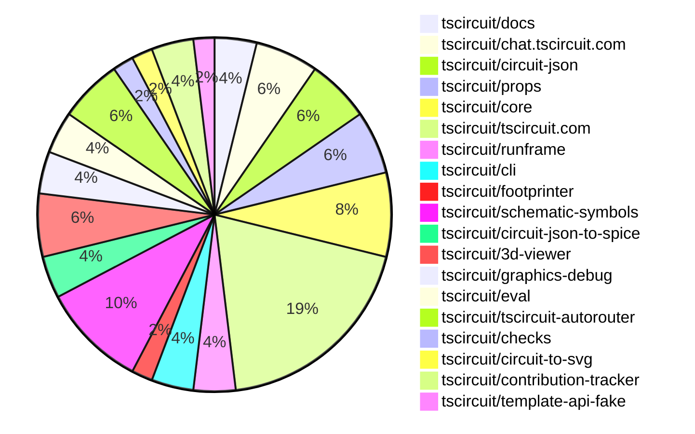

# contribution-tracker

Generates weekly contribution overviews for tscircuit contributors. Check out all
the [contribution overviews here](./contribution-overviews/)

* All PRs in the tscircuit org are scanned/summarized via Claude Haiku
* Claude classifies each Diff/PR as a Major, Minor or Tiny contribution
* All the PRs, summaries, and classifications are organized into charts and tables

The current week is shown below. There are 3 major sections:

* [Contributor Overview](#contributor-overview)
* [PRs by Repository](#prs-by-repository)
* [PRs by Contributor](#changes-by-contributor)

## Current Week

<!-- START_CURRENT_WEEK -->

# Contribution Overview 2025-05-14

## PRs by Repository

## Contributor Overview

| Contributor | 🐳 Major | 🐙 Minor | 🐌 Tiny | ⭐ | Issues Created | Discussion Contributions |
|-------------|---------|---------|---------|-----|----------------|--------------------------|
| [seveibar](#seveibar) | 0 | 9 | 6 | ⭐⭐⭐ | 11 | 0🔹 0🔶 0💎 |
| [imrishabh18](#imrishabh18) | 2 | 8 | 2 | ⭐⭐⭐ | 4 | 0🔹 0🔶 0💎 |
| [ArnavK-09](#ArnavK-09) | 3 | 4 | 0 | ⭐⭐ | 4 | 0🔹 0🔶 0💎 |
| [techmannih](#techmannih) | 0 | 6 | 1 | ⭐⭐ | 8 | 0🔹 0🔶 0💎 |
| [ShiboSoftwareDev](#ShiboSoftwareDev) | 2 | 3 | 0 | ⭐⭐ | 14 | 0🔹 0🔶 0💎 |
| [Anshgrover23](#Anshgrover23) | 0 | 2 | 0 | ⭐ | 2 | 1🔹 0🔶 0💎 |
| [Abse2001](#Abse2001) | 0 | 4 | 0 | ⭐ | 2 | 0🔹 0🔶 0💎 |
| [ianzone](#ianzone) | 0 | 0 | 0 | ⭐ | 0 | 2🔹 0🔶 0💎 |

### Discussion Contribution Legend

- 🔹 Participating: Basic participation with minimal effort
- 🔶 Very Active: Thoughtful participation that adds value
- 💎 Extremely Active: Exceptional participation with high-quality content

## Review Table

[reviews-received-hover]: ## "Number of reviews received for PRs for this contributor"
[approvals-received-hover]: ## "Number of approvals received for PRs this contributor authored"
[rejections-received-hover]: ## "Number of rejections received for PRs this contributor authored"
[prs-opened-hover]: ## "Number of PRs opened by this contributor"
[issues-created-hover]: ## "Number of issues created by this contributor"
[bountied-issues-hover]: ## "Number of issues this contributor created with a bounty"
[bountied-issue-$-hover]: ## "Total bounty amount placed on issues authored by this contributor"

| Contributor | Reviews Received | Approvals Received | Rejections Received | Approvals | Rejections | PRs Opened | PRs Merged | Issues Created | Bountied Issues | Bountied Issue $ |
|---|---|---|---|---|---|---|---|---|---|---|
| [imrishabh18](#imrishabh18) | 14 | 7 | 0 | 5 | 0 | 12 | 12 | 4 | 2 | 10 |
| [seveibar](#seveibar) | 2 | 0 | 0 | 30 | 0 | 17 | 15 | 11 | 3 | 120 |
| [techmannih](#techmannih) | 26 | 10 | 3 | 1 | 0 | 14 | 7 | 8 | 1 | 10 |
| [Abse2001](#Abse2001) | 8 | 5 | 0 | 0 | 0 | 6 | 4 | 2 | 0 | 0 |
| [ShiboSoftwareDev](#ShiboSoftwareDev) | 8 | 5 | 0 | 0 | 0 | 7 | 5 | 14 | 0 | 0 |
| [graphite-app[bot]](#graphite-app[bot]) | 0 | 0 | 0 | 0 | 0 | 0 | 0 | 0 | 0 | 0 |
| [ArnavK-09](#ArnavK-09) | 27 | 10 | 1 | 0 | 0 | 11 | 8 | 4 | 0 | 0 |
| [Anshgrover23](#Anshgrover23) | 3 | 2 | 0 | 3 | 3 | 2 | 2 | 2 | 0 | 0 |
| [MustafaMulla29](#MustafaMulla29) | 0 | 0 | 0 | 0 | 1 | 1 | 0 | 7 | 0 | 0 |
| [tscircuitbot](#tscircuitbot) | 0 | 0 | 0 | 0 | 0 | 8 | 0 | 0 | 0 | 0 |
| [ianzone](#ianzone) | 0 | 0 | 0 | 0 | 0 | 0 | 0 | 0 | 0 | 0 |

## Changes by Repository

### [tscircuit/docs](https://github.com/tscircuit/docs)

| PR # | Impact | Contributor | Description | Milestone Aligned |
|------|--------|-------------|-------------|-------------------|
| [#54](https://github.com/tscircuit/docs/pull/54) | 🐳 Major | imrishabh18 | Added support for previewing multiple files in the circuit preview component. | ✅ |
| [#53](https://github.com/tscircuit/docs/pull/53) | 🐌 Tiny | seveibar | This pull request adds documentation on how to report autorouter bugs in the tscircuit interface and how to simulate the bug using the autorouting debugger. | ✅ |

### [tscircuit/chat.tscircuit.com](https://github.com/tscircuit/chat.tscircuit.com)

| PR # | Impact | Contributor | Description | Milestone Aligned |
|------|--------|-------------|-------------|-------------------|
| [#20](https://github.com/tscircuit/chat.tscircuit.com/pull/20) | 🐳 Major | imrishabh18 | Fix broken chat by supporting GitHub login | ❌ |
| [#21](https://github.com/tscircuit/chat.tscircuit.com/pull/21) | 🐙 Minor | imrishabh18 | Fix a callback hook in the authentication flow. | ❌ |
| [#22](https://github.com/tscircuit/chat.tscircuit.com/pull/22) | 🐌 Tiny | imrishabh18 | The pull request adds a new file `authentication-flow.md` that contains a Mermaid sequence diagram describing the authentication flow for the application. | ✅ |

### [tscircuit/circuit-json](https://github.com/tscircuit/circuit-json)

| PR # | Impact | Contributor | Description | Milestone Aligned |
|------|--------|-------------|-------------|-------------------|
| [#190](https://github.com/tscircuit/circuit-json/pull/190) | 🐙 Minor | imrishabh18 | Adds a new `schematic_group` type to the codebase. | ✅ |
| [#189](https://github.com/tscircuit/circuit-json/pull/189) | 🐙 Minor | techmannih | Adds a new type `PcbHolePillWithRectPad` for a PCB plated hole with a rectangular pad. | ✅ |
| [#188](https://github.com/tscircuit/circuit-json/pull/188) | 🐌 Tiny | seveibar | Add links to source in README generation | ✅ |

### [tscircuit/props](https://github.com/tscircuit/props)

| PR # | Impact | Contributor | Description | Milestone Aligned |
|------|--------|-------------|-------------|-------------------|
| [#231](https://github.com/tscircuit/props/pull/231) | 🐙 Minor | imrishabh18 | Add manual edit events for group | ✅ |
| [#228](https://github.com/tscircuit/props/pull/228) | 🐙 Minor | seveibar | Add support for `pinCompatibleVariants` for `chip` | ✅ |
| [#227](https://github.com/tscircuit/props/pull/227) | 🐌 Tiny | seveibar | This pull request updates the documentation generation workflow, which includes adding links to the props definitions in the README. | ❌ |

### [tscircuit/core](https://github.com/tscircuit/core)

| PR # | Impact | Contributor | Description | Milestone Aligned |
|------|--------|-------------|-------------|-------------------|
| [#799](https://github.com/tscircuit/core/pull/799) | 🐙 Minor | imrishabh18 | Add support for parent group's transformation | ✅ |
| [#804](https://github.com/tscircuit/core/pull/804) | 🐙 Minor | seveibar | Update the Autorouter to version 0.0.66 | ✅ |
| [#810](https://github.com/tscircuit/core/pull/810) | 🐙 Minor | Abse2001 | Fix the handling of the layers for SMT pads to ensure they are correctly flipped when necessary. | ✅ |
| [#803](https://github.com/tscircuit/core/pull/803) | 🐌 Tiny | seveibar | Update the timeout for the Bun test command in the GitHub Actions workflow. | ✅ |

### [tscircuit/tscircuit.com](https://github.com/tscircuit/tscircuit.com)

| PR # | Impact | Contributor | Description | Milestone Aligned |
|------|--------|-------------|-------------|-------------------|
| [#1112](https://github.com/tscircuit/tscircuit.com/pull/1112) | 🐳 Major | ArnavK-09 | The pull request adds search functionality and enhances the footer links. | ❌ |
| [#1071](https://github.com/tscircuit/tscircuit.com/pull/1071) | 🐳 Major | ArnavK-09 | Refactor the package filtering and sorting logic in the TrendingPage component. | ❌ |
| [#1115](https://github.com/tscircuit/tscircuit.com/pull/1115) | 🐙 Minor | imrishabh18 | The pull request changes the validation logic for the `order_quotes/create` API endpoint, removing the ability to provide both `circuit_json` and `package_release_id`, and instead requiring only `package_release_id`. | ❌ |
| [#1109](https://github.com/tscircuit/tscircuit.com/pull/1109) | 🐙 Minor | imrishabh18 | Fix the annoying dropdown visible on redirect | ✅ |
| [#1107](https://github.com/tscircuit/tscircuit.com/pull/1107) | 🐙 Minor | imrishabh18 | Fix flickering issue of OrderDialog because of MobileSidebar and update `@tscircuit/runframe` dependency | ✅ |
| [#1079](https://github.com/tscircuit/tscircuit.com/pull/1079) | 🐙 Minor | techmannih | Fixes an issue where the user is shown an error message when trying to import a JLCPCB part that has already been imported. | ✅ |
| [#1103](https://github.com/tscircuit/tscircuit.com/pull/1103) | 🐙 Minor | seveibar | Removes babel standalone, removes shiki extra deps, removes legacy code editor, and reduces bundle size from 42mb to 28mb. | ❌ |
| [#1111](https://github.com/tscircuit/tscircuit.com/pull/1111) | 🐙 Minor | ArnavK-09 | Fix for model not downloading in the download-gltf functionality. | ❌ |
| [#1106](https://github.com/tscircuit/tscircuit.com/pull/1106) | 🐌 Tiny | seveibar | Ensures that the registry token is set on the window object | ❌ |
| [#1105](https://github.com/tscircuit/tscircuit.com/pull/1105) | 🐌 Tiny | seveibar | Update the version of the `@tscircuit/runframe` dependency from `0.0.449` to `0.0.451`. | ✅ |

### [tscircuit/runframe](https://github.com/tscircuit/runframe)

| PR # | Impact | Contributor | Description | Milestone Aligned |
|------|--------|-------------|-------------|-------------------|
| [#606](https://github.com/tscircuit/runframe/pull/606) | 🐙 Minor | imrishabh18 | Modify the error message body to conform to a standard structure. | ❌ |
| [#581](https://github.com/tscircuit/runframe/pull/581) | 🐙 Minor | ArnavK-09 | Adds a new `cadViewerRef` and updates the integration with the CadViewer component in the CircuitJsonPreview component. | ✅ |

### [tscircuit/cli](https://github.com/tscircuit/cli)

| PR # | Impact | Contributor | Description | Milestone Aligned |
|------|--------|-------------|-------------|-------------------|
| [#199](https://github.com/tscircuit/cli/pull/199) | 🐙 Minor | ArnavK-09 | Updates CLI commands and descriptions to reflect package terminology instead of snippet. | ✅ |
| [#198](https://github.com/tscircuit/cli/pull/198) | 🐌 Tiny | imrishabh18 | Updates the README to reflect the change from "snippets" to "packages" in the CLI. | ✅ |

### [tscircuit/footprinter](https://github.com/tscircuit/footprinter)

| PR # | Impact | Contributor | Description | Milestone Aligned |
|------|--------|-------------|-------------|-------------------|
| [#266](https://github.com/tscircuit/footprinter/pull/266) | 🐙 Minor | techmannih | Add an electrolytic footprint to the project. | ✅ |

### [tscircuit/schematic-symbols](https://github.com/tscircuit/schematic-symbols)

| PR # | Impact | Contributor | Description | Milestone Aligned |
|------|--------|-------------|-------------|-------------------|
| [#274](https://github.com/tscircuit/schematic-symbols/pull/274) | 🐙 Minor | techmannih | Fix all variations for the LED symbol | ✅ |
| [#277](https://github.com/tscircuit/schematic-symbols/pull/277) | 🐙 Minor | techmannih | Adds support for the ferrite bead symbol | ❌ |
| [#279](https://github.com/tscircuit/schematic-symbols/pull/279) | 🐙 Minor | Abse2001 | Fixes the rotation of the resistor symbol. | ✅ |
| [#276](https://github.com/tscircuit/schematic-symbols/pull/276) | 🐙 Minor | Abse2001 | Adds a new schematic symbol for a small box resistor. | ✅ |
| [#272](https://github.com/tscircuit/schematic-symbols/pull/272) | 🐙 Minor | Abse2001 | Added a new zigzag resistor for the schSmall variant. | ❌ |

### [tscircuit/circuit-json-to-spice](https://github.com/tscircuit/circuit-json-to-spice)

| PR # | Impact | Contributor | Description | Milestone Aligned |
|------|--------|-------------|-------------|-------------------|
| [#3](https://github.com/tscircuit/circuit-json-to-spice/pull/3) | 🐙 Minor | techmannih | Add some important workflows for the project, including format check, publishing to npm, and running tests. | ✅ |
| [#2](https://github.com/tscircuit/circuit-json-to-spice/pull/2) | 🐙 Minor | Anshgrover23 | Add format and type check workflows for the project. | ✅ |

### [tscircuit/3d-viewer](https://github.com/tscircuit/3d-viewer)

| PR # | Impact | Contributor | Description | Milestone Aligned |
|------|--------|-------------|-------------|-------------------|
| [#275](https://github.com/tscircuit/3d-viewer/pull/275) | 🐳 Major | ShiboSoftwareDev | The pull request adds handling for silkscreen paths in the BoardGeomBuilder. | ✅ |
| [#278](https://github.com/tscircuit/3d-viewer/pull/278) | 🐙 Minor | ShiboSoftwareDev | Adjust the silkscreen text size to match the size used in the pcb-viewer. | ✅ |
| [#280](https://github.com/tscircuit/3d-viewer/pull/280) | 🐌 Tiny | techmannih | Deleting a test file in the source directory. | ✅ |

### [tscircuit/graphics-debug](https://github.com/tscircuit/graphics-debug)

| PR # | Impact | Contributor | Description | Milestone Aligned |
|------|--------|-------------|-------------|-------------------|
| [#56](https://github.com/tscircuit/graphics-debug/pull/56) | 🐙 Minor | seveibar | Add SVG Label Rendering Filtering + Rects and fixture | ❌ |
| [#55](https://github.com/tscircuit/graphics-debug/pull/55) | 🐙 Minor | seveibar | Adds a new `backgroundColor` option to the `toMatchGraphicsSvg` matcher. | ❌ |

### [tscircuit/eval](https://github.com/tscircuit/eval)

| PR # | Impact | Contributor | Description | Milestone Aligned |
|------|--------|-------------|-------------|-------------------|
| [#332](https://github.com/tscircuit/eval/pull/332) | 🐙 Minor | seveibar | Update capacity autorouter and core dependencies | ✅ |
| [#325](https://github.com/tscircuit/eval/pull/325) | 🐙 Minor | ShiboSoftwareDev | Update the version of the @tscircuit/core dependency from 0.0.404 to 0.0.406. | ✅ |

### [tscircuit/tscircuit-autorouter](https://github.com/tscircuit/tscircuit-autorouter)

| PR # | Impact | Contributor | Description | Milestone Aligned |
|------|--------|-------------|-------------|-------------------|
| [#127](https://github.com/tscircuit/tscircuit-autorouter/pull/127) | 🐙 Minor | seveibar | Fixes a bug report and improves the force calculation for endpoint using the nearest point on the segment. | ✅ |
| [#125](https://github.com/tscircuit/tscircuit-autorouter/pull/125) | 🐙 Minor | seveibar | The pull request adds a bug report feature and a script to download bug reports. | ✅ |
| [#123](https://github.com/tscircuit/tscircuit-autorouter/pull/123) | 🐙 Minor | seveibar | Fix a bug related to stitching in the JSON file. | ✅ |

### [tscircuit/checks](https://github.com/tscircuit/checks)

| PR # | Impact | Contributor | Description | Milestone Aligned |
|------|--------|-------------|-------------|-------------------|
| [#46](https://github.com/tscircuit/checks/pull/46) | 🐳 Major | ShiboSoftwareDev | Adds a DRC (Design Rule Check) to detect vias that are out of the board boundary. | ✅ |

### [tscircuit/circuit-to-svg](https://github.com/tscircuit/circuit-to-svg)

| PR # | Impact | Contributor | Description | Milestone Aligned |
|------|--------|-------------|-------------|-------------------|
| [#217](https://github.com/tscircuit/circuit-to-svg/pull/217) | 🐙 Minor | ShiboSoftwareDev | Adds the ability to control the alignment of silkscreen text labels on a PCB. | ✅ |

### [tscircuit/contribution-tracker](https://github.com/tscircuit/contribution-tracker)

| PR # | Impact | Contributor | Description | Milestone Aligned |
|------|--------|-------------|-------------|-------------------|
| [#131](https://github.com/tscircuit/contribution-tracker/pull/131) | 🐳 Major | ArnavK-09 | Refactors the issue creation metrics to include major issues and calculate contributor scores. | ✅ |
| [#130](https://github.com/tscircuit/contribution-tracker/pull/130) | 🐙 Minor | ArnavK-09 | Refactor impact assignment logic in PR analysis | ✅ |

### [tscircuit/template-api-fake](https://github.com/tscircuit/template-api-fake)

| PR # | Impact | Contributor | Description | Milestone Aligned |
|------|--------|-------------|-------------|-------------------|
| [#11](https://github.com/tscircuit/template-api-fake/pull/11) | 🐙 Minor | Anshgrover23 | Adds an example admin page at /_fake/admin that shows thing resources. | ❌ |

## Changes by Contributor

### [imrishabh18](https://github.com/imrishabh18)

| PR # | Impact | Description | Milestone Aligned |
|------|--------|-------------|-------------------|
| [#54](https://github.com/tscircuit/docs/pull/54) | 🐳 Major | Added support for previewing multiple files in the circuit preview component. | ✅ |
| [#20](https://github.com/tscircuit/chat.tscircuit.com/pull/20) | 🐳 Major | Fix broken chat by supporting GitHub login | ❌ |
| [#190](https://github.com/tscircuit/circuit-json/pull/190) | 🐙 Minor | Adds a new `schematic_group` type to the codebase. | ✅ |
| [#231](https://github.com/tscircuit/props/pull/231) | 🐙 Minor | Add manual edit events for group | ✅ |
| [#799](https://github.com/tscircuit/core/pull/799) | 🐙 Minor | Add support for parent group's transformation | ✅ |
| [#1115](https://github.com/tscircuit/tscircuit.com/pull/1115) | 🐙 Minor | The pull request changes the validation logic for the `order_quotes/create` API endpoint, removing the ability to provide both `circuit_json` and `package_release_id`, and instead requiring only `package_release_id`. | ❌ |
| [#1109](https://github.com/tscircuit/tscircuit.com/pull/1109) | 🐙 Minor | Fix the annoying dropdown visible on redirect | ✅ |
| [#1107](https://github.com/tscircuit/tscircuit.com/pull/1107) | 🐙 Minor | Fix flickering issue of OrderDialog because of MobileSidebar and update `@tscircuit/runframe` dependency | ✅ |
| [#606](https://github.com/tscircuit/runframe/pull/606) | 🐙 Minor | Modify the error message body to conform to a standard structure. | ❌ |
| [#21](https://github.com/tscircuit/chat.tscircuit.com/pull/21) | 🐙 Minor | Fix a callback hook in the authentication flow. | ❌ |
| [#198](https://github.com/tscircuit/cli/pull/198) | 🐌 Tiny | Updates the README to reflect the change from "snippets" to "packages" in the CLI. | ✅ |
| [#22](https://github.com/tscircuit/chat.tscircuit.com/pull/22) | 🐌 Tiny | The pull request adds a new file `authentication-flow.md` that contains a Mermaid sequence diagram describing the authentication flow for the application. | ✅ |

### [techmannih](https://github.com/techmannih)

| PR # | Impact | Description | Milestone Aligned |
|------|--------|-------------|-------------------|
| [#189](https://github.com/tscircuit/circuit-json/pull/189) | 🐙 Minor | Adds a new type `PcbHolePillWithRectPad` for a PCB plated hole with a rectangular pad. | ✅ |
| [#266](https://github.com/tscircuit/footprinter/pull/266) | 🐙 Minor | Add an electrolytic footprint to the project. | ✅ |
| [#274](https://github.com/tscircuit/schematic-symbols/pull/274) | 🐙 Minor | Fix all variations for the LED symbol | ✅ |
| [#277](https://github.com/tscircuit/schematic-symbols/pull/277) | 🐙 Minor | Adds support for the ferrite bead symbol | ❌ |
| [#1079](https://github.com/tscircuit/tscircuit.com/pull/1079) | 🐙 Minor | Fixes an issue where the user is shown an error message when trying to import a JLCPCB part that has already been imported. | ✅ |
| [#3](https://github.com/tscircuit/circuit-json-to-spice/pull/3) | 🐙 Minor | Add some important workflows for the project, including format check, publishing to npm, and running tests. | ✅ |
| [#280](https://github.com/tscircuit/3d-viewer/pull/280) | 🐌 Tiny | Deleting a test file in the source directory. | ✅ |

### [seveibar](https://github.com/seveibar)

| PR # | Impact | Description | Milestone Aligned |
|------|--------|-------------|-------------------|
| [#228](https://github.com/tscircuit/props/pull/228) | 🐙 Minor | Add support for `pinCompatibleVariants` for `chip` | ✅ |
| [#804](https://github.com/tscircuit/core/pull/804) | 🐙 Minor | Update the Autorouter to version 0.0.66 | ✅ |
| [#1103](https://github.com/tscircuit/tscircuit.com/pull/1103) | 🐙 Minor | Removes babel standalone, removes shiki extra deps, removes legacy code editor, and reduces bundle size from 42mb to 28mb. | ❌ |
| [#56](https://github.com/tscircuit/graphics-debug/pull/56) | 🐙 Minor | Add SVG Label Rendering Filtering + Rects and fixture | ❌ |
| [#55](https://github.com/tscircuit/graphics-debug/pull/55) | 🐙 Minor | Adds a new `backgroundColor` option to the `toMatchGraphicsSvg` matcher. | ❌ |
| [#332](https://github.com/tscircuit/eval/pull/332) | 🐙 Minor | Update capacity autorouter and core dependencies | ✅ |
| [#127](https://github.com/tscircuit/tscircuit-autorouter/pull/127) | 🐙 Minor | Fixes a bug report and improves the force calculation for endpoint using the nearest point on the segment. | ✅ |
| [#125](https://github.com/tscircuit/tscircuit-autorouter/pull/125) | 🐙 Minor | The pull request adds a bug report feature and a script to download bug reports. | ✅ |
| [#123](https://github.com/tscircuit/tscircuit-autorouter/pull/123) | 🐙 Minor | Fix a bug related to stitching in the JSON file. | ✅ |
| [#188](https://github.com/tscircuit/circuit-json/pull/188) | 🐌 Tiny | Add links to source in README generation | ✅ |
| [#227](https://github.com/tscircuit/props/pull/227) | 🐌 Tiny | This pull request updates the documentation generation workflow, which includes adding links to the props definitions in the README. | ❌ |
| [#803](https://github.com/tscircuit/core/pull/803) | 🐌 Tiny | Update the timeout for the Bun test command in the GitHub Actions workflow. | ✅ |
| [#1106](https://github.com/tscircuit/tscircuit.com/pull/1106) | 🐌 Tiny | Ensures that the registry token is set on the window object | ❌ |
| [#1105](https://github.com/tscircuit/tscircuit.com/pull/1105) | 🐌 Tiny | Update the version of the `@tscircuit/runframe` dependency from `0.0.449` to `0.0.451`. | ✅ |
| [#53](https://github.com/tscircuit/docs/pull/53) | 🐌 Tiny | This pull request adds documentation on how to report autorouter bugs in the tscircuit interface and how to simulate the bug using the autorouting debugger. | ✅ |

### [ShiboSoftwareDev](https://github.com/ShiboSoftwareDev)

| PR # | Impact | Description | Milestone Aligned |
|------|--------|-------------|-------------------|
| [#275](https://github.com/tscircuit/3d-viewer/pull/275) | 🐳 Major | The pull request adds handling for silkscreen paths in the BoardGeomBuilder. | ✅ |
| [#46](https://github.com/tscircuit/checks/pull/46) | 🐳 Major | Adds a DRC (Design Rule Check) to detect vias that are out of the board boundary. | ✅ |
| [#278](https://github.com/tscircuit/3d-viewer/pull/278) | 🐙 Minor | Adjust the silkscreen text size to match the size used in the pcb-viewer. | ✅ |
| [#217](https://github.com/tscircuit/circuit-to-svg/pull/217) | 🐙 Minor | Adds the ability to control the alignment of silkscreen text labels on a PCB. | ✅ |
| [#325](https://github.com/tscircuit/eval/pull/325) | 🐙 Minor | Update the version of the @tscircuit/core dependency from 0.0.404 to 0.0.406. | ✅ |

### [Abse2001](https://github.com/Abse2001)

| PR # | Impact | Description | Milestone Aligned |
|------|--------|-------------|-------------------|
| [#810](https://github.com/tscircuit/core/pull/810) | 🐙 Minor | Fix the handling of the layers for SMT pads to ensure they are correctly flipped when necessary. | ✅ |
| [#279](https://github.com/tscircuit/schematic-symbols/pull/279) | 🐙 Minor | Fixes the rotation of the resistor symbol. | ✅ |
| [#276](https://github.com/tscircuit/schematic-symbols/pull/276) | 🐙 Minor | Adds a new schematic symbol for a small box resistor. | ✅ |
| [#272](https://github.com/tscircuit/schematic-symbols/pull/272) | 🐙 Minor | Added a new zigzag resistor for the schSmall variant. | ❌ |

### [ArnavK-09](https://github.com/ArnavK-09)

| PR # | Impact | Description | Milestone Aligned |
|------|--------|-------------|-------------------|
| [#131](https://github.com/tscircuit/contribution-tracker/pull/131) | 🐳 Major | Refactors the issue creation metrics to include major issues and calculate contributor scores. | ✅ |
| [#1112](https://github.com/tscircuit/tscircuit.com/pull/1112) | 🐳 Major | The pull request adds search functionality and enhances the footer links. | ❌ |
| [#1071](https://github.com/tscircuit/tscircuit.com/pull/1071) | 🐳 Major | Refactor the package filtering and sorting logic in the TrendingPage component. | ❌ |
| [#130](https://github.com/tscircuit/contribution-tracker/pull/130) | 🐙 Minor | Refactor impact assignment logic in PR analysis | ✅ |
| [#1111](https://github.com/tscircuit/tscircuit.com/pull/1111) | 🐙 Minor | Fix for model not downloading in the download-gltf functionality. | ❌ |
| [#581](https://github.com/tscircuit/runframe/pull/581) | 🐙 Minor | Adds a new `cadViewerRef` and updates the integration with the CadViewer component in the CircuitJsonPreview component. | ✅ |
| [#199](https://github.com/tscircuit/cli/pull/199) | 🐙 Minor | Updates CLI commands and descriptions to reflect package terminology instead of snippet. | ✅ |

### [Anshgrover23](https://github.com/Anshgrover23)

| PR # | Impact | Description | Milestone Aligned |
|------|--------|-------------|-------------------|
| [#11](https://github.com/tscircuit/template-api-fake/pull/11) | 🐙 Minor | Adds an example admin page at /_fake/admin that shows thing resources. | ❌ |
| [#2](https://github.com/tscircuit/circuit-json-to-spice/pull/2) | 🐙 Minor | Add format and type check workflows for the project. | ✅ |

<!-- END_CURRENT_WEEK -->
